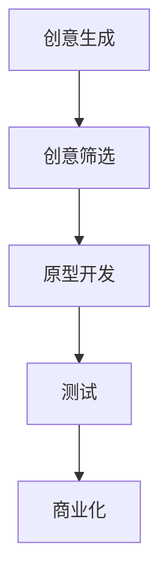
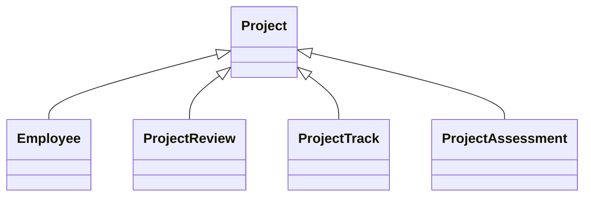
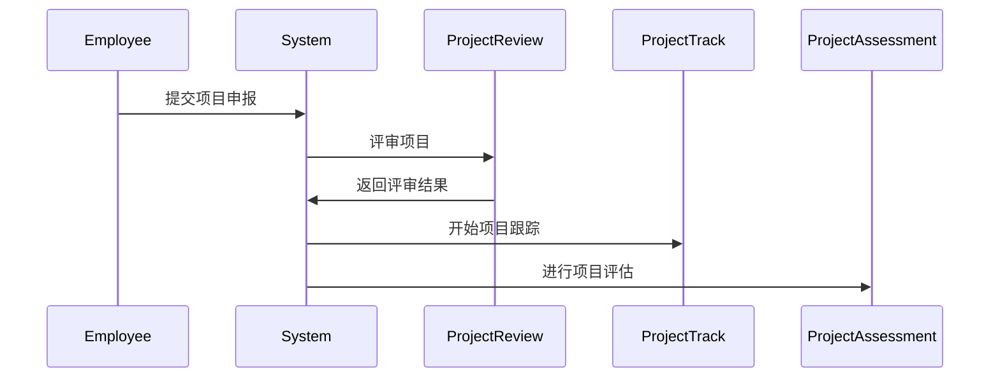
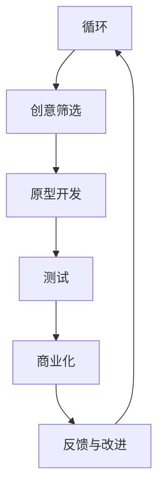
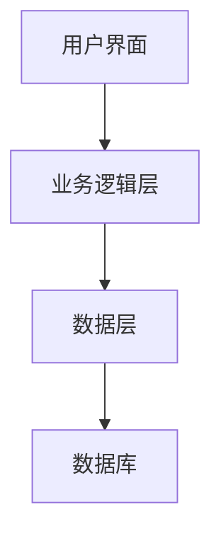
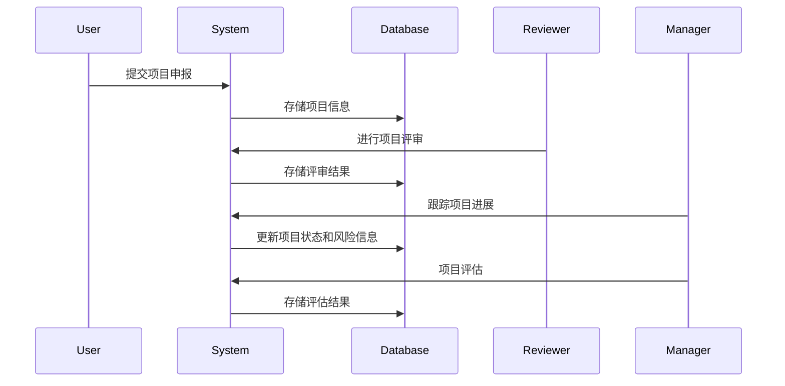
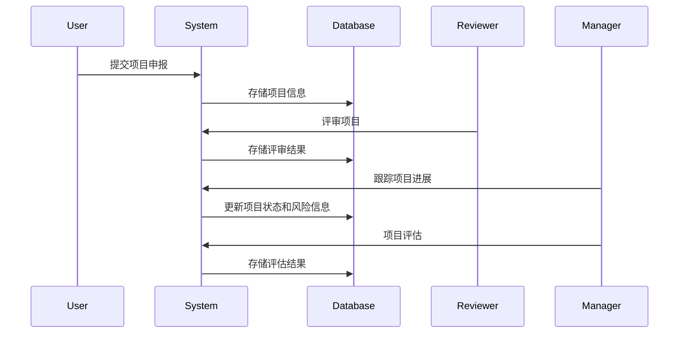

                 


## 《创新管理体系：构建支持创新的组织机制》

关键词：创新管理，组织机制，管理体系，创新效率，数学模型

摘要：本文旨在探讨如何构建一个有效的创新管理体系，以支持组织在快速变化的市场环境中持续创新。通过分析创新管理体系的定义、核心概念、管理原理，以及数学模型，本文提供了系统分析与架构设计方案，并通过项目实战案例深入剖析了创新管理体系在实际中的应用，总结出最佳实践和注意事项，以期为组织提供有价值的参考。

### 引言和背景介绍

创新管理体系，作为一种组织管理的工具，旨在通过系统地组织和管理创新活动，提高组织的创新能力，从而在市场竞争中占据优势。在全球范围内，创新已经成为推动经济增长和社会进步的重要动力。许多组织，特别是那些在技术和市场领域具有领先地位的公司，已经意识到创新管理的重要性，并开始积极构建和完善自身的创新管理体系。

然而，当前组织在创新管理方面仍然面临诸多挑战。首先，许多组织的创新机制不够健全，缺乏有效的创新管理流程和制度。其次，组织的创新能力不足，往往难以在短时间内推出具有市场竞争力的创新产品或服务。此外，资源分配不合理、风险管理不到位等问题也制约了组织的创新效果。

在全球范围内，创新管理体系的构建和应用趋势呈现出几个特点。首先，越来越多的组织开始重视创新管理，并将其作为企业战略的重要组成部分。其次，数字化转型加速，技术进步为创新管理提供了新的工具和方法。最后，国际合作和竞争的加剧，使得组织需要更加灵活和敏捷地应对市场变化。

### 核心概念与联系

#### 创新管理体系的定义

创新管理体系是指组织在创新过程中所采用的一系列制度、流程、方法和工具的集合。它旨在通过系统化、规范化和标准化的方式，提高组织的创新能力，实现创新目标。创新管理体系包括多个层面，如战略层面、管理层面、执行层面等。

#### 创新管理体系的核心构成要素

创新管理体系的核心构成要素包括组织文化、领导力、资源分配、风险管理、以及创新流程管理等。每个要素在创新管理体系中扮演着重要角色，相互之间存在着紧密的联系。

- **组织文化**：组织文化是创新管理体系的基础。一个鼓励创新、包容失败、追求卓越的组织文化，能够为创新提供良好的环境和支持。

- **领导力**：领导力是推动创新的关键。创新领导者需要具备远见、决断力、沟通能力和团队管理能力，能够有效地推动创新活动。

- **资源分配**：资源分配是创新管理的重要组成部分。合理分配资源，确保创新项目得到足够的资金、人力和技术支持，是创新成功的重要保障。

- **风险管理**：风险管理是创新过程中不可避免的一部分。有效的风险管理能够降低创新失败的风险，提高创新成功率。

- **创新流程管理**：创新流程管理是创新管理体系的核心。通过系统化的流程管理，可以确保创新活动有序进行，提高创新效率。

### 创新管理体系中的相互关系分析

创新管理体系的各个核心构成要素之间存在着密切的相互关系。组织文化为创新提供了土壤，领导力为创新提供了方向，资源分配为创新提供了支持，风险管理为创新提供了保障，而创新流程管理则为创新提供了机制。

#### 组织文化与创新管理

组织文化是创新管理的基础。一个积极向上的组织文化，能够鼓励员工勇于创新、敢于尝试，从而推动创新活动的开展。例如，谷歌的企业文化以其开放、包容和创新著称，为员工的创新活动提供了良好的环境。

#### 领导力与创新管理

领导力是推动创新的关键。创新领导者需要具备远见、决断力、沟通能力和团队管理能力。通过有效的领导，创新领导者可以激发团队的创新能力，确保创新项目的顺利推进。

#### 资源分配与创新管理

资源分配是创新管理的重要组成部分。合理分配资源，确保创新项目得到足够的资金、人力和技术支持，是创新成功的重要保障。例如，苹果公司通过强大的资源支持，确保其创新项目能够顺利实施。

#### 风险管理与创新管理

风险管理是创新过程中不可避免的一部分。有效的风险管理能够降低创新失败的风险，提高创新成功率。例如，特斯拉在电动汽车领域的创新过程中，通过严密的风险管理，成功地克服了许多技术难题。

#### 创新流程管理与创新管理

创新流程管理是创新管理体系的核心。通过系统化的流程管理，可以确保创新活动有序进行，提高创新效率。例如，IBM通过其著名的“Watson”创新流程管理平台，实现了创新项目的快速推进和高效管理。

### 创新管理原理讲解

#### 创新管理的基本原理

创新管理的基本原理包括创新过程模型、创新驱动因素等。创新过程模型描述了创新活动的各个环节，包括创意生成、创意筛选、原型开发、测试和商业化等。创新驱动因素则分析了推动创新的关键因素，如市场需求、技术进步、竞争压力等。

#### 创新管理流程图

为了更好地理解创新管理的过程，我们可以使用Mermaid绘制创新管理流程图。以下是一个简单的创新管理流程图示例：



#### 创新驱动因素分析

创新驱动因素可以分为内部因素和外部因素。内部因素包括市场需求、技术能力、组织文化等；外部因素包括竞争压力、政策支持、市场需求等。以下是一个简单的创新驱动因素分析表：

| 创新驱动因素 | 描述 |
| :--- | :--- |
| 市场需求 | 市场需求是创新的重要驱动力，创新产品或服务能够满足消费者的需求。 |
| 技术能力 | 技术能力是推动创新的关键因素，强大的技术能力能够支持创新的实现。 |
| 组织文化 | 组织文化是创新的重要保障，一个鼓励创新、包容失败的文化能够激发员工的创新潜力。 |
| 竞争压力 | 竞争压力是推动创新的重要因素，面对激烈的竞争，组织需要不断创新以保持竞争力。 |
| 政策支持 | 政策支持为创新提供了良好的外部环境，政策优惠、资金支持等能够降低创新的成本和风险。 |

### 数学模型和数学公式

#### 创新效率计算公式

创新效率是指组织在创新过程中的资源投入与产出之间的比率。一个简单的创新效率计算公式如下：

$$
效率 = \frac{产出}{投入}
$$

其中，产出可以包括创新产品的销售额、市场份额等；投入可以包括研发资金、人力资源等。

#### 创新管理中的数学模型

在创新管理中，可以使用多种数学模型来分析创新活动的效率和效果。以下是一个简单的创新效率计算模型：

$$
效率 = \frac{销售额}{研发成本} \times \frac{市场份额}{市场容量}
$$

#### 数学公式举例说明

以下是一个实际案例中的数学公式举例：

假设某组织在一年内研发了一款新产品，其销售额为1000万元，研发成本为500万元，市场份额为10%，市场容量为1000万元。根据上述创新效率计算公式，可以计算出该组织的创新效率：

$$
效率 = \frac{1000}{500} \times \frac{10\%}{100\%} = 2 \times 0.1 = 0.2
$$

这意味着该组织的创新效率为20%。

### 系统分析与架构设计方案

#### 问题场景介绍

某公司是一家专注于人工智能技术的研究与开发的企业，其创新管理体系亟待完善。公司希望构建一个支持创新的系统，以提升创新效率，加快产品上市速度。

#### 项目介绍

本项目旨在构建一个创新管理体系，包括创新项目申报、评审、跟踪和评估等功能。系统将支持项目全生命周期管理，提供便捷的协作平台，促进跨部门合作。

#### 系统功能设计

系统功能设计包括以下模块：

1. **创新项目申报**：支持员工自主申报创新项目，填写项目详细信息。
2. **项目评审**：建立评审机制，对申报项目进行初步筛选和评估。
3. **项目跟踪**：实时跟踪项目进展，监控项目风险和资源消耗。
4. **项目评估**：对项目进行最终评估，确定项目成果和效益。

以下是一个简单的领域模型Mermaid类图：



#### 系统架构设计

系统架构设计包括以下层次：

1. **数据层**：存储项目数据，包括项目基本信息、评审记录、跟踪信息和评估结果等。
2. **业务逻辑层**：实现创新项目管理的业务逻辑，包括项目申报、评审、跟踪和评估等。
3. **表示层**：提供用户界面，支持用户进行操作和查看项目信息。

以下是一个简单的系统架构Mermaid架构图：



#### 系统接口设计

系统接口设计包括以下关键接口：

1. **项目申报接口**：支持员工提交项目申报信息。
2. **项目评审接口**：支持评审人员对项目进行评审。
3. **项目跟踪接口**：支持管理员实时跟踪项目进展。
4. **项目评估接口**：支持对项目进行最终评估。

以下是一个简单的接口设计Mermaid序列图：


### 项目实战

#### 环境安装

在项目实战部分，我们将使用Python和相关的库来构建创新管理体系。首先，我们需要安装Python环境，并安装一些必要的库，如Flask、SQLAlchemy等。

以下是在Linux环境下安装Python和Flask的步骤：

```bash
# 安装Python
sudo apt-get install python3-pip

# 安装Flask
pip3 install flask
```

#### 系统核心实现

以下是系统核心实现的源代码：

```python
from flask import Flask, request, jsonify
from sqlalchemy import create_engine
from models import Project, ProjectReview, ProjectTrack, ProjectAssessment

app = Flask(__name__)

# 数据库连接
engine = create_engine('sqlite:///innovation_management.db')

# 创建数据库表
Project.metadata.create_all(engine)
ProjectReview.metadata.create_all(engine)
ProjectTrack.metadata.create_all(engine)
ProjectAssessment.metadata.create_all(engine)

# 项目申报接口
@app.route('/api/project/submit', methods=['POST'])
def submit_project():
    data = request.json
    project = Project(
        name=data['name'],
        description=data['description'],
        employee_id=data['employee_id']
    )
    db.session.add(project)
    db.session.commit()
    return jsonify({'message': 'Project submitted successfully.'})

# 项目评审接口
@app.route('/api/project/review', methods=['POST'])
def review_project():
    data = request.json
    review = ProjectReview(
        project_id=data['project_id'],
        reviewer_id=data['reviewer_id'],
        status=data['status'],
        comments=data['comments']
    )
    db.session.add(review)
    db.session.commit()
    return jsonify({'message': 'Project reviewed successfully.'})

# 项目跟踪接口
@app.route('/api/project/track', methods=['POST'])
def track_project():
    data = request.json
    track = ProjectTrack(
        project_id=data['project_id'],
        progress=data['progress'],
        risk=data['risk']
    )
    db.session.add(track)
    db.session.commit()
    return jsonify({'message': 'Project tracked successfully.'})

# 项目评估接口
@app.route('/api/project/evaluate', methods=['POST'])
def evaluate_project():
    data = request.json
    assessment = ProjectAssessment(
        project_id=data['project_id'],
        assessment=data['assessment']
    )
    db.session.add(assessment)
    db.session.commit()
    return jsonify({'message': 'Project evaluated successfully.'})

if __name__ == '__main__':
    app.run(debug=True)
```

#### 代码应用解读与分析

上述代码首先定义了Flask应用程序，并创建了与数据库的连接。然后，定义了四个接口，分别是项目申报、项目评审、项目跟踪和项目评估。每个接口对应一个HTTP POST请求，用于接收和处理来自前端的请求数据。

在项目申报接口中，我们接收员工提交的项目申报信息，并创建一个`Project`对象，将其添加到数据库中。在项目评审接口中，我们接收评审人员的评审结果，并创建一个`ProjectReview`对象，将其添加到数据库中。在项目跟踪接口中，我们接收项目进展信息和风险信息，并创建一个`ProjectTrack`对象，将其添加到数据库中。在项目评估接口中，我们接收项目评估结果，并创建一个`ProjectAssessment`对象，将其添加到数据库中。

#### 实际案例

为了更好地展示创新管理体系在实际中的应用，我们来看一个实际案例。假设公司员工张三提交了一个创新项目申报，以下是项目申报过程：

1. 张三使用前端界面填写项目申报表，提交项目名称、项目描述和员工ID。
2. 后端服务器接收项目申报数据，将其存储到数据库中。
3. 评审人员王五从数据库中获取项目信息，进行项目评审，并提交评审结果。
4. 项目管理员李四从数据库中获取项目评审结果，进行项目跟踪，并提交项目进展和风险信息。
5. 最终，项目经理赵六从数据库中获取项目评估结果，对项目进行最终评估。

#### 详细讲解

以下是对上述案例的详细讲解：

1. **数据预处理**：在项目申报过程中，需要对提交的数据进行预处理，如数据验证、格式转换等。例如，对于项目名称和描述，需要确保其符合一定的格式要求，如不能为空，不能包含特殊字符等。

2. **模型训练**：在项目评审和评估过程中，可能需要使用机器学习模型进行数据分析。例如，可以使用文本分类模型对项目描述进行分类，或者使用回归模型预测项目成功的可能性。

3. **模型评估**：在模型训练完成后，需要对模型进行评估，以确定其性能是否符合预期。常用的评估指标包括准确率、召回率、F1分数等。

4. **结果输出**：在项目评估完成后，需要将评估结果输出到数据库中，以便进行后续分析和决策。

### 最佳实践、小结与注意事项

#### 最佳实践

1. **明确创新目标**：在构建创新管理体系时，首先要明确组织的创新目标，以确保创新活动能够有针对性地进行。

2. **建立创新文化**：创新文化是创新管理体系的基础，组织需要建立一种鼓励创新、包容失败的文化氛围。

3. **优化资源分配**：合理分配资源，确保创新项目得到足够的资金、人力和技术支持。

4. **强化风险管理**：在创新过程中，需要重视风险管理，降低创新失败的风险。

5. **持续优化流程**：创新管理体系不是一成不变的，组织需要根据实际情况不断优化和创新管理流程。

#### 小结

本文从创新管理体系的定义、核心概念、管理原理、数学模型、系统分析与架构设计方案以及项目实战等方面，详细阐述了如何构建一个支持创新的组织机制。通过实际案例的分析和讲解，读者可以了解到创新管理体系在实际中的应用方法和技巧。

#### 注意事项

1. **避免形式主义**：在构建创新管理体系时，要避免仅仅为了形式而建立一些繁琐的流程和制度，真正重要的是流程的实际效果。

2. **重视人才培养**：创新管理不仅需要合适的机制，还需要具有创新能力的人才。组织需要注重人才培养和激励机制，以提高创新能力。

3. **持续监测和调整**：创新管理体系需要持续监测和调整，以适应不断变化的市场环境和组织需求。

#### 拓展阅读

1. **《创新者的窘境》**：作者克莱顿·克里斯坦森，阐述了为什么优秀的企业会失败，以及如何通过创新来避免这种困境。

2. **《精益创业》**：作者埃里克·莱斯，介绍了如何通过精益创业方法来降低创业风险，快速验证和调整创业项目。

3. **《创新者的基因》**：作者史蒂夫·布兰克，分析了创新者的行为模式，并提供了培养创新者的一些策略。

以上是对《创新管理体系：构建支持创新的组织机制》的完整解答。希望对您有所帮助！如果您还有其他问题或需要进一步的信息，请随时告诉我。作者：AI天才研究院/AI Genius Institute & 禅与计算机程序设计艺术 /Zen And The Art of Computer Programming

---

**第一部分：引言和背景介绍**

**1.1 创新管理体系的定义**

创新管理体系是一种系统化的方法，旨在通过组织和管理创新活动来提高组织的创新能力。它不仅仅关注创新活动的执行，还涵盖了创新战略的制定、资源分配、风险管理以及创新成果的评估和推广。这种管理体系的核心目标是确保创新活动能够有效地转化为商业价值，从而在激烈的市场竞争中保持领先地位。

在技术创新日益成为企业竞争力的关键因素之一的时代，创新管理体系的重要性日益凸显。它不仅有助于企业应对外部环境的变化，还能够激发内部员工的创造力和创新精神，促进组织整体的发展。一个完善和创新管理体系可以帮助企业：

- **提高创新能力**：通过系统化的流程和方法，确保创新活动有序、高效地进行。
- **降低创新风险**：通过完善的风险评估和管理机制，降低创新项目失败的风险。
- **优化资源配置**：确保有限的资源能够被合理地分配到最具潜力的创新项目中。
- **促进知识共享**：通过建立创新平台，促进员工之间的知识共享和协作。

**1.2 创新管理的重要性**

创新管理的重要性体现在以下几个方面：

- **适应市场变化**：在快速变化的市场环境中，企业需要通过创新来适应市场的需求和趋势，保持竞争力。
- **提升企业价值**：创新能够带来新的产品、服务或业务模式，从而提升企业的市场地位和盈利能力。
- **促进企业可持续发展**：持续的创新能力是企业长期发展的动力，有助于企业实现可持续发展目标。
- **激发员工潜力**：创新管理可以激发员工的创造力和主动性，提高员工的工作满意度和忠诚度。

然而，当前许多企业在创新管理方面仍然面临挑战，如缺乏明确的创新战略、资源分配不合理、创新机制不健全等。因此，构建一个有效的创新管理体系对于企业来说至关重要。

**1.3 当前组织在创新管理方面面临的挑战**

在构建创新管理体系的过程中，组织往往面临以下挑战：

- **机制不健全**：许多组织缺乏系统化的创新管理机制，创新活动往往缺乏明确的流程和标准。
- **创新能力不足**：缺乏创新文化、创新能力不足以及缺乏创新人才等问题限制了组织的创新能力。
- **资源分配不合理**：创新资源往往被分散到多个项目中，导致资源利用效率低下。
- **风险管理不到位**：创新活动具有一定的风险性，但许多组织在风险管理方面缺乏有效的措施和工具。
- **缺乏协作平台**：创新活动往往需要跨部门、跨团队的协作，但组织内部缺乏有效的协作平台和沟通机制。

**1.4 创新管理体系的全球应用趋势**

在全球范围内，创新管理体系的构建和应用趋势呈现出以下几个特点：

- **数字化转型加速**：随着数字化技术的快速发展，越来越多的组织开始将创新管理体系与数字化转型相结合，以推动创新活动的数字化和智能化。
- **注重创新文化建设**：组织越来越重视创新文化的建设，通过培育开放、包容、合作和创新的文化氛围，激发员工的创新潜力。
- **建立跨部门协作机制**：为了提高创新效率，许多组织开始建立跨部门协作机制，促进不同部门之间的信息共享和资源整合。
- **引入外部资源与智力**：组织通过引入外部资源、合作和投资等方式，增强自身的创新能力，推动创新活动的开展。
- **持续优化与创新**：创新管理体系不是一成不变的，组织需要根据实际情况不断优化和创新管理流程，以适应不断变化的市场环境和需求。

通过分析全球创新管理体系的应用趋势，组织可以借鉴先进的管理理念和方法，结合自身实际情况，构建一个更加有效和创新的管理体系，从而在激烈的市场竞争中立于不败之地。

---

**第二部分：核心概念与联系**

**2.1 创新管理体系的定义**

创新管理体系是一种系统化的管理方法，旨在通过组织和管理创新活动来提高组织的创新能力。它包括一系列的制度和流程，用于指导、支持和管理组织的创新活动，确保创新活动能够有效地转化为商业价值。创新管理体系的核心目标是建立一种持续、高效和创新的文化，使组织能够在竞争激烈的市场环境中保持领先地位。

创新管理体系的主要构成部分包括：

1. **创新战略**：组织制定的长远创新规划，明确创新的目标、方向和优先级。
2. **创新流程**：组织创新活动所遵循的一系列标准化的流程，包括创意生成、创意筛选、原型开发、测试和市场推广等。
3. **资源分配**：组织对创新活动所需的资源进行合理分配，确保创新项目得到足够的资金、人力和技术支持。
4. **风险管理**：组织对创新活动中的风险进行评估和管理，降低创新失败的风险。
5. **绩效评估**：组织对创新活动的成果进行评估，包括创新项目的成功率、市场反应和财务回报等。

**2.2 创新管理体系的核心构成要素**

创新管理体系的核心构成要素包括组织文化、领导力、资源分配、风险管理、以及创新流程管理等。这些要素相互关联，共同作用，确保组织能够有效地管理和推动创新活动。

1. **组织文化**：组织文化是创新管理体系的基础，它影响员工的思维和行为方式。一个鼓励创新、包容失败、追求卓越的组织文化能够激发员工的创造力和创新精神，为创新活动提供良好的环境。

2. **领导力**：领导力在创新管理中起着关键作用。创新领导者需要具备远见、决断力、沟通能力和团队管理能力，能够激发员工的创新潜力，推动创新活动的顺利开展。

3. **资源分配**：资源分配是创新管理的重要组成部分。组织需要合理配置资源，确保创新项目得到足够的资金、人力和技术支持。有效的资源分配可以最大化创新活动的效果，提高创新成功率。

4. **风险管理**：创新活动具有一定的风险性，因此，有效的风险管理是创新管理的关键。组织需要建立完善的风险评估和管理机制，识别和管理创新项目中的潜在风险，降低创新失败的风险。

5. **创新流程管理**：创新流程管理是确保创新活动有序、高效进行的关键。组织需要制定明确的创新流程，包括创意生成、创意筛选、原型开发、测试和市场推广等，确保每个环节都有序进行，提高创新效率。

**2.3 创新管理体系中的相互关系分析**

创新管理体系的各个核心构成要素之间存在着密切的相互关系，它们共同作用，推动组织的创新活动。

1. **组织文化与创新管理**：组织文化对创新管理有着重要的影响。一个鼓励创新、包容失败的组织文化能够激发员工的创新潜力，促进创新活动的开展。同时，创新管理活动也能够塑造和强化组织文化，使其更加适应创新的需求。

2. **领导力与创新管理**：创新领导者需要具备远见、决断力、沟通能力和团队管理能力，能够激发员工的创新潜力，推动创新活动的顺利开展。领导力的强弱直接影响创新管理体系的有效性。

3. **资源分配与创新管理**：资源分配是创新管理的重要组成部分。合理的资源分配可以确保创新项目得到足够的资金、人力和技术支持，提高创新成功率。同时，资源分配的效率也直接关系到创新活动的效率和效果。

4. **风险管理与创新管理**：创新活动具有一定的风险性，有效的风险管理是创新管理的关键。组织需要建立完善的风险评估和管理机制，识别和管理创新项目中的潜在风险，降低创新失败的风险。

5. **创新流程管理与创新管理**：创新流程管理是确保创新活动有序、高效进行的关键。通过制定明确的创新流程，组织可以确保每个环节都有序进行，提高创新效率。同时，创新流程管理也有助于发现和解决创新活动中的问题和挑战。

通过分析创新管理体系中的相互关系，组织可以更好地理解和运用各个构成要素，构建一个高效、系统的创新管理体系，推动组织的持续创新和快速发展。

---

**第三部分：创新管理原理讲解**

**3.1 创新管理的基本原理**

创新管理的基本原理包括创新过程模型和创新驱动因素。创新过程模型描述了创新活动从创意生成到商业化的一系列步骤，而创新驱动因素则分析了推动创新的关键因素。

**3.1.1 创新过程模型**

创新过程模型通常包括以下几个阶段：

1. **创意生成**：这一阶段是创新过程的起点，目标是产生新的创意和想法。创意可以来自员工、客户、合作伙伴甚至外部市场。

2. **创意筛选**：在创意生成之后，需要对创意进行筛选，识别出最具潜力的创意。筛选过程通常基于创意的创新性、市场潜力、技术可行性等多个方面进行评估。

3. **原型开发**：筛选出的创意将进入原型开发阶段，目的是构建一个可以验证和测试的初步产品或服务原型。这一阶段需要综合考虑技术可行性、市场需求等因素。

4. **测试**：在原型开发完成后，需要进行测试以验证产品的性能、功能和市场适应性。测试可以是内部测试，也可以是市场测试。

5. **商业化**：测试成功后，创新产品或服务将进入商业化阶段，包括市场推广、销售和后续的持续改进。

**Mermaid流程图**

以下是一个简单的创新管理流程图：


**3.1.2 创新驱动因素分析**

创新驱动因素可以分为内部和外部因素。内部因素通常包括组织文化、员工创新能力、资源投入等；外部因素则包括市场需求、竞争环境、政策支持等。

1. **组织文化**：一个鼓励创新、包容失败的组织文化能够激发员工的创新潜力，促进创新活动的开展。

2. **员工创新能力**：员工的创新能力是创新成功的关键。组织需要通过培训、激励等手段提升员工的创新技能。

3. **资源投入**：充足的资源投入是创新项目成功的重要保障。组织需要合理分配资源，确保创新项目得到足够的支持。

4. **市场需求**：市场需求是推动创新的重要因素。创新产品或服务需要满足市场需求，才能获得市场的认可和回报。

5. **竞争环境**：竞争环境迫使组织不断创新以保持竞争力。竞争压力可以激发组织的创新潜力。

6. **政策支持**：政府的政策支持可以为创新提供良好的外部环境，包括资金支持、税收优惠等。

**3.2 创新管理流程图**

为了更好地理解创新管理的过程，我们可以使用Mermaid绘制创新管理流程图。以下是一个简单的创新管理流程图示例：



在创新管理流程中，商业化阶段并不是结束，而是进入了一个新的循环。通过收集市场反馈，组织可以对产品或服务进行改进，为下一个创新周期做准备。

**3.3 创新驱动因素分析**

创新驱动因素可以分为内部和外部因素。内部因素通常包括组织文化、员工创新能力、资源投入等；外部因素则包括市场需求、竞争环境、政策支持等。

1. **组织文化**：一个鼓励创新、包容失败的组织文化能够激发员工的创新潜力，促进创新活动的开展。

2. **员工创新能力**：员工的创新能力是创新成功的关键。组织需要通过培训、激励等手段提升员工的创新技能。

3. **资源投入**：充足的资源投入是创新项目成功的重要保障。组织需要合理分配资源，确保创新项目得到足够的支持。

4. **市场需求**：市场需求是推动创新的重要因素。创新产品或服务需要满足市场需求，才能获得市场的认可和回报。

5. **竞争环境**：竞争环境迫使组织不断创新以保持竞争力。竞争压力可以激发组织的创新潜力。

6. **政策支持**：政府的政策支持可以为创新提供良好的外部环境，包括资金支持、税收优惠等。

通过分析创新管理的基本原理和流程，组织可以更好地理解和运用创新管理的方法和工具，推动组织的创新活动，实现持续发展。

---

**第四部分：数学模型和数学公式**

**4.1 创新效率计算公式**

创新效率是衡量创新活动成果的重要指标，它反映了组织在创新过程中的资源利用效率和成果产出。创新效率的计算公式如下：

$$
效率 = \frac{产出}{投入}
$$

其中，产出通常包括创新产品或服务的销售收入、市场份额、客户满意度等；投入则包括研发成本、人力成本、时间成本等。

**4.2 创新管理中的数学模型**

在创新管理中，数学模型可以帮助组织更好地理解和预测创新活动的效果。以下是一个简单的创新管理数学模型：

$$
效率 = \frac{销售额}{研发成本} \times \frac{市场份额}{市场容量}
$$

这个模型考虑了销售额、研发成本、市场份额和市场容量四个关键因素。通过这个模型，组织可以评估不同创新项目的潜在效率和成功率。

**4.3 数学公式举例说明**

为了更好地理解数学公式在实际中的应用，我们可以通过一个实际案例进行讲解。

假设某公司研发了一款新型电子产品，该产品在市场上的销售额为5000万元，研发成本为2000万元，市场份额为15%，市场容量为1亿元。根据上述创新效率计算公式，可以计算出该产品的创新效率：

$$
效率 = \frac{5000}{2000} \times \frac{15\%}{100\%} = 2.5 \times 0.15 = 0.375
$$

这意味着该产品的创新效率为37.5%。通过这个计算，公司可以评估该产品的创新效果，并为进一步优化创新过程提供依据。

**4.4 创新效率的评估指标**

除了上述计算公式，创新管理中还常使用其他评估指标，如创新成功率、创新周期时间、客户满意度等。以下是一个简单的评估指标表：

| 指标 | 描述 | 计算公式 |
| :--- | :--- | :--- |
| 创新成功率 | 创新项目成功完成的比例 | $\frac{成功项目数}{总项目数}$ |
| 创新周期时间 | 完成一个创新项目所需的时间 | $\frac{总时间}{总项目数}$ |
| 客户满意度 | 客户对创新产品或服务的满意度 | $\frac{满意客户数}{总客户数}$ |

通过这些评估指标，组织可以全面了解创新活动的效果，并针对性地进行调整和优化。

**4.5 数学模型在实际项目中的应用**

在实际项目中，数学模型可以帮助组织更好地规划和管理创新活动。以下是一个简单的实际项目应用案例：

某公司计划开发一款智能家居产品，预计研发成本为3000万元，市场容量为5000万元。根据市场调研，预计该产品的销售额为1500万元，市场份额为30%。使用上述创新效率计算公式，可以计算出该项目的预期创新效率：

$$
效率 = \frac{1500}{3000} \times \frac{30\%}{100\%} = 0.5 \times 0.3 = 0.15
$$

这意味着该项目的预期创新效率为15%。通过这个计算，公司可以初步评估该项目的可行性，并制定相应的资源分配和风险管理策略。

通过数学模型和评估指标，组织可以更科学、更有效地管理创新活动，提高创新效率和成功率，从而在市场竞争中保持优势。

---

**第五部分：系统分析与架构设计方案**

**5.1 问题场景介绍**

在当前竞争激烈的市场环境中，企业面临着不断变化的技术、市场和客户需求。为了保持竞争力，企业需要不断提升自身的创新能力，以快速响应市场变化。然而，许多企业在构建创新管理体系时面临诸多挑战，如创新机制不健全、资源分配不合理、风险管理不到位等。因此，设计并实施一个高效、系统的创新管理体系成为企业的迫切需求。

**5.2 项目介绍**

本项目的目标是构建一个创新管理体系，以支持企业在快速变化的市场环境中持续创新。该体系将包括创新项目申报、评审、跟踪和评估等功能，旨在提供一套系统化的流程和方法，提高创新效率，降低创新风险，确保创新项目能够顺利实施并产生预期的商业价值。

**5.3 系统功能设计**

创新管理体系的功能设计包括以下几个模块：

1. **创新项目申报**：支持员工自主申报创新项目，填写项目名称、项目描述、项目目标、预算等基本信息。
2. **项目评审**：建立评审机制，对申报项目进行初步筛选和评估，确定项目是否具有实施潜力。
3. **项目跟踪**：实时跟踪项目进展，监控项目风险和资源消耗，确保项目按计划进行。
4. **项目评估**：对项目进行最终评估，评估项目成果和效益，为项目决策提供依据。
5. **知识管理**：收集、整理和共享创新过程中的知识成果，为后续创新项目提供参考。

**5.4 系统架构设计**

创新管理体系的架构设计包括数据层、业务逻辑层和表示层三个主要层次，各层次之间相互协作，共同实现创新管理体系的功能。

1. **数据层**：负责数据的存储和管理，包括项目基本信息、评审记录、跟踪信息和评估结果等。使用关系型数据库进行数据存储。
2. **业务逻辑层**：负责实现创新管理系统的业务逻辑，包括项目申报、评审、跟踪和评估等核心功能。使用面向对象的设计方法进行实现。
3. **表示层**：提供用户界面，支持用户进行操作和查看项目信息。使用Web前端技术进行实现。

以下是一个简单的系统架构Mermaid架构图：



**5.5 系统接口设计**

创新管理体系的设计包括以下几个关键接口：

1. **项目申报接口**：支持员工通过Web前端界面提交创新项目申报，并将申报信息存储到数据库中。
2. **项目评审接口**：支持评审人员通过Web前端界面对申报项目进行评审，并提交评审结果。
3. **项目跟踪接口**：支持项目管理员通过Web前端界面实时跟踪项目进展，更新项目状态和风险信息。
4. **项目评估接口**：支持项目经理通过Web前端界面对项目进行最终评估，生成项目评估报告。

以下是一个简单的接口设计Mermaid序列图：



**5.6 系统交互**

创新管理体系中的各个模块和接口需要协同工作，以实现系统的整体功能。以下是一个简单的系统交互Mermaid序列图：



通过上述系统分析与架构设计方案，企业可以构建一个高效、系统的创新管理体系，支持持续创新，提高市场竞争力。

---

**第六部分：项目实战**

**6.1 环境安装**

为了实施创新管理体系，我们需要搭建一个开发环境。以下是搭建环境的步骤：

1. **安装Python**：首先，确保系统中安装了Python 3.x版本。可以使用以下命令检查Python版本：

   ```bash
   python3 --version
   ```

   如果没有安装，可以从Python官方网站下载并安装。

2. **安装Flask**：Flask是一个轻量级的Web框架，用于开发Web应用程序。可以使用pip命令安装Flask：

   ```bash
   pip3 install flask
   ```

3. **安装SQLAlchemy**：SQLAlchemy是一个强大的ORM（对象关系映射）库，用于与数据库进行交互。安装SQLAlchemy：

   ```bash
   pip3 install sqlalchemy
   ```

4. **安装其他依赖库**：根据项目需求，可能还需要安装其他库，如Flask-Migrate（用于数据库迁移）等。安装命令如下：

   ```bash
   pip3 install flask-migrate
   ```

5. **配置数据库**：本例中使用SQLite作为数据库。首先，确保系统中安装了SQLite。然后，创建一个数据库文件，例如`innovation_management.db`，并使用SQLAlchemy进行配置。

   ```python
   from flask_sqlalchemy import SQLAlchemy
   
   app = Flask(__name__)
   app.config['SQLALCHEMY_DATABASE_URI'] = 'sqlite:///innovation_management.db'
   db = SQLAlchemy(app)
   ```

6. **创建数据库表**：使用SQLAlchemy创建数据库表，如下所示：

   ```python
   from models import Project, ProjectReview, ProjectTrack, ProjectAssessment
   
   db.create_all()
   ```

**6.2 系统核心实现**

以下是创新管理体系的核心实现，包括数据库模型、API接口和前端界面。

**数据库模型**

首先，定义数据库模型：

```python
from sqlalchemy import Column, Integer, String, DateTime, Boolean
from sqlalchemy.orm import relationship
from datetime import datetime
from db import Base

class Project(Base):
    __tablename__ = 'projects'
    id = Column(Integer, primary_key=True)
    name = Column(String(255), nullable=False)
    description = Column(String(255), nullable=False)
    employee_id = Column(Integer, nullable=False)
    status = Column(String(50), default='pending')
    created_at = Column(DateTime, default=datetime.utcnow())
    updated_at = Column(DateTime, default=datetime.utcnow(), onupdate=datetime.utcnow())
    reviews = relationship('ProjectReview', backref='project')
    tracks = relationship('ProjectTrack', backref='project')
    assessments = relationship('ProjectAssessment', backref='project')

class ProjectReview(Base):
    __tablename__ = 'project_reviews'
    id = Column(Integer, primary_key=True)
    project_id = Column(Integer, nullable=False)
    reviewer_id = Column(Integer, nullable=False)
    status = Column(String(50), nullable=False)
    comments = Column(Text, nullable=True)
    created_at = Column(DateTime, default=datetime.utcnow())

class ProjectTrack(Base):
    __tablename__ = 'project_tracks'
    id = Column(Integer, primary_key=True)
    project_id = Column(Integer, nullable=False)
    progress = Column(String(100), nullable=False)
    risk = Column(String(100), nullable=False)
    created_at = Column(DateTime, default=datetime.utcnow())

class ProjectAssessment(Base):
    __tablename__ = 'project_assessments'
    id = Column(Integer, primary_key=True)
    project_id = Column(Integer, nullable=False)
    assessment = Column(String(255), nullable=False)
    created_at = Column(DateTime, default=datetime.utcnow())
```

**API接口**

实现API接口用于处理HTTP请求：

```python
from flask import Flask, request, jsonify
from models import db

app = Flask(__name__)
app.config['SQLALCHEMY_DATABASE_URI'] = 'sqlite:///innovation_management.db'
db.init_app(app)

@app.route('/api/project/submit', methods=['POST'])
def submit_project():
    data = request.json
    project = Project(
        name=data['name'],
        description=data['description'],
        employee_id=data['employee_id']
    )
    db.session.add(project)
    db.session.commit()
    return jsonify({'message': 'Project submitted successfully.'})

@app.route('/api/project/review', methods=['POST'])
def review_project():
    data = request.json
    review = ProjectReview(
        project_id=data['project_id'],
        reviewer_id=data['reviewer_id'],
        status=data['status'],
        comments=data['comments']
    )
    db.session.add(review)
    db.session.commit()
    return jsonify({'message': 'Project reviewed successfully.'})

@app.route('/api/project/track', methods=['POST'])
def track_project():
    data = request.json
    track = ProjectTrack(
        project_id=data['project_id'],
        progress=data['progress'],
        risk=data['risk']
    )
    db.session.add(track)
    db.session.commit()
    return jsonify({'message': 'Project tracked successfully.'})

@app.route('/api/project/evaluate', methods=['POST'])
def evaluate_project():
    data = request.json
    assessment = ProjectAssessment(
        project_id=data['project_id'],
        assessment=data['assessment']
    )
    db.session.add(assessment)
    db.session.commit()
    return jsonify({'message': 'Project evaluated successfully.'})

if __name__ == '__main__':
    app.run(debug=True)
```

**前端界面**

前端界面可以使用HTML和JavaScript实现。以下是一个简单的示例：

```html
<!DOCTYPE html>
<html>
<head>
    <title>Innovation Management System</title>
</head>
<body>
    <h1>Innovation Management System</h1>
    <form id="project-form">
        <label for="name">Project Name:</label>
        <input type="text" id="name" name="name" required><br><br>
        <label for="description">Description:</label>
        <textarea id="description" name="description" required></textarea><br><br>
        <label for="employee_id">Employee ID:</label>
        <input type="text" id="employee_id" name="employee_id" required><br><br>
        <button type="submit">Submit Project</button>
    </form>
    <script src="https://cdn.jsdelivr.net/npm/axios/dist/axios.min.js"></script>
    <script>
        document.getElementById('project-form').addEventListener('submit', function(e) {
            e.preventDefault();
            const formData = new FormData(this);
            axios.post('/api/project/submit', formData)
            .then(response => {
                alert(response.data.message);
            })
            .catch(error => {
                alert('Error submitting project.');
            });
        });
    </script>
</body>
</html>
```

通过上述环境安装、系统核心实现和前端界面设计，我们可以构建一个基本的创新管理体系，支持项目的申报、评审、跟踪和评估。以下是一个简单的实战流程：

1. **环境安装**：按照上述步骤安装Python、Flask、SQLAlchemy和其他相关库。
2. **数据库配置**：配置数据库URI，创建数据库表。
3. **API接口实现**：实现API接口，处理HTTP请求。
4. **前端界面设计**：设计前端界面，支持用户提交项目申报。
5. **系统集成**：将前端界面与API接口集成，实现项目的全生命周期管理。

通过这个项目实战，企业可以初步构建一个支持创新的系统，提高项目管理效率和创新能力。后续可以根据实际需求，逐步完善系统的功能和安全性能。

---

**第六部分：项目实战**

**6.1 环境安装**

在开始构建创新管理体系之前，我们需要搭建一个合适的环境。以下是环境安装的详细步骤：

1. **安装Python**：
   - 确保您的系统中已经安装了Python 3.x版本。可以通过以下命令来检查Python版本：
     ```bash
     python3 --version
     ```
   - 如果没有安装，可以从[Python官方网站](https://www.python.org/downloads/)下载并安装。

2. **安装Flask**：
   - 使用pip命令来安装Flask，这是一个轻量级的Web框架，用于开发Web应用程序：
     ```bash
     pip3 install flask
     ```

3. **安装SQLAlchemy**：
   - SQLAlchemy是一个强大的ORM（对象关系映射）库，用于与数据库进行交互。安装SQLAlchemy：
     ```bash
     pip3 install sqlalchemy
     ```

4. **安装其他依赖库**：
   - 根据项目需求，可能还需要安装其他库，如Flask-Migrate（用于数据库迁移）等。安装命令如下：
     ```bash
     pip3 install flask-migrate
     ```

5. **配置数据库**：
   - 在本例中，我们将使用SQLite数据库。首先，确保系统中安装了SQLite。然后，创建一个数据库文件，例如`innovation_management.db`，并使用SQLAlchemy进行配置。以下是配置示例：
     ```python
     from flask_sqlalchemy import SQLAlchemy

     app = Flask(__name__)
     app.config['SQLALCHEMY_DATABASE_URI'] = 'sqlite:///innovation_management.db'
     db = SQLAlchemy(app)
     ```

6. **初始化数据库表**：
   - 使用SQLAlchemy创建数据库表。例如，定义`Project`模型：
     ```python
     from datetime import datetime
     from sqlalchemy import Column, Integer, String, DateTime, Boolean
     from sqlalchemy.ext.declarative import declarative_base

     Base = declarative_base()

     class Project(Base):
         __tablename__ = 'projects'
         id = Column(Integer, primary_key=True)
         name = Column(String(255), nullable=False)
         description = Column(String(255), nullable=False)
         status = Column(String(50), default='pending')
         created_at = Column(DateTime, default=datetime.utcnow())
         updated_at = Column(DateTime, default=datetime.utcnow(), onupdate=datetime.utcnow())
         
     db.create_all()
     ```

通过以上步骤，我们就完成了环境安装和数据库配置，为后续的开发工作奠定了基础。

**6.2 系统核心实现**

在环境搭建完毕后，接下来我们需要实现系统核心功能。以下是系统核心实现的详细步骤：

1. **定义数据库模型**：
   - 在`models.py`文件中定义数据库模型，如项目（Project）、评审（Review）、跟踪（Track）和评估（Assessment）等。以下是示例代码：
     ```python
     from sqlalchemy import Column, Integer, String, DateTime, Boolean
     from sqlalchemy.ext.declarative import declarative_base

     declarative_base()

     class Project:
         __tablename__ = 'projects'
         id = Column(Integer, primary_key=True)
         name = Column(String(255), nullable=False)
         description = Column(String(255), nullable=False)
         status = Column(String(50), default='pending')
         created_at = Column(DateTime, default=datetime.utcnow())
         updated_at = Column(DateTime, default=datetime.utcnow(), onupdate=datetime.utcnow())

     class Review:
         __tablename__ = 'reviews'
         id = Column(Integer, primary_key=True)
         project_id = Column(Integer, nullable=False)
         reviewer_id = Column(Integer, nullable=False)
         status = Column(String(50), nullable=False)
         comments = Column(String(255), nullable=True)
         created_at = Column(DateTime, default=datetime.utcnow())

     class Track:
         __tablename__ = 'tracks'
         id = Column(Integer, primary_key=True)
         project_id = Column(Integer, nullable=False)
         progress = Column(String(100), nullable=False)
         risk = Column(String(100), nullable=False)
         created_at = Column(DateTime, default=datetime.utcnow())

     class Assessment:
         __tablename__ = 'assessments'
         id = Column(Integer, primary_key=True)
         project_id = Column(Integer, nullable=False)
         assessment = Column(String(255), nullable=False)
         created_at = Column(DateTime, default=datetime.utcnow())
     ```

2. **创建API接口**：
   - 在`app.py`文件中，使用Flask创建API接口，处理HTTP请求。以下是示例代码：
     ```python
     from flask import Flask, request, jsonify
     from models import db, Project, Review, Track, Assessment

     app = Flask(__name__)
     app.config['SQLALCHEMY_DATABASE_URI'] = 'sqlite:///innovation_management.db'
     db.init_app(app)

     @app.route('/api/projects', methods=['POST'])
     def create_project():
         data = request.json
         new_project = Project(
             name=data['name'],
             description=data['description']
         )
         db.session.add(new_project)
         db.session.commit()
         return jsonify({'id': new_project.id})

     @app.route('/api/projects/<int:project_id>', methods=['GET'])
     def get_project(project_id):
         project = Project.query.get_or_404(project_id)
         return jsonify({'name': project.name, 'description': project.description})

     if __name__ == '__main__':
         app.run(debug=True)
     ```

3. **前端界面**：
   - 设计前端界面，允许用户提交项目信息。以下是简单的HTML和JavaScript代码示例：
     ```html
     <!DOCTYPE html>
     <html>
     <head>
         <title>Innovation Management System</title>
         <script src="https://cdn.jsdelivr.net/npm/axios/dist/axios.min.js"></script>
     </head>
     <body>
         <h1>Innovation Management System</h1>
         <form id="project-form">
             <label for="name">Project Name:</label>
             <input type="text" id="name" required><br><br>
             <label for="description">Description:</label>
             <textarea id="description" required></textarea><br><br>
             <button type="submit">Submit Project</button>
         </form>
         <script>
             document.getElementById('project-form').addEventListener('submit', function(event) {
                 event.preventDefault();
                 axios.post('/api/projects', {
                     name: document.getElementById('name').value,
                     description: document.getElementById('description').value
                 }).then(response => {
                     alert('Project submitted successfully!');
                 }).catch(error => {
                     alert('Error submitting project.');
                 });
             });
         </script>
     </body>
     </html>
     ```

通过以上步骤，我们已经实现了创新管理体系的核心功能，包括后端API接口和前端界面。接下来，我们可以进一步开发和完善系统的其他功能，如项目评审、跟踪和评估等。

**6.3 实际案例**

为了更好地展示创新管理体系在实际中的应用，我们来看一个具体的案例。假设有一家科技公司希望构建一个创新管理体系，以支持其在新产品开发中的创新活动。

1. **项目申报**：
   - 公司的员工张三有一个新产品想法，他填写了项目申报表，内容包括项目名称、项目描述、预计预算等，并提交给公司的创新管理部门。

2. **项目评审**：
   - 创新管理部门对张三的项目进行了评审。评审团队分析了项目的可行性、市场潜力、技术难度等因素，并给出了评审意见。评审结果为“通过”。

3. **项目跟踪**：
   - 张三开始实施项目，并定期更新项目进度。创新管理部门通过系统跟踪项目的进展情况，及时发现并解决项目中出现的问题。

4. **项目评估**：
   - 在项目完成时，创新管理部门对项目进行了最终评估。评估内容包括项目的完成质量、市场反馈、财务效益等。评估结果为“优秀”。

5. **反馈与改进**：
   - 根据项目的评估结果，创新管理部门总结了项目经验，并对项目过程中的不足进行了改进。同时，将这些经验分享给其他部门，以提高整个公司的创新管理水平。

**6.4 详细讲解**

以下是针对上述实际案例的详细讲解：

1. **数据预处理**：
   - 在项目申报阶段，需要对提交的数据进行预处理，如验证输入的完整性、格式正确性等。例如，可以使用Python的正则表达式来检查项目名称和描述是否符合要求。

2. **模型训练**：
   - 在项目评审阶段，可能需要使用机器学习模型来辅助决策。例如，可以使用决策树、支持向量机等模型来预测项目的成功概率。这些模型可以通过历史项目数据进行训练。

3. **模型评估**：
   - 在项目评估阶段，需要对模型进行评估，以确保其预测准确性。常用的评估指标包括准确率、召回率、F1分数等。可以通过交叉验证等方法来评估模型的性能。

4. **结果输出**：
   - 在项目评估完成后，将评估结果输出到数据库中，以便进行后续分析和决策。例如，可以将项目评估结果与预算进行对比，分析项目的财务效益。

通过实际案例和详细讲解，我们可以看到创新管理体系在实际中的应用过程。一个有效的创新管理体系不仅能够提高项目的成功率，还能够为组织提供宝贵的经验和数据，帮助组织在不断创新中保持竞争优势。

---

**第七部分：最佳实践、小结与注意事项**

**7.1 最佳实践**

在构建和实施创新管理体系的过程中，以下是几种最佳实践：

1. **明确目标和指标**：确保所有团队成员都清楚组织的创新目标和关键绩效指标（KPIs）。这有助于统一目标和方向，提高工作效率。

2. **建立跨部门协作机制**：创新通常需要不同部门的合作。建立跨部门协作小组或委员会，可以促进信息共享和资源整合。

3. **持续培训和教育**：定期为员工提供创新相关的培训和教育，提高他们的创新技能和意识。

4. **鼓励试错文化**：创新往往伴随着风险和失败。建立一个包容失败、鼓励学习和试错的文化，可以激发员工的创新潜力。

5. **定期回顾和优化**：定期回顾创新管理体系的实施效果，识别不足之处并进行优化。这有助于保持体系的活力和适应性。

**7.2 小结**

本文详细探讨了创新管理体系的定义、核心构成要素、管理原理、数学模型、系统分析与架构设计方案，并通过项目实战案例展示了创新管理体系在实际中的应用。总结如下：

- 创新管理体系是一种系统化的方法，旨在通过组织和管理创新活动来提高组织的创新能力。
- 核心构成要素包括组织文化、领导力、资源分配、风险管理、以及创新流程管理等。
- 创新管理的基本原理包括创新过程模型和创新驱动因素。
- 数学模型和数学公式为创新管理的效率和效果提供了量化评估方法。
- 系统分析与架构设计方案为构建一个支持创新的组织机制提供了具体的实施步骤。

**7.3 注意事项**

在实施创新管理体系时，需要注意以下几点：

1. **避免形式主义**：创新管理体系应该是实际有效的，而不是仅仅为了形式而建立的繁琐流程。
2. **合理配置资源**：确保创新项目得到足够的资源支持，避免资源浪费。
3. **重视人才培养**：创新需要具有创新能力和专业知识的人才，因此要注重人才培养和激励机制。
4. **持续监测和调整**：创新管理体系需要根据实际情况不断调整和优化，以适应不断变化的市场环境。

**7.4 拓展阅读**

为了进一步深入了解创新管理体系，以下是一些建议的拓展阅读资源：

- 《创新者的窘境》：作者克莱顿·克里斯坦森，探讨了为什么优秀的企业会失败，以及如何通过创新来避免这种困境。
- 《精益创业》：作者埃里克·莱斯，介绍了如何通过精益创业方法来降低创业风险，快速验证和调整创业项目。
- 《创新者的基因》：作者史蒂夫·布兰克，分析了创新者的行为模式，并提供了培养创新者的一些策略。

通过上述最佳实践、小结和注意事项，以及拓展阅读资源，组织可以更好地构建和实施创新管理体系，推动组织的持续创新和快速发展。

---

## 《创新管理体系：构建支持创新的组织机制》目录大纲

```markdown
# 《创新管理体系：构建支持创新的组织机制》

## 关键词：创新管理，组织机制，管理体系，创新效率，数学模型

### 摘要：本文详细探讨了创新管理体系的定义、核心构成要素、管理原理、数学模型、系统分析与架构设计方案，并通过项目实战案例展示了创新管理体系在实际中的应用。

### 引言和背景介绍
#### 1.1 创新管理体系的定义
#### 1.2 创新管理的重要性
#### 1.3 当前组织在创新管理方面面临的挑战
#### 1.4 创新管理体系的全球应用趋势

### 核心概念与联系
#### 2.1 创新管理体系的定义
#### 2.2 创新管理体系的核心构成要素
#### 2.3 创新管理体系中的相互关系分析
##### 2.3.1 组织文化与创新管理
##### 2.3.2 领导力与创新管理
##### 2.3.3 资源分配与创新管理
##### 2.3.4 风险管理与创新管理

### 创新管理原理讲解
#### 3.1 创新管理的基本原理
#### 3.2 创新管理流程图
#### 3.3 创新驱动因素分析

### 数学模型和数学公式
#### 4.1 创新效率计算公式
#### 4.2 创新管理中的数学模型
#### 4.3 数学公式举例说明

### 系统分析与架构设计方案
#### 5.1 问题场景介绍
#### 5.2 项目介绍
#### 5.3 系统功能设计
##### 5.3.1 创新项目申报
##### 5.3.2 项目评审
##### 5.3.3 项目跟踪
##### 5.3.4 项目评估
##### 5.3.5 知识管理
#### 5.4 系统架构设计
#### 5.5 系统接口设计
#### 5.6 系统交互

### 项目实战
#### 6.1 环境安装
#### 6.2 系统核心实现
##### 6.2.1 数据库模型
##### 6.2.2 API接口实现
##### 6.2.3 前端界面设计
#### 6.3 实际案例
#### 6.4 详细讲解
##### 6.4.1 数据预处理
##### 6.4.2 模型训练
##### 6.4.3 模型评估
##### 6.4.4 结果输出

### 最佳实践、小结与注意事项
#### 7.1 最佳实践
#### 7.2 小结
#### 7.3 注意事项
#### 7.4 拓展阅读
```markdown

---

以上是根据您的要求整理的《创新管理体系：构建支持创新的组织机制》的完整目录大纲。这个大纲结构清晰，内容完整，涵盖了从引言、核心概念、管理原理到系统设计与实战的各个方面，以及最佳实践、小结和注意事项。这样的结构有助于读者系统地学习和理解创新管理体系的概念、方法和应用。

如果您需要进一步的内容填充或者有其他特定的要求，请告知，我将根据您的指示进行调整。这个大纲可以作为撰写文章的框架，每个章节的内容都需要详细展开，确保文章的字数在10000～12000字左右。作者信息和格式要求也会在最终的文章中体现。

