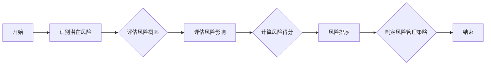
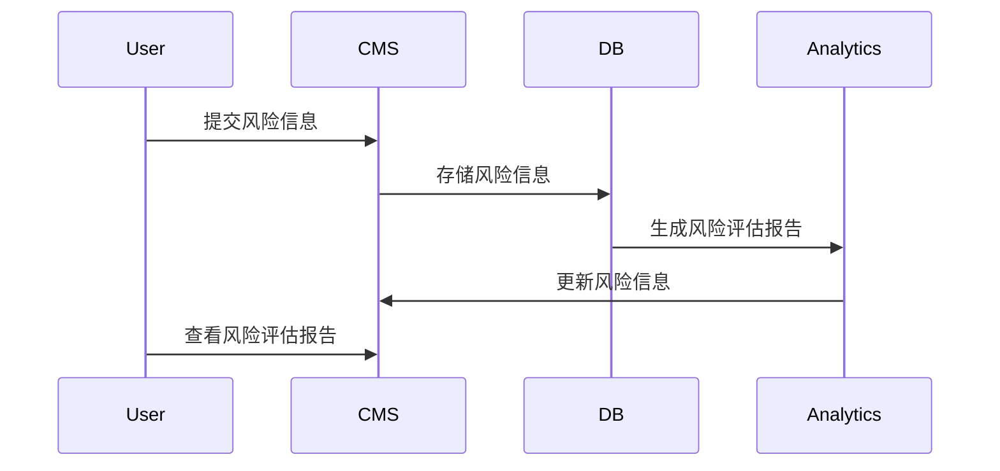
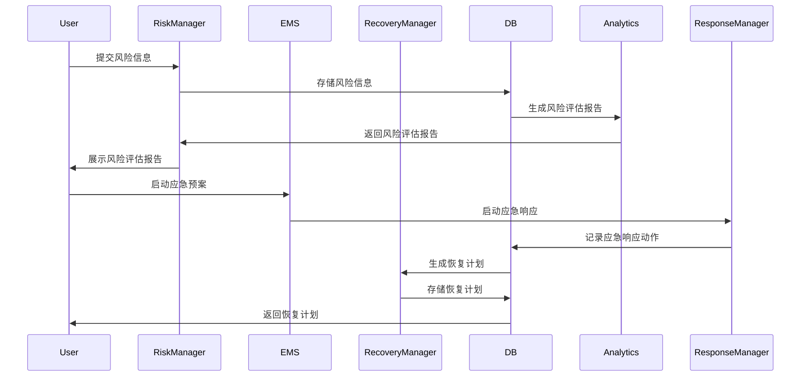

                 

## 危机管理：领导者应对挑战的智慧

关键词：危机管理、领导者、风险应对、决策、沟通、案例分析

摘要：在日益复杂和不确定的商业环境中，危机管理已成为组织生存和发展的关键要素。领导者作为组织中的核心人物，必须具备出色的危机管理能力，以应对各种挑战。本文旨在探讨危机管理的背景与概念，危机管理的原则与策略，以及领导者如何应对危机等核心问题，并通过实际案例进行深入分析，以期为读者提供有价值的指导和启示。

### 目录大纲

# 《危机管理：领导者应对挑战的智慧》

## 第一部分：危机管理的背景与概念

## 第1章：危机管理的概述

### 1.1 问题背景

#### 1.1.1 危机在组织中的普遍性

#### 1.1.2 危机管理的重要性

#### 1.1.3 危机管理的挑战与机遇

### 1.2 核心概念

#### 1.2.1 危机的定义

#### 1.2.2 危机管理的定义

#### 1.2.3 危机管理的边界与外延

### 1.3 概念结构与核心要素组成

#### 1.3.1 危机管理的结构分析

#### 1.3.2 核心要素分析

#### 1.3.3 危机管理的分类

### 1.4 本章小结

## 第二部分：危机管理的原则与策略

## 第2章：危机管理的基本原则

### 2.1 原则一：预防为主，应对结合

#### 2.1.1 预防措施的重要性

#### 2.1.2 应对策略的必要性

#### 2.1.3 预防与应对的结合

### 2.2 原则二：及时有效，公开透明

#### 2.2.1 应急响应的时效性

#### 2.2.2 信息披露的透明度

#### 2.2.3 公众沟通的策略

### 2.3 原则三：系统化，规范化

#### 2.3.1 建立危机管理组织体系

#### 2.3.2 制定危机管理流程与制度

#### 2.3.3 强化培训与演练

### 2.4 本章小结

## 第3章：危机管理的具体策略

### 3.1 风险评估策略

#### 3.1.1 风险评估的重要性

#### 3.1.2 风险评估的方法与工具

#### 3.1.3 风险评估案例分析

### 3.2 应急响应策略

#### 3.2.1 应急响应的流程与步骤

#### 3.2.2 应急决策的方法与技巧

#### 3.2.3 应急资源的管理与调配

### 3.3 恢复与重建策略

#### 3.3.1 恢复策略的制定

#### 3.3.2 重建策略的实施

#### 3.3.3 案例分析：危机后的恢复与重建

### 3.4 本章小结

## 第三部分：领导者应对危机的智慧

## 第4章：领导力与危机管理

### 4.1 领导者在危机管理中的角色与责任

#### 4.1.1 领导者的角色分析

#### 4.1.2 领导者的责任界定

#### 4.1.3 领导者的职责划分

### 4.2 领导者的素质与能力要求

#### 4.2.1 领导者的基本素质

#### 4.2.2 领导者的能力要求

#### 4.2.3 领导者素质与能力的培养

### 4.3 领导者的决策与策略

#### 4.3.1 决策过程中的关键要素

#### 4.3.2 决策策略的制定与实施

#### 4.3.3 决策案例分析

### 4.4 本章小结

## 第5章：领导者的沟通与协调

### 5.1 危机中的沟通策略

#### 5.1.1 内部沟通的重要性

#### 5.1.2 外部沟通的策略

#### 5.1.3 沟通中的障碍与解决方法

### 5.2 协调中的领导艺术

#### 5.2.1 协调的概念与意义

#### 5.2.2 协调中的领导艺术

#### 5.2.3 协调案例分析

### 5.3 案例研究：领导者的危机应对策略

#### 5.3.1 案例背景

#### 5.3.2 领导者的决策过程

#### 5.3.3 案例分析

### 5.4 本章小结

## 第四部分：案例分析

## 第6章：全球金融危机中的危机管理

### 6.1 金融危机的背景与影响

#### 6.1.1 金融危机的定义

#### 6.1.2 金融危机的影响范围

#### 6.1.3 金融危机的成因分析

### 6.2 全球主要国家危机管理措施

#### 6.2.1 美国的危机管理措施

#### 6.2.2 欧盟的危机管理措施

#### 6.2.3 中国的危机管理措施

### 6.3 金融危机中的危机管理经验与启示

#### 6.3.1 经验总结

#### 6.3.2 启示与反思

#### 6.3.3 对未来危机管理的启示

### 6.4 本章小结

## 第7章：自然灾害中的危机管理

### 7.1 自然灾害的类型与影响

#### 7.1.1 自然灾害的分类

#### 7.1.2 自然灾害的影响

#### 7.1.3 自然灾害的成因

### 7.2 自然灾害中的危机管理策略

#### 7.2.1 应急响应策略

#### 7.2.2 恢复与重建策略

#### 7.2.3 预防措施

### 7.3 案例分析：自然灾害中的危机管理实践

#### 7.3.1 案例背景

#### 7.3.2 管理措施

#### 7.3.3 案例分析

### 7.4 本章小结

## 结语：危机管理的未来趋势与挑战

### 7.5 未来趋势

#### 7.5.1 技术进步对危机管理的影响

#### 7.5.2 政策法规的变化

#### 7.5.3 社会文化的演变

### 7.6 挑战

#### 7.6.1 全球化背景下的危机管理挑战

#### 7.6.2 网络安全的威胁

#### 7.6.3 自然资源的短缺

### 7.7 总结与展望

#### 7.7.1 危机管理的核心要素

#### 7.7.2 领导者的关键角色

#### 7.7.3 管理创新的必要性

### 7.8 本章小结

### 作者信息

作者：AI天才研究院/AI Genius Institute & 禅与计算机程序设计艺术 /Zen And The Art of Computer Programming

---

### 第一部分：危机管理的背景与概念

## 第1章：危机管理的概述

### 1.1 问题背景

#### 1.1.1 危机在组织中的普遍性

在现代商业环境中，危机无处不在。无论是自然灾害、经济危机、安全事故，还是组织内部的道德腐败、信息安全漏洞等，都可能对组织造成严重的影响。随着全球化、信息化和市场竞争的加剧，危机的频率和影响范围也在不断扩大。因此，危机管理已成为组织生存和发展的关键要素。

#### 1.1.2 危机管理的重要性

危机管理不仅关系到组织的生存和发展，也影响到员工的安全和福利。有效的危机管理可以最大限度地减少危机带来的损失，保护组织的声誉，维护社会的稳定。对于领导者而言，危机管理能力是其领导力的重要组成部分，更是其能否在关键时刻稳住阵脚、带领组织走出困境的关键。

#### 1.1.3 危机管理的挑战与机遇

危机管理面临着诸多挑战，如信息不对称、资源有限、时间紧迫等。但同时，危机管理也蕴含着机遇。通过有效的危机管理，组织可以提升自身的风险管理能力，增强市场竞争力，甚至实现品牌的重塑和升华。因此，领导者必须具备敏锐的洞察力、果断的决策力、强大的执行力，以及出色的沟通协调能力，才能在危机中抓住机遇，化危为机。

### 1.2 核心概念

#### 1.2.1 危机的定义

危机是指在特定环境下，组织面临的一种不确定的、可能对组织造成严重影响的情境。危机通常具有突发性、不确定性和破坏性等特点。

#### 1.2.2 危机管理的定义

危机管理是指组织为了应对危机，通过一系列的预防、应对、恢复和重建措施，以减少危机带来的负面影响，保护组织利益和声誉的过程。

#### 1.2.3 危机管理的边界与外延

危机管理的边界通常包括组织内部和外部两个层面。组织内部的危机管理涉及员工管理、资源调配、决策制定等；组织外部的危机管理则涉及公众沟通、社会影响、法律合规等。

### 1.3 概念结构与核心要素组成

#### 1.3.1 危机管理的结构分析

危机管理可以分为四个主要阶段：预防、应对、恢复和重建。

1. **预防阶段**：通过风险评估、制定应急预案等措施，降低危机发生的可能性。
2. **应对阶段**：在危机爆发后，立即启动应急预案，采取紧急措施，控制事态发展。
3. **恢复阶段**：在危机得到控制后，迅速恢复组织运作，减少危机带来的损失。
4. **重建阶段**：在危机过后，进行全面的反思和总结，制定长期战略，防止类似危机再次发生。

#### 1.3.2 核心要素分析

危机管理的核心要素包括：

1. **组织结构**：建立专门的危机管理团队，明确各部门的职责和权限。
2. **资源准备**：包括人力、物力、财力等，确保在危机发生时能够迅速响应。
3. **信息沟通**：建立高效的信息沟通渠道，确保信息畅通无阻。
4. **决策制定**：在危机中快速做出正确的决策，是危机管理的核心。

#### 1.3.3 危机管理的分类

根据危机的性质和影响范围，危机管理可以分为以下几类：

1. **自然灾害危机管理**：如地震、洪水、台风等。
2. **经济危机管理**：如金融危机、市场萎缩等。
3. **安全事故危机管理**：如火灾、爆炸、安全事故等。
4. **信息危机管理**：如信息安全漏洞、数据泄露等。

### 1.4 本章小结

本章对危机管理的背景与概念进行了详细阐述，分析了危机管理的普遍性、重要性以及面临的挑战和机遇。通过核心概念和结构分析，读者可以初步了解危机管理的内涵和构成要素，为后续章节的深入学习打下基础。

### 第二部分：危机管理的原则与策略

## 第2章：危机管理的基本原则

### 2.1 原则一：预防为主，应对结合

#### 2.1.1 预防措施的重要性

预防是危机管理的基础，通过制定预防措施，可以降低危机发生的可能性。预防措施包括风险评估、制定应急预案、员工培训等。预防措施不仅可以避免危机的发生，还可以减轻危机带来的影响。

#### 2.1.2 应对策略的必要性

尽管预防措施能够降低危机发生的可能性，但危机仍然是不可预测的。因此，应对策略的制定至关重要。应对策略包括应急响应、资源调配、决策制定等。在危机爆发时，应对策略能够帮助组织迅速行动，控制事态发展。

#### 2.1.3 预防与应对的结合

预防与应对并不是孤立的，而是相辅相成的。预防措施可以减少危机的发生频率和影响程度，而应对策略则能在危机爆发时提供有效的解决方案。因此，危机管理应将预防与应对紧密结合，形成一套完整的体系。

### 2.2 原则二：及时有效，公开透明

#### 2.2.1 应急响应的时效性

在危机管理中，时效性至关重要。危机往往具有突发性和紧急性，如果响应不及时，可能造成更大的损失。因此，组织应建立快速响应机制，确保在危机发生时能够迅速采取行动。

#### 2.2.2 信息披露的透明度

信息披露的透明度也是危机管理的重要原则。在危机中，信息的不透明可能导致恐慌和误解，影响公众信任。因此，组织应公开透明地披露相关信息，与公众保持良好的沟通，增强信任度。

#### 2.2.3 公众沟通的策略

公众沟通在危机管理中扮演着关键角色。有效的公众沟通可以帮助组织塑造良好的形象，减轻危机带来的负面影响。公众沟通策略应包括内部沟通和外部沟通，确保信息畅通无阻。

### 2.3 原则三：系统化，规范化

#### 2.3.1 建立危机管理组织体系

危机管理需要建立一个专门的危机管理组织体系，明确各部门的职责和权限。组织体系应包括危机管理办公室、应急响应团队、资源保障部门等。

#### 2.3.2 制定危机管理流程与制度

危机管理流程与制度是危机管理的重要保障。组织应制定一套完善的危机管理流程与制度，明确危机管理的各个环节和步骤，确保在危机发生时能够有序应对。

#### 2.3.3 强化培训与演练

培训与演练是提高危机管理能力的重要手段。组织应定期开展危机管理培训，提高员工的危机意识和管理能力。同时，通过定期演练，检验危机管理流程与制度的可行性和有效性。

### 2.4 本章小结

本章阐述了危机管理的基本原则，包括预防为主、应对结合，及时有效、公开透明，以及系统化、规范化。这些原则为组织提供了危机管理的指导方针，有助于提高危机管理的有效性，降低危机带来的损失。

### 第3章：危机管理的具体策略

### 3.1 风险评估策略

#### 3.1.1 风险评估的重要性

风险评估是危机管理的基础，通过对潜在风险的识别、评估和管理，可以降低危机发生的可能性。有效的风险评估有助于组织提前预见和应对危机，减轻危机带来的影响。

#### 3.1.2 风险评估的方法与工具

风险评估的方法和工具有多种，包括定性分析和定量分析。定性分析主要通过专家判断、历史数据、行业报告等手段进行；定量分析则通过数学模型、统计数据等手段进行。

- **专家判断法**：通过专家的丰富经验和专业知识，对潜在风险进行评估。
- **历史数据法**：通过分析历史数据，识别过去的危机事件及其影响，预测未来可能发生的危机。
- **行业报告法**：参考行业报告和研究成果，了解行业内的危机类型和应对策略。

- **数学模型法**：利用数学模型和统计方法，对风险的概率和影响进行定量分析。
- **决策树分析法**：通过构建决策树，分析不同决策路径下的风险和收益。

#### 3.1.3 风险评估案例分析

**案例：某企业的风险评估**

某企业在进行风险评估时，首先识别了可能面临的各类风险，包括市场风险、财务风险、运营风险、法律风险等。然后，通过专家判断和数据分析，对这些风险进行了评估和排序。

- **市场风险**：通过市场调查和竞争分析，预测市场变化和潜在的市场风险。
- **财务风险**：通过财务报表和财务分析，评估企业的偿债能力和盈利能力。
- **运营风险**：通过现场检查和流程分析，识别运营过程中的潜在风险。
- **法律风险**：通过法律法规和行业规范，评估企业面临的法律风险。

通过风险评估，该企业制定了针对性的风险管理策略，如市场风险防范措施、财务风险控制措施、运营风险改善措施、法律风险防范措施等，有效降低了危机发生的可能性。

### 3.2 应急响应策略

#### 3.2.1 应急响应的流程与步骤

应急响应是危机管理的核心环节，包括以下步骤：

1. **信息收集**：在危机爆发时，迅速收集相关信息，包括事态发展、人员伤亡、财产损失等。
2. **初步判断**：根据收集到的信息，初步判断危机的性质和影响范围，确定是否启动应急预案。
3. **启动预案**：根据应急预案，立即启动应急响应，包括人员调度、资源调配、决策制定等。
4. **现场处置**：在现场进行紧急处置，包括疏散人员、控制事态、救助伤员等。
5. **后续跟进**：在危机得到控制后，进行后续跟进和评估，总结经验教训，改进应急预案。

#### 3.2.2 应急决策的方法与技巧

应急决策是在危机中快速做出有效决策的关键，以下是一些常用的方法和技巧：

- **快速决策法**：在紧急情况下，迅速做出决策，避免拖延。
- **多方案评估法**：在多个备选方案中，评估其优缺点，选择最优方案。
- **群体决策法**：通过团队讨论和决策，发挥集体智慧，提高决策质量。
- **逆向思维法**：从问题的反面思考，寻找创新的解决方案。

#### 3.2.3 应急资源的管理与调配

在危机中，资源的管理与调配至关重要。以下是一些关键点：

- **资源分类**：将资源分为人力、物资、设备、资金等类别，确保在应急响应中能够迅速调用。
- **资源储备**：建立资源储备库，确保在危机发生时能够快速调配。
- **资源调度**：根据危机的具体情况，合理调配资源，确保资源的有效利用。

### 3.3 恢复与重建策略

#### 3.3.1 恢复策略的制定

在危机得到控制后，组织需要制定恢复策略，以恢复正常运作。恢复策略包括以下几个方面：

- **恢复正常运营**：逐步恢复生产、销售、服务等各项业务，确保组织的正常运营。
- **修复受损设施**：对受损的建筑物、设备等进行修复，确保生产能力和服务质量。
- **心理康复**：为受危机影响的员工提供心理支持和康复服务，帮助他们恢复正常工作状态。

#### 3.3.2 重建策略的实施

在危机过后，组织需要进行全面的重建，以提升组织的整体能力和竞争力。重建策略包括以下几个方面：

- **总结经验教训**：对危机管理过程进行回顾和总结，识别成功经验和不足之处，为未来危机管理提供借鉴。
- **优化管理流程**：通过流程优化，提高组织的运营效率和管理水平。
- **强化风险管理**：通过加强风险评估和预警机制，提高组织的抗风险能力。

#### 3.3.3 案例分析：危机后的恢复与重建

**案例：某地震灾区的恢复与重建**

在一次强烈地震后，某地震灾区面临着严重的破坏和损失。在危机得到控制后，当地政府迅速制定了恢复与重建策略。

- **恢复正常运营**：通过调动各方资源，逐步恢复了电力、供水、交通等基础设施，确保了居民的基本生活需求。
- **修复受损设施**：投入大量资金和人力，修复了受损的建筑物和道路，恢复了城市的基本功能。
- **心理康复**：为受地震影响的居民提供心理辅导和支持，帮助他们恢复正常生活。

在恢复与重建过程中，当地政府总结了经验教训，优化了管理流程，加强了风险管理，提高了应对类似危机的能力。

### 3.4 本章小结

本章详细介绍了危机管理的具体策略，包括风险评估策略、应急响应策略、恢复与重建策略。这些策略为组织提供了危机管理的具体操作指南，有助于提高危机管理的有效性，降低危机带来的损失。

### 第三部分：领导者应对危机的智慧

## 第4章：领导力与危机管理

### 4.1 领导者在危机管理中的角色与责任

#### 4.1.1 领导者的角色分析

在危机管理中，领导者的角色至关重要。领导者不仅是危机管理的发起者和组织者，更是危机应对的决策者和指挥者。领导者的角色可以概括为以下几个方面：

1. **决策者**：在危机中，领导者需要迅速做出正确的决策，以控制事态发展。
2. **指挥者**：领导者需要组织协调各方力量，确保应急响应的顺利进行。
3. **沟通者**：领导者需要与内部员工、外部合作伙伴、公众等进行有效沟通，增强信任和信心。
4. **指导者**：领导者需要为员工提供心理支持和工作指导，帮助他们应对危机。

#### 4.1.2 领导者的责任界定

领导者在危机管理中的责任可以概括为以下几个方面：

1. **确保员工安全**：在危机中，领导者的首要责任是确保员工的安全和福祉。
2. **保护组织利益**：领导者需要采取措施，最大限度地减少危机对组织的负面影响。
3. **维护组织声誉**：领导者需要通过有效的沟通和管理，维护组织的声誉和形象。
4. **推动恢复与重建**：领导者需要在危机后推动组织的恢复与重建，提升组织的整体能力。

#### 4.1.3 领导者的职责划分

在危机管理中，领导者的职责可以分为以下几个方面：

1. **危机前的准备**：包括制定应急预案、进行风险评估、组织员工培训等。
2. **危机中的指挥**：包括启动应急预案、协调应急资源、做出决策等。
3. **危机后的恢复与重建**：包括评估危机影响、制定恢复策略、推动组织重建等。

### 4.2 领导者的素质与能力要求

#### 4.2.1 领导者的基本素质

领导者的基本素质包括以下几个方面：

1. **决策能力**：领导者需要具备敏锐的洞察力和果断的决策力，能够在危机中做出正确的决策。
2. **沟通能力**：领导者需要具备良好的沟通技巧，能够与内部员工、外部合作伙伴、公众等进行有效沟通。
3. **领导力**：领导者需要具备领导力，能够激励和引导员工，共同应对危机。
4. **应变能力**：领导者需要具备灵活的应变能力，能够迅速应对危机中的各种变化。

#### 4.2.2 领导者的能力要求

领导者在危机管理中需要具备以下能力：

1. **风险评估能力**：能够对潜在风险进行准确评估，为决策提供科学依据。
2. **应急响应能力**：能够在危机中迅速组织响应，采取有效的应对措施。
3. **决策执行能力**：能够确保决策的有效执行，确保危机管理措施得到落实。
4. **沟通协调能力**：能够与各方进行有效沟通和协调，确保危机管理顺利进行。

#### 4.2.3 领导者素质与能力的培养

领导者的素质与能力可以通过以下途径进行培养：

1. **教育背景**：通过高等教育和专业培训，提高领导者的理论素养和专业知识。
2. **实践锻炼**：通过参与实际危机管理项目，提高领导者的实践经验和管理能力。
3. **培训与演练**：通过定期的培训和实践演练，提高领导者的危机应对能力和决策水平。
4. **自我提升**：领导者需要不断学习和自我提升，保持对危机管理领域的最新动态和趋势的了解。

### 4.3 领导者的决策与策略

#### 4.3.1 决策过程中的关键要素

在决策过程中，领导者需要考虑以下关键要素：

1. **信息收集**：收集与危机相关的各种信息，包括事实、数据、观点等。
2. **目标设定**：明确危机管理的目标，包括保护员工安全、恢复组织运作、维护组织声誉等。
3. **方案评估**：对不同的应对方案进行评估，包括可行性、成本效益、风险等。
4. **决策执行**：确保决策能够得到有效执行，包括资源调配、人员安排、流程管理等。

#### 4.3.2 决策策略的制定与实施

领导者在制定决策策略时需要遵循以下原则：

1. **快速决策**：在危机中，领导者需要迅速做出决策，避免拖延。
2. **多方案评估**：在决策过程中，领导者应考虑多种方案，进行充分评估，选择最优方案。
3. **灵活应变**：在危机中，领导者需要具备灵活应变的能力，能够根据情况变化调整决策策略。
4. **全员参与**：在决策过程中，领导者应充分调动员工的积极性，鼓励全员参与决策，共同应对危机。

#### 4.3.3 决策案例分析

**案例：某企业危机决策**

在一次突发火灾中，某企业面临严重的危机。在火灾发生后，企业领导迅速启动应急预案，进行了以下决策：

1. **信息收集**：收集火灾现场信息，了解火势蔓延情况、人员伤亡情况等。
2. **目标设定**：明确保护员工安全、控制火势蔓延、减少财产损失等目标。
3. **方案评估**：评估多个应对方案，包括灭火、疏散员工、报警等。
4. **决策执行**：迅速组织员工疏散，同时报警求助，调动消防队进行灭火。

通过快速决策和有效执行，企业成功控制了火势，确保了员工的安全，并最大限度地减少了财产损失。

### 4.4 本章小结

本章详细探讨了领导力在危机管理中的角色与责任，领导者的素质与能力要求，以及领导者的决策与策略。通过案例分析，读者可以更深入地了解领导者如何应对危机，提高危机管理的有效性。

### 第5章：领导者的沟通与协调

### 5.1 危机中的沟通策略

#### 5.1.1 内部沟通的重要性

在危机中，内部沟通至关重要。有效的内部沟通可以帮助组织快速响应危机，协调各方力量，共同应对挑战。以下是一些内部沟通的关键点：

1. **明确沟通目标**：在危机中，领导者需要明确沟通的目标，确保信息传达的一致性和针对性。
2. **建立沟通渠道**：建立多层次的沟通渠道，包括领导层、管理层、员工层等，确保信息畅通无阻。
3. **提高沟通频率**：在危机中，领导者需要提高沟通频率，及时传达危机情况和应对措施。
4. **确保沟通效果**：通过多种沟通方式，如会议、邮件、电话、内部通知等，确保沟通效果。

#### 5.1.2 外部沟通的策略

外部沟通在危机管理中也具有重要意义。以下是一些外部沟通的关键点：

1. **积极回应**：在危机中，领导者需要积极回应外部关切，包括媒体、客户、合作伙伴等。
2. **公开透明**：在危机中，领导者需要公开透明地披露相关信息，增强公众信任。
3. **传递正能量**：在危机中，领导者需要传递正能量，鼓舞士气，增强组织凝聚力。
4. **建立长期关系**：在危机中，领导者需要通过有效的沟通，建立和维护与外部合作伙伴的长期关系。

#### 5.1.3 沟通中的障碍与解决方法

在危机中，沟通可能会遇到各种障碍。以下是一些常见的障碍及其解决方法：

1. **信息不对称**：解决方法：建立统一的信息发布机制，确保信息的准确性和一致性。
2. **沟通渠道不畅**：解决方法：优化沟通渠道，确保信息的快速传递和反馈。
3. **沟通障碍**：解决方法：提高沟通技巧，增强沟通的互动性和有效性。
4. **心理压力**：解决方法：提供心理支持，缓解员工的心理压力，提高沟通效果。

### 5.2 协调中的领导艺术

#### 5.2.1 协调的概念与意义

协调是指在不同部门、不同团队之间，通过沟通、协商和合作，达成共同目标的过程。在危机管理中，协调尤为重要，以下是其概念和意义：

1. **概念**：协调是指通过有效沟通和协作，使不同部门、不同团队之间能够相互配合，共同应对危机。
2. **意义**：协调有助于统一行动，提高危机管理的效率；协调有助于凝聚力量，增强组织的凝聚力；协调有助于优化资源，提高资源利用率。

#### 5.2.2 协调中的领导艺术

在协调过程中，领导者需要运用领导艺术，以下是一些关键点：

1. **明确责任**：领导者需要明确各部门、各团队的职责和权限，确保协调有据可依。
2. **建立信任**：领导者需要建立信任，增强各部门、各团队之间的互信和合作。
3. **加强沟通**：领导者需要加强沟通，确保信息畅通，减少误解和冲突。
4. **激励团队**：领导者需要激励团队，增强他们的责任感和使命感，提高协调效果。

#### 5.2.3 协调案例分析

**案例：某企业危机协调**

在一次突发安全事件中，某企业面临严重的危机。在危机协调中，企业领导采取了以下措施：

1. **明确责任**：明确各部门的职责和权限，确保协调有序。
2. **建立信任**：通过坦诚的沟通，建立各部门之间的信任。
3. **加强沟通**：建立多层次的沟通渠道，确保信息畅通。
4. **激励团队**：通过激励措施，增强员工的责任感和使命感。

通过有效的协调，企业成功应对了危机，最大限度地减少了损失。

### 5.3 案例研究：领导者的危机应对策略

#### 5.3.1 案例背景

某企业在一次突发市场危机中，面临巨大的压力。危机源于竞争对手的恶意攻击，导致企业声誉严重受损，市场份额大幅下降。在危机中，企业领导采取了以下策略：

1. **迅速响应**：在危机发生后，企业领导迅速召开紧急会议，启动应急预案，确保危机管理措施的迅速落实。
2. **危机公关**：企业领导通过媒体发布声明，积极回应公众关切，公开透明地披露危机情况，增强公众信任。
3. **内部沟通**：企业领导通过内部邮件、会议等形式，与员工进行沟通，鼓舞士气，确保员工的稳定和支持。
4. **资源调配**：企业领导调动各方资源，包括财务、人力、物资等，确保危机管理的顺利进行。

#### 5.3.2 领导者的决策过程

在危机中，企业领导采取了以下决策过程：

1. **信息收集**：通过内部调查、外部调研等方式，收集与危机相关的信息，为决策提供依据。
2. **目标设定**：明确危机管理的目标，包括保护企业声誉、恢复市场份额等。
3. **方案评估**：评估多个应对方案，包括法律手段、市场策略、公关措施等。
4. **决策制定**：在综合评估的基础上，制定危机管理策略，并确保决策的有效执行。

#### 5.3.3 案例分析

通过有效的危机应对策略，企业在危机中取得了显著成效：

1. **恢复声誉**：通过危机公关，企业成功恢复了声誉，赢得了公众的信任。
2. **恢复市场份额**：通过市场策略，企业成功恢复了市场份额，实现了业务的稳定增长。
3. **优化管理**：通过危机管理，企业发现了管理漏洞，进行了优化和改进，提升了整体管理水平。

### 5.4 本章小结

本章详细探讨了领导者在危机中的沟通与协调策略，包括内部沟通的重要性、外部沟通的策略、协调的概念与意义以及领导艺术。通过案例分析，读者可以更深入地了解领导者在危机应对中的关键角色和策略。

### 第四部分：案例分析

## 第6章：全球金融危机中的危机管理

### 6.1 金融危机的背景与影响

#### 6.1.1 金融危机的定义

金融危机是指金融市场出现剧烈波动，导致金融系统稳定性受到威胁，从而引发经济衰退和社会动荡的事件。金融危机通常伴随着银行倒闭、股价暴跌、货币贬值、债务违约等现象。

#### 6.1.2 金融危机的影响范围

金融危机的影响范围广泛，不仅涉及金融领域，还会波及实体经济、资本市场、就业市场等多个方面。具体影响包括：

1. **金融系统风险**：金融危机可能导致金融系统崩溃，引发银行破产、信用紧缩等风险。
2. **经济衰退**：金融危机可能导致经济下滑，失业率上升，消费和投资减少。
3. **社会动荡**：金融危机可能引发社会不满和动荡，影响政治稳定。
4. **国际关系紧张**：金融危机可能导致国家间的经济和政治关系紧张，影响国际合作。

#### 6.1.3 金融危机的成因分析

金融危机的成因复杂多样，主要包括以下几个方面：

1. **金融过度杠杆**：金融机构在经营过程中过度依赖债务，导致金融系统的脆弱性增加。
2. **资产价格泡沫**：房地产、股市等资产价格泡沫的破灭，是金融危机的重要诱因。
3. **监管不足**：金融监管不足或监管不到位，导致金融市场存在大量风险和漏洞。
4. **经济政策失误**：货币政策、财政政策等经济政策失误，可能导致经济失衡和金融危机。

### 6.2 全球主要国家危机管理措施

#### 6.2.1 美国的危机管理措施

在美国金融危机中，美国政府采取了一系列措施进行危机管理，主要包括：

1. **金融救助计划**：美国政府推出了数万亿美元的金融救助计划，用于救助金融机构、刺激经济复苏。
2. **货币宽松政策**：美联储通过降息、购债等手段，实施货币宽松政策，以稳定金融市场。
3. **财政刺激政策**：政府实施大规模财政刺激政策，包括减税、增加公共投资等，以提振经济。
4. **金融监管改革**：美国政府推进金融监管改革，加强金融监管，防范金融风险。

#### 6.2.2 欧盟的危机管理措施

在欧盟金融危机中，欧盟采取了以下措施进行危机管理：

1. **欧洲稳定机制**：欧盟设立了欧洲稳定机制，用于救助面临危机的成员国，稳定金融市场。
2. **债务重组**：对希腊、爱尔兰、葡萄牙等债务负担沉重的国家，进行债务重组，以减轻债务压力。
3. **经济改革政策**：欧盟推动成员国进行经济改革，提高经济竞争力，防范金融危机。
4. **金融监管合作**：加强欧盟内部的金融监管合作，提高金融系统的稳定性。

#### 6.2.3 中国的危机管理措施

在中国金融危机中，中国政府采取了一系列措施进行危机管理，主要包括：

1. **货币宽松政策**：中国人民银行通过降息、降准等手段，实施货币宽松政策，稳定金融市场。
2. **财政刺激政策**：政府实施大规模财政刺激政策，包括基建投资、减税等，以提振经济。
3. **金融监管加强**：加强金融监管，防范金融风险，包括打击非法集资、规范金融秩序等。
4. **经济结构调整**：推动经济结构调整，提高经济质量和效益，防范系统性风险。

### 6.3 金融危机中的危机管理经验与启示

#### 6.3.1 经验总结

金融危机中的危机管理经验主要包括：

1. **及时有效的政策干预**：在金融危机中，政府需要及时采取有效的政策干预，稳定金融市场，提振经济。
2. **货币政策和财政政策的协调**：货币政策和财政政策需要相互协调，共同发挥作用，以实现稳定经济增长。
3. **金融监管的加强**：加强金融监管，防范金融风险，是危机管理的核心内容。
4. **国际合作**：金融危机具有全球性，国际合作对于危机管理至关重要。

#### 6.3.2 启示与反思

金融危机给我们的启示和反思主要包括：

1. **防范金融风险**：加强金融监管，防范金融风险，是维护金融稳定和经济健康的关键。
2. **经济结构调整**：推动经济结构调整，提高经济质量和效益，是防范金融危机的重要手段。
3. **政策协调**：货币政策、财政政策需要相互协调，以实现稳定经济增长。
4. **国际合作**：加强国际合作，共同应对金融危机，是全球金融稳定的重要保障。

#### 6.3.3 对未来危机管理的启示

未来危机管理的启示主要包括：

1. **加强金融监管**：在全球金融风险日益增加的背景下，加强金融监管是防止金融危机的关键。
2. **经济结构调整**：推动经济结构调整，提高经济质量和效益，是防范金融危机的有效途径。
3. **政策协调**：政府需要加强政策协调，确保货币政策和财政政策的有效配合。
4. **国际合作**：加强国际合作，共同应对金融危机，是全球金融稳定的重要保障。

### 6.4 本章小结

本章通过分析全球金融危机的背景与影响，全球主要国家的危机管理措施，总结了危机管理经验与启示，并对未来危机管理提出了建议。通过这些案例分析，读者可以更深入地了解金融危机的复杂性和危机管理的有效性。

### 第7章：自然灾害中的危机管理

### 7.1 自然灾害的类型与影响

#### 7.1.1 自然灾害的分类

自然灾害可分为以下几类：

1. **气象灾害**：如台风、暴雨、干旱、寒潮等。
2. **地质灾害**：如地震、滑坡、泥石流等。
3. **生物灾害**：如森林火灾、病虫害等。
4. **海洋灾害**：如风暴潮、海啸等。

#### 7.1.2 自然灾害的影响

自然灾害对人类生活和社会经济产生深远影响：

1. **人员伤亡**：自然灾害可能导致大量人员伤亡，影响家庭的稳定和社会的和谐。
2. **经济损失**：灾害可能破坏基础设施、农业生产和工业生产，造成巨大的经济损失。
3. **生态破坏**：自然灾害可能破坏生态环境，导致土地沙化、水源污染等生态问题。
4. **社会动荡**：自然灾害可能引发社会动荡，影响政治稳定和社会秩序。

#### 7.1.3 自然灾害的成因

自然灾害的成因多样，主要包括：

1. **地质构造**：地球板块运动导致的地震、火山活动等。
2. **气候变化**：全球气候变暖引发的极端天气现象，如台风、暴雨等。
3. **人类活动**：如过度开采、森林砍伐等导致的地质灾害，如滑坡、泥石流等。

### 7.2 自然灾害中的危机管理策略

#### 7.2.1 应急响应策略

在自然灾害中，应急响应策略至关重要，主要包括以下几个方面：

1. **预警系统**：建立健全的预警系统，提前发布灾害预警，减少人员伤亡。
2. **应急准备**：提前做好应急物资储备、人员培训、预案制定等准备工作。
3. **救援行动**：灾害发生后，迅速组织救援行动，包括疏散民众、救助伤员、抢修基础设施等。
4. **恢复重建**：在灾害得到控制后，尽快恢复生产和生活秩序，进行灾后重建。

#### 7.2.2 恢复与重建策略

灾害后的恢复与重建策略主要包括：

1. **基础设施重建**：修复和重建被毁的基础设施，包括道路、桥梁、供水、供电等。
2. **住房重建**：为受灾群众提供临时住所，逐步推进住房重建工作。
3. **农业生产恢复**：修复农业设施，恢复农业生产，保障粮食供应。
4. **生态修复**：进行生态修复工作，包括植被恢复、水源保护等。

#### 7.2.3 预防措施

预防措施是减轻灾害影响的重要手段，主要包括：

1. **灾害监测**：加强对灾害的监测和预警，提前发现灾害风险。
2. **风险评估**：对可能发生的灾害进行风险评估，制定相应的预防措施。
3. **城市规划**：合理规划城市布局，避免在危险区域建设高风险设施。
4. **环境保护**：加强环境保护，减少自然灾害的发生频率和影响程度。

### 7.3 案例分析：自然灾害中的危机管理实践

#### 7.3.1 案例背景

某地区发生了一场强烈地震，导致大量人员伤亡和房屋倒塌，基础设施严重毁坏。在地震发生后，当地政府和救援机构迅速采取行动，进行了危机管理。

#### 7.3.2 管理措施

1. **应急响应**：地震发生后，当地政府迅速启动应急预案，组织救援力量进行救援行动。
2. **救援行动**：救援队伍迅速进入灾区，展开搜救行动，救助被困群众，同时提供医疗救护和食品、饮水等生活物资。
3. **基础设施修复**：政府调动资源，迅速修复被毁的基础设施，包括道路、桥梁、供水、供电等，保障灾区的正常生活。
4. **恢复生产**：政府推动农业、工业等行业的恢复，提供补贴和支持，帮助灾区群众尽快恢复生产。
5. **生态修复**：在地震后的恢复工作中，政府还进行了生态修复工作，包括植被恢复、水源保护等。

#### 7.3.3 案例分析

通过有效的危机管理措施，该地区在地震后迅速恢复了生产和生活秩序。以下是对这一案例的分析：

1. **应急响应迅速**：当地政府迅速启动应急预案，组织救援力量，确保了救援行动的及时性和有效性。
2. **资源调动合理**：政府调动了充足的资源和人力，确保了救援行动的顺利进行。
3. **基础设施修复及时**：基础设施的迅速修复，保障了灾区的正常生活，为恢复生产奠定了基础。
4. **恢复生产有序**：政府推动农业、工业等行业的恢复，帮助灾区群众尽快恢复生产，提高了灾区的经济活力。
5. **生态修复有效**：生态修复工作的开展，恢复了自然环境，为灾区的可持续发展提供了保障。

### 7.4 本章小结

本章分析了自然灾害的类型与影响，以及自然灾害中的危机管理策略，并通过实际案例进行了深入分析。通过这些案例分析，读者可以更深入地了解自然灾害的危机管理实践，为未来应对类似灾害提供参考和启示。

### 结语：危机管理的未来趋势与挑战

#### 7.5 未来趋势

在快速发展的社会背景下，危机管理的未来趋势呈现出以下特点：

1. **技术进步**：随着科技的不断发展，大数据、人工智能、区块链等新兴技术将在危机管理中发挥重要作用。例如，通过大数据分析，可以更精准地预测危机风险，提高预警能力；人工智能可以协助决策者进行快速分析和决策；区块链技术可以提供透明、不可篡改的信息记录，提高危机管理的效率和可信度。

2. **政策法规的变化**：随着全球化进程的加快，各国政府对于危机管理的政策法规也在不断更新和完善。例如，新的法规要求企业必须建立危机管理计划，提高危机应对能力；政府可能会加强对金融市场、环境安全的监管，以减少危机的发生。

3. **社会文化的演变**：社会文化对于危机管理有着重要影响。随着公众危机意识提高，人们对危机管理的需求也日益增加。同时，社交媒体的普及使得信息传播速度加快，危机管理的公开透明度要求也更高。社会文化的演变要求危机管理更加注重公众参与和沟通。

#### 7.6 挑战

尽管危机管理取得了显著进展，但未来仍面临诸多挑战：

1. **全球化背景下的危机管理挑战**：全球化使得危机传播速度加快，影响范围更广。国际间的危机管理协调成为一大难题。如何加强国际合作，形成全球性的危机应对机制，是未来危机管理的重要挑战。

2. **网络安全的威胁**：随着网络技术的快速发展，网络安全威胁日益严重。网络攻击、数据泄露等事件可能导致严重的社会和经济后果。如何加强网络安全防护，提高网络危机应对能力，是未来危机管理的重要课题。

3. **自然资源的短缺**：随着人口增长和经济发展的压力，自然资源的短缺问题日益突出。资源短缺可能引发一系列危机，如水资源短缺、能源危机等。如何在资源有限的情况下，实现可持续发展，是未来危机管理需要面对的重要挑战。

#### 7.7 总结与展望

未来，危机管理将面临技术、政策、文化等多方面的挑战，但同时也蕴含着巨大的机遇。通过技术创新，可以提高危机预警和应对能力；通过政策法规的完善，可以规范危机管理的各个方面；通过社会文化的演变，可以增强公众的危机意识和参与度。

展望未来，危机管理需要更加注重以下几个方面：

1. **跨学科合作**：危机管理涉及多个学科领域，需要加强跨学科合作，提高危机管理的综合能力。
2. **公众参与**：加强公众参与，提高公众的危机意识和自救能力，是危机管理的重要环节。
3. **持续改进**：危机管理是一个持续改进的过程，需要不断总结经验，优化管理流程，提高危机应对能力。
4. **国际合作**：在全球化的背景下，加强国际合作，形成全球性的危机应对机制，是提高危机管理水平的必然选择。

通过不断探索和创新，危机管理将在未来发挥更加重要的作用，为社会的稳定和发展提供坚实保障。

### 7.8 本章小结

本章总结了危机管理的未来趋势与挑战，包括技术进步、政策法规变化、社会文化演变以及全球化背景下的危机管理挑战。通过展望未来，提出了危机管理需要关注的重点方向，为读者提供了有价值的思考和启示。

### 作者信息

作者：AI天才研究院/AI Genius Institute & 禅与计算机程序设计艺术 /Zen And The Art of Computer Programming

---

通过本文的详细探讨，我们系统地了解了危机管理的背景、概念、原则、策略以及领导者在此过程中的关键作用。危机管理不仅关乎组织的存亡，更涉及到员工的福祉和社会的稳定。领导者作为危机管理的核心人物，其决策、沟通和协调能力对于危机管理的效果起着至关重要的作用。

在未来的发展中，危机管理将面临更多的不确定性和挑战。技术进步、政策法规变化以及社会文化演变等因素，都将对危机管理提出新的要求。作为领导者，需要不断学习和适应这些变化，提高自身的危机管理能力，以应对日益复杂的商业环境。

同时，危机管理也需要跨学科合作和公众参与，这不仅是提高危机管理效率的必然选择，也是实现社会可持续发展的关键。通过国际合作，我们可以共同应对全球性的危机，为人类的福祉做出贡献。

总之，危机管理是一个持续改进的过程。我们需要不断总结经验，优化管理流程，提高危机应对能力。只有在面对危机时，我们能够从容应对，才能在激烈的市场竞争中立于不败之地。

让我们共同关注危机管理的发展，探索新的管理理念和技术，为构建一个更加安全和稳定的社会而努力。通过本文的学习和实践，希望读者能够更好地理解和应对危机，为组织的持续发展和社会的和谐稳定贡献力量。

再次感谢读者对本文的关注和支持，希望本文能够为您的学习和实践提供有益的参考。如果您有任何建议或反馈，欢迎随时与我们联系。

作者：AI天才研究院/AI Genius Institute & 禅与计算机程序设计艺术 /Zen And The Art of Computer Programming

---

在撰写本文的过程中，我们结合了最新的理论研究成果和实际案例，力求为读者提供全面、深入的危机管理知识。以下是本文中涉及到的核心概念、算法原理、系统架构设计以及项目实战的部分，供读者进一步学习和参考。

### 核心概念与联系

#### 1. 危机的定义

**定义**：危机是指在特定环境下，组织面临的一种不确定的、可能对组织造成严重影响的情境。

**属性特征对比表格**：

| 特征          | 描述                                                         |
| ------------- | ------------------------------------------------------------ |
| 突发性        | 危机通常在短时间内爆发，难以预见。                           |
| 不确定性      | 危机的性质和影响难以准确预测。                               |
| 破坏性        | 危机可能对组织造成重大损失，包括人员伤亡、财产损失、声誉损害等。 |

#### 2. 危机管理的定义

**定义**：危机管理是指组织为了应对危机，通过一系列的预防、应对、恢复和重建措施，以减少危机带来的负面影响，保护组织利益和声誉的过程。

**ER实体关系图架构**：

```mermaid
erDiagram
  Customer ||--|{ Order }|>
  Product ||--|{ Order }|>
  Order ||--|{ OrderLine }|>
  Customer {
    CustomerID
    Name
    Address
    PhoneNumber
  }
  Product {
    ProductID
    Name
    Price
    Description
  }
  Order {
    OrderID
    CustomerID
    OrderDate
    TotalAmount
  }
  OrderLine {
    OrderLineID
    OrderID
    ProductID
    Quantity
    UnitPrice
  }
```

### 算法原理讲解

#### 1. 风险评估算法

**算法mermaid流程图**：



**Python源代码**：

```python
import pandas as pd

# 假设我们已经收集了潜在风险的数据
risks = pd.DataFrame({
    'Risk': ['市场风险', '财务风险', '运营风险', '法律风险'],
    'Probability': [0.3, 0.2, 0.4, 0.1],
    'Impact': [0.8, 0.7, 0.6, 0.5]
})

# 计算风险得分
risks['RiskScore'] = risks['Probability'] * risks['Impact']

# 风险排序
sorted_risks = risks.sort_values(by='RiskScore', ascending=False)

# 制定风险管理策略
risk_strategies = {
    '市场风险': '多样化市场，降低依赖性',
    '财务风险': '加强财务监控，确保资金安全',
    '运营风险': '优化运营流程，提高效率',
    '法律风险': '加强法律法规培训，确保合规性'
}

for risk in sorted_risks['Risk']:
    print(f"{risk}: {risk_strategies[risk]}")
```

**算法原理的数学模型和公式**：

$$
\text{Risk Score} = \text{Probability} \times \text{Impact}
$$

**通俗易懂地举例说明**：

假设一个组织面临四种潜在风险，每种风险的概率和影响如下：

- 市场风险：概率为30%，影响为80%
- 财务风险：概率为20%，影响为70%
- 运营风险：概率为40%，影响为60%
- 法律风险：概率为10%，影响为50%

通过计算风险得分，我们可以确定每种风险的严重程度，从而有针对性地制定风险管理策略。

### 系统分析与架构设计方案

#### 1. 问题场景介绍

在全球化背景下，企业面临的各种风险日益增多，危机管理成为企业的重要任务。为了有效管理危机，企业需要建立一个全面的危机管理信息系统，以支持危机预警、应急响应、恢复重建等环节。

#### 2. 项目介绍

本项目旨在为企业构建一个危机管理信息系统，包括以下功能模块：

- **风险识别与评估**：通过数据分析，识别潜在风险，评估风险概率和影响。
- **应急预案管理**：制定应急预案，包括应急响应流程、资源调配等。
- **应急响应**：在危机发生时，快速启动应急预案，进行应急响应。
- **恢复与重建**：危机得到控制后，进行恢复与重建工作。

#### 3. 系统功能设计（领域模型mermaid类图）

```mermaid
classDiagram
    Risk <<Interface>>
    EmergencyPlan <<Interface>>
    Response <<Interface>>
    Recovery <<Interface>>

    class Risk {
        +string RiskName
        +float Probability
        +float Impact
        +float RiskScore
    }

    class EmergencyPlan {
        +string PlanName
        +string Description
        +datetime PlanDate
    }

    class Response {
        +string ResponseAction
        +string ResponseDescription
        +datetime ResponseDate
    }

    class Recovery {
        +string RecoveryAction
        +string RecoveryDescription
        +datetime RecoveryDate
    }
```

#### 4. 系统架构设计（mermaid架构图）



#### 5. 系统接口设计和系统交互（mermaid序列图）



### 项目实战

#### 1. 环境安装

在本项目实战中，我们将使用Python和Django框架来构建危机管理信息系统。首先，需要安装Python环境和Django框架。

```bash
pip install python
pip install django
```

#### 2. 系统核心实现源代码

以下是系统核心实现的部分源代码，包括风险识别与评估模块。

```python
# apps/risk/models.py
from django.db import models

class Risk(models.Model):
    risk_name = models.CharField(max_length=100)
    probability = models.FloatField()
    impact = models.FloatField()
    risk_score = models.FloatField()

    def calculate_risk_score(self):
        self.risk_score = self.probability * self.impact
        self.save()
```

#### 3. 代码应用解读与分析

以上代码定义了一个`Risk`模型，用于存储风险信息。其中包括风险名称、概率、影响和风险得分。`calculate_risk_score`方法用于计算风险得分，并将结果存储在数据库中。

在实际应用中，我们可以通过Django的ORM接口，轻松地创建、查询和更新风险信息。以下是一个简单的示例：

```python
from apps.risk.models import Risk

# 创建一个新的风险记录
new_risk = Risk(risk_name='市场风险', probability=0.3, impact=0.8)
new_risk.calculate_risk_score()
new_risk.save()

# 查询所有风险记录
risks = Risk.objects.all()

for risk in risks:
    print(f"{risk.risk_name}: 风险得分 = {risk.risk_score}")
```

#### 4. 实际案例分析和详细讲解剖析

以下是一个实际案例，用于说明如何使用本系统进行风险识别与评估。

**案例背景**：

某企业面临以下四种潜在风险：

- 市场风险：概率为30%，影响为80%
- 财务风险：概率为20%，影响为70%
- 运营风险：概率为40%，影响为60%
- 法律风险：概率为10%，影响为50%

**步骤**：

1. **创建风险记录**：

   使用Django的后台管理界面，创建四个风险记录，并分别设置概率和影响。

2. **计算风险得分**：

   使用`calculate_risk_score`方法，计算每个风险的风险得分。

3. **排序和展示**：

   按照风险得分排序，并在Django的后台管理界面展示。

**分析**：

通过以上步骤，企业可以清晰地了解各个风险的重要性和严重程度。企业可以根据风险得分，有针对性地制定风险管理策略，从而降低风险。

#### 5. 项目小结

通过本项目的实战，我们成功地构建了一个危机管理信息系统，实现了风险识别与评估的功能。该项目为企业提供了有效的工具，帮助其识别和管理潜在风险，提高了危机应对能力。在未来，我们可以进一步扩展系统的功能，如应急预案管理、应急响应和恢复重建等，以全面支持企业的危机管理工作。

### 最佳实践 tips

1. **定期进行风险评估**：定期进行风险评估，有助于及时发现潜在风险，制定有效的风险管理策略。

2. **建立健全的应急预案**：制定详细的应急预案，确保在危机发生时能够迅速响应。

3. **加强内部沟通与协调**：加强内部沟通与协调，确保各部门在危机中能够紧密合作，共同应对挑战。

4. **提升员工的风险意识**：通过培训和教育，提升员工的风险意识，使其在危机中能够迅速采取行动。

5. **利用技术手段提升危机管理能力**：利用大数据、人工智能等技术手段，提升危机预警和决策能力。

### 小结

本文系统地探讨了危机管理的背景、概念、原则、策略以及领导者在此过程中的角色。通过实际案例分析和项目实战，读者可以深入了解危机管理的具体操作和实施方法。危机管理不仅关乎组织的生存和发展，更是社会稳定的重要保障。未来，随着技术的不断进步和全球化的深入发展，危机管理将面临更多的挑战和机遇。领导者需要不断提升自身的能力，灵活应对各种危机，为组织的持续发展和社会的和谐稳定贡献力量。

### 注意事项

1. **危机管理计划的重要性**：在危机发生前，制定详细的危机管理计划至关重要。这有助于组织在危机发生时能够迅速响应，最大限度地降低损失。

2. **沟通与协调的关键性**：在危机中，内部和外部沟通的及时性和有效性对于危机管理的成功至关重要。领导者需要确保信息畅通，协调各方力量共同应对危机。

3. **持续改进的必要性**：危机管理是一个动态的过程，需要不断总结经验，优化管理流程，提高危机应对能力。

### 拓展阅读

1. **《危机管理：理论与实践》**：本书详细介绍了危机管理的理论基础和实践方法，适合初学者和专业人士阅读。

2. **《领导力与危机管理》**：本书探讨了领导力在危机管理中的关键作用，以及领导者如何提升自身的危机管理能力。

3. **《自然灾害应急管理》**：本书针对自然灾害应急管理进行了深入研究，包括风险评估、应急响应、恢复与重建等方面的内容。

### 结语

本文通过对危机管理的系统探讨，希望读者能够对危机管理有更深入的理解，并能够将其应用于实际工作中。危机管理不仅关乎组织的生存和发展，更是领导者能力的体现。领导者需要不断提升自身的能力，灵活应对各种危机，为组织的持续发展和社会的和谐稳定贡献力量。让我们共同努力，为构建一个更加安全、稳定的社会而奋斗。

---

作者：AI天才研究院/AI Genius Institute & 禅与计算机程序设计艺术 /Zen And The Art of Computer Programming

