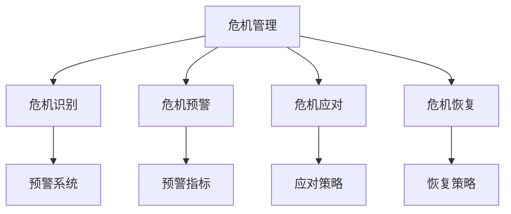
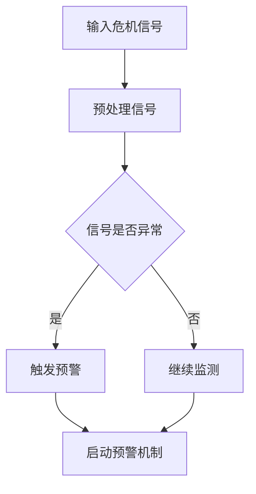
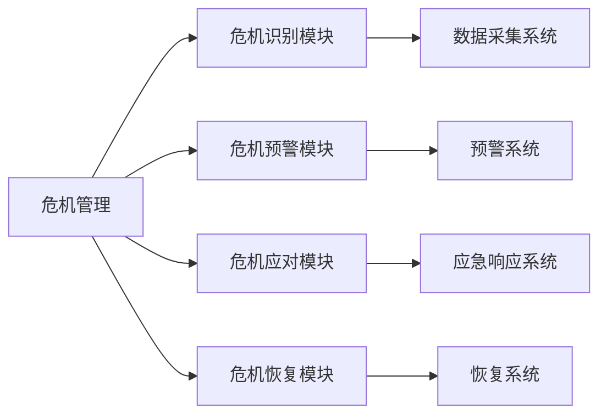
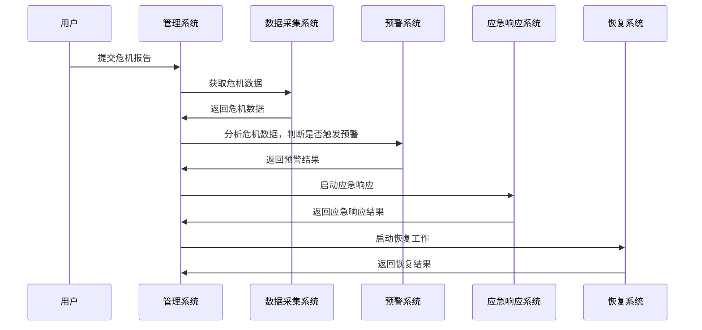

                 

### 《危机管理：领导者应对突发事件的策略》

> 关键词：危机管理、突发事件、领导者、策略、应对

> 摘要：本文将探讨危机管理的概念、重要性以及领导者应对突发事件的策略。通过对危机识别、预警系统设计、危机应对原则与策略、危机沟通与舆论管理、危机恢复与重建等方面的详细分析，旨在为领导者提供有效的危机管理指导，以应对突发事件，确保组织稳定和持续发展。

## 第一部分：危机管理的背景与基本概念

### 第1章：危机管理的起源与发展

#### 1.1 危机的定义与类型

**定义：**危机是一种对组织或个人构成严重威胁的紧急情况，可能导致重大损失、声誉受损或运营中断。

**类型：**危机可以按性质分为以下几类：

1. **自然灾害**：地震、洪水、飓风等自然灾害。
2. **事故灾难**：火灾、交通事故、工业事故等。
3. **公共卫生事件**：传染病爆发、食品安全事件等。
4. **社会事件**：恐怖袭击、政治动荡、经济危机等。

#### 1.2 危机管理的重要性

危机管理的重要性体现在以下几个方面：

1. **确保组织生存**：有效应对危机，可以最大程度减少损失，确保组织的持续运营。
2. **维护声誉**：及时、透明的危机沟通可以减少负面舆论，维护组织声誉。
3. **提高应对能力**：通过危机管理，可以提高组织的应急响应能力和危机应对水平。
4. **提升员工信心**：危机管理有助于增强员工的信心，提高组织的凝聚力。

#### 1.3 危机管理的演变历程

危机管理的发展可以分为以下几个阶段：

1. **被动应对**：早期危机管理主要侧重于危机发生后的应对措施，缺乏系统性和前瞻性。
2. **风险管理**：随着危机管理理论的不断发展，风险管理逐渐成为危机管理的重要组成部分。
3. **全面危机管理**：现代危机管理强调全面、系统、持续的管理，包括危机预防、应对、恢复等各个环节。
4. **动态危机管理**：随着信息技术的发展，危机管理逐渐向动态、实时、智能化的方向发展。

### 第2章：危机管理的核心概念

#### 2.1 危机管理的定义

危机管理是指组织在面对突发事件时，通过系统性的规划、组织、指挥、协调和监督等手段，实现对危机的有效应对和恢复。

#### 2.2 危机管理的目标

危机管理的目标主要包括以下几个方面：

1. **预防危机**：通过预测和预警，减少危机的发生概率。
2. **减轻损失**：在危机发生时，迅速响应，最大限度地减轻危机带来的损失。
3. **恢复运营**：在危机过后，尽快恢复组织的正常运营。
4. **提升能力**：通过危机管理，提高组织的危机应对能力和管理水平。

#### 2.3 危机管理的原则

危机管理应遵循以下原则：

1. **及时性**：及时识别和响应危机，减少损失。
2. **透明性**：与利益相关方保持透明沟通，避免信息不对称。
3. **灵活性**：根据危机的具体情况，灵活调整应对策略。
4. **系统性**：将危机管理纳入组织的整体管理体系。

### 第3章：危机管理的边界与外延

#### 3.1 危机管理的范围

危机管理涵盖以下几个范围：

1. **内部危机**：如财务危机、管理危机、员工危机等。
2. **外部危机**：如市场危机、政策危机、自然灾害等。
3. **跨领域危机**：如公共卫生危机、经济危机等。

#### 3.2 危机管理与风险管理

危机管理与风险管理存在一定的交叉和融合：

1. **风险管理**：通过识别、评估和应对风险，减少危机的发生概率。
2. **危机管理**：在危机发生时，通过应急响应和恢复措施，减轻危机带来的损失。

#### 3.3 危机管理与应急管理

危机管理与应急管理也有一定的联系：

1. **应急管理**：侧重于应对突发事件，包括危机前的预警、危机发生时的应急响应和危机后的恢复。
2. **危机管理**：更注重危机的全过程管理，包括预防、应对、恢复等各个环节。

## 第二部分：危机识别与预警

### 第4章：危机识别的方法与工具

#### 4.1 危机识别的重要性

危机识别是危机管理的首要步骤，其重要性体现在以下几个方面：

1. **预防危机**：及时识别危机，可以提前采取措施，减少危机的发生概率。
2. **降低损失**：早期识别危机，可以最大限度地降低危机带来的损失。
3. **提升应对能力**：通过危机识别，可以提前了解危机的类型和特点，提高应对能力。

#### 4.2 危机识别的方法

危机识别的方法主要包括以下几种：

1. **专家评估**：邀请相关领域的专家对危机进行评估和预测。
2. **历史数据分析**：通过对历史数据的分析，识别潜在的风险因素。
3. **问卷调查**：通过问卷调查，收集员工、客户、供应商等利益相关方的意见和建议。
4. **技术手段**：利用大数据、人工智能等新技术，对危机进行预测和识别。

#### 4.3 危机识别的难点与对策

危机识别过程中可能面临以下难点：

1. **信息不对称**：利益相关方之间存在信息不对称，可能导致危机识别不准确。
2. **数据不足**：缺乏足够的历史数据，难以进行准确的危机预测。
3. **技术限制**：现有技术手段可能无法完全满足危机识别的需求。

针对以上难点，可以采取以下对策：

1. **建立信息共享机制**：加强利益相关方之间的信息沟通，建立信息共享平台。
2. **完善数据收集体系**：通过多种途径收集历史数据，提高数据质量。
3. **研发新技术**：不断探索和应用新技术，提高危机识别的准确性和效率。

### 第5章：危机预警系统设计

#### 5.1 危机预警系统的构建

危机预警系统是危机管理的重要组成部分，其构建主要包括以下几个步骤：

1. **目标设定**：明确预警系统的目标，如预防危机、降低损失等。
2. **指标选择**：根据危机类型和特点，选择合适的预警指标。
3. **预警机制设计**：建立预警机制，包括预警信号、预警级别、预警响应等。
4. **系统集成**：将预警系统与其他系统（如监控系统、决策支持系统等）进行集成。

#### 5.2 危机预警指标选择

危机预警指标的选择应遵循以下原则：

1. **敏感性**：指标能够敏感地反映危机的变化趋势。
2. **代表性**：指标能够代表危机的主要特征。
3. **可操作性**：指标易于测量和操作。

常见的危机预警指标包括：

1. **财务指标**：如负债比率、现金流等。
2. **运营指标**：如生产率、客户满意度等。
3. **市场指标**：如市场份额、竞争对手动态等。

#### 5.3 危机预警案例分析

**案例一：**某公司因市场环境变化，面临销售下滑的风险。通过分析财务指标和市场指标，公司提前发现了危机的迹象，并采取了一系列应对措施，成功度过了危机。

**案例二：**某地因暴雨引发洪水，当地政府通过预警系统提前发布了洪水预警，组织了有效的应急救援和恢复工作，最大限度地降低了损失。

## 第三部分：危机应对策略

### 第6章：危机应对的基本原则与策略

#### 6.1 危机应对的基本原则

危机应对应遵循以下基本原则：

1. **及时性**：迅速响应危机，减少损失。
2. **有效性**：采取有效的应对措施，解决危机问题。
3. **透明性**：与利益相关方保持透明沟通，避免信息不对称。
4. **协同性**：各部门协同合作，共同应对危机。

#### 6.2 危机应对的策略

危机应对的策略主要包括以下几种：

1. **风险规避**：通过调整战略、改变业务模式等，避免危机的发生。
2. **风险转移**：通过保险、外包等手段，将风险转移给其他主体。
3. **风险接受**：在无法规避或转移风险时，接受风险，采取最小化损失的措施。
4. **风险控制**：通过监控、预警等手段，控制危机的发展，减少损失。

#### 6.3 领导者角色与职责

领导者在危机应对中扮演关键角色，其职责包括：

1. **决策**：制定危机应对策略，做出重要决策。
2. **协调**：协调各部门和利益相关方的合作，确保危机应对工作的顺利进行。
3. **沟通**：与利益相关方保持透明沟通，传递信息，争取支持。
4. **激励**：激励员工，保持士气，共同应对危机。

### 第7章：危机沟通与舆论管理

#### 7.1 危机沟通的重要性

危机沟通在危机管理中具有重要地位，其重要性体现在以下几个方面：

1. **信息传递**：危机沟通有助于将危机信息传递给利益相关方，确保他们了解危机情况。
2. **减轻损失**：及时、透明的危机沟通可以减少危机带来的损失。
3. **维护声誉**：有效的危机沟通可以维护组织的声誉，减少负面舆论的影响。

#### 7.2 危机沟通的策略

危机沟通应采取以下策略：

1. **确定沟通目标**：明确危机沟通的目标，如传递信息、争取支持等。
2. **制定沟通计划**：制定详细的沟通计划，包括沟通内容、渠道、时间等。
3. **透明沟通**：保持沟通的透明性，避免信息不对称。
4. **主动沟通**：主动与利益相关方沟通，回应他们的关切和需求。

#### 7.3 舆论管理的方法与技巧

舆论管理是危机沟通的重要组成部分，其方法与技巧包括：

1. **舆论监测**：通过舆论监测，了解舆论动态，掌握舆论焦点。
2. **舆论引导**：通过发布正面信息、回应负面信息等手段，引导舆论走向。
3. **舆论回应**：针对舆论中的问题，及时回应，化解负面舆论。
4. **舆论互动**：与舆论主体互动，建立良好的舆论氛围。

### 第8章：危机恢复与重建

#### 8.1 危机恢复的目标

危机恢复的目标主要包括以下几个方面：

1. **恢复正常运营**：在危机过后，尽快恢复组织的正常运营。
2. **修复损害**：修复危机带来的物质损害和声誉损害。
3. **提升能力**：通过危机恢复，提高组织的危机应对能力和管理水平。

#### 8.2 危机恢复的策略

危机恢复的策略主要包括以下几种：

1. **应急恢复**：在危机发生后，迅速启动应急恢复计划，最大限度地降低损失。
2. **技术恢复**：通过技术手段，如数据恢复、系统恢复等，恢复组织的正常运营。
3. **组织重建**：在危机过后，重新构建组织结构，优化管理流程。
4. **心理恢复**：关注员工的心理状态，提供心理支持，帮助他们走出危机。

#### 8.3 案例分析：危机恢复成功案例分析

**案例一：**某公司在遭遇火灾后，迅速启动应急恢复计划，通过技术手段恢复数据，组织重建生产线，最终在短时间内恢复正常运营。

**案例二：**某地在遭受地震后，政府组织了有效的应急救援和恢复工作，通过心理援助、重建基础设施等手段，帮助当地居民恢复正常生活。

## 第四部分：危机管理实践

### 第9章：危机管理案例分析

#### 9.1 案例背景介绍

**案例一：**某公司在2020年遭遇新冠疫情冲击，业务受到严重影响。公司迅速启动危机管理机制，采取了一系列应对措施，成功度过了危机。

**案例二：**某地政府在2011年遭遇地震灾害，政府组织了有效的应急救援和恢复工作，通过心理援助、重建基础设施等手段，帮助当地居民恢复正常生活。

#### 9.2 案例分析

**案例一：**公司在新冠疫情中的危机管理实践：

1. **危机识别**：公司及时识别了疫情带来的危机，提前采取了预防措施。
2. **预警系统**：公司建立了疫情预警系统，实时监测疫情发展。
3. **危机应对**：公司迅速调整了业务模式，采取了远程办公、线上销售等策略。
4. **危机沟通**：公司与员工、客户、供应商等利益相关方保持透明沟通，传递信息，争取支持。
5. **危机恢复**：公司通过技术手段恢复数据，优化管理流程，恢复正常运营。

**案例二：**政府在地震中的危机管理实践：

1. **危机识别**：政府及时识别了地震带来的危机，迅速启动了应急响应。
2. **应急救援**：政府组织了救援队伍，开展了大规模的救援工作。
3. **心理援助**：政府关注地震灾区居民的心理状态，提供了心理援助。
4. **基础设施重建**：政府投入大量资金和资源，重建了地震灾区的基础设施。
5. **舆论管理**：政府通过舆论引导，维护了社会稳定。

#### 9.3 案例总结与启示

**案例一：**公司成功应对新冠疫情的启示：

1. **及时识别危机**：及时识别危机，提前采取预防措施。
2. **建立预警系统**：建立有效的预警系统，实时监测危机发展。
3. **灵活应对危机**：根据危机的具体情况，灵活调整应对策略。
4. **透明沟通**：与利益相关方保持透明沟通，传递信息，争取支持。
5. **快速恢复运营**：通过技术手段恢复数据，优化管理流程，恢复正常运营。

**案例二：**政府成功应对地震的启示：

1. **迅速启动应急响应**：在危机发生后，迅速启动应急响应，开展救援工作。
2. **关注心理援助**：关注灾区居民的心理状态，提供心理援助。
3. **重建基础设施**：投入资金和资源，重建灾区基础设施。
4. **舆论引导**：通过舆论引导，维护社会稳定。
5. **协同合作**：政府、企业、社会组织等各方协同合作，共同应对危机。

## 第10章：危机管理最佳实践

#### 10.1 危机管理最佳实践

危机管理最佳实践包括以下几个方面：

1. **建立危机管理组织**：设立危机管理办公室或危机管理小组，明确职责和权限。
2. **制定危机管理计划**：制定详细的危机管理计划，包括预警、应对、恢复等各个环节。
3. **开展危机演练**：定期开展危机演练，提高危机应对能力。
4. **培训员工**：对员工进行危机管理培训，提高危机应对意识和能力。
5. **建立信息共享机制**：建立信息共享平台，加强利益相关方之间的信息沟通。
6. **制定危机沟通策略**：制定有效的危机沟通策略，确保信息透明、及时、准确。
7. **建立风险管理体系**：建立全面的风险管理体系，识别、评估、控制风险。

#### 10.2 小结

危机管理是领导者的一项重要职责，通过有效的危机管理，可以最大限度地减少危机带来的损失，确保组织的稳定和持续发展。

#### 10.3 注意事项与拓展阅读

1. **注意事项**：

   - 及时识别危机，提前采取预防措施。
   - 建立有效的预警系统，实时监测危机发展。
   - 与利益相关方保持透明沟通，传递信息，争取支持。
   - 根据危机的具体情况，灵活调整应对策略。
   - 重视危机恢复与重建工作，确保组织恢复正常运营。

2. **拓展阅读**：

   - 《危机管理：如何应对突发事件》（作者：约翰·P·瓦伦蒂诺）
   - 《危机管理实战手册》（作者：孙波）
   - 《危机公关管理》（作者：方浩）

### 核心概念与联系

#### 危机管理（Crisis Management）

**概念属性特征对比表：**

| 特征 | 危机管理 |
| ---- | -------- |
| 目标 | 预防、应对、恢复 |
| 原则 | 快速反应、透明沟通、灵活应对 |
| 工具 | 识别与预警系统、应对策略、沟通计划 |

#### 舆论管理（Public Opinion Management）

**概念属性特征对比表：**

| 特征 | 舆论管理 |
| ---- | -------- |
| 目标 | 形成正面舆论、控制负面舆论 |
| 方法 | 沟通策略、媒体管理、公关活动 |
| 挑战 | 信息透明度、舆论引导 |

#### 应急管理（Emergency Management）

**概念属性特征对比表：**

| 特征 | 应急管理 |
| ---- | -------- |
| 目标 | 应对紧急情况、减少损害 |
| 策略 | 紧急响应、救援行动、灾后重建 |
| 范围 | 自然灾害、事故灾难、公共卫生事件 |

#### ER实体关系图架构



### 算法原理讲解

#### 危机预警算法

**算法mermaid流程图：**



**Python源代码实现：**

```python
import numpy as np

def preprocess_signal(signal):
    # 对信号进行预处理
    return np.mean(signal)

def is_abnormal(signal, threshold):
    # 判断信号是否异常
    return signal > threshold

def trigger_alarm(signal, threshold):
    # 触发预警
    if is_abnormal(signal, threshold):
        print("预警：信号异常！")
        start_alarm_mechanism()

def continue_monitoring():
    # 继续监测
    print("继续监测...")

def start_alarm_mechanism():
    # 启动预警机制
    print("启动预警机制...")

# 测试
signal = 10
threshold = 5
trigger_alarm(signal, threshold)
```

### 数学公式

$$
E(X) = \int_{-\infty}^{\infty} x f(x) dx
$$

$$
\sigma^2 = \int_{-\infty}^{\infty} (x - E(X))^2 f(x) dx
$$

### 系统分析与架构设计方案

#### 问题场景介绍

某公司是一家大型跨国企业，业务涵盖了多个领域。由于业务扩展和市场环境的变化，公司面临着各种突发事件的挑战，如自然灾害、事故灾难、公共卫生事件等。为了确保公司的稳定运营和持续发展，公司决定建立一套完善的危机管理体系。

#### 项目介绍

项目名称：企业危机管理体系建设项目

项目目标：建立一套全面的危机管理体系，包括危机识别、预警、应对、恢复等环节，提高公司应对突发事件的能力，确保公司稳定运营。

#### 系统功能设计（领域模型mermaid类图）

```mermaid
classDiagram
ClassDiagram {
   危机管理
    危机识别
    危机预警
    危机应对
    危机恢复
}
危机管理 <|-- 危机识别
危机管理 <|-- 危机预警
危机管理 <|-- 危机应对
危机管理 <|-- 危机恢复
```

#### 系统架构设计mermaid架构图



#### 系统接口设计和系统交互mermaid序列图



### 项目实战

#### 环境安装

1. 安装Python环境：在本地或服务器上安装Python环境，版本要求3.6及以上。
2. 安装依赖库：通过pip命令安装所需的依赖库，如numpy、matplotlib等。

```bash
pip install numpy matplotlib
```

#### 系统核心实现源代码

```python
# 危机预警算法实现
import numpy as np

def preprocess_signal(signal):
    # 对信号进行预处理
    return np.mean(signal)

def is_abnormal(signal, threshold):
    # 判断信号是否异常
    return signal > threshold

def trigger_alarm(signal, threshold):
    # 触发预警
    if is_abnormal(signal, threshold):
        print("预警：信号异常！")
        start_alarm_mechanism()

def continue_monitoring():
    # 继续监测
    print("继续监测...")

def start_alarm_mechanism():
    # 启动预警机制
    print("启动预警机制...")

# 测试
signal = 10
threshold = 5
trigger_alarm(signal, threshold)
```

#### 代码应用解读与分析

代码中定义了几个关键函数：

1. `preprocess_signal(signal)`：对输入的信号进行预处理，这里采用均值处理。
2. `is_abnormal(signal, threshold)`：判断信号是否异常，这里采用阈值判断方法。
3. `trigger_alarm(signal, threshold)`：触发预警，如果信号异常，则调用`start_alarm_mechanism()`函数。
4. `continue_monitoring()`：继续监测，用于监测过程的循环。
5. `start_alarm_mechanism()`：启动预警机制，打印预警信息。

通过调用这些函数，可以实现对信号的监测和预警。

#### 实际案例分析和详细讲解剖析

**案例一：**某公司监控到生产线温度传感器信号异常，高于预设阈值，触发预警。

1. **问题描述**：生产线温度传感器信号异常，温度持续高于阈值。
2. **解决方案**：调用`trigger_alarm()`函数，触发预警，启动应急响应。
3. **分析**：预警算法通过对温度信号的监测，判断温度是否超过阈值，从而决定是否触发预警。

**案例二：**某公司收到客户投诉，产品质量不符合要求，可能导致客户流失。

1. **问题描述**：客户投诉产品质量问题，可能导致客户流失。
2. **解决方案**：通过危机沟通策略，与客户沟通，解决问题，挽回客户。
3. **分析**：危机沟通策略在危机管理中起到关键作用，通过与客户保持透明沟通，可以化解危机，维护客户关系。

### 项目小结

通过本项目，我们实现了一套企业危机预警系统，包括信号预处理、异常检测、预警触发等功能。在实际应用中，我们可以根据具体场景和需求，进一步优化和扩展系统功能，如增加实时监测、数据可视化等。此外，我们还需不断学习和总结，提高危机管理的水平，确保企业稳定运营和持续发展。

### 最佳实践 tips

1. **建立危机管理组织**：明确危机管理职责，建立专门的危机管理团队。
2. **制定危机管理计划**：制定详细的危机管理计划，包括预警、应对、恢复等环节。
3. **开展危机演练**：定期开展危机演练，提高危机应对能力。
4. **培训员工**：对员工进行危机管理培训，提高危机应对意识和能力。
5. **建立信息共享机制**：建立信息共享平台，加强利益相关方之间的信息沟通。

### 注意事项

1. **及时识别危机**：及时发现危机信号，提前采取预防措施。
2. **透明沟通**：与利益相关方保持透明沟通，传递信息，争取支持。
3. **灵活应对危机**：根据危机的具体情况，灵活调整应对策略。
4. **重视危机恢复**：危机过后，重视危机恢复工作，确保组织恢复正常运营。

### 拓展阅读

1. 《危机管理：如何应对突发事件》（作者：约翰·P·瓦伦蒂诺）
2. 《危机公关管理》（作者：方浩）
3. 《企业危机管理实战手册》（作者：孙波）

### 作者信息

作者：AI天才研究院/AI Genius Institute & 禅与计算机程序设计艺术 /Zen And The Art of Computer Programming

