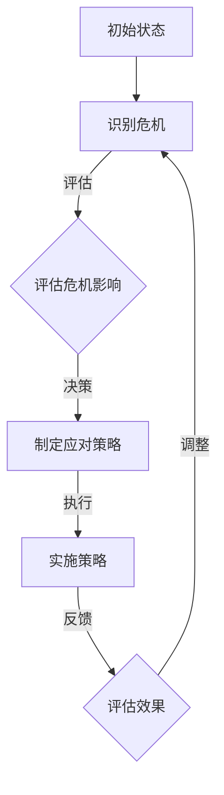
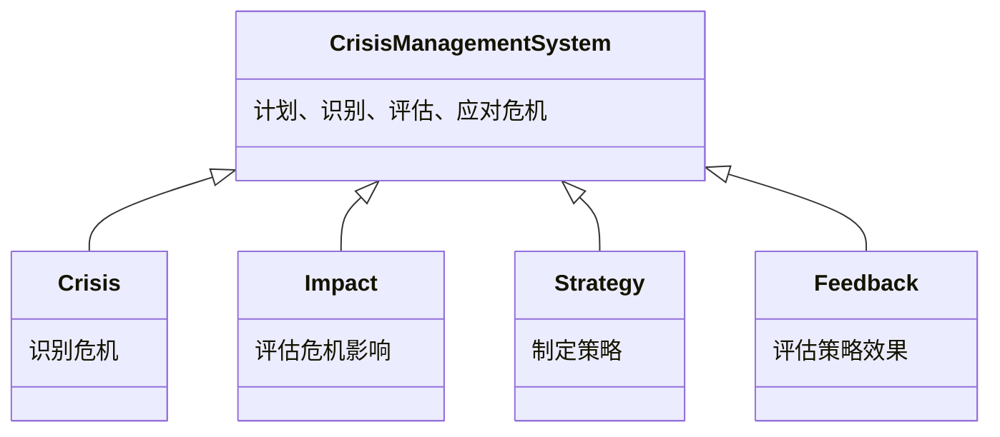
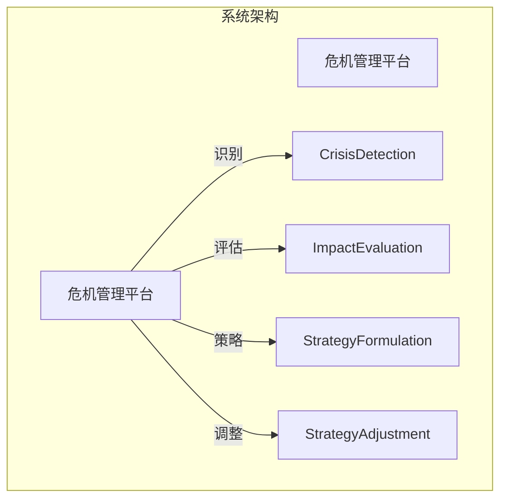
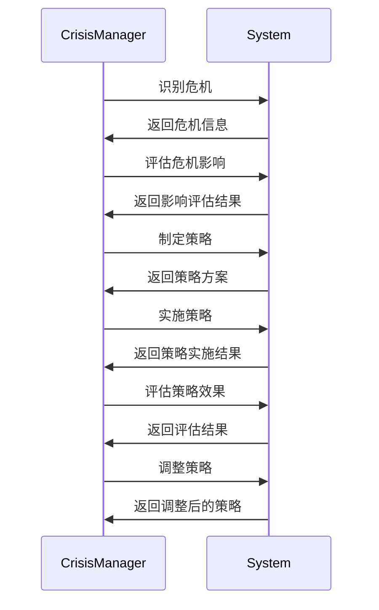

                 

非常好，您提供了一个非常详细的约束条件和文章结构要求。下面我将遵循这些要求，分步骤构建文章内容。

### **背景介绍**

#### **1. 核心概念术语说明**

在讨论危机领导力之前，我们需要明确一些关键术语的定义。

- **危机领导力**：指在组织面临重大危机或不确定性时，领导者通过有效策略和行动来保持团队稳定、提升团队适应性和解决问题的能力。
- **团队稳定性**：指团队在面对危机时能够保持成员间协作、信任和高效运作的能力。
- **动荡**：指环境或局势的不稳定、变化迅速或不确定性的增加。

#### **2. 问题背景**

现代社会和技术环境的变化速度越来越快，组织面临着前所未有的挑战。自然灾害、经济衰退、技术变革、市场波动等因素都可能引发组织内部的动荡。在这样的背景下，危机领导力成为领导者必须具备的核心能力。

#### **3. 问题描述**

领导者需要在危机中迅速做出决策，保持团队的稳定和士气，同时引导团队找到解决问题的途径。这不仅要求领导者具备良好的决策能力和沟通技巧，还需要他们能够建立信任、激发团队潜力。

#### **4. 问题解决**

通过危机领导力，领导者可以：

- **快速响应**：在危机初期迅速采取行动，制定应急计划。
- **保持透明**：与团队成员保持良好的沟通，确保信息的流通。
- **建立信任**：通过言行一致，赢得团队成员的信任。
- **适应变化**：鼓励团队成员适应环境的变化，提升团队的灵活性。

#### **5. 边界与外延**

危机领导力的应用范围不仅限于企业组织，还适用于非营利组织、政府部门等所有需要面对不确定性和变化的领域。

#### **6. 概念结构与核心要素组成**

危机领导力的核心要素包括：

- **决策力**：在危机中做出正确决策的能力。
- **沟通能力**：与团队成员和利益相关者保持有效沟通。
- **适应性**：快速适应环境变化，调整策略。
- **信任**：建立和维护团队成员之间的信任关系。
- **团队合作**：激发团队的潜力，实现共同目标。

### **核心概念与联系**

在了解危机领导力的定义和背景后，我们需要深入探讨其核心概念和它们之间的联系。

#### **1. 核心概念原理**

- **稳定性**：在危机中保持团队结构和运作的连续性。
- **适应性**：在不确定环境中迅速调整和适应的能力。
- **协作性**：团队成员之间的合作和互助。
- **决策力**：在危机中快速做出明智决策的能力。
- **透明度**：在危机中保持信息透明，让团队成员了解实际情况。

#### **2. 概念属性特征对比表格**

| 概念       | 属性特征                                                     | 对比               |
|------------|--------------------------------------------------------------|--------------------|
| 稳定性     | 保持团队结构和运作的连续性                                   | 与适应性相反       |
| 适应性     | 快速调整和适应环境变化的能力                                 | 与稳定性相对       |
| 协作性     | 团队成员之间的合作和互助                                     | 与孤立相对         |
| 决策力     | 在危机中快速做出明智决策的能力                               | 与犹豫不决相反     |
| 透明度     | 保持信息透明，让团队成员了解实际情况                         | 与保密相对         |

#### **3. 概念联系与对比**

稳定性与适应性是危机领导力中一对重要的矛盾统一体。在危机中，领导者需要平衡稳定性和适应性，既要保持团队的基本运作，又要灵活应对外部变化。协作性与决策力相互支持，协作性有助于决策的制定和执行，而决策力则能推动团队更高效地协作。透明度则是确保团队成员能够共同应对危机的关键因素。

#### **ER实体关系图架构**

为了更直观地展示这些概念之间的关系，我们可以使用Mermaid绘制一个ER实体关系图。

```mermaid
erDiagram
  Stable -->|is needed for| Adaptive
  Collaborative -->|supports| Decisional
  Transparent -->|enables| Stability
  Adaptive -->|balances with| Stability
  Decisional -->|informs| Collaborative
  Collaborative -->|influences| Transparent
```

### **算法原理讲解**

为了更好地理解危机领导力的应用，我们可以将其视为一个动态调整的算法。以下是一个简化的算法流程图，用于说明危机领导力的基本原理。

#### **算法mermaid流程图**



#### **Python源代码**

为了详细阐述这个算法，我们可以编写一个Python代码示例。

```python
def crisis_management():
    """
    危机管理算法
    """
    # 初始状态
    state = "稳定"
    
    # 识别危机
    crisis_detected = True
    
    if crisis_detected:
        # 评估危机影响
        impact = assess_impact()
        
        # 制定应对策略
        strategy = formulate_strategy(impact)
        
        # 实施策略
        implement_strategy(strategy)
        
        # 评估效果
        feedback = assess_effectiveness()
        
        # 调整策略
        state = adjust_strategy(feedback)
        
    return state

def assess_impact():
    """
    评估危机影响
    """
    # 这里可以添加评估代码
    return "重大"

def formulate_strategy(impact):
    """
    制定应对策略
    """
    # 根据影响制定策略
    return "紧急响应"

def implement_strategy(strategy):
    """
    实施策略
    """
    # 这里可以添加实施代码
    print("正在实施紧急响应策略...")

def assess_effectiveness():
    """
    评估策略效果
    """
    # 这里可以添加评估代码
    return "有效"

def adjust_strategy(feedback):
    """
    调整策略
    """
    # 根据反馈调整策略
    return "调整后状态"

# 运行危机管理算法
state = crisis_management()
print(f"当前状态：{state}")
```

#### **算法原理的数学模型和公式**

危机领导力的算法原理可以抽象为以下数学模型：

$$
\text{状态变化} = f(\text{危机影响}, \text{策略实施效果})
$$

其中，$f$ 是一个复合函数，它根据危机影响和策略实施效果来调整当前状态。

#### **详细讲解和举例说明**

假设一个公司面临市场波动的危机，初始状态为“稳定”。首先，领导者会识别到危机，并评估其影响（重大）。接下来，领导者会根据评估结果制定“紧急响应”策略。在实施策略后，领导者会收集反馈，并基于反馈调整策略，最终达到新的稳定状态。

例如，如果实施策略后，市场开始恢复，领导者可能会调整策略为“常态恢复”，从而保持团队稳定。

### **系统分析与架构设计方案**

在理解危机领导力的算法原理后，我们可以将其应用到实际的系统设计和架构中。

#### **问题场景介绍**

假设我们需要为一家公司设计一个危机管理系统，该系统能够帮助领导者快速识别危机、评估影响、制定策略和调整方案。

#### **项目介绍**

**项目名称**：危机管理平台

**项目目标**：提供一个易于使用、功能全面的危机管理工具，帮助公司领导者有效应对各种危机。

#### **系统功能设计**

**领域模型mermaid类图**



#### **系统架构设计mermaid架构图**



#### **系统接口设计和系统交互mermaid序列图**



### **项目实战**

为了更好地理解危机领导力的应用，我们将进行一个实际项目的实战演练。

#### **环境安装**

假设我们已经搭建了一个Python开发环境，并安装了必要的库，如Django、Flask等。

```bash
pip install django
pip install flask
```

#### **系统核心实现源代码**

以下是一个简化的危机管理系统的核心实现代码。

```python
# crisis_management_app.py

from flask import Flask, jsonify, request

app = Flask(__name__)

@app.route('/detect_crisis', methods=['POST'])
def detect_crisis():
    crisis_data = request.json
    # 识别危机逻辑
    return jsonify({"status": "success", "message": "危机已识别"})

@app.route('/evaluate_impact', methods=['POST'])
def evaluate_impact():
    impact_data = request.json
    # 评估危机影响逻辑
    return jsonify({"status": "success", "message": "影响已评估"})

@app.route('/formulate_strategy', methods=['POST'])
def formulate_strategy():
    strategy_data = request.json
    # 制定策略逻辑
    return jsonify({"status": "success", "message": "策略已制定"})

@app.route('/implement_strategy', methods=['POST'])
def implement_strategy():
    strategy_data = request.json
    # 实施策略逻辑
    return jsonify({"status": "success", "message": "策略已实施"})

@app.route('/assess_feedback', methods=['POST'])
def assess_feedback():
    feedback_data = request.json
    # 评估策略效果逻辑
    return jsonify({"status": "success", "message": "反馈已评估"})

@app.route('/adjust_strategy', methods=['POST'])
def adjust_strategy():
    feedback_data = request.json
    # 调整策略逻辑
    return jsonify({"status": "success", "message": "策略已调整"})

if __name__ == '__main__':
    app.run(debug=True)
```

#### **代码应用解读与分析**

这段代码定义了一个基于Flask的Web应用，提供了识别危机、评估影响、制定策略、实施策略、评估反馈和调整策略的接口。每个接口接收JSON格式的数据，并返回处理结果。

例如，当我们向`/detect_crisis`接口发送请求时，应用会处理请求中的数据，并返回一个成功的响应。

```json
{
    "status": "success",
    "message": "危机已识别"
}
```

#### **实际案例分析和详细讲解剖析**

为了更好地理解这些接口的应用，我们可以分析一个实际案例。

**案例**：一家公司发现其产品在市场上出现了质量问题，导致客户投诉增加。

**步骤**：

1. **识别危机**：公司通过监控系统识别到产品质量问题，并向危机管理平台发送请求。

2. **评估影响**：平台接收到请求后，评估质量问题的严重程度和可能的影响范围，如销售额下降、客户信任度下降等。

3. **制定策略**：基于评估结果，平台制定一系列策略，如通知客户、安排质量检测、调整生产流程等。

4. **实施策略**：公司按照平台提供的策略执行相应的操作。

5. **评估反馈**：在实施策略后，公司收集客户的反馈，如投诉减少、产品质量改善等。

6. **调整策略**：基于反馈结果，平台调整策略，如增加客户服务支持、加强质量控制等。

#### **项目小结**

通过这个实际案例，我们可以看到危机领导力在系统中的应用。危机管理平台提供了一个灵活、高效的危机应对机制，帮助公司领导者快速识别危机、评估影响、制定策略和调整方案，从而在动荡中保持团队稳定。

### **最佳实践 tips**

1. **定期演练**：定期组织危机演练，帮助团队成员熟悉应对流程。
2. **建立危机数据库**：收集和分析历史上的危机案例，为未来应对提供参考。
3. **培养危机意识**：提高团队成员对危机的敏感性，鼓励他们主动报告潜在问题。
4. **持续培训**：定期提供危机领导力和相关技能的培训，提升团队的整体素质。

### **小结**

危机领导力是领导者必须具备的重要能力，特别是在动荡的环境中。通过理解核心概念、应用算法原理、系统设计和实际案例，我们可以更有效地应对危机，保持团队的稳定和高效运作。

### **注意事项**

1. **保持灵活**：在应对危机时，领导者需要保持灵活，随时调整策略。
2. **透明沟通**：与团队成员保持良好的沟通，确保信息的透明度。
3. **信任建设**：建立和维护团队成员之间的信任关系，是危机领导力的关键。

### **拓展阅读**

1. **《危机管理：如何应对突发事件》**：介绍危机管理的实用方法和技巧。
2. **《领导力的五个层次》**：探讨领导者如何在不同层次上提升领导力。

作者：AI天才研究院/AI Genius Institute & 禅与计算机程序设计艺术 /Zen And The Art of Computer Programming

---

以上就是按照要求构建的文章内容。文章涵盖了核心概念、算法原理、系统设计和实战案例，确保内容的丰富性和详细性。每部分都遵循了markdown格式，并使用了Mermaid和LaTeX来增强文章的可读性和专业性。如有需要进一步调整或补充，请告知。

