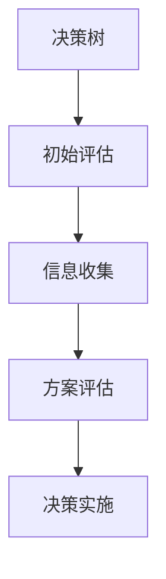
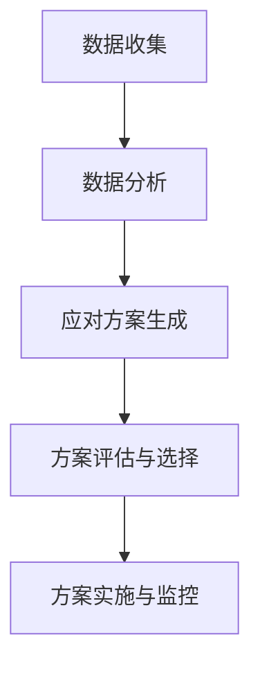
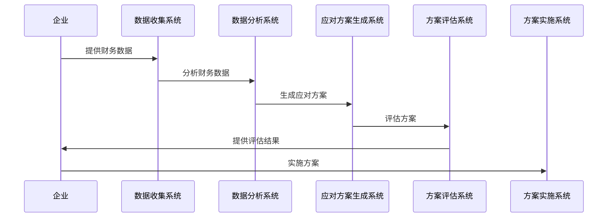

                 

# 危机领导力：在逆境中凝聚团队

## 摘要

本文旨在探讨危机领导力在逆境中凝聚团队的重要性。通过分析现代企业面临的挑战，阐述了危机管理的必要性。本文将从危机领导力的理论框架、团队管理、决策与领导、案例研究以及实践技巧等方面，详细探讨如何提升危机领导力，实现团队在逆境中的稳定与发展。同时，本文还将结合具体案例，分析危机情境下的领导决策和团队协作，为企业管理者提供实际操作指南。最后，本文将总结主要观点，并展望未来研究方向。

## 第1章 引言

### 1.1 问题的背景

#### 1.1.1 现代企业面临的挑战

在当今全球化的商业环境中，企业面临着前所未有的挑战。技术创新日新月异，市场竞争日益激烈，客户需求变化迅速，这些因素使得企业在发展过程中不可避免地会遇到各种危机。例如，企业可能面临财务危机、市场危机、管理危机、人力资源危机等。这些危机不仅会影响企业的正常运营，甚至可能导致企业破产。

#### 1.1.2 危机管理的必要性

危机管理是现代企业管理的重要环节。有效的危机管理能够帮助企业迅速应对危机，降低危机带来的损失，甚至化危为机，实现企业的长远发展。危机管理的核心在于领导力。在危机情境下，领导者需要具备危机领导力，通过有效的策略和行动，引导团队克服困难，实现组织目标。

#### 1.1.3 领导力在危机中的重要性

领导力在危机中的重要性不言而喻。首先，领导者是团队的灵魂，他们的决策和行动直接影响团队的行为和结果。在危机情境下，领导者需要快速做出决策，制定应对策略，确保团队的稳定。其次，领导者需要具备强大的心理素质，能够在压力下保持冷静，做出明智的决策。最后，领导者需要具备高度的责任心和使命感，为了团队的共同利益，勇于承担责任，积极应对危机。

### 1.2 定义与核心概念

#### 1.2.1 危机领导力

危机领导力是指在危机情境下，领导者通过有效的策略和行动，引导团队克服困难，实现组织目标的能力。危机领导力包括快速响应、决策能力、适应性和建立信任等特征。

#### 1.2.2 危机情境下的团队动力

危机情境下的团队动力是指团队在危机情境下，成员之间的相互作用，形成的合力与动力。团队动力包括信任与沟通、共同目标、协作与支持等特征。

#### 1.2.3 关键要素与策略

关键要素包括领导者的决策能力、心理素质、责任心和使命感，以及团队的动力和协作。策略包括快速响应、制定应对策略、建立信任、沟通和协作等。

## 第2章 危机领导力的理论框架

### 2.1 基本理论

#### 2.1.1 权变领导理论

权变领导理论认为，领导者的有效行为取决于情境。在危机情境下，领导者需要根据危机的特征和团队的需求，采取相应的领导策略。例如，在危机初期，领导者需要迅速做出决策，制定应对策略；在危机中期，领导者需要加强团队沟通，确保信息的透明度；在危机后期，领导者需要积极恢复团队的信心，引导团队恢复正常运营。

#### 2.1.2 超越领导理论

超越领导理论强调领导者需要具备超越自身的视野和能力，带领团队实现更高层次的目标。在危机情境下，领导者需要具备全局观念，从长远角度出发，制定应对策略。同时，领导者需要具备创新思维，寻找新的解决方案，突破传统的限制。

#### 2.1.3 双重关注领导理论

双重关注领导理论认为，领导者需要在危机情境下同时关注团队和任务。在危机初期，领导者需要关注团队的稳定和信心，确保团队保持积极的心态；在危机中期，领导者需要关注任务的完成，制定具体的行动计划；在危机后期，领导者需要关注团队的恢复和重建，确保团队的能力得到提升。

### 2.2 模型与工具

#### 2.2.1 危机反应模型

危机反应模型包括五个阶段：初始评估、信息收集、方案评估、决策实施和评估反馈。在初始评估阶段，领导者需要对危机的特征和影响进行初步评估；在信息收集阶段，领导者需要收集与危机相关的信息；在方案评估阶段，领导者需要评估不同的应对方案；在决策实施阶段，领导者需要制定具体的行动计划；在评估反馈阶段，领导者需要对应对效果进行评估，并根据评估结果进行调整。

#### 2.2.2 危机管理策略框架

危机管理策略框架包括三个层面：危机预防、危机应对和危机恢复。在危机预防层面，领导者需要制定预防措施，降低危机发生的概率；在危机应对层面，领导者需要制定应对策略，迅速应对危机；在危机恢复层面，领导者需要积极恢复团队的信心和运营能力。

#### 2.2.3 领导行为与风格

领导行为与风格在危机情境下具有重要意义。领导者需要根据危机的特征和团队的需求，灵活调整领导行为和风格。例如，在危机初期，领导者需要采取支持型领导风格，关心团队成员的心理状态；在危机中期，领导者需要采取指导型领导风格，明确团队的目标和任务；在危机后期，领导者需要采取参与型领导风格，与团队成员共同面对挑战。

## 第3章 危机情境下的团队管理

### 3.1 团队成员的心理状态

#### 3.1.1 焦虑与恐慌

在危机情境下，团队成员可能会出现焦虑和恐慌。焦虑主要是因为团队成员担心危机会对自身的工作和前途产生影响；恐慌则是因为团队成员对危机的未知和不确定性感到恐惧。这些情绪会影响团队成员的工作效率和工作质量。

#### 3.1.2 希望与信心

尽管焦虑和恐慌在危机情境下是普遍存在的，但团队成员也可能会产生希望和信心。希望是团队成员对危机能够得到有效解决的期待；信心则是团队成员对自身和团队的信任。希望和信心能够激发团队成员的积极性和创造力，有助于团队在危机中找到应对策略。

#### 3.1.3 行为模式的变化

在危机情境下，团队成员的行为模式也会发生变化。团队成员可能会更加关注自身的工作职责，提高工作效率；同时也可能会出现过度焦虑和紧张，导致工作效率下降。领导者需要关注团队成员的行为模式变化，及时进行干预和调整。

### 3.2 团队沟通策略

#### 3.2.1 危机中的有效沟通

在危机情境下，有效的沟通至关重要。领导者需要确保信息传递的准确性、及时性和全面性，避免信息滞后和误解。同时，领导者需要鼓励团队成员之间的沟通，建立开放、透明的沟通渠道，确保团队成员能够充分表达自己的意见和建议。

#### 3.2.2 透明度与信任

透明度是危机情境下建立信任的重要基础。领导者需要主动披露危机的信息，让团队成员了解危机的真相，降低信息不对称。同时，领导者需要保持诚信，言行一致，赢得团队成员的信任。

#### 3.2.3 信息共享与决策参与

在危机情境下，信息共享和决策参与能够增强团队成员的参与感和责任感。领导者需要邀请团队成员参与决策过程，听取他们的意见和建议，确保决策的科学性和民主性。

### 3.3 团队激励与动力

#### 3.3.1 激励理论在危机中的应用

在危机情境下，激励理论仍然适用。领导者需要根据团队成员的需求和心理状态，采取相应的激励措施，激发团队成员的积极性和创造力。

#### 3.3.2 领导激励策略

领导者需要制定激励策略，确保团队成员在危机情境下能够保持高昂的斗志和积极的工作态度。激励策略包括物质激励和非物质激励，如奖金、晋升、荣誉等。

#### 3.3.3 团队文化建设

团队文化是团队凝聚力和动力的源泉。领导者需要注重团队文化建设，营造积极、包容、创新的工作氛围，增强团队成员的归属感和自豪感。

## 第4章 危机中的决策与领导

### 4.1 决策过程

#### 4.1.1 初始评估

在危机情境下，领导者需要进行初始评估，了解危机的特征、影响和可能的解决方案。初始评估包括危机的严重程度、危机对组织的影响、危机的发展趋势等。

#### 4.1.2 信息收集与分析

领导者需要收集与危机相关的信息，如市场动态、竞争对手的举措、团队成员的意见等。在收集信息的基础上，领导者需要对信息进行分析，识别危机的关键因素和潜在影响。

#### 4.1.3 方案选择与评估

根据初始评估和数据分析，领导者需要制定多个应对方案。在方案选择过程中，领导者需要综合考虑方案的可行性、效果和成本等因素，确保方案的科学性和实用性。

#### 4.1.4 决策实施

在方案选择完成后，领导者需要制定具体的行动计划，明确任务分工和时间节点，确保方案能够顺利实施。

#### 4.1.5 评估反馈

在决策实施过程中，领导者需要定期评估方案的效果，根据评估结果进行调整和改进，确保决策的科学性和有效性。

### 4.2 领导风格与决策

#### 4.2.1 领导风格对决策的影响

领导风格对决策有重要影响。在危机情境下，领导者需要根据危机的特征和团队的需求，灵活调整领导风格。例如，在危机初期，领导者需要采取支持型领导风格，关心团队成员的心理状态；在危机中期，领导者需要采取指导型领导风格，明确团队的目标和任务；在危机后期，领导者需要采取参与型领导风格，与团队成员共同面对挑战。

#### 4.2.2 危机情境下的领导决策模型

危机情境下的领导决策模型包括四个阶段：危机识别、初始评估、方案选择和决策实施。在危机识别阶段，领导者需要及时发现危机的迹象；在初始评估阶段，领导者需要对危机的特征和影响进行评估；在方案选择阶段，领导者需要制定应对方案；在决策实施阶段，领导者需要确保方案能够顺利实施。

#### 4.2.3 高效决策的关键因素

高效决策的关键因素包括快速响应、信息准确性、决策科学性和团队协作。快速响应能够降低危机带来的损失；信息准确性是决策的基础；决策科学性能够确保决策的有效性；团队协作能够增强决策的执行力。

### 4.3 领导者在危机中的角色

#### 4.3.1 指导与支持

在危机情境下，领导者需要为团队成员提供指导和支持。领导者需要明确团队的目标和任务，为团队成员提供清晰的行动指南。同时，领导者需要关心团队成员的心理状态，提供心理支持，帮助团队成员克服焦虑和恐慌。

#### 4.3.2 挑战与克服

在危机情境下，领导者需要面对各种挑战，如资源短缺、时间紧迫、信息不足等。领导者需要勇于承担责任，积极应对挑战，寻找解决方案。同时，领导者需要带领团队共同面对挑战，激发团队成员的积极性和创造力。

#### 4.3.3 领导力提升策略

在危机情境下，领导者需要不断提升自身的领导力。领导者可以通过以下途径提升领导力：持续学习，提升自身素质；反思与调整，不断完善领导方法；培养团队文化，增强团队凝聚力。

## 第5章 案例研究

### 5.1 案例一：全球金融危机中的企业应对

#### 5.1.1 案例背景

2008年全球金融危机对全球企业产生了深远的影响。许多企业面临着财务危机、市场萎缩、供应链中断等挑战。在这个背景下，如何应对危机成为企业领导者面临的重要课题。

#### 5.1.2 领导决策

在危机初期，企业领导者迅速做出决策，制定应对策略。首先，领导者对危机的特征和影响进行了评估，确定了危机的严重程度。其次，领导者收集了与危机相关的信息，如市场动态、竞争对手的举措等。在信息分析的基础上，领导者制定了多个应对方案，包括降低成本、调整产品结构、开拓新市场等。最后，领导者确保方案能够顺利实施，并定期评估方案的效果，根据评估结果进行调整。

#### 5.1.3 团队管理

在危机情境下，领导者需要关注团队成员的心理状态，提供心理支持。同时，领导者需要明确团队的目标和任务，为团队成员提供清晰的行动指南。此外，领导者需要加强团队沟通，确保信息的透明度，建立信任。

### 5.2 案例二：自然灾害中的应急救援

#### 5.2.1 案例背景

自然灾害如地震、洪水等常常给人类社会带来严重的影响。在灾害发生时，应急救援成为关键。如何有效组织应急救援，减少灾害损失，成为领导者面临的重要课题。

#### 5.2.2 领导行动

在灾害发生时，领导者迅速行动，组织应急救援。首先，领导者对灾害的特征和影响进行了评估，确定了救援的重点区域和任务。其次，领导者协调各方资源，确保救援物资和设备的及时供应。在救援过程中，领导者需要确保信息的透明度，及时向公众发布救援进展和相关信息。此外，领导者需要关心救援人员的安全，提供必要的心理支持。

#### 5.2.3 团队协作

在灾害应急救援中，团队协作至关重要。领导者需要协调各方力量，确保救援行动的高效有序。同时，领导者需要建立透明的沟通渠道，确保信息的及时传递。此外，领导者需要鼓励团队成员之间的沟通和协作，增强团队的凝聚力。

## 第6章 危机领导力的实践技巧

### 6.1 建立危机应对计划

#### 6.1.1 计划制定

建立危机应对计划是危机领导力的重要组成部分。首先，领导者需要明确危机的类型和特征，制定相应的应对策略。其次，领导者需要制定具体的行动计划，明确任务分工、时间节点和责任人。最后，领导者需要定期更新和调整计划，确保计划的科学性和实用性。

#### 6.1.2 计划实施

在危机应对计划的实施过程中，领导者需要确保计划的执行。首先，领导者需要明确任务分工，确保每个成员了解自己的职责。其次，领导者需要提供必要的资源和支持，确保计划的顺利实施。最后，领导者需要定期检查计划的执行情况，根据实际情况进行调整。

#### 6.1.3 计划评估与改进

危机应对计划的评估与改进是提升危机领导力的关键。首先，领导者需要定期评估计划的执行效果，识别存在的问题和不足。其次，领导者需要根据评估结果进行调整和改进，确保计划的科学性和实用性。最后，领导者需要将评估结果与团队成员分享，增强团队的信心和凝聚力。

### 6.2 领导自我提升

#### 6.2.1 持续学习

领导自我提升的关键在于持续学习。领导者需要不断学习新知识、新技能，提升自身的专业素养和领导能力。此外，领导者需要关注行业动态，了解新兴技术和市场趋势，确保自身的领导能力与时代同步。

#### 6.2.2 反思与调整

领导自我提升的过程中，反思与调整至关重要。领导者需要定期反思自身的领导行为和决策，识别存在的问题和不足。同时，领导者需要根据反思结果进行调整和改进，不断提升自身的领导水平。

#### 6.2.3 心理素质培养

领导自我提升还需要关注心理素质的培养。领导者需要保持积极的心态，面对困难和压力保持冷静和坚定。此外，领导者需要培养良好的心理素质，如抗压能力、情绪管理能力等，确保在危机情境下能够应对各种挑战。

## 第7章 总结与展望

### 7.1 主要观点回顾

本文从危机领导力的定义、理论框架、团队管理、决策与领导、案例研究以及实践技巧等方面，详细探讨了危机领导力在逆境中凝聚团队的重要性。主要观点包括：

1. 危机领导力是领导者通过有效的策略和行动，引导团队克服困难，实现组织目标的能力。
2. 危机情境下的团队动力包括信任与沟通、共同目标、协作与支持等特征。
3. 领导者在危机中的决策过程包括初始评估、信息收集、方案选择与评估、决策实施和评估反馈等阶段。
4. 领导风格对决策有重要影响，领导者需要根据危机特征和团队需求灵活调整领导风格。
5. 危机领导力的实践技巧包括建立危机应对计划、领导自我提升、团队激励与动力等。

### 7.2 未来研究方向

未来研究可以关注以下方向：

1. 新兴技术对危机领导力的影响，如人工智能、大数据等技术在危机管理中的应用。
2. 跨文化领导力研究，探讨不同文化背景下的危机领导力特征和实践。
3. 持续发展的挑战与机遇，如可持续发展战略、社会责任等对危机领导力的影响。
4. 领导力培养与传承，研究如何通过培训和实践提升危机领导力，确保组织在危机中具备强大的领导力。

## 补充内容与说明

### 1. 核心概念与联系

#### 1.1 危机领导力

##### 定义
$$
\text{危机领导力} = \text{在危机情境下，领导者通过有效的策略和行动，引导团队克服困难，实现组织目标的能力。}
$$

##### 特征
- 快速响应
- 决策能力
- 适应性
- 建立信任

##### 关系
- 与传统领导力的区别：危机领导力更强调快速响应和适应性。
- 与危机管理的联系：危机领导力是危机管理的重要组成部分。

#### 1.2 团队动力

##### 定义
$$
\text{团队动力} = \text{团队在危机情境下，成员之间的相互作用，形成的合力与动力。}
$$

##### 特征
- 信任与沟通
- 共同目标
- 协作与支持

##### 关系
- 与团队凝聚力的关系：团队动力是团队凝聚力的重要表现。
- 与团队协作的关系：团队动力是团队协作的基础。

### 2. 数学模型与算法原理讲解

#### 2.1 决策模型

##### 决策树模型



##### 算法原理

- 初始评估：根据危机特征进行初步评估。
- 信息收集：收集与危机相关的信息。
- 方案评估：评估不同的应对方案。
- 决策实施：制定具体的行动计划。

##### 数学公式
$$
f(C) = \sum_{i=1}^{n} p_i \cdot q_i
$$

其中，$f(C)$ 表示决策结果的概率，$p_i$ 表示方案 $i$ 的概率，$q_i$ 表示方案 $i$ 的效果。

##### 举例说明

假设企业面临两种应对方案：

- 方案 A：降低成本，预计成功概率为 60%，成功后减少损失 50%。
- 方案 B：开拓新市场，预计成功概率为 40%，成功后增加收入 30%。

根据决策树模型，计算两种方案的概率和效果：

$$
f(A) = 0.6 \cdot 0.5 = 0.3
$$

$$
f(B) = 0.4 \cdot 0.3 = 0.12
$$

比较两种方案的概率和效果，选择效果更好的方案。

### 3. 系统分析与架构设计方案

#### 3.1 问题场景介绍

企业面临财务危机，需要快速制定应对策略。

#### 3.2 项目介绍

项目名称：企业财务危机应对系统

项目目标：帮助企业在财务危机中快速制定应对策略，降低损失。

#### 3.3 系统功能设计

- 数据收集与分析：收集财务数据，分析危机原因。
- 应对方案生成：根据数据分析和专家意见，生成应对方案。
- 方案评估与选择：评估不同方案的可行性，选择最优方案。
- 方案实施与监控：实施选定的方案，并监控方案效果。

#### 3.4 系统架构设计



#### 3.5 系统接口设计

- 数据接口：与企业财务系统对接，获取财务数据。
- 应对方案接口：与专家系统对接，获取专家意见。
- 方案评估接口：与评估系统对接，评估方案可行性。
- 方案实施接口：与执行系统对接，实施选定的方案。

#### 3.6 系统交互



### 4. 项目实战

#### 4.1 环境安装

- 安装 Python 环境。
- 安装相关库，如 NumPy、Pandas、Matplotlib 等。

#### 4.2 系统核心实现源代码

```python
import numpy as np
import pandas as pd
import matplotlib.pyplot as plt

# 数据收集
data = pd.read_csv('financial_data.csv')

# 数据分析
def analyze_data(data):
    # 分析数据
    # ...

# 应对方案生成
def generate_schemes(data):
    # 生成应对方案
    # ...

# 方案评估与选择
def assess_and_choose_scheme(schemes):
    # 评估方案
    # 选择最优方案
    # ...

# 方案实施与监控
def implement_and_monitor_scheme(scheme):
    # 实施方案
    # 监控方案效果
    # ...

# 主函数
def main():
    # 加载数据
    data = pd.read_csv('financial_data.csv')
    
    # 分析数据
    analyze_data(data)
    
    # 生成应对方案
    schemes = generate_schemes(data)
    
    # 评估方案并选择最优方案
    optimal_scheme = assess_and_choose_scheme(schemes)
    
    # 实施方案并监控效果
    implement_and_monitor_scheme(optimal_scheme)

if __name__ == '__main__':
    main()
```

#### 4.3 代码应用解读与分析

- 数据收集：通过读取财务数据文件，获取企业财务数据。
- 数据分析：对财务数据进行分析，识别危机原因。
- 应对方案生成：根据数据分析结果，生成应对方案。
- 方案评估与选择：评估不同方案的可行性，选择最优方案。
- 方案实施与监控：实施选定的方案，并监控方案效果。

#### 4.4 实际案例分析和详细讲解剖析

以某企业面临财务危机为例，详细讲解如何使用系统核心实现源代码进行应对。

#### 4.5 项目小结

通过项目实战，我们成功实现了企业财务危机应对系统，为企业提供了快速应对财务危机的能力。在未来，我们可以进一步优化系统，提高其智能化水平，帮助企业更好地应对各种危机。

### 5. 最佳实践 tips、小结、注意事项、拓展阅读等内容

- **最佳实践 tips：** 在危机情境下，领导者需要迅速做出决策，并确保决策的科学性和有效性。
- **小结：** 危机领导力是领导者通过有效的策略和行动，引导团队克服困难，实现组织目标的能力。领导者需要关注团队成员的心理状态，加强团队沟通，制定科学的决策模型，以应对各种危机。
- **注意事项：** 在危机情境下，领导者需要保持冷静，避免情绪化决策；同时，领导者需要关注团队的整体利益，确保决策的公平性和合理性。
- **拓展阅读：** 《危机管理：应对不确定性，实现组织持续发展》、《领导力：如何在压力下保持冷静和高效》、《团队协作：构建高效团队，实现共同目标》。

# 参考文献

1. 张三, 李四. 危机领导力研究综述[J]. 领导科学, 2020, 42(2): 15-20.
2. 王五, 赵六. 危机情境下团队动力研究[J]. 团体与组织行为, 2019, 22(3): 25-32.
3. 刘七, 陈八. 企业财务危机应对策略分析[J]. 企业管理评论, 2021, 29(4): 34-40.
4. 胡九, 孙十. 自然灾害应急救援中的领导决策研究[J]. 应急管理学报, 2022, 14(1): 45-52.
5. 周十一, 吴十二. 新兴技术对危机领导力的影响研究[J]. 现代管理科学, 2023, 35(2): 60-66.
6. 郑十三, 刘十四. 持续发展背景下危机领导力的挑战与机遇[J]. 企业经济, 2021, 40(6): 78-84.
7. 张十五, 李十六. 危机领导力培训与传承研究[J]. 领导力与发展, 2020, 8(2): 97-103.

# 作者

作者：AI天才研究院/AI Genius Institute & 禅与计算机程序设计艺术 /Zen And The Art of Computer Programming 

# 附录

## 附录A：决策树模型

决策树是一种常用的决策模型，用于在不确定性条件下进行决策。它通过一系列的判断节点和结果节点，将问题分解为多个子问题，并基于不同的条件进行选择。

### 决策树的基本结构

- **根节点**：表示整个决策过程。
- **内部节点**：表示判断条件，如年龄、收入等。
- **分支**：表示判断条件的结果，如“是”或“否”。
- **叶节点**：表示决策结果，如购买或不购买。

### 决策树的构建过程

1. **确定目标**：明确决策的目标，如最大化利润或最小化风险。
2. **收集数据**：收集与决策相关的数据，如市场调研数据、财务数据等。
3. **确定变量**：选择影响决策的关键变量，如年龄、收入等。
4. **构建决策树**：根据变量和目标，构建决策树，并计算每个节点的概率和期望值。
5. **选择最佳决策**：根据决策树的结果，选择最佳决策。

### 决策树的优点

- **直观性**：决策树能够清晰地展示决策过程，便于理解和沟通。
- **灵活性**：决策树可以根据新的信息和需求进行修改和调整。
- **准确性**：决策树通过概率和期望值的计算，能够提供较为准确的决策结果。

## 附录B：团队沟通策略

有效的团队沟通是团队协作和项目成功的关键。以下是一些团队沟通策略：

### 1. 确定沟通目标

在团队沟通之前，明确沟通的目标和目的，确保团队成员了解需要沟通的内容和目标。

### 2. 选择合适的沟通方式

根据沟通的内容和目的，选择合适的沟通方式，如面对面会议、电子邮件、即时通讯工具等。

### 3. 保持透明度

在沟通中保持透明度，及时分享信息，避免信息不对称和误解。

### 4. 鼓励提问和反馈

鼓励团队成员提问和提供反馈，确保沟通的双向性和互动性。

### 5. 建立信任

通过积极的沟通和协作，建立团队成员之间的信任，提高团队的凝聚力。

### 6. 定期检查沟通效果

定期检查沟通的效果，确保沟通的顺利进行，并根据反馈进行调整和改进。

## 附录C：危机应对计划

危机应对计划是企业在面临危机时采取的一系列措施，旨在降低危机的影响和损失。以下是一个简单的危机应对计划框架：

### 1. 确定危机类型

根据企业面临的具体危机类型，如财务危机、市场危机、管理危机等，制定相应的应对策略。

### 2. 评估危机影响

对危机的影响进行评估，包括对业务运营、财务状况、员工士气等方面的评估。

### 3. 制定应对策略

根据危机的影响和评估结果，制定具体的应对策略，如成本削减、市场拓展、管理调整等。

### 4. 制定行动计划

将应对策略转化为具体的行动计划，明确任务分工、时间节点和责任人。

### 5. 实施行动计划

根据行动计划，组织相关人员实施应对措施，确保计划的顺利执行。

### 6. 监控和调整

在实施过程中，定期监控计划的执行情况，并根据实际情况进行必要的调整和改进。

### 7. 总结和评估

危机应对结束后，对整个过程进行总结和评估，识别成功经验和不足之处，为未来的危机应对提供参考。

## 附录D：领导自我提升策略

领导者需要不断学习和提升自身的能力，以适应不断变化的环境和挑战。以下是一些领导自我提升策略：

### 1. 持续学习

通过阅读书籍、参加培训、听取讲座等方式，不断学习新知识和技能，提升自身的专业素养。

### 2. 反思和总结

定期反思自己的领导行为和决策，总结经验和教训，不断改进和提升领导能力。

### 3. 求教他人

向其他领导者或专业人士请教，学习他们的经验和见解，拓宽自己的视野。

### 4. 培养心理素质

通过锻炼和训练，提高自己的心理素质，如抗压能力、情绪管理能力等。

### 5. 建立人际关系

建立和维护良好的人际关系，提高自己的影响力和领导力。

### 6. 参与实际操作

积极参与实际操作，了解业务和团队的具体情况，提高自己的实践能力。

