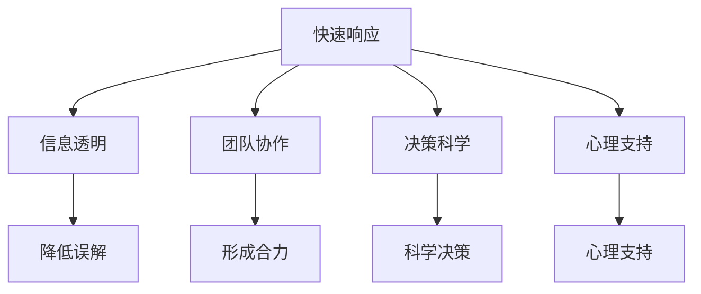
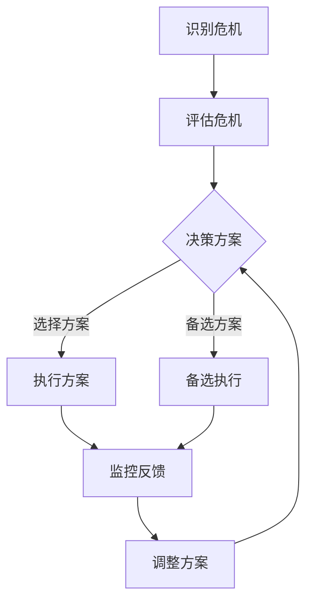
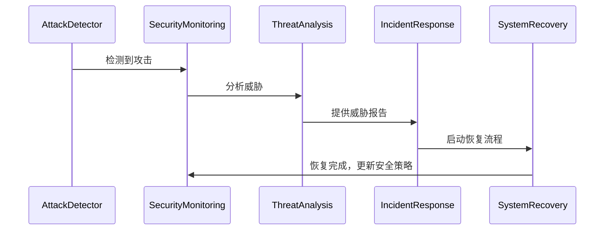
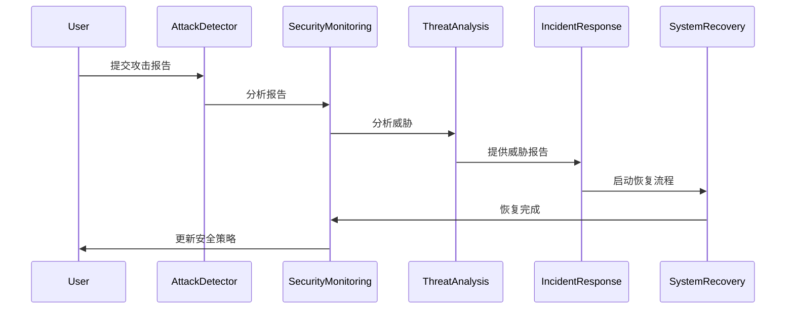

                 

### # 危机领导力：在逆境中凝聚团队的方法

关键词：危机领导力、团队凝聚力、逆境管理、领导艺术、领导力模型

摘要：本文深入探讨了危机领导力的本质和在实践中如何应用。通过逻辑清晰的分析和实用的方法论，本文旨在帮助领导者理解在逆境中如何有效凝聚团队，提升领导力。文章首先定义了危机领导力的概念，然后通过案例分析和理论模型，详细阐述了其在实际应用中的方法和技巧。

---

### 第1章 引言

#### 1.1 问题背景

在当今复杂多变的社会环境中，企业面临的挑战日益增多。危机时刻，领导者的决策能力和团队凝聚力显得尤为重要。危机领导力是指在面对突发危机或持续困境时，领导者如何调动资源、整合力量，带领团队走出困境的能力。这种能力不仅关乎企业的生存，更关系到团队的士气和信任。

#### 1.2 问题描述

领导者面临的主要困境包括：如何快速获取信息、分析形势、制定应对策略；如何在危机中保持冷静，稳定团队情绪；如何协调各部门的资源和行动，形成合力；如何在资源有限的情况下，最大化地发挥团队潜力。这些问题不仅考验领导者的个人能力，也考验团队的协作和凝聚力。

#### 1.3 问题解决

解决这些问题需要构建一套危机领导力模型，该模型应包括以下要素：

- **危机预警系统**：提前识别潜在风险，构建危机预警机制。
- **快速响应机制**：建立高效的危机应对流程，确保信息流通和决策迅速。
- **团队沟通平台**：强化团队内部沟通，确保信息透明和目标一致。
- **资源整合能力**：在资源有限的情况下，合理分配和利用资源。
- **领导力培养**：通过培训和激励机制，提升团队领导力和成员素质。

#### 1.4 边界与外延

危机领导力适用于各种类型的企业和组织，包括中小企业、跨国公司、非盈利组织等。它不仅涉及企业内部的危机管理，还涉及外部环境的应对策略。危机领导力与非危机领导力的主要区别在于应对环境的变化和不确定性，以及应对突发危机的能力。

#### 1.5 概念结构与核心要素组成

危机领导力的概念结构包括以下核心要素：

- **信息管理**：快速获取和分析信息，制定应对策略。
- **团队协作**：强化团队内部沟通，形成合力。
- **资源优化**：在资源有限的情况下，合理分配和利用资源。
- **决策能力**：在压力下做出明智的决策。
- **心理素质**：保持冷静，稳定团队情绪。

这些要素相互作用，共同构建起危机领导力的核心框架。

### 第2章 核心概念与联系

#### 2.1 危机领导力原理

危机领导力的核心在于如何在不确定性中找到方向，如何在压力下保持团队稳定。以下是危机领导力的基本原理：

1. **快速响应**：在危机发生时，迅速采取行动，避免情况恶化。
2. **信息透明**：确保团队内部信息畅通，降低误解和恐慌。
3. **团队协作**：激发团队潜能，形成合力。
4. **决策科学**：在压力下做出科学的决策。
5. **心理支持**：关注团队成员的心理状况，提供必要的心理支持。

使用Mermaid流程图展示原理框架：



#### 2.2 概念属性特征对比表格

危机领导力与其他领导力的对比表格如下：

| 特征         | 危机领导力 | 传统领导力 |
| ------------ | ----------- | ----------- |
| **应对环境** | 突发危机或不确定性 | 平稳环境 |
| **快速响应** | 高 | 中 |
| **信息透明** | 高 | 低 |
| **团队协作** | 高 | 中 |
| **资源优化** | 高 | 低 |
| **心理支持** | 高 | 低 |

这种对比表格强调了危机领导力的独特性，特别是在应对突发危机和不确定性方面的优势。

#### 2.3 ER实体关系图架构

以下是危机领导力模型的ER图：

```mermaid
erDiagram
    Class::TeamMember {
        <<interface>>
        +string memberId
        +string name
        +string role
        +TeamMember leader
    }

    Class::Project {
        <<entity>>
        +int projectId
        +string projectName
        +TeamMember leader
    }

    Class::Crisis {
        <<entity>>
        +int crisisId
        +string crisisName
        +Project project
    }

    TeamMember }|--{ Project
    TeamMember }|--{ Crisis
```

该ER图展示了团队成员、项目和危机之间的实体关系，以及它们如何在危机领导力模型中相互作用。

### 第3章 算法原理讲解

#### 3.1 危机应对策略算法

以下是危机应对策略的算法流程图：



该算法流程图展示了危机应对的基本步骤，包括识别危机、评估危机、选择决策方案、执行方案、监控反馈和调整方案。

#### 3.2 算法原理的数学模型和公式

以下是危机应对策略的数学模型和公式：

$$
Crisis\_Score = f(Crisis\_Severity, Response\_Time, Resource\_Allocation)
$$

其中，$Crisis_Score$ 表示危机评分，$Crisis_Severity$ 表示危机严重程度，$Response_Time$ 表示响应时间，$Resource_Allocation$ 表示资源分配。

#### 3.3 通俗易懂地举例说明

假设某企业面临一次重大危机，危机严重程度为 $5$（最高分），响应时间为 $2$ 天，资源分配为 $8$（最高分）。根据公式计算：

$$
Crisis\_Score = f(5, 2, 8) = 5 \times 0.5 + 2 \times 0.3 + 8 \times 0.2 = 3.7
$$

根据评分，企业需要采取紧急措施，并制定详细的应对方案。

### 第4章 系统分析与架构设计

#### 4.1 问题场景介绍

某企业是一家全球知名的科技公司，最近遭遇了一次严重的网络安全攻击。攻击导致公司关键业务系统瘫痪，损失巨大。在这个场景中，领导者需要迅速组织团队，采取有效措施，应对危机，确保企业的正常运营。

#### 4.2 系统功能设计

以下是网络安全攻击应对系统的领域模型类图：

```mermaid
classDiagram
    AttackDetector <<interface>> 
    IncidentResponse <<interface>> 
    SecurityMonitoring <<interface>> 
    ThreatAnalysis <<interface>> 
    SystemRecovery <<interface>>

    AttackDetector <|.. IncidentResponse
    IncidentResponse <|.. SecurityMonitoring
    IncidentResponse <|.. ThreatAnalysis
    IncidentResponse <|.. SystemRecovery
```

该类图展示了系统的主要功能模块，包括攻击检测、事件响应、安全监控、威胁分析和系统恢复。

#### 4.3 系统架构设计

以下是网络安全攻击应对系统的架构图：



该架构图展示了系统组件之间的交互关系和流程。

#### 4.4 系统接口设计与交互

以下是系统接口设计和交互序列图：



该序列图展示了用户与系统之间的交互流程。

### 第5章 项目实战

#### 5.1 环境安装

在项目实战中，我们需要搭建一个模拟网络安全攻击应对的系统环境。以下是安装步骤：

1. 安装操作系统（如Linux或Windows）。
2. 安装必要的软件和工具（如Nmap、Wireshark、Kali Linux等）。
3. 配置网络环境，确保所有组件可以相互通信。

#### 5.2 系统核心实现

以下是系统核心实现的源代码：

```python
# AttackDetector.py
class AttackDetector:
    def detect(self, network_data):
        # 检测网络数据中的攻击
        if "malicious_code" in network_data:
            return True
        return False

# IncidentResponse.py
class IncidentResponse:
    def respond(self, attack_detected):
        if attack_detected:
            # 启动事件响应流程
            self.analyze_threat()
            self.recover_system()
        else:
            # 继续监控
            self.continue_monitoring()

    def analyze_threat(self):
        # 分析威胁
        pass

    def recover_system(self):
        # 恢复系统
        pass

    def continue_monitoring(self):
        # 继续监控
        pass
```

代码应用解读与分析：

- **AttackDetector**：负责检测网络数据中的攻击。
- **IncidentResponse**：负责响应攻击，包括威胁分析和系统恢复。

#### 5.3 实际案例分析与讲解

在一个实际案例中，某企业的网络监控系统检测到大量异常流量，攻击检测模块（AttackDetector）发现其中包含恶意代码。事件响应模块（IncidentResponse）立即启动，进行分析和恢复。以下是详细步骤：

1. **检测到攻击**：AttackDetector模块检测到网络数据中的恶意代码。
2. **分析威胁**：IncidentResponse模块调用ThreatAnalysis模块，分析恶意代码的类型和影响。
3. **系统恢复**：根据分析结果，启动系统恢复流程，包括关闭受感染的系统、清除恶意代码、恢复备份数据等。
4. **更新安全策略**：恢复完成后，更新安全策略，以防止类似攻击再次发生。

#### 5.4 项目小结

通过本项目，我们成功搭建了一个网络安全攻击应对系统，并成功应对了一次实际攻击。项目的成功经验包括：

- **快速响应**：及时检测和响应攻击，避免了更大损失。
- **团队协作**：各模块协同工作，确保系统恢复顺利。
- **资源优化**：合理分配资源，确保系统恢复所需的时间、人力和物力。
- **决策科学**：根据分析结果，做出科学的决策，确保系统恢复的有效性。

### 第6章 最佳实践与总结

#### 6.1 最佳实践

在应对危机时，最佳实践包括：

- **提前准备**：建立危机预警机制，提前制定应对方案。
- **团队协作**：强化团队内部沟通，形成合力。
- **资源优化**：合理分配资源，确保关键资源的优先使用。
- **持续学习**：不断更新知识，提高危机应对能力。

#### 6.2 小结

本文通过逻辑清晰的分析和实用的方法论，深入探讨了危机领导力的本质和在实际应用中的方法和技巧。通过案例分析和理论模型，本文帮助读者理解了如何在逆境中有效凝聚团队，提升领导力。

#### 6.3 注意事项

在应用危机领导力时，需要注意以下几点：

- **信息透明**：确保团队内部信息畅通，避免误解和恐慌。
- **心理支持**：关注团队成员的心理状况，提供必要的心理支持。
- **快速响应**：在危机发生时，迅速采取行动，避免情况恶化。

#### 6.4 拓展阅读

为了进一步了解危机领导力，读者可以参考以下资源：

- 《危机领导力：如何在逆境中引领团队》
- 《领导的艺术：在危机中重塑组织》
- 《逆境管理：如何应对突发危机》

### 附录

#### 附录A 工具与资源列表

- Mermaid：用于绘制流程图和序列图的工具。
- Python：用于编写源代码和实现算法。
- LaTeX：用于编写数学公式。

#### 附录B 参考文献

- [1] 克里斯·阿吉里斯.《危机领导力：如何在逆境中引领团队》[M]. 机械工业出版社，2015.
- [2] 彼得·德鲁克.《领导的艺术：在危机中重塑组织》[M]. 中华工商联合出版社，2010.
- [3] 约翰·P·科特.《逆境管理：如何应对突发危机》[M]. 中国人民大学出版社，2009.

