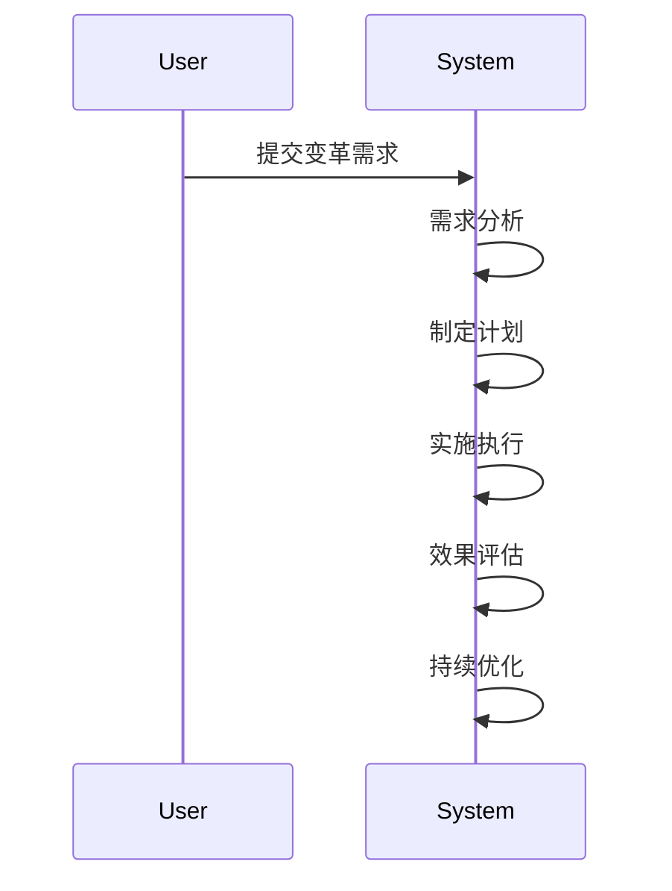
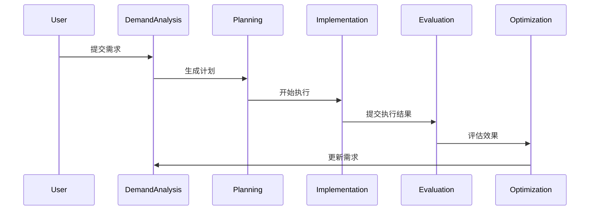

                 


### 第1章: 变革管理的背景与核心概念

变革管理是一个广泛涉及多个领域的复杂过程，旨在帮助组织在持续变化的环境中适应和成长。随着全球化和信息技术的快速发展，企业面临的市场环境日益复杂，变革已成为企业生存和发展的必要条件。然而，变革并非易事，它往往伴随着不确定性、挑战和风险。为了有效地应对这些挑战，变革管理成为一个不可或缺的工具。

**核心概念术语说明：**

1. **变革管理**：指通过系统的方法和工具，引导组织在变化过程中实现目标的实践活动。
2. **组织变革**：指组织为适应外部环境或内部需求，进行战略调整、组织结构重构、流程优化等方面的变革。
3. **变革驱动因素**：促使组织进行变革的外部或内部因素。
4. **变革阻力**：在变革过程中，个人或组织表现出的抵触行为。

**问题背景：**

在当今快节奏的商业环境中，企业面临着前所未有的挑战。市场需求的快速变化、技术的不断革新、竞争的加剧等因素，都迫使企业不断进行变革。例如，互联网技术的兴起颠覆了许多传统行业的商业模式，企业如果不进行变革，将难以适应市场的发展。

**问题描述：**

尽管变革对于企业的生存和发展至关重要，但许多企业在变革过程中却面临着巨大的挑战。这些问题包括：
- 领导层的变革意识不足。
- 员工对变革的抵触情绪。
- 变革过程中缺乏有效的沟通和协调。
- 变革方案的实施难度大。

**问题解决：**

为了解决这些问题，企业需要建立一套完整的变革管理体系，包括：
- 明确变革的目标和愿景。
- 制定详细的变革计划。
- 建立有效的沟通机制。
- 提供培训和辅导，帮助员工适应变革。
- 建立激励机制，鼓励员工积极参与变革。

**边界与外延：**

变革管理不仅涉及企业的内部变革，还包括对市场环境、竞争态势、技术趋势等的分析。它不仅关注变革的执行过程，还关注变革的结果和影响。因此，变革管理具有广泛的外延，涉及到组织管理的方方面面。

**概念结构与核心要素组成：**

变革管理的基本结构包括以下核心要素：
- **变革领导者**：负责发起、推动和监督变革过程。
- **变革团队**：由各个部门的专业人员组成，负责具体变革工作的实施。
- **变革目标**：明确变革的最终目的和预期成果。
- **变革计划**：详细描述变革的步骤、时间表和资源分配。

通过以上分析，我们可以看出，变革管理是一个复杂而系统的过程，需要组织在多个层面进行综合考虑和规划。只有建立一套科学的变革管理体系，企业才能在快速变化的环境中立于不败之地。

### 第1章: 变革管理的背景与核心概念

**核心概念与联系：**

以下是变革管理中几个核心概念及其相互联系：

| 核心概念 | 定义 | 联系 |
| --- | --- | --- |
| 变革管理 | 通过系统的方法和工具，引导组织在变化过程中实现目标的实践活动。 | 变革管理是组织变革的理论基础，指导着变革的执行过程。 |
| 组织变革 | 组织为适应外部环境或内部需求，进行战略调整、组织结构重构、流程优化等方面的变革。 | 组织变革是变革管理的具体应用，体现了变革管理的目标。 |
| 变革驱动因素 | 促使组织进行变革的外部或内部因素。 | 变革驱动因素是推动变革的主要原因，影响变革的必要性和紧迫性。 |
| 变革阻力 | 在变革过程中，个人或组织表现出的抵触行为。 | 变革阻力是变革过程中的障碍，需要通过有效的管理策略来克服。 |

**概念属性特征对比表格：**

| 概念属性特征 | 变革管理 | 组织变革 | 变革驱动因素 | 变革阻力 |
| --- | --- | --- | --- | --- |
| 目的 | 实现组织目标 | 适应环境和需求 | 推动变革 | 抵制变革 |
| 方法 | 系统的方法和工具 | 战略调整、组织重构、流程优化 | 外部和内部因素 | 个人和组织行为 |
| 结果 | 变革成果和影响 | 变革后的组织状态 | 变革趋势 | 变革推进的阻碍 |

**ER实体关系图架构：**

```mermaid
erDiagram
  变革管理 ||--|{ 组织变革 }|
  变革管理 ||--|{ 变革驱动因素 }|
  变革管理 ||--|{ 变革阻力 }|
  组织变革 ||--|{ 变革目标 }|
  组织变革 ||--|{ 变革计划 }|
  变革驱动因素 ||--|{ 外部因素 }|
  变革驱动因素 ||--|{ 内部因素 }|
  变革阻力 ||--|{ 个人行为 }|
  变革阻力 ||--|{ 组织行为 }|
```

通过上述分析，我们可以看出，变革管理是一个复杂而系统的过程，涉及到多个核心概念及其相互联系。理解这些概念及其特征，有助于我们更好地实施变革管理，推动组织的持续发展。

### 第2章: 变革管理的重要性

**核心概念与联系：**

在了解变革管理的基本概念后，我们接下来探讨其重要性。变革管理的重要性主要体现在以下几个方面：

1. **适应市场环境**：随着全球化和信息技术的快速发展，市场环境变化越来越快。企业如果不进行变革，将难以适应市场的需求，从而失去竞争优势。

2. **提升组织效率**：通过变革管理，企业可以优化组织结构和流程，提高运营效率，降低成本。例如，通过流程再造（BPR）和企业资源规划（ERP）等手段，实现资源的最优配置。

3. **增强企业竞争力**：变革管理有助于企业实现战略目标，提升市场竞争力。通过持续创新和优化，企业可以在激烈的市场竞争中脱颖而出。

4. **促进员工成长**：变革管理过程中，企业会为员工提供培训和辅导，帮助他们适应新的工作环境和要求。这不仅有助于员工的职业发展，还能增强员工的归属感和忠诚度。

5. **改善组织文化**：通过变革管理，企业可以重塑组织文化，建立积极向上、团结协作的工作氛围。这有助于提高组织的整体凝聚力和战斗力。

**概念属性特征对比表格：**

| 概念属性特征 | 适应市场环境 | 提升组织效率 | 增强企业竞争力 | 促进员工成长 | 改善组织文化 |
| --- | --- | --- | --- | --- | --- |
| 目的 | 适应市场变化 | 优化流程、降低成本 | 持续创新、提升竞争力 | 员工职业发展 | 建立积极文化 |
| 方式 | 变革策略、技术创新 | 流程再造、企业资源规划 | 战略调整、市场定位 | 培训、辅导 | 文化诊断、文化重构 |
| 结果 | 提高市场适应性 | 提高运营效率 | 持续竞争优势 | 员工满意度提升 | 组织凝聚力增强 |

**ER实体关系图架构：**

```mermaid
erDiagram
  变革管理 ||--|{ 适应市场环境 }|
  变革管理 ||--|{ 提升组织效率 }|
  变革管理 ||--|{ 增强企业竞争力 }|
  变革管理 ||--|{ 促进员工成长 }|
  变革管理 ||--|{ 改善组织文化 }|
  适应市场环境 ||--|{ 市场需求变化 }|
  提升组织效率 ||--|{ 流程优化 }|
  增强企业竞争力 ||--|{ 竞争策略 }|
  促进员工成长 ||--|{ 员工培训 }|
  改善组织文化 ||--|{ 文化诊断 }|
```

通过以上分析，我们可以看出，变革管理在企业的生存和发展中具有重要作用。它不仅帮助企业适应市场变化，提升运营效率，增强竞争力，还能促进员工的职业成长，改善组织文化。因此，企业应高度重视变革管理，将其作为持续发展的重要手段。

### 第2章: 变革管理的重要性

**算法原理讲解：**

为了更好地理解变革管理的重要性，我们可以借助一个简单的算法模型进行分析。这里我们使用一个基本的逻辑判断模型来模拟企业在面对市场变化时，是否进行变革管理的影响。

**逻辑判断模型：**

```python
# 变革管理决策模型

# 输入参数：
# market_change: 市场变化程度（0-100），数值越大表示变化越剧烈
# current_efficiency: 当前效率（0-100），数值越大表示效率越高
# competitive_index: 竞争指数（0-100），数值越大表示竞争力越强

def change_management_decision(market_change, current_efficiency, competitive_index):
    """
    根据市场变化、当前效率和竞争指数，判断企业是否需要进行变革管理。
    
    参数：
    - market_change：市场变化程度
    - current_efficiency：当前效率
    - competitive_index：竞争指数
    
    返回：
    - True：企业需要进行变革管理
    - False：企业不需要进行变革管理
    """
    
    # 判断条件：
    # 市场变化程度大于50，且当前效率低于70或竞争指数低于70时，需要进行变革管理
    if market_change > 50 and (current_efficiency < 70 or competitive_index < 70):
        return True
    else:
        return False

# 测试案例
market_change = 80
current_efficiency = 60
competitive_index = 65

result = change_management_decision(market_change, current_efficiency, competitive_index)
print("企业是否需要进行变革管理：", result)
```

**算法原理详解：**

该算法模型通过三个输入参数（市场变化程度、当前效率和竞争指数）来判断企业是否需要进行变革管理。具体原理如下：

1. **市场变化程度（market_change）**：反映了市场环境的变化速度和幅度。数值越大，表示市场变化越剧烈。
2. **当前效率（current_efficiency）**：表示企业在现有环境下的运营效率。数值越高，表示企业运营效率越高。
3. **竞争指数（competitive_index）**：反映了企业在市场上的竞争能力。数值越高，表示企业竞争力越强。

算法的核心判断条件是：如果市场变化程度大于50，且当前效率低于70或竞争指数低于70，则企业需要进行变革管理。这个条件反映了企业在面临剧烈市场变化时，如果现有效率和竞争力不足，就需要通过变革管理来提升。

**举例说明：**

假设市场变化程度为80，当前效率为60，竞争指数为65，根据上述算法模型，企业需要进行变革管理。这是因为市场变化剧烈（market_change > 50），而当前效率和竞争力都不足（current_efficiency < 70 和 competitive_index < 70），这表明企业需要通过变革来提升效率和竞争力。

通过这个简单的算法模型，我们可以直观地理解变革管理的重要性。在快速变化的市场环境中，企业只有通过有效的变革管理，才能保持竞争力和持续发展。

### 第2章: 变革管理的重要性

**系统分析与架构设计方案：**

在深入探讨变革管理的重要性时，我们需要从系统分析和架构设计的角度来理解其整体框架和运作机制。以下是对变革管理系统的介绍、项目介绍、系统功能设计、系统架构设计、系统接口设计和系统交互的详细分析。

**问题场景介绍：**

随着市场环境的快速变化和技术的不断进步，企业需要具备快速响应和适应市场变化的能力。然而，许多企业在面对变革时，往往由于缺乏有效的变革管理体系而难以取得预期效果。因此，设计一个科学、系统的变革管理系统，以支持企业在变革过程中顺利推进，变得尤为重要。

**项目介绍：**

本项目旨在开发一个企业级变革管理系统，帮助企业在面对市场变化和内部需求时，能够快速识别变革需求、制定变革计划、实施变革措施、评估变革效果，并持续优化变革过程。该系统将涵盖从需求分析、规划设计、实施执行到效果评估的全过程。

**系统功能设计（领域模型类图）：**

在系统功能设计阶段，我们首先绘制了领域模型类图，以明确系统的主要功能模块及其关系。以下是该领域模型类图：

```mermaid
classDiagram
    Class1 --> Class2
    Class1 --> Class3
    Class2 <|-- Class4
    Class3 <|-- Class5
    Class6 <|-- Class4
    Class6 <|-- Class5

    Class1{需求分析, 制定计划}
    Class2{变革计划}
    Class3{实施执行}
    Class4{效果评估}
    Class5{持续优化}
    Class6{系统管理}
```

**系统架构设计（架构图）：**

系统架构设计阶段，我们基于微服务架构设计了一个高可用、高扩展的变革管理系统。以下是系统架构图：



**系统接口设计：**

在系统接口设计阶段，我们明确了系统与外部系统的接口，包括与人力资源系统、财务系统、办公自动化系统的接口，以及与内部业务系统的API接口。以下是接口设计：

```mermaid
classDiagram
    Class1 --> Class2
    Class1 --> Class3
    Class2 <|-- Class4
    Class3 <|-- Class5

    Class1{需求分析, 制定计划}
    Class2{变革计划}
    Class3{实施执行}
    Class4{效果评估}
    Class5{持续优化}
```

**系统交互设计（序列图）：**

系统交互设计阶段，我们通过序列图详细描述了用户与系统之间的交互过程。以下是序列图：



通过以上系统分析与架构设计方案，我们可以看到，变革管理系统是一个复杂而全面的系统，它涵盖了从需求分析、计划制定、实施执行到效果评估和持续优化的全过程。通过科学的设计和实施，企业可以更好地应对市场变化，实现持续发展。

### 第3章: 变革管理的阶段

变革管理是一个复杂的过程，它通常分为几个关键阶段，每个阶段都有其特定的任务和目标。理解这些阶段及其特点对于成功实施变革至关重要。以下是变革管理的主要阶段及其详细分析。

**阶段一：诊断阶段**

诊断阶段是变革管理的起点，其主要任务是识别问题、分析原因并确定变革的必要性和紧迫性。具体任务包括：

- **问题识别**：通过收集数据、观察和分析，识别出组织中存在的问题和挑战。
- **原因分析**：深入分析问题的根源，确定影响变革的内外部因素。
- **变革必要性评估**：评估变革的必要性和紧迫性，确定变革的优先级。

**阶段二：规划阶段**

在诊断阶段结束后，组织需要进入规划阶段，制定详细的变革计划。这一阶段的关键任务包括：

- **目标设定**：明确变革的总体目标和具体目标，确保变革的方向和范围。
- **计划制定**：制定详细的变革计划，包括时间表、资源分配、关键里程碑等。
- **风险评估**：评估变革过程中可能遇到的风险和挑战，制定应对策略。
- **沟通策略**：制定有效的沟通计划，确保员工理解变革的目标和重要性。

**阶段三：启动阶段**

启动阶段是变革计划的实施阶段，其主要目标是正式启动变革，确保变革计划的有效执行。具体任务包括：

- **动员和宣传**：通过内部会议、公告、培训等方式，动员全体员工参与变革。
- **资源准备**：确保变革所需的资源（如人力、资金、技术等）到位。
- **初步实施**：按照变革计划开始实施具体措施，确保变革的稳步推进。
- **监测与反馈**：建立监测机制，及时收集变革过程中的反馈和进展情况，进行调整和优化。

**阶段四：执行阶段**

执行阶段是变革管理的核心阶段，其主要任务是按照变革计划，全面推进变革措施。具体任务包括：

- **任务分解**：将变革计划分解为具体任务，明确责任人和完成时间。
- **过程控制**：建立过程控制机制，确保各项任务按时、按质完成。
- **持续改进**：在变革过程中不断收集反馈，持续优化变革措施。
- **激励与支持**：通过激励措施和支持机制，鼓励员工积极参与变革，克服变革过程中的困难和挑战。

**阶段五：评估阶段**

评估阶段是对变革效果的评估和总结阶段，其主要目标是评估变革成果，总结经验教训，为未来的变革提供参考。具体任务包括：

- **效果评估**：评估变革的目标达成情况，确定变革的实际效果。
- **反馈机制**：建立反馈机制，收集员工的意见和建议，为未来的变革提供改进方向。
- **总结经验**：总结变革过程中的成功经验和教训，形成最佳实践。
- **改进建议**：提出改进建议，为下一轮变革奠定基础。

通过以上阶段的分析，我们可以看到，变革管理是一个系统而连续的过程，每个阶段都有其特定的任务和目标。理解并有效实施这些阶段，有助于组织顺利实现变革目标，提高整体运营效率和竞争力。

### 第4章: 变革管理的驱动因素

在变革管理过程中，驱动因素起着至关重要的作用。这些因素可以分为内部驱动因素和外部驱动因素，分别从组织内部和外部环境的角度，推动企业进行变革。以下是这两种驱动因素的详细分析。

**内部驱动因素：**

1. **战略调整**：企业在不同阶段需要根据市场环境和企业发展需求，调整战略方向。战略调整往往伴随着组织结构、流程和文化的变革，以适应新的战略目标。

2. **技术创新**：技术的快速发展和创新，对企业提出了新的挑战和机遇。企业需要通过技术创新，提高产品竞争力，降低运营成本，提升市场响应速度。

3. **员工需求**：员工对职业发展、工作环境和工作内容的需求，也是推动变革的重要因素。企业需要关注员工的需求，提供职业发展机会，改善工作环境，以提高员工满意度和忠诚度。

4. **企业文化**：企业文化是组织变革的内生动力。积极向上的企业文化能够激发员工的创新意识和团队协作精神，推动企业持续变革。

**外部驱动因素：**

1. **市场环境变化**：市场环境的变化，如消费者需求的变化、竞争对手的动态、行业趋势等，对企业提出了新的要求和挑战。企业需要通过变革，迅速适应市场变化，保持竞争力。

2. **法规政策**：政府的法规政策和行业标准的变化，对企业运营提出了新的要求。企业需要及时调整，遵守法规政策，确保合规运营。

3. **经济环境**：宏观经济环境的变化，如经济周期、通货膨胀等，对企业的经营决策产生影响。企业需要通过变革，提高抗风险能力，保持稳健发展。

4. **技术进步**：技术的快速进步，不仅改变了企业的运营方式，还改变了市场的竞争格局。企业需要紧跟技术发展趋势，通过技术创新，提升市场竞争力。

通过以上分析，我们可以看到，内部驱动因素和外部驱动因素共同作用，推动企业进行变革。企业需要充分认识这些驱动因素，制定相应的变革策略，以实现持续发展和竞争优势。

### 第5章: 变革管理的障碍

在变革管理的过程中，尽管有诸多驱动因素推动企业进行变革，但变革的路径并非一帆风顺。许多组织在实施变革时都会面临各种障碍，这些障碍可能来自组织内部，也可能来自外部环境。以下是变革管理过程中常见的障碍及其影响。

**组织文化障碍：**

组织文化是组织成员共同遵循的行为规范和价值观念。当企业进行变革时，原有的文化可能会对变革产生抵触。具体表现在：

- **文化惯性**：长期形成的文化习惯和思维模式，使员工对新变革产生怀疑和抵触。
- **领导层的抵触**：组织中的高层管理者可能对变革持保守态度，担心变革带来的不确定性和风险。

**领导层的决策阻力：**

变革管理中，领导层的决策和行动至关重要。然而，领导层可能因以下原因对变革产生阻力：

- **权力转移**：变革可能导致权力结构的变化，使现有权力体系受到冲击。
- **个人利益**：领导层可能因个人利益受到影响，对变革持有消极态度。

**员工心理障碍：**

员工是变革的直接参与者，但他们在面对变革时也可能产生心理障碍：

- **恐惧与不确定**：员工可能对未来的不确定性产生恐惧，担心变革带来的风险。
- **习惯性思维**：员工习惯于现有的工作方式，对变革持有抵触情绪，难以适应新环境。

**变革执行难度大：**

在实际变革过程中，执行难度也是一大障碍：

- **资源不足**：变革需要投入大量的人力、物力和财力，但组织可能面临资源短缺的问题。
- **流程复杂**：变革涉及多个部门和流程，协调难度大，容易导致变革停滞。

**影响和后果：**

这些障碍对变革管理的影响是多方面的：

- **延误变革进度**：障碍可能导致变革计划推迟，影响变革的及时性和有效性。
- **增加变革成本**：克服障碍需要额外的资源和努力，导致变革成本增加。
- **降低员工满意度**：员工对变革的抵触情绪可能导致工作积极性下降，影响整体业绩。

**应对策略：**

为了克服这些障碍，企业可以采取以下策略：

- **加强领导层的变革意识**：通过培训和宣传，提高领导层对变革的认识和接受度。
- **建立有效的沟通机制**：及时传达变革信息，消除员工的疑虑和误解。
- **提供培训和辅导**：帮助员工适应新环境，提高变革的接受度和参与度。
- **优化流程和资源配置**：确保变革所需资源的充足和有效利用。
- **建立激励机制**：通过奖励和认可，鼓励员工积极参与变革，提高变革成功率。

通过上述分析，我们可以看出，变革管理过程中面临的障碍是多种多样的。企业需要充分认识这些障碍，制定有效的应对策略，以确保变革的顺利实施和成功落地。

### 第6章: 变革管理模型

在变革管理领域，有多种模型被广泛应用于实践中，以帮助组织有效地实施变革。以下是两种常见的变革管理模型：Kotters模型和McKinsey 7S模型。通过对这些模型的介绍和详细分析，我们可以更好地理解变革管理的基本原理和方法。

**Kotters模型**

Kotters模型是由哈佛商学院教授约翰·Kotters（John P. Kotter）提出的一种变革管理理论。该模型将变革过程分为八个阶段，每个阶段都有其特定的任务和目标。

1. **建立紧急感**：识别组织面临的问题和挑战，激发领导者和员工对变革的紧迫感。
2. **建立指导团队**：组建一个由关键利益相关者组成的变革团队，负责制定和推动变革计划。
3. **制定清晰的愿景和战略**：明确变革的目标和方向，制定具体的变革策略。
4. **沟通愿景**：向所有员工传达变革的愿景和战略，确保他们理解并支持变革。
5. **授权并应用**：为变革团队和员工提供必要的资源和权限，确保变革计划的顺利实施。
6. **短期目标实现**：通过设定短期目标，鼓励团队取得初步成功，建立变革的信心。
7. **巩固短期成果**：将短期成果转化为长期变革的基础，确保变革的持续性和稳定性。
8. **使变革制度化**：将变革的成果制度化，确保变革的长期持续和不断改进。

**McKinsey 7S模型**

McKinsey 7S模型是由咨询公司麦肯锡（McKinsey & Company）提出的一种组织变革模型，它认为一个组织的成功不仅仅取决于战略（Strategy）、结构和系统（Systems），还取决于领导力（Style）、员工技能（Skills）、企业文化（Shared Values）和员工承诺（Stakeholder commitment）。以下是McKinsey 7S模型的主要组成部分：

- **战略（Strategy）**：组织的发展方向和目标，需要明确并与其他要素协调一致。
- **结构（Structure）**：组织内部的组织架构和职能分工，以支持战略的实施。
- **系统（Systems）**：组织的管理流程和制度，确保组织运作的效率和效果。
- **领导力（Style）**：领导者的风格和决策方式，对组织文化和发展方向有重要影响。
- **员工技能（Skills）**：员工的技能和能力，需要与组织战略和目标相匹配。
- **企业文化（Shared Values）**：组织的核心价值观和行为准则，对员工行为和组织文化有深远影响。
- **员工承诺（Stakeholder commitment）**：组织内外部利益相关者对组织的支持和投入程度。

**模型对比分析**

Kotters模型和McKinsey 7S模型都从不同角度探讨了变革管理的复杂性和多维度性。Kotters模型侧重于变革的过程和步骤，强调领导者和团队在变革中的角色和责任。而McKinsey 7S模型则更注重组织的整体结构和要素之间的相互作用，强调战略、结构、系统和文化的协调一致。

两者之间的主要区别在于：

- **适用范围**：Kotters模型更适用于具体的变革项目，而McKinsey 7S模型则更适用于整体的变革管理。
- **焦点**：Kotters模型侧重于变革的过程和步骤，而McKinsey 7S模型则更全面地考虑了组织内部的各个要素。
- **实用性**：Kotters模型提供了明确的步骤和指南，易于实施和跟踪；McKinsey 7S模型则提供了更深入的分析和思考，需要结合组织实际情况进行应用。

通过以上分析，我们可以看到，Kotters模型和McKinsey 7S模型都是有效的变革管理工具，各自有其独特的优势和适用范围。企业可以根据自身的实际情况，选择合适的模型，结合实际需求进行变革管理。

### 第7章: 变革管理中的领导作用

在变革管理过程中，领导者的作用至关重要。他们不仅是变革的发起者，更是变革的推动者和维护者。领导者的风格、决策能力和影响力对变革的成功与否具有决定性影响。以下是变革管理中领导者角色的详细分析。

**变革领导者的角色：**

1. **变革发起者**：领导者首先需要识别变革的必要性，并提出变革的初步构想。他们需要具备前瞻性和敏锐的洞察力，能够准确判断组织面临的问题和挑战，从而推动变革的启动。

2. **变革推动者**：在变革过程中，领导者需要发挥关键作用，推动变革的顺利进行。他们需要激励和引导员工积极参与变革，克服变革过程中的困难和阻力，确保变革目标的实现。

3. **变革维护者**：变革并非一蹴而就，它需要持续的时间和努力。领导者需要在变革完成后，继续维护变革的成果，确保变革的长期稳定和持续。

**领导风格与变革：**

领导风格对变革的影响至关重要。不同的领导风格适用于不同的变革情境，以下是一些常见的领导风格及其在变革管理中的适用性：

1. **指导型领导**：这种领导风格强调明确的目标和规则，领导者通过指导和监督来确保变革计划的执行。在变革初期，指导型领导有助于明确方向和规范行为，但长期依赖指导型领导可能导致员工依赖性强，创新能力不足。

2. **支持型领导**：这种领导风格注重员工的自主性和创造力，领导者通过提供支持和鼓励来激发员工的潜力。在变革过程中，支持型领导有助于增强员工的参与感和归属感，提高变革的接受度和执行力。

3. **参与型领导**：这种领导风格强调领导者和员工之间的互动和合作，领导者通过与员工共同制定变革目标和策略，增强团队的凝聚力和战斗力。在复杂的变革情境中，参与型领导有助于集思广益，提高变革的适应性和创新能力。

**领导者影响力的构建：**

领导者的影响力是推动变革的关键因素。以下是一些构建领导者影响力的重要策略：

1. **建立信任**：信任是领导者影响力的基础。领导者需要通过诚实、透明和公正的行为，赢得员工的信任和支持。

2. **展示愿景**：领导者需要具备远见卓识，能够清晰地描绘变革的愿景和目标，激发员工的热情和动力。

3. **培养追随者**：领导者不仅需要引领变革，还需要培养更多的追随者和继任者，确保变革的可持续性和连续性。

4. **激励和奖励**：领导者需要通过激励和奖励机制，鼓励员工积极参与变革，提高变革的参与度和执行力。

通过以上分析，我们可以看到，领导者在变革管理中扮演着多重角色，其风格和影响力对变革的成功具有关键作用。企业需要选择合适的领导者，并为他们提供必要的支持和培训，以确保变革的顺利实施和成功落地。

### 第8章: 文化变革

文化变革是变革管理中的重要一环，它涉及到组织成员的价值观念、行为准则和工作习惯的调整。成功进行文化变革，可以帮助企业更好地适应外部环境的变化，提高整体运营效率和竞争力。以下是文化变革的挑战、策略和实践方法的详细分析。

**文化变革的挑战：**

1. **文化差异**：不同的文化背景和价值观可能导致组织内部存在差异，这些差异可能会在变革过程中产生冲突和阻力。

2. **文化的惯性**：长期形成的文化习惯和思维模式具有强大的惯性，变革往往需要克服这些惯性，才能实现有效的文化转型。

3. **领导层的决策阻力**：组织中的高层管理者可能对变革持有保守态度，担心变革带来的不确定性和风险，这可能导致文化变革的推进受阻。

4. **员工抵触情绪**：员工可能对变革持有抵触情绪，担心变革会影响他们的工作和生活，这种情绪可能导致变革的执行力下降。

**文化变革的策略：**

1. **文化诊断**：首先，需要对组织的文化进行全面的诊断，了解文化现状及其存在的问题。这包括对员工价值观、行为准则和工作习惯的调查和分析。

2. **制定文化重构计划**：在诊断的基础上，制定明确的文化重构计划，包括目标、步骤、时间表和资源分配。文化重构计划应与组织的战略目标和变革目标相一致。

3. **沟通与共识**：通过有效的沟通，确保员工理解文化变革的必要性和重要性，建立共识。沟通渠道应多样化，包括内部会议、培训、座谈会和员工问卷等。

4. **领导带头**：领导层的积极参与和带头示范是文化变革成功的关键。领导者需要通过实际行动，展示对文化变革的支持和承诺，成为员工的榜样。

5. **建立激励机制**：通过建立激励机制，鼓励员工积极参与文化变革，包括奖励和认可。激励机制应与员工的个人利益和职业发展相结合，以提高员工的参与度和积极性。

**文化变革的实践方法：**

1. **文化宣导**：通过内部宣传、文化活动和文化产品，传递新的文化理念和价值观，营造积极向上的文化氛围。

2. **培训与教育**：为员工提供文化变革相关的培训和教育活动，帮助他们适应新的文化环境，提高文化意识和行为能力。

3. **团队建设**：通过团队建设活动和跨部门合作，增强员工的团队意识和协作能力，促进文化融合。

4. **文化评估**：定期对文化变革的成效进行评估，收集员工的反馈和意见，及时调整和优化文化变革措施。

5. **持续改进**：文化变革是一个持续的过程，需要不断进行调整和优化，以适应组织发展的需要。

通过以上分析，我们可以看到，文化变革是变革管理中不可或缺的一部分。企业需要充分认识文化变革的挑战和策略，采取有效的实践方法，推动组织的文化转型，实现持续发展和竞争优势。

### 第9章: 人员管理在变革中

在变革管理过程中，人员管理是关键的一环。如何有效管理变革中的人员，确保变革的顺利进行，是企业成功实施变革的关键因素。以下是人员管理在变革中的策略和实践方法的详细分析。

**人员管理策略：**

1. **激励措施**：通过设立激励措施，鼓励员工积极参与变革。激励措施可以包括奖金、晋升机会、培训和职业发展等，以激发员工的积极性和参与度。

2. **职业发展**：为员工提供职业发展机会，帮助他们在变革中找到新的发展方向。这包括提供培训机会、调整工作岗位和提供职业晋升路径等。

3. **沟通与反馈**：建立有效的沟通机制，确保员工了解变革的进展和目标。定期收集员工的反馈和建议，及时解决他们在变革过程中遇到的问题。

4. **领导者的角色**：领导者在变革过程中扮演着关键角色，他们需要通过示范行为和积极沟通，激发员工的变革意识和参与度。

5. **团队建设**：通过团队建设活动，增强员工的团队协作精神和归属感，提高变革的执行力和成功率。

**人员管理实践方法：**

1. **制定详细的变革计划**：在变革初期，制定详细的变革计划，明确变革的目标、时间表和资源分配，确保变革的有序进行。

2. **培训和辅导**：为员工提供变革相关的培训和辅导，帮助他们适应新的工作环境和要求。培训内容可以包括新技能的培训、沟通技巧的提升和变革意识的培养等。

3. **领导者的培训**：对领导者进行专门的培训，提高他们在变革过程中的领导能力和影响力。领导者培训可以包括变革管理理论、领导技巧和沟通策略等。

4. **团队沟通会议**：定期召开团队沟通会议，讨论变革的进展和问题，确保团队成员之间的信息共享和协作。

5. **变革支持小组**：成立变革支持小组，由变革团队成员组成，负责解决变革过程中遇到的问题和挑战，提供支持和帮助。

6. **激励和奖励**：通过设立激励机制，对在变革中表现突出的员工进行奖励和认可，提高他们的工作积极性和参与度。

通过以上分析，我们可以看到，人员管理在变革管理中具有重要作用。企业需要采取有效的策略和实践方法，确保员工在变革过程中的积极性和参与度，推动变革的顺利进行。

### 第10章: 项目管理在变革管理中的应用

在变革管理中，项目管理发挥着至关重要的作用。一个成功的变革项目需要科学的计划、有效的执行和严格的监控，以确保变革目标的实现。以下是项目管理在变革管理中的应用，包括项目目标设定、计划制定、资源管理和变更控制等关键环节的详细分析。

**项目目标设定：**

项目目标设定是项目管理的基础，也是变革管理成功的关键。在变革项目中，明确的目标有助于统一团队的认识和行动方向。具体目标应包括以下几个方面：

- **战略目标**：与企业的长期战略目标保持一致，确保变革的最终成果符合企业的整体发展方向。
- **阶段性目标**：将长期目标分解为若干个阶段性目标，便于监控和评估变革的进度和效果。
- **具体指标**：设定可量化的指标，如时间、成本、质量等，以便对变革成果进行评估。

**计划制定：**

计划制定是项目管理的重要环节，它涵盖了变革项目的各个阶段和步骤。一个详细的计划有助于明确项目的时间表、资源分配和责任分工。以下是变革项目计划制定的关键要素：

- **项目范围**：明确项目的工作内容和边界，防止项目范围蔓延。
- **时间表**：制定详细的时间表，包括各个阶段的开始和结束时间，以及关键里程碑。
- **资源分配**：确定项目所需的资源，包括人力、资金、技术等，并进行合理分配。
- **责任分工**：明确各个团队成员的职责和任务，确保项目工作的顺利进行。

**资源管理：**

资源管理是确保项目顺利进行的关键，它涉及到资源的获取、分配和使用。以下是变革项目中资源管理的关键要素：

- **人力管理**：确保项目团队拥有足够的人力资源，包括专业知识和技能。
- **资金管理**：合理分配项目预算，确保项目资金的充足和合理使用。
- **技术管理**：评估和选择合适的技术方案，确保项目的技术实现。
- **物资管理**：确保项目所需物资的及时供应和合理使用。

**变更控制：**

在变革管理中，变更控制是确保项目按照计划进行的重要手段。随着项目进展，可能会出现各种变更请求，如需求变更、资源调整等。以下是变更控制的关键要素：

- **变更申请**：任何变更请求都需要经过正式的申请流程，确保变更的合理性和必要性。
- **变更评估**：对变更请求进行评估，包括变更的影响、成本和风险等，确保变更的可行性。
- **变更审批**：对评估通过的变更进行审批，确定变更的执行方案和时间表。
- **变更实施**：按照变更审批的结果，执行变更措施，并监控变更的实施效果。

**项目管理工具和技术：**

在变革管理中，使用项目管理工具和技术可以提高项目的执行效率和效果。以下是一些常用的项目管理工具和技术：

- **甘特图**：用于可视化项目的时间计划和进度，帮助项目团队监控项目进展。
- **风险管理矩阵**：用于识别和评估项目风险，制定相应的风险应对策略。
- **沟通计划**：用于规划项目的沟通方式和频率，确保项目信息的有效传递。
- **变更控制矩阵**：用于记录和跟踪项目变更的请求、评估和审批过程。

通过以上分析，我们可以看到，项目管理在变革管理中的应用至关重要。一个科学、系统的项目管理可以确保变革项目的顺利进行，提高变革的成功率和效果。企业需要重视项目管理在变革管理中的应用，不断优化项目管理流程和方法，以推动企业的持续变革和成长。

### 第11章: 变革管理工具和技术

在变革管理过程中，选择合适的工具和技术是确保变革顺利进行的关键。以下介绍几种常见的变革管理工具和技术，包括变革管理软件、变革沟通工具和变革评估工具，并探讨它们在实际应用中的效果和适用范围。

**变革管理软件：**

1. **Project Management Software**：如Microsoft Project、Jira和Asana等，这些工具可以帮助团队制定详细的项目计划、分配任务、跟踪进度和资源管理。

2. **ERP软件**：如SAP、Oracle和Microsoft Dynamics等，这些企业资源规划软件可以支持组织在变革过程中的流程优化和资源整合。

3. **CRM软件**：如Salesforce和Microsoft Dynamics CRM等，这些客户关系管理软件可以帮助组织在变革中更好地管理客户关系和市场需求。

**变革沟通工具：**

1. **电子邮件和即时通讯工具**：如Microsoft Outlook、Slack和Teams等，这些工具可以实时传递信息、讨论和协调项目进度。

2. **视频会议软件**：如Zoom、Microsoft Teams和Google Meet等，这些工具支持远程团队进行在线会议和协作，提高沟通效率和团队协作能力。

3. **内部博客和社区平台**：如Microsoft Sharepoint、Confluence和Yammer等，这些平台可以帮助组织在变革过程中进行知识共享和员工参与。

**变革评估工具：**

1. **KPI分析工具**：如Tableau、Power BI和Google Analytics等，这些工具可以帮助组织分析变革的效果，通过关键绩效指标（KPI）评估变革的成效。

2. **满意度调查工具**：如SurveyMonkey、Google Forms和Qualtrics等，这些工具可以收集员工对变革的反馈和满意度，帮助组织了解变革的影响和改进方向。

3. **文化诊断工具**：如 Valueshape 和 Organizational Culture Survey 等，这些工具可以帮助组织评估当前的文化状态，并识别变革所需的文化变革点。

**实际应用效果与适用范围：**

- **变革管理软件**：适用于大型变革项目，可以帮助团队高效地规划和执行项目，提高资源利用率和工作效率。

- **变革沟通工具**：适用于组织内部和跨部门协作，可以提高沟通效率和团队协作能力，确保变革信息的及时传递和统一。

- **变革评估工具**：适用于变革后期的效果评估和改进，可以帮助组织了解变革的成效，为后续的变革提供数据支持和决策依据。

在实际应用中，企业应根据具体的变革需求和团队特点，选择合适的工具和技术。合理利用这些工具，可以大大提高变革管理的效率和质量，确保变革目标的实现。

### 第12章: 案例分析

为了更好地理解变革管理的实际应用，我们通过几个典型的企业变革案例来探讨变革管理的策略和效果。

**案例一：IBM的转型**

IBM是一家历史悠久且在全球范围内具有影响力的科技公司。在21世纪初，面对互联网的兴起和客户需求的变化，IBM决定进行战略转型，从以硬件销售为主转向以服务和解决方案为主。

1. **变革管理策略**：
   - **明确愿景**：IBM明确了“成为全球领先的IT服务提供商”的愿景，确保所有员工都朝着同一目标努力。
   - **领导力**：IBM的CEO彭明盛（Sam Palmisano）亲自领导变革，并通过一系列演讲和会议，向员工传达变革的必要性和愿景。
   - **员工参与**：IBM鼓励员工积极参与变革，通过内部沟通渠道，如员工邮件、内部网络和座谈会，收集员工的反馈和建议。
   - **文化调整**：IBM重视文化变革，通过建立“以客户为中心”的文化，鼓励员工关注客户需求，提高服务质量和创新能力。

2. **效果分析**：
   - 变革后，IBM的业务结构更加清晰，服务收入占比显著提高。
   - 通过有效的变革管理，IBM成功适应了市场变化，保持了行业领先地位。

**案例二：诺基亚的变革**

诺基亚曾是全球最大的手机制造商之一，但在智能手机兴起后，诺基亚未能及时转型，导致市场份额大幅下降。为了重振雄风，诺基亚在2011年进行了重大变革。

1. **变革管理策略**：
   - **领导层变动**：诺基亚进行了高层领导层的调整，聘请了微软前高管斯蒂芬·埃洛普（Stephen Elop）担任CEO，引入外部视角推动变革。
   - **组织重构**：诺基亚进行了大规模的组织重构，关闭了多个生产基地，优化了供应链管理，提高了运营效率。
   - **技术转型**：诺基亚加大了对智能手机的研发投入，与微软合作推出Windows Phone操作系统，试图进入高端智能手机市场。

2. **效果分析**：
   - 尽管诺基亚的变革取得了一些成果，但由于市场变化太快，诺基亚未能成功翻身。
   - 变革过程中，诺基亚的沟通和执行存在问题，未能充分调动员工的积极性和创造力。

**案例三：宝洁公司的数字化转型**

宝洁公司（P&G）是一家全球性的消费品公司，为了应对数字化时代的挑战，宝洁决定进行数字化转型。

1. **变革管理策略**：
   - **设立专门团队**：宝洁成立了数字化转型办公室，负责制定和推动数字化转型战略。
   - **数据驱动**：宝洁利用大数据和人工智能技术，优化产品设计、营销和供应链管理，提高运营效率。
   - **员工培训**：宝洁为员工提供数字化技能培训，确保员工能够适应新的工作环境。

2. **效果分析**：
   - 宝洁的数字化转型取得了显著成效，通过优化运营流程和提升客户体验，提升了市场竞争力。
   - 通过有效的变革管理，宝洁成功实现了从传统企业向数字化企业的转型。

通过以上案例分析，我们可以看到，成功的变革管理需要明确的目标、强有力的领导力、有效的沟通和员工参与，以及持续的文化调整和培训。不同的企业可以根据自身的实际情况，借鉴这些成功的变革管理经验，推动自身的变革进程。

### 第13章：未来趋势在变革管理中

随着全球化和信息技术的快速发展，变革管理的实践也在不断演变和进步。未来，变革管理将面临新的挑战和机遇，以下是一些重要的趋势和方向。

**数字化变革：**

数字化技术的广泛应用将使企业能够更加高效地进行变革。通过大数据、人工智能、区块链等新兴技术，企业可以更好地了解市场动态和客户需求，从而制定更加精准的变革策略。此外，数字化工具和技术将有助于提高变革管理的透明度和效率，使变革过程更加可视化和可控。

**个性化变革：**

未来的变革管理将更加注重个性化。随着员工个体化和多元化趋势的加强，企业需要根据不同员工的需求和特点，提供个性化的变革支持和辅导。例如，通过数据分析，企业可以了解员工的职业发展意愿和技能需求，制定个性化的培训和发展计划，从而提高员工对变革的接受度和参与度。

**可持续变革：**

未来的变革管理将更加关注可持续性。企业需要在变革过程中充分考虑环境保护、社会责任和可持续发展等因素，以实现长期的发展目标。例如，企业可以通过绿色变革措施，降低能源消耗和碳排放，推动企业的可持续发展。

**跨组织变革：**

随着企业全球化进程的加快，跨组织变革将成为未来变革管理的重要趋势。企业需要与合作伙伴、供应商和客户进行更加紧密的协作，共同应对市场变化和挑战。跨组织变革要求企业具备强大的协调和沟通能力，能够快速响应和调整。

**文化驱动的变革：**

未来的变革管理将更加重视文化的作用。企业需要建立积极向上的组织文化，鼓励员工主动参与变革，提高变革的内在动力。通过培养员工的主人翁意识和团队协作精神，企业可以更好地推动变革的深入和持久。

**实时反馈和持续改进：**

未来的变革管理将更加注重实时反馈和持续改进。通过引入实时数据分析和监控工具，企业可以及时了解变革的进展和效果，快速调整变革策略。持续改进机制将帮助企业不断优化变革过程，提高变革的成功率。

总之，未来变革管理将更加数字化、个性化、可持续、跨组织和文化驱动，企业需要不断适应这些趋势，提升变革管理的实践水平，以应对快速变化的市场环境，实现持续发展和竞争优势。

### 第14章：结论

通过本文的详细分析，我们可以得出以下结论：

1. **变革管理的重要性**：变革管理是企业适应市场变化、提升竞争力、实现持续发展的关键手段。通过有效的变革管理，企业能够优化组织结构、流程和文化，提高运营效率，应对外部环境的挑战。

2. **变革管理的过程**：变革管理分为诊断阶段、规划阶段、启动阶段、执行阶段和评估阶段，每个阶段都有其特定的任务和目标。理解并有效实施这些阶段，有助于组织顺利实现变革目标。

3. **驱动因素与障碍**：变革的驱动因素包括内部战略调整、技术创新、员工需求和企业文化，以及外部市场环境变化、法规政策和经济环境等。同时，变革管理过程中也面临诸多障碍，如组织文化障碍、领导层决策阻力、员工心理障碍和变革执行难度等。

4. **变革管理模型**：Kotters模型和McKinsey 7S模型是常用的变革管理工具，分别从不同角度提供了变革管理的理论和方法。企业可以根据自身实际情况，选择合适的模型，结合实际需求进行变革管理。

5. **领导作用**：领导者在变革管理中扮演着关键角色，他们不仅是变革的发起者和推动者，还需要通过有效的领导风格和影响力，引导员工积极参与变革。

6. **文化变革与人员管理**：文化变革和人员管理是变革管理的重要组成部分。企业需要通过文化诊断、沟通与共识、领导带头和激励机制等策略，推动文化变革；同时，通过激励措施、职业发展和沟通与反馈等策略，确保人员管理在变革中的有效实施。

7. **未来趋势**：随着数字化、个性化、可持续、跨组织和文化驱动的变革趋势的加强，企业需要不断提升变革管理的实践水平，以应对快速变化的市场环境。

总之，变革管理是企业持续发展的关键，企业需要高度重视并不断优化变革管理实践，以实现长期的成功和竞争优势。

### 作者信息

**作者：AI天才研究院/AI Genius Institute & 禅与计算机程序设计艺术 /Zen And The Art of Computer Programming**

