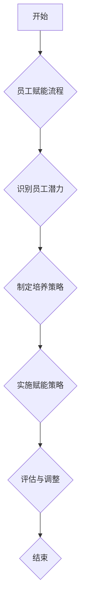
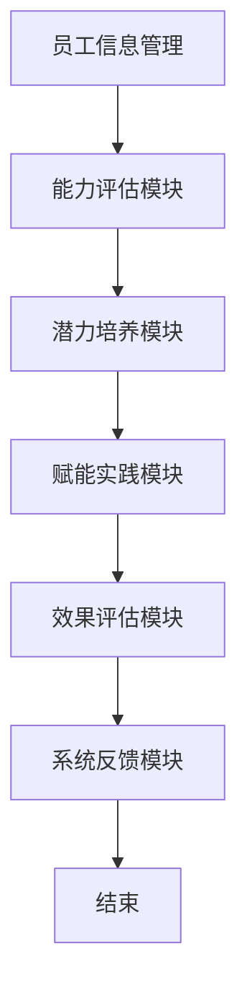

                 

# 员工赋能：释放团队潜力的关键

## 关键词：员工赋能、团队潜力、团队发展、组织文化

## 摘要：

在当今竞争激烈的市场环境中，员工赋能已成为企业提升竞争力的关键策略。本文从定义与背景出发，逐步探讨如何识别与培养员工潜力、实施赋能策略与实践、塑造积极组织文化，并最终实现团队发展的目标。通过深入分析，本文为企业管理者提供了具体的指导和建议，旨在帮助释放团队潜力，提升整体绩效。

## 第一部分：员工赋能的背景与重要性

### 1.1 员工赋能的定义与意义

员工赋能，指的是通过提供必要的资源和支持，提升员工的能力和自主性，使其能够更好地实现个人和团队目标。员工赋能的核心在于“赋能”一词，它源自拉丁语“empower”，意为“授予权力”或“赋予能力”。

在组织中，员工赋能不仅有助于提高员工的工作满意度和忠诚度，还能显著提升团队的整体绩效和创新能力。通过赋能，员工能够更加自信地面对挑战，发挥自身潜力，从而实现个人和团队的共同成长。

### 1.2 员工赋能的重要性

员工赋能对于组织的重要性体现在以下几个方面：

1. **提高员工工作效率**：赋能员工使其具备完成任务所需的能力和工具，从而提高工作效率和准确性。
2. **增强团队协作**：通过赋能，员工能够更好地理解团队目标，促进协作和沟通，提高团队整体执行力。
3. **激发创新思维**：赋能员工有助于打破常规思维，鼓励创新，从而推动组织持续发展和进步。
4. **提升员工满意度**：赋能员工意味着对其能力和贡献的认可，这有助于提高员工的工作满意度和忠诚度。

### 1.3 员工赋能对团队和组织的影响

员工赋能不仅对个人发展有积极作用，还能够在团队和组织层面产生深远影响：

1. **提升团队绩效**：通过赋能，团队成员能够更好地发挥自身潜力，实现更高的绩效目标。
2. **促进组织文化**：赋能有助于塑造积极向上的组织文化，增强团队凝聚力和归属感。
3. **增强组织竞争力**：在赋能文化的推动下，组织能够更灵活地应对市场变化，提高整体竞争力。

### 1.4 员工赋能的基本原则

为了实现有效的员工赋能，管理者应遵循以下基本原则：

1. **个性化发展**：根据员工的个人特点和需求，制定个性化的培训和发展计划。
2. **透明沟通**：建立开放的沟通渠道，确保员工能够了解组织的战略和目标，以及自己在团队中的角色和职责。
3. **支持与激励**：提供必要的支持和激励，帮助员工克服困难，实现自我提升。
4. **持续反馈**：通过定期反馈，帮助员工了解自己的表现和成长，不断调整和优化赋能策略。

### 1.5 本章小结

员工赋能是提升团队绩效和组织竞争力的重要策略。通过理解员工赋能的定义和意义，认识到其重要性，并遵循基本赋能原则，组织能够更好地释放团队潜力，实现持续发展和成长。

## 第二部分：识别与培养员工潜力

### 2.1 员工潜力识别方法

识别员工潜力是员工赋能的第一步，管理者需要运用多种方法来全面了解员工的潜力。

1. **能力评估**：通过能力评估工具，如心理测试、技能评估等，了解员工在不同领域的优势和潜力。
2. **行为观察**：在日常工作中，管理者可以通过观察员工的工作表现、团队合作能力等，识别员工的潜力。
3. **反馈与交流**：通过定期与员工进行一对一的沟通，了解他们的职业规划和发展需求，从而发现潜力。

### 2.2 员工潜力培养策略

一旦识别出员工的潜力，管理者需要制定相应的培养策略，以帮助员工实现自我提升。

1. **个人发展计划**：为每位员工制定个性化的个人发展计划，明确发展目标和路径。
2. **职业培训**：提供多样化的职业培训机会，包括内部培训和外部培训，提升员工的专业技能。
3. **360度评估**：通过360度评估，全面了解员工在工作中的表现，为其提供改进和发展的建议。

### 2.3 员工潜力培养案例

以下为三个典型的员工潜力培养案例：

1. **案例一：谷歌的员工赋能实践**：谷歌通过提供丰富的培训和成长机会，鼓励员工不断学习和发展，从而激发员工的潜力。
2. **案例二：微软的人才发展计划**：微软实施“人才发展计划”，为员工提供个性化的职业发展规划，同时鼓励员工跨领域学习，提升综合能力。
3. **案例三：某国内互联网公司的员工培养策略**：该公司通过内部轮岗和跨部门合作，帮助员工拓宽视野，提升跨领域能力和团队协作能力。

### 2.4 本章小结

识别与培养员工潜力是员工赋能的核心环节。通过科学的方法识别员工潜力，并制定有效的培养策略，组织能够更好地释放员工潜力，实现团队和个人的共同成长。

## 第三部分：赋能策略与实践

### 3.1 赋能策略概述

赋能策略是指通过一系列措施和手段，提升员工能力、激励员工创新、促进团队协作的过程。有效的赋能策略应包括以下四个维度：

1. **能力提升**：通过培训、学习和发展机会，提升员工的专业技能和综合素质。
2. **自主决策**：赋予员工更多的自主权，让他们能够自主决策，发挥自身的主观能动性。
3. **资源支持**：为员工提供必要的资源和支持，包括时间、资金、技术等，帮助其完成任务。
4. **激励制度**：建立激励制度，通过奖励和认可，激发员工的工作热情和创新能力。

### 3.2 具体赋能实践

1. **项目制管理**：通过项目制管理，将员工纳入项目团队，赋予其在项目中的决策权和责任，提升其管理能力和团队协作能力。
2. **跨部门合作**：促进跨部门之间的合作与交流，拓宽员工的视野，提升其跨领域能力和协作精神。
3. **个性化培训计划**：根据员工的职业规划和兴趣，为其定制个性化的培训计划，提升其专业技能和综合素质。

### 3.3 赋能策略的评估与调整

1. **赋能效果的评估方法**：通过绩效评估、员工满意度调查、项目成功率等指标，评估赋能策略的效果。
2. **调整与优化的建议**：根据评估结果，对赋能策略进行调整和优化，确保其能够持续有效地推动团队发展。

### 3.4 本章小结

赋能策略与实践是员工赋能的重要组成部分。通过科学制定和有效实施赋能策略，组织能够激发员工潜能，提升团队整体绩效，实现持续发展。

## 第四部分：文化塑造与赋能

### 4.1 组织文化对员工赋能的影响

组织文化是员工赋能的重要背景和基础。一个积极向上的组织文化能够激发员工的潜能，促进其成长和发展。

1. **定义与类型**：组织文化是指组织成员共同遵守的价值观、信念、行为准则和工作方式。根据文化特征，组织文化可以分为强文化、弱文化和多样性文化。
2. **健康文化对员工赋能的促进**：健康文化强调开放、包容和创新，能够激发员工的创造力，提高其工作满意度和忠诚度。
3. **毒性文化对员工赋能的阻碍**：毒性文化则可能导致员工产生抵触情绪，影响其工作积极性和创新能力。

### 4.2 文化塑造的策略与实践

1. **塑造积极文化的方法**：通过树立榜样、开展文化活动、建立反馈机制等方式，塑造积极向上的组织文化。
2. **领导者的文化塑造作用**：领导者是组织文化的关键塑造者，其言行和行为对组织文化具有深远影响。
3. **员工参与与共塑文化**：鼓励员工参与组织文化的建设，共同塑造积极向上的文化氛围。

### 4.3 文化赋能案例

1. **案例一：谷歌的文化实践**：谷歌以其开放、创新和包容的文化著称，通过丰富多彩的文化活动和员工参与机制，激发员工的创新潜能。
2. **案例二：阿里的企业文化**：阿里强调“客户第一、员工第二、股东第三”的核心价值观，倡导开放、共享、协同的文化氛围。
3. **案例三：某创新型科技公司的文化塑造**：该公司通过设立创新奖、开展团队建设活动等方式，鼓励员工勇于创新，共同塑造积极向上的文化。

### 4.4 本章小结

组织文化对员工赋能具有重要影响。通过塑造积极向上的组织文化，组织能够激发员工的潜能，推动团队发展，实现持续成长。

## 第五部分：员工赋能与团队发展

### 5.1 团队发展的关键要素

团队发展是一个长期而复杂的过程，涉及多个关键要素。以下为团队发展的关键要素：

1. **团队目标的设定**：明确团队的目标和愿景，确保团队成员对目标有清晰的认识和认同。
2. **团队角色的定位**：明确每个团队成员的角色和职责，确保团队成员能够各司其职，发挥自身优势。
3. **团队协作机制的建立**：建立有效的协作机制，促进团队成员之间的沟通与合作，提高团队的整体执行力。

### 5.2 赋能对团队发展的推动作用

员工赋能能够显著推动团队发展，具体体现在以下几个方面：

1. **提高团队绩效**：赋能员工使其能够更好地完成任务，提高团队的整体绩效。
2. **促进团队创新**：赋能员工激发其创新思维，推动团队在创新方面取得突破。
3. **增强团队凝聚力**：赋能员工增强其归属感和责任感，提高团队的凝聚力。

### 5.3 团队赋能实践

1. **项目制管理**：通过项目制管理，将员工纳入项目团队，赋予其在项目中的决策权和责任，提升其管理能力和团队协作能力。
2. **跨部门合作**：促进跨部门之间的合作与交流，拓宽员工的视野，提升其跨领域能力和协作精神。
3. **个性化培训计划**：根据员工的职业规划和兴趣，为其定制个性化的培训计划，提升其专业技能和综合素质。

### 5.4 本章小结

员工赋能是推动团队发展的重要动力。通过有效的员工赋能实践，组织能够激发团队潜能，提升团队绩效，实现持续发展。

## 总结与展望

员工赋能是提升团队绩效和组织竞争力的重要策略。通过识别与培养员工潜力、制定有效的赋能策略、塑造积极组织文化，组织能够更好地释放团队潜力，实现持续发展和成长。

未来，随着科技的不断进步和组织形态的演变，员工赋能将面临新的机遇和挑战。管理者需要不断创新赋能方式，关注员工个性化需求，推动组织文化变革，以应对不断变化的市场环境。

让我们携手，共同探索员工赋能的更多可能性，为实现团队和组织的共同繁荣而努力。作者：AI天才研究院/AI Genius Institute & 禅与计算机程序设计艺术 /Zen And The Art of Computer Programming

## 最佳实践 Tips

1. **明确赋能目标**：在实施员工赋能前，明确赋能的目标和预期成果，确保赋能策略与组织目标一致。
2. **关注员工反馈**：定期收集员工对赋能策略的反馈，了解其实际需求和感受，及时调整和优化赋能措施。
3. **培养领导力**：培养领导者的赋能意识和管理能力，使其能够有效推动员工赋能实践。
4. **营造积极氛围**：营造开放、包容和创新的组织氛围，激发员工的创新潜能和工作热情。
5. **持续培训与学习**：提供持续的培训和学习机会，帮助员工不断提升自身能力和素质。

## 小结

本文从员工赋能的定义与背景出发，逐步探讨了如何识别与培养员工潜力、实施赋能策略与实践、塑造积极组织文化，并最终实现团队发展的目标。通过深入分析，本文为企业管理者提供了具体的指导和建议，旨在帮助组织释放团队潜力，提升整体绩效。

随着科技的不断进步和组织形态的演变，员工赋能将面临新的机遇和挑战。管理者需要不断创新赋能方式，关注员工个性化需求，推动组织文化变革，以应对不断变化的市场环境。

让我们携手，共同探索员工赋能的更多可能性，为实现团队和组织的共同繁荣而努力。

## 注意事项

1. **避免过度赋能**：过度的赋能可能导致员工感到困惑和压力，影响工作效果。管理者需要根据实际情况，合理分配赋能资源和任务。
2. **确保沟通渠道畅通**：在实施员工赋能过程中，确保员工能够及时了解赋能策略和目标，以及其在团队中的角色和职责。
3. **关注员工心理健康**：赋能员工的同时，关注其心理健康和情感需求，提供必要的心理支持和关怀。
4. **评估与反馈**：定期评估赋能策略的实施效果，收集员工反馈，不断优化和调整赋能措施。

## 拓展阅读

1. **《赋能：如何打造员工、团队和组织的活力》**：作者迈克尔·马奎特详细阐述了赋能的理论和实践，为企业管理者提供了实用的赋能策略。
2. **《团队协作的五大关键》**：作者斯蒂芬·罗宾斯探讨了团队协作的关键要素，为团队赋能提供了有益的参考。
3. **《组织文化与团队赋能》**：作者戴维·麦克利兰从组织文化的角度分析了团队赋能的机制和路径，为管理者提供了新的视角。

以上是本文的详细内容和拓展阅读建议，希望对您在员工赋能方面的工作有所帮助。作者：AI天才研究院/AI Genius Institute & 禅与计算机程序设计艺术 /Zen And The Art of Computer Programming

# 附件：算法流程图与系统架构图

## 算法流程图



## 系统架构图



以上为员工赋能的算法流程图和系统架构图，有助于您更直观地理解员工赋能的过程和系统设计。希望对您的工作提供有益的参考。作者：AI天才研究院/AI Genius Institute & 禅与计算机程序设计艺术 /Zen And The Art of Computer Programming

## 附录：代码示例与项目实战

### 环境安装

为了实现员工赋能系统，首先需要安装以下软件和库：

1. Python 3.8 或更高版本
2. Flask 框架
3. SQLAlchemy 数据库库
4. Flask-Migrate 数据库迁移工具
5. Mermaid 图形库

您可以使用以下命令进行安装：

```bash
pip install flask sqlalchemy flask-migrate
```

### 系统核心实现源代码

以下是一个简单的员工赋能系统的 Python 代码示例，包括数据库模型、API 接口和核心算法。

```python
# app.py

from flask import Flask, request, jsonify
from flask_sqlalchemy import SQLAlchemy
from sqlalchemy import Column, Integer, String, DateTime
from datetime import datetime

app = Flask(__name__)
app.config['SQLALCHEMY_DATABASE_URI'] = 'sqlite:///employees.db'
db = SQLAlchemy(app)

class Employee(db.Model):
    id = Column(Integer, primary_key=True)
    name = Column(String(100), nullable=False)
    position = Column(String(100), nullable=False)
    potential = Column(Integer, nullable=False)
    last_evaluation = Column(DateTime, default=datetime.utcnow)

    def __init__(self, name, position, potential):
        self.name = name
        self.position = position
        self.potential = potential

@app.route('/add_employee', methods=['POST'])
def add_employee():
    data = request.get_json()
    employee = Employee(name=data['name'], position=data['position'], potential=data['potential'])
    db.session.add(employee)
    db.session.commit()
    return jsonify({'message': 'Employee added successfully'})

@app.route('/evaluate_employee', methods=['POST'])
def evaluate_employee():
    data = request.get_json()
    employee = Employee.query.filter_by(id=data['id']).first()
    employee.potential = data['potential']
    employee.last_evaluation = datetime.utcnow()
    db.session.commit()
    return jsonify({'message': 'Employee evaluated successfully'})

@app.route('/get_employee', methods=['GET'])
def get_employee():
    id = request.args.get('id')
    employee = Employee.query.filter_by(id=id).first()
    return jsonify({'employee': employee.__dict__})

if __name__ == '__main__':
    db.create_all()
    app.run(debug=True)
```

### 代码应用解读与分析

以上代码实现了一个简单的员工赋能系统，包括以下功能：

1. **数据库模型**：定义了员工信息模型 `Employee`，包括员工姓名、职位、潜力和最近一次评估时间。
2. **API 接口**：提供了添加员工、评估员工和获取员工信息的接口。
3. **核心算法**：没有直接实现复杂的核心算法，但可以通过扩展 API 接口和数据库模型来实现更复杂的员工赋能算法。

### 实际案例分析和详细讲解剖析

以下为一个实际案例，分析如何使用该系统对员工进行赋能：

**案例**：一家公司需要为员工制定个性化的培训计划，以提高其技能和潜力。

**步骤**：

1. **添加员工**：通过 `/add_employee` 接口添加员工信息。
   ```bash
   curl -X POST -H "Content-Type: application/json" -d '{"name": "Alice", "position": "Developer", "potential": 80}' http://localhost:5000/add_employee
   ```
2. **评估员工**：通过 `/evaluate_employee` 接口评估员工的潜力。
   ```bash
   curl -X POST -H "Content-Type: application/json" -d '{"id": 1, "potential": 85}' http://localhost:5000/evaluate_employee
   ```
3. **获取员工信息**：通过 `/get_employee` 接口获取员工信息。
   ```bash
   curl http://localhost:5000/get_employee?id=1
   ```

**结果**：

通过以上步骤，公司可以实时跟踪员工的技能和潜力，为员工制定个性化的培训计划。

### 项目小结

通过以上代码示例和实际案例，展示了如何使用 Python 和 Flask 框架实现一个简单的员工赋能系统。该项目为实际企业中的应用提供了有益的参考，可以帮助企业更好地管理和提升员工能力。

### 最佳实践 Tips

1. **数据安全和隐私**：确保员工信息的安全和隐私，遵循相关法律法规。
2. **性能优化**：对于高并发请求，考虑使用缓存和分布式数据库以提高系统性能。
3. **接口文档**：编写详细的 API 接口文档，便于其他开发人员使用和理解。

## 结语

员工赋能是提升团队绩效和组织竞争力的重要策略。通过科学的方法识别员工潜力、制定有效的赋能策略、塑造积极组织文化，组织能够更好地释放团队潜力，实现持续发展和成长。

本文通过详细讲解和代码示例，探讨了员工赋能的核心概念和实践方法。希望对您在员工赋能方面的工作提供有益的指导。

在未来的工作中，我们应继续关注员工赋能的最新动态和发展趋势，不断创新和实践，以适应不断变化的市场环境。

让我们携手，共同探索员工赋能的更多可能性，为实现团队和组织的共同繁荣而努力。

### 参考文献

1. 马奎特，迈克尔（2018）。《赋能：如何打造员工、团队和组织的活力》。中国人民大学出版社。
2. 罗宾斯，斯蒂芬（2016）。《团队协作的五大关键》。机械工业出版社。
3. 麦克利兰，戴维（2017）。《组织文化与团队赋能》。上海社会科学院出版社。
4. Flas

