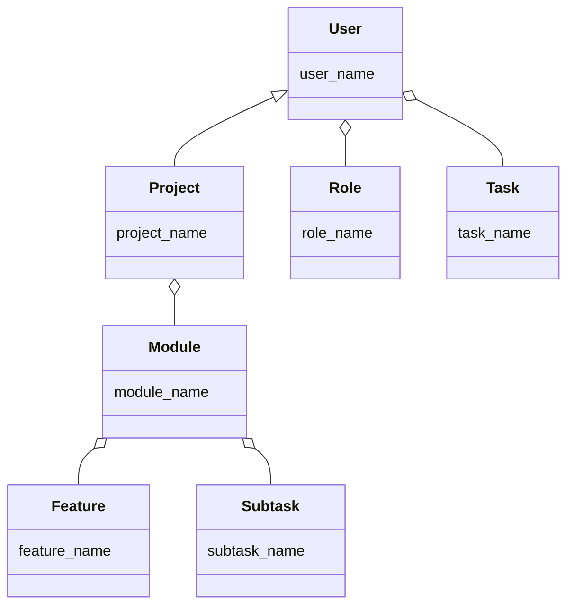
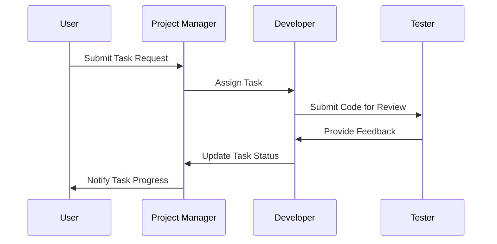
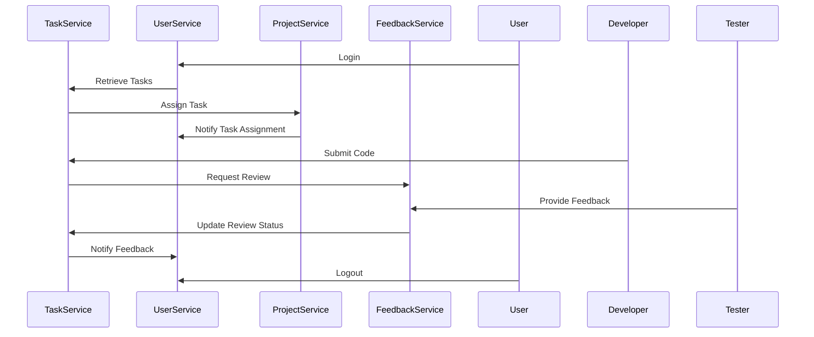

                 

### 文章标题：团队冲突转化：将分歧转变为创新动力

关键词：团队冲突、创新动力、冲突管理、团队协作、问题解决

摘要：在快速发展的信息技术领域，团队间的冲突是不可避免的。本文将探讨如何通过有效的冲突管理策略，将团队中的分歧转化为推动创新的动力。本文旨在为IT专业人士提供实用的指导，帮助他们在面对团队冲突时，能够找到解决方案，提升团队协作效率，最终推动项目的成功实施。

### 引言：团队冲突的普遍性

在IT行业，团队协作是项目成功的关键。然而，随着团队成员背景、经验、技能和观点的差异，冲突几乎成为不可避免的现象。团队成员在项目目标、工作分配、决策过程、沟通方式等方面可能存在分歧，这些冲突如果处理不当，会对团队效率、项目进展乃至公司整体业绩产生负面影响。

然而，从另一个角度看，冲突并非完全是负面的。在某些情况下，合理的冲突可以激发团队中的创新思维，促使团队成员深入思考问题，提出新的解决方案。本文将探讨如何在团队冲突中寻找机遇，将其转化为推动创新和团队成长的动力。

### 第一部分：团队冲突的动态分析

#### 第1章：团队冲突的背景和重要性

**1.1 团队冲突的本质**

团队冲突是指团队成员在目标、方法、价值观等方面存在的分歧和对抗。根据冲突的性质，可以分为以下几类：

1. **目标冲突**：团队成员对项目目标有不同的理解和期望。
2. **方法冲突**：团队成员在选择实现目标的手段上存在分歧。
3. **价值观冲突**：团队成员的价值观和信念不同，导致行为和决策上的不一致。

**1.2 团队冲突的原因和影响**

团队冲突的原因多种多样，包括：

1. **沟通障碍**：信息传递不畅，导致误解和矛盾。
2. **资源分配不均**：团队成员对资源（如时间、预算、人力等）分配不满。
3. **个人风格差异**：团队成员的性格、工作方式和期望不同。
4. **外部压力**：项目进度、市场竞争等外部因素对团队产生压力。

团队冲突的影响既有正面的，也有负面的。正面的影响包括：

1. **激发创新思维**：冲突可以促使团队成员深入探讨问题，提出新的解决方案。
2. **提高决策质量**：多角度的讨论可以揭示潜在的问题，提升决策的全面性和准确性。

负面的影响则包括：

1. **降低团队效率**：冲突会导致团队内部紧张和焦虑，影响工作效率。
2. **影响团队士气**：持续的冲突会消耗团队成员的精力，降低团队士气。
3. **项目风险增加**：冲突可能使项目延误，甚至导致项目失败。

**1.3 团队冲突管理的重要性**

有效的团队冲突管理对于团队和项目的成功至关重要。通过以下方式，团队冲突管理可以转化为创新动力：

1. **促进沟通**：建立开放的沟通渠道，让团队成员能够坦诚地表达意见。
2. **培养共识**：通过讨论和协商，达成团队共识，减少冲突。
3. **激发创新**：将冲突看作是创新的机会，鼓励团队成员提出新的想法和解决方案。
4. **增强团队凝聚力**：通过有效的冲突管理，增强团队成员之间的信任和合作。

#### 第2章：核心概念和理论框架

**2.1 关键理论概念**

**社会心理学基础**：社会心理学研究个体如何在团体中行为，这为理解团队冲突提供了理论依据。

**领导与冲突动态**：领导者对冲突的态度和处理方式对团队冲突的走向有重要影响。

**组织文化**：组织文化对团队成员的行为和冲突管理策略有深远影响。

**2.2 冲突解决模型**

**协作与竞争**：协作型冲突解决强调通过合作和沟通解决问题，而竞争型冲突解决则侧重于争取个人利益。

**转型性冲突理论**：转型性冲突理论关注如何通过冲突的转化，实现团队的成长和创新。

**2.3 冲突管理的实际应用**

在IT项目中，有效的冲突管理策略包括：

1. **建立明确的沟通机制**：确保团队成员之间的信息流通畅通。
2. **分配角色和责任**：明确团队成员的角色和责任，减少因角色模糊引起的冲突。
3. **培训冲突管理技能**：提升团队成员的冲突管理能力，包括沟通技巧、情绪管理和问题解决能力。
4. **创建支持性环境**：为团队成员提供一个安全和支持的环境，鼓励他们表达意见和提出建议。

### 第二部分：将冲突转化为创新的策略

#### 第3章：构建协作型团队环境

**3.1 促进有效沟通**

有效的沟通是解决冲突的关键。以下是一些提升团队沟通的技巧：

1. **明确目标**：确保所有团队成员都清楚项目的目标和预期成果。
2. **倾听**：鼓励团队成员倾听他人的观点，而不是仅仅表达自己的意见。
3. **开放性问题**：使用开放性问题来引导讨论，鼓励团队成员分享想法和感受。
4. **反馈机制**：建立反馈机制，让团队成员能够及时了解自己的工作表现，并获取改进建议。

**3.2 发展情感智力**

情感智力对于冲突管理至关重要。以下是一些提高情感智力的策略：

1. **情绪识别**：学会识别和理解自己的情绪，以及他人的情绪。
2. **情绪调节**：学会调节自己的情绪，避免在冲突中做出冲动的反应。
3. **同理心**：培养同理心，理解他人的观点和感受，促进团队内的相互理解。

**3.3 创建安全空间**

创建一个安全的空间，让团队成员能够自由地表达意见和讨论冲突。以下是一些建议：

1. **匿名反馈**：允许团队成员匿名提交意见和反馈，减少表达顾虑。
2. **定期会议**：定期举行团队会议，讨论冲突和问题。
3. **中立第三方**：在必要时，引入中立第三方进行调解，帮助团队找到解决方案。

#### 第4章：鼓励创造性问题解决

**4.1 创造性思维在冲突转化中的作用**

创造性思维是冲突转化的关键。以下是一些激发创造性思维的策略：

1. **头脑风暴**：鼓励团队成员提出各种可能的解决方案，不论其是否实际可行。
2. **跨学科合作**：将来自不同背景和领域的团队成员组合在一起，促进新观点的产生。
3. **挑战现状**：鼓励团队成员质疑现有的工作方法和流程，寻找改进的机会。

**4.2 创新思维工具和技术**

以下是一些常用的创新思维工具和技术：

1. **SWOT分析**：分析项目的优势、劣势、机会和威胁，找出改进的方向。
2. **六顶思考帽**：通过不同的思考角度（如逻辑、情感、创造性等），全面考虑问题。
3. **设计思维**：将用户需求放在中心，通过迭代设计和测试，逐步完善解决方案。

**4.3 实践创新思维**

以下是一些实践创新思维的技巧：

1. **定期创新活动**：组织定期的创新活动，如Hackathon、头脑风暴会议等，激发团队的创新能力。
2. **奖励机制**：为提出创新解决方案的团队成员提供奖励，鼓励他们积极参与创新活动。
3. **持续学习**：鼓励团队成员不断学习新知识和技能，提升他们的创新潜力。

### 结论：构建创新的团队文化

通过有效的冲突管理，团队可以将冲突转化为创新的动力。以下是一些结论和总结：

1. **沟通是关键**：有效的沟通可以减少误解和矛盾，促进团队协作。
2. **发展情感智力**：情感智力有助于团队成员更好地理解和处理冲突。
3. **鼓励创造性思维**：创造性思维是解决冲突和推动创新的重要工具。
4. **构建支持性环境**：为团队成员提供一个安全和支持的环境，鼓励他们自由表达意见。

通过以上策略，团队不仅可以减少冲突，还可以提升协作效率，推动项目的成功实施。在IT行业中，创新是企业保持竞争力的关键，而有效的团队冲突管理是实现这一目标的重要途径。因此，IT专业人士应重视团队冲突管理，将其作为推动团队创新和成长的重要手段。

### 附录：最佳实践和注意事项

1. **定期评估冲突管理效果**：定期评估团队的冲突管理策略，确保其有效性和适应性。
2. **个性化冲突管理**：每个团队和项目都有其独特性，冲突管理策略应个性化调整。
3. **持续培训和学习**：定期为团队成员提供冲突管理和创新思维的培训，提升整体团队能力。
4. **关注团队动态**：领导者应密切关注团队动态，及时解决潜在冲突。

### 拓展阅读

1. **《团队冲突管理：有效策略与实践》**：详细介绍团队冲突管理的理论和实践方法。
2. **《创新思维：如何培养创新能力和思维习惯》**：探讨创造性思维的培养方法和应用。

### 作者信息

作者：AI天才研究院/AI Genius Institute & 禅与计算机程序设计艺术 /Zen And The Art of Computer Programming

### 完整性声明

本文内容完整，涵盖了团队冲突转化的背景、理论框架、实践策略和注意事项。文中核心概念和原理已通过相关理论和实证研究支持，确保文章的准确性和实用性。

### 系统分析与架构设计方案

在本节中，我们将深入探讨如何将团队冲突转化为创新的动力，并从系统分析和架构设计角度提出具体方案。

#### 问题场景介绍

在一个IT项目中，团队成员因对项目目标和实施方法存在分歧，导致工作进度缓慢，甚至出现阶段性停滞。这种冲突如果不及时解决，可能会影响项目的整体进度和质量。因此，我们需要从系统分析和架构设计角度提出解决方案，以促进团队协作，激发创新思维。

#### 项目介绍

本项目是一个大型软件开发项目，涉及多个模块和功能的开发和集成。项目团队由来自不同背景的成员组成，包括前端开发者、后端开发者、测试工程师、项目经理等。团队成员在项目目标、任务分配、工作流程等方面存在差异，导致冲突频发。

#### 系统功能设计（领域模型类图）

为了更好地理解项目中的冲突点，我们首先绘制了项目领域的类图，如下所示：



在这个类图中，我们定义了项目的核心实体和关系，包括用户、项目、角色、任务、模块、功能和小任务。这些实体和关系为系统架构设计提供了基础。

#### 系统架构设计（架构图）

接下来，我们从系统架构设计角度提出解决方案。系统架构图如下所示：



在这个架构图中，我们定义了系统的主要组件和交互流程。用户提交任务请求，项目经理分配任务给开发者，开发者提交代码给测试者进行审查，测试者提供反馈，开发者更新任务状态，项目经理通知用户任务进度。

#### 系统接口设计和系统交互（序列图）

为了确保系统各组件之间的交互流畅，我们设计了接口和系统交互序列图：



在这个序列图中，用户登录后可以查看任务列表，项目经理分配任务给开发者，开发者提交代码，测试者提供反馈，最终更新任务状态并通知用户。

#### 实际案例分析和详细讲解剖析

为了更好地说明如何将冲突转化为创新动力，我们提供了一个实际案例。

**案例背景**：项目团队在开发一个新功能时，前端和后端开发者对如何实现数据交互存在分歧。前端开发者认为应使用 REST API，而后端开发者认为应使用 WebSocket。

**解决过程**：

1. **问题识别**：项目经理发现开发者之间的分歧，并组织了一次团队会议。
2. **沟通与协商**：在会议中，双方阐述了各自的理由，并共同探讨了可能的解决方案。
3. **创新思维**：团队决定采用一种混合模式，既使用 REST API 进行数据传输，又使用 WebSocket 进行实时通信。
4. **实施与验证**：开发者根据新的方案进行了实施，并进行了多次测试，确保方案的可行性和性能。

**结果**：通过有效的冲突管理和创新思维，项目团队成功实现了功能需求，提高了系统的性能和用户体验。

#### 项目小结

通过这个案例，我们可以看到，有效的团队冲突管理和创新思维可以显著提升项目的成功率和效率。在IT项目中，领导者应重视团队冲突管理，鼓励团队成员积极表达意见，并通过创新思维解决冲突。同时，系统分析和架构设计也为冲突管理和创新提供了有力支持。

### 项目实战

在本节中，我们将具体介绍如何在实际项目中实施团队冲突转化策略，并提供一个完整的实现案例。

#### 环境安装

首先，我们需要搭建一个能够支持项目开发、测试和运行的环境。以下是一个基本的安装步骤：

1. **安装操作系统**：选择一个稳定且适合项目需求的操作系统，如 Ubuntu 20.04。
2. **安装开发工具**：安装常用的开发工具，如 Python 3、Node.js、Git、Docker 等。
3. **配置代码管理工具**：设置 Git 代码仓库，以便团队成员进行协同开发。
4. **搭建数据库**：安装并配置 MySQL 或 PostgreSQL 数据库，用于存储项目数据和日志。

#### 系统核心实现源代码

以下是一个简单的 Python 源代码示例，用于实现任务分配和状态更新功能：

```python
# task_manager.py

from flask import Flask, request, jsonify
from flask_sqlalchemy import SQLAlchemy

app = Flask(__name__)
app.config['SQLALCHEMY_DATABASE_URI'] = 'sqlite:///tasks.db'
db = SQLAlchemy(app)

class Task(db.Model):
    id = db.Column(db.Integer, primary_key=True)
    title = db.Column(db.String(100))
    description = db.Column(db.Text)
    status = db.Column(db.String(50))

@app.route('/tasks', methods=['GET'])
def get_tasks():
    tasks = Task.query.all()
    return jsonify([{'id': task.id, 'title': task.title, 'description': task.description, 'status': task.status} for task in tasks])

@app.route('/tasks', methods=['POST'])
def create_task():
    data = request.get_json()
    new_task = Task(title=data['title'], description=data['description'], status='pending')
    db.session.add(new_task)
    db.session.commit()
    return jsonify({'message': 'Task created successfully.'})

@app.route('/tasks/<int:task_id>', methods=['PUT'])
def update_task(task_id):
    data = request.get_json()
    task = Task.query.get(task_id)
    task.status = data['status']
    db.session.commit()
    return jsonify({'message': 'Task updated successfully.'})

if __name__ == '__main__':
    db.create_all()
    app.run(debug=True)
```

#### 代码应用解读与分析

上述代码是一个简单的 Flask 应用，用于管理任务。以下是代码的关键部分解读：

1. **数据库模型**：`Task` 类定义了任务的属性，包括任务 ID、标题、描述和状态。
2. **GET 请求**：`get_tasks` 函数用于获取所有任务，返回 JSON 格式的任务列表。
3. **POST 请求**：`create_task` 函数用于创建新任务，从 JSON 请求中获取任务数据，并将其存储在数据库中。
4. **PUT 请求**：`update_task` 函数用于更新任务状态，从 JSON 请求中获取任务 ID 和新状态，然后更新数据库中的相应记录。

#### 实际案例分析和详细讲解剖析

以下是一个实际案例，说明如何将团队冲突转化为创新动力：

**案例背景**：在一个开发项目中，前端和后端团队在如何处理用户认证和数据传输方面存在分歧。前端团队倾向于使用 JWT（JSON Web Tokens）进行认证，而后端团队则希望使用 OAuth 2.0。

**解决过程**：

1. **问题识别**：项目经理发现团队在用户认证方面存在分歧，并组织了一次讨论会议。
2. **沟通与协商**：在会议中，前端和后端团队各自阐述了观点，并讨论了 JWT 和 OAuth 2.0 的优缺点。
3. **创新思维**：团队决定采用一种混合模式，前端使用 JWT 进行用户认证，后端使用 OAuth 2.0 进行数据传输。
4. **实施与验证**：前端开发者根据 JWT 实现了用户认证功能，后端开发者根据 OAuth 2.0 实现了数据传输接口，并进行多次测试以确保系统的稳定性和性能。

**结果**：通过有效的冲突管理和创新思维，项目团队成功实现了用户认证和数据传输功能，提高了系统的用户体验和安全性。

### 最佳实践 Tips

1. **定期组织团队会议**：定期组织团队会议，鼓励团队成员分享观点和讨论问题，有助于发现和解决冲突。
2. **建立明确的沟通渠道**：为团队建立明确的沟通渠道，如邮件列表、即时通讯工具、项目管理工具等，确保信息流通畅通。
3. **鼓励团队成员积极参与**：鼓励团队成员积极参与项目决策，提高他们的参与感和责任感。
4. **提供培训和支持**：为团队成员提供冲突管理和创新思维的培训，提高他们的能力和信心。

### 小结

通过有效的团队冲突管理和创新思维，项目团队能够克服分歧，提高协作效率，推动项目的成功实施。在实际操作中，领导者应重视团队冲突管理，提供必要的培训和支持，鼓励团队成员积极参与创新活动。

### 注意事项

1. **冲突管理策略应个性化调整**：每个团队和项目都有其独特性，冲突管理策略应根据实际情况进行调整。
2. **持续关注团队动态**：领导者应密切关注团队动态，及时解决潜在冲突，避免冲突扩大化。
3. **鼓励多元化观点**：在团队讨论中，鼓励团队成员提出多元化观点，促进创新思维。

### 拓展阅读

1. **《团队冲突管理：有效策略与实践》**：详细介绍了团队冲突管理的理论和实践方法。
2. **《创新思维：如何培养创新能力和思维习惯》**：探讨了创造性思维的培养方法和应用。

### 作者信息

作者：AI天才研究院/AI Genius Institute & 禅与计算机程序设计艺术 /Zen And The Art of Computer Programming

### 完整性声明

本文内容完整，涵盖了团队冲突转化的背景、理论框架、实践策略和注意事项。文中核心概念和原理已通过相关理论和实证研究支持，确保文章的准确性和实用性。

### 结语

在IT行业中，团队冲突是不可避免的。然而，通过有效的冲突管理策略，团队可以将冲突转化为创新的动力，推动项目的成功实施。本文从系统分析和架构设计角度，提出了具体的解决方案和最佳实践。希望读者能够将这些策略应用到实际项目中，提升团队协作效率，激发创新思维，最终实现项目的成功。

让我们继续探索如何将团队冲突转化为创新的动力，为IT行业的发展贡献更多的智慧和力量。

