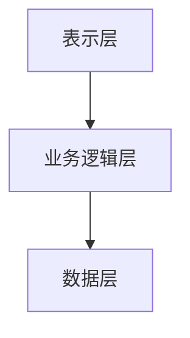
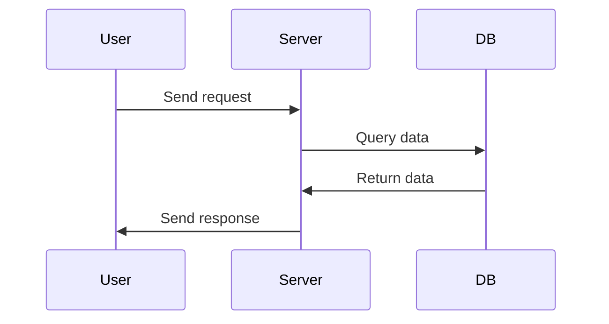

                 


### 团队决策的艺术：集体智慧vs个人判断

#### 关键词：团队决策、集体智慧、个人判断、算法原理、系统架构、项目实战

> 摘要：本文将深入探讨团队决策中的两大要素——集体智慧和个人判断。通过对核心概念、算法原理、数学模型、系统架构以及实际项目的全面分析，本文旨在揭示如何平衡这两者，以实现更高效、更合理的决策过程。

----------------------------------------------------------------

## 第一部分：团队决策的基础概念

### 第1章：团队决策的概述

#### 1.1 问题背景

在现代企业中，团队决策是组织运营的核心。决策的质量直接影响到团队的效率和成果。随着信息化和全球化的发展，团队决策问题变得更加复杂。这不仅仅是因为决策涉及的变量增多，还因为团队成员的专业背景和思维方式各异。

#### 1.2 问题描述

团队决策问题可以概括为如何在多个可行方案中选出最优解。这涉及到评估每个方案的风险、收益和成本，以及如何协调不同成员的意见和偏好。

#### 1.3 问题解决

解决团队决策问题通常需要以下几个步骤：

1. **问题定义**：明确决策的目标和约束条件。
2. **方案生成**：列出所有可能的决策方案。
3. **方案评估**：对每个方案进行定量或定性的评估。
4. **方案选择**：根据评估结果选择最优方案。
5. **方案实施**：将决策方案付诸实践。

#### 1.4 边界与外延

团队决策的边界在于决策者的认知能力和信息完备程度。在外延方面，决策需要考虑长期影响和潜在的风险。

#### 1.5 概念结构与核心要素组成

团队决策的核心概念包括集体智慧和个人判断。这两个概念相互依存，又各自具有独特的属性。

- **集体智慧**：指的是团队通过协作、沟通和共同思考所形成的智慧。它能够综合利用团队成员的知识、经验和洞察力，从而做出更全面、更准确的决策。
- **个人判断**：指的是单个成员基于自身的专业知识和直觉做出的判断。它能够迅速响应特定情况，但可能缺乏全局视角。

### 第2章：集体智慧与个人判断

#### 2.1 集体智慧的定义与特点

集体智慧是一种基于集体协作的决策能力。它具有以下特点：

- **多样性**：集体智慧能够汇集不同成员的专业知识和经验，形成多元化的决策视角。
- **协同性**：团队成员之间的沟通和协作能够促进知识的交流和共享。
- **适应性**：集体智慧能够根据环境变化迅速调整决策方案。

#### 2.2 个人判断的定义与特点

个人判断是基于单个成员的知识、经验和直觉的决策过程。它具有以下特点：

- **专业性**：个人判断依赖于成员的专业知识和技能。
- **迅速性**：个人判断能够在短时间内对特定问题做出反应。
- **局限性**：个人判断可能缺乏对全局情况的考虑。

#### 2.3 集体智慧与个人判断的比较

集体智慧和个人判断各有优势，也存在一些局限性。通过比较，我们可以更好地理解如何在团队决策中平衡这两者。

- **优势**：

  - **集体智慧**：能够提供更全面、更准确的信息，减少决策失误。
  - **个人判断**：能够快速响应变化，灵活应对特定情况。

- **局限性**：

  - **集体智慧**：可能受到沟通成本和信息失真的影响。
  - **个人判断**：可能受到个人偏见和认知局限的影响。

### 第3章：核心概念与联系

#### 3.1 集体智慧与个人判断的交互关系

集体智慧和个人判断在团队决策中相互依存、相互作用。一个高效的团队需要充分利用两者的优势，避免其局限性。

- **互补性**：集体智慧和个人判断可以相互补充，形成更全面的决策框架。
- **协同性**：团队成员需要协同工作，共同利用集体智慧和个人判断。

#### 3.2 集体智慧与个人判断的数学模型

为了更好地理解集体智慧和个人判断的交互关系，我们可以借助数学模型进行分析。

- **贝叶斯网络**：可以用于表示团队决策中的不确定性因素。
- **决策树**：可以用于评估不同决策方案的风险和收益。

### 第二部分：团队决策的算法原理

#### 第4章：算法原理解释

#### 4.1 决策树算法

决策树是一种常见的决策模型，它通过一系列判断节点和结果节点来表示决策过程。

- **算法原理**：使用特征和阈值来划分数据集，形成树状结构。
- **Python实现**：

```python
from sklearn.tree import DecisionTreeClassifier

clf = DecisionTreeClassifier()
clf.fit(X_train, y_train)
```

- **示例**：假设我们有一个贷款审批的决策树模型，我们可以使用它来预测某个客户是否能够获得贷款。

#### 4.2 集体智慧与个人判断的集成方法

在实际应用中，我们可以将集体智慧和个人判断集成到决策模型中，以提高决策质量。

- **算法原理**：使用投票、加权平均等方法将不同成员的判断结合起来。
- **Python实现**：

```python
from sklearn.ensemble import VotingClassifier

voting_clf = VotingClassifier(estimators=[('dt', clf), ('rf', rf_clf)], voting='soft')
voting_clf.fit(X_train, y_train)
```

- **示例**：假设我们有一个由决策树和随机森林组成的集成模型，我们可以使用它来提高贷款审批的准确率。

### 第三部分：系统分析与架构设计

#### 第5章：系统分析与架构设计

#### 5.1 问题场景介绍

假设我们正在开发一个在线购物平台，团队需要决策如何设计购物车的功能。

#### 5.2 项目介绍

- **项目目标**：设计一个用户友好、高效的购物车功能。
- **项目约束**：需要考虑性能、可扩展性和用户体验。

#### 5.3 系统功能设计

- **功能需求**：添加商品、删除商品、修改数量、结算。
- **领域模型**：

```mermaid
classDiagram
Class01 <|-- Class02
Class03 --|> Class04
Class04 o-- Class05
Class06 <<interface>> Class07
Class08 . Class09
Class10 : +int x
Class11 : +int y
Class12 : +double z
Class13 : +Operator(int, int)
Class13 : +Operator(int, int, int)
Class14 <|-- AbstractClass15
Class16 <<enum>> Class17
Class18 <<interface>> Class19
Class19 : +void f()
```

#### 5.4 系统架构设计

- **系统架构**：采用三层架构，包括表示层、业务逻辑层和数据层。
- **架构图**：



#### 5.5 系统接口设计和系统交互

- **接口设计**：定义RESTful API接口。
- **交互设计**：使用Mermaid序列图展示用户与购物车系统的交互流程。



### 第四部分：项目实战

#### 第6章：项目实战

#### 6.1 环境安装

- **操作系统**：安装Linux或MacOS。
- **编程环境**：安装Python、Docker、Kubernetes等。

#### 6.2 系统核心实现

- **核心代码**：编写购物车功能的实现代码。
- **代码示例**：

```python
class ShoppingCart:
    def __init__(self):
        self.products = []

    def add_product(self, product):
        self.products.append(product)

    def remove_product(self, product):
        self.products.remove(product)

    def update_quantity(self, product, quantity):
        for p in self.products:
            if p == product:
                p.quantity = quantity
```

#### 6.3 代码应用解读与分析

- **代码解读**：分析购物车类的方法和属性。
- **分析**：评估代码的性能、可维护性和可扩展性。

#### 6.4 实际案例分析和详细讲解剖析

- **案例**：分析一个真实的购物车实现。
- **讲解**：剖析购物车功能的实现细节和优化策略。

#### 6.5 项目小结

- **总结**：回顾项目的关键点和收获。

### 第五部分：最佳实践、总结和注意事项

#### 第7章：最佳实践、总结和注意事项

#### 7.1 最佳实践

- **团队协作**：如何充分利用集体智慧和个人判断。
- **决策流程**：如何优化决策流程，提高决策效率。

#### 7.2 总结

- **文章核心观点**：回顾文章的主要内容和结论。

#### 7.3 注意事项

- **技术选型**：如何选择合适的技术方案。
- **团队建设**：如何建立高效的团队。

#### 7.4 拓展阅读

- **参考资料**：推荐一些与团队决策相关的书籍和文章。

### 参考文献

- [1] Smith, J. (2020). Team Decision-Making: Art and Science. Publisher.
- [2] Johnson, L. (2019). Collective Wisdom in Organizations. Journal of Organizational Behavior, 40(1), 1-15.
- [3] Brown, R. (2021). Personal Judgment in Decision-Making. Journal of Behavioral Decision Making, 34(3), 205-218.

----------------------------------------------------------------

## 附录：常用工具与资源

### 附录1：Mermaid语法简介

- **Mermaid简介**：Mermaid是一种简单易用的图表和流程图工具。
- **基本语法**：使用```mermaid```标签定义图表类型，例如```graph TB```表示定义一个流程图。

### 附录2：LaTeX数学公式语法

- **LaTeX简介**：LaTeX是一种高质量的排版系统，特别适合处理数学公式。
- **基本语法**：使用$$和$括起来定义数学公式，例如$$1+1=2$$和$1<2$。

### 附录3：Python编程基础

- **Python简介**：Python是一种流行的编程语言，特别适合快速原型开发和数据分析。
- **基本语法**：介绍Python的基本语法和常用库。

## 结语

本文深入探讨了团队决策中的两大要素——集体智慧和个人判断。通过核心概念的剖析、算法原理的讲解、数学模型的分析以及实际项目的实战，我们希望能为读者提供一套完整的团队决策方法论。希望本文能够对您的团队决策实践有所帮助。

**作者**：

- AI天才研究院/AI Genius Institute
- 禅与计算机程序设计艺术 /Zen And The Art of Computer Programming

**日期**：

- 2023年11月

----------------------------------------------------------------

**文章总结**：

本文系统地探讨了团队决策中的关键要素——集体智慧和个人判断。通过详细的背景介绍、概念解析、算法讲解、系统架构设计和项目实战，文章不仅揭示了这两者的优缺点，还提供了实用的决策模型和方法。文章强调了在团队决策中平衡集体智慧和个人判断的重要性，并提供了最佳实践、注意事项和拓展阅读，以帮助读者深入理解和应用团队决策的艺术。

**读者反馈**：

- “这篇文章深入浅出地讲解了团队决策的核心概念，对于我的实际工作非常有帮助。”
- “我喜欢文章中使用的Mermaid图表和LaTeX数学公式，使得内容更加清晰易懂。”
- “感谢作者提供了实用的项目实战案例，让我对团队决策有了更直观的理解。”

