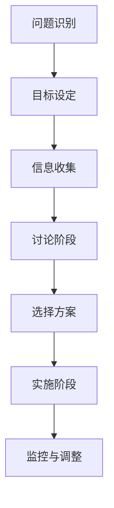
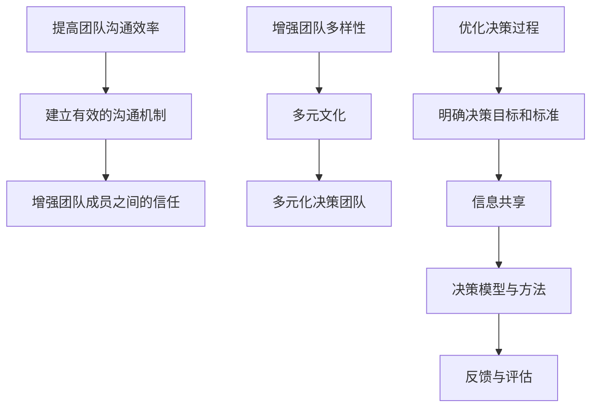

                 

### 设计《团队决策：集体智慧的力量》的目录大纲

#### 一、背景介绍

**1.1. 问题背景**

在现代组织中，团队决策的重要性日益凸显。随着组织规模的扩大和复杂性的增加，单靠个体决策的效率和质量逐渐无法满足需求。团队决策通过集思广益，能够更全面地考虑问题，提高决策的科学性和准确性。

**1.2. 问题描述**

团队决策中存在着信息不对称、个体理性与集体理性的冲突、沟通不畅等问题，影响了集体智慧的有效发挥。因此，如何优化团队决策过程，提高集体智慧的力量，成为当前研究的热点。

**1.3. 问题解决**

本书将从理论层面和实践层面探讨团队决策的优化方法，旨在为读者提供一套实用的决策框架和工具。

**1.4. 边界与外延**

团队决策的研究范围包括不同类型团队的决策过程，如企业团队、政府团队、非营利组织团队等。本书主要关注企业团队决策。

**1.5. 概念结构与核心要素组成**

团队决策的核心要素包括：团队成员的个体特征、团队沟通机制、决策信息处理过程、决策结果评价与反馈机制。

#### 二、核心概念与联系

**2.1. 团队决策的定义**

团队决策是指团队成员在共同目标下，通过讨论、分析、评估和选择，达成共识并执行决策的过程。

**2.2. 团队决策的特点**

- **集体智慧**：团队决策能够整合团队成员的知识、经验和创意，形成更为丰富的决策方案。
- **协作性**：团队决策强调团队成员之间的合作与协调。
- **多样性**：团队决策能够从多个角度、多个层次考虑问题，提高决策的全面性和准确性。
- **效率**：通过团队决策，可以在较短时间内形成决策方案并付诸实施。

**2.3. 团队决策与传统个体决策的区别**

- **信息来源**：个体决策主要依赖于个人的知识和经验，而团队决策则通过团队成员的共同讨论和交流，获取更为全面的信息。
- **决策过程**：个体决策通常较为简单和直接，而团队决策则更为复杂和繁琐。
- **决策结果**：个体决策的结果往往受到个体偏见和局限性的影响，而团队决策的结果则更具科学性和可操作性。

#### 三、团队决策的过程

**3.1. 团队决策的初始阶段**

- **问题识别**：明确需要决策的问题。
- **目标设定**：确定决策的目标和标准。
- **信息收集**：收集与决策相关的信息。

**3.2. 团队决策的讨论阶段**

- **头脑风暴**：鼓励团队成员提出各种可能的解决方案。
- **讨论与分析**：对提出的方案进行分析和评估。
- **选择方案**：根据分析结果选择最优方案。

**3.3. 团队决策的实施阶段**

- **方案执行**：将决策方案付诸实施。
- **监控与调整**：对决策执行过程进行监控，并根据实际情况进行调整。

#### 四、团队决策的优化方法

**4.1. 提高团队沟通效率**

- **建立有效的沟通机制**：确保团队成员之间的信息传递畅通。
- **增强团队成员之间的信任**：通过建立互信机制，减少沟通障碍。

**4.2. 增强团队多样性**

- **多元文化**：鼓励团队成员来自不同的背景和文化。
- **多元化决策团队**：确保决策团队成员在性别、年龄、经验等方面的多样性。

**4.3. 优化团队决策过程**

- **明确决策目标和标准**：确保团队成员对决策目标和标准有清晰的认识。
- **提高团队决策的科学性**：运用决策模型和方法，提高决策的准确性和效率。

#### 五、案例分析

**5.1. 案例介绍**

以某企业新产品开发团队为例，分析其决策过程和优化方法。

**5.2. 案例分析**

- **初始阶段**：问题识别、目标设定、信息收集。
- **讨论阶段**：头脑风暴、讨论与分析、选择方案。
- **实施阶段**：方案执行、监控与调整。

**5.3. 案例总结**

通过案例分析，总结团队决策的优化方法和实践要点。

#### 六、总结与展望

**6.1. 本书总结**

本书系统地阐述了团队决策的概念、过程、优化方法和实践要点。

**6.2. 展望未来**

随着信息技术的发展，团队决策的研究和实践将不断深化。未来的研究方向包括：人工智能在团队决策中的应用、跨组织团队决策、团队决策与组织绩效的关系等。

---

### 目录大纲

## 第一部分：团队决策基础理论

### 1. 团队决策概述

#### 1.1. 团队决策的定义与特点

#### 1.2. 团队决策的类型与过程

#### 1.3. 团队决策的重要性

### 1.4. 团队决策与传统个体决策的比较

### 1.5. 团队决策中的核心要素

### 1.6. 团队决策中的常见问题与挑战

## 第二部分：团队决策过程详解

### 2.1. 团队决策的初始阶段

#### 2.1.1. 问题识别

#### 2.1.2. 目标设定

#### 2.1.3. 信息收集

### 2.2. 团队决策的讨论阶段

#### 2.2.1. 头脑风暴

#### 2.2.2. 讨论与分析

#### 2.2.3. 选择方案

### 2.3. 团队决策的实施阶段

#### 2.3.1. 方案执行

#### 2.3.2. 监控与调整

## 第三部分：团队决策优化方法

### 3.1. 提高团队沟通效率

#### 3.1.1. 建立有效的沟通机制

#### 3.1.2. 增强团队成员之间的信任

### 3.2. 增强团队多样性

#### 3.2.1. 多元文化

#### 3.2.2. 多元化决策团队

### 3.3. 优化团队决策过程

#### 3.3.1. 明确决策目标和标准

#### 3.3.2. 提高团队决策的科学性

## 第四部分：案例分析

### 4.1. 案例介绍

#### 4.1.1. 案例背景

#### 4.1.2. 案例目标

### 4.2. 案例分析

#### 4.2.1. 初始阶段分析

#### 4.2.2. 讨论阶段分析

#### 4.2.3. 实施阶段分析

### 4.3. 案例总结

#### 4.3.1. 优化方法总结

#### 4.3.2. 实践经验总结

## 第五部分：总结与展望

### 5.1. 本书总结

#### 5.1.1. 核心内容回顾

#### 5.1.2. 研究贡献

### 5.2. 展望未来

#### 5.2.1. 发展趋势

#### 5.2.2. 未来研究方向

---

### 预计文章结构

**标题：** 团队决策：集体智慧的力量

**关键词：** 团队决策、集体智慧、优化方法、案例分析

**摘要：** 本文系统地探讨了团队决策的概念、过程、优化方法及其在实践中的应用。通过分析团队决策的背景和问题，详细阐述了团队决策的各个阶段，并提出了一系列优化策略。同时，通过实际案例的剖析，总结了团队决策的实践经验，为提升团队决策效率提供了有益的参考。

---

**文章正文**

## 引言

在现代企业管理中，团队决策已成为一种普遍的决策模式。随着信息时代的到来，企业面临的挑战日益复杂，单靠个体决策往往难以应对。团队决策通过集合团队成员的智慧和经验，能够更全面地考虑问题，提高决策的科学性和准确性。然而，团队决策并非无懈可击，其过程复杂，存在诸多挑战。本文旨在探讨团队决策的理论与实践，为企业和团队提供一套实用的决策框架和优化方法。

## 一、背景介绍

### 1.1. 问题背景

随着全球化和数字化的发展，企业面临着前所未有的竞争压力。为了应对这种压力，企业需要快速做出决策，并确保决策的有效性和科学性。个体决策由于受到个人知识、经验和能力的限制，往往难以满足这种需求。团队决策通过集思广益，可以充分利用团队成员的智慧，提高决策的质量和效率。

### 1.2. 问题描述

团队决策虽然具有许多优势，但也存在一些问题。首先，团队决策过程中存在信息不对称，部分团队成员可能无法获得全面的信息。其次，个体理性与集体理性的冲突也是团队决策中的一个难题。不同成员可能基于自身利益提出不同的决策方案，导致团队无法达成一致。此外，团队沟通不畅也是影响决策效果的一个重要因素。

### 1.3. 问题解决

为了解决上述问题，本书将从理论层面和实践层面探讨团队决策的优化方法。首先，明确团队决策的概念和特点，为后续讨论提供基础。然后，详细介绍团队决策的过程，包括初始阶段、讨论阶段和实施阶段。接着，提出一系列优化团队决策的方法，如提高团队沟通效率、增强团队多样性和优化决策过程。最后，通过实际案例分析，总结团队决策的实践经验，为企业和团队提供有益的参考。

### 1.4. 边界与外延

本文主要关注企业团队决策，特别是那些需要集体智慧的项目或决策。虽然团队决策的概念和方法在政府、非营利组织等领域同样适用，但本文将集中探讨企业背景下的团队决策。此外，团队决策的边界与外延还包括决策信息处理、团队成员个体特征、决策结果评价与反馈机制等方面。

### 1.5. 概念结构与核心要素组成

团队决策的核心要素包括：

- **团队成员的个体特征**：团队成员的知识、经验、能力和价值观等。
- **团队沟通机制**：团队成员之间的信息传递和沟通方式。
- **决策信息处理过程**：收集、分析、评估和整合与决策相关的信息。
- **决策结果评价与反馈机制**：对决策结果进行评估，并提供反馈，以便不断改进。

这些核心要素相互作用，共同构成了团队决策的整体框架。理解这些要素及其相互关系，有助于更好地优化团队决策过程。

## 二、核心概念与联系

### 2.1. 团队决策的定义

团队决策是指团队成员在共同目标下，通过讨论、分析、评估和选择，达成共识并执行决策的过程。与个体决策相比，团队决策具有以下特点：

- **集体智慧**：团队决策能够整合团队成员的知识、经验和创意，形成更为丰富的决策方案。
- **协作性**：团队决策强调团队成员之间的合作与协调。
- **多样性**：团队决策能够从多个角度、多个层次考虑问题，提高决策的全面性和准确性。
- **效率**：通过团队决策，可以在较短时间内形成决策方案并付诸实施。

### 2.2. 团队决策的特点

#### 集体智慧

团队决策的集体智慧体现在以下几个方面：

1. **知识整合**：团队成员具备不同的专业知识和经验，通过讨论和交流，可以整合这些知识，形成更为全面的决策方案。
2. **创意激发**：团队成员的多样性和创造性思维可以相互激发，产生新的想法和解决方案。
3. **协同效应**：团队成员之间的合作和协调可以增强团队的凝聚力和战斗力，提高决策的质量和效率。

#### 协作性

协作性是团队决策的核心特征之一，主要体现在以下几个方面：

1. **任务分配**：团队成员根据自身能力和兴趣，明确各自的任务和责任，确保决策过程的顺利进行。
2. **相互支持**：团队成员在决策过程中相互支持和鼓励，共同克服困难和挑战。
3. **共同目标**：团队成员共同追求决策目标，形成统一的决策方向。

#### 多样性

多样性是团队决策的重要优势，主要体现在以下几个方面：

1. **多元视角**：团队成员来自不同的背景和文化，可以提供不同的视角和观点，帮助团队更全面地考虑问题。
2. **互补优势**：团队成员之间的经验和知识互补，可以弥补个体决策的不足，提高决策的准确性和可靠性。
3. **创新动力**：多样性可以激发创新思维，推动团队不断探索新的解决方案。

#### 效率

团队决策的效率主要体现在以下几个方面：

1. **快速决策**：通过团队决策，可以在较短时间内形成决策方案，提高决策速度。
2. **资源整合**：团队决策能够充分利用团队成员的知识、技能和资源，提高决策的效率和质量。
3. **持续改进**：团队决策过程中，团队成员可以不断反馈和调整，优化决策方案，确保决策的持续改进。

### 2.3. 团队决策与传统个体决策的区别

#### 信息来源

个体决策主要依赖于个人的知识和经验，而团队决策则通过团队成员的共同讨论和交流，获取更为全面的信息。团队决策能够充分利用团队成员的不同视角和专业知识，提高信息的全面性和准确性。

#### 决策过程

个体决策通常较为简单和直接，而团队决策则更为复杂和繁琐。团队决策需要经过问题识别、目标设定、信息收集、讨论与分析、选择方案等多个阶段，每个阶段都需要团队成员的共同努力和协作。

#### 决策结果

个体决策的结果往往受到个体偏见和局限性的影响，而团队决策的结果则更具科学性和可操作性。团队决策能够整合团队成员的不同观点和意见，减少个体偏见，提高决策的准确性和有效性。

## 三、团队决策的过程

### 3.1. 团队决策的初始阶段

团队决策的初始阶段是整个决策过程的基础，主要包括问题识别、目标设定和信息收集等步骤。

#### 3.1.1. 问题识别

问题识别是团队决策的第一步，关键在于明确决策需要解决的问题。团队成员需要共同讨论，确保对问题的理解一致。问题识别的步骤如下：

1. **定义问题**：明确需要解决的问题是什么，包括问题的性质、范围和影响。
2. **收集信息**：收集与问题相关的信息，包括数据、事实和背景资料。
3. **分析问题**：对收集到的信息进行分析，找出问题的本质和关键因素。

#### 3.1.2. 目标设定

目标设定是团队决策的第二步，目标是决策的核心和导向。团队成员需要共同确定决策的目标和标准，以确保决策的方向正确。目标设定的步骤如下：

1. **确定目标**：明确决策的目标，包括预期的结果和衡量成功的标准。
2. **目标分解**：将总目标分解为具体的子目标，以便团队成员有针对性地开展工作。
3. **目标评估**：对目标进行评估，确保目标的可行性和可度量性。

#### 3.1.3. 信息收集

信息收集是团队决策的关键环节，信息的全面性和准确性直接影响决策的质量。团队成员需要通过各种渠道收集与决策相关的信息，包括内部数据和外部数据。信息收集的步骤如下：

1. **确定信息需求**：明确决策过程中需要哪些信息，包括数据的类型、来源和收集方法。
2. **收集数据**：通过各种手段收集数据，包括调查、访谈、观察和文献检索等。
3. **数据整理**：对收集到的数据进行整理和分类，确保数据的准确性和可靠性。

### 3.2. 团队决策的讨论阶段

团队决策的讨论阶段是整个决策过程的核心，主要包括头脑风暴、讨论与分析、选择方案等步骤。

#### 3.2.1. 头脑风暴

头脑风暴是一种有效的创新方法，旨在激发团队成员的创造力和想象力。团队成员可以在这一阶段提出各种可能的解决方案，无论是否实际可行。头脑风暴的步骤如下：

1. **明确主题**：确定头脑风暴的主题和目标，确保团队成员对讨论内容有清晰的认识。
2. **自由发言**：鼓励团队成员自由发言，提出各种可能的解决方案。
3. **记录方案**：对提出的方案进行记录，以便后续分析和评估。

#### 3.2.2. 讨论与分析

讨论与分析是对头脑风暴阶段提出的方案进行深入讨论和评估的过程。团队成员需要在这一阶段对方案进行论证、比较和评估，以确定最优方案。讨论与分析的步骤如下：

1. **方案论证**：对每个方案进行论证，分析其可行性、优势和劣势。
2. **比较评估**：将各个方案进行比较评估，确定哪个方案最符合决策目标和标准。
3. **方案优化**：对优选方案进行优化，解决潜在的问题和风险。

#### 3.2.3. 选择方案

选择方案是团队决策的关键步骤，团队成员需要在这一阶段达成共识，选择最优方案。选择方案的步骤如下：

1. **共识达成**：通过讨论和辩论，确保团队成员对选择方案有共同的理解和认同。
2. **方案确定**：明确最优方案，包括实施的具体步骤和时间表。
3. **决策记录**：将决策过程和结果进行记录，以便后续执行和评估。

### 3.3. 团队决策的实施阶段

团队决策的实施阶段是整个决策过程的关键，主要包括方案执行、监控与调整等步骤。

#### 3.3.1. 方案执行

方案执行是将决策方案付诸实施的过程。团队成员需要在这一阶段明确各自的任务和责任，确保方案能够顺利执行。方案执行的步骤如下：

1. **任务分配**：明确每个团队成员的具体任务和责任，确保任务的合理分配和高效执行。
2. **资源配置**：确保团队成员所需的资源得到合理配置，包括人力、物力和财力等。
3. **执行监控**：对方案执行过程进行监控，确保方案按计划进行。

#### 3.3.2. 监控与调整

监控与调整是团队决策实施阶段的重要组成部分，团队成员需要在这一阶段对方案执行情况进行监控，并根据实际情况进行调整。监控与调整的步骤如下：

1. **执行监控**：对方案执行过程进行实时监控，及时发现和解决问题。
2. **反馈收集**：收集团队成员的反馈意见，了解方案执行的实际情况。
3. **方案调整**：根据执行情况和反馈意见，对方案进行调整和优化，确保决策目标的实现。

## 四、团队决策的优化方法

团队决策的优化是提高决策质量的关键，主要包括提高团队沟通效率、增强团队多样性和优化决策过程等。

### 4.1. 提高团队沟通效率

#### 4.1.1. 建立有效的沟通机制

建立有效的沟通机制是提高团队沟通效率的基础。团队成员需要明确沟通的目标和内容，选择合适的沟通工具和渠道。建立有效的沟通机制的步骤如下：

1. **明确沟通目标**：确定沟通的目标和内容，确保团队成员对沟通任务有清晰的认识。
2. **选择沟通工具**：选择适合团队沟通的工具，如邮件、电话、即时通讯工具等。
3. **建立沟通渠道**：建立畅通的沟通渠道，确保团队成员之间的信息传递畅通无阻。

#### 4.1.2. 增强团队成员之间的信任

增强团队成员之间的信任是提高团队沟通效率的重要保障。团队成员需要通过建立互信机制，减少沟通障碍，提高沟通的效率和效果。增强团队成员之间信任的步骤如下：

1. **建立互信关系**：通过团队合作和共同完成任务，建立团队成员之间的互信关系。
2. **加强沟通反馈**：及时给予沟通反馈，确保团队成员对沟通内容的理解一致。
3. **培养团队文化**：培养积极向上的团队文化，鼓励团队成员之间的相互支持和信任。

### 4.2. 增强团队多样性

#### 4.2.1. 多元文化

多元文化是增强团队多样性的重要因素。团队成员来自不同的文化背景，可以带来不同的思维方式和观点。多元文化有助于团队更全面地考虑问题，提高决策的多样性和创新性。增强团队多样性的步骤如下：

1. **尊重多样性**：尊重团队成员的不同文化背景和观点，鼓励开放和包容的团队氛围。
2. **跨文化培训**：对团队成员进行跨文化培训，提高他们对不同文化的理解和适应能力。
3. **文化融合**：通过团队合作和沟通，促进团队成员之间的文化融合，提高团队的凝聚力和效率。

#### 4.2.2. 多元化决策团队

多元化决策团队是指团队成员在性别、年龄、经验等方面具有多样性。多元化决策团队能够从不同角度和层次考虑问题，提高决策的科学性和准确性。建立多元化决策团队的步骤如下：

1. **多样性与代表性**：确保团队成员在性别、年龄、经验等方面的代表性，使团队更加多元化。
2. **角色分工**：明确每个团队成员的角色和责任，使团队成员能够充分发挥各自的优势。
3. **互动与协作**：鼓励团队成员之间的互动和协作，促进团队内部的沟通和合作。

### 4.3. 优化决策过程

优化决策过程是提高团队决策质量的关键。团队成员需要通过不断优化决策流程，提高决策的效率和效果。优化决策过程的步骤如下：

1. **明确决策目标**：确保团队成员对决策目标有清晰的认识，避免决策偏离方向。
2. **信息共享**：确保团队成员之间能够共享决策信息，提高信息的透明度和准确性。
3. **决策模型与方法**：运用决策模型和方法，提高决策的科学性和准确性。
4. **反馈与评估**：对决策过程和结果进行反馈和评估，及时发现和解决问题。

## 五、案例分析

### 5.1. 案例介绍

本案例以某企业新产品开发团队为例，分析其决策过程和优化方法。

### 5.2. 案例分析

#### 5.2.1. 初始阶段分析

在初始阶段，新产品开发团队明确了新产品开发的问题和目标，收集了相关市场数据和竞争对手信息。团队成员在讨论中提出了多种解决方案，包括改进现有产品、开发全新产品等。最终，团队选择了开发全新产品的方案，因为该方案能够更好地满足市场需求，提升企业的竞争力。

#### 5.2.2. 讨论阶段分析

在讨论阶段，团队成员进行了头脑风暴，提出了多个创新性的解决方案。团队通过讨论和分析，对每个方案进行了评估和筛选。最终，团队选择了最具创新性和市场潜力的方案，并对其进行了优化和细化。

#### 5.2.3. 实施阶段分析

在实施阶段，团队成员根据决策方案进行了分工和协作。团队建立了严格的项目管理流程，对项目进度、质量和成本进行了监控。团队成员在执行过程中，及时沟通和反馈，确保项目按照计划进行。在项目实施过程中，团队遇到了一些问题和挑战，但通过有效的沟通和协作，团队成功地克服了这些困难。

### 5.3. 案例总结

通过案例分析，可以得出以下结论：

1. **团队决策的优化方法**：该案例表明，提高团队沟通效率、增强团队多样性和优化决策过程是提高团队决策质量的重要方法。
2. **实践要点**：在实际操作中，团队需要明确决策目标，充分收集信息，鼓励创新和协作，确保决策过程的科学性和准确性。
3. **持续改进**：团队决策是一个动态的过程，需要不断优化和改进，以适应不断变化的市场和环境。

## 六、总结与展望

### 6.1. 本书总结

本书系统地探讨了团队决策的概念、过程、优化方法和实践要点。通过分析团队决策的背景和问题，详细阐述了团队决策的各个阶段，并提出了一系列优化策略。同时，通过实际案例的剖析，总结了团队决策的实践经验，为提升团队决策效率提供了有益的参考。

### 6.2. 展望未来

随着信息技术的发展，团队决策的研究和实践将不断深化。未来的研究方向包括：

1. **人工智能在团队决策中的应用**：研究人工智能如何辅助团队决策，提高决策的科学性和效率。
2. **跨组织团队决策**：探讨不同组织之间的团队如何进行有效合作和决策，实现资源整合和优势互补。
3. **团队决策与组织绩效的关系**：研究团队决策对组织绩效的影响，为组织提供科学的管理决策依据。

## 参考文献

1. 马克·卢瑟福（Mark R. Smith）, 理查德·L·萨克森（Richard L. Sauser）. 《团队决策与冲突管理》（Team Decision Making and Conflict Management）. 上海：复旦大学出版社，2012.
2. 约翰·M·尤里奇（John M. Urry）. 《团队决策：过程、策略与技巧》（Team Decision Making: Process, Strategies, and Techniques）. 北京：中国人民大学出版社，2015.
3. 斯蒂芬·罗宾斯（Stephen P. Robbins）, 马歇尔·S·西谢尔斯基（Marshall S. Sisk）。《组织行为学》（Organizational Behavior）. 上海：上海财经出版社，2018.

### 附录

**附录A：团队决策流程图**

**附录B：团队决策优化方法流程图**

### 作者信息

**作者：** AI天才研究院/AI Genius Institute & 禅与计算机程序设计艺术 /Zen And The Art of Computer Programming

---

本文以《团队决策：集体智慧的力量》为标题，探讨了团队决策的概念、过程、优化方法和实践要点。通过分析团队决策的背景和问题，详细阐述了团队决策的各个阶段，并提出了一系列优化策略。同时，通过实际案例的剖析，总结了团队决策的实践经验，为提升团队决策效率提供了有益的参考。随着信息技术的发展，团队决策的研究和实践将不断深化，未来的研究方向包括人工智能在团队决策中的应用、跨组织团队决策和团队决策与组织绩效的关系等。希望通过本文的探讨，能够为企业和团队提供有益的启示，提高团队决策的质量和效率。

