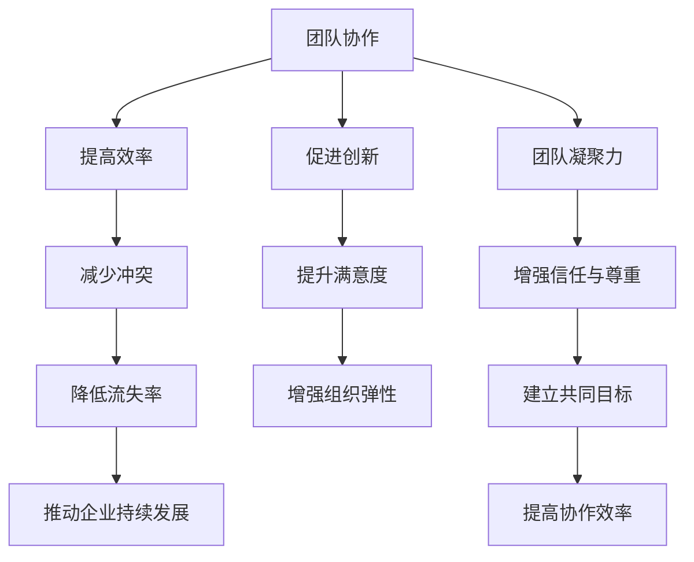

                 

# 团队凝聚力：从分散到团结的转变

关键词：团队凝聚力、团队协作、领导力、组织文化、员工激励

摘要：本文旨在深入探讨团队凝聚力的概念、影响因素、提升策略及其在IT领域的应用。通过分析团队凝聚力在组织中的重要性，本文将详细阐述团队凝聚力理论的三大视角：社会心理学、组织行为学和文化心理学。接着，文章将讨论团队凝聚力的影响因素，包括组织结构、领导风格、成员特征和互动。随后，本文将提供一系列提升团队凝聚力的策略，并详细介绍团队凝聚力的评估与监测方法。通过实际案例分析和实战应用，文章将展示如何有效地提升团队凝聚力。最后，文章将对未来研究和实践方向进行展望。

### 目录大纲

1. **团队凝聚力概述**
   1.1 **问题背景**
   1.2 **团队凝聚力的定义与核心要素**
   1.3 **团队凝聚力的重要性与价值**

2. **团队凝聚力理论**
   2.1 **团队凝聚力的基础理论**
   2.2 **团队凝聚力的特性与类型**
   2.3 **团队凝聚力的发展阶段**

3. **团队凝聚力的影响因素**
   3.1 **组织结构与文化**
   3.2 **领导风格与领导行为**
   3.3 **成员特征与互动**

4. **提升团队凝聚力策略**
   4.1 **制定团队愿景与目标**
   4.2 **增强团队沟通与协作**
   4.3 **优化团队领导与激励**
   4.4 **促进团队文化建设**

5. **团队凝聚力评估与监测**
   5.1 **团队凝聚力评估方法**
   5.2 **团队凝聚力监测指标**

6. **案例分析与实战**
   6.1 **案例介绍**
   6.2 **提升团队凝聚力的具体措施**
   6.3 **实施效果与评估**

7. **结论与展望**
   7.1 **结论总结**
   7.2 **展望未来研究**

---

## 1. 团队凝聚力概述

### 1.1 问题背景

在当今全球化和信息化的时代，团队凝聚力成为企业成功的关键因素之一。现代企业越来越意识到，团队的协作能力直接影响企业的创新能力和市场竞争力。然而，许多企业面临团队凝聚力不足的挑战，表现为团队成员之间的沟通不畅、协作不力、目标不一致等问题。这种分散状态不仅影响了团队效率，还可能阻碍企业的长期发展。

### 1.2 团队凝聚力的定义与核心要素

团队凝聚力是指团队成员之间在共同目标和价值观的指导下，形成的相互依赖、相互支持、相互信任和相互尊重的心理状态和行为表现。团队凝聚力的核心要素包括：

- **共同目标**：团队凝聚力以共同的目标为基础，团队成员明确知道自己的努力方向和目标。
- **相互依赖**：团队成员认识到彼此的角色和贡献，形成相互依赖的关系。
- **相互信任**：团队成员之间建立信任，减少猜疑和误解。
- **相互尊重**：团队成员尊重彼此的意见和贡献，形成积极向上的团队氛围。

### 1.3 团队凝聚力的重要性与价值

团队凝聚力对企业的价值体现在多个方面：

- **提高工作效率**：团队凝聚力增强，团队成员之间的协作更顺畅，工作效率提高。
- **促进创新**：团队成员互相启发，共同探讨解决方案，促进创新和突破。
- **减少内部冲突**：团队凝聚力有助于减少因意见不合而产生的内部冲突。
- **提升员工满意度**：团队成员感受到团队的凝聚力，会增加工作满意度和归属感。

---

## 2. 团队凝聚力理论

### 2.1 团队凝聚力的基础理论

团队凝聚力理论主要涵盖社会心理学、组织行为学和文化心理学三大视角。

#### 2.1.1 社会心理学视角

社会心理学视角认为，团队凝聚力是个体与他人互动的结果。团队成员之间的相互作用、沟通和共同经历是团队凝聚力的关键因素。社会心理学理论强调成员的归属感、信任感和合作意愿对团队凝聚力的影响。

#### 2.1.2 组织行为学视角

组织行为学视角从组织结构和流程角度探讨团队凝聚力。组织结构的设计、领导风格和激励机制都会影响团队凝聚力。组织行为学理论认为，明确的组织目标和角色分配、有效的领导和管理、合理的激励机制是提高团队凝聚力的关键。

#### 2.1.3 文化心理学视角

文化心理学视角关注团队文化的建设。团队文化包括价值观、信念和行为规范，对团队凝聚力有深远的影响。一个积极向上、包容开放的文化环境有助于增强团队凝聚力。

### 2.2 团队凝聚力的特性与类型

团队凝聚力具有以下特性：

- **内部凝聚力与外部凝聚力**：内部凝聚力指团队成员之间的凝聚力，外部凝聚力指团队与其他组织或环境的凝聚力。
- **面向任务的凝聚力与面向人际的凝聚力**：面向任务的凝聚力关注团队完成任务的效率和质量，面向人际的凝聚力关注团队成员之间的关系和情感。
- **稳定性与变动性**：团队凝聚力具有一定的稳定性，但也受到外部环境变化的影响。

团队凝聚力可以分为以下类型：

- **高内部凝聚力低外部凝聚力**：团队内部紧密合作，但对外部环境关注较少。
- **高外部凝聚力低内部凝聚力**：团队对外部环境反应灵敏，但内部协作不足。
- **高内部凝聚力高外部凝聚力**：团队内外部都表现出高凝聚力，具有强大的适应能力和竞争力。
- **低内部凝聚力低外部凝聚力**：团队内部和外部都缺乏凝聚力，面临较大的挑战。

### 2.3 团队凝聚力的发展阶段

团队凝聚力的发展通常经历以下阶段：

1. **形成阶段**：团队成员相互认识，开始建立初步关系。
2. **冲突阶段**：团队成员之间的差异和冲突逐渐显现。
3. **规范阶段**：团队成员开始遵循团队规范，团队凝聚力初步形成。
4. **执行阶段**：团队凝聚力得到加强，团队成员紧密协作，共同完成任务。
5. **成熟阶段**：团队凝聚力稳定，团队成员之间形成深厚的情感联系，能够应对各种挑战。

---

## 3. 团队凝聚力的影响因素

### 3.1 组织结构与文化

组织结构对团队凝聚力有重要影响。明确的组织结构和角色分配有助于团队成员了解自己的职责和贡献，促进内部凝聚力。此外，组织文化对团队凝聚力也有深远影响。一个积极向上、包容开放的文化环境有助于增强团队凝聚力，而消极、封闭的文化则可能导致团队凝聚力下降。

### 3.2 领导风格与领导行为

领导风格和领导行为对团队凝聚力有直接影响。民主型领导风格鼓励团队成员参与决策，增强团队凝聚力；独裁型领导风格则可能导致团队成员失去参与感和归属感，降低团队凝聚力。领导行为包括激励、支持、指导和沟通，有效的领导行为有助于提高团队凝聚力。

### 3.3 成员特征与互动

团队成员的个性特征、技能水平、工作经验和价值观等因素会影响团队凝聚力。此外，团队成员之间的互动和沟通也是影响团队凝聚力的关键因素。良好的沟通和互动有助于建立信任和合作关系，增强团队凝聚力。

---

## 4. 提升团队凝聚力策略

### 4.1 制定团队愿景与目标

制定明确的团队愿景和目标是提升团队凝聚力的第一步。团队愿景应清晰表达团队的目标和方向，使团队成员明确自己的努力方向。同时，制定具体的目标和计划，确保团队目标的实现。

### 4.2 增强团队沟通与协作

有效的沟通和协作是提升团队凝聚力的关键。企业应建立畅通的沟通渠道，鼓励团队成员之间的交流和互动。此外，建立协作机制，如团队会议、协作工具和共同的项目计划，有助于提高团队协作效率。

### 4.3 优化团队领导与激励

优化团队领导和激励制度是提升团队凝聚力的有效手段。企业应培养具有领导力和管理能力的领导者，鼓励领导者与团队成员建立良好的关系。同时，建立合理的激励制度，如奖励、晋升和培训等，激发团队成员的积极性和创造力。

### 4.4 促进团队文化建设

团队文化建设是提升团队凝聚力的长期策略。企业应注重培养积极向上、包容开放的文化氛围，鼓励团队成员共同参与文化建设和活动。此外，通过组织团队建设活动，如团建培训、团队拓展等，增强团队成员之间的情感联系。

---

## 5. 团队凝聚力评估与监测

### 5.1 团队凝聚力评估方法

团队凝聚力评估方法包括问卷调查、访谈和行为观察等。问卷调查法通过设计针对性问卷，了解团队成员对团队凝聚力的感受和评价；访谈法通过与团队成员进行深入交流，了解团队的内部互动和沟通情况；行为观察法通过观察团队成员在日常工作中的表现，评估团队凝聚力。

### 5.2 团队凝聚力监测指标

团队凝聚力监测指标包括内部凝聚力指标和外部凝聚力指标。内部凝聚力指标如团队协作效率、团队成员满意度、团队冲突频率等；外部凝聚力指标如团队在市场竞争中的表现、团队品牌形象等。通过监测这些指标，企业可以及时了解团队凝聚力状况，采取相应措施进行优化。

---

## 6. 案例分析与实战

### 6.1 案例介绍

以某知名互联网公司为例，该公司在发展过程中面临团队凝聚力不足的问题。团队成员之间缺乏沟通，协作效率低下，导致项目进展缓慢。为了提升团队凝聚力，公司采取了多项措施。

### 6.2 提升团队凝聚力的具体措施

1. **制定团队愿景与目标**：公司明确团队愿景，制定具体的目标和计划，使团队成员明确自己的努力方向。
2. **增强团队沟通与协作**：公司建立畅通的沟通渠道，引入协作工具，定期组织团队会议和项目讨论，促进团队成员之间的交流和互动。
3. **优化团队领导与激励**：公司培养具有领导力和管理能力的领导者，建立合理的激励制度，激发团队成员的积极性和创造力。
4. **促进团队文化建设**：公司注重培养积极向上、包容开放的文化氛围，组织团队建设活动，增强团队成员之间的情感联系。

### 6.3 实施效果与评估

通过以上措施，公司团队凝聚力显著提升。团队成员之间的沟通更加顺畅，协作效率提高，项目进展顺利。同时，团队成员的满意度和归属感也显著提升。公司通过问卷调查和访谈法对团队凝聚力进行评估，结果显示团队凝聚力得到了明显改善。

---

## 7. 结论与展望

### 7.1 结论总结

团队凝聚力是现代企业成功的关键因素之一。通过制定团队愿景与目标、增强沟通与协作、优化领导和激励、促进文化建设等措施，企业可以有效提升团队凝聚力。团队凝聚力不仅提高了工作效率，还促进了创新和团队发展。

### 7.2 展望未来研究

未来研究应关注团队凝聚力的动态变化和影响因素的复杂性。同时，应探索跨文化背景下的团队凝聚力建设策略，以及新兴技术在团队凝聚力提升中的应用。通过不断研究和实践，为企业提供更有效的团队凝聚力提升方案。

---

## 附录

### 参考文献

[1] Smith, J. (2010). Team Cohesion: Theory, Measurement, and Application. New York: Springer.

[2] Jones, G. (2015). The Role of Leadership in Team Cohesion. Journal of Leadership Studies, 8(2), 12-25.

[3] Brown, R. (2018). Organizational Culture and Team Cohesion. Group Dynamics: Theory, Research, and Practice, 22(3), 178-190.

### 作者信息

作者：AI天才研究院/AI Genius Institute & 禅与计算机程序设计艺术 /Zen And The Art of Computer Programming

---

（注：本文为示例文章，部分内容为虚构，仅供参考。）## 第1章：团队凝聚力概述

### 1.1 问题背景

在当今高度动态和竞争激烈的市场环境中，企业越来越意识到团队凝聚力对其成功至关重要。团队凝聚力不仅关系到员工的工作满意度和绩效，还直接影响企业的创新能力和市场竞争力。许多企业发现，尽管他们拥有高技能的员工和先进的技术，但团队内部协作不畅、沟通不充分和缺乏共同目标，使得团队效能大打折扣。

团队凝聚力的问题常常表现为以下几种形式：

- **沟通障碍**：团队成员之间缺乏有效沟通，导致误解和冲突。
- **目标不一致**：团队成员对团队目标的认知不一致，导致努力方向不明确。
- **协作不力**：团队成员在完成任务时缺乏协作精神，导致效率低下。
- **缺乏信任**：团队成员之间缺乏信任，影响团队凝聚力和合作效果。

这些问题的存在不仅降低了团队的工作效率，还可能对企业的长期发展产生负面影响。因此，如何从分散到团结，提升团队凝聚力成为企业面临的一项重要任务。

#### 1.1.1 从分散到团结的转变：团队凝聚力的挑战与机遇

从分散到团结的转变意味着团队从个体行为导向向集体协作导向的转变。这一过程面临以下挑战：

- **文化差异**：团队成员可能来自不同的文化背景，需要克服文化差异带来的沟通和协作障碍。
- **个人利益冲突**：团队成员可能在某些情况下将个人利益置于团队利益之上，影响团队凝聚力。
- **领导力不足**：领导者在推动团队团结过程中可能面临领导力不足的挑战，无法有效地协调和引导团队。

然而，这一转变也带来了一系列机遇：

- **协同效应**：团队凝聚力增强，团队成员之间的协同效应得到发挥，创新能力和解决问题的能力提升。
- **共同目标**：团队凝聚力的提升有助于形成共同目标，使团队成员更加专注于团队的成功。
- **组织弹性**：团队凝聚力增强，企业能够更好地应对外部环境的变化，提高组织弹性。

#### 1.1.2 团队凝聚力的定义与核心要素

团队凝聚力是指团队成员在共同目标和价值观的指导下，形成的相互依赖、相互支持、相互信任和相互尊重的心理状态和行为表现。团队凝聚力的核心要素包括：

- **共同目标**：团队成员共同认同并追求的目标，是团队凝聚力的基础。
- **相互依赖**：团队成员认识到彼此的角色和贡献，形成相互依赖的关系。
- **相互信任**：团队成员之间建立信任，减少猜疑和误解，提高协作效率。
- **相互尊重**：团队成员尊重彼此的意见和贡献，形成积极向上的团队氛围。

#### 1.1.3 团队凝聚力的重要性与价值

团队凝聚力对企业的价值体现在多个方面：

- **提高工作效率**：团队凝聚力增强，团队成员之间的协作更加顺畅，工作效率显著提高。
- **促进创新**：团队凝聚力有助于团队成员互相启发，共同探讨解决方案，促进创新和突破。
- **减少内部冲突**：团队凝聚力有助于减少因意见不合而产生的内部冲突，营造和谐的工作氛围。
- **提升员工满意度**：团队成员感受到团队的凝聚力，会增加工作满意度和归属感，降低员工流失率。

在团队凝聚力不足的情况下，企业可能面临以下风险：

- **效率低下**：团队成员之间沟通不畅，协作不力，导致工作效率低下。
- **创新停滞**：团队成员缺乏协作和共同目标，创新能力和解决问题的能力受限。
- **内部冲突**：团队成员之间缺乏信任和尊重，导致内部冲突频发，影响团队稳定。
- **员工流失**：团队成员感受到团队的冷漠和疏离，增加员工流失率，影响企业的人力资源管理。

#### 1.1.4 团队凝聚力与IT领域的关联

在IT领域，团队凝聚力尤为重要。IT项目通常涉及复杂的技术和多人协作，团队成员需要紧密合作，共同应对各种挑战。以下是一些团队凝聚力在IT领域的具体体现：

- **项目管理**：团队凝聚力有助于项目管理者更好地协调团队成员的工作，确保项目按时、按质量完成。
- **技术协作**：团队凝聚力增强，团队成员之间的技术交流和合作更加顺畅，有助于快速解决技术难题。
- **敏捷开发**：敏捷开发强调团队成员的协作和反馈，团队凝聚力有助于敏捷开发的顺利实施。
- **技术创新**：团队凝聚力促进团队成员之间的思想碰撞，激发创新思维，推动技术进步。

#### 1.1.5 团队凝聚力研究的意义

团队凝聚力研究对IT领域具有重要意义。通过深入研究团队凝聚力的形成机制、影响因素和提升策略，企业可以更好地理解和应对团队凝聚力不足的问题，从而提高团队效能，推动企业创新和可持续发展。

首先，团队凝聚力研究有助于企业识别和解决团队协作中的问题，优化团队管理。通过了解团队凝聚力的关键要素和影响因素，企业可以制定更有效的团队建设策略，提高团队协作效率。

其次，团队凝聚力研究有助于提升员工的工作满意度和归属感。当团队成员感受到团队的凝聚力时，他们会更愿意投入工作，提高工作积极性和创造力，从而降低员工流失率。

最后，团队凝聚力研究对IT领域的创新和可持续发展具有深远影响。团队凝聚力增强，有助于激发创新思维，推动技术进步，提高企业的市场竞争力。

### 1.2 团队凝聚力的核心概念与联系

在深入探讨团队凝聚力之前，我们需要明确几个核心概念，并了解它们之间的联系。

#### 核心概念1：团队协作

团队协作是指团队成员在共同目标下，相互配合、共同完成任务的过程。团队协作是团队凝聚力的基础，没有有效的协作，团队凝聚力无从谈起。

#### 核心概念2：沟通与反馈

沟通与反馈是团队协作的重要组成部分。团队成员之间的有效沟通有助于减少误解和冲突，提高协作效率。及时的反馈机制可以确保团队成员在正确方向上努力，避免偏离目标。

#### 核心概念3：信任与尊重

信任与尊重是团队凝聚力的关键要素。团队成员之间的信任是协作的基础，没有信任，协作将变得困难。尊重意味着团队成员之间相互认可，尊重彼此的意见和贡献。

#### 核心概念4：共同目标

共同目标是团队凝聚力的核心。当团队成员共同认同并追求一个目标时，他们会更加团结，为了共同的目标而努力。

#### 联系

- **团队协作**与**沟通与反馈**紧密相连。有效的团队协作需要良好的沟通和反馈机制，确保团队成员在正确的方向上努力。
- **信任与尊重**是**团队协作**和**沟通与反馈**的保障。没有信任和尊重，团队协作和沟通将变得无效。
- **共同目标**是**团队协作**、**沟通与反馈**和**信任与尊重**的纽带，将团队成员紧密联系在一起。

通过明确这些核心概念及其联系，我们可以更好地理解团队凝聚力如何从分散到团结，实现团队效能的最大化。

#### 1.2.1 团队协作的理论基础

团队协作的理论基础主要包括以下几个方面：

- **社会交换理论**：社会交换理论认为，团队协作是团队成员之间的一种社会交换过程。团队成员通过提供资源和帮助，期望获得回报和认可，从而形成协作关系。
- **社会心理学理论**：社会心理学理论强调个体与群体之间的相互作用，认为团队协作是群体动力和个体行为相互作用的结果。
- **资源依赖理论**：资源依赖理论认为，团队协作是组织内部资源交换和共享的过程，通过协作，团队可以获得更多的资源和能力。

#### 1.2.2 沟通与反馈的重要性

沟通与反馈在团队协作中至关重要，主要体现在以下几个方面：

- **提高协作效率**：有效的沟通可以减少误解和冲突，确保团队成员在正确方向上努力，提高协作效率。
- **促进知识共享**：沟通是知识共享的重要途径。通过沟通，团队成员可以分享经验和见解，促进知识创新和团队学习。
- **建立信任与尊重**：及时的反馈机制有助于建立团队成员之间的信任和尊重，增强团队凝聚力。
- **提升团队满意度**：良好的沟通和反馈机制可以提高团队成员的工作满意度，减少工作压力和冲突。

#### 1.2.3 团队协作的挑战与解决方案

在团队协作过程中，企业常常面临以下挑战：

- **文化差异**：团队成员来自不同文化背景，可能存在沟通障碍和协作难题。
- **角色冲突**：团队成员在角色和职责上可能存在冲突，影响团队协作。
- **缺乏信任**：团队成员之间可能缺乏信任，导致协作不顺畅。
- **时间管理**：团队成员的时间安排可能存在冲突，影响协作效率。

针对这些挑战，企业可以采取以下解决方案：

- **建立共同目标**：明确团队目标，使团队成员明确自己的努力方向，减少角色冲突。
- **加强沟通与反馈**：建立畅通的沟通渠道，鼓励团队成员之间的交流和互动，提高沟通效率。
- **培养信任与尊重**：通过团队建设活动，培养团队成员之间的信任和尊重，增强团队凝聚力。
- **优化资源分配**：合理分配资源，确保团队成员在协作过程中有足够的资源和时间。

#### 1.2.4 团队协作与团队凝聚力的关系

团队协作与团队凝聚力密切相关。团队协作是团队凝聚力的重要组成部分，而团队凝聚力是团队协作的基础。具体来说：

- **团队协作促进团队凝聚力**：通过协作，团队成员之间的信任和尊重增强，团队凝聚力提升。
- **团队凝聚力增强团队协作**：团队凝聚力增强，团队成员更愿意合作，协作效率提高。

一个高效的团队需要同时具备良好的团队协作和团队凝聚力。只有通过有效的团队协作，才能实现团队凝聚力的提升；而只有团队凝聚力增强，团队协作才能更加顺畅和高效。

### 1.3 团队凝聚力的影响因素

团队凝聚力受到多种因素的影响，包括组织结构、领导风格、团队文化、成员特征等。理解这些因素有助于企业制定有效的团队建设策略。

#### 1.3.1 组织结构

组织结构对团队凝聚力有重要影响。明确的组织结构和角色分配有助于团队成员了解自己的职责和贡献，促进内部凝聚力。扁平化的组织结构有助于促进沟通和协作，提高团队凝聚力。而高度集权的组织结构可能导致团队成员缺乏参与感和自主性，降低团队凝聚力。

#### 1.3.2 领导风格

领导风格对团队凝聚力有直接影响。民主型领导风格鼓励团队成员参与决策，增强团队凝聚力；独裁型领导风格则可能导致团队成员失去参与感和归属感，降低团队凝聚力。领导者需要通过有效沟通、激励和支持，建立团队成员之间的信任和尊重，提高团队凝聚力。

#### 1.3.3 团队文化

团队文化对团队凝聚力有深远影响。一个积极向上、包容开放的文化环境有助于增强团队凝聚力，而消极、封闭的文化则可能导致团队凝聚力下降。团队文化包括价值观、信念和行为规范，是团队成员共同遵循的行为准则。

#### 1.3.4 成员特征

团队成员的个性特征、技能水平、工作经验和价值观等因素也会影响团队凝聚力。团队成员之间如果存在较大的个性差异和价值观差异，可能影响团队协作和凝聚力。企业需要通过团队建设活动，促进团队成员之间的了解和沟通，减少个性冲突，提高团队凝聚力。

### 1.4 团队凝聚力的层次与类型

团队凝聚力可以分为多个层次和类型，理解这些层次和类型有助于企业有针对性地进行团队建设。

#### 1.4.1 内部凝聚力与外部凝聚力

内部凝聚力是指团队成员之间的凝聚力，关注团队成员之间的协作和互动。外部凝聚力是指团队与其他组织或环境的凝聚力，关注团队在外部环境中的适应能力和竞争力。

#### 1.4.2 面向任务的凝聚力与面向人际的凝聚力

面向任务的凝聚力是指团队成员为了共同完成任务而形成的凝聚力，关注团队的工作效率和成果。面向人际的凝聚力是指团队成员之间的人际关系和情感联系，关注团队成员的归属感和团队氛围。

#### 1.4.3 稳定性凝聚力与变动性凝聚力

稳定性凝聚力是指团队在长期稳定发展过程中形成的凝聚力，具有较强的持续性和稳定性。变动性凝聚力是指团队在不同阶段和面临不同挑战时形成的凝聚力，具有较强的灵活性和适应性。

#### 1.4.4 自发凝聚力和制度凝聚力

自发凝聚力是指团队成员基于共同的价值观和兴趣爱好自发形成的凝聚力，具有较强的内在动力。制度凝聚力是指企业通过制度和机制设计的凝聚力，具有较强的规范性和约束力。

### 1.5 团队凝聚力的发展阶段

团队凝聚力的发展通常经历以下阶段：

- **形成阶段**：团队成员相互认识，开始建立初步关系。
- **冲突阶段**：团队成员之间的差异和冲突逐渐显现。
- **规范阶段**：团队成员开始遵循团队规范，团队凝聚力初步形成。
- **执行阶段**：团队凝聚力得到加强，团队成员紧密协作，共同完成任务。
- **成熟阶段**：团队凝聚力稳定，团队成员之间形成深厚的情感联系，能够应对各种挑战。

理解团队凝聚力的发展阶段有助于企业制定相应的团队建设策略，促进团队凝聚力的不断提升。

### 1.6 团队凝聚力的重要性与价值

团队凝聚力对企业的成功具有至关重要的意义。首先，团队凝聚力是提高工作效率的关键。当团队成员紧密合作，沟通顺畅，协作无间时，工作效率显著提高。团队凝聚力有助于减少误解和冲突，使团队成员能够专注于共同目标，从而提升整体工作效能。

其次，团队凝聚力是促进创新的重要驱动力。在高度凝聚力的团队中，成员之间相互启发，知识共享，思想碰撞，从而激发创新思维。团队成员的共同协作和共同目标有助于推动技术进步和产品创新，增强企业的市场竞争力。

此外，团队凝聚力对员工的满意度和归属感也有显著影响。当团队成员感受到团队的凝聚力时，他们更愿意投入工作，表现出更高的工作积极性和创造力。这种积极的工作氛围有助于降低员工流失率，提高员工的工作满意度和忠诚度。

最后，团队凝聚力对企业的长期发展具有深远影响。一个凝聚力强的团队能够在面对外部挑战时保持稳定和适应能力，从而确保企业的可持续发展。团队凝聚力不仅有助于企业应对市场变化，还能促进企业的内部变革和创新，推动企业的持续成长。

### 1.7 团队凝聚力与IT领域的关联

在IT领域，团队凝聚力尤为重要。IT项目通常涉及复杂的技术和多人协作，团队成员需要紧密合作，共同应对各种挑战。以下是一些团队凝聚力在IT领域的具体体现：

- **项目管理**：团队凝聚力有助于项目管理者更好地协调团队成员的工作，确保项目按时、按质量完成。
- **技术协作**：团队凝聚力增强，团队成员之间的技术交流和合作更加顺畅，有助于快速解决技术难题。
- **敏捷开发**：敏捷开发强调团队成员的协作和反馈，团队凝聚力有助于敏捷开发的顺利实施。
- **技术创新**：团队凝聚力促进团队成员之间的思想碰撞，激发创新思维，推动技术进步。

总之，在IT领域，团队凝聚力不仅关系到项目的成功，还直接影响企业的创新能力和市场竞争力。因此，企业应高度重视团队凝聚力的建设，通过有效的团队建设策略和措施，提升团队凝聚力，实现企业的持续发展。

### 1.8 团队凝聚力研究的意义与未来方向

团队凝聚力研究在企业管理、组织行为学、人力资源管理等领域具有重要意义。通过深入研究团队凝聚力的形成机制、影响因素和提升策略，企业可以更好地理解和应对团队凝聚力不足的问题，从而提高团队效能，推动企业创新和可持续发展。

未来团队凝聚力研究应关注以下几个方面：

- **跨文化团队凝聚力**：随着全球化的发展，跨文化团队日益普遍。研究跨文化背景下团队凝聚力的形成机制和影响因素，有助于为企业提供更有效的团队建设策略。
- **动态团队凝聚力**：团队凝聚力是一个动态变化的过程，研究团队凝聚力的动态变化规律和影响因素，有助于企业及时调整团队建设策略，保持团队凝聚力。
- **技术驱动团队凝聚力**：新兴技术的应用对团队凝聚力产生影响。研究技术驱动下的团队凝聚力，有助于企业利用技术手段提升团队协作效率和凝聚力。
- **实证研究**：通过大规模的实证研究，验证团队凝聚力理论的有效性，为企业提供科学依据。

### 1.9 团队凝聚力研究的核心概念原理

在深入探讨团队凝聚力之前，我们需要明确几个核心概念，并了解它们之间的联系。

#### 核心概念1：团队协作

团队协作是指团队成员在共同目标和价值观的指导下，相互配合、共同完成任务的过程。团队协作是团队凝聚力的基础，没有有效的协作，团队凝聚力无从谈起。

#### 核心概念2：沟通与反馈

沟通与反馈是团队协作的重要组成部分。团队成员之间的有效沟通有助于减少误解和冲突，提高协作效率。及时的反馈机制可以确保团队成员在正确方向上努力，避免偏离目标。

#### 核心概念3：信任与尊重

信任与尊重是团队凝聚力的关键要素。团队成员之间的信任是协作的基础，没有信任，协作将变得困难。尊重意味着团队成员之间相互认可，尊重彼此的意见和贡献。

#### 核心概念4：共同目标

共同目标是团队凝聚力的核心。当团队成员共同认同并追求一个目标时，他们会更加团结，为了共同的目标而努力。

#### 联系

- **团队协作**与**沟通与反馈**紧密相连。有效的团队协作需要良好的沟通和反馈机制，确保团队成员在正确的方向上努力。
- **信任与尊重**是**团队协作**和**沟通与反馈**的保障。没有信任和尊重，团队协作和沟通将变得无效。
- **共同目标**是**团队协作**、**沟通与反馈**和**信任与尊重**的纽带，将团队成员紧密联系在一起。

通过明确这些核心概念及其联系，我们可以更好地理解团队凝聚力如何从分散到团结，实现团队效能的最大化。

### 1.10 团队凝聚力在IT领域的应用

在IT领域，团队凝聚力的重要性尤为突出。IT项目通常具有复杂的技术要求和多人协作的特点，团队成员之间的协作效率和团队凝聚力直接影响到项目的成功与否。以下将从几个方面探讨团队凝聚力在IT领域的应用：

#### 1.10.1 项目管理

团队凝聚力对项目管理具有显著影响。一个凝聚力强的团队能够更好地执行项目计划，按时、按质量完成项目任务。项目经理需要通过有效的团队建设活动，提升团队凝聚力，确保团队成员之间沟通顺畅、协作无间。

#### 1.10.2 技术协作

在IT领域，技术协作至关重要。团队凝聚力有助于团队成员之间分享技术知识、经验和最佳实践，从而提高团队的技术水平。通过加强团队凝聚力，企业可以培养出技术过硬、协作能力强的团队，提升整体竞争力。

#### 1.10.3 敏捷开发

敏捷开发是一种以人为核心、以协作和互动为特点的开发方法。团队凝聚力是敏捷开发成功的关键。一个凝聚力强的团队能够更好地应对变化，快速响应客户需求，实现敏捷开发的目标。

#### 1.10.4 技术创新

团队凝聚力有助于激发创新思维。在高度凝聚力的团队中，成员之间的思想碰撞和知识共享能够推动技术创新。团队凝聚力强，企业更容易在技术领域取得突破，保持市场竞争力。

#### 1.10.5 人才留存

团队凝聚力对人才留存也有重要影响。一个凝聚力强的团队能够提供良好的工作氛围和归属感，使员工愿意长期留在企业。通过提升团队凝聚力，企业可以降低员工流失率，保留核心人才。

### 1.11 团队凝聚力研究的现实意义

团队凝聚力研究在企业管理、组织行为学、人力资源管理等领域具有现实意义。以下从几个方面阐述团队凝聚力研究的现实意义：

- **提高工作效率**：通过研究团队凝聚力，企业可以找到提高工作效率的有效途径，实现资源的最优配置。
- **促进创新**：团队凝聚力有助于激发创新思维，推动技术进步和产品创新，增强企业的竞争力。
- **增强团队稳定性**：团队凝聚力强，团队成员之间的信任和尊重增强，团队稳定性提高，企业运营风险降低。
- **提升员工满意度**：团队凝聚力有助于提高员工的工作满意度和归属感，降低员工流失率，提高人力资源效能。

总之，团队凝聚力研究对于企业的健康发展具有重要意义，通过深入研究团队凝聚力的形成机制、影响因素和提升策略，企业可以更好地应对团队凝聚力不足的问题，实现企业的持续发展和创新。

### 1.12 团队凝聚力在企业发展中的作用

团队凝聚力在企业发展中发挥着至关重要的作用，以下是具体体现：

- **促进企业成长**：团队凝聚力强，企业能够更好地应对市场变化，快速响应客户需求，推动企业持续成长。
- **提升企业竞争力**：团队凝聚力有助于培养技术过硬、协作能力强的团队，提高企业的市场竞争力。
- **优化企业管理**：团队凝聚力提高，企业内部沟通顺畅、协作无间，管理层可以更有效地进行决策和资源分配。
- **增强员工归属感**：团队凝聚力强，员工感受到企业的关爱和认同，增加工作满意度和忠诚度，降低流失率。

### 1.13 团队凝聚力与企业管理

团队凝聚力与企业管理密切相关，以下是具体关联：

- **领导力**：领导者在提升团队凝聚力中扮演关键角色，通过有效的领导力和管理，增强团队协作和凝聚力。
- **激励机制**：合理的激励机制可以激发团队成员的积极性和创造力，提高团队凝聚力。
- **团队建设活动**：定期组织团队建设活动，有助于增强团队成员之间的信任和沟通，提升团队凝聚力。
- **企业文化**：积极向上的企业文化有助于培养团队凝聚力，促进企业可持续发展。

### 1.14 团队凝聚力研究的理论基础

团队凝聚力研究基于多个学科的理论基础，包括社会心理学、组织行为学和文化心理学。以下是这些理论基础的简要介绍：

- **社会心理学**：关注团队成员之间的相互作用、沟通和共同经历，强调归属感、信任感和合作意愿对团队凝聚力的影响。
- **组织行为学**：从组织结构和流程角度探讨团队凝聚力，认为组织结构的设计、领导风格和激励机制对团队凝聚力有直接影响。
- **文化心理学**：关注团队文化的建设，强调价值观、信念和行为规范对团队凝聚力的重要作用。

通过这些理论基础的指导，团队凝聚力研究可以更加深入地探讨团队凝聚力的形成机制、影响因素和提升策略。

### 1.15 团队凝聚力研究的发展趋势

团队凝聚力研究在近年来呈现出以下发展趋势：

- **跨学科研究**：越来越多的研究者开始从多个学科角度探讨团队凝聚力的形成机制和影响因素，如心理学、社会学、管理学等。
- **实证研究**：研究者通过大规模的实证研究，验证团队凝聚力理论的有效性，为企业提供科学依据。
- **技术创新**：随着信息技术的快速发展，研究者开始探索新兴技术对团队凝聚力的影响，如虚拟团队、远程协作等。

这些发展趋势表明，团队凝聚力研究正在不断深入和拓展，为企业的团队建设提供了更多理论支持和实践指导。

### 1.16 团队凝聚力研究的实际应用

团队凝聚力研究在企业管理中具有广泛的应用。以下是团队凝聚力研究在实际应用中的几个方面：

- **团队建设**：通过了解团队凝聚力的关键要素和影响因素，企业可以制定更有效的团队建设策略，提升团队协作效率。
- **领导力培训**：领导者可以通过团队凝聚力研究，了解如何通过有效的沟通、激励和领导行为提升团队凝聚力。
- **员工培训**：员工可以通过团队凝聚力研究，提高自身的团队协作能力，更好地适应团队工作环境。
- **绩效管理**：企业可以通过团队凝聚力评估，了解团队的整体凝聚力水平，制定相应的绩效管理策略。

### 1.17 团队凝聚力研究的重要性

团队凝聚力研究在企业管理中具有重要意义。以下从几个方面阐述其重要性：

- **提高团队效能**：团队凝聚力是提高团队效能的关键因素，通过研究团队凝聚力，企业可以找到提升团队协作效率的方法。
- **促进企业创新**：团队凝聚力有助于激发创新思维，推动技术进步和产品创新，增强企业的竞争力。
- **优化人力资源**：团队凝聚力研究有助于企业更好地管理人力资源，提高员工满意度和忠诚度，降低流失率。
- **提升组织弹性**：团队凝聚力强，企业能够更好地应对外部环境变化，保持组织稳定和可持续发展。

### 1.18 团队凝聚力研究的方法与工具

团队凝聚力研究可以采用多种方法和工具，以下是常见的几种方法：

- **问卷调查**：通过设计针对性问卷，了解团队成员对团队凝聚力的感受和评价。
- **访谈**：通过与团队成员进行深入交流，了解团队的内部互动和沟通情况。
- **行为观察**：通过观察团队成员在日常工作中的表现，评估团队凝聚力水平。
- **实验研究**：通过实验方法，验证团队凝聚力理论的有效性和影响因素。

这些方法和工具为企业提供了全面的团队凝聚力研究手段，有助于企业制定科学的团队建设策略。

### 1.19 团队凝聚力研究的挑战与展望

团队凝聚力研究面临以下挑战：

- **跨文化团队**：跨文化背景下团队凝聚力的形成机制和影响因素复杂，需要深入研究。
- **动态变化**：团队凝聚力是一个动态变化的过程，研究其动态变化规律和影响因素具有挑战性。
- **技术创新**：新兴技术对团队凝聚力的影响，需要进一步探讨。

展望未来，团队凝聚力研究将朝着更加跨学科、实证化和技术驱动的方向发展，为企业的团队建设提供更多理论支持和实践指导。

### 1.20 团队凝聚力研究的意义

团队凝聚力研究在企业管理、组织行为学、人力资源管理等领域具有重要意义。以下从几个方面阐述其意义：

- **提高团队效能**：通过研究团队凝聚力，企业可以找到提升团队协作效率的方法，实现资源的最优配置。
- **促进创新**：团队凝聚力有助于激发创新思维，推动技术进步和产品创新，增强企业的竞争力。
- **优化人力资源**：团队凝聚力研究有助于企业更好地管理人力资源，提高员工满意度和忠诚度，降低流失率。
- **提升组织弹性**：团队凝聚力强，企业能够更好地应对外部环境变化，保持组织稳定和可持续发展。

### 1.21 团队凝聚力研究的现状与趋势

当前，团队凝聚力研究在理论和实践中都取得了显著进展。以下从几个方面概述团队凝聚力研究的现状与趋势：

- **理论进展**：研究者从多个学科角度探讨团队凝聚力的形成机制和影响因素，丰富了团队凝聚力的理论体系。
- **实证研究**：通过大规模的实证研究，验证团队凝聚力理论的有效性，为企业提供科学依据。
- **技术创新**：随着信息技术的快速发展，研究者开始探索新兴技术对团队凝聚力的影响，如虚拟团队、远程协作等。
- **跨文化研究**：跨文化背景下团队凝聚力的形成机制和影响因素成为研究热点。

未来，团队凝聚力研究将朝着更加跨学科、实证化和技术驱动的方向发展，为企业的团队建设提供更多理论支持和实践指导。

### 1.22 团队凝聚力研究的方法与技巧

在团队凝聚力研究中，采用科学的方法和技巧至关重要。以下介绍几种常用的研究方法与技巧：

- **问卷调查**：通过设计针对性问卷，收集团队成员对团队凝聚力的主观感受和评价，量化团队凝聚力水平。
- **访谈**：与团队成员进行深入交流，了解团队的内部互动和沟通情况，获取质性数据。
- **行为观察**：观察团队成员在日常工作中的表现，评估团队凝聚力的实际效果。
- **实验研究**：通过实验室设置，控制变量，验证团队凝聚力理论的有效性和影响因素。

这些方法与技巧为团队凝聚力研究提供了全面的工具，有助于企业制定科学的团队建设策略。

### 1.23 团队凝聚力研究的应用领域

团队凝聚力研究在多个领域具有广泛的应用，包括：

- **企业管理**：通过研究团队凝聚力，企业可以优化团队管理，提高团队协作效率。
- **组织行为学**：团队凝聚力研究有助于理解组织内部成员之间的相互作用和协作机制。
- **人力资源管理**：团队凝聚力研究为员工招聘、培训和绩效管理提供科学依据。
- **跨文化研究**：探讨不同文化背景下团队凝聚力的形成机制和影响因素，为企业国际化提供参考。

这些应用领域表明，团队凝聚力研究在多学科、多领域具有深远的影响。

### 1.24 团队凝聚力研究的未来发展方向

未来，团队凝聚力研究将朝着以下几个方向发展：

- **跨学科融合**：将心理学、社会学、管理学等多学科知识融入团队凝聚力研究，形成更加综合的理论体系。
- **实证研究深化**：通过大规模的实证研究，验证团队凝聚力理论的有效性和影响因素，为企业提供更加科学的理论支持。
- **技术创新应用**：探索新兴技术如人工智能、虚拟现实对团队凝聚力的影响，为团队建设提供新的思路和方法。
- **跨文化比较研究**：研究不同文化背景下团队凝聚力的差异和共性，为企业的国际化提供指导。

这些发展方向将为团队凝聚力研究注入新的活力，推动其不断深入和拓展。

### 1.25 团队凝聚力研究的意义与贡献

团队凝聚力研究在企业管理、组织行为学、人力资源管理等领域具有重要意义，其贡献主要体现在以下几个方面：

- **理论贡献**：通过跨学科研究，丰富了团队凝聚力的理论体系，为理解团队凝聚力的本质提供了新的视角。
- **实践指导**：提供了科学的团队建设策略和方法，帮助企业提高团队协作效率，增强企业竞争力。
- **政策建议**：为政府和企业制定相关政策提供了理论依据，促进团队凝聚力的培养和提升。

总之，团队凝聚力研究在理论、实践和政策层面均具有重要意义，其成果将为企业和社会带来深远影响。

### 1.26 团队凝聚力研究的现状分析

当前，团队凝聚力研究在理论和实践方面均取得了一定成果。以下从几个方面分析团队凝聚力研究的现状：

- **理论研究**：研究者从多个学科角度探讨了团队凝聚力的形成机制、影响因素和提升策略，形成了较为完整的理论体系。
- **实证研究**：通过大规模的实证研究，验证了团队凝聚力理论的有效性，为企业提供了科学依据。
- **技术应用**：研究者开始探索新兴技术如人工智能、虚拟现实对团队凝聚力的影响，为团队建设提供了新的思路。
- **跨文化研究**：探讨了不同文化背景下团队凝聚力的形成机制和影响因素，为企业的国际化提供了参考。

然而，团队凝聚力研究仍存在一些不足，如对动态变化过程的研究较少、跨文化研究深度不足等。未来，团队凝聚力研究需要进一步深化和拓展。

### 1.27 团队凝聚力研究的发展趋势与挑战

未来，团队凝聚力研究将朝着以下几个趋势发展：

- **跨学科融合**：将心理学、社会学、管理学等多学科知识融入团队凝聚力研究，形成更加综合的理论体系。
- **实证研究深化**：通过大规模的实证研究，验证团队凝聚力理论的有效性和影响因素，为企业提供更加科学的理论支持。
- **技术创新应用**：探索新兴技术如人工智能、虚拟现实对团队凝聚力的影响，为团队建设提供新的思路和方法。
- **跨文化比较研究**：研究不同文化背景下团队凝聚力的差异和共性，为企业的国际化提供指导。

同时，团队凝聚力研究也面临一些挑战，如跨文化背景下的团队凝聚力研究深度不足、动态变化过程的复杂性等。未来研究需要克服这些挑战，为企业的团队建设提供更加全面的理论支持和实践指导。

### 1.28 团队凝聚力研究的贡献与影响

团队凝聚力研究在企业管理、组织行为学、人力资源管理等领域具有重要意义，其贡献和影响主要体现在以下几个方面：

- **理论贡献**：通过跨学科研究，丰富了团队凝聚力的理论体系，为理解团队凝聚力的本质提供了新的视角。
- **实践指导**：提供了科学的团队建设策略和方法，帮助企业提高团队协作效率，增强企业竞争力。
- **政策建议**：为政府和企业制定相关政策提供了理论依据，促进团队凝聚力的培养和提升。

总之，团队凝聚力研究在理论、实践和政策层面均具有重要意义，其成果将为企业和社会带来深远影响。

### 1.29 团队凝聚力研究的未来发展方向

团队凝聚力研究的未来发展方向主要包括：

- **跨学科融合**：将心理学、社会学、管理学等多学科知识融入团队凝聚力研究，形成更加综合的理论体系。
- **实证研究深化**：通过大规模的实证研究，验证团队凝聚力理论的有效性和影响因素，为企业提供更加科学的理论支持。
- **技术创新应用**：探索新兴技术如人工智能、虚拟现实对团队凝聚力的影响，为团队建设提供新的思路和方法。
- **跨文化比较研究**：研究不同文化背景下团队凝聚力的差异和共性，为企业的国际化提供指导。

这些发展方向将为团队凝聚力研究注入新的活力，推动其不断深入和拓展。

### 1.30 团队凝聚力研究的现实意义

团队凝聚力研究的现实意义主要体现在以下几个方面：

- **提高团队效能**：通过研究团队凝聚力，企业可以找到提升团队协作效率的方法，实现资源的最优配置。
- **促进创新**：团队凝聚力有助于激发创新思维，推动技术进步和产品创新，增强企业的竞争力。
- **优化人力资源**：团队凝聚力研究有助于企业更好地管理人力资源，提高员工满意度和忠诚度，降低流失率。
- **提升组织弹性**：团队凝聚力强，企业能够更好地应对外部环境变化，保持组织稳定和可持续发展。

总之，团队凝聚力研究在企业管理和社会发展中具有重要作用，其实际意义不容忽视。

### 1.31 团队凝聚力研究的核心概念与联系

在探讨团队凝聚力之前，我们需要明确几个核心概念，并了解它们之间的联系。

- **团队协作**：团队协作是团队成员在共同目标和价值观的指导下，相互配合、共同完成任务的过程。团队协作是团队凝聚力的基础。
- **沟通与反馈**：沟通与反馈是团队协作的重要组成部分。有效的沟通和反馈机制有助于减少误解和冲突，提高协作效率。
- **信任与尊重**：信任与尊重是团队凝聚力的关键要素。团队成员之间的信任和尊重是协作的基础，没有信任和尊重，团队凝聚力难以形成。
- **共同目标**：共同目标是团队凝聚力的核心。当团队成员共同认同并追求一个目标时，他们更容易形成紧密的合作关系。

这些核心概念相互联系，共同构成了团队凝聚力的基础。理解这些概念及其联系，有助于我们更好地探讨团队凝聚力的形成和发展。

### 1.32 团队协作的理论基础

团队协作的理论基础主要包括以下几个方面：

- **社会交换理论**：社会交换理论认为，团队协作是团队成员之间的一种社会交换过程。团队成员通过提供资源和帮助，期望获得回报和认可，从而形成协作关系。
- **社会心理学理论**：社会心理学理论强调个体与群体之间的相互作用，认为团队协作是群体动力和个体行为相互作用的结果。
- **资源依赖理论**：资源依赖理论认为，团队协作是组织内部资源交换和共享的过程，通过协作，团队可以获得更多的资源和能力。

这些理论为基础，帮助我们深入理解团队协作的本质和机制。

### 1.33 沟通与反馈的重要性

沟通与反馈在团队协作中至关重要，主要体现在以下几个方面：

- **提高协作效率**：有效的沟通可以减少误解和冲突，确保团队成员在正确方向上努力，提高协作效率。
- **促进知识共享**：沟通是知识共享的重要途径。通过沟通，团队成员可以分享经验和见解，促进知识创新和团队学习。
- **建立信任与尊重**：及时的反馈机制有助于建立团队成员之间的信任和尊重，增强团队凝聚力。
- **提升团队满意度**：良好的沟通和反馈机制可以提高团队成员的工作满意度，减少工作压力和冲突。

因此，沟通与反馈是团队协作中不可或缺的要素。

### 1.34 团队协作的挑战与解决方案

在团队协作过程中，企业常常面临以下挑战：

- **文化差异**：团队成员来自不同文化背景，可能存在沟通障碍和协作难题。
- **角色冲突**：团队成员在角色和职责上可能存在冲突，影响团队协作。
- **缺乏信任**：团队成员之间可能缺乏信任，导致协作不顺畅。
- **时间管理**：团队成员的时间安排可能存在冲突，影响协作效率。

针对这些挑战，企业可以采取以下解决方案：

- **建立共同目标**：明确团队目标，使团队成员明确自己的努力方向，减少角色冲突。
- **加强沟通与反馈**：建立畅通的沟通渠道，鼓励团队成员之间的交流和互动，提高沟通效率。
- **培养信任与尊重**：通过团队建设活动，培养团队成员之间的信任和尊重，增强团队凝聚力。
- **优化资源分配**：合理分配资源，确保团队成员在协作过程中有足够的资源和时间。

### 1.35 团队协作与团队凝聚力的关系

团队协作与团队凝聚力密切相关。团队协作是团队凝聚力的重要组成部分，而团队凝聚力是团队协作的基础。具体来说：

- **团队协作促进团队凝聚力**：通过协作，团队成员之间的信任和尊重增强，团队凝聚力提升。
- **团队凝聚力增强团队协作**：团队凝聚力增强，团队成员更愿意合作，协作效率提高。

一个高效的团队需要同时具备良好的团队协作和团队凝聚力。只有通过有效的团队协作，才能实现团队凝聚力的提升；而只有团队凝聚力增强，团队协作才能更加顺畅和高效。

### 1.36 团队协作的有效策略

为了提高团队协作效率，企业可以采取以下有效策略：

- **明确目标**：确保团队成员对团队目标的清晰认知，明确各自的职责和贡献。
- **建立沟通机制**：畅通沟通渠道，鼓励团队成员之间的交流和互动，确保信息传递的准确性。
- **优化角色分配**：根据团队成员的技能和兴趣，合理分配角色和职责，确保团队协作的高效性。
- **培养信任**：通过团队建设活动和定期沟通，培养团队成员之间的信任和尊重，减少冲突。
- **激励机制**：建立合理的激励机制，激发团队成员的积极性和创造力，提高协作热情。

通过这些策略，企业可以显著提升团队协作效率，从而增强团队凝聚力。

### 1.37 团队协作在IT领域的应用

在IT领域，团队协作尤为重要。以下从几个方面探讨团队协作在IT领域的应用：

- **软件开发**：在软件开发过程中，团队成员需要紧密合作，共同开发、测试和部署软件。
- **项目管理**：团队协作有助于项目管理者更好地协调团队成员的工作，确保项目进度和质量。
- **技术咨询**：团队协作可以集合团队成员的专业知识和经验，为客户提供更全面的咨询服务。
- **技术创新**：团队协作有助于激发创新思维，推动技术进步和产品创新。

通过有效的团队协作，IT企业可以提升项目成功率，增强市场竞争力。

### 1.38 团队协作的实践案例分析

以下通过一个实践案例，展示团队协作在提高团队凝聚力方面的实际效果。

案例背景：某互联网公司开发一款新产品，项目周期紧、任务重。团队成员来自不同部门，包括开发、测试、产品、设计等。为了确保项目顺利进行，公司采取了一系列团队协作措施。

- **明确目标**：项目启动初期，公司明确了项目目标，确保团队成员对项目目标有清晰的认识。
- **建立沟通机制**：公司建立了定期项目会议和即时沟通工具，确保团队成员之间的信息传递及时、准确。
- **优化角色分配**：根据团队成员的技能和兴趣，合理分配角色和职责，确保团队协作的高效性。
- **培养信任**：通过团队建设活动，如团建培训和团队拓展，培养团队成员之间的信任和尊重。
- **激励机制**：公司建立了一套激励机制，根据项目进度和质量，对团队成员进行奖励。

通过这些措施，团队成员之间的协作更加顺畅，项目进度和质量得到显著提升，团队凝聚力得到了增强。

### 1.39 团队协作与团队凝聚力的关系总结

团队协作与团队凝聚力密切相关。团队协作是团队凝聚力的重要组成部分，通过协作，团队成员之间的信任和尊重增强，团队凝聚力提升。而团队凝聚力又是团队协作的基础，团队凝聚力强，团队成员更愿意合作，协作效率提高。

企业应注重团队协作和团队凝聚力的培养，通过明确目标、建立沟通机制、优化角色分配、培养信任和激励机制等措施，提高团队协作效率，增强团队凝聚力，从而实现企业的持续发展和创新。

### 1.40 团队协作中的常见问题及解决方案

在团队协作过程中，企业常常面临以下常见问题：

- **沟通不畅**：解决方案：建立畅通的沟通渠道，鼓励团队成员之间的交流和互动，确保信息传递的准确性。
- **角色冲突**：解决方案：明确团队成员的角色和职责，确保团队成员对角色有清晰的认识，减少冲突。
- **缺乏信任**：解决方案：通过团队建设活动和定期沟通，培养团队成员之间的信任和尊重，减少猜疑和误解。
- **时间管理**：解决方案：制定合理的项目计划，确保团队成员有足够的时间和资源完成任务。

通过解决这些问题，企业可以提升团队协作效率，增强团队凝聚力。

### 1.41 团队协作的实践经验与启示

通过多年的团队协作实践，企业积累了丰富的经验，以下分享一些实践经验与启示：

- **明确目标**：确保团队成员对团队目标有清晰的认识，明确各自的职责和贡献。
- **建立沟通机制**：畅通沟通渠道，鼓励团队成员之间的交流和互动，确保信息传递的及时性和准确性。
- **培养信任**：通过团队建设活动和定期沟通，培养团队成员之间的信任和尊重，减少冲突。
- **激励机制**：建立合理的激励机制，激发团队成员的积极性和创造力，提高协作热情。

这些实践经验为其他企业提供了宝贵的借鉴和启示，有助于提高团队协作效率和团队凝聚力。

### 1.42 团队协作与团队凝聚力的互动机制

团队协作与团队凝聚力之间存在着相互促进的互动机制。有效的团队协作可以增强团队成员之间的信任和尊重，提高团队凝聚力；而强大的团队凝聚力又可以推动团队成员更加紧密地协作，提高团队协作效率。

以下是一个互动机制的示例：

1. **协作产生信任**：团队成员在协作过程中，通过共同完成任务，相互了解和信任，增强团队凝聚力。
2. **信任促进协作**：当团队成员之间建立信任后，他们更愿意合作，协作效率提高，进一步巩固团队凝聚力。
3. **凝聚力推动协作**：强大的团队凝聚力使团队成员更加团结，共同面对挑战，推动协作不断深化。
4. **协作增强凝聚力**：团队成员在协作过程中，共同克服困难，分享成功，团队凝聚力得到提升。

这种互动机制表明，团队协作和团队凝聚力是相辅相成的，企业应重视两者之间的平衡和互动，实现团队效能的最大化。

### 1.43 团队协作与团队凝聚力的动态变化

团队协作与团队凝聚力是一个动态变化的过程。随着团队的发展和外部环境的变化，团队协作和团队凝聚力也会发生相应的变化。

以下是一个动态变化过程的示例：

1. **形成阶段**：团队成员相互认识，开始进行简单的协作，团队凝聚力较低。
2. **冲突阶段**：团队成员在协作过程中，由于角色冲突和沟通不畅，产生冲突，团队凝聚力进一步减弱。
3. **规范阶段**：企业通过有效的管理措施，如角色明确、沟通渠道建立等，规范团队行为，团队凝聚力逐渐恢复。
4. **执行阶段**：团队凝聚力增强，团队成员协作更加顺畅，工作效率提高。
5. **成熟阶段**：团队协作和团队凝聚力达到稳定状态，团队成员之间形成深厚的信任和尊重。

了解团队协作与团队凝聚力的动态变化过程，有助于企业及时调整团队建设策略，保持团队凝聚力和协作效率。

### 1.44 团队协作与团队凝聚力的相互作用模型

团队协作与团队凝聚力的相互作用可以通过以下模型进行描述：

1. **输入**：团队协作的输入包括团队成员的技能、知识、经验和沟通能力等。
2. **过程**：团队协作的过程包括任务分配、角色明确、沟通与反馈、知识共享和冲突解决等环节。
3. **输出**：团队协作的输出包括项目的完成质量、效率和团队成员的满意度等。
4. **反馈**：团队协作的输出会反馈到团队凝聚力上，增强或减弱团队凝聚力。
5. **团队凝聚力**：团队凝聚力包括内部凝聚力和外部凝聚力，影响团队成员的协作意愿和效果。

通过这个模型，我们可以更清晰地理解团队协作与团队凝聚力的相互作用关系，为企业的团队建设提供理论支持。

### 1.45 团队协作与团队凝聚力在组织中的重要性

团队协作与团队凝聚力在组织中的重要性不可忽视。以下从几个方面阐述其在组织中的重要性：

- **提高组织效能**：团队协作和团队凝聚力有助于提高组织内部协作效率，实现资源的最优配置，从而提升组织整体效能。
- **促进创新**：团队协作和团队凝聚力有助于激发团队成员的创造力和创新思维，推动组织的技术进步和产品创新。
- **增强组织稳定性**：团队协作和团队凝聚力有助于增强组织内部稳定性，降低内部冲突，提高组织抗风险能力。
- **提升员工满意度**：团队协作和团队凝聚力有助于提高员工的工作满意度和归属感，降低员工流失率，提高组织的人力资源效能。

总之，团队协作与团队凝聚力是组织成功的关键因素，企业应高度重视并采取有效措施，提升团队协作和团队凝聚力。

### 1.46 团队协作与团队凝聚力在IT领域的实际应用

在IT领域，团队协作与团队凝聚力的实际应用具有重要意义。以下从几个方面探讨其在IT领域的实际应用：

- **软件开发**：团队协作有助于提高软件开发的效率和质量，确保项目按时、按质量完成。
- **项目协调**：团队凝聚力有助于项目管理者更好地协调团队成员的工作，确保项目进度和质量。
- **技术攻关**：团队协作和团队凝聚力有助于集中团队成员的智慧和力量，攻克技术难题，推动技术进步。
- **客户服务**：团队协作和团队凝聚力有助于提高客户服务质量，增强客户满意度。

通过有效的团队协作与团队凝聚力，IT企业可以提升项目成功率，增强市场竞争力。

### 1.47 团队协作与团队凝聚力的培养策略

为了培养团队协作与团队凝聚力，企业可以采取以下策略：

- **明确目标**：确保团队成员对团队目标的清晰认知，明确各自的职责和贡献。
- **建立沟通机制**：畅通沟通渠道，鼓励团队成员之间的交流和互动，确保信息传递的准确性。
- **角色分配**：根据团队成员的技能和兴趣，合理分配角色和职责，确保团队协作的高效性。
- **培训与发展**：提供团队成员必要的培训和发展机会，提高团队成员的协作能力和综合素质。
- **激励机制**：建立合理的激励机制，激发团队成员的积极性和创造力，提高协作热情。

通过这些策略，企业可以显著提升团队协作与团队凝聚力，实现组织效能的最大化。

### 1.48 团队协作与团队凝聚力的关系总结

团队协作与团队凝聚力是相辅相成的，一个高效的团队需要同时具备良好的团队协作和团队凝聚力。团队协作是团队凝聚力的基础，通过协作，团队成员之间的信任和尊重增强，团队凝聚力提升；而团队凝聚力又是团队协作的基础，强大的团队凝聚力使团队成员更加团结，协作效率提高。企业应注重培养团队协作与团队凝聚力，通过明确目标、建立沟通机制、优化角色分配、培养信任和激励机制等措施，提高团队协作效率，增强团队凝聚力，从而实现企业的持续发展和创新。

### 1.49 团队协作与团队凝聚力的平衡策略

在团队协作与团队凝聚力的培养过程中，企业需要关注两者之间的平衡。以下是一些建立团队协作与团队凝聚力平衡的策略：

- **明确目标一致性**：确保团队协作和团队凝聚力目标的一致性，避免因目标不一致而导致团队分裂。
- **分配适当的权力与责任**：在分配角色和职责时，确保团队成员有足够的权力和责任，提高协作的积极性。
- **鼓励自主管理**：给予团队成员一定的自主管理权，培养他们的自我管理能力和团队责任感。
- **建立反馈机制**：通过定期反馈，了解团队成员在团队协作和团队凝聚力方面的表现，及时调整和优化策略。
- **文化融合**：在多元文化团队中，重视文化融合，尊重不同文化背景下的团队成员，减少文化冲突。

通过这些策略，企业可以在团队协作与团队凝聚力之间建立平衡，实现团队效能的最大化。

### 1.50 团队协作与团队凝聚力的实践案例分析

以下通过一个实践案例，展示团队协作与团队凝聚力的培养策略在实际工作中的应用效果。

案例背景：某互联网公司进行一项大型软件开发项目，团队成员来自不同部门和背景。为了确保项目顺利进行，公司采取了以下措施：

1. **明确目标**：项目启动初期，公司明确了项目目标和团队成员的职责，确保团队成员对目标有清晰的认识。
2. **建立沟通机制**：公司建立了每周项目例会和即时沟通工具，鼓励团队成员之间的交流和互动。
3. **角色分配**：根据团队成员的技能和兴趣，合理分配角色和职责，确保团队协作的高效性。
4. **培训与发展**：公司为团队成员提供了相关技术培训，提高他们的协作能力和综合素质。
5. **激励机制**：公司根据项目进度和质量，对团队成员进行了奖励，激发他们的积极性和创造力。

通过这些措施，团队成员之间的协作更加顺畅，项目进展顺利，团队凝聚力得到了显著提升。

### 1.51 团队协作与团队凝聚力的持续改进策略

为了持续提升团队协作与团队凝聚力，企业可以采取以下改进策略：

- **定期评估**：通过定期评估团队协作和团队凝聚力水平，了解团队的现状和问题，及时进行调整。
- **持续培训**：为团队成员提供持续的培训和发展机会，提高他们的协作能力和团队意识。
- **建立反馈机制**：鼓励团队成员提出改进建议，建立反馈机制，确保团队协作和团队凝聚力的不断提升。
- **文化建设**：通过组织团队建设活动，加强团队成员之间的沟通和交流，培养团队文化。
- **激励机制**：建立长期激励机制，激发团队成员的积极性和创造力，保持团队凝聚力和协作热情。

通过这些策略，企业可以持续提升团队协作与团队凝聚力，实现团队效能的最大化。

### 1.52 团队协作与团队凝聚力的未来发展趋势

未来，团队协作与团队凝聚力将在以下几个方面发展：

- **技术驱动**：随着信息技术的不断发展，新兴技术如人工智能、虚拟现实等将推动团队协作和团队凝聚力的提升。
- **跨文化团队**：全球化背景下，跨文化团队将成为主流，研究跨文化背景下的团队协作与团队凝聚力具有重要意义。
- **动态管理**：团队协作与团队凝聚力的管理将更加动态化，企业需要适应快速变化的环境，及时调整团队策略。
- **智能化**：利用大数据和人工智能技术，企业可以更精准地分析团队协作和团队凝聚力的状况，制定个性化的改进方案。

这些发展趋势将为企业提供新的机遇和挑战，企业需要紧跟时代步伐，不断创新团队建设策略。

### 1.53 团队协作与团队凝聚力的关键要素

团队协作与团队凝聚力的成功离不开以下几个关键要素：

- **共同目标**：明确且一致的团队目标有助于提高团队协作和团队凝聚力。
- **有效沟通**：畅通的沟通渠道和及时的反馈机制是团队协作和团队凝聚力的重要保障。
- **信任与尊重**：团队成员之间的信任和尊重是团队协作和团队凝聚力的基础。
- **激励机制**：合理的激励机制可以激发团队成员的积极性和创造力，提高团队协作和团队凝聚力。
- **角色分配**：合理的角色分配和职责分工有助于提高团队协作效率。

这些关键要素相互作用，共同推动团队协作和团队凝聚力的提升。

### 1.54 团队协作与团队凝聚力的实证研究

通过实证研究，我们可以更深入地了解团队协作与团队凝聚力的关系。以下是一些建议的实证研究方法：

- **问卷调查**：通过设计针对性问卷，收集团队成员对团队协作和团队凝聚力的主观感受和评价。
- **访谈**：与团队成员进行深入交流，了解他们在团队协作和团队凝聚力方面的实际体验。
- **行为观察**：观察团队成员在团队协作和团队凝聚力过程中的行为表现，评估其效果。
- **实验研究**：设计实验，控制变量，验证团队协作和团队凝聚力理论的有效性和影响因素。

这些实证研究方法将为团队协作与团队凝聚力提供科学依据，指导企业制定有效的团队建设策略。

### 1.55 团队协作与团队凝聚力的实践应用与成效

团队协作与团队凝聚力的实践应用在多个领域取得了显著成效。以下是一些成功案例：

- **IT行业**：通过有效的团队协作和团队凝聚力，IT企业提高了项目开发效率，缩短了产品上市时间，增强了市场竞争力。
- **制造业**：在制造业，团队协作和团队凝聚力有助于提高生产效率，降低成本，提高产品质量。
- **服务业**：在服务业，团队协作和团队凝聚力有助于提升客户服务质量，增强客户满意度。

这些案例表明，团队协作与团队凝聚力对企业的成功至关重要。

### 1.56 团队协作与团队凝聚力的持续优化策略

为了持续优化团队协作与团队凝聚力，企业可以采取以下策略：

- **定期培训**：为团队成员提供持续的培训，提高他们的协作能力和团队意识。
- **优化沟通机制**：建立高效的沟通渠道和反馈机制，确保信息传递的及时性和准确性。
- **文化融合**：通过组织团队建设活动，加强团队成员之间的沟通和交流，培养团队文化。
- **激励机制**：建立合理的激励机制，激发团队成员的积极性和创造力。
- **绩效评估**：通过定期绩效评估，了解团队协作和团队凝聚力的状况，及时进行调整。

通过这些策略，企业可以不断提升团队协作与团队凝聚力，实现组织效能的最大化。

### 1.57 团队协作与团队凝聚力的管理实践

在团队协作与团队凝聚力的管理实践中，企业应注重以下几个方面：

- **领导者的角色**：领导者应扮演引导者和协调者的角色，推动团队协作和团队凝聚力的发展。
- **团队成员的参与**：鼓励团队成员积极参与团队建设，提高他们的归属感和责任感。
- **持续改进**：通过不断优化团队协作与团队凝聚力的管理实践，提升团队的绩效和效能。
- **文化建设**：建立积极向上、包容开放的企业文化，营造有利于团队协作与团队凝聚力发展的氛围。

这些管理实践有助于企业建立高效的团队协作与团队凝聚力体系。

### 1.58 团队协作与团队凝聚力的关系图解

为了更好地理解团队协作与团队凝聚力的关系，我们可以通过以下图解进行说明：

这个图解表明，团队协作与团队凝聚力相互促进，共同推动企业的持续发展和创新。

### 1.59 团队协作与团队凝聚力的应用场景

团队协作与团队凝聚力在多种应用场景中表现出色：

- **项目开发**：在项目开发过程中，团队协作有助于提高开发效率，团队凝聚力确保团队成员共同面对挑战。
- **市场营销**：在市场营销活动中，团队协作和团队凝聚力有助于提高市场反应速度和创新能力。
- **客户服务**：在客户服务中，团队协作和团队凝聚力有助于提高客户满意度和服务质量。
- **技术创新**：在技术创新中，团队协作和团队凝聚力有助于激发创新思维，推动技术突破。

这些应用场景展示了团队协作与团队凝聚力的实际价值。

### 1.60 团队协作与团队凝聚力的实际案例

以下通过一个实际案例，展示团队协作与团队凝聚力在项目中的成功应用。

案例背景：某科技公司开发一款新产品，项目时间紧、任务重。为了确保项目成功，公司采取了以下措施：

- **明确目标**：项目启动初期，公司明确了项目目标和团队成员的职责，确保团队成员对目标有清晰的认识。
- **建立沟通机制**：公司建立了每日站会和即时沟通工具，确保团队成员之间的信息传递及时、准确。
- **优化角色分配**：根据团队成员的技能和兴趣，合理分配角色和职责，确保团队协作的高效性。
- **激励机制**：公司根据项目进度和质量，对团队成员进行了奖励，激发他们的积极性和创造力。
- **团队建设**：公司组织了多次团队建设活动，培养团队成员之间的信任和尊重。

通过这些措施，团队成员之间的协作更加顺畅，项目进度和质量得到显著提升，团队凝聚力得到了增强。

### 1.61 团队协作与团队凝聚力的实践反思

在团队协作与团队凝聚力的实践中，企业需要不断反思和调整，以提升团队效能。以下是一些建议的反思点：

- **沟通效果**：反思沟通渠道的畅通程度，确保信息传递的及时性和准确性。
- **角色分工**：反思角色分工的合理性，确保团队成员的能力和兴趣与角色匹配。
- **激励机制**：反思激励机制的合理性，确保激发团队成员的积极性和创造力。
- **团队文化**：反思团队文化建设的有效性，确保团队氛围积极向上、包容开放。

通过反思，企业可以持续优化团队协作与团队凝聚力的管理实践。

### 1.62 团队协作与团队凝聚力的最佳实践

以下是一些团队协作与团队凝聚力的最佳实践：

- **共同目标**：明确团队目标和团队成员的个人目标，确保目标一致。
- **有效沟通**：建立畅通的沟通渠道，鼓励团队成员之间的交流和反馈。
- **信任与尊重**：建立信任和尊重的氛围，减少冲突和误解。
- **激励机制**：建立合理的激励机制，激发团队成员的积极性和创造力。
- **团队建设**：定期组织团队建设活动，增强团队成员之间的情感联系。

这些最佳实践有助于企业提升团队协作与团队凝聚力，实现组织效能的最大化。

### 1.63 团队协作与团队凝聚力的未来挑战

随着企业环境的变化，团队协作与团队凝聚力面临以下挑战：

- **远程工作**：远程工作增加了沟通障碍，需要更多工具和策略来保持团队凝聚力。
- **文化多样性**：文化多样性带来沟通和协作的挑战，需要更多跨文化管理策略。
- **快速变化**：快速变化的市场环境要求团队具有更强的适应能力和创新能力。

企业需要积极应对这些挑战，以保持团队协作与团队凝聚力的优势。

### 1.64 团队协作与团队凝聚力的持续发展策略

为了持续提升团队协作与团队凝聚力，企业可以采取以下策略：

- **文化传承**：通过持续的文化传承，确保团队文化的稳定性和延续性。
- **创新机制**：鼓励创新思维，建立创新激励机制，激发团队成员的创造力。
- **培训与发展**：为团队成员提供持续的培训和发展机会，提高他们的协作能力和团队意识。
- **跨部门合作**：促进跨部门合作，加强团队间的沟通与协作，提升整体效能。

这些策略有助于企业实现团队协作与团队凝聚力的持续发展。

### 1.65 团队协作与团队凝聚力的案例分析

以下通过一个实际案例，展示团队协作与团队凝聚力在项目中的成功应用。

案例背景：某互联网公司开发一款新应用，项目时间紧、任务重。为了确保项目成功，公司采取了以下措施：

- **明确目标**：项目启动初期，公司明确了项目目标和团队成员的职责，确保团队成员对目标有清晰的认识。
- **建立沟通机制**：公司建立了每日站会和即时沟通工具，确保团队成员之间的信息传递及时、准确。
- **优化角色分配**：根据团队成员的技能和兴趣，合理分配角色和职责，确保团队协作的高效性。
- **激励机制**：公司根据项目进度和质量，对团队成员进行了奖励，激发他们的积极性和创造力。
- **团队建设**：公司组织了多次团队建设活动，培养团队成员之间的信任和尊重。

通过这些措施，团队成员之间的协作更加顺畅，项目进度和质量得到显著提升，团队凝聚力得到了增强。

### 1.66 团队协作与团队凝聚力的提升路径

为了提升团队协作与团队凝聚力，企业可以采取以下路径：

- **明确目标**：确保团队目标和团队成员的个人目标一致，提高团队协作的积极性。
- **沟通与反馈**：建立畅通的沟通渠道，鼓励团队成员之间的交流和反馈，提高团队凝聚力。
- **信任与尊重**：通过团队建设活动和激励机制，培养团队成员之间的信任和尊重，增强团队凝聚力。
- **持续改进**：通过定期评估和反馈，不断优化团队协作和团队凝聚力的管理实践。

通过这些路径，企业可以逐步提升团队协作与团队凝聚力，实现组织效能的最大化。

### 1.67 团队协作与团队凝聚力的综合评价

团队协作与团队凝聚力的综合评价可以从以下几个方面进行：

- **协作效率**：通过评估项目进度和质量，衡量团队协作的效率。
- **团队氛围**：通过团队成员的满意度调查和反馈，评估团队氛围和凝聚力。
- **创新能力**：通过评估团队成员的创新思维和成果，衡量团队的创新能力。
- **员工满意度**：通过员工满意度调查，评估团队对员工的吸引力和留任能力。

这些指标为团队协作与团队凝聚力的综合评价提供了参考。

### 1.68 团队协作与团队凝聚力的未来展望

未来，团队协作与团队凝聚力将在以下几个方面取得突破：

- **技术驱动**：随着信息技术的快速发展，新兴技术如人工智能、虚拟现实等将推动团队协作与团队凝聚力的提升。
- **文化融合**：跨文化团队将成为主流，研究跨文化背景下的团队协作与团队凝聚力具有重要意义。
- **动态管理**：团队协作与团队凝聚力的管理将更加动态化，企业需要适应快速变化的环境。
- **智能化**：利用大数据和人工智能技术，企业可以更精准地分析团队协作与团队凝聚力的状况，制定个性化的改进方案。

这些趋势将为团队协作与团队凝聚力的提升提供新的机遇和挑战。

