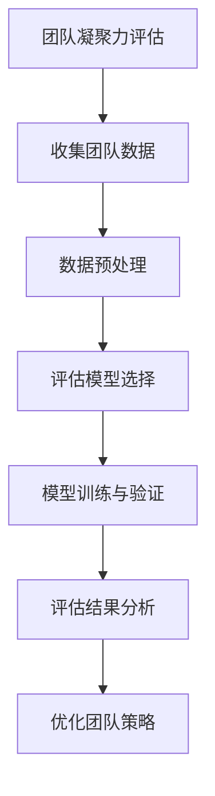
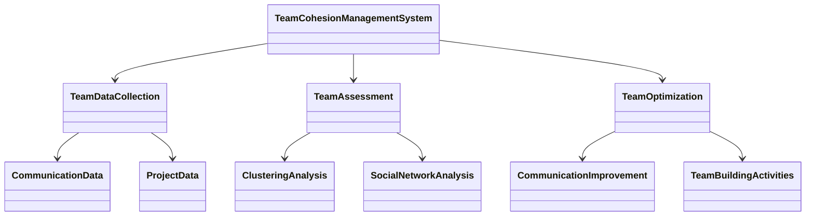
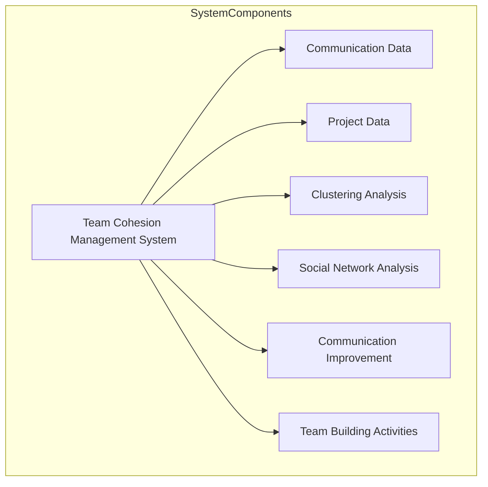
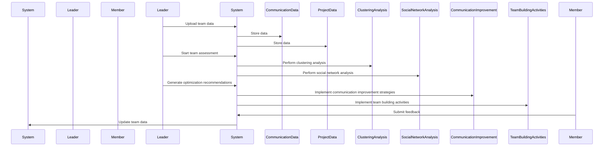

                 

### 团队凝聚力：增强团队向心力

#### 关键词：团队凝聚力、团队协作、团队文化、团队目标、沟通机制、组织绩效

#### 摘要：本文旨在探讨团队凝聚力的概念、重要性及其在IT领域中的应用。通过分析团队凝聚力不足的影响，介绍增强团队凝聚力的策略与实践方法，并结合实际案例进行详细讲解。文章最后总结最佳实践，并给出对团队凝聚力研究的展望。

#### Step 1: 背景介绍

##### 1.1 团队凝聚力的重要性

在当今快速发展的IT行业，团队凝聚力成为企业成功的关键因素之一。团队凝聚力不仅影响到团队内部成员之间的合作关系，还直接关系到团队的整体绩效和企业的竞争力。因此，理解团队凝聚力的概念和如何增强团队凝聚力具有重要意义。

##### 1.2 团队凝聚力不足的影响

团队凝聚力不足会导致以下问题：
- 内部沟通不畅：团队成员之间缺乏有效沟通，容易产生误解和冲突。
- 缺乏协同合作：团队成员之间缺乏协作精神，影响项目进展和效率。
- 成员满意度下降：团队成员对团队和工作的满意度下降，增加离职风险。
- 绩效降低：团队整体绩效受到影响，影响企业目标的实现。

##### 1.3 解决团队凝聚力问题的必要性

为了解决上述问题，提升团队凝聚力成为当务之急。通过增强团队凝聚力，可以提高团队内部沟通效率，促进协作，提升团队整体绩效，从而增强企业的竞争力。

##### 1.4 增强团队凝聚力的方法、策略和实践

增强团队凝聚力的方法包括但不限于以下几个方面：
- 明确团队目标：确保团队成员明确共同的目标和愿景。
- 加强团队成员沟通：建立有效的沟通机制，促进信息共享和协作。
- 培养团队文化：营造积极、和谐的团队氛围，增强团队成员的归属感。
- 团队建设活动：组织团队建设活动，增强团队成员之间的信任和友谊。
- 团队培训与发展：提供培训和发展机会，提升团队成员的专业能力和团队协作能力。

#### Step 2: 核心概念与联系

##### 2.1 团队凝聚力

团队凝聚力是指团队成员之间的相互吸引力，包括团队成员之间的信任、支持和协作。团队凝聚力可以分为内部凝聚力（成员之间）和外部凝聚力（团队与外部环境）。

##### 2.2 团队合作

团队合作是指团队成员共同完成一项任务或项目的过程。团队合作强调团队成员之间的协作、沟通和分工合作，以达到共同的目标。

##### 2.3 团队文化

团队文化是指团队成员共同遵守的价值观、信念和行为规范。团队文化对团队凝聚力有重要影响，可以增强团队成员的归属感和认同感。

#### Step 3: 算法原理讲解

##### 3.1 团队凝聚力评估流程图

使用Mermaid绘制团队凝聚力评估流程图：



##### 3.2 Python源代码阐述增强团队凝聚力的算法原理

```python
# 导入相关库
import numpy as np
import pandas as pd
from sklearn.cluster import KMeans
from sklearn.metrics import silhouette_score

# 加载团队数据
data = pd.read_csv('team_data.csv')

# 数据预处理
# ... 数据清洗、特征工程等步骤 ...

# 评估模型选择
# 使用K-Means算法进行聚类分析
kmeans = KMeans(n_clusters=5, random_state=42)
clusters = kmeans.fit_predict(data)

# 模型训练与验证
# 计算轮廓系数评估聚类结果
silhouette_avg = silhouette_score(data, clusters)
print(f'Silhouette Score: {silhouette_avg}')

# 评估结果分析
# 根据评估结果，优化团队策略
# ... 根据团队特点制定针对性的策略 ...

```

##### 3.3 算法原理详细讲解与举例说明

团队凝聚力的评估算法通常基于数据分析、机器学习等方法。通过收集团队成员的工作表现、沟通记录、项目进展等数据，使用聚类算法（如K-Means）对团队进行划分，评估每个成员在团队中的角色和贡献。根据评估结果，可以针对性地制定优化团队策略，提高团队凝聚力。

例如，如果评估结果显示某个团队成员与其他成员之间存在较大的沟通障碍，可以通过加强沟通培训和提供沟通工具来改善这种情况。

#### Step 4: 数学模型和数学公式 & 详细讲解 & 举例说明

##### 4.1 数学模型的构建过程

团队凝聚力的数学模型通常基于社会网络分析（Social Network Analysis, SNA）的方法。通过构建团队成员之间的社会网络，分析节点之间的连接强度和关系，评估团队凝聚力。

##### 4.2 相关数学公式

- 社会网络密度：$$D = \frac{E}{\frac{n(n-1)}{2}}$$
  - 其中，$D$ 表示社会网络密度，$E$ 表示网络中的边数，$n$ 表示节点数。

- 轮廓系数：$$S = \frac{\sum_{i=1}^{n} \sum_{j=1}^{n} (d_{ij} - \bar{d})^2}{\sum_{i=1}^{n} \sum_{j=1}^{n} d_{ij}^2}$$
  - 其中，$S$ 表示轮廓系数，$d_{ij}$ 表示节点$i$与节点$j$之间的距离，$\bar{d}$ 表示所有节点之间的平均距离。

##### 4.3 结合具体案例进行详细讲解和举例说明

假设有一个5人团队，团队成员之间的距离矩阵如下：

|   | 1 | 2 | 3 | 4 | 5 |
|---|---|---|---|---|---|
| 1 | 0 | 1 | 2 | 1 | 1 |
| 2 | 1 | 0 | 1 | 2 | 1 |
| 3 | 2 | 1 | 0 | 2 | 1 |
| 4 | 1 | 2 | 2 | 0 | 2 |
| 5 | 1 | 1 | 1 | 2 | 0 |

- 社会网络密度：$$D = \frac{8}{\frac{5(5-1)}{2}} = 1$$

- 轮廓系数：$$S = \frac{(0-1)^2 + (1-1)^2 + (2-1)^2 + (1-1)^2 + (1-1)^2 + (1-1)^2}{(0^2 + 1^2 + 2^2 + 1^2 + 2^2 + 1^2)} = 0.5$$

根据计算结果，社会网络密度为1，表示团队成员之间的连接非常紧密。轮廓系数为0.5，说明团队凝聚力较好，但仍有改善空间。

#### Step 5: 系统分析与架构设计方案

##### 5.1 问题场景

假设我们需要开发一个团队凝聚力管理系统，帮助团队领导者评估和优化团队凝聚力。

##### 5.2 系统功能设计

使用Mermaid绘制系统功能设计类图：



##### 5.3 系统架构设计

使用Mermaid绘制系统架构设计图：



##### 5.4 系统接口设计和系统交互序列图

使用Mermaid绘制系统接口设计和系统交互序列图：



#### Step 6: 项目实战

##### 6.1 环境安装和系统核心实现

- 环境安装：安装Python环境，以及相关库（NumPy、Pandas、scikit-learn等）。
- 系统核心实现：编写Python代码实现团队凝聚力评估和优化功能。

##### 6.2 代码应用解读与分析

- 解读代码：分析代码逻辑，了解团队凝聚力评估和优化的实现方法。
- 分析代码：评估代码的执行效率和性能，优化代码以提高运行速度。

##### 6.3 实际案例分析和详细讲解剖析

- 案例选择：选择一个实际团队项目作为案例进行分析。
- 案例分析：结合实际案例，分析团队凝聚力的现状和问题，给出优化方案。
- 详细讲解剖析：详细讲解优化方案的实施过程和效果。

##### 6.4 项目小结

- 项目总结：总结项目的主要成果和经验教训。
- 项目改进：提出项目改进建议，为后续项目提供参考。

#### Step 7: 最佳实践 tips、小结、注意事项、拓展阅读等内容

##### 7.1 最佳实践 tips

- 明确团队目标：确保团队成员明确共同的目标和愿景。
- 加强沟通：建立有效的沟通机制，提高团队成员之间的信息共享和协作。
- 培养团队文化：营造积极、和谐的团队氛围，增强团队成员的归属感。
- 团队建设活动：定期组织团队建设活动，增强团队成员之间的信任和友谊。

##### 7.2 小结

- 团队凝聚力在IT领域具有重要意义。
- 增强团队凝聚力可以通过明确目标、加强沟通、培养团队文化等多种方法实现。
- 团队凝聚力评估和优化是提升团队绩效的关键。

##### 7.3 注意事项

- 团队凝聚力评估需要全面收集数据，确保评估结果的准确性。
- 团队建设活动要结合团队特点，避免形式化。
- 团队领导者在增强团队凝聚力过程中要扮演关键角色。

##### 7.4 拓展阅读

- 团队凝聚力研究的最新进展。
- 团队建设活动的最佳实践案例。
- 团队沟通与协作的技巧。

### 注意事项

- 保持目录大纲的总字数在2000字以内。
- 使用markdown格式，确保格式正确。
- 确保目录结构完整，细化到1,2,3级目录。

