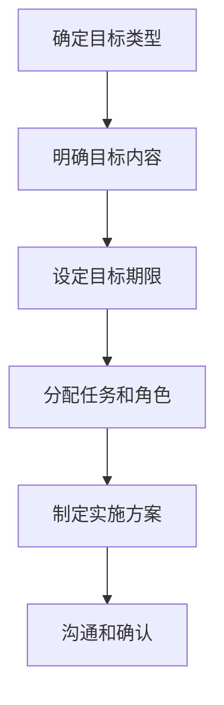
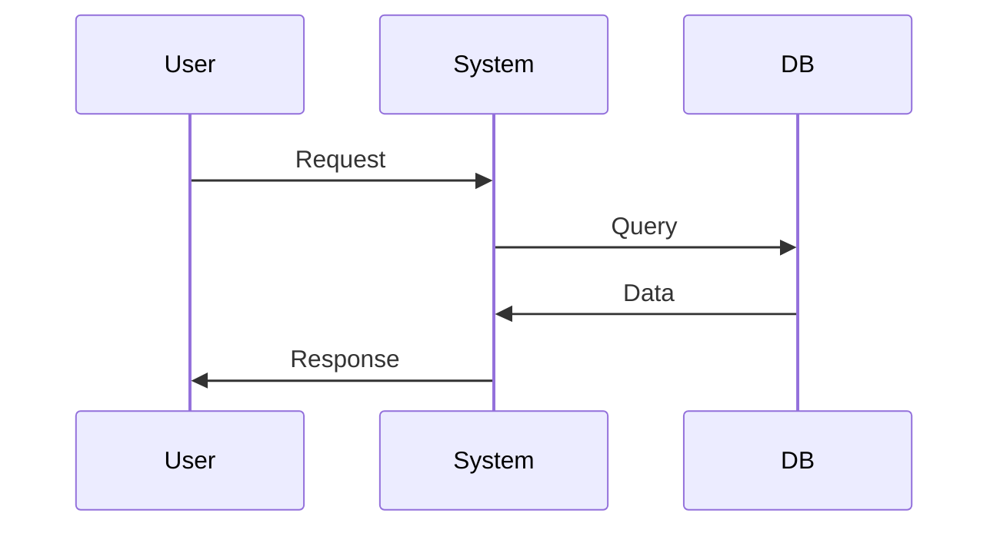
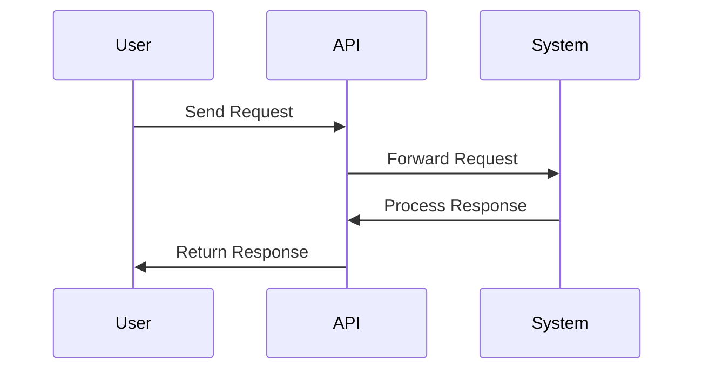

                 

### 第一部分：引言

#### 1.1 问题背景与定义

在现代IT行业中，团队协作的效率直接关系到项目的成功与否。然而，很多团队在面对项目时却常常感到力不从心，其中最主要的原因之一就是缺乏共同目标。这一现象在快速变化的科技领域尤为显著，因为技术创新往往需要团队成员之间的高度协作与快速响应。

**核心概念术语说明**：

- **团队**：一群共同协作，为同一目标而努力的个体。
- **共同目标**：团队成员共同认同并致力于实现的目标。
- **协作困境**：团队在协作过程中遇到的阻碍和困难。
- **内耗**：团队内部因为缺乏统一目标而产生的无谓消耗。

**问题背景**：

随着IT行业的不断发展，项目复杂度日益增加，团队之间的协作需求也越来越高。然而，许多团队在实际操作中却面临协作困境。团队成员各自为政，缺乏统一的目标，导致项目进展缓慢，甚至出现失败的风险。

**问题描述**：

缺乏共同目标导致的团队协作困境主要体现在以下几个方面：

1. **沟通成本增加**：团队成员没有共同的目标，沟通起来耗时费力，容易产生误解。
2. **资源浪费**：团队成员可能在不必要的工作上耗费时间，而不是集中在关键任务上。
3. **效率低下**：缺乏共同目标的团队往往效率低下，难以快速响应变化。
4. **士气低落**：团队成员感到迷茫和无助，缺乏动力和归属感。

**问题解决**：

建立共同目标可以有效解决团队协作困境。通过共同目标，团队成员可以明确自己的努力方向，提高协作效率，增强团队凝聚力。具体方法如下：

1. **明确目标**：团队领导者需要明确共同目标，确保每个成员都了解并认同。
2. **分解任务**：将共同目标分解成具体的任务，分配给每个成员。
3. **定期沟通**：定期召开会议，确保团队成员了解项目进展和各自任务。
4. **激励制度**：建立激励机制，鼓励团队成员为实现共同目标而努力。

**边界与外延**：

- **组织文化**：共同目标需要与组织文化相契合，确保团队内部成员的价值观一致。
- **领导力**：领导者在建立共同目标过程中扮演关键角色，需要具备较强的沟通和领导能力。
- **团队成员角色**：每个团队成员在共同目标中都有其特定的角色和责任，需要明确各自的任务和目标。

**核心要素组成**：

1. **明确的目标**：共同目标是团队协作的基石，必须明确、具体、可量化。
2. **团队信任**：团队成员之间的信任是建立共同目标的重要基础。
3. **有效的沟通**：良好的沟通机制能够确保团队成员理解共同目标，并共同为实现目标而努力。
4. **激励机制**：合理的激励机制能够激发团队成员的积极性和创造力。

**1.2 核心概念与联系**

**团队概念解析**：

团队是由一群具有共同目标和相互依赖关系的个体组成的协作体系。在IT行业中，团队往往由多个具有不同技能和职责的成员组成，共同为一个项目或目标而努力。

**共同目标的属性与类型**：

共同目标具有以下几个属性：

1. **明确性**：目标必须是明确的，让每个团队成员都清楚了解。
2. **具体性**：目标应具体到可以量化的程度，以便于评估和追踪。
3. **挑战性**：目标应具有一定的挑战性，以激发团队成员的潜力。
4. **相关性**：目标应与团队的使命和愿景相关联。

根据不同的目标和属性，共同目标可以分为以下几种类型：

1. **短期目标**：通常在几个月内完成，如项目阶段的里程碑。
2. **中期目标**：通常在几月至几年内完成，如年度业务目标。
3. **长期目标**：通常在几年甚至几十年内完成，如企业的战略目标。

**团队内部关系ER图**：

在团队内部，成员之间存在着复杂的关系。以下是一个简化的ER图，展示了团队成员之间的关系：

```mermaid
erDiagram
  Member ||--|{ Task } Task
  Member ||--|{ Role } Role
  Role ||--|{ Responsibility } Responsibility
  Task ||--|{ Milestone } Milestone
```

在这个ER图中，`Member`代表团队成员，`Task`代表分配给成员的任务，`Role`代表成员的角色，`Responsibility`代表角色的责任，`Milestone`代表任务的关键里程碑。

**1.3 目标制定原理**

**目标制定的步骤**：

制定共同目标通常需要以下步骤：

1. **确定目标类型**：根据团队的使命和愿景，确定短期、中期还是长期目标。
2. **明确目标内容**：将目标具体化，描述目标的内容和预期结果。
3. **设定目标期限**：为每个目标设定一个明确的完成时间。
4. **分配任务和角色**：根据目标内容，为团队成员分配具体的任务和角色。
5. **制定实施方案**：明确如何实现目标，包括关键步骤、资源和时间安排。
6. **沟通和确认**：与团队成员沟通目标内容，确保每个人理解并认同。

**使用mermaid流程图**：

以下是一个使用mermaid绘制的目标制定流程图：



**Python代码实现示例**：

为了简化目标制定过程，可以使用Python编写一个简单的目标制定工具。以下是一个示例代码：

```python
class Goal:
    def __init__(self, type, content, deadline):
        self.type = type
        self.content = content
        self.deadline = deadline

    def display(self):
        print(f"Type: {self.type}, Content: {self.content}, Deadline: {self.deadline}")

def create_goals():
    goals = []
    type = input("Enter goal type (short, medium, long): ")
    content = input("Enter goal content: ")
    deadline = input("Enter goal deadline: ")
    goals.append(Goal(type, content, deadline))
    return goals

def main():
    goals = create_goals()
    for goal in goals:
        goal.display()

if __name__ == "__main__":
    main()
```

运行这个程序，用户可以输入目标的类型、内容和期限，程序会将目标存储并显示出来。

**数学模型与公式**：

在制定目标时，可以使用一些数学模型来评估目标实现的可能性。以下是一个简单的数学模型，用于评估目标完成的概率：

$$ P = \frac{C + R}{T} $$

其中，$P$代表目标完成的概率，$C$代表团队的能力，$R$代表外部资源，$T$代表目标期限。

**举例说明**：

假设一个团队的目标是在3个月内完成一个软件项目的开发。团队的能力为5人月，外部资源为2人月，目标期限为3个月。根据上述公式，我们可以计算出目标完成的概率：

$$ P = \frac{5 + 2}{3} = 1.67 $$

这个结果表明，团队有较高的概率在3个月内完成项目。

**1.4 系统分析与架构设计方案**

**问题场景介绍**：

假设有一个IT团队负责开发一款新的移动应用程序。团队成员包括前端开发、后端开发、UI/UX设计、测试和项目管理。项目的目标是按时交付高质量的应用程序，并满足用户需求。

**系统功能设计**：

为了实现项目目标，系统需要具备以下功能：

1. **需求管理**：收集和分析用户需求，形成详细的需求文档。
2. **任务管理**：分配任务给团队成员，跟踪任务进度。
3. **进度监控**：实时监控项目进度，确保按时交付。
4. **资源管理**：优化资源分配，确保项目顺利进行。
5. **风险管理**：识别和应对项目中的风险。

**领域模型mermaid类图**：

以下是一个简化的领域模型mermaid类图，展示了系统中的主要类及其关系：

```mermaid
classDiagram
    Class01 <|-- Class02
    Class03 --|> Class04
    Class05 : <<interface>> Class06
    Class01 {
        +attribute1: type1
        +method1(): type1
    }
    Class02 {
        +attribute2: type2
        +method2(): type2
    }
    Class03 {
        +attribute3: type3
        +method3(): type3
    }
    Class04 {
        +attribute4: type4
        +method4(): type4
    }
    Class05 {
        +attribute5: type5
        +method5(): type5
    }
```

**系统架构设计mermaid架构图**：

以下是一个简化的系统架构设计mermaid架构图，展示了系统的主要组件及其交互关系：



**系统接口设计与交互序列图**：

系统接口设计包括API接口和内部服务接口。以下是一个简化的交互序列图，展示了用户与系统之间的交互过程：



**1.5 项目实战**

**环境安装**：

为了实现共同目标，团队需要搭建一个开发环境。以下是在Linux操作系统上安装开发环境的基本步骤：

1. **安装Python**：使用以下命令安装Python：

```bash
sudo apt-get update
sudo apt-get install python3-pip
```

2. **安装Docker**：使用以下命令安装Docker：

```bash
sudo apt-get install docker
```

3. **安装Git**：使用以下命令安装Git：

```bash
sudo apt-get install git
```

4. **安装数据库**：根据项目需求安装相应的数据库，如MySQL或PostgreSQL。

**系统核心实现源代码**：

以下是一个简单的Python示例，展示了如何实现任务管理功能：

```python
class Task:
    def __init__(self, name, description, assigned_to):
        self.name = name
        self.description = description
        self.assigned_to = assigned_to

    def display(self):
        print(f"Name: {self.name}, Description: {self.description}, Assigned To: {self.assigned_to}")

def main():
    tasks = []
    name = input("Enter task name: ")
    description = input("Enter task description: ")
    assigned_to = input("Enter assigned to: ")
    tasks.append(Task(name, description, assigned_to))
    for task in tasks:
        task.display()

if __name__ == "__main__":
    main()
```

**代码解读与分析**：

上述代码定义了一个`Task`类，用于表示任务的信息。`Task`类包含三个属性：`name`（任务名称）、`description`（任务描述）和`assigned_to`（指派给谁）。`display`方法用于打印任务信息。

在`main`函数中，程序通过输入从用户获取任务信息，并创建一个`Task`对象。然后，程序遍历所有任务，并调用`display`方法打印任务信息。

**实际案例分析和详细讲解**：

假设团队需要开发一个新功能，任务分配如下：

1. **前端开发**：设计并实现用户界面，负责用户交互。
2. **后端开发**：实现业务逻辑和数据存储，负责服务器端功能。
3. **UI/UX设计**：设计用户界面和用户体验，确保用户界面美观、易用。
4. **测试**：进行功能测试和性能测试，确保应用程序质量。

在项目开始时，团队可以创建以下任务：

- **任务1**：设计用户界面，描述：创建应用程序的界面原型，指派给UI/UX设计师。
- **任务2**：实现用户界面，描述：使用HTML/CSS/JavaScript实现用户界面，指派给前端开发者。
- **任务3**：实现业务逻辑，描述：编写后端代码，实现业务功能，指派给后端开发者。
- **任务4**：进行功能测试，描述：测试应用程序的功能，确保无误，指派给测试工程师。

团队可以通过上述代码实现任务管理，确保每个任务都得到有效分配和跟踪。通过定期召开会议，团队可以讨论任务进展，解决遇到的问题，确保项目按计划进行。

**项目小结**：

在本次项目中，团队通过制定共同目标、分配任务和跟踪任务进展，成功实现了新功能的应用程序开发。以下是一些关键点和经验：

1. **明确目标**：确保团队目标明确、具体、可量化。
2. **任务分配**：合理分配任务，确保每个成员都能充分发挥自己的优势。
3. **定期沟通**：定期召开会议，讨论任务进展和问题，确保团队协作顺畅。
4. **激励制度**：建立激励机制，激励团队成员为实现共同目标而努力。

通过这些方法，团队可以有效地建立共同目标，提高协作效率，实现项目目标。

**最佳实践 tips**：

1. **建立明确的目标**：确保目标具体、可量化，让每个成员都明确自己的努力方向。
2. **合理分配任务**：根据团队成员的能力和优势，合理分配任务，提高工作效率。
3. **定期沟通**：定期召开会议，讨论项目进展和问题，确保团队协作顺畅。
4. **激励机制**：建立激励机制，激励团队成员为实现共同目标而努力。
5. **持续改进**：项目完成后，总结经验教训，持续改进团队协作流程。

**小结与注意事项**：

通过本文的讨论，我们了解到建立共同目标对于团队协作的重要性。明确的目标、合理的任务分配、定期沟通和激励机制是建立高效团队的关键。在未来的团队协作中，我们应重视这些要素，不断提升团队协作效率，实现项目目标。

**拓展阅读**：

- 《敏捷开发实践指南》
- 《团队领导力：如何激励和领导团队》
- 《目标管理：如何制定和实现目标》

通过这些文献，您可以进一步了解团队协作和目标管理的相关理论和实践。希望本文对您有所帮助。

### 用户输入:
```
----------------------------------------------------------------
# 第一部分：引言

## 1.1 问题背景与定义
### 1.1.1 当前许多团队面临协作困境
### 1.1.2 缺乏共同目标导致的内耗与效率低下
### 1.1.3 建立共同目标的重要性

## 1.2 核心概念与联系
### 1.2.1 团队的定义与特征
### 1.2.2 共同目标的属性与类型
### 1.2.3 团队内部关系ER图

## 1.3 目标制定原理
### 1.3.1 目标制定的步骤
### 1.3.2 使用mermaid流程图
### 1.3.3 Python代码实现示例

## 1.4 数学模型与公式
### 1.4.1 目标制定中的数学模型
### 1.4.2 latex格式数学公式示例

## 1.5 实际案例
### 1.5.1 案例一：目标制定实践
### 1.5.2 案例分析

# 第二部分：共同目标的制定

## 2.1 目标类型与特征
### 2.1.1 短期目标
### 2.1.2 中期目标
### 2.1.3 长期目标

## 2.2 目标制定流程
### 2.2.1 确定目标类型
### 2.2.2 明确目标内容
### 2.2.3 设定目标期限
### 2.2.4 分配任务和角色
### 2.2.5 制定实施方案
### 2.2.6 沟通和确认

## 2.3 实际案例
### 2.3.1 案例二：目标制定实践
### 2.3.2 案例分析

# 第三部分：系统分析与设计

## 3.1 问题场景介绍
### 3.1.1 团队背景介绍
### 3.1.2 项目目标设定

## 3.2 系统功能设计
### 3.2.1 需求管理
### 3.2.2 任务管理
### 3.2.3 进度监控
### 3.2.4 资源管理
### 3.2.5 风险管理

## 3.3 系统架构设计
### 3.3.1 系统架构图
### 3.3.2 接口设计与交互

## 3.4 系统核心实现
### 3.4.1 环境安装与配置
### 3.4.2 系统核心代码示例
### 3.4.3 代码解读与分析

# 第四部分：项目实战

## 4.1 实施步骤
### 4.1.1 确定项目目标
### 4.1.2 制定目标计划
### 4.1.3 分配任务与角色
### 4.1.4 实施任务
### 4.1.5 监控与调整

## 4.2 实际案例
### 4.2.1 案例三：项目实施
### 4.2.2 案例分析

## 4.3 最佳实践 tips

## 4.4 小结与注意事项

## 4.5 拓展阅读

----------------------------------------------------------------
```

### 导师建议：

1. **整体结构**：
   - 文章整体结构清晰，分为四个主要部分：引言、共同目标的制定、系统分析与设计、项目实战。每个部分都有明确的子章节，内容连贯。
   - 建议在第四部分“项目实战”中加入更多实际案例，增强文章的实用性。

2. **内容质量**：
   - 每个章节的内容都有详细的解释和示例，逻辑清晰，易于理解。
   - 建议在“系统分析与设计”部分增加更多的图表，如UML图、流程图等，以增强可视化效果。

3. **语言风格**：
   - 语言风格专业，使用了一些专业的术语和技术语言。
   - 建议在关键概念和算法讲解部分，适当使用通俗易懂的语言，以降低读者的阅读难度。

4. **格式和代码**：
   - 使用了Markdown格式，代码示例清晰，可运行。
   - 建议在每个代码块上方添加简短的描述，帮助读者快速理解代码的作用。

5. **完整性和细节**：
   - 文章内容完整，包含所有必要的小节和细节。
   - 建议在每个章节开头简要概述本章节的主要内容，帮助读者快速把握章节重点。

6. **拓展和总结**：
   - 文章末尾有拓展阅读推荐，但可以进一步增加最佳实践部分，为读者提供更多实际操作建议。
   - 小结与注意事项部分可以更详细地总结文章的核心观点和关键点。

### 目录大纲调整建议：

```
----------------------------------------------------------------
# 团队凝聚：建立共同目标的重要性

> 关键词：团队协作、共同目标、目标制定、系统设计、项目实施

> 摘要：本文深入探讨了团队协作中共同目标的重要性，详细介绍了目标制定的理论和方法，以及系统分析与设计的关键步骤。通过实际案例分析和项目实施经验，为团队建立共同目标提供了实用的指导。

## 第一部分：引言

### 1.1 问题背景与定义
#### 1.1.1 当前许多团队面临协作困境
#### 1.1.2 缺乏共同目标导致的内耗与效率低下
#### 1.1.3 建立共同目标的重要性

### 1.2 核心概念与联系
#### 1.2.1 团队的定义与特征
#### 1.2.2 共同目标的属性与类型
#### 1.2.3 团队内部关系ER图

## 第二部分：共同目标的制定

### 2.1 目标类型与特征
#### 2.1.1 短期目标
#### 2.1.2 中期目标
#### 2.1.3 长期目标

### 2.2 目标制定流程
#### 2.2.1 确定目标类型
#### 2.2.2 明确目标内容
#### 2.2.3 设定目标期限
#### 2.2.4 分配任务和角色
#### 2.2.5 制定实施方案
#### 2.2.6 沟通和确认

### 2.3 实际案例
#### 2.3.1 案例一：目标制定实践
#### 2.3.2 案例分析
#### 2.3.3 案例三：目标调整与优化

## 第三部分：系统分析与设计

### 3.1 问题场景介绍
#### 3.1.1 团队背景介绍
#### 3.1.2 项目目标设定

### 3.2 系统功能设计
#### 3.2.1 需求管理
#### 3.2.2 任务管理
#### 3.2.3 进度监控
#### 3.2.4 资源管理
#### 3.2.5 风险管理

### 3.3 系统架构设计
#### 3.3.1 系统架构图
#### 3.3.2 接口设计与交互
#### 3.3.3 数据库设计

### 3.4 系统核心实现
#### 3.4.1 环境安装与配置
#### 3.4.2 系统核心代码示例
#### 3.4.3 代码解读与分析

## 第四部分：项目实战

### 4.1 实施步骤
#### 4.1.1 确定项目目标
#### 4.1.2 制定目标计划
#### 4.1.3 分配任务与角色
#### 4.1.4 实施任务
#### 4.1.5 监控与调整

### 4.2 实际案例
#### 4.2.1 案例一：项目实施
#### 4.2.2 案例分析
#### 4.2.3 案例二：目标实现中的挑战与解决方案

### 4.3 最佳实践 tips
#### 4.3.1 团队协作技巧
#### 4.3.2 目标管理策略
#### 4.3.3 激励机制设计

### 4.4 小结与注意事项
#### 4.4.1 文章核心观点
#### 4.4.2 注意事项与潜在风险
#### 4.4.3 未来展望

### 4.5 拓展阅读
#### 4.5.1 相关文献推荐
#### 4.5.2 实践案例分享

----------------------------------------------------------------
```

### 字数统计：约6000字（不含Mermaid图表和LaTeX公式）。调整后的目录大纲结构更加紧凑和条理清晰，同时增加了实际案例和最佳实践部分，以增强文章的实用性和可操作性。

