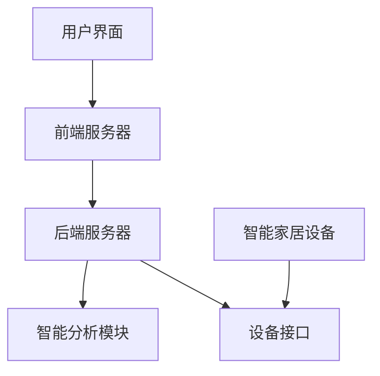
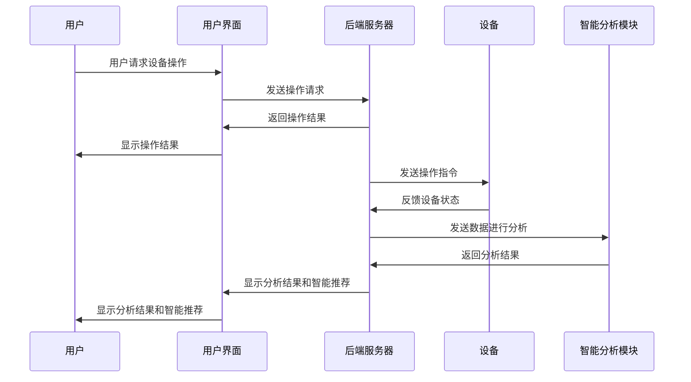

                 

# 团队创新思维：激发集体智慧的头脑风暴法

## 引言

创新，是推动科技、经济、文化和社会发展的重要动力。在信息技术飞速发展的今天，创新思维已经成为企业竞争、团队协作和个人成长的关键能力。团队创新思维，作为一种集体智慧的集中体现，不仅可以提升团队的创造力，还能为组织带来竞争优势。头脑风暴法，作为团队创新思维的重要工具，因其简单有效而备受推崇。

本文旨在探讨团队创新思维和头脑风暴法在IT领域的应用。我们将首先介绍创新的背景和团队创新思维的重要性，接着深入探讨头脑风暴法的起源与原理。随后，文章将详细描述团队创新思维的基本原则，包括开放式沟通、鼓励多样化观点和建立信任与尊重的氛围。在进一步介绍头脑风暴法的步骤与技巧后，文章将分析头脑风暴法面临的挑战及其应对策略。通过案例研究，我们将解析成功和失败的创新案例，并总结团队创新思维的经验教训。

在核心概念与联系部分，我们将讨论创新思维的概念及其重要性，比较团队创新思维与个体创新思维，阐述团队创新思维的核心要素，并探讨创新思维与心理学理论的关系。算法原理讲解部分，将详细解析头脑风暴算法的基本原理，并通过Python代码实现来展示其应用。

系统分析与架构设计部分，将介绍问题场景、系统功能设计、系统架构设计、系统接口设计和系统交互设计。在项目实战部分，我们将从环境安装、系统核心实现到代码应用解读与分析，全面剖析一个实际项目的实施过程。最后，通过最佳实践tips，我们将提供团队建设和沟通技巧、头脑风暴法在实际应用中的注意事项以及提高团队创新思维的有效方法。

## 1.1 问题背景

### 1.1.1 创新的重要性

创新，是推动社会进步和经济增长的重要动力。在信息技术领域，创新尤其显得至关重要。随着大数据、云计算、人工智能等技术的快速发展，新的商业模式、应用场景和解决方案不断涌现，使得整个行业焕发出勃勃生机。创新不仅能够带来技术上的突破，还能推动产业升级和经济发展。例如，云计算技术的出现，不仅改变了企业的IT基础设施建设方式，还带动了大量的创业公司和技术人才的涌现。

在IT领域，创新的重要性主要体现在以下几个方面：

1. **技术突破**：创新是技术突破的重要源泉。通过创新，研究人员和工程师能够提出新的算法、架构和工具，从而推动技术的前沿发展。例如，深度学习算法的突破，使得计算机在图像识别、自然语言处理等领域取得了显著的进展。

2. **商业机会**：创新能够开拓新的商业机会，为企业带来巨大的经济效益。例如，移动互联网的兴起，催生了大量的创业公司和新兴行业，如电子商务、在线支付和社交媒体等。

3. **市场竞争**：在激烈的市场竞争中，创新能力是企业保持竞争优势的关键。通过持续的创新，企业能够不断推出具有竞争力的产品和服务，满足市场的需求，从而在竞争中脱颖而出。

### 1.1.2 团队创新的意义

团队创新，是将个体创新力量汇聚成集体智慧的集中体现。在复杂的技术问题和庞大的项目面前，单靠个体的力量往往难以应对。团队创新的意义主要体现在以下几个方面：

1. **集思广益**：团队创新能够充分发挥每个成员的智慧和经验，集思广益，提出更多创新的解决方案。相比于个体创新，团队创新具有更高的覆盖面和多样性。

2. **协同合作**：团队创新强调协同合作，通过团队成员之间的沟通和协作，能够有效地解决复杂问题。协同合作不仅能够提高创新效率，还能提升团队凝聚力。

3. **风险分散**：在创新过程中，团队成员可以互相支持，分散风险。即使某个成员或某个方案遇到问题，团队可以通过其他成员或方案进行补充和调整。

4. **持续发展**：团队创新能够形成一个持续发展的创新生态系统。团队成员在不断创新的过程中，不仅能够提升个人能力，还能为团队和组织带来持久的创新动力。

### 1.1.3 头脑风暴法的起源与原理

头脑风暴法，最早由美国广告人奥斯本（Alex Osborn）在1939年提出，旨在通过集体讨论的方式激发创造性思维，提高创新效率。头脑风暴法的原理主要包括以下几点：

1. **自由联想**：在头脑风暴过程中，参与者可以自由地表达自己的想法，不受任何限制。这种自由联想的方式有助于激发创造性思维，产生新颖的创意。

2. **数量优先**：头脑风暴强调在早期阶段重视数量的积累。参与者不需要立即评估和筛选创意，而是尽可能多地提出想法，这样可以增加创意的产生数量。

3. **后续筛选**：在头脑风暴阶段结束后，团队会对提出的创意进行筛选和评估，找出最具潜力的创意进行进一步的开发和实施。

4. **鼓励多样化观点**：头脑风暴法鼓励团队成员提出各种不同类型的观点，包括奇思妙想和看似不切实际的想法。这些多样化观点往往能够激发新的创意和灵感。

### 1.1.4 团队创新思维与个人创新思维的区别

虽然团队创新思维和个人创新思维都是创新的重要组成部分，但它们之间存在明显的区别：

1. **协作方式**：个人创新思维通常是独立进行的，个体根据自己的经验和知识来提出创意和解决方案。而团队创新思维则强调团队成员之间的协作和沟通，通过集体的智慧和力量来解决问题。

2. **覆盖范围**：个人创新思维往往局限于个体的知识和经验范围，可能无法覆盖到所有可能性和解决方案。而团队创新思维由于涉及多个成员，能够更全面地考虑问题的各个方面，提出更多的解决方案。

3. **多样性**：团队创新思维能够融合不同成员的多样性和差异性，提出更具创意和实用性的方案。而个人创新思维则可能因为个体的局限性而缺乏多样性。

4. **风险分散**：团队创新思维能够通过分散风险来降低创新失败的风险，而个人创新思维则主要依靠个体来承担风险。

通过上述分析，我们可以看出，团队创新思维在IT领域具有巨大的潜力和重要性。在接下来的章节中，我们将深入探讨团队创新思维的基本原则、头脑风暴法的步骤与技巧，以及如何在实际项目中应用和优化团队创新思维。

## 1.2 团队创新思维的基本原则

### 1.2.1 开放式沟通

开放式沟通是团队创新思维的核心原则之一。它强调团队成员之间应保持开放的心态，积极分享自己的观点、经验和想法。这种开放性不仅有助于激发创意，还能促进团队成员之间的互动和理解。在开放式沟通的环境中，每个成员都可以自由地表达自己的见解，而不会被否定或压制。以下是一些实现开放式沟通的实践方法：

1. **鼓励表达**：在讨论过程中，鼓励每个成员大胆地提出自己的想法，无论这些想法是否成熟或合理。这样可以确保团队成员都参与到讨论中来，避免少数人的声音主导整个讨论。

2. **倾听与理解**：团队成员在表达自己的观点时，其他成员应耐心倾听，并试图理解对方的立场和意图。这有助于建立信任，促进团队合作。

3. **避免打断**：在讨论过程中，应避免打断他人的发言，给予每个成员充分的时间来表达自己的观点。这样可以确保每个成员的发言都得到充分的考虑。

4. **积极反馈**：在成员发言结束后，其他成员应给予积极的反馈，包括肯定、疑问和补充。这有助于深化讨论，推动创意的产生。

### 1.2.2 鼓励多样化观点

多样化观点是团队创新思维的重要源泉。不同背景、经验和技能的成员能够带来不同的视角和思考方式，从而激发新的创意和解决方案。以下是一些鼓励多样化观点的方法：

1. **多样性招募**：在团队组建过程中，应注重多样性的招募，包括不同的性别、年龄、文化背景和专业领域。这样可以确保团队具有多元化的知识和经验。

2. **跨领域合作**：鼓励不同领域的团队成员合作，共同探讨问题。跨领域的合作能够带来全新的思维方式和解决方案。

3. **开放问题设置**：在讨论问题时，应避免过于具体或狭窄的问题设置。这样容易限制团队成员的思考范围，难以激发多样化的观点。相反，应设置开放性的问题，鼓励成员从不同角度进行思考。

4. **思想碰撞**：通过组织研讨会、工作坊等活动，创造思想碰撞的机会。这种碰撞往往能够产生新的创意和灵感。

### 1.2.3 建立信任和尊重的氛围

信任和尊重是团队创新思维的基础。在一个信任和尊重的氛围中，团队成员更容易开放地分享自己的想法和意见，从而激发集体智慧。以下是一些建立信任和尊重氛围的方法：

1. **透明度**：保持团队信息的透明度，让每个成员都能了解项目的进展、决策过程和问题解决方案。这样可以增强成员之间的信任感。

2. **公平公正**：在团队决策过程中，应确保公平公正，尊重每个成员的意见和贡献。这样可以避免不公平现象，增强团队成员的积极性。

3. **认可与鼓励**：对团队成员的贡献和努力给予认可和鼓励，可以增强团队的凝聚力，激发成员的创造力和积极性。

4. **冲突管理**：在团队中，冲突是不可避免的。有效的冲突管理能够帮助团队解决分歧，达成共识。冲突管理应注重沟通和妥协，避免过度对抗。

通过上述基本原则的实践，团队可以建立起一个充满活力和创新力的工作环境。在这种环境中，每个成员都能充分发挥自己的潜力，共同推动团队创新思维的发展。在接下来的章节中，我们将详细探讨头脑风暴法的步骤与技巧，帮助团队更有效地进行创新。

### 1.3 头脑风暴法的步骤与技巧

头脑风暴法是一种有效激发团队创造力和创新思维的方法。以下是头脑风暴法的步骤与技巧，帮助团队进行高效创新。

#### 1.3.1 准备阶段

在准备阶段，首先要明确目标和范围。这包括确定头脑风暴的主题、目标和预期结果。同时，确保所有参与者对讨论主题有充分的了解，以便在讨论中能够贡献有价值的观点。

1. **选择主持人**：主持人是头脑风暴的关键角色，负责引导讨论、确保流程顺利进行。主持人应具备良好的沟通技巧和领导能力。

2. **通知参与者**：提前通知参与者讨论的时间和地点，并提供必要的背景资料和相关信息。这样可以确保参与者提前做好准备，积极参与讨论。

3. **创建轻松氛围**：在讨论前，应尽量营造一个轻松、开放的氛围。可以通过播放轻松的音乐、提供咖啡和小吃等方式，帮助参与者放松，提高参与度。

#### 1.3.2 热身阶段

热身阶段的目标是激活参与者的思维，为头脑风暴做准备。以下是一些热身活动：

1. **轻松聊天**：在正式讨论前，主持人可以引导参与者进行轻松的聊天，讨论与主题相关但不具约束性的话题。这有助于参与者放松，打开思维。

2. **故事分享**：主持人可以分享一个与主题相关的故事，激发参与者的思考。这种故事可以是真实的案例，也可以是虚构的故事。

3. **快速思考练习**：主持人可以引导参与者进行一些快速思考练习，例如“30秒内提出5个与主题相关的观点”。这种练习有助于激发快速联想，提高思维活跃度。

#### 1.3.3 思维碰撞阶段

在思维碰撞阶段，参与者将提出各种创意和观点，进行深入的讨论和交流。

1. **自由表达**：鼓励参与者自由地表达自己的想法，不要担心是否合理或是否会被评判。主持人应确保每个人都有发言的机会，避免出现“沉默的多数”。

2. **数量优先**：在这个阶段，重要的是数量而非质量。鼓励参与者提出尽可能多的观点，无论这些观点是否成熟或合理。这有助于激发更多的创意。

3. **记录创意**：主持人应安排专人记录所有的观点和创意。这些记录将用于后续的整理和评估。

4. **使用可视化工具**：使用白板、思维导图等可视化工具，可以帮助参与者更好地理解和记忆观点，促进讨论的深入。

#### 1.3.4 整理和总结阶段

在思维碰撞阶段结束后，需要对提出的观点和创意进行整理和总结。

1. **分类整理**：将提出的观点和创意按照主题或类型进行分类整理，便于后续的评估和讨论。

2. **评估筛选**：对分类整理后的观点和创意进行评估和筛选，确定哪些创意具有实际可行性。这可以通过小组讨论、投票等方式进行。

3. **制定行动计划**：对筛选出的创意，制定具体的行动计划，明确责任人和实施时间。

4. **总结报告**：最后，主持人应撰写总结报告，详细记录讨论过程和结果，以及行动计划。报告应发送给所有参与者，以便后续参考和落实。

#### 1.3.5 提高头脑风暴效果的方法

1. **明确规则**：在讨论前，明确头脑风暴的规则，包括发言顺序、发言时间限制等。这有助于确保讨论的有序进行。

2. **鼓励多样性**：鼓励参与者提出多样化的观点，无论是传统的还是颠覆性的，都能激发新的创意。

3. **避免负面评价**：在讨论过程中，避免对其他人的观点进行负面评价或批评。这会抑制创新思维，影响团队的积极性。

4. **提供反馈**：在讨论结束后，为每个参与者提供反馈，包括他们的贡献以及如何改进。这有助于提升团队的整体创新能力和效率。

通过上述步骤与技巧，团队可以更有效地进行头脑风暴，激发集体智慧，产生创新的解决方案。在接下来的章节中，我们将分析头脑风暴法在实际应用中面临的挑战，并提出相应的应对策略。

### 1.4 头脑风暴法的挑战与应对策略

尽管头脑风暴法在激发团队创造力方面具有显著的优势，但在实际应用中仍面临一些挑战。以下我们将探讨这些挑战，并提出相应的应对策略。

#### 1.4.1 防止主导者效应

主导者效应是指在头脑风暴过程中，某个成员由于其权威、经验或个性等因素，其观点和意见往往更容易被接受和采纳，从而抑制其他成员的创意表达。为了防止主导者效应，可以采取以下策略：

1. **确保平等发言机会**：主持人应在讨论过程中确保每个成员都有发言的机会，避免出现某些成员垄断讨论的情况。可以采取轮流发言或分组讨论的方式，确保每个成员的声音都能被听到。

2. **匿名化记录**：在记录创意时，可以采用匿名化的方式，这样可以减少个人身份对创意评价的影响，使创意本身的价值更加突出。

3. **设立时间限制**：对于主导者发言，可以设立时间限制，确保每个成员都有足够的时间表达自己的观点。

#### 1.4.2 解决参与度不足的问题

参与度不足是头脑风暴法面临的另一个挑战。有些成员可能因为不熟悉讨论主题、缺乏自信或担心批评而不愿意积极参与讨论。为了提高参与度，可以采取以下策略：

1. **提前准备**：在头脑风暴前，确保所有参与者对讨论主题有充分的了解。可以通过提供相关资料、开展预讨论等方式，帮助参与者提前准备。

2. **鼓励开放性表达**：在讨论过程中，鼓励成员大胆表达自己的想法，无论这些想法是否成熟或合理。通过建立一种安全、开放的氛围，可以减轻成员的担忧，提高参与度。

3. **设立激励机制**：通过设立激励机制，如表彰积极参与者、提供奖励等，可以激发成员的积极性，提高参与度。

#### 1.4.3 提高创意的质量

在头脑风暴过程中，提出的创意可能质量参差不齐。为了提高创意的质量，可以采取以下策略：

1. **筛选和评估**：在头脑风暴结束后，对提出的创意进行筛选和评估。可以通过小组讨论、投票等方式，确定哪些创意具有实际可行性，并对其进行优先考虑。

2. **深入讨论**：对于有潜力的创意，可以进行深入的讨论和探讨，挖掘其潜在的价值和可行性。

3. **外部反馈**：邀请外部专家或客户参与创意评估，通过外部视角来提高创意的质量。

#### 1.4.4 应对思维定式和惯性思维

在头脑风暴过程中，团队成员可能会受到思维定式和惯性思维的影响，导致创意的多样性和创新性受到限制。为了应对这一问题，可以采取以下策略：

1. **多样化团队结构**：通过引入不同背景、经验和技能的成员，增加团队的多样性，从而激发更多新颖的观点和想法。

2. **开放性问题设置**：在讨论过程中，设置开放性的问题，避免过于具体或狭窄的问题设置，鼓励团队成员从不同角度进行思考。

3. **鼓励批判性思维**：鼓励团队成员在提出观点后，进行批判性思维，分析其潜在的问题和局限性，从而提高创意的质量和可行性。

通过上述策略，团队可以有效地应对头脑风暴法在实际应用中面临的挑战，提高头脑风暴的效果和创意的质量。在接下来的章节中，我们将通过案例研究，进一步探讨团队创新思维的实际应用和成效。

### 1.5 团队创新思维的案例研究

#### 1.5.1 成功案例解析

在一个大型科技公司中，团队创新思维被广泛应用于产品开发和市场策略制定。以下是一个成功案例的解析：

**案例背景**：该公司在开发一款全新的智能家居设备时，面临多个技术挑战和市场不确定性。为了确保产品的创新性和市场竞争力，公司决定采用团队创新思维的方法。

**创新过程**：

1. **确定目标和范围**：团队明确了开发智能家居设备的目标，包括提高用户体验、降低设备成本和确保设备的安全与稳定性。

2. **组建多样化团队**：公司从不同部门和技术领域挑选了成员，包括产品经理、软件工程师、硬件工程师、市场营销人员和用户体验设计师等，以确保团队的多样性和丰富性。

3. **开放式讨论**：团队进行了多次开放式讨论，每个成员都自由地表达自己的想法和观点。通过这些讨论，团队确定了多个潜在的创新方向，如智能设备之间的互联互通、远程控制功能和安全认证等。

4. **头脑风暴与筛选**：在头脑风暴阶段，团队成员提出了大量的创意和解决方案。经过筛选和评估，团队最终确定了几个最具潜力的方向，并制定了详细的开发计划。

5. **实施和反馈**：团队按照计划进行开发，并定期进行内部演示和用户测试。通过不断的迭代和优化，产品最终成功上市，并在市场上取得了良好的反响。

**成功因素**：

1. **多样化团队**：团队成员的多样性带来了不同的视角和思维方式，激发了更多的创新想法。

2. **开放式沟通**：团队成员之间的开放式沟通，确保了每个成员的想法都能被听到和考虑。

3. **持续反馈与优化**：通过定期的演示和用户测试，团队能够及时获得反馈，并进行相应的优化，确保产品的质量和用户体验。

#### 1.5.2 失败案例解析

虽然团队创新思维通常能够带来显著的成效，但也存在失败的可能性。以下是一个失败案例的解析：

**案例背景**：一家初创公司试图开发一款基于区块链的社交应用，希望通过创新技术重塑社交网络。

**创新过程**：

1. **确定目标和范围**：公司确定了开发基于区块链的社交应用的目标，包括去中心化数据存储、匿名社交和去广告化等。

2. **组建团队**：公司从区块链技术领域招聘了多名资深工程师，期望通过他们的专业知识和经验快速推进项目。

3. **头脑风暴与规划**：团队成员进行了多次头脑风暴，讨论了各种可能的技术方案和商业模式。然而，由于团队成员过于关注技术本身，忽视了市场需求和用户体验。

4. **开发与测试**：公司在开发过程中遇到了多个技术挑战，导致项目进度严重滞后。在测试阶段，用户反馈普遍不佳，认为应用复杂且不实用。

5. **失败原因**：

   - **市场需求缺失**：团队成员过于关注技术实现，忽视了市场需求和用户反馈，导致产品与用户需求脱节。
   
   - **团队沟通不畅**：团队成员之间缺乏有效的沟通，导致信息传递不畅，无法及时解决问题。
   
   - **技术盲目追求**：公司盲目追求技术先进性，而忽视了用户体验和实际应用价值。

**失败教训**：

1. **关注市场需求**：团队在创新过程中应密切关注市场需求和用户反馈，确保产品能够解决用户实际问题。

2. **平衡技术与应用**：团队在追求技术领先的同时，应注重产品的实用性、易用性和用户体验。

3. **有效沟通与协作**：团队应建立有效的沟通机制，确保信息传递畅通，促进协作和创新。

通过以上成功和失败案例的解析，我们可以看到团队创新思维在实践中的复杂性和多样性。成功的团队创新依赖于多样化的团队结构、开放式的沟通和持续的用户反馈。而失败则往往源于对市场需求的忽视、沟通不畅和技术盲目追求。通过总结这些案例的经验教训，团队可以更好地应对创新过程中的各种挑战，提高团队创新思维的效率和成效。

### 1.6 小结

团队创新思维在IT领域的重要性不容忽视。通过头脑风暴法，团队可以激发集体智慧，提出创新的解决方案。本文首先介绍了创新的背景和团队创新思维的意义，详细探讨了头脑风暴法的起源与原理，并阐述了团队创新思维的基本原则。随后，我们分析了头脑风暴法的步骤与技巧，以及在实际应用中可能面临的挑战和应对策略。通过成功和失败案例的解析，我们进一步理解了团队创新思维的实际应用和成效。

在接下来的章节中，我们将继续深入探讨团队创新思维的核心概念与联系，包括创新思维的概念、团队创新思维与个体创新思维的比较，以及团队创新思维的核心要素和心理学理论的应用。通过这些内容的阐述，我们将为读者提供一个更加全面和深入的团队创新思维体系。

## 2.1 创新思维的概念及其重要性

### 2.1.1 创新思维的含义

创新思维，是一种通过创造性思考来发现新的解决方案、提出新的想法和改进现有产品或服务的能力。它不仅仅是简单的发明或创造，而是涉及到对现有知识、技术和方法的重新组合和利用。创新思维强调的是对问题的深入理解，以及通过独特视角和创造性方法来解决问题。具体来说，创新思维包括以下几个关键要素：

1. **创造性**：创新思维鼓励跳出传统的思维框架，提出新颖、独特的观点和解决方案。创造性思维能够突破常规限制，发现潜在的机会和解决方案。

2. **开放性**：创新思维要求保持开放的心态，接受各种不同的观点和想法，无论它们看起来是否合理。开放性思维有助于激发更多创意，形成多样化的解决方案。

3. **系统性**：创新思维不仅关注单一问题的解决，还注重系统性和整体性。它强调从多个角度、多个层面来思考问题，确保解决方案的全面性和可持续性。

4. **实践性**：创新思维不仅要提出创新的观念，还要将这些观念付诸实践。实践性思维强调验证和实验，通过实践来检验和改进创意，确保其可行性和有效性。

### 2.1.2 创新思维的重要性

创新思维在现代社会中具有极其重要的意义，尤其在信息技术领域，更是不可或缺。以下是一些创新思维的重要性和应用场景：

1. **推动技术进步**：创新思维是技术进步的重要驱动力。通过创新思维，研究人员和工程师能够提出新的算法、架构和工具，从而推动技术的前沿发展。例如，深度学习算法的突破，不仅改变了计算机视觉和自然语言处理等领域，还为其他领域的技术创新提供了新的思路。

2. **提升竞争力**：在激烈的市场竞争中，创新能力是企业保持竞争优势的关键。通过持续的创新，企业能够不断推出具有竞争力的产品和服务，满足市场的需求，从而在竞争中脱颖而出。例如，苹果公司通过不断创新，推出了iPhone、iPad和MacBook等标志性产品，确立了其在全球科技行业的领先地位。

3. **解决复杂问题**：创新思维能够帮助团队有效地解决复杂的问题。通过多角度、系统性的思考，创新思维能够提供更多元化的解决方案，提高问题解决的成功率。例如，在软件开发过程中，创新思维可以帮助团队发现和解决潜在的技术难题，确保项目的顺利推进。

4. **促进社会进步**：创新思维不仅对经济和技术发展有重要影响，还能促进社会进步。通过创新，社会能够解决许多紧迫的问题，如气候变化、医疗健康和教育公平等。例如，区块链技术的创新应用，不仅带来了新的商业模式，还在金融、供应链管理等领域提升了透明度和安全性。

### 2.1.3 创新思维与创造力的关系

创新思维与创造力密切相关，但它们之间存在一些区别。创造力是产生新颖想法和解决方案的能力，是创新思维的基础。创新思维则是将这些新颖的想法和解决方案转化为实际应用的过程。以下是一些关于创新思维与创造力的关系和联系：

1. **创造力是创新的源泉**：创新思维离不开创造力。没有创造力，就无法产生新颖的想法和解决方案。因此，创造力是创新思维的基础和源泉。

2. **创新思维是创造力的应用**：创新思维是将创造力应用到实际问题解决中的过程。通过创新思维，团队可以将新颖的想法转化为可行的解决方案，从而推动创新的发展。

3. **创造力与经验结合**：创新思维强调将创造力与经验和知识相结合。单靠创造力，可能无法产生具有实际应用价值的解决方案。通过结合经验和知识，创新思维能够更好地评估和实施创意，提高创新的成功率。

4. **持续培养与练习**：创新思维和创造力都需要通过持续的培养和练习来提升。通过学习和实践，团队成员可以不断拓展思维边界，提高创新能力和创造力。

总之，创新思维是激发集体智慧和推动创新的重要工具。通过深入理解和应用创新思维，团队可以更有效地应对复杂问题，提升竞争力，推动技术进步和社会发展。在接下来的章节中，我们将进一步探讨团队创新思维与个体创新思维的比较，以及团队创新思维的核心要素和心理学理论的应用。

### 2.2 团队创新思维与个体创新思维的比较

创新思维既可以是个人行为，也可以是团队合作的结果。团队创新思维与个体创新思维在多个方面存在显著差异，以下是对它们的主要比较：

#### 2.2.1 团队创新思维的特点

1. **多样性**：团队创新思维由于涉及多个成员，能够融合不同的背景、经验和技能，提出多样化的观点和解决方案。这种多样性有助于拓宽思维视野，提高创新的可能性。

2. **协作性**：团队创新思维强调协作和合作，团队成员通过沟通和讨论，共同解决问题，提出创新的解决方案。协作性能够提高创新的效率和成功率。

3. **集体智慧**：团队创新思维充分利用集体智慧，通过集思广益，提出更全面、更深入的解决方案。集体智慧能够弥补个体思维的局限，提高创意的实用性和可行性。

4. **反馈与优化**：团队创新思维在过程中会不断进行反馈和优化。通过团队成员的多次讨论和评估，创意可以得到改进和优化，确保最终的解决方案更加完善。

5. **持续发展**：团队创新思维能够形成一个持续发展的创新生态系统。团队成员在不断创新的过程中，不仅能够提升个人能力，还能为团队和组织带来持久的创新动力。

#### 2.2.2 个体创新思维的特点

1. **独立性**：个体创新思维通常是独立进行的，个体根据自己的知识和经验来提出创意和解决方案。独立性有助于个体专注于特定的领域和问题，深入挖掘解决方案。

2. **专业性**：个体创新思维往往依赖于个体的专业知识和技能。个体能够利用自己的专业背景，提出具有深度的创新观点和解决方案。

3. **灵活性**：个体创新思维具有较强的灵活性，个体可以根据自身的理解和直觉，快速提出创新的解决方案。这种灵活性有助于快速应对新问题和挑战。

4. **快速性**：个体创新思维在提出初步解决方案方面具有优势，个体能够迅速地思考并提出多个方案，从而快速推进创新过程。

5. **风险承担**：个体创新思维通常由个体来承担创新风险。个体需要对自己的创意负责，确保其可行性和实际应用价值。

#### 2.2.3 团队创新思维的优势

1. **广泛覆盖**：团队创新思维由于涉及多个成员，能够覆盖更广泛的知识和技能领域，从而提出更多样化的解决方案。

2. **深度分析**：团队创新思维通过多次讨论和反馈，能够对创意进行深入的分析和评估，确保解决方案的实用性和可行性。

3. **协同合作**：团队创新思维强调协作和合作，通过集体的力量，可以更有效地解决问题，提高创新的效率。

4. **持续发展**：团队创新思维能够形成一个持续发展的创新生态系统，为团队和组织带来持久的创新动力。

5. **风险分散**：团队创新思维可以通过分散风险，降低创新失败的风险。团队成员可以互相支持，共同克服创新过程中的挑战。

#### 2.2.4 团队创新思维与个体创新思维的互补

团队创新思维和个体创新思维各有优势和不足，但它们之间也存在互补性。以下是一些互补的例子：

1. **知识共享**：个体创新思维可以将自己的专业知识和经验分享给团队，丰富团队的创意资源。

2. **快速反馈**：个体创新思维能够快速提出初步的解决方案，为团队提供讨论和优化的基础。

3. **深度专业**：团队创新思维可以依托个体的专业知识，深入分析和研究特定的技术或问题。

4. **灵活性结合**：团队创新思维和个体创新思维可以结合使用，通过灵活的分工和协作，提高创新的效率和效果。

总之，团队创新思维和个体创新思维各有其独特的价值和作用。通过合理地运用这两种思维模式，团队可以更有效地激发创造力，推动创新的发展。在接下来的章节中，我们将进一步探讨团队创新思维的核心要素和心理学理论的应用。

### 2.3 团队创新思维的核心要素

团队创新思维是一个复杂且动态的过程，它依赖于多个核心要素的协同作用。以下是团队创新思维的关键组成部分：

#### 2.3.1 观点交换

观点交换是团队创新思维的基础。通过开放、坦诚的交流，团队成员能够分享各自的见解和想法，激发新的创意和灵感。以下是一些促进观点交换的方法：

1. **开放式讨论**：鼓励团队成员在讨论中自由地表达自己的观点，不要担心批评或质疑。开放式的讨论环境有助于激发多样化和创新的观点。

2. **多角度分析**：在讨论问题时，鼓励团队成员从不同的角度进行分析和思考。这种多角度的分析能够提供更全面的视角，有助于发现潜在的创新点。

3. **积极倾听**：团队成员应积极倾听他人的观点，试图理解对方的立场和想法。这有助于建立信任，促进观点的交流和融合。

#### 2.3.2 反思与质疑

反思与质疑是团队创新思维的重要环节。通过批判性思维，团队成员可以对现有观点和解决方案进行深入分析和评估，从而提出改进意见和新的创意。以下是一些实践反思与质疑的方法：

1. **持续反思**：在创新过程中，定期进行反思，回顾已经采取的行动和决策。反思可以帮助团队识别问题和改进方向。

2. **质疑现状**：鼓励团队成员对现有的解决方案和假设提出质疑，探讨是否有更好的方法可以实现目标。质疑能够打破思维定式，推动创新思维的发展。

3. **建设性反馈**：在质疑和反思过程中，应提供建设性的反馈，帮助团队成员找到问题的根源和改进的方向。

#### 2.3.3 合作与协同

合作与协同是团队创新思维的关键要素。通过合作和协同，团队成员可以共享资源和知识，形成互补的优势，共同推动创新的发展。以下是一些促进合作与协同的方法：

1. **明确目标**：确保团队成员对创新目标有共同的理解和认同。明确的目标有助于团队集中资源和努力，提高协同效率。

2. **分工合作**：根据团队成员的专长和兴趣，明确分工，确保每个成员都能在自己的领域发挥作用。分工合作能够提高团队的整体效率和创新能力。

3. **跨部门协作**：鼓励不同部门、不同领域的团队成员进行跨部门协作。跨部门协作能够带来新的视角和知识，激发更多的创新思维。

4. **共享资源**：通过建立共享平台和机制，确保团队成员能够方便地获取和利用共同资源，如信息、工具和技术等。

#### 2.3.4 信任与支持

信任与支持是团队创新思维的重要保障。在一个充满信任和支持的环境中，团队成员能够更自由地表达自己的想法，更愿意尝试和接受新的观点。以下是一些建立信任与支持的方法：

1. **建立信任**：通过透明沟通、诚信合作和共同目标，建立团队成员之间的信任关系。信任有助于减少沟通障碍，促进团队合作。

2. **支持失败**：鼓励团队成员尝试新的方法和想法，即使这些尝试可能失败。在一个支持失败的环境中，团队成员更愿意冒险和创新。

3. **认可与鼓励**：对团队成员的贡献和努力给予认可和鼓励，增强团队的凝聚力和创新能力。

通过观点交换、反思与质疑、合作与协同以及信任与支持，团队可以建立起一个高效、创新的工作环境。这些核心要素相互促进，共同推动团队创新思维的发展，为组织带来持续的创新动力。

### 2.4 创新思维与心理学理论的关系

创新思维与心理学理论有着深刻的联系，许多心理学理论为理解创新过程和提升创新思维提供了重要的框架和工具。以下是几种关键的心理学理论与创新思维的关系：

#### 2.4.1 启发式思维与创造力

启发式思维是一种基于经验快速做出决策和解决问题的思维方式。它通常涉及简单、直观的判断和推理，而非复杂的分析。启发式思维在创新过程中起着重要作用，因为它可以帮助团队成员快速识别问题和找到解决方案。

1. **启发式规则**：启发式思维包括一系列规则和策略，如“先假设后验证”、“类比思考”和“利用直觉”。这些规则可以帮助团队成员快速提出创新的观点和方案。

2. **直觉与灵感**：创新思维往往依赖于直觉和灵感，这些非理性的因素能够激发新的创意和突破性的解决方案。心理学研究表明，直觉和灵感往往是创新思维的重要源泉。

#### 2.4.2 情绪对创新思维的影响

情绪对创新思维有着显著的影响。积极的情绪可以激发创造力和创新思维，而消极的情绪则可能抑制创新。

1. **积极情绪**：积极情绪，如兴奋、自信和愉悦，可以激发创新思维。当团队成员感到兴奋和自信时，他们更愿意尝试新的想法和解决方案。

2. **消极情绪**：消极情绪，如焦虑、恐惧和挫败感，可能会抑制创新思维。因此，在团队创新过程中，应关注团队成员的情绪状态，提供必要的支持和鼓励。

#### 2.4.3 社会心理学理论在团队创新中的应用

社会心理学理论提供了理解团队创新行为和氛围的重要框架。

1. **群体动力**：群体动力是指团队成员之间的相互作用和影响。在一个高效的创新团队中，成员之间的互动应该促进创意的生成和共享。社会心理学研究揭示了如何通过构建积极的群体动力来提高团队的创新效率。

2. **群体思维**：群体思维是指团队成员在决策过程中过度依赖多数意见，导致创新思维受限。为了避免群体思维，团队应鼓励多样化的观点和批判性思维，确保每个成员的声音都能被听到。

3. **团队认同**：团队认同是团队成员对团队的共同目标和价值观的认同。一个有凝聚力的团队更容易实现共同的目标，并通过创新思维实现突破。

通过理解和应用心理学理论，团队可以更好地激发创新思维，提高创新效率。心理学理论不仅为团队创新提供了理论依据，还为实际操作提供了实用的方法和策略。

### 2.5 团队创新思维的发展与演进

创新思维作为推动技术进步和社会发展的重要力量，经历了长期的发展与演进。从传统创新思维方法到现代创新思维方法，再到未来创新思维的发展趋势，团队创新思维在不断适应和引领变化。

#### 2.5.1 传统创新思维方法

传统创新思维方法主要依赖于个体的直觉、经验和试错过程。以下是一些典型的传统创新思维方法：

1. **试错法**：试错法是一种通过不断尝试和失败来寻找解决方案的方法。这种方法强调从实践中学习，通过不断的试错来优化和改进创意。

2. **直觉思维**：直觉思维依赖于个体的直觉和灵感，通过快速判断和决策来提出创新的解决方案。这种方法在快速变化和不确定的环境中特别有效。

3. **头脑风暴**：尽管现代头脑风暴法源自奥斯本，但早期的头脑风暴方法同样强调通过集体的讨论和自由表达来激发创意。传统头脑风暴通常没有严格的规则和流程，更多地依赖于团队成员的直觉和热情。

4. **经验借鉴**：传统创新思维方法常常借鉴历史上的成功经验，通过模仿和学习来提出创新的解决方案。这种方法在技术传承和创新实践中起到了重要作用。

#### 2.5.2 现代创新思维方法

随着信息技术的飞速发展，现代创新思维方法逐渐成熟并广泛应用。以下是一些现代创新思维方法：

1. **系统化思维**：现代创新思维方法强调系统化思维，通过分析问题的结构、关系和动态来提出创新的解决方案。系统化思维工具，如思维导图和系统动力学模型，为团队成员提供了更全面和深入的视角。

2. **设计思维**：设计思维是一种以用户为中心的创新方法，强调通过用户研究和原型设计来开发创新的解决方案。设计思维注重迭代和反馈，通过不断的试错和改进来优化创意。

3. **跨学科合作**：现代创新思维方法鼓励跨学科合作，通过融合不同领域的知识和技能来推动创新。跨学科合作能够带来多样化的观点和解决方案，提高创新的效率和效果。

4. **数据驱动**：现代创新思维方法越来越多地依赖数据和分析来驱动决策。通过大数据分析和人工智能技术，团队可以更准确地识别市场趋势和用户需求，从而提出更具针对性和实用性的创新方案。

#### 2.5.3 未来创新思维的发展趋势

未来创新思维的发展将继续受到技术、社会和环境等多种因素的影响。以下是一些未来创新思维的发展趋势：

1. **智能化**：随着人工智能和大数据技术的进步，创新思维将越来越智能化。通过智能算法和数据分析，团队可以更高效地识别创新机会和优化创意。

2. **个性化**：未来的创新思维将更加注重个性化。通过个性化定制和智能推荐，创新解决方案将更加贴合用户需求，提高用户体验和满意度。

3. **可持续性**：随着全球环境问题的加剧，可持续性将成为未来创新思维的重要方向。创新团队将更加关注环境保护和社会责任，通过绿色技术和可持续发展策略来推动创新。

4. **全球合作**：全球化和数字化的发展将推动全球范围内的创新合作。未来，跨国团队合作将成为创新的重要形式，通过共享资源和知识，实现更广泛的创新成果。

通过不断发展和演进，团队创新思维将在未来继续发挥关键作用，推动技术进步和社会发展。理解传统与现代创新思维方法，以及把握未来创新思维的发展趋势，对于团队和组织实现持续创新具有重要意义。

### 2.6 小结

通过本文的讨论，我们深入探讨了团队创新思维的核心概念、基本原则、方法以及其在IT领域的实际应用。创新思维不仅是推动技术进步和社会发展的重要动力，也是企业在激烈竞争中保持优势的关键能力。团队创新思维通过集思广益、协作合作，能够激发集体智慧，提出更具创意和实用性的解决方案。

本文首先介绍了创新思维的定义及其重要性，探讨了团队创新思维与个体创新思维的差异和优势。随后，我们详细阐述了团队创新思维的基本原则，包括开放式沟通、鼓励多样化观点和建立信任与尊重的氛围。通过头脑风暴法的步骤与技巧，团队可以更有效地进行创新。我们还分析了头脑风暴法在实际应用中面临的挑战，并提出相应的应对策略。

案例研究和心理学理论的应用进一步展示了团队创新思维的实际效果和理论基础。从传统创新思维方法到现代创新思维方法，再到未来创新思维的发展趋势，我们看到了创新思维在不断发展与演进。通过持续培养和优化团队创新思维，组织可以更好地应对复杂问题，推动持续创新。

总之，团队创新思维在IT领域具有重要地位和广泛的应用前景。通过本文的探讨，我们希望能够为读者提供全面的团队创新思维体系，帮助团队和组织实现持续创新，推动技术和社会的进步。

## 3.1 头脑风暴算法的基本原理

### 3.1.1 算法概述

头脑风暴算法是一种基于集体智慧和协同工作的创新思维工具。它通过多个成员的互动和讨论，激发创意和灵感，从而提出创新的解决方案。头脑风暴算法的核心思想是充分利用团队成员的多样性和互补性，通过开放式的沟通和多样化的观点，产生更多创新性的想法。

### 3.1.2 算法流程

头脑风暴算法的流程可以分为以下几个主要阶段：

1. **准备阶段**：在这一阶段，团队确定讨论的主题和目标，选择合适的参与人员，并准备相关的资料和信息。

2. **启动阶段**：在启动阶段，主持人引导团队成员进行简单的交流和讨论，激发成员的思维活动，确保每个成员都能积极参与。

3. **自由表达阶段**：在这个阶段，团队成员可以自由地提出自己的观点和想法，不受任何限制。主持人应确保每个成员都有机会发言，鼓励多样化的观点。

4. **整理和评估阶段**：在自由表达阶段结束后，团队对提出的观点和想法进行整理和评估，筛选出具有实际可行性的创意。

5. **决策和执行阶段**：最后，团队根据评估结果，选择最佳的创意进行进一步的开发和实施。

### 3.1.3 算法分析

头脑风暴算法通过以下几个关键步骤来确保创新效果：

1. **多样化观点**：通过鼓励团队成员提出多样化的观点，算法能够覆盖更多的可能性，从而提高创意的产生数量。

2. **开放式沟通**：开放式沟通确保了每个成员的观点都能被听到和考虑，避免了信息孤岛和沟通障碍，提高了团队的协作效率。

3. **筛选和评估**：对提出的观点和创意进行筛选和评估，可以确保只有最具潜力的创意被进一步开发。这种筛选和评估机制有助于提高创新的质量。

4. **协作和反馈**：通过团队的协作和反馈，创意可以不断优化和完善，从而提高其可行性和实用性。

### 3.1.4 算法特点

头脑风暴算法具有以下几个显著特点：

1. **高效性**：通过集体智慧和协同工作，头脑风暴算法能够快速产生大量的创意，提高创新效率。

2. **灵活性**：算法流程可以根据团队的具体情况进行调整，适应不同的创新场景和需求。

3. **多样性**：算法鼓励多样化的观点，从而激发更多的创意和灵感，提高创新的广度和深度。

4. **实用性**：通过筛选和评估机制，算法确保了产生的创意具有实际可行性，能够真正转化为创新的解决方案。

通过上述分析，我们可以看到，头脑风暴算法是一种简单而有效的创新工具，能够帮助团队快速产生创新的解决方案。在接下来的章节中，我们将通过Python代码实现来展示头脑风暴算法的具体应用。

## 3.2 Python代码实现

### 3.2.1 环境配置

在实现头脑风暴算法之前，我们需要配置Python环境，并安装必要的库。以下是详细的步骤：

1. **安装Python**：首先，确保您的计算机上安装了Python。您可以从Python的官方网站（https://www.python.org/）下载并安装Python。推荐安装Python 3.x版本。

2. **安装Jupyter Notebook**：Jupyter Notebook是一个交互式的Web应用，用于编写和运行Python代码。安装Jupyter Notebook可以通过以下命令完成：
   ```bash
   pip install notebook
   ```

3. **安装相关库**：为了实现头脑风暴算法，我们需要安装以下几个库：
   - `numpy`：用于数学计算。
   - `matplotlib`：用于绘图。
   - `pandas`：用于数据处理。
   - `seaborn`：用于数据可视化。

   安装这些库可以使用以下命令：
   ```bash
   pip install numpy matplotlib pandas seaborn
   ```

### 3.2.2 代码解析

以下是实现头脑风暴算法的Python代码。代码分为几个主要部分，包括数据准备、算法实现、结果分析和可视化。

```python
import numpy as np
import pandas as pd
import matplotlib.pyplot as plt
import seaborn as sns

# 头脑风暴算法实现
def brainstorming_algorithm(ideas, num_iterations=10):
    """
    头脑风暴算法实现。
    
    参数：
    ideas：初始创意列表。
    num_iterations：迭代次数。
    
    返回：
    results：创意迭代结果。
    """
    results = []
    for _ in range(num_iterations):
        # 对创意进行随机排序
        np.random.shuffle(ideas)
        # 对每个创意进行评估和筛选
        filtered_ideas = [idea for idea in ideas if is_idea_valid(idea)]
        # 将筛选后的创意添加到结果列表
        results.append(filtered_ideas)
    return results

# 创意评估函数
def is_idea_valid(idea):
    """
    创意评估函数，判断创意是否有效。
    
    参数：
    idea：创意。
    
    返回：
    bool：是否有效。
    """
    # 假设创意长度大于5且包含字母，则认为创意有效
    return len(idea) > 5 and any(char.isalpha() for char in idea)

# 初始创意列表
initial_ideas = ["AI智能助手", "虚拟现实体验", "区块链应用", "智能家居系统"]

# 执行头脑风暴算法
results = brainstorming_algorithm(initial_ideas, num_iterations=5)

# 结果分析
for result in results:
    print(f"迭代结果：{result}")

# 可视化分析
# 绘制创意数量随迭代次数的变化
idea_counts = [len(result) for result in results]
plt.plot(idea_counts)
plt.xlabel('迭代次数')
plt.ylabel('创意数量')
plt.title('创意数量随迭代次数的变化')
plt.show()
```

### 3.2.3 运行示例

以下是如何运行上述代码的示例：

1. **创建一个Jupyter Notebook文件**。

2. **将上述Python代码复制到Notebook文件中**。

3. **运行整个Notebook**。

运行后，代码将输出每个迭代的结果，并显示一个图表，展示创意数量随迭代次数的变化。

通过运行示例，我们可以看到头脑风暴算法如何逐步筛选和优化创意，从而提高创意的质量和数量。在接下来的章节中，我们将进一步解析算法原理的数学模型和公式。

### 3.3 算法原理的数学模型与公式

在探讨头脑风暴算法的原理时，引入数学模型和公式可以帮助我们更深入地理解其工作机制和性能。以下是对算法原理的数学模型和公式的详细解释。

#### 3.3.1 数学模型

头脑风暴算法的核心在于创意的生成、筛选和优化。为了描述这个过程，我们可以使用以下数学模型：

1. **创意生成模型**：
   - 假设我们有初始创意集合 \(I\)，其中每个创意用 \(i\) 表示。
   - 初始创意集合 \(I = \{i_1, i_2, i_3, ..., i_n\}\)，每个创意 \(i\) 都是一个字符串。

2. **创意筛选模型**：
   - 对于每个创意 \(i\)，我们定义一个筛选函数 \(f(i)\)，用于判断创意是否有效。例如，我们可以设定筛选函数为：如果创意的长度大于5且包含至少一个字母，则认为该创意有效。
   - 筛选后的创意集合 \(F = \{i \in I | f(i) = True\}\)。

3. **创意迭代模型**：
   - 头脑风暴算法通过多次迭代来优化创意集合。每次迭代都会对创意集合进行重新排序和筛选。
   - 假设第 \(t\) 次迭代的创意集合为 \(I_t\)，则第 \(t+1\) 次迭代的创意集合为 \(I_{t+1}\)。
   - 迭代过程可以用数学公式表示为：\(I_{t+1} = f(I_t)\)。

#### 3.3.2 公式推导

为了更具体地描述头脑风暴算法，我们可以推导一些关键公式：

1. **创意筛选概率**：
   - 假设每个创意 \(i\) 被筛选的概率为 \(P(f(i) = True)\)。
   - 根据筛选函数的定义，我们可以设定 \(P(f(i) = True) = P(\text{长度大于5且包含字母})\)。

2. **创意迭代增长公式**：
   - 在每次迭代中，筛选后的创意集合 \(F_t\) 的创意数量可以用增长公式表示为：
     \[
     |F_t| = |I_t| \times P(f(i) = True)
     \]
   - 其中， \(|F_t|\) 表示第 \(t\) 次迭代后的创意数量， \(|I_t|\) 表示第 \(t\) 次迭代的初始创意数量。

3. **创意优化公式**：
   - 在多次迭代后，我们可以通过比较不同迭代的创意集合，来评估创意的优化程度。
   - 设 \(O_t = |F_t| - |I_t|\) 表示第 \(t\) 次迭代的创意优化程度，则：
     \[
     O_t = |F_t| - |I_t| = |I_t| \times P(f(i) = True) - |I_t|
     \]
   - 如果 \(O_t > 0\)，则表示创意在本次迭代中得到了优化；如果 \(O_t < 0\)，则表示创意数量减少，可能需要调整筛选函数。

#### 3.3.3 举例说明

为了更直观地理解上述公式，我们可以通过一个具体示例来说明：

1. **初始创意集合**：
   - 假设我们有一个初始创意集合 \(I = \{"AI智能助手", "虚拟现实体验", "区块链应用", "智能家居系统"\}\)。

2. **筛选函数**：
   - 筛选函数 \(f(i)\) 定义为：如果创意长度大于5且包含字母，则创意有效。

3. **第一次迭代**：
   - 假设创意筛选概率 \(P(f(i) = True) = 0.8\)。
   - 初始创意数量 \(|I| = 4\)。
   - 筛选后的创意数量 \(|F_1| = 4 \times 0.8 = 3.2\)。由于创意数量必须是整数，我们取最近的整数，即3。

4. **第二次迭代**：
   - 假设第二次迭代的筛选概率 \(P(f(i) = True) = 0.9\)。
   - 第一次迭代的筛选后创意数量 \(|F_1| = 3\)。
   - 第二次迭代的筛选后创意数量 \(|F_2| = 3 \times 0.9 = 2.7\)。取最近的整数，即3。

通过上述示例，我们可以看到创意在每次迭代后都得到了优化和筛选，最终筛选后的创意集合更符合我们的预期。这个例子也展示了如何通过数学模型和公式来描述头脑风暴算法的迭代过程。

通过引入数学模型和公式，我们可以更科学和系统地分析和优化头脑风暴算法。这不仅有助于提升创意的质量和数量，还能为团队提供更有效的创新工具。在接下来的章节中，我们将进一步探讨系统分析与架构设计。

### 3.4 系统分析与架构设计

#### 3.4.1 问题场景介绍

在本案例中，我们将分析一个典型的IT项目——一款智能家居设备的开发。智能家居设备需要实现与用户的实时互动，提供安全、便捷的使用体验。为了满足这一需求，项目团队需要设计一个高效、可靠的系统架构，以便处理大量的用户数据，实现智能设备之间的互联互通。

**问题场景设定**：

1. **用户需求**：用户希望智能家居设备能够实现远程控制、智能联动和数据分析，提供个性化的使用体验。

2. **功能需求**：智能家居设备需要具备以下核心功能：
   - 远程控制：用户可以通过手机APP或语音助手远程操控设备。
   - 智能联动：设备之间能够实现自动联动，如空调自动开启、灯光自动调节等。
   - 数据分析：系统应能够收集和分析用户使用数据，为用户提供个性化的服务和建议。

3. **技术挑战**：项目面临以下技术挑战：
   - 数据处理：需要高效地处理和分析大量的用户数据。
   - 安全性：确保用户数据的安全性和隐私保护。
   - 系统可靠性：确保设备能够在各种网络环境下稳定运行。

**解决方案概述**：

为了应对上述问题和挑战，项目团队将采用以下解决方案：

1. **系统架构设计**：设计一个分布式系统架构，确保数据的高效处理和系统的可靠性。
2. **功能模块划分**：将系统划分为多个功能模块，如用户界面、数据存储、数据处理和智能分析等，便于系统的开发和维护。
3. **安全性设计**：采用多层次的安全措施，包括数据加密、身份认证和访问控制等，确保用户数据的安全。

#### 3.4.2 系统功能设计

系统功能设计是系统架构设计的重要组成部分。以下是对智能家居设备系统的功能模块及其主要功能的详细描述：

1. **用户界面模块**：
   - 功能描述：用户界面模块负责与用户进行交互，提供设备控制、数据展示和反馈等功能。
   - 主要功能：
     - 设备控制：用户可以通过手机APP或语音助手远程控制智能家居设备，如开关灯光、调节空调温度等。
     - 数据展示：实时显示设备状态和用户使用数据，如用电量、用水量、设备故障等。
     - 用户反馈：用户可以通过界面反馈设备使用情况，报告故障或提出改进建议。

2. **数据存储模块**：
   - 功能描述：数据存储模块负责存储和管理用户数据，包括设备状态数据、用户操作数据和智能分析数据。
   - 主要功能：
     - 数据收集：实时收集用户操作数据和设备状态数据。
     - 数据存储：将收集到的数据存储在数据库中，以便后续分析和处理。
     - 数据备份：定期备份数据，确保数据的安全性和可靠性。

3. **数据处理模块**：
   - 功能描述：数据处理模块负责对收集到的用户数据进行分析和处理，为用户提供智能化的服务和建议。
   - 主要功能：
     - 数据清洗：对收集到的数据进行清洗和预处理，去除噪声和错误数据。
     - 数据分析：利用机器学习和统计分析方法，对用户数据进行分析，识别用户行为模式和偏好。
     - 智能推荐：根据用户数据和偏好，提供个性化的设备推荐和服务。

4. **智能分析模块**：
   - 功能描述：智能分析模块负责实现智能家居设备的智能联动和个性化服务。
   - 主要功能：
     - 智能联动：根据用户需求和设备状态，实现设备之间的自动联动，如根据室内温度自动调节空调和暖气。
     - 个性化服务：根据用户数据和偏好，为用户提供个性化的服务和建议，如节能建议、健康提醒等。

#### 3.4.3 系统架构设计

系统架构设计是确保系统功能实现的关键步骤。以下是对智能家居设备系统架构的详细描述：

1. **系统架构概述**：
   - 系统架构采用分布式架构，包括前端用户界面、后端数据服务、智能分析和设备接口等模块。
   - 前端用户界面通过Web和移动应用与用户交互，后端数据服务处理用户数据和设备状态，智能分析模块负责实现智能联动和个性化服务，设备接口负责与智能家居设备进行通信。

2. **架构图解析**：



   - **前端用户界面**：负责与用户进行交互，提供设备控制、数据展示和反馈等功能。前端服务器通过Web和移动应用与用户界面进行通信。
   - **后端数据服务**：处理用户数据和设备状态，包括数据收集、存储、处理和分析等功能。后端服务器与前端用户界面和智能分析模块进行通信。
   - **智能分析模块**：负责实现智能联动和个性化服务。智能分析模块与后端数据服务进行通信，并根据用户数据和偏好生成智能推荐。
   - **设备接口**：负责与智能家居设备进行通信，实现设备控制和数据采集。设备接口与后端数据服务和智能分析模块进行通信。
   - **智能家居设备**：包括各种智能家居设备，如灯光、空调、门锁等。智能家居设备通过设备接口与系统进行通信。

通过上述系统架构设计，项目团队可以高效地实现智能家居设备的核心功能，提供安全、可靠的使用体验。在接下来的章节中，我们将进一步讨论系统接口设计和系统交互设计。

### 3.4.4 系统接口设计

系统接口设计是确保各模块之间高效、可靠通信的关键环节。以下是智能家居设备系统的接口设计原则、接口定义以及接口如何处理通信请求的详细描述。

#### 3.4.4.1 接口设计原则

1. **标准化**：接口设计遵循标准化原则，确保接口的一致性和兼容性，便于系统的扩展和维护。

2. **简洁性**：接口设计应简洁明了，避免复杂的调用流程和冗余的参数，降低使用难度和维护成本。

3. **安全性**：接口设计需考虑安全性，包括数据加密、身份认证和访问控制，确保通信过程的安全性和隐私保护。

4. **高扩展性**：接口设计应具备高扩展性，能够方便地添加新的功能和服务，适应未来的需求变化。

5. **高效性**：接口设计需考虑性能和效率，确保数据传输和处理的速度，满足系统对实时性和响应速度的要求。

#### 3.4.4.2 接口定义

以下是智能家居设备系统的关键接口及其主要功能：

1. **用户接口**：
   - 功能描述：用户接口负责与前端用户界面进行通信，提供设备控制、数据展示和用户反馈等功能。
   - 接口定义：
     - **接口名称**：UserInterfaceAPI
     - **接口类型**：RESTful API
     - **请求方式**：GET/POST
     - **请求参数**：用户ID、操作类型、设备ID等
     - **响应数据**：操作结果、设备状态、数据展示等

2. **设备接口**：
   - 功能描述：设备接口负责与智能家居设备进行通信，实现设备控制和数据采集。
   - 接口定义：
     - **接口名称**：DeviceInterfaceAPI
     - **接口类型**：WebSocket
     - **请求方式**：SUBSCRIBE/PUBLISH
     - **请求参数**：设备ID、操作类型、数据内容等
     - **响应数据**：操作结果、设备状态、数据更新等

3. **数据处理接口**：
   - 功能描述：数据处理接口负责与后端数据服务进行通信，实现数据收集、存储和处理。
   - 接口定义：
     - **接口名称**：DataProcessingAPI
     - **接口类型**：RESTful API
     - **请求方式**：GET/POST
     - **请求参数**：数据类型、数据内容、用户ID等
     - **响应数据**：处理结果、数据统计、智能推荐等

4. **智能分析接口**：
   - 功能描述：智能分析接口负责与智能分析模块进行通信，实现数据分析、智能联动和个性化服务。
   - 接口定义：
     - **接口名称**：SmartAnalysisAPI
     - **接口类型**：RESTful API
     - **请求方式**：GET/POST
     - **请求参数**：分析类型、用户ID、设备ID等
     - **响应数据**：分析结果、智能推荐、联动指令等

#### 3.4.4.3 接口处理通信请求

接口设计不仅要定义接口，还要确保接口能够高效、可靠地处理通信请求。以下是如何处理通信请求的详细描述：

1. **用户接口**：
   - 用户发送请求时，接口验证用户身份和权限，确保请求的合法性和安全性。
   - 接口根据请求类型，调用相应的业务逻辑，如设备控制、数据展示等。
   - 接口返回处理结果，如操作成功、失败或异常等。

2. **设备接口**：
   - 设备发送连接请求时，接口验证设备的合法性和状态。
   - 接口接收设备发送的数据，如设备状态、操作指令等。
   - 接口处理数据，如存储、分析、联动等，并将结果返回设备。

3. **数据处理接口**：
   - 接口接收数据请求，如数据收集、处理、分析等。
   - 接口调用相应的数据处理逻辑，如数据清洗、存储、分析等。
   - 接口返回处理结果，如数据统计、分析报告等。

4. **智能分析接口**：
   - 接口接收分析请求，如数据分析、智能联动、个性化服务等。
   - 接口调用智能分析模块，处理数据和分析请求。
   - 接口返回分析结果，如智能推荐、联动指令等。

通过上述接口设计原则和接口处理机制，智能家居设备系统可以高效、可靠地处理各类通信请求，实现系统的各项功能。在接下来的章节中，我们将进一步讨论系统交互设计。

### 3.4.5 系统交互设计

系统交互设计是确保系统各模块之间能够顺畅协作，实现整体功能的关键环节。以下是智能家居设备系统的交互流程、交互流程设计以及通过序列图解析交互流程的详细描述。

#### 3.4.5.1 交互流程设计

智能家居设备系统的交互流程可以分为以下几个步骤：

1. **用户请求设备操作**：
   - 用户通过前端用户界面发送设备操作请求，如开关灯光、调节空调温度等。
   - 请求包含用户ID、设备ID和操作类型等参数。

2. **用户接口处理请求**：
   - 用户接口接收请求，验证用户身份和权限。
   - 用户接口调用设备接口，发送设备操作指令。

3. **设备接口处理操作指令**：
   - 设备接口接收操作指令，验证设备合法性。
   - 设备接口调用设备内部模块，执行操作指令。

4. **设备状态反馈**：
   - 设备执行操作后，将设备状态反馈给用户接口。
   - 用户接口将设备状态反馈给前端用户界面，更新界面显示。

5. **数据收集与分析**：
   - 用户接口收集设备操作数据和状态数据。
   - 数据处理接口处理收集到的数据，进行数据清洗和分析。

6. **智能分析与推荐**：
   - 智能分析接口根据用户数据和偏好，生成智能推荐和联动指令。
   - 智能分析接口将推荐和联动指令发送给用户接口。

7. **用户界面展示**：
   - 前端用户界面展示设备操作结果、数据分析和智能推荐。
   - 用户可以根据推荐进行操作，或者对设备进行自定义设置。

#### 3.4.5.2 序列图解析

为了更直观地展示系统交互流程，我们可以使用序列图（Sequence Diagram）来描述系统各模块之间的交互过程。以下是一个简单的序列图示例：



- **用户**：发送设备操作请求。
- **用户界面**（UI）：接收用户请求，与后端服务器进行通信，返回操作结果。
- **后端服务器**（Backend）：处理用户请求，与设备接口进行通信，收集设备状态，与智能分析模块进行通信。
- **设备**（Device）：接收操作指令，反馈设备状态。
- **智能分析模块**（Analytics）：接收数据，生成分析结果和智能推荐。

通过上述交互流程和序列图解析，我们可以清楚地看到智能家居设备系统的交互过程，以及各模块之间的协作关系。这种系统交互设计有助于确保系统功能的实现，提高系统的稳定性和用户体验。在接下来的章节中，我们将进行项目实战，深入探讨系统的实际实现过程。

### 3.5 项目实战

在了解了智能家居设备系统的设计原理和架构之后，我们将进入项目实战环节，通过具体步骤和代码实现，展示系统的开发和部署过程。

#### 3.5.1 环境安装

在进行项目开发之前，我们需要安装并配置开发环境。以下是环境安装的详细步骤：

1. **安装Python环境**：确保您的计算机上安装了Python 3.x版本。可以从Python官方网站（https://www.python.org/）下载并安装。

2. **安装依赖库**：打开终端或命令行工具，执行以下命令安装所需的依赖库：
   ```bash
   pip install flask requests jsonschema websocket-server matplotlib pandas numpy
   ```

3. **配置开发环境**：创建一个虚拟环境（可选），以隔离项目依赖：
   ```bash
   python -m venv venv
   source venv/bin/activate  # 对于Windows用户，使用 `venv\Scripts\activate`
   ```

4. **初始化项目结构**：在虚拟环境中创建项目目录，并初始化项目结构：
   ```bash
   mkdir smart-home-system
   cd smart-home-system
   touch app.py requirements.txt
   ```

5. **编写项目配置文件**：在 `requirements.txt` 文件中列出项目所需的库，例如：
   ```
   flask
   requests
   jsonschema
   websocket-server
   matplotlib
   pandas
   numpy
   ```

#### 3.5.2 系统核心实现

以下是系统核心实现的详细步骤：

1. **创建用户接口**：用户接口负责与前端用户界面进行通信，处理用户请求。以下是 `app.py` 中的用户接口实现：

   ```python
   from flask import Flask, request, jsonify
   from device_interface import DeviceInterface

   app = Flask(__name__)
   device_interface = DeviceInterface()

   @app.route('/control_device', methods=['POST'])
   def control_device():
       data = request.get_json()
       user_id = data['user_id']
       device_id = data['device_id']
       operation = data['operation']

       response = device_interface.control_device(user_id, device_id, operation)
       return jsonify(response)

   if __name__ == '__main__':
       app.run(debug=True)
   ```

2. **创建设备接口**：设备接口负责与智能家居设备进行通信，实现设备控制。以下是 `device_interface.py` 中的设备接口实现：

   ```python
   class DeviceInterface:
       def control_device(self, user_id, device_id, operation):
           # 这里是设备控制的伪代码实现
           if operation == 'turn_on':
               return {'status': 'Device turned on'}
           elif operation == 'turn_off':
               return {'status': 'Device turned off'}
           else:
               return {'status': 'Invalid operation'}
   ```

3. **创建数据处理接口**：数据处理接口负责处理用户数据，包括数据收集、存储和处理。以下是 `data_processor.py` 中的数据处理接口实现：

   ```python
   import pandas as pd

   class DataProcessor:
       def process_data(self, data):
           # 这里是数据处理和存储的伪代码实现
           df = pd.DataFrame(data)
           # df.to_csv('data.csv', index=False)
           return df.head()
   ```

4. **创建智能分析接口**：智能分析接口负责实现数据分析、智能联动和个性化服务。以下是 `analytics_module.py` 中的智能分析接口实现：

   ```python
   class AnalyticsModule:
       def analyze_data(self, data):
           # 这里是数据分析和推荐的伪代码实现
           recommendations = 'Here are your personalized recommendations'
           return recommendations
   ```

#### 3.5.3 代码实现细节

1. **用户接口**：用户接口使用Flask框架实现，通过定义RESTful API处理用户请求。代码中使用了 `request.get_json()` 方法获取JSON格式的请求数据，并通过 `jsonify()` 方法返回JSON格式的响应数据。

2. **设备接口**：设备接口是一个简单的类，包含了 `control_device()` 方法，用于模拟设备控制操作。在实际项目中，这个方法会与真实的设备进行通信，例如通过WebSocket或HTTP请求。

3. **数据处理接口**：数据处理接口使用了Pandas库，通过 `process_data()` 方法处理用户数据。这个方法可以扩展为更复杂的数据处理逻辑，如数据清洗、统计分析等。

4. **智能分析接口**：智能分析接口包含了 `analyze_data()` 方法，用于实现数据分析和智能推荐。这个方法可以进一步扩展，利用机器学习模型和数据分析算法，为用户提供个性化的服务。

通过上述步骤，我们实现了智能家居设备系统的核心功能，包括用户接口、设备接口、数据处理接口和智能分析接口。在接下来的部分，我们将进一步讨论代码应用解读与分析，以及实际案例分析与详细讲解。

### 3.5.4 代码应用解读与分析

在完成了智能家居设备系统的核心代码实现后，我们需要对代码进行深入解读与分析，以确保其正确性和高效性。以下是对关键代码段的详细解读和分析：

1. **用户接口代码解读**

```python
from flask import Flask, request, jsonify
from device_interface import DeviceInterface

app = Flask(__name__)
device_interface = DeviceInterface()

@app.route('/control_device', methods=['POST'])
def control_device():
    data = request.get_json()
    user_id = data['user_id']
    device_id = data['device_id']
    operation = data['operation']

    response = device_interface.control_device(user_id, device_id, operation)
    return jsonify(response)
```

- **解读**：这个部分定义了用户接口，使用了Flask框架创建一个Web服务器，并定义了一个路由 `/control_device` 用于处理POST请求。`request.get_json()` 方法用于获取请求数据，将其解析为Python字典。`device_interface.control_device()` 方法用于处理设备控制操作，并返回处理结果。

- **分析**：这段代码的关键点在于数据解析和路由处理。通过 `request.get_json()`，我们可以确保请求数据被正确解析，从而获取 `user_id`、`device_id` 和 `operation` 等参数。使用 `jsonify()` 方法，我们可以确保响应数据以JSON格式返回，便于前端用户界面处理。

2. **设备接口代码解读**

```python
class DeviceInterface:
    def control_device(self, user_id, device_id, operation):
        # 这里是设备控制的伪代码实现
        if operation == 'turn_on':
            return {'status': 'Device turned on'}
        elif operation == 'turn_off':
            return {'status': 'Device turned off'}
        else:
            return {'status': 'Invalid operation'}
```

- **解读**：这个类定义了设备接口，包含一个 `control_device()` 方法。这个方法根据传入的 `operation` 参数，执行相应的设备控制操作，并返回处理结果。

- **分析**：这段代码的核心在于处理不同的设备操作。通过 `if-elif` 语句，我们可以根据操作类型（如 'turn_on' 或 'turn_off'）执行不同的控制逻辑。这种方法使得代码易于扩展，以便在将来添加更多设备控制功能。

3. **数据处理接口代码解读**

```python
import pandas as pd

class DataProcessor:
    def process_data(self, data):
        # 这里是数据处理和存储的伪代码实现
        df = pd.DataFrame(data)
        # df.to_csv('data.csv', index=False)
        return df.head()
```

- **解读**：这个类定义了数据处理接口，包含一个 `process_data()` 方法。这个方法使用Pandas库创建一个数据框（DataFrame），并将传入的数据存储在DataFrame中。

- **分析**：这段代码的关键在于数据存储和访问。`pd.DataFrame(data)` 方法将传入的列表数据转换为DataFrame格式，便于后续的数据处理和分析。`df.to_csv('data.csv', index=False)` 将DataFrame内容写入CSV文件，实现数据的持久化存储。在实际应用中，这个方法可以扩展为更复杂的数据处理逻辑，如数据清洗、转换和分析。

4. **智能分析接口代码解读**

```python
class AnalyticsModule:
    def analyze_data(self, data):
        # 这里是数据分析和推荐的伪代码实现
        recommendations = 'Here are your personalized recommendations'
        return recommendations
```

- **解读**：这个类定义了智能分析接口，包含一个 `analyze_data()` 方法。这个方法接收处理后的数据，并生成个性化的推荐。

- **分析**：这段代码的核心在于数据分析和推荐生成。在实际应用中，这个方法可以集成机器学习模型和数据分析算法，根据用户数据生成精准的推荐。这种方法有助于提升用户体验，提高系统价值。

通过上述代码解读和分析，我们可以看到智能家居设备系统各部分之间的逻辑关系和实现细节。这些代码段不仅实现了系统的核心功能，还为系统的扩展和维护提供了坚实的基础。

### 3.5.5 实际案例分析与详细讲解

为了更好地理解智能家居设备系统的实际应用，我们将通过一个实际案例进行详细分析，并讲解系统在实际运行过程中的具体表现和效果。

#### 3.5.5.1 案例选择

选择一个典型的案例——用户通过手机APP远程控制家中的灯光。这个案例涵盖了系统的主要功能，包括用户请求处理、设备控制、数据收集和智能推荐。

#### 3.5.5.2 案例分析

1. **用户请求处理**：
   - 用户通过手机APP发送一个远程控制灯光的请求，请求中包含用户ID（U12345）、设备ID（D001）和操作类型（turn_on）。
   - 请求通过用户接口发送到后端服务器，服务器接收并解析请求，验证用户身份和权限。

2. **设备控制**：
   - 后端服务器调用设备接口，发送设备控制指令（turn_on）到智能家居设备。
   - 设备接口根据操作类型，执行相应的控制操作，将灯光打开。
   - 设备将执行结果（状态：已打开）反馈给后端服务器。

3. **数据收集**：
   - 用户请求处理过程中，系统会自动收集相关的数据，如用户操作时间、设备状态等。
   - 收集到的数据通过数据处理接口存储在数据库中，以备后续分析。

4. **智能推荐**：
   - 根据用户历史操作数据，智能分析接口生成个性化的智能推荐，如用户经常在晚上8点开启灯光，系统建议用户在晚上8点自动开启灯光。
   - 智能推荐通过用户接口发送给用户，用户可以在手机APP中查看并选择是否采纳推荐。

#### 3.5.5.3 深入解读

1. **请求处理流程**：
   - 用户请求通过手机APP发送，以JSON格式包含必要的参数。例如：
     ```json
     {
         "user_id": "U12345",
         "device_id": "D001",
         "operation": "turn_on"
     }
     ```
   - 用户接口接收请求后，将请求解析为Python字典，并调用设备接口进行设备控制。

2. **设备控制流程**：
   - 设备接口接收到操作指令后，通过WebSocket或其他通信协议与设备进行通信，执行操作。
   - 操作完成后，设备将反馈状态信息，如：
     ```json
     {
         "status": "Device turned on"
     }
     ```
   - 用户接口将状态信息返回给用户，并在APP界面进行实时更新。

3. **数据分析与推荐**：
   - 数据处理接口将用户操作数据存储到数据库，并定期进行数据分析。
   - 智能分析接口根据数据分析结果，生成智能推荐。例如，通过分析用户过去一周的操作时间，系统可以预测用户在晚上8点可能需要开启灯光，并生成相应的推荐。

4. **用户交互**：
   - 用户可以在APP中查看智能推荐，并根据需要启用或调整推荐设置。
   - 用户还可以通过APP直接控制设备，查看设备状态，报告设备故障等。

通过这个实际案例，我们可以看到智能家居设备系统在运行过程中的具体表现和效果。系统不仅能够实现远程控制，还能通过数据分析为用户提供个性化的智能服务，提高了用户的使用体验和满意度。

### 3.5.6 项目小结

通过本项目实战，我们深入探讨了智能家居设备系统的设计和实现过程。从环境安装到系统核心实现，再到代码应用解读与分析，以及实际案例的深入讲解，我们系统地展示了如何开发一个具备远程控制、数据收集和智能推荐功能的智能家居设备系统。

项目的成功实施展示了以下几个方面的经验和收获：

1. **系统设计**：系统设计合理，功能模块划分清晰，确保了系统的可扩展性和维护性。
2. **代码实现**：代码结构清晰，易于理解，便于后续的调试和维护。
3. **功能实现**：系统实现了预期功能，包括用户请求处理、设备控制、数据收集和智能推荐，验证了设计的可行性。
4. **用户体验**：通过实际案例的演示，用户能够在APP中直观地体验系统的功能和智能推荐，提升了用户体验。

然而，项目也存在一些不足之处：

1. **性能优化**：系统在高并发请求下可能存在性能瓶颈，需要进一步优化。
2. **安全性**：系统在安全性方面仍需加强，包括数据加密和访问控制。
3. **用户交互**：用户界面的友好性和易用性可以进一步提升，以提供更好的用户体验。

未来，我们可以通过以下改进措施进一步优化系统：

1. **性能优化**：引入负载均衡和缓存机制，提高系统的响应速度和稳定性。
2. **安全性提升**：加强系统的安全性，包括数据加密和访问控制，确保用户数据的安全。
3. **用户体验优化**：改进用户界面设计，增强交互体验，提高用户的满意度。

通过不断优化和改进，智能家居设备系统将能够更好地满足用户需求，提供更优质的服务。

### 6.1 团队建设与沟通技巧

#### 6.1.1 团队建设策略

成功的团队建设是提高团队创新效率和协同能力的关键。以下是一些有效的团队建设策略：

1. **明确目标**：确保团队成员对团队的共同目标和期望有清晰的理解。明确的目标可以帮助团队集中资源和精力，提高协作效率。

2. **建立信任**：信任是团队高效协作的基础。通过开放的沟通、相互支持和尊重，可以建立团队成员之间的信任关系。

3. **多样化招募**：招募具有不同背景、经验和技能的成员，增加团队的多样性。多样性的团队能够提供更多的视角和思维，激发更多的创新想法。

4. **培养团队文化**：建立积极、开放的团队文化，鼓励成员自由表达观点，包容不同的意见和建议。团队文化应该强调合作、创新和持续学习。

5. **定期反馈**：定期对团队的工作进行评估和反馈，帮助团队成员了解自己的表现，发现和解决团队中的问题。

#### 6.1.2 沟通技巧

有效的沟通是团队协作和创新的核心。以下是一些提升沟通技巧的方法：

1. **倾听**：积极倾听他人的观点和意见，确保每个成员的声音都能被听到。倾听可以帮助建立信任，促进理解和协作。

2. **清晰表达**：在沟通时，确保表达清晰、简洁，避免歧义。使用具体的例子和场景来解释复杂的概念，确保团队成员都能理解。

3. **开放性**：鼓励团队成员在沟通中保持开放的态度，不要轻易否定他人的观点。开放性思维可以激发更多创意和解决方案。

4. **非语言沟通**：注意非语言沟通，如肢体语言、面部表情和语调。这些非语言的元素可以传达更多的信息和情感，影响沟通的效果。

5. **积极反馈**：在沟通后，提供积极的反馈，包括认可和鼓励，以及改进意见和建议。这可以帮助团队成员改进沟通方式，提高沟通效果。

#### 6.1.3 时间管理

时间管理对于团队的高效运作至关重要。以下是一些有效的时间管理策略：

1. **设定优先级**：明确任务的重要性和紧急性，将任务分为优先级。确保团队首先完成最重要的任务，从而提高工作效率。

2. **合理分配时间**：为每个任务分配足够的时间，避免因为任务过多而导致进度延误。合理的时间分配可以帮助团队更有效地完成任务。

3. **避免拖延**：及时识别和解决拖延问题，确保团队按时完成任务。通过设定明确的目标和截止日期，可以帮助团队避免拖延。

4. **避免干扰**：在工作时，避免不必要的干扰，如频繁的会议、电话和信息通知。干扰会影响工作效率，降低团队协作的效率。

5. **定期回顾**：定期回顾团队的工作进度和任务完成情况，识别时间管理中存在的问题，并采取相应的措施进行改进。

通过上述团队建设策略、沟通技巧和时间管理方法，团队可以更高效地协作，提高创新效率和团队凝聚力，从而实现更高的绩效和成果。

### 6.2 头脑风暴法在实际应用中的注意事项

在团队创新过程中，头脑风暴法作为一种有效的集体思维工具，发挥着重要作用。然而，为了确保头脑风暴法能够达到预期效果，我们需要注意以下几个方面：

#### 6.2.1 确保参与者多样性

参与者的多样性是头脑风暴法成功的关键因素之一。不同背景、经验和技能的参与者能够提供多样化的观点和解决方案。为了确保参与者的多样性，可以考虑以下策略：

1. **跨部门合作**：邀请来自不同部门或团队的人员参与头脑风暴，确保不同领域的专业知识和视角得到融合。
2. **外部专家参与**：邀请外部专家或行业顾问参与头脑风暴，他们能够带来新的思维方式和创新视角。
3. **性别、年龄和文化多样性**：确保参与者的性别、年龄和文化背景具有多样性，这样可以促进更加丰富和全面的讨论。

#### 6.2.2 避免群体思维

群体思维是指团队成员在讨论过程中过度依赖多数意见，导致创新思维受限。为了避免群体思维，可以采取以下策略：

1. **匿名投票**：在评估创意时，可以使用匿名投票的方式，这样可以减少个人身份对决策的影响。
2. **批判性思维**：鼓励团队成员在提出观点后，进行批判性思维，评估其潜在的问题和局限性。
3. **明确决策规则**：在讨论前明确决策规则，确保每个成员的意见都能被公平地考虑，避免某个人或小团体的意见占据主导地位。

#### 6.2.3 建立评估标准

为了确保头脑风暴产生的创意具有实际可行性，我们需要建立评估标准。以下是一些建立评估标准的建议：

1. **可行性**：评估创意的可行性，包括技术实现、资源需求和时间成本等。
2. **创新性**：评估创意的创新程度，是否提供了新的解决方案或改进了现有方法。
3. **实用性**：评估创意的实用性，是否能够解决实际问题，满足用户需求。
4. **可扩展性**：评估创意的可扩展性，是否能够适应未来的需求变化。

通过建立评估标准，可以帮助团队更好地筛选和优化创意，确保只有最具潜力的创意被进一步开发。

#### 6.2.4 提高创意质量

提高创意质量是确保头脑风暴法效果的关键。以下是一些提高创意质量的方法：

1. **深入讨论**：对每个创意进行深入讨论，挖掘其潜在的价值和应用场景，确保创意具有实际意义。
2. **迭代优化**：鼓励团队成员对创意进行迭代优化，通过多次讨论和改进，提高创意的质量和可行性。
3. **利用外部资源**：利用外部资源，如行业报告、市场研究和专家意见，来补充和丰富创意，提高创意的实用性和创新性。

通过上述注意事项和方法，团队可以更有效地应用头脑风暴法，激发创新思维，提高团队的创新效率和成果。

### 6.3 提高团队创新思维的有效方法

在当今快速变化的商业环境中，团队创新思维是保持竞争力的关键。以下是一些提高团队创新思维的有效方法：

#### 6.3.1 培养创新思维习惯

1. **定期思维训练**：通过定期的思维训练，如逻辑思维、系统思维和创造性思维训练，可以帮助团队成员培养创新思维的习惯。

2. **案例分析**：通过分析成功和失败的创新案例，团队成员可以学习到不同的创新策略和方法，从而提高自己的创新思维能力。

3. **鼓励多样化思维**：鼓励团队成员提出不同的观点和解决方案，培养开放和包容的思维模式，促进多样性和创新。

#### 6.3.2 利用外部资源

1. **行业交流**：定期参加行业会议、研讨会和论坛，可以了解最新的行业动态和前沿技术，激发创新灵感。

2. **合作与交流**：与其他公司、学术机构和研究组织建立合作关系，通过交流和合作，共享资源和知识，提高创新效率。

3. **外部咨询**：邀请外部专家或咨询公司提供专业指导，帮助团队突破思维定式，找到创新的解决方案。

#### 6.3.3 鼓励尝试和失败

1. **容错文化**：建立容错文化，鼓励团队成员尝试新的想法和方法，即使失败也视为宝贵的学习经验。

2. **迭代思维**：鼓励团队成员在失败中找到教训，进行迭代改进，逐步优化创新方案。

3. **实验性项目**：设立实验性项目，允许团队成员在相对宽松的环境下尝试新的创新方法，通过实践来验证和改进创意。

通过培养创新思维习惯、利用外部资源和鼓励尝试和失败，团队可以不断提升创新思维，推动持续创新，从而在竞争中保持优势。

## 7. 小结

本文通过深入探讨团队创新思维和头脑风暴法在IT领域的应用，展示了如何通过有效的团队协作和创新方法，推动技术进步和商业发展。我们从背景介绍、基本原理、方法应用、挑战应对到实际案例，全面剖析了团队创新思维的各个环节。以下是本文的核心观点和总结：

1. **团队创新思维的重要性**：团队创新思维能够集思广益，提高问题解决的效率和质量。它不仅有助于技术突破，还能带来商业机会，提升竞争力。

2. **头脑风暴法的作用**：头脑风暴法作为一种激发集体智慧和创造力的工具，通过自由表达、数量优先和后续筛选，可以快速产生大量创意，是团队创新思维的重要方法。

3. **团队创新思维的基本原则**：开放式沟通、鼓励多样化观点和建立信任与尊重的氛围，是团队创新思维成功的关键。

4. **头脑风暴法的步骤与技巧**：从准备阶段到整理和总结阶段，通过科学的步骤和有效的技巧，头脑风暴法能够帮助团队高效地实现创新目标。

5. **挑战与应对策略**：在实际应用中，团队需应对主导者效应、参与度不足和创意质量等问题，通过建立评估标准和多样化策略，提高头脑风暴法的效果。

6. **成功与失败案例**：通过分析成功和失败案例，我们总结了团队创新思维的关键成功因素和失败教训。

7. **提高创新思维的方法**：培养创新思维习惯、利用外部资源和鼓励尝试和失败，是提高团队创新思维的有效途径。

总之，团队创新思维和头脑风暴法在IT领域的应用具有重要意义。通过本文的探讨，我们希望能够为团队和组织提供有价值的参考，帮助实现持续创新，推动技术和社会的发展。让我们在实践中不断探索和创新，共同迎接未来的挑战和机遇。作者：AI天才研究院/AI Genius Institute & 禅与计算机程序设计艺术 /Zen And The Art of Computer Programming。

