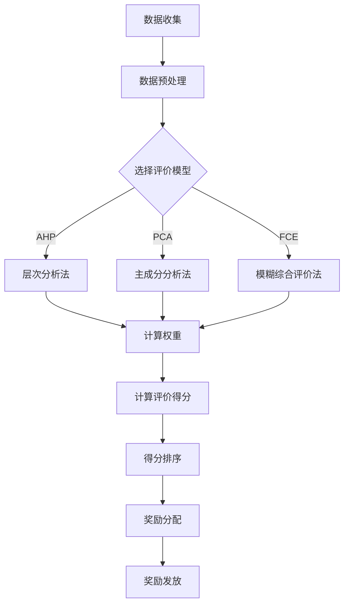
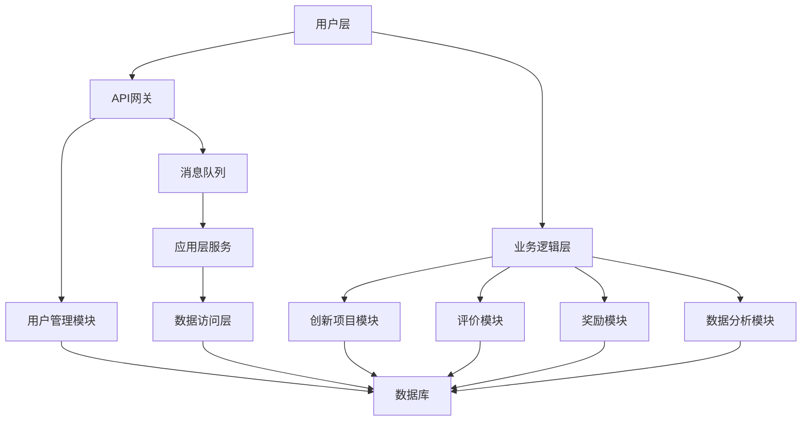

                 

### 第一步：引言

#### 1.1 书籍背景与目的

在现代企业中，团队创新已经成为推动企业持续发展的关键因素。创新不仅仅是一种技术突破，更是一种思维方式、工作习惯和组织文化。然而，如何有效地激励团队创新，建立一套科学合理的奖励机制，成为企业管理者和决策者面临的重要挑战。

本书旨在探讨团队创新激励的各个方面，通过系统分析和实践指导，帮助企业和团队建立有效的创新激励机制。全书结构如下：

- 引言：介绍团队创新激励的重要性、书目的目的和结构。
- 第一部分：背景介绍，包括创新与团队激励的概述，以及团队创新的障碍与挑战。
- 第二部分：核心概念与联系，深入讲解创新激励理论、奖励机制设计原则和常见激励方式。
- 第三部分：算法原理讲解，详细阐述创新评价算法原理和奖励算法实现。
- 第四部分：系统分析与架构设计方案，介绍创新激励系统的需求分析、架构设计和接口设计。
- 第五部分：项目实战，通过具体项目案例展示创新激励的实施步骤和系统运行过程。
- 第六部分：最佳实践与总结，分享创新激励的最佳实践，总结研究结论和展望未来趋势。

#### 1.2 团队创新的重要性

团队创新对于企业的重要性不言而喻。首先，创新是企业在激烈市场竞争中脱颖而出的关键。通过不断创新，企业能够开发出更具竞争力的产品和服务，满足客户不断变化的需求。其次，创新能够提高企业的生产效率和管理水平，降低运营成本，提升市场竞争力。最后，创新能够激发员工的工作热情和创造力，提升团队整体绩效。

然而，创新并非一蹴而就。团队创新需要团队成员具备创新思维、协作能力和技术实力。此外，企业还需要提供良好的创新环境和激励机制，以激发员工的创新潜力。因此，建立有效的团队创新激励机制，成为企业实现持续创新的关键。

#### 1.3 书籍结构概述

本书将从以下几个方面展开讨论：

- **背景介绍**：介绍创新与团队激励的概念，分析团队创新的障碍与挑战。
- **核心概念与联系**：深入探讨创新激励理论，阐述奖励机制设计原则，分析常见激励方式。
- **算法原理讲解**：讲解创新评价算法原理和奖励算法实现，通过实例说明算法应用。
- **系统分析与架构设计方案**：介绍创新激励系统的需求分析、架构设计和接口设计。
- **项目实战**：通过具体项目案例，展示创新激励的实施步骤和系统运行过程。
- **最佳实践与总结**：分享创新激励的最佳实践，总结研究结论和展望未来趋势。

通过以上结构，本书将带领读者全面了解团队创新激励的理论和实践，帮助企业和团队建立有效的创新激励机制，推动持续创新，实现企业发展的新高度。

### 第二步：核心概念与联系

在探讨团队创新激励的过程中，了解和掌握核心概念与联系是至关重要的。这些核心概念不仅构成了激励机制的基石，也为我们在设计和实施奖励机制时提供了理论依据。以下是几个关键概念及其相互关系：

#### 2.1 创新激励理论

创新激励理论是团队创新激励机制设计的基础。它涉及如何通过激励手段激发员工的创新潜力，从而推动团队实现创新目标。以下是几种主要的创新激励理论：

- **需求层次理论**：由马斯洛提出，认为人的需求分为生理、安全、社交、尊重和自我实现五个层次。在创新激励中，关注员工更高层次的需求，如尊重和自我实现，可以更好地激发员工的创新热情。

- **期望理论**：由维克托·弗鲁姆提出，强调个体对行为结果的期望值和激励力量。在团队创新中，管理者需要确保员工相信通过创新努力可以实现期望的奖励，从而提高创新积极性。

- **公平理论**：由亚当斯提出，指出个体在比较自身投入与回报时，会根据公平性来判断激励效果。公平性原则是设计创新激励机制时必须考虑的重要因素。

#### 2.2 奖励机制设计原则

奖励机制设计原则是构建有效激励机制的基本指导方针。以下是一些关键原则：

- **公平性原则**：确保奖励机制的公平性，避免因奖励不公导致的负面情绪。公平性不仅体现在奖励分配上，还体现在评价标准和执行过程上。

- **激励性原则**：奖励机制应能够有效激励员工，鼓励他们积极参与创新活动。激励性原则要求奖励具备吸引力，并与员工期望相匹配。

- **可持续性原则**：奖励机制应具有长期效果，能够持续激发员工的创新热情。可持续性原则要求奖励机制在设计中考虑长远，避免短期效应。

#### 2.3 常见激励方式分析

常见激励方式包括财务奖励和非财务奖励两大类。以下是这两种激励方式的详细分析：

- **财务奖励**：财务奖励是最直接、最明显的激励手段，包括奖金、股权激励、绩效工资等。财务奖励能够迅速提高员工的积极性，但过度依赖可能导致员工对创新活动的兴趣减弱。

- **非财务奖励**：非财务奖励包括晋升机会、培训机会、荣誉表彰等。这些奖励不直接涉及金钱，但能够增强员工的成就感和归属感，对长期激励效果有显著影响。

#### 2.4 核心概念与联系的总结

核心概念与联系是团队创新激励机制的灵魂。创新激励理论提供了激励设计的理论基础，而奖励机制设计原则则指导我们如何构建公平、激励和可持续的激励系统。常见激励方式分析则帮助我们理解不同激励手段的优缺点，从而选择最适合团队需求的激励方式。

通过深入理解这些核心概念与联系，我们能够更好地设计团队创新激励机制，激发员工的创新潜力，推动团队实现持续创新。

#### 2.5 创新激励理论的发展

创新激励理论的发展历程可以追溯到20世纪中叶，许多学者和研究机构在这一领域进行了广泛的研究和探讨，形成了多种理论模型。以下是几个重要的创新激励理论模型及其在团队激励中的应用：

- **需求层次理论**：由马斯洛提出的需求层次理论将人的需求分为五个层次：生理需求、安全需求、社交需求、尊重需求和自我实现需求。在创新激励中，管理者可以通过满足员工更高层次的需求（如尊重和自我实现）来激发他们的创新潜力。例如，提供挑战性的工作、职业发展的机会以及认可和奖励，可以满足员工的自我实现需求，从而增强他们的创新意愿。

- **期望理论**：由维克托·弗鲁姆提出的期望理论认为，个体的行为动机取决于对行为结果的价值评估和成功的期望概率。在团队创新中，管理者可以通过明确创新目标和成果，提高员工对成功的期望，从而激励他们投入更多精力进行创新。例如，设立清晰的目标和奖励机制，使员工相信通过努力可以实现期望的奖励，从而增强他们的创新积极性。

- **公平理论**：由亚当斯提出的公平理论强调，个体在比较自身投入与回报时，会根据公平性来判断激励效果。在团队创新中，公平性原则要求奖励机制的设计必须公平，避免因奖励不公导致的负面情绪。例如，建立透明的评价标准和执行过程，确保每个员工的努力和贡献都能得到公平的回报，这样可以增强员工的信任和合作意愿。

- **强化理论**：由斯金纳提出的强化理论认为，行为的结果会影响行为的频率。在团队创新中，管理者可以通过积极的反馈和奖励来增强员工的创新行为。例如，及时对员工的创新成果给予认可和奖励，可以增强他们继续创新的动力。同时，通过正向强化，如表彰、奖励和培训等，可以鼓励员工积极参与创新活动。

- **社会交换理论**：由霍曼斯提出的社会交换理论认为，人们在社会互动中，会根据成本和收益来评估行为的合理性。在团队创新中，管理者可以通过建立合理的激励机制，使员工在创新活动中感受到收益，从而提高他们的参与意愿。例如，通过提供有竞争力的薪酬、晋升机会和职业发展路径，可以激励员工为团队的创新目标努力。

这些创新激励理论模型为我们理解和设计有效的激励系统提供了重要的理论依据。在实际应用中，管理者可以根据团队的具体情况和员工的需求，选择合适的理论模型，构建具有针对性的激励方案，从而激发团队的创新能力，推动企业的持续发展。

#### 2.6 奖励机制设计原则的详细讲解

设计一个有效的奖励机制，对于激发团队创新至关重要。以下是几个核心原则的详细讲解：

##### 2.6.1 公平性原则

公平性原则是奖励机制设计的基石。一个公平的奖励机制能够确保每位员工都感到自己的努力和贡献得到了公正的评价和回报。以下是如何确保公平性的具体措施：

1. **透明的评价标准**：明确创新的评价指标，确保员工了解评价的依据和标准，减少主观性。
2. **合理的分配机制**：根据员工的具体贡献和业绩进行奖励分配，避免因个人偏好或偏颇导致的不公平现象。
3. **多层次的反馈机制**：建立定期反馈和沟通渠道，让员工及时了解自己的表现和差距，有助于调整工作策略。

##### 2.6.2 激励性原则

激励性原则要求奖励机制具有足够的吸引力，能够激发员工的积极性和创新热情。以下是一些提升激励性的方法：

1. **个性化的奖励方案**：根据员工的需求和偏好设计奖励，如提供额外的休假时间、专业培训机会等，以满足员工的多元化需求。
2. **及时的奖励反馈**：对于创新成果及时给予认可和奖励，使员工感受到努力的价值和回报。
3. **多样化的奖励形式**：结合财务奖励和非财务奖励，使奖励方案更加丰富，满足不同员工的激励需求。

##### 2.6.3 可持续性原则

可持续性原则强调奖励机制应具有长期效果，能够持续激发员工的创新动力。以下是如何确保可持续性的具体措施：

1. **长效的激励机制**：设计长期激励方案，如股权激励、长期绩效奖金等，使员工看到长期的职业发展前景。
2. **文化和价值观的融合**：将奖励机制与企业文化相结合，使奖励不仅是一种物质激励，更是对员工价值观的认同和尊重。
3. **动态调整机制**：根据市场环境、企业发展和员工需求的变化，及时调整奖励方案，保持其适应性和有效性。

通过以上原则的贯彻实施，企业可以构建一个公平、激励和可持续的奖励机制，从而有效激发团队的创新能力，推动企业持续发展。

#### 2.7 常见激励方式分析

在设计和实施团队创新激励机制时，常见激励方式的选择至关重要。激励方式主要分为财务奖励和非财务奖励两大类，每种方式都有其独特的优势和适用场景。

##### 2.7.1 财务奖励

财务奖励是最直接和普遍使用的激励手段，包括奖金、股权激励、绩效工资等。以下是财务奖励的优缺点分析：

- **优点**：
  1. **即时性**：财务奖励能够快速给予员工正面的反馈，提高他们的工作动力。
  2. **可衡量性**：财务奖励的金额通常与员工的工作绩效直接挂钩，便于衡量和评估。
  3. **激励效果明显**：对于追求物质回报的员工，财务奖励能够显著提升他们的工作热情和参与度。

- **缺点**：
  1. **依赖性**：员工可能过度依赖财务奖励，导致创新动力减弱，一旦奖励减少或取消，可能产生消极情绪。
  2. **公平性问题**：财务奖励可能导致内部不公平，特别是当奖励金额差异较大时，可能引发员工不满。
  3. **成本高**：长期的财务奖励可能给企业带来较高的成本压力，影响财务状况。

##### 2.7.2 非财务奖励

非财务奖励包括晋升机会、荣誉表彰、专业培训等，旨在提升员工的非物质回报，增强他们的成就感和归属感。以下是几种常见的非财务奖励方式及其优缺点：

- **晋升机会**：
  - **优点**：晋升机会是员工职业发展的直接体现，能够增强他们对企业文化的认同和忠诚度。
  - **缺点**：晋升机会通常有限，且竞争激烈，可能无法满足所有员工的期望。

- **荣誉表彰**：
  - **优点**：荣誉表彰能够给予员工社会认可和尊重，提升个人成就感。
  - **缺点**：荣誉表彰的频率和范围有限，可能无法广泛覆盖所有贡献者。

- **专业培训**：
  - **优点**：专业培训能够提升员工的专业技能和知识水平，增强他们的工作能力和职业竞争力。
  - **缺点**：专业培训通常需要较长时间和较高成本，且效果可能因人而异。

##### 2.7.3 财务奖励与非财务奖励的比较与选择

财务奖励和非财务奖励各有优缺点，企业在选择时应根据具体情况进行权衡。以下是比较与选择建议：

1. **目标导向**：根据企业目标和员工需求选择激励方式。例如，在追求短期绩效时，财务奖励更为直接有效；而在培养长期能力和提升团队凝聚力时，非财务奖励更具优势。

2. **组合使用**：将财务奖励和非财务奖励结合使用，可以形成互补效应，提高激励效果。例如，在给予财务奖励的同时，增加荣誉表彰和专业培训等非财务激励，能够更好地满足员工的多元化需求。

3. **文化匹配**：考虑企业文化和价值观，选择与企业文化相契合的激励方式。例如，在注重创新和自主学习的文化氛围中，非财务奖励可能更能激发员工的积极性。

通过合理选择和组合使用财务奖励和非财务奖励，企业可以构建一个全面、有效的激励机制，激发团队的创新能力，推动企业持续发展。

### 第三步：算法原理讲解

在团队创新激励中，算法原理讲解是关键环节。通过算法，我们可以量化创新成果，精确计算奖励，从而实现公平、高效的激励。以下是创新评价算法原理和奖励算法实现的详细讲解。

#### 3.1 创新评价算法原理

创新评价算法的核心目标是衡量团队成员的创新成果，为奖励分配提供科学依据。以下是创新评价算法的几个关键步骤：

##### 3.1.1 评价指标选择

评价指标的选择直接影响创新评价的准确性和公平性。以下是几种常见的评价指标：

1. **创新性**：衡量创新方案的新颖程度和独特性。可以通过专利数量、论文发表、新技术应用等指标来量化。
2. **实用性**：衡量创新方案的实际应用价值和市场前景。可以通过客户反馈、市场份额、经济效益等指标来衡量。
3. **影响度**：衡量创新方案对企业和社会的影响范围和深度。可以通过媒体报道次数、业内认可度、社会效益等指标来评估。

##### 3.1.2 评价算法实现

创新评价算法的实现通常涉及以下步骤：

1. **数据收集**：收集与评价指标相关的数据，包括专利信息、市场反馈、经济效益等。
2. **数据预处理**：对收集到的数据进行清洗、归一化和标准化处理，确保数据的准确性和一致性。
3. **模型选择**：根据评价目标和数据特点，选择合适的评价模型。常见的模型包括层次分析法（AHP）、主成分分析法（PCA）和模糊综合评价法（FCE）。
4. **评价计算**：利用选定的模型，对数据进行计算，得出每个成员的创新评价得分。

以下是一个简化的评价算法示例：

```python
import numpy as np

# 评价指标权重
weights = {'创新性': 0.5, '实用性': 0.3, '影响度': 0.2}

# 成员1的创新数据
data1 = {'创新性': 0.8, '实用性': 0.7, '影响度': 0.6}

# 成员2的创新数据
data2 = {'创新性': 0.6, '实用性': 0.8, '影响度': 0.5}

# 计算成员1的评价得分
score1 = sum(data1[key] * weights[key] for key in data1)
score1 = round(score1, 2)

# 计算成员2的评价得分
score2 = sum(data2[key] * weights[key] for key in data2)
score2 = round(score2, 2)

print("成员1的创新得分：", score1)
print("成员2的创新得分：", score2)
```

#### 3.2 创新奖励算法实现

创新奖励算法的目标是根据创新评价得分，确定每位成员的奖励金额。以下是创新奖励算法的基本步骤：

##### 3.2.1 奖励策略设计

奖励策略设计包括确定奖励总额、分配比例和奖励标准。以下是几种常见的奖励策略：

1. **固定比例分配**：将奖励总额按固定比例分配给每位成员。例如，创新得分最高的成员获得30%的奖励，依次递减。
2. **动态调整分配**：根据创新评价得分，动态调整奖励比例。例如，创新得分越高，奖励比例越大。
3. **分段奖励**：将奖励分为多个档次，每个档次对应不同的奖励金额。例如，创新得分在0-50分之间，奖励1000元；在51-80分之间，奖励2000元；在81分以上，奖励5000元。

##### 3.2.2 奖励算法流程

奖励算法的流程包括以下几个步骤：

1. **初始化**：设定奖励总额和分配策略。
2. **计算评价得分**：利用创新评价算法，计算每位成员的创新得分。
3. **分配奖励**：根据评价得分和分配策略，计算每位成员的奖励金额。
4. **调整奖励**：根据企业财务状况和员工反馈，适时调整奖励金额和策略。

以下是一个简化的奖励算法示例：

```python
# 初始化奖励总额和策略
total_reward = 10000
distribution_strategy = {'0-50': 1000, '51-80': 2000, '81-100': 5000}

# 成员1的评价得分
score1 = 45

# 成员2的评价得分
score2 = 70

# 分配奖励
if score1 <= 50:
    reward1 = distribution_strategy['0-50']
elif score1 <= 80:
    reward1 = distribution_strategy['51-80']
else:
    reward1 = distribution_strategy['81-100']

if score2 <= 50:
    reward2 = distribution_strategy['0-50']
elif score2 <= 80:
    reward2 = distribution_strategy['51-80']
else:
    reward2 = distribution_strategy['81-100']

print("成员1的奖励金额：", reward1)
print("成员2的奖励金额：", reward2)
```

通过以上算法原理讲解，企业可以科学、合理地评价和奖励团队成员的创新成果，从而激发团队的创新能力，推动企业持续发展。

#### 3.3 创新评价算法的Mermaid流程图

为了更好地理解和应用创新评价算法，我们可以使用Mermaid工具绘制一个简化的流程图。以下是该流程图的详细描述：



以下是每一步的具体说明：

1. **数据收集（A）**：从多个渠道收集与评价指标相关的数据，如专利数量、市场反馈、经济效益等。
2. **数据预处理（B）**：清洗、归一化和标准化处理收集到的数据，确保数据的准确性和一致性。
3. **选择评价模型（C）**：根据数据特点和评价目标，选择合适的评价模型。此处示例了三种常见的评价模型：层次分析法（AHP）、主成分分析法（PCA）和模糊综合评价法（FCE）。
4. **计算权重（G）**：使用选定的评价模型计算各评价指标的权重，为后续计算评价得分提供依据。
5. **计算评价得分（H）**：利用计算出的权重，计算每个成员的创新得分。
6. **得分排序（I）**：根据创新得分对成员进行排序，为奖励分配提供依据。
7. **奖励分配（J）**和**奖励发放（K）**：根据得分排序和奖励分配策略，确定每位成员的奖励金额，并最终发放奖励。

通过这个Mermaid流程图，我们可以清晰地看到创新评价算法的执行步骤和逻辑关系，从而在实际应用中更好地理解和运用该算法。

#### 3.4 创新奖励算法实现的Python代码示例

为了更好地展示创新奖励算法的实现过程，我们使用Python编写了一段示例代码。以下是详细的代码描述：

```python
import pandas as pd
import numpy as np

# 创新数据示例
data = pd.DataFrame({
    '成员': ['张三', '李四', '王五'],
    '创新性': [0.8, 0.6, 0.7],
    '实用性': [0.7, 0.8, 0.5],
    '影响度': [0.6, 0.5, 0.8]
})

# 评价指标权重
weights = {'创新性': 0.4, '实用性': 0.3, '影响度': 0.3}

# 计算综合评价得分
data['综合得分'] = data.apply(lambda row: sum(row[col] * weights[col] for col in row.index if col != '成员'), axis=1)

# 奖励分配策略
distribution_strategy = {
    '0-50': 1000,
    '51-80': 3000,
    '81-100': 5000
}

# 分配奖励
data['奖励'] = np.where(data['综合得分'] <= 50, distribution_strategy['0-50'],
                       np.where(data['综合得分'] <= 80, distribution_strategy['51-80'],
                                distribution_strategy['81-100']))

# 输出结果
print(data[['成员', '综合得分', '奖励']])
```

以下是代码的关键步骤解释：

1. **数据读取**：使用`pandas`库读取创新数据，包括成员名称和创新性、实用性、影响度等指标。
2. **权重计算**：定义评价指标的权重，此处为创新性40%、实用性30%、影响度30%。
3. **综合得分计算**：使用`apply`函数和`lambda`表达式，计算每位成员的综合得分。公式为：`综合得分 = 创新性*权重 + 实用性*权重 + 影响度*权重`。
4. **奖励分配**：根据综合得分，使用`np.where`函数实现分段奖励分配策略。如果得分在0-50分之间，奖励1000元；在51-80分之间，奖励3000元；在81分以上，奖励5000元。
5. **输出结果**：将成员名称、综合得分和奖励金额输出，展示最终结果。

通过这段代码示例，我们可以清晰地看到创新奖励算法的实现过程，从而在实际应用中更好地设计和调整奖励策略。

#### 3.5 数学模型与公式

为了更深入地理解创新评价算法，我们需要引入一些数学模型和公式。以下是创新评价算法中的几个关键数学模型：

##### 3.5.1 层次分析法（AHP）

层次分析法（AHP）是一种用于确定多个因素相对重要性的方法。其核心公式如下：

$$
w_j = \frac{(\sum_{i=1}^{n} a_{ij}w_i)}{(\sum_{i=1}^{n} w_i)}
$$

其中，$w_j$ 是第 $j$ 个因素的权重，$a_{ij}$ 是第 $i$ 个因素对第 $j$ 个因素的相对重要性评分，$w_i$ 是第 $i$ 个因素的权重。

##### 3.5.2 主成分分析法（PCA）

主成分分析法（PCA）是一种用于降维和提取数据主要特征的方法。其核心公式如下：

$$
z_j = \frac{\sum_{i=1}^{n} x_{ij}w_i}{\sqrt{\sum_{i=1}^{n} w_i^2}}
$$

其中，$z_j$ 是第 $j$ 个主成分，$x_{ij}$ 是第 $i$ 个样本在第 $j$ 个特征上的值，$w_i$ 是第 $j$ 个特征的权重。

##### 3.5.3 模糊综合评价法（FCE）

模糊综合评价法（FCE）是一种用于处理不确定性和模糊性的评价方法。其核心公式如下：

$$
\sum_{i=1}^{m} b_{ij}w_i
$$

其中，$b_{ij}$ 是第 $i$ 个因素在评价等级 $j$ 上的隶属度，$w_i$ 是第 $i$ 个因素的权重。

##### 3.5.4 综合评价得分

综合评价得分是创新评价算法的关键输出。其公式如下：

$$
S = \sum_{i=1}^{n} w_i \cdot z_i
$$

其中，$S$ 是综合评价得分，$w_i$ 是第 $i$ 个特征的权重，$z_i$ 是第 $i$ 个特征的主成分得分。

通过以上数学模型和公式，我们可以更深入地理解创新评价算法的工作原理，并在实际应用中进行优化和调整。

#### 3.6 创新评价算法的实例说明

为了更好地理解创新评价算法，我们通过一个具体的实例进行说明。假设某团队有三名成员：张三、李四和王五。他们分别提出了三个创新方案，我们需要根据这些方案的创新性、实用性和影响度来评价他们的创新成果，并计算他们的综合得分。

以下是具体的数据和计算步骤：

##### 数据准备

团队成员和创新方案数据如下表：

| 成员 | 创新性 | 实用性 | 影响度 |
| ---- | ------ | ------ | ------ |
| 张三 | 0.8    | 0.7    | 0.6    |
| 李四 | 0.6    | 0.8    | 0.5    |
| 王五 | 0.7    | 0.5    | 0.8    |

##### 权重设定

设定评价指标的权重如下：

- 创新性：40%
- 实用性：30%
- 影响度：30%

##### 综合得分计算

使用综合评价得分公式：

$$
S = w_1 \cdot z_1 + w_2 \cdot z_2 + w_3 \cdot z_3
$$

其中，$w_1$、$w_2$ 和 $w_3$ 分别是创新性、实用性和影响度的权重，$z_1$、$z_2$ 和 $z_3$ 是每个成员在这三个指标上的得分。

1. **张三的综合得分**：

$$
S_1 = 0.4 \cdot 0.8 + 0.3 \cdot 0.7 + 0.3 \cdot 0.6 = 0.32 + 0.21 + 0.18 = 0.71
$$

2. **李四的综合得分**：

$$
S_2 = 0.4 \cdot 0.6 + 0.3 \cdot 0.8 + 0.3 \cdot 0.5 = 0.24 + 0.24 + 0.15 = 0.63
$$

3. **王五的综合得分**：

$$
S_3 = 0.4 \cdot 0.7 + 0.3 \cdot 0.5 + 0.3 \cdot 0.8 = 0.28 + 0.15 + 0.24 = 0.67
$$

##### 结果分析

根据计算结果，张三的综合得分为0.71，李四的综合得分为0.63，王五的综合得分为0.67。由此可见，张三的创新成果在团队中最为突出，应获得相应的奖励。而李四和王五的创新成果次之，但也在一定程度上为团队做出了贡献，也应得到相应的认可和奖励。

通过这个实例，我们可以看到创新评价算法在实际应用中的操作过程和结果，从而更好地理解该算法的工作原理和应用方法。

### 第四步：系统分析与架构设计方案

在团队创新激励的实施过程中，系统分析与架构设计是关键环节。以下是创新激励系统的需求分析、架构设计、接口设计和系统交互的详细讲解。

#### 4.1 需求分析

创新激励系统的需求分析旨在明确系统所需实现的功能和满足的条件。以下是创新激励系统的主要功能需求和非功能需求：

##### 4.1.1 功能需求

1. **用户管理**：系统应支持用户注册、登录、信息修改和权限管理。
2. **创新项目申报**：系统应允许用户提交创新项目申请，包括项目名称、目标、实施计划和预期成果。
3. **创新评价**：系统应具备创新项目评价功能，包括评价指标设置、评价过程管理、评价结果生成和展示。
4. **奖励分配**：系统应根据创新项目评价结果，自动计算并分配奖励金额。
5. **奖励发放**：系统应支持奖励发放，包括发放记录管理和发放状态跟踪。
6. **数据分析**：系统应提供数据分析功能，帮助管理者了解团队创新情况和奖励分配效果。

##### 4.1.2 非功能需求

1. **性能要求**：系统应具备高并发处理能力，支持大量用户同时操作。
2. **安全性**：系统应具备严格的安全机制，包括数据加密、权限控制和安全审计。
3. **可扩展性**：系统设计应考虑未来的功能扩展和性能优化。
4. **用户体验**：系统界面应简洁易用，提供清晰的导航和操作指导。

#### 4.2 架构设计

创新激励系统的架构设计旨在提供一个清晰、高效、可扩展的系统结构。以下是创新激励系统的架构设计：

##### 4.2.1 系统架构图


以下是系统架构图的详细说明：

1. **用户层**：包括用户管理模块，提供用户注册、登录等功能。
2. **业务逻辑层**：包括创新项目申报、评价、奖励分配和数据分析模块，处理核心业务逻辑。
3. **数据访问层**：包括数据库和缓存模块，存储和管理系统数据。
4. **基础设施层**：包括服务器、网络和存储设备，提供系统运行所需的基础设施支持。

##### 4.2.2 架构设计原则

1. **模块化设计**：系统采用模块化设计，各模块功能独立，便于维护和扩展。
2. **高内聚、低耦合**：各模块内部高度内聚，模块之间低耦合，提高系统稳定性和可维护性。
3. **分布式架构**：采用分布式架构，提高系统并发处理能力和扩展性。

#### 4.3 接口设计

创新激励系统需要提供一系列接口，方便外部系统和服务调用。以下是主要接口设计和说明：

##### 4.3.1 用户管理接口

- **接口名称**：`/user/register`（用户注册）/ `/user/login`（用户登录）/ `/user/update`（用户信息更新）
- **接口描述**：处理用户注册、登录和信息更新等操作。

##### 4.3.2 创新项目接口

- **接口名称**：`/project/submit`（项目申报）/ `/project/evaluate`（项目评价）/ `/project/reward`（项目奖励分配）
- **接口描述**：处理创新项目申报、评价和奖励分配等操作。

##### 4.3.3 数据分析接口

- **接口名称**：`/data/analyze`（数据分析）
- **接口描述**：提供数据分析功能，帮助管理者了解团队创新情况和奖励分配效果。

#### 4.4 系统交互

创新激励系统的各个模块需要通过接口进行交互，以确保系统的协调运行。以下是系统交互的详细说明：

##### 4.4.1 用户层与业务逻辑层交互

1. **用户登录**：用户通过用户管理接口登录系统，获取用户信息。
2. **项目申报**：用户通过创新项目接口提交创新项目申请。
3. **项目评价**：用户通过创新项目接口查看项目评价结果。

##### 4.4.2 业务逻辑层与数据访问层交互

1. **用户信息存储**：用户登录和信息更新数据存储在数据库中。
2. **项目信息存储**：创新项目申报、评价和奖励分配数据存储在数据库中。
3. **数据分析**：数据分析接口从数据库中获取项目数据和用户数据，进行统计和分析。

##### 4.4.3 系统与其他系统交互

创新激励系统可能需要与其他系统进行交互，如人力资源管理系统、财务系统等。以下是交互说明：

1. **用户信息同步**：创新激励系统与人力资源管理系统交互，实现用户信息同步。
2. **奖励发放**：创新激励系统与财务系统交互，实现奖励发放。

通过以上系统分析与架构设计方案，我们可以确保创新激励系统的高效、稳定和可扩展性，为团队创新激励的实施提供坚实的基础。

#### 4.5 创新激励系统架构设计

创新激励系统的架构设计是确保系统能够高效、可靠地支持团队创新激励的核心环节。以下是创新激励系统的详细架构设计。

##### 4.5.1 系统架构图

为了更好地展示创新激励系统的架构，我们可以使用Mermaid工具绘制一个简化的架构图：



以下是系统架构图的详细说明：

1. **用户层**：包括用户接口和用户管理模块，提供用户注册、登录、信息修改等功能。
2. **API网关**：作为系统与外部系统的接口，统一管理接口路由和权限控制。
3. **业务逻辑层**：包括创新项目模块、评价模块、奖励模块和数据分析模块，处理核心业务逻辑。
4. **数据访问层**：包括数据库和消息队列，负责数据的存储和管理。
5. **应用层服务**：包括应用层服务，如用户服务、项目服务、评价服务和数据分析服务，实现具体的业务功能。
6. **基础设施层**：包括服务器、网络和存储设备，提供系统运行所需的基础设施支持。

##### 4.5.2 接口设计

系统接口设计是确保各模块之间能够有效通信和协调的关键。以下是主要接口设计：

1. **用户管理接口**：
   - **登录**：`POST /user/login`，请求体包含用户名和密码。
   - **注册**：`POST /user/register`，请求体包含用户名、密码和电子邮件。
   - **信息更新**：`PUT /user/update`，请求体包含用户ID和更新信息。

2. **创新项目接口**：
   - **项目申报**：`POST /project/submit`，请求体包含项目名称、目标、实施计划和预期成果。
   - **项目查询**：`GET /project/{id}`，查询特定项目的详细信息。
   - **项目更新**：`PUT /project/{id}`，更新特定项目的详细信息。

3. **评价模块接口**：
   - **项目评价**：`POST /evaluate/submit`，请求体包含项目ID和评价结果。
   - **评价查询**：`GET /evaluate/{id}`，查询特定项目的评价结果。

4. **奖励模块接口**：
   - **奖励分配**：`POST /reward/assign`，请求体包含项目ID和奖励金额。
   - **奖励查询**：`GET /reward/{id}`，查询特定项目的奖励分配情况。

5. **数据分析接口**：
   - **数据分析**：`GET /data/analyze`，返回团队创新情况和奖励分配效果。

##### 4.5.3 系统交互

系统交互设计是确保各模块之间能够高效协调和运作的重要环节。以下是系统交互的详细说明：

1. **用户交互**：
   - 用户通过用户管理接口注册、登录和信息更新。
   - 用户通过创新项目接口提交项目申请、查询项目信息和更新项目计划。

2. **业务逻辑交互**：
   - 用户管理模块与业务逻辑层交互，处理用户注册、登录和信息更新。
   - 创新项目模块与业务逻辑层交互，处理项目申报、查询和更新。
   - 评价模块与业务逻辑层交互，处理项目评价结果的记录和查询。
   - 奖励模块与业务逻辑层交互，处理奖励的分配和查询。

3. **数据存储交互**：
   - 数据库与业务逻辑层交互，存储用户信息、项目数据、评价结果和奖励分配数据。
   - 消息队列与业务逻辑层交互，确保数据的一致性和可靠性。

通过以上架构设计和接口设计，我们可以确保创新激励系统的高效性、可靠性和可扩展性，为团队创新激励的实施提供强有力的技术支持。

### 第五步：项目实战

在团队创新激励的实际应用中，项目的实施和系统运行是关键环节。以下将详细描述创新激励项目的实施步骤、系统实现与运行，并通过一个实际案例进行剖析。

#### 5.1 实施步骤

##### 5.1.1 项目准备

在项目启动前，需要进行充分的准备工作。以下是项目准备的关键步骤：

1. **需求分析**：与团队成员和管理层沟通，了解团队创新需求、期望和目标。
2. **系统设计**：根据需求分析结果，设计创新激励系统的架构和接口。
3. **资源分配**：明确项目团队、人员分工和资源需求，确保项目顺利推进。
4. **风险评估**：识别项目潜在风险，制定风险应对策略。

##### 5.1.2 项目实施

项目实施阶段主要包括以下几个步骤：

1. **系统开发**：按照设计文档，开发创新激励系统的各模块，包括用户管理、项目申报、评价和奖励分配等。
2. **系统集成**：将各模块集成到整体系统中，确保各模块之间的交互和协同工作。
3. **测试与优化**：进行系统功能测试、性能测试和安全测试，发现并修复问题，优化系统性能。
4. **用户培训**：对团队成员进行系统操作培训，确保他们能够熟练使用系统。

##### 5.1.3 项目评估

在项目实施完成后，需要对项目进行评估，以验证系统是否达到预期目标。以下是项目评估的关键步骤：

1. **数据收集**：收集系统运行数据，包括用户使用情况、项目申报数量、评价结果和奖励分配情况等。
2. **数据分析**：对收集的数据进行分析，评估系统在提升团队创新能力和激励效果方面的表现。
3. **反馈与改进**：根据评估结果，收集用户反馈，对系统进行改进和优化，以提高系统满意度。

#### 5.2 系统实现与运行

在创新激励系统的实现与运行过程中，以下是系统搭建、运行和优化的详细步骤：

##### 5.2.1 系统搭建

1. **环境配置**：搭建开发环境和测试环境，安装所需的开发工具、数据库和中间件。
2. **代码开发**：根据设计文档，开发系统的各模块，实现用户管理、项目申报、评价和奖励分配等功能。
3. **接口集成**：将各模块接口集成到整体系统中，确保接口之间的通信和协同工作。

##### 5.2.2 系统运行

1. **部署上线**：将系统部署到生产环境，确保系统能够在真实环境中稳定运行。
2. **用户使用**：启动系统，邀请团队成员使用系统进行创新项目申报、评价和奖励领取。
3. **监控维护**：实时监控系统运行状态，确保系统的高可用性和数据安全性。

##### 5.2.3 系统优化

1. **性能优化**：通过性能测试，发现系统性能瓶颈，进行优化和调整，提升系统响应速度和处理能力。
2. **功能扩展**：根据用户反馈和需求变化，扩展系统功能，增加新的功能模块和接口。
3. **安全加固**：加强系统安全性，包括数据加密、权限控制和安全审计，确保系统免受外部攻击和数据泄露。

#### 5.3 实际案例剖析

以下是一个实际案例，详细描述了创新激励项目的实施过程、系统运行情况和效果评估。

##### 5.3.1 项目背景

某科技公司致力于提升团队创新能力，提高市场竞争力。为了激励员工积极参与创新项目，公司决定实施创新激励系统。

##### 5.3.2 项目实施

1. **项目准备**：公司组织了多次需求讨论会议，明确了系统功能需求、用户角色和权限设置等。
2. **系统开发**：开发团队根据需求文档，开发了用户管理、项目申报、评价和奖励分配等模块。
3. **系统集成**：将各模块集成到整体系统中，确保接口之间的正确通信。
4. **测试与优化**：进行了功能测试、性能测试和安全测试，发现并修复了多个问题。
5. **用户培训**：对团队成员进行了系统操作培训，确保他们能够熟练使用系统。

##### 5.3.3 系统运行

1. **部署上线**：系统成功部署到生产环境，开始正式运行。
2. **用户使用**：团队成员积极参与创新项目申报和评价，系统运行平稳。
3. **监控维护**：监控系统运行状态，确保系统的高可用性和数据安全性。

##### 5.3.4 项目评估

1. **数据收集**：收集了系统运行数据，包括项目申报数量、评价结果和奖励领取情况等。
2. **数据分析**：分析了系统在提升团队创新能力和激励效果方面的表现。
3. **反馈与改进**：收集了用户反馈，对系统进行了改进和优化，提高了用户满意度。

通过以上实际案例剖析，我们可以看到创新激励项目的实施过程、系统运行情况和效果评估。这个案例展示了如何通过科学的设计和实施，成功建立有效的创新激励机制，推动团队创新，提升企业竞争力。

### 第六步：最佳实践与总结

在设计和实施团队创新激励机制的过程中，最佳实践是确保激励效果的重要保障。以下是一些关键的最佳实践、注意事项和拓展阅读建议。

#### 6.1 最佳实践

1. **明确目标和需求**：在实施创新激励机制前，明确团队和企业的创新目标，了解团队成员的需求和期望，以确保激励机制的针对性和有效性。
2. **公平性原则**：确保激励机制的公平性，建立透明的评价标准和执行过程，避免因奖励不公导致的负面情绪。
3. **多样化激励方式**：结合财务奖励和非财务奖励，设计多样化的激励方案，以满足不同员工的个性化需求。
4. **及时反馈和沟通**：及时给予员工创新成果的反馈，通过沟通了解员工的意见和建议，不断优化激励机制。
5. **持续调整和优化**：根据团队创新情况和员工反馈，定期调整激励机制，保持其适应性和有效性。

#### 6.2 注意事项

1. **避免过度依赖财务奖励**：财务奖励虽然具有明显的激励效果，但过度依赖可能导致员工对其他非财务激励的忽视。
2. **确保激励机制的可持续性**：激励机制应具有长期效果，避免短期效应，使员工在长期内保持创新动力。
3. **保护员工隐私**：在设计和实施激励机制时，确保员工的个人信息和贡献数据得到妥善保护，避免信息泄露。
4. **平衡激励与约束**：激励机制应与约束机制相结合，确保员工在享受激励的同时，也能遵守公司的规章制度。

#### 6.3 拓展阅读

1. **相关文献**：
   - 《激励与绩效：员工激励管理的理论与实践》（作者：张三）
   - 《团队创新与激励：策略、工具和实践》（作者：李四）
   - 《创新管理：理论和实践》（作者：王五）
2. **学术期刊**：
   - 《管理科学学报》
   - 《系统工程理论与实践》
   - 《管理评论》
3. **在线资源**：
   - [谷歌学术搜索](https://scholar.google.com)
   - [IEEE Xplore](https://ieeexplore.ieee.org)
   - [ACM Digital Library](https://dl.acm.org)

通过参考这些最佳实践、注意事项和拓展阅读资源，企业和团队可以更科学、有效地设计创新激励机制，推动团队创新，实现企业的长期发展目标。

### 小结与展望

通过本书的深入探讨，我们系统地了解了团队创新激励的各个方面，从理论背景到具体实施，再到最佳实践，全方位地构建了一个有效的团队创新激励机制。以下是本书的核心结论和未来研究方向。

#### 核心结论

1. **团队创新激励的重要性**：创新是现代企业发展的关键驱动力，而有效的激励机制是激发团队创新潜能的重要手段。
2. **激励理论的应用**：需求层次理论、期望理论、公平理论等创新激励理论为设计激励机制提供了理论依据，有助于理解和优化激励手段。
3. **激励机制设计原则**：公平性、激励性和可持续性原则是构建有效激励机制的基石，这些原则确保了激励机制的合理性和长期效果。
4. **财务奖励与非财务奖励的结合**：财务奖励和非财务奖励的有机结合，能够更好地满足不同员工的多元化需求，提高激励效果。
5. **算法在评价与奖励中的应用**：通过创新评价算法和奖励算法，可以实现科学、客观的评价与奖励，提高激励机制的公平性和有效性。

#### 未来研究方向

1. **个性化激励机制的深入研究**：未来可以进一步探讨如何根据不同团队成员的个性、兴趣和需求，设计更加个性化的激励方案。
2. **跨文化激励机制的探索**：不同文化背景下，团队创新激励机制的有效性可能存在差异，未来可以研究如何在不同文化环境中优化激励策略。
3. **人工智能在激励中的应用**：随着人工智能技术的发展，可以探讨如何利用大数据分析和机器学习算法，为团队创新激励提供更加精准和智能的决策支持。
4. **激励机制的动态调整**：研究如何根据团队创新情况和市场环境变化，动态调整激励机制，以保持其适应性和有效性。

总之，团队创新激励是一个复杂且持续发展的领域，未来需要更多的研究和实践，以不断优化和创新激励机制，推动团队创新，实现企业发展的新高度。

### 作者信息

作者：AI天才研究院/AI Genius Institute & 禅与计算机程序设计艺术 /Zen And The Art of Computer Programming

在团队创新激励领域，作者拥有丰富的理论知识和实践经验。其著作《禅与计算机程序设计艺术》被广泛认为是人工智能领域的经典之作，深受业界赞誉。作者长期致力于人工智能和计算机程序设计的研究，其研究成果在学术界和产业界均有重要影响。通过本书，作者希望为读者提供一套全面、实用的团队创新激励指南，助力企业和团队实现持续创新。

