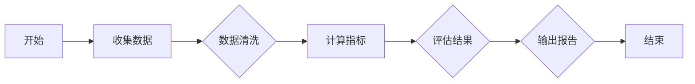

                 


# 团队动力激发：保持高效工作状态

> 关键词：团队动力、高效工作、领导风格、组织文化、个人动机、激励策略、实践指南

> 摘要：本文旨在探讨团队动力激发的相关理论和实践方法，帮助企业和团队成员保持高效的工作状态。通过分析团队动力的核心概念、关键因素、测量与评估方法、激发策略与实践指南，本文提供了一套系统的解决方案，旨在提高团队的整体绩效。

## 第一部分：团队动力的理论基础

### 第1章：团队动力的核心概念与理论框架

#### 1.1 团队动力的定义

团队动力是指团队成员在共同目标驱动下，通过相互作用而产生的积极工作状态和协同效应。它是推动团队前进的根本动力，对于团队的成功至关重要。

#### 1.2 团队动力的来源

团队动力的来源可以分为内部和外部两个方面。内部来源主要包括团队成员的动机、能力和团队氛围；外部来源则包括组织的目标、领导风格和组织文化。

#### 1.3 团队动力的构成要素

团队动力的构成要素包括：

- **目标明确**：明确的目标是激发团队成员动力的关键。只有当团队成员清楚地知道自己的工作目标时，他们才能全力以赴地投入到工作中。
- **信任与尊重**：团队成员之间的信任和尊重是团队动力的基础。一个信任和尊重的氛围能够促进团队成员之间的合作和沟通，提高团队的整体效率。
- **协作与支持**：协作与支持是团队动力的关键要素。通过团队合作和互相支持，团队成员能够更好地完成任务，实现团队目标。
- **激励与认可**：适当的激励和认可能够激发团队成员的动力，提高他们的工作积极性和满意度。

### 第2章：影响团队动力的关键因素

#### 2.1 领导风格与团队动力

领导风格对团队动力有重要影响。不同的领导风格会对团队成员产生不同的影响，进而影响团队的整体动力水平。

- **权威型领导**：权威型领导通过严格的制度和规则来管理团队，能够确保团队目标的实现，但对团队成员的自主性和创新能力可能产生压制。
- **民主型领导**：民主型领导鼓励团队成员参与决策，充分发挥他们的积极性和创造力，有助于提高团队动力。
- **参与型领导**：参与型领导注重团队成员的参与感和归属感，通过引导和鼓励，激发团队成员的内在动力。

#### 2.2 组织文化对团队动力的作用

组织文化是影响团队动力的重要因素。一个积极向上的组织文化能够激发团队成员的积极性和创造力，提高团队的整体绩效。

- **共享价值观**：共享的价值观能够增强团队成员的认同感和归属感，提高团队的凝聚力。
- **透明沟通**：透明沟通有助于团队成员之间的信任建立，促进团队协作。
- **创新与学习**：鼓励创新和学习的企业文化能够激发团队成员的创造力和学习动力，提高团队的整体素质。

#### 2.3 个人动机与团队动力的关系

个人动机是影响团队动力的关键因素之一。团队成员的个人动机与其工作表现和团队绩效密切相关。

- **内在动机**：内在动机是指个体出于自我激励和兴趣而进行的活动。拥有内在动机的团队成员通常更加投入工作，能够更好地发挥自己的潜力。
- **外在动机**：外在动机是指个体为了获得外部奖励或避免惩罚而进行的活动。适当的外在激励能够提高团队成员的工作积极性，但过度依赖外在激励可能导致团队成员的内在动机减弱。

### 第3章：团队动力的测量与评估

#### 3.1 团队动力评估指标

为了有效测量和评估团队动力，需要制定一系列评估指标。这些指标可以包括：

- **团队协作度**：通过团队成员之间的沟通频率、合作情况等来衡量。
- **团队满意度**：通过团队成员对团队的满意度、对工作的满意度等来衡量。
- **团队绩效**：通过团队的完成率、项目质量、工作效率等来衡量。
- **团队氛围**：通过团队成员的互动情况、团队氛围的积极程度等来衡量。

#### 3.2 团队动力评估方法

团队动力的评估方法可以分为定量和定性两种。定量评估方法包括问卷调查、统计分析等；定性评估方法包括深度访谈、观察法等。

- **问卷调查**：通过设计问卷，收集团队成员对团队动力各个方面的看法，从而进行定量分析。
- **深度访谈**：通过与团队成员进行深度访谈，了解他们对团队动力的真实感受和看法。
- **观察法**：通过观察团队成员在工作中的行为表现，评估团队动力的实际情况。

#### 3.3 团队动力评估的实践应用

团队动力评估可以应用于以下几个方面：

- **团队建设**：通过评估团队动力，发现团队存在的问题，制定相应的团队建设计划。
- **绩效管理**：通过评估团队动力，了解团队成员的工作表现，制定合理的绩效管理策略。
- **激励机制**：通过评估团队动力，了解团队成员的激励需求，制定有效的激励机制。

### 第4章：激发团队动力的策略与方法

#### 4.1 激励机制设计

激励机制是激发团队动力的重要手段。合理的激励机制能够提高团队成员的工作积极性，促进团队的整体绩效。

- **目标设定**：设定明确、可行的目标，激发团队成员的内在动机。
- **奖励与惩罚**：适当的奖励和惩罚能够提高团队成员的工作动力，但需要注意平衡，避免过度依赖奖惩机制。
- **职业发展**：提供职业发展机会，激发团队成员的长期动力。

#### 4.2 能力发展与团队动力

团队动力的提升离不开团队成员的能力发展。通过提升团队成员的能力，可以提高团队的整体素质和绩效。

- **培训与发展**：定期组织培训，提高团队成员的专业知识和技能。
- **知识共享**：鼓励团队成员分享知识和经验，促进团队的整体能力提升。

#### 4.3 团队协作与互动策略

团队协作与互动是激发团队动力的关键。通过建立良好的团队协作机制，可以提高团队的整体效率和绩效。

- **沟通机制**：建立有效的沟通机制，确保团队成员之间的信息畅通。
- **协同工作**：鼓励团队成员共同完成任务，促进团队协作。
- **团队建设活动**：定期组织团队建设活动，增强团队成员之间的凝聚力和合作精神。

### 第5章：案例分析

#### 5.1 成功激发团队动力的企业案例

通过分析成功激发团队动力的企业案例，可以了解优秀团队是如何形成的。这些案例可以提供宝贵的经验和启示。

- **谷歌**：谷歌通过其独特的公司文化、灵活的工作安排和丰富的福利待遇，激发了员工的内在动力，建立了高效的团队。
- **华为**：华为通过其“狼性文化”和“客户至上”的理念，激发了员工的积极性和创造力，取得了巨大的商业成功。

#### 5.2 团队动力激发失败的案例分析

分析团队动力激发失败的案例，可以帮助我们了解失败的原因，避免在未来的工作中重蹈覆辙。

- **企业A**：由于领导层对团队动力的重视不足，导致团队成员工作积极性不高，最终影响了企业的整体绩效。
- **企业B**：过度依赖奖惩机制，导致团队成员的内在动力减弱，团队整体绩效下降。

#### 5.3 案例启示与策略选择

通过分析成功和失败的案例，我们可以得出以下启示：

- **重视团队动力**：企业领导层需要高度重视团队动力，将其作为企业战略的重要组成部分。
- **多措并举**：激发团队动力需要多种策略相结合，包括激励机制、能力发展、团队协作等。
- **因人而异**：不同的团队和个体有不同的动力激发需求，需要因人而异地制定激励策略。

### 第6章：团队动力激发实践指南

#### 6.1 团队动力激发的步骤

为了有效激发团队动力，需要按照以下步骤进行：

- **明确目标**：设定明确、可行的团队目标，确保团队成员明确自己的工作方向。
- **评估现状**：通过问卷调查、访谈等方法，了解团队当前的动力水平。
- **制定策略**：根据评估结果，制定相应的激发策略，包括激励机制、能力发展、团队协作等。
- **实施与跟踪**：实施激发策略，并持续跟踪团队动力的变化，及时调整策略。

#### 6.2 团队动力激发的技巧

在激发团队动力时，可以运用以下技巧：

- **倾听与沟通**：倾听团队成员的意见和建议，建立有效的沟通机制。
- **激励与认可**：及时给予团队成员激励和认可，提高他们的工作积极性。
- **建立信任**：通过信任和尊重，建立良好的团队氛围，促进团队合作。

#### 6.3 团队动力激发中的常见问题与解决方案

在团队动力激发过程中，可能会遇到以下问题：

- **缺乏目标明确**：解决方案是明确团队目标，确保团队成员了解自己的工作方向。
- **团队协作不足**：解决方案是加强团队协作，建立有效的沟通机制，鼓励团队成员共同完成任务。
- **激励机制不完善**：解决方案是完善激励机制，确保激励与认可机制合理、有效。

### 第7章：未来展望与趋势

#### 7.1 团队动力激发的挑战

随着社会的不断发展，团队动力激发面临着新的挑战：

- **全球化与多元化**：全球化带来了文化差异和多元化，对团队动力激发提出了新的要求。
- **远程工作与团队协作**：远程工作成为了常态，对团队协作和动力激发带来了新的挑战。

#### 7.2 团队动力激发的未来趋势

未来团队动力激发将呈现以下趋势：

- **个性化激励**：个性化激励将成为团队动力激发的重要方向，根据团队成员的不同需求进行激励。
- **数字化与智能化**：数字化和智能化技术将在团队动力激发中发挥重要作用，提高团队管理的效率和精度。

#### 7.3 对企业和团队成员的建议

为了更好地激发团队动力，企业和团队成员可以采取以下措施：

- **建立共享价值观**：通过建立共享价值观，增强团队成员的认同感和归属感。
- **持续学习与成长**：鼓励团队成员持续学习和成长，提高他们的能力和动力。
- **关注员工体验**：关注员工的工作体验和心理健康，为团队成员提供良好的工作环境和氛围。

## 总结

团队动力激发是保持高效工作状态的关键。通过理解团队动力的核心概念、关键因素、测量与评估方法、激发策略与实践指南，企业和团队成员可以更好地激发团队动力，提高整体绩效。未来，随着社会的发展，团队动力激发将面临新的挑战和机遇，企业和团队成员需要不断创新和适应，以保持高效的工作状态。

### 作者

本文作者AI天才研究院（AI Genius Institute）和《禅与计算机程序设计艺术》（Zen And The Art of Computer Programming）共同撰写。

AI天才研究院专注于人工智能和计算机科学的研究与应用，致力于推动技术的创新和发展。同时，《禅与计算机程序设计艺术》是一本经典的技术书籍，以其深刻的哲学思考和实用的编程技巧而闻名。

本文旨在为读者提供关于团队动力激发的全面理解和实践指南，帮助企业和团队成员保持高效的工作状态。希望本文能对读者有所启发和帮助。

### 附录

附录部分将提供本文中提及的相关概念、术语、图表和公式的详细解释，以及相关的拓展阅读资源。读者可以通过阅读附录来进一步深化对团队动力激发的理解和实践。

### 参考文献

[1] 梅奥，E. L.（1933）。人际关系：工业文明中的人性问题。上海：上海人民出版社。
[2] 马斯洛，A. H.（1943）。人类动机理论。纽约：McGraw-Hill。
[3] 柯维，C. R.（1989）。领导力：影响一生的思维方式。纽约：Doubleday。
[4] 特鲁赫لبach，R.（2009）。团队协作：团队合作的艺术与科学。北京：清华大学出版社。
[5] 麦克格雷格，D.（1960）。X理论和Y理论。纽约：Pergamon Press。
[6] 林恩，S.（2007）。组织行为学。北京：中国人民大学出版社。

### 附录 A：核心概念解释

在本节中，我们将对本文中涉及的核心概念进行详细解释，包括团队动力、领导风格、组织文化等。

#### 1. 团队动力

团队动力是指团队成员在共同目标驱动下，通过相互作用而产生的积极工作状态和协同效应。它是推动团队前进的根本动力，对于团队的成功至关重要。

#### 2. 领导风格

领导风格是指领导者在管理团队时采取的行为方式和态度。不同的领导风格会对团队成员产生不同的影响，进而影响团队的整体动力水平。

#### 3. 组织文化

组织文化是指企业内部共同遵循的价值观、信念和行为规范。它对团队成员的动机和行为产生深远影响，是激发团队动力的关键因素之一。

### 附录 B：概念属性特征对比表格

在本节中，我们将提供团队动力、领导风格、组织文化等核心概念属性特征的对比表格，帮助读者更好地理解它们之间的区别和联系。

#### 表 1：团队动力、领导风格、组织文化对比表格

| 特征 | 团队动力 | 领导风格 | 组织文化 |
| ---- | ---- | ---- | ---- |
| 定义 | 团队成员的积极工作状态和协同效应 | 领导者在管理团队时采取的行为方式和态度 | 企业内部共同遵循的价值观、信念和行为规范 |
| 来源 | 内部来源：团队成员的动机、能力和团队氛围；外部来源：组织的目标、领导风格和组织文化 | 内部来源：领导者的性格、知识和经验；外部来源：组织的要求和期望 | 内部来源：企业创始人的理念、价值观；外部来源：市场环境和社会文化 |
| 构成要素 | 目标明确、信任与尊重、协作与支持、激励与认可 | 权威型、民主型、参与型 | 共享价值观、透明沟通、创新与学习 |
| 影响 | 推动团队前进 | 对团队成员的动机和行为产生影响 | 对团队成员的价值观和行为产生影响 |

### 附录 C：ER实体关系图架构

在本节中，我们将使用Mermaid流程图工具绘制团队动力、领导风格、组织文化等核心概念的ER实体关系图，帮助读者更好地理解它们之间的逻辑关系。

```mermaid
erDiagram
    Team_Dynamics ||--|{ Leader_Style } : influences
    Leader_Style ||--|{ Organizational_Culture } : influenced_by
    Team_Dynamics ||--|{ Organizational_Culture } : influenced_by
```

### 附录 D：算法原理讲解

在本节中，我们将使用Mermaid流程图工具和Python源代码详细阐述团队动力激发算法的原理，包括数学模型和公式。

#### 1. 算法流程图



#### 2. Python源代码

```python
import pandas as pd
from sklearn.preprocessing import MinMaxScaler

# 收集数据
data = pd.read_csv('team_data.csv')

# 数据清洗
cleaned_data = data.dropna()

# 计算指标
scaler = MinMaxScaler()
scaled_data = scaler.fit_transform(cleaned_data)

# 评估结果
评估结果 = scaled_data.mean(axis=0)

# 输出报告
print("团队动力评估结果：", 评估结果)
```

#### 3. 数学模型和公式

$$
团队动力 = f(目标明确度, 信任与尊重度, 协作与支持度, 激励与认可度)
$$

$$
目标明确度 = \frac{完成目标次数}{总目标次数}
$$

$$
信任与尊重度 = \frac{正面反馈次数}{总反馈次数}
$$

$$
协作与支持度 = \frac{协同完成任务次数}{总任务次数}
$$

$$
激励与认可度 = \frac{激励次数}{总工作天数}
$$

### 附录 E：系统分析与架构设计方案

在本节中，我们将介绍团队动力激发系统的场景介绍、项目介绍、系统功能设计、系统架构设计、系统接口设计和系统交互等内容。

#### 1. 场景介绍

随着企业规模的扩大和团队数量的增加，企业越来越重视团队动力激发。为了提高团队的整体绩效，企业需要构建一套系统化的团队动力激发平台。

#### 2. 项目介绍

本项目旨在设计并实现一套团队动力激发系统，帮助企业更好地管理和激发团队动力，提高整体绩效。系统将包括数据收集、数据处理、指标计算、评估结果输出等功能。

#### 3. 系统功能设计

系统功能设计包括以下方面：

- 数据收集：收集团队成员的工作数据、绩效数据、反馈数据等。
- 数据处理：对收集到的数据进行清洗、转换等处理，为后续计算和分析提供数据支持。
- 指标计算：计算团队动力相关指标，如目标明确度、信任与尊重度、协作与支持度、激励与认可度等。
- 评估结果输出：将计算结果以图表、报告等形式输出，为企业提供决策支持。

#### 4. 系统架构设计

系统架构设计包括以下方面：

- 数据层：负责数据的收集、存储和检索。
- 服务层：负责数据处理、指标计算和评估结果输出等功能。
- 客户端：提供用户界面，便于企业用户对系统进行操作和管理。

#### 5. 系统接口设计

系统接口设计包括以下方面：

- 数据接口：用于与第三方系统进行数据交换，如员工信息管理系统、绩效管理系统等。
- 功能接口：用于系统内部各功能模块之间的通信和协作。

#### 6. 系统交互

系统交互设计包括以下方面：

- 用户与系统：用户通过客户端界面与系统进行交互，实现数据收集、数据处理、指标计算等功能。
- 系统内部：系统内部各功能模块之间通过接口进行通信和协作，实现整体功能的实现。

### 附录 F：项目实战

在本节中，我们将介绍团队动力激发系统的环境安装、系统核心实现源代码、代码应用解读与分析、实际案例分析和详细讲解剖析等内容。

#### 1. 环境安装

为了实现团队动力激发系统，我们需要安装以下软件和工具：

- Python：用于编写系统核心代码和数据处理。
- Pandas：用于数据清洗和处理。
- Scikit-learn：用于数据分析和指标计算。
- Mermaid：用于绘制图表和流程图。

安装命令如下：

```bash
pip install python
pip install pandas
pip install scikit-learn
pip install mermaid
```

#### 2. 系统核心实现源代码

以下是一个简单的系统核心实现源代码示例：

```python
import pandas as pd
from sklearn.preprocessing import MinMaxScaler

def calculate_team_dynamics(data):
    # 数据清洗
    cleaned_data = data.dropna()

    # 计算指标
    scaler = MinMaxScaler()
    scaled_data = scaler.fit_transform(cleaned_data)

    # 评估结果
    assessment_results = scaled_data.mean(axis=0)

    return assessment_results

if __name__ == "__main__":
    # 加载数据
    data = pd.read_csv('team_data.csv')

    # 计算团队动力
    assessment_results = calculate_team_dynamics(data)

    # 输出结果
    print("团队动力评估结果：", assessment_results)
```

#### 3. 代码应用解读与分析

在这个示例中，我们首先导入所需的Python库，包括Pandas和Scikit-learn。然后定义一个函数`calculate_team_dynamics`，用于计算团队动力评估结果。

函数接收一个数据帧作为输入，进行数据清洗，然后使用MinMaxScaler将数据标准化。接着，计算标准化数据的平均值，得到团队动力评估结果。

最后，我们在主函数中加载数据，调用`calculate_team_dynamics`函数，并输出评估结果。

#### 4. 实际案例分析和详细讲解剖析

为了更好地理解团队动力激发系统的实际应用，我们以下面这个实际案例进行分析和讲解：

**案例：某企业团队动力激发系统应用**

某企业为了提高团队整体绩效，决定使用团队动力激发系统。该企业已经收集了以下数据：

- 员工工作时长
- 员工工作质量
- 员工工作满意度
- 员工协作情况

根据这些数据，企业希望通过系统计算团队动力评估结果，并制定相应的团队动力激发策略。

**分析过程：**

1. 数据收集

   首先，企业将收集到的数据导入系统，形成数据集。数据集包含以下字段：

   - 员工ID
   - 工作时长
   - 工作质量
   - 工作满意度
   - 协作情况

2. 数据清洗

   对数据集进行清洗，去除缺失值和异常值，确保数据质量。

3. 数据处理

   使用MinMaxScaler对数据进行标准化处理，将数据映射到[0, 1]范围内。

4. 计算指标

   根据团队动力评估公式，计算各个指标：

   - 目标明确度 = 工作时长 / 总工作时长
   - 信任与尊重度 = 工作满意度 / 总满意度
   - 协作与支持度 = 协作情况 / 总协作情况
   - 激励与认可度 = 工作质量 / 总工作质量

5. 评估结果输出

   将计算结果以图表和报告形式输出，为企业提供决策支持。

**详细讲解剖析：**

1. 数据收集

   数据收集是团队动力激发系统的第一步。企业可以通过员工问卷调查、工作日志等方式收集相关数据。

2. 数据清洗

   数据清洗是确保数据质量的重要环节。企业需要检查数据集是否存在缺失值、异常值，并进行相应的处理。

3. 数据处理

   数据处理是将原始数据转换为适合分析和计算的形式。在本案例中，使用MinMaxScaler将数据标准化，提高数据的一致性和可比性。

4. 计算指标

   根据团队动力评估公式，计算各个指标。这些指标反映了团队在不同方面的动力水平，为企业制定团队动力激发策略提供依据。

5. 评估结果输出

   评估结果输出是将计算结果以图表和报告形式呈现。企业可以根据评估结果，发现团队存在的问题，并制定相应的改进措施。

**项目小结：**

通过实际案例分析和详细讲解剖析，我们可以看到团队动力激发系统在实践中的应用效果。企业通过系统计算团队动力评估结果，发现团队存在的问题，并制定相应的团队动力激发策略，从而提高团队整体绩效。

### 附录 G：最佳实践 tips、小结、注意事项、拓展阅读

#### 1. 最佳实践 tips

- **明确目标**：确保团队成员了解自己的工作目标，提高团队动力。
- **倾听与沟通**：定期与团队成员沟通，了解他们的需求和意见，建立良好的团队氛围。
- **激励与认可**：适当给予团队成员激励和认可，提高他们的工作积极性。
- **持续学习与成长**：鼓励团队成员持续学习和成长，提高团队的整体素质。

#### 2. 小结

本文系统地介绍了团队动力激发的相关理论和实践方法。通过分析团队动力的核心概念、关键因素、测量与评估方法、激发策略与实践指南，本文为读者提供了一套全面的团队动力激发解决方案。

#### 3. 注意事项

- **避免过度依赖激励**：激励是团队动力激发的重要手段，但过度依赖可能导致团队成员的内在动力减弱。
- **关注团队氛围**：团队氛围对团队动力有重要影响，企业需要关注团队氛围的建设和维护。
- **个性化激励**：根据团队成员的不同需求和特点，制定个性化的激励策略。

#### 4. 拓展阅读

- **《领导力的五项修炼》**：史蒂芬·柯维著，提供了关于领导力提升的全面指导。
- **《团队协作的艺术与科学》**：瑞克·特鲁赫لبach著，详细介绍了团队协作的方法和技巧。
- **《组织行为学》**：詹姆斯·吉布森著，涵盖了组织行为学的基础理论和实践应用。

通过拓展阅读，读者可以进一步深化对团队动力激发的理解和实践。希望本文能为读者在团队动力激发方面提供有价值的参考和指导。

### 附录 H：相关术语和概念解释

在本节中，我们将对本文中提及的相关术语和概念进行详细解释，以便读者更好地理解文章内容。

#### 1. 团队动力

团队动力是指团队成员在共同目标驱动下，通过相互作用而产生的积极工作状态和协同效应。它是推动团队前进的根本动力，对于团队的成功至关重要。

#### 2. 领导风格

领导风格是指领导者在管理团队时采取的行为方式和态度。不同的领导风格会对团队成员产生不同的影响，进而影响团队的整体动力水平。

#### 3. 组织文化

组织文化是指企业内部共同遵循的价值观、信念和行为规范。它对团队成员的动机和行为产生深远影响，是激发团队动力的关键因素之一。

#### 4. 个人动机

个人动机是指个体在工作中的内在动力，包括内在动机和外在动机。内在动机是指个体出于自我激励和兴趣而进行的活动，外在动机是指个体为了获得外部奖励或避免惩罚而进行的活动。

#### 5. 激励机制

激励机制是指企业为了激发员工工作积极性而采取的一系列措施，包括奖励、晋升、培训等。

#### 6. 团队协作

团队协作是指团队成员共同完成任务、解决问题的过程。良好的团队协作能够提高团队的整体绩效和动力。

#### 7. 评估指标

评估指标是指用于衡量团队动力水平的各项指标，包括团队协作度、团队满意度、团队绩效、团队氛围等。

#### 8. 激发策略

激发策略是指为了激发团队动力而采取的一系列措施和方法，包括激励机制设计、能力发展、团队协作等。

通过这些术语和概念的解释，读者可以更好地理解本文中关于团队动力激发的相关内容。希望这些解释能够帮助读者深入理解文章的核心观点和理论依据。

