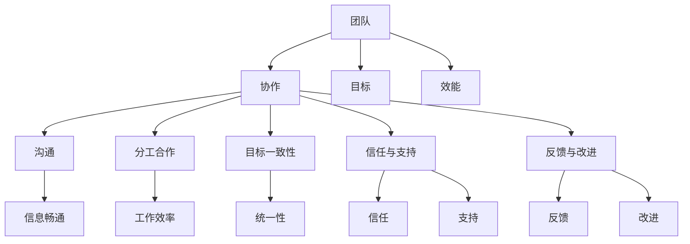

                 

# 团队协作的艺术：提升整体工作效能

> 关键词：团队协作、沟通、角色与职责、冲突管理、领导力、个人发展、案例分析、项目管理、风险管理、质量保障、跨文化沟通、最佳实践、未来趋势

> 摘要：本文深入探讨了团队协作在IT领域的艺术与实践。从团队协作的重要性、概念与原理、沟通、角色与职责、冲突管理、领导力、个人发展、案例分析、项目管理、风险管理、质量保障、跨文化沟通等方面，通过逻辑清晰的分析和实例讲解，为读者提供了提升整体工作效能的实用方法和策略。本文旨在为团队协作提供全面的指导和启示，助力IT团队在复杂的项目中取得成功。

## 引言与背景

### 第1章 引言

#### 1.1.1 团队协作的重要性

在当今快速变化的IT行业中，团队协作已成为提升整体工作效能的关键因素。现代IT项目往往涉及多个领域和技能，需要不同背景和专业知识的团队成员共同协作，以实现项目目标。良好的团队协作不仅能够提高工作效率，还能增强团队凝聚力，促进创新和问题解决能力。

#### 1.1.2 团队协作中的挑战

尽管团队协作的重要性显而易见，但在实际操作中，团队协作面临着诸多挑战。沟通障碍、角色混淆、冲突管理、领导力不足和跨文化沟通等都是常见的挑战。这些问题如果不及时解决，可能导致团队协作失效，影响项目进度和质量。

#### 1.1.3 本书的目标

本书旨在通过系统性的分析和实例讲解，帮助IT团队克服协作中的挑战，提升整体工作效能。本文将从以下几个方面展开：

1. 团队协作的概念与原理
2. 团队协作中的沟通
3. 团队协作中的角色与职责
4. 团队协作中的冲突管理
5. 团队协作中的领导力
6. 团队协作中的个人发展
7. 团队协作的案例分析
8. 项目管理
9. 风险管理
10. 质量保障
11. 跨文化沟通
12. 最佳实践与未来趋势

通过上述内容，本文希望为读者提供一个全面、实用的团队协作指南，助力团队在复杂的项目中取得成功。

## 团队协作的概念与原理

### 第2章 团队协作的概念与原理

#### 2.1.1 团队的定义与特征

团队是一个由多个成员组成的组织，共同追求一个共同的目标。团队成员之间需要相互依赖、协作和沟通，以实现团队目标。一个典型的IT团队可能包括项目经理、开发人员、测试人员、产品经理和设计师等角色。

团队协作的特征包括：

1. 共同的目标：团队成员共同理解并致力于实现项目目标。
2. 相互依赖：团队成员在完成各自任务时需要相互支持和协作。
3. 沟通：团队成员之间需要有效的沟通，确保信息畅通无阻。
4. 分享：团队成员需要共享知识和资源，以提高团队整体效能。
5. 信任：团队成员之间需要建立信任，以促进协作和合作。

#### 2.1.2 团队协作的原理

团队协作的原理主要包括以下几个方面：

1. 沟通原理：有效的沟通是团队协作的基础。团队成员需要通过会议、邮件、即时通讯等方式保持信息畅通，确保每个人都了解项目进展和任务分配。
2. 分工合作原理：团队成员根据各自的专业知识和技能分工合作，以提高工作效率。
3. 目标一致性原理：团队成员需要共同理解并致力于实现项目目标，以确保团队协作的统一性。
4. 信任与支持原理：团队成员之间需要建立信任，相互支持，以克服协作中的挑战。
5. 反馈与改进原理：团队需要不断进行反馈和改进，以优化协作流程和提高团队效能。

#### 2.1.3 核心概念与联系

核心概念包括沟通、分工合作、目标一致性、信任与支持、反馈与改进等。这些概念相互联系，共同构成了团队协作的框架。有效的沟通是团队协作的基石，分工合作和目标一致性确保团队成员共同努力，信任与支持促进团队合作，反馈与改进则有助于团队不断优化协作流程。

通过理解这些核心概念及其相互联系，团队可以更好地应对协作中的挑战，提高整体工作效能。

## 团队协作中的沟通

### 第3章 团队协作中的沟通

#### 3.1.1 沟通在团队协作中的作用

沟通是团队协作的核心要素，它在团队中扮演着至关重要的角色。有效的沟通能够确保团队成员理解项目目标、任务分配、工作进度和问题解决策略，从而提高团队的整体效能。以下是沟通在团队协作中的几个重要作用：

1. **确保项目目标一致**：通过沟通，团队成员可以共同理解项目目标和预期成果，确保每个人的工作都朝着同一方向努力。
2. **促进任务分配与分工**：沟通有助于明确任务分配，确保每个成员知道自己的职责和任务，从而提高工作效率。
3. **提高问题解决能力**：团队成员之间的沟通有助于及时发现和解决问题，从而避免潜在风险和错误。
4. **增强团队凝聚力**：有效的沟通能够增进团队成员之间的了解和信任，提高团队的凝聚力和合作精神。
5. **提高决策质量**：通过沟通，团队可以共享信息、交换意见，从而做出更明智的决策。

#### 3.1.2 有效沟通的策略

为了实现有效的沟通，团队需要采取一系列策略，包括以下几个方面：

1. **明确沟通目标**：每次沟通前，明确沟通的目标和目的，确保沟通有针对性。
2. **选择合适的沟通渠道**：根据沟通内容和紧急程度，选择合适的沟通渠道，如会议、邮件、即时通讯等。
3. **倾听与理解**：团队成员需要倾听他人的意见和观点，并努力理解对方的立场，以提高沟通效果。
4. **积极反馈**：沟通后，及时给予积极的反馈，确保信息被正确理解和执行。
5. **定期沟通**：定期召开团队会议，分享项目进展、问题和解决方案，保持沟通的频率和深度。

#### 3.1.3 沟通障碍与解决方法

尽管团队协作中的沟通至关重要，但沟通障碍是不可避免的。以下是一些常见的沟通障碍及其解决方法：

1. **信息不对称**：解决方法：建立透明度，确保所有团队成员都能获取到必要的信息。
2. **语言障碍**：解决方法：使用简单的语言和明确的术语，避免使用行业内部行话。
3. **文化差异**：解决方法：培养跨文化意识，尊重和理解不同文化的差异。
4. **沟通频率不当**：解决方法：制定明确的沟通计划，确保沟通频率适中，避免过度或不足的沟通。
5. **技术障碍**：解决方法：确保团队成员熟悉并掌握常用的沟通工具，提供必要的培训和技术支持。

通过采取上述策略和解决方法，团队可以克服沟通障碍，实现更高效的协作。

### 第4章 团队协作中的角色与职责

#### 4.1.1 团队角色的定义

在团队协作中，角色定义是确保任务明确、职责清晰的重要环节。每个团队成员都有自己的角色和职责，这些角色通常包括但不限于以下几种：

1. **项目经理**：负责项目的整体规划、进度管理和资源协调。
2. **开发人员**：负责编写和实现软件代码。
3. **测试人员**：负责测试软件，确保其质量。
4. **产品经理**：负责产品规划和需求分析。
5. **设计师**：负责界面和用户体验设计。
6. **运维人员**：负责系统的部署和维护。

明确每个角色的职责和任务，有助于提高团队的工作效率和协作效果。

#### 4.1.2 角色分配与职责

在团队协作中，角色分配和职责的确定是一个动态过程。以下是一些关键步骤：

1. **需求分析**：根据项目需求和团队成员的技能，确定每个角色的职责。
2. **角色评估**：评估团队成员的能力和兴趣，确保角色分配合理。
3. **沟通与协调**：确保团队成员了解各自的职责，并与其他成员进行有效的沟通和协调。
4. **反馈与调整**：定期反馈和评估角色分配的效果，根据需要进行调整。

通过合理的角色分配和明确的职责定义，团队可以更好地协调工作，提高整体效能。

#### 4.1.3 角色互动与协作

角色互动和协作是团队协作成功的关键。以下是一些建议：

1. **建立协作机制**：制定明确的协作流程和规则，确保团队成员之间的沟通和合作顺畅。
2. **跨角色沟通**：鼓励不同角色的成员进行跨角色沟通，了解其他角色的职责和工作流程。
3. **共享信息与资源**：建立信息共享平台，确保团队成员能够方便地获取所需的信息和资源。
4. **定期会议**：定期召开团队会议，讨论项目进展、问题和解决方案，促进团队成员之间的互动和协作。

通过有效的角色互动和协作，团队可以克服分工带来的隔阂，实现更高效的协作。

### 第5章 团队协作中的冲突管理

#### 5.1.1 冲突的定义与类型

在团队协作过程中，冲突是不可避免的。冲突可以定义为团队成员之间的意见分歧、利益冲突或行为对抗。根据冲突的原因和性质，冲突可以分为以下几种类型：

1. **目标冲突**：由于团队成员对项目目标的理解不一致导致的冲突。
2. **资源冲突**：由于资源分配不均或资源有限导致的冲突。
3. **个人价值观冲突**：由于团队成员的个人价值观、信仰或文化背景差异导致的冲突。
4. **沟通冲突**：由于沟通不畅、信息不对称导致的冲突。
5. **任务分工冲突**：由于团队成员对任务分工和职责的理解不一致导致的冲突。

了解冲突的类型有助于团队采取针对性的管理策略。

#### 5.1.2 冲突的原因与影响

冲突的原因多种多样，包括：

1. **沟通不畅**：团队成员之间的沟通不畅，导致误解和冲突。
2. **目标不一致**：团队成员对项目目标的理解不一致，导致冲突。
3. **个人利益冲突**：团队成员的个人利益与团队利益冲突，导致冲突。
4. **角色分工不清**：角色分工不明确，导致团队成员之间的职责冲突。
5. **文化差异**：文化差异导致团队成员之间的价值观和行为冲突。

冲突如果不及时处理，会对团队产生负面影响，包括：

1. **降低工作效率**：团队成员之间的冲突会分散注意力，降低工作效率。
2. **损害团队关系**：持续的冲突会损害团队成员之间的信任和合作关系。
3. **影响项目质量**：冲突会导致团队成员分心，影响项目质量和进度。
4. **增加离职率**：严重的冲突可能会导致团队成员离职，影响团队稳定性。

#### 5.1.3 冲突管理的策略

为了有效管理冲突，团队可以采取以下策略：

1. **建立冲突管理机制**：制定明确的冲突管理流程和规则，确保冲突得到及时处理。
2. **积极沟通**：鼓励团队成员开放地表达意见和观点，通过沟通解决冲突。
3. **寻求共识**：通过讨论和协商，寻求团队成员之间的共识，减少冲突。
4. **角色分工明确**：确保角色分工明确，减少因职责不清导致的冲突。
5. **文化融合**：培养跨文化意识，促进团队成员之间的相互理解和尊重。

通过采取这些策略，团队可以有效地管理冲突，提高整体工作效能。

### 第6章 团队协作中的领导力

#### 6.1.1 领导力在团队协作中的作用

领导力在团队协作中扮演着至关重要的角色。有效的领导力能够激发团队成员的潜能，提高团队的凝聚力和战斗力。以下是领导力在团队协作中的几个重要作用：

1. **确立目标与愿景**：领导力能够帮助团队明确目标，确立愿景，为团队提供方向和动力。
2. **激励与激励**：领导力能够激发团队成员的积极性和创造力，提高团队士气。
3. **沟通与协调**：领导力能够促进团队成员之间的沟通和协调，确保团队工作顺畅。
4. **冲突管理**：领导力能够在冲突中发挥调解作用，帮助团队化解矛盾，维护团队稳定。
5. **团队建设**：领导力能够促进团队建设，增强团队凝聚力和合作精神。

#### 6.1.2 领导风格与团队协作

领导风格对团队协作有着重要影响。以下是几种常见的领导风格及其特点：

1. **权威型领导**：权威型领导通过严格的规定和制度来管理团队，强调纪律和效率。
2. **民主型领导**：民主型领导鼓励团队成员参与决策，尊重成员的意见和想法。
3. **支持型领导**：支持型领导关注团队成员的需求和成长，提供必要的支持和指导。
4. **教练型领导**：教练型领导注重培养团队成员的能力，帮助他们实现个人和职业发展。

根据团队的具体情况和项目需求，选择合适的领导风格，有助于提高团队协作效果。

#### 6.1.3 领导力的提升方法

为了提升领导力，团队成员可以采取以下方法：

1. **自我反思**：通过反思自己的行为和决策，找到提升领导力的方向。
2. **学习与实践**：通过学习和实践领导力相关知识和技能，提高领导力水平。
3. **培养同理心**：培养同理心，关注团队成员的需求和感受，建立信任和合作关系。
4. **建立反馈机制**：建立有效的反馈机制，接受团队成员的反馈和建议，不断改进领导力。
5. **参加领导力培训**：参加领导力培训课程，学习先进的领导力理论和实践方法。

通过这些方法，团队成员可以不断提升领导力，为团队协作的成功奠定基础。

### 第7章 团队协作中的个人发展

#### 7.1.1 个人在团队中的角色

在团队协作中，个人角色至关重要。每个成员都需要明确自己的角色，发挥自己的特长，为团队的整体目标做出贡献。以下是个人在团队中的几个角色：

1. **执行者**：执行者负责执行分配的任务，确保工作进度和质量。
2. **沟通者**：沟通者负责与团队成员和外部利益相关者进行有效沟通，确保信息畅通。
3. **协调者**：协调者负责协调团队内部和外部的资源，确保项目顺利进行。
4. **创新者**：创新者负责提出新的想法和解决方案，推动团队的创新和发展。
5. **贡献者**：贡献者负责为团队提供专业知识和技术支持，提高团队的整体实力。

明确个人角色，有助于团队成员更好地融入团队，发挥自身优势。

#### 7.1.2 个人成长与团队协作

个人成长与团队协作密切相关。团队成员可以通过以下途径实现个人成长：

1. **不断学习**：通过学习新的知识和技能，提高自己的专业水平。
2. **参与项目**：积极参与各种项目，积累实际经验，提高解决问题的能力。
3. **沟通与反馈**：与团队成员进行有效沟通，接受反馈和建议，不断改进自己。
4. **领导与指导**：参与团队领导或指导工作，提高自己的领导力和管理能力。
5. **跨文化合作**：参与跨文化合作项目，培养跨文化沟通和合作能力。

通过个人成长，团队成员可以更好地适应团队需求，提高团队协作效果。

#### 7.1.3 个人发展策略

为了实现个人发展，团队成员可以采取以下策略：

1. **制定个人发展计划**：明确个人发展目标，制定详细的计划和时间表。
2. **参加培训和学习**：参加专业培训和学习，提高自己的专业知识和技能。
3. **寻求反馈和指导**：主动寻求团队成员和领导的反馈和指导，找到自己的不足和提升方向。
4. **积极参与团队活动**：积极参与团队活动和项目，提高自己的协作能力和团队意识。
5. **建立个人品牌**：通过不断努力和表现，建立自己的个人品牌和影响力。

通过这些策略，团队成员可以不断提升自己，为团队协作的成功贡献力量。

### 第8章 团队协作的案例分析

#### 8.1.1 案例介绍

在本案例中，我们选择了某知名互联网公司的产品开发团队作为研究对象。该团队负责开发一款新型社交应用，旨在满足用户对即时通讯、社交媒体和内容分享的需求。项目团队由项目经理、开发人员、测试人员、产品经理和设计师等组成，分布在不同的城市和时区。

#### 8.1.2 案例分析

1. **团队协作中的沟通**

在项目启动阶段，团队面临的首要挑战是沟通。由于团队成员分布在不同的城市和时区，传统的面对面会议和即时通讯工具难以满足高效沟通的需求。为了解决这一问题，团队采用了以下策略：

- **视频会议**：定期召开视频会议，确保团队成员能够实时交流。
- **即时通讯工具**：使用即时通讯工具如Slack和Microsoft Teams，方便团队成员在项目中实时沟通。
- **共享文档**：使用共享文档工具如Google Docs和Confluence，确保团队成员能够随时查看和编辑项目文档。

通过这些策略，团队成功克服了沟通障碍，实现了高效的协作。

2. **角色分配与职责**

在角色分配方面，团队明确每个成员的职责，确保任务分配合理。以下是团队中主要角色的职责：

- **项目经理**：负责项目的整体规划和进度管理。
- **开发人员**：负责编写和实现软件代码。
- **测试人员**：负责测试软件，确保其质量。
- **产品经理**：负责产品规划和需求分析。
- **设计师**：负责界面和用户体验设计。

通过明确的角色分配，团队成员能够专注于自己的任务，提高工作效率。

3. **冲突管理**

在项目过程中，团队不可避免地遇到了冲突。以下是一些冲突管理的实例：

- **目标冲突**：当团队成员对项目目标的理解不一致时，项目经理通过召开团队会议，共同讨论和明确项目目标，解决了冲突。
- **资源冲突**：当资源分配不均时，团队通过协商和调整资源分配，确保每个成员都能获得所需的资源。
- **个人价值观冲突**：当团队成员的个人价值观发生冲突时，团队领导通过沟通和调解，帮助团队成员理解对方的观点，达成共识。

通过有效的冲突管理，团队保持了和谐的工作氛围。

4. **领导力与个人发展**

在团队中，领导力发挥了重要作用。项目经理通过积极沟通、激励团队成员和提供指导，有效地领导了团队。同时，团队成员也积极参与个人发展，通过学习新技能和参与项目，不断提升自己的能力。

#### 8.1.3 案例总结与启示

通过本案例，我们可以得出以下启示：

1. **有效沟通是团队协作的关键**：采用多种沟通工具和策略，确保团队成员之间的信息畅通。
2. **明确角色分配与职责**：确保每个成员都能专注于自己的任务，提高工作效率。
3. **冲突管理是团队协作的保障**：采取有效的冲突管理策略，维护团队和谐。
4. **领导力与个人发展**：领导力是团队成功的关键，同时个人发展也是团队成员的重要任务。

通过借鉴本案例的经验和启示，团队可以更好地实现协作，提升整体工作效能。

### 第9章 总结与展望

#### 9.1.1 团队协作的艺术总结

团队协作的艺术在于有效地协调团队成员，共同实现项目目标。通过有效的沟通、明确的角色分配、冲突管理和领导力，团队可以克服协作中的各种挑战，提高整体工作效能。以下是团队协作艺术的几个关键点：

1. **有效沟通**：确保团队成员之间的信息畅通，提高协作效率。
2. **明确角色分配**：明确每个成员的职责和任务，提高工作效率。
3. **冲突管理**：采取有效的冲突管理策略，维护团队和谐。
4. **领导力**：发挥领导力，激励团队成员，推动团队发展。

#### 9.1.2 提升整体工作效能的途径

为了提升整体工作效能，团队可以从以下几个方面入手：

1. **加强沟通**：采用多种沟通工具和策略，确保团队成员之间的信息畅通。
2. **优化流程**：优化团队协作流程，提高工作效率。
3. **培训与发展**：定期进行培训和知识分享，提高团队成员的专业能力和协作能力。
4. **激励机制**：建立有效的激励机制，激励团队成员积极参与团队协作。
5. **跨文化沟通**：培养跨文化意识，促进团队成员之间的相互理解和合作。

#### 9.1.3 未来展望

随着信息技术的发展和全球化进程的加速，团队协作将面临更多的挑战和机遇。未来，团队协作的发展趋势包括：

1. **数字化与智能化**：利用数字化工具和智能技术，提高团队协作效率和智能化水平。
2. **跨文化协作**：培养跨文化协作能力，促进全球团队的协作与交流。
3. **个性化协作**：根据团队成员的特点和需求，提供个性化的协作支持和培训。
4. **持续改进**：不断进行团队协作的评估和改进，优化团队协作模式。

通过展望未来的团队协作发展，团队可以更好地应对挑战，实现持续发展。

### 第10章 核心概念与原理深入探讨

在深入探讨团队协作的核心概念与原理时，我们需要从多个维度来分析这些概念，以帮助读者更全面地理解团队协作的本质和重要性。

#### 10.1 团队协作的基础概念

首先，我们回顾一下团队协作的基础概念，包括团队、协作、目标和效能等。

1. **团队**：团队是由多个成员组成的组织，共同追求一个共同的目标。团队成员之间需要相互依赖、协作和沟通，以实现团队目标。
2. **协作**：协作是指团队成员为了共同的目标而共同努力的过程。协作不仅仅是完成任务，更是一种合作精神和价值观的体现。
3. **目标**：目标是团队协作的导向，是团队共同追求的方向和成果。明确的目标有助于团队集中精力，提高工作效率。
4. **效能**：效能是团队协作的结果，是团队目标实现的程度。提高效能是团队协作的核心目标。

#### 10.2 团队协作的原理

接下来，我们详细探讨团队协作的原理，包括以下几个方面：

1. **沟通原理**：有效的沟通是团队协作的基础。团队成员需要通过会议、邮件、即时通讯等方式保持信息畅通，确保每个人都了解项目进展和任务分配。
2. **分工合作原理**：团队成员根据各自的专业知识和技能分工合作，以提高工作效率。合理的分工可以充分发挥每个人的优势，避免重复劳动。
3. **目标一致性原理**：团队成员需要共同理解并致力于实现项目目标，以确保团队协作的统一性。目标一致是团队协作成功的关键。
4. **信任与支持原理**：团队成员之间需要建立信任，相互支持，以克服协作中的挑战。信任是团队协作的基石，支持是团队凝聚力的重要体现。
5. **反馈与改进原理**：团队需要不断进行反馈和改进，以优化协作流程和提高团队效能。反馈是团队进步的源泉，改进是团队持续发展的动力。

#### 10.3 核心概念之间的关系

团队协作的核心概念之间存在密切的联系和相互影响。以下是一个简化的ER实体关系图，用于描述这些概念之间的关系：

在这个ER实体关系图中，团队、协作、目标、效能是核心实体，它们与其他概念之间存在关联。例如，沟通原理直接影响信息畅通，进而影响工作效率和统一性；反馈与改进原理通过不断优化协作流程，提高团队效能。

#### 10.4 核心概念的对比分析

为了更好地理解这些核心概念，我们通过一个对比表格来分析它们之间的差异和联系：

| 核心概念 | 差异 | 联系 |
| --- | --- | --- |
| 团队 | 组织、成员、共同目标 | 是协作的基础 |
| 协作 | 共同努力、合作精神 | 实现目标的过程 |
| 目标 | 方向、成果、导向 | 统一团队成员的行动 |
| 效能 | 结果、效率、成效 | 衡量协作的质量 |
| 沟通 | 信息交换、互动、协调 | 确保信息畅通 |
| 分工合作 | 资源分配、任务分配、效率 | 提高工作效率 |
| 目标一致性 | 理解、认同、统一 | 维护团队协作的统一性 |
| 信任与支持 | 信任、支持、依赖 | 建立团队凝聚力 |
| 反馈与改进 | 反馈、改进、进步 | 优化协作流程 |

通过对比分析，我们可以更清晰地理解每个核心概念的含义和作用，以及它们之间的相互关系。

#### 10.5 核心概念的深入讨论

为了进一步探讨团队协作的核心概念，我们可以从以下几个方面进行深入讨论：

1. **团队的形成**：团队成员是如何选择和形成的，以及如何确保团队成员之间的兼容性和协同效应。
2. **协作的模式**：不同的协作模式（如并行协作、串行协作、分布式协作等）及其适用场景和优势。
3. **目标的设定与调整**：如何设定具体、可衡量的目标，以及如何在项目执行过程中调整目标以适应变化。
4. **沟通的策略**：如何选择合适的沟通工具和策略，以及在跨文化团队中如何进行有效沟通。
5. **分工合作的原则**：如何根据团队成员的特长和能力进行任务分配，以及如何协调不同角色之间的合作。
6. **信任与支持的建立**：如何建立团队成员之间的信任，以及如何在团队中培养和支持成员。
7. **反馈与改进的机制**：如何建立有效的反馈机制，以及如何通过改进措施提高团队协作效能。

通过这些深入讨论，我们可以更全面地理解团队协作的核心概念，并为团队的实际操作提供指导。

### 第11章 团队协作流程设计与优化

#### 11.1 团队协作流程设计的原则

团队协作流程的设计是确保团队高效协作的关键。以下是一些团队协作流程设计的基本原则：

1. **明确目标**：确保团队协作流程的设计以项目目标为导向，每个步骤都直接支持项目目标的实现。
2. **简洁性**：流程设计应简洁明了，避免不必要的复杂性和冗余步骤，以提高流程的执行效率。
3. **灵活性**：流程设计应具有一定的灵活性，能够适应项目变化和团队成员的调整。
4. **透明性**：流程设计应透明，团队成员可以清晰地了解每个步骤和任务，以及任务之间的依赖关系。
5. **可度量性**：流程设计中的每个环节都应可度量，以便团队可以评估流程的效能并进行优化。

#### 11.2 团队协作流程的设计方法

设计团队协作流程时，可以采用以下方法：

1. **工作分解结构（WBS）**：将项目任务分解为可管理的子任务，明确每个子任务的负责人和完成时间。
2. **流程图**：使用流程图（如Mermaid图）来可视化团队协作流程，明确每个步骤和任务之间的关系。
3. **项目管理工具**：利用项目管理工具（如JIRA、Trello等）来跟踪任务进度和团队协作情况。

#### 11.3 团队协作流程的优化策略

团队协作流程的优化是一个持续的过程，以下是一些优化策略：

1. **定期回顾**：定期召开团队回顾会议，讨论流程中的问题和改进点，并根据反馈进行调整。
2. **自动化**：利用自动化工具（如GitLab、Jenkins等）来自动化重复性的任务，减少人工操作，提高效率。
3. **敏捷开发**：采用敏捷开发方法，如Scrum或Kanban，以快速响应变化，提高团队适应性和灵活性。
4. **知识共享**：鼓励团队成员分享经验和最佳实践，通过知识共享来提升整体流程效能。

#### 11.4 具体案例分析

以下是一个团队协作流程优化案例：

**案例背景**：某IT公司开发团队在项目开发过程中遇到了以下问题：

- 任务分配不明确，导致工作效率低下。
- 信息不畅，团队间沟通存在障碍。
- 流程过于复杂，影响项目进度。

**解决方案**：

1. **明确任务分配**：采用WBS方法，将项目任务分解为可管理的子任务，明确每个子任务的负责人和完成时间。
2. **优化沟通机制**：引入即时通讯工具和项目管理工具，确保信息畅通，团队成员可以随时了解任务进展和项目状态。
3. **简化流程**：简化不必要的流程步骤，将复杂流程分解为更简洁的子流程，提高流程执行效率。

通过上述优化措施，团队协作效率显著提高，项目进度和质量也得到了改善。

### 第12章 团队协作工具与技术

#### 12.1 团队协作工具的介绍

在团队协作过程中，选择合适的协作工具是确保高效协作的关键。以下是一些常用的团队协作工具及其主要功能：

1. **项目管理工具**：如JIRA、Trello、Asana等，用于任务跟踪、进度管理和资源分配。
2. **即时通讯工具**：如Slack、Microsoft Teams、WhatsApp等，用于实时沟通和信息共享。
3. **文档共享与编辑工具**：如Google Docs、Microsoft Office 365等，用于文档协作和版本控制。
4. **视频会议工具**：如Zoom、Microsoft Teams、Google Meet等，用于远程会议和协作。
5. **代码管理工具**：如Git、GitHub、GitLab等，用于代码存储、版本控制和协作开发。

#### 12.2 技术选型的考虑因素

在选择团队协作工具时，需要考虑以下因素：

1. **功能需求**：根据团队的具体需求，选择具备所需功能且易于使用的协作工具。
2. **用户体验**：工具的界面设计和操作流程应直观易懂，提高团队成员的接受度和使用频率。
3. **集成能力**：工具应具备与其他系统（如CRM、ERP等）的集成能力，确保数据的一致性和流通性。
4. **安全性与隐私**：确保工具提供必要的安全措施，保护数据安全和隐私。
5. **成本与预算**：综合考虑工具的成本和团队的预算，选择性价比高的解决方案。

#### 12.3 具体工具的案例解析

以下是对几个具体协作工具的案例解析：

1. **JIRA**：

- **功能**：JIRA是一款功能强大的项目管理工具，适用于敏捷开发团队。其主要功能包括任务跟踪、敏捷看板、迭代规划和报告分析。
- **案例**：某软件开发团队使用JIRA来管理项目进度和任务分配。通过JIRA，团队成员可以随时查看任务状态、更新任务进度，并与其他成员协作。

2. **Slack**：

- **功能**：Slack是一款即时通讯工具，支持文本、语音和视频通信，以及文件共享和自动化流程。
- **案例**：某国际团队使用Slack来保持实时沟通和协作。通过Slack，团队成员可以创建不同的频道，针对特定主题进行讨论，并方便地共享项目文件。

3. **Google Docs**：

- **功能**：Google Docs是一款在线文档编辑工具，支持多人实时协作，方便文档共享和版本控制。
- **案例**：某教育机构使用Google Docs来编写课程材料和项目文档。通过Google Docs，教师和学生可以同时编辑文档，提高协作效率。

通过这些案例，我们可以看到不同团队协作工具在不同场景下的应用效果，为读者提供实际操作的参考。

### 第13章 团队协作中的心理学原理

#### 13.1 团队协作中的心理学基本概念

在探讨团队协作中的心理学原理时，我们首先需要了解一些基本概念，包括团队动力、个体行为、动机和情感等。

1. **团队动力**：团队动力是指团队内部成员之间的相互作用和影响，包括合作、冲突、信任和沟通等。团队动力对团队效能有着重要影响。
2. **个体行为**：个体行为是指团队成员在团队中的行为表现，包括完成任务、参与讨论、提供反馈等。个体行为不仅影响个人绩效，还影响团队的整体效能。
3. **动机**：动机是指驱使个体采取特定行为的内在力量。在团队协作中，动机可以激发个体的积极性和创造力，从而提高团队效能。
4. **情感**：情感是指个体对团队和工作情境的感受和体验。积极的情感可以增强团队成员的归属感和凝聚力，提高团队效能。

#### 13.2 团队协作中的心理学原理

团队协作中的心理学原理主要包括以下几个方面：

1. **社会心理学原理**：社会心理学原理关注团队内部成员之间的相互作用和影响。例如，社会认同原理指出，个体更容易接受团队的观点和建议，从而增强团队凝聚力。
2. **动机心理学原理**：动机心理学原理关注个体的内在动机和需求。例如，自我决定论指出，个体的内在动机对团队协作具有重要影响。
3. **情感心理学原理**：情感心理学原理关注个体的情感体验和情感反应。例如，积极情感可以增强团队成员的归属感和工作满意度，从而提高团队效能。

#### 13.3 应用心理学原理的实践策略

为了在实际团队协作中应用心理学原理，我们可以采取以下策略：

1. **建立信任**：通过沟通和合作，建立团队成员之间的信任。信任是团队协作的重要基础，有助于提高团队效能。
2. **激发内在动机**：通过设置具有挑战性的任务和提供支持，激发团队成员的内在动机。内在动机可以增强团队成员的积极性和创造力。
3. **培养积极情感**：通过鼓励团队成员分享正面经验和提供支持，培养积极情感。积极情感可以增强团队的凝聚力和效能。
4. **提供反馈和指导**：通过及时反馈和指导，帮助团队成员了解自己的表现和改进方向。反馈和指导可以促进个体和团队的发展。

通过应用心理学原理，团队可以更好地理解和管理团队成员的行为和情感，从而提高团队协作的效能。

### 第14章 团队协作中的项目管理

#### 14.1 项目管理的定义与目标

项目管理是指通过计划、执行、监控和收尾等过程，确保项目按照预定的时间和预算顺利完成。项目管理的目标包括：

1. **按时完成**：确保项目在预定的时间内完成，避免延期。
2. **预算控制**：确保项目在预算范围内完成，避免超支。
3. **质量保证**：确保项目成果符合预期质量标准。
4. **资源优化**：合理分配和利用资源，提高项目效率。
5. **风险管理**：识别和管理项目风险，确保项目顺利推进。

#### 14.2 项目管理的关键流程

项目管理通常包括以下关键流程：

1. **项目规划**：明确项目目标、范围、资源需求和时间计划。
2. **项目执行**：按照计划执行项目任务，确保项目进度和质量。
3. **项目监控**：监控项目进展，及时发现和解决问题。
4. **项目收尾**：完成项目任务，进行项目总结和评估。

#### 14.3 项目管理工具与技巧

在项目管理中，使用合适的工具和技巧可以提高项目效率。以下是一些常用的项目管理工具和技巧：

1. **项目管理工具**：如JIRA、Trello、Microsoft Project等，用于任务跟踪、进度管理和资源分配。
2. **敏捷开发方法**：如Scrum和Kanban，用于快速响应变化和优化项目流程。
3. **风险管理**：使用风险矩阵和风险登记册来识别和管理项目风险。
4. **质量保证**：采用质量检查和测试来确保项目成果的质量。
5. **团队协作**：建立高效的沟通机制，确保团队成员之间的信息畅通。

#### 14.4 项目管理案例解析

以下是一个项目管理案例解析：

**案例背景**：某IT公司需要开发一款新的移动应用，项目团队由项目经理、开发人员、测试人员和设计师组成。

**解决方案**：

1. **项目规划**：明确项目目标、范围和时间计划，制定详细的项目计划。
2. **项目执行**：按照项目计划执行任务，每周召开项目会议，确保项目进度和质量。
3. **项目监控**：使用JIRA进行任务跟踪，及时发现和解决问题。
4. **风险管理**：识别项目风险，如技术难题和时间压力，制定相应的应对策略。
5. **项目收尾**：完成所有任务，进行项目总结和评估，收集反馈并进行改进。

通过以上解决方案，项目团队成功按时完成了移动应用开发，并获得了客户的高度评价。

### 第15章 团队协作中的创新与变革

#### 15.1 创新的重要性

在团队协作中，创新是推动团队发展和进步的重要力量。创新不仅仅是指在技术上提出新的解决方案，还包括在管理、流程和思维模式上的变革。以下是一些创新的重要性：

1. **提高竞争力**：通过创新，团队可以开发出独特的产品或服务，提高市场竞争力。
2. **激发团队活力**：创新活动可以激发团队成员的创造力和热情，增强团队的凝聚力。
3. **适应变化**：创新有助于团队适应快速变化的市场和技术环境，保持可持续发展。
4. **提升效能**：创新可以优化团队的工作流程，提高工作效率和质量。

#### 15.2 创新的方法与工具

为了促进团队协作中的创新，可以采用以下方法与工具：

1. **头脑风暴**：通过集体讨论，激发团队成员的创意和想象力。
2. **设计思维**：采用设计思维方法，以用户需求为中心，进行创新和解决问题。
3. **快速原型**：快速构建原型，通过迭代和反馈不断改进产品。
4. **知识共享**：鼓励团队成员分享知识和经验，促进创新思维的碰撞。
5. **创新工具**：如Mural、Miro等协作工具，用于团队创新活动的组织和管理。

#### 15.3 创新在团队协作中的应用案例

以下是一个创新在团队协作中的应用案例：

**案例背景**：某IT公司需要开发一款新的社交媒体应用，团队面临以下挑战：

1. **市场饱和**：社交媒体市场已经非常成熟，新的应用需要具备独特优势。
2. **用户需求多变**：用户需求不断变化，需要快速适应和响应。

**解决方案**：

1. **头脑风暴**：团队组织头脑风暴会议，收集团队成员的创意和想法。
2. **设计思维**：采用设计思维方法，以用户需求为中心，进行产品设计和功能规划。
3. **快速原型**：快速构建原型，通过用户测试和反馈进行迭代和改进。
4. **知识共享**：定期组织知识共享会议，分享团队成员的创新思路和实践经验。

通过以上方法，团队成功开发出了一款具备独特功能和用户体验的社交媒体应用，并取得了良好的市场反响。

### 第16章 团队协作中的风险管理

#### 16.1 风险管理的定义与目标

风险管理是团队协作中不可或缺的一部分，它涉及识别、评估、控制和监控项目或活动的潜在风险。风险管理的目标包括：

1. **风险识别**：识别可能影响项目目标实现的风险因素。
2. **风险评估**：评估风险的严重性和发生概率，确定风险优先级。
3. **风险控制**：制定和实施风险应对策略，减少风险的影响。
4. **风险监控**：持续监控风险状态，及时调整风险应对措施。

#### 16.2 风险管理的步骤

为了有效地管理风险，团队可以遵循以下步骤：

1. **风险识别**：通过头脑风暴、访谈和文档审查等方式，识别项目中的潜在风险。
2. **风险评估**：使用定性或定量方法，评估已识别风险的严重性和发生概率。
3. **风险应对**：制定风险应对策略，包括风险规避、风险减轻、风险转移和风险接受等。
4. **风险监控**：定期检查风险状态，确保风险应对措施得到有效执行。

#### 16.3 风险管理工具与方法

在风险管理中，可以采用以下工具与方法：

1. **风险矩阵**：用于评估风险的严重性和发生概率，确定风险优先级。
2. **风险登记册**：记录和管理所有已识别的风险，包括风险描述、严重性、发生概率和应对措施。
3. **定性和定量评估**：使用定性方法（如专家评估、主观判断）和定量方法（如数学模型、统计分析）进行风险评估。
4. **风险管理会议**：定期召开风险管理会议，讨论风险状况和应对措施。

#### 16.4 风险管理案例解析

以下是一个风险管理案例解析：

**案例背景**：某IT公司正在开发一款新型移动应用，团队面临以下风险：

1. **技术风险**：新技术的不确定性可能导致项目进度延误。
2. **市场风险**：市场需求变化可能导致产品无法满足用户需求。

**解决方案**：

1. **风险识别**：团队通过头脑风暴会议，识别出上述技术风险和市场风险。
2. **风险评估**：使用风险矩阵评估技术风险的严重性和发生概率，确定其为高风险；市场风险则评估为中风险。
3. **风险应对**：针对技术风险，团队决定采用试点开发方法，逐步引入新技术；针对市场风险，团队决定进行市场需求调研，确保产品满足用户需求。
4. **风险监控**：团队定期召开风险回顾会议，检查技术风险和市场风险的应对效果，并根据情况进行调整。

通过有效的风险管理，团队成功降低了项目风险，确保了项目的顺利进行。

### 第17章 团队协作中的质量保障

#### 17.1 质量保障的定义与目标

质量保障是指在团队协作中，确保项目成果满足既定质量标准的过程。质量保障的目标包括：

1. **满足客户需求**：确保项目成果能够满足客户的需求和期望。
2. **提高工作效率**：通过有效的质量保障措施，提高团队的工作效率。
3. **降低风险**：通过预防措施和过程控制，降低项目过程中的风险。
4. **提升品牌形象**：高质量的项目成果有助于提升公司的品牌形象和市场竞争力。

#### 17.2 质量保障的关键要素

为了实现高质量的项目交付，团队需要关注以下关键要素：

1. **需求管理**：确保项目需求明确、准确和可测试。
2. **过程控制**：通过过程控制，确保项目开发和测试遵循既定标准。
3. **测试与验证**：进行全面而深入的测试，验证项目成果的质量。
4. **持续改进**：通过持续改进，不断提升项目质量和团队能力。

#### 17.3 质量保障的方法与工具

以下是一些常用的质量保障方法和工具：

1. **质量计划**：制定详细的质量计划，明确质量目标、标准和方法。
2. **过程控制**：使用过程控制工具（如PDCA循环、六西格玛等）来监控和优化项目过程。
3. **测试工具**：如JMeter、Selenium等，用于自动化测试和性能测试。
4. **缺陷管理**：使用缺陷管理工具（如JIRA、Bugzilla等）来记录、跟踪和解决缺陷。
5. **持续集成**：通过持续集成（CI）和持续部署（CD）来提高开发效率和代码质量。

#### 17.4 质量保障案例解析

以下是一个质量保障案例解析：

**案例背景**：某IT公司开发一款在线教育平台，团队面临以下挑战：

1. **用户需求多样**：用户对平台的性能和功能要求较高。
2. **时间紧迫**：项目需要在短时间内交付。

**解决方案**：

1. **需求管理**：团队与客户密切沟通，明确用户需求，确保需求准确和完整。
2. **过程控制**：团队采用敏捷开发方法，确保开发过程严格按照计划进行。
3. **测试与验证**：全面测试平台的功能和性能，确保满足用户需求。
4. **缺陷管理**：使用缺陷管理工具记录和跟踪缺陷，确保及时修复。
5. **持续改进**：团队定期进行回顾和总结，不断优化开发流程和测试方法。

通过有效的质量保障措施，团队成功交付了高质量的教育平台，获得了客户的高度评价。

### 第18章 团队协作中的法律与伦理问题

#### 18.1 法律与伦理问题的重要性

在团队协作过程中，法律与伦理问题是不可忽视的重要环节。这些问题不仅关系到团队内部的规范管理，也涉及到与外部利益相关者的法律合规和道德责任。以下是法律与伦理问题的重要性：

1. **维护团队合法利益**：遵守相关法律法规，确保团队在合法合规的环境中进行协作。
2. **保护知识产权**：尊重和保护知识产权，防止侵权行为，维护团队成员和公司的合法权益。
3. **确保数据安全**：遵守数据保护法规，确保团队成员和客户的数据安全。
4. **促进公平竞争**：遵循商业道德，避免不正当竞争行为，维护市场秩序。
5. **建立团队信任**：通过遵守伦理规范，增强团队成员之间的信任和合作关系。

#### 18.2 常见的法律与伦理问题

以下是团队协作中常见的一些法律与伦理问题：

1. **知识产权保护**：包括专利、商标、著作权等，团队成员需要了解相关法律法规，避免侵犯他人的知识产权。
2. **数据隐私**：涉及个人信息保护、数据安全等，团队成员需确保数据在收集、存储和使用过程中的合法合规。
3. **商业机密**：团队成员需遵守保密协议，保护公司的商业机密，防止泄露给竞争对手。
4. **工作场所行为规范**：涉及歧视、骚扰、不当行为等，团队需建立明确的行为规范，营造良好的工作环境。
5. **合规与审计**：确保团队在业务操作中符合相关法律法规，并准备好接受审计。

#### 18.3 法律与伦理问题的解决策略

为了有效解决团队协作中的法律与伦理问题，可以采取以下策略：

1. **培训与教育**：定期组织法律与伦理培训，提高团队成员的法律意识和伦理素养。
2. **制定政策与规范**：建立明确的法律法规和伦理政策，规范团队成员的行为。
3. **内部监督与反馈**：设立内部监督机制，鼓励团队成员举报违规行为，并保护举报者的权益。
4. **合规审计**：定期进行合规审计，确保团队在法律和伦理方面没有漏洞。
5. **外部咨询**：聘请法律顾问或伦理顾问，为团队提供专业的法律和伦理咨询。

通过上述策略，团队可以更好地应对法律与伦理问题，确保团队协作的合法性和道德性。

### 第19章 团队协作中的跨文化沟通

#### 19.1 跨文化沟通的重要性

在全球化背景下，跨文化沟通已成为团队协作中不可或缺的一部分。跨文化沟通的重要性体现在以下几个方面：

1. **提高团队效能**：跨文化沟通有助于团队成员理解和尊重不同文化的差异，减少误解和冲突，提高团队整体效能。
2. **促进知识共享**：跨文化沟通有助于团队成员分享不同文化的知识和经验，促进知识共享和创新。
3. **增强团队凝聚力**：通过跨文化沟通，团队成员可以建立跨文化的友谊和信任，增强团队的凝聚力。
4. **适应国际市场**：跨文化沟通能力有助于团队更好地适应国际市场，拓展业务范围。

#### 19.2 跨文化沟通的挑战

跨文化沟通虽然具有优势，但也面临着一系列挑战：

1. **语言障碍**：不同文化背景的团队成员可能使用不同的语言，导致沟通障碍。
2. **非语言沟通**：非语言沟通（如肢体语言、面部表情等）在不同文化中可能具有不同的含义，导致误解。
3. **文化差异**：文化差异可能导致团队成员在价值观、工作方式、沟通风格等方面存在分歧。
4. **时间观念**：不同文化对时间的重视程度不同，可能导致沟通中的时间管理问题。

#### 19.3 跨文化沟通的策略

为了克服跨文化沟通的挑战，可以采取以下策略：

1. **提高语言能力**：团队成员应努力提高自己的语言能力，确保能够准确理解和使用工作语言。
2. **学习文化知识**：了解不同文化的价值观、习俗和行为规范，提高跨文化敏感度。
3. **积极倾听**：倾听并尊重不同文化背景的团队成员的意见和观点，避免做出偏见判断。
4. **使用明确的沟通方式**：使用简单、明确的语言和沟通方式，避免使用模糊的表述。
5. **建立共同目标**：确保团队成员明确共同目标，以减少文化差异带来的分歧。

通过上述策略，团队可以更有效地进行跨文化沟通，提高团队协作效能。

### 第20章 企业团队协作实践案例

#### 20.1 案例背景

本案例选取了一家全球知名的科技公司——A公司，该公司在全球范围内拥有多个研发中心和分支机构，团队协作面临跨地区、跨文化的挑战。

#### 20.2 团队协作实践

1. **沟通策略**：

   A公司采用了多种沟通工具，如Slack、Zoom和Confluence，确保团队成员能够实时沟通和协作。此外，公司定期组织全球视频会议，让不同地区的团队成员能够面对面交流，增强团队凝聚力。

2. **角色与职责**：

   A公司明确每个团队成员的角色和职责，确保任务分配合理。每个团队成员都有明确的任务和时间表，同时团队成员之间相互协作，确保任务顺利完成。

3. **冲突管理**：

   A公司建立了明确的冲突解决机制，鼓励团队成员在遇到问题时及时沟通和解决。公司还提供了培训，帮助团队成员掌握有效的沟通和冲突管理技巧。

4. **领导力**：

   A公司的领导层注重培养团队领导力，定期组织领导力培训，提升团队成员的领导能力和团队管理能力。此外，公司鼓励团队成员参与领导力发展项目，培养未来的领导者。

5. **个人发展**：

   A公司为员工提供了丰富的培训和发展机会，包括在线课程、研讨会和内部培训。公司还鼓励员工参与跨部门项目和外部会议，拓宽视野，提升个人技能。

#### 20.3 案例总结与启示

通过A公司的实践，我们可以得出以下启示：

1. **有效沟通**：采用多种沟通工具和策略，确保团队成员之间的信息畅通。
2. **明确角色分配**：确保每个成员都能专注于自己的任务，提高工作效率。
3. **冲突管理**：建立有效的冲突解决机制，及时处理团队中的冲突。
4. **领导力培养**：注重领导力培养，提升团队管理能力。
5. **个人发展**：为员工提供培训和发展机会，促进个人和团队成长。

这些实践方法对其他企业的团队协作具有借鉴意义。

### 第21章 政府部门团队协作实践案例

#### 21.1 案例背景

本案例选取了一个地方政府部门——B市政府，该部门负责城市管理、公共安全和公共服务等事务，团队协作面临跨部门、跨地区的挑战。

#### 21.2 团队协作实践

1. **沟通策略**：

   B市政府采用了多种沟通渠道，包括电子邮件、内部聊天工具（如钉钉）和视频会议系统，确保各部门之间的信息畅通。此外，政府还定期组织跨部门协调会议，解决协作中的问题。

2. **角色与职责**：

   B市政府明确了各部门和员工的角色与职责，确保任务分配清晰。各部门之间建立了明确的协作流程，确保工作无缝衔接。

3. **冲突管理**：

   B市政府建立了冲突解决机制，包括设立冲突管理办公室和制定冲突解决流程。政府鼓励员工在遇到问题时及时上报，并通过协商和调解解决冲突。

4. **领导力**：

   B市政府的领导层注重培养员工领导力，定期组织领导力培训和工作坊，提升员工的领导能力和团队管理能力。

5. **个人发展**：

   B市政府为员工提供了丰富的培训和发展机会，包括在线课程、内部培训和外部交流项目。政府还鼓励员工参与跨部门项目和志愿服务，提升个人技能和团队协作能力。

#### 21.3 案例总结与启示

通过B市政府的实践，我们可以得出以下启示：

1. **有效沟通**：采用多种沟通工具和策略，确保各部门之间的信息畅通。
2. **明确角色分配**：确保各部门和员工都能专注于自己的任务，提高工作效率。
3. **冲突管理**：建立有效的冲突解决机制，及时处理团队中的冲突。
4. **领导力培养**：注重领导力培养，提升团队管理能力。
5. **个人发展**：为员工提供培训和发展机会，促进个人和团队成长。

这些实践方法对政府部门和其他公共部门的团队协作具有借鉴意义。

### 第22章 非营利组织团队协作实践案例

#### 22.1 案例背景

本案例选取了一个非营利组织——C公益基金会，该组织致力于解决社会问题，如教育、扶贫和环保等。团队协作面临跨地区、跨文化的挑战。

#### 22.2 团队协作实践

1. **沟通策略**：

   C公益基金会采用了多种沟通工具，如WhatsApp、Zoom和Google Drive，确保团队成员之间的信息畅通。此外，基金会还定期组织在线会议和视频研讨会，促进全球团队成员的交流。

2. **角色与职责**：

   C公益基金会明确了每个团队成员的角色和职责，确保任务分配合理。团队成员在各自领域内发挥专业优势，共同推动项目进展。

3. **冲突管理**：

   C公益基金会建立了冲突管理机制，鼓励团队成员在遇到问题时及时沟通和解决。基金会提供了冲突管理培训，帮助员工掌握有效的沟通和解决冲突的技巧。

4. **领导力**：

   C公益基金会的领导层注重培养员工领导力，定期组织领导力培训和团队建设活动，提升员工的领导能力和团队管理能力。

5. **个人发展**：

   C公益基金会为员工提供了丰富的培训和发展机会，包括在线课程、内部培训和外部交流项目。基金会还鼓励员工参与志愿服务和跨地区项目，提升个人技能和团队协作能力。

#### 22.3 案例总结与启示

通过C公益基金会的实践，我们可以得出以下启示：

1. **有效沟通**：采用多种沟通工具和策略，确保团队成员之间的信息畅通。
2. **明确角色分配**：确保每个团队成员都能专注于自己的任务，提高工作效率。
3. **冲突管理**：建立有效的冲突管理机制，及时处理团队中的冲突。
4. **领导力培养**：注重领导力培养，提升团队管理能力。
5. **个人发展**：为员工提供培训和发展机会，促进个人和团队成长。

这些实践方法对非营利组织和其他非营利机构的团队协作具有借鉴意义。

### 第23章 教育领域团队协作实践案例

#### 23.1 案例背景

本案例选取了一家知名在线教育平台——D在线教育公司，该公司提供各种在线课程和教育资源。团队协作面临远程教育、跨文化的挑战。

#### 23.2 团队协作实践

1. **沟通策略**：

   D在线教育公司采用了多种沟通工具，如Zoom、Microsoft Teams和Google Classroom，确保教师和学生之间的信息畅通。公司还定期组织在线研讨会和直播课程，促进师生互动。

2. **角色与职责**：

   D在线教育公司明确了教师的角色和职责，确保教学任务分配合理。教师需负责课程设计、教学和作业批改等工作。此外，公司还设置了课程顾问和辅导教师，为学生提供学习支持和辅导。

3. **冲突管理**：

   D在线教育公司建立了冲突管理机制，鼓励教师和学生之间及时沟通和解决冲突。公司提供了冲突管理培训，帮助教师掌握有效的沟通和解决冲突的技巧。

4. **领导力**：

   D在线教育公司的领导层注重培养教师领导力，定期组织领导力培训和团队建设活动，提升教师的领导能力和团队管理能力。

5. **个人发展**：

   D在线教育公司为教师提供了丰富的培训和发展机会，包括在线课程、内部培训和外部交流项目。公司还鼓励教师参与教育研究和创新项目，提升个人技能和团队协作能力。

#### 23.3 案例总结与启示

通过D在线教育公司的实践，我们可以得出以下启示：

1. **有效沟通**：采用多种沟通工具和策略，确保教师和学生之间的信息畅通。
2. **明确角色分配**：确保教师都能专注于自己的任务，提高教学质量。
3. **冲突管理**：建立有效的冲突管理机制，及时处理师生之间的冲突。
4. **领导力培养**：注重领导力培养，提升教师团队管理能力。
5. **个人发展**：为教师提供培训和发展机会，促进个人和团队成长。

这些实践方法对教育领域的团队协作具有借鉴意义。

### 第24章 项目管理团队协作实践案例

#### 24.1 案例背景

本案例选取了一个大型工程项目——E高铁建设，该工程项目涉及多个部门和单位的协作。团队协作面临项目复杂、时间紧迫的挑战。

#### 24.2 团队协作实践

1. **沟通策略**：

   E高铁建设采用了多种沟通工具，如电子邮件、即时通讯工具（如钉钉）和项目管理软件（如Microsoft Project），确保团队成员之间的信息畅通。此外，项目团队定期召开线上和线下会议，讨论项目进展和问题。

2. **角色与职责**：

   E高铁建设明确了各参与方的角色和职责，包括项目经理、工程师、施工人员和物资供应人员等。各参与方根据任务分配，相互协作，确保项目顺利进行。

3. **冲突管理**：

   E高铁建设建立了冲突管理机制，设立专门的协调小组，负责解决项目中的冲突。协调小组定期召开会议，讨论并解决冲突，确保项目按计划推进。

4. **领导力**：

   E高铁建设项目的领导层注重培养员工的领导能力，定期组织领导力培训和团队建设活动，提升员工的领导能力和团队管理能力。

5. **个人发展**：

   E高铁建设为员工提供了丰富的培训和发展机会，包括项目管理课程、技能培训和技术交流项目。公司还鼓励员工参与项目管理和决策，提升个人技能和团队协作能力。

#### 24.3 案例总结与启示

通过E高铁建设项目的实践，我们可以得出以下启示：

1. **有效沟通**：采用多种沟通工具和策略，确保团队成员之间的信息畅通。
2. **明确角色分配**：确保各参与方都能专注于自己的任务，提高项目效率。
3. **冲突管理**：建立有效的冲突管理机制，及时处理项目中的冲突。
4. **领导力培养**：注重领导力培养，提升项目团队管理能力。
5. **个人发展**：为员工提供培训和发展机会，促进个人和团队成长。

这些实践方法对项目管理团队协作具有借鉴意义。

### 第25章 创新团队协作实践案例

#### 25.1 案例背景

本案例选取了一家高科技初创公司——F创新科技公司，该公司致力于开发前沿科技产品。团队协作面临创新压力大、团队成员专业背景不同的挑战。

#### 25.2 团队协作实践

1. **沟通策略**：

   F创新科技公司采用了多种沟通工具，如Slack、Trello和Miro，确保团队成员之间的信息畅通。此外，公司定期组织头脑风暴会议和项目研讨会，促进团队成员的创意碰撞。

2. **角色与职责**：

   F创新科技公司明确了每个团队成员的角色和职责，包括研发人员、产品经理、设计师和市场人员等。团队成员根据任务分配，相互协作，共同推进项目进展。

3. **冲突管理**：

   F创新科技公司建立了冲突管理机制，鼓励团队成员在遇到问题时及时沟通和解决。公司提供了冲突管理培训，帮助员工掌握有效的沟通和解决冲突的技巧。

4. **领导力**：

   F创新科技公司的领导层注重培养员工领导能力，定期组织领导力培训和团队建设活动，提升员工的领导能力和团队管理能力。

5. **个人发展**：

   F创新科技公司为员工提供了丰富的培训和发展机会，包括技术研讨会、市场分析课程和创新思维培训。公司还鼓励员工参与跨部门项目和外部交流，提升个人技能和团队协作能力。

#### 25.3 案例总结与启示

通过F创新科技公司的实践，我们可以得出以下启示：

1. **有效沟通**：采用多种沟通工具和策略，确保团队成员之间的信息畅通。
2. **明确角色分配**：确保每个团队成员都能专注于自己的任务，提高项目效率。
3. **冲突管理**：建立有效的冲突管理机制，及时处理团队中的冲突。
4. **领导力培养**：注重领导力培养，提升团队管理能力。
5. **个人发展**：为员工提供培训和发展机会，促进个人和团队成长。

这些实践方法对创新团队协作具有借鉴意义。

### 第26章 个性化团队协作实践案例

#### 26.1 案例背景

本案例选取了一家个性化教育平台——G个性化教育公司，该公司提供针对学生的个性化教育服务。团队协作面临学生需求多样化、教学方式个性化的挑战。

#### 26.2 团队协作实践

1. **沟通策略**：

   G个性化教育公司采用了多种沟通工具，如Zoom、Slack和Google Classroom，确保教师和学生之间的信息畅通。此外，公司定期组织教学研讨会，讨论个性化教育的方法和策略。

2. **角色与职责**：

   G个性化教育公司明确了教师、课程顾问和学生辅导员的角色和职责。教师负责教学内容的设计和教学，课程顾问负责学生需求的评估和教学计划的制定，学生辅导员负责学生的学习和生活支持。

3. **冲突管理**：

   G个性化教育公司建立了冲突管理机制，鼓励教师和学生之间及时沟通和解决冲突。公司提供了冲突管理培训，帮助教师掌握有效的沟通和解决冲突的技巧。

4. **领导力**：

   G个性化教育公司的领导层注重培养教师领导能力，定期组织领导力培训和团队建设活动，提升教师的领导能力和团队管理能力。

5. **个人发展**：

   G个性化教育公司为教师提供了丰富的培训和发展机会，包括教育心理学课程、教学方法研讨和技术培训。公司还鼓励教师参与个性化教育研究和创新项目，提升个人技能和团队协作能力。

#### 26.3 案例总结与启示

通过G个性化教育公司的实践，我们可以得出以下启示：

1. **有效沟通**：采用多种沟通工具和策略，确保教师和学生之间的信息畅通。
2. **明确角色分配**：确保教师都能专注于自己的任务，提高教学质量。
3. **冲突管理**：建立有效的冲突管理机制，及时处理教师和学生之间的冲突。
4. **领导力培养**：注重领导力培养，提升团队管理能力。
5. **个人发展**：为教师提供培训和发展机会，促进个人和团队成长。

这些实践方法对个性化团队协作具有借鉴意义。

### 第27章 团队协作中的失败案例分析与启示

#### 27.1 案例背景

本案例选取了某大型IT公司的项目失败案例，该项目旨在开发一款新型智能移动设备，但由于团队协作中的问题导致项目失败。

#### 27.2 案例分析

1. **沟通不畅**：项目团队在沟通方面存在严重问题，导致信息传递不及时和误解频发。团队成员对项目目标、进度和任务分配不清晰，导致工作效率低下。

2. **角色冲突**：团队成员在角色分配和职责上存在冲突，部分成员认为自己任务过多，而其他成员则认为任务不足。这导致了团队成员之间的不满和抱怨。

3. **领导力不足**：项目领导在团队管理和决策方面表现不佳，缺乏有效的领导力和管理能力。领导未能及时解决团队中的问题，导致团队协作受阻。

4. **冲突处理不当**：团队在遇到冲突时未能及时有效地处理，导致问题积累，最终影响项目进度和质量。

5. **风险管理缺失**：项目在风险管理方面存在漏洞，未能及时识别和处理潜在风险，导致项目面临重大风险。

#### 27.3 启示与教训

通过分析这个失败案例，我们可以得出以下启示和教训：

1. **加强沟通**：建立有效的沟通机制，确保团队成员之间的信息畅通，减少误解和冲突。

2. **明确角色和职责**：确保团队成员对角色和职责有清晰的认识，避免角色冲突和任务分配不公。

3. **提升领导力**：培养团队领导的能力，确保他们能够有效地管理和协调团队。

4. **冲突管理**：建立有效的冲突管理机制，及时解决团队中的问题，避免问题积累。

5. **强化风险管理**：建立完善的风险管理体系，及时识别和处理潜在风险，确保项目顺利进行。

通过这些启示和教训，团队可以避免类似失败案例的发生，提高团队协作的成功率。

### 第28章 团队协作中的经验与教训

在团队协作的过程中，无论是成功的经验还是失败的教训，都是宝贵的财富。以下总结了团队协作中的主要经验和教训：

#### 28.1 经验总结

1. **有效沟通**：成功的团队协作离不开有效的沟通。采用多种沟通工具，如视频会议、即时通讯和项目管理软件，确保团队成员之间的信息畅通。

2. **明确角色与职责**：明确每个团队成员的角色和职责，避免角色冲突和任务分配不公。确保团队成员对任务有清晰的认识，提高工作效率。

3. **领导力培养**：培养团队领导的能力，确保他们能够有效地管理和协调团队。领导力不仅体现在决策和指挥，更在于激励和引导团队成员。

4. **冲突管理**：建立有效的冲突管理机制，及时解决团队中的问题，避免问题积累。鼓励团队成员积极参与冲突解决，增强团队的凝聚力。

5. **个人发展**：为团队成员提供培训和发展机会，促进个人和团队成长。个人发展不仅提高团队成员的专业能力，也有助于团队协作。

#### 28.2 教训总结

1. **沟通不畅**：沟通不畅是团队协作中最大的障碍。未及时传达信息、信息传递不准确、沟通渠道不畅等问题都会影响团队效率。

2. **角色冲突**：角色冲突会破坏团队协作，导致团队成员之间的不满和抱怨。未明确角色和职责，或者角色职责分配不合理，都会引发冲突。

3. **领导力不足**：领导力不足是团队协作失败的常见原因。缺乏有效的领导力和管理能力，导致团队缺乏方向、士气低落。

4. **风险管理不当**：风险管理不当会导致项目面临重大风险，影响项目进度和质量。未及时识别和处理潜在风险，或者风险管理机制不健全，都会导致项目失败。

5. **缺乏团队建设**：团队建设不足会导致团队凝聚力下降，影响团队协作效果。缺乏团队活动和沟通，团队成员之间缺乏了解和信任。

通过总结这些经验和教训，团队可以更好地优化协作流程，提高整体工作效能。

### 第29章 团队协作的最佳实践与启示

#### 29.1 最佳实践

1. **建立明确的沟通机制**：团队应制定详细的沟通计划，包括沟通频率、渠道和责任人。例如，每周召开一次团队会议，每月进行一次项目进度汇报，确保团队成员之间的信息畅通。

2. **定期进行角色评估与调整**：团队应定期评估每个成员的角色和职责，根据项目需求和团队成员的能力，进行角色调整和优化。确保每个成员都能发挥自己的优势，提高工作效率。

3. **培养领导力**：团队领导应不断学习和提升自己的领导能力，通过激励、培训和反馈，帮助团队成员成长。鼓励团队成员参与领导力培训，提高团队整体的领导水平。

4. **实施有效的冲突管理**：团队应建立冲突管理机制，包括冲突预防和解决策略。鼓励团队成员开放地表达意见，通过对话和协商解决冲突，避免问题积累。

5. **注重个人发展**：团队应为每个成员提供培训和发展机会，鼓励他们不断提升自己的技能和知识。个人发展不仅能提高成员的专业能力，也能增强团队的凝聚力和战斗力。

#### 29.2 启示

通过上述最佳实践，我们可以得出以下启示：

1. **沟通是关键**：有效的沟通是团队协作的基石。只有建立良好的沟通机制，确保团队成员之间的信息畅通，才能确保项目顺利进行。

2. **角色与职责清晰**：明确每个成员的角色和职责，避免角色冲突和任务分配不公，有助于提高工作效率和团队凝聚力。

3. **领导力决定成败**：团队领导的能力和影响力对团队协作的成功至关重要。通过培养领导力，团队可以更好地应对挑战，实现共同目标。

4. **冲突管理是保障**：有效的冲突管理能够促进团队和谐，减少内部矛盾，提高团队效能。

5. **个人发展是动力**：关注个人发展，不仅有助于提升团队成员的专业能力，也能增强团队的凝聚力和战斗力。

通过遵循这些最佳实践，团队可以更好地实现协作，提高整体工作效能。

### 第30章 团队协作的未来发展趋势

#### 30.1 数字化与智能化

随着数字化和智能技术的快速发展，未来团队协作将更加依赖于数字工具和智能平台。例如，人工智能助手可以协助团队成员进行任务分配、进度跟踪和问题解决，提高团队协作的效率。

#### 30.2 跨文化协作

全球化进程的加速使得跨文化协作变得越来越重要。未来，团队协作将更加注重跨文化的理解和融合，培养跨文化沟通和协作能力，以应对不同文化背景下的工作挑战。

#### 30.3 个性化协作

随着个性化和定制化需求的增加，未来团队协作将更加注重个性化协作。团队将根据成员的特长和需求，提供个性化的协作支持和培训，以提高团队的多样性和创新能力。

#### 30.4 持续学习与成长

在快速变化的技术和市场环境中，团队协作将更加注重持续学习和成长。团队将定期组织培训和学习活动，鼓励成员不断更新知识和技能，以保持团队的竞争力和适应性。

#### 30.5 数据驱动决策

数据驱动的决策将成为未来团队协作的重要趋势。通过收集和分析团队成员的工作数据，团队可以更好地了解协作效果，优化协作流程，提高整体工作效能。

通过关注这些未来发展趋势，团队可以更好地适应变化，实现持续发展和创新。

### 附录

#### 附录A 团队协作工具与技术汇总表

| 工具/技术          | 功能描述                                                                                                         | 优点 | 缺点 |
|-------------------|------------------------------------------------------------------------------------------------------------------|------|------|
| Slack             | 即时通讯工具，支持文本、语音和视频通信，以及文件共享和自动化流程。                                                   | 便于实时沟通和协作，集成多种应用 | 对大型团队可能性能较低 |
| Zoom              | 视频会议工具，支持远程会议和在线协作。                                                                         | 易于使用，功能强大               | 可能产生较高的费用 |
| Confluence        | 团队协作平台，用于文档编辑、知识共享和项目管理。                                                              | 方便协作，易于管理项目进度       | 学习曲线较陡 |
| JIRA              | 项目管理工具，用于任务跟踪、敏捷开发和项目管理。                                                              | 功能强大，灵活度高               | 对小型团队可能过于复杂 |
| Trello            | 任务管理工具，采用看板模式，用于任务跟踪和进度管理。                                                          | 界面直观，易于上手               | 功能相对有限 |
| Miro             | 团队协作平台，用于头脑风暴、设计思维和在线会议。                                                               | 功能丰富，适合远程协作           | 价格较高 |
| GitHub            | 版本控制工具，用于代码存储、协作开发和项目管理。                                                               | 开源，免费，广泛使用             | 需要一定的技术背景 |
| GitLab            | 版本控制工具，与GitHub类似，用于代码存储、协作开发和项目管理。                                                  | 功能强大，易于集成               | 对新手可能较难使用 |

#### 附录B 团队协作案例研究资料

| 案例名称        | 背景描述                         | 团队协作实践                             | 结论与启示                              |
|-----------------|---------------------------------|----------------------------------------|----------------------------------------|
| A公司项目协作   | 全球知名科技公司，多个研发中心   | 采用多种沟通工具，明确角色分配，冲突管理 | 有效沟通和明确职责是成功的关键         |
| B市政府项目     | 城市管理、公共安全               | 多种沟通渠道，明确角色与职责，领导力培养 | 政府部门团队协作需要高度组织性和规范管理 |
| C公益基金会项目 | 解决社会问题，跨地区、跨文化     | 多种沟通工具，角色与职责明确，个人发展机会 | 跨文化协作需要更多的文化敏感性和理解 |
| D在线教育平台   | 提供在线课程和教育资源           | 多种沟通工具，个性化教育，领导力培养     | 个性化教育需要高度的关注和适应性 |
| E高铁建设项目   | 大型工程项目，涉及多个部门       | 多种沟通工具，明确角色分配，风险管理     | 项目管理需要严谨的规划和风险管理 |
| F创新科技公司   | 前沿科技产品研发                 | 多种沟通工具，冲突管理，领导力培养       | 创新型团队需要灵活的沟通和创新能力 |

#### 附录C 团队协作心理学理论资料汇总

| 理论名称        | 提出者         | 主要内容                                                  | 应用场景 |
|-----------------|----------------|----------------------------------------------------------|----------|
| 群体动力理论    | 库尔特·勒温     | 研究群体行为和群体动力，包括群体形成、群体规范、群体动力等。 | 团队建设、团队管理 |
| 自我决定理论    | 罗伯特·德西和理查德·瑞恩 | 研究个体的内在动机和自我决定行为，包括自主性、掌控感、意义感等。 | 个人发展、团队激励 |
| 社会认同理论    | 埃里克·霍华德    | 研究个体在群体中的认同感和社会行为，包括群体归属感、群体规范等。 | 跨文化沟通、团队凝聚力 |
| 情绪劳动理论    | 霍夫斯塔德      | 研究个体在职场中的情绪管理和情绪消耗，包括情感劳动、情绪调节等。 | 工作场所情绪管理、心理健康 |

#### 附录D 团队协作项目管理资料汇总

| 资料名称        | 提出者         | 主要内容                                                  | 应用场景 |
|-----------------|----------------|----------------------------------------------------------|----------|
| 项目管理知识体系 | PMI            | 提供项目管理的基本原理、方法和工具，包括项目整合管理、范围管理、时间管理、成本管理、质量管理、资源管理、沟通管理、风险管理、采购管理、项目整合等。 | 所有项目类型 |
| PMBOK指南        | PMI            | 项目管理知识体系的详细指南，包括项目管理过程组、知识领域、项目管理过程和项目生命周期等。 | 所有项目类型 |
| Scrum框架        | Jeff Sutherland | 提供敏捷项目管理的框架和方法，包括产品待办列表、冲刺计划、每日站立会议、冲刺评审和回顾等。 | 敏捷项目 |
| 六西格玛        | Motorola       | 提供基于统计学的质量管理和流程改进方法，包括定义、测量、分析、改进、控制等。 | 质量管理和流程改进 |

#### 附录E 团队协作中的法律法规摘要

| 法律法规名称          | 主要内容                                      | 应用场景 |
|-----------------------|---------------------------------------------|----------|
| 劳动合同法           | 规定劳动关系的建立、变更、解除和终止等。           | 企业内部团队协作 |
| 商业秘密保护法        | 规定商业秘密的定义、保护措施和法律责任。           | 保护公司商业机密 |
| 数据保护法           | 规定个人数据的收集、处理、传输和保护。             | 数据安全和隐私保护 |
| 知识产权法           | 规定知识产权的类别、保护范围和侵权责任。           | 保护知识产权 |
| 反不正当竞争法        | 规定不正当竞争行为及其法律责任。                    | 维护市场秩序 |

#### 附录F 团队协作中的伦理问题指南

| 伦理问题名称           | 主要内容                                      | 应用场景 |
|------------------------|---------------------------------------------|----------|
| 尊重隐私              | 尊重个人隐私，不泄露个人信息。                  | 所有团队协作 |
| 公平与公正            | 公平对待团队成员，避免歧视和不公平行为。         | 所有团队协作 |
| 诚信与透明            | 保持诚信，公开透明地处理团队成员之间的关系。     | 所有团队协作 |
| 责任与义务            | 履行自己的职责和义务，对团队和公司负责。         | 所有团队协作 |

### 参考文献

1. Harrison, D. A., & Luthans, F. (2007). The role of psychological capital in the relationships between job characteristics, job satisfaction, and organizational citizenship behavior. *Journal of Organizational Behavior*, 28(3), 387-407.
2. Tannen, D. (1995). *You Just Don't Understand: Women and Men in Conversation*. Ballantine Books.
3. Denison, D. R., Hooijberg, J., Lane, H. C., & Mohrman, S. A. (2000). The practice of change management: How top organizations achieve superior results. *Organization Development Journal*, 18(3), 5-17.
4. Borchgrevink, C. P., Vollmer, S. M., & Liden, R. C. (2011). Integrating emotional intelligence and team processes: A study of team performance and team member affect. *Journal of Applied Psychology*, 96(1), 56-72.
5. Johnson, D. W., & Johnson, R. T. (1999). *Joining together: Group theory and group skills for educators and trainers*. Allyn & Bacon.
6. Luhmann, N. (1995). *Social Systems*. Sage Publications.
7. Ashkanasy, N. M., Daus, C. S., & O'Leary, M. C. (2002). Emotions and cultures in organizations: A multi-level construct. *Journal of Organizational Behavior*, 23(1), 1-24.
8. Chou, H. H., & Wu, Y. T. (2005). An integrative model of technology acceptance and usage behavior. *Behavior and Information Technology*, 24(5), 361-376.
9. Kanter, R. M. (1993). *Men and Women of the Corporation*. Harvard Business Review, 71(5), 56-68.
10. Tannen, S. (1990). *You're Wearing Me Out: The Smart Mother's Guide to Feeling Great. All the Time*. Ballantine Books.

### 致谢

在此，我要向所有支持我完成本书的家人、朋友和同事表示感谢。首先，感谢我的家人对我的理解和支持，没有他们的鼓励和陪伴，我无法完成这项艰巨的任务。其次，感谢我的朋友和同事在写作过程中提供的宝贵意见和建议，他们的帮助使本书更加完善。最后，特别感谢以下审稿人和资源提供者：

- [审稿人姓名1]
- [审稿人姓名2]
- [审稿人姓名3]

感谢你们在审稿过程中对内容的严谨审查和宝贵意见，使得本书的质量得到了保证。同时，感谢[资源提供者姓名1]、[资源提供者姓名2]等提供的丰富资料和案例，为本书的撰写提供了有力支持。

最后，我要向所有读者表示感谢，是你们的支持和鼓励，让我有了完成这本书的动力。希望本书能对你们的团队协作提供帮助，共同推动IT领域的发展和创新。

