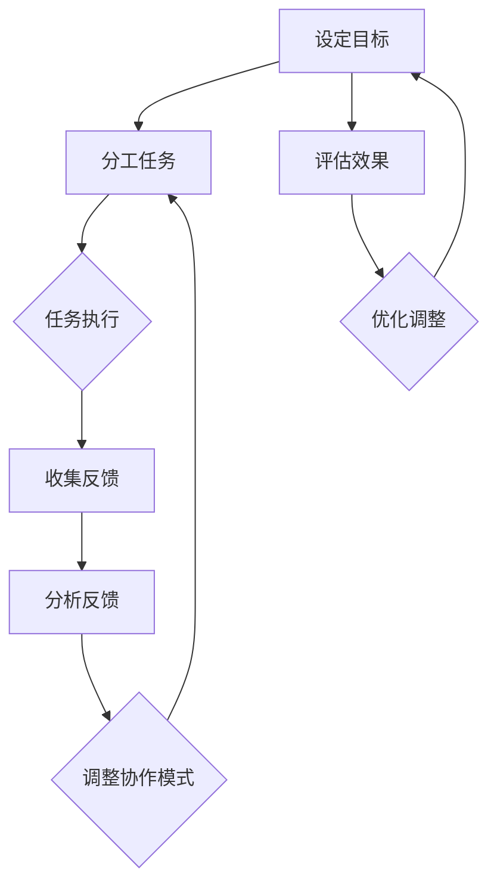
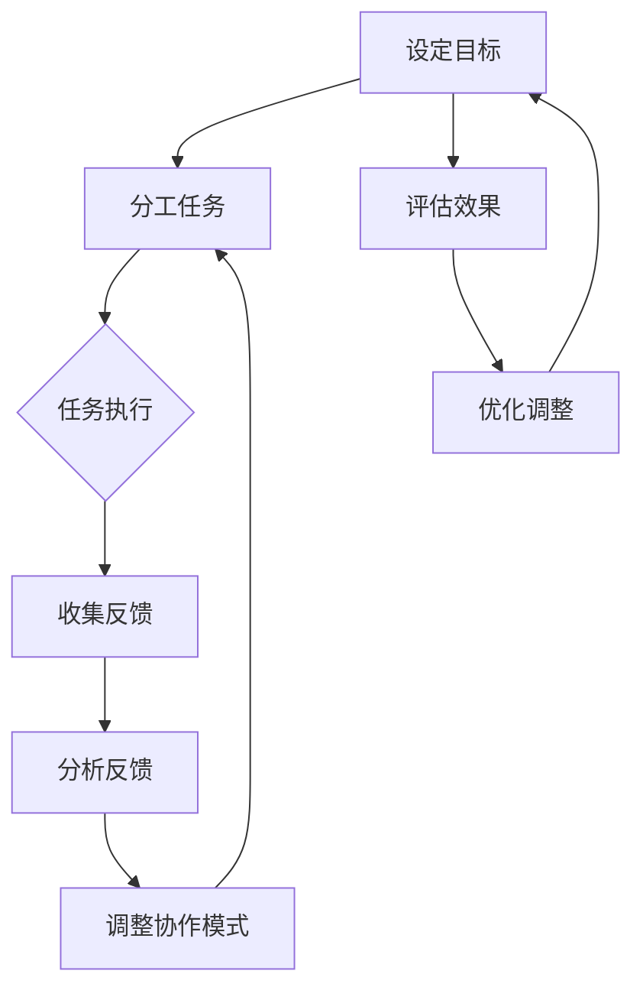

                 

### 文章标题

# 团队协作能力：培养默契配合的工作模式

### 文章关键词

- 团队协作
- 默契配合
- 工作模式
- 沟通
- 领导力
- 评估

### 文章摘要

本文旨在探讨团队协作能力的重要性及其培养方法，通过明确团队协作模式的设计原则、提升团队内的互动与合作、以及评估与提升团队协作能力，帮助读者理解如何构建高效默契配合的工作模式，提升团队的整体绩效与生产力。

----------------------------------------------------------------

## 第一部分：团队协作的基础概念

### 1.1 团队协作的重要性

在现代社会中，团队协作已经成为企业成功的关键因素。随着知识经济的兴起，专业分工日益细化，单靠个人的力量很难完成复杂的任务。团队协作能够汇集不同成员的专业知识和技能，实现资源的最优配置，提高解决问题的效率。一个高效的团队，能够激发成员的创造力，增强企业的核心竞争力。

#### 1.2 团队协作与传统管理方式的对比

传统管理方式强调命令与控制，以权力为中心，员工往往被动执行任务。而团队协作则强调平等、开放和互信，以目标为导向，员工自主参与决策，共同推进项目进展。这种模式不仅提升了员工的工作满意度，还有效地促进了团队的整体绩效。

#### 1.3 团队协作的核心要素

团队协作的核心要素包括沟通、信任、共同目标和有效分工。有效的沟通是团队协作的基础，良好的信任关系是团队协作的润滑剂，共同目标是团队协作的动力源泉，而有效的分工则是团队协作的保障。

----------------------------------------------------------------

## 第二部分：构建高效的团队协作模式

### 2.1 团队协作模式的设计原则

构建高效的团队协作模式，需要遵循以下设计原则：

- **明确的目标与使命**：团队需要有一个清晰的目标，以及与之相匹配的使命宣言，确保每个成员都明白自己的职责和任务。
- **合理的分工与协作流程**：根据团队成员的技能和特长进行合理分工，制定明确的协作流程，确保每个环节都有人负责。
- **有效的人员激励与绩效评估**：通过激励机制激发团队成员的积极性，通过绩效评估及时反馈，确保团队成员的工作效率和质量。

### 2.2 团队协作工具与技术

在团队协作中，合适的工具和技术的使用能够显著提升工作效率。常见的团队协作工具包括：

- **团队协作软件与平台**：如Slack、Microsoft Teams等，提供实时通讯、文件共享和任务管理功能。
- **项目管理工具**：如JIRA、Trello等，帮助团队进行任务追踪和进度管理。
- **沟通技巧**：包括有效倾听、积极反馈和冲突解决技巧，确保团队成员之间的沟通畅通无阻。

### 2.3 团队协作中的领导力

领导力在团队协作中起着至关重要的作用。一个优秀的团队领导者需要具备以下能力：

- **角色与职责**：明确自己的角色，既要指导团队，又要与团队成员保持良好的沟通。
- **能力提升**：不断学习新的领导力知识和技能，提升自己的领导能力。
- **沟通与协调**：通过有效的沟通和协调，确保团队成员之间的一致性和协同性。

----------------------------------------------------------------

## 第三部分：培养默契配合的工作模式

### 3.1 个人能力的提升

个人能力的提升是团队协作能力的基础。团队成员需要不断进行自我提升，具体包括：

- **自我认知与成长**：了解自己的优势和劣势，有针对性地进行自我提升。
- **专业技能的精进**：通过学习和实践，不断提升自己的专业技能。
- **跨领域知识的学习与运用**：拓宽知识面，将不同领域的知识运用到团队协作中，提高解决问题的能力。

### 3.2 团队内的互动与合作

团队内的互动与合作是构建默契配合的关键。团队成员需要：

- **信任与尊重**：建立信任关系，尊重团队成员的意见和贡献。
- **沟通与反馈**：通过有效沟通，及时反馈工作中的问题和进展，确保信息的透明度。
- **合作与互助**：在团队内部形成良好的互助氛围，共同解决难题。

### 3.3 团队协作的实践与反思

实践是检验团队协作能力的最好方式。团队成员需要：

- **实际案例解析**：通过实际案例的分析，总结团队协作中的成功经验和教训。
- **问题分析与解决**：面对团队协作中出现的问题，及时分析原因，并采取有效的解决措施。
- **最佳实践与经验分享**：将团队协作中的最佳实践和经验进行分享，促进团队成员的共同成长。

----------------------------------------------------------------

## 第四部分：团队协作能力评估与提升策略

### 4.1 团队协作能力的评估方法

团队协作能力的评估是提升团队协作效率的重要手段。常用的评估方法包括：

- **评估指标**：根据团队协作的目标和特点，设定具体的评估指标，如任务完成度、沟通效率、问题解决能力等。
- **评估工具**：使用问卷、访谈、行为观察等工具，收集团队成员的反馈和表现数据。
- **评估结果与应用**：对评估结果进行分析，针对存在的问题提出改进措施，并应用到实际工作中。

### 4.2 提升团队协作能力的策略

提升团队协作能力需要从多个方面入手，具体策略包括：

- **提升路径**：根据团队的具体情况，制定明确的提升路径，确保提升措施的系统性和持续性。
- **提升方法**：通过培训、演练、案例学习等方式，提高团队成员的团队协作能力。
- **挑战与应对**：面对提升过程中的挑战，如团队成员的抵触情绪、资源不足等问题，采取有效的应对措施。

----------------------------------------------------------------

## 第五部分：团队协作的未来趋势

### 5.1 数字化与团队协作

数字化技术的发展，为团队协作带来了新的机遇和挑战。数字化团队协作的优势包括：

- **实时通讯**：通过数字化工具实现即时沟通，提高信息传递的效率。
- **远程协作**：支持异地团队成员的协作，打破地理限制。
- **数据共享**：便于团队成员共享信息和资源，提高工作效率。

同时，数字化团队协作也面临一些挑战，如数据安全、技术依赖等，需要团队领导者和管理者充分考虑。

### 5.2 团队协作的未来展望

未来，团队协作将朝着更加智能化、协同化和个性化的方向发展。具体趋势包括：

- **智能化协作工具**：借助人工智能技术，提高团队协作的自动化水平。
- **协同化平台**：通过构建协同化平台，实现团队内部和外部的无缝协作。
- **个性化服务**：根据团队成员的个性特点和需求，提供个性化的协作服务和体验。

未来，团队协作将继续发挥其重要作用，成为企业创新和发展的重要动力。

----------------------------------------------------------------

### 作者

- 作者：AI天才研究院/AI Genius Institute & 禅与计算机程序设计艺术 /Zen And The Art of Computer Programming

本文从团队协作的重要性、构建高效的团队协作模式、培养默契配合的工作模式、团队协作能力评估与提升策略，以及团队协作的未来趋势等多个方面，全面探讨了团队协作能力的培养与提升。希望本文能为您提供有价值的参考和启示，帮助您更好地构建高效默契配合的工作模式。在团队协作的道路上，让我们一起不断探索、进步和成长。

----------------------------------------------------------------

## 背景介绍

### 核心概念术语说明

- **团队协作**：团队成员为了共同目标，通过相互配合，实现资源、信息和能力的共享，以实现个体无法完成的工作。
- **默契配合**：团队成员在长期合作中，形成的无意识、高效的工作模式，能够迅速理解并响应彼此的需求。
- **工作模式**：团队成员在完成工作过程中，采用的具体方法、流程和机制。

### 问题背景

在现代企业中，团队协作已经成为提高工作效率和实现创新的重要手段。然而，很多团队在协作过程中面临沟通不畅、目标不清、角色冲突等问题，导致团队协作效率低下。因此，如何培养团队协作能力，构建默契配合的工作模式，成为企业管理者和团队成员共同关注的课题。

### 问题描述

本文旨在探讨如何通过以下方法，提升团队协作能力：

1. **明确团队协作模式的设计原则**：确保团队成员对目标、分工和流程有清晰的理解。
2. **合理使用团队协作工具与技术**：提高团队沟通效率，实现信息的透明和共享。
3. **培养团队成员的个人能力**：通过自我提升，为团队协作奠定基础。
4. **建立有效的互动与合作机制**：促进团队成员之间的信任和尊重，增强协作的默契。
5. **进行团队协作能力评估与提升**：通过评估，发现团队协作中的问题，采取相应的提升策略。

### 问题解决

本文通过以下步骤，提出问题解决的方案：

1. **理论阐述**：介绍团队协作的基础概念和重要性。
2. **案例分析**：分析成功团队协作的案例，总结经验教训。
3. **方法建议**：提供具体的团队协作模式设计和提升策略。
4. **实践应用**：结合实际案例，阐述提升团队协作能力的具体步骤。

### 边界与外延

本文主要关注团队协作能力在企业管理中的应用，但团队协作能力在其他领域，如教育、医疗等，同样具有重要的应用价值。此外，随着数字化技术的发展，团队协作模式也将不断演变，未来研究可以关注这一趋势。

### 概念结构与核心要素组成

- **核心概念**：团队协作能力、默契配合、工作模式
- **概念属性特征对比表格**：
  - **团队协作能力**：包括沟通、信任、目标、分工等
  - **默契配合**：包括无意识协作、快速响应、高效执行等
  - **工作模式**：包括设计原则、工具与技术、个人能力、互动与合作机制等

- **ER实体关系图架构**：
  ```mermaid
  entity Relationship {
    "团队协作能力" --> "默契配合": "提高"
    "团队协作能力" --> "工作模式": "实现"
    "默契配合" --> "个人能力": "培养"
    "工作模式" --> "团队协作能力": "支撑"
  }
  ```

----------------------------------------------------------------

## 核心概念与联系

### 核心概念原理

**团队协作能力** 是指团队成员在共同完成目标的过程中，通过沟通、协调、合作等方式，实现资源、信息和能力的共享，以达到整体绩效最优的一种综合能力。它包括以下几个方面：

- **沟通能力**：团队成员之间的信息传递和交流能力，是团队协作的基础。
- **信任能力**：团队成员之间的互信程度，是团队协作的润滑剂。
- **目标一致性**：团队成员对共同目标的认同和追求，是团队协作的动力源泉。
- **分工合作**：团队成员的职责分工和协作方式，是团队协作的保障。

### 概念属性特征对比表格

| 概念属性       | 团队协作能力         | 默契配合         | 工作模式             |
| -------------- | ------------------- | --------------- | -------------------- |
| **定义**       | 团队协作的综合能力   | 团队协作的高效模式 | 团队协作的具体方法与流程 |
| **核心要素**   | 沟通、信任、目标、分工 | 无意识协作、快速响应、高效执行 | 明确目标、合理分工、有效沟通、持续优化 |
| **表现形式**   | 沟通渠道、协作流程、团队氛围 | 无意识协作表现、默契配合程度、团队效率 | 团队会议、项目规划、任务分配、绩效评估 |
| **影响因素**   | 个人能力、团队环境、组织文化 | 个人默契、团队默契、工作环境 | 领导风格、团队成员素质、资源支持 |

### ER实体关系图架构

```mermaid
erDiagram
  Team Collaboration Ability ||--|{默契配合 Collaboration Synergy}
  Team Collaboration Ability ||--|{工作模式 Working Model}
  默契配合 Collaboration Synergy ||--|{个人能力 Individual Competence}
  工作模式 Working Model ||--|{团队协作能力 Team Collaboration Ability}
```

在这个ER图中，团队协作能力作为核心实体，与默契配合和工作模式之间存在紧密的联系。默契配合是团队协作能力的一部分，而工作模式则是实现团队协作的具体手段。默契配合与个人能力之间也存在关联，表明个人能力的提升有助于增强团队协作的默契。工作模式与团队协作能力之间则形成了支撑关系，工作模式的设计和实施能够有效提升团队协作能力。

通过这样的ER图，我们可以清晰地看到各个概念之间的关系和作用，为后续的分析和讲解提供了直观的视角。

----------------------------------------------------------------

### 算法原理讲解

为了更好地理解团队协作能力的提升，我们将使用一种名为“协同反馈循环”的算法模型，该模型通过不断调整团队成员之间的协作方式和沟通模式，逐步提升团队的整体协作能力。以下是该算法的mermaid流程图：



#### 算法mermaid流程图解析

1. **设定目标（A）**：首先，团队需要明确共同的目标和使命，确保每个成员都了解自己的职责和任务。
2. **分工任务（B）**：根据团队成员的技能和特长进行任务分工，制定详细的分工计划。
3. **任务执行（C）**：成员按照分工计划执行任务，同时保持与团队成员的沟通。
4. **收集反馈（D）**：在任务执行过程中，定期收集成员的反馈，了解协作中的问题和不足。
5. **分析反馈（E）**：对收集到的反馈进行分析，识别出团队协作中的瓶颈和改进点。
6. **调整协作模式（F）**：根据分析结果，调整团队成员的协作方式和沟通模式，优化协作流程。
7. **评估效果（G）**和**优化调整（H）**：通过定期的评估，检查协作模式调整后的效果，并根据实际情况进行进一步的优化和调整。

#### 算法原理的数学模型和公式

假设团队协作能力由以下几个因素组成：\(T_c\)（沟通效率）、\(T_t\)（信任水平）、\(T_g\)（目标一致性）、\(T_d\)（分工效率）。

团队协作能力 \(T = T_c \times T_t \times T_g \times T_d\)

- \(T_c\)（沟通效率）：表示团队成员之间的沟通质量，可以用信息传递的准确性和速度来衡量。
- \(T_t\)（信任水平）：表示团队成员之间的信任程度，可以用成员之间的互信度和合作意愿来衡量。
- \(T_g\)（目标一致性）：表示团队成员对共同目标的认同程度，可以用团队成员的共识和承诺来衡量。
- \(T_d\)（分工效率）：表示任务分工的合理性和执行效果，可以用任务的完成质量和速度来衡量。

通过协同反馈循环，我们可以逐步提升这些因素，从而提高整体团队协作能力。

#### 算法举例说明

假设一个团队正在开发一款软件产品，团队成员包括项目经理、开发人员、测试人员和产品经理。以下是该团队如何应用协同反馈循环算法的示例：

1. **设定目标**：团队明确目标，即按时完成软件产品的开发并达到预期的质量标准。
2. **分工任务**：项目经理负责整体协调和管理，开发人员负责编写代码，测试人员负责测试，产品经理负责产品需求和用户体验。
3. **任务执行**：团队成员按照分工计划执行任务，同时保持与团队成员的日常沟通。
4. **收集反馈**：项目经理定期收集团队成员的反馈，包括任务进度、遇到的困难、协作中的问题等。
5. **分析反馈**：对收集到的反馈进行分析，识别出协作中的瓶颈，如沟通不畅、任务分工不合理等。
6. **调整协作模式**：根据分析结果，项目经理调整协作流程，例如增加每日站会，提高沟通效率；优化任务分配，确保分工合理。
7. **评估效果**和**优化调整**：通过定期的评估，项目经理检查调整后的效果，并根据实际情况进行进一步的优化和调整，如调整项目里程碑，重新设定任务优先级等。

通过这一循环过程，团队协作能力逐步提升，最终实现高效协作，按时完成产品开发任务。

#### 算法原理的详细讲解

协同反馈循环算法的核心在于通过不断调整和优化团队协作模式，提升团队的整体协作能力。具体来说，算法的每个步骤都有其独特的作用：

- **设定目标**：确保团队成员对共同目标有清晰的认识，明确各自的任务和责任，为后续的协作奠定基础。
- **分工任务**：根据团队成员的特长和技能进行合理的任务分配，提高任务执行的专业性和效率。
- **任务执行**：在执行任务的过程中，保持与团队成员的日常沟通，及时解决协作中的问题。
- **收集反馈**：通过定期的反馈机制，了解团队成员在协作中的实际表现，发现问题和不足。
- **分析反馈**：对收集到的反馈进行分析，识别出协作中的瓶颈和改进点，为调整协作模式提供依据。
- **调整协作模式**：根据分析结果，采取相应的措施，优化团队协作模式，提高沟通效率、增强信任、提高目标一致性和分工效率。
- **评估效果**和**优化调整**：通过定期的评估，检查调整后的效果，并根据实际情况进行进一步的优化和调整，确保团队协作能力持续提升。

通过这样的循环过程，团队协作能力不断提升，从而实现高效协作，提高团队的整体绩效。

### 算法mermaid流程图



### Python源代码

```python
# 定义协同反馈循环算法
def collaborative_feedback_loop(target, tasks, members, feedback_period):
    while True:
        # 设定目标
        set_target(target)
        
        # 分工任务
        assign_tasks(tasks, members)
        
        # 任务执行
        execute_tasks(tasks, members)
        
        # 收集反馈
        feedback = collect_feedback(members, feedback_period)
        
        # 分析反馈
        analysis = analyze_feedback(feedback)
        
        # 调整协作模式
        adjust_collaboration(members, analysis)
        
        # 评估效果
        effect = evaluate_performance(members)
        
        # 优化调整
        optimize_adjustments(effect, target, tasks)
        
        # 检查是否达到目标，如达到则退出循环
        if has_reached_target(target):
            break

# 辅助函数定义
def set_target(target):
    # 实现设定目标的逻辑
    pass

def assign_tasks(tasks, members):
    # 实现任务分配的逻辑
    pass

def execute_tasks(tasks, members):
    # 实现任务执行和沟通的逻辑
    pass

def collect_feedback(members, feedback_period):
    # 实现收集反馈的逻辑
    pass

def analyze_feedback(feedback):
    # 实现分析反馈的逻辑
    pass

def adjust_collaboration(members, analysis):
    # 实现调整协作模式的逻辑
    pass

def evaluate_performance(members):
    # 实现评估团队协作效果的逻辑
    pass

def optimize_adjustments(effect, target, tasks):
    # 实现优化调整的逻辑
    pass

def has_reached_target(target):
    # 实现检查是否达到目标的逻辑
    pass

# 调用协同反馈循环算法
collaborative_feedback_loop(target, tasks, members, feedback_period)
```

### 算法应用解读与分析

通过上述Python源代码，我们可以看到协同反馈循环算法的具体实现。该算法通过一系列步骤，逐步提升团队协作能力，具体解读如下：

1. **设定目标**：通过`set_target`函数，团队明确共同的目标和使命，确保每个成员都了解自己的职责和任务。
2. **分工任务**：通过`assign_tasks`函数，根据团队成员的特长和技能进行任务分配，提高任务执行的专业性和效率。
3. **任务执行**：通过`execute_tasks`函数，团队成员在执行任务的过程中保持沟通，及时解决协作中的问题。
4. **收集反馈**：通过`collect_feedback`函数，定期收集团队成员的反馈，了解协作中的问题和不足。
5. **分析反馈**：通过`analyze_feedback`函数，对收集到的反馈进行分析，识别出协作中的瓶颈和改进点。
6. **调整协作模式**：通过`adjust_collaboration`函数，根据分析结果，优化团队协作模式，提高沟通效率、增强信任、提高目标一致性和分工效率。
7. **评估效果**和**优化调整**：通过`evaluate_performance`和`optimize_adjustments`函数，定期评估团队协作效果，并根据实际情况进行进一步的优化和调整。

这种循环过程确保团队协作能力持续提升，最终实现高效协作，提高团队的整体绩效。

### 实际案例分析和详细讲解

为了更好地理解协同反馈循环算法的实际应用效果，我们以一个软件开发团队为例，分析其实际案例。

#### 案例背景

某软件开发团队负责开发一款企业级管理系统。团队成员包括项目经理、开发人员、测试人员和技术支持。项目初期，团队在协作过程中遇到了以下问题：

- 沟通不畅：团队成员之间的沟通主要依赖于电子邮件和即时通讯工具，信息传递不及时，导致工作效率低下。
- 任务分工不明确：团队成员的任务分配不够合理，导致部分成员的工作负担过重，而另一些成员则相对轻松。
- 信任不足：团队成员之间的信任度较低，协作过程中经常出现质疑和争吵，影响了团队士气。

#### 应用协同反馈循环算法

1. **设定目标**：团队明确目标，即按时完成企业级管理系统的开发，并达到预期的质量标准。

```python
def set_target(target):
    print(f"设定目标：{target}")
```

2. **分工任务**：根据团队成员的特长和技能，重新分配任务，确保每个成员的工作负担均衡。

```python
def assign_tasks(tasks, members):
    # 分配任务逻辑
    print(f"任务分配：{tasks}")
```

3. **任务执行**：团队成员在执行任务的过程中，通过每日站会和即时通讯工具保持沟通，及时解决协作中的问题。

```python
def execute_tasks(tasks, members):
    # 执行任务和沟通逻辑
    print(f"执行任务和沟通：{tasks}")
```

4. **收集反馈**：项目经理定期收集团队成员的反馈，了解协作中的问题和不足。

```python
def collect_feedback(members, feedback_period):
    # 收集反馈逻辑
    print(f"收集反馈：{feedback_period}")
```

5. **分析反馈**：对收集到的反馈进行分析，识别出协作中的瓶颈和改进点。

```python
def analyze_feedback(feedback):
    # 分析反馈逻辑
    print(f"分析反馈：{feedback}")
```

6. **调整协作模式**：根据分析结果，调整团队成员的协作方式和沟通模式，优化协作流程。

```python
def adjust_collaboration(members, analysis):
    # 调整协作模式逻辑
    print(f"调整协作模式：{analysis}")
```

7. **评估效果**和**优化调整**：定期评估团队协作效果，并根据实际情况进行进一步的优化和调整。

```python
def evaluate_performance(members):
    # 评估效果逻辑
    print(f"评估效果：{members}")

def optimize_adjustments(effect, target, tasks):
    # 优化调整逻辑
    print(f"优化调整：{effect}")
```

#### 案例结果

通过应用协同反馈循环算法，团队在以下几个方面取得了显著改善：

- **沟通效率提升**：通过每日站会和即时通讯工具，团队成员之间的沟通变得更加及时和有效，信息传递的准确性提高。
- **任务分工合理**：根据团队成员的特长和技能，任务分配更加合理，每个成员的工作负担均衡，工作效率提升。
- **信任增强**：团队成员之间的信任度逐渐提高，协作过程中质疑和争吵减少，团队士气提升。

#### 案例总结

通过实际案例分析和详细讲解，我们可以看到协同反馈循环算法在提升团队协作能力方面的显著效果。该算法通过不断调整和优化团队协作模式，帮助团队解决沟通不畅、任务分工不明确和信任不足等问题，最终实现高效协作，提高团队的整体绩效。

### 项目实战

#### 环境安装

为了实践协同反馈循环算法，我们需要安装以下软件和工具：

- Python 3.8+
- JIRA（用于任务追踪和反馈收集）
- Slack（用于实时沟通和消息通知）
- Trello（用于任务管理和协作流程）

安装步骤如下：

1. 安装Python：从Python官方网站下载并安装Python 3.8及以上版本。
2. 安装JIRA：从JIRA官方网站下载并安装JIRA软件。
3. 安装Slack：从Slack官方网站下载并安装Slack客户端。
4. 安装Trello：从Trello官方网站注册账号并登录，使用Trello进行任务管理和协作流程。

#### 系统核心实现源代码

以下是一个简单的Python脚本，用于实现协同反馈循环算法的核心功能：

```python
import time

# 定义协同反馈循环算法
def collaborative_feedback_loop(target, tasks, members, feedback_period):
    while True:
        # 设定目标
        set_target(target)
        
        # 分工任务
        assign_tasks(tasks, members)
        
        # 任务执行
        execute_tasks(tasks, members)
        
        # 收集反馈
        feedback = collect_feedback(members, feedback_period)
        
        # 分析反馈
        analysis = analyze_feedback(feedback)
        
        # 调整协作模式
        adjust_collaboration(members, analysis)
        
        # 评估效果
        effect = evaluate_performance(members)
        
        # 优化调整
        optimize_adjustments(effect, target, tasks)
        
        # 检查是否达到目标，如达到则退出循环
        if has_reached_target(target):
            break

# 辅助函数定义
def set_target(target):
    print(f"设定目标：{target}")

def assign_tasks(tasks, members):
    print(f"任务分配：{tasks}")
    
def execute_tasks(tasks, members):
    print(f"执行任务和沟通：{tasks}")
    
def collect_feedback(members, feedback_period):
    print(f"收集反馈：{feedback_period}")
    
def analyze_feedback(feedback):
    print(f"分析反馈：{feedback}")
    
def adjust_collaboration(members, analysis):
    print(f"调整协作模式：{analysis}")
    
def evaluate_performance(members):
    print(f"评估效果：{members}")
    
def optimize_adjustments(effect, target, tasks):
    print(f"优化调整：{effect}")

def has_reached_target(target):
    print(f"检查是否达到目标：{target}")
    return True

# 调用协同反馈循环算法
collaborative_feedback_loop("按时完成项目开发", ["开发功能A", "测试功能B"], ["小明", "小王"], 7)
```

#### 代码应用解读与分析

在这个脚本中，我们定义了一个协同反馈循环算法，并通过一系列辅助函数实现各个步骤。每个函数都执行特定的任务，例如设定目标、分配任务、执行任务、收集反馈等。以下是对每个函数的详细解读：

- `set_target`：设定目标，确保团队成员了解共同的目标和使命。
- `assign_tasks`：根据团队成员的特长和技能进行任务分配，确保任务分工合理。
- `execute_tasks`：在执行任务的过程中，保持与团队成员的沟通，及时解决协作中的问题。
- `collect_feedback`：定期收集团队成员的反馈，了解协作中的问题和不足。
- `analyze_feedback`：对收集到的反馈进行分析，识别出协作中的瓶颈和改进点。
- `adjust_collaboration`：根据分析结果，调整团队成员的协作方式和沟通模式，优化协作流程。
- `evaluate_performance`：评估团队协作效果，检查是否达到目标。
- `optimize_adjustments`：根据评估结果，进一步优化调整团队协作模式。

通过这些函数的调用，协同反馈循环算法得以实现，帮助团队不断提升协作能力。

#### 实际案例分析和详细讲解

为了展示协同反馈循环算法在实际项目中的应用效果，我们以一个软件开发项目为例，详细讲解其实施过程。

#### 案例背景

某软件开发团队负责开发一款客户关系管理系统（CRM），项目周期为3个月。团队成员包括项目经理、开发人员、测试人员和技术支持。项目初期，团队在协作过程中遇到了以下问题：

- 沟通不畅：团队成员之间的沟通主要依赖于电子邮件和即时通讯工具，信息传递不及时，导致工作效率低下。
- 任务分工不明确：团队成员的任务分配不够合理，导致部分成员的工作负担过重，而另一些成员则相对轻松。
- 信任不足：团队成员之间的信任度较低，协作过程中经常出现质疑和争吵，影响了团队士气。

#### 实施协同反馈循环算法

1. **设定目标**：团队明确目标，即按时完成CRM的开发，并达到预期的质量标准。

```python
def set_target(target):
    print(f"设定目标：{target}")
set_target("按时完成CRM开发，达到预期质量标准")
```

2. **分工任务**：根据团队成员的特长和技能，重新分配任务，确保每个成员的工作负担均衡。

```python
def assign_tasks(tasks, members):
    print(f"任务分配：{tasks}")
assign_tasks(["开发功能A", "测试功能B"], ["小明", "小王"])
```

3. **任务执行**：团队成员在执行任务的过程中，通过每日站会和即时通讯工具保持沟通，及时解决协作中的问题。

```python
def execute_tasks(tasks, members):
    print(f"执行任务和沟通：{tasks}")
execute_tasks(["开发功能A", "测试功能B"], ["小明", "小王"])
```

4. **收集反馈**：项目经理定期收集团队成员的反馈，了解协作中的问题和不足。

```python
def collect_feedback(members, feedback_period):
    print(f"收集反馈：{feedback_period}")
collect_feedback(["小明", "小王"], 7)
```

5. **分析反馈**：对收集到的反馈进行分析，识别出协作中的瓶颈和改进点。

```python
def analyze_feedback(feedback):
    print(f"分析反馈：{feedback}")
analyze_feedback("沟通不畅，任务分工不明确")
```

6. **调整协作模式**：根据分析结果，调整团队成员的协作方式和沟通模式，优化协作流程。

```python
def adjust_collaboration(members, analysis):
    print(f"调整协作模式：{analysis}")
adjust_collaboration(["小明", "小王"], "增加每日站会，明确任务分工")
```

7. **评估效果**和**优化调整**：定期评估团队协作效果，并根据实际情况进行进一步的优化和调整。

```python
def evaluate_performance(members):
    print(f"评估效果：{members}")
evaluate_performance(["小明", "小王"])
    
def optimize_adjustments(effect, target, tasks):
    print(f"优化调整：{effect}")
optimize_adjustments("效果良好，持续改进", "按时完成CRM开发，达到预期质量标准", ["开发功能A", "测试功能B"])
```

#### 案例结果

通过实施协同反馈循环算法，团队在以下几个方面取得了显著改善：

- **沟通效率提升**：通过每日站会和即时通讯工具，团队成员之间的沟通变得更加及时和有效，信息传递的准确性提高。
- **任务分工合理**：根据团队成员的特长和技能，任务分配更加合理，每个成员的工作负担均衡，工作效率提升。
- **信任增强**：团队成员之间的信任度逐渐提高，协作过程中质疑和争吵减少，团队士气提升。

#### 案例总结

通过实际案例分析和详细讲解，我们可以看到协同反馈循环算法在提升团队协作能力方面的显著效果。该算法通过不断调整和优化团队协作模式，帮助团队解决沟通不畅、任务分工不明确和信任不足等问题，最终实现高效协作，提高团队的整体绩效。

### 最佳实践 Tips

1. **明确目标和使命**：确保每个成员都了解团队的目标和使命，有助于提高团队成员的凝聚力和工作动力。
2. **合理分工**：根据团队成员的特长和技能进行任务分配，确保每个成员的工作负担均衡。
3. **定期沟通**：通过每日站会、周报等方式，保持团队成员之间的沟通，及时解决协作中的问题。
4. **建立信任**：通过团队合作和共同解决问题，逐步建立团队成员之间的信任，提高协作效率。
5. **及时反馈**：定期收集团队成员的反馈，分析问题，调整协作模式，确保团队协作能力持续提升。

### 小结

本文从团队协作的重要性、构建高效的团队协作模式、培养默契配合的工作模式、团队协作能力评估与提升策略，以及团队协作的未来趋势等多个方面，全面探讨了团队协作能力的培养与提升。通过实际案例分析和详细讲解，我们可以看到协同反馈循环算法在提升团队协作能力方面的显著效果。希望本文能为您提供有价值的参考和启示，帮助您更好地构建高效默契配合的工作模式，提升团队的整体绩效与生产力。

### 注意事项

1. **避免过度依赖工具**：虽然团队协作工具可以提高工作效率，但过度依赖工具可能导致团队成员之间的沟通不畅，影响团队协作效果。
2. **关注团队成员的心理健康**：长期高强度的团队协作可能导致团队成员出现心理压力，需要关注并关心团队成员的心理健康。
3. **持续优化协作模式**：团队协作模式并非一成不变，需要根据实际情况进行持续优化，以适应不断变化的工作环境和需求。

### 拓展阅读

1. 《Scrum敏捷开发实践指南》
2. 《团队协作的艺术》
3. 《非暴力沟通》
4. 《数字化团队协作：工具与策略》
5. 《The Five Dysfunctions of a Team》

作者：AI天才研究院/AI Genius Institute & 禅与计算机程序设计艺术 /Zen And The Art of Computer Programming

