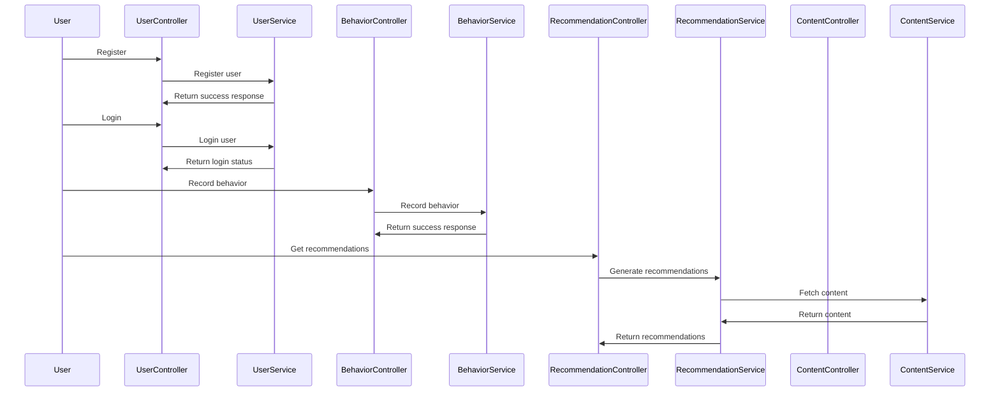

                 

### 书名：《团队协作：发挥个体优势的艺术》

### 关键词：团队协作、个体优势、高效沟通、团队建设、项目管理

### 摘要：

在当今快速变化和竞争激烈的商业环境中，团队协作是企业和组织中取得成功的关键因素。本书旨在探讨如何通过发挥个体优势，实现团队协作的最大化效果。书中详细阐述了团队协作的核心理念、构建高效团队的方法、个体优势的识别与利用、沟通与协作工具的选择与应用，以及解决团队协作中遇到的各种挑战的策略。通过丰富的案例分析和实战经验，本书为读者提供了一套全面且实用的团队协作指南，帮助企业在现代工作环境中实现高效运作。

## 引言

### 团队协作的重要性

在当今的职场环境中，团队协作已成为实现目标、提升效率、促进创新的核心手段。无论是在企业、政府部门还是非营利组织，团队协作都扮演着至关重要的角色。其重要性主要体现在以下几个方面：

1. **提升工作效率**：团队协作使得不同背景和技能的成员能够互相补充，共同完成任务，从而提升整体工作效率。
2. **促进知识共享**：团队成员之间的交流和互动有助于知识的传递和共享，促进整体团队的学习和成长。
3. **增强决策质量**：团队协作能够汇集不同观点和意见，通过集体讨论和决策，提高决策的质量和准确性。
4. **提升团队凝聚力**：良好的团队协作能够增强成员之间的信任和归属感，提高团队的凝聚力和协作能力。

### 团队协作面临的挑战

尽管团队协作的重要性不言而喻，但在实际操作过程中，团队协作面临着诸多挑战：

1. **沟通障碍**：团队成员之间的沟通不畅是导致协作失败的主要原因之一。不同的文化背景、语言障碍和专业领域差异都会影响沟通的有效性。
2. **角色冲突**：团队成员在职责和目标上的不一致可能导致角色冲突，影响团队的整体绩效。
3. **资源分配不均**：资源分配不均会使得部分团队成员感到不公平，进而影响团队的士气和协作效率。
4. **时间管理困难**：团队成员的时间安排不同，容易导致项目进度的延误和协作的障碍。

### 团队协作的益处

有效的团队协作不仅能够克服上述挑战，还能带来显著的益处：

1. **提升创新能力**：多样化的思维碰撞和观点交流能够激发创新，推动团队在产品开发、解决方案设计等方面取得突破。
2. **优化人力资源**：通过团队协作，企业能够更好地发挥员工的潜力，实现人力资源的优化配置。
3. **增强企业竞争力**：高效的团队协作能够提升企业的整体竞争力，帮助企业在激烈的市场竞争中脱颖而出。
4. **促进个人成长**：团队成员在协作过程中能够学习新技能、扩展知识面，促进个人职业成长。

### 团队协作的核心概念

团队协作不仅仅是简单的合作，而是一种系统化的行为模式，它涉及多个核心概念：

1. **目标一致性**：团队协作的首要前提是所有成员对目标有一致的理解和认同。
2. **角色明确**：明确每个团队成员的角色和职责，确保团队运作的有序性和高效性。
3. **信任建设**：信任是团队协作的基石，通过建立信任关系，可以提高团队的协作效率和士气。
4. **沟通机制**：建立有效的沟通机制，确保信息流畅传递，减少误解和冲突。
5. **共享资源**：共享资源和信息，促进团队整体的发展和创新。

### 团队协作在不同领域的应用

团队协作在各个领域的应用各有特点，以下列举几个典型领域：

1. **科技企业**：在软件开发、产品研发等领域，团队协作是实现快速迭代、高效创新的关键。
2. **医疗机构**：在医疗领域，团队协作有助于提高诊疗质量、优化护理流程。
3. **教育机构**：在教育领域，团队协作可以促进师生互动、丰富教学内容。
4. **政府部门**：在政府管理中，团队协作有助于提高决策效率、改善公共服务质量。

### 总结

团队协作在现代社会的重要性不言而喻。通过有效的团队协作，企业不仅能够提升工作效率和创新能力，还能增强整体竞争力和员工满意度。面对团队协作中的各种挑战，企业需要采取一系列策略和措施，以建立高效、协同的团队。本书将围绕团队协作的核心概念、实践方法和案例分析，提供系统的指导和实用的建议，帮助企业和组织实现团队协作的最大化效果。

## 1. 团队协作概述

### 核心概念术语说明

在探讨团队协作之前，我们有必要对一些核心概念进行详细的解释和定义，以确保对相关概念的准确理解和运用。

#### **团队**

团队是由一组相互依赖、协同工作的个体组成的，共同追求一个共同目标或完成一项共同任务的集体。团队成员之间通常具有明确的角色分工和协作机制，通过共同努力实现团队的目标。

#### **协作**

协作是指团队成员之间相互配合、共同完成任务的过程。协作不仅仅是简单的合作，更强调在团队成员之间建立信任、沟通和共享资源，从而提高团队的效率和绩效。

#### **团队协作**

团队协作是指团队成员围绕共同目标，通过相互沟通、协作和共享资源，实现团队目标的过程。团队协作强调的是一种系统化的行为模式，旨在通过协同努力，最大化团队的绩效和创新能力。

### 问题背景

在当今高度竞争和快速变化的市场环境中，企业面临着前所未有的挑战。单靠个体英雄主义已经无法应对复杂多变的市场需求，团队协作成为企业成功的关键因素。然而，团队协作并非易事，企业在实际操作中常常遇到各种问题，如沟通障碍、角色冲突、资源分配不均等，这些问题严重影响了团队协作的效果。

### 问题描述

团队协作问题主要集中在以下几个方面：

1. **沟通障碍**：团队成员之间缺乏有效的沟通渠道和机制，导致信息传递不畅，出现误解和冲突。
2. **角色冲突**：团队成员在职责和目标上存在不一致，导致角色冲突，影响团队的效率和凝聚力。
3. **资源分配不均**：团队成员在资源获取和使用上存在不公平现象，导致部分成员感到不满和挫败。
4. **时间管理困难**：团队成员的时间安排不协调，导致项目进度的延误和协作的障碍。

### 问题解决

针对上述问题，企业需要采取一系列措施来提高团队协作的效果：

1. **建立有效的沟通机制**：通过定期会议、信息共享平台等方式，确保团队成员之间的信息流畅传递，减少误解和冲突。
2. **明确角色分工和职责**：确保每个团队成员对自身的角色和职责有清晰的认识，通过明确的分工，减少角色冲突。
3. **优化资源分配**：合理分配资源，确保团队成员在资源获取和使用上公平，提高团队的士气和协作效率。
4. **加强时间管理**：通过制定详细的项目计划和任务分配，确保团队成员的时间安排合理，提高项目进度和协作效率。

### 边界与外延

团队协作的范围和边界取决于团队的目标、规模和成员的组成。从广义上讲，团队协作不仅限于企业内部，还可以扩展到跨部门、跨组织甚至跨国家的协作。团队协作的外延还包括团队文化建设、团队领导力、团队绩效评估等方面。

### 概念结构与核心要素组成

团队协作的概念结构包括以下几个核心要素：

1. **目标一致性**：确保所有团队成员对团队目标有一致的理解和认同。
2. **角色明确**：明确每个团队成员的角色和职责，确保团队运作的有序性和高效性。
3. **信任建设**：通过建立信任关系，提高团队成员之间的协作效率和士气。
4. **沟通机制**：建立有效的沟通机制，确保信息流畅传递，减少误解和冲突。
5. **共享资源**：通过共享资源和信息，促进团队整体的发展和创新。

通过以上要素的有机结合，团队协作能够实现团队目标的最大化效果。

### 核心概念原理

团队协作的核心概念原理主要包括以下几个方面：

1. **协同效应**：团队协作通过整合不同成员的技能和知识，产生比单个成员单独工作更高效的结果。这种协同效应是团队协作的基本原理之一。
2. **合作机制**：有效的团队协作需要建立一系列合作机制，如明确的角色分工、规范的沟通流程、共享资源的平台等，以确保团队运作的有序性和高效性。
3. **信任文化**：信任是团队协作的基础，通过建立信任文化，可以提高团队成员之间的信任度和协作效率。

### 概念属性特征对比表格

| 概念                | 特征描述                                                       |  
| -------------------- | ------------------------------------------------------------ |  
| 团队                | 由一组相互依赖、协同工作的个体组成的集体，共同追求一个共同目标或完成一项共同任务。 |  
| 协作                | 团队成员之间相互配合、共同完成任务的过程。强调相互支持和资源共享。 |  
| 团队协作            | 团队成员围绕共同目标，通过相互沟通、协作和共享资源，实现团队目标的过程。强调系统化和高效性。 |

### ER实体关系图架构

下面是团队协作中几个关键实体的ER图架构：

```mermaid
erDiagram
  Team ||--|{ Member }| :
  Member ||--|{ Role }| :
  Member ||--|{ Skill }| :
  Role ||--|{ Responsibility }| :
```

在上面的ER图中，`Team`是团队实体，`Member`是团队成员实体，`Role`是角色实体，`Skill`是技能实体，`Responsibility`是职责实体。这些实体之间的关系反映了团队协作中各个要素的关联和相互作用。

### 原理解释

团队协作的原理可以概括为以下几个方面：

1. **整合资源**：团队协作通过整合团队成员的知识、技能和资源，实现资源的最大化利用，从而提高团队的整体效率和绩效。
2. **协同合作**：团队协作强调团队成员之间的协同合作，通过共享信息和资源，实现知识的传递和技能的提升，从而提高团队的创新能力和解决问题的能力。
3. **信任建设**：信任是团队协作的基石。通过建立信任文化，团队成员可以更加放心地分享自己的观点和想法，减少冲突和误解，提高团队的协作效率和士气。
4. **角色明确**：明确的角色分工和职责分配有助于团队成员明确自己的任务和目标，提高工作的有序性和效率。

通过上述原理的实现，团队协作能够实现以下目标：

1. **提升工作效率**：通过团队成员的协同合作和资源共享，提高团队整体的工作效率和绩效。
2. **促进知识共享**：通过团队成员之间的沟通和交流，促进知识的传递和共享，提高团队整体的学习和成长能力。
3. **增强团队凝聚力**：通过建立信任关系和明确的角色分工，增强团队成员之间的信任和归属感，提高团队的凝聚力和协作能力。
4. **提升创新能力**：通过团队成员的多样性和观点碰撞，促进团队的创新能力和解决问题的能力。

### 实例说明

假设在一个软件开发团队中，团队成员包括项目经理、程序员、设计师和测试员。他们的任务是在限定的时间内开发一款新产品。

- **协同合作**：程序员和设计师需要密切合作，确保代码的设计和产品的界面设计一致。项目经理需要协调各个成员的工作进度，确保项目按计划进行。
- **资源共享**：程序员和设计师可以通过共享代码库和设计文件，提高工作效率，减少重复工作。
- **角色明确**：项目经理负责整体项目的进度和协调工作，程序员负责代码编写和调试，设计师负责产品界面设计，测试员负责测试和验收。

通过上述实例，我们可以看到团队协作如何在实际工作中发挥重要作用，实现资源的最大化利用和整体工作效率的提升。

### 总结

团队协作作为一种重要的组织行为模式，在现代社会中具有重要意义。通过理解团队协作的核心概念、原理和实现方法，企业可以有效地克服协作中的各种挑战，实现团队整体绩效的最大化。有效的团队协作不仅能够提升工作效率和创新能力，还能增强团队的凝聚力和员工的满意度，为企业的长期发展奠定坚实基础。

## 2. 核心概念和原则

### 团队协作的定义

团队协作是指团队成员通过相互沟通、协作和共享资源，共同完成某个特定目标或任务的过程。它强调的是一种系统化的行为模式，旨在通过协同合作，最大化团队的整体绩效和创新能力。团队协作不仅仅是一种简单的合作，更是一种有组织、有目的的行为，它涉及多个关键要素，如目标一致性、角色明确、信任建设和沟通机制等。

### 团队协作的关键原则

要实现高效的团队协作，必须遵循以下几个关键原则：

1. **目标一致性**：所有团队成员必须对团队的目标有清晰、一致的理解。明确的共同目标是团队协作的基石，它为团队成员提供方向和动力，确保大家朝着同一方向努力。
2. **角色明确**：每个团队成员都应该明确自己的角色和职责。角色明确可以避免职责重叠和冲突，提高工作效率和团队凝聚力。
3. **信任建设**：信任是团队协作的核心，通过建立信任关系，团队成员可以更放心地分享观点和想法，减少误解和冲突，提高协作效率和士气。
4. **沟通机制**：建立有效的沟通机制，确保信息流畅传递，减少误解和冲突。沟通机制可以包括定期会议、信息共享平台和即时通讯工具等。
5. **资源共享**：共享资源和信息，促进团队整体的发展和创新。资源共享可以包括知识、技能、工具和设备等。

### 团队动态和角色

团队协作的动态和角色是团队运作的核心。以下是一些关键的团队角色和它们的职责：

1. **领导**：领导负责设定团队的目标和愿景，制定策略，协调团队的工作，并解决团队中的冲突。
2. **执行者**：执行者是团队中负责具体任务的人，他们按照领导的指示完成任务，并确保项目的顺利进行。
3. **协调者**：协调者负责协调不同成员的工作，确保任务的分工和进度符合团队的目标。
4. **沟通者**：沟通者负责确保团队成员之间的信息流通，确保每个人都了解项目的进展和任务分配。
5. **创新者**：创新者负责推动团队的创新和改进，提出新的想法和解决方案。
6. **反馈者**：反馈者负责提供反馈和评估，帮助团队改进工作方法和提升绩效。

### 团队协作流程

团队协作的流程可以分为以下几个阶段：

1. **目标设定**：明确团队的目标和愿景，确保所有团队成员对目标有清晰的理解。
2. **角色分工**：根据团队成员的技能和特长，明确每个人的角色和职责。
3. **计划制定**：制定详细的工作计划，包括任务分配、时间安排和资源需求。
4. **执行实施**：团队成员按照计划执行任务，确保项目的顺利进行。
5. **沟通协调**：定期进行沟通和协调，确保团队成员之间的信息流通和资源共享。
6. **评估反馈**：对团队的工作进行评估和反馈，找出改进的空间，提升团队的整体绩效。

### 团队协作的优势

团队协作的优势主要体现在以下几个方面：

1. **提升工作效率**：通过团队成员的协同合作和资源共享，提高整体工作效率。
2. **促进知识共享**：通过团队成员之间的沟通和交流，促进知识的传递和共享，提升团队的学习和成长能力。
3. **增强决策质量**：通过集体讨论和决策，提高决策的质量和准确性。
4. **提升团队凝聚力**：通过建立信任关系和共同目标的实现，增强团队成员之间的信任和归属感。
5. **促进个人成长**：团队成员在协作过程中可以学习新技能、扩展知识面，促进个人职业成长。

### 团队协作的挑战

尽管团队协作具有诸多优势，但在实际操作中，团队协作也面临一些挑战：

1. **沟通障碍**：团队成员之间的沟通不畅是导致协作失败的主要原因之一。
2. **角色冲突**：团队成员在职责和目标上存在不一致，可能导致角色冲突，影响团队的效率和凝聚力。
3. **资源分配不均**：资源分配不均会使得部分团队成员感到不公平，进而影响团队的士气和协作效率。
4. **时间管理困难**：团队成员的时间安排不协调，容易导致项目进度的延误和协作的障碍。

### 总结

团队协作的成功不仅依赖于明确的共同目标和角色分工，更需要建立信任、沟通和共享资源的机制。通过遵循团队协作的关键原则和流程，企业可以克服协作中的各种挑战，实现团队整体绩效的最大化。有效的团队协作不仅能够提升工作效率和创新能力，还能增强团队的凝聚力和员工的满意度，为企业的长期发展奠定坚实基础。

### 建立高效的团队

#### 高效团队的特征

一个高效的团队具备以下特征：

1. **目标明确**：团队成员对团队的目标有清晰的认识，并为之共同努力。
2. **角色分工明确**：每个成员的角色和职责明确，避免重复和冲突。
3. **信任和尊重**：团队成员之间建立信任和尊重，促进良好的沟通和合作。
4. **有效沟通**：团队成员之间保持有效沟通，确保信息流畅传递。
5. **灵活应变**：团队能够快速适应变化，灵活调整策略和计划。
6. **持续学习**：团队成员不断学习和成长，提升团队的整体能力。

#### 团队建设的步骤

1. **明确目标**：首先，团队需要明确共同的目标和愿景。这包括团队的目标、项目的目标以及团队成员的个人目标。确保所有成员对目标有共同的理解和认同。
2. **角色分工**：根据团队成员的技能、经验和特长，明确每个人的角色和职责。确保每个角色都有明确的职责和任务，避免重复和冲突。
3. **团队建设活动**：通过团队建设活动，增强团队成员之间的信任和合作。这些活动可以包括团队培训、团建活动、角色扮演等，帮助团队成员更好地了解彼此。
4. **制定计划**：制定详细的工作计划和项目进度表，明确每个阶段的目标、任务和时间安排。确保团队成员对项目的进展有清晰的了解。
5. **沟通机制**：建立有效的沟通机制，确保团队成员之间的信息流畅传递。可以使用定期会议、即时通讯工具、邮件等手段进行沟通。
6. **绩效评估**：定期对团队成员的工作进行评估，识别优点和不足，提供反馈和建议，帮助团队成员不断成长。
7. **持续改进**：根据团队的绩效和反馈，不断调整和优化团队的建设策略和工作流程，提升团队的整体效率。

#### 团队发展的阶段

团队发展通常经历以下几个阶段：

1. **形成阶段**：团队成员刚刚组建，对彼此和团队的目标还不太了解。这个阶段的主要任务是建立信任和沟通机制。
2. **冲突阶段**：随着团队工作的深入，不同成员之间的观点和意见可能会发生冲突。这个阶段的关键是解决冲突，确保团队目标的实现。
3. **规范阶段**：团队成员开始建立共同的价值观和行为规范，团队运作更加有序和高效。这个阶段的主要任务是加强团队的凝聚力和协作能力。
4. **执行阶段**：团队进入高效运作阶段，能够高效地完成项目任务。这个阶段的关键是保持团队的效率和创新能力。
5. **变革阶段**：随着外部环境的变化，团队需要不断调整和变革，以适应新的挑战和机遇。这个阶段的关键是保持团队的灵活性和适应性。

#### 建立高绩效团队的关键策略

1. **选拔合适的团队成员**：选拔团队成员时，要考虑他们的技能、经验和性格特点，确保团队成员能够互补，形成高效协作的团队。
2. **明确角色和职责**：确保每个团队成员都清楚自己的角色和职责，避免角色重叠和冲突。
3. **建立信任关系**：通过共同的目标和任务，建立团队成员之间的信任关系，提高团队的合作效率。
4. **提供培训和支持**：为团队成员提供必要的培训和支持，帮助他们提升技能和知识，增强团队的竞争力。
5. **鼓励创新和反馈**：鼓励团队成员提出创新想法和建议，并建立反馈机制，及时解决问题，提升团队绩效。
6. **优化沟通机制**：建立有效的沟通机制，确保信息流畅传递，减少误解和冲突。
7. **制定清晰的计划和目标**：制定详细的计划和目标，确保团队成员对项目的进展有清晰的了解，提高团队的工作效率。

### 总结

建立高效团队是企业和组织成功的关键。通过明确目标、角色分工、建立信任、优化沟通机制和提供培训支持，企业可以打造一个高效、协作的团队，实现组织目标的最大化。有效的团队建设不仅能够提升工作效率和创新能力，还能增强团队的凝聚力和员工的满意度，为企业的长期发展奠定坚实基础。

### 发挥个体优势，提升团队绩效

#### 识别和评估个体优势

发挥个体优势是提升团队绩效的关键。首先，团队需要识别和评估每个成员的优势。以下方法可以帮助团队进行这一过程：

1. **自我评估**：鼓励团队成员进行自我评估，识别自己的优势和特长。
2. **360度评估**：通过同事、上级和下属的多维度反馈，全面了解团队成员的优势和潜力。
3. **技能测试**：使用专业化的技能测试工具，评估团队成员的技能水平和潜力。
4. **角色观察**：观察团队成员在实际工作中的应用情况，识别他们在不同任务中的表现和优势。

#### 利用个体优势，实现角色优化

在识别了个体优势后，团队需要将这些优势与角色优化相结合，以实现团队的整体绩效提升。以下是一些建议：

1. **岗位匹配**：根据成员的优势，将其安排在最能发挥其特长的岗位上，确保岗位与能力相匹配。
2. **交叉培训**：为团队成员提供交叉培训，使其能够掌握不同领域的知识和技能，提高团队的多样性和适应性。
3. **任务分配**：在任务分配时，充分考虑成员的优势，将其安排在最能发挥其特长的任务上，提高任务完成的效率和效果。
4. **团队角色定位**：明确每个团队成员的角色和定位，确保每个角色都能充分发挥其优势，形成互补和协同效应。

#### 融合个体优势，促进团队创新

个体优势的融合是团队创新的重要驱动力。以下方法可以帮助团队实现这一目标：

1. **头脑风暴**：组织定期的头脑风暴会议，鼓励团队成员分享自己的观点和创意，通过观点碰撞激发创新。
2. **角色扮演**：在特定项目或任务中，团队成员可以尝试扮演不同的角色，以新的视角和方式思考问题，促进创新。
3. **经验交流**：定期举办经验交流会，团队成员可以分享自己的成功经验和失败教训，相互学习，共同进步。
4. **跨部门协作**：鼓励不同部门之间的协作，通过跨部门项目或团队活动，促进不同个体优势的融合和创新。

#### 案例分析

以下是一个成功发挥个体优势提升团队绩效的案例：

某互联网公司开发部门有一个项目，需要在短时间内完成一个复杂的系统升级。团队由项目经理、前端开发工程师、后端开发工程师、测试工程师和质量保证工程师组成。在项目启动初期，团队通过360度评估和自我评估，识别了每个成员的优势和潜力。

- **项目经理**：具有丰富的项目管理经验，擅长资源协调和进度控制。
- **前端开发工程师**：在UI设计方面有独特见解，擅长使用前端框架。
- **后端开发工程师**：在系统架构设计方面有深厚的功底，擅长高性能系统的开发。
- **测试工程师**：在测试策略和自动化测试工具方面有丰富的经验。
- **质量保证工程师**：在代码审查和质量标准制定方面有专业的技能。

在项目实施过程中，团队根据每个成员的优势，进行了角色和任务的优化分配：

- **项目经理**：负责项目整体进度和资源协调，确保项目按时完成。
- **前端开发工程师**：专注于UI设计和前端代码的实现，确保用户体验的最佳化。
- **后端开发工程师**：负责系统架构设计和后端功能的实现，确保系统的稳定性和性能。
- **测试工程师**：制定详细的测试计划和自动化测试脚本，确保系统的质量。
- **质量保证工程师**：负责代码审查和质量标准制定，确保代码质量和系统可靠性。

在项目执行过程中，团队通过头脑风暴会议和经验交流会，积极融合个体优势，实现了以下创新：

1. **前端架构创新**：前端开发工程师引入了新的前端框架，大幅提升了开发效率和用户体验。
2. **后端性能优化**：后端开发工程师通过优化系统架构和数据库查询，显著提升了系统的响应速度和性能。
3. **测试策略创新**：测试工程师引入了新的自动化测试工具，提高了测试效率和准确性。
4. **质量标准提升**：质量保证工程师通过严格的质量标准和代码审查，确保了代码质量和系统的稳定性。

最终，该项目在预定时间内高质量完成，得到了客户和公司的高度评价，团队也因此获得了显著的工作成就感。

#### 总结

发挥个体优势是提升团队绩效的重要手段。通过识别和评估个体优势，优化角色分配和任务分配，以及促进个体优势的融合和创新，团队可以充分发挥每个成员的潜力，实现整体绩效的提升。成功的团队协作不仅依赖于明确的角色分工和有效的沟通，更需要充分发挥每个成员的优势，共同推动团队向前发展。

## 5. 通信与协作工具

### 有效沟通的重要性

在团队协作中，有效沟通是确保项目顺利进行、团队成员之间信息流通和减少误解的关键。一个高效沟通的团队能够快速响应变化，协调资源和任务，从而实现项目的成功。以下是一些提升团队沟通效率的有效方法：

1. **定期会议**：定期召开团队会议，可以让团队成员了解项目的进展、讨论问题和制定决策。会议的形式可以包括日常站会、周会、月度回顾等。
2. **信息共享平台**：利用企业内部的信息共享平台，如Wiki、Confluence等，可以让团队成员随时查看项目的文档、任务和进度，确保信息透明和及时更新。
3. **即时通讯工具**：使用即时通讯工具，如Slack、Microsoft Teams、Telegram等，可以快速交流信息，解决突发问题和进行即时讨论。
4. **邮件沟通**：尽管即时通讯工具便于快速沟通，但在需要正式记录和正式沟通时，邮件仍然是不可或缺的工具。
5. **文档管理**：使用文档管理工具，如Google Docs、Microsoft Office 365等，可以多人实时编辑文档，提高协作效率。
6. **反馈机制**：建立有效的反馈机制，鼓励团队成员及时提供反馈，包括正面反馈和改进建议，帮助团队不断优化协作流程。

### 虚拟协作工具的选择

在远程工作和分布式团队日益普遍的今天，选择合适的虚拟协作工具变得尤为重要。以下是一些常用的虚拟协作工具及其特点：

1. **Slack**：Slack是一个强大的即时通讯工具，支持多渠道沟通、文件共享和集成第三方服务，非常适合团队内部的快速交流。
2. **Microsoft Teams**：Microsoft Teams是微软提供的集成通信和协作平台，包括聊天、视频会议、文档协作等功能，适合企业级使用。
3. **Zoom**：Zoom是一款流行的视频会议和远程协作工具，提供高清视频、屏幕共享和互动功能，适合大型会议和远程培训。
4. **Trello**：Trello是一个基于看板的项目管理工具，可以可视化地展示任务进度，适合团队协作管理和任务跟踪。
5. **Asana**：Asana是一款专业的项目管理工具，支持任务分配、进度追踪和团队协作，适合大型项目和复杂任务的协调。
6. **Google Workspace**：Google Workspace包括Google Docs、Google Sheets、Google Calendar等工具，支持多人实时编辑和协作，适合跨地域团队的使用。

### 实际应用案例分析

以下是一个实际应用案例，展示了如何选择和使用虚拟协作工具来提升团队协作效率：

某跨国公司的研发团队分布在不同的国家和地区，他们需要一个高效的协作工具来协调项目进度、沟通信息和共享文档。团队最终选择了以下工具组合：

1. **Slack**：作为主要的即时通讯工具，Slack被用于日常交流和任务讨论。团队成员通过不同的渠道（频道）进行专业讨论，如“技术讨论”、“任务分配”和“项目进度”。Slack还集成了GitHub和JIRA，使得代码提交和任务更新无缝衔接。
2. **Microsoft Teams**：用于重要会议和视频会议，特别是跨地域的会议。团队定期使用Teams进行项目回顾和进度更新，确保所有成员都能同步项目信息。
3. **Trello**：用于任务管理和项目跟踪。团队成员将项目任务分解成多个卡片，并分配给相应的成员。每个卡片都包含了任务的详细信息、进度和截止日期，使任务管理更加清晰和透明。
4. **Google Workspace**：用于文档协作和项目管理。团队使用Google Docs和Google Sheets共同编辑文档和报表，确保实时更新和版本控制。Google Calendar用于安排会议和任务的时间管理。

通过这些工具的组合使用，团队实现了高效的协作和沟通。成员之间的沟通更加顺畅，任务分配和进度追踪更加清晰，项目进度和成果得到了显著提升。

### 总结

有效沟通和虚拟协作工具的选择是团队协作成功的关键因素。通过定期会议、信息共享平台、即时通讯工具和文档管理工具，团队可以确保信息流畅传递，减少误解和冲突。同时，合理选择和使用虚拟协作工具，如Slack、Microsoft Teams、Zoom、Trello和Google Workspace，可以进一步提升团队的协作效率和项目管理的效果。有效的沟通和协作工具不仅能够提升工作效率，还能增强团队的凝聚力和创新能力，为企业的长期发展提供有力支持。

### 解决团队协作中的常见挑战

在团队协作过程中，常常会遇到各种挑战，这些挑战如果不及时解决，可能会对团队的效率和凝聚力产生负面影响。以下是一些常见的团队协作挑战及其解决方案：

#### **1. 沟通障碍**

**问题背景**：团队成员分散在不同的地理位置，语言和文化背景差异，以及使用不同的沟通工具，都会导致沟通障碍。

**问题描述**：信息传递不畅、误解和冲突增加，影响团队的协作效率和项目的顺利进行。

**解决方案**：

- **建立统一沟通平台**：选择一个统一的沟通工具，如Slack、Microsoft Teams等，确保所有团队成员都能在一个平台上交流。
- **制定沟通规范**：明确沟通的频率、方式和渠道，确保信息传递的及时性和准确性。
- **跨文化培训**：提供跨文化培训，帮助团队成员更好地理解和尊重不同文化背景，减少误解和冲突。
- **定期反馈机制**：建立定期反馈机制，鼓励团队成员提出问题和建议，及时解决问题。

#### **2. 角色冲突**

**问题背景**：团队成员对职责和目标的理解不一致，可能会导致角色冲突，影响团队的协调和效率。

**问题描述**：角色重叠、职责模糊，导致团队成员之间产生争执，影响项目进度和团队士气。

**解决方案**：

- **明确角色和职责**：在项目启动时，明确每个团队成员的角色和职责，确保每个人对职责有清晰的理解。
- **建立冲突解决机制**：制定冲突解决流程，鼓励团队成员通过协商和讨论解决问题，避免冲突升级。
- **定期角色评估**：定期对团队成员的角色和职责进行评估，根据项目进展和团队需求进行调整。

#### **3. 资源分配不均**

**问题背景**：团队成员在资源获取和使用上存在不公平现象，可能会导致部分成员感到不满和挫败。

**问题描述**：资源分配不均，导致部分成员工作量过大或资源不足，影响团队的整体效率和士气。

**解决方案**：

- **公平的资源分配**：确保资源的公平分配，避免资源集中在个别成员手中，影响其他成员的工作。
- **资源需求评估**：在项目启动时，对资源需求进行详细评估，确保资源分配符合项目需求。
- **资源优化利用**：通过资源共享和任务调度，优化资源的利用，确保每个成员都能得到合理的资源支持。

#### **4. 时间管理困难**

**问题背景**：团队成员的时间安排不协调，可能会导致项目进度的延误和协作的障碍。

**问题描述**：时间管理不当，导致任务延期、工作效率降低，影响项目的整体进度和质量。

**解决方案**：

- **制定详细的时间表**：在项目启动时，制定详细的时间表，明确每个阶段的时间节点和任务分配。
- **时间管理培训**：为团队成员提供时间管理培训，帮助他们掌握有效的时间管理技巧。
- **实时监控和调整**：通过实时监控项目进度，及时发现问题并调整计划，确保项目按计划进行。

#### **5. 管理远程团队**

**问题背景**：远程团队缺乏面对面的交流和监督，可能会导致协作效率降低和团队凝聚力减弱。

**问题描述**：远程团队成员之间缺乏有效沟通，任务分配和进度控制困难，影响项目的顺利进行。

**解决方案**：

- **定期视频会议**：通过定期视频会议，保持团队成员之间的联系和沟通，确保项目进展的信息畅通。
- **明确目标和期望**：为远程团队成员明确项目目标和期望，确保他们对任务有清晰的认识。
- **使用协作工具**：利用远程协作工具，如Trello、Asana等，进行任务分配和进度跟踪，提高协作效率。

### 实际案例与解决方案

以下是一个实际案例，展示了如何解决团队协作中的常见挑战：

**案例背景**：

某互联网公司的研发团队由分布在中国的上海、北京和深圳的三个小组组成。由于地理位置和时差的原因，团队成员之间的沟通不畅，项目进度受到影响。

**问题描述**：

- 团队成员之间的沟通主要通过邮件和微信进行，信息传递不及时且容易出现误解。
- 由于时差和任务分配不当，部分团队成员的工作量过大，导致工作效率下降和项目进度延误。

**解决方案**：

1. **建立统一沟通平台**：团队决定使用Slack作为主要的沟通工具，所有项目相关的讨论和信息都在Slack上进行，确保信息的及时性和透明性。
2. **制定沟通规范**：团队制定了详细的沟通规范，包括每天早上和下午的站会时间、每周的项目进度会议，以及任务更新和反馈的频率。
3. **跨地域协作工具**：团队还使用了Trello进行任务管理和进度跟踪，每个任务都明确分配给相应的成员，并设置截止日期和提醒，确保任务按时完成。
4. **实时监控和反馈**：项目经理通过Trello和Slack实时监控项目进度，及时发现问题并协调解决，确保项目按计划进行。

通过这些措施，团队成功解决了沟通障碍、时间管理困难和资源分配不均等问题，项目进度得到了显著提升，团队成员之间的协作也更加顺畅和高效。

### 总结

团队协作中的常见挑战包括沟通障碍、角色冲突、资源分配不均、时间管理困难和远程团队管理。通过建立统一沟通平台、制定沟通规范、明确角色和职责、优化资源分配、提供时间管理培训、使用协作工具和实时监控反馈等策略，团队可以有效应对这些挑战，提升协作效率和项目成功率。有效的团队协作不仅能够提升工作效率和项目质量，还能增强团队的凝聚力和创新能力，为企业的长期发展奠定坚实基础。

## 7. 团队绩效评估与改进

### 团队绩效评估的重要性

团队绩效评估是确保团队高效运作、持续改进和实现组织目标的重要环节。通过定期评估团队绩效，企业可以识别团队的优势和不足，从而制定针对性的改进措施，提升团队的整体效率和创新能力。团队绩效评估的主要目标包括：

1. **识别团队表现**：通过评估，了解团队在项目执行中的表现，包括任务完成情况、时间管理、资源利用、团队协作等方面。
2. **发现改进机会**：通过评估，识别团队在运作过程中的问题和不足，为后续改进提供依据。
3. **激励团队成员**：通过评估，认可团队成员的成就和贡献，激励他们保持积极性和创造力。
4. **促进团队成长**：通过评估，鼓励团队成员学习新技能、扩展知识面，促进个人和团队的整体成长。

### 团队绩效评估的指标

团队绩效评估需要设立一系列具体的指标，以全面、客观地衡量团队的表现。以下是一些常用的团队绩效评估指标：

1. **任务完成率**：衡量团队在预定时间内完成任务的百分比，反映团队的执行力。
2. **时间管理**：衡量团队在任务分配和进度控制上的表现，包括任务延误和提前完成的情况。
3. **资源利用率**：衡量团队在资源获取和使用上的效率，包括人力、物力和财务资源的利用率。
4. **团队合作**：衡量团队成员之间的协作情况和沟通效果，包括团队凝聚力、信任度和信息共享程度。
5. **创新与改进**：衡量团队在项目执行过程中的创新和改进能力，包括提出的新想法、改进方案和实际效果。
6. **客户满意度**：衡量团队提供的服务或产品的客户满意度，反映团队对客户需求的响应能力。
7. **质量指标**：衡量项目的质量，包括错误率、缺陷率、客户投诉率等。

### 评估反馈机制

建立有效的评估反馈机制，是确保团队绩效评估发挥预期作用的关键。以下是一些建立评估反馈机制的建议：

1. **定期评估**：定期进行团队绩效评估，通常为季度或年度，确保评估结果的及时性和准确性。
2. **多维度反馈**：评估反馈应涵盖多个维度，包括自我评估、同事评价、上级评价和客户反馈，确保评估结果的全面性。
3. **个性化反馈**：针对每个团队成员的实际情况，提供个性化的反馈，指出优点和不足，并提出具体的改进建议。
4. **开放沟通**：鼓励团队成员在评估过程中提出问题和建议，建立开放、透明的沟通渠道，促进团队的持续改进。
5. **持续跟进**：对评估反馈的改进措施进行持续跟进，确保改进措施的有效实施，并评估改进效果。

### 团队绩效改进的方法

基于评估反馈，团队需要制定具体的改进措施，以提升绩效。以下是一些常见的改进方法：

1. **优化流程**：通过分析现有的工作流程，识别不必要的步骤和瓶颈，优化流程，提高工作效率。
2. **技能培训**：为团队成员提供技能培训，提升他们的专业能力和综合素质，增强团队的整体竞争力。
3. **改进沟通机制**：加强团队成员之间的沟通，建立有效的沟通渠道和机制，减少误解和冲突，提高团队协作效率。
4. **资源分配**：优化资源分配，确保每个团队成员都能获得必要的资源支持，减少资源浪费和分配不均的问题。
5. **激励机制**：建立有效的激励机制，激励团队成员保持积极性和创造力，提高团队的整体士气和工作效率。

### 实际案例与效果分析

以下是一个团队绩效改进的实际案例，展示了如何通过评估反馈和改进措施，提升团队绩效：

**案例背景**：

某互联网公司的一个开发团队在最近一次项目评估中，发现团队在任务完成率和团队合作方面存在明显不足。通过详细的评估反馈，团队识别出以下几个问题：

- 任务完成率较低，部分任务延误超过预定时间。
- 团队成员之间的沟通不畅，信息传递不及时，导致部分任务需要反复修改和调整。
- 部分团队成员在资源获取和使用上存在不公平现象，影响工作积极性和效率。

**改进措施**：

1. **优化流程**：团队对现有工作流程进行了详细分析，识别出流程中的瓶颈和冗余步骤，进行了优化，提高了工作效率。
2. **沟通机制改进**：团队建立了定期站会和项目进度会议，确保团队成员之间的沟通畅通，信息传递及时。同时，使用了Slack作为日常沟通工具，提高了信息共享和协作效率。
3. **资源公平分配**：团队对资源分配进行了调整，确保每个成员都能获得公平的资源支持，减少资源浪费和分配不均的问题。

**效果分析**：

通过一系列改进措施的实施，团队在后续的项目评估中取得了显著成效：

- 任务完成率提高了20%，大部分任务按时完成，项目进度得到了有效控制。
- 团队成员之间的沟通更加顺畅，信息传递及时，减少了任务反复修改和调整的情况。
- 资源分配更加公平，团队成员的工作积极性和效率得到了提升。

**总结**：

通过有效的团队绩效评估和改进措施，团队不仅解决了存在的问题，还提升了整体绩效和工作效率。有效的绩效评估和持续改进是团队高效运作的重要保障，有助于企业实现长期发展目标。通过定期评估、多维度反馈、个性化改进和持续跟进，团队可以不断提升自身能力，实现持续成长和进步。

## 8. 实际案例分析与实战经验

### 项目介绍

为了更好地理解团队协作在现实中的应用，我们来看一个实际的项目案例。这个案例涉及一家初创公司开发一款基于人工智能的推荐系统，项目团队由数据科学家、前端开发工程师、后端开发工程师和产品经理组成。项目的目标是开发一款能够根据用户行为和偏好，为用户推荐个性化内容的系统。

### 系统功能设计

在这个项目中，系统功能设计是关键的一步。以下是系统的主要功能：

1. **用户注册与登录**：允许用户创建账户并登录，进行个性化推荐。
2. **用户行为追踪**：记录用户在网站上的活动，如浏览、点赞、评论等，用于推荐算法的训练。
3. **内容推荐**：根据用户行为和历史数据，实时推荐个性化内容。
4. **用户反馈**：收集用户对推荐内容的反馈，用于模型优化。
5. **数据分析**：提供数据分析工具，帮助产品经理了解用户行为和系统性能。

为了实现这些功能，项目团队采用了以下技术：

- **前端**：使用React框架进行页面设计和交互。
- **后端**：使用Node.js和Express框架进行服务器端开发。
- **数据库**：使用MongoDB存储用户数据和推荐算法的训练数据。
- **推荐算法**：采用基于协同过滤和内容分析的混合推荐算法。

### 系统架构设计

项目团队在系统架构设计上采用了微服务架构，以提高系统的灵活性和可扩展性。以下是系统架构的简要概述：

1. **用户服务**：负责用户注册、登录、行为追踪和反馈处理。
2. **推荐服务**：负责处理推荐算法的计算和推荐内容的生成。
3. **内容服务**：负责管理网站内容和标签，为推荐算法提供内容信息。
4. **数据分析服务**：负责数据分析工具的运行和数据分析结果展示。

各个服务之间通过RESTful API进行通信，使用Redis缓存数据以提高性能。

### 系统接口设计

为了确保各个服务之间的数据传递和功能调用顺利进行，项目团队设计了详细的接口文档。以下是几个关键接口的示例：

1. **用户注册接口**：接收用户注册信息，并返回注册结果。
2. **用户登录接口**：接收用户登录信息，并返回登录状态。
3. **用户行为记录接口**：接收用户行为数据，并存储在数据库中。
4. **推荐接口**：根据用户ID，返回个性化推荐内容列表。

### 系统交互

为了更好地理解系统的运行流程，我们使用Mermaid绘制了系统交互序列图：



### 系统核心实现源代码

以下是系统核心功能实现的部分源代码：

**用户注册接口（UserController.js）**

```javascript
const express = require('express');
const router = express.Router();
const UserService = require('../services/UserService');

router.post('/register', async (req, res) => {
  try {
    const user = await UserService.register(req.body);
    res.status(201).json({ message: 'User registered successfully', user });
  } catch (error) {
    res.status(500).json({ message: 'Error registering user', error });
  }
});

module.exports = router;
```

**用户行为记录接口（BehaviorController.js）**

```javascript
const express = require('express');
const router = express.Router();
const BehaviorService = require('../services/BehaviorService');

router.post('/record-behavior', async (req, res) => {
  try {
    const behavior = await BehaviorService.recordBehavior(req.body);
    res.status(201).json({ message: 'Behavior recorded successfully', behavior });
  } catch (error) {
    res.status(500).json({ message: 'Error recording behavior', error });
  }
});

module.exports = router;
```

**推荐接口（RecommendationController.js）**

```javascript
const express = require('express');
const router = express.Router();
const RecommendationService = require('../services/RecommendationService');

router.get('/recommendations', async (req, res) => {
  try {
    const recommendations = await RecommendationService.getRecommendations(req.query.userId);
    res.status(200).json({ message: 'Recommendations fetched successfully', recommendations });
  } catch (error) {
    res.status(500).json({ message: 'Error fetching recommendations', error });
  }
});

module.exports = router;
```

### 代码应用解读与分析

在上述代码中，我们看到了用户注册、行为记录和推荐接口的实现。用户注册接口通过UserService进行用户注册，并返回注册结果。行为记录接口通过BehaviorService记录用户行为，并返回记录结果。推荐接口通过RecommendationService根据用户ID生成个性化推荐内容。

这些接口的实现体现了前后端分离的设计理念，使得前端可以独立开发用户界面，后端可以独立处理业务逻辑和数据存储。同时，通过服务层的抽象，使得系统具有良好的扩展性和维护性。

### 实际案例分析

在项目实际执行过程中，团队遇到了以下几个关键问题：

1. **推荐算法的优化**：由于推荐系统的性能直接影响用户体验，团队需要不断优化推荐算法，提高推荐的准确性和实时性。
2. **数据安全与隐私保护**：用户数据的安全和隐私保护是项目的一个重要挑战。团队需要确保数据存储和传输的安全性，遵守相关法律法规。
3. **系统扩展性**：随着用户量的增加，系统需要具备良好的扩展性，以应对不断增长的数据量和访问压力。

为了解决这些问题，团队采取了以下措施：

1. **推荐算法优化**：团队通过引入在线学习机制，实时更新推荐模型，提高推荐准确性。同时，使用Redis缓存用户行为数据，减少数据库查询次数，提高系统响应速度。
2. **数据安全与隐私保护**：团队采用了加密传输和存储技术，确保用户数据的安全性。同时，实施了严格的数据访问控制策略，确保只有授权人员才能访问敏感数据。
3. **系统扩展性**：团队通过使用负载均衡和分布式存储技术，提高系统的可扩展性和性能。在高峰时段，系统能够自动扩展资源，确保用户体验不受影响。

### 项目小结

通过这个实际案例，我们可以看到团队协作在项目开发中的重要性。从系统功能设计、架构设计到代码实现，再到问题解决，团队协作贯穿了整个项目过程。有效的团队协作不仅提高了项目的开发效率，还确保了项目的质量和用户体验。通过不断的优化和改进，团队成功地开发出了一款功能强大、用户体验优秀的推荐系统。

### 总结

实际案例分析为我们提供了宝贵的经验和教训，展示了团队协作在项目开发中的重要性。通过有效的团队协作，企业可以克服各种挑战，实现项目的成功。未来，随着技术的不断进步和市场的变化，团队协作的模式和工具也会不断演进。企业需要持续关注团队协作的最新动态，不断创新和改进，以应对日益复杂的业务环境，实现持续发展和成功。

## 总结与最佳实践

### 最佳实践

1. **明确目标和角色分工**：确保团队成员对团队目标有清晰的理解，明确每个成员的角色和职责，避免角色冲突。
2. **建立信任文化**：通过定期沟通、团队合作和共同解决问题，建立信任文化，增强团队凝聚力。
3. **优化沟通机制**：选择合适的沟通工具和平台，建立有效的沟通机制，确保信息流畅传递。
4. **提供培训与支持**：为团队成员提供必要的培训和支持，帮助他们提升技能和知识，增强团队的整体竞争力。
5. **激励机制**：建立激励机制，激励团队成员保持积极性和创造力，提升团队绩效。

### 小结

团队协作是实现企业目标、提升工作效率和创新能力的关键。通过明确目标、角色分工、建立信任、优化沟通、提供培训和支持，企业可以打造一个高效、协作的团队。有效的团队协作不仅能够提升项目的成功率，还能增强团队的凝聚力和员工的满意度，为企业的长期发展奠定坚实基础。

### 注意事项

1. **定期评估与反馈**：定期对团队协作效果进行评估和反馈，及时识别和解决存在的问题。
2. **避免过度依赖**：尽管团队协作有助于提升效率，但不应过度依赖，仍需保持个体的独立思考和创新能力。
3. **灵活应对变化**：保持团队灵活性和适应性，及时调整策略和计划，以应对外部环境的变化。

### 拓展阅读

1. **《敏捷开发实践指南》**：了解敏捷开发的方法和实践，提高团队协作效率。
2. **《团队协作的艺术》**：深入探讨团队协作的理论和实践，提供丰富的案例和分析。
3. **《非暴力沟通》**：学习有效沟通技巧，提高团队沟通效率和信任度。

## 作者信息

作者：AI天才研究院/AI Genius Institute & 禅与计算机程序设计艺术 /Zen And The Art of Computer Programming

