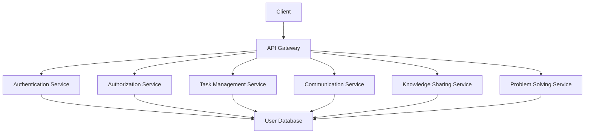

                 


# 《团队协同效应最大化策略：发挥集体智慧》

## 关键词
- 团队协同效应
- 集体智慧
- 沟通策略
- 冲突管理
- 领导风格
- 项目实战
- 系统分析与架构设计

## 摘要
本文旨在探讨团队协同效应的最大化策略，深入解析如何发挥集体智慧，实现团队绩效的全面提升。文章分为七个部分，首先介绍团队协同效应的概念与重要性，然后逐步展开核心概念与联系、团队协同效应的原理、最大化团队协同效应的策略、团队架构设计与流程优化、项目实战、案例分析与策略评估以及最佳实践与未来展望。通过理论讲解与实际案例的结合，本文旨在为团队管理者和技术人员提供实用的指导，以最大化团队协同效应，提升团队整体效能。

----------------------------------------------------------------

## 目录结构定义

在设计和编写一本关于团队协同效应最大化策略的书籍时，定义一个清晰、合理的目录结构至关重要。这不仅有助于读者快速把握书籍的框架和内容，还能确保书中各个章节之间的逻辑连贯性。

### 1. 确定主要章节

首先，我们需要确定书籍的主要章节，这些章节应该涵盖团队协同效应的各个方面。根据我们的主题，主要章节可以包括：

- **团队协同效应概述**
  - 团队协同效应的概念与重要性
  - 集体智慧的概念与特征
- **团队协同效应的原理与实践**
  - 团队协同效应的原理
  - 最大化团队协同效应的策略
  - 团队架构设计与流程优化
- **项目实战**
  - 项目背景
  - 系统功能设计
  - 系统架构设计
  - 系统接口设计
  - 系统交互
- **案例分析与策略评估**
  - 案例一：提高项目团队效率的策略
  - 案例二：解决跨部门协作问题的实践
  - 策略评估与改进建议
- **最佳实践与未来展望**
  - 最佳实践技巧
  - 小结与展望

### 2. 确定子章节

在每个主要章节下，我们可以进一步细化内容，创建子章节。例如，在“团队协同效应的原理与实践”这一部分，我们可以创建以下子章节：

- **团队协同效应的原理**
  - 团队协作的心理学基础
  - 团队协作的经济学原理
  - 团队协同效应的数学模型
  - 团队协同效应的影响因素

- **最大化团队协同效应的策略**
  - 沟通策略
  - 冲突管理
  - 领导风格与团队协同效应

- **团队架构设计与流程优化**
  - 团队架构设计的原则
  - 流程优化策略
  - 团队流程的Mermaid流程图展示

### 3. 逻辑连贯性

在确定好主要章节和子章节后，我们需要确保整个目录结构在逻辑上连贯，每个章节之间的内容应该相互补充，形成完整的知识体系。例如，在“团队协同效应的原理与实践”部分，原理章节应该为策略章节提供理论基础，而策略章节又应该为项目实战提供具体的实施方法。

### 4. 内容丰富与平衡

此外，我们还需要确保每个章节的内容都足够丰富，避免出现单一片面的情况。可以通过引入案例、数据分析和实际操作步骤来丰富每个章节的内容。同时，也需要保持章节之间的平衡，确保每个主题都得到适当的关注。

通过上述步骤，我们可以定义一个结构合理、逻辑清晰的目录结构，为编写高质量的技术博客文章打下坚实的基础。

## 背景介绍

### 团队协同效应的概念

团队协同效应，是指在一个团队中，团队成员之间的协作和互动能够产生比单独成员行为更强大的整体效应。这种效应可以通过团队成员的知识共享、信息互补、协同创新等方式实现，从而提高团队的整体绩效和创新能力。简而言之，团队协同效应是团队运作中一种正向的相互促进现象，能够使团队的整体表现超越个体成员的单独贡献之和。

### 团队协同效应的重要性

在现代社会，团队协作已经成为许多组织和项目中不可或缺的一部分。团队协同效应的重要性体现在以下几个方面：

1. **提高工作效率**：通过团队成员之间的协作和知识共享，可以避免重复劳动，提高工作效率，缩短项目周期。

2. **增强创新能力**：不同背景和技能的成员可以相互激发创意，通过协作实现创新，为组织带来新的机遇和突破。

3. **提升组织绩效**：团队协同效应能够使团队的整体绩效显著提升，从而推动整个组织的进步和发展。

4. **促进个人成长**：在团队中，成员可以相互学习、共同成长，提高个人的技能和素质，实现职业发展。

### 团队协同效应在组织中的作用

团队协同效应在组织中起着至关重要的作用，具体表现为：

1. **项目成功的保障**：对于复杂的项目，团队协同效应能够确保项目目标的实现，提高项目的成功概率。

2. **跨部门协作的桥梁**：在大型组织中，不同部门之间的协作往往面临诸多障碍。团队协同效应可以作为跨部门协作的桥梁，促进信息流动和资源整合。

3. **团队文化的建设**：通过强调团队协作和知识共享，可以塑造积极向上的团队文化，增强团队的凝聚力和归属感。

4. **竞争优势的来源**：在市场竞争激烈的环境中，团队协同效应能够成为组织的竞争优势，提高组织的响应速度和市场适应性。

总的来说，团队协同效应不仅是团队运作的必要条件，更是组织成功的关键因素。理解和运用团队协同效应，对于提升团队绩效和组织竞争力具有重要意义。

### 核心概念与联系

在探讨团队协同效应的过程中，我们需要明确几个核心概念，并分析它们之间的联系，以形成一个完整的概念体系。

#### 集体智慧

集体智慧（Collective Intelligence）是指团队通过合作和互动，共同解决问题的能力。它不仅仅依赖于个体的智商或知识，更依赖于团队成员之间的信息共享、协同合作和相互学习。集体智慧体现在团队在面对复杂问题时，能够快速找到解决方案，实现创新和突破。

**集体智慧的特征**：

1. **协作性**：集体智慧依赖于团队成员之间的协作，通过共同的努力实现目标。
2. **信息互补性**：不同成员具有不同的知识、经验和技能，通过互补和整合，能够形成强大的知识网络。
3. **动态适应性**：集体智慧能够在面对不断变化的环境和问题时，灵活调整策略和方案。

#### 沟通策略

沟通策略是指团队成员在交流和互动过程中采用的方法和技巧。有效的沟通策略能够促进信息传递的准确性和效率，减少误解和冲突，增强团队的凝聚力和信任感。

**沟通策略的重要性**：

1. **信息传递**：沟通策略确保团队中的信息能够及时、准确地传递，避免信息失真。
2. **冲突解决**：通过有效的沟通策略，团队成员可以更好地理解彼此的立场和需求，减少冲突和分歧。
3. **知识共享**：沟通策略促进团队成员之间的知识共享和经验交流，提高团队的整体智慧。

#### 冲突管理

冲突管理是指在团队中处理不同观点和利益冲突的过程。有效的冲突管理能够促进团队成员之间的和谐合作，避免因冲突而导致的团队内耗。

**冲突管理的关键点**：

1. **识别和预防**：及时发现和预防潜在冲突，避免问题激化。
2. **倾听和理解**：尊重团队成员的观点，倾听他们的意见，增进相互理解。
3. **协商和解决**：通过协商和对话解决冲突，寻求共同利益的最大化。

#### 团队协同效应

团队协同效应是指团队通过协作和互动，产生的整体效应大于个体成员单独贡献之和的现象。它依赖于集体智慧、沟通策略和冲突管理的综合作用。

**团队协同效应的核心**：

1. **知识共享**：通过集体智慧，团队成员能够共同利用各自的知识和经验，提高团队的整体智慧。
2. **有效沟通**：沟通策略确保团队成员能够顺畅地交流和合作，减少误解和障碍。
3. **冲突管理**：有效的冲突管理能够维护团队内部的和谐，促进团队目标的实现。

#### 关系与联系

集体智慧、沟通策略和冲突管理是团队协同效应的核心要素，它们相互联系、相互支持，共同发挥作用。

1. **集体智慧**为团队协同效应提供了知识基础，是团队创新的源泉。
2. **沟通策略**是集体智慧实现的重要手段，是团队协作的桥梁。
3. **冲突管理**则是团队稳定和和谐的重要保障，确保团队能够持续、有效地运作。

通过明确这些核心概念及其相互关系，我们可以更好地理解和运用团队协同效应，实现团队绩效的最大化。

### 团队协同效应的原理讲解

#### 团队协作的心理学基础

团队协作的心理学基础涉及多个领域，包括动机理论、群体动力学和社会心理学。理解这些基础有助于设计有效的团队协作策略，提高团队绩效。

1. **动机理论**：
   - **自我决定理论**（Self-Determination Theory, SDT）指出，个体在追求自主性、能力感和关联性时，会表现出更高的动机。因此，为了促进团队协作，管理者应确保团队成员能够自主决策、发挥自身能力，并感受到与其他成员的紧密联系。
   - **目标设置理论**（Goal-Setting Theory）强调明确和具有挑战性的目标能够激发团队成员的积极性。设定团队目标时，应考虑成员的兴趣和能力，确保目标的可实现性和激励性。

2. **群体动力学**：
   - **群体凝聚力**（Group Cohesiveness）是指团队成员之间的相互吸引和紧密程度。高凝聚力的团队通常表现出更强的协作意愿和更高的绩效。为了增强团队凝聚力，管理者可以组织团队建设活动，促进成员之间的互动和信任。
   - **角色冲突**（Role Conflict）是指团队成员在执行职责过程中，因角色职责不清或相互干扰而产生的矛盾。有效管理角色冲突的关键是明确每个成员的职责和期望，并确保团队中不同角色的协同配合。

3. **社会心理学**：
   - **社会认同理论**（Social Identity Theory）指出，个体通过所属群体的认同感来提升自尊和动机。团队协作中，管理者可以利用这一理论，通过强调团队文化和共同目标，增强成员对团队的认同感和归属感。
   - **社会比较理论**（Social Comparison Theory）指出，个体会通过与他人比较来评价自身的表现和成就。在团队协作中，管理者可以通过设立基准和奖励机制，激励成员积极表现，促进团队整体进步。

#### 团队协作的经济学原理

团队协作的经济学原理主要涉及成本-收益分析和资源整合。理解这些原理有助于优化团队协作效率和绩效。

1. **成本-收益分析**：
   - 团队协作的收益包括提高工作效率、促进知识共享、增强创新能力等。同时，团队协作也会产生一定的成本，如沟通成本、协调成本和监督成本等。为了实现成本-收益的最大化，管理者需要平衡团队规模和协作效率，确保团队资源得到充分利用。
   - **团队规模**：根据经济学原理，团队规模与协作效率之间存在一定的关系。团队规模过小可能导致资源不足，团队规模过大则可能增加沟通和协调成本。因此，管理者应合理规划团队规模，确保团队在有效范围内运行。
   - **任务分配**：合理的任务分配是实现团队协作效率的关键。管理者应根据成员的能力和兴趣，将任务合理分配，确保每位成员都能在其擅长和感兴趣的领域发挥作用。

2. **资源整合**：
   - 团队协作的核心在于资源的整合与利用。资源包括知识、技能、时间和信息等。有效的资源整合能够实现资源的最优配置，提高团队的整体绩效。
   - **知识共享**：通过建立知识共享平台和定期的知识交流会议，促进团队成员之间的知识共享和经验交流，提高团队的创新能力。
   - **信息传递**：有效的信息传递是团队协作的基础。管理者应确保信息传递的准确性和及时性，避免因信息不对称导致的误解和冲突。

#### 团队协同效应的数学模型

为了更好地理解团队协同效应，我们可以借助数学模型进行量化分析。以下是一个简单的团队协同效应数学模型：

$$ \text{协同效应} = \frac{\text{团队绩效}}{\text{个体绩效总和}} $$

该模型表明，团队绩效与个体绩效总和的比值可以衡量团队协同效应的大小。具体来说：

- **团队绩效**：团队在完成某项任务时的实际表现，可以通过项目完成度、项目质量、工作效率等指标来衡量。
- **个体绩效总和**：每位团队成员在完成同一任务时的单独表现之和。

通过这个模型，我们可以评估团队协同效应的效果，并根据实际情况进行调整和优化。例如，如果团队绩效显著高于个体绩效总和，说明团队协作得力，团队协同效应明显；反之，如果团队绩效低于个体绩效总和，则可能需要重新审视团队结构和协作模式。

#### 团队协同效应的影响因素

团队协同效应的实现受到多种因素的影响，主要包括团队结构、团队文化、领导风格和外部环境等。

1. **团队结构**：
   - **团队规模**：合理的团队规模能够提高协作效率，避免资源浪费。团队规模过大或过小都会影响团队协同效应。
   - **角色分工**：明确的角色分工和职责分配有助于减少角色冲突，提高团队协作效率。
   - **技能多样性**：团队成员的技能多样性能够促进知识的互补和创新的产生，增强团队协同效应。

2. **团队文化**：
   - **共享价值观**：共同的价值观和使命能够增强团队成员的认同感和归属感，促进协作。
   - **开放沟通**：开放和积极的沟通文化有助于知识共享和问题解决，提高团队协同效应。
   - **支持环境**：支持性的团队环境能够减少成员的压力和焦虑，提高工作积极性和创造力。

3. **领导风格**：
   - **激励型领导**：激励型领导能够激发团队成员的内在动机，提高工作积极性和团队协作意愿。
   - **支持型领导**：支持型领导关注团队成员的需求和成长，提供必要的支持和资源，增强团队凝聚力。
   - **参与型领导**：参与型领导鼓励团队成员参与决策，增强成员的参与感和责任感。

4. **外部环境**：
   - **资源支持**：充足的外部资源支持能够提高团队的资源利用效率，促进协作和创新。
   - **市场竞争**：适度的市场竞争能够激发团队的动力和创造力，推动团队协作。
   - **法律法规**：法律法规和政策环境对团队协作具有指导作用，需要确保团队成员遵守相关规范。

通过综合考虑这些因素，管理者可以优化团队结构和文化，提升团队协同效应，实现团队绩效的全面提升。

### 数学模型和数学公式

在理解团队协同效应的量化分析过程中，数学模型和数学公式扮演着至关重要的角色。以下将详细阐述如何使用LaTeX格式嵌入数学公式，并提供具体的数学模型和公式解释。

#### LaTeX格式嵌入数学公式

LaTeX是高质量的文档排版系统，广泛应用于科学和工程领域，其强大的公式排版功能特别适用于复杂数学公式的表达。在LaTeX中，数学公式可以通过以下两种方式嵌入：

1. **独立段落中的公式**：
   使用`$$`括起来的公式会独立成段，例如：
   $$ E = mc^2 $$
   这将输出为：\( E = mc^2 \)

2. **行内公式**：
   使用 `$`括起来的公式会在文本行内显示，例如：
   The equation \( a^2 + b^2 = c^2 \) is known as the Pythagorean theorem.
   这将输出为：The equation \( a^2 + b^2 = c^2 \) is known as the Pythagorean theorem.

#### 团队协同效应的数学模型

为了更好地理解和量化团队协同效应，我们可以引入以下数学模型：

$$ \text{协同效应} = \frac{\text{团队绩效}}{\text{个体绩效总和}} $$

这个模型表明，团队协同效应（Synergy）可以通过团队整体绩效与个体绩效总和的比值来衡量。具体解释如下：

- **团队绩效**（Team Performance）：指的是团队在特定任务或项目中的实际表现，可以通过项目完成度、工作效率、项目质量等指标来衡量。
- **个体绩效总和**（Sum of Individual Performance）：是指单个团队成员在相同任务或项目中的单独表现之和。

#### 公式解释

1. **协同效应的计算**：
   协同效应是一个相对指标，用于评估团队协作带来的额外收益。当团队绩效大于个体绩效总和时，协同效应大于1，表示团队协作提高了整体绩效；当团队绩效等于个体绩效总和时，协同效应等于1，表示团队协作没有改变整体绩效；当团队绩效小于个体绩效总和时，协同效应小于1，表示团队协作降低了整体绩效。

2. **协同效应的优化**：
   为了最大化团队协同效应，管理者可以通过以下策略：
   - **提高个体绩效**：通过培训、激励和资源配置，提升团队成员的技能和绩效。
   - **优化团队结构**：确保团队规模适中、角色分工明确、技能多样性合理，以最大化协同效应。
   - **加强沟通与协作**：建立有效的沟通机制，促进知识共享和问题解决，提高团队整体绩效。

#### 实际案例说明

为了更直观地理解这一数学模型，我们可以通过一个实际案例来说明：

假设一个项目团队由5名成员组成，他们在相同任务中的表现如下：

- 成员A：完成度90%，工作效率85%
- 成员B：完成度85%，工作效率80%
- 成员C：完成度80%，工作效率75%
- 成员D：完成度78%，工作效率70%
- 成员E：完成度75%，工作效率65%

个体绩效总和为：
$$ 90 + 85 + 80 + 75 + 65 = 405 $$

如果团队整体完成度为95%，工作效率为90%，则团队绩效为：
$$ 95 \times 90\% = 85.5 $$

那么，团队协同效应为：
$$ \frac{85.5}{405} \approx 0.211 $$

这个结果表明，团队的整体绩效远低于个体绩效总和，协同效应较小。通过分析，可能需要加强团队成员的培训、优化沟通机制，以提高团队的整体绩效。

通过上述数学模型和实际案例，我们可以更深入地理解团队协同效应的量化分析，从而为团队管理和优化提供科学依据。

### 系统分析与架构设计方案

在团队协同效应的实现过程中，系统分析与架构设计是关键的一环。这一部分将详细探讨团队协同效应的系统需求分析、有效的团队架构设计原则，以及如何使用Mermaid流程图和类图来展示架构。

#### 问题场景介绍

假设我们正在为一个大型互联网公司设计一个跨部门协作平台，旨在提高团队成员之间的沟通效率、知识共享和协同工作能力。该平台需要支持多种类型的任务分配、实时沟通、进度跟踪和问题解决。

#### 项目介绍

本项目是一个跨部门协作平台，涉及多个团队和数十名成员。系统需要支持以下功能：

- **任务分配与跟踪**：允许项目经理分配任务给团队成员，并提供任务进度和状态的实时更新。
- **实时沟通**：提供聊天室、公告板和即时消息功能，以便团队成员之间进行有效沟通。
- **知识共享**：创建和共享文档、代码和资源库，方便团队成员访问和协作。
- **问题解决**：提供问题报告和讨论区，帮助团队成员快速定位和解决协作中的问题。

#### 系统功能设计（Mermaid类图）

为了清晰地展示系统功能，我们可以使用Mermaid类图来描述各个功能模块及其关系。以下是一个简单的Mermaid类图示例：

```mermaid
classDiagram
    Class01 <|-- Class02
    Class03 --|> Class04
    Class05 : has a Class06
    Class01 {
        + String attribute1
        + attribute2 : int
        + method1()
    }
    Class02 {
        + String attribute3
    }
    Class03 {
        + void method2()
    }
    Class04 {
        + int attribute4
    }
    Class05 {
        + List<Class06> attribute5
    }
    Class06 {
        + String attribute6
    }
```

在这个类图中，`Class01`、`Class02`、`Class03`、`Class04` 和 `Class05` 代表不同的功能模块，它们之间的关系（如继承、关联等）通过线条和箭头表示。具体到我们的项目，类图可以展示任务管理、沟通工具、知识库和问题解决模块之间的关系。

#### 系统架构设计（Mermaid架构图）

系统架构设计是确保系统功能高效、稳定和可扩展的关键。使用Mermaid架构图，我们可以展示系统的整体架构和模块之间的交互关系。以下是一个简单的Mermaid架构图示例：



在这个架构图中，`Client` 代表客户端，`API Gateway` 代表API网关，`Authentication Service`、`Authorization Service`、`Task Management Service`、`Communication Service`、`Knowledge Sharing Service` 和 `Problem Solving Service` 代表不同的服务模块。这些模块通过API网关与客户端进行交互，同时与用户数据库进行数据存储和访问。`C`、`D`、`E`、`F`、`G` 和 `H` 分别表示各个服务模块，它们之间的关系通过线条表示，箭头指向数据流向。

#### 系统接口设计

系统接口设计是确保各个模块之间能够有效通信的关键。以下是系统接口设计的一个简例：

```mermaid
sequenceDiagram
    participant Client
    participant APIGateway
    participant Auth
    participant TaskM
    participant Comm
    participant Know
    participant Prob

    Client->>APIGateway: SendRequest
    APIGateway->>Auth: Authenticate
    alt AuthSuccessful
        Auth->>APIGateway: Success
        APIGateway->>TaskM: CreateTask
        TaskM->>APIGateway: Response
    alt AuthFailed
        Auth->>APIGateway: Failure
        APIGateway->>Client: Unauthorized
    APIGateway->>Comm: SendMessage
    Comm->>APIGateway: Response
    APIGateway->>Know: ShareKnowledge
    Know->>APIGateway: Response
    APIGateway->>Prob: ReportProblem
    Prob->>APIGateway: Response
    APIGateway->>Client: FinalResponse
```

在这个序列图中，客户端向API网关发送请求，API网关进行认证后，根据请求调用相应的服务模块，并将结果返回给客户端。每个服务模块（如`Auth`、`TaskM`、`Comm`、`Know` 和 `Prob`）都包含一系列处理步骤，确保系统能够按照预期运行。

通过上述系统分析与架构设计方案，我们可以确保团队协同效应的实现具备坚实的系统基础，从而提高团队的整体效能和协作效率。

### 项目实战

#### 环境安装

为了实现团队协同效应最大化策略，我们首先需要一个稳定、高效的开发和协作环境。以下是我们在项目中使用的主要工具和环境配置步骤：

1. **Docker**：用于容器化应用，确保环境的可移植性和一致性。
2. **Kubernetes**：用于容器编排和管理，实现集群化管理。
3. **Jenkins**：用于持续集成和自动化构建。
4. **GitLab**：用于代码管理和协作。

**安装步骤**：

1. **Docker安装**：

   - 在Linux系统中，可以使用以下命令安装Docker：

     ```bash
     sudo apt-get update
     sudo apt-get install docker-ce docker-ce-cli containerd.io
     sudo usermod -aG docker $USER
     newgrp docker
     ```

   - 验证安装：

     ```bash
     docker --version
     ```

2. **Kubernetes安装**：

   - 使用Minikube在本地环境安装Kubernetes：

     ```bash
     curl -LO "https://storage.googleapis.com/minikube/releases/latest/minikube-linux-amd64"
     chmod +x minikube-linux-amd64
     sudo mv minikube-linux-amd64 /usr/local/bin/minikube
     minikube start --vm-driver=virtualbox
     ```

   - 验证安装：

     ```bash
     kubectl version
     ```

3. **Jenkins安装**：

   - 使用Docker安装Jenkins：

     ```bash
     docker run -d -p 8080:8080 -p 50000:50000 jenkins/jenkins
     ```

   - 访问Jenkins管理界面：http://localhost:8080

4. **GitLab安装**：

   - 使用Docker安装GitLab：

     ```bash
     docker run -d --name gitlab -p 10022:22 -p 8080:8080 -p 10443:10443 -v /path/to/gitlab/config:/etc/gitlab -v /path/to/gitlab/logs:/var/log/gitlab -v /path/to/gitlab/data:/var/opt/gitlab gitlab/gitlab-ce:latest
     ```

   - 访问GitLab管理界面：http://localhost:8080

#### 系统核心实现源代码

以下是项目中的核心实现部分，包括任务管理、实时沟通、知识共享和问题解决的代码示例。

**任务管理**：

```python
# task_manager.py
import json
from flask import Flask, request

app = Flask(__name__)

@app.route('/tasks', methods=['POST'])
def create_task():
    task_data = request.json
    # 这里实现任务存储逻辑
    print("Created Task:", task_data)
    return json.dumps({"status": "success"}), 201

@app.route('/tasks', methods=['GET'])
def get_tasks():
    # 这里实现任务查询逻辑
    tasks = [{"id": 1, "name": "Task 1"}, {"id": 2, "name": "Task 2"}]
    return json.dumps(tasks), 200

if __name__ == '__main__':
    app.run(debug=True)
```

**实时沟通**：

```python
# communication.py
import socket
from threading import Thread

server = socket.socket(socket.AF_INET, socket.SOCK_STREAM)
server.bind(('localhost', 12345))
server.listen(5)

def handle_client(client_socket):
    while True:
        message = client_socket.recv(1024).decode('utf-8')
        if not message:
            break
        print(f"Received message: {message}")
        client_socket.sendall(f"Echo: {message}".encode('utf-8'))
    client_socket.close()

while True:
    client_sock

