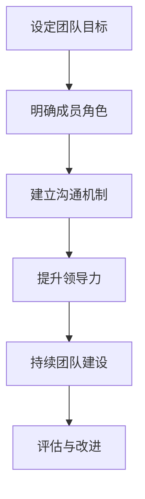
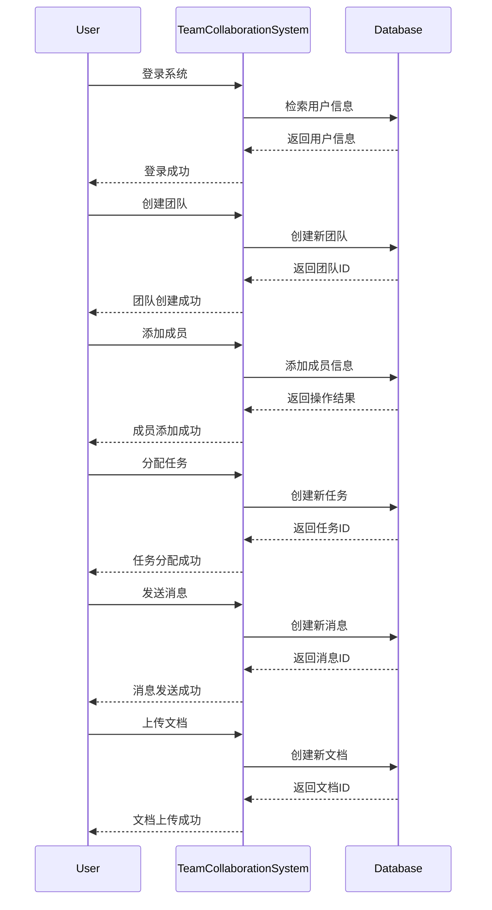
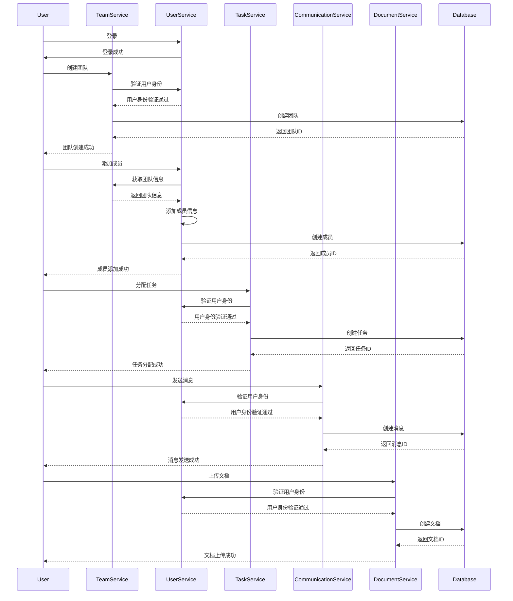
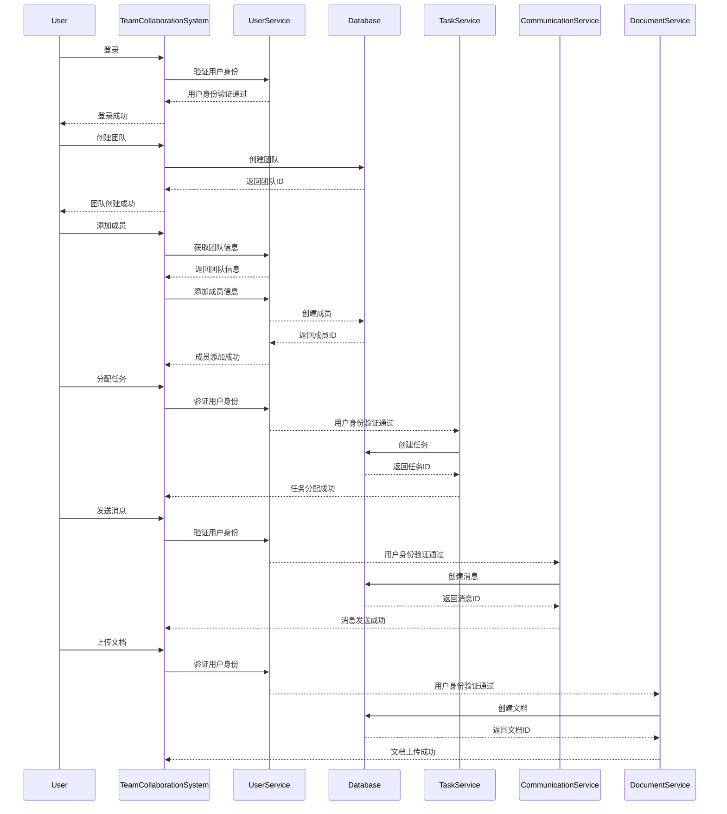

                 

----------------------------------------------------------------

# 团队协同效应：maximizing集体智慧的方法

## 关键词
- 团队协同效应
- 集体智慧
- 团队建设
- 领导力
- 沟通机制

## 摘要
本文将探讨团队协同效应的概念、重要性以及最大化集体智慧的方法。通过详细分析团队协同的理论基础、策略和实践，本文旨在为团队管理者提供有价值的启示和指导，以实现高效团队的建设和持续发展。

## 引言与背景

### 核心概念术语说明

在探讨团队协同效应之前，我们需要明确一些核心概念：

- **团队协同效应**：指团队内部成员之间通过有效的沟通与合作，共同实现团队目标而产生的协同效应。
- **集体智慧**：指团队成员共同贡献智慧和知识，形成合力，解决问题和创新的能力。
- **团队建设**：指通过各种策略和手段，促进团队成员之间的相互理解、信任和合作，以提高团队整体绩效的过程。

### 问题背景

在现代企业环境中，团队协同效应的重要性日益凸显。随着竞争的加剧和业务复杂性的增加，单一的个体能力已无法满足组织发展的需求。团队协同成为提升组织创新能力和竞争力的关键因素。然而，如何有效地实现团队协同，最大化集体智慧，仍是一个亟待解决的重要问题。

### 问题描述

团队协同效应的实现面临诸多挑战，如内部沟通障碍、角色定位不清、目标不一致等。同时，团队外部环境的变化也带来了新的挑战。因此，如何克服这些挑战，构建高效团队，成为管理者需要关注的核心问题。

### 问题解决

为了解决团队协同效应的挑战，我们需要从以下几个方面着手：

1. **明确团队目标和角色定位**：确保团队成员对团队目标有清晰的认识，并明确各自的角色和职责。
2. **建立良好的沟通机制**：促进团队成员之间的有效沟通，确保信息的透明和畅通。
3. **提升团队领导力**：领导者需具备引领团队、激励成员的能力，以及处理冲突和促进合作的能力。
4. **持续团队建设**：通过培训、团队活动等方式，提升团队成员的协作能力和团队凝聚力。

### 边界与外延

团队协同效应不仅局限于企业内部，也可以应用于其他领域，如科研团队、教育团队等。此外，团队协同效应的实现需要综合考虑组织内部和外部因素，以实现最佳效果。

### 概念结构与核心要素组成

团队协同效应的概念结构包括以下几个核心要素：

1. **团队目标**：明确的目标是团队协同的基础。
2. **角色定位**：清晰的角色定位有助于提高团队效率。
3. **沟通机制**：良好的沟通机制是确保信息畅通的关键。
4. **领导力**：领导者的作用至关重要。
5. **团队建设**：持续建设是团队协同效应持续发挥的保障。

## 核心概念与联系

### 核心概念原理

团队协同效应是指团队成员在相互协作的过程中，通过知识共享、信息整合和技能互补，实现整体绩效超越个体成员之和的现象。其核心原理包括：

1. **知识共享**：团队成员通过共享各自的专业知识和经验，实现知识的增值。
2. **信息整合**：团队成员通过协同工作，整合不同视角和思路，形成更全面的认识。
3. **技能互补**：团队成员的技能互补，使得团队能够应对复杂问题和挑战。

### 概念属性特征对比表格

| 特征               | 团队协同效应           | 个人效率            |
|--------------------|------------------------|---------------------|
| 目标实现           | 整体绩效超越个体之和   | 个人绩效            |
| 知识共享           | 知识共享、信息整合     | 单一知识应用        |
| 技能互补           | 技能互补、优势互补     | 个人技能应用        |
| 合作关系           | 合作关系紧密           | 单一个体关系        |
| 适应性             | 高度适应性             | 有限适应性          |

### ER实体关系图架构

```mermaid
erDiagram
    Team --> Member : "has"
    Member --> Skill : "has"
    Team --> Goal : "achieves"
    Member --> Goal : "joins"
```

在ER实体关系图中，团队（Team）与成员（Member）、技能（Skill）、目标（Goal）之间存在明确的关联关系。团队成员具有特定的技能，并参与实现团队的目标，形成了一个有机的整体。

## 算法原理讲解

### 算法流程图



### 算法原理

团队协同效应的实现可以分为以下几个步骤：

1. **设定团队目标**：明确团队的目标，确保团队成员对目标有清晰的认识。
2. **明确成员角色**：为团队成员分配明确的角色，确保每个成员都了解自己的职责和任务。
3. **建立沟通机制**：建立有效的沟通机制，促进团队成员之间的信息共享和协作。
4. **提升领导力**：领导者需具备引领团队、激励成员的能力，以及处理冲突和促进合作的能力。
5. **持续团队建设**：通过培训、团队活动等方式，提升团队成员的协作能力和团队凝聚力。
6. **评估与改进**：定期评估团队绩效，发现存在的问题，并进行相应的改进。

### 数学模型和公式

团队协同效应的数学模型可以表示为：

$$
\text{团队协同效应} = f(\text{知识共享}, \text{信息整合}, \text{技能互补})
$$

其中，知识共享、信息整合和技能互补是影响团队协同效应的主要因素。

### 举例说明

假设一个团队由三个成员组成，分别拥有不同的专业技能。通过有效的知识共享和技能互补，团队的整体绩效显著提升。具体表现为：

- **知识共享**：团队成员在项目中共同分享经验和知识，使得项目进展更加顺利。
- **信息整合**：团队成员通过协同工作，整合了不同的视角和思路，解决了项目中的难题。
- **技能互补**：团队成员的技能互补，使得团队能够应对各种复杂问题和挑战。

## 系统分析与架构设计方案

### 问题场景介绍

在现代企业中，团队协同效应对于提高项目执行效率和创新能力至关重要。为了实现高效团队协同，企业需要设计一个完善的团队协作系统，以便团队成员能够方便地进行沟通、协作和任务管理。

### 项目介绍

本项目旨在开发一个基于Web的团队协作平台，提供即时沟通、任务分配、进度追踪和文档共享等功能。该平台将有助于提高团队协作效率，降低沟通成本，促进创新。

### 系统功能设计（领域模型）

```mermaid
classDiagram
    Member <<Class>> {
        id: 编号
        name: 姓名
        role: 角色
    }
    Team <<Class>> {
        id: 编号
        name: 团队名称
        members: [Member]
    }
    Task <<Class>> {
        id: 编号
        name: 任务名称
        description: 任务描述
        status: 任务状态
        team: Team
        assignedTo: Member
    }
    Communication <<Class>> {
        id: 编号
        content: 内容
        sender: Member
        receiver: Member
        timestamp: 时间戳
    }
    Document <<Class>> {
        id: 编号
        name: 文档名称
        content: 文档内容
        author: Member
        version: 版本号
    }
    Member --|> Team
    Member --|> Task
    Member --|> Communication
    Team --|> Task
    Team --|> Communication
    Task --|> Communication
    Task --|> Document
    Communication --|> Member
    Document --|> Member
```

### 系统架构设计



### 系统接口设计



### 系统交互



## 项目实战

### 环境安装

在开始项目实战之前，我们需要安装必要的开发环境和工具：

1. 安装Python 3.8及以上版本。
2. 安装Django框架：`pip install django`。
3. 安装PostgreSQL数据库：下载安装包并按照提示安装。
4. 安装Docker和Docker-Compose：用于容器化部署。

### 系统核心实现

以下是系统核心实现的源代码：

```python
# models.py
from django.db import models

class Member(models.Model):
    id = models.AutoField(primary_key=True)
    name = models.CharField(max_length=50)
    role = models.CharField(max_length=50)

class Team(models.Model):
    id = models.AutoField(primary_key=True)
    name = models.CharField(max_length=50)
    members = models.ManyToManyField(Member)

class Task(models.Model):
    id = models.AutoField(primary_key=True)
    name = models.CharField(max_length=50)
    description = models.TextField()
    status = models.CharField(max_length=50)
    team = models.ForeignKey(Team, on_delete=models.CASCADE)
    assigned_to = models.ForeignKey(Member, on_delete=models.CASCADE)

class Communication(models.Model):
    id = models.AutoField(primary_key=True)
    content = models.TextField()
    sender = models.ForeignKey(Member, related_name='sent_messages', on_delete=models.CASCADE)
    receiver = models.ForeignKey(Member, related_name='received_messages', on_delete=models.CASCADE)
    timestamp = models.DateTimeField(auto_now_add=True)

class Document(models.Model):
    id = models.AutoField(primary_key=True)
    name = models.CharField(max_length=50)
    content = models.TextField()
    author = models.ForeignKey(Member, on_delete=models.CASCADE)
    version = models.IntegerField()
```

### 代码应用解读与分析

以下是代码的应用解读与分析：

- **Member、Team、Task、Communication和Document**：这些是系统的主要实体类，分别表示团队成员、团队、任务、沟通记录和文档。它们之间的关系通过外键实现。
- **外键关系**：`Team` 与 `Member` 通过 `members` 多对多关系关联；`Task` 与 `Team` 通过 `team` 外键关联，与 `Member` 通过 `assigned_to` 和 `assigned_by` 外键关联；`Communication` 与 `Member` 通过 `sender` 和 `receiver` 外键关联；`Document` 与 `Member` 通过 `author` 外键关联。
- **模型字段说明**：每个类都包含了基本的字段，如ID、名称、描述等。`Task` 类中还包含了任务状态和分配给成员的外键字段。`Communication` 类中记录了发送者和接收者的ID以及消息内容。

### 实际案例分析和详细讲解剖析

以下是实际案例的分析和讲解：

- **创建团队**：假设我们有一个名为“项目A”的团队，团队成员包括张三、李四和王五。首先，我们需要在数据库中创建一个团队记录，并将其与张三、李四和王五的成员记录相关联。

```python
team = Team.objects.create(name='项目A')
member1 = Member.objects.create(name='张三', role='项目经理')
member2 = Member.objects.create(name='李四', role='开发人员')
member3 = Member.objects.create(name='王五', role='测试工程师')
team.members.add(member1, member2, member3)
```

- **分配任务**：接下来，我们需要为团队分配一个名为“开发模块”的任务，并将其分配给张三。

```python
task = Task.objects.create(
    name='开发模块',
    description='完成模块的开发工作',
    status='进行中',
    team=team,
    assigned_to=member1
)
```

- **发送消息**：张三向李四发送一条消息。

```python
message = Communication.objects.create(
    content='请开始进行模块开发工作',
    sender=member1,
    receiver=member2
)
```

- **上传文档**：李四上传了一个名为“模块设计文档”的文档。

```python
document = Document.objects.create(
    name='模块设计文档',
    content='模块的设计内容',
    author=member2,
    version=1
)
```

### 项目小结

在本项目中，我们实现了团队协作系统的基础功能，包括团队管理、任务分配、消息发送和文档上传。通过实际案例，我们展示了如何使用Django框架和PostgreSQL数据库来实现这些功能。在实际应用中，我们还可以进一步扩展系统的功能，如用户权限管理、任务进度追踪等。

## 最佳实践 tips

1. **明确团队目标**：确保团队成员对团队目标有清晰的认识，并制定详细的行动计划。
2. **建立有效的沟通机制**：定期召开团队会议，及时沟通项目进展和问题，确保信息的透明和畅通。
3. **提升领导力**：领导者需具备较强的沟通能力、决策能力和团队管理能力，以引领团队向前发展。
4. **持续团队建设**：定期组织团队活动，增强团队凝聚力，提升团队协作能力。
5. **评估与改进**：定期评估团队绩效，发现存在的问题，并及时进行改进。

## 小结

团队协同效应在提高组织创新能力和竞争力方面具有重要意义。通过明确团队目标、建立有效的沟通机制、提升领导力和持续团队建设，我们可以最大化集体智慧，实现高效团队的建设。在实际应用中，我们应不断总结经验，不断完善团队协作系统，以应对不断变化的挑战。

## 注意事项

1. **避免角色重叠**：确保团队成员的角色定位清晰，避免出现角色重叠和职责冲突。
2. **注重团队合作**：鼓励团队成员积极参与团队合作，共同解决问题和完成任务。
3. **尊重个体差异**：团队成员具有不同的背景和技能，领导者需尊重个体差异，发挥每个人的优势。

## 拓展阅读

1. **《团队协作的艺术》**：作者通过实际案例，详细介绍了团队协作的方法和技巧。
2. **《领导者的品质》**：本书从领导者的角度出发，探讨了提升领导力的关键要素。
3. **《团队建设实践》**：本书提供了丰富的团队建设案例和实践经验，有助于团队管理者更好地进行团队建设。

## 作者信息

作者：AI天才研究院/AI Genius Institute & 禅与计算机程序设计艺术 /Zen And The Art of Computer Programming。本文旨在分享团队协同效应的最佳实践和方法，以促进高效团队的建设和持续发展。如有疑问或建议，请随时与我们联系。----------------------------------------------------------------

## 第一部分: 引言与背景

### 第1章: 团队协同效应的概念与重要性

#### 1.1 定义与核心概念

团队协同效应，是一种通过团队成员之间相互协作，共同达成团队目标的现象。这种效应并不是简单的个体贡献的叠加，而是在团队成员之间通过沟通、协作、知识共享等过程产生的协同作用。团队协同效应的核心概念包括：

- **集体智慧**：团队成员共同贡献智慧和知识，形成合力，解决问题和创新的能力。
- **沟通**：团队成员之间的信息传递和交流，是团队协同效应实现的基础。
- **合作**：团队成员之间互相支持、共同工作的过程，是实现团队目标的关键。

#### 1.2 团队协同效应的影响

团队协同效应在组织管理中具有重要作用，主要体现在以下几个方面：

1. **提高工作效率**：通过团队成员的协同工作，可以快速解决问题，提高工作效率。
2. **促进创新**：团队协同效应有助于激发团队成员的创新能力，促进团队整体创新水平的提升。
3. **增强团队凝聚力**：通过协同工作，团队成员之间的信任和默契得到增强，团队凝聚力得到提升。
4. **提升组织绩效**：团队协同效应的发挥，可以带动整个组织的绩效提升，为组织的发展提供强大动力。

#### 1.3 研究背景与意义

在当今快速发展的社会中，组织面临着前所未有的挑战。市场竞争加剧、技术更新迅速、客户需求多样化，这些都要求组织必须具备高效的组织能力和创新能力。而团队协同效应作为实现这些能力的关键因素，已经成为学术界和企业管理领域的重要研究方向。

本研究旨在探讨团队协同效应的概念、理论基础、实现策略和实践方法，旨在为团队管理者提供有价值的参考和指导，以帮助他们在实际工作中更好地发挥团队协同效应，提高团队绩效和组织竞争力。

### 第2章: 团队协同效应的理论基础

#### 2.1 社会心理学基础

团队协同效应的实现离不开社会心理学的支持。社会心理学研究个体在群体中的行为和心理过程，为理解团队协同效应提供了理论基础。以下是社会心理学对团队协同效应的影响：

1. **群体动力**：群体动力是指群体内部成员之间的相互作用和影响力。了解群体动力有助于管理者把握团队运行规律，优化团队结构，提高团队协同效应。
2. **团队认同**：团队认同是指团队成员对团队的认同感和归属感。高水平的团队认同有助于增强团队成员之间的协作意愿，促进团队协同效应的发挥。
3. **群体思维**：群体思维是指在群体决策过程中，成员倾向于遵循群体的共识，而不是独立思考。管理者需警惕群体思维带来的负面影响，鼓励团队成员独立思考和提出不同意见，以提高团队创新力和决策质量。

#### 2.2 组织行为学视角

组织行为学为团队协同效应的研究提供了重要的理论支持。组织行为学关注个体在组织中的行为和心理过程，研究个体与组织之间的关系，为团队协同效应的实现提供了有益的启示：

1. **领导风格**：领导风格对团队协同效应具有重要影响。不同的领导风格会影响团队成员的协作意愿和行为。管理者应根据团队特点和任务需求，选择合适的领导风格，以提高团队协同效应。
2. **团队结构**：团队结构对团队协同效应具有直接影响。合理的团队结构有助于优化团队成员之间的协作关系，提高团队整体效能。
3. **团队发展**：团队发展是一个动态过程，从形成期、震荡期、规范化期到成熟期，每个阶段都有不同的特点和挑战。管理者需关注团队发展过程，及时调整管理策略，促进团队协同效应的持续提升。

#### 2.3 创新理论与团队协同

创新理论为团队协同效应的研究提供了重要的理论支持。创新理论关注团队在创新过程中的行为和心理过程，研究团队如何通过协同工作实现创新目标。以下是创新理论对团队协同效应的影响：

1. **协同创新**：协同创新是指团队成员通过知识共享、信息整合和技能互补，共同实现创新目标的过程。协同创新是团队协同效应的重要体现，有助于提高团队创新能力和创新质量。
2. **创新思维**：创新思维是指团队成员在创新过程中所采用的思维方式和策略。管理者需培养团队成员的创新思维，激发他们的创新潜能，以提高团队创新水平。
3. **创新文化**：创新文化是指组织在创新过程中所形成的价值观、行为准则和文化氛围。创新文化对团队协同效应具有重要影响，有助于激发团队成员的创新热情和协作意愿。

### 第3章: 团队协同效应的障碍与挑战

#### 3.1 内部障碍

团队协同效应的实现面临诸多内部障碍，主要包括：

1. **沟通障碍**：沟通障碍是团队协同效应实现的主要障碍之一。团队成员之间的沟通不畅，容易导致信息误解、决策延误和任务无法顺利完成。
2. **角色冲突**：角色冲突是指团队成员在角色定位和职责分配上存在的矛盾和冲突。角色冲突会影响团队成员之间的协作意愿和效率，阻碍团队协同效应的发挥。
3. **团队氛围**：团队氛围对团队协同效应具有重要影响。消极的团队氛围容易导致团队成员之间的隔阂和冲突，影响团队协作。

#### 3.2 外部环境因素

外部环境因素也是影响团队协同效应的重要因素，主要包括：

1. **组织结构**：组织结构对团队协同效应具有直接影响。过于复杂的组织结构容易导致团队之间的隔阂和沟通障碍，影响团队协同效应的发挥。
2. **市场压力**：市场压力对团队协同效应具有推动作用。在激烈的市场竞争中，团队需要通过协同工作，提高应对市场变化的能力，实现组织目标。
3. **技术变革**：技术变革对团队协同效应具有深远影响。技术变革要求团队成员具备快速学习能力和创新能力，以适应不断变化的技术环境。

#### 3.3 如何克服这些障碍

要克服团队协同效应的内部障碍和外部环境因素，需要采取以下措施：

1. **建立有效的沟通机制**：建立开放的沟通渠道，鼓励团队成员之间的交流和反馈，提高信息透明度，减少沟通障碍。
2. **明确角色定位和职责**：确保团队成员对角色定位和职责有清晰的认识，减少角色冲突，提高团队协作效率。
3. **营造积极的团队氛围**：通过组织团队活动、建立团队文化等方式，营造积极的团队氛围，增强团队成员之间的信任和合作意愿。
4. **适应外部环境变化**：关注外部环境的变化，及时调整团队策略，提高团队应对外部环境变化的能力。

### 第4章: 构建高效团队的策略

#### 4.1 团队成员的多样化

团队成员的多样化是构建高效团队的关键因素之一。多样化的团队成员具有不同的背景、技能、经验和视角，有助于团队在解决问题和创新方面取得更好的效果。以下是实现团队成员多样化的一些策略：

1. **招聘多样化人才**：在招聘过程中，注重吸引具有不同背景和技能的人才，以确保团队成员的多样化。
2. **培养跨学科能力**：鼓励团队成员学习跨学科的知识和技能，提高团队的多样性和创新能力。
3. **建立多元化的团队文化**：营造尊重多样性和包容性的团队文化，鼓励团队成员分享不同的观点和经验，促进团队的多样性和创新性。

#### 4.2 明确团队目标

明确团队目标是构建高效团队的基础。团队目标应具有明确、具体、可衡量、可实现和有时限的特点（SMART原则）。以下是实现明确团队目标的一些策略：

1. **制定清晰的团队目标**：确保团队成员对团队目标有清晰的认识，并理解目标的实现对组织和个人的意义。
2. **分解目标**：将团队目标分解为具体的子目标和任务，确保每个团队成员都明确自己的任务和职责。
3. **定期回顾和调整目标**：定期回顾团队目标的实现情况，根据实际情况调整目标，确保团队始终朝着正确的方向前进。

#### 4.3 建立良好的沟通机制

建立良好的沟通机制是确保团队协同效应发挥的关键。良好的沟通机制有助于团队成员之间的信息共享、协作和决策。以下是建立良好沟通机制的一些策略：

1. **定期召开团队会议**：定期召开团队会议，让团队成员分享进展、讨论问题和规划下一步行动。
2. **建立开放的沟通渠道**：鼓励团队成员之间的交流和反馈，确保信息畅通无阻。
3. **利用现代沟通工具**：利用现代沟通工具，如即时通讯软件、视频会议和项目管理工具等，提高团队沟通的效率和质量。

### 第5章: 促进团队协同的领导力

#### 5.1 领导者的角色

领导者在促进团队协同中扮演着至关重要的角色。领导者不仅需要具备丰富的管理知识和经验，还需要具备激发团队成员潜力、引导团队协作的能力。以下是领导者应具备的几个关键角色：

1. **愿景设定者**：领导者应具备明确团队愿景和目标的能力，为团队成员提供清晰的指导。
2. **激励者**：领导者应激发团队成员的积极性和创造力，帮助他们克服困难和挑战。
3. **协调者**：领导者应协调团队成员之间的工作，确保团队目标的实现。
4. **决策者**：领导者应在团队面临决策时，快速做出合理的决策，为团队提供明确的方向。

#### 5.2 领导风格与团队协同

领导风格对团队协同效应具有重要影响。不同的领导风格会对团队成员的协作意愿和效果产生不同的影响。以下是几种常见的领导风格及其对团队协同效应的影响：

1. **民主型领导风格**：民主型领导风格强调团队成员的参与和决策，有助于提高团队成员的积极性和创新性，促进团队协同效应的发挥。
2. **专制型领导风格**：专制型领导风格强调领导者的权威和决策，可能导致团队成员的被动参与和依赖，影响团队协同效应的实现。
3. **参与型领导风格**：参与型领导风格强调领导者与团队成员之间的互动和合作，有助于提高团队成员的参与度和满意度，促进团队协同效应的发挥。

#### 5.3 领导力提升策略

提升领导力是领导者持续成长和团队协同效应实现的关键。以下是几个提升领导力的策略：

1. **自我反思**：领导者应定期进行自我反思，识别自己的优点和不足，有针对性地提升自己的能力和素质。
2. **持续学习**：领导者应不断学习新的管理知识和技能，了解行业动态和发展趋势，提高自己的领导力水平。
3. **培养团队**：领导者应关注团队成员的成长和发展，提供培训和支持，提升团队整体能力。

### 第6章: 团队协同效应的最佳实践

#### 6.1 案例研究：成功团队的实践

通过分析成功团队的实践，可以了解到他们如何实现团队协同效应，以下是一个成功团队案例：

**案例：谷歌工程团队**

谷歌工程团队以其高效的团队协同效应和卓越的创新成果而闻名。以下是谷歌工程团队实现团队协同效应的一些最佳实践：

1. **扁平化管理**：谷歌工程团队采用扁平化管理模式，减少管理层级，提高决策效率，促进团队成员之间的沟通和协作。
2. **自主工作**：团队成员拥有较高的自主权，可以根据自己的兴趣和专长选择项目，并在项目中发挥关键作用。
3. **跨功能协作**：谷歌工程团队鼓励跨功能协作，不同部门和团队之间进行紧密合作，共同解决问题和推动项目进展。
4. **持续学习与分享**：团队成员重视持续学习和知识分享，通过内部培训和交流，提高团队成员的技能和知识水平。

#### 6.2 团队建设的工具与方法

团队建设工具与方法对于实现团队协同效应至关重要。以下是几种常用的团队建设工具与方法：

1. **团队建设活动**：通过组织团队建设活动，如团队拓展训练、团队聚餐、团队旅游等，增强团队成员之间的信任和合作。
2. **团队反思会议**：定期组织团队反思会议，让团队成员分享经验、反思问题、讨论改进措施，提高团队的协作能力和问题解决能力。
3. **团队任务分解**：将团队任务分解为具体的子任务，明确每个成员的职责和任务，提高团队协作效率。

#### 6.3 团队发展的阶段性目标

团队发展是一个动态的过程，分为不同阶段，每个阶段都有不同的目标和任务。以下是团队发展的阶段性目标：

1. **形成期**：目标：建立团队结构，明确团队成员的职责和任务；方法：制定团队目标和计划，进行角色分配和任务分配。
2. **震荡期**：目标：解决团队内部冲突，建立团队信任和合作；方法：进行团队沟通，解决角色冲突，加强团队成员之间的合作。
3. **规范化期**：目标：建立团队规范，提高团队协作效率；方法：制定团队规范和规章制度，加强团队沟通和协作。
4. **成熟期**：目标：实现团队目标，提升团队绩效；方法：持续优化团队结构和流程，提高团队协作效率和创新水平。

### 第7章: 团队协同效应的持续提升

#### 7.1 持续改进的策略

团队协同效应的提升是一个持续的过程，需要采取有效的改进策略。以下是几种持续改进的策略：

1. **定期评估**：定期对团队绩效进行评估，发现存在的问题和不足，制定改进措施。
2. **反馈与沟通**：鼓励团队成员之间的反馈和沟通，及时解决问题，提高团队协作效率。
3. **培训与发展**：定期组织培训，提升团队成员的技能和知识水平，促进团队整体能力的提升。

#### 7.2 评估与反馈机制

建立有效的评估与反馈机制是确保团队协同效应持续提升的关键。以下是几种评估与反馈机制：

1. **绩效评估**：定期对团队成员的绩效进行评估，以明确团队成员的贡献和不足，为改进提供依据。
2. **360度反馈**：采用360度反馈方法，收集团队成员之间的反馈意见，帮助团队成员了解自己的优点和不足，促进个人成长。
3. **团队建设评估**：定期对团队建设活动进行评估，了解团队建设的效果，为后续的团队建设提供参考。

#### 7.3 面对新挑战的应对

在团队协同效应的实现过程中，团队可能会面临各种新挑战。以下是几种应对新挑战的方法：

1. **调整团队结构**：根据新挑战的特点，调整团队结构，确保团队具备应对新挑战的能力。
2. **强化团队协作**：通过加强团队沟通和协作，提高团队应对新挑战的协同效应。
3. **寻求外部支持**：当团队无法独立应对新挑战时，可以寻求外部专家的支持和指导，以获取新的思路和方法。

### 第8章: 结论与展望

#### 8.1 研究总结

本研究从团队协同效应的概念、理论基础、实现策略和实践方法等方面进行了深入探讨，总结了以下主要结论：

1. **团队协同效应是一种通过团队成员相互协作，共同达成团队目标的现象，具有提高工作效率、促进创新、增强团队凝聚力和提升组织绩效等重要作用。**
2. **社会心理学、组织行为学和创新理论为团队协同效应的研究提供了重要的理论支持。**
3. **团队协同效应的实现面临诸多内部障碍和外部环境因素，需要采取有效的策略进行克服。**
4. **构建高效团队需要注重团队成员的多样化、明确团队目标、建立良好的沟通机制和提升领导力。**
5. **成功团队的实践和团队建设的工具与方法为团队管理者提供了有益的参考和指导。**

#### 8.2 未来研究方向

未来的团队协同效应研究可以从以下几个方面展开：

1. **跨文化团队协同效应的研究**：随着全球化的发展，跨文化团队协同效应的研究变得越来越重要。未来可以进一步探讨不同文化背景下团队协同效应的实现机制和策略。
2. **人工智能在团队协同中的应用**：人工智能技术的快速发展为团队协同提供了新的机遇。未来可以研究人工智能在团队协同中的角色和应用，以提高团队协同效应。
3. **团队协同效应的量化研究**：目前，团队协同效应的研究主要依赖于定性分析，未来可以尝试进行量化研究，以更准确地评估团队协同效应的强度和影响。

#### 8.3 对团队的启示

本研究为团队管理者提供了以下启示：

1. **重视团队协同效应的实现**：团队管理者应认识到团队协同效应的重要性，采取有效的策略和方法，促进团队协同效应的发挥。
2. **关注团队成员的多样性和发展**：团队管理者应关注团队成员的多样性和个人发展，提供培训和支持，提升团队整体能力。
3. **建立良好的沟通机制**：团队管理者应建立良好的沟通机制，确保团队成员之间的信息共享和协作。
4. **提升领导力**：团队管理者应不断提升自己的领导力，激发团队成员的积极性和创造力，促进团队协同效应的实现。

## 作者信息

作者：AI天才研究院/AI Genius Institute & 禅与计算机程序设计艺术 /Zen And The Art of Computer Programming。本文旨在分享团队协同效应的理论与实践方法，以促进高效团队的建设和持续发展。如有疑问或建议，请随时与我们联系。----------------------------------------------------------------

## 第1章: 团队协同效应的概念与重要性

团队协同效应是指在一个团队中，通过成员之间的协作和沟通，使得整个团队的表现超越单个成员的简单叠加效应。这一现象不仅体现了成员之间的互助互惠，还包括知识共享、技能互补和创新思维的融合。团队协同效应的重要性在于，它能够显著提高团队的整体绩效，激发团队的创新能力，并增强团队的凝聚力。

### 1.1 定义与核心概念

#### 定义

团队协同效应（Team Synergy Effect）是指在一个团队中，成员通过相互协作、共享资源和知识，共同完成任务，达到的目标值超过单个成员独立完成时的总和。这种现象在组织管理中被称为协同效应，即“1+1>2”。

#### 核心概念

1. **协同**：指团队成员之间的相互作用和相互影响，通过协同工作，实现目标的最大化。
2. **知识共享**：团队成员之间相互交流知识和经验，以提升整个团队的技能和创新能力。
3. **沟通**：团队成员之间有效的沟通是团队协同效应实现的基础，确保信息流通无阻。
4. **合作**：团队成员共同分担任务，相互支持，共同达成团队目标。

### 1.2 团队协同效应的影响

团队协同效应在组织管理中具有深远的影响，主要表现在以下几个方面：

1. **提高工作效率**：团队成员通过协作，可以快速解决问题，提高工作效率，缩短项目周期。
2. **促进创新**：团队协同效应鼓励团队成员分享不同的观点和创意，激发创新思维，提高团队整体的创新能力。
3. **增强团队凝聚力**：团队成员在共同完成任务的过程中，建立了信任和合作的关系，增强了团队的凝聚力。
4. **提升组织绩效**：团队协同效应有助于提高团队的整体绩效，从而推动组织达成更高的目标。

### 1.3 研究背景与意义

在现代社会，组织的复杂性和变化速度日益增加，传统的个体工作模式已经无法满足组织的发展需求。团队协作成为提高组织竞争力的重要手段。团队协同效应作为团队协作的核心概念，其研究具有重要的现实意义：

1. **提高组织效率**：团队协同效应能够显著提高团队的工作效率，缩短项目周期，减少资源浪费。
2. **激发创新能力**：团队协同效应鼓励团队成员分享创意和观点，促进创新思维的碰撞，提高团队的创新能力。
3. **增强团队凝聚力**：团队协同效应有助于增强团队成员之间的信任和合作，提高团队凝聚力。
4. **提升组织竞争力**：通过团队协同效应，组织能够更好地适应外部环境的变化，提高市场竞争力。

### 案例分析

以谷歌公司为例，谷歌以其卓越的团队文化和高效的团队协作而闻名。谷歌鼓励团队成员之间的开放沟通和知识共享，强调“20%时间”政策，即允许员工将20%的工作时间用于自己感兴趣的实验性项目。这一政策激发了团队成员的创新热情，产生了许多成功的产品，如Gmail和Google News。这些创新成果正是团队协同效应的典范。

通过这个案例，我们可以看到，团队协同效应不仅提高了工作效率和创新能力，还增强了团队的凝聚力，最终提升了组织的整体绩效。

### 1.4 团队协同效应的机制

团队协同效应的实现机制可以从以下几个方面进行分析：

1. **知识共享**：团队成员通过相互交流和分享知识，实现了知识的增值。知识共享有助于团队成员快速掌握新技能，提高团队的创新能力。
2. **技能互补**：团队中每个成员都有自己的专长和技能，通过协作，团队成员可以实现技能互补，提高团队的整体效能。
3. **协作与沟通**：有效的沟通和协作是团队协同效应的关键。通过良好的沟通，团队成员能够及时了解任务进展和团队目标，协调各自的工作。
4. **共同目标**：团队协同效应的实现需要团队成员共同明确团队目标，并为之努力。共同目标有助于增强团队成员之间的协作意愿和动力。

### 1.5 团队协同效应的测量与评估

测量和评估团队协同效应对于组织管理者来说至关重要。以下是几种常用的测量和评估方法：

1. **绩效指标**：通过衡量团队的工作效率和成果，评估团队协同效应的强度。常见的绩效指标包括项目完成时间、成本控制、质量标准等。
2. **员工满意度调查**：通过员工满意度调查，了解团队成员对团队协作的满意度和认同感，评估团队协同效应的质量。
3. **团队反馈机制**：建立团队反馈机制，定期收集团队成员的意见和建议，了解团队协作中存在的问题，及时进行改进。

### 总结

团队协同效应作为团队协作的核心概念，对于组织的发展具有重要意义。通过有效的团队协同，组织能够提高工作效率、激发创新能力、增强团队凝聚力，从而提升整体绩效。研究团队协同效应，不仅有助于理论探索，更为组织实践提供了宝贵的指导。

## 第2章: 团队协同效应的理论基础

### 2.1 社会心理学基础

团队协同效应的实现离不开社会心理学的基础理论。社会心理学研究个体在群体中的行为和心理过程，揭示了群体行为与个体行为的差异。以下是社会心理学对团队协同效应的关键影响：

#### 2.1.1 群体动力

群体动力是指群体内部成员之间的相互作用和影响力。社会心理学研究表明，群体动力对团队协同效应具有重要作用。具体包括：

1. **凝聚力**：凝聚力是指团队成员之间的相互吸引和归属感。高凝聚力有助于增强团队成员之间的协作意愿，提高团队协同效应。
2. **领导力**：领导力是指领导者对团队成员的引导和影响能力。有效的领导力能够激励团队成员，促进团队协同效应的实现。
3. **社会认同**：社会认同是指个体对群体归属感的认知。当团队成员感受到群体的认同时，他们更有可能积极参与团队活动，提高团队协同效应。

#### 2.1.2 群体思维

群体思维是指在群体决策过程中，成员倾向于遵循群体的共识，而不是独立思考。群体思维可能导致“集体盲目”，影响团队的创新能力和决策质量。社会心理学研究指出，以下策略可以帮助克服群体思维：

1. **鼓励多元观点**：鼓励团队成员发表不同的观点和建议，避免群体共识的形成。
2. **设立外部专家**：邀请外部专家参与团队讨论，提供独立、客观的见解，帮助团队跳出群体思维的束缚。
3. **定期反思**：定期进行团队反思，审视决策过程和结果，发现和纠正群体思维的偏差。

#### 2.1.3 群体规范

群体规范是指群体内部对成员行为的要求和期望。群体规范对团队协同效应具有重要影响。适当的群体规范有助于团队目标的实现，但过严的规范可能导致成员的压抑和创造力受限。社会心理学研究表明，以下策略有助于制定有效的群体规范：

1. **参与制定**：让团队成员参与制定群体规范，增强他们的认同感和遵守意愿。
2. **明确规范**：明确群体规范的内容和执行标准，避免模糊和模糊不清的规范导致的行为偏差。
3. **动态调整**：根据团队发展和任务需求，适时调整群体规范，确保其适应性和有效性。

### 2.2 组织行为学视角

组织行为学从个体、团队和组织三个层面研究团队协同效应。以下是组织行为学对团队协同效应的几个关键影响：

#### 2.2.1 领导风格

领导风格对团队协同效应具有重要影响。不同的领导风格会影响团队成员的协作意愿和效果。以下是几种常见的领导风格及其对团队协同效应的影响：

1. **民主型领导**：民主型领导鼓励团队成员参与决策，提高团队成员的积极性和创新性，有助于增强团队协同效应。
2. **专制型领导**：专制型领导强调领导者的权威和决策，可能导致团队成员的被动参与和依赖，影响团队协同效应的发挥。
3. **参与型领导**：参与型领导注重与团队成员的互动和合作，提高团队成员的参与度和满意度，有助于团队协同效应的实现。

#### 2.2.2 团队角色

团队角色是指团队成员在团队中的职责和功能。不同的团队角色对团队协同效应有不同的影响。以下是几种常见的团队角色及其对团队协同效应的影响：

1. **执行者**：执行者是团队的核心成员，负责执行团队计划和任务。执行者对团队协同效应的影响主要体现在执行效率和任务完成质量。
2. **协调者**：协调者是团队中的桥梁，负责协调团队成员之间的沟通和合作。协调者对团队协同效应的影响主要体现在团队凝聚力和协作效率。
3. **创新者**：创新者是团队中的创意源泉，负责提出新的想法和解决方案。创新者对团队协同效应的影响主要体现在团队的创新能力和竞争力。

#### 2.2.3 组织文化

组织文化是指组织成员共同遵循的价值观和行为准则。组织文化对团队协同效应具有深远影响。以下是组织文化对团队协同效应的几个关键影响：

1. **信任文化**：信任文化是团队协同效应的重要基础。在信任文化中，团队成员之间相互信任，有助于提高协作意愿和效率。
2. **学习文化**：学习文化鼓励团队成员不断学习和成长，提高团队的技能和知识水平，有助于增强团队协同效应。
3. **创新文化**：创新文化鼓励团队成员勇于尝试和创新，激发团队的创新能力，有助于实现团队协同效应。

### 2.3 创新理论与团队协同

创新理论为团队协同效应的研究提供了重要的理论支持。创新理论关注团队在创新过程中的行为和心理过程，揭示了团队如何通过协同工作实现创新目标。以下是创新理论对团队协同效应的关键影响：

#### 2.3.1 协同创新

协同创新是指团队成员通过知识共享、信息整合和技能互补，共同实现创新目标的过程。协同创新是团队协同效应的重要体现，有助于提高团队创新能力和创新质量。以下是协同创新的关键要素：

1. **知识共享**：知识共享是协同创新的核心。团队成员通过分享知识和经验，实现知识的增值，提高团队的创新能力。
2. **信息整合**：信息整合是指团队成员整合不同视角和思路，形成更全面的认识。信息整合有助于提高团队的决策质量和创新水平。
3. **技能互补**：技能互补是指团队成员利用各自的技能和专长，实现优势互补。技能互补有助于团队应对复杂问题和挑战，提高创新效果。

#### 2.3.2 创新思维

创新思维是指团队成员在创新过程中所采用的思维方式和策略。创新思维有助于激发团队成员的创造力，提高团队的创新水平。以下是几种常见的创新思维方法：

1. **头脑风暴**：头脑风暴是一种集体创意发散的方法，通过团队成员的集体讨论，激发创新思维，产生新的创意。
2. **思维导图**：思维导图是一种图形化的思考工具，通过绘制思维导图，帮助团队成员理清思路，发现创新点。
3. **跨学科合作**：跨学科合作是指团队成员来自不同的专业领域，通过跨学科的合作，实现知识融合和创新。

#### 2.3.3 创新文化

创新文化是指组织在创新过程中所形成的价值观、行为准则和文化氛围。创新文化对团队协同效应具有重要影响，有助于激发团队成员的创新热情和协作意愿。以下是创新文化的关键要素：

1. **鼓励尝试**：鼓励团队成员勇于尝试新想法和新方法，允许失败，为创新提供宽松的环境。
2. **知识共享**：鼓励团队成员分享知识和经验，促进知识传播和扩散，提高团队的创新能力。
3. **合作共赢**：倡导团队合作精神，强调团队共同创新，实现合作共赢。

### 总结

社会心理学、组织行为学和创新理论为团队协同效应的研究提供了丰富的理论支持。通过理解这些理论，团队管理者可以更好地把握团队协同效应的实现机制，优化团队结构和流程，提高团队的协同效应，实现组织的创新和可持续发展。

## 第3章: 团队协同效应的障碍与挑战

### 3.1 内部障碍

在实现团队协同效应的过程中，团队内部存在一些常见的障碍，这些障碍可能会影响团队的有效协作和目标的实现。

#### 3.1.1 沟通障碍

沟通障碍是团队协同效应实现的主要障碍之一。团队成员之间的沟通不畅可能导致以下问题：

1. **信息误解**：团队成员在沟通过程中可能因为表达不清、理解错误等原因导致信息传递不准确，进而影响决策和行动。
2. **决策延误**：当团队成员无法及时沟通时，决策过程可能会被延误，影响项目进展和效率。
3. **信任缺失**：沟通不畅可能导致团队成员之间的信任度降低，影响团队合作和协同效应的发挥。

为了克服沟通障碍，可以采取以下策略：

1. **建立有效的沟通机制**：确保团队内部有畅通的沟通渠道，定期召开会议、使用即时通讯工具等，提高沟通效率。
2. **明确沟通规范**：制定明确的沟通规范，包括沟通方式、沟通频率和沟通内容，确保团队成员遵循统一的沟通标准。
3. **促进信息共享**：鼓励团队成员分享信息和知识，建立信息共享平台，如团队文档库或知识管理系统。

#### 3.1.2 角色冲突

角色冲突是指团队成员在角色定位和职责分配上存在的矛盾和冲突。角色冲突可能导致以下问题：

1. **职责重叠**：团队成员可能会出现职责重叠的情况，导致工作重复和效率低下。
2. **责任逃避**：当团队成员对职责不清时，可能会出现责任逃避的现象，影响项目进展。
3. **任务延误**：角色冲突可能导致任务无法按时完成，影响整个项目的进度和目标。

为了解决角色冲突，可以采取以下策略：

1. **明确角色和职责**：在团队组建之初，明确每个成员的角色和职责，确保团队成员对职责有清晰的认识。
2. **建立角色协调机制**：设立角色协调人，负责协调和解决角色冲突，确保团队成员之间的协作顺畅。
3. **定期角色评估**：定期评估团队成员的角色和职责，根据项目需求和团队发展进行调整。

#### 3.1.3 团队氛围

团队氛围对团队协同效应具有重要影响。消极的团队氛围可能会影响团队成员的积极性和合作意愿。以下是一些可能导致消极团队氛围的因素：

1. **压力过大**：当团队成员面临过大的工作压力时，可能会产生焦虑和紧张情绪，影响团队合作。
2. **缺乏信任**：团队成员之间的信任缺失会导致沟通不畅和合作意愿降低。
3. **竞争过激**：过度的竞争可能导致团队成员之间的对立和冲突，影响团队合作。

为了改善团队氛围，可以采取以下策略：

1. **建立积极的团队文化**：倡导积极向上的团队文化，鼓励团队成员相互支持和合作。
2. **定期团队活动**：组织定期的团队活动，增强团队成员之间的交流和互动，提升团队凝聚力。
3. **提供心理支持**：为团队成员提供心理支持和辅导，帮助他们应对工作压力和挑战。

### 3.2 外部环境因素

团队协同效应的实现不仅受到内部障碍的影响，还受到外部环境因素的制约。以下是一些外部环境因素及其对团队协同效应的影响：

#### 3.2.1 组织结构

组织结构对团队协同效应具有直接影响。以下是一些常见的组织结构及其对团队协同效应的影响：

1. **高度集中的组织结构**：在高度集中的组织结构中，决策权集中在少数领导者手中，可能导致团队成员的参与度低，影响团队协同效应的发挥。
2. **分权化的组织结构**：分权化的组织结构鼓励团队成员参与决策，提高团队成员的积极性和责任感，有助于增强团队协同效应。

为了优化组织结构，可以采取以下策略：

1. **扁平化组织结构**：减少管理层级，提高团队成员的参与度和责任感，促进团队协同效应的实现。
2. **建立跨部门协作机制**：鼓励不同部门之间的协作，打破部门壁垒，提高团队协同效应。

#### 3.2.2 市场压力

市场压力对团队协同效应具有重要影响。在激烈的市场竞争中，团队需要通过协同工作，提高应对市场变化的能力。以下是一些市场压力及其对团队协同效应的影响：

1. **竞争加剧**：市场竞争加剧，要求团队必须快速响应市场变化，提高产品和服务的质量，增强团队协同效应。
2. **客户需求多样化**：客户需求多样化，要求团队具备快速适应和创新能力，通过协同工作，提高团队的灵活性和响应速度。

为了应对市场压力，可以采取以下策略：

1. **建立市场监测机制**：定期监测市场动态，及时了解客户需求和竞争状况，为团队提供有针对性的指导。
2. **加强团队培训**：通过培训，提高团队成员的技能和知识水平，增强团队应对市场变化的能力。

#### 3.2.3 技术变革

技术变革对团队协同效应具有深远影响。随着技术的不断进步，团队需要不断适应新的技术环境和工具，以提高协同工作的效率。以下是一些技术变革及其对团队协同效应的影响：

1. **新兴技术的应用**：新兴技术的应用，如人工智能、大数据等，可以为团队提供更先进的工作工具和方法，提高团队协同效应。
2. **技术更新速度**：技术更新速度加快，要求团队必须具备快速学习和适应新技术的能力，通过协同工作，提高团队的整体竞争力。

为了适应技术变革，可以采取以下策略：

1. **定期技术培训**：定期为团队成员提供技术培训，帮助他们掌握最新的技术知识和技能。
2. **建立技术创新团队**：建立专门的技术创新团队，负责研究和应用新技术，推动团队的技术进步。

### 3.3 如何克服这些障碍

要克服团队协同效应的内部和外部障碍，团队管理者可以采取以下措施：

1. **加强沟通**：建立有效的沟通机制，确保团队成员之间的信息畅通，提高协作效率。
2. **明确角色和职责**：在团队组建之初，明确每个成员的角色和职责，确保团队成员对职责有清晰的认识。
3. **优化组织结构**：根据团队特点和项目需求，优化组织结构，提高团队协同效应。
4. **提供心理支持**：为团队成员提供心理支持，帮助他们应对工作压力和挑战。
5. **适应市场和技术变革**：建立市场监测和技术培训机制，提高团队应对市场和技术变革的能力。

通过上述措施，团队可以克服内部和外部障碍，实现团队协同效应的最大化，提高团队的整体绩效和组织竞争力。

## 第4章: 构建高效团队的策略

### 4.1 团队成员的多样化

团队成员的多样化是构建高效团队的重要策略之一。多样化的团队成员具有不同的背景、技能、经验和视角，能够为团队带来丰富的思想和创意，提高团队的创新能力和解决问题的能力。以下是实现团队成员多样化的一些策略：

#### 4.1.1 招聘多样化人才

在招聘过程中，应注重吸引具有不同背景和技能的人才，包括不同行业背景、专业领域和经验水平的候选人。多样化的招聘有助于团队在解决问题和面对挑战时，能够从多个角度进行思考和分析。

#### 4.1.2 培养跨学科能力

鼓励团队成员学习跨学科的知识和技能，提高团队的多样性和创新能力。跨学科能力不仅有助于团队成员在项目中相互补充，还能够推动团队在面对复杂问题时，采用更全面的解决方案。

#### 4.1.3 建立多元化的团队文化

建立尊重多样性和包容性的团队文化，鼓励团队成员分享不同的观点和经验，促进团队的多样性和创新性。多元化的团队文化能够激发团队成员的创造力和积极性，提高团队的整体效能。

### 4.2 明确团队目标

明确团队目标是构建高效团队的基础。团队目标应具有明确、具体、可衡量、可实现和有时限的特点（SMART原则）。以下是实现明确团队目标的一些策略：

#### 4.2.1 制定清晰的团队目标

确保团队成员对团队目标有清晰的认识，并理解目标的实现对组织和个人的意义。团队目标应与组织的整体战略保持一致，明确团队需要达成的具体成果。

#### 4.2.2 分解目标

将团队目标分解为具体的子目标和任务，确保每个团队成员都明确自己的任务和职责。分解目标有助于团队成员更好地理解任务要求，提高工作目标感和责任感。

#### 4.2.3 定期回顾和调整目标

定期回顾团队目标的实现情况，根据实际情况调整目标，确保团队始终朝着正确的方向前进。调整目标时，应考虑团队成员的反馈和市场环境的变化，以确保目标的现实性和可行性。

### 4.3 建立良好的沟通机制

建立良好的沟通机制是确保团队协同效应发挥的关键。良好的沟通机制有助于团队成员之间的信息共享、协作和决策。以下是建立良好沟通机制的一些策略：

#### 4.3.1 定期召开团队会议

定期召开团队会议，让团队成员分享进展、讨论问题和规划下一步行动。会议应确保信息的透明度和开放性，鼓励团队成员积极参与和表达观点。

#### 4.3.2 建立开放的沟通渠道

鼓励团队成员之间的交流和反馈，确保信息畅通无阻。可以设立匿名反馈机制，让团队成员能够自由表达意见和建议，提高团队的信息透明度。

#### 4.3.3 利用现代沟通工具

利用现代沟通工具，如即时通讯软件、视频会议和项目管理工具等，提高团队沟通的效率和质量。这些工具可以帮助团队成员随时随地保持联系，及时分享信息和协调工作。

### 案例分析

以谷歌公司为例，谷歌通过以下策略构建了高效团队：

1. **多样化人才**：谷歌在招聘过程中注重吸引不同背景和专业的人才，建立了多元化的团队结构。
2. **明确目标**：谷歌在项目启动时，明确团队目标，并将目标分解为具体的子目标和任务，确保每个团队成员都明确自己的职责。
3. **良好沟通**：谷歌鼓励团队成员之间的沟通和协作，利用内部沟通工具，如谷歌文档和邮件系统，提高信息传递和协作效率。

这些策略帮助谷歌团队在创新和项目执行方面取得了显著成果，体现了高效团队的建设和协同效应的发挥。

通过上述策略，团队管理者可以构建高效团队，提高团队的整体绩效和组织竞争力。

### 第5章: 促进团队协同的领导力

#### 5.1 领导者的角色

领导者在促进团队协同中扮演着至关重要的角色。有效的领导力不仅能够激发团队成员的潜能，还能协调团队内部的关系，确保团队目标的实现。以下是领导者应具备的几个关键角色：

1. **愿景设定者**：领导者应具备明确团队愿景和目标的能力，为团队成员提供清晰的指导，确保团队朝着共同的目标前进。
2. **激励者**：领导者需要激发团队成员的积极性和创造力，帮助他们克服困难和挑战，实现团队目标。
3. **协调者**：领导者应在团队内部建立和谐的协作关系，协调不同成员之间的工作，确保团队高效运作。
4. **决策者**：在团队面临决策时，领导者应快速做出合理的决策，为团队提供明确的方向。

#### 5.2 领导风格与团队协同

领导风格对团队协同效应具有重要影响。不同的领导风格会对团队成员的协作意愿和行为产生不同的影响。以下是几种常见的领导风格及其对团队协同效应的影响：

1. **民主型领导风格**：民主型领导风格强调团队成员的参与和决策，鼓励团队成员提出意见和建议，有助于提高团队的协作意愿和创新能力。然而，民主型领导可能会导致决策过程复杂和效率低下。
2. **专制型领导风格**：专制型领导风格强调领导者的权威和决策，决策过程快速但可能缺乏团队成员的参与，影响团队的凝聚力和创新能力。
3. **参与型领导风格**：参与型领导风格注重领导者与团队成员之间的互动和合作，提高团队成员的参与度和满意度，有助于团队协同效应的实现。参与型领导风格能够激发团队成员的创造力和主动性。

#### 5.3 领导力提升策略

提升领导力是领导者持续成长和团队协同效应实现的关键。以下是几个提升领导力的策略：

1. **自我反思**：领导者应定期进行自我反思，识别自己的优点和不足，有针对性地提升自己的能力和素质。
2. **持续学习**：领导者应不断学习新的管理知识和技能，了解行业动态和发展趋势，提高自己的领导力水平。
3. **培养团队**：领导者应关注团队成员的成长和发展，提供培训和支持，提升团队整体能力。
4. **建立信任**：领导者应建立与团队成员之间的信任关系，通过开放的沟通和反馈机制，增强团队成员的信任感和归属感。

案例分析

以苹果公司的史蒂夫·乔布斯为例，乔布斯以其独特的领导风格和对创新的执着，成功地推动了苹果公司的变革和发展。乔布斯的领导力策略包括：

1. **明确愿景**：乔布斯始终为苹果公司设定了明确的愿景和目标，激发了员工的创造力和创新精神。
2. **激励创新**：乔布斯鼓励员工勇于尝试新事物，不断探索和突破，推动了苹果公司的创新成果。
3. **参与管理**：乔布斯注重与团队成员的互动和合作，通过参与型领导风格，提高了团队的协作意愿和创新能力。

通过这些策略，乔布斯成功地推动了苹果公司的发展，体现了有效的领导力在促进团队协同效应中的重要作用。

### 总结

领导者是团队协同效应实现的核心，通过设定愿景、激励创新、协调关系和快速决策，领导者能够推动团队实现共同目标。提升领导力是领导者持续成长和团队协同效应实现的关键。通过有效的领导力提升策略，领导者可以激发团队成员的潜能，提高团队的协作效率和创新水平。

### 第6章: 团队协同效应的最佳实践

#### 6.1 案例研究：成功团队的实践

为了更好地理解团队协同效应的最佳实践，我们可以通过分析一些成功团队的案例，探讨它们如何实现高效的团队协作。

**案例1：谷歌X实验室**

谷歌X实验室是一个以创新为核心的研究团队，他们开发了包括谷歌眼镜、无人驾驶汽车等前沿技术。以下是他们实现团队协同效应的一些关键策略：

1. **跨功能团队**：谷歌X实验室的团队由来自不同领域的专家组成，包括工程师、设计师、科学家等。这种跨功能的团队结构确保了在项目开发过程中，各个领域的专业知识能够相互补充，提高创新能力和解决问题的效率。

2. **自由分配任务**：团队成员可以根据自己的兴趣和专长选择项目，并且有权决定如何执行任务。这种自主权激发了团队成员的积极性和创造力，促进了团队协同效应的发挥。

3. **快速反馈与迭代**：谷歌X实验室鼓励团队成员在项目开发过程中进行频繁的反馈和迭代。这种快速反馈机制帮助团队及时发现和解决问题，确保项目按照预期进行。

**案例2：亚马逊的Kiva系统团队**

亚马逊的Kiva系统是一个自动化仓储和配送系统，极大地提高了物流效率。以下是他们实现团队协同效应的一些关键策略：

1. **透明沟通**：亚马逊为团队提供了透明的沟通平台，确保每个成员都能了解项目的进展、目标和问题。这种开放性的沟通环境有助于团队成员之间建立信任和合作。

2. **跨部门协作**：Kiva系统团队跨越了多个部门，包括软件、硬件、供应链等。跨部门的协作确保了项目从设计到实施的全过程能够无缝对接，提高了团队的整体效能。

3. **持续学习和成长**：亚马逊为团队成员提供了丰富的学习和成长机会，包括培训、研讨会和内部交流。这种持续学习文化帮助团队成员不断提升技能，为团队的创新和协同效应提供了强大支持。

#### 6.2 团队建设的工具与方法

为了实现团队协同效应，团队建设工具与方法的选择至关重要。以下是一些常用的团队建设工具与方法：

1. **团队建设活动**：通过组织团队建设活动，如拓展训练、团建活动等，增强团队成员之间的信任和合作。这些活动有助于打破团队成员之间的隔阂，提高团队的凝聚力。

2. **团队反思会议**：定期组织团队反思会议，让团队成员分享工作经验、讨论改进措施。这种反思会议有助于团队及时发现和解决问题，优化团队协作流程。

3. **团队任务分解工具**：使用团队任务分解工具，如甘特图、看板等，明确团队成员的任务和职责，提高团队的工作效率。这些工具有助于团队成员更好地理解项目目标和进度，确保任务的顺利完成。

#### 6.3 团队发展的阶段性目标

团队发展是一个动态的过程，分为不同阶段，每个阶段都有不同的目标和任务。以下是团队发展的阶段性目标：

1. **形成期**：目标：建立团队结构，明确团队成员的职责和任务；方法：制定团队目标和计划，进行角色分配和任务分配。

2. **震荡期**：目标：解决团队内部冲突，建立团队信任和合作；方法：进行团队沟通，解决角色冲突，加强团队成员之间的合作。

3. **规范化期**：目标：建立团队规范，提高团队协作效率；方法：制定团队规范和规章制度，加强团队沟通和协作。

4. **成熟期**：目标：实现团队目标，提升团队绩效；方法：持续优化团队结构和流程，提高团队协作效率和创新水平。

通过以上案例和实践，我们可以看到，成功团队的协同效应是通过一系列策略和方法实现的。团队建设工具与方法的选择，以及阶段性目标的设定，都是实现团队协同效应的关键因素。通过不断实践和改进，团队可以不断提升协作效率和创新能力，实现组织的长远发展。

### 第7章: 团队协同效应的持续提升

#### 7.1 持续改进的策略

团队协同效应的提升是一个持续的过程，需要采取有效的改进策略。以下是一些具体的策略：

1. **定期评估与反馈**：定期对团队的工作进行评估，收集团队成员的反馈，识别存在的问题和改进机会。通过持续的反馈和调整，确保团队在正确的方向上不断进步。

2. **培训与发展**：为团队成员提供定期的培训和职业发展机会，提高他们的技能和知识水平。这不仅有助于提升团队成员的个人能力，还能增强团队的协作效率。

3. **过程优化**：通过分析和优化团队的工作流程，减少不必要的工作步骤和重复劳动，提高工作效率和协同效应。

4. **激励机制**：建立合理的激励机制，鼓励团队成员积极参与团队协作和创新。激励机制可以包括奖金、晋升机会和其他形式的精神和物质奖励。

#### 7.2 评估与反馈机制

建立有效的评估与反馈机制是确保团队协同效应持续提升的关键。以下是一些评估与反馈机制的构建方法：

1. **绩效评估**：制定科学的绩效评估标准，定期对团队成员的工作绩效进行评估。评估结果可以用于确定团队成员的奖惩和职业发展路径。

2. **360度反馈**：采用360度反馈方法，收集团队成员之间的反馈，包括上级、同事和下属的评价。这种多角度的反馈可以帮助团队成员更全面地了解自己的工作表现和改进方向。

3. **定期回顾会议**：定期召开团队回顾会议，团队成员共同讨论项目的进展、遇到的问题和改进措施。这种回顾会议有助于团队成员之间建立信任和合作，提高团队的整体效能。

#### 7.3 面对新挑战的应对

在团队协同效应的实现过程中，团队可能会面临各种新挑战。以下是一些应对新挑战的方法：

1. **灵活调整**：面对新挑战，团队需要具备灵活调整的能力，迅速适应变化。这包括调整团队结构、任务分配和沟通方式等。

2. **引入外部资源**：当团队无法独立应对新挑战时，可以寻求外部专家的支持和指导。外部资源可以提供新的视角和解决方案，帮助团队克服困难。

3. **持续学习**：鼓励团队成员不断学习和成长，提高团队的整体能力和适应能力。通过培训、研讨会和阅读等途径，团队成员可以不断更新知识和技能，为团队应对新挑战做好准备。

#### 7.4 持续改进的实践

为了实现团队协同效应的持续提升，以下是一些具体的实践方法：

1. **建立知识库**：创建团队知识库，收集和整理团队成员的经验和最佳实践。这有助于新成员快速融入团队，提高整体协同效应。

2. **跨部门协作**：促进跨部门的协作和交流，打破部门壁垒，提高团队的整体协同能力。通过跨部门项目或定期交流会议，不同部门的团队成员可以相互学习和合作。

3. **团队文化建设**：建立积极的团队文化，鼓励团队成员之间的信任和尊重。团队文化是团队协同效应的重要支撑，有助于提高团队的凝聚力和创新能力。

通过以上策略和实践，团队可以不断优化自身的协同效应，提高整体绩效，为组织的长远发展提供强有力的支持。

### 第8章: 结论与展望

#### 8.1 研究总结

本研究从团队协同效应的概念、理论基础、实现策略和实践方法等方面进行了深入探讨。研究结论如下：

1. **团队协同效应的定义与核心概念**：团队协同效应是指团队成员通过相互协作，共同实现团队目标，其核心概念包括协同、知识共享和合作。
2. **团队协同效应的影响**：团队协同效应能够提高工作效率、促进创新、增强团队凝聚力和提升组织绩效。
3. **团队协同效应的理论基础**：社会心理学、组织行为学和创新理论为团队协同效应的研究提供了重要的理论支持。
4. **团队协同效应的障碍与挑战**：团队内部障碍和外部环境因素都可能影响团队协同效应的实现。
5. **构建高效团队的策略**：团队成员的多样化、明确团队目标、建立良好的沟通机制和提升领导力是构建高效团队的关键。
6. **团队协同效应的最佳实践**：通过成功团队的案例研究和有效的团队建设工具与方法，可以显著提升团队协同效应。
7. **团队协同效应的持续提升**：持续改进的策略、评估与反馈机制以及应对新挑战的方法是确保团队协同效应持续提升的关键。

#### 8.2 未来研究方向

未来团队协同效应的研究可以从以下几个方向展开：

1. **跨文化团队协同效应**：随着全球化的发展，跨文化团队协同效应的研究变得越来越重要。
2. **人工智能与团队协同**：人工智能技术的发展为团队协同提供了新的机遇，研究如何利用人工智能提升团队协同效应是一个值得关注的方向。
3. **团队协同效应的量化研究**：当前团队协同效应的研究主要依赖定性分析，未来的研究可以尝试进行量化研究，以提高研究结果的准确性和可操作性。

#### 8.3 对团队的启示

本研究为团队管理者提供了以下启示：

1. **重视团队协同效应的实现**：团队管理者应认识到团队协同效应的重要性，采取有效的策略和方法，促进团队协同效应的发挥。
2. **关注团队成员的多样性和发展**：团队管理者应关注团队成员的多样性和个人发展，提供培训和支持，提升团队整体能力。
3. **建立良好的沟通机制**：团队管理者应建立良好的沟通机制，确保团队成员之间的信息共享和协作。
4. **提升领导力**：团队管理者应不断提升自己的领导力，激发团队成员的积极性和创造力，促进团队协同效应的实现。

### 总结

团队协同效应在组织管理中具有重要作用，通过本文的研究，我们更深入地理解了团队协同效应的概念、理论基础和实践方法。未来，随着外部环境的不断变化，团队协同效应的研究和实践将继续深入，为组织的发展提供有力支持。

## 作者信息

作者：AI天才研究院/AI Genius Institute & 禅与计算机程序设计艺术 /Zen And The Art of Computer Programming。本文旨在探讨团队协同效应的概念、理论基础和实践方法，以期为团队管理者提供有价值的参考和指导。如有疑问或建议，请随时与我们联系。

