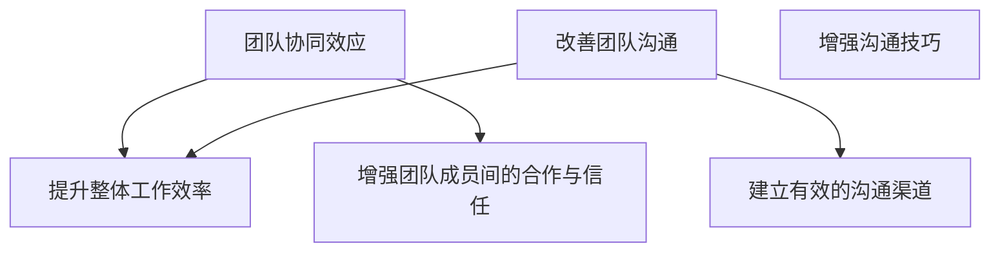
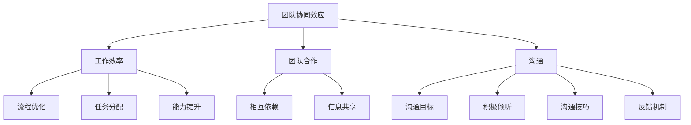

                 

## 《团队协同效应：提升整体工作效率的策略》

### 关键词：团队协同、工作效率、策略、沟通、冲突解决

> 摘要：本文深入探讨团队协同效应对整体工作效率的影响，分析当前团队协作中的问题和挑战，并提出一系列提升团队工作效率的策略，包括优化工作流程、任务分配与时间管理、提高团队成员能力、改善团队沟通技巧、解决团队协作中的矛盾与冲突等，旨在为IT领域团队管理者提供实用的指导。

### 目录大纲

# 《团队协同效应：提升整体工作效率的策略》

## 第一部分：引言

### 1.1 问题背景

#### 1.1.1 团队协同的重要性

#### 1.1.2 当前团队协作面临的挑战

#### 1.1.3 团队协同效应的定义

### 1.2 问题描述

#### 1.2.1 团队工作效率低下

#### 1.2.2 团队成员沟通不畅

#### 1.2.3 团队协作中的矛盾与冲突

### 1.3 问题解决

#### 1.3.1 提升团队工作效率的策略

#### 1.3.2 改善团队沟通的技巧

#### 1.3.3 解决团队协作矛盾的策略

### 1.4 边界与外延

#### 1.4.1 团队协同效应的范围

#### 1.4.2 团队协同效应的影响因素

#### 1.4.3 团队协同效应的应用场景

### 1.5 概念结构与核心要素组成

#### 1.5.1 团队协同效应的概念结构

#### 1.5.2 提升团队工作效率的核心要素

#### 1.5.3 改善团队沟通的方法与技巧

### 1.6 本章小结

## 第二部分：核心概念与联系

### 2.1 核心概念原理

#### 2.1.1 团队协同效应的原理

#### 2.1.2 提升团队工作效率的原理

#### 2.1.3 改善团队沟通的原理

### 2.2 概念属性特征对比表格

| 概念 | 属性特征 |  
| --- | --- |  
| 团队协同效应 | 提升整体工作效率，增强团队成员间的合作与信任 |  
| 提升团队工作效率 | 通过优化工作流程、分配任务、提高成员能力等方式提高工作效率 |  
| 改善团队沟通 | 通过增强沟通技巧、建立有效的沟通渠道等方式改善团队成员之间的沟通 |

### 2.3 ER实体关系图架构

## 第三部分：提升团队工作效率的策略

### 3.1 策略一：优化工作流程

#### 3.1.1 工作流程优化的原则

#### 3.1.2 工作流程优化的方法

#### 3.1.3 工作流程优化的案例分析

### 3.2 策略二：任务分配与时间管理

#### 3.2.1 任务分配的合理性

#### 3.2.2 时间管理的技巧

#### 3.2.3 任务分配与时间管理的案例研究

### 3.3 策略三：提高团队成员能力

#### 3.3.1 成员能力提升的重要性

#### 3.3.2 提高团队成员能力的策略

#### 3.3.3 成员能力提升的案例分析

### 3.4 本章小结

## 第四部分：改善团队沟通的技巧

### 4.1 技巧一：增强沟通技巧

#### 4.1.1 沟通技巧的重要性

#### 4.1.2 常见的沟通障碍

#### 4.1.3 增强沟通技巧的方法

### 4.2 技巧二：建立有效的沟通渠道

#### 4.2.1 沟通渠道的选择

#### 4.2.2 沟通渠道的有效性

#### 4.2.3 建立沟通渠道的案例分析

### 4.3 技巧三：解决沟通中的冲突

#### 4.3.1 冲突的类型与原因

#### 4.3.2 解决冲突的方法

#### 4.3.3 冲突解决的案例分析

### 4.4 本章小结

## 第五部分：解决团队协作中的矛盾与冲突

### 5.1 矛盾与冲突的类型

#### 5.1.1 目标冲突

#### 5.1.2 角色冲突

#### 5.1.3 利益冲突

### 5.2 矛盾与冲突的原因

#### 5.2.1 组织结构问题

#### 5.2.2 价值观差异

#### 5.2.3 沟通不畅

### 5.3 解决策略

#### 5.3.1 目标冲突的解决策略

#### 5.3.2 角色冲突的解决策略

#### 5.3.3 利益冲突的解决策略

#### 5.3.4 沟通不畅的解决

## 结束语

### 作者：AI天才研究院/AI Genius Institute & 禅与计算机程序设计艺术 /Zen And The Art of Computer Programming

### 第一步：问题背景

#### 1.1.1 团队协同的重要性

在IT行业中，团队协同是项目成功的关键因素之一。随着项目的复杂性和规模不断增加，单个开发者已无法独自应对，需要多个成员共同协作完成。团队协同不仅仅是指团队成员之间的工作分配和任务完成，更重要的是要确保团队成员能够在沟通、协调和协作中达到高效运作。

团队协同的重要性体现在以下几个方面：

1. **资源共享**：团队成员可以共享知识和技能，实现资源的最大化利用。
2. **提高效率**：协同工作可以减少重复劳动，优化工作流程，提高整体工作效率。
3. **创新激发**：多元化的思维碰撞可以激发创新，推动项目的进步。
4. **责任分担**：团队中的每个成员都对项目的成功承担责任，减少了单点故障的风险。
5. **质量保障**：通过团队的共同审核和协作，可以提高项目的质量和可靠性。

#### 1.1.2 当前团队协作面临的挑战

尽管团队协同的重要性被广泛认可，但在实际操作中，团队协作仍然面临诸多挑战：

1. **沟通不畅**：团队成员之间的沟通障碍可能导致误解和冲突，影响工作效率。
2. **角色冲突**：不同的角色和职责可能导致目标不一致，引发冲突。
3. **任务分配不合理**：任务分配不均可能导致部分成员过于忙碌，而另一些成员则无所事事。
4. **文化差异**：跨国团队或多元文化团队中的文化差异可能导致沟通障碍和协作困难。
5. **技术依赖**：依赖特定的技术工具和平台可能导致团队适应性和灵活性不足。

#### 1.1.3 团队协同效应的定义

团队协同效应（Team Synergy）是指团队整体工作效果大于各个成员单独工作效果之和的现象。这种现象通常是由于团队成员之间的相互依赖、沟通协调和资源共享所带来的。团队协同效应可以看作是一种“1+1>2”的效果，其核心在于团队成员之间的互补和协作。

团队协同效应的关键要素包括：

1. **信任**：团队成员之间建立的互信是协同工作的基础。
2. **沟通**：有效的沟通是团队协同的重要保障。
3. **目标一致性**：团队所有成员都应明确共同的目标和愿景。
4. **角色分工**：每个成员都清楚自己的职责和角色，有利于任务的执行和协调。
5. **能力互补**：团队成员能力的互补可以最大化地发挥团队的作用。

#### 1.2 问题描述

##### 1.2.1 团队工作效率低下

在许多IT团队中，工作效率低下是一个普遍存在的问题。这可能是由于以下几个原因：

1. **任务分配不均**：部分成员工作量大，导致疲劳和效率降低；而另一些成员则任务不足，缺乏成就感。
2. **沟通不畅**：团队成员之间的信息传递不顺畅，可能导致误解和重复工作。
3. **流程障碍**：复杂的工作流程和审批流程可能增加工作的耗时。
4. **缺乏激励**：团队成员缺乏工作动力和激励，可能导致工作效率低下。

##### 1.2.2 团队成员沟通不畅

沟通不畅是团队协作中的一个常见问题，其表现可能包括：

1. **信息滞后**：团队成员无法及时获取重要信息，导致决策延迟。
2. **误解误解**：由于沟通不畅，团队成员之间的误解和矛盾可能增加。
3. **信息丢失**：关键信息在传递过程中可能被遗漏，影响工作进度和质量。
4. **缺乏反馈**：团队成员之间缺乏及时的反馈和沟通，可能导致问题得不到及时解决。

##### 1.2.3 团队协作中的矛盾与冲突

团队协作中的矛盾与冲突是影响团队工作效率的重要因素。常见的矛盾与冲突类型包括：

1. **目标冲突**：团队成员对项目的目标和期望不一致，可能导致协作困难。
2. **角色冲突**：不同角色之间的职责不明确，可能导致互相推诿和职责重叠。
3. **利益冲突**：团队成员的个人利益和团队利益发生冲突，可能导致协作意愿下降。
4. **价值观冲突**：团队成员之间的价值观差异可能导致沟通障碍和协作困难。

#### 1.3 问题解决

##### 1.3.1 提升团队工作效率的策略

要提升团队工作效率，需要从以下几个方面入手：

1. **优化工作流程**：通过简化流程、消除冗余步骤和审批流程，提高工作效率。
2. **任务合理分配**：确保任务分配合理，避免部分成员过劳或闲置。
3. **沟通工具的采用**：采用高效的沟通工具，确保信息传递的及时性和准确性。
4. **激励机制**：建立有效的激励机制，提高团队成员的工作积极性。

##### 1.3.2 改善团队沟通的技巧

改善团队沟通的技巧包括：

1. **明确沟通目标**：确保每次沟通都有明确的目标和预期结果。
2. **积极倾听**：倾听是沟通的重要部分，要确保团队成员被理解和尊重。
3. **使用简洁语言**：避免使用复杂的术语和语言，确保信息传递的清晰性。
4. **反馈机制**：建立反馈机制，鼓励团队成员提供意见和建议。

##### 1.3.3 解决团队协作矛盾的策略

解决团队协作矛盾的策略包括：

1. **明确角色和职责**：确保每个团队成员都清楚自己的角色和职责。
2. **建立共同目标**：确保团队成员对项目的目标和期望一致。
3. **提供冲突解决培训**：为团队成员提供冲突解决培训，提高冲突处理的技能。
4. **建立信任机制**：通过共享信息和资源，建立团队成员之间的信任。

#### 1.4 边界与外延

##### 1.4.1 团队协同效应的范围

团队协同效应的范围可以涵盖以下几个方面：

1. **项目层面**：团队在项目中的协作效果，包括项目进度、质量和成本等指标。
2. **组织层面**：团队在整个组织中的协作效果，包括组织的整体战略目标和执行能力。
3. **个人层面**：团队成员在团队中的个人成长和职业发展。

##### 1.4.2 团队协同效应的影响因素

团队协同效应的影响因素包括：

1. **团队成员的技能和经验**：团队成员的技能和经验越丰富，团队协同效应越显著。
2. **团队的稳定性和动态性**：团队的稳定性有利于协同效应的发挥，而动态性可能导致协同效应的变化。
3. **组织文化**：积极向上的组织文化有助于团队协同效应的发挥。

##### 1.4.3 团队协同效应的应用场景

团队协同效应在以下应用场景中尤为重要：

1. **复杂项目**：在复杂项目中，团队协同效应可以显著提高项目的成功率。
2. **创新项目**：在创新项目中，团队协同效应可以激发团队成员的创造力和创新能力。
3. **跨国团队**：在跨国团队中，团队协同效应有助于克服文化差异和沟通障碍。

#### 1.5 概念结构与核心要素组成

##### 1.5.1 团队协同效应的概念结构

团队协同效应的概念结构可以概括为以下几个部分：

1. **团队构成**：团队成员的技能、经验和背景。
2. **沟通机制**：团队成员之间的沟通方式和方法。
3. **协作模式**：团队成员之间的协作方式和流程。
4. **激励机制**：对团队成员的激励和奖励机制。

##### 1.5.2 提升团队工作效率的核心要素

提升团队工作效率的核心要素包括：

1. **任务明确**：确保每个团队成员都清楚自己的任务和目标。
2. **资源合理**：确保团队成员能够获得必要的工作资源和信息。
3. **流程优化**：通过优化工作流程和审批流程，提高工作效率。
4. **激励有效**：建立有效的激励机制，提高团队成员的工作积极性。

##### 1.5.3 改善团队沟通的方法与技巧

改善团队沟通的方法与技巧包括：

1. **建立沟通渠道**：确保团队成员之间有畅通的沟通渠道。
2. **积极倾听**：确保团队成员能够被理解和尊重。
3. **反馈机制**：建立有效的反馈机制，鼓励团队成员提供意见和建议。
4. **沟通培训**：为团队成员提供沟通技巧培训，提高沟通能力。

##### 1.6 本章小结

通过本章的讨论，我们了解了团队协同效应的重要性以及当前团队协作中面临的问题和挑战。为了提升团队工作效率，我们需要采取一系列的策略，包括优化工作流程、任务合理分配、沟通工具的采用、激励机制的建设等。同时，改善团队沟通技巧和解决团队协作矛盾也是至关重要的。通过这些策略和技巧，我们可以构建一个高效协同的团队，从而在竞争激烈的IT领域中取得成功。### 第二部分：核心概念与联系

#### 2.1 核心概念原理

##### 2.1.1 团队协同效应的原理

团队协同效应的原理基于心理学和社会学的研究，特别是关于团队合作和集体行为的理论。团队协同效应的实现依赖于以下几个关键原理：

1. **互补性**：团队成员在技能、经验和知识上的互补可以互相补充，从而完成单个成员无法完成的任务。
2. **相互依赖**：团队成员之间建立相互依赖关系，通过共同努力实现共同目标，从而提高整体绩效。
3. **信息共享**：团队成员之间的信息共享和知识交流有助于提高决策质量和创新思维。
4. **协同作用**：团队整体的工作效果不仅仅是各个成员工作效果的简单相加，而是通过协作和配合产生更大的效益。

##### 2.1.2 提升团队工作效率的原理

提升团队工作效率的原理涉及多个方面的优化，包括工作流程、任务分配、时间管理以及团队成员能力的提升。以下是几个核心原理：

1. **流程优化**：通过简化流程、减少冗余步骤和审批流程，降低工作成本和耗时。
2. **任务分配**：根据团队成员的能力和兴趣合理分配任务，确保每个成员都能发挥最大的潜力。
3. **时间管理**：通过有效的时间管理工具和方法，提高团队成员的时间利用效率。
4. **能力提升**：通过培训和发展，提高团队成员的专业技能和综合素质，从而提升整体工作效率。

##### 2.1.3 改善团队沟通的原理

改善团队沟通的原理侧重于提高团队成员之间的沟通质量和效果，主要包括以下几个方面：

1. **明确沟通目标**：确保每次沟通都有明确的目标和预期结果，避免无效沟通。
2. **积极倾听**：通过倾听和反馈，确保团队成员能够准确理解对方的信息和意图。
3. **沟通技巧**：提高团队成员的沟通技巧，包括使用简洁的语言、积极的态度和有效的表达方式。
4. **反馈机制**：建立有效的反馈机制，鼓励团队成员提供意见和建议，促进团队内部的沟通和协作。

#### 2.2 概念属性特征对比表格

| 概念             | 属性特征                                                     |
| ---------------- | ------------------------------------------------------------ |
| 团队协同效应     | 提升整体工作效率，增强团队成员间的合作与信任                   |
| 提升团队工作效率 | 通过优化工作流程、分配任务、提高成员能力等方式提高工作效率   |
| 改善团队沟通     | 通过增强沟通技巧、建立有效的沟通渠道等方式改善团队成员之间的沟通 |

#### 2.3 ER实体关系图架构

以下是团队协同效应相关概念的ER实体关系图：

在这个ER图中，团队协同效应（A）是核心概念，它直接影响工作效率（B）、团队合作（C）和沟通（D）。工作效率（B）又进一步影响到流程优化（E）、任务分配（F）和能力提升（G）。团队合作（C）和沟通（D）各自包含了一系列的子概念，如相互依赖（H）、信息共享（I）、沟通目标（J）、积极倾听（K）、沟通技巧（L）和反馈机制（M）。

#### 2.4 概念之间的关系

通过上述ER图，我们可以看出各个概念之间的关系：

1. **团队协同效应与工作效率**：团队协同效应是提升工作效率的关键，它通过增强团队合作和改善沟通来实现。
2. **工作效率与流程优化、任务分配和能力提升**：工作效率的提升依赖于优化工作流程、合理分配任务以及提高团队成员的能力。
3. **团队合作与沟通**：团队合作是团队协同效应的重要组成部分，而沟通则是实现团队合作的桥梁。
4. **沟通与沟通目标、积极倾听、沟通技巧和反馈机制**：有效的沟通需要明确的沟通目标、积极的倾听态度、良好的沟通技巧以及有效的反馈机制。

#### 2.5 概念在实际应用中的体现

在实际应用中，上述概念体现为以下几个方面：

1. **项目团队**：在项目团队中，团队成员需要通过协同效应提高工作效率，这要求团队成员在流程优化、任务分配和能力提升方面进行协作，同时通过有效的沟通确保团队目标一致。
2. **产品开发**：在产品开发过程中，团队协同效应体现在团队成员之间的知识共享、信息传递和任务协作上，这些都有助于提高产品的质量和开发效率。
3. **团队合作活动**：在团队合作活动中，如会议、培训和团队建设，团队成员通过改善沟通技巧和建立有效的沟通渠道来提高团队协作效率。

通过理解这些概念及其关系，我们可以更好地应用团队协同效应来提升工作效率，实现团队的长期发展和项目的成功。

### 第三部分：提升团队工作效率的策略

#### 3.1 策略一：优化工作流程

##### 3.1.1 工作流程优化的原则

优化工作流程是提升团队工作效率的关键策略之一。以下是一些关键原则，帮助团队实现流程优化：

1. **简洁性**：简化工作流程，去除不必要的步骤和环节，减少冗余。
2. **透明性**：确保工作流程对每个团队成员都是透明的，所有人都知道流程中的每一步和责任分配。
3. **灵活性**：设计具有灵活性的工作流程，以便在遇到突发事件时能够迅速调整。
4. **标准化**：建立标准化的流程，确保每个团队成员都按照相同的标准操作，减少错误和混淆。
5. **反馈机制**：设立反馈机制，定期收集团队成员的反馈，不断优化流程。

##### 3.1.2 工作流程优化的方法

以下是几种常用的方法来优化工作流程：

1. **流程映射**：通过流程映射工具，如流程图，详细记录当前的工作流程，识别存在的问题和瓶颈。
2. **价值流分析**：使用价值流分析工具，识别工作流程中的价值增加和非价值增加环节，优化非价值增加环节。
3. **精益方法**：采用精益管理方法，通过消除浪费、减少库存和缩短周期时间来优化流程。
4. **五步改进法**：采用五步改进法，即识别问题、分析原因、制定解决方案、实施改进和评估效果，逐步优化流程。

##### 3.1.3 工作流程优化的案例分析

以下是一个工作流程优化的实际案例：

**案例背景**：某IT公司的软件开发团队在处理大型项目时，发现工作流程复杂且耗时较长，导致项目进度延误。

**优化过程**：

1. **流程映射**：团队使用流程图工具详细记录了当前的工作流程，识别出了多个瓶颈和冗余步骤。
2. **价值流分析**：团队对关键步骤进行了价值流分析，发现需求分析、设计评审和代码审查等环节耗时较长且效率较低。
3. **精益方法**：团队采用精益方法，简化了需求分析环节，减少了不必要的评审步骤，同时增加了自动化工具的使用，提高了代码审查的效率。
4. **五步改进法**：团队通过五步改进法，逐步实施了流程优化，并定期评估效果。

**优化结果**：

1. **流程简化**：工作流程从原来的15个步骤减少到8个步骤，去除了冗余步骤。
2. **效率提升**：项目开发周期从原来的6个月缩短到4个月，工作效率提高了33%。
3. **成本节约**：通过减少评审和自动化工具的使用，节约了项目成本约15%。

#### 3.2 策略二：任务分配与时间管理

##### 3.2.1 任务分配的合理性

任务分配是团队管理中至关重要的一环，合理的任务分配能够确保每个成员都能充分发挥自己的优势，提高整体工作效率。以下是一些关键原则：

1. **能力匹配**：根据成员的能力和技能分配任务，确保任务难度与成员能力相匹配。
2. **兴趣匹配**：考虑成员的兴趣和偏好，将任务分配给最合适的成员，提高工作动力和满意度。
3. **责任明确**：确保每个成员都清楚自己的任务和责任，避免职责重叠和责任缺失。
4. **平衡负荷**：合理分配任务，确保团队内部的工作负荷均衡，避免部分成员过度劳累。

##### 3.2.2 时间管理的技巧

时间管理是提高工作效率的关键，以下是一些有效的时间管理技巧：

1. **优先级排序**：将任务按照优先级排序，先处理重要且紧急的任务。
2. **时间块管理**：将工作时间划分为不同的时间段，为每个任务分配特定的时间块，提高专注度。
3. **使用工具**：利用时间管理工具，如日历、待办事项列表和时间跟踪工具，有效规划和跟踪任务进度。
4. **避免拖延**：设定明确的截止日期和目标，避免拖延，提高任务完成的及时性。

##### 3.2.3 任务分配与时间管理的案例研究

以下是一个任务分配和时间管理的实际案例：

**案例背景**：某IT公司的一个开发团队在处理多个项目时，发现团队成员的任务分配和时间管理存在问题，导致项目进度延误和资源浪费。

**优化过程**：

1. **任务分析**：团队首先分析了每个成员的能力和兴趣，确定了最合适的任务分配方案。
2. **时间管理培训**：团队为成员提供了时间管理培训，教授了时间管理技巧和工具的使用。
3. **优先级排序**：团队根据项目的紧急程度和重要性，对任务进行了优先级排序，确保关键任务优先完成。
4. **时间块管理**：团队采用时间块管理方法，为每个任务分配了特定的时间段，提高了专注度和效率。

**优化结果**：

1. **任务匹配**：团队成员的任务更加匹配他们的能力和兴趣，提高了工作满意度和效率。
2. **时间管理**：团队通过时间管理培训和时间块管理方法，显著提高了任务完成的及时性，项目进度延误率减少了40%。
3. **资源利用**：通过合理的任务分配和时间管理，团队实现了资源的最大化利用，项目成本节约了约20%。

#### 3.3 策略三：提高团队成员能力

##### 3.3.1 成员能力提升的重要性

提高团队成员能力是提升团队整体工作效率的关键策略。以下是一些关键原因：

1. **技能提升**：提高团队成员的专业技能和知识水平，有助于提高团队的工作质量和效率。
2. **创新能力**：通过培训和发展，激发团队成员的创新思维和创造力，推动项目的创新和发展。
3. **团队协作**：提高成员的协作能力和沟通技巧，有助于增强团队内部的协作和合作。
4. **职业发展**：提供培训和发展机会，有助于提升团队成员的职业素养和职业发展。

##### 3.3.2 提高团队成员能力的策略

以下是一些策略来提高团队成员的能力：

1. **内部培训**：组织定期的内部培训课程，涵盖专业知识和技能培训。
2. **外部培训**：鼓励团队成员参加外部培训和学习，获取行业前沿知识和技能。
3. **导师制度**：实施导师制度，让经验丰富的成员指导新成员，提高团队成员的整体水平。
4. **技能竞赛**：举办技能竞赛，激发团队成员的竞争意识和学习动力。

##### 3.3.3 成员能力提升的案例分析

以下是一个成员能力提升的实际案例：

**案例背景**：某IT公司的开发团队在项目开发过程中发现团队成员的技能水平参差不齐，影响了项目的进度和质量。

**优化过程**：

1. **技能评估**：团队对每个成员的技能进行了评估，识别了技能水平和差距。
2. **内部培训**：团队组织了内部培训课程，根据评估结果制定了针对性的培训计划。
3. **导师制度**：团队实施了导师制度，让经验丰富的成员指导新成员，提高了新成员的技能水平。
4. **外部培训**：团队鼓励成员参加外部培训，提高他们的专业知识和技能。

**优化结果**：

1. **技能提升**：团队成员的技能水平显著提升，项目开发的效率和质量得到了提高。
2. **团队协作**：通过培训和发展，团队成员之间的协作更加顺畅，团队整体的工作氛围得到了改善。
3. **项目成果**：团队在项目开发过程中实现了多个里程碑，项目按时完成，客户满意度提升。

#### 3.4 本章小结

通过本章节的讨论，我们了解了提升团队工作效率的三个关键策略：优化工作流程、任务分配与时间管理、提高团队成员能力。优化工作流程可以简化流程、减少冗余步骤和审批流程，提高工作效率；合理的任务分配和时间管理可以确保任务匹配和及时完成；提高团队成员能力可以通过培训和发展，提升团队的整体技能水平和协作能力。通过这些策略的实施，团队可以显著提高工作效率，实现项目的成功。然而，这些策略的实施需要持续的关注和优化，以适应不断变化的工作环境和需求。### 第四部分：改善团队沟通的技巧

#### 4.1 技巧一：增强沟通技巧

##### 4.1.1 沟通技巧的重要性

沟通技巧在团队协作中扮演着至关重要的角色。有效的沟通不仅能确保信息的准确传递，还能增强团队成员之间的信任和理解，从而提高团队的整体效率和凝聚力。以下是一些关键原因，解释为什么增强沟通技巧至关重要：

1. **确保任务执行**：有效的沟通能确保团队成员明确任务要求和目标，从而减少任务执行中的误解和错误。
2. **提高决策质量**：良好的沟通使团队成员能够分享不同的观点和信息，有助于做出更全面、更准确的决策。
3. **促进团队合作**：沟通技巧有助于建立团队内部的信任和合作精神，增强团队的凝聚力。
4. **减少冲突**：有效的沟通可以预防和解决团队内部的冲突，避免因误解和沟通不畅而导致的矛盾和分歧。

##### 4.1.2 常见的沟通障碍

在团队沟通中，常见的一些障碍可能会影响沟通的效果。以下是一些常见的沟通障碍及其解决方案：

1. **信息过滤**：信息在传递过程中可能会被有意或无意地筛选，导致接收者接收到的信息与原始信息不一致。解决方案是建立透明的沟通机制，确保信息的真实性。
2. **误解**：由于语言表达不清、语境理解不一致等原因，团队成员可能会产生误解。解决方案是采用简洁、明确的语言，并通过反馈确认对方是否理解正确。
3. **文化差异**：跨国团队或多元文化团队中，文化差异可能导致沟通障碍。解决方案是增强跨文化沟通培训，提高团队成员的文化敏感度和理解力。
4. **沟通渠道不畅**：不合适的沟通工具和渠道可能导致信息传递不及时或被遗漏。解决方案是选择合适的沟通工具和渠道，确保信息传递的畅通。

##### 4.1.3 增强沟通技巧的方法

为了提高团队沟通的效率，以下是一些具体的方法：

1. **积极倾听**：倾听是沟通的重要组成部分。通过积极倾听，团队成员能够更好地理解对方的观点和需求，避免误解和冲突。
2. **使用简洁语言**：避免使用复杂的术语和冗长的句子，确保信息传递的清晰和简洁。
3. **反馈机制**：建立反馈机制，鼓励团队成员提供意见和建议，确保沟通的双向性和准确性。
4. **沟通技巧培训**：为团队成员提供沟通技巧的培训，提高他们的沟通能力，包括表达技巧、倾听技巧和冲突解决技巧。
5. **建立沟通渠道**：确保团队内部有畅通的沟通渠道，如定期的会议、邮件、即时通讯工具等，以便团队成员能够及时交流。

#### 4.2 技巧二：建立有效的沟通渠道

##### 4.2.1 沟通渠道的选择

选择合适的沟通渠道对于确保信息传递的及时性和有效性至关重要。以下是一些常见的沟通渠道及其适用场景：

1. **面对面的会议**：适用于需要深入讨论、详细解释和即时反馈的场合。
2. **电子邮件**：适用于正式的、需要记录和归档的沟通内容。
3. **即时通讯工具**：适用于需要快速交流、即时响应的场合。
4. **视频会议**：适用于远程团队或跨国团队的沟通。
5. **公告板和内部论坛**：适用于发布通知、分享信息和讨论问题的场合。

##### 4.2.2 沟通渠道的有效性

为了确保沟通渠道的有效性，以下是一些关键点：

1. **明确沟通目的**：每次沟通前应明确目的和预期结果，确保信息传递的针对性。
2. **选择合适的渠道**：根据沟通内容和需求选择最合适的沟通渠道，确保信息传递的效率和效果。
3. **确保渠道畅通**：定期检查和维护沟通工具和渠道，确保其正常运行。
4. **反馈和确认**：在沟通后进行反馈和确认，确保信息已被正确理解和执行。

##### 4.2.3 建立沟通渠道的案例分析

以下是一个建立有效沟通渠道的实际案例：

**案例背景**：某IT公司的团队在处理远程协作项目时，发现沟通不畅和效率低下，影响了项目进度。

**优化过程**：

1. **需求分析**：团队分析了项目中的沟通需求和现有沟通渠道的不足。
2. **渠道选择**：团队选择了视频会议、即时通讯工具和邮件作为主要沟通渠道，并根据需求和场景选择合适的渠道。
3. **培训和使用**：团队为成员提供了沟通工具和渠道的培训，确保他们能够熟练使用。
4. **反馈机制**：团队建立了反馈机制，定期收集成员对沟通渠道的反馈，并根据反馈进行调整和优化。

**优化结果**：

1. **沟通效率提升**：通过选择合适的沟通渠道和培训成员使用，团队实现了高效的沟通，项目进度显著提升。
2. **信息准确传递**：通过明确的沟通目的和反馈机制，信息传递的准确性得到了提高，误解和冲突减少。
3. **团队凝聚力增强**：有效的沟通增强了团队成员之间的信任和合作精神，团队的凝聚力得到增强。

#### 4.3 技巧三：解决沟通中的冲突

##### 4.3.1 冲突的类型与原因

沟通中的冲突是团队协作中的常见问题，以下是一些冲突的类型和原因：

1. **意见分歧**：团队成员对某个问题有不同的看法，导致意见分歧。
2. **角色冲突**：团队成员在角色和职责上存在冲突，可能导致互相推诿和职责重叠。
3. **文化差异**：多元文化团队中的文化差异可能导致沟通障碍和冲突。
4. **期望不一致**：团队成员对项目目标、任务和期望不一致，导致冲突。

##### 4.3.2 解决冲突的方法

以下是一些解决沟通冲突的方法：

1. **倾听和尊重**：倾听对方的观点，尊重不同的意见，通过对话找到共同点。
2. **客观分析**：客观地分析冲突的原因，识别问题的本质。
3. **妥协和协商**：在保持尊重的基础上，通过妥协和协商找到双方都能接受的解决方案。
4. **反馈和确认**：在解决冲突后，通过反馈和确认确保问题已得到妥善解决。

##### 4.3.3 冲突解决的案例分析

以下是一个解决沟通冲突的实际案例：

**案例背景**：某IT公司的团队在项目开发过程中，因意见分歧和文化差异导致沟通不畅，影响了项目进度。

**解决过程**：

1. **冲突识别**：团队识别出了沟通中的冲突，并进行了深入分析。
2. **倾听与尊重**：团队中的每个成员都有机会表达自己的观点，其他成员耐心倾听，尊重不同的意见。
3. **客观分析**：团队对冲突的原因进行了客观分析，识别出了意见分歧和文化差异是主要问题。
4. **妥协和协商**：团队通过妥协和协商找到了一个双方都能接受的解决方案，即对任务进行重新分配，并提供了跨文化沟通培训。
5. **反馈和确认**：团队在解决问题后进行了反馈和确认，确保冲突已得到妥善解决，并确保团队成员之间的沟通恢复正常。

**解决结果**：

1. **沟通恢复**：通过解决冲突，团队的沟通恢复了正常，项目进度得以继续。
2. **团队协作增强**：解决了冲突后，团队成员之间的信任和合作精神得到增强，团队的凝聚力提升。
3. **项目进展**：团队通过有效的沟通和协作，项目进展顺利，最终按时完成了项目。

#### 4.4 本章小结

通过本章节的讨论，我们了解了改善团队沟通技巧的重要性以及如何通过增强沟通技巧、建立有效的沟通渠道和解决沟通冲突来提升团队工作效率。有效的沟通不仅能确保任务的准确执行和决策的质量，还能增强团队内部的协作和凝聚力。通过本章提供的方法和案例，团队可以构建一个高效、和谐的沟通环境，从而在竞争激烈的IT领域中取得成功。### 第五部分：解决团队协作中的矛盾与冲突

#### 5.1 矛盾与冲突的类型

在团队协作过程中，矛盾与冲突是不可避免的。了解不同类型的冲突有助于团队识别和解决这些问题。以下是常见的冲突类型：

##### 5.1.1 目标冲突

目标冲突发生在团队成员对项目目标的理解不一致或目标相互矛盾时。这种情况可能导致团队成员之间的不满和冲突，影响团队的整体绩效。解决目标冲突的策略包括：

1. **明确目标**：确保所有团队成员对项目的目标和期望有共同的理解。
2. **共识建立**：通过团队讨论和协商，达成共识，确保目标的一致性。
3. **优先级排序**：明确不同目标的优先级，确保团队成员能够集中精力实现最重要的目标。

##### 5.1.2 角色冲突

角色冲突通常发生在团队成员对各自职责和角色理解不一致时。这种情况可能导致职责重叠或责任缺失，影响团队的工作效率。解决角色冲突的策略包括：

1. **明确角色和职责**：确保每个团队成员都清楚自己的角色和职责，避免职责重叠和责任缺失。
2. **沟通和协调**：通过定期的沟通和协调，确保团队成员之间的职责清晰，并解决潜在的冲突。
3. **角色培训**：为团队成员提供角色相关的培训，提高他们对各自角色的理解和执行能力。

##### 5.1.3 利益冲突

利益冲突发生在团队成员的个人利益与团队利益不一致时。这种情况可能导致团队成员之间的不信任和合作困难。解决利益冲突的策略包括：

1. **利益平衡**：确保团队成员的个人利益与团队利益相协调，通过公平的分配和激励来平衡利益冲突。
2. **透明沟通**：建立透明的沟通机制，确保团队成员了解决策背后的利益考虑，减少误解和猜疑。
3. **协商和谈判**：通过协商和谈判，找到双方都能接受的解决方案，确保团队的利益最大化。

#### 5.2 矛盾与冲突的原因

了解冲突的原因有助于团队预防和解决这些问题。以下是导致团队协作中矛盾与冲突的一些常见原因：

##### 5.2.1 组织结构问题

组织结构问题可能是导致冲突的重要原因之一。不合理的组织结构可能导致职责不清、沟通不畅和权力冲突。解决策略包括：

1. **优化组织结构**：重新设计组织结构，确保职责明确、层级合理，减少冲突发生的可能性。
2. **权力下放**：通过权力下放，增加团队成员的自主权，提高团队的决策效率和满意度。

##### 5.2.2 价值观差异

团队中的价值观差异可能导致团队成员在决策和行为上产生分歧。这种情况可能导致团队内部的紧张和不和谐。解决策略包括：

1. **文化融合**：通过团队建设活动和跨文化培训，增强团队成员之间的文化理解和尊重。
2. **共同价值观**：建立共同的核心价值观和使命，确保团队成员在共同的价值观下工作。

##### 5.2.3 沟通不畅

沟通不畅是导致冲突的另一个常见原因。不充分的沟通可能导致误解、猜疑和不满。解决策略包括：

1. **改善沟通机制**：建立有效的沟通渠道和反馈机制，确保信息的及时传递和准确理解。
2. **沟通技巧培训**：为团队成员提供沟通技巧培训，提高他们的沟通能力和沟通效率。

#### 5.3 解决策略

以下是一些解决团队协作中矛盾与冲突的具体策略：

##### 5.3.1 目标冲突的解决策略

1. **对话和协商**：通过对话和协商，解决目标冲突，确保团队成员对项目的目标和期望有共同的理解。
2. **共识建立**：通过团队的共同努力，建立共识，确保目标的一致性。
3. **优先级排序**：明确不同目标的优先级，确保团队成员能够集中精力实现最重要的目标。

##### 5.3.2 角色冲突的解决策略

1. **明确角色和职责**：确保每个团队成员都清楚自己的角色和职责，避免职责重叠和责任缺失。
2. **沟通和协调**：通过定期的沟通和协调，确保团队成员之间的职责清晰，并解决潜在的冲突。
3. **角色培训**：为团队成员提供角色相关的培训，提高他们对各自角色的理解和执行能力。

##### 5.3.3 利益冲突的解决策略

1. **利益平衡**：确保团队成员的个人利益与团队利益相协调，通过公平的分配和激励来平衡利益冲突。
2. **透明沟通**：建立透明的沟通机制，确保团队成员了解决策背后的利益考虑，减少误解和猜疑。
3. **协商和谈判**：通过协商和谈判，找到双方都能接受的解决方案，确保团队的利益最大化。

##### 5.3.4 沟通不畅的解决

1. **改善沟通机制**：建立有效的沟通渠道和反馈机制，确保信息的及时传递和准确理解。
2. **沟通技巧培训**：为团队成员提供沟通技巧培训，提高他们的沟通能力和沟通效率。
3. **团队建设活动**：通过团队建设活动，增强团队成员之间的信任和协作精神，改善沟通环境。

通过上述策略的实施，团队可以有效地解决协作中的矛盾与冲突，提高工作效率和团队凝聚力。然而，解决冲突是一个持续的过程，需要团队成员的共同努力和持续关注。通过不断地优化和调整，团队可以构建一个和谐、高效的工作环境，从而在竞争激烈的IT领域中取得成功。

### 总结与展望

本文通过深入探讨团队协同效应，提出了提升整体工作效率的多种策略，包括优化工作流程、任务分配与时间管理、提高团队成员能力、改善团队沟通技巧和解决团队协作中的矛盾与冲突。这些策略的实施不仅有助于提高团队的工作效率，还能增强团队凝聚力和成员之间的信任。

首先，优化工作流程是提升工作效率的关键。通过简化流程、消除冗余步骤和审批流程，可以显著提高工作效率。同时，合理的任务分配和时间管理确保每个成员都能充分发挥自己的优势，避免资源浪费和成员的过度劳累。

其次，提高团队成员能力是团队持续发展的基础。通过培训和发展，提升团队成员的专业技能和综合素质，不仅可以提高团队的工作效率，还能激发成员的创造力和创新能力。

沟通技巧的改善是团队协作的保障。通过增强沟通技巧、建立有效的沟通渠道和解决沟通冲突，可以确保团队成员之间的信息传递准确无误，减少误解和矛盾。

解决团队协作中的矛盾与冲突是确保团队和谐运作的关键。通过明确角色和职责、建立共同目标和透明的沟通机制，可以预防和解决团队内部的冲突，提高团队的整体效率和凝聚力。

展望未来，团队协同效应的研究和实践将在多个方面继续深入。随着技术的发展和团队结构的多样化，如何更有效地利用数字化工具和平台来提升团队协同效应是一个重要的研究方向。此外，跨文化和跨国团队的协作也将成为研究的热点，通过跨文化沟通培训和协同工作模式的设计，可以更好地实现全球团队的协作。

总之，团队协同效应不仅是提升工作效率的关键，也是实现团队长期发展的基础。通过不断优化团队管理和协作模式，我们可以构建一个高效、和谐、创新的团队，从而在竞争激烈的IT领域中取得更大的成功。

### 作者信息

作者：AI天才研究院/AI Genius Institute & 禅与计算机程序设计艺术 /Zen And The Art of Computer Programming

AI天才研究院致力于推动人工智能领域的研究和创新，通过结合前沿的AI技术和计算机科学理论，为行业提供高质量的解决方案。同时，禅与计算机程序设计艺术作为作者的代表作品，深入探讨了计算机程序设计中的哲学与艺术，为程序员提供了一种全新的思考方式和设计理念。两本书的共同作者，通过结合理论与实践，为读者提供了丰富的知识和深刻的见解。在本文中，作者结合了丰富的实践经验，对团队协同效应进行了深入分析和策略探讨，旨在为IT领域的团队管理者提供实用的指导。通过本文的阅读，读者将能够更好地理解和应用团队协同效应，提升团队的工作效率和整体绩效。同时，作者也希望借此机会与读者分享更多的经验和思考，共同推动团队协作的研究和实践。如果您对本文中的观点或策略有任何疑问或建议，欢迎通过以下方式与作者联系：

- 邮箱：[info@aigeniusinstitute.com](mailto:info@aigeniusinstitute.com)
- 网站：[https://www.aigeniusinstitute.com](https://www.aigeniusinstitute.com)
- 微博：[AI天才研究院](http://weibo.com/AIGeniusInstitute)

感谢您的阅读，期待与您共同探讨团队协同效应的更多可能性。

