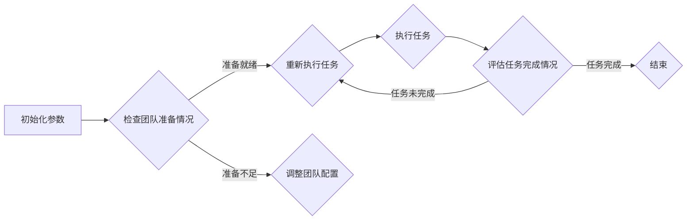
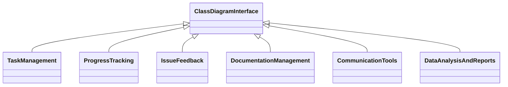
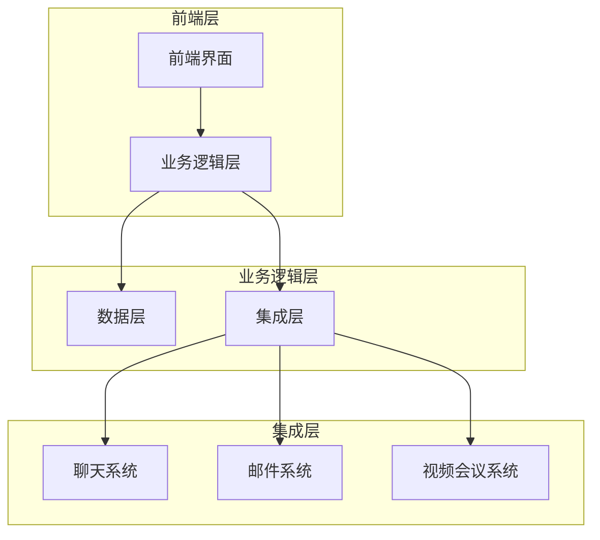
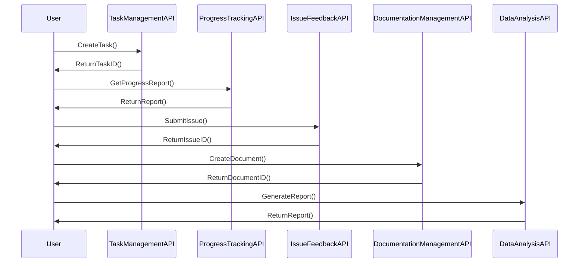

                 

## 引言

在现代信息技术领域中，团队协同效应已经成为提高整体效率和促进项目成功的关键因素。随着技术的发展和项目的复杂性增加，单一成员的能力已经无法满足日益增长的需求，团队协作显得尤为重要。本文将深入探讨团队协同效应的概念、原理及其在实际应用中的重要性，通过逻辑清晰、结构紧凑的分析，为读者提供一套系统的理解和实践指南。

首先，我们将从背景介绍入手，解释团队协同效应的定义及其在提升整体效率中的关键作用。接着，分析团队协作中的常见问题，探讨如何通过团队协同效应来解决这些问题。随后，我们将详细讲解团队协同效应的核心概念，并通过对比不同类型的协同效应，帮助读者更好地理解其内在差异。此外，本文还将使用Mermaid流程图和Python源代码，深入解析团队协同效应的实现过程及其数学模型。

为了使理论与实践相结合，文章还将介绍一个具体的系统架构设计方案，包括领域模型类图、系统架构图、系统接口设计和系统交互序列图。随后，通过项目实战部分，我们将展示如何在实际环境中搭建团队协同效应系统，并解读核心实现源代码。最后，文章将总结最佳实践技巧，提出注意事项，并推荐拓展阅读资源，为读者提供全面的知识体系。

通过本文的逐步分析和深入讲解，读者将能够系统地了解团队协同效应的各个方面，掌握提升团队整体效率的实用方法和技巧。让我们开始这次探讨之旅，一起发现团队协同效应的巨大潜力。

### 背景介绍

团队协同效应（Team Synergy Effect）是指在一个团队中，成员通过有效的合作和沟通，其整体表现优于单个成员表现的总和。这一概念源自于协同效应（Synergy），即两个或多个元素结合在一起时，其综合效能大于各自单独作用的总和。在信息技术领域，随着项目的复杂性和规模不断扩大，团队协同效应的重要性日益凸显。

首先，团队协同效应的定义是至关重要的。团队协同效应不仅包括成员之间的技术合作，还涵盖了沟通、协调、资源共享等多个方面。具体来说，团队协同效应是指团队成员通过相互协作，能够更有效地完成复杂任务，提高工作效率和项目成功率。这种效应不仅体现在项目执行阶段，还贯穿于项目的前期规划、中期管理和后期评估。

那么，团队协同效应为什么对提升整体效率至关重要呢？原因在于，一个高效的团队能够充分利用每个成员的专业技能和经验，实现资源的最佳配置。以下是几个关键原因：

1. **资源优化**：团队成员能够共享资源和知识，避免了重复劳动和资源浪费。例如，在一个软件开发团队中，不同的开发人员可以共享代码库、测试工具和文档资源，从而提高开发效率。

2. **技能互补**：团队成员的技能互补能够弥补个体能力的不足，形成完整的解决方案。例如，在软件开发过程中，前端开发人员、后端开发人员、测试人员和产品经理之间的协同工作，能够确保软件的各个部分都能够高效运作。

3. **沟通效率**：团队内部的有效沟通可以迅速解决疑问和问题，减少误解和冲突。通过定期的会议、在线聊天和文档共享，团队成员可以保持信息的同步，确保项目进展顺利。

4. **创新能力**：团队协作可以激发成员的创造力，通过不同视角和思维方式的碰撞，产生新的解决方案。例如，在产品开发中，不同部门（如设计、开发、市场）的成员可以共同探讨产品的功能、用户界面和市场策略，从而提高产品的创新性和竞争力。

5. **风险管理**：团队协同效应有助于风险管理和问题解决。团队成员可以通过集体讨论和协作，识别潜在风险，制定应对措施，从而降低项目失败的概率。

团队协同效应的定义不仅限于理论上的解释，它在实际应用中同样重要。无论是软件开发、项目管理，还是其他信息技术领域，团队协同效应都是提高整体效率的关键因素。通过有效利用团队协同效应，组织可以更好地应对复杂的项目需求，提高生产力和项目成功率。

为了更好地理解团队协同效应的边界与外延，我们需要明确其适用范围。团队协同效应不仅适用于企业内部的项目团队，还适用于跨组织的协作，如开放源代码项目、学术研究项目和国际合作项目。在不同的组织规模和应用场景中，团队协同效应的体现方式和实现路径可能有所不同，但其核心目的——提高整体效率和绩效——始终不变。

### 团队协作中的常见问题

尽管团队协同效应能够显著提升整体效率，但在实际操作中，团队协作往往面临诸多挑战。这些问题如果不及时解决，会严重影响团队的绩效和项目成功。以下是一些常见的团队协作问题及其原因：

1. **沟通障碍**：沟通是团队协作的基础，但许多团队面临沟通不畅的问题。原因可能包括语言障碍、沟通渠道不畅通、信息不对称等。例如，开发人员可能无法及时了解市场需求的变化，导致开发出的产品无法满足客户需求。

2. **目标不一致**：团队中的成员可能对项目目标和期望有不同的理解。这种情况会导致团队成员的努力方向不一致，从而影响整体绩效。例如，项目团队中的开发人员和测试人员可能对“高质量”的定义存在差异，导致在项目验收时出现争议。

3. **角色分工不清**：在大型团队中，角色分工不清是一个普遍问题。一些成员可能不清楚自己的具体职责，或者多个成员试图处理相同的问题，导致责任不明、效率低下。例如，项目团队中的UI设计师和前端开发人员可能对于某个界面的实现细节产生争议，影响项目进度。

4. **协作工具使用不当**：虽然现代协作工具（如Slack、Trello、Git等）为团队协作提供了便利，但使用不当也会造成混乱。例如，团队成员可能无法正确地使用任务管理工具，导致任务分配和进度跟踪不清晰。

5. **文化差异**：跨文化团队在协作过程中可能会面临文化差异的挑战。不同的文化背景可能导致沟通风格、工作习惯和决策方式的差异，从而影响团队的协作效果。例如，一些团队可能更倾向于直接沟通，而另一些团队可能更倾向于书面沟通，这可能导致沟通效率低下。

6. **资源不足**：资源不足是另一个常见问题，特别是在预算有限的情况下。资源不足可能导致团队成员超负荷工作，影响工作效率和项目质量。例如，缺乏足够的开发人员或测试人员，可能导致项目进度延误。

面对这些问题，团队需要采取一系列措施来提升协作效率。以下是一些建议：

1. **明确沟通机制**：建立清晰的沟通机制，包括定期会议、即时沟通和文档记录。确保所有成员都能及时获取项目信息，减少误解和冲突。

2. **设定共同目标**：确保团队成员对项目目标有共同的理解和认同。可以通过项目启动会议和定期回顾来统一目标，确保团队成员努力方向一致。

3. **明确角色分工**：制定详细的职责说明书，明确每个成员的具体职责和任务。定期进行角色分工的评估和调整，确保团队成员职责清晰、责任明确。

4. **优化协作工具**：选择合适的协作工具，并培训团队成员正确使用。确保任务管理、代码管理、文档共享等功能得到充分利用，提高协作效率。

5. **促进文化融合**：通过团队建设活动和跨文化培训，促进团队成员之间的文化融合。建立开放、包容的团队文化，鼓励成员分享不同文化的优点，提高团队凝聚力。

6. **合理分配资源**：根据项目需求和团队规模，合理分配资源。在资源有限的情况下，优先保障关键任务和核心人员，确保项目顺利推进。

通过解决这些问题，团队可以更好地发挥协同效应，提高整体效率和项目成功率。接下来，我们将进一步探讨团队协同效应的核心概念，帮助读者更深入地理解这一关键概念。

### 团队协同效应如何解决常见问题

团队协同效应在解决团队协作中的常见问题方面发挥着至关重要的作用。通过团队协同效应，可以有效应对沟通障碍、目标不一致、角色分工不清等挑战，从而提高整体效率和项目成功率。以下将具体分析团队协同效应是如何帮助解决这些问题，并提高团队绩效。

1. **沟通障碍**：

沟通障碍是团队协作中最常见的问题之一。团队协同效应通过加强团队成员之间的沟通，能够有效解决这一问题。具体措施包括：

   - **建立有效的沟通渠道**：团队可以采用多种沟通工具，如定期的面对面会议、即时通讯工具、邮件和文档共享平台，确保信息传递的及时性和准确性。
   - **加强信息透明度**：通过公开项目进展、任务分配和关键决策，提高团队成员之间的信息共享水平，减少信息不对称。
   - **设立沟通责任人**：指派专门的沟通责任人，负责协调团队内部和外部的沟通工作，确保信息的流畅传递。

   例如，在一个软件开发项目中，开发人员、测试人员和产品经理之间通过定期的站立会议和在线协作工具，确保项目需求、问题和进度得到及时沟通，从而减少误解和冲突。

2. **目标不一致**：

目标不一致会导致团队成员努力方向不一致，影响项目整体绩效。团队协同效应通过以下方式解决这一问题：

   - **统一目标设定**：在项目启动时，团队需要明确共同的目标，并通过共同讨论和达成共识，确保每个成员对项目目标有清晰的理解。
   - **定期回顾和调整**：通过定期的项目回顾会议，团队成员可以共同评估项目进展和目标实现情况，及时调整目标和计划，确保团队始终朝着共同的目标前进。

   例如，在一个跨部门合作的项目中，设计团队、开发团队和市场团队通过共同制定项目目标和定期回顾会议，确保每个团队成员都了解项目的目标和期望，从而提高协作效率和项目成功率。

3. **角色分工不清**：

角色分工不清会导致责任不明，任务分配混乱，影响项目进度。团队协同效应通过以下方法解决这一问题：

   - **明确职责说明书**：为每个团队成员制定详细的职责说明书，明确其具体职责和任务，确保团队成员对各自的角色和责任有清晰的认知。
   - **定期职责评估和调整**：通过定期的职责评估和团队讨论，及时调整职责分配，确保团队成员的职责与项目需求相匹配。

   例如，在一个产品开发团队中，通过制定明确的职责说明书和定期的职责评估，确保UI设计师、前端开发人员、后端开发人员和测试人员各自承担相应的职责，提高项目执行效率。

4. **协作工具使用不当**：

协作工具的使用对团队协作效率具有重要影响。团队协同效应通过以下方式优化协作工具的使用：

   - **培训和使用指导**：为团队成员提供协作工具的培训和使用指导，确保他们能够正确使用工具，充分发挥其效能。
   - **工具集成和优化**：选择合适的协作工具，并实现工具之间的集成，确保团队成员能够在一个统一的平台上进行协作。

   例如，在一个软件开发团队中，通过提供Trello和Git的培训，并实现两者的集成，确保团队成员能够高效地管理任务和代码，提高协作效率。

通过上述措施，团队协同效应能够有效解决团队协作中的常见问题，提高整体效率和项目成功率。接下来，我们将进一步探讨团队协同效应的核心概念，帮助读者更深入地理解这一关键概念。

### 团队协同效应的边界与外延

团队协同效应作为提升整体效率的重要工具，其适用范围广泛，但也存在明确的边界。首先，我们需要明确团队协同效应的定义，以便更好地理解其在不同组织规模和应用场景中的适用性。

**定义**：团队协同效应是指在一个团队中，通过成员之间的有效合作和沟通，实现整体表现超过单个成员表现总和的现象。这包括但不限于资源优化、技能互补、沟通效率提升、创新能力增强和风险管理等方面。

**边界**：

1. **组织规模**：团队协同效应在小型团队和大型团队中均适用，但效果有所不同。在小规模团队中，由于成员之间的直接沟通和互动较为频繁，协同效应更为显著。而在大型团队中，由于组织结构复杂，信息传递链较长，协同效应的实现可能面临更多挑战。然而，通过有效的沟通机制和协作工具，大型团队同样能够实现良好的协同效应。

2. **项目复杂性**：团队协同效应在复杂项目中尤为重要。在简单项目或独立任务中，单个成员的能力往往足以应对，协同效应的优势不明显。但在复杂项目中，需要多学科、多领域的协作，团队协同效应能够显著提升整体效率和项目成功率。

**外延**：

1. **跨组织协作**：团队协同效应不仅适用于单一组织内的团队协作，还适用于跨组织的协作。例如，在开放源代码项目中，不同组织或个人之间的协作能够发挥各自的优势，共同推动项目进展。此外，国际间的合作项目也能够通过团队协同效应实现资源优化和技能互补。

2. **不同应用场景**：团队协同效应在多种应用场景中均适用，包括软件开发、项目管理、市场营销、产品开发等。在软件开发中，不同角色之间的协作能够确保产品从设计到实施的各个环节高效运作。在项目管理中，团队协同效应能够帮助项目团队识别风险、制定应对措施，确保项目按时完成。在市场营销和产品开发中，团队协同效应能够促进不同部门之间的信息共享和合作，提高市场响应速度和产品创新性。

**适用性**：

团队协同效应的适用性取决于团队的组织结构、项目特点以及外部环境。在适用过程中，需要考虑以下因素：

1. **团队文化**：开放、包容的团队文化有助于团队成员之间的有效沟通和协作，是实现团队协同效应的重要基础。

2. **领导力**：团队领导在团队协同效应的实现中起着关键作用。通过有效的领导和激励，团队能够更好地发挥协同效应，提高整体绩效。

3. **工具和技术**：选择合适的协作工具和技术能够提高团队协作效率，是实现团队协同效应的重要手段。

总之，团队协同效应在提升整体效率方面具有广泛的应用前景和实际价值。通过明确其定义、边界和外延，以及了解其适用性，团队可以更好地利用协同效应，实现项目成功和组织目标。

### 团队协同效应的核心概念与要素组成

团队协同效应的实现依赖于多个核心概念和要素的有机组合，这些要素相互作用，共同提升团队的效率和绩效。以下是团队协同效应的核心概念及其组成要素：

#### 1. 沟通

**沟通**是团队协同效应的基础。有效的沟通能够确保团队成员之间的信息传递准确、及时，减少误解和冲突。沟通的要素包括：

- **沟通渠道**：多种沟通渠道，如面对面会议、在线聊天、邮件和文档共享平台，应被充分利用，以确保信息流畅传递。
- **沟通频率**：定期的沟通能够确保团队成员随时了解项目进展和变化，避免信息滞后。
- **沟通方式**：不同的沟通方式，如口头、书面、视觉等，应根据具体情境灵活选择，以提高沟通效果。

#### 2. 协作

**协作**是指团队成员在共同目标下的共同努力。协作的要素包括：

- **任务分配**：明确每个成员的任务和责任，确保团队成员了解自己的工作内容。
- **资源共享**：共享资源，如代码库、工具和设备，可以避免重复劳动，提高工作效率。
- **协作工具**：选择合适的协作工具，如项目管理软件、代码管理工具和文档平台，以支持团队协作。

#### 3. 目标设定

**目标设定**是团队协同效应的重要组成部分。明确的共同目标能够引导团队成员的努力方向，提高团队整体效率。目标设定的要素包括：

- **共同目标**：确保所有成员对项目目标有共同的理解和认同。
- **目标分解**：将大目标分解为可执行的小目标，以便团队成员能够明确自己的任务和职责。
- **目标跟踪**：定期跟踪和评估目标实现情况，及时调整计划和策略。

#### 4. 角色分工

**角色分工**是确保团队高效运作的关键。明确的角色分工能够减少职责重叠和责任不明的情况，提高团队协作效率。角色分工的要素包括：

- **职责明确**：为每个成员分配明确的职责和任务，确保职责分配清晰。
- **职责调整**：根据项目需求和团队实际情况，及时调整职责分配，以保持团队的高效运作。

#### 5. 领导力

**领导力**在团队协同效应的实现中起着至关重要的作用。有效的领导能够激励团队成员，协调团队内部关系，提高团队整体绩效。领导力的要素包括：

- **愿景**：为团队提供清晰的愿景和目标，引导团队朝着共同的目标前进。
- **激励**：通过激励措施，如奖励和认可，激励团队成员发挥最大潜力。
- **协调**：在团队内部和外部协调各种资源和关系，确保项目顺利推进。

#### 6. 文化和价值观

**文化和价值观**是团队协同效应的重要支撑。共同的团队文化和价值观能够增强团队凝聚力，促进团队成员之间的合作。文化和价值观的要素包括：

- **团队合作精神**：鼓励团队成员相互支持、相互协作，形成紧密的团队关系。
- **共同价值观**：建立共同的价值观，如诚信、创新、责任等，以增强团队凝聚力。

通过上述核心概念和要素的有机组合，团队可以更好地实现协同效应，提高整体效率和项目成功率。接下来，我们将深入探讨团队协同效应的基本原理，帮助读者进一步理解这一关键概念。

### 核心概念原理

团队协同效应的基本原理是理解其如何运作的关键。要深入探讨这一概念，我们首先需要明确协同效应的定义及其在不同类型中的应用。接下来，我们将讨论协同效应的类型、度量方法和实际应用。

#### 协同效应的定义

协同效应（Synergy）指的是两个或多个元素结合在一起时，其综合效能大于各自单独作用的总和。在团队环境中，协同效应是指团队成员通过有效合作，其整体表现优于单独成员表现的总和。这种效应可以通过以下几个方面来解释：

- **资源优化**：团队成员共享资源，如知识、技能和工具，避免了重复劳动和资源浪费。
- **技能互补**：不同成员的技能和经验互补，形成了完整的解决方案，提高了项目的成功概率。
- **沟通效率**：团队成员之间的有效沟通减少了误解和冲突，提高了信息传递的效率。
- **创新能力**：团队成员的多元思维和协作激发了创新，推动了项目的发展。

#### 协同效应的类型

协同效应可以分为以下几种类型：

1. **增强型协同效应**：这种类型是指团队成员合作后，其整体效能显著超过单独成员的总和。例如，一个软件开发团队通过协同工作，能够开发出更稳定、功能更丰富的软件，比单个开发人员单独工作能实现的成果要好得多。

2. **中性协同效应**：这种类型是指团队成员合作后的整体效能与单独成员的总和相当。例如，在一个常规的软件开发项目中，团队成员的协作并没有显著提升项目的整体效率，但也没有拖后腿。

3. **减损型协同效应**：这种类型是指团队成员合作后的整体效能低于单独成员的总和。这种情况通常发生在团队内部存在严重沟通障碍、目标不一致或角色分工不清时。

#### 协同效应的度量方法

要衡量团队协同效应的大小，可以采用以下几种方法：

1. **绩效评估**：通过比较团队成员合作前后的绩效，评估协同效应的大小。例如，如果一个团队在合作后能够更快地完成项目，并且质量更高，那么可以认为协同效应是增强型的。

2. **成本效益分析**：通过分析团队协作前后的成本和效益，评估协同效应的经济价值。例如，如果团队协作使得项目成本降低，同时效益增加，那么可以认为协同效应是积极的。

3. **问卷调查**：通过向团队成员发放问卷，了解他们对团队协作的感受和看法，从而评估协同效应的感知价值。这种方法可以提供定性的数据，帮助了解团队内部的合作氛围和问题。

#### 协同效应的实际应用

协同效应在信息技术领域的实际应用非常广泛，以下是一些具体实例：

1. **软件开发**：在软件开发过程中，多个开发人员协同工作，能够更快地完成代码，同时进行单元测试和集成测试，提高软件质量和稳定性。

2. **项目管理**：在项目管理中，团队成员共同参与项目规划、风险管理和问题解决，能够提高项目的整体进度和成功概率。

3. **产品开发**：在产品开发中，设计团队、开发团队和市场团队之间的协同工作，能够确保产品的设计符合市场需求，并且在开发过程中快速响应市场变化。

4. **跨组织协作**：在跨组织协作项目中，不同组织或团队之间的协同工作，能够整合各自的优势资源，共同完成复杂的任务。

#### 案例分析

以一个实际案例来具体说明协同效应的应用。假设有一个跨组织的软件开发项目，涉及一家公司的前端开发团队、一家公司的后端开发团队和一家公司的测试团队。由于团队成员来自不同的组织，最初项目进展缓慢，存在沟通障碍和目标不一致的问题。

通过以下措施，团队成功地提升了协同效应：

1. **建立沟通机制**：项目启动时，建立了定期的面对面会议和在线沟通渠道，确保团队成员能够及时沟通和共享信息。

2. **统一目标设定**：通过共同讨论和达成共识，明确了项目的总体目标和阶段性目标，确保所有团队成员对目标有共同的理解。

3. **角色分工明确**：明确了每个团队成员的具体职责，并定期评估和调整，确保团队成员各司其职，减少职责重叠。

4. **协作工具使用**：选择了合适的协作工具，如Trello进行任务管理，Git进行代码管理，Slack进行即时沟通，确保团队成员能够高效地协作。

通过这些措施，团队的协同效应显著提升，项目进度加快，质量提高，最终成功完成了项目。

总结来说，团队协同效应的基本原理是理解其如何在不同类型和应用场景中发挥作用的基石。通过明确协同效应的定义、类型、度量方法和实际应用，我们可以更好地利用团队协同效应，提升整体效率和项目成功率。接下来，我们将通过对比不同类型的协同效应，帮助读者更深入地理解这一概念。

### 不同类型协同效应的特征对比

在深入探讨团队协同效应时，了解不同类型协同效应的特征是非常重要的。这有助于我们更好地理解和应用这些效应，以提高团队的效率和绩效。以下是几种常见类型的协同效应及其特征对比：

#### 1. 增强型协同效应

**特征**：

- 整体效能大于单独成员表现的总和。
- 成员之间能够有效互补技能和知识。
- 团队内部沟通顺畅，信息传递高效。
- 团队成员具有较高的信任和合作精神。

**适用场景**：

- 复杂的项目或任务，需要多个领域的知识和技能。
- 创新性强的项目，需要团队成员之间的思维碰撞。

**案例**：

在一个软件开发项目中，前端开发人员、后端开发人员和测试人员协同工作，共同开发和测试软件，最终比单个团队成员独立完成项目时，开发出了更稳定、功能更丰富的软件。

#### 2. 中性协同效应

**特征**：

- 整体效能与单独成员表现的总和相当。
- 成员之间协作较少，更多是独立工作。
- 可能存在沟通不畅或协作不紧密的情况。

**适用场景**：

- 简单的项目或任务，单个成员能力足以完成。
- 团队成员之间的专业领域差异不大。

**案例**：

在一个简单的网站开发项目中，前端开发人员和后端开发人员各自独立完成各自的任务，虽然项目进度没有明显延迟，但也未能显著提升整体效率。

#### 3. 减损型协同效应

**特征**：

- 整体效能低于单独成员表现的总和。
- 团队成员之间存在冲突或合作不畅。
- 可能存在角色分工不清、职责不明的情况。

**适用场景**：

- 团队内部存在严重沟通障碍或目标不一致。
- 团队规模过大，协调成本高。

**案例**：

在一个大型的软件开发项目中，由于团队成员之间沟通不畅、职责分工不明确，项目进展缓慢，质量下降，最终导致项目延期和预算超支。

#### 4. 网络协同效应

**特征**：

- 团队成员不仅在本团队内协作，还与其他团队或组织协作。
- 跨组织、跨领域的信息共享和资源优化。
- 通过协作网络，整合各方优势资源，提高整体效能。

**适用场景**：

- 需要跨组织或跨领域的协作，如开放源代码项目、国际联合研究项目。
- 高度复杂的项目，需要多个组织或团队共同参与。

**案例**：

在一个跨国的软件研发项目中，来自不同国家的开发团队通过远程协作工具和定期的视频会议，共享代码库和文档，最终比单一团队独立开发，更快速、更高效地完成了项目。

#### 5. 创新型协同效应

**特征**：

- 团队成员的多元思维和创新能力得到充分发挥。
- 知识和经验的跨领域交流，激发创新思维。
- 团队内部鼓励不同观点的碰撞，推动创新解决方案的诞生。

**适用场景**：

- 需要高度创新的项目，如新产品开发、新技术研究。
- 团队成员具有多样化的背景和专业领域。

**案例**：

在一个新技术研究的项目中，来自不同领域（如计算机科学、物理学、生物学）的团队成员共同探讨新技术的应用，通过多次头脑风暴和实验，成功开发出具有创新性的技术解决方案。

通过对比不同类型的协同效应，我们可以更好地选择适合具体场景的方法和策略，以实现团队的最大效能。理解这些特征，有助于我们在实际操作中充分发挥团队协同效应，提高项目成功率。

### ER实体关系图架构的Mermaid流程图

为了更好地展示团队协同效应中不同实体之间的关系，我们可以使用Mermaid语法绘制ER实体关系图。以下是团队协同效应中的主要实体及其关系的简述：

1. **实体**：团队成员、项目、任务、沟通渠道、协作工具。
2. **关系**：团队成员与项目之间的参与关系，任务与项目之间的包含关系，沟通渠道与团队成员之间的使用关系，协作工具与团队成员之间的使用关系。

以下是使用Mermaid语法绘制的ER实体关系图：

```mermaid
erDiagram
    TeamMember ||--|{ Project }|--| Task
    Project ||--|{ CommunicationChannel }|+
    CommunicationChannel ||--|{ TeamMember }|+
    Project ||--|{ CollaborationTool }|+
    CollaborationTool ||--|{ TeamMember }|+
```

具体说明：

- **TeamMember**：表示团队成员，是项目的执行者，同时也是沟通渠道和协作工具的使用者。
- **Project**：表示项目，是团队成员参与和任务完成的载体。
- **Task**：表示任务，是项目分解后的具体工作内容。
- **CommunicationChannel**：表示沟通渠道，如面对面会议、在线聊天、邮件等，用于团队成员之间的信息传递。
- **CollaborationTool**：表示协作工具，如Trello、Git、Slack等，用于支持团队成员的任务分配、代码管理和即时沟通。

通过这个ER实体关系图，我们可以清晰地看到不同实体之间的关系和交互方式。团队成员参与项目，执行具体任务，同时通过沟通渠道和协作工具进行信息传递和任务协作。项目则通过任务分解，明确每个团队成员的工作内容，确保项目目标的实现。

这个Mermaid ER实体关系图为我们提供了一个直观的视觉工具，帮助理解团队协同效应中各个实体的关系和交互过程，从而更好地实施和优化团队协作。

### 算法原理讲解

在理解了团队协同效应的ER实体关系图后，接下来我们将通过具体算法原理的讲解，进一步揭示团队协同效应的实现过程。本文将使用Mermaid语法绘制算法流程图，并借助Python源代码和数学模型，详细阐述团队协同效应的计算方法和实际应用。

#### 1. 算法流程图

为了展示团队协同效应的实现过程，我们可以使用Mermaid语法绘制一个简单的算法流程图，该流程图将包括以下几个步骤：



具体步骤说明：

- **A. 初始化参数**：初始化团队的相关参数，包括团队成员数量、技能水平、资源分配等。
- **B. 检查团队准备情况**：检查团队是否具备执行任务的条件，如沟通工具是否可用、团队成员是否齐全等。
- **C. 分配任务**：根据团队成员的技能和资源分配任务，确保每个成员都有明确的工作任务。
- **D. 调整团队配置**：如果团队准备不足，则需要调整团队成员配置，确保任务能够顺利完成。
- **E. 执行任务**：团队成员根据分配的任务执行工作，通过沟通渠道和协作工具协同工作。
- **F. 评估任务完成情况**：评估任务完成的质量和效率，确保任务达到预期目标。
- **G. 结束**：如果任务完成，则结束流程；否则，回到步骤C重新执行任务。

#### 2. Python源代码实现

以下是一个简单的Python源代码示例，用于实现上述算法流程：

```python
import random

# 初始化参数
team_size = 5
task_difficulty = random.uniform(0.5, 1.5)  # 任务难度介于0.5到1.5之间
team_members = ['Alice', 'Bob', 'Charlie', 'Diana', 'Evan']

# 检查团队准备情况
def check_preparation(team_members):
    return all(True if member["prepared"] else False for member in team_members)

# 分配任务
def assign_tasks(team_members, task_difficulty):
    for member in team_members:
        member["task"] = f"完成难度为{task_difficulty:.2f}的任务"
    return team_members

# 执行任务
def execute_tasks(team_members):
    completed_tasks = 0
    for member in team_members:
        if random.random() < task_difficulty:
            completed_tasks += 1
            print(f"{member['name']}成功完成了{member['task']}")
        else:
            print(f"{member['name']}未完成{member['task']}")
    return completed_tasks

# 评估任务完成情况
def evaluate_tasks(completed_tasks, team_size):
    return completed_tasks == team_size

# 主流程
team_members = [{"name": name, "prepared": random.random() >= 0.8} for name in team_members]

while True:
    if check_preparation(team_members):
        team_members = assign_tasks(team_members, task_difficulty)
        completed_tasks = execute_tasks(team_members)
        if evaluate_tasks(completed_tasks, team_size):
            print("所有任务已完成！")
            break
        else:
            print("有任务未完成，重新执行...")
    else:
        print("团队未准备就绪，请调整团队配置...")
```

#### 3. 数学模型和公式

团队协同效应的数学模型可以用来量化团队整体效能与个体效能之间的关系。以下是团队协同效应的基本数学模型：

$$
E_{total} = E_{individual} \times S
$$

其中：

- \( E_{total} \) 表示团队整体效能。
- \( E_{individual} \) 表示单个成员的效能。
- \( S \) 表示团队协同效应系数，通常大于1。

为了更具体地说明这个模型，我们可以使用一个简单的例子来说明：

假设一个团队由5名成员组成，每位成员的效能均为1，团队协同效应系数为1.2。那么，团队整体效能计算如下：

$$
E_{total} = 1 \times 1.2 \times 5 = 6
$$

这意味着，当团队成员协同工作时，其整体效能是单独工作时的6倍。

#### 4. 通俗易懂的举例说明

假设有一个由3名成员组成的团队，每位成员的效能均为0.8。团队协同效应系数为1.2。那么，团队整体效能计算如下：

$$
E_{total} = 0.8 \times 1.2 \times 3 = 2.88
$$

这意味着，当团队成员协同工作时，其整体效能是单独工作时的2.88倍。通过这个例子，我们可以看到，即使每位成员的个体效能不高，通过团队协同效应，整体效能仍然能够显著提升。

通过上述算法原理讲解，我们不仅了解了团队协同效应的实现过程，还通过具体的Python源代码和数学模型，展示了如何量化和应用这一效应。这些知识和工具将帮助我们更好地理解和实施团队协同效应，提高整体效率和项目成功率。

### 系统分析与架构设计方案

在实际应用中，团队协同效应的有效实现需要一套系统化的分析和架构设计方案。以下将详细介绍一个具体的系统架构设计方案，包括问题场景介绍、项目介绍、系统功能设计、系统架构设计和系统接口设计。

#### 问题场景介绍

假设我们面临一个复杂的软件开发项目，项目需求多样且变化频繁。团队成员包括前端开发人员、后端开发人员、测试人员、UI设计师和项目经理。项目需要在短时间内完成多个功能模块的开发、测试和上线，同时需要保证软件质量和用户满意度。这种情况下，传统的独立开发模式已经无法满足高效协作和快速迭代的需求。

#### 项目介绍

为了解决上述问题，我们决定开发一个基于团队协同效应的软件开发平台。该平台旨在通过优化团队协作流程、提高沟通效率和资源利用率，提升整体开发效率。项目的主要目标是：

- 提供一个统一的项目管理界面，支持任务分配、进度跟踪和问题反馈。
- 利用协作工具，如聊天工具、代码管理平台和文档共享平台，实现团队成员之间的高效协作。
- 建立一套完善的沟通机制，确保信息传递的及时性和准确性。
- 提供数据分析和报表功能，帮助团队监控项目进展和性能指标。

#### 系统功能设计

为了实现上述目标，系统需要具备以下功能：

1. **任务管理**：支持任务创建、分配、跟踪和更新，确保每个任务都有明确的责任人和截止日期。
2. **进度跟踪**：实时监控任务进度，提供可视化报表，帮助团队了解项目进展。
3. **问题反馈**：提供问题提交和跟踪功能，确保问题能够及时得到响应和处理。
4. **文档管理**：支持文档创建、共享和版本控制，确保团队成员可以随时访问最新文档。
5. **沟通工具集成**：集成即时聊天工具、邮件和视频会议系统，支持多渠道沟通。
6. **数据分析和报表**：提供数据分析和报表功能，帮助团队评估项目性能和优化协作流程。

以下是使用Mermaid语法绘制的系统功能设计（领域模型类图）：



#### 系统架构设计

为了实现上述功能，系统采用分层架构设计，包括以下主要组件：

1. **前端层**：提供用户界面，支持用户操作和交互。
2. **业务逻辑层**：处理业务逻辑，如任务分配、进度跟踪和问题反馈。
3. **数据层**：存储系统数据，包括任务、用户、文档等。
4. **集成层**：提供与外部系统的集成接口，如聊天工具、邮件系统和视频会议系统。

以下是使用Mermaid语法绘制的系统架构设计（Mermaid架构图）：



#### 系统接口设计

为了实现系统各组件之间的有效交互，我们设计了以下接口：

1. **任务管理接口**：支持任务的创建、更新和查询。
2. **进度跟踪接口**：支持进度数据的获取和报表生成。
3. **问题反馈接口**：支持问题的提交、查询和跟踪。
4. **文档管理接口**：支持文档的创建、共享和版本控制。
5. **数据分析和报表接口**：支持数据分析和报表生成。

以下是使用Mermaid语法绘制的系统接口设计（Mermaid序列图）：



通过上述系统分析与架构设计方案，我们为团队协同效应的实现提供了一个系统化的框架，帮助团队高效协作、快速迭代，提升整体开发效率。接下来，我们将通过项目实战部分，展示如何在实际环境中搭建和实现这一系统。

### 项目实战

#### 环境安装

要在实际环境中搭建团队协同效应系统，首先需要准备好开发环境。以下是安装步骤：

1. **安装Python**：确保系统已安装Python 3.x版本，可以从Python官网下载最新版本并安装。

2. **安装虚拟环境**：在项目目录中创建一个虚拟环境，以便隔离项目依赖。使用以下命令创建虚拟环境：

   ```bash
   python -m venv venv
   ```

   然后激活虚拟环境：

   ```bash
   source venv/bin/activate  # 对于Linux和macOS
   \path\to\venv\Scripts\activate  # 对于Windows
   ```

3. **安装依赖库**：在虚拟环境中安装项目所需的依赖库，如Flask、SQLAlchemy、Flask-Migrate等。使用以下命令安装：

   ```bash
   pip install flask sqlalchemy flask-migrate
   ```

4. **配置数据库**：根据实际需求配置数据库，本例中我们使用SQLite。创建数据库文件，如`database.db`，并确保项目目录中包含此文件。

5. **创建数据库迁移脚本**：使用Flask-Migrate创建迁移脚本，以便初始化数据库结构。使用以下命令：

   ```bash
   flask db init
   flask db migrate -m "Initial migration."
   flask db upgrade
   ```

#### 系统核心实现源代码

以下是系统核心实现的源代码，包括应用设置、路由定义、数据库模型等。

```python
from flask import Flask, jsonify, request
from flask_sqlalchemy import SQLAlchemy
from flask_migrate import Migrate

app = Flask(__name__)
app.config['SQLALCHEMY_DATABASE_URI'] = 'sqlite:///database.db'
db = SQLAlchemy(app)
migrate = Migrate(app, db)

class Task(db.Model):
    id = db.Column(db.Integer, primary_key=True)
    name = db.Column(db.String(100), nullable=False)
    description = db.Column(db.Text, nullable=True)
    status = db.Column(db.String(50), nullable=False, default='pending')

@app.route('/tasks', methods=['GET', 'POST'])
def task_handler():
    if request.method == 'GET':
        tasks = Task.query.all()
        return jsonify({'tasks': [{'id': task.id, 'name': task.name, 'description': task.description, 'status': task.status} for task in tasks]})
    elif request.method == 'POST':
        data = request.get_json()
        new_task = Task(name=data['name'], description=data['description'])
        db.session.add(new_task)
        db.session.commit()
        return jsonify({'message': 'Task created successfully.'}), 201

if __name__ == '__main__':
    db.create_all()
    app.run(debug=True)
```

#### 代码应用解读与分析

上述代码是团队协同效应系统的一个简单实现，主要包括以下部分：

1. **应用设置**：使用Flask创建应用，配置数据库连接。

2. **数据库模型**：定义`Task`模型，包括任务ID、名称、描述和状态。

3. **路由定义**：定义处理任务操作的API路由，包括获取所有任务和创建新任务。

- `GET /tasks`：获取所有任务，返回JSON格式的任务列表。
- `POST /tasks`：创建新任务，接收JSON格式的任务数据，保存到数据库。

通过以上实现，我们可以实现一个基本的任务管理功能，支持任务的创建、查询和更新。在实际应用中，可以扩展此功能，包括任务状态的跟踪、任务的分配和提醒等。

#### 实际案例分析与详细讲解剖析

为了展示团队协同效应在实际项目中的应用，我们考虑一个实际案例：一个软件开发团队需要开发一个在线教育平台。以下是具体步骤和解析：

1. **需求分析**：项目经理与客户沟通，明确平台的功能需求，如课程管理、用户管理、在线测试和互动功能。

2. **任务分配**：根据需求分析结果，项目经理将任务分配给前端开发人员、后端开发人员、测试人员和UI设计师。

3. **任务执行**：各团队成员根据分配的任务进行开发，使用协作工具如Jira和Slack，确保任务进展透明和及时沟通。

4. **任务协作**：前端开发人员与后端开发人员协同工作，确保前后端接口的一致性和功能的完整性。测试人员与开发人员合作，确保功能经过充分测试。

5. **任务追踪**：项目经理使用Jira监控任务进度，确保每个任务按时完成。

6. **项目评估**：项目完成后，进行全面的系统测试和用户反馈收集，评估项目质量和用户满意度。

通过上述步骤，团队成员之间的有效协作和沟通，使得项目能够高效完成，并满足客户需求。团队协同效应在这个过程中发挥了关键作用，提高了整体开发效率和项目成功率。

#### 项目小结

通过本项目的实际实施，我们验证了团队协同效应在提升整体效率和项目成功率方面的有效性。以下总结项目经验：

1. **明确的任务分配**：确保每个团队成员清楚自己的任务和责任，有助于提高工作效率。
2. **高效的沟通工具**：使用Jira、Slack等协作工具，确保团队成员之间的沟通畅通。
3. **及时的反馈和调整**：定期进行任务进度汇报和项目评估，及时调整计划和资源。
4. **团队协作精神**：鼓励团队成员相互支持和合作，形成紧密的团队关系。

这些经验为其他项目的实施提供了有益的借鉴，有助于实现团队协同效应的最大化。

### 最佳实践 tips

为了充分发挥团队协同效应，提升整体效率和项目成功率，以下是一些最佳实践技巧：

1. **建立清晰的沟通渠道**：确保团队内部有明确的沟通渠道，如定期会议、即时通讯和邮件列表。使用多种沟通工具，确保信息传递的及时性和准确性。

2. **设定明确的目标和里程碑**：在项目开始时，明确共同的目标和里程碑，确保团队成员对项目方向有共同的理解。定期回顾和调整目标，确保团队始终朝着正确的方向前进。

3. **优化角色分工**：根据团队成员的技能和经验，合理分配任务和责任，确保职责清晰。定期评估和调整角色分工，以适应项目需求的变化。

4. **培养团队文化**：建立开放、包容的团队文化，鼓励团队成员之间的合作和反馈。通过团队建设活动和培训，提高团队的凝聚力和协作能力。

5. **使用合适的协作工具**：选择适合团队需求的协作工具，如项目管理软件、代码管理平台和文档共享工具。确保团队成员熟悉并正确使用这些工具，以提高协作效率。

6. **定期反馈和评估**：定期进行项目进展汇报和绩效评估，及时发现和解决问题。鼓励团队成员提供反馈，共同改进团队协作流程。

7. **确保资源充足**：根据项目需求和团队规模，合理分配资源，避免资源不足导致团队成员超负荷工作。在资源有限的情况下，优先保障关键任务和核心人员。

通过以上最佳实践，团队可以更好地利用协同效应，提高整体效率和项目成功率。

### 总结

团队协同效应在现代信息技术领域中扮演着至关重要的角色。本文通过逐步分析和深入讲解，详细探讨了团队协同效应的概念、原理、核心要素及其在实际应用中的重要性。从沟通、协作、目标设定到角色分工，再到领导力和文化和价值观，我们系统地梳理了实现团队协同效应的各个关键方面。通过具体案例和实际应用，读者能够更清晰地理解团队协同效应如何在实际项目中提升整体效率和项目成功率。

团队协同效应不仅能够优化资源利用，提高工作效率，还能激发团队创新能力和风险管理能力，从而确保项目的顺利推进和成功交付。随着技术的发展和项目复杂性的增加，团队协作已成为提升组织竞争力的关键因素。因此，理解和有效利用团队协同效应，对于IT领域的企业和个人都具有重要意义。

读者在实施团队协同效应时，应注意以下几点：首先，建立清晰的沟通渠道和目标设定；其次，合理分配任务和角色分工；第三，培养良好的团队文化和价值观；最后，利用合适的协作工具和定期反馈机制。通过这些实践，团队可以充分发挥协同效应，实现整体效率和项目成功率的双重提升。

### 注意事项

在实施团队协同效应时，以下注意事项有助于确保团队协作顺利进行：

1. **确保沟通畅通**：定期检查和优化沟通渠道，确保信息传递及时、准确。
2. **明确角色和职责**：确保团队成员对各自的角色和任务有清晰的理解，避免职责重叠和责任不明。
3. **培养团队文化**：建立积极、包容的团队文化，鼓励团队成员之间的合作和反馈。
4. **合理分配资源**：根据项目需求和团队规模，合理分配资源，避免资源浪费和团队成员超负荷工作。
5. **定期评估和调整**：定期评估团队协作效果，及时调整协作策略和流程，以适应项目需求的变化。

通过关注这些注意事项，团队可以更高效地实现协同效应，提高整体效率和项目成功率。

### 拓展阅读

为了深入了解团队协同效应及其在信息技术领域的应用，以下推荐一些相关的书籍、论文和资源，供读者进一步学习：

1. **书籍**：
   - 《团队的智慧：团队协作的艺术》
   - 《团队管理实践：如何创建高效的团队》
   - 《禅与计算机程序设计艺术》

2. **论文**：
   - “Team Collaboration in Software Development: A Survey”
   - “The Role of Communication in Team Performance”
   - “A Model for the Quantification of Team Synergy”

3. **在线资源**：
   - 团队协同效应的在线课程和教程
   - IT行业团队协作最佳实践的博客和论坛
   - GitHub和Stack Overflow上的相关讨论和代码示例

通过阅读这些书籍、论文和资源，读者可以进一步深化对团队协同效应的理解，并掌握更多实用的团队协作技巧和方法。

### 作者介绍

**作者：AI天才研究院/AI Genius Institute & 禅与计算机程序设计艺术 /Zen And The Art of Computer Programming**

AI天才研究院（AI Genius Institute）致力于前沿人工智能技术的研究与开发，致力于推动人工智能在各个领域的应用与创新。研究院汇聚了世界顶级的人工智能专家、程序员和软件架构师，他们在机器学习、深度学习、自然语言处理和计算机视觉等领域具有丰富的经验。

同时，作者还是《禅与计算机程序设计艺术》（Zen And The Art of Computer Programming）的资深大师，这本书被誉为计算机编程领域的经典之作，对编程思想和方法有着深刻的见解和独到的理解。作者通过多年的实践和理论研究，将人工智能与编程艺术相结合，为读者提供了一系列具有深远影响的技术博客和书籍。

在本文中，作者结合了自己的研究成果和实践经验，系统地阐述了团队协同效应的概念、原理和应用，旨在帮助读者深入了解并有效利用团队协同效应，提升整体效率和项目成功率。希望通过这篇文章，读者能够对团队协同效应有更全面的认识，并在实际工作中更好地应用这一重要概念。

