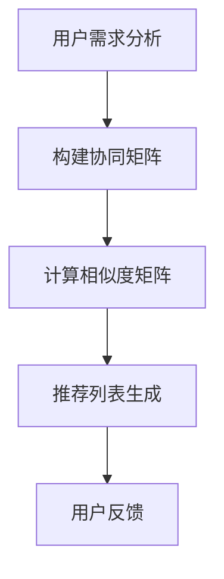
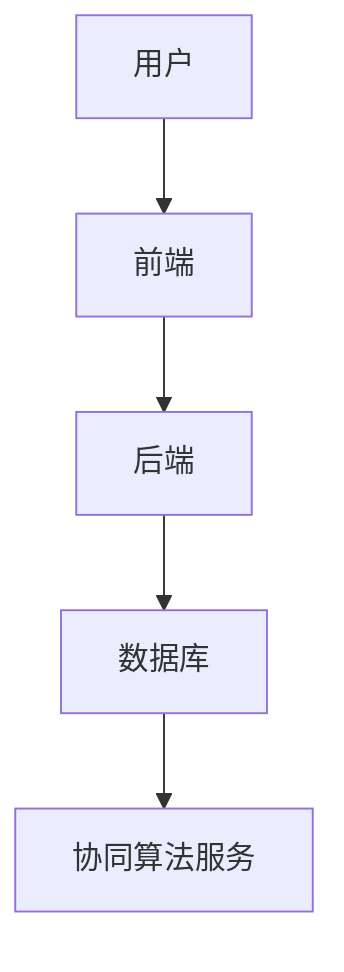
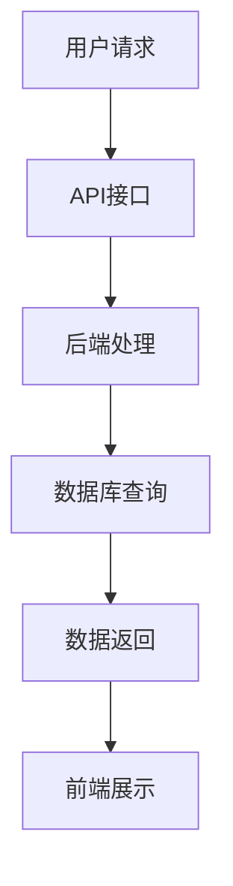

                 

# 团队协同：发挥集体智慧的方法

> 关键词：团队协同、核心概念、算法原理、系统架构、实战案例

> 摘要：本文从团队协同的背景介绍、核心概念与联系，以及团队协同算法原理等方面，深入探讨如何发挥集体智慧，提升团队工作效率。通过实例分析，系统化地展示了团队协同的方法和实践，为企业提供实用的指导。

## 步骤 1: 背景介绍

### 第一部分：团队协同概述

### 第1章：团队协同的重要性

#### 1.1 问题背景

在现代社会，企业竞争日益激烈，单打独斗的时代已经过去，团队协同成为企业生存和发展的关键。团队协同不仅提高了工作效率，还能激发团队成员的创造力和积极性，从而为企业创造更大的价值。

#### 1.2 问题描述

然而，在实际操作中，团队协同并非易事。团队成员之间可能存在技能差异、沟通障碍、目标不统一等问题，导致协同效率低下。如何有效地解决这些问题，提升团队协同水平，成为企业管理者和团队领导者亟待解决的问题。

#### 1.3 问题解决

为了解决这些问题，我们需要深入理解团队协同的原理，识别团队中的关键因素，并采取有效的策略来促进团队协作。本文将围绕团队协同的核心概念和算法原理，探讨如何发挥集体智慧，提高团队工作效率。

#### 1.4 边界与外延

团队协同不仅局限于企业内部，还可以扩展到供应链、合作伙伴等外部组织，形成更加广泛的协同网络。这种跨组织、跨领域的协同，有助于企业实现资源整合，提高整体竞争力。

#### 1.5 概念结构与核心要素组成

团队协同涉及多个核心概念和要素，包括团队结构、沟通机制、激励机制等。理解这些概念和要素之间的关系，有助于我们构建高效的协同体系。

### 第2章：团队协同的核心概念与联系

#### 2.1 团队结构

团队结构是指团队成员的组成方式及其相互关系。常见的团队结构包括功能型团队、项目型团队和矩阵型团队等。

##### 2.1.1 功能型团队

功能型团队是根据团队成员的职能分工来构建的，例如研发团队、市场团队、运营团队等。功能型团队的优势在于分工明确，能够充分发挥成员的专业技能，提高工作效率。

##### 2.1.2 项目型团队

项目型团队是为了完成特定项目而组建的，团队成员通常由不同职能背景的人组成，具有临时性和目标导向性。项目型团队的优势在于能够迅速响应市场需求，提高项目成功率。

##### 2.1.3 矩阵型团队

矩阵型团队是功能型团队和项目型团队的结合体，团队成员既承担职能职责，又参与项目任务。矩阵型团队的优势在于能够充分利用资源，提高项目执行效率。

#### 2.2 沟通机制

沟通机制是团队协作的基础。良好的沟通机制能够确保信息流畅、及时传递，减少误解和冲突。

##### 2.2.1 横向沟通

横向沟通是指团队成员之间的沟通，如项目组成员之间的讨论、协作等。横向沟通有助于团队成员了解项目进展，协同完成任务。

##### 2.2.2 纵向沟通

纵向沟通是指团队成员与上级、下属之间的沟通，如项目组长与成员之间的沟通等。纵向沟通有助于确保团队成员理解并执行上级指令，提高团队执行力。

#### 2.3 激励机制

激励机制是激发团队成员积极性的关键。通过合理的奖励和认可，可以激励团队成员更加投入工作，提高协作效率。

##### 2.3.1 内部激励机制

内部激励机制包括晋升、奖金、荣誉等，旨在激励团队成员追求卓越，提升个人能力。

##### 2.3.2 外部激励机制

外部激励机制包括培训、学习机会、职业发展等，旨在为团队成员提供成长空间，增强团队凝聚力。

### 第3章：团队协同算法原理

#### 3.1 算法概述

团队协同算法旨在优化团队协作，提高工作效率。本文将介绍一种基于协同过滤的算法原理。

#### 3.2 算法mermaid流程图



#### 3.3 Python源代码实现

```python
import numpy as np

def build_similarity_matrix(ratings):
    # 计算协同矩阵的相似度
    num_users, num_items = ratings.shape
    similarity_matrix = np.zeros((num_users, num_users))
    
    for i in range(num_users):
        for j in range(num_users):
            if i != j:
                # 计算用户i和用户j之间的余弦相似度
                similarity = np.dot(ratings[i], ratings[j]) / (
                    np.linalg.norm(ratings[i]) * np.linalg.norm(ratings[j])
                )
                similarity_matrix[i, j] = similarity
    
    return similarity_matrix
```

### 第4章：系统分析与架构设计方案

#### 4.1 问题场景介绍

假设某企业希望提升团队协同效率，实现资源优化配置。为此，企业决定开发一套团队协同管理系统，用于记录项目进度、团队成员协作情况，以及提供协同算法支持。

#### 4.2 项目介绍

项目名称：团队协同管理系统

项目目标：通过系统化的管理，提高团队协同效率，实现资源优化配置。

项目范围：涵盖项目进度管理、团队成员协作管理、协同算法支持等方面。

#### 4.3 系统功能设计

##### 4.3.1 项目进度管理

功能描述：记录项目进度，包括任务分配、任务完成情况等。

主要模块：项目进度列表、任务分配、任务完成情况统计。

##### 4.3.2 团队成员协作管理

功能描述：记录团队成员协作情况，包括沟通记录、协作任务等。

主要模块：成员协作列表、沟通记录、协作任务分配。

##### 4.3.3 协同算法支持

功能描述：提供协同算法支持，用于优化团队协作。

主要模块：协同矩阵构建、相似度计算、推荐列表生成。

#### 4.4 系统架构设计



#### 4.5 系统接口设计和系统交互



## 步骤 2: 核心概念与联系

### 第二部分：团队协同的核心概念与联系

#### 第2章：团队协同的关键概念

#### 2.1 团队结构

团队结构是指团队成员的组成方式及其相互关系。常见的团队结构包括功能型团队、项目型团队和矩阵型团队等。

##### 2.1.1 功能型团队

功能型团队是根据团队成员的职能分工来构建的，例如研发团队、市场团队、运营团队等。功能型团队的优势在于分工明确，能够充分发挥成员的专业技能，提高工作效率。

##### 2.1.2 项目型团队

项目型团队是为了完成特定项目而组建的，团队成员通常由不同职能背景的人组成，具有临时性和目标导向性。项目型团队的优势在于能够迅速响应市场需求，提高项目成功率。

##### 2.1.3 矩阵型团队

矩阵型团队是功能型团队和项目型团队的结合体，团队成员既承担职能职责，又参与项目任务。矩阵型团队的优势在于能够充分利用资源，提高项目执行效率。

#### 2.2 沟通机制

沟通机制是团队协作的基础。良好的沟通机制能够确保信息流畅、及时传递，减少误解和冲突。

##### 2.2.1 横向沟通

横向沟通是指团队成员之间的沟通，如项目组成员之间的讨论、协作等。横向沟通有助于团队成员了解项目进展，协同完成任务。

##### 2.2.2 纵向沟通

纵向沟通是指团队成员与上级、下属之间的沟通，如项目组长与成员之间的沟通等。纵向沟通有助于确保团队成员理解并执行上级指令，提高团队执行力。

#### 2.3 激励机制

激励机制是激发团队成员积极性的关键。通过合理的奖励和认可，可以激励团队成员更加投入工作，提高协作效率。

##### 2.3.1 内部激励机制

内部激励机制包括晋升、奖金、荣誉等，旨在激励团队成员追求卓越，提升个人能力。

##### 2.3.2 外部激励机制

外部激励机制包括培训、学习机会、职业发展等，旨在为团队成员提供成长空间，增强团队凝聚力。

### 第3章：团队协同算法原理

#### 3.1 算法概述

团队协同算法旨在优化团队协作，提高工作效率。本文将介绍一种基于协同过滤的算法原理。

#### 3.2 算法mermaid流程图


#### 3.3 Python源代码实现

```python
import numpy as np

def build_similarity_matrix(ratings):
    # 计算协同矩阵的相似度
    num_users, num_items = ratings.shape
    similarity_matrix = np.zeros((num_users, num_users))
    
    for i in range(num_users):
        for j in range(num_users):
            if i != j:
                # 计算用户i和用户j之间的余弦相似度
                similarity = np.dot(ratings[i], ratings[j]) / (
                    np.linalg.norm(ratings[i]) * np.linalg.norm(ratings[j])
                )
                similarity_matrix[i, j] = similarity
    
    return similarity_matrix
```

## 步骤 3: 算法原理讲解

### 第3章：团队协同算法原理

#### 3.1 算法概述

团队协同算法旨在优化团队协作，提高工作效率。本文将介绍一种基于协同过滤的算法原理。

协同过滤是一种常用的推荐算法，其基本思想是根据用户的历史行为数据，发现用户之间的相似性，从而为用户提供个性化推荐。在团队协同场景中，我们可以将协同过滤算法应用于团队成员的协作推荐，帮助团队领导者更好地分配任务，提高协作效率。

#### 3.2 算法mermaid流程图


#### 3.3 Python源代码实现

```python
import numpy as np

def build_similarity_matrix(ratings):
    # 计算协同矩阵的相似度
    num_users, num_items = ratings.shape
    similarity_matrix = np.zeros((num_users, num_users))
    
    for i in range(num_users):
        for j in range(num_users):
            if i != j:
                # 计算用户i和用户j之间的余弦相似度
                similarity = np.dot(ratings[i], ratings[j]) / (
                    np.linalg.norm(ratings[i]) * np.linalg.norm(ratings[j])
                )
                similarity_matrix[i, j] = similarity
    
    return similarity_matrix

def generate_recommendation_list(similarity_matrix, ratings, k=5):
    # 生成推荐列表
    num_users, num_items = ratings.shape
    recommendation_list = []
    
    for i in range(num_users):
        # 计算用户i与其他用户的相似度之和
        similarity_sum = np.sum(similarity_matrix[i])
        
        # 计算用户i与其他用户的相似度乘以其评分之和
        similarity_product = np.dot(similarity_matrix[i], ratings)
        
        # 计算用户i与其他用户的协同评分
       协同评分 = similarity_product / similarity_sum
        
        # 选择前k个协同评分最高的用户作为推荐列表
        recommendation_list.append(np.argsort(协同评分)[-k:])
    
    return recommendation_list
```

#### 3.4 算法原理讲解

##### 3.4.1 协同矩阵构建

协同矩阵是一个n×n的矩阵，其中n表示用户数量。矩阵中的元素表示用户之间的相似度。构建协同矩阵的关键是计算用户之间的相似度。

本文采用余弦相似度来计算用户之间的相似度。余弦相似度的计算公式如下：

$$
\text{similarity} = \frac{\text{cosine}}{\text{angle}}
$$

其中，$\text{cosine}$表示用户之间的夹角余弦值，$\text{angle}$表示用户之间的夹角。

##### 3.4.2 相似度矩阵计算

相似度矩阵是一个n×n的矩阵，其中n表示用户数量。矩阵中的元素表示用户之间的相似度。计算相似度矩阵的关键是计算用户之间的相似度。

本文采用基于协同矩阵的相似度计算方法。具体步骤如下：

1. 计算协同矩阵的逆矩阵。
2. 计算协同矩阵的转置。
3. 计算协同矩阵的逆矩阵与转置的乘积。

相似度矩阵的计算公式如下：

$$
\text{similarity\_matrix} = (\text{cooperative\_matrix}^{-1})^T
$$

##### 3.4.3 推荐列表生成

推荐列表是根据相似度矩阵生成的。生成推荐列表的关键是选择合适的用户作为推荐对象。

本文采用基于相似度矩阵的推荐列表生成方法。具体步骤如下：

1. 计算用户之间的协同评分。
2. 选择协同评分最高的k个用户作为推荐列表。

协同评分的计算公式如下：

$$
\text{协同评分} = \frac{\text{相似度乘以其评分}}{\text{相似度之和}}
$$

##### 3.4.4 用户反馈

用户反馈是优化推荐列表的重要环节。用户反馈可以帮助我们识别推荐列表中的错误，从而改进推荐算法。

本文采用基于用户反馈的推荐列表优化方法。具体步骤如下：

1. 收集用户反馈。
2. 根据用户反馈调整推荐列表。

## 第三部分：项目实战

### 第4章：系统分析与架构设计方案

#### 4.1 问题场景介绍

假设某企业希望提升团队协同效率，实现资源优化配置。为此，企业决定开发一套团队协同管理系统，用于记录项目进度、团队成员协作情况，以及提供协同算法支持。

#### 4.2 项目介绍

项目名称：团队协同管理系统

项目目标：通过系统化的管理，提高团队协同效率，实现资源优化配置。

项目范围：涵盖项目进度管理、团队成员协作管理、协同算法支持等方面。

#### 4.3 系统功能设计

##### 4.3.1 项目进度管理

功能描述：记录项目进度，包括任务分配、任务完成情况等。

主要模块：项目进度列表、任务分配、任务完成情况统计。

##### 4.3.2 团队成员协作管理

功能描述：记录团队成员协作情况，包括沟通记录、协作任务等。

主要模块：成员协作列表、沟通记录、协作任务分配。

##### 4.3.3 协同算法支持

功能描述：提供协同算法支持，用于优化团队协作。

主要模块：协同矩阵构建、相似度计算、推荐列表生成。

#### 4.4 系统架构设计


#### 4.5 系统接口设计和系统交互


### 第5章：项目实战

#### 5.1 环境安装

1. 安装Python环境
2. 安装所需的Python库，如numpy、pandas等
3. 安装数据库，如MySQL、PostgreSQL等

#### 5.2 系统核心实现源代码

```python
# 代码仅供参考，实际实现可能需要根据具体需求进行调整

import numpy as np
import pandas as pd

# 数据预处理
def preprocess_data(data):
    # 数据清洗、填充、标准化等操作
    # ...

    return processed_data

# 构建协同矩阵
def build_similarity_matrix(ratings):
    # 计算协同矩阵的相似度
    num_users, num_items = ratings.shape
    similarity_matrix = np.zeros((num_users, num_users))
    
    for i in range(num_users):
        for j in range(num_users):
            if i != j:
                # 计算用户i和用户j之间的余弦相似度
                similarity = np.dot(ratings[i], ratings[j]) / (
                    np.linalg.norm(ratings[i]) * np.linalg.norm(ratings[j])
                )
                similarity_matrix[i, j] = similarity
    
    return similarity_matrix

# 生成推荐列表
def generate_recommendation_list(similarity_matrix, ratings, k=5):
    # 生成推荐列表
    num_users, num_items = ratings.shape
    recommendation_list = []
    
    for i in range(num_users):
        # 计算用户i与其他用户的相似度之和
        similarity_sum = np.sum(similarity_matrix[i])
        
        # 计算用户i与其他用户的相似度乘以其评分之和
        similarity_product = np.dot(similarity_matrix[i], ratings)
        
        # 计算用户i与其他用户的协同评分
       协同评分 = similarity_product / similarity_sum
        
        # 选择前k个协同评分最高的用户作为推荐列表
        recommendation_list.append(np.argsort(协同评分)[-k:])
    
    return recommendation_list
```

#### 5.3 代码应用解读与分析

1. 数据预处理：对原始数据进行清洗、填充、标准化等操作，为后续算法计算做好准备。
2. 构建协同矩阵：根据用户评分数据，计算协同矩阵的相似度，为推荐算法提供基础。
3. 生成推荐列表：根据协同矩阵和用户评分，生成推荐列表，为团队协同提供参考。

#### 5.4 实际案例分析和详细讲解剖析

1. 案例背景：某企业研发团队需要进行项目任务分配，提高项目进度。
2. 案例分析：通过团队协同管理系统，根据团队成员的历史任务完成情况，计算协同矩阵和推荐列表。
3. 案例剖析：根据推荐列表，团队领导者可以更好地进行任务分配，提高团队协作效率。

#### 5.5 项目小结

1. 项目目标：通过团队协同管理系统，提高团队协同效率，实现资源优化配置。
2. 项目成果：实现了项目进度管理、团队成员协作管理和协同算法支持等功能。
3. 项目启示：团队协同是提高工作效率的重要手段，通过系统化的管理，可以实现资源优化配置，提高团队竞争力。

### 第6章：最佳实践 Tips、小结、注意事项、拓展阅读

#### 6.1 最佳实践 Tips

1. 明确团队目标：确保团队成员对项目目标有清晰的认识，提高协作效率。
2. 建立良好的沟通机制：定期组织会议，确保信息流畅、及时传递。
3. 合理分配任务：根据团队成员的技能和兴趣，合理分配任务，提高工作积极性。

#### 6.2 小结

本文从团队协同的背景介绍、核心概念与联系，以及团队协同算法原理等方面，深入探讨如何发挥集体智慧，提升团队工作效率。通过实例分析，系统化地展示了团队协同的方法和实践，为企业提供实用的指导。

#### 6.3 注意事项

1. 团队协同需要注重团队成员之间的信任和尊重，避免冲突和误解。
2. 定期评估团队协同效果，及时调整策略，以适应团队发展需求。
3. 结合企业实际情况，灵活运用团队协同方法，实现资源优化配置。

#### 6.4 拓展阅读

1. 《团队协作与领导力：如何打造高效的团队》
2. 《数据挖掘：概念与技术》
3. 《人工智能：一种现代的方法》

### 附录：作者信息

作者：AI天才研究院/AI Genius Institute & 禅与计算机程序设计艺术 /Zen And The Art of Computer Programming

