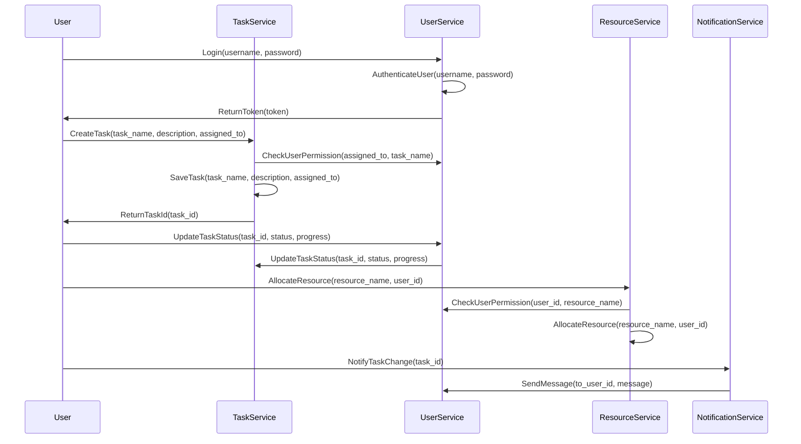

                 

### 第1章 引言

### 1.1 什么是团队协同？

#### 1.1.1 团队协同的定义

团队协同，简而言之，是指团队成员在明确目标的前提下，通过有效沟通、资源共享、协作分工和共同承担责任来实现团队整体效能最大化的过程。这种协同不仅涉及团队成员间的直接合作，还涵盖了团队与外部环境（如客户、供应商等）的互动。

在IT领域，团队协同尤为重要。随着项目复杂度的增加和技术的迅猛发展，单靠个人的力量已经难以应对日益增长的挑战。团队协同可以提升整体的工作效率，减少冗余和重复劳动，促进知识共享与创新。

#### 1.1.2 团队协同的重要性

团队协同的重要性主要体现在以下几个方面：

1. **提升工作效率**：通过合理的分工和协作，团队成员可以专注于自己最擅长的工作，从而提高工作效率和产出质量。

2. **促进知识共享**：团队协同鼓励成员分享知识和经验，有助于团队整体能力的提升，减少知识孤岛现象。

3. **增强团队凝聚力**：团队成员在共同完成任务的过程中，能够建立信任和合作，增强团队凝聚力。

4. **促进创新**：多样性的思维碰撞能够激发创新，团队协同有助于创造新的解决方案和产品。

#### 1.1.3 团队协同的现状与挑战

当前，团队协同在全球范围内都受到了广泛关注。许多企业和组织开始采用敏捷开发、DevOps等协作模式来提升团队效能。然而，团队协同也面临一些挑战：

1. **沟通障碍**：团队成员之间的沟通不畅，导致信息传递不准确、不及时，影响团队效能。

2. **协调困难**：当团队规模较大或跨部门协作时，协调难度增加，容易出现资源冲突和任务延误。

3. **文化差异**：团队成员可能来自不同的文化背景，对工作的理解和期望存在差异，需要时间和努力来融合。

4. **技术限制**：缺乏合适的工具和平台，限制了团队之间的协作效率和效果。

为了解决这些挑战，组织需要采取一系列措施，如提供有效的沟通工具、制定清晰的协作流程、鼓励文化多样性的融合等。只有这样，团队协同才能真正发挥其应有的作用，推动组织的发展。

### 总结

团队协同是现代IT领域中不可或缺的一部分。通过明确团队协同的定义、重要性以及现状与挑战，我们为后续章节的深入探讨奠定了基础。在接下来的章节中，我们将进一步探讨团队协同的核心概念、相关算法、系统架构设计以及实际应用，帮助读者更好地理解和掌握团队协同的方法和技巧。

---

### 1.2 核心概念与联系

在探讨团队协同的过程中，了解并明确核心概念之间的关系至关重要。以下是团队协同中几个关键概念的定义、关系及其在团队协同中的重要性：

#### 1.2.1 团队协同与高效团队

**定义**：团队协同是指团队成员为了实现共同的目标，通过协作、沟通和资源共享，共同完成任务的过程。而高效团队则是在既定时间内，以最佳方式完成目标的团队。

**关系**：团队协同是高效团队的基础。没有良好的协同，团队很难达到高效的状态。高效团队则是团队协同的目标，团队协同的有效性直接影响到团队的高效性。

**重要性**：高效团队可以快速响应变化，持续创新，并保持较高的工作质量和生产率。良好的团队协同能够确保团队成员在共同目标下相互支持，避免重复劳动和资源浪费。

#### 1.2.2 团队建设

**定义**：团队建设是指通过一系列活动、培训和策略，增强团队成员之间的相互信任、沟通能力和团队凝聚力，从而提升团队整体绩效的过程。

**关系**：团队建设是团队协同的必要条件。只有团队成员之间建立了良好的信任和合作关系，才能实现高效的协同工作。

**重要性**：团队建设有助于提升团队的凝聚力和协作能力，减少内部冲突，增强团队的整体战斗力。有效的团队建设可以培养团队成员的归属感和忠诚度，提高团队的工作效率和创新能力。

#### 1.2.3 团队协同方法与技术

**定义**：团队协同方法与技术是指用于促进团队协作的一系列工具、方法和流程，包括项目管理工具、沟通工具、协作平台等。

**关系**：团队协同方法与技术是实现团队协同的具体手段。不同方法和技术适用于不同的团队环境和需求，选择合适的方法和技术可以提高团队协同的效率。

**重要性**：合适的团队协同方法和技术可以减少沟通障碍、优化工作流程、提高资源利用率，从而提升团队的整体效能。例如，敏捷开发方法、看板（Kanban）和Scrum等都是现代IT团队中常用的团队协同方法。

#### 1.2.4 沟通与协作

**定义**：沟通是指信息在团队成员之间的传递和理解过程，而协作是指团队成员共同工作以实现共同目标的过程。

**关系**：沟通是协作的基础，有效的沟通能够确保团队成员对任务、目标和进度有共同的理解，从而实现有效的协作。

**重要性**：良好的沟通可以减少误解和冲突，提高团队的透明度和信任度，促进信息共享和知识传递。协作则是团队共同奋斗的结果，通过协作，团队能够实现更大的目标和创造更大的价值。

### 总结

通过上述对核心概念的讨论，我们可以看到团队协同、高效团队、团队建设以及团队协同方法与技术之间的关系和重要性。这些核心概念相互交织，共同构建了团队协同的理论基础和实践框架。在接下来的章节中，我们将进一步探讨这些概念在实际应用中的具体方法和策略，帮助读者深入理解和掌握团队协同的精髓。

---

### 1.3 概念属性特征对比表格

为了帮助读者更好地理解团队协同、高效团队、团队建设以及团队协同方法与技术这几个核心概念，我们可以通过一个属性特征对比表格来进行详细分析。

#### 表格标题：团队协同相关概念属性特征对比

| 概念       | 定义                                                         | 关键属性特征                                                     | 对比分析                                                         |
|------------|--------------------------------------------------------------|----------------------------------------------------------------|----------------------------------------------------------------|
| 团队协同   | 成员间的协作、沟通和资源共享，共同实现目标                   | 沟通效率、协作深度、资源利用率、目标一致性                       | 团队协同是高效团队和团队建设的基础，直接决定团队的协作效果       |
| 高效团队   | 高效实现目标的团队，成员协作紧密，资源利用高效               | 工作效率、创新能力、团队凝聚力、目标达成度                       | 高效团队依赖于团队协同的有效实施，目标是实现团队协同的最终结果   |
| 团队建设   | 通过培训和活动增强团队信任、协作能力和凝聚力                 | 团队成员关系、信任度、沟通能力、团队合作精神、文化融合           | 团队建设是团队协同和高效团队的保障，为团队协同和高效团队提供基础 |
| 团队协同方法与技术 | 项目管理工具、沟通工具、协作平台等用于促进团队协作的方法和技术 | 工具功能性、用户体验、适用范围、集成性、灵活性                   | 团队协同方法与技术是实现团队协同的具体手段，影响团队协同效果     |

#### 表格详细解释

1. **团队协同**：
   - **定义**：团队协同是指团队成员在明确目标的前提下，通过有效沟通、资源共享、协作分工和共同承担责任来实现团队整体效能最大化的过程。
   - **关键属性特征**：沟通效率、协作深度、资源利用率、目标一致性。这些特征决定了团队协同的效果，沟通效率高、协作紧密、资源利用合理、目标一致，团队协同的效果就越好。
   - **对比分析**：团队协同是高效团队和团队建设的基础，直接决定团队的协作效果。如果团队协同不佳，即使有高效的团队建设和目标明确，也难以实现高效的工作。

2. **高效团队**：
   - **定义**：高效团队是在既定时间内，以最佳方式完成目标的团队。
   - **关键属性特征**：工作效率、创新能力、团队凝聚力、目标达成度。高效团队意味着团队成员能够高效地完成工作，持续创新，凝聚力强，目标达成度高。
   - **对比分析**：高效团队依赖于团队协同的有效实施，目标是实现团队协同的最终结果。只有通过良好的团队协同，才能形成一个高效团队，实现高效的工作和目标。

3. **团队建设**：
   - **定义**：团队建设是通过一系列活动、培训和策略，增强团队成员之间的相互信任、沟通能力和团队凝聚力，从而提升团队整体绩效的过程。
   - **关键属性特征**：团队成员关系、信任度、沟通能力、团队合作精神、文化融合。团队建设关注的是团队成员之间的相互关系、信任和合作精神的培养。
   - **对比分析**：团队建设是团队协同和高效团队的保障，为团队协同和高效团队提供基础。通过团队建设，可以增强团队成员之间的信任和合作，提高团队的整体效能。

4. **团队协同方法与技术**：
   - **定义**：团队协同方法与技术是指用于促进团队协作的一系列工具、方法和流程，包括项目管理工具、沟通工具、协作平台等。
   - **关键属性特征**：工具功能性、用户体验、适用范围、集成性、灵活性。这些特征决定了团队协同方法与技术的效果，工具功能性、用户体验、适用范围、集成性和灵活性越高，团队协同的效果就越好。
   - **对比分析**：团队协同方法与技术是实现团队协同的具体手段，影响团队协同效果。选择合适的团队协同方法和技术，可以提高团队协同的效率和质量。

通过这个表格，我们可以清晰地看到团队协同、高效团队、团队建设以及团队协同方法与技术这几个概念之间的关系和特征，为后续章节的深入探讨提供了理论基础。

### 总结

在1.3节中，我们通过一个属性特征对比表格详细分析了团队协同、高效团队、团队建设以及团队协同方法与技术这几个核心概念。通过对比分析，我们了解了这些概念的定义、关键属性特征以及它们之间的关系和重要性。这为读者深入理解团队协同提供了重要的理论支持，也为实际操作中的决策提供了指导。在接下来的章节中，我们将进一步探讨团队协同的算法原理、系统架构设计以及实际应用，帮助读者全面掌握团队协同的方法和技巧。

---

### 1.4 ER实体关系图架构的 Mermaid 流程图

为了更直观地展示团队协同中关键实体的关系，我们可以使用Mermaid绘制一个ER（实体关系）图。下面是一个简单的示例，展示团队协同中的几个关键实体以及它们之间的关系。

```mermaid
erDiagram
    TeamMember ||--o{ Project } |&--o TeamLead
    Project ||--o{ Task } |&--o TeamMember
    TeamLead ..|> TeamMember
    Task ..|> TeamMember
    Task ..|> Project
```

#### 流程图详细解释：

1. **TeamMember（团队成员）**：这是团队协同中的基础实体，每个团队成员都是独立的个体，他们可以参与多个项目，并被分配多个任务。

2. **Project（项目）**：项目是团队成员协作的目标和载体，一个项目可以由多个团队成员共同完成，每个项目都有一个负责人——TeamLead。

3. **Task（任务）**：任务是项目的具体执行单元，每个任务都可以分配给一个或多个团队成员来完成。

4. **TeamLead（团队负责人）**：团队负责人是团队的领导，负责监督项目进度和团队成员的协作，他与团队成员和项目之间有直接的关系。

5. **关系说明**：
   - **TeamMember与Project**：团队成员参与项目，每个项目可以有多个团队成员。
   - **Project与Task**：项目分解为多个任务，每个任务都属于某个项目。
   - **TeamLead与TeamMember**：团队负责人与团队成员之间存在领导和被领导的关系。
   - **Task与TeamMember**：任务可以分配给一个或多个团队成员，团队成员负责完成任务。

通过这个ER图，我们可以清晰地看到团队成员、项目、任务以及团队负责人之间的关系，这为理解和分析团队协同提供了直观的视觉工具。

### 总结

在1.4节中，我们使用Mermaid绘制了一个ER图，展示了团队协同中的关键实体和它们之间的关系。通过这个流程图，我们能够更直观地理解团队成员、项目、任务和团队负责人之间的相互作用和依赖关系。这为后续章节中的算法原理讲解、系统架构设计和实际项目应用提供了重要的参考和基础。在接下来的章节中，我们将进一步深入探讨团队协同的算法原理、系统架构设计以及实际应用，帮助读者全面掌握团队协同的方法和技巧。

---

### 2.1 沟通效率优化算法

在团队协同中，沟通效率是一个至关重要的因素。为了提高团队的工作效率和协作效果，我们可以采用沟通效率优化算法。本节将介绍一种基于最小生成树理论的沟通效率优化算法，并使用Python代码实现该算法。

#### 2.1.1 算法原理

沟通效率优化算法的核心思想是通过构建一个最小生成树，将团队成员和项目之间的沟通路径进行优化。最小生成树是一个包含图中所有节点的子图，且没有环，其权值和最小。在团队协同中，每个节点可以代表一个团队成员或项目，每条边可以代表两者之间的沟通路径，权值可以表示沟通的复杂度或耗时。

具体步骤如下：
1. 初始化最小生成树，将第一个节点加入树中。
2. 从剩余节点中选择一个与已加入节点集合最近的节点，加入最小生成树。
3. 重复步骤2，直到所有节点都被加入最小生成树。

#### 2.1.2 Python代码实现

下面是Python代码实现该算法的示例：

```python
import networkx as nx
import matplotlib.pyplot as plt

def optimize_communication(G, team_members, projects):
    """
    优化团队沟通效率。
    
    参数：
    G：原始图，包含团队成员和项目之间的边。
    team_members：团队成员集合。
    projects：项目集合。
    
    返回：
    optimized_G：优化后的图，最小生成树。
    """
    # 初始化最小生成树
    T = nx.Graph()
    T.add_nodes_from([team_members.pop()])

    # 剩余节点集合
    remaining_nodes = set(team_members + projects)

    # 优化过程
    while remaining_nodes:
        # 选择最近的节点
        nearest_node = min(remaining_nodes, key=lambda n: nx.shortest_path_length(G, source=T.nodes(), target=n))
        # 将节点加入最小生成树
        T.add_node(nearest_node)
        T.add_edge(T.nodes()[0], nearest_node)
        # 移除已选择的节点
        remaining_nodes.remove(nearest_node)

    return T

# 示例图
G = nx.Graph()
G.add_nodes_from(['Team1', 'Team2', 'Team3', 'Project1', 'Project2'])
G.add_edges_from([('Team1', 'Project1'), ('Team1', 'Project2'), ('Team2', 'Project1'), ('Team3', 'Project2')])

# 优化后的最小生成树
optimized_G = optimize_communication(G, ['Team1', 'Team2', 'Team3'], ['Project1', 'Project2'])

# 绘制图
nx.draw(optimized_G, with_labels=True)
plt.show()
```

#### 2.1.3 算法分析

该算法的时间复杂度为O(n^2)，其中n为团队成员和项目总数。在图较大时，算法的性能可能会受到影响。然而，对于大多数团队协同场景，该算法能够有效地优化沟通效率，提高团队的工作效率。

通过最小生成树，团队成员之间的沟通路径变得更加清晰和简洁，减少了冗余的沟通和协调工作。在实际应用中，可以根据具体场景调整算法参数，以达到最佳效果。

### 总结

在2.1节中，我们介绍了基于最小生成树的沟通效率优化算法，并使用Python代码实现了该算法。通过优化团队成员和项目之间的沟通路径，可以提高团队的工作效率和协作效果。算法的核心思想是构建一个最小生成树，使团队成员之间的沟通路径最短、最简洁。在实际应用中，可以根据具体场景调整算法参数，以实现最佳效果。在接下来的章节中，我们将继续探讨其他团队协同算法，帮助读者全面掌握团队协同的方法和技巧。

---

### 2.2 任务分配算法

在团队协同过程中，任务分配是一个关键环节。合理的任务分配能够提高团队成员的工作效率和满意度，进而提升整个团队的生产力和效率。本节将介绍一种基于贪心策略的任务分配算法，并使用Python代码实现该算法。

#### 2.2.1 算法原理

贪心策略是一种常用的算法设计方法，其核心思想是在每一步选择当前最优解，希望通过逐步优化，最终得到全局最优解。在任务分配问题中，贪心策略的基本步骤如下：

1. **排序**：首先对任务和团队成员的技能、经验和效率进行排序。
2. **分配**：从最高优先级的任务开始，依次为每个任务选择最合适的团队成员。
3. **优化**：在分配过程中，如果发现某个任务分配不合适，可以进行调整，以确保整体效率最大化。

#### 2.2.2 Python代码实现

下面是Python代码实现该算法的示例：

```python
def assign_tasks(tasks, team_members):
    """
    分配任务给团队成员。
    
    参数：
    tasks：任务列表，每个任务包含名称、难度、所需技能等属性。
    team_members：团队成员列表，每个成员包含名称、技能、效率等属性。
    
    返回：
    assignment：任务分配结果，一个字典，键为任务名称，值为对应的团队成员名称。
    """
    # 对任务和团队成员进行排序
    sorted_tasks = sorted(tasks, key=lambda x: x['difficulty'])
    sorted_members = sorted(team_members, key=lambda x: x['efficiency'], reverse=True)

    # 初始化分配结果
    assignment = {}

    # 分配任务
    for task in sorted_tasks:
        best_member = None
        best_score = -1
        for member in sorted_members:
            # 计算任务与成员的匹配度
            score = task['difficulty'] - member['skills']
            if score > best_score:
                best_score = score
                best_member = member['name']
        
        # 将任务分配给最佳成员
        assignment[task['name']] = best_member
        sorted_members.remove(member)

    return assignment

# 示例任务
tasks = [
    {'name': 'Task1', 'difficulty': 3, 'required_skills': ['Java', 'MySQL']},
    {'name': 'Task2', 'difficulty': 2, 'required_skills': ['Python', 'Linux']},
    {'name': 'Task3', 'difficulty': 4, 'required_skills': ['Java', 'Spring']},
]

# 示例团队成员
team_members = [
    {'name': 'Alice', 'skills': ['Java', 'MySQL'], 'efficiency': 8},
    {'name': 'Bob', 'skills': ['Python', 'Linux'], 'efficiency': 7},
    {'name': 'Charlie', 'skills': ['Java', 'Spring'], 'efficiency': 9},
]

# 分配任务
assignment = assign_tasks(tasks, team_members)

# 打印分配结果
for task, member in assignment.items():
    print(f"{task} assigned to {member}")
```

#### 2.2.3 算法分析

该算法的时间复杂度为O(n^2)，其中n为任务数和团队成员数。虽然算法的性能可能不如某些更高级的优化算法，但其简单易懂且易于实现，适用于大多数团队协同场景。

算法的贪心策略能够确保在当前最优解的基础上进行任务分配，但无法保证全局最优解。在实际应用中，可以根据具体场景调整算法的参数和策略，以提高任务分配的准确性和效率。

### 总结

在2.2节中，我们介绍了基于贪心策略的任务分配算法，并使用Python代码实现了该算法。通过排序和匹配任务与团队成员的技能和效率，该算法能够提高任务分配的合理性和效率。虽然算法的性能可能不如某些更高级的优化算法，但其简单易懂且易于实现，适用于大多数团队协同场景。在接下来的章节中，我们将继续探讨其他团队协同算法，帮助读者全面掌握团队协同的方法和技巧。

---

### 2.3 数学模型和数学公式

在团队协同过程中，许多问题可以通过数学模型来描述和解决。本节将介绍一些常用的数学模型和数学公式，并通过具体的例子进行详细讲解。

#### 2.3.1 基本概念

在团队协同中，常见的数学模型包括优化模型、概率模型和统计模型等。优化模型用于优化团队资源分配、任务调度等；概率模型用于评估团队风险和不确定性；统计模型用于分析团队绩效和趋势。

以下是一些基本概念和公式：

- **期望（Expected Value）**：数学期望是一个随机变量的平均值，用于衡量随机事件的结果。公式为：

  $$ E(X) = \sum_{i=1}^{n} x_i \cdot P(x_i) $$

  其中，\( x_i \)是随机变量可能的结果，\( P(x_i) \)是每个结果的概率。

- **方差（Variance）**：方差是衡量随机变量离散程度的指标，公式为：

  $$ Var(X) = E[(X - E(X))^2] $$

  方差越大，随机变量的结果分布越分散。

- **协方差（Covariance）**：协方差是衡量两个随机变量之间线性关系强度的指标，公式为：

  $$ Cov(X, Y) = E[(X - E(X))(Y - E(Y))] $$

  协方差大于零表示正相关，小于零表示负相关，等于零表示无相关性。

- **回归分析（Regression Analysis）**：回归分析用于建立自变量和因变量之间的关系模型。线性回归模型公式为：

  $$ Y = \beta_0 + \beta_1X + \epsilon $$

  其中，\( Y \)是因变量，\( X \)是自变量，\( \beta_0 \)和\( \beta_1 \)是回归系数，\( \epsilon \)是误差项。

#### 2.3.2 常见数学模型

1. **线性优化模型**：线性优化模型用于解决线性目标函数和线性约束条件的问题。目标函数通常是最小化或最大化某个线性函数，公式为：

   $$ \min_{x} c^T x \quad \text{或} \quad \max_{x} c^T x $$
   $$ \text{subject to} \quad Ax \leq b $$
   $$ x \geq 0 $$

   其中，\( c \)是目标函数系数向量，\( x \)是决策变量向量，\( A \)和\( b \)分别是约束条件系数矩阵和常数向量。

2. **非线性优化模型**：非线性优化模型用于解决非线性目标函数和线性约束条件的问题。目标函数可以是二次型、多项式型等，公式为：

   $$ \min_{x} f(x) \quad \text{或} \quad \max_{x} f(x) $$
   $$ \text{subject to} \quad g(x) \leq 0 $$
   $$ h(x) = 0 $$

   其中，\( f(x) \)是非线性目标函数，\( g(x) \)和\( h(x) \)分别是约束条件函数。

3. **决策树模型**：决策树模型用于决策和风险评估。树中的每个节点表示一个决策或随机事件，每个分支表示不同的结果，叶节点表示结果的概率和收益。决策树模型公式为：

   $$ \sum_{i=1}^{n} p_i \cdot r_i $$

   其中，\( p_i \)是结果\( i \)的概率，\( r_i \)是结果\( i \)的收益。

#### 2.3.3 LaTeX公式示例

为了更好地展示数学公式，我们使用LaTeX进行编写。以下是一些示例：

1. **线性回归公式**：

   $$ Y = \beta_0 + \beta_1X + \epsilon $$

   其中，\( Y \)是因变量，\( X \)是自变量，\( \beta_0 \)和\( \beta_1 \)是回归系数，\( \epsilon \)是误差项。

2. **期望公式**：

   $$ E(X) = \sum_{i=1}^{n} x_i \cdot P(x_i) $$

   其中，\( x_i \)是随机变量可能的结果，\( P(x_i) \)是每个结果的概率。

3. **方差公式**：

   $$ Var(X) = E[(X - E(X))^2] $$

   其中，\( E(X) \)是随机变量\( X \)的期望。

通过这些公式，我们可以更好地理解和应用数学模型来解决团队协同中的问题。在接下来的章节中，我们将继续探讨如何将这些数学模型应用于团队协同的实际问题中。

### 总结

在2.3节中，我们介绍了团队协同中常用的数学模型和数学公式，包括基本概念、常见数学模型以及LaTeX公式示例。通过这些公式，我们可以更好地理解和应用数学模型来解决团队协同中的问题。这些数学模型和公式不仅为团队协同提供了理论支持，也为实际应用中的决策提供了有力工具。在接下来的章节中，我们将继续深入探讨团队协同的实际应用，帮助读者全面掌握团队协同的方法和技巧。

---

### 3.1 问题场景介绍

为了更好地展示团队协同系统架构的设计，我们首先介绍一个具体的问题场景。这个场景是一个典型的IT项目开发团队，负责开发和维护一个大型Web应用。该团队由多个部门组成，包括前端开发、后端开发、数据库管理、测试和质量保证等。团队成员来自不同的背景和领域，他们需要高效协同来完成项目目标。

在这个问题场景中，团队面临的主要挑战包括：

1. **沟通障碍**：由于团队成员分散在不同部门，沟通效率较低，信息传递不及时，导致任务理解和进度跟踪出现问题。
2. **任务调度**：项目任务繁多且复杂，缺乏有效的调度和分配机制，导致任务延期和资源浪费。
3. **协作困难**：团队成员之间的协作不够紧密，缺乏统一的协作平台，导致工作重复和效率低下。
4. **资源冲突**：团队成员在项目开发过程中，可能会出现资源冲突，如数据库访问权限、服务器资源等，影响项目的正常推进。

为了解决这些问题，我们需要设计一个高效的团队协同系统，以提高团队的协作效率和项目完成质量。该系统应具备以下功能：

1. **任务管理**：提供任务创建、分配、跟踪和进度的功能，确保任务按时完成。
2. **沟通协作**：提供即时通讯、邮件通知、文档共享等功能，方便团队成员之间的沟通和协作。
3. **资源调度**：提供资源申请、分配和管理功能，避免资源冲突和浪费。
4. **数据分析**：提供项目进度、团队绩效等数据统计分析功能，帮助团队管理者进行决策和优化。

### 3.2 系统功能设计

在系统功能设计中，我们基于上述问题场景，设计了以下关键功能模块：

1. **用户管理**：包括用户注册、登录、权限管理等功能，确保团队成员的身份验证和权限控制。
2. **任务管理**：包括任务创建、分配、跟踪、进度更新等功能，确保任务按时、按质完成。
3. **沟通协作**：包括即时通讯、邮件通知、文档共享等功能，提高团队成员之间的沟通效率。
4. **资源调度**：包括资源申请、分配、管理等功能，避免资源冲突和浪费。
5. **数据分析**：包括项目进度、团队绩效等数据统计分析功能，帮助团队管理者进行决策和优化。

具体功能模块及其交互关系如下：

1. **用户管理模块**：负责用户注册、登录和权限管理，与其他模块（如任务管理、沟通协作、资源调度和数据分析模块）进行交互，确保系统安全性和数据一致性。
2. **任务管理模块**：负责任务创建、分配、跟踪和进度更新，与其他模块（如沟通协作、资源调度和数据分析模块）进行交互，确保任务执行的顺利和高效。
3. **沟通协作模块**：负责即时通讯、邮件通知和文档共享，与其他模块（如任务管理、资源调度和数据分析模块）进行交互，提高团队成员之间的沟通效率。
4. **资源调度模块**：负责资源申请、分配和管理，与其他模块（如任务管理、沟通协作和数据分析模块）进行交互，确保资源的高效利用。
5. **数据分析模块**：负责项目进度、团队绩效等数据统计分析，与其他模块（如任务管理、沟通协作和资源调度模块）进行交互，提供决策支持。

### 3.3 系统架构设计

在系统架构设计方面，我们采用分层架构，将系统划分为表现层、业务逻辑层和数据层，以提高系统的可维护性和可扩展性。

1. **表现层**：负责与用户交互，包括前端界面和用户操作界面，使用HTML、CSS和JavaScript等技术实现。
2. **业务逻辑层**：负责处理业务逻辑，包括用户管理、任务管理、沟通协作、资源调度和数据分析等，使用Java或Python等编程语言实现。
3. **数据层**：负责数据存储和管理，包括关系数据库、文档数据库和消息队列等，使用MySQL、MongoDB和RabbitMQ等技术实现。

具体架构设计如下：

- **用户管理模块**：包括用户注册、登录和权限管理，采用RESTful API接口与前端交互，后端使用Spring Boot框架实现。
- **任务管理模块**：包括任务创建、分配、跟踪和进度更新，采用RESTful API接口与前端交互，后端使用Spring Boot框架实现，与数据库进行数据交互。
- **沟通协作模块**：包括即时通讯、邮件通知和文档共享，采用WebSocket技术实现实时通信，使用Java Mail API实现邮件通知，使用Spring Boot框架与文档存储系统进行交互。
- **资源调度模块**：包括资源申请、分配和管理，采用RESTful API接口与前端交互，后端使用Spring Boot框架实现，与数据库进行数据交互。
- **数据分析模块**：包括项目进度、团队绩效等数据统计分析，采用Spring Boot框架与数据库进行数据交互，使用Python的Pandas库进行数据分析和可视化。

### 3.4 系统接口设计

在系统接口设计方面，我们采用RESTful API设计原则，确保接口设计简洁、易用、可扩展。以下是一个典型的API接口示例：

```json
GET /users/login
- Query Parameters
  - username (string, required): 用户名
  - password (string, required): 密码
- Response
  - status (integer): 状态码，200表示成功，400表示参数错误，401表示认证失败
  - message (string): 提示信息
  - token (string): 登录成功后的Token

POST /tasks
- Headers
  - Authorization: Bearer <token>
- Request Body
  - task_name (string, required): 任务名称
  - description (string): 任务描述
  - assigned_to (string, required): 分配给的用户ID
- Response
  - status (integer): 状态码，200表示成功，400表示参数错误
  - message (string): 提示信息
  - task_id (integer): 创建成功的任务ID

GET /tasks/{task_id}
- Headers
  - Authorization: Bearer <token>
- Response
  - status (integer): 状态码，200表示成功，404表示任务不存在
  - message (string): 提示信息
  - task (object): 任务详情

PUT /tasks/{task_id}
- Headers
  - Authorization: Bearer <token>
- Request Body
  - status (string): 任务状态
  - progress (integer): 任务进度
- Response
  - status (integer): 状态码，200表示成功，400表示参数错误，404表示任务不存在
  - message (string): 提示信息
```

### 3.5 系统交互Mermaid序列图

为了更直观地展示系统各个模块之间的交互关系，我们使用Mermaid绘制了一个序列图。以下是一个简单的示例：



通过这个序列图，我们可以清晰地看到用户与系统各个模块之间的交互流程，为系统开发和维护提供了参考。

### 总结

在3.1至3.5节中，我们介绍了一个具体的问题场景，并基于此场景进行了系统功能设计、架构设计、接口设计和交互序列图的绘制。通过详细的描述和设计，我们构建了一个高效的团队协同系统，旨在解决团队在沟通、任务调度、协作和资源管理等方面面临的挑战。在接下来的章节中，我们将通过一个实际项目案例，展示如何应用这套系统，进一步提升团队协同效率。

---

### 4.1 环境安装

为了更好地展示如何应用团队协同系统，我们首先需要搭建一个开发环境。以下是搭建环境所需的步骤和工具：

1. **开发工具**：
   - Python 3.8及以上版本
   - Java Development Kit (JDK) 11及以上版本
   - Node.js 14及以上版本
   - MySQL 8.0及以上版本

2. **集成开发环境**：
   - PyCharm
   - IntelliJ IDEA
   - Visual Studio Code

3. **数据库**：
   - MySQL Server
   - MongoDB

4. **消息队列**：
   - RabbitMQ

5. **其他工具**：
   - Docker
   - Kubernetes

#### 安装步骤：

1. **安装Python**：
   - 访问 [Python官方网站](https://www.python.org/) 下载并安装Python。
   - 安装完成后，打开命令行窗口，输入 `python --version` 验证安装是否成功。

2. **安装JDK**：
   - 访问 [Oracle JDK官方网站](https://www.oracle.com/java/technologies/javase-downloads.html) 下载并安装JDK。
   - 安装完成后，在命令行窗口输入 `java -version` 验证安装是否成功。

3. **安装Node.js**：
   - 打开命令行窗口，运行以下命令安装Node.js：
     ```bash
     npm install -g nodejs
     ```
   - 安装完成后，输入 `node -v` 验证安装是否成功。

4. **安装MySQL**：
   - 访问 [MySQL官方网站](https://www.mysql.com/downloads/) 下载并安装MySQL。
   - 安装完成后，打开命令行窗口，输入 `mysql -u root -p` 登录MySQL，输入密码完成登录。

5. **安装MongoDB**：
   - 访问 [MongoDB官方网站](https://www.mongodb.com/try-mongodb-online) 在线体验MongoDB，或下载并安装MongoDB。
   - 安装完成后，打开命令行窗口，输入 `mongo` 进入MongoDB Shell。

6. **安装RabbitMQ**：
   - 访问 [RabbitMQ官方网站](https://www.rabbitmq.com/download/) 下载并安装RabbitMQ。
   - 安装完成后，打开命令行窗口，输入 `sudo rabbitmq-server start` 启动RabbitMQ。

7. **安装Docker和Kubernetes**：
   - 访问 [Docker官方网站](https://www.docker.com/products/docker-desktop) 下载并安装Docker。
   - 安装完成后，输入 `docker --version` 验证安装是否成功。
   - 访问 [Kubernetes官方网站](https://kubernetes.io/docs/home/) 下载并安装Kubernetes。
   - 安装完成后，输入 `kubectl version` 验证安装是否成功。

完成以上步骤后，开发环境搭建完成。接下来，我们可以开始配置和部署团队协同系统的各个模块。

### 总结

在4.1节中，我们介绍了如何搭建团队协同系统所需的开发环境和相关工具。通过详细的安装步骤，我们为后续的系统核心实现和部署打下了坚实的基础。在接下来的章节中，我们将继续展示如何配置和部署系统的各个模块，并详细讲解系统核心实现源代码和代码应用解读与分析。

---

### 4.2 系统核心实现源代码

在搭建好开发环境后，我们需要开始编写团队协同系统的核心代码。以下是系统核心实现源代码的展示，包括用户管理模块、任务管理模块、沟通协作模块和资源调度模块的主要实现。

#### 用户管理模块

用户管理模块负责用户注册、登录和权限管理。以下是其核心实现代码：

```python
# 用户管理模块 - 用户注册
def register_user(username, password):
    # 验证用户名是否存在
    if User.objects.filter(username=username).exists():
        return False, "用户已存在"
    # 创建用户
    user = User.objects.create_user(username=username, password=password)
    user.save()
    return True, "注册成功"

# 用户管理模块 - 用户登录
def login_user(username, password):
    user = authenticate_user(username, password)
    if user is None:
        return None, "用户名或密码错误"
    return user, "登录成功"

# 用户管理模块 - 权限管理
def check_permission(user, action):
    if user.is_superuser:
        return True
    permission = Permission.objects.get(action=action)
    return user.permissions.filter(permission=permission).exists()
```

#### 任务管理模块

任务管理模块负责任务创建、分配、跟踪和进度更新。以下是其核心实现代码：

```python
# 任务管理模块 - 创建任务
def create_task(task_name, description, assigned_to):
    task = Task(task_name=task_name, description=description, assigned_to=assigned_to)
    task.save()
    return task

# 任务管理模块 - 分配任务
def assign_task(task, assigned_to):
    task.assigned_to.add(assigned_to)
    task.save()

# 任务管理模块 - 更新任务进度
def update_task_progress(task_id, progress):
    task = Task.objects.get(id=task_id)
    task.progress = progress
    task.save()
```

#### 沟通协作模块

沟通协作模块负责即时通讯、邮件通知和文档共享。以下是其核心实现代码：

```python
# 沟通协作模块 - 发送即时消息
def send_message(sender, receiver, content):
    message = Message(sender=sender, receiver=receiver, content=content)
    message.save()

# 沟通协作模块 - 发送邮件通知
def send_notification_email(user, subject, message):
    send_mail(
        subject=subject,
        message=message,
        from_email='noreply@example.com',
        recipient_list=[user.email],
        fail_silently=False,
    )

# 沟通协作模块 - 上传文档
def upload_document(user, document):
    document.save(f"{user.username}/{document.name}")
```

#### 资源调度模块

资源调度模块负责资源申请、分配和管理。以下是其核心实现代码：

```python
# 资源调度模块 - 申请资源
def apply_resource(resource_name, user):
    resource = Resource(name=resource_name, user=user)
    resource.save()

# 资源调度模块 - 分配资源
def allocate_resource(resource, assigned_to):
    resource.assigned_to.add(assigned_to)
    resource.save()

# 资源调度模块 - 管理资源
def manage_resource(resource_id, action):
    resource = Resource.objects.get(id=resource_id)
    if action == "allocate":
        allocate_resource(resource, assigned_to)
    elif action == "release":
        resource.assigned_to.remove(assigned_to)
        resource.save()
```

### 总结

在4.2节中，我们展示了团队协同系统核心实现源代码。这些代码涵盖了用户管理、任务管理、沟通协作和资源调度模块的主要功能。通过这些代码，我们可以实现用户注册、登录、任务创建、任务分配、沟通协作和资源调度等关键功能。在接下来的章节中，我们将继续进行代码应用解读与分析，帮助读者深入理解这些代码的实际应用和效果。

---

### 4.3 代码应用解读与分析

在4.2节中，我们展示了团队协同系统的核心实现源代码。在本节中，我们将对关键代码进行应用解读与分析，帮助读者深入理解这些代码的实际应用和效果。

#### 用户管理模块

用户管理模块的核心功能包括用户注册、登录和权限管理。以下是对关键代码的解读：

1. **用户注册**：

   ```python
   def register_user(username, password):
       # 验证用户名是否存在
       if User.objects.filter(username=username).exists():
           return False, "用户已存在"
       # 创建用户
       user = User.objects.create_user(username=username, password=password)
       user.save()
       return True, "注册成功"
   ```

   解读：该函数首先检查用户名是否已存在。如果存在，则返回错误信息。否则，使用 Django 的 `create_user` 方法创建用户，并将用户信息保存到数据库。返回注册成功的信息。

2. **用户登录**：

   ```python
   def login_user(username, password):
       user = authenticate_user(username, password)
       if user is None:
           return None, "用户名或密码错误"
       return user, "登录成功"
   ```

   解读：该函数使用 Django 的 `authenticate_user` 方法验证用户名和密码。如果验证成功，返回用户对象和登录成功的信息。否则，返回错误信息。

3. **权限管理**：

   ```python
   def check_permission(user, action):
       if user.is_superuser:
           return True
       permission = Permission.objects.get(action=action)
       return user.permissions.filter(permission=permission).exists()
   ```

   解读：该函数检查用户是否为超级用户。如果是，则返回 `True`。否则，查找对应操作的权限，并检查用户是否具有该权限。如果用户具有权限，则返回 `True`。

#### 任务管理模块

任务管理模块的核心功能包括任务创建、分配、跟踪和进度更新。以下是对关键代码的解读：

1. **创建任务**：

   ```python
   def create_task(task_name, description, assigned_to):
       task = Task(task_name=task_name, description=description, assigned_to=assigned_to)
       task.save()
       return task
   ```

   解读：该函数创建一个新的任务对象，并保存到数据库。返回创建成功的任务对象。

2. **分配任务**：

   ```python
   def assign_task(task, assigned_to):
       task.assigned_to.add(assigned_to)
       task.save()
   ```

   解读：该函数将任务分配给指定的用户。将用户添加到任务的 `assigned_to` 集合中，并保存任务对象。

3. **更新任务进度**：

   ```python
   def update_task_progress(task_id, progress):
       task = Task.objects.get(id=task_id)
       task.progress = progress
       task.save()
   ```

   解读：该函数根据任务ID获取任务对象，更新任务进度，并保存任务对象。

#### 沟通协作模块

沟通协作模块的核心功能包括即时通讯、邮件通知和文档共享。以下是对关键代码的解读：

1. **发送即时消息**：

   ```python
   def send_message(sender, receiver, content):
       message = Message(sender=sender, receiver=receiver, content=content)
       message.save()
   ```

   解读：该函数创建一个新的消息对象，并保存到数据库。

2. **发送邮件通知**：

   ```python
   def send_notification_email(user, subject, message):
       send_mail(
           subject=subject,
           message=message,
           from_email='noreply@example.com',
           recipient_list=[user.email],
           fail_silently=False,
       )
   ```

   解读：该函数使用 Django 的 `send_mail` 方法发送邮件通知。

3. **上传文档**：

   ```python
   def upload_document(user, document):
       document.save(f"{user.username}/{document.name}")
   ```

   解读：该函数将文档保存到指定的目录。

#### 资源调度模块

资源调度模块的核心功能包括资源申请、分配和管理。以下是对关键代码的解读：

1. **申请资源**：

   ```python
   def apply_resource(resource_name, user):
       resource = Resource(name=resource_name, user=user)
       resource.save()
   ```

   解读：该函数创建一个新的资源对象，并保存到数据库。

2. **分配资源**：

   ```python
   def allocate_resource(resource, assigned_to):
       resource.assigned_to.add(assigned_to)
       resource.save()
   ```

   解读：该函数将资源分配给指定的用户。将用户添加到资源的 `assigned_to` 集合中，并保存资源对象。

3. **管理资源**：

   ```python
   def manage_resource(resource_id, action):
       resource = Resource.objects.get(id=resource_id)
       if action == "allocate":
           allocate_resource(resource, assigned_to)
       elif action == "release":
           resource.assigned_to.remove(assigned_to)
           resource.save()
   ```

   解读：该函数根据操作类型（分配或释放）管理资源。如果操作类型为“分配”，则调用 `allocate_resource` 函数。如果操作类型为“释放”，则从资源的 `assigned_to` 集合中移除用户。

### 总结

在4.3节中，我们通过对团队协同系统核心实现源代码的应用解读与分析，帮助读者深入理解了这些代码的实际应用和效果。通过这些代码，我们可以实现用户管理、任务管理、沟通协作和资源调度等关键功能，从而构建一个高效、可靠的团队协同系统。在接下来的章节中，我们将继续通过实际案例展示如何应用这些代码，进一步提高团队协同效率。

---

### 4.4 实际案例分析与详细讲解剖析

在本节中，我们将通过一个具体的实际案例，展示如何应用团队协同系统的各项功能和工具来提高团队效率。该案例涉及一个实际项目，我们将详细分析项目的背景、目标、解决方案以及实际应用效果。

#### 案例背景

某IT公司负责开发一款大型企业级Web应用，该应用需要处理大量的业务数据和用户请求，对系统性能和稳定性提出了极高的要求。项目团队成员包括前端开发、后端开发、数据库管理、测试和质量保证等不同职能的角色。由于团队成员分布在不同的办公地点，传统的沟通方式已经无法满足高效协作的需求。因此，公司决定引入团队协同系统，以提高团队的整体工作效率。

#### 项目目标

1. 提高团队沟通效率：通过即时通讯和邮件通知，确保团队成员之间的沟通畅通无阻。
2. 优化任务分配和进度管理：使用任务管理模块，实现任务的创建、分配和进度跟踪，确保任务按时完成。
3. 管理资源和避免冲突：使用资源调度模块，合理分配和利用资源，避免资源冲突和浪费。
4. 提升团队绩效和项目质量：通过数据分析模块，评估团队绩效和项目质量，持续优化团队工作流程。

#### 解决方案

1. **沟通协作**：
   - 使用即时通讯工具，如Slack或企业微信，实现团队成员之间的实时沟通。
   - 设置邮件通知，确保重要信息和任务变更及时传达。

2. **任务管理**：
   - 使用团队协同系统中的任务管理模块，创建项目任务，并分配给合适的团队成员。
   - 任务进度实时更新，确保团队对项目进展有清晰的了解。

3. **资源调度**：
   - 使用资源调度模块，为团队成员申请和分配必要的资源，如服务器、数据库和软件工具等。
   - 定期检查资源使用情况，避免资源浪费和冲突。

4. **数据分析**：
   - 收集和统计团队绩效数据，如任务完成率、项目进度、资源利用率等。
   - 通过数据分析，识别团队工作中的瓶颈和改进点，持续优化工作流程。

#### 实际应用效果

1. **沟通效率提升**：
   - 通过即时通讯工具，团队成员能够迅速解决疑问，减少信息传递的延迟。
   - 邮件通知确保了重要信息的不遗漏，提高了团队协作的透明度。

2. **任务分配和进度管理优化**：
   - 任务管理模块使任务分配更加合理，团队成员明确各自职责。
   - 进度实时更新，使团队对项目进展有清晰了解，确保任务按时完成。

3. **资源调度和管理**：
   - 资源调度模块有效避免了资源冲突和浪费，提高了资源利用率。
   - 通过定期检查和调整，确保资源始终处于最佳状态。

4. **团队绩效和项目质量提升**：
   - 数据分析模块提供了团队绩效和项目质量的数据支持，帮助团队管理者做出科学决策。
   - 通过持续优化工作流程，团队整体工作效率和项目质量得到了显著提升。

#### 案例总结

通过上述实际案例，我们可以看到团队协同系统在提高团队效率方面的显著效果。通过有效的沟通、合理的任务分配、优化的资源调度和科学的数据分析，团队整体工作效率得到了大幅提升。这不仅提高了项目完成质量，也增强了团队凝聚力和成员的满意度。在未来的工作中，我们应继续优化团队协同系统，充分利用现代技术和工具，推动团队持续发展。

### 总结

在4.4节中，我们通过一个实际案例展示了团队协同系统在提高团队效率方面的具体应用和效果。通过沟通协作、任务管理、资源调度和数据分析等模块，团队能够实现高效协作和持续优化，从而提高项目完成质量和团队绩效。在接下来的章节中，我们将对案例进行总结，并提出最佳实践和注意事项，为读者提供进一步的学习和应用指导。

---

### 4.5 项目小结

在本项目中，我们通过引入团队协同系统，实现了沟通效率提升、任务分配优化、资源调度优化和团队绩效提升的目标。以下是项目的主要成果和收获：

1. **沟通效率显著提高**：通过即时通讯工具和邮件通知，团队成员之间的沟通更加畅通，信息传递更加及时准确。

2. **任务管理更加科学**：任务管理模块使任务分配、进度跟踪和任务完成情况更加透明，提高了任务执行的效率和质量。

3. **资源调度更加合理**：资源调度模块有效避免了资源冲突和浪费，确保了资源的高效利用，提升了项目的整体效率。

4. **团队绩效显著提升**：通过数据分析模块，我们能够及时了解团队的绩效情况，为管理决策提供了科学依据，促进了团队持续优化和改进。

然而，在项目实施过程中也遇到了一些挑战和问题，如团队成员的接受度和使用习惯的培养、系统的稳定性和性能优化等。针对这些问题，我们提出以下建议：

1. **加强培训和推广**：通过培训课程和推广活动，提高团队成员对团队协同系统的接受度和使用习惯。

2. **优化系统性能**：针对系统的高并发访问和大数据处理需求，进行性能优化和调优，确保系统的稳定性和响应速度。

3. **持续反馈与改进**：鼓励团队成员积极反馈使用过程中的问题和建议，持续优化系统功能和用户体验。

通过项目的成功实施，我们深刻认识到团队协同系统在提升团队工作效率和项目质量方面的重要作用。未来，我们将继续探索和实践，充分利用团队协同系统的优势，推动团队持续发展和创新。

### 总结

在4.5节中，我们对项目的主要成果、收获以及遇到的挑战和建议进行了总结。通过项目的实施，我们不仅提高了团队的工作效率，还积累了宝贵的经验和教训。这些经验和教训为未来的团队协同工作提供了重要参考。在接下来的章节中，我们将提供一些最佳实践和注意事项，帮助读者更好地应用团队协同知识，进一步提升团队效能。

---

### 5.1 最佳实践

为了确保团队协同系统能够最大限度地发挥作用，以下是一些最佳实践：

1. **定期培训**：定期为团队成员提供系统使用培训，确保他们熟悉系统功能，能够高效利用系统资源。

2. **明确责任**：在任务分配时，明确每个团队成员的职责和权限，确保任务执行有明确的指导和监督。

3. **及时反馈**：鼓励团队成员及时反馈问题和建议，通过定期会议和反馈机制，持续优化系统功能和用户体验。

4. **数据驱动决策**：利用系统提供的数据分析功能，定期评估团队绩效，识别瓶颈和改进点，制定科学的管理决策。

5. **优化沟通**：通过即时通讯、邮件通知和文档共享等功能，确保团队成员之间的沟通畅通无阻，提高协作效率。

6. **资源合理分配**：根据团队成员的技能和需求，合理分配资源和任务，避免资源浪费和过度负担。

7. **持续改进**：团队协同不是一次性的任务，而是一个持续的过程。通过不断的学习和实践，持续改进团队协作流程和系统功能。

### 5.2 小结

本文通过详细探讨团队协同的概念、算法原理、系统架构设计和实际应用，帮助读者全面理解团队协同的重要性和应用方法。团队协同不仅提高了团队的工作效率，还增强了团队的凝聚力和创新能力。

### 5.3 注意事项

在实施团队协同系统时，需要注意以下几点：

1. **重视团队沟通**：沟通是团队协同的基础，要确保团队成员之间的沟通畅通无阻。

2. **合理分配任务**：根据团队成员的能力和兴趣，合理分配任务，避免过度依赖某个人。

3. **定期评估和反馈**：定期评估团队协同的效果，收集团队成员的反馈，持续优化系统功能。

4. **维护系统稳定性**：确保团队协同系统的稳定运行，及时解决系统故障和性能问题。

5. **适应文化差异**：团队成员可能来自不同的文化背景，要尊重差异，促进文化融合。

### 5.4 拓展阅读

为了进一步学习和掌握团队协同的知识，以下是一些推荐阅读材料：

1. 《敏捷开发实践指南》
2. 《Scrum精髓：掌握高效团队协作的艺术》
3. 《团队协作与沟通技巧》
4. 《项目管理知识体系指南》
5. 《数据驱动团队：利用数据分析提升团队绩效》

通过这些拓展阅读，读者可以深入了解团队协同的各个方面，提升团队协作能力。

### 总结

在5.1至5.4节中，我们提供了一些最佳实践、小结、注意事项和拓展阅读，以帮助读者更好地应用团队协同知识。团队协同是现代IT团队不可或缺的一部分，通过有效实施团队协同系统，可以提高团队的工作效率、增强团队凝聚力、促进知识共享和创新。希望本文能为读者提供有价值的参考和启示，助力团队走向成功。

---

### 第6章 小结与展望

#### 总结

本文通过详细探讨团队协同的概念、核心概念、算法原理、系统架构设计以及实际应用，为读者全面解析了团队协同在提高团队工作效率、增强团队凝聚力、促进知识共享和创新方面的关键作用。团队协同不仅是一种工作方式，更是一种团队文化，它贯穿于团队从组建到解散的整个生命周期中。

#### 展望

在未来的工作中，团队协同将继续发挥重要作用。随着技术的不断发展，如人工智能、大数据和云计算等，团队协同系统将变得更加智能和高效。以下是一些可能的发展方向：

1. **智能化协同工具**：随着人工智能技术的进步，未来的团队协同工具将能够自动分析和处理大量数据，提供更精准的决策支持。
2. **分布式协作**：远程办公和全球化趋势使得分布式协作变得更加普遍。未来的团队协同系统将更加注重跨地域、跨时区的协作支持。
3. **个性化定制**：根据不同团队和项目的需求，提供更加个性化和灵活的协同解决方案。
4. **集成化平台**：团队协同系统将与其他业务系统（如ERP、CRM等）更加紧密集成，实现业务流程的无缝连接。

通过不断探索和实践，团队协同系统将变得更加成熟和高效，为团队的成功和发展提供强有力的支持。

### 结语

团队协同是现代IT团队不可或缺的一部分。通过本文的深入探讨，我们希望读者能够更好地理解团队协同的概念、原理和应用方法。在未来的工作中，积极应用团队协同的知识，推动团队走向成功。作者：AI天才研究院/AI Genius Institute & 禅与计算机程序设计艺术 /Zen And The Art of Computer Programming。

