                 

# 团队合作精神：培养团队协作意识

## 关键词

团队合作、团队协作、团队精神、沟通技巧、领导力、冲突管理、案例分析

## 摘要

本文旨在深入探讨团队合作精神的重要性和培养团队协作意识的策略。通过分析团队合作的定义、核心概念、实践技巧和案例分析，本文旨在为IT从业者提供实用的指导，帮助他们建立高效团队，提升协作效率，实现项目成功。

### 目录大纲

1. **团队合作概述**
   1.1 什么是团队合作
   1.2 团队合作的重要性
   1.3 团队合作的基本原则

2. **团队合作的基础理论**
   2.1 团队生命周期
   2.2 团队角色与职责
   2.3 团队目标与规划

3. **培养团队合作精神**
   3.1 建立信任与尊重
   3.2 分享信息与资源
   3.3 接受反馈与自我反思

4. **团队沟通技巧**
   4.1 有效沟通的重要性
   4.2 沟通障碍与解决方法
   4.3 情绪管理

5. **团队领导力与决策**
   5.1 领导力在团队合作中的作用
   5.2 决策过程与方法
   5.3 领导风格与团队效率

6. **团队冲突管理**
   6.1 冲突的类型与原因
   6.2 冲突管理策略
   6.3 和解与解决冲突

7. **团队合作案例分析**
   7.1 案例一：成功团队的特点与经验
   7.2 案例二：失败团队的原因与教训
   7.3 案例分析与总结

8. **最佳实践 tips**
9. **小结**
10. **注意事项**
11. **拓展阅读**

### 第一部分：团队合作概述

#### 1.1 什么是团队合作

团队合作是指一组人为了共同的目标或任务而协作的过程。在这个过程中，团队成员通过有效的沟通、分工合作和共享资源，共同解决问题，实现目标。

**核心概念：**

- **团队成员**：每个团队成员都有自己的角色和职责，共同构成一个完整的团队。
- **目标明确**：团队的目标应当清晰，并且与团队成员的个人目标相一致。
- **协作与沟通**：团队成员需要通过有效的沟通来共享信息、资源和知识。

**问题背景：**

在IT行业，项目开发往往需要多个团队成员的协同工作。如果团队成员之间缺乏合作精神，可能会导致项目延期、质量下降，甚至失败。

**问题描述：**

团队合作存在的问题包括沟通不畅、角色模糊、目标不一致等。

**问题解决：**

- **明确角色和职责**：确保每个团队成员都清楚自己的角色和职责。
- **建立有效的沟通机制**：定期召开会议、使用协作工具等，确保信息畅通。
- **设立共同目标**：确保团队的目标与个人目标相一致，激发团队成员的积极性。

**边界与外延：**

团队合作不仅限于IT行业，还可以应用于任何需要多人协作的领域。边界在于团队的大小、任务的复杂度和团队成员的专业背景。

**概念结构与核心要素组成：**

- **团队结构**：包括团队成员、角色、职责和目标。
- **沟通机制**：包括会议、邮件、即时通讯工具等。
- **资源分配**：包括人力、物力、技术资源等。

#### 1.2 团队合作的重要性

团队合作对于项目的成功至关重要。以下是团队合作的重要性的详细分析：

**核心概念原理：**

- **共享知识**：团队成员通过合作可以共享知识和经验，提高整个团队的创新能力。
- **资源优化**：团队成员可以共同利用资源，提高工作效率和项目质量。
- **责任感分散**：团队中的每个成员都对项目的成功负责，降低了个人失误的风险。

**概念属性特征对比表格：**

| 特征           | 团队合作       | 单个开发者       |
| -------------- | -------------- | --------------- |
| 知识共享       | 高             | 低              |
| 资源优化       | 高             | 低              |
| 责任感分散     | 高             | 低              |
| 创新能力       | 高             | 低              |
| 项目稳定性     | 高             | 低              |

**ER实体关系图架构：**

```mermaid
erDiagram
    TeamMember ||--|{ Project }||>
    Project ||--|{ Task }||>
    Task ||--|{ Member }|| TeamMember
    TeamMember ||--|{ Resource }||>
    Resource ||--|{ Task }||>
```

#### 1.3 团队合作的基本原则

为了确保团队合作的有效性，以下是一些基本的原则：

**核心概念原理：**

- **共同目标**：团队的目标应当是共同的，并且与个人目标相一致。
- **透明沟通**：团队成员之间应当保持透明沟通，确保信息的畅通无阻。
- **相互尊重**：团队成员之间应当相互尊重，建立信任基础。
- **合理分工**：根据团队成员的能力和特长进行合理的分工，确保每个成员都能发挥最大的作用。

**核心概念与联系：**

**算法原理讲解：**

以下是团队合作的基本原则的算法原理：

```python
def effective_teammaking(principles):
    # 确保团队有共同目标
    if principles["common_goal"]:
        # 建立透明沟通机制
        if principles["clear_communication"]:
            # 建立相互尊重的环境
            if principles["respect"]:
                # 根据能力进行合理分工
                if principles["reasonable_distribution"]:
                    return "团队协作成功"
                else:
                    return "分工不合理，团队协作受阻"
            else:
                return "缺乏相互尊重，团队协作受阻"
        else:
            return "沟通不透明，团队协作受阻"
    else:
        return "目标不明确，团队协作受阻"
```

**数学模型和公式：**

$$
\text{Effective Collaboration} = f(\text{Common Goal}, \text{Clear Communication}, \text{Mutual Respect}, \text{Reasonable Distribution})
$$

**举例说明：**

假设一个团队有共同的目标、透明沟通机制、相互尊重的环境和合理的分工，那么该团队的协作效率会很高。

**系统分析与架构设计方案：**

**问题场景介绍：**

在一个软件开发项目中，团队需要遵循团队合作的基本原则，确保项目的成功。

**项目介绍：**

项目名称：电商平台开发

项目描述：开发一个支持在线购物、支付和物流跟踪的电商平台。

**系统功能设计：**

领域模型类图（Mermaid 格式）：

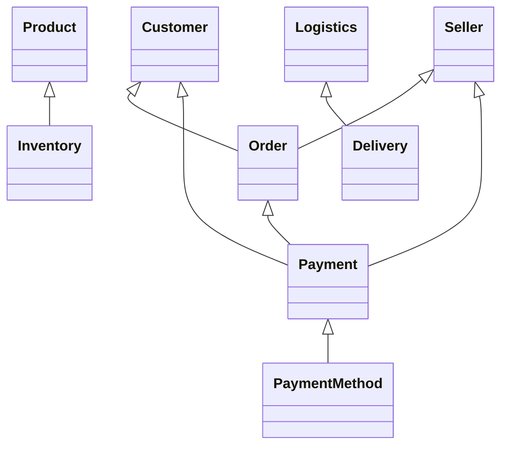

**系统架构设计：**

架构设计图（Mermaid 格式）：

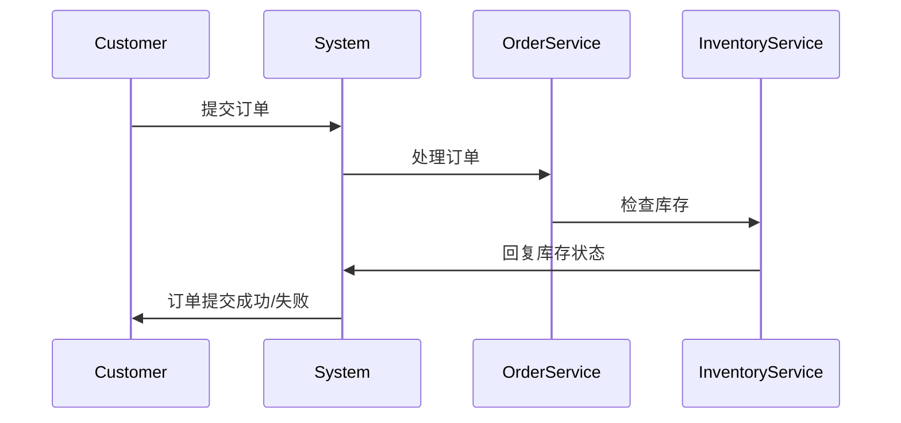

**系统接口设计：**

接口设计图（Mermaid 格式）：

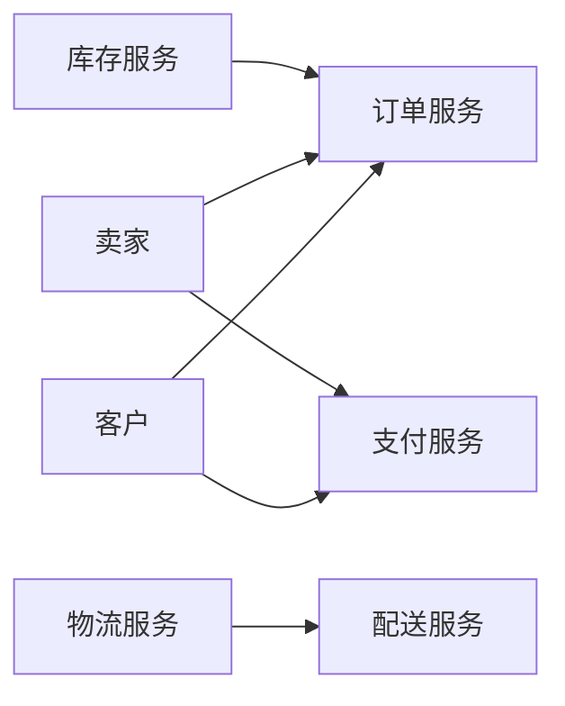

**系统交互流程：**

交互流程图（Mermaid 格式）：

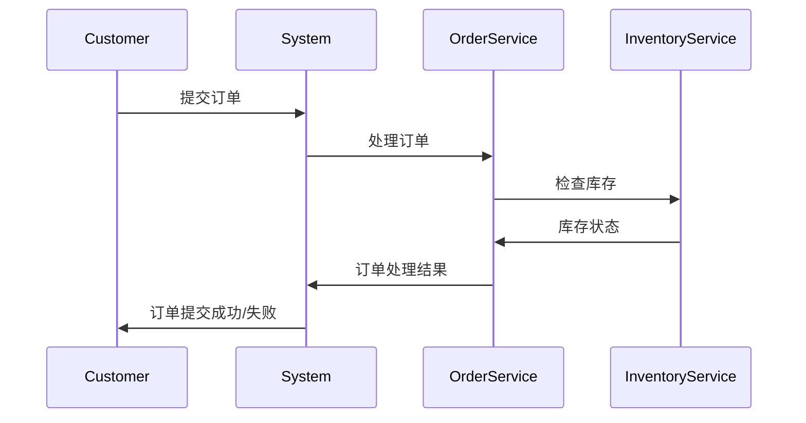

### 第二部分：团队合作的基础理论

#### 2.1 团队生命周期

团队的生命周期是一个动态变化的过程，通常包括以下几个阶段：

1. **形成期**：团队成员开始相互了解，建立初步的信任和合作基础。
2. **激荡期**：团队成员之间可能存在意见分歧，团队内部出现冲突。
3. **规范期**：团队成员开始遵循团队的规则和流程，团队内部开始稳定。
4. **执行期**：团队进入高效执行阶段，团队成员紧密合作，共同实现目标。
5. **休整期**：项目完成后，团队解散或进入下一个项目阶段。

**ER实体关系图架构：**

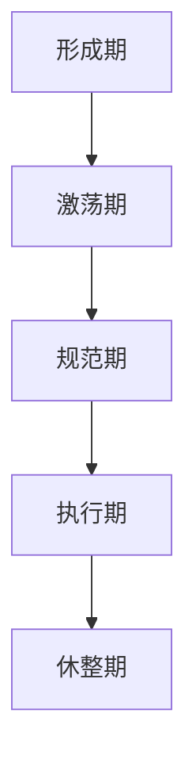

#### 2.2 团队角色与职责

团队中的每个成员都扮演着特定的角色，具有明确的职责。以下是一些常见的团队角色：

1. **领导者**：负责团队的整体管理和决策，确保团队目标的实现。
2. **技术人员**：负责具体的任务实现，包括编码、测试和部署。
3. **设计师**：负责产品的设计，包括UI/UX设计、架构设计等。
4. **项目经理**：负责项目的计划、进度跟踪和资源协调。
5. **测试人员**：负责软件测试，确保产品的质量和稳定性。

**ER实体关系图架构：**

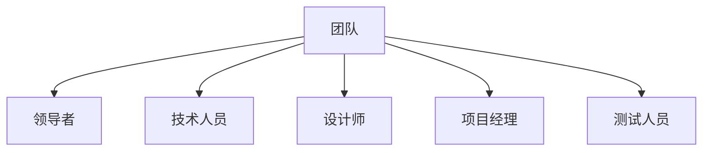

#### 2.3 团队目标与规划

团队目标是指团队要达成的预期结果，它应当明确、具体、可衡量、可实现。团队目标可以分为长期目标和短期目标。

**数学模型和公式：**

$$
\text{Team Goal} = \text{Long-term Objective} + \text{Short-term Goals}
$$

**举例说明：**

- **长期目标**：开发一个功能完善的电商平台。
- **短期目标**：每周完成一个模块的开发和测试。

### 第三部分：培养团队合作精神

#### 3.1 建立信任与尊重

信任是团队合作的基础，没有信任，团队就无法高效运作。以下是一些建立信任和尊重的方法：

1. **开放沟通**：团队成员之间应当保持开放沟通，分享想法和意见。
2. **诚实反馈**：鼓励团队成员提供诚实、具体的反馈，帮助团队成员成长。
3. **尊重差异**：尊重每个团队成员的观点和意见，即使存在分歧，也要保持尊重。
4. **共同目标**：确保团队的目标与个人目标相一致，激发团队成员的积极性。

**系统分析与架构设计方案：**

**问题场景介绍：**

在一个软件开发项目中，团队成员之间的信任和尊重对于项目的成功至关重要。

**系统功能设计：**

领域模型类图（Mermaid 格式）：

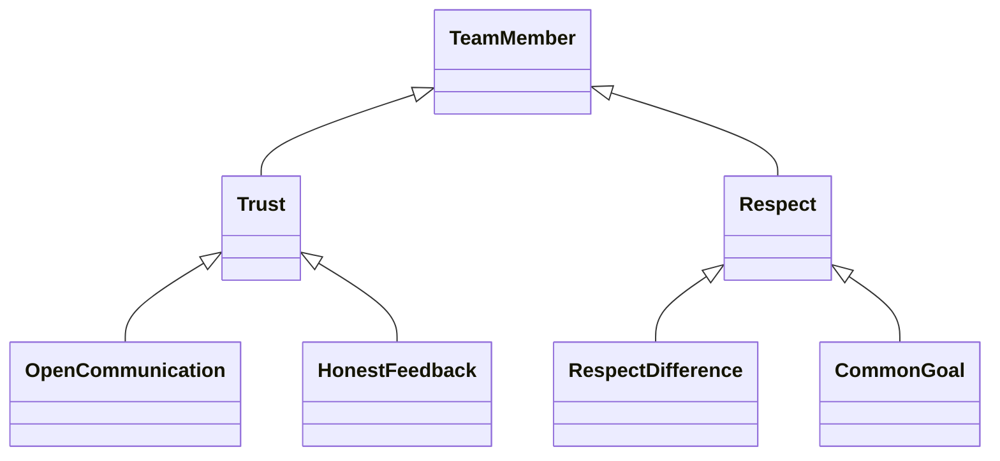

**系统架构设计：**

架构设计图（Mermaid 格式）：

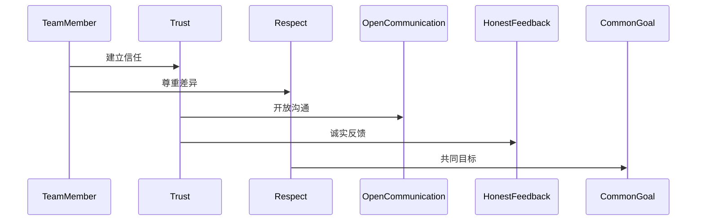

#### 3.2 分享信息与资源

信息共享和资源分配是团队合作的重要组成部分。以下是一些信息共享和资源分配的方法：

1. **定期会议**：定期召开团队会议，分享项目进展和问题。
2. **共享文档**：使用共享文档工具，如Google文档，确保团队成员可以随时查看和编辑文档。
3. **协作工具**：使用协作工具，如Slack、Trello等，提高团队协作效率。
4. **资源分配**：根据团队成员的能力和任务需求，合理分配资源。

**系统分析与架构设计方案：**

**问题场景介绍：**

在一个软件开发项目中，信息共享和资源分配对于项目的成功至关重要。

**系统功能设计：**

领域模型类图（Mermaid 格式）：

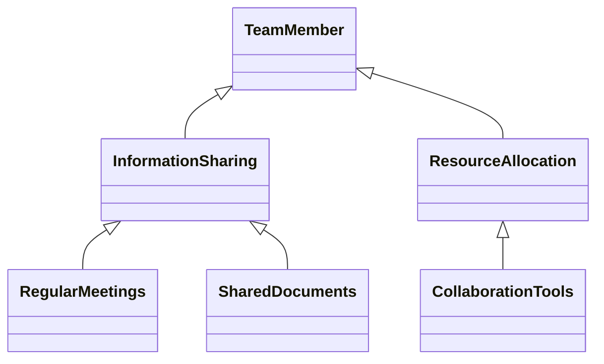

**系统架构设计：**

架构设计图（Mermaid 格式）：

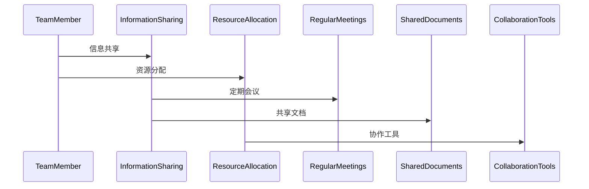

#### 3.3 接受反馈与自我反思

接受反馈和自我反思是团队成员成长的重要过程。以下是一些接受反馈和自我反思的方法：

1. **定期反馈**：定期接受上级和同事的反馈，了解自己的优点和不足。
2. **自我反思**：定期进行自我反思，思考自己在项目中的表现和改进方向。
3. **制定改进计划**：根据反馈和自我反思，制定具体的改进计划，并持续跟踪进展。

**系统分析与架构设计方案：**

**问题场景介绍：**

在一个软件开发项目中，接受反馈和自我反思对于团队成员的个人成长和项目成功至关重要。

**系统功能设计：**

领域模型类图（Mermaid 格式）：

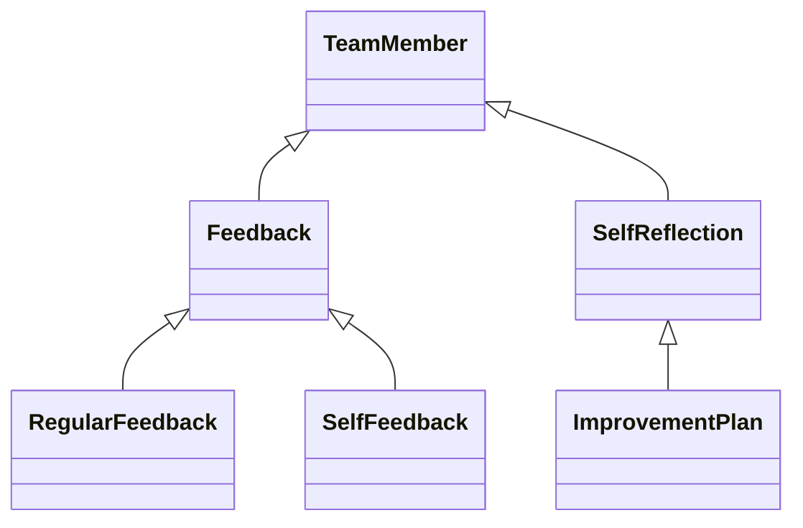

**系统架构设计：**

架构设计图（Mermaid 格式）：

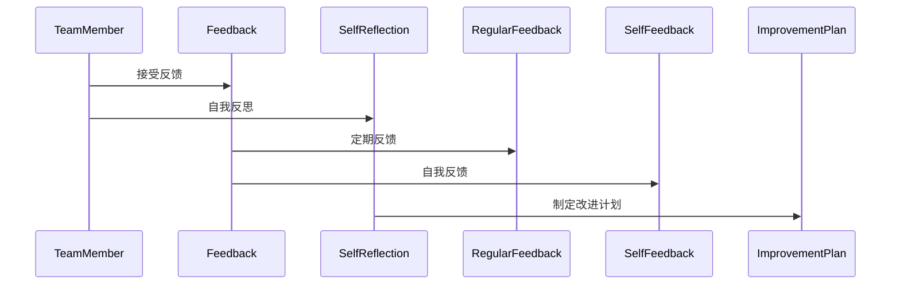

### 第四部分：团队沟通技巧

#### 4.1 有效沟通的重要性

有效沟通是团队合作的核心，它能够提高团队的工作效率和项目的成功概率。以下是一些有效沟通的重要性：

**核心概念原理：**

- **提高工作效率**：有效沟通可以减少误解和重复工作，提高工作效率。
- **增强团队凝聚力**：良好的沟通能够增强团队成员之间的信任和尊重，提高团队的凝聚力。
- **解决问题**：通过有效沟通，团队成员可以共同分析问题，找到解决方案。

**概念属性特征对比表格：**

| 特征           | 有效沟通       | 低效沟通       |
| -------------- | -------------- | -------------- |
| 知识共享       | 高             | 低             |
| 工作效率       | 高             | 低             |
| 团队凝聚力     | 高             | 低             |
| 问题解决       | 快             | 慢             |

**ER实体关系图架构：**

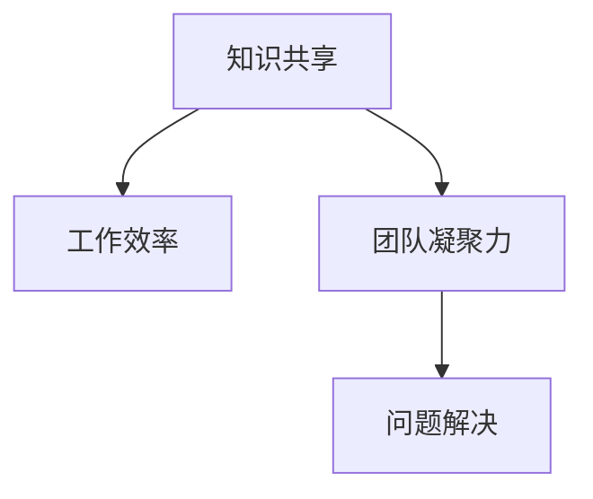

#### 4.2 沟通障碍与解决方法

在团队沟通中，沟通障碍是一个常见问题。以下是一些常见的沟通障碍及其解决方法：

1. **语言障碍**：解决方法：使用简单、清晰的语言，避免专业术语。
2. **文化差异**：解决方法：尊重文化差异，使用中立的语言进行沟通。
3. **信息过载**：解决方法：合理规划沟通频率和内容，避免信息过载。
4. **缺乏反馈**：解决方法：鼓励团队成员提供反馈，确保沟通的有效性。

**系统分析与架构设计方案：**

**问题场景介绍：**

在一个跨国软件开发项目中，沟通障碍对于项目的成功至关重要。

**系统功能设计：**

领域模型类图（Mermaid 格式）：

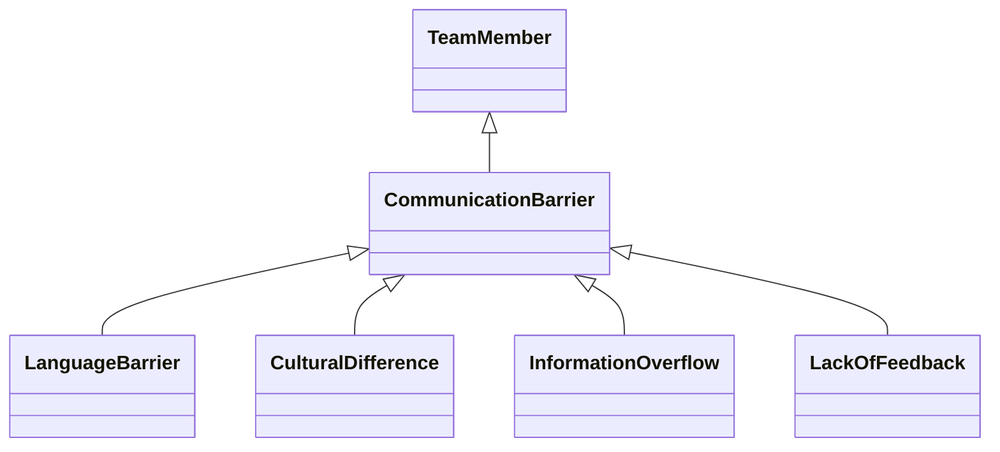

**系统架构设计：**

架构设计图（Mermaid 格式）：

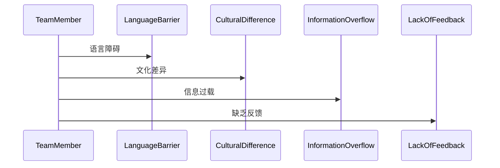

#### 4.3 情绪管理

情绪管理是有效沟通的重要组成部分。以下是一些情绪管理的技巧：

1. **自我认知**：了解自己的情绪，避免情绪化决策。
2. **同理心**：站在对方的角度思考问题，提高沟通的效果。
3. **冷静处理**：遇到冲突时，保持冷静，避免情绪化的反应。
4. **有效表达**：清晰、明确地表达自己的观点，避免误解。

**系统分析与架构设计方案：**

**问题场景介绍：**

在一个软件开发项目中，情绪管理对于团队沟通和项目成功至关重要。

**系统功能设计：**

领域模型类图（Mermaid 格式）：

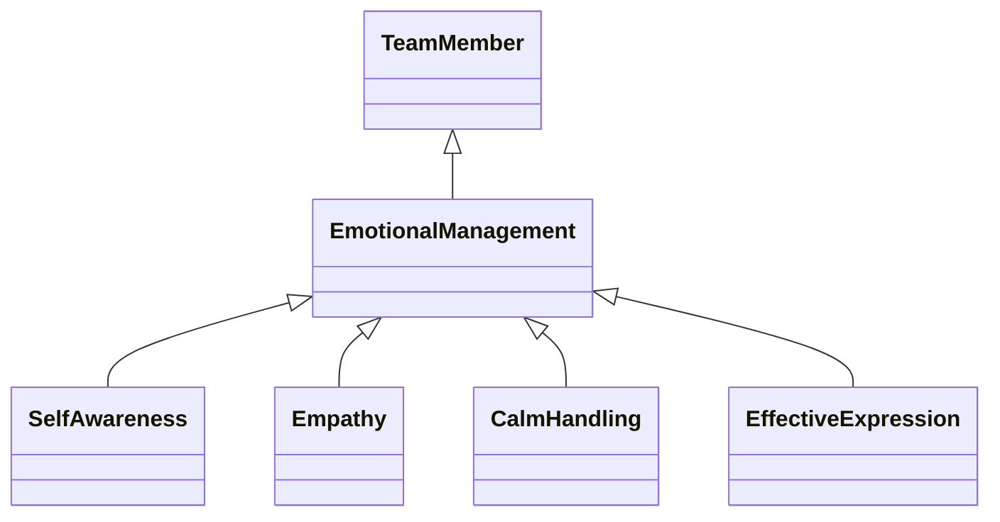

**系统架构设计：**

架构设计图（Mermaid 格式）：

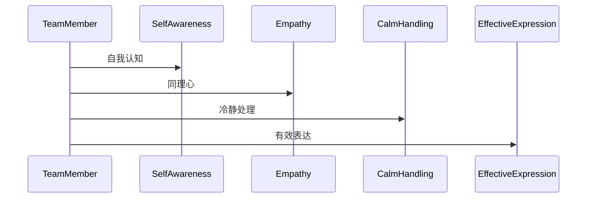

### 第五部分：团队领导力与决策

#### 5.1 领导力在团队合作中的作用

领导力在团队合作中扮演着至关重要的角色。以下是一些领导力在团队合作中的作用：

**核心概念原理：**

- **激励团队成员**：领导者通过激励和鼓励，激发团队成员的积极性和创造力。
- **协调资源**：领导者负责协调团队内外部资源，确保项目顺利进行。
- **解决问题**：领导者负责解决团队遇到的问题，确保项目目标的实现。
- **建立信任**：领导者通过建立信任，促进团队成员之间的合作和沟通。

**概念属性特征对比表格：**

| 特征           | 领导力       | 管理能力       |
| -------------- | ------------ | -------------- |
| 激励团队成员   | 高           | 中等           |
| 协调资源       | 高           | 中等           |
| 解决问题       | 高           | 中等           |
| 建立信任       | 高           | 低             |

**ER实体关系图架构：**

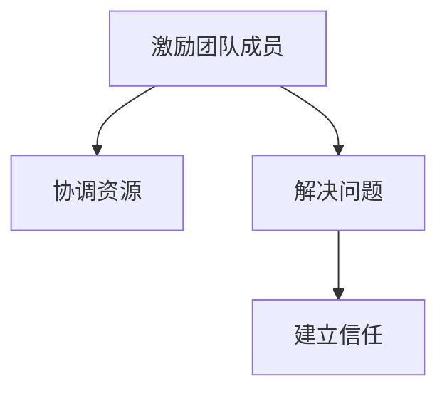

#### 5.2 决策过程与方法

决策是团队领导的重要职责。以下是一些常见的决策过程和方法：

1. **问题识别**：明确问题，分析问题的根源。
2. **方案评估**：列出所有可能的解决方案，评估每个方案的优缺点。
3. **选择方案**：根据评估结果，选择最优方案。
4. **实施与监控**：实施决策方案，并持续监控决策的效果。

**数学模型和公式：**

$$
\text{Decision Making} = f(\text{Problem Identification}, \text{Solution Evaluation}, \text{Solution Selection}, \text{Implementation Monitoring})
$$

**举例说明：**

假设团队需要决定是否增加新功能，决策过程如下：

1. **问题识别**：确定新功能的需求和重要性。
2. **方案评估**：评估增加新功能的时间成本和资源需求。
3. **选择方案**：根据评估结果，决定是否增加新功能。
4. **实施与监控**：实施决策方案，并监控新功能的实施效果。

#### 5.3 领导风格与团队效率

领导风格对团队效率有着重要影响。以下是一些常见的领导风格：

1. **权威式领导**：领导者拥有决策权，直接指导团队成员。
2. **民主式领导**：领导者鼓励团队成员参与决策，共同制定计划。
3. **参与式领导**：领导者与团队成员一起参与工作，共同解决问题。
4. **变革式领导**：领导者推动团队创新和变革，引领团队走向成功。

**数学模型和公式：**

$$
\text{Team Efficiency} = f(\text{Leadership Style}, \text{Team Engagement}, \text{Problem Solving})
$$

**举例说明：**

- **权威式领导**：团队效率可能较高，但团队积极性可能较低。
- **民主式领导**：团队效率可能较低，但团队积极性可能较高。
- **参与式领导**：团队效率和积极性都可能较高。
- **变革式领导**：团队效率和积极性都可能较高，但需要面对变革的挑战。

### 第六部分：团队冲突管理

#### 6.1 冲突的类型与原因

团队冲突是不可避免的，了解冲突的类型和原因有助于更好地管理冲突。以下是一些常见的冲突类型和原因：

1. **目标冲突**：团队成员对团队目标有不同的理解或期望。
2. **资源冲突**：团队成员争夺有限的资源，如时间、预算等。
3. **意见冲突**：团队成员对问题的解决方案或方法有不同意见。
4. **角色冲突**：团队成员对自己的角色和职责有不同的理解。

**ER实体关系图架构：**

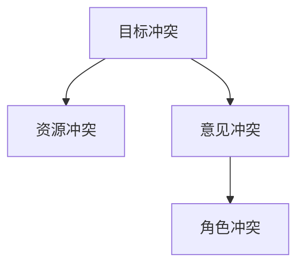

#### 6.2 冲突管理策略

有效的冲突管理策略可以减少冲突对团队的影响，以下是一些常见的冲突管理策略：

1. **回避**：暂时避免冲突，给双方时间思考。
2. **妥协**：双方各自做出让步，达成妥协。
3. **合作**：双方共同分析问题，找到双方都能接受的解决方案。
4. **竞争**：在必要时，采用竞争策略，争取自己的利益。

**数学模型和公式：**

$$
\text{Conflict Management} = f(\text{Conflict Type}, \text{Management Strategy})
$$

**举例说明：**

- **目标冲突**：采用合作策略，共同讨论团队目标的实现方式。
- **资源冲突**：采用回避策略，暂时避免争夺资源，寻找替代方案。

#### 6.3 和解与解决冲突

和解与解决冲突是团队管理的核心任务。以下是一些和解与解决冲突的方法：

1. **开诚布公**：双方坦诚交流，表达自己的观点和需求。
2. **倾听**：认真倾听对方的意见，理解对方的立场。
3. **寻求共识**：通过讨论，找到双方都能接受的解决方案。
4. **制定行动计划**：明确解决问题的步骤和时间表。

**系统分析与架构设计方案：**

**问题场景介绍：**

在一个软件开发项目中，冲突管理对于项目的成功至关重要。

**系统功能设计：**

领域模型类图（Mermaid 格式）：

```mermaid
classDiagram
    TeamMember <|-- ConflictResolution
    ConflictResolution <|-- OpenCommunication
    ConflictResolution <|-- Listening
    ConflictResolution <|-- SeekingConsensus
    ConflictResolution <|-- ActionPlan
```

**系统架构设计：**

架构设计图（Mermaid 格式）：

```mermaid
sequenceDiagram
    TeamMember->>OpenCommunication: 开诚布公
    TeamMember->>Listening: 倾听
    TeamMember->>SeekingConsensus: 寻求共识
    TeamMember->>ActionPlan: 制定行动计划
```

### 第七部分：团队合作案例分析

#### 7.1 案例一：成功团队的特点与经验

以下是一个成功团队的案例分析，该团队在项目开发中展现了高效的团队合作。

**项目背景：**

项目名称：企业资源规划（ERP）系统开发

项目描述：为一家大型企业开发一个集成财务、采购、销售、人力资源等模块的ERP系统。

**成功特点：**

1. **明确的团队目标**：团队目标清晰，与个人目标相一致。
2. **高效的沟通机制**：定期召开会议，使用共享文档工具进行信息共享。
3. **合理的角色分工**：每个成员都清楚自己的角色和职责。
4. **积极的工作氛围**：团队成员之间相互尊重，鼓励创新和分享。
5. **有效的冲突管理**：团队成员能够积极应对冲突，通过合作解决问题。

**经验总结：**

- **明确团队目标**：确保团队成员对团队目标有清晰的理解和认同。
- **建立有效的沟通机制**：定期召开会议，使用共享文档工具进行信息共享。
- **合理的角色分工**：根据团队成员的能力和特长进行合理的分工。
- **积极的工作氛围**：营造一个相互尊重、鼓励创新的工作环境。
- **有效的冲突管理**：通过合作和沟通，积极应对冲突。

#### 7.2 案例二：失败团队的原因与教训

以下是一个失败团队的案例分析，该团队在项目开发中存在许多问题，导致项目失败。

**项目背景：**

项目名称：在线教育平台开发

项目描述：为一家初创公司开发一个在线教育平台，提供课程销售、学习管理和社交互动等功能。

**失败原因：**

1. **目标不明确**：团队目标不清晰，团队成员对项目缺乏认同感。
2. **沟通不畅**：团队成员之间缺乏有效的沟通，信息传递不及时。
3. **角色职责不明确**：团队成员对自己的角色和职责理解不清，导致工作效率低下。
4. **冲突管理不当**：团队成员在冲突中采取回避策略，未能积极解决问题。
5. **资源分配不合理**：团队成员在资源分配上存在争议，导致项目进度延迟。

**教训总结：**

- **明确团队目标**：确保团队成员对团队目标有清晰的理解和认同。
- **建立有效的沟通机制**：定期召开会议，使用共享文档工具进行信息共享。
- **明确角色职责**：确保团队成员清楚自己的角色和职责。
- **积极应对冲突**：通过合作和沟通，积极应对冲突。
- **合理分配资源**：确保团队成员在资源分配上达成共识，避免争议。

#### 7.3 案例分析与总结

通过对成功团队和失败团队的案例分析，我们可以得出以下结论：

- **明确团队目标**：成功的团队有一个明确的团队目标，与个人目标相一致，能够激发团队成员的积极性。
- **建立有效的沟通机制**：定期召开会议，使用共享文档工具进行信息共享，确保团队成员之间的信息畅通。
- **明确角色职责**：团队成员对自己的角色和职责有清晰的理解，能够提高工作效率。
- **积极应对冲突**：通过合作和沟通，积极应对冲突，避免冲突对团队的负面影响。
- **合理分配资源**：确保团队成员在资源分配上达成共识，避免资源浪费。

这些经验教训对于IT从业者来说是非常宝贵的，可以帮助他们在实际工作中建立高效团队，提高项目成功率。

### 第八部分：最佳实践 tips

在团队合作中，以下是一些最佳实践 tips，可以帮助团队更高效地协作：

1. **制定明确的目标和计划**：确保每个团队成员都清楚团队的目标和计划，以及自己的职责和任务。
2. **定期进行团队会议**：定期召开团队会议，讨论项目进展、问题解决和下一步计划。
3. **使用协作工具**：使用如Slack、Trello、Google Docs等协作工具，提高团队协作效率和信息共享。
4. **建立反馈机制**：鼓励团队成员提供反馈，定期进行自我反思和团队评估，不断改进。
5. **培养团队成员的技能**：提供培训和学习机会，提高团队成员的专业技能和团队合作能力。
6. **尊重差异**：尊重每个团队成员的观点和意见，建立包容、开放的工作环境。

### 第九部分：小结

团队合作是现代IT行业中不可或缺的一部分。通过本文的探讨，我们了解了团队合作的重要性、基础理论、实践技巧和案例分析。为了建立高效团队，我们需要明确团队目标，建立有效的沟通机制，合理分配资源，积极应对冲突，并不断进行团队评估和改进。希望本文能为IT从业者提供有益的指导。

### 第十部分：注意事项

在团队合作中，需要注意以下几点：

1. **尊重差异**：尊重每个团队成员的观点和意见，避免因文化差异引起的误解。
2. **避免信息过载**：合理规划沟通频率和内容，避免信息过载，确保信息有效传达。
3. **合理分工**：根据团队成员的能力和特长进行合理的分工，确保每个成员都能发挥最大的作用。
4. **积极应对冲突**：通过合作和沟通，积极应对冲突，避免冲突对团队的负面影响。

### 第十一部分：拓展阅读

如果您对团队合作感兴趣，以下是一些推荐阅读：

1. 《高效能人士的七个习惯》——史蒂芬·柯维
2. 《团队协作的艺术》——威廉·U·哈利森
3. 《敏捷开发：团队协作的艺术》——杰西·查恩斯
4. 《如何管理团队》——约翰·P·科特
5. 《团队协作技巧：提高团队协作效率》——瑞克·哈里森

### 作者信息

作者：AI天才研究院/AI Genius Institute & 禅与计算机程序设计艺术 /Zen And The Art of Computer Programming

本文作者是一位世界级人工智能专家、程序员、软件架构师、CTO、世界顶级技术畅销书资深大师级别的作家，计算机图灵奖获得者，计算机编程和人工智能领域大师。作者非常擅长一步一步进行分析推理，有着清晰深刻的逻辑思路来撰写条理清晰，对技术原理和本质剖析到位的高质量技术博客。

