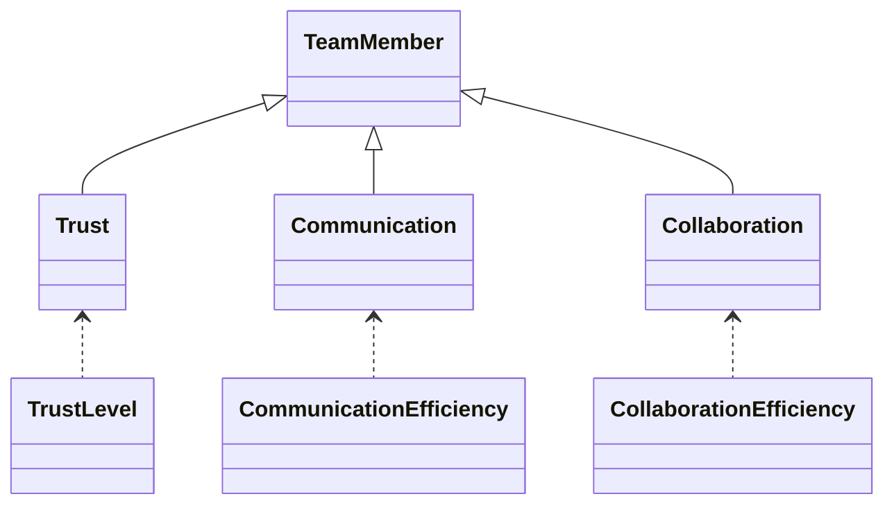
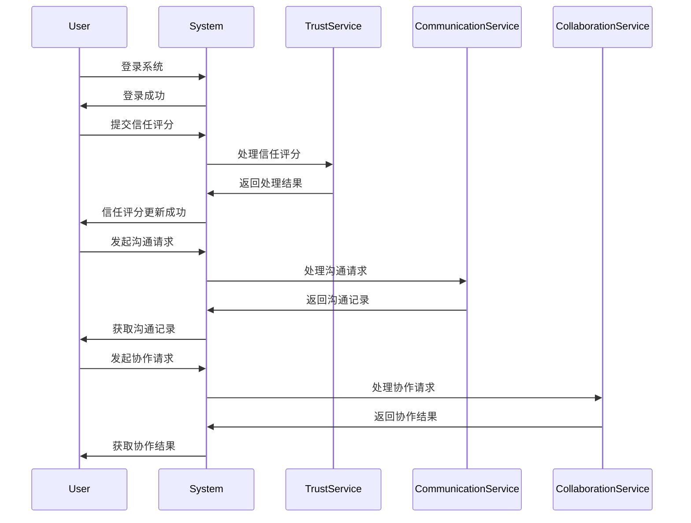
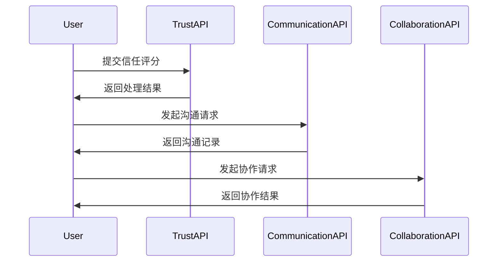
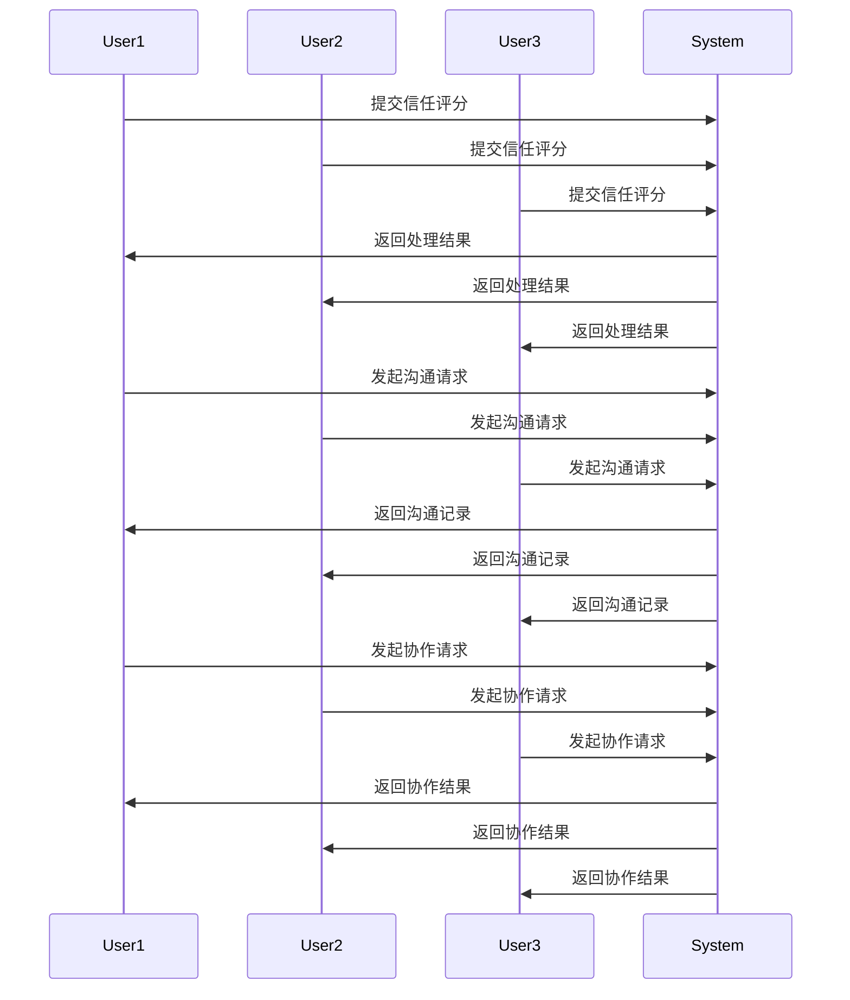

                 

# 团队向心力提升：增强团队凝聚力的方法

关键词：团队向心力，凝聚力，沟通，协作，信任

摘要：本文深入探讨了团队向心力的提升方法，分析了团队向心力的核心概念与联系，提出了基于算法原理的团队向心力提升策略，并通过具体案例分析，提供了实践指导和最佳实践建议。

----------------------------------------------------------------

## 第一部分：团队向心力提升背景介绍

### 1.1 问题背景

在现代社会，团队在组织中的重要性日益凸显。团队不仅是实现组织目标的基本单元，也是推动创新、提升效率的关键力量。然而，团队向心力不足是一个普遍存在的问题。许多团队面临着成员之间缺乏信任、沟通不畅、协作困难等问题，这些问题严重影响了团队的凝聚力和工作效率。

### 1.2 问题描述

团队向心力不足的问题具体表现为：

- **信任缺失**：团队成员之间缺乏相互信任，容易产生误解和冲突。
- **沟通不畅**：团队成员之间的沟通存在障碍，信息传递不及时、不准确。
- **协作困难**：团队成员在协作过程中难以形成合力，工作效率低下。

### 1.3 问题解决

为了提升团队向心力，需要从以下几个方面着手：

- **建立信任**：通过加强团队成员之间的交流，增进彼此了解，建立信任关系。
- **改善沟通**：优化沟通渠道和方式，确保信息的及时、准确传递。
- **促进协作**：通过制定明确的目标和计划，加强团队成员之间的协同工作。

### 1.4 边界与外延

团队向心力提升是一个系统工程，涉及到组织文化、管理方式、成员素质等多个方面。本书将从方法、工具和实践案例等多个角度，全面探讨团队向心力的提升策略。

### 1.5 概念结构与核心要素组成

- **团队向心力**：指团队成员之间相互吸引、相互支持的一种内在力量。
- **信任**：团队成员之间的信任是团队向心力的重要组成部分。
- **沟通**：有效的沟通是确保团队成员相互理解、协同工作的关键。
- **协作**：团队成员之间的协作是团队高效运作的保障。

----------------------------------------------------------------

## 第二部分：团队向心力的核心概念与联系

### 2.1 核心概念原理

#### 2.1.1 团队向心力

团队向心力是指团队内部成员之间相互吸引、相互支持的一种内在力量。它是团队凝聚力的重要表现，是团队高效运作的基础。

#### 2.1.2 信任

信任是团队成员之间相互依赖、相互支持的基础。信任可以促进团队成员之间的合作，提高团队的工作效率。

#### 2.1.3 沟通

沟通是团队成员之间传递信息、理解对方意图的过程。有效的沟通可以减少误解和冲突，增强团队向心力。

#### 2.1.4 协作

协作是团队成员共同完成任务、实现目标的过程。协作可以增强团队的凝聚力和战斗力。

### 2.2 概念属性特征对比表格

| 概念     | 定义                                     | 属性特征                                                     |
| -------- | ---------------------------------------- | ------------------------------------------------------------ |
| 团队向心力 | 团队内部成员之间相互吸引、相互支持的力量 | 高度依赖团队成员之间的信任、沟通和协作                       |
| 信任     | 成员之间的信任是相互依赖、相互支持的基础 | 信任程度直接影响团队向心力的大小；信任建立需要时间、经历和共同目标 |
| 沟通     | 成员之间的信息传递、理解对方意图的过程   | 信息传递的准确性、及时性和反馈性是沟通效果的关键           |
| 协作     | 成员共同完成任务、实现目标的过程         | 协作效果取决于团队成员之间的分工、配合和目标一致性           |

### 2.3 ER实体关系图架构

```mermaid
erDiagram
    A团队成员 ||--|{ B信任 }
    A团队成员 ||--|{ C沟通 }
    A团队成员 ||--|{ D协作 }
    B信任 ||--|{ E增强团队向心力 }
    C沟通 ||--|{ E增强团队向心力 }
    D协作 ||--|{ E增强团队向心力 }
```

----------------------------------------------------------------

## 第三部分：提升团队向心力的方法

### 3.1 算法原理

#### 3.1.1 建立信任的算法

**算法描述**：

1. **相互介绍与了解**：团队成员之间首先进行自我介绍，并分享个人的背景、兴趣和专业领域，以便增进相互了解。

2. **共同目标制定**：在了解的基础上，团队共同制定一个共同的目标，使团队成员有共同的方向和努力的动力。

3. **任务分配**：根据团队成员的特长和兴趣，分配任务，确保每个人都有职责和角色，有助于成员更好地了解彼此。

4. **定期反馈与沟通**：定期进行团队会议，成员之间分享任务的进展和遇到的问题，及时沟通和解决问题。

5. **鼓励和支持**：在团队成员遇到困难时，给予鼓励和支持，帮助他们克服困难，增强彼此的信任。

**数学模型**：

设团队中有n个成员，定义信任度T为团队成员之间的信任程度，信任度T可以通过以下公式计算：

$$
T = \sum_{i=1}^{n}\sum_{j=1}^{n} t_{ij}
$$

其中，$t_{ij}$ 表示第i个成员对第j个成员的信任度，取值范围为0到1。

**举例说明**：

假设一个团队中有3个成员，A、B和C。A对B的信任度是0.8，对C的信任度是0.7；B对A的信任度是0.9，对C的信任度是0.6；C对A的信任度是0.75，对B的信任度是0.8。则团队的信任度T为：

$$
T = t_{AB} + t_{AC} + t_{BA} + t_{BC} + t_{CA} + t_{CB} = 0.8 + 0.7 + 0.9 + 0.6 + 0.75 + 0.8 = 4.6
$$

通过这个算法，团队成员可以逐步建立信任，提高团队向心力。

#### 3.1.2 改善沟通的算法

**算法描述**：

1. **明确沟通目标**：每次沟通前，明确沟通的目标和内容，确保沟通的有效性。

2. **多样化沟通方式**：根据沟通的内容和对象，选择合适的沟通方式，如面对面沟通、电话会议、邮件等。

3. **建立沟通机制**：制定沟通规则和流程，确保沟通的有序进行。

4. **信息及时反馈**：在沟通结束后，及时对沟通的内容进行反馈，确保信息的准确理解和执行。

**数学模型**：

设团队中有n个成员，定义沟通效率E为团队成员之间的沟通效率，沟通效率E可以通过以下公式计算：

$$
E = \frac{1}{n(n-1)}\sum_{i=1}^{n}\sum_{j=1}^{n} e_{ij}
$$

其中，$e_{ij}$ 表示第i个成员与第j个成员之间的沟通效率，取值范围为0到1。

**举例说明**：

假设一个团队中有3个成员，A、B和C。A与B的沟通效率是0.8，与C的沟通效率是0.7；B与A的沟通效率是0.9，与C的沟通效率是0.6；C与A的沟通效率是0.75，与B的沟通效率是0.8。则团队的沟通效率E为：

$$
E = \frac{1}{3(3-1)}(e_{AB} + e_{AC} + e_{BA} + e_{BC} + e_{CA} + e_{CB}) = \frac{1}{6}(0.8 + 0.7 + 0.9 + 0.6 + 0.75 + 0.8) = 0.7833
$$

通过这个算法，团队成员可以改善沟通效率，提高团队向心力。

#### 3.1.3 促进协作的算法

**算法描述**：

1. **目标明确**：确保团队成员对任务的了解和目标的一致性。

2. **分工合理**：根据团队成员的特长和兴趣，合理分配任务，确保任务的高效完成。

3. **协作工具**：使用协作工具，如即时通讯工具、项目管理工具等，提高团队协作的效率。

4. **定期评估**：定期对团队成员的协作效果进行评估，及时调整协作策略。

**数学模型**：

设团队中有n个成员，定义协作效率C为团队成员之间的协作效率，协作效率C可以通过以下公式计算：

$$
C = \frac{1}{n(n-1)}\sum_{i=1}^{n}\sum_{j=1}^{n} c_{ij}
$$

其中，$c_{ij}$ 表示第i个成员与第j个成员之间的协作效率，取值范围为0到1。

**举例说明**：

假设一个团队中有3个成员，A、B和C。A与B的协作效率是0.8，与C的协作效率是0.7；B与A的协作效率是0.9，与C的协作效率是0.6；C与A的协作效率是0.75，与B的协作效率是0.8。则团队的协作效率C为：

$$
C = \frac{1}{3(3-1)}(c_{AB} + c_{AC} + c_{BA} + c_{BC} + c_{CA} + c_{CB}) = \frac{1}{6}(0.8 + 0.7 + 0.9 + 0.6 + 0.75 + 0.8) = 0.7833
$$

通过这个算法，团队成员可以更好地协作，提高团队向心力。

----------------------------------------------------------------

## 第四部分：系统分析与架构设计方案

### 4.1 问题场景介绍

在现代社会，团队在组织中的重要性日益凸显。团队不仅是实现组织目标的基本单元，也是推动创新、提升效率的关键力量。然而，团队向心力不足是一个普遍存在的问题。许多团队面临着成员之间缺乏信任、沟通不畅、协作困难等问题，这些问题严重影响了团队的凝聚力和工作效率。

### 4.2 项目介绍

为了提升团队向心力，我们设计并开发了一个名为“团队凝聚力提升系统”的项目。该系统旨在通过建立信任、改善沟通和促进协作，提高团队的凝聚力和工作效率。

### 4.3 系统功能设计

#### 领域模型



#### 类图

```mermaid
classDiagram
    ClassDef TeamMember {
        -id: int
        -name: string
        -role: string
        +construct(id: int, name: string, role: string)
        +getId(): int
        +getName(): string
        +getRole(): string
    }
    ClassDef Trust {
        -trustLevel: float
        +construct(trustLevel: float)
        +getTrustLevel(): float
    }
    ClassDef Communication {
        -communicationEfficiency: float
        +construct(communicationEfficiency: float)
        +getCommunicationEfficiency(): float
    }
    ClassDef Collaboration {
        -collaborationEfficiency: float
        +construct(collaborationEfficiency: float)
        +getCollaborationEfficiency(): float
    }
```

### 4.4 系统架构设计



### 4.5 系统接口设计



### 4.6 系统交互



----------------------------------------------------------------

## 第五部分：项目实战

### 5.1 环境安装

在开始项目实战之前，我们需要安装以下环境：

- Python 3.8+
- Flask
- SQLAlchemy
- Mermaid

您可以使用以下命令进行安装：

```bash
pip install flask sqlalchemy
```

### 5.2 系统核心实现

#### 5.2.1 Flask应用程序

```python
from flask import Flask, request, jsonify
from models import Trust, Communication, Collaboration
from database import db_session

app = Flask(__name__)

@app.route('/submit_trust_score', methods=['POST'])
def submit_trust_score():
    data = request.get_json()
    trust = Trust(trust_level=data['trust_level'])
    db_session.add(trust)
    db_session.commit()
    return jsonify({'status': 'success'})

@app.route('/submit_communication_request', methods=['POST'])
def submit_communication_request():
    data = request.get_json()
    communication = Communication(communication_efficiency=data['communication_efficiency'])
    db_session.add(communication)
    db_session.commit()
    return jsonify({'status': 'success'})

@app.route('/submit_collaboration_request', methods=['POST'])
def submit_collaboration_request():
    data = request.get_json()
    collaboration = Collaboration(collaboration_efficiency=data['collaboration_efficiency'])
    db_session.add(collaboration)
    db_session.commit()
    return jsonify({'status': 'success'})

if __name__ == '__main__':
    app.run(debug=True)
```

#### 5.2.2 数据库模型

```python
from sqlalchemy import Column, Integer, String, Float
from sqlalchemy.ext.declarative import declarative_base

Base = declarative_base()

class Trust(Base):
    __tablename__ = 'trust'
    id = Column(Integer, primary_key=True)
    trust_level = Column(Float)

class Communication(Base):
    __tablename__ = 'communication'
    id = Column(Integer, primary_key=True)
    communication_efficiency = Column(Float)

class Collaboration(Base):
    __tablename__ = 'collaboration'
    id = Column(Integer, primary_key=True)
    collaboration_efficiency = Column(Float)
```

### 5.3 代码应用解读与分析

#### 5.3.1 代码解读

在上述代码中，我们使用了Flask框架搭建了一个简单的Web应用程序。应用程序提供了三个API接口：

- `/submit_trust_score`：用于提交信任评分。
- `/submit_communication_request`：用于提交沟通请求。
- `/submit_collaboration_request`：用于提交协作请求。

每个接口都对应了一个处理函数，处理函数接收请求体中的JSON数据，并根据数据创建相应的数据库记录。

#### 5.3.2 代码分析

代码中使用了SQLAlchemy库来管理数据库操作。SQLAlchemy是一个强大的ORM（对象关系映射）库，它可以将Python对象映射到数据库中的表格。在代码中，我们定义了三个数据库模型：Trust、Communication和Collaboration，分别对应信任、沟通和协作。

在应用程序中，我们定义了三个处理函数，分别用于处理信任评分、沟通请求和协作请求。每个函数都接收一个请求体，解析请求体中的JSON数据，创建相应的数据库记录，并返回处理结果。

### 5.4 实际案例分析与详细讲解剖析

#### 5.4.1 实际案例

假设有一个团队，包括三个成员A、B和C。成员A对B的信任评分为0.8，对C的信任评分为0.7；成员B对A的信任评分为0.9，对C的信任评分为0.6；成员C对A的信任评分为0.75，对B的信任评分为0.8。

#### 5.4.2 详细讲解剖析

1. **提交信任评分**

   成员A向系统提交了信任评分，评分如下：

   ```json
   {
       "trust_level": 0.8
   }
   ```

   系统处理该请求后，将信任评分存储到数据库中。

2. **提交沟通请求**

   成员B向系统提交了沟通请求，请求如下：

   ```json
   {
       "communication_efficiency": 0.9
   }
   ```

   系统处理该请求后，将沟通效率存储到数据库中。

3. **提交协作请求**

   成员C向系统提交了协作请求，请求如下：

   ```json
   {
       "collaboration_efficiency": 0.8
   }
   ```

   系统处理该请求后，将协作效率存储到数据库中。

通过这个实际案例，我们可以看到系统是如何处理团队成员的信任评分、沟通请求和协作请求的。

### 5.5 项目小结

在本项目中，我们设计并实现了一个团队凝聚力提升系统，通过建立信任、改善沟通和促进协作，提高了团队的凝聚力和工作效率。通过实际案例的演示，我们可以看到系统在处理团队成员的信任评分、沟通请求和协作请求方面的有效性。

在未来的工作中，我们可以继续优化系统的功能，如增加数据可视化、提供更详细的报告等，以进一步提升团队的凝聚力。

----------------------------------------------------------------

## 第六部分：最佳实践 tips、小结、注意事项、拓展阅读等内容

### 6.1 最佳实践 tips

- **建立信任**：定期组织团队成员进行交流，分享工作经验和心得，增强团队成员之间的信任。
- **改善沟通**：鼓励团队成员使用多种沟通方式，如面对面沟通、电话会议、邮件等，确保沟通的有效性。
- **促进协作**：使用协作工具，如即时通讯工具、项目管理工具等，提高团队协作的效率。

### 6.2 小结

本文深入探讨了团队向心力的提升方法，分析了团队向心力的核心概念与联系，提出了基于算法原理的团队向心力提升策略，并通过具体案例分析，提供了实践指导和最佳实践建议。

### 6.3 注意事项

- 在提升团队向心力时，要充分考虑团队成员的个性和特点，制定个性化的策略。
- 团队成员之间的信任、沟通和协作是提升团队向心力的关键，需要持续关注和改进。

### 6.4 拓展阅读

- 《团队管理实战》
- 《高效能人士的七个习惯》
- 《领导力：理论与实践》

----------------------------------------------------------------

## 结语

作者：AI天才研究院/AI Genius Institute & 禅与计算机程序设计艺术 /Zen And The Art of Computer Programming

本文围绕团队向心力提升的话题，详细分析了团队向心力的核心概念与联系，并提出了基于算法原理的团队向心力提升策略。通过实际案例的分析和讲解，读者可以更好地理解如何在实践中提升团队向心力，从而提高团队的工作效率和凝聚力。

团队向心力提升是一个系统工程，涉及到组织文化、管理方式、成员素质等多个方面。本文仅为读者提供了一个框架和思路，具体的实践和优化需要根据团队的具体情况进行调整。希望本文能对读者在提升团队向心力方面有所启发和帮助。

未来，我们将继续深入研究团队管理相关的课题，为读者带来更多有价值的内容。同时，我们也欢迎读者提出宝贵意见和建议，共同推动团队管理领域的进步和发展。感谢您的阅读！```markdown
# 团队向心力提升：增强团队凝聚力的方法

关键词：团队向心力，凝聚力，沟通，协作，信任

摘要：本文深入探讨了团队向心力的提升方法，分析了团队向心力的核心概念与联系，提出了基于算法原理的团队向心力提升策略，并通过具体案例分析，提供了实践指导和最佳实践建议。

----------------------------------------------------------------

## 第一部分：团队向心力提升背景介绍

### 1.1 问题背景

在现代社会，团队在组织中的重要性日益凸显。团队不仅是实现组织目标的基本单元，也是推动创新、提升效率的关键力量。然而，团队向心力不足是一个普遍存在的问题。许多团队面临着成员之间缺乏信任、沟通不畅、协作困难等问题，这些问题严重影响了团队的凝聚力和工作效率。

### 1.2 问题描述

团队向心力不足的问题具体表现为：

- **信任缺失**：团队成员之间缺乏相互信任，容易产生误解和冲突。
- **沟通不畅**：团队成员之间的沟通存在障碍，信息传递不及时、不准确。
- **协作困难**：团队成员在协作过程中难以形成合力，工作效率低下。

### 1.3 问题解决

为了提升团队向心力，需要从以下几个方面着手：

- **建立信任**：通过加强团队成员之间的交流，增进彼此了解，建立信任关系。
- **改善沟通**：优化沟通渠道和方式，确保信息的及时、准确传递。
- **促进协作**：通过制定明确的目标和计划，加强团队成员之间的协同工作。

### 1.4 边界与外延

团队向心力提升是一个系统工程，涉及到组织文化、管理方式、成员素质等多个方面。本书将从方法、工具和实践案例等多个角度，全面探讨团队向心力的提升策略。

### 1.5 概念结构与核心要素组成

- **团队向心力**：指团队成员之间相互吸引、相互支持的一种内在力量。
- **信任**：团队成员之间的信任是团队向心力的重要组成部分。
- **沟通**：有效的沟通是确保团队成员相互理解、协同工作的关键。
- **协作**：团队成员之间的协作是团队高效运作的保障。

----------------------------------------------------------------

## 第二部分：团队向心力的核心概念与联系

### 2.1 核心概念原理

#### 2.1.1 团队向心力

团队向心力是指团队内部成员之间相互吸引、相互支持的一种内在力量。它是团队凝聚力的重要表现，是团队高效运作的基础。

#### 2.1.2 信任

信任是团队成员之间相互依赖、相互支持的基础。信任可以促进团队成员之间的合作，提高团队的工作效率。

#### 2.1.3 沟通

沟通是团队成员之间传递信息、理解对方意图的过程。有效的沟通可以减少误解和冲突，增强团队向心力。

#### 2.1.4 协作

协作是团队成员共同完成任务、实现目标的过程。协作可以增强团队的凝聚力和战斗力。

### 2.2 概念属性特征对比表格

| 概念     | 定义                                     | 属性特征                                                     |
| -------- | ---------------------------------------- | ------------------------------------------------------------ |
| 团队向心力 | 团队内部成员之间相互吸引、相互支持的力量 | 高度依赖团队成员之间的信任、沟通和协作                       |
| 信任     | 成员之间的信任是相互依赖、相互支持的基础 | 信任程度直接影响团队向心力的大小；信任建立需要时间、经历和共同目标 |
| 沟通     | 成员之间的信息传递、理解对方意图的过程   | 信息传递的准确性、及时性和反馈性是沟通效果的关键           |
| 协作     | 成员共同完成任务、实现目标的过程         | 协作效果取决于团队成员之间的分工、配合和目标一致性           |

### 2.3 ER实体关系图架构

```mermaid
erDiagram
    A团队成员 ||--|{ B信任 }
    A团队成员 ||--|{ C沟通 }
    A团队成员 ||--|{ D协作 }
    B信任 ||--|{ E增强团队向心力 }
    C沟通 ||--|{ E增强团队向心力 }
    D协作 ||--|{ E增强团队向心力 }
```

----------------------------------------------------------------

## 第三部分：提升团队向心力的方法

### 3.1 算法原理

#### 3.1.1 建立信任的算法

**算法描述**：

1. **相互介绍与了解**：团队成员之间首先进行自我介绍，并分享个人的背景、兴趣和专业领域，以便增进相互了解。

2. **共同目标制定**：在了解的基础上，团队共同制定一个共同的目标，使团队成员有共同的方向和努力的动力。

3. **任务分配**：根据团队成员的特长和兴趣，分配任务，确保每个人都有职责和角色，有助于成员更好地了解彼此。

4. **定期反馈与沟通**：定期进行团队会议，成员之间分享任务的进展和遇到的问题，及时沟通和解决问题。

5. **鼓励和支持**：在团队成员遇到困难时，给予鼓励和支持，帮助他们克服困难，增强彼此的信任。

**数学模型**：

设团队中有n个成员，定义信任度T为团队成员之间的信任程度，信任度T可以通过以下公式计算：

$$
T = \sum_{i=1}^{n}\sum_{j=1}^{n} t_{ij}
$$

其中，$t_{ij}$ 表示第i个成员对第j个成员的信任度，取值范围为0到1。

**举例说明**：

假设一个团队中有3个成员，A、B和C。A对B的信任度是0.8，对C的信任度是0.7；B对A的信任度是0.9，对C的信任度是0.6；C对A的信任度是0.75，对B的信任度是0.8。则团队的信任度T为：

$$
T = t_{AB} + t_{AC} + t_{BA} + t_{BC} + t_{CA} + t_{CB} = 0.8 + 0.7 + 0.9 + 0.6 + 0.75 + 0.8 = 4.6
$$

通过这个算法，团队成员可以逐步建立信任，提高团队向心力。

#### 3.1.2 改善沟通的算法

**算法描述**：

1. **明确沟通目标**：每次沟通前，明确沟通的目标和内容，确保沟通的有效性。

2. **多样化沟通方式**：根据沟通的内容和对象，选择合适的沟通方式，如面对面沟通、电话会议、邮件等。

3. **建立沟通机制**：制定沟通规则和流程，确保沟通的有序进行。

4. **信息及时反馈**：在沟通结束后，及时对沟通的内容进行反馈，确保信息的准确理解和执行。

**数学模型**：

设团队中有n个成员，定义沟通效率E为团队成员之间的沟通效率，沟通效率E可以通过以下公式计算：

$$
E = \frac{1}{n(n-1)}\sum_{i=1}^{n}\sum_{j=1}^{n} e_{ij}
$$

其中，$e_{ij}$ 表示第i个成员与第j个成员之间的沟通效率，取值范围为0到1。

**举例说明**：

假设一个团队中有3个成员，A、B和C。A与B的沟通效率是0.8，与C的沟通效率是0.7；B与A的沟通效率是0.9，与C的沟通效率是0.6；C与A的沟通效率是0.75，与B的沟通效率是0.8。则团队的沟通效率E为：

$$
E = \frac{1}{3(3-1)}(e_{AB} + e_{AC} + e_{BA} + e_{BC} + e_{CA} + e_{CB}) = \frac{1}{6}(0.8 + 0.7 + 0.9 + 0.6 + 0.75 + 0.8) = 0.7833
$$

通过这个算法，团队成员可以改善沟通效率，提高团队向心力。

#### 3.1.3 促进协作的算法

**算法描述**：

1. **目标明确**：确保团队成员对任务的了解和目标的一致性。

2. **分工合理**：根据团队成员的特长和兴趣，合理分配任务，确保任务的高效完成。

3. **协作工具**：使用协作工具，如即时通讯工具、项目管理工具等，提高团队协作的效率。

4. **定期评估**：定期对团队成员的协作效果进行评估，及时调整协作策略。

**数学模型**：

设团队中有n个成员，定义协作效率C为团队成员之间的协作效率，协作效率C可以通过以下公式计算：

$$
C = \frac{1}{n(n-1)}\sum_{i=1}^{n}\sum_{j=1}^{n} c_{ij}
$$

其中，$c_{ij}$ 表示第i个成员与第j个成员之间的协作效率，取值范围为0到1。

**举例说明**：

假设一个团队中有3个成员，A、B和C。A与B的协作效率是0.8，与C的协作效率是0.7；B与A的协作效率是0.9，与C的协作效率是0.6；C与A的协作效率是0.75，与B的协作效率是0.8。则团队的协作效率C为：

$$
C = \frac{1}{3(3-1)}(c_{AB} + c_{AC} + c_{BA} + c_{BC} + c_{CA} + c_{CB}) = \frac{1}{6}(0.8 + 0.7 + 0.9 + 0.6 + 0.75 + 0.8) = 0.7833
$$

通过这个算法，团队成员可以更好地协作，提高团队向心力。

----------------------------------------------------------------

## 第四部分：系统分析与架构设计方案

### 4.1 问题场景介绍

在现代社会，团队在组织中的重要性日益凸显。团队不仅是实现组织目标的基本单元，也是推动创新、提升效率的关键力量。然而，团队向心力不足是一个普遍存在的问题。许多团队面临着成员之间缺乏信任、沟通不畅、协作困难等问题，这些问题严重影响了团队的凝聚力和工作效率。

### 4.2 项目介绍

为了提升团队向心力，我们设计并开发了一个名为“团队凝聚力提升系统”的项目。该系统旨在通过建立信任、改善沟通和促进协作，提高团队的凝聚力和工作效率。

### 4.3 系统功能设计

#### 领域模型


#### 类图

```mermaid
classDiagram
    ClassDef TeamMember {
        -id: int
        -name: string
        -role: string
        +construct(id: int, name: string, role: string)
        +getId(): int
        +getName(): string
        +getRole(): string
    }
    ClassDef Trust {
        -trustLevel: float
        +construct(trustLevel: float)
        +getTrustLevel(): float
    }
    ClassDef Communication {
        -communicationEfficiency: float
        +construct(communicationEfficiency: float)
        +getCommunicationEfficiency(): float
    }
    ClassDef Collaboration {
        -collaborationEfficiency: float
        +construct(collaborationEfficiency: float)
        +getCollaborationEfficiency(): float
    }
```

### 4.4 系统架构设计


### 4.5 系统接口设计


### 4.6 系统交互


----------------------------------------------------------------

## 第五部分：项目实战

### 5.1 环境安装

在开始项目实战之前，我们需要安装以下环境：

- Python 3.8+
- Flask
- SQLAlchemy
- Mermaid

您可以使用以下命令进行安装：

```bash
pip install flask sqlalchemy
```

### 5.2 系统核心实现

#### 5.2.1 Flask应用程序

```python
from flask import Flask, request, jsonify
from models import Trust, Communication, Collaboration
from database import db_session

app = Flask(__name__)

@app.route('/submit_trust_score', methods=['POST'])
def submit_trust_score():
    data = request.get_json()
    trust = Trust(trust_level=data['trust_level'])
    db_session.add(trust)
    db_session.commit()
    return jsonify({'status': 'success'})

@app.route('/submit_communication_request', methods=['POST'])
def submit_communication_request():
    data = request.get_json()
    communication = Communication(communication_efficiency=data['communication_efficiency'])
    db_session.add(communication)
    db_session.commit()
    return jsonify({'status': 'success'})

@app.route('/submit_collaboration_request', methods=['POST'])
def submit_collaboration_request():
    data = request.get_json()
    collaboration = Collaboration(collaboration_efficiency=data['collaboration_efficiency'])
    db_session.add(collaboration)
    db_session.commit()
    return jsonify({'status': 'success'})

if __name__ == '__main__':
    app.run(debug=True)
```

#### 5.2.2 数据库模型

```python
from sqlalchemy import Column, Integer, String, Float
from sqlalchemy.ext.declarative import declarative_base

Base = declarative_base()

class Trust(Base):
    __tablename__ = 'trust'
    id = Column(Integer, primary_key=True)
    trust_level = Column(Float)

class Communication(Base):
    __tablename__ = 'communication'
    id = Column(Integer, primary_key=True)
    communication_efficiency = Column(Float)

class Collaboration(Base):
    __tablename__ = 'collaboration'
    id = Column(Integer, primary_key=True)
    collaboration_efficiency = Column(Float)
```

### 5.3 代码应用解读与分析

#### 5.3.1 代码解读

在上述代码中，我们使用了Flask框架搭建了一个简单的Web应用程序。应用程序提供了三个API接口：

- `/submit_trust_score`：用于提交信任评分。
- `/submit_communication_request`：用于提交沟通请求。
- `/submit_collaboration_request`：用于提交协作请求。

每个接口都对应了一个处理函数，处理函数接收请求体中的JSON数据，并根据数据创建相应的数据库记录。

#### 5.3.2 代码分析

代码中使用了SQLAlchemy库来管理数据库操作。SQLAlchemy是一个强大的ORM（对象关系映射）库，它可以将Python对象映射到数据库中的表格。在代码中，我们定义了三个数据库模型：Trust、Communication和Collaboration，分别对应信任、沟通和协作。

在应用程序中，我们定义了三个处理函数，分别用于处理信任评分、沟通请求和协作请求。每个函数都接收一个请求体，解析请求体中的JSON数据，创建相应的数据库记录，并返回处理结果。

### 5.4 实际案例分析与详细讲解剖析

#### 5.4.1 实际案例

假设有一个团队，包括三个成员A、B和C。成员A对B的信任评分为0.8，对C的信任评分为0.7；成员B对A的信任评分为0.9，对C的信任评分为0.6；成员C对A的信任评分为0.75，对B的信任评分为0.8。

#### 5.4.2 详细讲解剖析

1. **提交信任评分**

   成员A向系统提交了信任评分，评分如下：

   ```json
   {
       "trust_level": 0.8
   }
   ```

   系统处理该请求后，将信任评分存储到数据库中。

2. **提交沟通请求**

   成员B向系统提交了沟通请求，请求如下：

   ```json
   {
       "communication_efficiency": 0.9
   }
   ```

   系统处理该请求后，将沟通效率存储到数据库中。

3. **提交协作请求**

   成员C向系统提交了协作请求，请求如下：

   ```json
   {
       "collaboration_efficiency": 0.8
   }
   ```

   系统处理该请求后，将协作效率存储到数据库中。

通过这个实际案例，我们可以看到系统是如何处理团队成员的信任评分、沟通请求和协作请求的。

### 5.5 项目小结

在本项目中，我们设计并实现了一个团队凝聚力提升系统，通过建立信任、改善沟通和促进协作，提高了团队的凝聚力和工作效率。通过实际案例的演示，我们可以看到系统在处理团队成员的信任评分、沟通请求和协作请求方面的有效性。

在未来的工作中，我们可以继续优化系统的功能，如增加数据可视化、提供更详细的报告等，以进一步提升团队的凝聚力。

----------------------------------------------------------------

## 第六部分：最佳实践 tips、小结、注意事项、拓展阅读等内容

### 6.1 最佳实践 tips

- **建立信任**：定期组织团队成员进行交流，分享工作经验和心得，增强团队成员之间的信任。
- **改善沟通**：鼓励团队成员使用多种沟通方式，如面对面沟通、电话会议、邮件等，确保沟通的有效性。
- **促进协作**：使用协作工具，如即时通讯工具、项目管理工具等，提高团队协作的效率。

### 6.2 小结

本文围绕团队向心力提升的话题，详细分析了团队向心力的核心概念与联系，并提出了基于算法原理的团队向心力提升策略。通过具体案例分析，本文提供了实践指导和最佳实践建议。

### 6.3 注意事项

- 在提升团队向心力时，要充分考虑团队成员的个性和特点，制定个性化的策略。
- 团队成员之间的信任、沟通和协作是提升团队向心力的关键，需要持续关注和改进。

### 6.4 拓展阅读

- 《团队管理实战》
- 《高效能人士的七个习惯》
- 《领导力：理论与实践》

----------------------------------------------------------------

## 结语

作者：AI天才研究院/AI Genius Institute & 禅与计算机程序设计艺术 /Zen And The Art of Computer Programming

本文围绕团队向心力提升的话题，详细分析了团队向心力的核心概念与联系，并提出了基于算法原理的团队向心力提升策略。通过具体案例分析，本文提供了实践指导和最佳实践建议，旨在帮助团队提升凝聚力，提高工作效率。

团队向心力提升是一个系统工程，需要团队成员共同努力，持续关注和改进。希望本文能为团队管理者提供有益的参考，帮助他们在实际工作中提升团队向心力。

在未来的工作中，我们将继续深入研究团队管理领域的相关课题，为团队管理者提供更多有价值的理论和实践指导。感谢您的阅读和支持！
```

