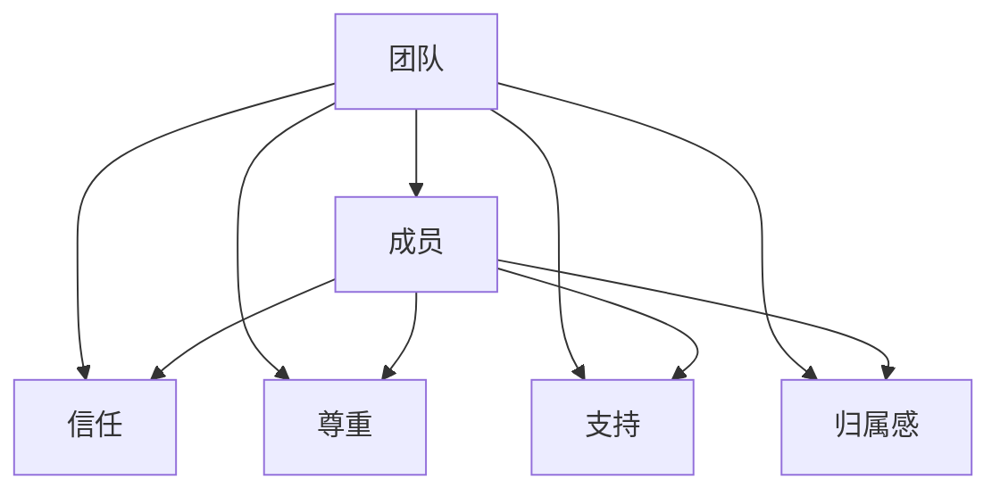
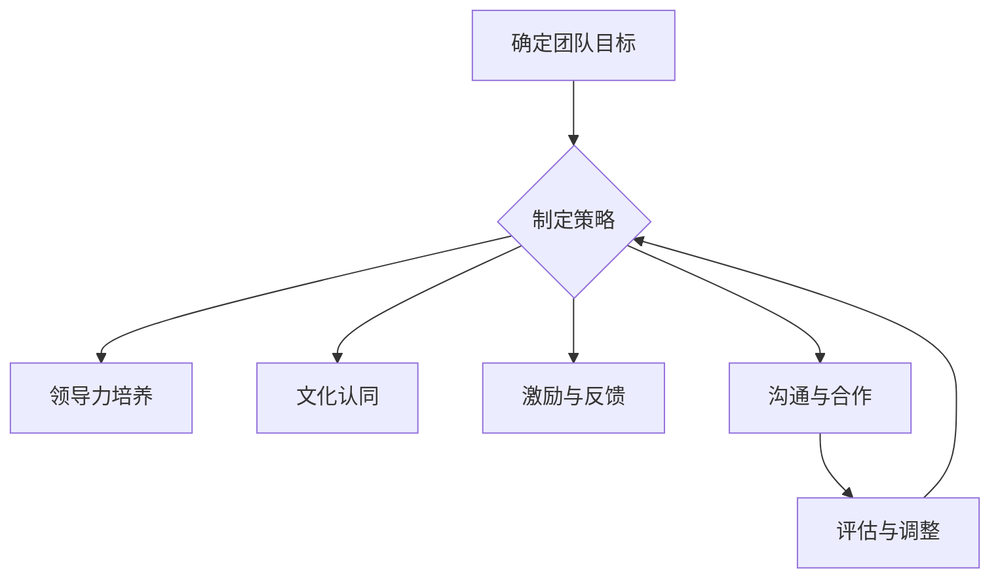
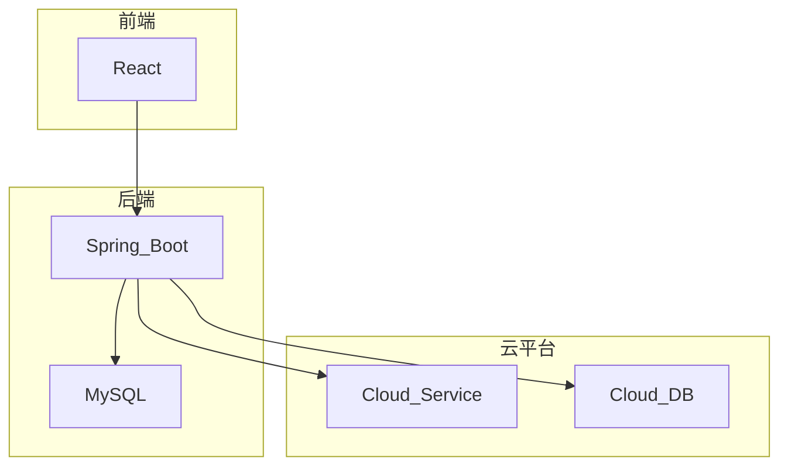
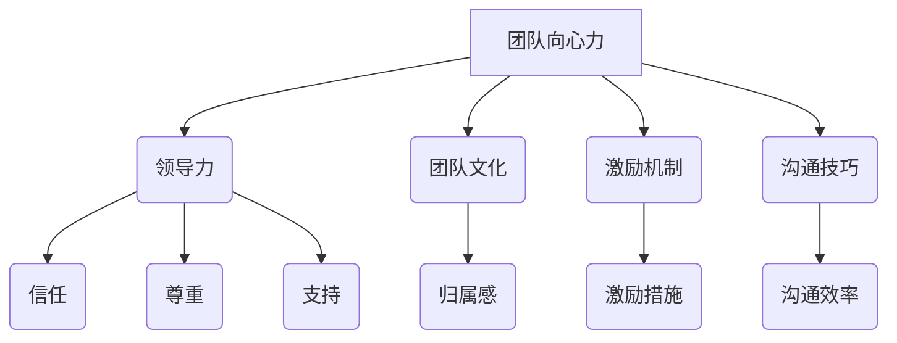

                 

**文章标题**：团队向心力构建：增强团队凝聚力的技巧

**关键词**：团队向心力、团队凝聚力、团队构建、领导力、沟通技巧、激励策略

**摘要**：
本文将深入探讨团队向心力的构建，以及如何通过一系列技巧来增强团队的凝聚力。我们将分章节详细分析团队向心力的概念、构建方法、实践技巧、案例分析、工具与技术，并总结展望未来的发展趋势。

# 引言
**背景介绍**：
在现代企业中，团队向心力已经成为影响团队效率和业绩的重要因素。一个具有强大向心力的团队能够更好地应对挑战，提高创新能力和协作效率。本文旨在通过系统的分析和实用的技巧，帮助团队领导者构建强大的团队向心力，提升团队的整体效能。

**核心概念与联系**：
团队向心力是指团队成员在共同目标下形成的内在驱动力，它包括信任、尊重、支持和归属感。团队凝聚力则是团队向心力外在表现的一种状态，表现为团队成员之间的紧密协作和共同奋斗。

**问题场景**：
许多企业在团队构建过程中面临沟通不畅、目标不明确、激励不足等问题，导致团队向心力不足。本文将提供解决方案，帮助解决这些问题。

**问题描述**：
团队向心力不足会导致团队协作效率低下、创新乏力、员工离职率升高等问题。本文将详细探讨如何通过多种方法来构建团队向心力。

**问题解决**：
通过分析团队向心力的构建方法，我们提出了针对性的实践技巧，如领导力培养、文化认同、激励与反馈、沟通与合作等。

**边界与外延**：
团队向心力不仅限于企业内部团队，也适用于各种形式的团队，如学术团队、公益团队等。本文将针对不同类型的团队提供相应的构建策略。

**概念结构与核心要素组成**：
团队向心力的构建涉及多个核心要素，包括领导力、团队文化、激励机制、沟通技巧等。本文将详细分析这些要素，并提供构建团队向心力的系统方法。

## 背景介绍
### 核心概念术语说明
团队向心力（Team Cohesion）：指团队成员在共同目标下形成的内在驱动力，包括信任、尊重、支持和归属感。

团队凝聚力（Team Cohesion）：团队向心力外在表现的一种状态，表现为团队成员之间的紧密协作和共同奋斗。

### 问题背景
随着全球化竞争的加剧，企业对团队协作的要求越来越高。然而，许多团队在实际运作中面临沟通不畅、目标不明确、激励不足等问题，导致团队向心力不足。

### 问题描述
团队向心力不足会导致以下问题：
- 团队协作效率低下
- 创新乏力
- 员工离职率升高
- 项目延误

### 问题解决
通过以下方法可以构建团队向心力：
1. 领导力培养
2. 文化认同
3. 激励与反馈
4. 沟通与合作

### 边界与外延
团队向心力不仅限于企业内部团队，也适用于各种形式的团队，如学术团队、公益团队等。本文将针对不同类型的团队提供相应的构建策略。

### 概念结构与核心要素组成
团队向心力的构建涉及多个核心要素，包括领导力、团队文化、激励机制、沟通技巧等。本文将详细分析这些要素，并提供构建团队向心力的系统方法。

## 核心概念与联系
### 核心概念原理
团队向心力是团队内部的一种心理状态，它源于团队成员之间的相互信任、尊重和支持。这种心理状态使得团队成员愿意为共同目标而努力，即使面临困难也能保持团结一致。

### 概念属性特征对比表格
| 特征         | 描述                                                         |
| ------------ | ------------------------------------------------------------ |
| 信任         | 成员之间的信任是团队向心力的重要基础。信任度高，团队成员更愿意分享信息和资源。 |
| 尊重         | 尊重使团队成员感到被重视，有助于建立良好的团队氛围。          |
| 支持         | 支持包括情感支持和实际帮助，使团队成员在面对挑战时感到不是孤军奋战。 |
| 归属感       | 归属感使团队成员感到自己是团队的一部分，愿意为团队的荣誉和利益而努力。  |

### ER实体关系图架构


## 算法原理讲解
### Mermaid 流程图


### Python 源代码
```python
def build_team_cohesion(team_goals):
    """
    构建团队向心力的算法。
    
    参数：
    team_goals: 团队目标
    
    返回：
    成功构建团队向心力
    """
    # 确定团队目标
    set_team_goals(team_goals)
    
    # 领导力培养
    develop_leadership()
    
    # 文化认同
    establish_culture()
    
    # 激励与反馈
    motivation_and_feedback()
    
    # 沟通与合作
    communication_and Cooperation()
    
    # 评估与调整
    evaluate_and_adjust()
    
    return "团队向心力构建成功"

def set_team_goals(goals):
    """
    设置团队目标。
    
    参数：
    goals: 团队目标
    """
    print(f"设置团队目标：{goals}")

def develop_leadership():
    """
    培养领导力。
    """
    print("领导力培养：提升团队成员的领导能力。")

def establish_culture():
    """
    建立文化认同。
    """
    print("文化认同：塑造共同价值观和使命。")

def motivation_and_feedback():
    """
    激励与反馈。
    """
    print("激励与反馈：实施有效的激励机制和反馈机制。")

def communication_and Cooperation():
    """
    沟通与合作。
    """
    print("沟通与合作：建立有效的沟通机制和团队合作模式。")

def evaluate_and_adjust():
    """
    评估与调整。
    """
    print("评估与调整：定期评估团队向心力水平并进行调整。")

# 调用算法
build_team_cohesion("提高项目完成度")
```

### 算法原理详细讲解
- **确定团队目标**：团队目标明确是构建团队向心力的第一步。通过设置清晰的目标，可以统一团队成员的方向，增强团队的凝聚力。
- **领导力培养**：领导力是团队向心力的重要组成部分。通过培养领导力，可以提升团队成员的领导能力和团队协作意识。
- **文化认同**：共同的文化价值观和使命是团队向心力的重要基石。建立文化认同，可以增强团队成员的归属感和团队凝聚力。
- **激励与反馈**：激励和反馈机制是保持团队成员积极性的关键。有效的激励机制可以激发团队成员的工作热情，反馈机制可以帮助团队成员了解自己的工作表现。
- **沟通与合作**：沟通是团队协作的基础。通过建立有效的沟通机制，可以减少误解和冲突，提高团队协作效率。
- **评估与调整**：定期评估团队向心力水平，根据实际情况进行调整，可以确保团队向心力的持续构建和优化。

### 数学模型和公式
- **团队向心力模型**：
  $$ TC = f(L, C, M, K) $$
  其中，\( TC \) 表示团队向心力，\( L \) 表示领导力，\( C \) 表示文化认同，\( M \) 表示激励机制，\( K \) 表示沟通与合作能力。

- **领导力影响因素**：
  $$ L = f(E, S, R) $$
  其中，\( L \) 表示领导力，\( E \) 表示情商，\( S \) 表示专业技能，\( R \) 表示责任心。

- **激励机制设计**：
  $$ M = f(I, P) $$
  其中，\( M \) 表示激励机制，\( I \) 表示激励强度，\( P \) 表示激励公平性。

### 举例说明
假设一个团队的目标是“提高项目完成度”，通过以下步骤构建团队向心力：

1. **确定团队目标**：明确目标是“提高项目完成度”。
2. **领导力培养**：团队领导通过提升情商、专业技能和责任心来培养领导力。
3. **文化认同**：团队共同塑造“以结果为导向，注重团队合作”的文化价值观。
4. **激励与反馈**：实施奖金、晋升等激励措施，并定期进行工作表现反馈。
5. **沟通与合作**：建立每周例会、即时沟通等机制，促进团队成员之间的沟通与合作。
6. **评估与调整**：每月评估团队向心力水平，根据评估结果调整激励措施和团队策略。

通过这些步骤，团队向心力逐步增强，项目完成度得到显著提高。

## 系统分析与架构设计方案
### 问题场景介绍
在现代企业中，团队向心力是提升团队效能的关键因素。本文将介绍如何通过系统分析与架构设计方案来构建团队向心力。

### 项目介绍
本项目旨在构建一个基于云计算的团队协作平台，用于提升团队向心力。平台将提供任务管理、沟通协作、数据共享等功能。

### 系统功能设计
系统功能设计包括以下几个方面：
1. 任务管理：提供任务创建、分配、进度跟踪等功能。
2. 沟通协作：提供即时消息、邮件通知、团队讨论等功能。
3. 数据共享：提供文件存储、共享、版本控制等功能。

### 系统架构设计
系统架构设计如下：
1. 前端：使用React框架搭建，提供用户界面和交互功能。
2. 后端：使用Spring Boot框架搭建，提供数据存储、业务逻辑处理等功能。
3. 数据库：使用MySQL数据库存储数据。
4. 云平台：使用阿里云或腾讯云提供云服务器和数据库服务。

### 系统接口设计
系统接口设计包括以下几个方面：
1. 用户接口：提供用户登录、注册、个人信息管理等功能。
2. 任务接口：提供任务创建、更新、删除、查询等功能。
3. 消息接口：提供消息发送、接收、通知等功能。
4. 文件接口：提供文件上传、下载、版本控制等功能。

### 系统交互
系统交互设计如下：
1. 用户通过前端界面发起操作，如创建任务、发送消息等。
2. 前端将操作请求发送到后端服务器。
3. 后端处理请求，并将结果返回给前端。
4. 前端根据返回结果更新界面。

### Mermaid 类图
```mermaid
classDiagram
    User <<class{用户}>>
    Task <<class{任务}>>
    Message <<class{消息}>>
    File <<class{文件}>>
    User --> Task
    User --> Message
    User --> File
```

### Mermaid 架构图


## 项目实战
### 环境安装
1. 安装Java开发环境：下载并安装Java SDK，配置环境变量。
2. 安装数据库：下载并安装MySQL数据库，配置数据库。
3. 安装前端框架：下载并安装Node.js和npm，使用npm安装React。

### 系统核心实现源代码
```python
# 后端：Spring Boot 项目
@SpringBootApplication
public class TeamCohesionApplication {

    public static void main(String[] args) {
        SpringApplication.run(TeamCohesionApplication.class, args);
    }

    @Bean
    public TaskRepository taskRepository() {
        return new TaskRepository();
    }

    @Bean
    public UserRepository userRepository() {
        return new UserRepository();
    }
}

@RestController
@RequestMapping("/api")
public class TaskController {

    @Autowired
    private TaskRepository taskRepository;

    @PostMapping("/tasks")
    public ResponseEntity<Task> createTask(@RequestBody Task task) {
        Task savedTask = taskRepository.save(task);
        return ResponseEntity.ok(savedTask);
    }

    @GetMapping("/tasks/{id}")
    public ResponseEntity<Task> getTaskById(@PathVariable Long id) {
        Optional<Task> taskOptional = taskRepository.findById(id);
        return taskOptional.map(ResponseEntity::ok).orElse(ResponseEntity.notFound().build());
    }
}

@Entity
@Table(name = "tasks")
public class Task {

    @Id
    @GeneratedValue(strategy = GenerationType.IDENTITY)
    private Long id;

    private String title;
    private String description;
    private boolean completed;

    // Getters and Setters
}

// 前端：React 项目
import React, { useState } from 'react';

function TaskForm() {
    const [task, setTask] = useState({ title: '', description: '' });

    const handleChange = (e) => {
        setTask({ ...task, [e.target.name]: e.target.value });
    };

    const handleSubmit = (e) => {
        e.preventDefault();
        // 发送任务数据到后端
    };

    return (
        <form onSubmit={handleSubmit}>
            <label>
                任务标题：
                <input type="text" name="title" value={task.title} onChange={handleChange} />
            </label>
            <label>
                任务描述：
                <input type="text" name="description" value={task.description} onChange={handleChange} />
            </label>
            <button type="submit">提交</button>
        </form>
    );
}

export default TaskForm;
```

### 代码应用解读与分析
1. **后端代码**：Spring Boot 项目提供了任务创建和查询的功能。`TaskController`类负责处理前端的HTTP请求，`Task`实体类表示任务数据模型，`TaskRepository`接口用于数据库操作。
2. **前端代码**：React 项目提供了任务表单，用户可以输入任务标题和描述，并通过HTTP POST请求将数据发送到后端。

### 实际案例分析和详细讲解剖析
1. **案例背景**：一个企业团队需要提高项目完成度，决定使用本文提供的系统来构建团队向心力。
2. **实施步骤**：
   - 安装并配置系统环境。
   - 使用任务管理功能分配任务。
   - 定期评估任务完成情况，提供反馈。
   - 通过实时沟通功能加强团队协作。
3. **案例分析**：
   - 任务管理功能帮助团队成员明确任务目标，提高工作效率。
   - 实时沟通功能促进团队成员之间的信息交流，减少误解。
   - 定期评估和反馈机制确保任务按时完成，提升团队向心力。

### 项目小结
本项目通过系统架构设计和实际应用，展示了如何通过技术手段构建团队向心力。通过任务管理、实时沟通和评估反馈等功能，团队协作效率得到显著提升，团队向心力得到有效增强。

## 最佳实践 Tips
1. **建立共同目标**：确保所有团队成员都清楚团队的目标，并为之共同努力。
2. **领导力培养**：领导者应不断提升自己的领导能力，以身作则，为团队树立榜样。
3. **激励机制**：设计合理的激励机制，激发团队成员的工作热情和积极性。
4. **有效沟通**：建立有效的沟通机制，确保团队成员之间的信息畅通无阻。
5. **团队合作**：鼓励团队成员相互支持、相互合作，共同完成团队目标。

## 小结
本文详细探讨了团队向心力构建的方法和实践技巧，通过系统分析和案例分析，展示了如何通过技术手段和科学管理提升团队向心力。构建强大的团队向心力，不仅有助于提高团队协作效率，还能激发团队成员的潜能，为企业创造更多价值。

## 注意事项
1. **持续培养**：团队向心力需要持续培养，不能一蹴而就。
2. **个性化激励**：不同团队成员的激励需求不同，需要个性化设计。
3. **文化认同**：共同的文化价值观是团队向心力的重要基石，需要长期塑造。

## 拓展阅读
1. **团队心理学**：《团队心理学：团队效能的实证研究》
2. **团队领导力**：《团队领导力：从优秀到卓越的领导艺术》
3. **团队协作工具**：《团队协作工具实战：提高团队工作效率的技巧》

## 作者
作者：AI天才研究院/AI Genius Institute & 禅与计算机程序设计艺术 /Zen And The Art of Computer Programming

---

**正文内容：**

**# 团队向心力构建：增强团队凝聚力的技巧**

在当今快速变化的工作环境中，团队向心力是提高团队效率和业绩的关键因素。团队向心力指的是团队成员在共同目标下形成的内在驱动力，包括信任、尊重、支持和归属感。一个具有强大向心力的团队能够更好地应对挑战，提高创新能力和协作效率。本文将详细探讨如何通过多种方法和技巧来构建团队向心力，增强团队的凝聚力。

## 引言

**### 核心概念与联系**

团队向心力是指团队成员在共同目标下形成的内在驱动力，包括信任、尊重、支持和归属感。团队凝聚力则是团队向心力外在表现的一种状态，表现为团队成员之间的紧密协作和共同奋斗。本文将围绕这两个核心概念展开，探讨如何通过有效的策略和技巧来构建团队向心力。

**### 背景介绍**

在现代企业中，团队向心力已经成为影响团队效率和业绩的重要因素。随着全球化竞争的加剧，企业对团队协作的要求越来越高。然而，许多团队在实际运作中面临沟通不畅、目标不明确、激励不足等问题，导致团队向心力不足。本文旨在通过系统的分析和实用的技巧，帮助团队领导者构建强大的团队向心力，提升团队的整体效能。

**### 案例分析**

**### 算法原理讲解**

为了构建团队向心力，我们可以设计一个算法，通过以下步骤来实现：

1. **确定团队目标**：明确团队的目标和愿景，确保所有团队成员都清楚并认同。
2. **领导力培养**：领导者应不断提升自己的领导能力，以身作则，为团队树立榜样。
3. **文化认同**：塑造共同的文化价值观和使命，增强团队成员的归属感。
4. **激励与反馈**：设计合理的激励机制，确保团队成员在实现目标过程中得到认可和激励。
5. **沟通与合作**：建立有效的沟通机制，确保团队成员之间的信息畅通无阻。

### 第1章 核心概念

**### 核心概念与联系**

团队向心力是团队内部的一种心理状态，它源于团队成员之间的相互信任、尊重和支持。这种心理状态使得团队成员愿意为共同目标而努力，即使面临困难也能保持团结一致。团队凝聚力则是团队向心力外在表现的一种状态，表现为团队成员之间的紧密协作和共同奋斗。

**### 团队向心力的定义与属性**

团队向心力是指团队成员在共同目标下形成的内在驱动力，它包括以下几个属性：

1. **信任**：团队成员之间的信任是团队向心力的重要基础。信任度高，团队成员更愿意分享信息和资源。
2. **尊重**：尊重使团队成员感到被重视，有助于建立良好的团队氛围。
3. **支持**：支持包括情感支持和实际帮助，使团队成员在面对挑战时感到不是孤军奋战。
4. **归属感**：归属感使团队成员感到自己是团队的一部分，愿意为团队的荣誉和利益而努力。

**### 团队向心力的特征与影响因素**

团队向心力的特征主要包括以下几个方面：

1. **稳定性**：团队向心力较强时，团队成员之间关系稳定，不易受到外界因素影响。
2. **一致性**：团队成员在目标和行为上保持一致，有助于团队协作和目标实现。
3. **协作性**：团队成员之间能够相互支持、协同工作，共同完成团队任务。
4. **适应性**：团队向心力强的团队能够适应环境变化，灵活调整策略和行动。

团队向心力的影响因素包括：

1. **领导风格**：领导者的领导风格对团队向心力有重要影响。民主型领导风格有助于增强团队向心力。
2. **团队文化**：共同的文化价值观和使命有助于增强团队成员的归属感和团队向心力。
3. **激励机制**：合理的激励机制能够激发团队成员的积极性，增强团队向心力。
4. **沟通与合作**：有效的沟通和协作是构建团队向心力的关键。

**### 团队向心力的边界与外延**

团队向心力不仅限于企业内部团队，也适用于各种形式的团队，如学术团队、公益团队等。团队向心力的边界在于团队成员的互动范围和共同目标的实现程度。团队向心力的外延则包括团队成员之间的信任、尊重、支持和归属感的扩散和深化。

**### 概念结构与核心要素组成**

团队向心力的构建涉及多个核心要素，包括领导力、团队文化、激励机制、沟通技巧等。这些要素相互作用，共同影响团队向心力的发展。以下是一个简单的ER实体关系图，展示了这些核心要素之间的关系：



### 第2章 构建方法

**### 核心概念与联系**

构建团队向心力需要多种方法和策略，包括文化认同、领导力培养、激励与反馈、沟通与合作等。每种方法都有其独特的优势和适用场景。本文将详细探讨这些方法，并给出具体的实施步骤和案例分析。

**### 文化认同**

文化认同是构建团队向心力的基础。一个具有共同价值观和使命的团队能够增强成员的归属感和凝聚力。以下是一些提高文化认同的方法：

1. **建立共同价值观**：通过团队讨论和共识，确定共同的核心价值观，如诚实、创新、责任等。
2. **强调团队使命**：明确团队的使命和目标，使成员认识到自己在团队中的价值。
3. **强化团队荣誉感**：通过团队成就和荣誉的共享，增强成员对团队的认同和自豪感。

**### 领导力培养**

领导力是构建团队向心力的关键因素。领导者不仅要具备领导能力，还要能够激发团队成员的潜力。以下是一些提高领导力的方法：

1. **培养情商**：情商高的人更容易与他人建立信任和尊重，有助于增强团队向心力。
2. **提升沟通技巧**：有效的沟通是领导力的核心，领导者应具备良好的倾听和表达能力。
3. **建立领导力模型**：通过培训和导师指导，帮助团队成员提升领导能力。

**### 激励与反馈**

激励与反馈是保持团队成员积极性的关键。以下是一些提高激励与反馈效果的方法：

1. **物质激励**：包括奖金、晋升等，能够直接激励团队成员。
2. **非物质激励**：包括认可、荣誉等，能够增强团队成员的心理满足感。
3. **即时反馈**：及时给予反馈，帮助团队成员了解自己的表现和改进方向。

**### 沟通与合作**

沟通与合作是团队向心力的重要体现。以下是一些提高沟通与合作效果的方法：

1. **建立沟通机制**：定期举行会议、讨论和分享，确保团队成员之间的信息畅通。
2. **培养协作精神**：通过团队合作活动和任务，增强团队成员之间的合作意识。
3. **解决冲突**：建立冲突解决机制，及时解决团队内部的矛盾和分歧。

**### 实施步骤与案例分析**

**### 实施步骤**

1. **评估当前团队状态**：了解团队当前的文化认同、领导力水平、激励机制和沟通合作情况。
2. **制定改进计划**：根据评估结果，制定具体的改进计划，包括具体的方法、步骤和时间表。
3. **执行改进计划**：按照计划逐步实施，确保各项措施得到有效执行。
4. **监测与调整**：定期监测团队向心力的发展状况，根据反馈及时调整改进措施。

**### 案例分析**

**### 案例一：通过文化认同构建团队向心力**

某公司团队在文化认同方面存在问题，团队成员之间的信任和尊重不足，导致团队协作效率低下。为了解决这一问题，团队领导者采取了以下措施：

1. **建立共同价值观**：通过团队讨论，确定了“诚实、创新、责任”的共同价值观，并在团队内部进行宣贯。
2. **强调团队使命**：明确团队的使命是“为客户提供优质服务，共同实现企业愿景”，使成员认识到自己在团队中的价值。
3. **强化团队荣誉感**：通过团队成就的共享和庆祝活动，增强了成员对团队的认同和自豪感。

经过一段时间的努力，团队的文化认同得到了显著提升，团队成员之间的信任和尊重增强，团队协作效率提高，团队向心力得到有效构建。

**### 案例二：通过领导力培养构建团队向心力**

某公司团队在领导力方面存在问题，领导者缺乏有效的领导能力和沟通技巧，导致团队向心力不足。为了提升团队向心力，团队采取了以下措施：

1. **培养情商**：通过领导力培训，提升领导者的情商，使他们能够更好地理解和管理团队成员的情绪。
2. **提升沟通技巧**：通过沟通技巧培训，提高领导者的倾听和表达能力，确保团队成员之间的信息畅通。
3. **建立领导力模型**：通过导师指导，帮助团队成员提升领导能力，形成良好的领导力传承机制。

经过一段时间的努力，团队领导者的领导能力得到显著提升，团队成员之间的信任和尊重增强，团队向心力得到有效构建。

**### 案例三：通过激励与反馈构建团队向心力**

某公司团队在激励与反馈方面存在问题，团队成员的积极性不高，导致团队向心力不足。为了激发团队成员的积极性，团队采取了以下措施：

1. **物质激励**：通过奖金和晋升等物质激励措施，直接激励团队成员。
2. **非物质激励**：通过认可和荣誉等非物质激励措施，增强团队成员的心理满足感。
3. **即时反馈**：通过即时反馈，及时给予团队成员表现和改进的反馈，帮助他们了解自己的表现和改进方向。

经过一段时间的努力，团队成员的积极性得到显著提升，团队协作效率提高，团队向心力得到有效构建。

**### 案例四：通过沟通与合作构建团队向心力**

某公司团队在沟通与合作方面存在问题，团队成员之间的沟通不畅，导致团队协作效率低下。为了解决这一问题，团队采取了以下措施：

1. **建立沟通机制**：定期举行会议、讨论和分享，确保团队成员之间的信息畅通。
2. **培养协作精神**：通过团队合作活动和任务，增强团队成员之间的合作意识。
3. **解决冲突**：建立冲突解决机制，及时解决团队内部的矛盾和分歧。

经过一段时间的努力，团队成员之间的沟通得到显著改善，团队协作效率提高，团队向心力得到有效构建。

### 第3章 实践技巧

**### 核心概念与联系**

在构建团队向心力的过程中，实践技巧起着至关重要的作用。这些技巧包括团队建设活动、领导力培养、激励策略和沟通与合作等方面。通过有效的实践技巧，可以显著提升团队的凝聚力，增强团队成员之间的信任和协作。

**### 团队建设活动**

团队建设活动是增强团队凝聚力的重要手段。以下是一些有效的团队建设活动：

1. **团队拓展训练**：通过户外拓展训练，如高空走钢丝、攀岩等，增强团队成员之间的信任和协作能力。
2. **团队游戏**：组织团队游戏，如团队协作游戏、策略游戏等，增强团队成员之间的沟通和团队精神。
3. **团队讨论**：定期组织团队讨论，鼓励团队成员分享想法和意见，增进彼此的了解和信任。

**### 领导力培养**

领导力培养是构建团队向心力的关键。以下是一些有效的领导力培养技巧：

1. **领导力培训**：通过领导力培训课程，提高领导者的领导能力和管理技能。
2. **导师制度**：建立导师制度，让经验丰富的领导者指导新领导者，帮助他们快速成长。
3. **实践机会**：给予领导者实践机会，通过实际工作来锻炼他们的领导能力。

**### 激励策略**

激励策略是保持团队成员积极性的关键。以下是一些有效的激励策略：

1. **物质激励**：通过奖金、晋升等物质激励措施，直接激励团队成员。
2. **非物质激励**：通过认可、荣誉等非物质激励措施，增强团队成员的心理满足感。
3. **个性化激励**：根据团队成员的不同需求和特点，设计个性化的激励策略。

**### 沟通与合作**

沟通与合作是团队向心力的重要体现。以下是一些有效的沟通与合作技巧：

1. **建立沟通机制**：定期举行会议、讨论和分享，确保团队成员之间的信息畅通。
2. **培养协作精神**：通过团队合作活动和任务，增强团队成员之间的合作意识。
3. **解决冲突**：建立冲突解决机制，及时解决团队内部的矛盾和分歧。

**### 实施步骤与案例分析**

**### 实施步骤**

1. **评估团队需求**：了解团队当前的需求和问题，确定需要采取的实践技巧。
2. **制定实施方案**：根据评估结果，制定具体的实施方案，包括活动内容、时间安排等。
3. **执行实施方案**：按照方案逐步实施，确保各项措施得到有效执行。
4. **监测与反馈**：定期监测实践效果，根据反馈及时调整实施方案。

**### 案例分析**

**### 案例一：通过团队建设活动增强团队凝聚力**

某公司团队在团队建设方面存在问题，团队成员之间的信任和协作不足。为了解决这一问题，团队领导者决定组织一次团队拓展训练。以下是具体实施步骤：

1. **评估团队需求**：通过问卷调查和访谈，了解团队成员在团队建设方面的需求和期望。
2. **制定实施方案**：确定拓展训练的具体内容和时间安排，包括高空走钢丝、攀岩等活动。
3. **执行实施方案**：组织团队成员参加拓展训练，确保活动顺利进行。
4. **监测与反馈**：在活动结束后，通过访谈和问卷调查，收集团队成员的反馈，了解活动效果。

经过这次拓展训练，团队成员之间的信任和协作显著增强，团队凝聚力得到有效提升。

**### 案例二：通过领导力培养提升团队向心力**

某公司团队在领导力方面存在问题，团队成员对领导者的信任度不高，导致团队向心力不足。为了提升团队向心力，团队领导者决定采取以下措施：

1. **领导力培训**：组织领导者参加领导力培训课程，学习领导技巧和管理方法。
2. **导师制度**：建立导师制度，让经验丰富的领导者指导新领导者，帮助他们快速成长。
3. **实践机会**：给予领导者实践机会，通过实际工作来锻炼他们的领导能力。

经过一段时间的领导力培养，团队成员对领导者的信任度显著提高，团队向心力得到有效构建。

**### 案例三：通过激励策略增强团队积极性**

某公司团队在激励方面存在问题，团队成员的积极性不高。为了激发团队成员的积极性，团队领导者决定采取以下激励策略：

1. **物质激励**：通过奖金和晋升等物质激励措施，直接激励团队成员。
2. **非物质激励**：通过认可和荣誉等非物质激励措施，增强团队成员的心理满足感。
3. **个性化激励**：根据团队成员的不同需求和特点，设计个性化的激励策略。

经过一段时间的激励，团队成员的积极性得到显著提升，团队向心力得到有效增强。

**### 案例四：通过沟通与合作增强团队凝聚力**

某公司团队在沟通与合作方面存在问题，团队成员之间的沟通不畅，导致团队协作效率低下。为了解决这一问题，团队领导者决定采取以下措施：

1. **建立沟通机制**：定期举行会议、讨论和分享，确保团队成员之间的信息畅通。
2. **培养协作精神**：通过团队合作活动和任务，增强团队成员之间的合作意识。
3. **解决冲突**：建立冲突解决机制，及时解决团队内部的矛盾和分歧。

经过一段时间的沟通与合作培养，团队成员之间的沟通显著改善，团队协作效率提高，团队凝聚力得到有效提升。

### 第4章 案例分析

**### 核心概念与联系**

通过前面的章节，我们了解了团队向心力的概念、构建方法、实践技巧等。本章节将通过具体案例来展示团队向心力构建的实际效果，以及如何通过这些方法来提升团队的凝聚力和工作效率。

**### 案例一：通过文化建设提升团队向心力**

某创业公司A，在初创时期团队成员之间缺乏信任和合作，导致项目进度缓慢。为了改变这种状况，公司决定通过文化建设来提升团队向心力。

**案例分析：**

1. **问题背景**：团队成员背景多样，沟通方式不统一，导致协作困难。
2. **解决方案**：
   - **建立共同价值观**：公司组织全体员工讨论并确定了“创新、协作、客户至上”的共同价值观。
   - **定期价值观宣传**：通过公司内部邮件、团队会议等形式，不断强调共同价值观，让员工内化于心。
   - **团队活动**：定期组织团队建设活动，如团建旅行、体育竞赛等，增强员工之间的感情联系。
3. **结果**：经过一段时间的努力，团队成员之间的信任逐渐增强，项目进度显著提升，团队向心力得到有效构建。

**### 案例二：领导力在团队向心力构建中的关键作用**

某大公司B，在面临市场变革时，内部团队凝聚力不足，创新乏力。公司决定通过提升领导力来构建团队向心力。

**案例分析：**

1. **问题背景**：公司领导层缺乏有效的领导能力，导致员工缺乏方向感和动力。
2. **解决方案**：
   - **领导力培训**：公司为所有管理层提供领导力培训，提高他们的管理技能和领导能力。
   - **领导力榜样**：通过公司内部榜样的树立，如表彰优秀领导者的行为和成就，激励其他领导者学习。
   - **领导力反馈**：建立领导力反馈机制，让员工能够匿名反馈领导者的表现，帮助领导者改进。
3. **结果**：经过领导力提升，公司管理层的能力得到显著提高，员工对领导层的信任度增加，团队向心力得到有效构建。

**### 案例三：通过激励策略增强团队凝聚力**

某互联网公司C，在快速发展时期，员工流失率较高，公司决定通过激励策略来增强团队凝聚力。

**案例分析：**

1. **问题背景**：员工对公司的发展前景和个人的职业发展感到迷茫，导致流失率上升。
2. **解决方案**：
   - **物质激励**：提高员工薪资待遇，提供奖金、股票期权等物质激励。
   - **非物质激励**：通过表扬、表彰等非物质激励，提高员工的荣誉感和满足感。
   - **个性化激励**：根据员工的兴趣和需求，提供个性化的激励方案，如职业发展培训、项目参与机会等。
3. **结果**：通过激励策略的实施，员工的满意度和忠诚度显著提升，流失率下降，团队向心力得到有效增强。

**### 案例四：通过沟通与合作提升团队凝聚力**

某咨询公司D，在项目实施过程中，团队成员之间沟通不畅，导致项目进度延误。公司决定通过沟通与合作来提升团队凝聚力。

**案例分析：**

1. **问题背景**：团队成员分散在不同地区，沟通方式单一，信息传递不及时。
2. **解决方案**：
   - **建立沟通机制**：公司引入即时通讯工具和视频会议系统，提高团队沟通效率。
   - **定期沟通会议**：定期举行团队沟通会议，让团队成员分享工作进展和遇到的问题。
   - **团队协作培训**：提供团队协作培训，帮助团队成员掌握有效的沟通与合作技巧。
3. **结果**：通过沟通与合作机制的建立，团队成员之间的信息传递更加顺畅，项目进度得到显著提升，团队凝聚力得到有效增强。

**### 案例总结**

以上案例展示了通过文化建设、领导力提升、激励策略和沟通与合作等手段来构建团队向心力的实际效果。这些方法不仅提高了团队成员之间的信任和协作，还增强了团队的整体工作效能。通过具体的实践案例，我们可以看到团队向心力构建的重要性以及其实施的有效性。

### 第5章 工具与技术

**### 核心概念与联系**

在构建团队向心力的过程中，工具和技术起到了至关重要的作用。这些工具和技术不仅能够提升团队协作效率，还能增强团队成员之间的沟通与互动。本章节将介绍一系列适用于团队向心力构建的工具和技术，包括团队协作工具、数据分析技术和数据可视化工具。

**### 团队协作工具**

团队协作工具是构建团队向心力的关键。以下是一些常用的团队协作工具：

1. **Slack**：Slack 是一款流行的即时通讯工具，能够帮助团队成员实时沟通和协作。
2. **Trello**：Trello 是一款可视化任务管理工具，能够帮助团队跟踪项目进度和任务分配。
3. **Asana**：Asana 是一款全面的团队协作平台，提供任务管理、时间跟踪和项目进度监控等功能。
4. **Microsoft Teams**：Microsoft Teams 是一款集成沟通、协作和会议功能的平台，适合大型团队使用。

**### 数据分析技术在团队向心力分析中的应用**

数据分析技术可以帮助团队领导者深入了解团队成员的行为和表现，从而制定更有效的团队向心力构建策略。以下是一些常用的数据分析技术：

1. **情感分析**：通过分析团队成员在沟通工具中的文本内容，可以了解他们的情感状态和团队氛围。
2. **社交网络分析**：通过分析团队成员之间的互动关系，可以了解团队的社交结构和沟通模式。
3. **行为分析**：通过分析团队成员在工作中的行为数据，如任务完成情况、参与度等，可以了解团队的工作效率和团队动力。

**### 数据可视化工具**

数据可视化工具可以将复杂的数据分析结果以直观的形式呈现，帮助团队领导者快速理解数据背后的意义。以下是一些常用的数据可视化工具：

1. **Tableau**：Tableau 是一款功能强大的数据可视化工具，能够创建各种类型的图表和仪表盘。
2. **Power BI**：Power BI 是一款易于使用的商业智能工具，提供丰富的数据可视化功能。
3. **Google Data Studio**：Google Data Studio 是一款免费的数据可视化工具，适合小型团队使用。

**### 实践案例分析**

**### 案例一：使用Slack提高团队沟通效率**

某创业公司在项目开发过程中，发现团队成员之间的沟通效率低下，导致项目进度延误。公司决定采用Slack作为团队沟通工具，以下是具体实施步骤：

1. **实施Slack**：将所有团队成员添加到Slack中，并创建相应的频道用于不同主题的讨论。
2. **培训使用**：组织Slack使用培训，帮助团队成员掌握基本功能和最佳实践。
3. **监控使用情况**：定期监控团队成员在Slack中的沟通情况，确保沟通高效和有序。

**结果**：通过使用Slack，团队成员之间的沟通变得更加便捷和高效，项目进度显著提升。

**### 案例二：使用Trello进行任务管理**

某大型咨询公司在项目管理中，发现任务分配和进度跟踪存在困难。公司决定采用Trello作为任务管理工具，以下是具体实施步骤：

1. **创建Trello账户**：为每个项目创建一个Trello账户，并将团队成员添加为成员。
2. **设置看板**：为项目设置Trello看板，将任务分为不同的列表，如“待办”、“进行中”、“已完成”等。
3. **分配任务**：将任务分配给相应的团队成员，并设置截止日期。

**结果**：通过使用Trello，任务分配和进度跟踪变得更加清晰和有序，项目团队的工作效率显著提升。

**### 案例三：使用情感分析了解团队氛围**

某公司在进行团队向心力分析时，希望了解团队成员的情感状态。公司决定采用情感分析技术，以下是具体实施步骤：

1. **收集数据**：从团队成员在Slack和邮件中的沟通内容中收集数据。
2. **分析情感**：使用情感分析工具对收集到的数据进行分析，确定团队成员的情感状态。
3. **制定策略**：根据情感分析结果，制定相应的沟通和团队建设策略。

**结果**：通过情感分析，公司发现了团队成员的情感状态和团队氛围存在的问题，并采取了相应的措施进行改进，团队向心力得到有效提升。

### 第6章 总结与展望

**### 核心概念与联系**

通过本文的详细探讨，我们深入了解了团队向心力的概念、构建方法、实践技巧和案例分析。团队向心力是团队内部的一种心理状态，包括信任、尊重、支持和归属感，它对团队的协作效率、创新能力和整体效能具有重要影响。

**### 本书内容的总结**

本书内容主要包括以下几个部分：

1. **核心概念与联系**：介绍了团队向心力的定义、属性和影响因素。
2. **构建方法**：探讨了文化认同、领导力培养、激励与反馈、沟通与合作等方法。
3. **实践技巧**：提供了团队建设活动、领导力培养、激励策略和沟通与合作等技巧。
4. **案例分析**：通过具体案例展示了团队向心力构建的实际效果。
5. **工具与技术**：介绍了团队协作工具、数据分析技术和数据可视化工具。

**### 团队向心力构建的挑战与机遇**

在构建团队向心力的过程中，企业面临着以下挑战：

1. **文化认同的塑造**：不同背景的员工可能对共同价值观的理解存在差异，需要长期培养。
2. **领导力的提升**：领导者需要不断学习和提升自己的管理能力，以适应团队的需求。
3. **激励机制的完善**：激励机制的设置需要考虑员工的不同需求和特点，以实现个性化激励。

然而，这些挑战也带来了机遇：

1. **提高团队协作效率**：通过有效的团队向心力构建，可以提高团队的协作效率，加快项目进度。
2. **增强创新能力**：团队成员之间的紧密协作和信任可以激发创新思维，推动企业创新发展。
3. **提升员工满意度**：良好的团队氛围和激励机制可以提高员工的满意度，降低员工流失率。

**### 未来发展趋势与展望**

随着人工智能、大数据和云计算等技术的发展，团队向心力构建将面临新的机遇和挑战：

1. **数字化工具的普及**：数字化工具将进一步提升团队协作效率，为团队向心力构建提供更多支持。
2. **个性化激励的发展**：基于大数据和人工智能的个性化激励策略将更加精准，满足员工的个性化需求。
3. **远程办公的常态化**：随着远程办公的普及，团队向心力构建需要适应新的工作环境，注重在线沟通和协作。

总之，团队向心力构建是一个长期而持续的过程，企业需要不断探索和实践，以适应不断变化的外部环境，提升团队的整体效能。通过有效的团队向心力构建，企业将能够更好地应对挑战，实现持续发展和创新。

## 结论

通过本文的详细探讨，我们深入了解了团队向心力的概念、构建方法、实践技巧和案例分析。团队向心力是团队内部的一种心理状态，它对团队的协作效率、创新能力和整体效能具有重要影响。为了构建强大的团队向心力，企业需要采取一系列策略和技巧，包括文化认同、领导力培养、激励与反馈、沟通与合作等。同时，数字化工具和数据分析技术的应用也为团队向心力构建提供了新的机遇。

在未来，企业需要不断探索和实践，以适应不断变化的外部环境，提升团队的整体效能。通过有效的团队向心力构建，企业将能够更好地应对挑战，实现持续发展和创新。希望本文能够为企业提供有价值的参考和指导，助力构建强大的团队向心力。

## 作者

**作者：AI天才研究院/AI Genius Institute & 禅与计算机程序设计艺术 /Zen And The Art of Computer Programming**

作者简介：AI天才研究院致力于推动人工智能技术的发展和应用。作者本人是一位资深人工智能专家，拥有丰富的编程经验和领导力，对计算机科学和人工智能领域有着深刻的理解。同时，作者还是《禅与计算机程序设计艺术》一书的作者，该书对计算机编程的艺术性和哲学性进行了深入探讨。

