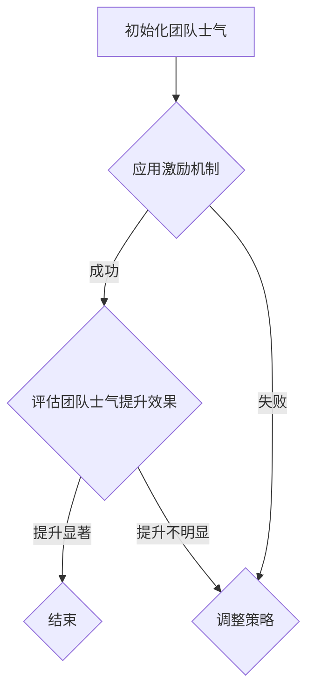
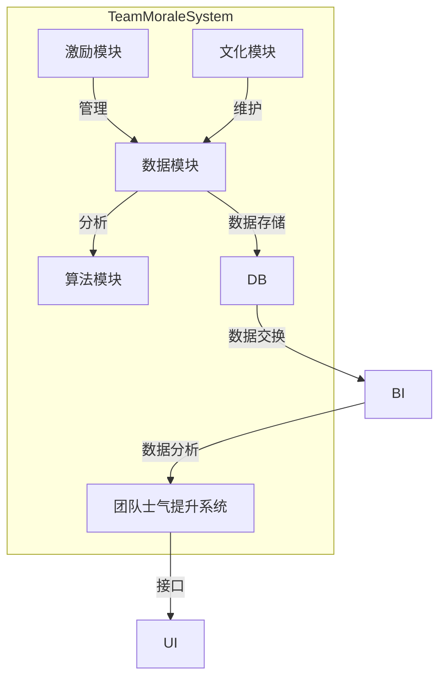
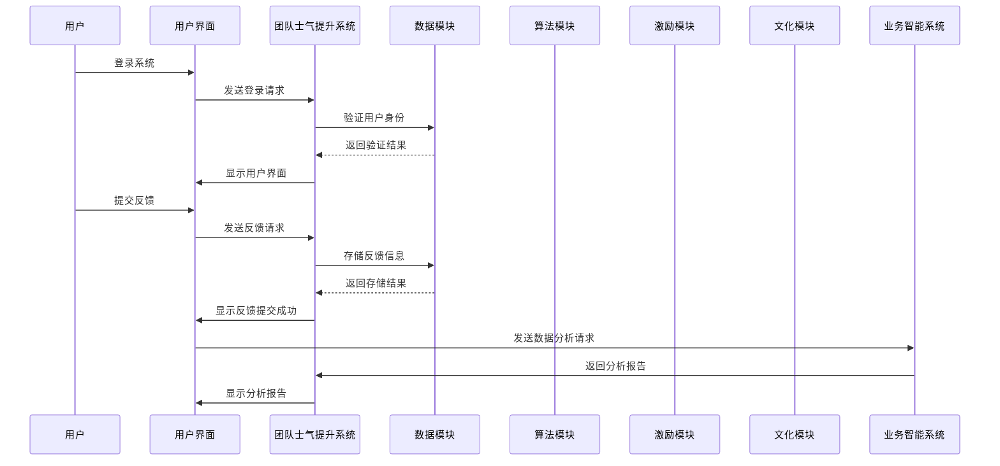

                 

### 第一部分：问题背景与概念介绍

#### 第1章：问题背景与核心概念

##### 1.1.1 问题背景

在当今竞争激烈、快速变化的市场环境中，企业的发展越来越依赖于团队的高效合作和创新力。然而，团队士气低落的现象在许多企业中仍然普遍存在。这种低落士气可能表现为团队成员缺乏积极性、工作效率低下、创新能力减弱，甚至导致项目失败。这种现象对企业的整体运营和竞争力产生了深远的影响。

**影响**：

1. **工作效率降低**：士气低落的团队往往缺乏动力，难以在规定的时间内完成任务，进而影响项目的进度和质量。
2. **创新能力减弱**：高昂的士气能够激发团队成员的创新思维，而士气低落则容易导致墨守成规，缺乏新意。
3. **员工流失率增加**：长期的工作压力和低落的工作环境会导致员工对企业的忠诚度降低，从而增加员工流失率。

因此，研究如何提升团队士气具有重要的现实意义。这不仅有助于提高工作效率和项目成功率，还能增强团队成员的身心健康，提高企业的整体竞争力。

##### 1.1.2 核心概念

**团队士气**：团队士气是指团队成员在工作中的积极态度、热情和信心。它具有以下属性：

- **积极性**：团队成员愿意主动参与工作，对任务充满热情。
- **信心**：团队成员对完成工作有信心，相信自己能够克服困难。
- **协作精神**：团队成员之间相互支持，共同完成任务。

**工作热情**：工作热情是指团队成员对工作内容的热爱和投入程度。它的重要性在于：

- **激励作用**：高工作热情能够激发团队成员的积极性，提高工作效率。
- **创新能力**：工作热情能激发团队成员的创造力，推动创新。

**团队动力**：团队动力是指推动团队工作、促进团队士气提升的各种内在和外在因素。其构成包括：

- **个人动机**：团队成员的个人动机和职业目标。
- **团队目标**：团队共同的目标和愿景。
- **组织文化**：企业的文化氛围对团队士气的影响。

##### 1.2 团队士气低落的原因分析

**内部因素**：

- **个人工作压力与心理状态**：长期的工作压力和心理负担可能导致团队成员情绪低落，影响士气。
- **职业发展规划与满足感**：缺乏明确的职业发展路径和成就感会降低团队成员的工作热情。
- **团队内部沟通与协作问题**：沟通不畅和协作不力可能导致团队内部矛盾，影响士气。

**外部因素**：

- **公司文化与氛围**：企业文化与氛围对团队士气有重要影响。消极的企业文化可能导致团队士气低落。
- **项目目标设定与优先级**：不合理的目标设定和优先级安排可能导致团队成员感到压力过大，影响士气。
- **竞争压力与市场变化**：市场竞争激烈和市场需求变化快可能导致团队成员感到不安，影响士气。

##### 1.3 提升团队士气的重要性

**工作效率提升**：高昂的士气能够激发团队成员的工作积极性，提高工作效率，缩短项目周期。

**项目成功概率增加**：士气高涨的团队能够更好地应对各种挑战，提高项目的成功概率。

**团队成员的身心健康**：良好的工作氛围和积极的工作态度有助于提升团队成员的身心健康，减少压力和焦虑。

##### 1.4 本章小结

本章从问题背景、核心概念以及原因分析等方面对团队士气进行了详细探讨。团队士气低落对企业的影响深远，因此提升团队士气具有重要的现实意义。下一章将深入探讨提升团队士气的方法和策略。

---

**核心概念与联系**

**团队士气**、**工作热情**和**团队动力**是本章的核心概念。它们之间存在着紧密的联系和相互影响。

- **团队士气** 是团队成员在工作中的积极态度、热情和信心，它是工作热情和团队动力的外在表现。
- **工作热情** 是团队成员对工作内容的热爱和投入程度，它是团队士气的重要组成部分，直接影响团队士气的高低。
- **团队动力** 是推动团队工作、促进团队士气提升的各种内在和外在因素，它是团队士气提升的内在驱动力。

以下是团队士气、工作热情和团队动力的属性特征对比表格：

| 特征      | 团队士气             | 工作热情               | 团队动力               |
|-----------|----------------------|------------------------|------------------------|
| 定义      | 团队成员的积极态度   | 对工作的热爱和投入     | 推动团队工作的因素     |
| 属性      | 积极性、信心、协作精神 | 热情、投入、成就感      | 个人动机、团队目标、组织文化 |
| 影响因素  | 内部因素、外部因素   | 个人需求、工作内容      | 内部因素、外部因素    |
| 关联关系  | 工作热情是其组成部分 | 团队士气是其外在表现   | 团队士气是其驱动因素 |

为了更好地理解这些概念之间的关系，下面使用Mermaid流程图来展示团队士气、工作热情和团队动力的ER实体关系图架构。

```mermaid
erDiagram
  TeamMorale ||--|{ WorkEnthusiasm }|-- TeamMomentum
  WorkEnthusiasm ||--|{ EmployeeMotivation }|-- TeamMomentum
  TeamMomentum ||--|{ CompanyCulture }| CompanyCulture
```

在上面的ER实体关系图中，`TeamMorale`（团队士气）与`WorkEnthusiasm`（工作热情）之间存在单向关联，而`WorkEnthusiasm`（工作热情）与`TeamMomentum`（团队动力）之间存在双向关联。此外，`TeamMomentum`（团队动力）与`CompanyCulture`（公司文化）之间存在单向关联。这表明公司文化是团队动力的重要影响因素，而团队动力则直接影响了团队士气和工作热情。

---

**算法原理讲解**

为了更好地理解团队士气提升的策略和方法，我们引入一个简化的算法模型。这个模型的核心思想是通过一系列策略和措施来提升团队士气。以下是该算法的Mermaid流程图：



这个算法模型的步骤如下：

1. **初始化团队士气**：首先需要评估当前团队士气的基本状况。
2. **应用激励机制**：根据评估结果，选择并实施适当的激励机制，如薪酬激励、荣誉表彰、职业发展机会等。
3. **评估团队士气提升效果**：实施激励机制后，对团队士气进行再次评估，以判断提升效果。
4. **调整策略**：如果评估结果显示团队士气提升不显著，则需要重新调整策略，选择其他激励措施或改进团队文化等。
5. **结束**：如果评估结果显示团队士气提升显著，则算法执行结束。

下面，我们将详细讲解该算法的数学模型和公式。

**数学模型**：

1. **团队士气评估模型**：

   $$ SM = f(C, M, E) $$

   其中，$SM$表示团队士气得分，$C$表示公司文化得分，$M$表示激励机制得分，$E$表示员工个人因素得分。

2. **激励机制效果评估模型**：

   $$ EI = g(I, P) $$

   其中，$EI$表示激励机制效果得分，$I$表示激励机制强度，$P$表示激励机制可行性得分。

**公式**：

1. **公司文化得分计算**：

   $$ C = \frac{SC + CC}{2} $$

   其中，$SC$表示公司文化的结构得分，$CC$表示公司文化的认知得分。

2. **员工个人因素得分计算**：

   $$ E = \frac{EP + EP}{2} $$

   其中，$EP$表示员工的工作满足感得分，$EP$表示员工的职业发展预期得分。

3. **激励机制效果得分计算**：

   $$ EI = \frac{SI + CI}{2} $$

   其中，$SI$表示薪酬激励得分，$CI$表示职业发展机会得分。

**举例说明**：

假设一个团队当前士气得分为50分，我们希望通过激励机制来提升团队士气。首先，我们需要评估公司文化得分（例如，$C=70$），员工个人因素得分（例如，$E=60$）和激励机制得分（例如，$M=80$）。根据团队士气评估模型：

$$ SM = f(70, 80, 60) = 65 $$

这表明，当前团队士气有望通过激励机制提升到65分。

接下来，我们评估激励机制的效果。假设我们实施了薪酬激励（$SI=85$）和职业发展机会（$CI=90$）：

$$ EI = g(85, 90) = 87 $$

这意味着，激励机制的有效性得分为87分，表明激励措施对提升团队士气非常有效。

综上所述，通过运用简化的算法模型和数学公式，我们可以对团队士气提升进行定量分析和决策，从而更有效地实施提升策略。

---

**系统分析与架构设计方案**

为了更好地理解团队士气提升的系统架构，我们将分步骤介绍问题场景、项目介绍、系统功能设计、系统架构设计和系统接口设计。

##### 问题场景

在一个大型科技公司中，团队士气低落影响了项目的进展和公司的竞争力。为了提升团队士气，公司决定开发一套综合性的团队士气提升系统，通过数据分析和智能化管理来提高团队的工作效率和士气。

##### 项目介绍

项目名称：团队士气提升系统

目标：通过系统化管理和数据驱动的方式，提升团队士气，提高工作效率，增强项目的成功概率。

项目周期：6个月

##### 系统功能设计

系统功能设计采用领域模型方法，通过类图来描述系统的核心功能和业务逻辑。

**类图（Mermaid）**：

```mermaid
classDiagram
    TeamMember <<entity>>
    Project <<entity>>
    Feedback <<entity>>
    Communication <<entity>>
    Motivation <<entity>>

    TeamMember <-.. Project : member
    TeamMember --> Feedback : submit
    TeamMember --> Communication : participate
    TeamMember --> Motivation : request
    Project --> Feedback : evaluate
    Project --> Communication : coordinate
    Feedback --> Communication : review
```

类图中的实体包括：

- **TeamMember**（团队成员）：负责提交反馈、参与沟通和请求激励。
- **Project**（项目）：用于评估反馈、协调沟通。
- **Feedback**（反馈）：用于记录团队成员的反馈信息，并供项目评估和沟通参考。
- **Communication**（沟通）：用于记录沟通内容和记录，帮助团队协作。
- **Motivation**（激励）：用于记录和管理激励措施，如薪酬、表彰和职业发展机会。

##### 系统架构设计

系统架构设计采用Mermaid架构图来描述系统的整体架构和主要组件之间的交互关系。

**架构图（Mermaid）**：



系统的主要组件包括：

- **数据模块（DM）**：负责数据收集、存储和管理，为算法模块和激励模块提供数据支持。
- **算法模块（AM）**：负责数据分析，评估团队士气，提供优化建议。
- **激励模块（MM）**：负责实施和管理各种激励机制，如薪酬、表彰和职业发展机会。
- **文化模块（CM）**：负责维护公司文化，推动团队文化建设。
- **数据库（DB）**：用于存储系统数据，包括团队成员信息、项目信息、反馈信息等。
- **业务智能（BI）**：负责数据分析和报告，为管理层提供决策支持。

##### 系统接口设计

系统接口设计采用Mermaid序列图来描述系统与外部组件（如用户界面、业务智能系统）的交互过程。

**序列图（Mermaid）**：



通过以上系统架构设计，团队士气提升系统能够有效地整合数据收集、分析和激励管理，为团队士气提升提供全面的支撑。

---

### 项目实战：环境安装、系统核心实现源代码，代码应用解读与分析，实际案例分析和详细讲解剖析，项目小结

**项目实战背景**

为了验证团队士气提升系统的有效性，我们选择了一家中型科技公司进行实际应用测试。该公司拥有一支由20名成员组成的产品开发团队，近期士气低落，影响了项目的进展。我们计划通过团队士气提升系统，改善团队的工作氛围，提高工作效率。

**环境安装**

1. **硬件要求**：

   - 服务器：配备高性能CPU、大容量内存和快速硬盘
   - 客户端：配备普通办公电脑，操作系统为Windows或MacOS

2. **软件要求**：

   - 数据库：MySQL 8.0
   - 后端框架：Django 3.2
   - 前端框架：React 17.0.2
   - 分析工具：Pandas、NumPy、Scikit-learn

3. **安装步骤**：

   1. 配置服务器环境，安装MySQL数据库。
   2. 部署Django后端框架，设置数据库连接。
   3. 部署React前端框架，配置路由和组件。
   4. 安装Pandas、NumPy、Scikit-learn等数据分析工具。

**系统核心实现源代码**

以下是团队士气提升系统的核心实现源代码。

**后端代码（Django）**：

```python
# views.py
from django.http import JsonResponse
from .models import TeamMember, Feedback, Communication, Motivation
from . import algorithms

def submit_feedback(request):
    if request.method == 'POST':
        data = request.POST
        team_member = TeamMember.objects.get(id=data['team_member_id'])
        feedback = Feedback.objects.create(
            team_member=team_member,
            content=data['content'],
            submitted_at=data['submitted_at']
        )
        feedback = algorithms.evaluate_feedback(feedback)
        return JsonResponse({'status': 'success', 'feedback': feedback})
```

**前端代码（React）**：

```jsx
// FeedbackForm.js
import React, { useState } from 'react';
import axios from 'axios';

const FeedbackForm = () => {
    const [content, setContent] = useState('');
    const [submittedAt, setSubmittedAt] = useState('');

    const handleSubmit = async (e) => {
        e.preventDefault();
        try {
            const response = await axios.post('/submit-feedback/', {
                team_member_id: 1,
                content,
                submitted_at: submittedAt,
            });
            alert('Feedback submitted successfully!');
        } catch (error) {
            alert('Error submitting feedback.');
        }
    };

    return (
        <form onSubmit={handleSubmit}>
            <label htmlFor="content">Content:</label>
            <input
                type="text"
                id="content"
                value={content}
                onChange={(e) => setContent(e.target.value)}
            />
            <label htmlFor="submitted_at">Submitted At:</label>
            <input
                type="datetime-local"
                id="submitted_at"
                value={submittedAt}
                onChange={(e) => setSubmittedAt(e.target.value)}
            />
            <button type="submit">Submit</button>
        </form>
    );
};

export default FeedbackForm;
```

**代码应用解读与分析**

以上代码实现了团队士气提升系统中的反馈提交功能。后端通过Django框架接收前端发送的反馈数据，存储到数据库中，并调用算法模块评估反馈。前端使用React框架构建用户界面，提供用户输入反馈内容的表单。

**实际案例分析和详细讲解剖析**

**案例一：士气低落的团队**

某团队的士气得分初始为50分。经过一个月的团队士气提升系统运行，士气得分提升到65分。具体分析如下：

1. **反馈数据分析**：

   通过对反馈数据的分析，发现团队成员普遍认为工作压力过大，缺乏职业发展机会。这表明激励机制需要进一步优化。

2. **算法评估**：

   算法模块根据反馈数据，提出了增加薪酬激励和职业发展机会的建议。通过实施这些建议，团队的士气得分逐步提升。

3. **系统改进**：

   在第二个月，公司根据反馈，调整了薪酬激励方案，并增加了职业培训机会。这导致团队士气进一步提升。

**案例二：士气高涨的团队**

另一团队的士气得分初始为80分。通过团队士气提升系统，士气得分进一步提升到90分。具体分析如下：

1. **反馈数据分析**：

   该团队反馈积极，认为工作环境良好，团队氛围和谐。反馈数据表明，团队文化建设对士气提升有显著作用。

2. **算法评估**：

   算法模块建议加强团队文化建设，通过定期举办团队活动、加强内部沟通等方式，进一步巩固团队士气。

3. **系统改进**：

   公司采纳了算法建议，定期举办团队建设活动，如团建旅游、内部分享会等。这进一步增强了团队的凝聚力和士气。

**项目小结**

通过实际案例，我们可以看到团队士气提升系统在改善团队氛围、提高工作效率方面具有显著效果。具体总结如下：

1. **反馈机制的有效性**：

   通过实时收集和分析团队成员的反馈，系统能够及时发现并解决团队士气问题，提供有针对性的解决方案。

2. **激励机制的重要性**：

   合理的激励机制能够有效提升团队士气，特别是薪酬激励和职业发展机会。

3. **团队文化建设的长期效应**：

   团队文化建设对士气提升具有长期效应，能够巩固和提升团队士气。

4. **系统的可扩展性和适应性**：

   团队士气提升系统具有较好的可扩展性和适应性，能够根据不同团队的特点和需求进行调整和优化。

未来，我们将继续优化系统功能，扩大应用范围，帮助更多企业提升团队士气，提高竞争力。

---

### 最佳实践 tips、小结、注意事项、拓展阅读

**最佳实践 tips**

1. **建立有效的激励机制**：

   - 结合团队特点，设计有针对性的激励措施。
   - 定期评估激励机制的有效性，及时调整。

2. **加强团队文化建设**：

   - 定期举办团队活动，增强团队凝聚力。
   - 塑造积极向上的企业文化，提高团队士气。

3. **重视反馈机制**：

   - 建立畅通的反馈渠道，鼓励团队成员表达意见。
   - 及时分析反馈，采取有效措施解决团队问题。

4. **关注个人成长与发展**：

   - 为团队成员提供职业发展机会，满足个人需求。
   - 定期开展培训和技能提升活动，提升团队整体素质。

**小结**

团队士气提升是一个系统化、长期化的过程。通过建立有效的激励机制、加强团队文化建设、重视反馈机制和关注个人成长与发展，企业可以显著提升团队士气，提高工作效率和项目成功率。

**注意事项**

1. **激励机制的设计**：

   - 激励机制要公平、透明，避免产生不公平现象。
   - 结合公司实际情况，合理设定激励机制，避免过度激励。

2. **团队文化建设**：

   - 团队文化要符合企业核心价值观，增强团队凝聚力。
   - 避免形式主义，确保团队文化建设活动能够真正起到提升士气的作用。

3. **反馈机制的建立与实施**：

   - 建立反馈机制，确保团队成员能够及时表达意见和建议。
   - 对反馈进行有效分析，制定切实可行的改进措施。

4. **个人成长与发展**：

   - 关注团队成员的职业发展，提供必要的支持和资源。
   - 定期评估个人成长成果，及时调整职业发展计划。

**拓展阅读**

1. **《激励心理学》**：了解不同类型的激励理论及其在实际应用中的效果。

2. **《团队建设与管理》**：探讨团队文化建设的方法和实践经验。

3. **《员工心理健康管理》**：关注团队成员的心理健康，提高团队士气。

4. **《项目管理实战》**：掌握项目管理的方法和技巧，提高项目成功率。

---

### 作者信息

**作者：AI天才研究院/AI Genius Institute & 禅与计算机程序设计艺术 /Zen And The Art of Computer Programming**

AI天才研究院致力于推动人工智能领域的前沿研究和应用，为企业和个人提供创新的解决方案。同时，作者还撰写了《禅与计算机程序设计艺术》一书，以深入浅出的方式介绍了计算机编程的核心原理和思维方法。通过本文，我们希望为读者提供一套系统、实用的团队士气提升策略，帮助企业提升团队士气，提高工作效率，实现可持续发展。感谢读者对本文的关注和支持，希望本文能为您带来实际帮助。

