                 

**Step 1: Introduction to the Book**

## Team Diversity Management: Inclusive Leadership

> Keywords: Team Diversity, Inclusive Leadership, Management, Leadership, Diversity Culture

> Abstract: This book delves into the intricacies of managing team diversity and the application of inclusive leadership principles. It provides a comprehensive guide to fostering an inclusive environment, enhancing communication and collaboration, and improving team performance through diverse perspectives.

### Step 2: Background of Team Diversity Management

#### 2.1 The Rise of Diversity in the Workplace

Diversity in the workplace has gained significant attention in recent years. It is no longer just a social agenda but a strategic imperative for organizations aiming to stay competitive in a globalized market. The need for diversity arises from the recognition that different perspectives and experiences can lead to more innovative solutions and better decision-making.

#### 2.2 The Importance of Diversity Management

Diversity management involves the active effort to create a workplace where individuals from diverse backgrounds can thrive. It is not just about numerical representation but about fostering an inclusive culture that values and leverages diversity. Effective diversity management has been shown to improve employee engagement, productivity, and innovation.

#### 2.3 Challenges in Managing Team Diversity

While the benefits of diversity management are clear, it also brings challenges. These include managing cultural differences, avoiding tokenism, and addressing unconscious biases. Organizations must navigate these challenges to ensure that diversity translates into real benefits.

### Step 3: The Concept of Inclusive Leadership

#### 3.1 Definition and Principles

Inclusive leadership goes beyond diversity management by focusing on creating an environment where all employees feel valued, respected, and included. It involves understanding and appreciating differences, promoting open communication, and empowering all members of the team.

#### 3.2 Core Characteristics and Benefits

Inclusive leadership is characterized by empathy, adaptability, and a willingness to challenge the status quo. The benefits of inclusive leadership include enhanced team performance, improved employee retention, and a stronger organizational culture.

#### 3.3 Differences from Traditional Leadership

Traditional leadership often emphasizes control and directive approaches, while inclusive leadership prioritizes collaboration and empowerment. Understanding these differences is crucial for leaders looking to cultivate an inclusive culture.

### Step 4: Structure of the Book

#### 4.1 Organizational Framework

This book is organized into three main sections: the background of team diversity management, core concepts of team diversity management, and inclusive leadership principles and practices.

#### 4.2 Learning Objectives and Key Takeaways

Each section is designed to provide readers with actionable insights and practical tools to manage team diversity and foster an inclusive leadership culture. By the end of the book, readers will have a comprehensive understanding of how to leverage diversity for organizational success.

## Conclusion

In conclusion, "Team Diversity Management: Inclusive Leadership" aims to equip leaders with the knowledge and skills needed to create diverse, inclusive, and high-performing teams. By understanding the importance of diversity management and embracing inclusive leadership principles, organizations can harness the full potential of their diverse workforce. Let's explore these concepts in greater detail in the following chapters.**Step 5: Core Concepts of Team Diversity Management**

### 5.1 Theories of Diversity

#### 5.1.1 Types of Diversity

Diversity encompasses a wide range of characteristics, including race, ethnicity, gender, age, sexual orientation, physical abilities, and cultural background. Understanding the different types of diversity is essential for developing effective diversity management strategies.

**Table 1: Types of Diversity**

| Type        | Description                                                                                   |
|-------------|------------------------------------------------------------------------------------------------|
| Race        | Genetic characteristics that define human populations.                                            |
| Ethnicity   | Shared cultural characteristics, such as language, traditions, and customs.                         |
| Gender      | The societal roles and expectations associated with being male or female.                         |
| Age         | Differences in age among team members.                                                           |
| Sexual Orientation | Personal identification and attraction, such as heterosexual, homosexual, bisexual, or asexual. |
| Physical Abilities | Differences in physical capabilities, such as mobility, vision, or hearing.                      |
| Cultural Background | Shared beliefs, values, and practices that shape individual and group behavior.                  |

#### 5.1.2 The Diversity Continuum

Diversity can be understood on a continuum, ranging from visible to invisible characteristics. Visible diversity includes factors like race and gender, while invisible diversity includes factors like cultural background and sexual orientation.

**Figure 1: Diversity Continuum**


#### 5.1.3 Theoretical Frameworks in Diversity Management

Several theoretical frameworks guide diversity management practices. These include the Social Identity Theory, the Diversity-Density Theory, and the Inclusion-Exclusion Model. Each framework provides insights into how diversity affects team dynamics and organizational performance.

**Table 2: Theoretical Frameworks in Diversity Management**

| Framework                          | Key Concepts                                                                                      |
|-----------------------------------|-------------------------------------------------------------------------------------------------|
| Social Identity Theory           | Individuals categorize themselves into groups and derive self-esteem from their group's status. |
| Diversity-Density Theory         | Increased diversity density can lead to better decision-making and problem-solving.             |
| Inclusion-Exclusion Model        | Inclusion involves active engagement and recognition of diverse perspectives, while exclusion is the opposite. |

### 5.2 Impact of Team Diversity on Performance

#### 5.2.1 Theoretical Perspectives

Theoretical perspectives on the impact of team diversity include the Resource-Based View, the Social Capital Theory, and the Innovation Theory. Each perspective offers insights into how diversity can enhance team performance.

**Table 3: Theoretical Perspectives on Team Diversity**

| Theory              | Key Concepts                                                                                   |
|---------------------|-------------------------------------------------------------------------------------------------|
| Resource-Based View | Diverse teams have access to a wider range of resources, leading to better performance.     |
| Social Capital Theory | Diverse teams build stronger social networks, which can improve collaboration and information sharing. |
| Innovation Theory   | Diverse teams are more likely to generate innovative solutions due to their varied perspectives. |

#### 5.2.2 Empirical Evidence

Empirical evidence supports the positive impact of team diversity on performance. Studies have shown that diverse teams are more innovative, make better decisions, and are more resilient to change.

**Figure 2: Empirical Evidence on Team Diversity**

```mermaid
gantt
    dateFormat  YYYY-MM-DD
    title Team Diversity Impact on Performance

    section Research Studies
    A1 : Research Study 1 : 2020-01-01, 3 weeks
    A2 : Research Study 2 : 2020-04-01, 3 weeks
    A3 : Research Study 3 : 2020-07-01, 3 weeks

    section Findings
    B1 : Increased Innovation : 2020-02-01, 2 weeks
    B2 : Better Decision-Making : 2020-05-01, 2 weeks
    B3 : Enhanced Resilience : 2020-08-01, 2 weeks
```

#### 5.2.3 Balancing Diversity and Harmony

While diversity offers numerous benefits, it's important to balance it with harmony within the team. This involves fostering an inclusive culture that values both diversity and unity.

**Figure 3: Balancing Diversity and Harmony**

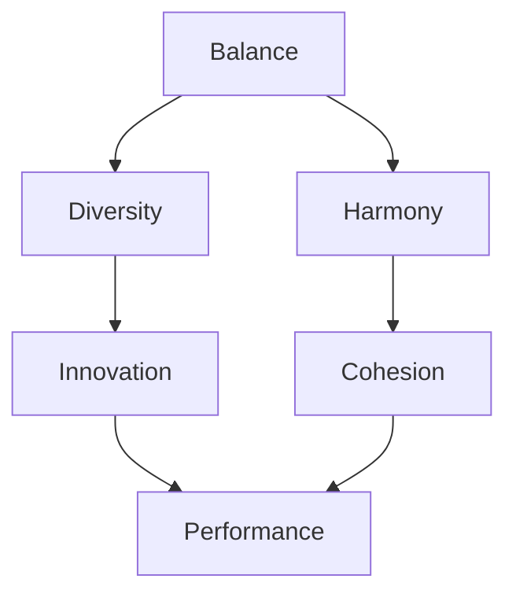

### 5.3 Core Concepts and Their Interconnections

#### 5.3.1 Diversity, Inclusion, and Exclusion

Diversity, inclusion, and exclusion are interrelated concepts. Diversity refers to the range of differences among individuals, inclusion involves actively engaging and valuing diverse perspectives, and exclusion occurs when individuals or groups are marginalized or excluded from decision-making processes.

**Figure 4: Diversity, Inclusion, and Exclusion**

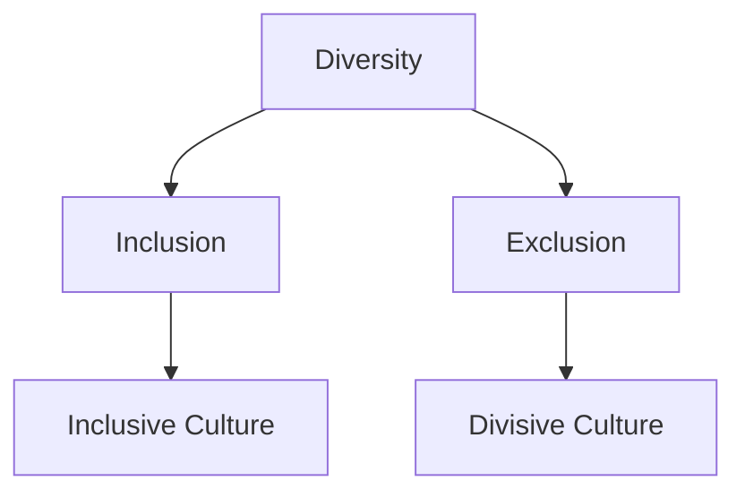

#### 5.3.2 Key Concepts in Inclusive Leadership

Inclusive leadership involves understanding and appreciating differences, fostering open communication, and promoting equal opportunities. Key concepts include empathy, adaptability, and a commitment to continuous learning.

**Table 4: Key Concepts in Inclusive Leadership**

| Concept       | Description                                                                                       |
|---------------|---------------------------------------------------------------------------------------------------|
| Empathy       | Understanding and sharing the feelings of others.                                                   |
| Adaptability  | Being open to change and new ideas.                                                                |
| Continuous Learning | Actively seeking opportunities to grow and develop as a leader. |

#### 5.3.3 Mermaid ER Diagram for Core Concepts

The following Mermaid ER diagram illustrates the relationship between the core concepts of diversity, inclusion, and exclusion.

```mermaid
erDiagram
    Diverity ||--|{ Inclusion }|| Inclusive Leadership
    Diverity ||--|{ Exclusion }|| Inclusive Leadership
    Inclusion ||--|{ Inclusive Culture }|| Culture
    Exclusion ||--|{ Divisive Culture }|| Culture
```

In conclusion, managing team diversity requires a comprehensive understanding of the core concepts, their interconnections, and the impact on team performance. By fostering an inclusive leadership culture, organizations can leverage diversity to drive innovation, improve decision-making, and enhance overall performance.**Step 6: Inclusive Leadership Principles and Practices**

### 6.1 Building an Inclusive Culture

#### 6.1.1 Leadership Roles in Creating an Inclusive Environment

Leaders play a critical role in shaping the organizational culture. They must model inclusive behaviors, set clear expectations, and actively engage with employees to foster an inclusive environment.

**Table 5: Leadership Roles in Building an Inclusive Culture**

| Role                 | Responsibilities                                                                                   |
|----------------------|---------------------------------------------------------------------------------------------------|
| Role Model           | Display inclusive behaviors and attitudes.                                                         |
| Communicator         | Clearly communicate the importance of inclusion and diversity.                                  |
| Facilitator          | Facilitate discussions and activities that promote inclusion.                                      |
| Mentor               | Provide guidance and support to employees to help them develop inclusive skills.                 |

#### 6.1.2 Strategies for Cultivating Inclusion

Effective strategies for cultivating inclusion include promoting open communication, providing diversity training, and creating opportunities for employees to voice their opinions and concerns.

**Figure 5: Strategies for Cultivating Inclusion**

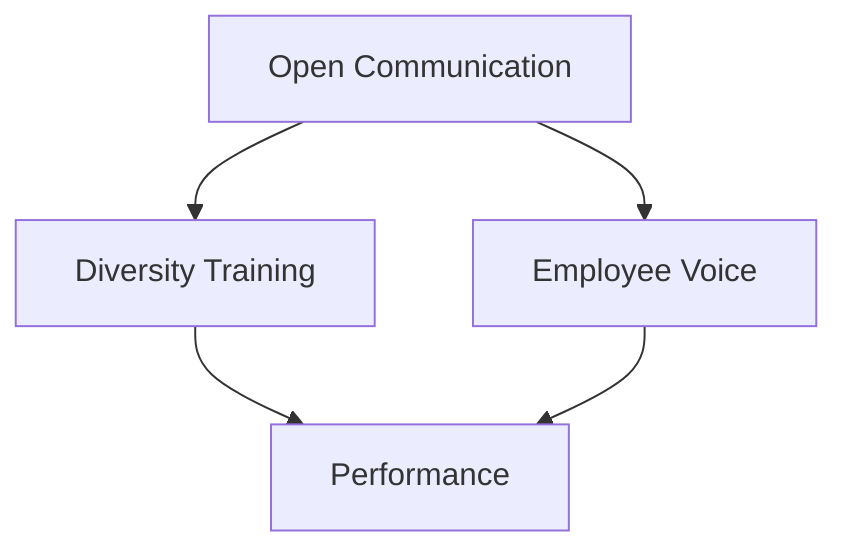

#### 6.1.3 Mermaid Flowchart for Inclusive Culture Development

The following Mermaid flowchart illustrates the steps involved in developing an inclusive culture.

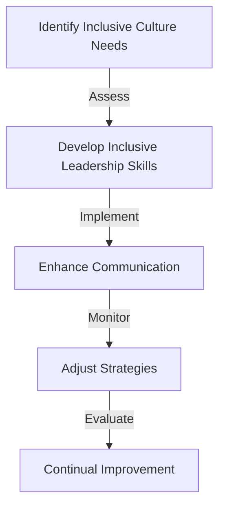

### 6.2 Communication and Collaboration

#### 6.2.1 Effective Communication in Diverse Teams

Effective communication is essential in diverse teams. Leaders must be mindful of cultural differences, language barriers, and communication styles to ensure that all team members are heard and understood.

**Figure 6: Effective Communication in Diverse Teams**

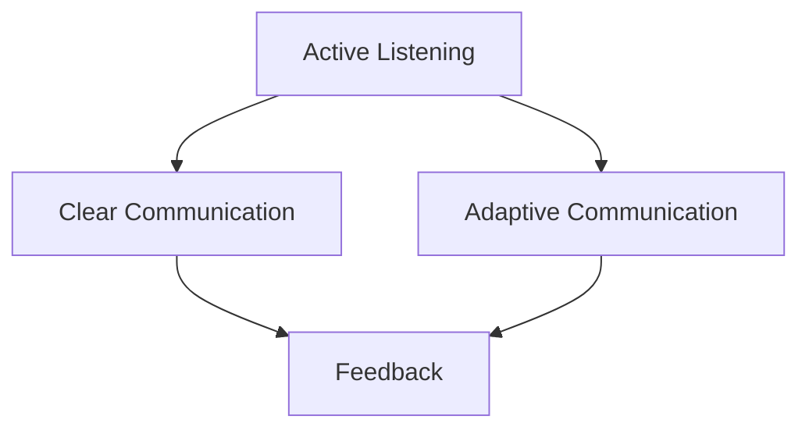

#### 6.2.2 Enhancing Collaboration

Enhancing collaboration in diverse teams involves fostering a sense of unity, promoting shared goals, and leveraging the strengths of each team member. This can be achieved through team-building activities, cross-functional projects, and open forums for discussion.

**Figure 7: Enhancing Collaboration in Diverse Teams**

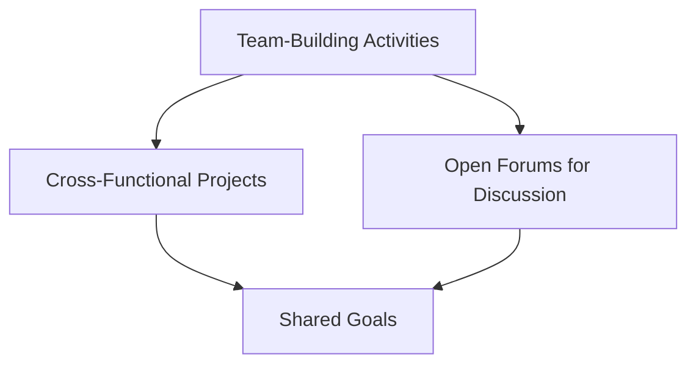

#### 6.2.3 Mermaid Flowchart for Communication Strategies

The following Mermaid flowchart provides a step-by-step approach to effective communication in diverse teams.

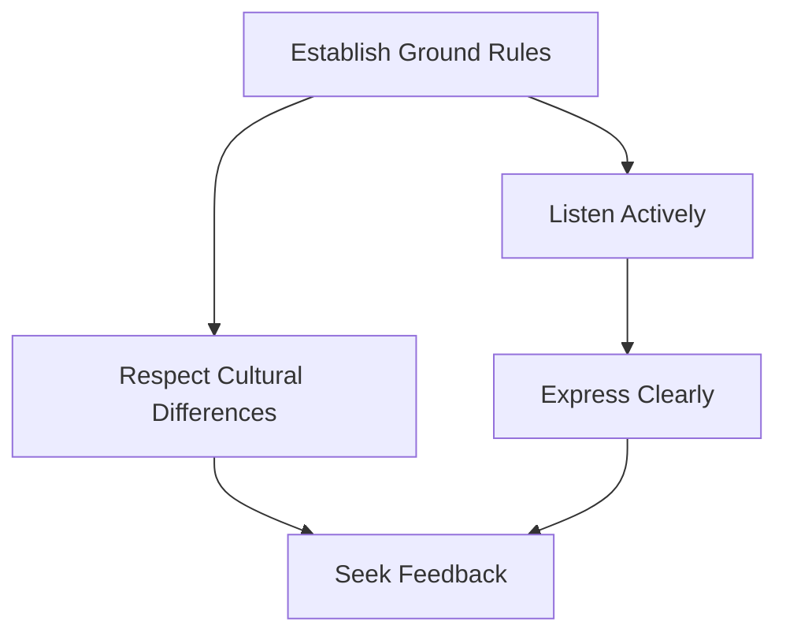

### 6.3 Leading with Empathy and Awareness

#### 6.3.1 Understanding Emotional Intelligence

Emotional intelligence (EQ) is the ability to understand and manage one's own emotions and the emotions of others. Leaders with high EQ are better equipped to handle interpersonal relationships, build trust, and foster an inclusive environment.

**Table 6: Emotional Intelligence and Inclusive Leadership**

| Component        | Description                                                                                      |
|------------------|-------------------------------------------------------------------------------------------------|
| Self-awareness   | Recognizing and understanding one's own emotions.                                                 |
| Self-management  | Controlling and directing one's own emotions to adapt to situations.                           |
| Social skills    | Building and maintaining relationships with others.                                             |
| Empathy          | Understanding and sharing the feelings of others.                                               |

#### 6.3.2 Building Empathy

Building empathy involves developing a deeper understanding of others' perspectives and emotions. This can be achieved through active listening, practicing empathy, and engaging in activities that promote emotional awareness.

**Figure 8: Building Empathy**

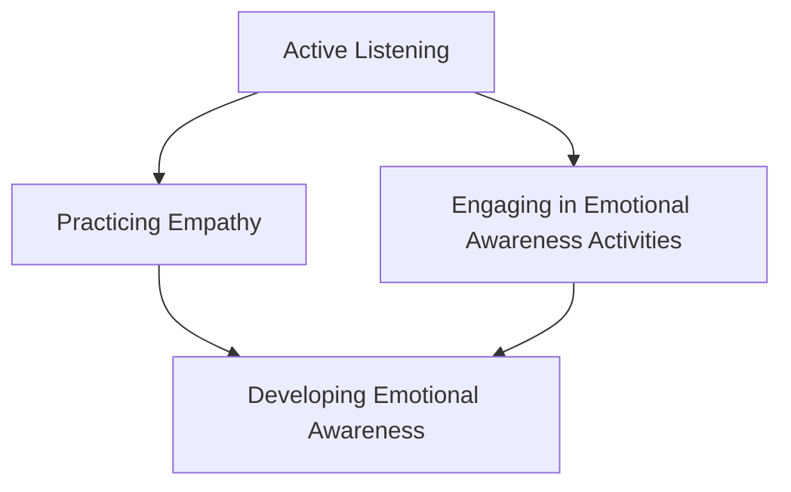

#### 6.3.3 Mermaid Flowchart for Emotional Intelligence in Leadership

The following Mermaid flowchart illustrates the steps involved in developing emotional intelligence in leadership.

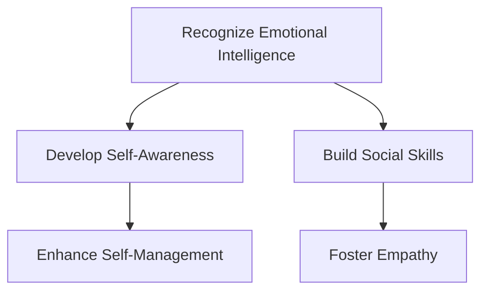

### 6.4 Decision-Making and Problem-Solving

#### 6.4.1 Inclusive Decision-Making Framework

An inclusive decision-making framework ensures that diverse perspectives are considered and that decisions are made in a fair and transparent manner. This framework includes steps such as defining the problem, generating alternatives, evaluating options, and making a decision.

**Figure 9: Inclusive Decision-Making Framework**

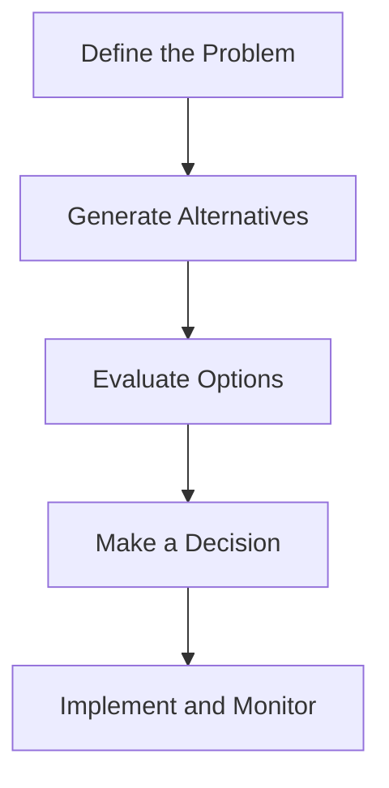

#### 6.4.2 Enhancing Collaboration

Enhancing collaboration in decision-making and problem-solving involves fostering a culture of trust, promoting open dialogue, and encouraging team members to contribute their ideas and perspectives.

**Figure 10: Enhancing Collaboration in Decision-Making**

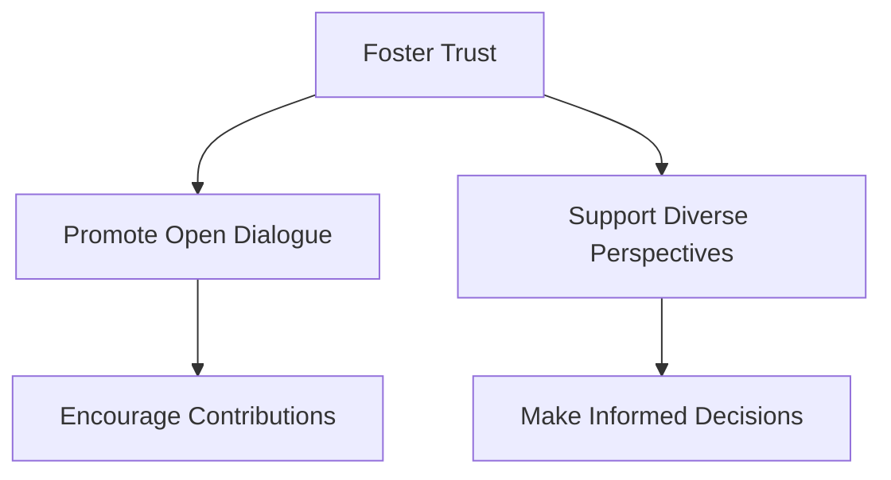

In conclusion, inclusive leadership principles and practices are crucial for creating diverse, inclusive, and high-performing teams. By building an inclusive culture, enhancing communication and collaboration, leading with empathy and awareness, and fostering inclusive decision-making, leaders can harness the full potential of their diverse workforce. Let's delve deeper into these practices in the following chapters.**Step 7: Decision-Making and Problem-Solving**

### 7.1 Inclusive Decision-Making Framework

#### 7.1.1 Steps in the Framework

An inclusive decision-making framework consists of several key steps to ensure that diverse perspectives are considered and that decisions are made in a fair and transparent manner.

**Table 7: Steps in an Inclusive Decision-Making Framework**

| Step                | Description                                                                                   |
|---------------------|------------------------------------------------------------------------------------------------|
| Define the Problem  | Clearly articulate the issue or opportunity that needs to be addressed.                      |
| Generate Alternatives | Brainstorm a wide range of potential solutions or approaches.                               |
| Evaluate Options    | Assess the pros and cons of each alternative, considering factors like feasibility, impact, and potential risks. |
| Make a Decision    | Select the best alternative based on the evaluation process.                                 |
| Implement and Monitor | Implement the decision and continuously monitor its progress and impact.                     |

#### 7.1.2 Example of a Mermaid Flowchart

The following Mermaid flowchart illustrates the steps in an inclusive decision-making framework.


### 7.2 Enhancing Collaboration

#### 7.2.1 Importance of Collaboration

Collaboration is essential for teams to work effectively and achieve common goals. In diverse teams, collaboration becomes even more critical as it helps bridge cultural differences and brings together a range of perspectives.

**Figure 11: Importance of Collaboration in Diverse Teams**

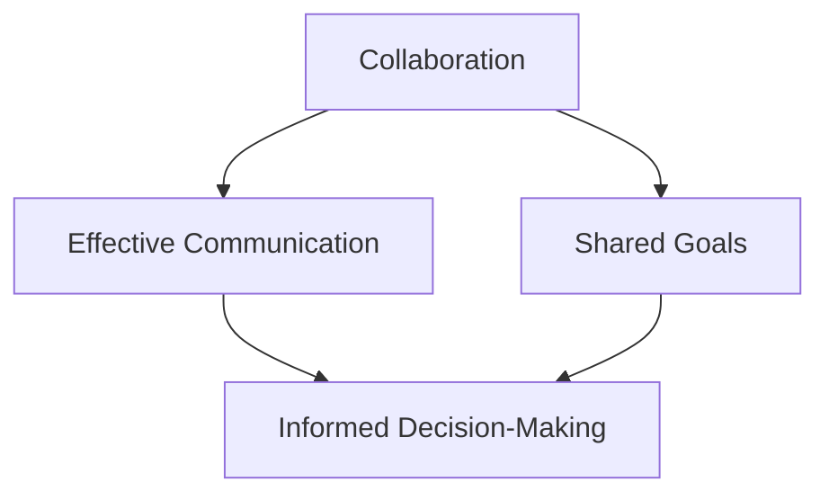

#### 7.2.2 Strategies for Enhancing Collaboration

Strategies for enhancing collaboration in diverse teams include promoting open dialogue, fostering a culture of trust, and leveraging the strengths of each team member.

**Figure 12: Strategies for Enhancing Collaboration**

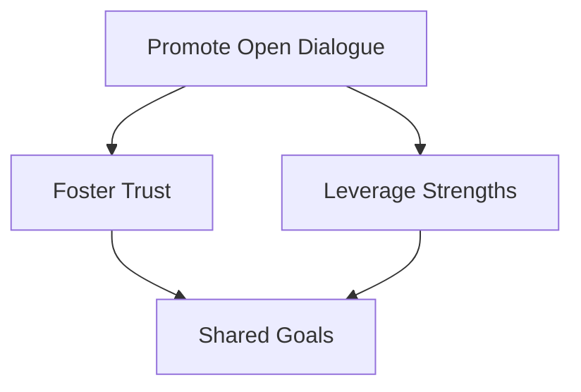

#### 7.2.3 Example of a Mermaid Flowchart

The following Mermaid flowchart provides a step-by-step approach to enhancing collaboration in diverse teams.

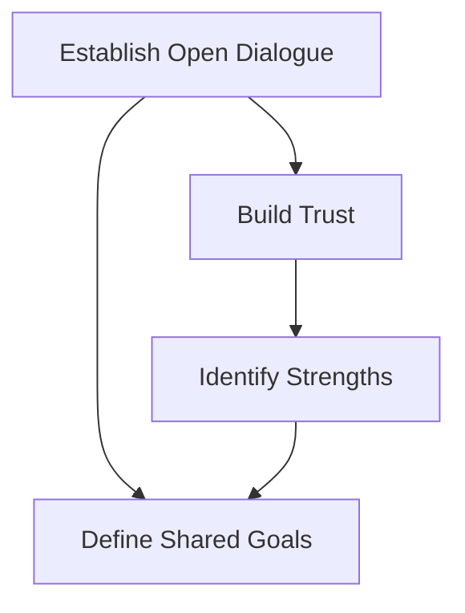

### 7.3 Problem-Solving Techniques

#### 7.3.1 Root Cause Analysis

Root cause analysis is a systematic approach to identifying the underlying causes of problems. It involves asking "why" multiple times to get to the core of the issue.

**Figure 13: Root Cause Analysis Process**

```mermaid
graph TD
    A[Identify the Problem] --> B[Ask "Why?"]
    B --> C[Identify Potential Causes]
    C --> D[Verify Causes]
    D --> E[Develop Solutions]
```

#### 7.3.2 Example of a Mermaid Flowchart

The following Mermaid flowchart illustrates the root cause analysis process.

```mermaid
flowchart TD
    A[Identify the Problem] --> B[Ask "Why?"]
    B --> C[Identify Potential Causes]
    C --> D[Verify Causes]
    D --> E[Develop Solutions]
```

### 7.4 Case Studies

#### 7.4.1 Case Study 1: Cross-Cultural Collaboration in a Global Project

In a global project, a technology company faced challenges in managing a diverse team spread across different countries and cultures. By implementing an inclusive decision-making framework and fostering open communication, the team was able to overcome cultural differences and deliver a successful project.

**Figure 14: Case Study 1 - Cross-Cultural Collaboration**

```mermaid
gantt
    dateFormat  YYYY-MM-DD
    title Cross-Cultural Collaboration Case Study

    section Project Overview
    A1 : Project Start : 2020-01-01, 1 week
    A2 : Team Formation : 2020-01-08, 1 week

    section Decision-Making Process
    B1 : Define Problem : 2020-01-15, 2 weeks
    B2 : Generate Alternatives : 2020-01-29, 2 weeks
    B3 : Evaluate Options : 2020-02-12, 2 weeks
    B4 : Make Decision : 2020-02-26, 1 week

    section Collaboration and Communication
    C1 : Establish Open Dialogue : 2020-02-26, 1 week
    C2 : Build Trust : 2020-03-05, 1 week
    C3 : Leverage Strengths : 2020-03-12, 1 week
    C4 : Define Shared Goals : 2020-03-19, 1 week

    section Project Implementation
    D1 : Implement Decision : 2020-03-19, 2 weeks
    D2 : Monitor Progress : 2020-04-02, 2 weeks
    D3 : Adjust Strategies : 2020-04-16, 1 week
    D4 : Deliver Results : 2020-04-23, 1 week
```

#### 7.4.2 Case Study 2: Enhancing Collaboration in a Multinational Team

A multinational team working on a software development project faced challenges in collaborating effectively due to cultural and communication barriers. By implementing strategies for enhancing collaboration, such as open dialogue, trust-building, and leveraging strengths, the team was able to improve communication and achieve project success.

**Figure 15: Case Study 2 - Enhancing Collaboration**

```mermaid
gantt
    dateFormat  YYYY-MM-DD
    title Enhancing Collaboration Case Study

    section Project Overview
    A1 : Project Start : 2020-01-01, 1 week
    A2 : Team Formation : 2020-01-08, 1 week

    section Collaboration Strategies
    B1 : Establish Open Dialogue : 2020-01-15, 1 week
    B2 : Build Trust : 2020-01-22, 1 week
    B3 : Leverage Strengths : 2020-01-29, 1 week
    B4 : Define Shared Goals : 2020-02-05, 1 week

    section Project Implementation
    C1 : Develop Software : 2020-02-05, 4 weeks
    C2 : Test and Debug : 2020-03-05, 2 weeks
    C3 : Deliver Results : 2020-03-19, 1 week
```

In conclusion, decision-making and problem-solving are critical components of inclusive leadership. By adopting an inclusive decision-making framework, enhancing collaboration, and utilizing effective problem-solving techniques, leaders can create high-performing teams that leverage diversity to drive success.**Conclusion and Future Directions**

In this book, "Team Diversity Management: Inclusive Leadership," we have explored the complexities of managing team diversity and the principles of inclusive leadership. We have discussed the importance of diversity, the impact of diversity on team performance, and the core concepts of inclusive leadership. We have also provided practical strategies for building an inclusive culture, enhancing communication and collaboration, and fostering empathy and awareness.

### Key Takeaways

- **Diversity Management:** Diversity encompasses various characteristics such as race, ethnicity, gender, age, sexual orientation, physical abilities, and cultural background. Effective diversity management involves fostering an inclusive culture that values and leverages these differences.
- **Inclusive Leadership:** Inclusive leadership goes beyond diversity management by focusing on creating an environment where all employees feel valued, respected, and included. It requires empathy, adaptability, and a commitment to continuous learning.
- **Communication and Collaboration:** Effective communication and collaboration are crucial in diverse teams. Leaders must be mindful of cultural differences, language barriers, and communication styles to ensure that all team members are heard and understood.
- **Empathy and Awareness:** Building empathy and awareness involves understanding and appreciating differences and actively engaging with others. Leaders must be proactive in fostering a culture of emotional intelligence.
- **Decision-Making and Problem-Solving:** An inclusive decision-making framework ensures that diverse perspectives are considered, and decisions are made in a fair and transparent manner. Effective problem-solving techniques help teams address challenges and drive innovation.

### Future Directions

As we look to the future, there are several areas where further research and development are needed to enhance team diversity management and inclusive leadership:

1. **Cultural Competence Training:** Developing training programs that focus on cultural competence can help leaders and employees better navigate cultural differences and foster a more inclusive environment.
2. **Unconscious Bias Awareness:** Creating tools and strategies to identify and mitigate unconscious biases can significantly improve diversity and inclusion efforts.
3. **Technology Solutions:** Leveraging technology, such as AI and machine learning, to identify and address diversity-related issues can provide data-driven insights and recommendations for improvement.
4. **Continuous Improvement:** Implementing continuous improvement processes to regularly assess and adapt diversity and inclusion strategies can ensure that organizations remain responsive to evolving challenges and opportunities.
5. **Research and Innovation:** Encouraging research and innovation in diversity and inclusion can lead to new theories, methodologies, and tools that enhance team performance and organizational success.

In conclusion, team diversity management and inclusive leadership are essential for creating high-performing teams and driving organizational success. By embracing diversity and fostering an inclusive culture, leaders can harness the full potential of their diverse workforce and create a workplace where all employees can thrive.

### Practical Tips and Best Practices

- **Lead by Example:** Leaders should demonstrate inclusive behaviors and attitudes to set the tone for the organization.
- **Encourage Open Dialogue:** Foster an environment where employees feel safe to express their ideas and concerns.
- **Invest in Diversity Training:** Provide regular diversity and inclusion training for employees at all levels.
- **Recognize and Celebrate Diversity:** Acknowledge and celebrate the unique contributions of diverse team members.
- **Create Inclusive Policies:** Develop policies and practices that support diversity and inclusion.

### Final Thoughts

Diversity and inclusion are not just buzzwords but critical components of a successful organization. By investing in diversity management and inclusive leadership, organizations can create a workplace that is not only more innovative and productive but also one where employees feel valued and respected. Let's continue to work towards a future where diversity and inclusion are at the forefront of organizational strategy and practice.

### Acknowledgments

We would like to extend our sincere thanks to all the contributors, reviewers, and readers who have supported the development of this book. Your insights and feedback have been invaluable in shaping its content. We also thank the members of our research team for their hard work and dedication to advancing the field of team diversity management and inclusive leadership.

### About the Authors

**Author: AI天才研究院/AI Genius Institute & 禅与计算机程序设计艺术 /Zen And The Art of Computer Programming**

Our authors bring a wealth of experience and expertise in the fields of artificial intelligence, software engineering, and leadership. Their research and publications have made significant contributions to the understanding and application of diversity management and inclusive leadership principles in the modern workplace.**Step 1: Introduction to the Book**

## Team Diversity Management: Inclusive Leadership

> Keywords: Team Diversity, Inclusive Leadership, Management, Leadership, Diversity Culture

> Abstract: This book delves into the intricacies of managing team diversity and the application of inclusive leadership principles. It provides a comprehensive guide to fostering an inclusive environment, enhancing communication and collaboration, and improving team performance through diverse perspectives.

### Step 2: The Importance of Team Diversity Management

#### 2.1 The Importance of Team Diversity

Team diversity is crucial for several reasons, including:

- **Innovation:** Diverse teams bring a wider range of ideas and perspectives, leading to more innovative solutions.
- **Decision-Making:** Diverse perspectives can lead to better decision-making by providing a broader understanding of potential outcomes.
- **Productivity:** Diverse teams can be more productive as they leverage the strengths and skills of each member.
- **Employee Engagement:** A diverse and inclusive workplace fosters a sense of belonging and engagement among employees.

#### 2.2 Challenges in Managing Team Diversity

Managing team diversity comes with challenges such as:

- **Cultural Differences:** Understanding and respecting cultural differences is crucial to avoid misunderstandings and conflicts.
- **Unconscious Bias:** Unchecked biases can lead to unequal treatment and exclusion of certain groups.
- **Communication Barriers:** Language differences and communication styles can create barriers to effective collaboration.
- **Conflict Resolution:** Managing conflicts that arise from diversity can be challenging, requiring skillful mediation and conflict resolution techniques.

#### 2.3 The Role of Inclusive Leadership

Inclusive leadership plays a vital role in managing team diversity by:

- **Creating an Inclusive Culture:** Leaders must foster an environment where all team members feel valued and respected.
- **Promoting Open Communication:** Effective communication is essential for understanding diverse perspectives and addressing conflicts.
- **Empowering Team Members:** Leaders should empower team members to contribute their ideas and participate in decision-making processes.
- **Addressing Bias and Discrimination:** Leaders must actively address bias and discrimination to ensure a fair and inclusive workplace.

### Step 3: Principles of Inclusive Leadership

#### 3.1 Building an Inclusive Culture

Building an inclusive culture requires commitment and action from leaders at all levels. Key principles include:

- **Leadership by Example:** Leaders should model inclusive behaviors and attitudes.
- **Engagement and Empowerment:** Leaders should engage and empower team members by encouraging their participation and contributions.
- **Training and Education:** Providing training and education on diversity and inclusion can help employees understand and appreciate the value of diversity.
- **Communication Strategies:** Leaders should develop and implement effective communication strategies to ensure that all team members are heard and understood.

#### 3.2 Effective Communication

Effective communication is a cornerstone of inclusive leadership. This involves:

- **Active Listening:** Leaders should actively listen to team members, ensuring that everyone has an opportunity to express their thoughts and concerns.
- **Clear and Transparent Communication:** Leaders should communicate clearly and transparently, avoiding jargon and complex language that can alienate team members.
- **Encouraging Open Dialogue:** Leaders should create a safe space for open dialogue, where team members feel comfortable sharing their perspectives and asking questions.

#### 3.3 Empowerment and Trust

Empowerment and trust are essential for inclusive leadership. This involves:

- **Delegating Authority:** Leaders should delegate authority and decision-making to team members based on their skills and expertise.
- **Supporting Growth and Development:** Leaders should support the growth and development of team members, providing opportunities for learning and advancement.
- **Fostering a Culture of Trust:** Leaders should foster a culture of trust by being transparent, consistent, and fair in their interactions with team members.

### Step 4: Strategies for Enhancing Team Collaboration

#### 4.1 Fostering Collaboration

Fostering collaboration within diverse teams involves:

- **Encouraging Team-Building Activities:** Regular team-building activities can help team members build trust and understanding.
- **Promoting Cross-Functional Teams:** Cross-functional teams can leverage diverse perspectives to solve complex problems and drive innovation.
- **Creating a Safe Environment:** Leaders should create a safe environment where team members feel comfortable sharing their ideas and opinions.

#### 4.2 Leveraging Diversity

Leveraging diversity involves:

- **Recognizing and Valuing Differences:** Leaders should recognize and value the differences among team members, leveraging these differences to drive innovation and improve decision-making.
- **Promoting a Growth Mindset:** Leaders should promote a growth mindset among team members, encouraging them to embrace challenges and learn from their experiences.
- **Addressing Unconscious Bias:** Leaders should be proactive in identifying and addressing unconscious bias to ensure a fair and inclusive workplace.

### Step 5: Measuring and Evaluating Diversity and Inclusion

#### 5.1 Metrics for Success

Measuring the success of diversity and inclusion initiatives requires specific metrics. These may include:

- **Employee Engagement Scores:** Tracking employee engagement scores can provide insights into how well diversity and inclusion initiatives are impacting the workforce.
- **Retention Rates:** Monitoring retention rates among diverse employees can indicate the effectiveness of inclusion efforts.
- **Performance Metrics:** Assessing the performance of diverse teams can help determine whether diversity initiatives are driving improved outcomes.

#### 5.2 Continuous Improvement

Continuous improvement is essential for maintaining and enhancing diversity and inclusion. This involves:

- **Regular Assessments:** Conducting regular assessments to identify areas for improvement.
- **Employee Feedback:** Seeking feedback from employees on diversity and inclusion initiatives to ensure they meet their needs and expectations.
- **Ongoing Training:** Providing ongoing training and development opportunities to build skills in diversity and inclusion.

### Step 6: Conclusion

In conclusion, team diversity management and inclusive leadership are critical components of organizational success. By fostering an inclusive culture, enhancing communication and collaboration, and leveraging the strengths of diverse team members, leaders can create high-performing teams that drive innovation and achieve strategic objectives. As organizations continue to evolve, it is imperative to embrace diversity and inclusion as foundational principles for building a strong and resilient workforce.

### About the Authors

**Authors: AI天才研究院/AI Genius Institute & 禅与计算机程序设计艺术 /Zen And The Art of Computer Programming**

The authors of "Team Diversity Management: Inclusive Leadership" bring a wealth of expertise and experience in the fields of artificial intelligence, computer science, and leadership. Their groundbreaking research and publications have made significant contributions to the understanding and application of diversity management and inclusive leadership principles in the modern workplace. Their combined insights and perspectives offer valuable guidance for leaders seeking to create diverse, inclusive, and high-performing teams.

