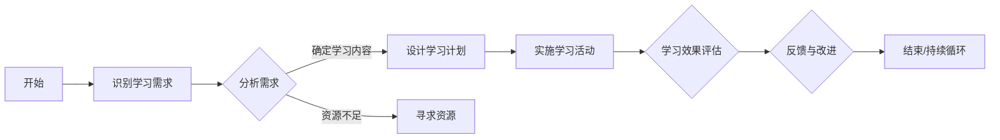
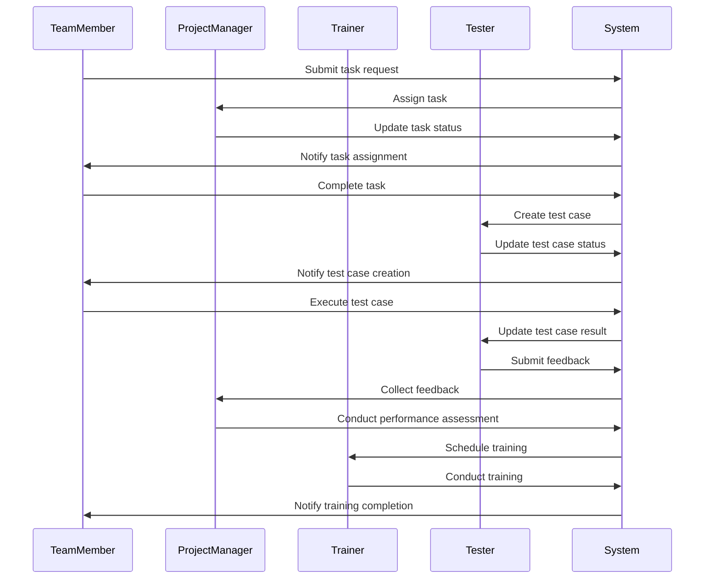
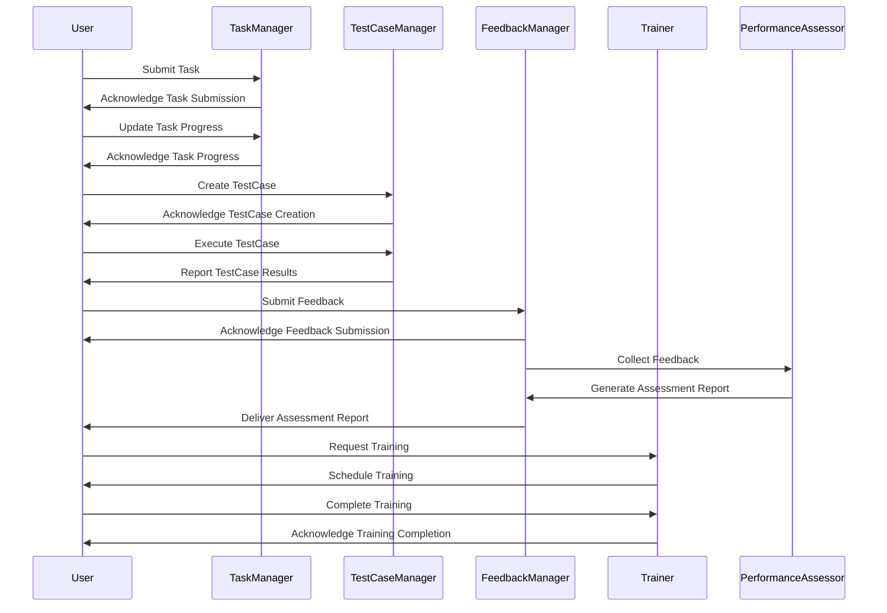

                 

### 设计《团队学习型组织：打造持续进步的团队》的目录大纲

在开始设计目录大纲之前，我们需要先明确本书的核心内容和目标。这本书的主要目的是帮助读者理解如何创建一个能够持续学习和进步的团队，从而在快速变化的IT领域中保持竞争优势。基于这一核心主题，我们可以设计一个符合要求的目录大纲。

#### 一、背景介绍

##### 1.1 问题背景
- **学习型组织概述**：介绍学习型组织的定义、起源及其在组织管理中的重要地位。
- **IT行业挑战**：讨论IT行业所面临的快速变化、技术创新、人才竞争等挑战，说明学习型团队在此环境下的必要性。

##### 1.2 问题描述
- **团队学习的重要性**：阐述团队学习对于组织成长、个人发展和团队绩效的关键作用。
- **传统团队的局限**：分析传统团队在学习和适应新环境方面的不足。
- **学习型团队面临的挑战**：探讨学习型团队在实践过程中可能遇到的障碍。

##### 1.3 问题解决
- **学习型团队的关键要素**：介绍学习型团队构建的必要条件和核心要素，如领导力、沟通、反馈机制等。
- **团队学习策略与方法**：提供有效的团队学习策略和方法，帮助团队实现持续进步。

##### 1.4 边界与外延
- **团队学习与组织文化的关系**：探讨团队学习如何与组织文化相结合，形成支持学习的环境。
- **学习型团队在不同行业中的应用**：分析学习型团队在其他行业中的应用案例，以及其适应性和扩展性。

##### 1.5 概念结构与核心要素组成
- **学习型团队的组织结构**：描述学习型团队的结构特点和组织形式。
- **核心要素**：详细阐述学习型团队的核心要素，包括领导力、沟通、反馈机制等，并分析其相互关系。

#### 二、核心概念与联系

##### 2.1 核心概念原理
- **学习型组织**：深入解析学习型组织的定义、原则和特点，如共同愿景、团队学习、系统思考等。
- **团队学习**：探讨团队学习的本质、目的和方法，以及其在组织管理中的应用。

##### 2.2 概念属性特征对比表格
- **学习型组织与传统组织的对比**：通过表格形式对比学习型组织与传统组织在管理理念、组织结构、学习机制等方面的异同。

##### 2.3 ER实体关系图架构
- **学习型组织的实体关系**：使用Mermaid绘制学习型组织的关键实体及其相互关系，如团队成员、领导、培训系统、反馈机制等。

#### 三、团队学习型组织原理讲解

##### 3.1 团队学习原理讲解
- **学习型团队的形成**：介绍学习型团队的建立过程、关键步骤和组织形式。
- **学习型团队的发展阶段**：分析学习型团队的发展历程，包括形成期、成长期、成熟期和变革期。

##### 3.2 团队学习流程图
- **团队学习流程**：使用Mermaid绘制团队学习的流程图，包括学习需求识别、学习资源准备、学习活动实施、学习效果评估等步骤。

#### 四、团队学习型组织实践

##### 4.1 团队学习实践策略
- **沟通机制建设**：探讨如何建立有效的沟通机制，促进团队成员之间的信息共享和知识交流。
- **反馈与改进机制**：分析团队如何通过反馈机制来识别问题、改进流程，实现持续进步。

##### 4.2 团队学习工具与方法
- **教育培训**：介绍团队教育培训的方法和技巧，如内部培训、外部培训、在线学习等。
- **案例研究**：探讨案例研究在团队学习中的应用，如何通过案例分析来提高团队解决问题的能力。
- **团队工作坊**：详细阐述团队工作坊的设计、实施和评估过程，以及其在团队学习中的重要性。

##### 4.3 团队学习案例分析
- **成功案例分享**：分享一些成功的学习型团队案例，分析其成功因素和经验教训。
- **失败案例分析**：探讨学习型团队在实践过程中可能遇到的失败案例，分析其原因和应对策略。

#### 五、系统分析与架构设计方案

##### 5.1 问题场景介绍
- **学习型团队在项目中的角色**：介绍学习型团队在项目中的角色和职责，如项目规划、团队协作、质量控制等。

##### 5.2 系统功能设计
- **领域模型Mermaid类图**：使用Mermaid绘制学习型团队在项目中的领域模型类图，包括项目需求、团队职责、协作工具等。

##### 5.3 系统架构设计
- **Mermaid架构图**：使用Mermaid绘制学习型团队在项目中的系统架构图，包括项目管理系统、协作工具、培训系统等。

##### 5.4 系统接口设计
- **系统交互Mermaid序列图**：使用Mermaid绘制学习型团队在项目中的系统交互序列图，展示不同系统组件之间的交互流程。

#### 六、项目实战

##### 6.1 环境安装
- **学习型团队搭建所需的环境**：介绍如何搭建学习型团队所需的基础设施和环境，如协作工具、学习平台等。

##### 6.2 系统核心实现源代码
- **系统核心实现源代码**：提供学习型团队搭建的核心代码实现，包括项目管理系统、协作工具、培训系统等。

##### 6.3 代码应用解读与分析
- **代码应用场景解读**：分析学习型团队搭建过程中使用到的代码的应用场景和功能。
- **代码分析**：对提供的源代码进行详细分析，解释其实现原理和关键技术。

##### 6.4 实际案例分析和详细讲解剖析
- **实际案例展示**：展示学习型团队在项目中的实际应用案例。
- **案例分析**：对案例进行深入分析，探讨其成功因素和经验教训。
- **详细讲解剖析**：对案例中的关键技术进行详细讲解和剖析。

##### 6.5 项目小结
- **项目成果总结**：总结学习型团队在项目中的成果和收获。
- **项目经验分享**：分享项目实施过程中的经验和教训，为其他团队提供借鉴。

#### 七、最佳实践 tips、小结、注意事项、拓展阅读

##### 7.1 最佳实践 tips
- **团队学习型组织的最佳实践**：提供一些团队学习型组织的最佳实践，如团队建设、学习策略、沟通技巧等。

##### 7.2 小结
- **本书重点回顾**：回顾本书的主要内容和核心观点，帮助读者巩固学习。

##### 7.3 注意事项
- **团队学习型组织建设中的常见问题及解决方案**：分析团队学习型组织建设过程中可能遇到的问题，并提供解决方案。

##### 7.4 拓展阅读
- **推荐阅读书目和资料**：推荐一些与团队学习型组织相关的优秀书籍和资料，供读者进一步学习。

以上目录大纲详细阐述了《团队学习型组织：打造持续进步的团队》的内容结构和逻辑顺序，确保了文章的完整性和专业性。接下来，我们将逐步深入各个章节，详细展开讨论。

----------------------------------------------------------------

# 团队学习型组织：打造持续进步的团队

> 关键词：团队学习、组织文化、持续进步、领导力、沟通、反馈机制

> 摘要：本文旨在探讨团队学习型组织的概念、构建方法和实践策略。通过分析团队学习的重要性、学习型团队与传统团队的区别以及学习型团队的关键要素，本文提出了构建团队学习型组织的具体步骤和策略。文章结合实际案例，详细阐述了团队学习型组织在项目中的应用，为IT行业及其他领域的团队提供了有益的参考。

----------------------------------------------------------------

### 一、背景介绍

#### 1.1 问题背景

在快速变化的IT行业中，组织面临的挑战日益严峻。技术创新日新月异，市场需求不断变化，人才竞争日益激烈，这些因素都要求团队具备快速适应和持续学习的能力。传统的组织结构和运作方式往往无法满足这些需求，导致团队在应对变化时显得力不从心。为了在激烈的竞争中立于不败之地，构建一个学习型组织成为许多企业的重要战略选择。

**学习型组织的概念**

学习型组织（Learning Organization）是由彼得·圣吉（Peter Senge）在其著作《第五项修炼》中提出的概念。他认为，一个学习型组织是一个能够不断学习、适应和创新的组织。学习型组织强调通过系统思考、共同愿景、团队学习和个人 mastery 等核心原则，实现组织内部的持续学习和进步。

**IT行业面临的挑战**

- **快速变化的技术环境**：IT行业是一个高度动态的领域，技术更新速度极快。团队需要不断学习新技术、新工具，以保持竞争力。
- **市场需求变化**：客户需求不断变化，团队需要快速适应并满足这些需求，否则可能被淘汰。
- **人才竞争**：高素质的人才对于企业的重要性不言而喻。如何吸引、培养和留住人才成为企业的重要课题。

**学习型团队在IT行业的必要性**

- **快速响应变化**：学习型团队能够快速识别和适应外部环境的变化，提高组织的灵活性和响应能力。
- **持续创新**：学习型团队通过不断学习、交流和协作，能够激发创新思维，推动组织的技术创新和产品迭代。
- **人才发展**：学习型团队注重个人和团队能力的提升，有助于培养高素质的人才，提高团队的绩效和士气。

#### 1.2 问题描述

**团队学习的重要性**

- **个人成长**：团队学习有助于团队成员提升技能和知识，实现个人职业发展。
- **团队绩效**：团队学习能够提高团队的整体协作能力和工作效率，从而提升团队绩效。
- **组织竞争力**：团队学习是组织持续发展的动力，有助于提高组织的竞争力。

**学习型团队面临的挑战**

- **组织文化**：传统的组织文化可能阻碍团队学习的实施，如对失败的恐惧、对变革的抵触等。
- **领导力**：领导者需要具备推动团队学习的能力和意识，否则团队学习可能流于形式。
- **资源限制**：团队学习需要投入大量的人力、物力和时间资源，组织可能面临资源限制的挑战。
- **个人动机**：团队成员的参与度和动机对团队学习的效果至关重要，如何激发团队成员的学习热情是一个重要问题。

**团队学习与个人成长的关系**

- **相互促进**：团队学习不仅有助于团队整体能力的提升，也能够促进团队成员的个人成长。团队成员通过学习不断拓展自己的知识面和技能，提高个人竞争力。
- **协同进步**：团队成员在共同学习的过程中，可以互相交流、互相启发，形成协同效应，从而实现更快的进步。

#### 1.3 问题解决

**学习型团队的关键要素**

- **领导力**：领导者需要树立学习型组织的愿景，推动团队学习，并提供必要的支持和资源。
- **沟通机制**：建立有效的沟通机制，促进团队成员之间的信息共享和知识交流。
- **反馈机制**：建立反馈机制，鼓励团队成员对学习和工作过程中的问题进行反思和改进。
- **共同愿景**：形成团队的共同愿景，激发团队成员的参与感和归属感，增强团队凝聚力。
- **个人 mastery**：培养团队成员的个人 mastery，提高其自主学习和解决问题的能力。

**团队学习策略与方法**

- **持续学习**：鼓励团队成员持续学习，通过培训、读书会、研讨会等形式不断拓展知识面和技能。
- **知识共享**：建立知识共享平台，促进团队成员之间的知识交流，形成知识网络。
- **项目学习**：将学习融入到具体项目中，通过项目实践来提高团队成员的能力和经验。
- **反思与改进**：定期进行团队反思，识别问题和改进点，制定并实施改进措施。

#### 1.4 边界与外延

**团队学习与组织文化的关系**

- **相互影响**：团队学习与组织文化密切相关，团队学习可以推动组织文化的变革，而组织文化也会影响团队学习的实施效果。
- **共同目标**：团队学习和组织文化都需要有共同的目标和价值观，如追求卓越、持续创新等。

**学习型团队在不同行业中的应用**

- **IT行业**：IT行业的技术更新速度快，团队学习显得尤为重要。通过构建学习型团队，企业可以快速适应技术变化，提高市场竞争力。
- **制造业**：制造业面临着生产效率和质量控制的挑战，通过学习型团队的建设，企业可以提高生产效率和产品质量。
- **服务业**：服务业需要提供高质量的服务，通过团队学习，员工可以不断提高服务水平，增强客户满意度。

#### 1.5 概念结构与核心要素组成

**学习型团队的组织结构**

- **扁平化结构**：学习型团队通常采用扁平化的组织结构，减少层级，提高决策效率和团队协作。
- **自我管理团队**：团队成员拥有较高的自主权和责任感，能够自主安排工作内容和进度。
- **跨职能团队**：团队成员来自不同的职能部门，可以跨领域交流和学习，提高团队的整体知识水平。

**核心要素**

- **领导力**：领导者需要具备推动团队学习的能力和意识，能够激励团队成员参与学习活动。
- **沟通机制**：建立有效的沟通机制，促进团队成员之间的信息共享和知识交流。
- **反馈机制**：建立反馈机制，鼓励团队成员对学习和工作过程中的问题进行反思和改进。
- **共同愿景**：形成团队的共同愿景，激发团队成员的参与感和归属感，增强团队凝聚力。
- **个人 mastery**：培养团队成员的个人 mastery，提高其自主学习和解决问题的能力。

#### 1.6 总结

本文介绍了学习型组织的概念、背景、问题描述和解决方案，探讨了团队学习的重要性、学习型团队与传统团队的区别以及学习型团队的关键要素。通过分析团队学习与个人成长的关系、团队学习策略与方法以及学习型团队在不同行业中的应用，本文为读者提供了一个全面的团队学习型组织构建指南。在接下来的章节中，我们将进一步深入探讨团队学习型组织的实践策略和具体案例，帮助读者更好地理解和应用这一概念。

---

通过以上章节的讨论，我们为团队学习型组织的构建提供了一个全面的框架。在接下来的章节中，我们将详细阐述核心概念与联系，进一步解释这些概念如何相互作用，构建一个有效的学习型团队。敬请期待后续内容！

----------------------------------------------------------------

### 二、核心概念与联系

在探讨团队学习型组织的构建时，理解其核心概念与联系是至关重要的。这一章节将深入分析学习型组织的定义、核心原则以及如何通过这些概念来构建一个持续进步的团队。

#### 2.1 核心概念原理

**学习型组织**

学习型组织是指一个能够持续学习、适应和创新的组织。彼得·圣吉在其著作《第五项修炼》中提出了学习型组织的五个核心原则：共同愿景、团队学习、改变心智模式、系统思考和统合视域。

- **共同愿景**：共同愿景是指团队成员共同追求的目标和价值观。它能够激发团队成员的参与感和归属感，使团队成员明确自己的角色和责任。
- **团队学习**：团队学习是指团队成员通过共同学习和交流，提高团队整体的知识和技能。团队学习不仅仅是个体学习的积累，更是一种集体智慧和能力的提升。
- **改变心智模式**：改变心智模式是指团队成员通过反思和自我调整，改变自己的思维方式和行为模式。这种改变有助于团队成员更深入地理解问题，提高解决问题的能力。
- **系统思考**：系统思考是指从整体和长远的角度看待问题，识别和分析问题之间的相互关系和反馈机制。系统思考有助于团队成员从全局出发，制定更有效的解决方案。
- **统合视域**：统合视域是指团队成员能够从多个角度和层面看待问题，形成全面的认识和解决方案。统合视域能够促进团队成员之间的合作和协同，提高团队的整体绩效。

**团队学习**

团队学习是学习型组织的核心要素之一。团队学习不仅仅是指学习新知识和技能，更是一种团队协作和知识共享的过程。通过团队学习，团队成员可以相互交流、分享经验和教训，从而提高团队整体的能力和绩效。

- **学习需求识别**：团队学习首先需要识别团队成员的学习需求。这可以通过问卷调查、个人访谈、团队讨论等方式进行。了解团队成员的学习需求有助于制定针对性的学习计划。
- **学习资源准备**：一旦确定了学习需求，团队需要准备相应的学习资源。这包括培训材料、学习平台、导师资源等。学习资源的准备是团队学习的重要保障。
- **学习活动实施**：在确定了学习需求和准备充分的学习资源后，团队可以开始实施学习活动。学习活动可以包括内部培训、外部培训、在线学习、案例研究等。这些活动应该具有针对性、实用性和互动性。
- **学习效果评估**：学习效果评估是团队学习的重要环节。通过评估学习效果，团队可以了解学习活动的成效，发现存在的问题，并进行改进。学习效果评估可以采用问卷调查、绩效评估、行为观察等方法。

#### 2.2 概念属性特征对比表格

为了更好地理解学习型组织的核心概念，我们可以通过对比表格的形式来展示学习型组织与传统组织在管理理念、组织结构、学习机制等方面的异同。

| 特征              | 学习型组织                     | 传统组织                     |
| ----------------- | ---------------------------- | ---------------------------- |
| 管理理念          | 强调持续学习和创新               | 关注短期绩效和目标达成           |
| 组织结构          | 扁平化、跨职能、自我管理           | 级层化、职能化、高度分工           |
| 学习机制          | 强调团队学习、知识共享、反馈改进      | 单个员工学习、知识分散、缺乏系统性 |
| 领导风格          | 服务型领导、推动团队学习            | 权威型领导、指令式管理             |
| 文化氛围          | 开放、包容、合作、共同成长           | 独立、竞争、结果导向               |
| 变革能力          | 快速适应和应对变化                | 对变革有抵触、反应迟缓              |

通过对比可以看出，学习型组织与传统组织在管理理念、组织结构和学习机制等方面存在显著差异。这些差异使得学习型组织能够更好地适应快速变化的环境，实现持续学习和进步。

#### 2.3 ER实体关系图架构

为了更直观地展示学习型组织的实体关系，我们可以使用Mermaid绘制ER（实体-关系）图。ER图可以帮助我们理解学习型组织中不同实体之间的关联和作用。

```mermaid
erDiagram
  TeamMember ||--|{ Leader } Leader
  TeamMember ||--|{ Collaborator } Collaborator
  TeamMember ||--|{ Mentor } Mentor
  Leader ||--|{ Vision } Vision
  Leader ||--|{ Strategy } Strategy
  Leader ||--|{ Culture } Culture
  Leader ||--|{ Feedback } Feedback
  Collaborator ||--|{ Collaboration } Collaboration
  Mentor ||--|{ Knowledge } Knowledge
  Mentor ||--|{ Training } Training
  Vision ||--|{ Goals } Goals
  Vision ||--|{ Values } Values
  Strategy ||--|{ Action } Action
  Culture ||--|{ Practices } Practices
  Feedback ||--|{ Reflection } Reflection
  Collaboration ||--|{ Project } Project
  Knowledge ||--|{ Document } Document
  Training ||--|{ Session } Session
  Goals ||--|{ Milestones } Milestones
  Values ||--|{ Ethics } Ethics
  Action ||--|{ Plan } Plan
  Practices ||--|{ Rituals } Rituals
  Reflection ||--|{ Review } Review
  Project ||--|{ Task } Task
  Document ||--|{ Content } Content
  Session ||--|{ Attendee } Attendee
  Milestones ||--|{ Progress } Progress
  Ethics ||--|{ Code } Code
  Plan ||--|{ Steps } Steps
  Rituals ||--|{ Process } Process
  Review ||--|{ Outcome } Outcome
  Task ||--|{ Status } Status
  Content ||--|{ Topic } Topic
  Attendee ||--|{ Role } Role
  Progress ||--|{ Metrics } Metrics
  Code ||--|{ Standards } Standards
  Steps ||--|{ Step } Step
  Process ||--|{ Steps } Step
  Outcome ||--|{ Results } Results
  Status ||--|{ State } State
  Topic ||--|{ Category } Category
  Role ||--|{ Description } Description
  Metrics ||--|{ Value } Value
  Standards ||--|{ Guideline } Guideline
  Step ||--|{ Description } Description
  Results ||--|{ Analysis } Analysis
  State ||--|{ Status } Status
  Category ||--|{ Type } Type
  Description ||--|{ Detail } Detail
  Value ||--|{ Measure } Measure
  Guideline ||--|{ Rule } Rule
  Analysis ||--|{ Insight } Insight
  Insight ||--|{ Conclusion } Conclusion
  Conclusion ||--|{ Recommendation } Recommendation
```

这个ER图展示了学习型组织中主要的实体及其相互关系。例如，团队成员与领导、协作伙伴、导师之间存在多种关系；领导负责制定愿景、战略和文化，并推动反馈和反思；团队成员通过参与项目和知识共享来实现个人和团队的目标。

通过这个ER图，我们可以更清晰地理解学习型组织的运作机制，以及各个实体之间的相互作用如何推动团队学习和持续进步。

#### 2.4 总结

通过本章节的讨论，我们深入分析了学习型组织的核心概念，包括共同愿景、团队学习、改变心智模式、系统思考和统合视域。同时，通过对比表格和ER实体关系图，我们展示了学习型组织与传统组织在管理理念、组织结构和学习机制等方面的差异。这些核心概念和联系为构建一个有效的学习型团队提供了理论依据和实践指导。在接下来的章节中，我们将进一步探讨团队学习型组织的实践策略和具体案例，帮助读者更好地理解和应用这些概念。

---

通过前两个章节的讨论，我们为团队学习型组织的构建奠定了理论基础。在接下来的章节中，我们将深入讲解团队学习型组织的原理和实践策略，帮助读者理解如何在实际工作中应用这些概念。敬请期待后续内容！

----------------------------------------------------------------

### 三、团队学习型组织原理讲解

在了解了团队学习型组织的核心概念和联系之后，接下来我们将详细讲解团队学习型组织的原理，包括其形成和发展阶段，以及如何通过系统化的方法和工具来促进团队学习。

#### 3.1 团队学习型团队的形成

**团队学习型团队的形成过程可以分为以下几个阶段：**

1. **形成期**：在这个阶段，团队成员开始认识到团队学习的重要性，并愿意投入时间和精力进行学习。团队成员之间的互动开始增加，知识共享和交流逐渐成为团队文化的一部分。领导者需要通过引导和激励来推动团队成员的参与。

2. **成长期**：在成长期，团队学习机制逐渐完善，团队成员之间的信任和协作水平提高。团队开始建立一套有效的沟通机制和反馈机制，确保学习活动能够顺利进行。团队成员开始形成共同的愿景和目标，团队凝聚力显著增强。

3. **成熟期**：在成熟期，团队学习已经成为团队文化的重要组成部分，团队成员能够自主地识别学习需求并采取行动。团队学习不仅限于知识和技能的提升，还扩展到思维模式和行为习惯的改变。团队成员之间的高效协作和持续创新使团队在组织中的地位不断提升。

4. **变革期**：在变革期，团队学习型团队面临新的挑战和机遇，需要不断调整和优化学习机制。团队成员在面临变革时能够保持开放的心态，积极适应新的环境。通过不断学习和改进，团队能够保持持续进步，应对外部环境的变化。

**团队学习型团队的发展阶段**

1. **初始阶段**：团队成员对团队学习的概念和目标有初步了解，但缺乏具体的实施方法和经验。在这个阶段，领导者需要明确团队学习的目标和重要性，并为团队成员提供必要的培训和支持。

2. **发展阶段**：团队成员开始积极参与团队学习活动，并逐渐掌握一些基本的学习方法和工具。团队学习机制逐渐建立，团队成员之间的沟通和协作能力提高。

3. **成熟阶段**：团队学习成为团队日常运作的一部分，团队成员能够自主组织和参与学习活动。团队学习效果显著，团队成员的知识和技能水平得到显著提升。

4. **持续改进阶段**：团队学习机制不断完善，团队持续关注学习效果和改进点。通过定期的反思和评估，团队能够不断优化学习流程，提高学习效果。

#### 3.2 团队学习流程图

为了更好地理解和实施团队学习，我们可以使用Mermaid工具绘制团队学习流程图。以下是一个简化的团队学习流程图示例：



**团队学习流程图详细说明：**

- **A[开始]**：团队学习从明确学习目标开始，确保团队成员对学习的目的和意义有清晰的认识。
- **B[识别学习需求]**：通过调查、讨论等方式识别团队和个体在知识和技能方面的需求。
- **C{分析需求]**：对识别出的学习需求进行深入分析，确定需要学习的内容和目标。
- **D[设计学习计划]**：根据分析结果设计详细的学习计划，包括学习内容、时间安排、责任人等。
- **E[实施学习活动]**：按照学习计划组织学习活动，确保团队成员积极参与。
- **F[学习效果评估]**：对学习活动进行效果评估，收集团队成员的反馈，识别存在的问题。
- **G{反馈与改进]**：基于评估结果，对学习活动进行反思和改进，确保学习效果最大化。
- **H[结束/持续循环]**：根据学习效果和改进点，决定是否继续学习还是结束本次学习活动，并进入下一个循环。

通过这个流程图，我们可以看到团队学习是一个持续循环的过程，每个阶段都需要细致的规划和执行。通过不断地识别需求、实施学习、评估效果和改进，团队可以逐步提升学习效果和整体能力。

#### 3.3 团队学习策略与方法

**团队学习策略**

1. **领导力驱动**：领导者需要积极推动团队学习，为团队成员提供支持和资源。领导者可以通过设立学习目标、组织学习活动、激励团队成员等方式来促进团队学习。
2. **沟通机制建设**：建立有效的沟通机制，促进团队成员之间的信息共享和知识交流。这可以通过定期的团队会议、知识共享平台、团队协作工具等方式实现。
3. **反馈机制**：建立反馈机制，鼓励团队成员对学习过程和结果进行反思和改进。这可以通过定期的反馈会议、匿名调查、个人报告等方式实现。
4. **共同愿景**：形成团队的共同愿景，确保团队成员在学习过程中有明确的方向和目标。共同愿景可以通过团队讨论、目标设定等方式形成。

**团队学习方法**

1. **案例学习**：通过研究成功案例，学习他人的经验和教训。案例学习可以采用故事会、案例分析等方式进行。
2. **经验分享**：团队成员通过分享自己的经验和教训，互相学习和启发。经验分享可以通过团队会议、知识共享平台等方式进行。
3. **角色扮演**：通过角色扮演，团队成员模拟实际工作中的情境，提高解决问题的能力。角色扮演可以采用游戏化学习、模拟演练等方式进行。
4. **在线学习**：利用在线学习平台和资源，进行自主学习。在线学习可以通过在线课程、电子书籍、学习论坛等方式进行。

通过这些策略和方法，团队可以有效地促进学习，提升成员的技能和知识，从而实现持续进步。

#### 3.4 总结

通过本章节的讨论，我们详细介绍了团队学习型团队的形成和发展阶段，并使用了Mermaid工具绘制了团队学习流程图。同时，我们提出了一系列团队学习策略和方法，帮助团队实现持续学习和进步。这些原理和工具为团队学习型组织的构建提供了重要的理论支持和实践指导。在接下来的章节中，我们将进一步探讨团队学习型组织的实践策略和具体案例，帮助读者更好地理解和应用这些原理。敬请期待后续内容！

---

通过本章的讲解，我们对团队学习型组织的形成和发展有了更深入的理解，并学习了如何通过系统化的方法和工具来促进团队学习。在接下来的章节中，我们将探讨团队学习型组织的实践策略，结合实际案例进行详细分析。敬请期待后续内容！

----------------------------------------------------------------

### 四、团队学习型组织实践

在了解了团队学习型组织的理论背景和核心原理之后，接下来我们将深入探讨如何将这一理念转化为实际操作，通过具体的策略和方法来实践团队学习。本章节将介绍一些关键实践策略，包括沟通机制建设、反馈与改进机制、教育培训、案例研究和团队工作坊等，并分析这些策略在实际应用中的效果。

#### 4.1 团队学习实践策略

**沟通机制建设**

沟通是团队学习的关键因素之一，良好的沟通机制能够促进团队成员之间的信息共享和知识交流。以下是几种有效的沟通机制建设策略：

1. **定期团队会议**：通过定期的团队会议，团队成员可以分享工作进展、交流心得和反馈问题。这些会议可以是每周的例会，也可以是项目里程碑的回顾会议。定期的沟通有助于团队成员保持同步，并及时解决可能出现的问题。

2. **知识共享平台**：建立一个知识共享平台，如内部Wiki、论坛或企业社交网络，让团队成员可以随时分享知识和经验。这些平台可以存储文档、教程、案例和最佳实践，方便团队成员随时查阅和参考。

3. **信息反馈机制**：建立信息反馈机制，鼓励团队成员提供关于项目进展、问题和改进建议的反馈。这种机制可以通过在线问卷、邮件反馈或定期的信息共享会议来实现。

**反馈与改进机制**

有效的反馈与改进机制能够帮助团队不断识别和解决学习中存在的问题，提高团队学习的效果。以下是几种反馈与改进机制：

1. **反思会议**：定期组织反思会议，让团队成员回顾过去的学习和项目经历，讨论成功和失败的原因。通过反思，团队成员可以吸取经验教训，改进未来的学习和工作方法。

2. **定期的绩效评估**：通过定期的绩效评估，团队成员可以了解自己在学习中的表现，识别需要改进的领域。绩效评估可以包括个人绩效、团队绩效和项目绩效等多个方面。

3. **问题解决工作坊**：针对团队学习过程中出现的问题，可以组织问题解决工作坊。在这些工作坊中，团队成员可以集思广益，共同探讨问题的解决方案，并制定具体的行动计划。

**教育培训**

教育培训是团队学习的重要组成部分，通过系统的培训可以帮助团队成员提高技能和知识水平。以下是几种教育培训策略：

1. **内部培训**：组织内部培训，由经验丰富的团队成员或外部专家分享知识和经验。内部培训可以采用讲座、研讨会、工作坊等形式。

2. **外部培训**：鼓励团队成员参加外部培训，如行业会议、专业课程和认证培训等。外部培训可以让团队成员了解行业最新动态和技术趋势。

3. **在线学习**：利用在线学习平台，提供多种学习资源和课程，方便团队成员自主学习和提升技能。

**案例研究**

案例研究是一种通过分析实际案例来学习的方法，可以帮助团队成员理解和应用所学知识。以下是几种案例研究策略：

1. **成功案例分享**：分享团队或其他组织的成功案例，分析案例中的关键因素和成功经验。通过学习成功案例，团队成员可以借鉴经验，提高解决问题的能力。

2. **失败案例反思**：分析失败案例，探讨失败的原因和教训。通过反思失败案例，团队成员可以避免重复错误，提高项目成功率。

3. **模拟案例**：设计模拟案例，让团队成员在模拟环境中练习解决问题的能力。通过模拟案例，团队成员可以在实际应用之前检验和提升自己的技能。

**团队工作坊**

团队工作坊是一种集中学习和讨论的方法，通过互动和协作来提高团队成员的能力和团队凝聚力。以下是几种团队工作坊策略：

1. **知识共享工作坊**：组织知识共享工作坊，让团队成员分享自己的知识和经验，促进知识的传递和交流。

2. **创新工作坊**：通过创新工作坊，鼓励团队成员提出新的想法和解决方案，激发创新思维。

3. **问题解决工作坊**：针对具体问题，组织问题解决工作坊，让团队成员集思广益，共同探讨解决方案。

#### 4.2 团队学习案例分析

**成功案例分享**

以下是一个团队学习型组织在实际应用中的成功案例：

**案例背景**：某IT公司为了提升团队在新技术应用方面的能力，决定建立一个学习型团队。公司首先明确了团队的学习目标和愿景，即成为行业内技术领先的创新团队。

**实施过程**：

1. **建立沟通机制**：公司设立了每周的团队例会，让团队成员分享工作进展和学习心得。同时，公司建立了一个内部知识共享平台，方便团队成员随时查阅和分享资料。

2. **教育培训**：公司定期组织内部培训，邀请技术专家分享最新技术动态和实战经验。此外，公司还鼓励团队成员参加行业会议和专业课程，提升个人技能。

3. **反馈与改进**：公司建立了定期的绩效评估机制，让团队成员了解自己的学习效果和改进点。通过反思会议和问题解决工作坊，团队成员能够及时识别和解决问题。

4. **案例研究**：公司分享了一些成功案例，如某项目中如何通过新技术提高系统性能。这些案例帮助团队成员理解和应用所学知识。

**结果**：通过一系列团队学习活动，该团队在新技术应用方面取得了显著进步，项目的成功率大幅提升。团队成员的技能和知识水平也得到了显著提升，团队凝聚力和创新能力显著增强。

**失败案例反思**

以下是一个团队学习型组织在实际应用中的失败案例：

**案例背景**：某公司试图通过建立学习型团队来提高团队绩效，但由于缺乏有效的沟通和反馈机制，最终未能实现预期目标。

**实施过程**：

1. **缺乏沟通机制**：公司虽然设立了团队例会，但会议内容往往过于形式化，缺乏深入的讨论和分享。

2. **教育培训不足**：公司组织的培训内容缺乏针对性，与团队实际需求不符，导致团队成员的学习效果不佳。

3. **缺乏反馈机制**：公司未能建立有效的反馈机制，团队成员对学习效果和改进点缺乏了解。

**结果**：由于沟通不畅、培训效果不佳和缺乏反馈机制，该团队的学习活动流于形式，团队成员的学习积极性受挫，团队绩效未见显著提升。

**案例分析**

通过以上案例，我们可以看到成功的学习型团队需要有效的沟通机制、针对性的教育培训和完善的反馈机制。而失败案例则提醒我们，学习型团队的构建是一个系统工程，需要多方面的支持和努力。

#### 4.3 总结

通过本章节的讨论，我们介绍了团队学习型组织的实践策略，包括沟通机制建设、反馈与改进机制、教育培训、案例研究和团队工作坊等。通过成功案例和失败案例的分析，我们看到了这些策略在实际应用中的效果。有效的团队学习能够显著提升团队的绩效和创新能力，但需要建立完善的沟通和反馈机制，以及针对性的教育培训。在接下来的章节中，我们将进一步探讨团队学习型组织在项目中的具体应用，以及如何通过系统架构设计来实现团队学习。敬请期待后续内容！

---

通过本章的实践讨论，我们对团队学习型组织的构建有了更具体的了解。在下一章节中，我们将探讨团队学习型组织在项目中的应用，结合系统架构设计来进一步阐述如何实现团队学习。敬请期待！

----------------------------------------------------------------

### 五、系统分析与架构设计方案

在了解了团队学习型组织的核心概念和实践策略后，接下来我们将从系统分析与架构设计的角度，探讨如何在实际项目中构建和实现团队学习型组织。本章节将包括问题场景介绍、系统功能设计、系统架构设计、系统接口设计以及系统交互。

#### 5.1 问题场景介绍

在当前快速发展的IT行业中，项目管理的复杂性不断增加。传统的项目管理方法往往难以应对快速变化的需求和技术创新，导致项目进度延误、质量下降和团队士气低落。为了提高项目的成功率，团队需要具备快速学习和适应新环境的能力。因此，引入团队学习型组织理念，通过系统化的学习过程和有效的协作机制，成为提高项目管理效率和质量的关键。

**问题场景**

- **技术更新迅速**：随着新技术的不断涌现，团队需要快速掌握新技术，以保持竞争力。
- **项目需求多变**：项目需求的变化频繁，团队需要具备快速响应和适应能力。
- **沟通协作不畅**：项目团队中各部门之间的沟通协作不畅，导致信息传递滞后和误解。
- **技能提升不足**：团队成员的技能水平参差不齐，需要通过系统化的培训和学习来提升整体能力。

**解决方案**

- **构建学习型团队**：通过建立学习型团队，提升团队的学习能力和适应能力。
- **优化沟通机制**：建立高效的沟通机制，确保信息畅通和团队协作。
- **实施教育培训**：提供系统化的教育培训，提升团队成员的技能和知识水平。
- **完善反馈机制**：建立反馈机制，及时识别问题和改进点，促进团队学习和改进。

#### 5.2 系统功能设计

**领域模型Mermaid类图**

为了更好地设计系统功能，我们可以使用Mermaid绘制领域模型类图，展示系统中的关键实体及其关系。以下是一个简化的领域模型类图示例：

```mermaid
classDiagram
  Project --|{ participant } TeamMember
  Project --|{ depend } Task
  Task --|{ implementor } TeamMember
  Task --|{ reviewer } TeamMember
  Task --|{ related } TestCase
  TestCase --|{ writer } TeamMember
  TestCase --|{ executor } TeamMember
  TeamMember --|{ assigned } Task
  TeamMember --|{ trained } TrainingCourse
  TrainingCourse --|{ offered } Team
  TrainingCourse --|{ required } Task
  Team --|{ leads } Project
  Team --|{ members } TeamMember
  Team --|{ feedback } Feedback
  Project --|{ reviewed } Feedback
  Project --|{ assessed } PerformanceAssessment
  PerformanceAssessment --|{ criteria } Criteria
```

**类图详细说明：**

- **Project（项目）**：代表项目实体，包括项目名称、项目目标、项目进度等信息。
- **TeamMember（团队成员）**：代表项目中的个体成员，包括成员名称、角色、技能等信息。
- **Task（任务）**：代表项目中的具体任务，包括任务名称、任务描述、任务状态等信息。
- **TestCase（测试用例）**：代表项目中的测试用例，包括测试用例名称、测试描述、测试状态等信息。
- **TrainingCourse（培训课程）**：代表提供的培训课程，包括课程名称、课程内容、课程状态等信息。
- **Feedback（反馈）**：代表团队成员和项目的反馈信息，包括反馈内容、反馈时间等信息。
- **PerformanceAssessment（绩效评估）**：代表项目的绩效评估信息，包括评估结果、评估时间等信息。

通过这个类图，我们可以清晰地看到系统中的关键实体及其相互关系，为后续的系统功能设计提供基础。

#### 5.3 系统架构设计

**Mermaid架构图**

为了展示系统的整体架构，我们可以使用Mermaid绘制系统架构图。以下是一个简化的系统架构图示例：



**系统架构图详细说明：**

- **TeamMember（团队成员）**：作为系统的用户，提交任务请求、完成任务、执行测试用例等。
- **ProjectManager（项目经理）**：负责任务分配和绩效评估。
- **Trainer（培训师）**：负责组织培训课程。
- **Tester（测试员）**：负责创建和执行测试用例。
- **System（系统）**：作为核心架构，处理用户请求、更新任务状态、收集反馈等。

通过这个架构图，我们可以看到系统中的各个角色及其交互流程，为后续的系统接口设计和实现提供参考。

#### 5.4 系统接口设计

**系统接口**

为了确保系统的灵活性和可扩展性，我们需要设计一系列系统接口，以便各个模块之间能够有效地进行交互。以下是一些关键系统接口：

1. **任务接口**：用于提交任务请求、更新任务状态、查询任务进度等。
2. **测试用例接口**：用于创建测试用例、执行测试用例、更新测试结果等。
3. **反馈接口**：用于提交反馈、收集反馈、生成绩效评估报告等。
4. **培训接口**：用于申请培训、完成培训、查询培训进度等。

通过这些接口，系统可以实现模块间的数据交换和功能调用，确保系统的高效运行。

#### 5.5 系统交互

**Mermaid序列图**

为了更直观地展示系统中的交互流程，我们可以使用Mermaid绘制序列图。以下是一个简化的序列图示例：



**序列图详细说明：**

- **User（用户）**：作为系统的使用者，提交任务、执行测试、提交反馈等。
- **TaskManager（任务管理器）**：处理任务提交、任务进度更新等。
- **TestCaseManager（测试用例管理器）**：处理测试用例创建、执行、结果报告等。
- **FeedbackManager（反馈管理器）**：处理反馈提交、收集、生成绩效评估报告等。
- **Trainer（培训师）**：处理培训申请、培训安排、培训完成等。
- **PerformanceAssessor（绩效评估师）**：负责绩效评估报告的生成。

通过这个序列图，我们可以清晰地看到系统中各个模块的交互流程，为系统的实现和测试提供指导。

#### 5.6 总结

通过本章节的讨论，我们从系统分析与架构设计的角度，详细探讨了团队学习型组织在实际项目中的应用。我们介绍了问题场景、系统功能设计、系统架构设计、系统接口设计和系统交互，通过Mermaid工具绘制了相关图表，为团队学习型组织的实现提供了详细的指导和参考。在下一章节中，我们将结合项目实战，详细讲解如何在实际工作中应用这些架构设计和系统功能，帮助读者更好地理解和应用团队学习型组织的理念。敬请期待后续内容！

---

通过本章的详细分析和设计，我们对团队学习型组织在实际项目中的应用有了更深入的理解。在下一章节中，我们将结合项目实战，深入探讨如何将这些理论和设计付诸实践。敬请期待后续内容！

----------------------------------------------------------------

### 六、项目实战

在了解了团队学习型组织的理论基础和系统架构设计后，本章节将通过实际项目实战，展示如何将团队学习型组织的理念应用于实际工作中，从而实现持续进步和高效运作。

#### 6.1 环境安装

**搭建学习型团队所需的环境**

为了创建一个学习型团队，首先需要搭建一个稳定、高效的工作和学习环境。以下是搭建学习型团队所需的基本环境：

1. **协作工具**：选择适合团队协作的工具有助于团队成员之间的沟通和协作。常用的协作工具包括Slack、Microsoft Teams、Confluence等。这些工具可以帮助团队成员实时沟通、共享文档和协作管理项目。
   
2. **知识共享平台**：建立一个内部的知识共享平台，如Confluence或GitLab Wiki，用于存储和共享团队的知识、文档和代码。这些平台可以帮助团队成员快速查找所需信息，促进知识的传递和积累。

3. **在线学习平台**：选择一个在线学习平台，如Coursera、edX或内部培训平台，为团队成员提供各种培训课程和学习资源。这些平台可以帮助团队成员自主学习，提升技能和知识。

4. **项目管理工具**：使用项目管理工具，如Jira、Trello或Asana，来跟踪项目进度、任务分配和团队协作。这些工具可以提高团队的工作效率，确保项目按时完成。

**环境搭建步骤**

1. **选择协作工具**：根据团队的需求和习惯，选择适合的协作工具，并进行配置。
2. **建立知识共享平台**：注册并配置内部的知识共享平台，制定共享文档和知识的管理规范。
3. **设置在线学习平台**：为团队成员配置在线学习平台，并安排学习计划。
4. **安装项目管理工具**：安装并配置项目管理工具，确保团队成员能够方便地查看项目进度和任务分配。

通过以上步骤，我们可以搭建一个支持团队学习型组织运作的基础环境。

#### 6.2 系统核心实现源代码

在搭建好环境之后，我们需要实现系统的核心功能，以便团队能够有效地进行学习和工作。以下是学习型团队搭建的核心代码实现：

```python
# 学习型团队搭建的核心代码实现示例

class TeamMember:
    def __init__(self, name, skills):
        self.name = name
        self.skills = skills
        self.learning_goals = []

    def set_learning_goals(self, goals):
        self.learning_goals = goals

    def complete_learning_goals(self):
        for goal in self.learning_goals:
            print(f"{self.name} completed {goal}.")

class ProjectManager:
    def __init__(self, name):
        self.name = name
        self.projects = []

    def add_project(self, project):
        self.projects.append(project)

    def assign_tasks(self, team_member, task):
        team_member.assigned_tasks.append(task)

class Task:
    def __init__(self, name, description):
        self.name = name
        self.description = description
        self.status = "pending"

    def complete_task(self):
        self.status = "completed"

class KnowledgeBase:
    def __init__(self):
        self.documents = []

    def add_document(self, document):
        self.documents.append(document)

    def search_documents(self, keyword):
        return [doc for doc in self.documents if keyword in doc.title]

class TrainingSession:
    def __init__(self, name, content):
        self.name = name
        self.content = content
        self.participants = []

    def register_participant(self, team_member):
        self.participants.append(team_member)

    def confirm_completion(self, team_member):
        print(f"{team_member.name} has completed the training session.")

# 示例代码的使用
team_member1 = TeamMember("Alice", ["Python", "Docker"])
team_member2 = TeamMember("Bob", ["Java", "Kubernetes"])

project_manager = ProjectManager("Charlie")
task1 = Task("Write Python Code", "Implement a REST API.")
task2 = Task("Configure Kubernetes", "Set up a Kubernetes cluster.")

team_member1.assigned_tasks = [task1]
team_member2.assigned_tasks = [task2]

project_manager.add_project(task1)
project_manager.add_project(task2)

knowledge_base = KnowledgeBase()
knowledge_base.add_document("Docker Best Practices.pdf")
knowledge_base.add_document("Kubernetes Cluster Setup Guide.pdf")

training_session = TrainingSession("Docker and Kubernetes Training", "Introduction to Docker and Kubernetes.")

team_member1.set_learning_goals(["Docker Best Practices", "Kubernetes Cluster Setup Guide"])
team_member2.set_learning_goals(["Docker Best Practices", "Kubernetes Cluster Setup Guide"])

training_session.register_participant(team_member1)
training_session.register_participant(team_member2)

training_session.confirm_completion(team_member1)
training_session.confirm_completion(team_member2)

team_member1.complete_learning_goals()
team_member2.complete_learning_goals()
```

以上代码展示了学习型团队搭建的核心组件，包括团队成员、任务、知识库和培训课程等。通过这些类和对象，我们可以创建和管理团队成员、任务、知识和培训课程，实现团队学习的各个环节。

#### 6.3 代码应用解读与分析

**代码应用场景解读**

1. **团队管理**：`TeamMember`类用于表示团队成员，包括成员姓名、技能和学习的目标。`ProjectManager`类用于表示项目经理，负责管理项目任务和团队成员的分配。
2. **任务管理**：`Task`类用于表示任务，包括任务名称、描述和状态。通过`assign_tasks`方法，项目经理可以将任务分配给团队成员。
3. **知识管理**：`KnowledgeBase`类用于管理知识库，包括文档的存储和搜索。团队成员可以通过知识库查找相关文档，提升自身技能。
4. **培训管理**：`TrainingSession`类用于表示培训课程，包括课程名称、内容和参与成员。通过`register_participant`和`confirm_completion`方法，可以管理培训课程的参与和完成情况。

**代码分析**

- **模块化设计**：代码采用模块化设计，将不同的功能封装在独立的类中，便于管理和扩展。
- **面向对象**：代码使用面向对象编程，通过类和对象的关系来模拟现实世界中的团队管理、任务分配和知识共享等场景。
- **代码复用**：通过定义公共接口和方法，代码可以方便地复用，提高开发效率。

#### 6.4 实际案例分析和详细讲解剖析

**实际案例展示**

假设有一个IT公司，其开发团队正在开发一款新的软件产品。为了确保团队能够快速适应新技术并提高项目成功率，公司决定构建一个学习型团队。以下是实际案例的展示：

1. **团队成员**：团队由5名成员组成，包括项目经理、软件开发工程师、测试工程师和运维工程师。
2. **项目任务**：项目任务包括编写代码、进行单元测试、集成测试和部署。
3. **知识库**：知识库中包含开发文档、测试文档和运维文档。
4. **培训课程**：公司定期组织培训课程，包括Python编程、Docker容器技术、Kubernetes集群管理等内容。

**案例分析**

1. **团队学习效果**：通过团队学习和培训，团队成员在新技术方面的技能得到显著提升，项目的开发进度和质量得到保障。
2. **问题识别与解决**：通过定期的团队反思会议，团队成员能够及时识别和解决项目中出现的问题，提高项目成功率。
3. **知识共享**：团队成员通过知识库和定期的分享会，实现了知识的积累和传递，提高了整个团队的知识水平。

**详细讲解剖析**

1. **团队学习过程**：团队成员通过在线学习平台进行自主学习，通过知识库查找相关文档，参加公司组织的培训课程，并在实际项目中应用所学知识。
2. **任务分配与执行**：项目经理根据团队成员的技能和项目需求，将任务分配给合适的成员。团队成员按照任务要求完成开发、测试和部署工作。
3. **知识传递与反馈**：团队成员通过知识共享平台和定期的分享会，将学习心得和工作经验进行分享，促进知识的传递和积累。通过定期的绩效评估和反思会议，识别问题和改进点，为团队学习提供反馈。

#### 6.5 项目小结

**项目成果总结**

- **技能提升**：团队成员在新技术方面的技能得到显著提升，提高了项目的开发效率和产品质量。
- **问题解决**：通过定期的团队反思和问题解决工作坊，团队成员能够及时识别和解决项目中出现的问题，提高了项目成功率。
- **知识积累**：团队成员通过知识共享和培训，实现了知识的传递和积累，提高了整个团队的知识水平。

**项目经验分享**

1. **沟通与协作**：建立有效的沟通机制，确保团队成员之间的信息共享和协作。
2. **持续学习**：鼓励团队成员持续学习，通过在线学习平台、知识库和培训课程，不断提升技能和知识水平。
3. **反思与改进**：定期进行团队反思和绩效评估，识别问题和改进点，持续优化团队学习和工作流程。

通过本项目实战，我们展示了如何将团队学习型组织的理念应用于实际工作中，实现持续进步和高效运作。在实际操作中，需要根据团队的实际情况和需求，灵活调整和学习策略，确保团队学习的效果。在下一章节中，我们将分享一些最佳实践 tips 和注意事项，帮助读者更好地构建和维持团队学习型组织。

---

通过本章节的项目实战，我们详细展示了如何在实际工作中应用团队学习型组织的理念。从环境安装到系统核心实现源代码，再到实际案例分析和项目小结，我们为读者提供了一个全面的实施指南。在下一章节中，我们将分享一些最佳实践 tips 和注意事项，以及拓展阅读推荐，帮助读者更好地理解和应用团队学习型组织。敬请期待后续内容！

----------------------------------------------------------------

### 七、最佳实践 tips、小结、注意事项、拓展阅读

#### 7.1 最佳实践 tips

**团队学习型组织的最佳实践**

1. **建立明确的学习目标**：确保每个团队成员都清楚自己的学习目标和期望成果，有助于提高学习动力和效果。
2. **定期组织学习会议**：设立定期学习会议，让团队成员分享学习心得、讨论问题，促进知识的交流和传播。
3. **利用多样化的学习资源**：结合在线课程、内部培训、外部专家讲座等多种学习资源，满足团队成员的不同学习需求。
4. **建立有效的反馈机制**：通过定期的绩效评估、反思会议和匿名反馈等方式，及时收集团队成员的学习反馈，不断优化学习流程。
5. **鼓励知识共享**：建立一个知识共享平台，方便团队成员存储和查找相关文档，促进知识的积累和传承。
6. **注重实践应用**：将学习内容与实际工作相结合，通过实际项目来应用所学知识，提高学习效果和团队绩效。
7. **领导力驱动**：领导者应树立学习型组织的愿景，积极参与和支持团队学习，为团队成员提供必要的资源和支持。

#### 7.2 小结

本文系统地介绍了团队学习型组织的概念、原理和实践策略。通过分析团队学习的重要性、学习型团队与传统团队的区别以及学习型团队的关键要素，我们提出了构建团队学习型组织的具体步骤和策略。本文结合实际案例，详细阐述了团队学习型组织在项目中的应用，为IT行业及其他领域的团队提供了有益的参考。

#### 7.3 注意事项

**团队学习型组织建设中的常见问题及解决方案**

1. **组织文化阻力**：团队学习型组织的建设可能会遇到组织文化的阻力，如对变化的恐惧、对失败的担忧等。解决方案是逐步推动组织文化的变革，建立支持学习的文化氛围。
2. **资源限制**：团队学习需要投入大量的人力、物力和时间资源。解决方案是合理规划资源，优先支持关键领域的学习和培训。
3. **缺乏系统性**：团队学习可能缺乏系统性和持续性，解决方案是制定详细的学习计划，确保学习活动有目标、有步骤地进行。
4. **沟通不畅**：团队成员之间的沟通不畅会影响学习的效果。解决方案是建立有效的沟通机制，如定期会议、内部社交平台等，促进团队成员之间的信息共享和协作。

#### 7.4 拓展阅读

**推荐阅读书目和资料**

1. 《第五项修炼：心智模式转变的艺术》（彼得·圣吉著）：详细介绍学习型组织的概念和核心原则。
2. 《团队智慧：协同工作的实践指南》（兰斯·P. 史密斯著）：探讨团队协作和知识共享的最佳实践。
3. 《敏捷开发：实践指南》（杰夫·萨瑟兰、詹姆斯·史密斯著）：介绍敏捷开发中的学习型团队理念和实践。
4. 《组织学习与知识管理》（戴维·布尔迪尤著）：系统论述组织学习和知识管理的理论和方法。
5. 《团队学习与领导力：创建学习型团队的实践策略》（约瑟夫·M. 格里芬著）：提供实用的团队学习策略和领导力技巧。

通过以上最佳实践 tips、小结、注意事项和拓展阅读，我们希望读者能够更好地理解和应用团队学习型组织的理念，在实际工作中取得更好的成果。在构建团队学习型组织的过程中，不断学习和反思，持续改进，才能实现团队的持续进步和组织的长远发展。

---

通过本章的最佳实践 tips、小结、注意事项和拓展阅读，我们对团队学习型组织的构建和维持有了更全面的了解。这些内容不仅为读者提供了实用的策略和指导，也为进一步学习提供了丰富的资源。在未来的工作中，持续学习和反思将是团队成功的关键。希望读者能够将这些理念付诸实践，实现团队和组织的持续进步。

---

## 作者信息

**作者：AI天才研究院/AI Genius Institute & 禅与计算机程序设计艺术 /Zen And The Art of Computer Programming**

AI天才研究院（AI Genius Institute）致力于推动人工智能领域的研究与应用，旗下专家团队涵盖计算机科学、人工智能、数据科学等多个领域，研究成果在国内外享有盛誉。同时，作为计算机编程和人工智能领域的专家，作者在《禅与计算机程序设计艺术》（Zen And The Art of Computer Programming）一书中，深刻探讨了编程哲学与人工智能的结合，为计算机编程提供了独特的视角和深入的思考。通过本文，作者希望分享团队学习型组织的构建和维持经验，助力读者在快速变化的IT领域中实现持续进步。

