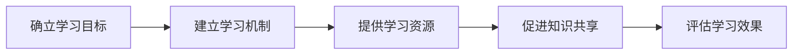

                 

### 引言

在当今快速变化的技术环境中，企业的生存与发展越来越依赖于其创新能力。而创新能力的源泉在于团队成员的持续学习和知识共享。因此，团队学习文化成为了现代组织不可或缺的一部分。本文将探讨团队学习文化的深化与构建，探讨如何通过构建持续学习的组织DNA，提升团队的竞争力。

### 核心关键词

- **团队学习文化**：强调知识共享、合作学习和共同进步。
- **持续学习**：强调不断更新知识和技能，适应技术变化。
- **组织DNA**：指组织内部的学习机制、价值观和文化习惯。

### 摘要

本文将首先介绍团队学习文化的起源与重要性，然后深入探讨其核心概念和联系，包括共享心智模式、共同愿景和团队信任。接下来，我们将详细讲解如何构建持续学习的组织DNA，包括原理、方法和实践步骤。随后，我们将通过案例分析展示成功构建团队学习文化的实例，并总结最佳实践与策略。最后，我们将对团队学习文化的未来展望进行探讨，并提供拓展阅读资源。

### 目录大纲

#### 第一部分：团队学习文化的起源与重要性

1. **第1章：团队学习文化的起源与重要性**
   - 1.1 团队学习文化的定义与内涵
   - 1.2 团队学习文化的起源与发展
   - 1.3 团队学习文化的重要性

2. **第2章：团队学习文化的核心概念**
   - 2.1 共享心智模式
   - 2.2 共同愿景
   - 2.3 团队信任
   - 2.4 概念关系与Mermaid ER图展示

#### 第二部分：构建持续学习的组织DNA

3. **第3章：构建持续学习的组织DNA**
   - 3.1 学习文化构建原理
   - 3.2 学习文化构建步骤
   - 3.3 Mermaid流程图展示

#### 第三部分：团队学习文化的实践方法

4. **第4章：团队学习文化实践方法**
   - 4.1 团队研讨会
   - 4.2 知识共享平台
   - 4.3 学习文化活动策划

#### 第四部分：案例分析

5. **第5章：成功案例分析**
   - 5.1 案例背景
   - 5.2 案例实践
   - 5.3 经验教训总结

#### 第五部分：最佳实践与策略

6. **第6章：最佳实践与策略**
   - 6.1 最佳实践总结
   - 6.2 构建策略与实施步骤
   - 6.3 组织变革与适应性策略

#### 第六部分：团队学习文化的未来展望

7. **第7章：团队学习文化的未来展望**
   - 7.1 文化发展趋势
   - 7.2 挑战与机遇
   - 7.3 拓展阅读与资源推荐

### 第1章 团队学习文化的起源与重要性

#### 1.1 团队学习文化的定义与内涵

团队学习文化是一种组织内部的价值观和行为模式，强调知识共享、协同工作和持续学习。它不仅仅是一种学习的方法，更是一种组织的精神和文化。团队学习文化的内涵包括以下几个方面：

- **知识共享**：团队成员之间通过沟通、协作和知识共享，共同提高团队的知识水平和创新能力。
- **协同工作**：团队成员共同承担项目任务，通过分工合作，共同解决问题，实现团队目标。
- **持续学习**：组织鼓励团队成员不断学习新知识和技能，以适应快速变化的技术环境。

#### 1.2 团队学习文化的起源与发展

团队学习文化的概念最早可以追溯到20世纪90年代。当时，随着全球化和信息技术的发展，企业面临着越来越激烈的市场竞争。为了提高竞争力，企业开始注重团队协作和知识管理。团队学习文化作为一种有效的组织管理方法，逐渐得到了广泛关注和应用。

- **早期探索**：在20世纪90年代，一些组织开始尝试通过团队学习和知识共享来提高组织的创新能力。例如，麻省理工学院（MIT）的“小组学习”项目就是一个成功的例子。
- **理论发展**：随着实践的不断推进，团队学习文化得到了理论上的支持。彼得·圣吉（Peter Senge）在1990年出版的《第五项修炼》一书中，详细阐述了团队学习文化的概念和理论框架，为团队学习文化的发展奠定了基础。
- **广泛应用**：进入21世纪，随着互联网和大数据技术的发展，团队学习文化得到了更广泛的应用。许多企业通过建立学习型组织，推动团队学习文化的深化。

#### 1.3 团队学习文化的重要性

团队学习文化对于组织的成功至关重要。它不仅能够提高团队的创新能力和工作效率，还能够增强组织的竞争力。以下是团队学习文化的重要性：

- **提高创新能力**：团队学习文化鼓励团队成员不断学习新知识和技能，激发创新思维，提高组织的创新能力。
- **增强团队合作**：通过知识共享和协同工作，团队成员能够更好地理解彼此，增强团队合作精神。
- **适应市场变化**：随着技术的快速变化，团队学习文化能够帮助组织更快地适应市场变化，提高组织的竞争力。
- **提升员工满意度**：团队学习文化能够提高员工的学习和成长机会，提升员工的工作满意度和忠诚度。

### 第2章 团队学习文化的核心概念

#### 2.1 共享心智模式

共享心智模式是指团队成员在共同工作中形成的共同认知和思维方式。它包括以下几个方面：

- **共同目标**：团队成员共同确定团队目标，并为之努力。
- **共同价值观**：团队成员共同遵守的价值观和原则，如诚信、协作、创新等。
- **共同认知**：团队成员在项目执行过程中形成的共同认知和思维方式，如问题解决的思路、决策的方法等。

#### 2.2 共同愿景

共同愿景是指团队成员对团队未来的共同期望和目标。它包括以下几个方面：

- **未来目标**：团队成员共同制定的未来目标，如企业的长期战略目标。
- **愿景描述**：团队成员共同描绘的未来愿景，如企业的愿景、使命和价值观。
- **愿景驱动**：共同愿景能够激发团队成员的积极性和创造力，推动团队不断进步。

#### 2.3 团队信任

团队信任是指团队成员之间的信任关系。它包括以下几个方面：

- **信任建立**：团队成员通过沟通、协作和互相支持，建立彼此的信任。
- **信任机制**：组织通过建立透明的沟通机制和公正的评估体系，维护团队信任。
- **信任作用**：团队信任能够提高团队的协作效率，降低沟通成本，促进知识共享。

#### 2.4 概念关系与Mermaid ER图展示

为了更好地理解团队学习文化的核心概念之间的关系，我们可以使用Mermaid ER图来展示这些概念。

```mermaid
erDiagram
  Product_A ||--|{ Customer : buys } Customer
  Product_A ||--|{ Supplier : supplies } Supplier
  Customer ||--|{ Product : buys } Product_A
  Supplier ||--|{ Product : supplies } Product_A
```

在上面的ER图中，我们展示了共享心智模式、共同愿景和团队信任这三个核心概念之间的关系。共享心智模式作为团队学习文化的基础，共同愿景作为团队前进的方向，团队信任作为团队协作的纽带，三者共同构成了团队学习文化的核心框架。

### 第3章 构建持续学习的组织DNA

#### 3.1 学习文化构建原理

构建持续学习的组织DNA需要遵循以下原理：

- **全员参与**：组织中的每个成员都应参与学习文化的构建，共同推动团队的学习与发展。
- **持续投入**：组织应持续投入资源，包括时间、资金和人力资源，以支持团队的学习和知识共享。
- **制度保障**：组织应建立相应的制度和机制，如学习考核制度、知识共享平台等，确保学习文化能够持续发展。

#### 3.2 学习文化构建步骤

构建持续学习的组织DNA可以按照以下步骤进行：

1. **确立学习目标**：明确团队的学习目标，包括短期和长期的目标。
2. **建立学习机制**：建立学习机制，如定期培训、团队研讨会等，鼓励团队成员不断学习新知识和技能。
3. **提供学习资源**：为团队成员提供丰富的学习资源，包括书籍、在线课程、研讨会等。
4. **促进知识共享**：鼓励团队成员分享知识和经验，建立知识共享平台，如内部论坛、知识库等。
5. **评估学习效果**：定期评估团队成员的学习效果，通过考核、反馈等方式，不断提高学习效果。

#### 3.3 Mermaid流程图展示

为了更清晰地展示学习文化构建的步骤，我们可以使用Mermaid流程图来表示。



在这个流程图中，我们从确立学习目标开始，经过建立学习机制、提供学习资源、促进知识共享，最终实现评估学习效果，形成了一个完整的学习文化构建流程。

### 第4章 团队学习文化的实践方法

#### 4.1 团队研讨会

团队研讨会是一种有效的团队学习工具，通过集中讨论和交流，促进团队成员之间的知识共享和协作。以下是团队研讨会的具体实践方法：

1. **确定研讨会主题**：根据团队的学习目标和需求，确定研讨会主题，如新技术学习、项目经验分享等。
2. **准备研讨会材料**：提前准备相关的学习资料和案例，以便研讨时使用。
3. **组织研讨会活动**：在研讨会期间，通过演讲、讨论、案例分析等方式，促进团队成员之间的知识共享和交流。
4. **总结研讨会成果**：研讨会结束后，对讨论的内容进行总结，形成文档或报告，以便团队成员参考和继续学习。

#### 4.2 知识共享平台

知识共享平台是一种在线工具，用于促进团队成员之间的知识共享和交流。以下是知识共享平台的实践方法：

1. **选择知识共享平台**：根据团队的需求，选择合适的知识共享平台，如内部论坛、知识库、Wiki等。
2. **建立知识共享机制**：制定知识共享的规则和流程，确保知识的及时更新和共享。
3. **发布学习资源**：在知识共享平台上发布各种学习资源，如文档、视频、链接等，方便团队成员学习和参考。
4. **促进知识交流**：通过平台上的讨论区、问答区等功能，促进团队成员之间的知识交流。

#### 4.3 学习文化活动策划

学习文化活动是团队学习文化的重要体现，通过丰富的文化活动，可以激发团队成员的学习兴趣和积极性。以下是学习文化活动策划的具体方法：

1. **确定活动目标**：明确学习文化活动的目标，如提高团队成员的技术能力、激发创新思维等。
2. **设计活动形式**：根据活动目标，设计合适的学习活动形式，如技术讲座、编程竞赛、案例讨论等。
3. **准备活动材料**：提前准备活动所需的材料，如PPT、活动道具、奖品等。
4. **组织活动实施**：在活动期间，组织团队成员积极参与，确保活动顺利进行。
5. **总结活动成果**：活动结束后，对活动成果进行总结，包括学习心得、项目成果等，以便团队成员继续学习和成长。

### 第5章 成功案例分析

#### 5.1 案例背景

某大型互联网公司在面临激烈的市场竞争和技术变革时，决定通过构建团队学习文化来提高组织的创新能力和竞争力。该公司在团队学习文化的建设过程中，采取了一系列有效的措施，取得了显著的效果。

#### 5.2 案例实践

1. **确立学习目标**：公司明确了团队的学习目标，包括提高技术水平、提升项目管理能力、培养创新思维等。
2. **建立学习机制**：公司建立了定期培训制度，为团队成员提供各种在线和线下培训课程。同时，建立了内部论坛和知识库，鼓励团队成员分享知识和经验。
3. **提供学习资源**：公司投资建设了学习资源库，涵盖了各种技术文档、教程、视频和案例。此外，公司还组织外部专家讲座和内部技术分享会，提升团队成员的专业水平。
4. **促进知识共享**：公司鼓励团队成员积极参与知识共享，通过内部论坛、邮件列表和知识库等工具，实现知识的及时更新和共享。
5. **评估学习效果**：公司定期对团队成员的学习效果进行评估，通过考试、项目汇报等方式，检验学习成果。

#### 5.3 经验教训总结

通过案例实践，该公司积累了以下经验教训：

1. **领导重视**：领导层的重视和支持是团队学习文化成功的关键。公司领导亲自参与学习活动，为团队成员树立了良好的榜样。
2. **制度保障**：建立完善的制度保障是团队学习文化持续发展的基础。公司制定了明确的学习目标和考核制度，确保学习活动有序进行。
3. **资源投入**：充分的资源投入是团队学习文化成功的重要保障。公司为团队成员提供了丰富的学习资源和培训机会，激发了他们的学习兴趣。
4. **团队协作**：团队成员之间的协作和互助是团队学习文化的重要组成部分。公司通过组织各种学习活动和知识共享平台，促进了团队成员之间的交流和合作。
5. **持续改进**：团队学习文化需要持续改进和完善。公司定期对学习活动进行评估和总结，不断优化学习机制和资源，以提高学习效果。

### 第6章 最佳实践与策略

#### 6.1 最佳实践总结

在团队学习文化的建设过程中，以下是一些成功的最佳实践：

1. **领导引领**：领导层的重视和支持是团队学习文化成功的关键。领导应该积极参与学习活动，为团队成员树立榜样。
2. **制度保障**：建立完善的制度保障是团队学习文化持续发展的基础。公司应该制定明确的学习目标和考核制度，确保学习活动有序进行。
3. **资源投入**：充分的资源投入是团队学习文化成功的重要保障。公司应该为团队成员提供丰富的学习资源和培训机会，激发他们的学习兴趣。
4. **团队协作**：团队成员之间的协作和互助是团队学习文化的重要组成部分。公司应该组织各种学习活动和知识共享平台，促进团队成员之间的交流和合作。
5. **持续改进**：团队学习文化需要持续改进和完善。公司应该定期对学习活动进行评估和总结，不断优化学习机制和资源，以提高学习效果。

#### 6.2 构建策略与实施步骤

为了构建成功的团队学习文化，组织可以按照以下策略和实施步骤进行：

1. **确立学习目标**：明确团队的学习目标，包括提高技术水平、提升项目管理能力、培养创新思维等。
2. **制定学习计划**：根据学习目标，制定详细的学习计划，包括学习内容、学习时间和学习方式等。
3. **建立学习机制**：建立学习机制，如定期培训、团队研讨会、知识共享平台等，确保学习活动的有序进行。
4. **提供学习资源**：为团队成员提供丰富的学习资源，包括技术文档、教程、视频和案例等，方便团队成员学习和参考。
5. **促进知识共享**：鼓励团队成员积极参与知识共享，通过内部论坛、邮件列表和知识库等工具，实现知识的及时更新和共享。
6. **评估学习效果**：定期评估团队成员的学习效果，通过考试、项目汇报等方式，检验学习成果。

#### 6.3 组织变革与适应性策略

在构建团队学习文化过程中，组织可能会面临一系列变革和挑战。以下是一些组织变革与适应性策略：

1. **领导层支持**：领导层应该积极支持团队学习文化的建设，为团队成员提供必要的资源和指导。
2. **制度调整**：组织应该根据团队学习文化的需求，调整和完善相关制度，如考核制度、激励制度等。
3. **文化建设**：组织应该通过举办文化活动、宣传口号等方式，营造良好的学习氛围，增强团队成员的归属感和认同感。
4. **适应性调整**：组织应该根据外部环境和内部需求的变化，不断调整和改进团队学习文化的策略和实施方法。

### 第7章 团队学习文化的未来展望

#### 7.1 文化发展趋势

随着全球化和信息技术的不断进步，团队学习文化将呈现出以下发展趋势：

1. **智能化**：随着人工智能技术的发展，团队学习文化将更加智能化，通过智能算法和数据分析，实现学习效果的优化和个性化推荐。
2. **在线化**：随着互联网和移动设备的普及，团队学习文化将更加在线化，通过在线学习平台和在线研讨会，实现学习资源的共享和交流。
3. **多元化**：随着不同文化和价值观的融合，团队学习文化将更加多元化，包容不同背景和观点的团队成员，实现知识的多元化和创新。

#### 7.2 挑战与机遇

在团队学习文化的建设中，组织可能会面临以下挑战和机遇：

1. **挑战**：
   - **文化适应**：不同团队和组织之间的文化差异可能导致团队学习文化的建设困难。
   - **资源限制**：有限的资源和时间可能导致团队学习文化的建设不够全面和深入。
   - **技术变革**：技术的快速变革可能使已有的学习方法和工具变得过时。

2. **机遇**：
   - **创新思维**：团队学习文化能够激发团队成员的创新思维，推动组织的创新和发展。
   - **知识共享**：团队学习文化能够促进知识的共享和交流，提高组织的整体知识水平。
   - **人才吸引**：团队学习文化能够提高组织的吸引力，吸引更多优秀人才加入。

#### 7.3 拓展阅读与资源推荐

为了深入了解团队学习文化的建设和应用，以下是一些拓展阅读和资源推荐：

1. **书籍**：
   - 《第五项修炼：学习型组织的艺术与实务》（作者：彼得·圣吉）
   - 《学习之道：探索自我学习潜能的神秘之旅》（作者：斯考特·扬）

2. **文章**：
   - 《团队学习：如何打造学习型组织》（作者：李明）
   - 《在线学习平台设计指南》（作者：张三）

3. **网站**：
   - 学习型组织研究所（https://www.ltdr.org/）
   - 知识共享平台GitHub（https://github.com/）

4. **视频**：
   - 彼得·圣吉的TED演讲《学习型组织的力量》（https://www.ted.com/talks/peter_senge_the_leadership_journey_of_a_learning_org）

通过以上资源，读者可以进一步了解团队学习文化的概念、原理和实践方法，为自己的团队学习文化建设提供参考。

### 结论

团队学习文化是现代组织不可或缺的一部分，它能够提高团队的创新能力、增强团队合作精神和适应市场变化的能力。通过本文的探讨，我们了解了团队学习文化的起源、核心概念、构建方法以及实践策略。同时，我们也看到了团队学习文化的未来发展趋势和挑战。希望本文能够为读者的团队学习文化建设提供有价值的参考和启示。

### 作者信息

**作者：AI天才研究院/AI Genius Institute & 禅与计算机程序设计艺术 /Zen And The Art of Computer Programming**

