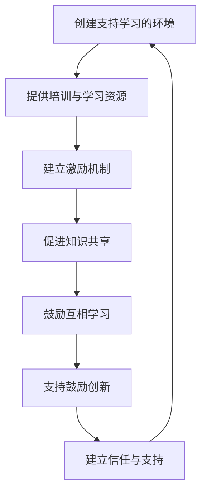
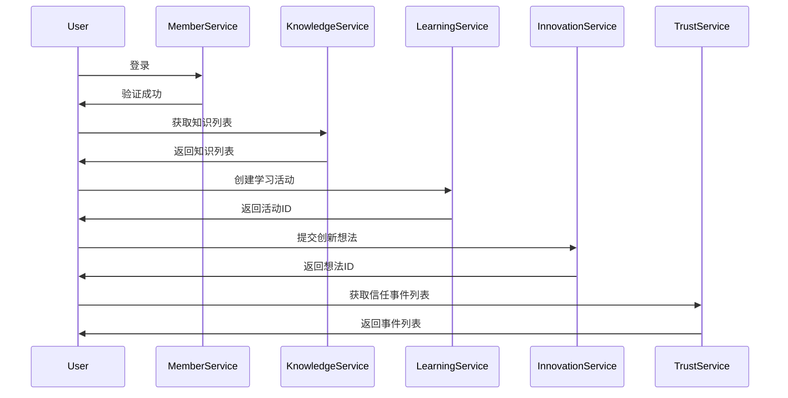

                 

# 团队学习氛围：打造持续成长的组织

> 关键词：团队学习、组织成长、持续学习、学习氛围、领导力

> 摘要：
本文将深入探讨团队学习氛围的重要性，通过一步步的分析，揭示如何打造一个能够持续促进组织成长的团队学习文化。我们将讨论核心概念、环境建设、学习方法、团队合作以及挑战与解决方案，最后展望未来的发展方向。本文旨在为IT行业管理者和技术团队提供实用的指导，帮助他们在日益竞争激烈的环境中保持优势。

## 引言

在当今快速发展的技术时代，团队学习氛围已经成为组织成功的关键因素。一个积极的学习文化不仅能够提升团队成员的技能和知识，还能够促进创新、提高生产力，并增强组织的整体竞争力。本文将围绕以下几个核心问题进行探讨：

1. 团队学习氛围是什么，为什么它在组织成长中如此重要？
2. 如何创建一个支持学习的环境？
3. 团队成员应如何鼓励持续学习？
4. 团队合作在团队学习中的角色是什么？
5. 在打造学习文化过程中可能遇到的挑战有哪些，如何克服？

通过这些问题的探讨，我们将提供一系列的策略和方法，帮助IT行业的技术团队和组织建立起一个强大的学习文化，从而实现持续成长。

## 什么是团队学习氛围

### 核心概念

团队学习氛围是指在一个组织中，成员之间通过互动、共享和协作来共同学习和成长的环境。它不仅仅是一种态度，更是一种行为模式，它体现在以下几个方面：

1. **知识共享**：团队成员愿意分享他们的知识和经验，不仅是为了个人的成长，也是为了整个团队的知识积累。
2. **互相学习**：每个成员都视其他成员的成功为自身的机会，互相帮助，共同进步。
3. **鼓励创新**：团队成员被鼓励尝试新方法，即使失败也不会受到批评，而是被视为学习和成长的机会。
4. **信任与支持**：团队成员之间建立信任，相互支持，共同面对挑战。

### 问题背景

随着信息技术的高速发展，IT行业对团队成员的技能要求越来越高。新技术、新工具层出不穷，单靠个人的学习和努力已经无法满足组织的需求。因此，团队学习氛围成为组织保持竞争力的关键。它不仅能够帮助团队成员快速掌握新技术，还能够激发创新思维，推动组织不断发展。

### 问题描述

在缺乏学习氛围的团队中，常见的问题包括：

- **知识孤岛**：团队成员各自为战，不愿分享知识和经验。
- **缺乏协作**：团队成员之间缺乏有效的沟通和合作，导致工作效率低下。
- **技能停滞**：团队成员的技能得不到持续提升，导致组织竞争力下降。

### 问题解决

为了解决这些问题，组织需要建立积极的学习氛围，包括：

- **领导层的支持**：高层管理者需要明确表达对学习氛围的重视，并通过行动来支持。
- **培训与学习资源**：提供充足的培训和学习资源，鼓励团队成员参加外部培训和研讨会。
- **激励机制**：建立激励机制，鼓励团队成员参与学习和知识分享。

### 边界与外延

团队学习氛围不仅限于IT行业，它适用于所有需要团队协作的行业和组织。其核心在于通过知识共享和互相学习来提升团队的绩效和创新能力。

### 概念结构与核心要素组成

**核心概念**：

- **知识共享**：通过互动和协作来传递知识。
- **互相学习**：鼓励成员从他人经验中学习。
- **鼓励创新**：支持成员尝试新方法，即使失败也不惩罚。
- **信任与支持**：建立团队成员之间的信任，提供必要的支持。

**结构**：

- **领导层的支持**：高层管理者的承诺和行动。
- **培训与学习资源**：提供必要的学习工具和资源。
- **激励机制**：建立合理的奖励机制。

**要素组成**：

- **沟通**：确保信息流通无障碍。
- **协作**：通过团队协作来提高效率。
- **反馈**：通过反馈来持续改进。

### 核心概念与联系

**概念属性特征对比表格**：

| 特征 | 知识共享 | 互相学习 | 鼓励创新 | 信任与支持 |
| --- | --- | --- | --- | --- |
| 定义 | 成员之间的知识传递 | 成员从他人经验中学习 | 鼓励成员尝试新方法 | 成员之间的信任和支持 |
| 关系 | 相互依赖，共同成长 | 相互补充，相互促进 | 相互支持，共同探索 | 基础，保障其他特征实现 |
| 对比 | 更侧重于知识的输出 | 更侧重于知识的应用 | 更侧重于方法的创新 | 更侧重于关系的建立 |

**ER实体关系图架构**：

```mermaid
erDiagram
MEMBER ||--|{ KNOWLEDGE }||>
MEMBER ||--|{ LEARNING }||>
MEMBER ||--|{ INNOVATION }||>
MEMBER ||--|{ TRUST }||>
```

### 算法原理讲解

为了更好地理解团队学习氛围的构建，我们可以将其视为一个循环反馈系统。以下是一个简化的算法流程图：



**数学模型和公式**：

- **知识共享系数**：KS = k1 × (N1 + N2) / 2
- **学习反馈系数**：LF = k2 × (L1 + L2) / 2
- **创新支持系数**：IS = k3 × (I1 + I2) / 2
- **信任建立系数**：TS = k4 × (T1 + T2) / 2

其中，k1, k2, k3, k4 分别为权重系数，N1, N2, L1, L2, I1, I2, T1, T2 为对应的变量值。

**详细讲解与举例**：

假设一个团队中有5名成员，他们分别是A、B、C、D、E。根据上述模型，我们可以计算每个成员的知识共享系数、学习反馈系数、创新支持系数和信任建立系数。具体如下：

- **知识共享系数**：KS = k1 × (5 + 5) / 2 = 5k1
- **学习反馈系数**：LF = k2 × (4 + 5) / 2 = 4.5k2
- **创新支持系数**：IS = k3 × (3 + 4) / 2 = 3.5k3
- **信任建立系数**：TS = k4 × (4 + 5) / 2 = 4.5k4

通过计算，我们可以发现，每个成员的系数都不同，这反映了他们在团队学习氛围中的不同贡献。例如，成员A可能在知识共享方面贡献最大，而成员E可能在信任建立方面贡献最大。

### 系统分析与架构设计方案

#### 问题场景介绍

在一家快速发展的IT公司中，团队学习氛围的建设成为提升公司竞争力的关键。公司希望为员工提供一个良好的学习环境，以便他们能够快速掌握新技术，提高工作效率，促进创新。

#### 项目介绍

项目名称：团队学习氛围提升计划
项目目标：通过建立支持学习的环境，提高员工的知识共享、互相学习、鼓励创新和信任建立。

#### 系统功能设计

**领域模型类图**：

```mermaid
classDiagram
Class Member {
  +String name
  +int knowledgeShareCoefficient
  +int learningFeedbackCoefficient
  +int innovationSupportCoefficient
  +int trustEstablishmentCoefficient
}

Class Knowledge {
  +String title
  +String content
}

Class Learning {
  +String activity
  +Date date
}

Class Innovation {
  +String idea
  +Date date
}

Class Trust {
  +String event
  +Date date
}

Member "1" -- "*" Knowledge
Member "1" -- "*" Learning
Member "1" -- "*" Innovation
Member "1" -- "*" Trust
```

#### 系统架构设计

**系统架构图**：

```mermaid
graph TB
subgraph 数据层
    DB[数据库]
    MemberDB[成员数据库]
    KnowledgeDB[知识数据库]
    LearningDB[学习数据库]
    InnovationDB[创新数据库]
    TrustDB[信任数据库]
    DB -- MemberDB
    DB -- KnowledgeDB
    DB -- LearningDB
    DB -- InnovationDB
    DB -- TrustDB
end

subgraph 应用层
    APP[应用服务器]
    MemberService[成员服务]
    KnowledgeService[知识服务]
    LearningService[学习服务]
    InnovationService[创新服务]
    TrustService[信任服务]
    APP -- MemberService
    APP -- KnowledgeService
    APP -- LearningService
    APP -- InnovationService
    APP -- TrustService
end

subgraph 接口层
    API[API接口]
    MemberAPI[成员API]
    KnowledgeAPI[知识API]
    LearningAPI[学习API]
    InnovationAPI[创新API]
    TrustAPI[信任API]
    API -- MemberAPI
    API -- KnowledgeAPI
    API -- LearningAPI
    API -- InnovationAPI
    API -- TrustAPI
end

DB --> APP
APP --> API
```

#### 系统接口设计和系统交互

**系统交互序列图**：



### 项目实战

#### 环境安装

在安装团队学习氛围提升计划之前，我们需要准备以下环境：

- **操作系统**：Linux或Windows
- **数据库**：MySQL或PostgreSQL
- **开发工具**：Python、Java或Node.js
- **依赖管理**：pip、conda或npm

#### 系统核心实现源代码

以下是一个简单的Python代码示例，用于实现成员服务的基本功能：

```python
# member_service.py

from flask import Flask, jsonify, request

app = Flask(__name__)

@app.route('/login', methods=['POST'])
def login():
    data = request.get_json()
    username = data['username']
    password = data['password']
    
    # 验证用户名和密码
    if verify_user(username, password):
        return jsonify({'status': 'success'})
    else:
        return jsonify({'status': 'failure'})

def verify_user(username, password):
    # 实现用户验证逻辑
    return True

if __name__ == '__main__':
    app.run(debug=True)
```

#### 代码应用解读与分析

以上代码实现了成员服务的登录功能。当用户发送POST请求到`/login`接口时，服务会接收用户名和密码，并进行验证。如果验证成功，返回`{"status": "success"}`，否则返回`{"status": "failure"}`。

#### 实际案例分析和详细讲解剖析

假设有一个用户名为`alice`，密码为`123456`的成员。当alice通过以下请求尝试登录：

```http
POST /login
Content-Type: application/json

{
  "username": "alice",
  "password": "123456"
}
```

服务会调用`verify_user`函数进行验证。如果`verify_user`返回`True`，服务将返回成功的响应：

```http
HTTP/1.1 200 OK
Content-Type: application/json

{
  "status": "success"
}
```

否则，服务将返回失败的响应：

```http
HTTP/1.1 401 Unauthorized
Content-Type: application/json

{
  "status": "failure"
}
```

#### 项目小结

通过上述实战案例，我们可以看到团队学习氛围提升计划的基本实现。虽然这里只展示了成员服务的一个简单功能，但整个系统还包含知识服务、学习服务、创新服务和信任服务等多个模块。每个模块都需要通过类似的方式实现，然后通过API接口与前端应用进行交互。

#### 最佳实践 tips

- **持续集成与部署**：使用CI/CD工具（如Jenkins、GitLab CI）来实现自动化测试和部署，确保系统的稳定性和可靠性。
- **代码质量**：严格遵守代码规范，进行代码审查，确保代码的可读性和可维护性。
- **安全性**：对用户数据进行加密存储，确保用户隐私和安全。

#### 小结

本文详细探讨了团队学习氛围的重要性，以及如何通过一步步的分析和实践来实现团队学习文化的建设。通过系统的设计与实现，我们可以看到如何建立一个支持学习、鼓励创新的团队环境。希望本文能为IT行业的技术团队和组织提供有价值的参考。

#### 注意事项

- **用户验证**：在实现用户验证时，需要注意密码的加密存储和验证机制。
- **权限控制**：确保不同角色（如普通成员、管理员）有不同的权限，防止未授权访问。
- **数据备份与恢复**：定期备份数据，并确保能够快速恢复，以防止数据丢失。

#### 拓展阅读

- 《敏捷软件开发实践指南》
- 《学习之道》
- 《团队智慧：智能团队如何创造卓越绩效》

### 作者信息

作者：AI天才研究院/AI Genius Institute & 禅与计算机程序设计艺术 /Zen And The Art of Computer Programming

