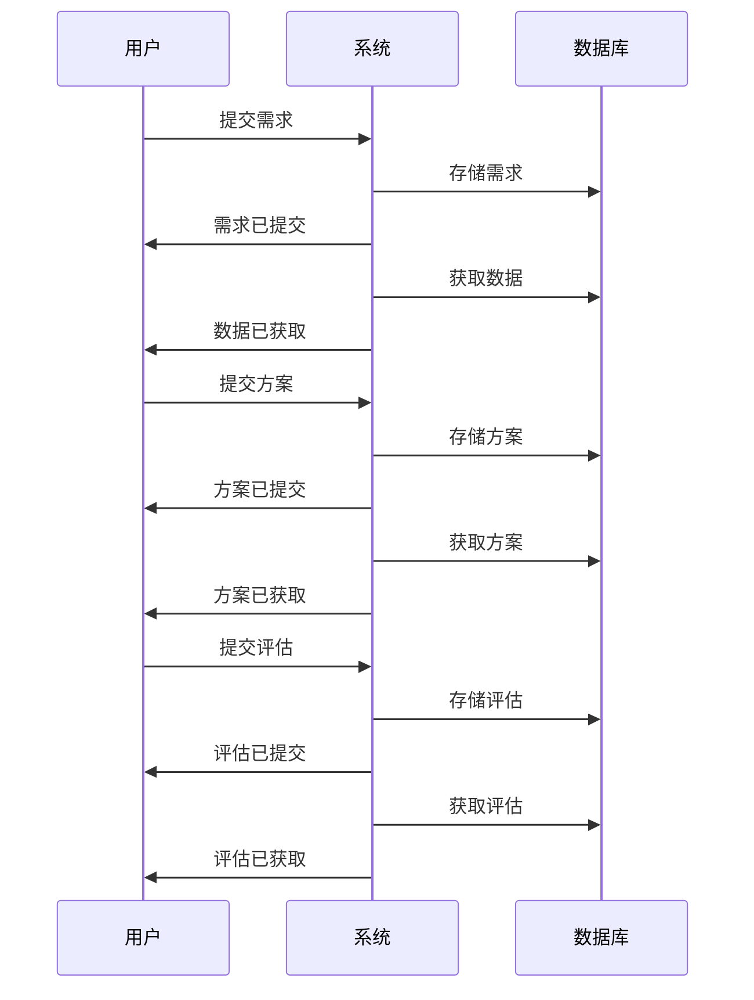
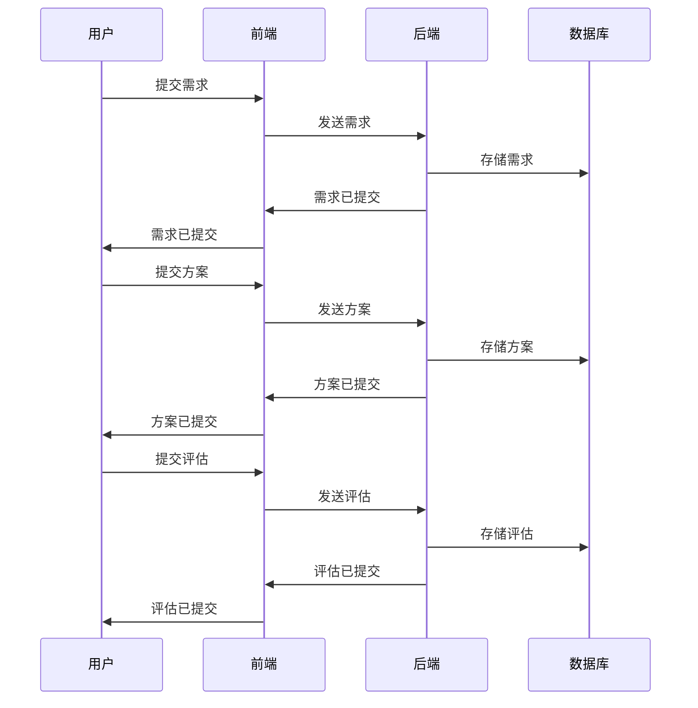

                 


# 《团队学习：打造学习型组织》

关键词：团队学习、学习型组织、文化机制、领导角色、项目实践

摘要：本文旨在探讨团队学习的重要性，以及如何在组织中构建学习型文化，实现持续创新和自我完善。通过分析团队学习的核心概念、策略与实践、文化与机制，领导者的角色以及具体的团队学习项目案例，为读者提供一套系统化的团队学习方法论，帮助组织打造高效的学习型团队。

## 引言

在信息化、全球化的时代，知识更新速度不断加快，技术创新成为推动企业发展的核心动力。然而，仅有技术实力是不够的，一个组织能否持续成长，关键在于其成员是否能够不断学习、适应和变革。因此，团队学习成为现代企业追求的目标。学习型组织（Learning Organization）则是一个能够不断学习、适应和创新的有机整体，它能够将个体学习转化为团队智慧，推动组织不断进步。

本文将从以下方面展开讨论：

1. 核心概念与联系
2. 策略与实践
3. 文化与机制
4. 领导角色
5. 项目实践
6. 总结与展望

希望通过本文的探讨，能够为读者提供一套实用的团队学习方法论，帮助组织打造学习型文化，实现持续成长。

## 核心概念与联系

### 团队学习的定义

团队学习（Team Learning）是指团队成员通过互动、交流和合作，共同分享知识和经验，从而达到共同提升的过程。它不仅仅是一种学习方法，更是一种组织文化，强调知识的传递和共享，促进团队成员之间的协同合作。

### 学习型组织的概念

学习型组织（Learning Organization）是由彼得·圣吉（Peter Senge）在其著作《第五项修炼》（The Fifth Discipline）中提出的一个概念。学习型组织具有以下特征：

- **共同愿景**：组织成员拥有共同的目标和价值观，形成强大的凝聚力。
- **团队学习**：团队成员之间相互支持、共同学习，实现知识的共享和创新的产生。
- **改变心智模式**：组织成员能够不断反思自己的思维方式和行为模式，勇于面对变化和挑战。
- **系统思考**：组织成员具备系统思维，能够从整体上理解问题，并找到解决问题的最佳方案。
- **个人 mastery**：组织成员追求个人的专业成长，不断提升自己的能力和素质。

### 团队学习与学习型组织的联系

团队学习是学习型组织的核心要素之一，两者之间存在着密切的联系。团队学习为学习型组织提供了知识共享和创新的平台，而学习型组织则为团队学习提供了良好的环境和机制。

首先，团队学习是学习型组织的基础。只有团队成员能够不断学习、分享和协同合作，组织才能形成一个持续学习、不断进步的有机整体。

其次，学习型组织为团队学习提供了保障。通过建立共同愿景、改变心智模式、系统思考等机制，学习型组织能够激发团队成员的学习动力，促进知识的传递和创新。

最后，团队学习和学习型组织相互促进。团队学习推动了学习型组织的形成，而学习型组织的完善又为团队学习提供了更广阔的空间和更丰富的资源。

## 策略与实践

### 团队学习策略

1. **共同目标与价值观的建立**

   团队学习的首要策略是确立共同的目标和价值观。这有助于增强团队成员的凝聚力，形成共同的学习方向和动力。具体方法包括：

   - **共同制定愿景和使命**：通过团队讨论，明确组织的愿景和使命，确保每个成员都明确自己的责任和目标。
   - **价值观塑造**：通过共同价值观的塑造，形成组织内部的共同语言和行为规范，推动团队成员在价值观层面达成共识。

2. **互动与交流**

   互动与交流是团队学习的关键。通过有效的互动和交流，团队成员可以分享知识、经验和见解，实现知识的传递和碰撞。具体方法包括：

   - **定期会议**：组织定期的团队会议，为团队成员提供交流和分享的平台。
   - **头脑风暴**：通过头脑风暴，激发团队成员的创新思维，共同探讨问题的解决方案。
   - **交流论坛**：建立内部交流论坛，鼓励团队成员分享学习心得、工作经验和思考。

3. **反馈与反思**

   反馈与反思是团队学习的重要环节。通过及时的反馈和深入的反思，团队成员可以不断调整自己的学习方法和行为模式，实现持续成长。具体方法包括：

   - **定期反馈**：组织定期的个人和团队反馈会议，鼓励成员分享学习成果和反思学习过程。
   - **反思日志**：鼓励团队成员撰写反思日志，记录自己的学习过程和心得体会。
   - **反思研讨会**：通过反思研讨会，引导团队成员深入分析学习过程中的问题和挑战，寻找改进的方法。

### 团队学习实践

1. **建立学习型组织文化**

   建立学习型组织文化是团队学习成功的关键。学习型组织文化强调知识的共享、创新的追求和个人的成长。具体方法包括：

   - **知识共享平台**：建立内部知识共享平台，为团队成员提供方便的知识获取和分享渠道。
   - **创新激励机制**：通过创新激励机制，鼓励团队成员积极思考、勇于尝试和分享创新成果。
   - **个人成长计划**：为团队成员提供个人成长计划，支持他们在专业领域不断提升。

2. **实施团队学习项目**

   团队学习项目是团队学习的重要载体。通过具体的项目实践，团队成员可以深入参与学习过程，实现知识的传递和创新。具体方法包括：

   - **项目选题**：选择具有挑战性和创新性的项目，确保项目能够激发团队成员的学习兴趣和动力。
   - **项目规划**：制定详细的项目规划，明确项目目标、任务分工和时间表。
   - **项目执行**：在项目执行过程中，注重团队成员的互动和交流，鼓励团队成员积极参与项目讨论和决策。
   - **项目评估**：项目结束后，进行全面的评估和总结，总结项目经验和教训，为下一次项目提供参考。

3. **持续改进与优化**

   团队学习不是一次性的活动，而是一个持续的过程。通过持续改进和优化，团队可以不断提升学习效果和组织效能。具体方法包括：

   - **定期回顾**：定期回顾团队学习的效果和问题，总结经验教训，为下一次学习提供参考。
   - **培训与辅导**：为团队成员提供培训和辅导，提升他们的学习能力和解决问题的能力。
   - **知识管理**：建立完善的知识管理体系，确保团队学习成果的积累和传承。

## 文化与机制

### 文化建设

文化建设是打造学习型组织的基石。一个积极的学习型文化能够激发团队成员的学习热情和创新动力，促进知识的共享和传递。具体措施包括：

1. **建立共同的价值观**

   通过组织共同价值观的塑造，形成团队成员的共同语言和行为规范，推动团队学习的发展。例如，可以制定“知识共享、共同进步”的核心价值观，鼓励团队成员在工作和学习中相互支持和帮助。

2. **营造创新氛围**

   营造一个鼓励创新、容忍失败的氛围，让团队成员敢于尝试、勇于挑战。例如，可以设立创新基金，支持团队成员的创新项目，并为失败的项目提供反馈和改进的机会。

3. **激励与认可**

   通过设立奖励机制，对在团队学习中表现突出的成员给予认可和奖励，激发团队成员的学习积极性。例如，可以设立“学习明星”、“创新达人”等荣誉称号，并给予一定的物质奖励。

### 机制建设

机制建设是保障团队学习顺利实施的重要保障。通过建立完善的团队学习机制，可以确保团队学习有计划、有目标、有评估。具体措施包括：

1. **学习计划**

   制定详细的学习计划，明确学习目标、任务分工和时间表。学习计划应包括个人学习目标和团队学习目标，确保团队成员的学习有方向、有动力。

2. **学习资源**

   提供丰富的学习资源，包括书籍、课程、研讨会、内部知识库等，为团队成员提供充足的学习材料。同时，鼓励团队成员主动获取外部资源，拓宽学习视野。

3. **学习评估**

   定期对团队学习的效果进行评估，总结学习成果和经验教训。学习评估可以采取定量和定性相结合的方法，通过考试、作业、项目展示等方式，全面了解团队成员的学习效果。

4. **反馈与改进**

   建立反馈与改进机制，鼓励团队成员在学习过程中进行自我反馈和相互反馈，及时发现问题并进行改进。例如，可以设立学习反思会，让团队成员分享学习心得、经验教训，为下一次学习提供参考。

### 文化与机制的关系

文化与机制相互影响、相互促进。良好的文化能够激发团队成员的学习热情和创新动力，推动机制的建立和完善；而完善的机制则为文化的落实提供了保障，确保文化能够在组织中得以传承和发扬。因此，在打造学习型组织的过程中，既要注重文化建设，也要重视机制建设，实现文化与机制的有机结合。

## 领导角色

在团队学习中，领导者的角色至关重要。领导者不仅需要为团队学习提供方向和动力，还需要在具体实践中发挥引导和协调作用。以下是领导者在不同阶段的角色和责任：

### 策划阶段

1. **确立学习目标**

   领导者应与团队成员共同确立学习目标，确保目标具有明确性、可行性和挑战性。通过明确的目标，激发团队成员的学习热情和动力。

2. **制定学习计划**

   领导者应制定详细的学习计划，包括学习内容、时间安排、任务分工等。学习计划应确保团队成员在学习过程中有明确的方向和任务。

3. **协调资源**

   领导者需要协调内外部资源，为团队学习提供必要的支持。包括提供学习资源、搭建学习平台、争取外部支持等。

### 实施阶段

1. **引导学习**

   领导者应引导团队成员积极参与学习过程，鼓励他们主动分享知识、经验和见解。通过引导学习，促进团队成员之间的互动和交流。

2. **协调冲突**

   在学习过程中，领导者需要协调团队成员之间的冲突，确保团队学习顺利进行。通过有效沟通和协商，解决团队成员之间的矛盾和分歧。

3. **监督进度**

   领导者应定期检查团队学习进度，确保学习任务按计划进行。通过监督进度，及时发现问题和调整计划，确保学习目标的实现。

### 评估阶段

1. **评估学习效果**

   领导者应组织对团队学习效果进行评估，了解团队成员的学习成果和进步情况。通过评估，总结学习过程中的经验教训，为下一次学习提供参考。

2. **反馈与改进**

   领导者应将评估结果及时反馈给团队成员，鼓励他们在学习中取得更好的成绩。同时，针对评估中发现的问题，提出改进措施，促进团队学习的持续优化。

3. **激励与认可**

   领导者应给予在团队学习中表现突出的成员适当的激励和认可，激发他们的学习热情和积极性。例如，可以设立学习之星、优秀团队等荣誉称号，并给予相应的物质和精神奖励。

总之，领导者是团队学习的核心推动者，他们的角色和责任至关重要。通过有效引导、协调和激励，领导者可以推动团队学习，实现知识的共享和创新，为组织的持续发展奠定基础。

## 项目实践

### 项目背景

在当前快速变化的市场环境中，企业需要不断进行技术创新和业务模式创新，以保持竞争力。为了实现这一目标，某知名企业决定开展一个名为“智能供应链优化”的团队学习项目，旨在通过团队学习，提升供应链管理水平，降低运营成本，提高客户满意度。

### 项目介绍

“智能供应链优化”项目是一个跨部门、跨专业的团队学习项目，涉及企业采购、仓储、物流等多个部门。项目目标是通过对供应链各个环节的优化，实现供应链整体效率的提升。项目时间跨度为一年，分为四个阶段：需求分析、方案设计、实施推广和效果评估。

### 系统功能设计

为了实现项目目标，团队首先进行了系统功能设计。系统功能设计主要包括以下几个方面：

1. **需求分析模块**：用于收集供应链各环节的需求信息，包括采购需求、库存需求、物流需求等。该模块采用Mermaid类图进行设计，如下所示：

   ```mermaid
   classDiagram
   Class01 <|-- Class02
   Class03 --|> Class04
   Class05 : +增删查改
   Class06 : +方法A
   Class07 : +方法B
   ```

2. **方案设计模块**：用于根据需求分析结果，设计供应链优化方案。该模块包括以下几个子模块：

   - **采购优化子模块**：通过数据分析，优化采购策略，降低采购成本。
   - **库存优化子模块**：通过预测需求，调整库存水平，降低库存成本。
   - **物流优化子模块**：通过优化运输路径和配送方案，提高物流效率。

3. **实施推广模块**：用于将优化方案转化为实际操作，包括人员培训、流程调整、技术支持等。

4. **效果评估模块**：用于对优化方案的实施效果进行评估，包括成本下降、效率提升、客户满意度等指标。

### 系统架构设计

系统架构设计采用分层架构，包括数据层、业务逻辑层、表现层等。系统架构图如下所示：



### 系统接口设计和系统交互

系统接口设计主要包括前端界面和后端接口。前端界面采用React框架进行开发，包括需求分析页面、方案设计页面、实施推广页面和效果评估页面。后端接口采用Spring Boot框架进行开发，提供数据存储、数据分析和接口调用的功能。

系统交互主要涉及前端界面与后端接口的数据交互。前端界面通过Ajax请求与后端接口进行通信，实现数据的实时更新和展示。



### 环境安装

为了顺利进行项目开发，团队搭建了以下开发环境：

1. **前端开发环境**：安装Node.js、npm、React、Webpack等工具。
2. **后端开发环境**：安装Java、Maven、Spring Boot等工具。
3. **数据库环境**：安装MySQL数据库。

### 系统核心实现源代码

以下是系统核心实现源代码的部分示例：

**前端界面代码示例（React组件）**

```jsx
import React, { useState } from "react";

const DemandForm = () => {
  const [demand, setDemand] = useState("");

  const handleSubmit = (e) => {
    e.preventDefault();
    // 处理表单提交
    console.log("提交需求：", demand);
  };

  return (
    <form onSubmit={handleSubmit}>
      <label htmlFor="demand">需求描述：</label>
      <input
        type="text"
        id="demand"
        value={demand}
        onChange={(e) => setDemand(e.target.value)}
      />
      <button type="submit">提交</button>
    </form>
  );
};

export default DemandForm;
```

**后端接口代码示例（Spring Boot控制器）**

```java
import org.springframework.web.bind.annotation.*;

@RestController
@RequestMapping("/api")
public class DemandController {

  @PostMapping("/demands")
  public String createDemand(@RequestBody String demand) {
    // 处理需求创建
    System.out.println("创建需求： " + demand);
    return "需求已创建";
  }
}
```

### 代码应用解读与分析

**前端界面代码解读**

前端界面采用React框架实现，包含一个表单组件`DemandForm`。该组件使用`useState`钩子管理表单输入状态，并在表单提交时触发`handleSubmit`函数。`handleSubmit`函数负责处理表单数据，并将其输出到控制台。

**后端接口代码解读**

后端接口使用Spring Boot框架实现，包含一个REST控制器`DemandController`。该控制器定义了一个`createDemand`方法，用于处理创建需求的HTTP POST请求。方法中，`@RequestBody`注解将接收到的JSON数据转换为Java对象，然后将其输出到控制台。

**代码应用分析**

前端和后端代码共同实现了一个简单的需求提交功能。前端通过React组件构建用户界面，后端通过Spring Boot控制器处理HTTP请求。这种前后端分离的架构设计使得代码更加模块化和可维护。同时，通过JSON数据进行前后端通信，提高了数据传输的效率和灵活性。

### 实际案例分析与详细讲解

为了验证“智能供应链优化”项目的效果，团队在某知名零售企业进行了为期半年的试点运行。以下是项目实施过程中的实际案例分析和详细讲解：

1. **需求分析**

   项目启动后，团队首先对供应链各环节进行了详细的需求分析。通过访谈、问卷调查和数据分析等方法，收集到了大量供应链运作数据。基于这些数据，团队发现采购环节存在以下问题：

   - 采购计划不准确，导致库存过剩或短缺。
   - 供应商选择不合理，部分供应商交货不及时。
   - 采购成本较高，存在浪费现象。

2. **方案设计**

   针对以上问题，团队设计了以下优化方案：

   - **采购计划优化**：通过大数据分析和预测技术，优化采购计划，确保采购需求与实际需求相匹配，降低库存成本。
   - **供应商管理优化**：建立供应商评价体系，根据供应商的交货时间、质量和服务等因素，动态调整供应商选择策略。
   - **采购成本控制**：通过集中采购、谈判降价等方式，降低采购成本，提高采购效益。

3. **实施推广**

   在方案设计完成后，团队开始实施优化方案。具体措施包括：

   - **培训与辅导**：为供应链相关部门的员工提供培训，提高他们的采购管理能力和数据分析技能。
   - **流程调整**：优化供应链各环节的流程，确保优化方案的顺利实施。
   - **技术支持**：提供技术支持，确保优化方案在系统中的应用和推广。

4. **效果评估**

   项目实施半年后，团队对优化效果进行了评估。评估结果表明：

   - **采购计划准确性提高**：通过优化采购计划，库存过剩和短缺现象明显减少，库存成本降低了20%。
   - **供应商管理改善**：供应商选择更加合理，交货及时率提高了30%，供应商质量和服务满意度也有所提升。
   - **采购成本降低**：通过集中采购和谈判降价，采购成本降低了15%。

5. **项目小结

   通过实际案例的分析和详细讲解，可以得出以下结论：

   - **团队学习的重要性**：通过团队学习，团队成员能够共同分析问题、设计解决方案并实施推广，提高了供应链管理水平。
   - **创新思维的应用**：项目过程中，团队运用了大数据分析和预测技术，实现了采购计划的优化和采购成本的降低。
   - **文化机制的作用**：良好的团队学习文化机制为项目实施提供了保障，确保了项目目标的顺利实现。

总之，“智能供应链优化”项目通过团队学习，实现了供应链管理水平的提升和运营成本的降低，为企业创造了显著的价值。

## 最佳实践 Tips

在团队学习中，为了确保学习效果和团队协作，以下是几个最佳实践Tips：

1. **明确学习目标**：在开始团队学习之前，确保每个团队成员都清楚学习目标和预期成果，这有助于提高学习动力和专注度。

2. **合理分配任务**：根据团队成员的技能和兴趣，合理分配任务，确保每个人都能发挥自己的优势，同时避免过度劳累。

3. **定期反馈与评估**：定期进行反馈和评估，及时发现和解决问题，确保团队学习按计划进行，并不断优化学习过程。

4. **鼓励知识分享**：创建一个开放、包容的知识分享环境，鼓励团队成员分享自己的知识和经验，促进知识的传递和创新。

5. **培养团队合作精神**：通过团队活动和协作项目，培养团队成员之间的信任和默契，提高团队协作效率。

6. **持续改进与优化**：团队学习不是一次性的活动，要持续改进和优化学习方法和流程，确保团队学习能够长期有效。

## 小结

本文从团队学习的核心概念、策略与实践、文化与机制、领导角色和项目实践等方面，探讨了如何打造学习型组织。通过明确学习目标、合理分配任务、定期反馈与评估、鼓励知识分享、培养团队合作精神等实践，组织可以有效地推动团队学习，实现知识的共享和创新，为组织的持续发展奠定基础。

## 注意事项

在实施团队学习的过程中，需要注意以下几点：

1. **尊重团队成员的差异**：每个团队成员都有自己独特的思维方式和知识背景，要尊重这些差异，鼓励团队成员发挥自己的优势。

2. **避免形式主义**：团队学习不应成为形式主义，要确保学习内容和过程具有实际价值，避免浪费时间和资源。

3. **持续关注和反馈**：团队学习需要持续的关注和反馈，及时解决问题，确保学习效果和团队协作的顺利进行。

4. **平衡工作与学习**：在推动团队学习的同时，要确保团队成员的工作和生活平衡，避免因过度学习而影响工作效率和生活质量。

## 拓展阅读

1. **《第五项修炼》**：彼得·圣吉的著作，详细阐述了学习型组织的概念和实践方法。
2. **《团队协作：高效团队的建设与实践》**：王岩的著作，提供了丰富的团队协作方法和实践案例。
3. **《敏捷团队：高效协作的实践与艺术》**：袁慧中的著作，介绍了敏捷团队的建设和运作方法。

## 作者

作者：AI天才研究院/AI Genius Institute & 禅与计算机程序设计艺术 /Zen And The Art of Computer Programming

