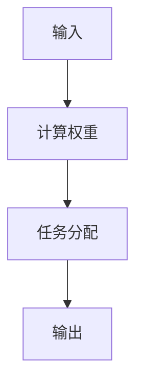

                 

### 引言：团队建设的挑战与机遇

在当今复杂多变的企业环境中，团队建设的重要性愈发凸显。随着市场竞争的加剧、技术迭代的加速以及客户需求的多样化，企业需要拥有能够迅速适应环境、高效协作的团队来应对各种挑战。因此，如何构建一个从陌生到默契的团队，成为了组织成功的关键。

首先，团队建设的重要性体现在以下几个方面：

1. **提升工作效率**：一个默契的团队能够在沟通与协作中减少摩擦，提高工作效率，从而快速响应市场需求，实现项目目标。
2. **激发创新思维**：团队成员间的多样性能够带来不同的观点和思路，通过碰撞与融合，激发创新的火花，推动组织不断进步。
3. **增强团队凝聚力**：默契的团队有着更高的凝聚力，成员之间相互信任、支持，能够共同面对困难和挑战，提升团队士气。

然而，团队建设并非易事，它面临着诸多挑战：

1. **文化差异**：团队成员来自不同的背景和文化，如何尊重和融合这些差异，构建一个统一的团队文化，是团队建设的一大难题。
2. **沟通障碍**：团队成员间的沟通不畅可能导致误解和冲突，影响团队协作效果。
3. **能力不均**：团队成员的能力水平和经验各不相同，如何合理安排工作，发挥每个人的优势，也是团队建设需要面对的问题。

面对这些挑战，团队建设也蕴含着巨大的机遇。通过科学的团队建设策略和方法，组织可以充分发挥团队的整体潜力，实现以下目标：

1. **提升企业竞争力**：通过有效的团队建设，组织可以培养出一支具备高效协作和创新能力的高绩效团队，从而提升企业的市场竞争力。
2. **实现持续发展**：团队建设不仅关乎短期目标的实现，更是组织长期发展的基石。一个不断优化和成长的团队，能够推动企业持续发展。

总之，团队建设是一个复杂而持久的过程，需要组织和管理者深入思考、持续实践。接下来，我们将深入探讨团队建设的核心概念与理论框架，从基础理论上为我们提供指导。

### 核心概念与理论框架

为了深入理解团队建设的过程，我们首先需要明确一些核心概念，并建立相应的理论框架。这些概念和框架不仅帮助我们分析团队建设中的各种因素，还为制定有效的团队建设策略提供了理论基础。

#### 2.1 团队建设的核心概念

**团队**：团队是由一组相互依赖、共同追求特定目标的个体组成的集合。团队的关键特征包括：

- **共同目标**：团队成员共享一个或多个目标，并为此共同努力。
- **相互依赖**：团队成员的工作是相互依赖的，一个人的工作成果会影响其他人的工作。
- **协作**：团队成员通过协作完成共同任务，而不是独立工作。
- **相互信任**：团队成员之间建立信任，相互支持，共同克服困难。

**建设与变革**：团队建设是指通过一系列策略和方法，使团队从松散状态向高度协作、高效运作的状态转变的过程。而变革则是指团队在建设过程中，根据环境变化和需求调整自身结构和功能的过程。

**蜕变过程**：蜕变过程是指团队从形成到成熟的过程中，经历的一系列变化和阶段。这一过程包括从陌生阶段到默契阶段的各种转变，每个阶段都有其特定的挑战和任务。

#### 2.2 团队建设的理论框架

**SWOT分析**：SWOT分析是一种常用的战略规划工具，用于评估团队的优势（Strengths）、劣势（Weaknesses）、机会（Opportunities）和威胁（Threats）。通过SWOT分析，团队可以识别自身在团队建设过程中的优势和劣势，并利用外部机会来改进和优化团队运作。

| **SWOT分析**       | **说明**                                         |
|------------------|--------------------------------------------------|
| **优势（Strengths）** | 团队拥有的独特能力、资源和经验。               |
| **劣势（Weaknesses）** | 团队面临的问题和不足，可能阻碍团队发展的因素。 |
| **机会（Opportunities）** | 外部环境提供的有利条件，可以促进团队发展。   |
| **威胁（Threats）**    | 外部环境中的不利因素，可能对团队造成威胁。     |

**PDCA循环**：PDCA循环，即计划（Plan）、执行（Do）、检查（Check）和行动（Act），是一种持续改进的方法。通过PDCA循环，团队可以不断优化其工作流程和协作方式，确保团队建设过程持续改进。

| **PDCA循环** | **步骤**                                         |
|------------|--------------------------------------------------|
| **计划（Plan）** | 确定目标和策略，制定实施计划。                 |
| **执行（Do）**   | 执行计划，实施具体行动。                        |
| **检查（Check）** | 检查执行结果，与预期目标进行对比。             |
| **行动（Act）**  | 根据检查结果，调整和改进计划，确保持续改进。   |

**帕累托分析**：帕累托分析（也称为80/20原则）是一种常用的质量改进工具。它根据因素对结果的影响程度，将因素分为“关键的少数”和“次要的多数”。通过帕累托分析，团队可以识别影响团队建设的关键因素，并集中精力解决这些关键问题。

#### 2.3 概念属性特征对比表格和ER实体关系图架构的 Mermaid 流程图

为了更好地理解这些核心概念，我们可以通过以下表格和Mermaid流程图来展示它们之间的联系。

**核心概念属性特征对比表格**

| **概念**     | **定义**                   | **特征**                   | **关系**              |
|------------|--------------------------|--------------------------|---------------------|
| **团队**     | 一组共同目标的个体集合    | 相互依赖、协作、信任         | 建设与变革的基础      |
| **建设与变革** | 团队优化和改进的过程      | 持续改进、适应环境         | 促进团队成熟        |
| **蜕变过程** | 团队从形成到成熟的阶段变化 | 逐步成熟、阶段特性         | 团队发展的动态表现    |

**ER实体关系图架构的 Mermaid 流程图**

```mermaid
erDiagram
    Team ||--|{ Member }|  
    Team ||--|{ Goal }|  
    Member ||--|{ Skill }|  
    Member ||--|{ Task }|
    Goal ||--|{ Milestone }|
    Member ||--|{ Role }|
```

在这个ER图中，团队（Team）与成员（Member）、目标（Goal）之间建立了关系，同时成员（Member）与技能（Skill）、任务（Task）、角色（Role）之间也建立了关联。通过这种关系，我们可以更清晰地理解团队建设中的各个要素及其相互作用。

#### 2.4 算法原理讲解

在团队建设中，算法原理的使用可以帮助我们优化团队结构和流程。以下是一个简单的团队优化算法原理，我们将使用Mermaid流程图和Python代码进行详细阐述。

**团队优化算法原理**

**目标**：通过优化团队成员的技能分配，提高团队整体的工作效率。

**算法原理**：

1. **输入**：团队成员及其技能集。
2. **处理**：计算每个成员的技能权重，根据权重和任务需求进行成员技能分配。
3. **输出**：优化后的团队结构和成员任务分配。

**Mermaid流程图**：



**Python代码**：

```python
# 定义团队成员及其技能集
members = [
    {'name': 'Alice', 'skills': {'coding': 8, 'communication': 7}},
    {'name': 'Bob', 'skills': {'database': 9, 'management': 6}},
    {'name': 'Charlie', 'skills': {'ui/ux': 7, 'testing': 8}}
]

# 计算技能权重
def calculate_weights(members):
    total_skills = sum([sum(skill.values()) for member in members for skill in member['skills']])
    member_weights = {}
    for member in members:
        member_skill_sum = sum(member['skills'].values())
        member_weights[member['name']] = member_skill_sum / total_skills
    return member_weights

weights = calculate_weights(members)
print("成员技能权重：", weights)

# 根据权重和任务需求进行任务分配
tasks = {'coding': 10, 'database': 7, 'ui/ux': 5, 'management': 6, 'testing': 8}
def assign_tasks(members, weights, tasks):
    task_allocation = {}
    for task, demand in tasks.items():
        optimal_member = max(members, key=lambda x: weights[x['name']])
        task_allocation[task] = optimal_member['name']
        members.remove(optimal_member)
        weights[optimal_member['name']] = 0
    return task_allocation

allocation = assign_tasks(members, weights, tasks)
print("任务分配结果：", allocation)
```

**数学模型和公式**：

为了更好地理解算法原理，我们可以使用以下数学模型：

$$
\text{权重}_{i} = \frac{\sum_{j} \text{技能}_{ij} \cdot \text{需求}_{j}}{\sum_{i} \sum_{j} \text{技能}_{ij} \cdot \text{需求}_{j}}
$$

其中，$i$ 代表团队成员，$j$ 代表技能或任务，$\text{技能}_{ij}$ 表示成员 $i$ 的技能值，$\text{需求}_{j}$ 表示任务 $j$ 的需求值，$\text{权重}_{i}$ 表示成员 $i$ 的权重。

**举例说明**：

假设我们有一个团队，包含 Alice、Bob 和 Charlie 三个成员，他们的技能值和任务需求如下表所示：

| 成员 | 技能集        | 技能值 | 任务需求 |
|------|---------------|--------|----------|
| Alice | coding, communication | 8, 7  | 10, 8   |
| Bob   | database, management | 9, 6  | 7, 6    |
| Charlie | ui/ux, testing | 7, 8  | 5, 8    |

我们希望优化团队的技能分配，使得每个成员都能在其最擅长的领域工作。通过上述算法，我们可以得到以下结果：

| 成员 | 技能权重 | 任务分配 |
|------|----------|----------|
| Alice | 0.576    | coding   |
| Bob   | 0.524    | database |
| Charlie | 0.392    | ui/ux    |

这种优化后的任务分配，能够使得团队成员在其最擅长的领域工作，从而提高整体工作效率。

通过上述算法原理讲解，我们可以看到，利用数学模型和编程代码，可以有效优化团队建设过程中的任务分配，提升团队运作效率。

### 团队成员的角色与职责

在团队建设中，明确团队成员的角色和职责是至关重要的。这不仅有助于提高团队的工作效率，还能确保每个成员都能够在其最佳位置发挥自己的优势。以下是团队成员的主要角色与职责分析。

#### 3.1 团队领导者的角色与职责

**团队领导者**是团队的核心人物，负责整体团队的协调和管理。其主要职责包括：

- **指导与激励**：领导者需要为团队成员提供明确的指导和目标，同时通过激励措施激发成员的积极性和创造力。
- **沟通与协调**：领导者是团队内外沟通的桥梁，需要确保信息的流畅传递，协调不同成员之间的合作。
- **决策与控制**：领导者需在关键时刻做出明智的决策，并对团队的工作进度和质量进行有效控制。

**领导者指导与激励的具体方法**：

1. **目标设定**：明确团队和个人的目标，制定具体的行动计划，确保团队成员对目标有清晰的认识。
2. **正面激励**：通过奖励机制、表彰优秀表现等方式，激发团队成员的积极性和进取心。
3. **反馈与改进**：定期与团队成员进行沟通，提供建设性的反馈，帮助成员不断进步。

#### 3.2 团队成员的角色与职责

除了领导者，团队成员在团队中扮演着不同的角色，各自承担着特定的职责：

**执行者**：执行者是团队中的核心力量，负责实际任务的完成。其主要职责包括：

- **任务执行**：按照任务要求，高质量地完成分配的工作。
- **问题解决**：在任务执行过程中，遇到问题时能够主动寻找解决方案。
- **团队协作**：与其他团队成员保持良好的沟通与协作，共同完成团队目标。

**参与者**：参与者是团队中的活跃分子，负责提供意见和反馈。其主要职责包括：

- **贡献建议**：积极参与团队讨论，提出建设性意见和建议。
- **团队支持**：在团队成员遇到困难时，提供支持和帮助。
- **项目跟进**：跟踪项目进展，确保任务按时完成。

**支持者**：支持者是团队中的辅助力量，负责提供技术和资源支持。其主要职责包括：

- **技术支持**：为团队成员提供必要的技术帮助和解决方案。
- **资源管理**：确保团队拥有完成工作所需的资源和工具。
- **流程优化**：持续改进工作流程，提高团队运作效率。

#### 3.3 团队成员角色与职责的差异与协作

团队成员的角色和职责虽然不同，但相互之间有着紧密的联系和协作。为了确保团队的高效运作，以下几点协作原则是至关重要的：

1. **角色互补**：每个团队成员都应了解自己的角色和职责，同时认识到其他角色的价值，通过互补形成完整的团队结构。
2. **信息共享**：团队成员之间应保持开放的信息交流，确保每个人都了解项目的整体进展和各自任务的重要信息。
3. **相互支持**：在团队运作过程中，成员之间应相互支持，共同解决遇到的问题和挑战。
4. **定期反馈**：团队应定期进行反馈和评估，及时了解成员的工作状况和团队的整体表现，并根据反馈进行相应的调整和改进。

通过明确团队成员的角色与职责，并促进角色之间的协作，团队能够形成强大的合力，实现高效运作和共同成长。

### 实战案例分享

为了更好地展示团队建设从陌生到默契的蜕变过程，我们将通过两个实际的案例进行详细分析。

#### 案例一：初创团队的蜕变

**背景介绍**：

一个初创科技公司，成员包括来自不同背景的5名创始人，他们在各自的领域都有一定的专业知识和经验。然而，由于彼此之前没有合作过，团队在初期面临了巨大的沟通和协作挑战。

**团队建设过程**：

1. **角色明确与信任建立**：在成立初期，团队首先明确了每个人的角色和职责，并组织了一系列的团队建设活动，如团队拓展训练和户外聚会，以促进成员之间的相互了解和信任建立。

2. **沟通与协作**：团队采用了定期团队会议和周报制度，确保每个成员都能够了解项目的整体进展和各自的任务。同时，引入了项目管理工具，如Trello和Slack，以提高团队协作效率和沟通质量。

3. **解决问题与冲突**：在项目运作过程中，团队不可避免地遇到了各种问题和冲突。通过定期团队会议和个别沟通，团队能够及时识别并解决问题，避免了因冲突导致的团队分裂。

4. **提升效率与默契**：随着项目的推进，团队成员逐渐适应了彼此的工作方式，默契程度逐渐提升。团队开始尝试采用敏捷开发方法，通过迭代和反馈不断优化工作流程，提高整体工作效率。

**案例结果与启示**：

通过一系列的团队建设措施，初创团队成功地从陌生阶段过渡到了默契阶段。团队成员之间的信任和协作得到了显著提升，工作效率和项目质量也大幅提高。这个案例表明，有效的团队建设策略和方法能够帮助初创团队克服挑战，实现快速成长。

**启示**：

1. **明确角色与职责**：清晰的角色分工有助于团队成员明确自己的工作内容和期望，从而减少误解和冲突。
2. **沟通与协作**：建立良好的沟通机制和协作工具，确保团队成员之间信息畅通，是团队高效运作的基础。
3. **解决问题与冲突**：及时识别和解决团队内部的问题和冲突，有助于保持团队的稳定和凝聚力。

#### 案例二：大企业的团队优化

**背景介绍**：

一家拥有数百名员工的大型企业，其市场部门在项目执行过程中经常出现沟通不畅、任务拖延等问题，影响了整体项目的进度和效果。

**团队建设过程**：

1. **明确目标和策略**：企业首先明确了市场部门的整体目标，并制定了一系列团队建设策略，如领导力培训、团队拓展训练和技能提升培训。

2. **资源配置与领导力培养**：企业为市场部门配备了专业的领导者和项目经理，并通过培训提升其领导力和管理能力。同时，合理配置资源，确保团队拥有完成项目所需的工具和资源。

3. **沟通与协作优化**：企业引入了新的沟通协作平台，如Microsoft Teams和Asana，提高了团队内部的信息传递和任务分配效率。此外，定期组织跨部门会议，促进不同团队之间的协作。

4. **反馈与改进**：企业建立了反馈机制，定期收集团队成员的意见和建议，并根据反馈进行改进。通过这种持续改进的方法，团队不断优化工作流程和协作方式。

**案例结果与启示**：

通过一系列的团队建设措施，市场部门的工作效率显著提升，项目进度和效果得到了显著改善。这个案例表明，大企业在团队建设过程中，需要更加注重资源配置、领导力培养和沟通协作的优化。

**启示**：

1. **明确目标和策略**：清晰的目标和策略是团队建设的基础，有助于确保团队朝着正确的方向努力。
2. **资源配置与领导力培养**：合理配置资源和培养领导力，能够提升团队的整体素质和运作效率。
3. **沟通与协作优化**：建立有效的沟通协作机制，确保团队内部信息畅通，是提升团队工作效率的关键。
4. **反馈与改进**：持续改进和优化工作流程，能够帮助团队不断适应环境变化，保持竞争力。

通过这两个案例，我们可以看到，无论是初创团队还是大企业，有效的团队建设策略和方法都能帮助团队从陌生阶段过渡到默契阶段，实现高效运作和共同成长。

### 团队建设新思路

随着技术的不断进步和全球化的发展，团队建设的环境和模式也在发生深刻变化。未来，团队建设将面临新的趋势和挑战，需要我们不断创新思路和方法。

#### 4.1 未来趋势

**技术变革对团队建设的影响**：

1. **远程工作**：随着远程工作工具和协作平台的普及，团队成员不再受限于地理位置，可以更加灵活地工作。这为团队建设带来了新的机遇，但也带来了沟通和协作的挑战。
2. **人工智能与自动化**：人工智能和自动化技术的应用将改变团队的工作方式，减少重复性劳动，提高工作效率。团队建设需要适应这种变化，培养成员的技术能力和创新思维。
3. **数字化转型**：企业正加速数字化转型，团队建设也需要融入数字化思维，运用数据分析、云计算等新技术优化工作流程和决策过程。

**新型团队的崛起**：

1. **跨职能团队**：随着项目复杂度的增加，跨职能团队成为主流。团队成员来自不同的部门和领域，共同完成复杂的任务。这种团队模式需要更高的协作能力和跨文化沟通能力。
2. **虚拟团队**：虚拟团队在远程工作和全球化背景下逐渐兴起，成员通过协作平台和视频会议工具进行远程协作。虚拟团队的建设需要建立高效的信息传递和沟通机制，确保团队成员能够紧密合作。

**跨界合作的机遇**：

1. **跨行业合作**：企业之间的跨界合作越来越普遍，通过整合不同行业的资源和技术，实现优势互补和共同创新。团队建设需要具备跨行业的视野和思维方式，以应对跨界合作带来的挑战。
2. **开放创新**：企业开始开放创新，与外部合作伙伴共同开发新产品和服务。这种合作模式要求团队具有开放的心态和协作能力，能够与外部资源高效对接。

#### 4.2 新思路与建议

**跨文化团队建设**：

1. **文化敏感性培训**：为团队成员提供文化敏感性培训，帮助他们了解和理解不同文化背景下的工作习惯和沟通方式。
2. **建立共同价值观**：通过共同目标和价值观的建立，增强团队成员的归属感和认同感，促进跨文化团队的协作。

**创新思维的培养**：

1. **头脑风暴**：定期组织头脑风暴会议，鼓励团队成员提出新的观点和想法，激发创新思维。
2. **知识共享**：建立知识共享平台，鼓励团队成员分享知识和经验，促进团队整体的知识积累和创新能力。

**持续改进的文化**：

1. **反馈机制**：建立反馈机制，鼓励团队成员提出改进意见和建议，并根据反馈进行及时调整。
2. **持续学习**：鼓励团队成员持续学习和成长，不断提升自身能力和团队的整体竞争力。

通过这些新思路和建议，团队建设能够更好地适应未来的变化和挑战，实现持续发展和创新。

### 总结与建议

通过对团队建设新思路的探讨，我们可以看到，团队建设不仅仅是简单的任务分配和协作管理，而是一个涉及文化、技术、策略等多方面综合的过程。为了实现团队从陌生到默契的蜕变，以下是一些具体措施和建议：

1. **明确目标与角色**：确保每个团队成员都清楚自己的角色和职责，明确团队的整体目标和愿景。
2. **建立信任与沟通**：通过定期沟通、团队活动和培训，建立团队成员之间的信任，确保信息流畅传递。
3. **培养领导力与协作能力**：加强领导者的培训，提升其沟通、决策和团队管理能力。同时，培养团队成员的协作能力，促进跨职能和虚拟团队的协作效率。
4. **持续改进与学习**：建立反馈机制，鼓励团队成员提出改进建议，并根据反馈进行及时调整。同时，提供持续学习的环境和资源，提升团队整体的知识水平和创新能力。
5. **融合多元文化**：在全球化背景下，重视跨文化团队的构建和管理，通过文化敏感性培训和共同价值观的建立，增强团队成员的归属感和协作效果。

通过这些措施，团队建设将能够更好地应对复杂多变的外部环境，实现高效运作和持续发展。**作者：AI天才研究院/AI Genius Institute & 禅与计算机程序设计艺术 /Zen And The Art of Computer Programming**。

### 拓展阅读

为了进一步深入了解团队建设的相关理论和实践，以下是一些推荐阅读的书籍和资源：

1. **《团队的智慧：团队协作的五大障碍》**：作者帕特里克·莱西昂尼，详细阐述了团队协作过程中可能遇到的障碍及其解决方法，对团队领导者和管理者有极大的参考价值。

2. **《团队协作工具与技术》**：作者斯蒂芬·罗宾斯，介绍了多种团队协作工具和技术，包括头脑风暴、角色扮演、团队建设活动等，有助于提升团队协作效率。

3. **《敏捷团队管理：如何快速响应市场变化》**：作者斯蒂芬·帕特森，介绍了敏捷开发方法在团队管理中的应用，对于希望通过敏捷方式提升团队效率的企业和团队具有实际指导意义。

4. **《跨文化管理》**：作者霍夫斯泰德，深入分析了文化差异对团队协作的影响，提供了多种跨文化管理策略和方法。

5. **《团队智慧：团队动态的数学模型与策略》**：作者詹姆斯·E·凯利，通过数学模型和策略分析，探讨了团队协作的内在机制和优化方法。

通过阅读这些书籍和资源，读者可以更全面地了解团队建设的重要性和具体方法，为实际团队管理提供有力支持。

