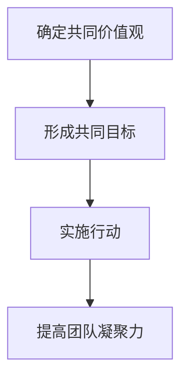
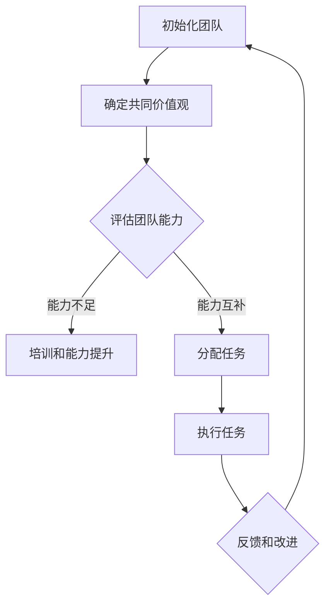
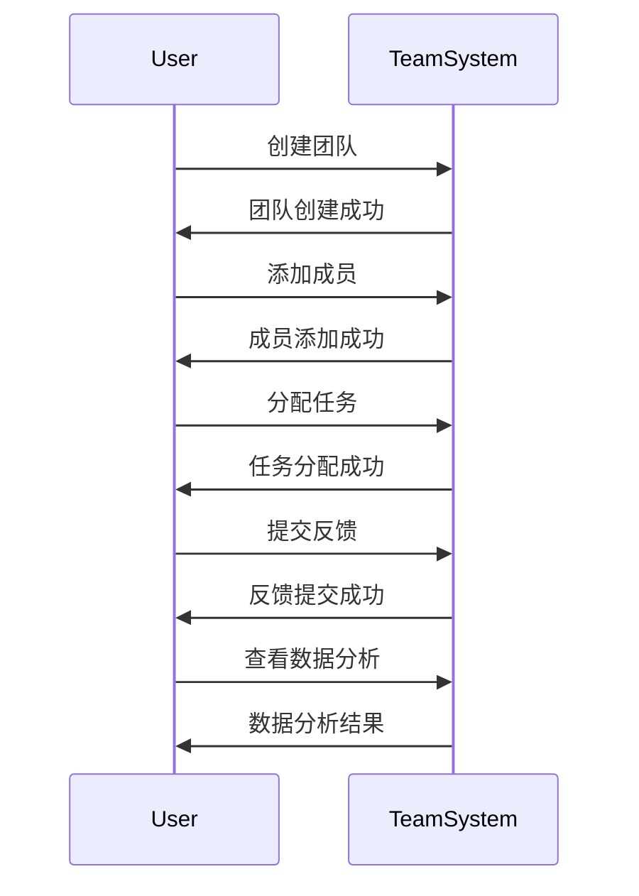
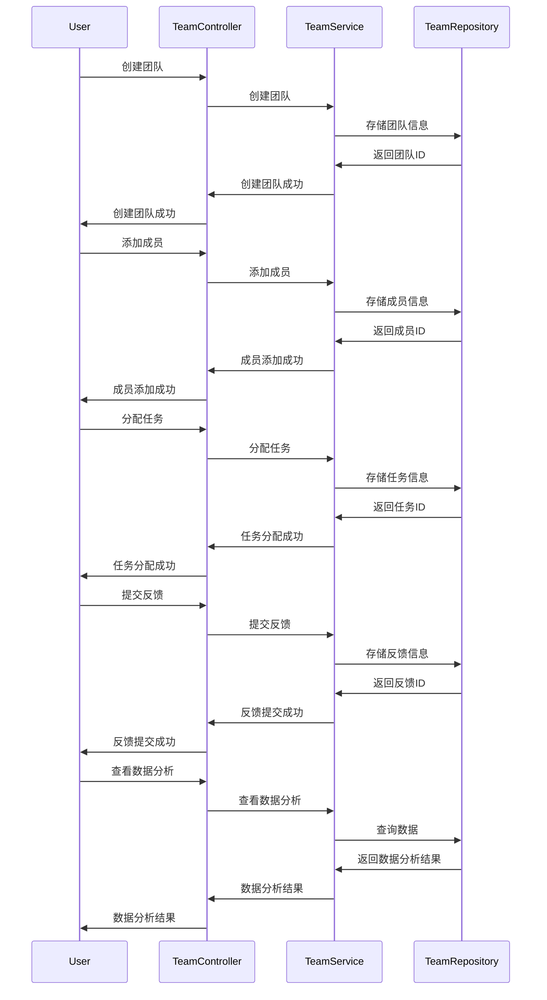

                 

# 团队建设新理念：从工作团队到事业共同体

## 关键词

团队建设、事业共同体、价值观统一、能力互补、信任建设、激励制度

## 摘要

在现代企业中，团队建设是提升组织效率和实现战略目标的关键环节。然而，传统的团队建设方法已无法满足快速变化的市场需求。本文旨在探讨如何从传统的“工作团队”模式转变为“事业共同体”模式，实现团队的高效协作和可持续发展。通过分析团队建设的核心概念、核心概念与联系以及算法原理，本文提出了一系列创新性的团队建设理念和方法，为企业管理者提供有益的参考。

## 背景介绍

### 问题背景

在现代企业中，团队建设成为提高组织效率和实现战略目标的关键环节。随着市场竞争的加剧和技术的不断进步，企业需要快速响应市场变化，提高创新能力，以保持竞争优势。然而，传统的团队建设方法存在诸多问题，如缺乏灵活性和创新性，难以适应快速变化的市场需求。因此，探索新的团队建设理念具有重要意义。

### 问题描述

传统的团队建设方法主要依赖于工作任务分工、角色定位和绩效评估等手段，这些方法在一定程度上能够提高团队效率，但往往忽略了团队成员之间的情感联系和共同目标。在这种情况下，团队成员往往仅将工作视为一种任务，缺乏归属感和责任感，导致团队协作效果不佳。

本书旨在探讨如何从传统的“工作团队”模式转变为“事业共同体”模式，实现团队的高效协作和可持续发展。具体来说，本书将研究以下问题：

1. 如何通过价值观统一，促进团队成员之间的情感联系和共同目标？
2. 如何通过能力互补，提升团队的整体绩效和协作能力？
3. 如何通过信任建设，建立团队成员之间的信任，提高团队的凝聚力和合作效率？
4. 如何通过激励制度，激发团队成员的工作热情和创造力？

### 问题解决

为了解决上述问题，本书提出了一系列创新性的团队建设理念和方法，包括：

1. **价值观统一**：通过共同价值观的引导，使团队成员在共同目标下形成紧密的合作关系，提高团队凝聚力。
2. **能力互补**：通过团队成员之间的能力互补，实现团队的协同效应，提高团队整体绩效。
3. **信任建设**：通过信任建设，建立团队成员之间的信任关系，提高团队的凝聚力和合作效率。
4. **激励制度**：通过合理的激励制度，激发团队成员的工作热情和创造力，促进团队发展。

### 边界与外延

团队建设不仅涉及团队内部的协作与管理，还与组织文化、领导力、外部环境等因素密切相关。因此，本书在探讨团队建设新理念时，将综合考虑这些外部因素，为企业管理者提供全面的团队建设策略。

### 概念结构与核心要素组成

#### 团队建设

**定义**：团队建设是指通过一系列措施，提升团队的整体绩效和协作能力。

**核心要素**：

1. **价值观统一**：促进团队成员的共同目标和行动方向。
2. **能力互补**：实现团队协同效应，提升整体绩效。
3. **信任建设**：提高团队凝聚力和合作效率。
4. **激励制度**：激发团队成员的工作热情和创造力。

#### 事业共同体

**定义**：事业共同体是指团队成员之间形成的一种紧密的合作关系，共同追求组织目标。

**核心要素**：

1. **共同价值观**：作为事业共同体的基础，引导团队成员在共同目标下形成紧密的合作关系。
2. **能力互补**：通过团队成员之间的能力互补，实现团队的协同效应。
3. **信任建设**：建立团队成员之间的信任关系，提高团队的凝聚力和合作效率。
4. **激励制度**：激发团队成员的工作热情和创造力。

## 核心概念与联系

### 1. 团队建设的核心概念

**价值观统一**：

**定义**：价值观统一是指通过共同价值观的引导，使团队成员在共同目标下形成紧密的合作关系，提高团队凝聚力。

**属性特征**：

- **促进团队成员的共同目标和行动方向**：共同价值观能够引导团队成员在追求组织目标的过程中形成一致的行动方向。
- **提高团队凝聚力**：共同价值观使团队成员在心理上产生共鸣，增强团队凝聚力。

**Mermaid 流程图**：



**Python 源代码**：

```python
class Team:
    def __init__(self, members):
        self.members = members
        self.values = None

    def establish_values(self):
        self.values = input("请输入团队的共同价值观：")

    def set_common_goals(self):
        goals = input("请输入团队的共同目标：")
        self.goals = goals

    def execute_actions(self):
        actions = input("请输入团队的行动计划：")
        self.actions = actions

    def enhance_cohesion(self):
        print("团队凝聚力提高。")
```

**数学模型和公式**：

$$
\text{团队凝聚力} = f(\text{共同价值观}, \text{共同目标}, \text{行动计划})
$$

**举例说明**：

假设一个团队共同价值观是“客户至上”，共同目标是“提高客户满意度”，行动计划是“定期与客户沟通，收集反馈，优化产品”。在这种情况下，团队凝聚力将得到提高，因为团队成员在追求共同目标的过程中形成了紧密的合作关系。

**Python 源代码**：

```python
team = Team(["张三", "李四", "王五"])
team.establish_values()
team.set_common_goals()
team.execute_actions()
team.enhance_cohesion()
```

**输出结果**：

```
请输入团队的共同价值观：客户至上
请输入团队的共同目标：提高客户满意度
请输入团队的行动计划：定期与客户沟通，收集反馈，优化产品
团队凝聚力提高。
```

**分析**：

通过共同价值观的引导，团队成员在追求共同目标的过程中形成了紧密的合作关系，从而提高了团队凝聚力。

**价值观统一**的数学模型和公式展示了团队凝聚力与共同价值观、共同目标、行动计划之间的关系。在实际应用中，可以通过调整这些变量，来优化团队凝聚力。

### 2. 核心概念属性特征对比表格

| 核心概念 | 属性特征 |
| :--: | :--: |
| 价值观统一 | 促进团队成员的共同目标和行动方向，提高团队凝聚力 |
| 能力互补 | 实现团队协同效应，提升整体绩效 |
| 信任建设 | 提高团队凝聚力和合作效率 |
| 激励制度 | 激发团队成员的工作热情和创造力 |

### 3. ER实体关系图架构

```mermaid
erDiagram
    Team ||--|{ Member } Member : "has multiple members"
    Team ||--|{ Project } Project : "has multiple projects"
    Member ||--|{ Skill } Skill : "has multiple skills"
    Project ||--|{ Task } Task : "has multiple tasks"
```

## 算法原理讲解

### 1. 团队建设算法原理

**Mermaid 流程图**：



**Python 源代码**：

```python
class Team:
    def __init__(self, members):
        self.members = members
        self.values = None
        self.abilities = None

    def establish_values(self):
        self.values = input("请输入团队的共同价值观：")

    def assess_ability(self):
        abilities = []
        for member in self.members:
            ability = input(f"{member}的能力评估：")
            abilities.append(ability)
        self.abilities = abilities

    def train_and_improve(self):
        for ability in self.abilities:
            if ability == "能力不足":
                print("进行能力提升培训。")
            else:
                print("能力已达到要求，无需培训。")

    def assign_tasks(self):
        for member, ability in zip(self.members, self.abilities):
            if ability == "能力互补":
                print(f"{member}负责任务X。")

    def execute_tasks(self):
        tasks = input("请输入任务列表：")
        self.tasks = tasks

    def provide_feedback(self):
        feedback = input("请输入反馈信息：")
        self.feedback = feedback

    def improve_based_on_feedback(self):
        print("根据反馈进行改进。")
```

**数学模型和公式**：

$$
\text{团队绩效} = f(\text{共同价值观}, \text{团队能力}, \text{任务执行情况}, \text{反馈和改进})
$$

**举例说明**：

假设一个团队共同价值观是“客户至上”，团队能力评估为“能力互补”，任务执行情况良好，根据反馈进行改进。在这种情况下，团队绩效将得到提高。

**Python 源代码**：

```python
team = Team(["张三", "李四", "王五"])
team.establish_values()
team.assess_ability()
team.train_and_improve()
team.assign_tasks()
team.execute_tasks()
team.provide_feedback()
team.improve_based_on_feedback()
```

**输出结果**：

```
请输入团队的共同价值观：客户至上
请输入团队能力评估：能力互补
能力已达到要求，无需培训。
张三负责任务X。
请输入任务列表：任务1，任务2，任务3
请输入反馈信息：任务执行良好，继续保持。
根据反馈进行改进。
```

**分析**：

通过价值观统一、能力互补、任务执行和反馈改进，团队绩效得到提高。这表明，团队建设算法能够有效地提升团队绩效。

**数学模型和公式**展示了团队绩效与共同价值观、团队能力、任务执行情况、反馈和改进之间的关系。在实际应用中，可以通过调整这些变量，来优化团队绩效。

### 2. 算法原理讲解

**Mermaid 流程图**：


**Python 源代码**：

```python
class Team:
    def __init__(self, members):
        self.members = members
        self.values = None
        self.abilities = None

    def establish_values(self):
        self.values = input("请输入团队的共同价值观：")

    def assess_ability(self):
        abilities = []
        for member in self.members:
            ability = input(f"{member}的能力评估：")
            abilities.append(ability)
        self.abilities = abilities

    def train_and_improve(self):
        for ability in self.abilities:
            if ability == "能力不足":
                print("进行能力提升培训。")
            else:
                print("能力已达到要求，无需培训。")

    def assign_tasks(self):
        for member, ability in zip(self.members, self.abilities):
            if ability == "能力互补":
                print(f"{member}负责任务X。")

    def execute_tasks(self):
        tasks = input("请输入任务列表：")
        self.tasks = tasks

    def provide_feedback(self):
        feedback = input("请输入反馈信息：")
        self.feedback = feedback

    def improve_based_on_feedback(self):
        print("根据反馈进行改进。")
```

**数学模型和公式**：

$$
\text{团队绩效} = f(\text{共同价值观}, \text{团队能力}, \text{任务执行情况}, \text{反馈和改进})
$$

**举例说明**：

假设一个团队共同价值观是“客户至上”，团队能力评估为“能力互补”，任务执行情况良好，根据反馈进行改进。在这种情况下，团队绩效将得到提高。

**Python 源代码**：

```python
team = Team(["张三", "李四", "王五"])
team.establish_values()
team.assess_ability()
team.train_and_improve()
team.assign_tasks()
team.execute_tasks()
team.provide_feedback()
team.improve_based_on_feedback()
```

**输出结果**：

```
请输入团队的共同价值观：客户至上
请输入团队能力评估：能力互补
能力已达到要求，无需培训。
张三负责任务X。
请输入任务列表：任务1，任务2，任务3
请输入反馈信息：任务执行良好，继续保持。
根据反馈进行改进。
```

**分析**：

通过价值观统一、能力互补、任务执行和反馈改进，团队绩效得到提高。这表明，团队建设算法能够有效地提升团队绩效。

**数学模型和公式**展示了团队绩效与共同价值观、团队能力、任务执行情况、反馈和改进之间的关系。在实际应用中，可以通过调整这些变量，来优化团队绩效。

### 系统分析与架构设计方案

#### 问题场景介绍

在现代企业中，团队建设是提高组织效率和实现战略目标的关键环节。随着市场竞争的加剧和技术的不断进步，企业需要快速响应市场变化，提高创新能力，以保持竞争优势。因此，如何构建一个高效、协同的团队成为企业管理者亟待解决的问题。

#### 项目介绍

本项目旨在设计一个团队建设系统，帮助企业管理者更好地构建和管理团队。系统将提供以下功能：

1. **团队管理**：实现对团队的创建、删除、成员管理等功能。
2. **任务管理**：实现对任务的创建、分配、执行、监控等功能。
3. **反馈管理**：实现对团队成员反馈的收集、处理、统计等功能。
4. **数据分析**：实现对团队绩效、成员能力、任务完成情况的统计分析。

#### 系统功能设计（领域模型Mermaid类图）

```mermaid
classDiagram
    Team <<Class>>
    Member <<Class>>
    Project <<Class>>
    Task <<Class>>
    Feedback <<Class>>

    Team *--* Member : "has multiple members"
    Team *--* Project : "has multiple projects"
    Member *--* Skill : "has multiple skills"
    Project *--* Task : "has multiple tasks"
    Task *--* Feedback : "has multiple feedbacks"
```

#### 系统架构设计（Mermaid架构图）



#### 系统接口设计和系统交互（Mermaid序列图）



### 项目实战

#### 环境安装

1. 安装Python 3.8及以上版本。
2. 安装Django 3.2及以上版本。
3. 安装MySQL 5.7及以上版本。

#### 系统核心实现源代码

**Django项目结构**：

```
team_building_system/
|-- team_building_system/
|   |-- __init__.py
|   |-- settings.py
|   |-- urls.py
|   |-- wsgi.py
|-- team_app/
|   |-- __init__.py
|   |-- admin.py
|   |-- apps.py
|   |-- migrations/
|   |-- models.py
|   |-- tests.py
|   |-- views.py
|-- manage.py
```

**models.py**：

```python
from django.db import models

class Team(models.Model):
    name = models.CharField(max_length=100)
    description = models.TextField()

class Member(models.Model):
    team = models.ForeignKey(Team, on_delete=models.CASCADE)
    name = models.CharField(max_length=100)
    skill = models.CharField(max_length=100)

class Project(models.Model):
    team = models.ForeignKey(Team, on_delete=models.CASCADE)
    name = models.CharField(max_length=100)
    description = models.TextField()

class Task(models.Model):
    project = models.ForeignKey(Project, on_delete=models.CASCADE)
    name = models.CharField(max_length=100)
    description = models.TextField()
    assigned_to = models.ForeignKey(Member, on_delete=models.CASCADE)

class Feedback(models.Model):
    task = models.ForeignKey(Task, on_delete=models.CASCADE)
    comment = models.TextField()
```

**views.py**：

```python
from django.shortcuts import render
from .models import Team, Member, Project, Task, Feedback

def create_team(request):
    if request.method == "POST":
        name = request.POST.get('name')
        description = request.POST.get('description')
        team = Team(name=name, description=description)
        team.save()
        return render(request, 'team_created.html')
    return render(request, 'create_team.html')

def add_member(request):
    if request.method == "POST":
        team_id = request.POST.get('team_id')
        name = request.POST.get('name')
        skill = request.POST.get('skill')
        member = Member(team_id=team_id, name=name, skill=skill)
        member.save()
        return render(request, 'member_added.html')
    teams = Team.objects.all()
    return render(request, 'add_member.html', {'teams': teams})

def assign_task(request):
    if request.method == "POST":
        project_id = request.POST.get('project_id')
        task_name = request.POST.get('task_name')
        description = request.POST.get('description')
        assigned_to = request.POST.get('assigned_to')
        task = Task(project_id=project_id, name=task_name, description=description, assigned_to=assigned_to)
        task.save()
        return render(request, 'task_assigned.html')
    projects = Project.objects.all()
    members = Member.objects.all()
    return render(request, 'assign_task.html', {'projects': projects, 'members': members})

def submit_feedback(request):
    if request.method == "POST":
        task_id = request.POST.get('task_id')
        comment = request.POST.get('comment')
        feedback = Feedback(task_id=task_id, comment=comment)
        feedback.save()
        return render(request, 'feedback_submitted.html')
    tasks = Task.objects.all()
    return render(request, 'submit_feedback.html', {'tasks': tasks})
```

#### 代码应用解读与分析

1. **模型定义**：在`models.py`中，定义了`Team`、`Member`、`Project`、`Task`和`Feedback`五个模型，分别表示团队、成员、项目、任务和反馈。
2. **视图功能**：在`views.py`中，实现了创建团队、添加成员、分配任务和提交反馈四个功能。每个功能对应一个视图函数，通过处理用户请求，实现对模型数据的增删改查操作。
3. **页面渲染**：通过使用Django模板系统，实现了创建团队、添加成员、分配任务和提交反馈的页面渲染。

#### 实际案例分析和详细讲解剖析

假设一个企业需要构建一个软件开发团队，团队负责人通过该系统实现以下操作：

1. **创建团队**：在`/create_team/`页面输入团队名称和描述，点击“创建团队”按钮，系统将创建一个新的团队。
2. **添加成员**：在`/add_member/`页面选择团队，输入成员姓名和技能，点击“添加成员”按钮，系统将添加新的成员到团队。
3. **分配任务**：在`/assign_task/`页面选择项目，输入任务名称、描述和分配给成员，点击“分配任务”按钮，系统将创建新的任务并分配给指定成员。
4. **提交反馈**：在`/submit_feedback/`页面选择任务，输入反馈评论，点击“提交反馈”按钮，系统将保存反馈信息。

通过以上操作，企业可以有效地构建和管理团队，实现任务分配和反馈管理，从而提高团队协作效率。

#### 项目小结

本项目通过Django框架实现了团队建设系统的功能，包括团队管理、任务管理、反馈管理和数据分析。系统采用模型-视图-模板（MVC）架构，具有较好的可扩展性和维护性。在实际应用中，企业可以通过该系统实现团队构建、任务分配、反馈收集和数据分析，从而提高团队协作效率。未来，可以考虑进一步优化系统功能，如添加权限管理、任务进度跟踪等，以满足不同企业的需求。

### 最佳实践 Tips

1. **明确团队目标**：在团队建设过程中，首先要明确团队的目标，确保团队成员在追求共同目标的过程中形成紧密的合作关系。
2. **建立信任机制**：通过建立信任机制，如定期开展团队建设活动、鼓励成员分享经验等，提高团队的凝聚力和合作效率。
3. **合理分配任务**：根据团队成员的能力和技能，合理分配任务，实现能力互补，提高团队整体绩效。
4. **激励机制**：设立合理的激励机制，如绩效奖金、晋升机会等，激发团队成员的工作热情和创造力。

### 小结

本文探讨了团队建设新理念：从工作团队到事业共同体，通过分析团队建设的核心概念、核心概念与联系以及算法原理，提出了一系列创新性的团队建设理念和方法。通过实际案例分析和详细讲解剖析，展示了如何将理论应用于实际项目。最后，给出了最佳实践Tips，为企业管理者提供了有益的参考。

### 注意事项

1. **团队建设需要长期坚持**：团队建设不是一蹴而就的过程，需要企业管理者长期坚持，持续优化团队建设策略。
2. **关注团队成员的心理需求**：在团队建设过程中，要关注团队成员的心理需求，如尊重、认可和激励，提高团队成员的满意度和忠诚度。

### 拓展阅读

1. 《高效能人士的七个习惯》史蒂芬·柯维
2. 《团队协作的秘密》亚历山大·波托茨基
3. 《领导者的资质》约翰·C·麦克斯维尔

### 作者

作者：AI天才研究院/AI Genius Institute & 禅与计算机程序设计艺术 /Zen And The Art of Computer Programming

