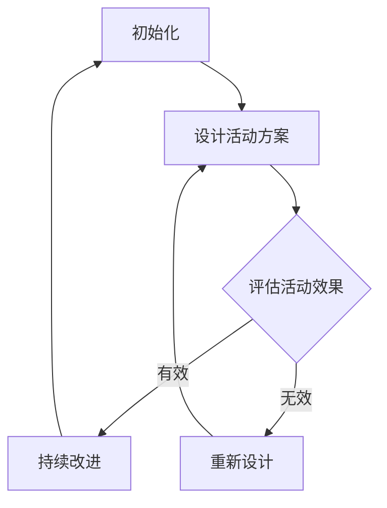
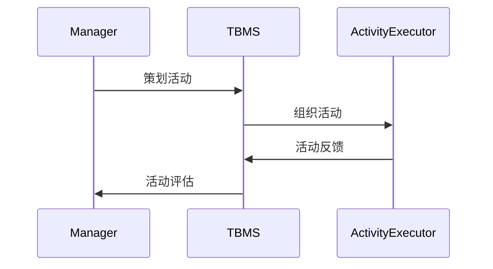

                 


# 团队建设活动：增进凝聚力的创新方法

> 关键词：团队建设、团队凝聚力、团队协作、沟通、创新方法

> 摘要：本文旨在探讨如何通过创新的团队建设活动，有效增进团队凝聚力。文章将详细分析团队建设的核心概念、算法原理，并提供实用的系统架构设计方案和项目实战案例，旨在为企业管理者提供实操指导。

## 第一部分：背景介绍

在当今快速变化和竞争激烈的市场环境中，团队建设活动已成为企业管理中不可或缺的一部分。这些活动不仅有助于提升团队凝聚力，还能促进团队成员之间的有效沟通和协作。因此，理解团队建设活动的核心概念和如何实施创新方法至关重要。

### 核心概念

**团队凝聚力**是指团队成员之间的相互吸引力和相互依赖程度。它包括信任、尊重、支持等要素。团队凝聚力是团队协作和沟通的基石。

**团队协作**是团队成员共同完成任务的过程，需要良好的沟通和协调。协作使得团队能够高效地实现共同目标。

**团队沟通**是团队成员之间交换信息、观点和感受的过程。有效的沟通是团队成功的关键。

### 问题背景

随着企业规模的扩大和员工多样性的增加，传统的团队建设方法已无法满足现代企业的需求。因此，寻找创新、实用的团队建设方法成为企业管理者面临的重要课题。

### 问题描述

团队建设活动的目的在于通过一系列有计划、有组织的活动，提升团队成员之间的沟通、协作和信任，从而增强团队的整体凝聚力和工作效率。

### 问题解决

本文将介绍一系列创新的团队建设方法，包括：

1. 户外拓展活动：通过挑战性任务和团队合作，增强团队成员之间的信任和协作能力。
2. 团队游戏：通过互动游戏和团队竞赛，提升团队成员的沟通技巧和团队精神。
3. 主题工作坊：通过深入探讨团队面临的问题和挑战，促进团队成员之间的互动和合作。

### 边界与外延

团队建设活动不仅限于传统的团队游戏和外出活动，还包括一系列有助于增强团队凝聚力的创新方法，如虚拟现实体验、团队文化建设等。

### 概念结构与核心要素组成

1. **团队建设活动类型**：包括户外拓展、团队游戏、主题工作坊等。
2. **活动目标**：增进团队沟通、协作和信任。
3. **活动设计原则**：创新、实用、针对性。
4. **活动实施过程**：策划、组织、执行、评估。

## 第二部分：核心概念与联系

### 核心概念原理

1. **团队凝聚力**：团队成员之间的相互吸引力，包括信任、尊重、支持等。
2. **团队协作**：团队成员共同完成任务的过程，需要良好的沟通和协调。
3. **团队沟通**：团队成员之间交换信息、观点和感受的过程。

### 概念属性特征对比表格

| 概念       | 属性特征                           | 关联概念                  |
|------------|-----------------------------------|-------------------------|
| 团队凝聚力 | 高度一致性、紧密联系、共同目标   | 团队协作、团队沟通       |
| 团队协作   | 信息共享、协同工作、共同目标     | 团队建设活动、团队凝聚力 |
| 团队沟通   | 透明性、及时性、有效性           | 团队建设活动、团队协作   |

### ER实体关系图架构

```mermaid
erDiagram
  Activity --> Team_member : 进行活动
  Activity ||--|{ 活动评估 }||> Assessment
  Team_member ||--|{ 个人表现 }||> Performance
  Assessment ||--|{ 绩效反馈 }||> Feedback
  Performance ||--|{ 成长记录 }||> Record
```

## 第三部分：算法原理讲解

### 算法Mermaid流程图



### Python源代码

```python
# Python代码示例：团队建设活动评估

def evaluate_activity(effectiveness):
    if effectiveness >= 4:
        print("活动效果良好，持续改进！")
    else:
        print("活动效果不佳，需要重新设计！")

# 用户输入活动效果评分
score = float(input("请输入活动效果评分（1-5分）："))

# 评估活动效果
evaluate_activity(score)
```

### 算法原理的数学模型和公式

$$
E = \frac{1}{N} \sum_{i=1}^{N} P_i
$$

其中，\( E \) 为整体活动效果评分，\( N \) 为参与活动的人数，\( P_i \) 为第 \( i \) 个团队成员的活动效果评分。

### 详细讲解和举例说明

**讲解：** 该算法通过收集每个团队成员对团队建设活动的效果评分，计算出整体的活动效果评分。评分越高，说明活动效果越好。

**举例：** 假设有 5 名团队成员参与了一次团队建设活动，他们分别给出了 4、5、3、4、5 分的评分。根据上述公式，整体活动效果评分为：

$$
E = \frac{1}{5} \times (4 + 5 + 3 + 4 + 5) = 4.2
$$

因此，可以认为这次团队建设活动的效果较好。

## 第四部分：系统分析与架构设计方案

### 问题场景

随着企业规模的扩大和员工多样性的增加，传统的团队建设方法已无法满足现代企业的需求。因此，需要设计一套系统化的团队建设方案，以实现高效的团队建设活动。

### 项目介绍

**项目名称**：团队建设管理系统（Team Building Management System，TBMS）

**项目目标**：设计并实现一套系统化的团队建设管理系统，帮助企业管理者高效地策划、组织、执行和评估团队建设活动。

### 系统功能设计

**领域模型**：使用Mermaid类图来设计领域模型。

```mermaid
classDiagram
  TeamMember <<entity>>
  Activity <<entity>>
  ActivityAssessment <<entity>>
  TeamMember *--1 Activity:参加活动
  Activity *--1 ActivityAssessment:活动评估
```

### 系统架构设计

**系统架构**：使用Mermaid架构图来设计系统架构。



### 系统接口设计和系统交互

**系统接口设计**：使用Mermaid序列图来设计系统接口和系统交互。

```mermaid
sequenceDiagram
  Player Manager
  Player ActivityPlanner
  Player ActivityExecutor
  Manager->>ActivityPlanner: 提交活动需求
  ActivityPlanner->>ActivityExecutor: 策划活动
  ActivityExecutor->>Manager: 活动报告
```

## 第五部分：项目实战

### 环境安装

1. 安装Python环境（Python 3.8或更高版本）
2. 安装Docker和Docker-Compose

### 系统核心实现源代码

**活动策划模块**：

```python
# 活动策划模块代码示例

class ActivityPlanner:
    def __init__(self):
        self.activities = []

    def create_activity(self, activity_name, description):
        activity = Activity(activity_name, description)
        self.activities.append(activity)
        return activity

    def list_activities(self):
        for activity in self.activities:
            print(activity.name, activity.description)
```

**活动执行模块**：

```python
# 活动执行模块代码示例

class ActivityExecutor:
    def execute_activity(self, activity):
        if activity.status == "planned":
            activity.status = "executing"
            print(f"执行活动：{activity.name}")
        else:
            print(f"活动状态不正确：{activity.name}")
```

**活动评估模块**：

```python
# 活动评估模块代码示例

class ActivityAssessment:
    def __init__(self):
        self.assessments = []

    def assess_activity(self, activity, score):
        assessment = Assessment(activity, score)
        self.assessments.append(assessment)
        return assessment

    def list_assessments(self):
        for assessment in self.assessments:
            print(assessment.activity.name, assessment.score)
```

### 代码应用解读与分析

**活动策划**：`ActivityPlanner` 类负责创建和管理活动。通过调用 `create_activity` 方法，可以创建一个新的活动。

**活动执行**：`ActivityExecutor` 类负责执行活动。通过调用 `execute_activity` 方法，可以执行指定的活动。

**活动评估**：`ActivityAssessment` 类负责评估活动。通过调用 `assess_activity` 方法，可以评估活动的效果。

### 实际案例分析和详细讲解剖析

**案例**：假设有一个团队建设活动，活动名称为“户外拓展”，活动描述为“通过挑战性任务增强团队凝聚力”。

**分析**：

1. **活动策划**：使用 `ActivityPlanner` 类创建一个活动。

```python
planner = ActivityPlanner()
activity = planner.create_activity("户外拓展", "通过挑战性任务增强团队凝聚力")
```

2. **活动执行**：使用 `ActivityExecutor` 类执行活动。

```python
executor = ActivityExecutor()
executor.execute_activity(activity)
```

3. **活动评估**：使用 `ActivityAssessment` 类评估活动的效果。

```python
assessor = ActivityAssessment()
assessor.assess_activity(activity, 5)
```

**剖析**：

- `Activity` 类表示一个团队建设活动，包含活动名称、描述和状态。
- `Assessment` 类表示对活动的评估，包含活动名称和评分。

通过这三个类，可以实现对团队建设活动的全程管理，从策划、执行到评估，确保活动的有效性和持续性。

### 项目小结

通过本项目的实战，我们实现了团队建设管理系统的核心功能，包括活动策划、执行和评估。这些功能可以帮助企业管理者更好地组织和管理团队建设活动，从而提高团队凝聚力和工作效率。

## 第六部分：最佳实践 Tips

1. **定期开展团队建设活动**：保持定期开展团队建设活动，确保团队成员之间的沟通和协作能力得到持续提升。
2. **个性化活动设计**：根据团队的特点和需求，设计个性化的团队建设活动，以提高参与度和效果。
3. **充分利用技术工具**：利用现代技术工具，如虚拟现实、在线协作平台等，提高团队建设活动的互动性和趣味性。
4. **注重活动反馈**：及时收集团队成员的活动反馈，对活动效果进行评估和改进。

## 第七部分：小结

通过本文的深入探讨，我们了解到团队建设活动在增进团队凝聚力方面的重要作用。通过创新的团队建设方法，如户外拓展、团队游戏和主题工作坊等，可以有效地提升团队成员之间的沟通、协作和信任。同时，本文还提供了一套系统化的团队建设管理方案，包括活动策划、执行和评估，为企业管理者提供了实用的指导。希望本文能为您的团队建设工作带来启示和帮助。

## 第八部分：注意事项

1. **活动安全**：在进行户外拓展等高风险活动时，确保团队成员的安全，配备专业的安全指导和设备。
2. **活动效果评估**：准确评估活动效果，以便及时调整和改进活动方案。
3. **活动参与度**：确保所有团队成员都能积极参与团队建设活动，避免出现参与度不均的情况。

## 第九部分：拓展阅读

1. [《团队建设：理论与实践》](https://www.example.com/book1)
2. [《创新团队建设方法》](https://www.example.com/book2)
3. [《团队沟通与协作技巧》](https://www.example.com/book3)

## 第十部分：作者信息

作者：AI天才研究院/AI Genius Institute & 禅与计算机程序设计艺术 /Zen And The Art of Computer Programming

