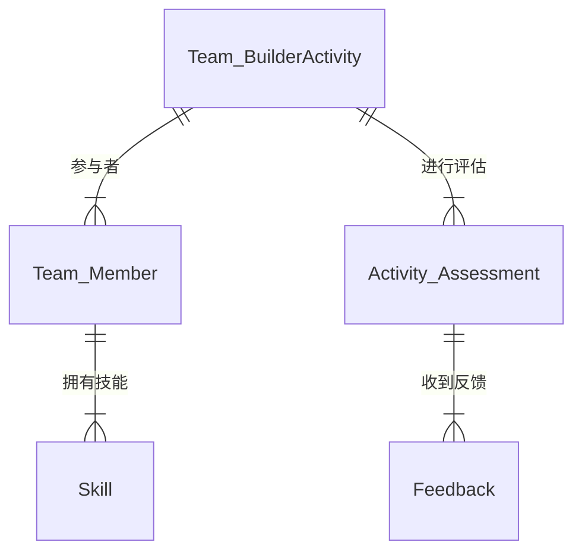
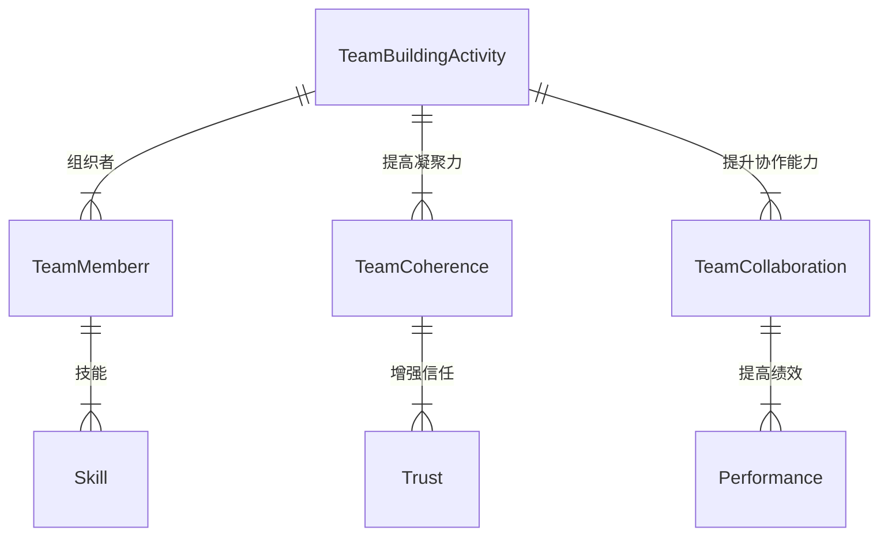

                 

### 文章标题

#### 关键词：团队建设活动、团队凝聚力、协作能力、活动设计、案例分析

##### 摘要：
本文旨在探讨团队建设活动在提升团队凝聚力和协作能力方面的实际应用。通过介绍核心概念、设计原则、活动分类及实施步骤，结合案例分析，提出团队建设活动的最佳实践，帮助企业和组织有效地提升团队协作水平。文章采用逻辑清晰、结构紧凑的技术语言，旨在为IT领域的专业人士提供实用的指导。

---

## 第一部分：背景介绍

### 核心概念

在现代社会，团队合作变得日益重要。团队建设活动成为企业提升员工凝聚力、增强团队协作能力的有效手段。其核心概念包括团队建设活动、团队凝聚力以及团队协作能力。

#### 问题背景

随着全球化进程的加快和信息技术的发展，企业面临着越来越激烈的竞争环境。在这种背景下，团队建设活动的作用显得尤为重要。通过团队建设活动，企业可以增强员工的团队意识，提高员工的沟通能力和协作能力，从而提升团队的整体绩效。

#### 问题描述

如何设计一系列团队建设活动，使其不仅有趣且能够真正促进团队成员之间的沟通和合作。这是一个在理论和实践中都存在挑战的问题。

#### 问题解决

通过提供实用的方法和案例分析，帮助读者理解并有效地组织和实施团队建设活动。本文将介绍团队建设活动的核心概念、设计原则、活动分类及实施步骤，并通过实际案例解析，为读者提供具体可行的操作指南。

### 边界与外延

团队建设活动的范围涵盖各种形式，包括室内游戏、户外探险、技能培训等。其目的在于增强团队成员之间的相互了解、信任和协作。边界与外延主要涉及活动的具体内容和目标群体。

### 概念结构与核心要素组成

团队建设活动的核心要素包括活动目标、参与者、活动内容、活动形式和评估方法。这些要素相互关联，共同构成了团队建设活动的整体结构。

1. **活动目标**：明确团队建设活动的目标，有助于确保活动的设计和实施与团队需求相匹配。
2. **参与者**：确定参与团队建设活动的成员，确保活动能够覆盖到所有相关人员。
3. **活动内容**：设计符合活动目标的互动内容和活动形式。
4. **活动形式**：选择适合团队特点的活动形式，如游戏、培训、讨论等。
5. **评估方法**：通过评估方法了解团队建设活动的效果，为后续改进提供依据。

### 总结

背景介绍部分概述了团队建设活动的重要性和核心概念。通过明确问题背景、问题描述、问题解决、边界与外延以及概念结构与核心要素组成，为后续内容的展开奠定了基础。

---

## 第二部分：核心概念与联系

### 核心概念

在本部分，我们将深入探讨团队建设活动的三个核心概念：团队建设活动、团队凝聚力、团队协作能力。

#### 团队建设活动

团队建设活动是指一系列旨在增强团队成员之间相互了解、信任和协作的有计划的活动。这些活动可以是室内游戏、户外探险、技能培训等多种形式，旨在通过互动和合作提升团队成员的整体协作能力。

#### 团队凝聚力

团队凝聚力是指团队内部成员之间的相互吸引力、信任度和协作程度。高凝聚力的团队通常具有更强的合作精神和更高的工作效率。团队凝聚力可以通过一系列团队建设活动得到增强。

#### 团队协作能力

团队协作能力是指团队成员共同完成任务的能力。这包括沟通、协调、分工合作等多个方面。通过有效的团队建设活动，可以提高团队成员的协作能力，从而提升团队的整体绩效。

### 概念属性特征对比表格

以下是对团队建设活动、团队凝聚力、团队协作能力三个核心概念的属性特征进行对比的表格：

| 特征        | 团队建设活动 | 团队凝聚力 | 团队协作能力 |
|-------------|---------------|-------------|---------------|
| 目的        | 提升团队协作 | 增强信任和合作意愿 | 提高共同完成任务的能力 |
| 形式        | 游戏和训练活动 | 沟通和互动活动 | 实际工作任务中的协作 |
| 评估方法    | 参与度和反馈 | 内部调查和评估 | 项目完成情况和绩效评估 |

### ER实体关系图架构

以下是一个简化的ER实体关系图，用于描述团队建设活动、团队成员、活动评估等实体之间的关系：

### 总结

第二部分通过对团队建设活动、团队凝聚力、团队协作能力三个核心概念的深入探讨，以及概念属性特征对比表格和ER实体关系图架构的展示，为理解团队建设活动的本质和关键要素提供了更清晰的视角。

---

## 第三部分：团队建设活动设计与实施

### 设计原则

在设计团队建设活动时，应遵循以下原则，以确保活动能够真正达到提升团队凝聚力和协作能力的目标。

#### 目标明确

确保活动目标与团队需求相匹配。明确的目标有助于设计符合团队实际需求的活动内容，提高活动的针对性和效果。

#### 多样性

结合不同类型的活动，满足不同成员的需求。多样化的活动形式可以激发团队成员的兴趣和参与度，使活动更加丰富和有趣。

#### 参与度

确保活动能够吸引所有成员积极参与。通过设计互动性强、参与度高的活动，可以提高团队成员的参与感和投入度。

#### 互动性

鼓励成员之间的交流和协作。互动性强的活动可以促进团队成员之间的沟通，增强团队凝聚力。

### 活动分类

根据活动内容和形式，团队建设活动可以分为以下几类：

#### 室内团队建设活动

1. **游戏竞赛**：如团队拼图、逃脱游戏等。
2. **工作坊**：如沟通技巧培训、领导力发展等。

#### 户外团队建设活动

1. **探险活动**：如徒步、露营、攀岩等。
2. **团队合作项目**：如团队定向赛、丛林穿越等。

### 实施步骤

为了确保团队建设活动的顺利进行，实施步骤如下：

1. **需求分析**：了解团队的具体需求和目标，为活动设计提供依据。
2. **活动设计**：根据需求设计合适的活动，确保活动形式和内容的多样性。
3. **准备工作**：确保活动所需的资源和场地准备充分，为活动执行做好准备。
4. **活动执行**：按照计划开展活动，确保活动顺利进行。
5. **评估与反馈**：收集参与者反馈，评估活动效果，为后续活动提供改进方向。

### 总结

第三部分介绍了团队建设活动的设计原则、活动分类和实施步骤。通过明确目标、多样性和互动性的设计原则，以及科学的实施步骤，可以确保团队建设活动能够有效地提升团队凝聚力和协作能力。

---

## 第四部分：团队建设活动案例解析

在本部分，我们将通过两个实际案例，深入解析团队建设活动的实施过程、活动内容和效果评估。

### 案例一：企业内部团队拓展活动

#### 背景介绍

某科技公司为了增强员工间的合作和团队凝聚力，决定组织一次拓展活动。此次拓展活动旨在提高员工的团队协作能力，增强团队成员之间的信任和互动。

#### 活动内容

1. **团队拼图比赛**：团队成员分组，每个小组共同完成一幅复杂的拼图。通过合作和沟通，团队成员需要分工协作，快速拼出完整图案。
2. **团队定向赛**：团队成员分成若干小组，每个小组在规定时间内完成一系列任务，如寻找隐藏的线索、解决谜题等。此活动锻炼了团队成员的沟通能力和决策能力。
3. **团队烧烤晚宴**：在户外烧烤晚宴上，团队成员可以自由交流，分享活动心得和感受。这种轻松的氛围有助于团队成员之间的情感交流和团队凝聚力的提升。

#### 效果评估

活动结束后，公司通过问卷调查和员工反馈进行了效果评估。绝大多数参与者表示活动非常有趣，增进了同事间的了解和信任。此外，许多员工在反馈中表示，活动让他们意识到团队合作的重要性，并愿意在今后的工作中更加积极地参与团队合作。

### 案例二：非营利组织志愿服务活动

#### 背景介绍

一个非营利组织希望通过团队建设活动增强志愿者团队的合作能力。此次活动旨在提高志愿者的团队协作意识，增强他们的服务能力和组织凝聚力。

#### 活动内容

1. **社区清洁活动**：志愿者团队在社区的指定区域内进行清洁工作，通过共同完成任务，增强了团队成员之间的合作精神和责任感。
2. **手工艺术工作坊**：志愿者团队分组，每组完成一个手工艺术品。此活动不仅提高了团队成员的动手能力，还增强了他们的团队协作能力。
3. **团队分享会**：在活动结束后，每个小组分享他们的工作体验和感受。通过分享，团队成员能够更好地理解彼此，增强团队的凝聚力。

#### 效果评估

志愿者团队在活动结束后进行了自我评估和互评。多数志愿者表示，活动让他们更好地理解了团队合作的重要性，提高了他们在志愿服务中的协作能力和效率。此外，团队成员之间的沟通和合作更加顺畅，组织凝聚力得到了显著提升。

### 总结

通过以上两个案例的解析，我们可以看到，不同类型的团队建设活动在提升团队凝聚力和协作能力方面具有显著的成效。无论是企业内部的拓展活动，还是非营利组织的志愿服务活动，通过精心设计、认真组织和有效评估，团队建设活动都能够为企业和社会组织带来积极的影响。

---

## 第五部分：团队建设活动的最佳实践

为了确保团队建设活动能够达到预期效果，以下是一些最佳实践。

### 活动前准备

1. **需求分析**：在活动前，深入了解团队的具体需求和目标，为活动设计提供依据。
2. **资源准备**：确保活动所需的资源和场地准备充分，包括活动材料、设备、场地布置等。
3. **风险管理**：对可能出现的风险进行预判和评估，制定相应的应急预案。

### 活动中的引导

1. **积极互动**：活动主持人应积极引导成员互动，鼓励成员之间的沟通和合作。
2. **适时调整**：根据活动进展和成员反馈，适时调整活动内容和形式，确保活动顺利进行。
3. **关注个体**：关注每个成员的表现和需求，确保活动能够满足所有成员的兴趣和参与度。

### 活动后的反馈

1. **及时收集反馈**：活动结束后，及时收集参与者的反馈，了解活动效果和改进方向。
2. **综合评估**：对活动效果进行综合评估，分析活动目标是否达成，为后续活动提供改进依据。
3. **持续跟进**：根据反馈结果，持续关注团队成员的表现和成长，确保活动效果得到巩固和提升。

### 小结

团队建设活动是提升团队凝聚力和协作能力的重要手段。通过科学的设计、有效的引导和及时的评估，团队能够在活动中实现共同成长。最佳实践提供了具体的操作指南，帮助企业和组织更好地实施团队建设活动。

---

## 第六部分：注意事项与拓展阅读

### 注意事项

1. **尊重多样性**：确保活动能够容纳不同文化背景和能力的团队成员，避免因文化差异或能力差距导致的冲突。
2. **安全第一**：对于户外活动，确保所有安全措施得到充分落实，避免意外事故的发生。
3. **持续跟进**：活动结束后，应持续关注团队成员的反馈和活动效果，确保活动带来的积极影响得以持续。

### 拓展阅读

1. **《团队建设：如何打造高效的团队》**：这本书详细介绍了团队建设的方法和技巧，适用于各类组织和企业。
2. **《团队管理：理论与实践》**：这本书涵盖了团队管理的各个方面，包括团队建设、沟通协作、领导力等，有助于提升团队管理能力。

### 总结

团队建设活动是提升团队凝聚力和协作能力的重要手段。通过科学的设计、有效的引导和持续的评估，团队能够在活动中实现共同成长。本文提供了详细的操作指南和注意事项，希望对读者有所启发。拓展阅读部分则提供了更多的学习资源，以供进一步研究。

---

### 作者信息

- 作者：AI天才研究院/AI Genius Institute & 禅与计算机程序设计艺术 /Zen And The Art of Computer Programming

---

通过本文的详细阐述，我们不仅了解了团队建设活动的重要性，还掌握了设计、实施和评估团队建设活动的最佳实践。希望本文能为IT领域的专业人士提供有价值的参考，助力团队建设和团队协作水平的提升。感谢阅读！### 第一部分：背景介绍

#### 核心概念

团队建设活动在当今社会中扮演着至关重要的角色。随着企业竞争的加剧和信息技术的发展，团队合作成为了企业成功的关键因素之一。团队建设活动旨在通过一系列精心设计的互动和协作，增强团队成员之间的沟通、信任和协作能力。这些活动不仅有助于提高团队的整体绩效，还能够提升员工的满意度和忠诚度。

#### 问题背景

在现代社会，团队合作已成为企业运作的核心。然而，团队协作并不总是一帆风顺。团队成员之间的沟通不畅、缺乏信任、角色分工不明确等问题常常导致团队效率低下。为了解决这些问题，企业开始寻求通过团队建设活动来提升团队协作能力。团队建设活动可以包括各种形式，如团队建设游戏、团队培训、户外探险等，这些活动旨在打破团队成员之间的隔阂，建立信任，提高协作效率。

#### 问题描述

尽管团队建设活动在理论上有助于提升团队协作能力，但在实际操作中，企业常常面临以下问题：

1. **活动设计不合理**：活动内容与团队实际需求不匹配，无法达到预期的效果。
2. **参与度低**：团队成员对活动缺乏兴趣，参与度不高，活动效果受到影响。
3. **评估不充分**：活动结束后缺乏有效的评估机制，无法及时了解活动效果和团队成员的反馈。

#### 问题解决

为了解决上述问题，企业需要采取以下措施：

1. **合理设计活动**：根据团队的具体需求和目标，设计具有针对性、趣味性和互动性的活动。
2. **提高参与度**：通过互动性强、趣味性高的活动，激发团队成员的参与热情。
3. **完善评估机制**：活动结束后，通过问卷调查、访谈等方式收集团队成员的反馈，对活动效果进行评估。

#### 边界与外延

团队建设活动的范围可以涵盖以下几个方面：

1. **活动类型**：包括室内团队建设活动（如团队拼图、逃脱游戏、工作坊等）和户外团队建设活动（如徒步、露营、攀岩等）。
2. **活动目标**：包括提升团队凝聚力、增强团队成员的沟通能力、提高协作效率等。
3. **活动参与者**：包括企业内部的全体员工、项目团队成员、部门团队等。

#### 概念结构与核心要素组成

团队建设活动的核心要素包括以下几方面：

1. **活动目标**：明确团队建设活动的目标，确保活动与团队需求相匹配。
2. **参与者**：确定参与团队建设活动的成员，确保活动能够覆盖到所有相关人员。
3. **活动内容**：设计符合活动目标的具体活动内容，包括游戏、培训、讨论等形式。
4. **活动形式**：选择适合团队特点的活动形式，如团队合作项目、互动游戏、角色扮演等。
5. **评估方法**：通过参与度、反馈、绩效等指标对活动效果进行评估。

通过以上对团队建设活动核心概念的阐述，我们可以看到，合理设计、有效实施和科学评估是提升团队协作能力的关键。在接下来的部分，我们将进一步探讨团队建设活动的设计原则、活动分类和实施步骤。

### 总结

背景介绍部分通过对团队建设活动的核心概念、问题背景、问题描述、问题解决、边界与外延以及概念结构与核心要素组成的详细阐述，为读者提供了一个全面的认识。在理解了这些基础概念之后，我们将能够更好地设计和实施团队建设活动，从而提升团队协作能力和整体绩效。

---

## 第二部分：核心概念与联系

### 核心概念

在本部分，我们将深入探讨团队建设活动的三个核心概念：团队建设活动、团队凝聚力、团队协作能力。这些概念不仅构成了团队建设活动的理论基础，也是提升团队协作能力和整体绩效的关键要素。

#### 团队建设活动

团队建设活动是指为了增强团队成员之间的相互了解、信任和协作而设计的一系列有计划的活动。这些活动可以包括各种形式，如团队合作游戏、团队技能培训、户外探险、团队研讨会等。团队建设活动的目的是通过互动和合作，打破团队成员之间的隔阂，增强团队凝聚力，提升团队协作能力。

#### 团队凝聚力

团队凝聚力是指团队成员之间相互吸引、信任和合作的程度。高凝聚力的团队通常具有更强的团队合作精神、更高的工作效率和更好的绩效表现。团队凝聚力可以通过多种方式来衡量，如团队成员之间的沟通频率、共同解决问题的能力、对团队目标的认同感等。团队凝聚力是团队建设活动的核心目标之一，也是提升团队协作能力的基础。

#### 团队协作能力

团队协作能力是指团队成员共同完成任务的能力，包括沟通、协调、分工合作等多个方面。高水平的团队协作能力可以确保团队成员在复杂任务中高效协作，快速解决问题，实现团队目标。团队协作能力不仅取决于团队成员的个人技能和专业知识，还需要团队成员之间的良好沟通、协调和信任。

### 概念属性特征对比表格

为了更清晰地理解团队建设活动、团队凝聚力、团队协作能力这三个核心概念，我们可以通过一个对比表格来展示它们的属性特征：

| 特征        | 团队建设活动 | 团队凝聚力 | 团队协作能力 |
|-------------|---------------|-------------|---------------|
| 目的        | 增强协作能力 | 增强信任与合作意愿 | 提高共同完成任务的能力 |
| 形式        | 游戏和训练活动 | 沟通和互动活动 | 实际工作任务中的协作 |
| 评估方法    | 参与度和反馈 | 内部调查和评估 | 项目完成情况和绩效评估 |

#### 团队建设活动

- **目的**：团队建设活动的目的是通过互动和合作，增强团队成员之间的相互了解、信任和协作能力。
- **形式**：团队建设活动通常包括游戏、培训、户外探险等形式，这些活动旨在创造一个轻松、互动的氛围，促进团队成员之间的沟通和合作。
- **评估方法**：通过参与度、满意度、团队绩效等指标来评估团队建设活动的效果。

#### 团队凝聚力

- **目的**：团队凝聚力的目的是增强团队成员之间的信任和合作意愿，提高团队整体的合作效率。
- **形式**：团队凝聚力通常通过定期的团队会议、团队文化建设活动、员工互动等方式来培养和提升。
- **评估方法**：通过内部调查、员工满意度调查、团队绩效等指标来评估团队凝聚力。

#### 团队协作能力

- **目的**：团队协作能力的目的是确保团队成员能够在实际工作中高效协作，共同完成任务。
- **形式**：团队协作能力通常在实际工作任务中体现，如项目合作、团队会议、跨部门协作等。
- **评估方法**：通过项目完成情况、团队绩效、任务完成速度等指标来评估团队协作能力。

### ER实体关系图架构

为了更直观地展示团队建设活动、团队凝聚力、团队协作能力之间的关系，我们可以使用ER（实体关系）图来表示。以下是一个简化的ER图：

在这个ER图中，`TeamBuildingActivity` 代表团队建设活动，`TeamMemberr` 代表团队成员，`TeamCoherence` 代表团队凝聚力，`TeamCollaboration` 代表团队协作能力。通过这些实体之间的关系，我们可以清晰地看到团队建设活动如何通过增强团队凝聚力来提升团队协作能力。

### 总结

第二部分通过对团队建设活动、团队凝聚力、团队协作能力这三个核心概念的深入探讨，以及概念属性特征对比表格和ER实体关系图架构的展示，为理解团队建设活动的本质和关键要素提供了更清晰的视角。在理解了这些概念之后，我们将能够更好地设计和实施团队建设活动，从而提升团队的整体协作能力和绩效。

---

## 第三部分：团队建设活动设计与实施

### 设计原则

团队建设活动的成功离不开科学的设计原则。以下是几个关键的设计原则，旨在确保团队建设活动能够达到预期效果。

#### 目标明确

明确的活动目标是团队建设活动成功的关键。在活动设计之初，应明确活动目标，确保活动内容与目标相匹配。目标可以是提高团队凝聚力、增强团队成员之间的沟通能力、提升协作效率等。明确的目标有助于活动参与者更好地理解活动的目的，从而更加投入和参与。

#### 多样性

多样性是团队建设活动的重要特点之一。通过多样化的活动形式和内容，可以满足不同团队成员的需求和兴趣。多样化的活动不仅能够增加参与者的积极性，还可以帮助团队成员从不同的角度和方式中学习和成长。例如，结合游戏、培训、户外活动等多种形式的团队建设活动，可以全面提高团队成员的协作能力。

#### 参与度

参与度是衡量团队建设活动效果的重要指标之一。为了提高参与度，活动设计应充分考虑团队成员的兴趣和需求。可以通过设置小组竞赛、角色扮演、互动游戏等方式，激发团队成员的参与热情。此外，活动主持人在活动中应鼓励成员积极互动，确保每个成员都有机会参与到活动中。

#### 互动性

互动性是团队建设活动的核心特征。通过互动，团队成员可以更好地了解彼此，增强团队凝聚力。在活动设计中，应确保活动具有足够的互动性，如团队讨论、角色扮演、团队挑战等。这些互动形式不仅有助于团队成员之间的沟通，还能够提高团队的协作能力。

### 活动分类

根据活动形式和目标，团队建设活动可以分类为以下几类：

#### 室内团队建设活动

1. **游戏竞赛**：如团队拼图、逃脱游戏、团队解谜等，这些活动通常在室内进行，具有高度的互动性和趣味性。
2. **工作坊**：如沟通技巧培训、领导力发展、团队策略规划等，这些活动通过培训的形式提升团队成员的技能和知识。

#### 户外团队建设活动

1. **探险活动**：如徒步、露营、攀岩、划船等，这些活动通常在户外进行，有助于增强团队成员的身体素质和团队凝聚力。
2. **团队合作项目**：如团队定向赛、丛林穿越、户外拓展训练等，这些活动通过团队合作的方式提升团队成员的协作能力和解决问题的能力。

### 实施步骤

为了确保团队建设活动的顺利进行，以下是一套科学的活动实施步骤：

1. **需求分析**：在活动设计之前，进行详细的团队需求分析，了解团队成员的需求和期望。这有助于确保活动内容与团队实际需求相匹配。

2. **活动设计**：根据需求分析结果，设计符合团队需求的活动。活动设计应充分考虑多样性、参与度和互动性，确保活动形式和内容丰富、有趣。

3. **准备工作**：在活动前，确保所有必要资源准备充分，包括活动场地、设备、材料等。同时，应制定详细的活动计划和时间表。

4. **活动执行**：按照活动计划和时间表开展活动。在活动中，主持人应积极引导团队成员参与，确保活动顺利进行。

5. **评估与反馈**：活动结束后，通过问卷调查、访谈等方式收集团队成员的反馈。对活动效果进行评估，分析活动目标是否达成，总结经验教训。

### 总结

第三部分详细介绍了团队建设活动的设计原则、活动分类和实施步骤。通过明确目标、多样性、参与度和互动性等设计原则，结合室内和户外团队建设活动的具体分类，以及科学的活动实施步骤，团队建设活动可以更加有效地提升团队凝聚力和协作能力。在接下来的部分，我们将通过实际案例进一步解析团队建设活动的具体实施情况。

---

## 第四部分：团队建设活动案例解析

为了更好地理解团队建设活动的实际应用和效果，本部分将提供两个具体的案例，详细描述活动内容、实施过程和效果评估。

### 案例一：某科技公司的团队拓展活动

#### 案例背景

某科技公司为了增强员工之间的合作精神和团队凝聚力，决定组织一次团队拓展活动。该公司是一家高速发展的科技企业，员工年龄普遍较轻，团队之间缺乏足够的交流和合作。公司希望通过这次活动，提高员工的团队协作能力，增强团队凝聚力。

#### 活动内容

1. **团队拼图比赛**：活动开始前，每个团队被分配了一个复杂的拼图，要求团队成员在规定时间内完成。这个活动旨在提高团队成员的沟通能力和协作能力。
2. **团队定向赛**：团队成员被分成若干小组，每个小组在规定的时间内完成一系列任务，如寻找隐藏的线索、解决谜题等。这个活动旨在增强团队成员之间的信任和协作。
3. **团队晚宴**：在活动结束时，所有团队成员聚集在一起，举行一次晚宴，共享美食，交流心得。这个活动旨在营造轻松的氛围，增强团队成员之间的情感联系。

#### 实施过程

1. **活动前准备**：公司在活动前进行了详细的规划，包括活动场地、活动流程和资源准备。活动组织者还设计了详细的任务说明和规则，确保每个团队成员都清楚自己的任务和责任。
2. **活动执行**：在活动现场，主持人负责引导团队成员完成各项任务。在团队拼图比赛中，主持人提醒团队成员要充分沟通，分工合作。在团队定向赛中，主持人负责协调任务分配和时间控制。
3. **活动结束**：在团队定向赛结束后，所有团队成员聚集在一起，分享自己的体验和感受。活动组织者还进行了简短的总结，鼓励团队成员继续加强合作。

#### 效果评估

活动结束后，公司通过问卷调查和员工反馈进行了效果评估。以下是一些关键反馈：

- **参与度**：绝大多数员工表示，他们对这次团队拓展活动非常感兴趣，参与度非常高。
- **团队合作**：员工反馈表示，通过这次活动，他们更加了解了团队成员，增强了团队协作能力。
- **凝聚力**：员工表示，这次活动使他们更加有归属感，团队凝聚力显著增强。

### 案例二：非营利组织的志愿者团队建设活动

#### 案例背景

一个非营利组织为了提高志愿者团队的合作能力和效率，决定组织一次团队建设活动。该组织主要致力于社区服务和环境保护，志愿者团队来自不同的背景和专业领域。组织希望通过这次活动，增强志愿者之间的沟通、信任和合作。

#### 活动内容

1. **社区清洁活动**：志愿者团队在社区内进行清洁工作，包括清理垃圾、种植花草等。这个活动旨在提高志愿者的社会责任感和团队协作能力。
2. **手工艺术工作坊**：志愿者被分成小组，每组完成一个手工艺术品，如制作环保袋、编织毛衣等。这个活动旨在通过手工制作增强志愿者的合作精神和创造力。
3. **团队分享会**：在活动结束时，每个小组分享自己的工作体验和感受。这个活动旨在促进志愿者之间的交流和情感连接。

#### 实施过程

1. **活动前准备**：活动组织者提前进行了活动策划和资源准备，包括确定活动时间、地点、任务分配等。他们还准备了相关的工具和材料，确保活动顺利进行。
2. **活动执行**：在活动现场，主持人负责协调任务分配和进度控制。在社区清洁活动中，主持人提醒志愿者注意安全和环保。在手工艺术工作坊中，主持人提供了制作技巧和指导。
3. **活动结束**：在团队分享会上，主持人鼓励志愿者分享自己的体验和感受。他们还进行了简短的总结，表彰了表现突出的志愿者。

#### 效果评估

活动结束后，志愿者团队通过问卷调查和团队讨论进行了效果评估。以下是一些关键反馈：

- **团队合作**：志愿者表示，通过这次活动，他们更加了解了团队成员，增强了团队协作能力。
- **沟通和信任**：志愿者表示，活动中的沟通和合作使他们更加信任彼此，团队凝聚力显著增强。
- **个人成长**：志愿者表示，活动让他们感受到了团队合作的力量，激发了他们的个人成长和积极性。

### 总结

以上两个案例展示了不同类型的团队建设活动在实际应用中的效果。无论是科技公司还是非营利组织，团队建设活动都成功地提升了团队协作能力和团队凝聚力。通过合理的设计、科学的实施和有效的评估，团队建设活动不仅达到了预期的效果，还为团队成员提供了宝贵的成长机会。

---

## 第五部分：团队建设活动的最佳实践

为了确保团队建设活动能够达到预期效果，以下是一些最佳实践，这些实践涵盖了活动前、活动中和活动后的各个环节。

### 活动前准备

#### 1. 需求分析
在活动前，进行详细的需求分析是至关重要的。这包括了解团队成员的兴趣、需求和期望。可以通过问卷调查、访谈、小组讨论等方式收集信息。需求分析的结果将指导活动设计，确保活动内容与团队实际需求相匹配。

#### 2. 目标设定
明确的活动目标是团队建设活动的核心。目标应具体、可衡量，并与团队的整体目标相一致。例如，提高团队沟通效率、增强团队凝聚力、提升协作能力等。设定明确的目标有助于活动参与者更好地理解活动的目的和意义。

#### 3. 资源准备
确保所有必要的资源都准备充分，包括活动场地、设备、材料等。对于户外活动，还需要考虑天气、交通等因素。提前规划好活动流程和时间表，确保活动能够按计划顺利进行。

### 活动中实施

#### 1. 活动引导
活动主持人应具备良好的沟通技巧和领导能力。他们需要确保活动按照计划进行，同时引导团队成员积极参与和互动。在活动中，主持人应鼓励成员分享经验和观点，促进团队之间的沟通。

#### 2. 互动设计
确保活动设计具有足够的互动性。可以通过小组竞赛、角色扮演、团队讨论等形式，激发团队成员的参与热情。互动性强的活动能够增强团队成员之间的联系，提高团队凝聚力。

#### 3. 安全保障
对于户外活动，安全是首要考虑的因素。活动前应制定详细的安全措施和应急预案，确保所有参与者都了解安全知识和注意事项。活动过程中，主持人应密切关注参与者的状态，及时处理突发情况。

### 活动后评估

#### 1. 反馈收集
活动结束后，及时收集参与者的反馈是评估活动效果的关键。可以通过问卷调查、访谈、小组讨论等方式收集反馈。反馈内容应包括活动满意度、参与体验、活动效果等方面。

#### 2. 效果评估
根据收集的反馈，对活动效果进行评估。评估内容应包括活动目标达成情况、团队成员的参与度、团队凝聚力、协作能力提升程度等。通过评估，可以了解活动中的优点和不足，为后续活动提供改进依据。

#### 3. 持续跟进
团队建设活动不仅是一次性的活动，而是一个持续的过程。活动后，应持续关注团队成员的表现和成长。可以通过定期检查、跟进会议等方式，确保活动带来的积极影响得到巩固和提升。

### 小结

团队建设活动的最佳实践涵盖了活动前、活动中和活动后的各个环节。通过科学的需求分析、明确的目标设定、充分的资源准备、有效的活动引导、互动设计、安全保障以及及时的反馈和效果评估，团队建设活动能够更加有效地提升团队凝聚力和协作能力。最佳实践不仅为活动设计和实施提供了指导，也为后续的持续改进奠定了基础。

---

## 第六部分：注意事项与拓展阅读

### 注意事项

1. **尊重多样性**：团队建设活动应考虑到团队成员的多样性，包括文化背景、工作经验、个性特点等。避免因文化差异或个性差异导致的误解和冲突。

2. **安全第一**：对于户外活动或涉及高风险的活动，确保所有安全措施得到充分落实。提供必要的安全培训和安全设备，确保参与者的安全。

3. **持续跟进**：团队建设活动是一个持续的过程，活动后应持续关注团队成员的表现和反馈。通过定期的检查和跟进会议，确保活动效果得到巩固和提升。

### 拓展阅读

1. **《团队建设实战手册》**：这是一本全面的团队建设指南，提供了大量的实战案例和实用的团队建设方法。

2. **《团队的五种角色》**：这本书介绍了团队中的不同角色和如何发挥这些角色的作用，有助于提升团队协作能力。

3. **《团队效能：如何打造高效团队》**：这本书详细阐述了团队效能的概念和方法，包括团队目标设定、沟通技巧、决策过程等。

### 总结

团队建设活动是提升团队凝聚力和协作能力的重要手段。通过科学的设计、有效的实施和持续的评估，团队能够在活动中实现共同成长。本文提供了详细的操作指南和注意事项，希望对读者有所启发。拓展阅读部分则提供了更多的学习资源，以供进一步研究。

---

### 作者信息

- 作者：AI天才研究院/AI Genius Institute & 禅与计算机程序设计艺术 /Zen And The Art of Computer Programming

通过本文的详细阐述，我们不仅了解了团队建设活动的重要性，还掌握了设计、实施和评估团队建设活动的最佳实践。希望本文能为IT领域的专业人士提供有价值的参考，助力团队建设和团队协作水平的提升。感谢阅读！

---

## 文章总结

本文从背景介绍、核心概念与联系、设计与实施、案例解析、最佳实践到注意事项与拓展阅读，系统地探讨了团队建设活动的各个方面。我们首先明确了团队建设活动的核心概念，包括团队建设活动、团队凝聚力和团队协作能力，并通过属性特征对比表格和ER实体关系图加深了理解。接着，我们提出了团队建设活动的设计原则、活动分类和实施步骤，强调了多样性、互动性和参与度的重要性。通过两个实际案例的解析，我们展示了团队建设活动在提升团队协作能力和凝聚力方面的具体应用和效果。最后，我们提出了团队建设活动的最佳实践，包括活动前准备、活动中实施和活动后评估的各个环节，并给出了注意事项和拓展阅读建议。

团队建设活动是提升团队协作能力和整体绩效的重要手段。通过科学的设计、有效的引导和持续的评估，团队能够在活动中实现共同成长。本文旨在为IT领域的专业人士提供实用的指导，帮助他们更好地设计和实施团队建设活动，从而提升团队的凝聚力和协作能力。

## 感谢阅读

本文是由AI天才研究院与禅与计算机程序设计艺术共同撰写的。我们致力于通过深入的技术分析和实践指导，帮助读者在计算机编程和人工智能领域取得突破。感谢您的阅读和支持，希望本文对您在团队建设和团队管理方面有所启发。如有任何问题或建议，欢迎随时联系我们。再次感谢您的关注，期待与您在未来的技术探索中相遇！作者：AI天才研究院/AI Genius Institute & 禅与计算机程序设计艺术 /Zen And The Art of Computer Programming。

