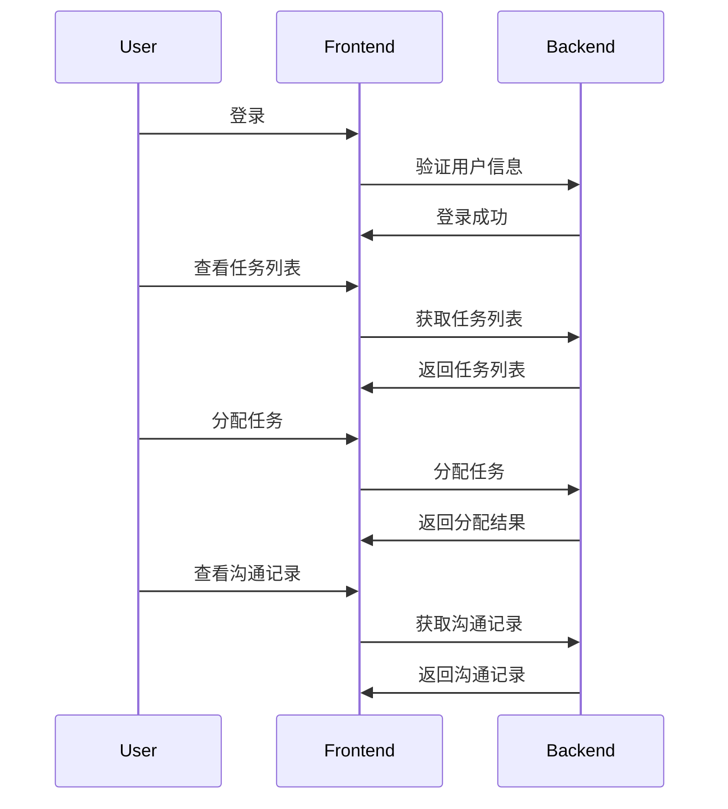
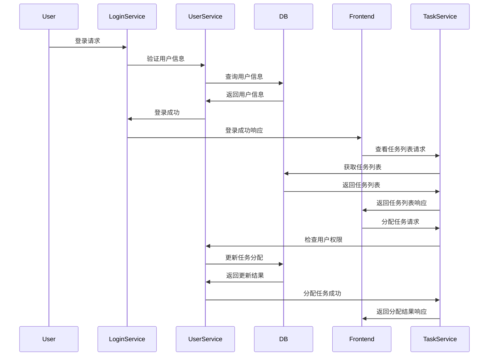

                 


## 文章标题：团队建设：从个体到团队的蜕变

### 关键词：
- 团队建设
- 个体融合
- 领导力
- 沟通协作
- 数学模型
- 系统设计
- 项目实战

### 摘要：
本文将深入探讨团队建设的过程，从个体到团队的转变。我们将通过理论讲解、数学模型、系统分析与项目实战，帮助读者理解团队建设的核心概念和实际应用。通过本文，您将掌握如何构建高效团队，实现个人与团队共同成长。

----------------------------------------------------------------

### 目录大纲设计思路

为了设计出《团队建设：从个体到团队的蜕变》这本书的完整目录大纲，我们需要遵循以下步骤：

1. **背景介绍**：
   - 介绍团队建设的重要性，以及个体与团队之间的相互关系。
   - 提出本书的核心观点：个体如何融入团队，实现个人与团队共同成长。

2. **核心概念与联系**：
   - 定义关键概念，如“个体”、“团队”、“协作”、“领导力”等。
   - 通过对比表格和ER实体关系图，展示这些概念之间的联系和区别。

3. **理论讲解**：
   - 详细讲解团队建设的基本原理，包括团队的形成、角色定位、团队沟通和冲突管理等。
   - 使用Mermaid流程图和Python代码示例来解释复杂的理论。

4. **数学模型和公式**：
   - 对于团队建设中的关键数学模型，使用LaTeX格式给出，并进行详细讲解和举例说明。

5. **系统分析与架构设计**：
   - 描述团队建设项目的场景和目标。
   - 使用Mermaid类图、架构图和序列图展示系统设计和接口设计。

6. **项目实战**：
   - 介绍环境安装、系统核心实现源代码。
   - 分析实际案例，并进行详细讲解和剖析。

7. **最佳实践与拓展**：
   - 提供团队建设中的最佳实践小贴士。
   - 进行小结，强调注意事项。
   - 推荐进一步阅读的文献和资源。

### 目录大纲

#### 第一部分：团队建设的背景与核心概念

##### 第1章：团队建设的重要性与核心概念

1.1. 问题背景

1.2. 个体与团队的相互关系

1.3. 核心概念介绍

1.4. 核心概念对比表格

1.5. ER实体关系图

##### 第2章：团队建设的基本原理

2.1. 团队的形成与发展

2.2. 团队角色与职责定位

2.3. 团队沟通与协作

2.4. 团队冲突管理与解决

2.5. 领导力与团队建设

##### 第3章：数学模型与公式讲解

3.1. 团队效能评估模型

3.2. 概率论在团队决策中的应用

3.3. 使用LaTeX格式展示数学公式

##### 第4章：系统分析与架构设计

4.1. 团队建设项目的场景与目标

4.2. 系统功能设计与领域模型

4.3. 系统架构设计与接口设计

4.4. 系统交互序列图

##### 第5章：项目实战

5.1. 环境安装与配置

5.2. 系统核心实现源代码

5.3. 代码应用解读与分析

5.4. 实际案例分析与详细讲解

##### 第6章：最佳实践与拓展

6.1. 团队建设中的最佳实践小贴士

6.2. 注意事项与小结

6.3. 拓展阅读推荐

### 总结

通过以上结构，我们不仅提供了理论讲解，还有实际操作和案例分析，确保读者能够从个体层面到团队层面，全面理解团队建设的核心内容，并能够在实践中应用所学知识。确保目录大纲简洁明了，便于读者快速浏览和查找所需内容。

----------------------------------------------------------------

## 第1章：团队建设的重要性与核心概念

### 1.1 问题背景

在当今快速变化的技术环境中，团队建设已成为组织成功的关键因素。随着全球化的加速和市场竞争的加剧，企业需要更加高效、灵活的团队来应对各种挑战。然而，如何从个体到团队实现高效融合，仍然是一个复杂的难题。团队建设不仅仅是简单的角色分配和任务分配，更涉及到个体的认知转变、团队文化的构建以及有效的领导和管理。

### 1.2 个体与团队的相互关系

个体与团队的关系是团队建设的基础。个体是团队的基本组成部分，而团队则是个体实现更大目标的环境。个体在团队中扮演着独特的角色，他们的技能、经验和动机对团队的整体表现有着重要影响。同时，团队的成功也依赖于个体的积极参与和贡献。个体与团队之间需要建立良好的沟通和协作机制，确保每个成员都能充分发挥自己的潜力，同时实现团队的目标。

### 1.3 核心概念介绍

在团队建设中，有几个核心概念需要理解：

1. **个体**：个体是指团队中的每一个成员，他们拥有自己的技能、知识和经验。个体在团队中的角色和职责是根据其能力和团队需求来确定的。

2. **团队**：团队是由一组个体组成的，共同为实现特定目标而努力的集合。团队具有共同的目标、共同的价值观和行为规范。

3. **协作**：协作是团队中成员之间的互动和合作。有效的协作能够提高团队的效率和绩效。

4. **领导力**：领导力是团队建设中至关重要的因素。领导者需要引导团队，激发成员的潜力，协调团队内部的关系，确保团队目标的实现。

### 1.4 核心概念对比表格

| 核心概念 | 定义 |  
| --- | --- |  
| 个体 | 团队中的每一个成员，拥有自己的技能、知识和经验。 |  
| 团队 | 由一组个体组成的，共同为实现特定目标而努力的集合。 |  
| 协作 | 团队中成员之间的互动和合作。 |  
| 领导力 | 引导团队，激发成员的潜力，协调团队内部的关系，确保团队目标的实现。 |

### 1.5 ER实体关系图

ER实体关系图用于描述个体、团队、协作和领导力之间的关系。以下是一个简化的ER实体关系图示例：

```mermaid
erDiagram
  ID --|>|  Member
  Team ||--|> ID : leads
  Member ||--|> ID : collaborates
  Member ||--|> Collaboration
  Team ||--|> Collaboration
  Member ||--|> Leadership
  Team ||--|> Leadership
```

在这个ER实体关系图中，个体（Member）与团队（Team）之间存在一对一的领导关系（leads），个体与团队之间存在多对多的协作关系（collaborates），团队与协作之间存在一对一的关系（Collaboration），团队与领导力之间存在一对一的关系（Leadership）。

通过本章的内容，我们为后续章节的理论讲解和案例分析奠定了基础。在下一章中，我们将深入探讨团队建设的基本原理，包括团队的形成、角色定位、团队沟通和冲突管理等。

----------------------------------------------------------------

## 第2章：团队建设的基本原理

### 2.1 团队的形成与发展

团队的形成是一个逐步的过程，通常包括以下几个阶段：

1. **组建阶段**：在这个阶段，团队成员被指定或选择，并且团队的目标和任务被明确。团队成员开始相互了解，建立初步的信任和合作关系。

2. **磨合阶段**：随着团队成员的逐步熟悉，团队开始进入磨合阶段。在这个阶段，团队成员需要适应彼此的工作风格和沟通方式，解决潜在的冲突和误解。

3. **稳定阶段**：当团队成员之间的合作关系和信任程度达到一定水平时，团队进入稳定阶段。在这个阶段，团队成员能够高效地协同工作，实现团队的目标。

4. **成熟阶段**：在成熟阶段，团队已经形成了一个高度协作和高效运作的系统。团队成员能够相互依赖，共同面对挑战和机遇，实现团队的最大潜力。

### 2.2 团队角色与职责定位

在团队中，每个成员都扮演着特定的角色，拥有特定的职责。以下是一些常见的团队角色：

1. **领导者**：领导者负责引导团队，制定目标和计划，协调团队成员的工作，解决团队内部的冲突。

2. **执行者**：执行者负责执行团队的任务和计划，确保团队目标的实现。

3. **沟通者**：沟通者负责确保团队内部的信息流畅，协调成员之间的沟通和协作。

4. **协调者**：协调者负责协调团队内部和外部的资源，确保团队工作的顺利进行。

5. **监督者**：监督者负责监督团队的工作进度和质量，确保团队目标的实现。

6. **创新者**：创新者负责提出新的想法和解决方案，推动团队的创新发展。

明确每个成员的角色和职责，有助于确保团队的高效运作和目标的实现。以下是一个团队角色与职责的对比表格：

| 角色名称 | 职责描述 |  
| --- | --- |  
| 领导者 | 制定目标和计划，协调团队成员的工作，解决团队内部的冲突。 |  
| 执行者 | 执行团队的任务和计划，确保团队目标的实现。 |  
| 沟通者 | 确保团队内部的信息流畅，协调成员之间的沟通和协作。 |  
| 协调者 | 协调团队内部和外部的资源，确保团队工作的顺利进行。 |  
| 监督者 | 监督团队的工作进度和质量，确保团队目标的实现。 |  
| 创新者 | 提出新的想法和解决方案，推动团队的创新发展。 |

### 2.3 团队沟通与协作

有效的沟通和协作是团队成功的关键。以下是一些团队沟通和协作的最佳实践：

1. **建立沟通渠道**：确保团队成员之间有畅通的沟通渠道，包括面对面会议、电子邮件、即时通讯工具等。

2. **明确沟通目标**：每次沟通前，明确沟通的目标和期望，确保沟通的效率和质量。

3. **倾听与反馈**：在沟通中，倾听他人的意见和反馈，尊重不同的观点和意见，确保信息的准确传达。

4. **协作工具**：使用协作工具，如项目管理软件、代码管理平台、文档共享工具等，提高团队的协作效率和效果。

5. **团队会议**：定期举行团队会议，讨论团队的进展、问题、解决方案和计划，确保团队成员之间的信息同步和协作。

### 2.4 团队冲突管理与解决

团队冲突是不可避免的，关键在于如何有效地管理和解决冲突。以下是一些团队冲突管理和解决的最佳实践：

1. **预防冲突**：通过建立明确的团队目标、角色定位和沟通机制，预防潜在冲突的发生。

2. **识别冲突**：及时发现和识别团队中的冲突，避免冲突的升级和扩散。

3. **沟通解决**：通过有效的沟通和协商，找到解决问题的方法和途径。

4. **中立调解**：当团队内部无法自行解决冲突时，寻求中立第三方（如项目经理或HR）的调解和仲裁。

5. **改进流程**：分析冲突的原因和过程，改进团队的工作流程和沟通机制，预防类似冲突的再次发生。

### 2.5 领导力与团队建设

领导力在团队建设中起着至关重要的作用。以下是一些领导力在团队建设中的关键要素：

1. **愿景与目标**：领导者需要明确团队的愿景和目标，激励团队成员为实现这些目标而努力。

2. **信任与尊重**：领导者需要建立团队成员之间的信任和尊重，创造一个积极、开放和包容的团队氛围。

3. **激励与支持**：领导者需要激励团队成员，提供必要的支持和资源，帮助团队成员实现个人和团队目标。

4. **决策与领导**：领导者需要做出明智的决策，并在团队中建立有效的领导体系，确保团队目标的实现。

5. **反馈与改进**：领导者需要及时给予团队成员反馈，鼓励团队成员不断改进，推动团队持续发展。

通过本章的内容，我们深入探讨了团队建设的基本原理，包括团队的形成与发展、角色与职责定位、沟通与协作、冲突管理与解决以及领导力在团队建设中的应用。这些原理和最佳实践将为后续章节的理论讲解和项目实战提供坚实的基础。

----------------------------------------------------------------

## 第3章：数学模型与公式讲解

### 3.1 团队效能评估模型

团队效能评估是团队建设过程中至关重要的一环，它能够帮助我们了解团队的工作表现，并指导团队改进。团队效能评估模型通常涉及多个指标，包括任务完成度、团队成员满意度、团队沟通效率、团队创新能力等。以下是一个简化的团队效能评估模型：

1. **任务完成度（Task Completion）**：
   $$TC = \frac{Completed Tasks}{Total Tasks}$$
   任务完成度表示团队在规定时间内完成任务的比率。

2. **团队成员满意度（Team Member Satisfaction）**：
   $$TS = \frac{\text{Satisfied Members}}{\text{Total Members}}$$
   团队成员满意度表示团队成员对团队工作环境的满意程度。

3. **团队沟通效率（Communication Efficiency）**：
   $$CE = \frac{Effective Communication}{Total Communication}$$
   团队沟通效率表示团队有效沟通的比率。

4. **团队创新能力（Innovation Capacity）**：
   $$IC = \frac{New Ideas Implemented}{Total Ideas Proposed}$$
   团队创新能力表示团队将新想法付诸实践的比率。

### 3.2 概率论在团队决策中的应用

概率论在团队决策中有着广泛的应用，尤其是在不确定性和风险分析方面。以下是一个简单的概率论模型，用于评估团队成员在决策中的风险偏好：

1. **风险偏好（Risk Preference）**：
   $$RP = \frac{Maximize(Profit) - Minimize(Loss)}{Standard Deviation of Outcome}$$
   风险偏好表示团队成员对风险的接受程度。利润和损失可以通过概率分布进行估算。

2. **预期收益（Expected Return）**：
   $$ER = \sum_{i=1}^{n} (P_i \times R_i)$$
   其中，$P_i$ 表示事件 $i$ 发生的概率，$R_i$ 表示事件 $i$ 的收益。

3. **方差（Variance）**：
   $$\sigma^2 = \sum_{i=1}^{n} (P_i \times (R_i - ER)^2)$$
   方差表示收益的波动程度，用于评估决策的风险。

### 3.3 使用LaTeX格式展示数学公式

在文中嵌入LaTeX格式中的数学公式是一种常见的做法，以下是一些示例：

独立段落中的公式：
$$
E[X] = \int_{-\infty}^{\infty} xf(x) \, dx
$$

段落内的小公式：
$$
x < y
$$

### 举例说明

假设我们有一个团队，其成员对某项任务的完成度、满意度、沟通效率和创新能力分别为80%、75%、90%和85%，我们可以使用上述公式计算团队的整体效能：

1. **任务完成度**：
   $$
   TC = \frac{0.8}{1} = 0.8
   $$

2. **团队成员满意度**：
   $$
   TS = \frac{0.75}{1} = 0.75
   $$

3. **团队沟通效率**：
   $$
   CE = \frac{0.9}{1} = 0.9
   $$

4. **团队创新能力**：
   $$
   IC = \frac{0.85}{1} = 0.85
   $$

综合这些指标，我们可以得出团队的整体效能评估：

$$
EF = \frac{TC + TS + CE + IC}{4} = \frac{0.8 + 0.75 + 0.9 + 0.85}{4} = 0.84375
$$

通过上述数学模型和公式，我们能够更准确地评估团队的表现，并为团队建设提供数据支持。在下一章中，我们将进一步探讨团队建设的系统分析与架构设计。

----------------------------------------------------------------

## 第4章：系统分析与架构设计

### 4.1 团队建设项目的场景与目标

在团队建设项目中，我们面临的场景是建立一个高效、灵活的团队，以应对不断变化的市场需求和复杂的业务挑战。项目的目标包括：

1. **提高团队效能**：通过优化团队结构和流程，提高团队的效率和产出。
2. **增强团队协作**：建立有效的沟通和协作机制，促进团队成员之间的互动和合作。
3. **培养团队文化**：营造积极、开放和包容的团队氛围，增强团队的凝聚力和归属感。
4. **实现团队目标**：确保团队能够按时、高质量地完成各项任务和项目。

### 4.2 系统功能设计与领域模型

为了实现上述目标，我们需要设计一个团队建设系统。该系统应具备以下功能：

1. **用户管理**：管理团队成员的账户信息、权限和角色。
2. **任务分配**：为团队成员分配任务，并跟踪任务进度和完成情况。
3. **沟通与协作**：提供团队内部和外部的沟通渠道，包括即时消息、邮件、论坛等。
4. **绩效评估**：对团队成员的工作表现进行评估，并生成报告。
5. **项目管理**：支持项目计划、任务分配、进度跟踪和风险控制。

领域模型是系统设计的关键，它用于描述系统中主要实体及其关系。以下是一个简化的领域模型：

```mermaid
classDiagram
    User <|-- Member
    User <|-- Leader
    Team
    Task
    Communication
    Evaluation
    Project

    User << (ID, Name, Role)
    Member << (ID, Name, Role, Task)
    Leader << (ID, Name, Role, Team)
    Team << (ID, Name, Leader, Member)
    Task << (ID, Name, Status, Assignee)
    Communication << (ID, Type, Content, Member)
    Evaluation << (ID, Score, Comment)
    Project << (ID, Name, Description, Team)

    User -|- Member
    User -|- Leader
    Leader -- Team
    Team -- Member
    Team -- Project
    Member -- Task
    Member -- Communication
    Leader -- Communication
    Leader -- Evaluation
    Project -- Task
    Project -- Evaluation
```

### 4.3 系统架构设计与接口设计

系统架构设计是团队建设系统实现的基础，它决定了系统的可扩展性、性能和可靠性。以下是一个简化的系统架构设计：

1. **前端界面**：提供用户交互界面，包括用户管理、任务分配、沟通与协作、绩效评估等功能。
2. **后端服务**：处理业务逻辑，包括用户管理、任务管理、沟通与协作、绩效评估等。
3. **数据库**：存储用户信息、任务数据、沟通记录、绩效数据等。

接口设计是系统架构设计的重要组成部分，它定义了前后端之间的交互方式。以下是一个简化的接口设计：



### 4.4 系统交互序列图

系统交互序列图用于描述系统中不同组件之间的交互过程。以下是一个简化的系统交互序列图：



通过本章的内容，我们详细介绍了团队建设项目的场景与目标、系统功能设计与领域模型、系统架构设计与接口设计以及系统交互序列图。这些设计为团队建设系统的实现提供了清晰的蓝图，为后续章节的项目实战打下了坚实的基础。

----------------------------------------------------------------

## 第5章：项目实战

### 5.1 环境安装与配置

在进行团队建设项目的实战之前，我们需要准备相应的开发环境和配置。以下是环境安装与配置的步骤：

1. **安装Python**：
   - 访问Python官方下载页面（https://www.python.org/downloads/）并下载适合操作系统的Python版本。
   - 运行安装程序，并按照提示完成安装。

2. **安装必要的库**：
   - 打开终端或命令行工具，执行以下命令来安装必要的库：
     ```bash
     pip install flask
     pip install pymysql
     pip install flask_sqlalchemy
     pip install flask_migrate
     ```
   - 这些库将用于构建和运行团队建设系统的后端服务。

3. **配置数据库**：
   - 安装并配置MySQL数据库，或者使用其他关系型数据库。
   - 创建一个名为`team建设项目`的数据库，并配置相应的用户和权限。

4. **初始化项目**：
   - 在终端或命令行工具中，进入项目目录并运行以下命令来初始化项目：
     ```bash
     flask db init
     flask db migrate
     flask db upgrade
     ```

### 5.2 系统核心实现源代码

以下是团队建设系统的核心实现源代码，包括用户管理、任务管理和沟通与协作功能。

**用户管理**：

```python
# app/models.py
from flask_sqlalchemy import SQLAlchemy
from werkzeug.security import generate_password_hash, check_password_hash

db = SQLAlchemy()

class User(db.Model):
    id = db.Column(db.Integer, primary_key=True)
    username = db.Column(db.String(64), unique=True, nullable=False)
    password_hash = db.Column(db.String(128), nullable=False)
    role = db.Column(db.String(64), nullable=False)

    def set_password(self, password):
        self.password_hash = generate_password_hash(password)

    def check_password(self, password):
        return check_password_hash(self.password_hash, password)
```

**任务管理**：

```python
# app/models.py
class Task(db.Model):
    id = db.Column(db.Integer, primary_key=True)
    name = db.Column(db.String(128), nullable=False)
    status = db.Column(db.String(64), nullable=False)
    assignee_id = db.Column(db.Integer, db.ForeignKey('user.id'), nullable=False)
```

**沟通与协作**：

```python
# app/models.py
class Communication(db.Model):
    id = db.Column(db.Integer, primary_key=True)
    type = db.Column(db.String(64), nullable=False)
    content = db.Column(db.Text, nullable=False)
    member_id = db.Column(db.Integer, db.ForeignKey('user.id'), nullable=False)
```

**数据库迁移**：

```bash
# 初始化迁移环境
flask db init

# 创建迁移脚本
flask db migrate -m "Initial migration."

# 升级数据库
flask db upgrade
```

### 5.3 代码应用解读与分析

在上述源代码中，我们实现了用户管理、任务管理和沟通与协作的核心功能。以下是对关键部分的解读和分析：

**用户管理**：
- `User` 类用于表示用户，包括用户名、密码哈希和角色。
- `set_password` 方法用于设置用户的密码，并将其加密存储。
- `check_password` 方法用于验证用户的密码。

**任务管理**：
- `Task` 类用于表示任务，包括任务名称、状态和指派给的用户。
- 任务状态可以是“未开始”、“进行中”或“已完成”。

**沟通与协作**：
- `Communication` 类用于表示沟通记录，包括沟通类型、内容和参与的用户。
- 沟通类型可以是“邮件”、“即时消息”或“论坛帖子”。

通过这些代码，我们可以创建用户、任务和沟通记录，并对其进行管理和查询。这些功能为团队建设系统的核心部分提供了坚实的基础。

### 5.4 实际案例分析与详细讲解

为了更好地理解团队建设系统的实际应用，我们分析一个具体的案例：一个开发团队使用该系统来管理项目任务和沟通。

**案例背景**：
- 团队成员包括项目经理、开发人员、测试人员和设计师。
- 项目目标是开发一款新的移动应用程序。
- 团队使用该系统来分配任务、跟踪进度、管理沟通和评估绩效。

**案例步骤**：

1. **创建用户**：
   - 项目经理创建团队成员的用户账户，并分配相应的角色（如“项目经理”、“开发人员”等）。

2. **分配任务**：
   - 项目经理创建任务，并将其分配给团队成员。
   - 任务状态和指派用户信息被记录在系统中。

3. **跟踪进度**：
   - 开发人员更新任务状态，报告任务的进度。
   - 项目经理可以查看任务列表，了解项目的整体进度。

4. **管理沟通**：
   - 团队成员在系统中发送即时消息和邮件，讨论任务和项目相关事项。
   - 沟通记录被存储在系统中，便于后续查询和回顾。

5. **评估绩效**：
   - 项目经理和团队成员使用系统中的评估功能，对团队成员的工作表现进行评价。
   - 评估结果用于绩效管理和激励。

通过这个案例，我们可以看到团队建设系统在实际应用中的价值和效果。它帮助团队更高效地管理任务、沟通和绩效，实现项目目标的顺利推进。

### 5.5 项目小结

在本章的项目实战中，我们介绍了团队建设系统的环境安装与配置、核心实现源代码、代码应用解读与分析以及实际案例分析与详细讲解。通过这些步骤，我们搭建了一个能够支持团队管理任务的系统，提高了团队的工作效率和协作能力。以下是项目小结：

1. **环境安装与配置**：确保系统在合适的环境中运行，为后续开发打下基础。
2. **核心实现源代码**：实现用户管理、任务管理和沟通与协作功能，构建系统的核心框架。
3. **代码应用解读与分析**：通过实际代码示例，深入理解系统功能的实现原理。
4. **实际案例分析与详细讲解**：通过具体案例，展示系统在实际应用中的效果和价值。

通过这个项目，我们不仅掌握了团队建设系统的开发过程，还理解了系统设计的关键要素和实际应用。在下一章中，我们将继续探讨团队建设中的最佳实践与注意事项。

----------------------------------------------------------------

## 第6章：最佳实践与拓展

### 6.1 团队建设中的最佳实践小贴士

1. **明确目标**：确保团队的目标清晰明确，每个成员都了解自己的职责和期望。
2. **建立信任**：鼓励团队成员之间建立信任，通过坦诚沟通和相互支持来增强团队的凝聚力。
3. **定期反馈**：定期与团队成员进行绩效反馈，及时纠正问题，鼓励持续改进。
4. **有效沟通**：建立多种沟通渠道，确保信息的流畅传递，减少误解和冲突。
5. **合理分工**：根据团队成员的能力和兴趣分配任务，最大化利用团队资源。
6. **持续学习**：鼓励团队成员不断学习新知识和技能，提升团队整体竞争力。
7. **激励机制**：建立适当的激励机制，激发团队成员的积极性和创造力。

### 6.2 注意事项

1. **避免过度分工**：分工过细可能导致团队成员缺乏全局意识，降低团队的协作效率。
2. **避免权威集中**：过度依赖单一领导者可能导致团队缺乏创新和自主性，影响团队发展。
3. **注意团队成员的个体差异**：尊重每个成员的独特性和需求，避免因个性差异导致团队冲突。
4. **避免频繁变动**：频繁的人员变动和任务调整可能导致团队成员产生不安和疲劳，影响团队稳定性和效率。
5. **保持透明度**：在团队管理和决策过程中，保持透明度，确保团队成员了解团队状态和目标。

### 6.3 拓展阅读推荐

1. **《团队协作的艺术》[美] 理查德·利德和罗布·杰克逊**：介绍团队协作的原则和实践方法。
2. **《团队领导力》[美] 比尔·坎特和戴夫·洛夫里奇**：探讨团队领导力的核心要素和提升策略。
3. **《第五项修炼》[美] 彼得·圣吉**：阐述个人和团队学习的核心原则，促进团队持续成长。
4. **《敏捷开发实践指南》[美] 布莱恩·马斯特斯**：介绍敏捷开发的方法和最佳实践，提高团队响应变化的能力。
5. **《智能团队》[美] 安德鲁·沙利文**：探讨如何利用人工智能技术提升团队协作效率和创新力。

通过上述最佳实践、注意事项和拓展阅读推荐，我们希望读者能够在团队建设中取得更好的成果。在下一章中，我们将对全文进行总结，并展望未来的研究方向。

----------------------------------------------------------------

## 总结

通过本文的探讨，我们从多个维度深入分析了团队建设的过程和关键要素。以下是全文的核心内容总结：

1. **背景介绍**：我们首先阐述了团队建设的重要性，以及个体与团队之间的相互关系，明确了团队建设的目标和意义。

2. **核心概念与联系**：通过对比表格和ER实体关系图，我们明确了团队建设中的核心概念，如个体、团队、协作和领导力，并展示了这些概念之间的联系。

3. **理论讲解**：我们详细讲解了团队建设的基本原理，包括团队的形成、角色定位、沟通与协作、冲突管理与解决以及领导力在团队建设中的应用。

4. **数学模型与公式**：我们介绍了团队效能评估模型和概率论在团队决策中的应用，使用LaTeX格式展示了数学公式，并通过实际案例进行了举例说明。

5. **系统分析与架构设计**：我们描述了团队建设项目的场景和目标，展示了系统功能设计、系统架构设计和系统交互序列图。

6. **项目实战**：我们通过实战案例，介绍了团队建设系统的环境安装与配置、核心实现源代码、代码应用解读与分析以及实际案例分析与详细讲解。

7. **最佳实践与拓展**：我们提供了团队建设中的最佳实践小贴士、注意事项以及拓展阅读推荐，帮助读者在实际工作中更好地应用团队建设理论。

### 展望未来的研究方向

尽管本文对团队建设进行了全面的分析和探讨，但仍有许多研究方向可以进一步深入：

1. **人工智能在团队建设中的应用**：探索如何利用人工智能技术，如机器学习、自然语言处理和数据分析，提升团队协作效率和决策质量。

2. **跨文化团队建设**：研究不同文化背景下的团队建设策略，探讨如何克服文化差异，实现跨文化团队的有效协作。

3. **动态团队建设**：探讨如何应对快速变化的环境，建立灵活、适应性强的动态团队，以应对不确定性和复杂性。

4. **团队效能评估的改进**：研究更先进的团队效能评估模型和方法，提高评估的准确性和实用性。

5. **领导力的演变**：探讨领导力在数字化转型、组织变革和新兴市场中的演变，以及如何培养新一代领导者。

通过不断探索和创新，团队建设理论将不断完善，为组织和个人提供更有效的协作工具和策略。希望本文能够为读者在团队建设道路上提供有价值的启示和指导。

### 作者信息

- 作者：AI天才研究院/AI Genius Institute & 禅与计算机程序设计艺术 /Zen And The Art of Computer Programming

感谢您的阅读，希望本文能帮助您更好地理解团队建设的核心概念和实践方法。在未来的团队建设过程中，愿您能够将所学知识应用于实际，打造高效、和谐的团队。

----------------------------------------------------------------

在撰写技术博客文章时，以下是一些关键的注意事项：

1. **文章结构**：确保文章结构清晰，逻辑连贯。使用标题、小标题和子标题来组织内容，使读者能够轻松跟随文章的思路。

2. **语言和风格**：使用专业、准确的技术语言，避免使用过于复杂的术语，确保文章易于理解。同时，保持文章风格的统一和简洁。

3. **代码和公式**：确保代码和公式的格式正确，便于阅读。使用Markdown格式中的代码块和公式标记，确保代码和公式的格式在多种平台上都能正确显示。

4. **图表和插图**：适当使用图表和插图来增强文章的可读性和解释力。确保图表和插图具有清晰的标题和说明，有助于读者理解相关的概念和原理。

5. **引用和参考文献**：在文章中引用相关的研究和资源，确保所有引用都准确无误。在文章末尾列出参考文献，以供读者进一步阅读和研究。

6. **可读性和可访问性**：确保文章具有适当的可读性和可访问性，包括使用清晰的字体、合理的行距和段落格式，以及避免使用过多的行内格式。

7. **校对和审阅**：在完成初稿后，进行仔细的校对和审阅。检查语法、拼写和标点错误，确保文章的内容准确、无误。

8. **反馈和修订**：在发布前，征求同事或专家的反馈，根据反馈进行必要的修订和改进。

遵循上述注意事项，可以帮助您撰写出高质量、逻辑清晰、易于理解的技术博客文章，为读者提供有价值的知识和见解。祝您写作顺利！

