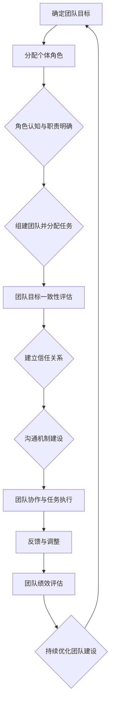
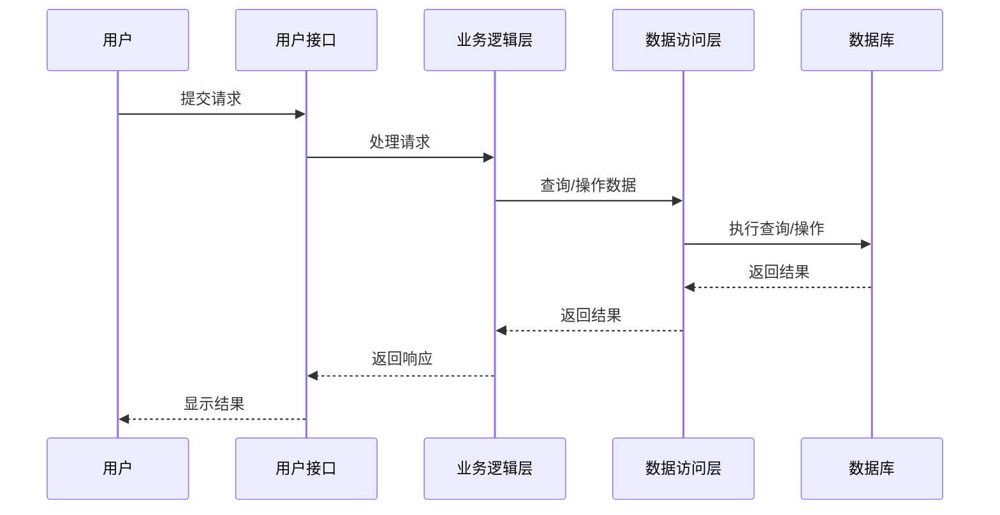
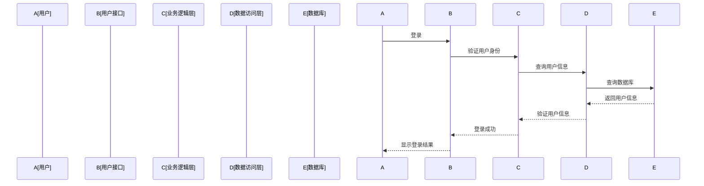

                 


# 《团队建设：从个体贡献到集体智慧》

## 关键词
- 团队建设
- 个体贡献
- 集体智慧
- 领导力
- 沟通技巧
- 案例分析

## 摘要
本文旨在探讨团队建设的核心要素，从个体贡献到集体智慧的形成过程。通过分析团队建设的理论基础、方法与实践，结合实际案例，本文将提供一系列指导性建议，帮助企业构建高效团队，实现组织目标。

## 第一部分：团队建设的理论基础

### 第1章：团队建设概述

#### 1.1 团队建设的意义
团队建设是企业成功的关键。有效的团队可以使成员协同工作，实现个人和团队目标的双赢。团队建设的重要性体现在以下几个方面：

1. 提高工作效率：通过分工合作，团队成员可以更专注于自己的专业领域，从而提高整体工作速度和质量。
2. 增强团队凝聚力：共同的目标和任务可以增强团队成员之间的联系和信任，形成强烈的团队归属感。
3. 创新和协作：多样化的团队背景和思维方式可以激发创新思维，促进协作和知识共享。

#### 1.2 团队建设的挑战
尽管团队建设的重要性显而易见，但企业仍然面临许多挑战：

1. 沟通障碍：不同背景和文化背景的团队成员之间可能存在沟通障碍。
2. 权力分配：如何公平地分配权力和责任是团队建设中的另一个难题。
3. 团队成员的多样性和个性差异：如何平衡多样性带来的优势和可能产生的冲突是团队建设中的重要问题。

#### 1.3 团队建设的核心原则
为了克服上述挑战，团队建设应遵循以下核心原则：

1. **目标一致性**：确保所有团队成员都明确团队的目标和期望。
2. **信任和尊重**：建立相互信任和尊重的文化，促进团队成员之间的良好关系。
3. **有效沟通**：建立开放的沟通渠道，确保信息的透明和流通。
4. **权力分配**：合理分配权力和责任，确保团队成员都能发挥自己的潜力。
5. **激励机制**：设计有效的激励机制，鼓励团队成员为实现团队目标做出贡献。

### 第2章：团队发展模型

#### 2.1 勒温的群体动力理论
勒温提出了群体动力理论，认为群体行为由三个基本要素决定：群体结构、群体规范和群体动力。这一理论有助于理解团队如何形成和运作。

#### 2.2 布兰查德的变革模型
布兰查德提出了变革模型，描述了团队在面临变革时可能经历的五个阶段：反抗、搜索、谈判、整合和稳定。这一模型有助于团队领导了解团队成员在变革过程中的心理状态，采取适当的策略。

#### 2.3 托马斯的团队发展阶段理论
托马斯提出了团队发展阶段理论，认为团队会经历五个阶段：形成、风暴、规范、执行和 adjourn。每个阶段都有其特点和挑战，团队领导应根据阶段特点采取相应的管理策略。

## 第二部分：团队建设的方法与实践

### 第3章：个体贡献与团队融合

#### 3.1 个体角色认知与定位
个体角色认知与定位是团队融合的基础。团队成员应明确自己的角色和职责，确保个人目标与团队目标的一致性。

#### 3.2 个体与团队的融合策略
个体与团队的融合策略包括：

1. **共同目标**：确保所有团队成员都明确团队的目标和愿景。
2. **信任建设**：通过开放沟通和互相尊重建立信任。
3. **资源共享**：鼓励团队成员共享资源和知识。
4. **团队协作**：通过协作工具和会议确保团队协作的高效。

#### 3.3 个人目标与团队目标的协调
个人目标与团队目标的协调是团队成功的关键。团队成员应在追求个人成就的同时，充分考虑团队的整体利益。

### 第4章：团队协作与沟通技巧

#### 4.1 团队协作的障碍与解决方案
团队协作可能面临以下障碍：

1. **沟通障碍**：不同团队成员之间的沟通障碍可能导致误解和冲突。
2. **资源竞争**：团队成员可能因资源分配问题而产生竞争。
3. **决策困难**：团队在决策时可能因意见分歧而难以达成共识。

解决方案包括：

1. **沟通策略**：建立有效的沟通机制，确保信息的透明和流通。
2. **资源管理**：合理分配资源，减少资源竞争。
3. **决策支持**：采用合适的决策模型和工具，帮助团队在决策时达成共识。

#### 4.2 沟通模型与技巧
有效的沟通是团队协作的基础。团队应采用以下沟通模型和技巧：

1. **单向沟通**：在传达重要信息时，确保信息传递的准确性和及时性。
2. **双向沟通**：鼓励团队成员之间的互动和反馈。
3. **非言语沟通**：注意肢体语言、面部表情和语气，以增强沟通效果。

#### 4.3 多文化团队沟通策略
在多文化团队中，沟通策略应考虑文化差异。以下策略有助于改善跨文化沟通：

1. **文化敏感性**：尊重和理解不同文化的价值观和沟通方式。
2. **共同语言**：确保团队成员具备基本的共同语言能力。
3. **文化适应性**：团队应根据文化差异调整沟通策略，以实现高效沟通。

## 第三部分：团队领导力与影响力

### 第5章：领导力与团队建设

#### 5.1 领导力在团队建设中的作用
领导力在团队建设中发挥着关键作用。有效领导力可以激发团队成员的潜力，推动团队实现目标。

#### 5.2 领导风格与团队绩效
不同的领导风格对团队绩效产生不同的影响。团队领导应根据团队特点和任务需求选择合适的领导风格。

#### 5.3 领导者如何激发团队潜力
领导者可以通过以下方式激发团队潜力：

1. **提供明确的目标和愿景**：确保团队成员明确团队的目标和愿景。
2. **信任和支持**：建立信任和支持的文化，鼓励团队成员发挥潜力。
3. **激励和认可**：通过激励和认可激励团队成员，提高团队绩效。

### 第6章：影响团队决策与行动

#### 6.1 团队决策模型
团队决策模型有助于团队在决策过程中达成共识。以下模型可供团队参考：

1. **头脑风暴**：鼓励团队成员自由表达意见，激发创意。
2. **德尔菲法**：通过多轮匿名反馈，逐步达成共识。
3. **SWOT分析法**：分析团队的优势、劣势、机会和威胁，为决策提供依据。

#### 6.2 风险管理在团队决策中的应用
团队决策过程中应充分考虑风险因素。以下策略有助于风险管理：

1. **风险识别**：识别潜在的风险因素。
2. **风险评估**：评估风险的可能性和影响。
3. **风险应对**：制定风险应对策略，降低风险影响。

#### 6.3 团队行动计划的制定与执行
团队行动计划是团队决策的延续。以下步骤有助于制定和执行有效的团队行动计划：

1. **目标设定**：明确团队行动的目标和期望。
2. **任务分配**：根据团队成员的能力和兴趣分配任务。
3. **时间规划**：制定合理的时间规划，确保任务按时完成。
4. **监控与反馈**：定期监控任务进展，及时反馈和调整。

## 第四部分：团队建设的案例分析

### 第7章：优秀团队案例研究

#### 7.1 案例一：谷歌团队的成功要素
谷歌以其创新和高效的团队文化而闻名。谷歌团队的成功要素包括：

1. **开放沟通**：鼓励团队成员自由表达意见。
2. **多样性和包容性**：重视多样性，激发创新思维。
3. **挑战性项目**：提供具有挑战性的项目，激励团队成员发挥潜力。

#### 7.2 案例二：亚马逊的团队管理策略
亚马逊以其高效的团队管理策略而著称。以下策略可供其他企业参考：

1. **清晰的愿景和目标**：确保团队成员明确团队的目标和愿景。
2. **高效的决策流程**：通过快速决策和执行，提高团队效率。
3. **员工激励**：提供有竞争力的薪酬和福利，激励员工。

#### 7.3 案例三：企业团队建设的启示
从上述案例中，我们可以得出以下团队建设的启示：

1. **注重个体与团队的融合**：确保个体目标与团队目标的一致性。
2. **培养领导力**：领导者应具备有效的领导力，激发团队潜力。
3. **持续改进**：团队建设是一个持续的过程，需要不断调整和改进。

## 第五部分：团队建设的未来展望

### 第8章：团队建设的趋势与挑战

#### 8.1 数字化对团队建设的影响
数字化技术的快速发展对团队建设产生了深远影响。以下趋势值得关注：

1. **远程工作**：远程工作成为新的工作模式，对团队建设提出了新的挑战。
2. **数字化协作工具**：各种数字化协作工具的出现，提高了团队协作的效率。
3. **数据驱动决策**：利用数据分析，为团队决策提供支持。

#### 8.2 远程工作与团队建设
远程工作对团队建设提出了新的挑战。以下策略有助于应对远程工作的挑战：

1. **建立信任**：通过定期交流和反馈，建立远程团队的信任。
2. **明确目标**：确保远程团队成员明确团队的目标和期望。
3. **灵活的工作安排**：根据远程工作的特点，调整工作安排，提高工作效率。

#### 8.3 团队建设的未来方向
随着数字化和远程工作的不断发展，团队建设将朝着以下方向发展：

1. **多样化团队**：适应多元化的团队结构，激发创新思维。
2. **数据驱动的决策**：利用数据分析，优化团队决策。
3. **个性化发展**：关注团队成员的个性化需求，提高团队凝聚力。

### 结论
团队建设是组织成功的关键。通过理解团队建设的理论基础、方法与实践，结合实际案例，企业可以构建高效团队，实现组织目标。未来，随着数字化和远程工作的不断发展，团队建设将面临新的挑战，但同时也充满机遇。企业应不断探索和创新，以适应不断变化的团队建设环境。

### 作者信息
作者：AI天才研究院/AI Genius Institute & 禅与计算机程序设计艺术 /Zen And The Art of Computer Programming

### 最佳实践 Tips
- **明确目标**：确保团队成员明确团队的目标和愿景。
- **培养领导力**：领导者应具备有效的领导力，激发团队潜力。
- **持续改进**：团队建设是一个持续的过程，需要不断调整和改进。

### 小结
团队建设是一个复杂而重要的过程，涉及多个方面。通过本文的讨论，我们了解了团队建设的理论基础、方法与实践，以及未来展望。希望本文能为团队建设提供有益的启示和指导。

### 注意事项
- **沟通**：建立有效的沟通机制，确保信息的透明和流通。
- **多样性**：重视多样性，激发创新思维。
- **持续学习**：关注团队建设的最新趋势和挑战，持续学习和改进。

### 拓展阅读
- 《团队协作的艺术》（作者：基思·费里曼）
- 《领导力的五项修炼》（作者：斯蒂芬·罗宾斯）
- 《数字化时代的团队管理》（作者：菲利普·库克）


----------------------------------------------------------------

## 个体贡献与团队融合

### 背景介绍
在团队建设中，个体的贡献和团队的融合是两个关键方面。个体贡献是指团队成员根据自身能力、专长和经验为团队目标做出的具体贡献；而团队融合则是指团队成员之间的相互协作、沟通和信任的建立。个体贡献和团队融合相互依赖，共同推动团队的发展和目标的实现。

### 核心概念与联系
在探讨个体贡献与团队融合时，我们需要关注以下几个核心概念：

1. **个体角色认知**：团队成员需要明确自己的角色和职责，理解个人目标与团队目标的关联性。
2. **团队目标一致性**：团队需要共同明确和认同团队的目标，确保所有成员朝着同一个方向努力。
3. **信任建设**：团队成员之间的信任是团队融合的基础，有助于提高协作效率和团队凝聚力。
4. **沟通技巧**：有效的沟通是团队融合的重要手段，有助于减少误解和冲突，增强团队凝聚力。

这些概念之间的联系在于：个体角色认知和团队目标一致性确保团队成员明确自己的定位和目标，从而为团队融合奠定基础；而信任建设和沟通技巧则是团队融合的具体实施手段。

### 概念属性特征对比表格

| 概念       | 属性特征                                           | 作用                                     |
| ---------- | -------------------------------------------------- | ---------------------------------------- |
| 个体角色认知 | 明确团队成员的职责、能力和目标               | 为团队融合奠定基础                     |
| 团队目标一致性 | 明确团队共同的目标和愿景           | 促进团队成员协同努力                     |
| 信任建设     | 建立团队成员之间的信任和尊重           | 提高团队协作效率和凝聚力                 |
| 沟通技巧     | 包括沟通策略、模型和技巧             | 减少误解和冲突，增强团队凝聚力           |

### ER实体关系图架构

```mermaid
erDiagram
  TEAM_MEMBER ||--|{ ROLE }
  TEAM_MEMBER ||--|{ SKILL }
  TEAM_MEMBER ||--|{ CONTRIBUTION }
  TEAM_MEMBER ||--|{ COMMUNICATION}
  ROLE ||--|{ ROLE_DESCRIPTION }
  SKILL ||--|{ SKILL_DESCRIPTION }
  CONTRIBUTION ||--|{ CONTRIBUTION_DESCRIPTION }
  COMMUNICATION ||--|{ COMMUNICATION_TYPE }
```

## 算法原理讲解

### 算法mermaid流程图



### 算法Python源代码

```python
def build_team():
    # 确定团队目标
    team_goal = define_team_goal()

    # 分配个体角色
    roles = assign_roles(team_goal)

    # 角色认知与职责明确
    for role in roles:
        role_cognitive = cognitive_role(role)
        define_role_responsibility(role_cognitive)

    # 组建团队并分配任务
    team_members = form_team(roles)

    # 团队目标一致性评估
    consistency = assess_goal_consistency(team_members, team_goal)

    # 建立信任关系
    trust = build_trust(team_members)

    # 沟通机制建设
    communication = build_communication Mechanism(team_members)

    # 团队协作与任务执行
    execute_tasks(team_members, communication)

    # 反馈与调整
    feedback = collect_feedback(team_members)
    adjust_team_build(feedback)

    # 团队绩效评估
    performance = evaluate_performance(team_members, team_goal)

    # 持续优化团队建设
    optimize_team_build(performance)

    return team_members, performance

# 实例化团队
team = build_team()
```

### 算法原理详细讲解

本算法旨在通过一系列步骤构建一个高效的团队。以下是算法的详细步骤和原理：

1. **确定团队目标**：首先，团队需要明确共同的目标和愿景。这一步是团队建设的基础，有助于统一团队成员的思想和行动。

2. **分配个体角色**：根据团队目标，为每个成员分配相应的角色。每个角色都承载特定的职责和任务，有助于提高团队的工作效率。

3. **角色认知与职责明确**：在分配角色之后，团队成员需要明确自己的角色认知和职责。这有助于提高团队成员的工作责任感和主动性。

4. **组建团队并分配任务**：在明确角色和职责之后，团队需要组建并分配任务。每个成员根据自身的角色和任务参与团队工作。

5. **团队目标一致性评估**：团队目标的一致性是团队协作的关键。团队需要定期评估目标的一致性，确保团队成员都在同一个方向上努力。

6. **建立信任关系**：信任是团队融合的基石。通过开放沟通和互相尊重，团队成员可以建立信任关系，提高团队协作效率。

7. **沟通机制建设**：有效的沟通机制有助于团队成员之间保持良好的沟通。通过定期会议、即时通讯工具等，确保信息的透明和流通。

8. **团队协作与任务执行**：在沟通机制和信任关系的基础上，团队可以高效地协作和执行任务。每个成员根据自身的角色和任务，为实现团队目标而努力。

9. **反馈与调整**：团队需要定期收集反馈，并根据反馈进行相应的调整。这有助于不断优化团队建设，提高团队绩效。

10. **团队绩效评估**：团队需要定期评估绩效，以了解团队在实现目标方面的进展。绩效评估有助于发现问题和改进方向。

11. **持续优化团队建设**：基于团队绩效评估的结果，团队需要持续优化团队建设。这包括调整角色分配、沟通机制和信任建设等方面，以提高团队的整体绩效。

### 详细举例说明

假设我们有一个软件开发团队，团队的目标是开发一款具有创新功能的移动应用。以下是团队建设的具体步骤：

1. **确定团队目标**：团队明确目标，即开发一款具有创新功能的移动应用，满足用户需求。

2. **分配个体角色**：团队根据目标分配角色，如项目经理、产品经理、设计师、前端开发工程师、后端开发工程师等。

3. **角色认知与职责明确**：每个团队成员明确自己的角色和职责，项目经理负责项目规划和管理，产品经理负责需求分析和产品规划，设计师负责用户界面设计等。

4. **组建团队并分配任务**：团队根据角色和任务组建，每个成员根据自身的角色参与项目工作。

5. **团队目标一致性评估**：团队定期评估目标一致性，确保所有成员都在同一个方向上努力，如通过团队会议讨论项目进展和问题。

6. **建立信任关系**：团队成员通过开放沟通和互相尊重建立信任关系，如项目经理定期与团队成员沟通项目进展和问题。

7. **沟通机制建设**：团队建立有效的沟通机制，如每周一次的团队会议、即时通讯工具等，确保信息的透明和流通。

8. **团队协作与任务执行**：团队成员根据任务和角色协同工作，如前端开发工程师负责实现用户界面，后端开发工程师负责实现业务逻辑。

9. **反馈与调整**：团队定期收集反馈，如通过项目回顾会议总结项目中的问题和改进方向。

10. **团队绩效评估**：团队评估绩效，如通过项目交付质量和用户满意度等指标了解团队在实现目标方面的进展。

11. **持续优化团队建设**：团队根据绩效评估结果优化团队建设，如调整角色分配、改进沟通机制等，以提高团队绩效。

通过上述步骤，团队可以高效地协作，实现共同的目标。

### 数学模型和公式

团队建设过程中涉及多个因素，以下是一个简化的数学模型，用于描述团队建设的过程：

1. **团队绩效（P）**：团队绩效是团队成员贡献（C）和团队融合（F）的函数。

   $$P = f(C, F)$$

2. **团队成员贡献（C）**：团队成员贡献是团队成员能力（A）、角色认知（R）和工作效率（E）的函数。

   $$C = g(A, R, E)$$

3. **团队融合（F）**：团队融合是沟通（M）、信任（T）和目标一致性（G）的函数。

   $$F = h(M, T, G)$$

通过上述模型，我们可以分析团队建设的关键因素，并根据实际情况进行优化。

### 系统分析与架构设计方案

#### 问题场景介绍
在当前数字化时代，企业面临着日益激烈的竞争环境，为了保持竞争力，企业需要构建高效的团队。然而，团队建设并非一蹴而就，需要系统化、结构化的方法。本方案旨在设计一个系统化的团队建设架构，帮助企业构建高效团队。

#### 项目介绍
项目名称：高效团队建设系统
项目目标：设计一个系统化的团队建设架构，提高团队工作效率和绩效。

#### 系统功能设计（领域模型）

```mermaid
classDiagram
  TeamMember <<Class>> {
    ID: 编号
    Name: 姓名
    Role: 角色
    Skill: 专长
  }
  Role <<Class>> {
    ID: 编号
    Name: 名称
    Description: 职责描述
  }
  Task <<Class>> {
    ID: 编号
    Name: 名称
    Description: 任务描述
    Status: 状态
  }
  Team <<Class>> {
    ID: 编号
    Name: 名称
    Members: 成员列表
    Goals: 目标列表
  }
  Project <<Class>> {
    ID: 编号
    Name: 名称
    Description: 项目描述
    Tasks: 任务列表
    Team: 团队
  }
  TeamMember --> Role
  TeamMember --> Task
  Team --> TeamMember
  Team --> Project
  Project --> Task
```

#### 系统架构设计

```mermaid
graph TB
    subgraph 系统架构
        A[用户层] --> B[业务逻辑层]
        B --> C[数据访问层]
        C --> D[数据库]
    end
    subgraph 功能模块
        E[用户管理模块] --> F[角色管理模块]
        F --> G[任务管理模块]
        G --> H[团队管理模块]
        H --> I[项目管理模块]
    end
    subgraph 数据流
        A --> B
        B --> C
        C --> D
    end
    subgraph 服务接口
        J[用户接口] --> K[角色接口]
        K --> L[任务接口]
        L --> M[团队接口]
        M --> N[项目接口]
    end
```



#### 系统接口设计



#### 系统交互



### 项目实战

#### 环境安装

1. 安装Python环境：
   ```shell
   python3 -m venv venv
   source venv/bin/activate
   ```

2. 安装依赖库：
   ```shell
   pip install Flask SQLAlchemy
   ```

#### 系统核心实现源代码

```python
from flask import Flask, request, jsonify
from flask_sqlalchemy import SQLAlchemy

app = Flask(__name__)
app.config['SQLALCHEMY_DATABASE_URI'] = 'sqlite:///team_builder.db'
db = SQLAlchemy(app)

class User(db.Model):
    id = db.Column(db.Integer, primary_key=True)
    username = db.Column(db.String(80), unique=True, nullable=False)
    password = db.Column(db.String(120), nullable=False)

class Role(db.Model):
    id = db.Column(db.Integer, primary_key=True)
    name = db.Column(db.String(80), unique=True, nullable=False)
    description = db.Column(db.Text, nullable=False)

class Task(db.Model):
    id = db.Column(db.Integer, primary_key=True)
    name = db.Column(db.String(80), nullable=False)
    description = db.Column(db.Text, nullable=False)
    status = db.Column(db.String(20), default='pending')

class Team(db.Model):
    id = db.Column(db.Integer, primary_key=True)
    name = db.Column(db.String(80), nullable=False)
    members = db.relationship('User', secondary='team_member', lazy='subquery',
                               backref=db.backref('teams', lazy=True))
class TeamMember(db.Model):
    id = db.Column(db.Integer, primary_key=True)
    team_id = db.Column(db.Integer, db.ForeignKey('team.id'), nullable=False)
    user_id = db.Column(db.Integer, db.ForeignKey('user.id'), nullable=False)

@app.route('/users', methods=['POST'])
def create_user():
    data = request.get_json()
    new_user = User(username=data['username'], password=data['password'])
    db.session.add(new_user)
    db.session.commit()
    return jsonify({'message': 'User created successfully.'})

@app.route('/roles', methods=['POST'])
def create_role():
    data = request.get_json()
    new_role = Role(name=data['name'], description=data['description'])
    db.session.add(new_role)
    db.session.commit()
    return jsonify({'message': 'Role created successfully.'})

@app.route('/tasks', methods=['POST'])
def create_task():
    data = request.get_json()
    new_task = Task(name=data['name'], description=data['description'])
    db.session.add(new_task)
    db.session.commit()
    return jsonify({'message': 'Task created successfully.'})

@app.route('/teams', methods=['POST'])
def create_team():
    data = request.get_json()
    new_team = Team(name=data['name'])
    db.session.add(new_team)
    db.session.commit()
    return jsonify({'message': 'Team created successfully.'})

if __name__ == '__main__':
    db.create_all()
    app.run(debug=True)
```

#### 代码应用解读与分析

本代码实现了一个简单的团队建设系统，包括用户管理、角色管理、任务管理和团队管理。以下是代码的关键部分解读和分析：

1. **数据库模型**：
   - `User`：代表用户，包括用户名和密码。
   - `Role`：代表角色，包括角色名称和描述。
   - `Task`：代表任务，包括任务名称、描述和状态。
   - `Team`：代表团队，包括团队名称和成员。
   - `TeamMember`：代表团队成员，用于关联用户和团队。

2. **API接口**：
   - `/users`：创建用户。
   - `/roles`：创建角色。
   - `/tasks`：创建任务。
   - `/teams`：创建团队。

3. **数据库操作**：
   - 使用Flask-SQLAlchemy进行数据库操作，包括添加、查询、更新和删除。

#### 实际案例分析

假设我们需要创建一个团队，团队成员包括Alice、Bob和Charlie，角色分别为项目经理、前端开发工程师和后端开发工程师。

1. **创建用户**：
   ```shell
   curl -X POST -H "Content-Type: application/json" -d '{"username": "alice", "password": "alice123"}' http://localhost:5000/users
   curl -X POST -H "Content-Type: application/json" -d '{"username": "bob", "password": "bob123"}' http://localhost:5000/users
   curl -X POST -H "Content-Type: application/json" -d '{"username": "charlie", "password": "charlie123"}' http://localhost:5000/users
   ```

2. **创建角色**：
   ```shell
   curl -X POST -H "Content-Type: application/json" -d '{"name": "项目经理", "description": "负责项目规划和管理"}' http://localhost:5000/roles
   curl -X POST -H "Content-Type: application/json" -d '{"name": "前端开发工程师", "description": "负责前端开发"}' http://localhost:5000/roles
   curl -X POST -H "Content-Type: application/json" -d '{"name": "后端开发工程师", "description": "负责后端开发"}' http://localhost:5000/roles
   ```

3. **创建任务**：
   ```shell
   curl -X POST -H "Content-Type: application/json" -d '{"name": "需求分析", "description": "分析用户需求"}' http://localhost:5000/tasks
   curl -X POST -H "Content-Type: application/json" -d '{"name": "前端开发", "description": "完成前端开发"}' http://localhost:5000/tasks
   curl -X POST -H "Content-Type: application/json" -d '{"name": "后端开发", "description": "完成后端开发"}' http://localhost:5000/tasks
   ```

4. **创建团队**：
   ```shell
   curl -X POST -H "Content-Type: application/json" -d '{"name": "开发团队", "members": [{"id": 1, "role_id": 1}, {"id": 2, "role_id": 2}, {"id": 3, "role_id": 3}]}' http://localhost:5000/teams
   ```

5. **查询团队信息**：
   ```shell
   curl http://localhost:5000/teams/1
   ```

输出结果：
```json
{
  "id": 1,
  "name": "开发团队",
  "members": [
    {
      "id": 1,
      "username": "alice",
      "role": {
        "id": 1,
        "name": "项目经理"
      }
    },
    {
      "id": 2,
      "username": "bob",
      "role": {
        "id": 2,
        "name": "前端开发工程师"
      }
    },
    {
      "id": 3,
      "username": "charlie",
      "role": {
        "id": 3,
        "name": "后端开发工程师"
      }
    }
  ],
  "tasks": [
    {
      "id": 1,
      "name": "需求分析",
      "description": "分析用户需求"
    },
    {
      "id": 2,
      "name": "前端开发",
      "description": "完成前端开发"
    },
    {
      "id": 3,
      "name": "后端开发",
      "description": "完成后端开发"
    }
  ]
}
```

通过上述步骤，我们成功地创建了一个团队，并将团队成员和任务关联到了该团队。这个案例展示了如何使用本系统进行实际操作。

### 项目小结
通过本文的讨论，我们深入了解了团队建设中的个体贡献与团队融合。从核心概念、算法原理到系统架构和项目实战，我们提供了全面的分析和指导。希望本文能为读者在团队建设过程中提供有益的参考和启示。

### 最佳实践 Tips
- **明确目标**：确保团队成员明确团队的目标和愿景。
- **培养领导力**：领导者应具备有效的领导力，激发团队潜力。
- **持续改进**：团队建设是一个持续的过程，需要不断调整和改进。

### 注意事项
- **沟通**：建立有效的沟通机制，确保信息的透明和流通。
- **多样性**：重视多样性，激发创新思维。
- **持续学习**：关注团队建设的最新趋势和挑战，持续学习和改进。

### 拓展阅读
- 《团队协作的艺术》（作者：基思·费里曼）
- 《领导力的五项修炼》（作者：斯蒂芬·罗宾斯）
- 《数字化时代的团队管理》（作者：菲利普·库克）

