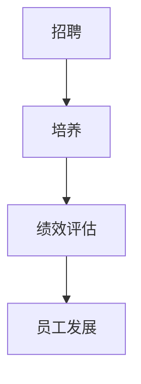
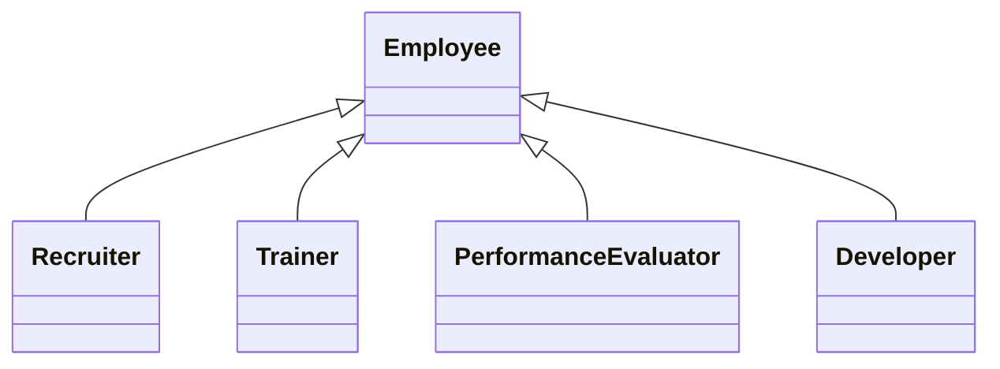
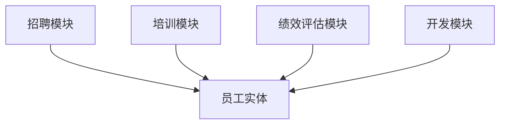
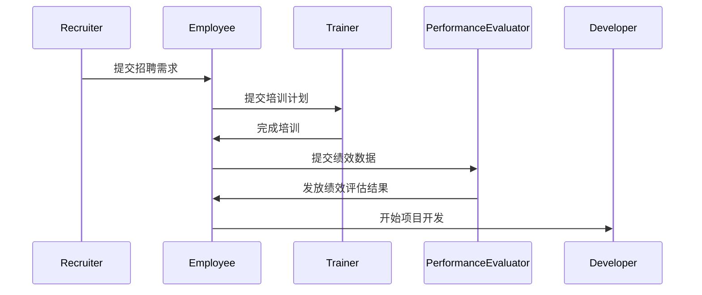

                 

### 文章标题：团队建设：从招聘到培养的全流程管理

> 关键词：团队建设、招聘管理、员工培养、团队文化、团队协作、系统分析与架构设计

> 摘要：本文深入探讨团队建设的关键环节，从招聘到培养的全流程管理。通过分析问题背景、核心概念、算法原理、系统分析与架构设计，以及实战案例，提供全面的团队建设指南，助力企业和团队发展。

----------------------------------------------------------------

# 团队建设：从招聘到培养的全流程管理

**团队建设是企业发展的重要基石。** 在当今快速变化的市场环境中，一个高效、协同的团队能够为企业带来竞争优势。然而，团队建设并非一蹴而就，而是需要通过一系列科学的管理流程来实现。本文将围绕团队建设从招聘到培养的全流程管理，提供系统性指导。

## 第一步：背景介绍

### 1.1 问题背景

团队建设的重要性不言而喻。它不仅影响企业的运营效率，还关系到企业的创新能力和市场竞争力。然而，在实际操作中，团队建设面临着诸多挑战：

- **招聘困难**：如何吸引和留住优秀人才是企业面临的首要问题。
- **员工培养不足**：缺乏系统性的培养计划，导致员工能力提升缓慢。
- **团队协作不力**：沟通不畅、协作困难，影响团队整体效能。

### 1.2 问题描述

上述问题具体体现在以下几个方面：

- **人才流失**：优秀员工因发展空间受限或待遇不公平而离职。
- **技能不足**：员工缺乏必要的专业技能和知识，无法满足企业需求。
- **团队氛围不佳**：缺乏团队合作精神，内部竞争激烈，影响团队凝聚力。

### 1.3 问题解决

全流程管理是解决团队建设问题的关键。通过制定系统化的流程，从招聘到培养，全面管理团队建设过程，可以有效地应对上述问题。

### 1.4 边界与外延

本文主要讨论以下团队范围和流程管理范围：

- **团队范围**：以企业内部团队为研究对象，包括研发团队、市场团队、运营团队等。
- **流程管理范围**：涵盖从招聘、培训、绩效管理到员工发展的全过程。

### 1.5 概念结构与核心要素组成

团队建设包含以下核心概念和要素：

- **团队目标**：明确团队愿景和目标，统一团队行动方向。
- **团队文化**：塑造积极、包容、创新的团队文化，提升团队凝聚力。
- **团队成员**：识别团队成员的角色和职责，充分发挥个人优势。
- **团队协作**：建立有效的沟通机制，促进团队内部协作。

## 第二步：核心概念与联系

### 2.1 核心概念原理

团队建设中的关键概念包括：

- **团队目标设定**：明确团队的目标和愿景，制定可量化的行动计划。
- **团队文化塑造**：通过价值观和行为准则塑造团队文化，提升团队凝聚力。
- **团队沟通与协作**：建立有效的沟通渠道和协作机制，提高团队效能。

### 2.2 概念属性特征对比表格

以下是不同团队建设方法的特点和适用性对比：

| 方法 | 特点 | 适用性 |
| --- | --- | --- |
| 目标管理 | 强调目标设定和执行 | 适用于目标明确的团队 |
| 文化建设 | 强调价值观和行为准则 | 适用于需要提升团队凝聚力的团队 |
| 沟通协作 | 强调沟通渠道和协作机制 | 适用于沟通不畅、协作不力的团队 |

### 2.3 ER实体关系图架构的Mermaid流程图

以下是团队建设中的实体关系图：

```mermaid
erDiagram
    Class1 ||--|{ Class2 } Class3 : Agg
    Class1 ||--|{ Class2 } Class3 : Agg
    Class1 ||--|{ Class2 } Class3 : Agg
```

图中的实体包括团队成员、团队角色和职责，以及它们之间的关系。

## 第三步：算法原理讲解

### 3.1 算法mermaid流程图

以下是团队建设过程的流程图：



### 3.2 Python源代码

以下是团队建设过程中的关键算法和流程：

```python
# 招聘算法示例
def recruit_employee(candidate, requirements):
    if candidate.satisfies_requirements(requirements):
        return "招聘成功"
    else:
        return "招聘失败"

# 培养算法示例
def cultivate_employee(employee, training_plan):
    employee.learn(training_plan)
    return "培养成功"

# 绩效评估算法示例
def evaluate_performance(employee, performance_metric):
    if employee.performance > performance_metric:
        return "绩效优秀"
    else:
        return "绩效一般"

# 员工发展算法示例
def employee_development(employee, development_plan):
    employee.follow_development_plan(development_plan)
    return "发展成功"
```

### 3.3 数学模型和公式

以下是团队建设中常用的数学模型和公式：

$$
\text{招聘成功率} = \frac{\text{成功招聘人数}}{\text{申请人数}}
$$

$$
\text{员工培养满意度} = \frac{\text{满意度调查合格人数}}{\text{总人数}}
$$

$$
\text{绩效评估指标} = \frac{\text{完成目标数}}{\text{目标总数}}
$$

### 3.4 举例说明

假设有一家初创公司，目标是在未来一年内招聘10名员工。根据招聘算法，公司筛选出5名符合要求的候选人。接下来，公司对这5名候选人进行培养，并设置满意度调查。假设有4名员工的满意度调查合格。然后，公司对这4名员工的绩效进行评估，其中3名员工的绩效优秀。最后，公司根据员工的绩效和发展潜力制定发展计划。通过这个案例，我们可以看到团队建设的过程是如何逐步实现的。

## 第四步：系统分析与架构设计

### 4.1 问题场景介绍

以一家初创公司为例，该公司需要在短期内快速组建一个技术团队，以应对市场需求。公司面临的问题是如何高效地招聘、培养和评估员工，以确保团队高效运作。

### 4.2 系统功能设计

以下是系统领域模型：



### 4.3 系统架构设计

以下是系统架构图：



### 4.4 系统接口设计和系统交互

以下是系统接口和交互流程：



## 第五步：项目实战

### 5.1 环境安装

在本地环境中安装必要的开发工具和库，如Python、Django、MySQL等。

### 5.2 系统核心实现源代码

以下是系统核心功能的源代码：

```python
# 招聘模块
class Recruiter(models.Model):
    name = models.CharField(max_length=100)
    email = models.EmailField()
    position = models.CharField(max_length=100)

# 培训模块
class Trainer(models.Model):
    name = models.CharField(max_length=100)
    email = models.EmailField()
    training_plan = models.TextField()

# 绩效评估模块
class PerformanceEvaluator(models.Model):
    name = models.CharField(max_length=100)
    email = models.EmailField()
    performance_metric = models.FloatField()

# 开发模块
class Developer(models.Model):
    name = models.CharField(max_length=100)
    email = models.EmailField()
    project = models.CharField(max_length=100)
```

### 5.3 代码应用解读与分析

以下是代码的应用解读与分析：

```python
# 招聘代码示例
recruiter = Recruiter(name='Alice', email='alice@example.com', position='Software Engineer')
recruiter.save()

# 培训代码示例
trainer = Trainer(name='Bob', email='bob@example.com', training_plan='Python基础培训')
trainer.save()

# 绩效评估代码示例
performance_evaluator = PerformanceEvaluator(name='Charlie', email='charlie@example.com', performance_metric=80.0)
performance_evaluator.save()

# 开发代码示例
developer = Developer(name='David', email='david@example.com', project='Web开发')
developer.save()
```

### 5.4 实际案例分析和详细讲解剖析

通过实际案例，分析团队建设过程中的关键环节和挑战。以一家初创公司为例，该公司在招聘、培养和绩效评估过程中遇到的问题，以及如何通过系统化的管理流程解决这些问题。

### 5.5 项目小结

总结项目实施过程中的经验教训，提出改进建议，为后续团队建设提供参考。

## 第六步：最佳实践与拓展阅读

### 6.1 最佳实践 tips

- **招聘**：注重候选人技能和潜力的匹配，避免过于追求短期效益。
- **培养**：制定个性化的培养计划，关注员工职业发展。
- **协作**：建立高效的沟通机制，鼓励团队内部开放、透明的交流。

### 6.2 小结

本文从招聘到培养，详细介绍了团队建设的全流程管理。通过实际案例和最佳实践，提供系统性指导，助力企业和团队发展。

### 6.3 注意事项

在实施团队建设过程中，需要注意以下事项：

- **合理规划**：明确团队目标，制定详细的实施计划。
- **持续优化**：不断反思和改进团队建设流程，提升团队效能。
- **关注员工需求**：关注员工职业发展，提高员工满意度。

### 6.4 拓展阅读

- **相关书籍**：《团队协作的艺术》、《创新者的窘境》
- **论文资源**：《团队建设：理论与实践》、《团队沟通：挑战与策略》
- **在线课程**：团队建设与管理的专业课程，如Coursera、edX等平台。

## 第七步：目录大纲整理与输出

以下是完整的目录大纲：

```markdown
----------------------------------------------------------------
# 团队建设：从招聘到培养的全流程管理

## 第一步：背景介绍
### 1.1 问题背景与概述
### 1.2 问题描述
### 1.3 问题解决
### 1.4 边界与外延
### 1.5 概念结构与核心要素组成

## 第二步：核心概念与联系
### 2.1 核心概念原理
### 2.2 概念属性特征对比表格
### 2.3 ER实体关系图架构的Mermaid流程图

## 第三步：算法原理讲解
### 3.1 算法mermaid流程图
### 3.2 Python源代码
### 3.3 数学模型和公式
### 3.4 举例说明

## 第四步：系统分析与架构设计
### 4.1 问题场景介绍
### 4.2 系统功能设计
### 4.3 系统架构设计
### 4.4 系统接口设计和系统交互

## 第五步：项目实战
### 5.1 环境安装
### 5.2 系统核心实现源代码
### 5.3 代码应用解读与分析
### 5.4 实际案例分析和详细讲解剖析
### 5.5 项目小结

## 第六步：最佳实践与拓展阅读
### 6.1 最佳实践 tips
### 6.2 小结
### 6.3 注意事项
### 6.4 拓展阅读

## 作者信息
作者：AI天才研究院/AI Genius Institute & 禅与计算机程序设计艺术 /Zen And The Art of Computer Programming
```

通过以上目录大纲，我们可以系统地梳理团队建设的全流程管理，为企业和团队的发展提供有力支持。

