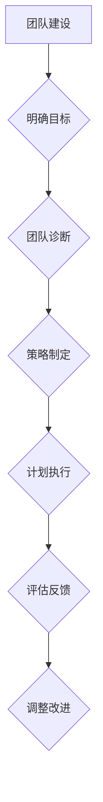
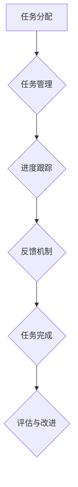
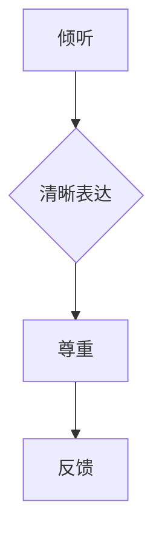

                 

## 第1章：团队建设的重要性与挑战

### 1.1 问题背景

在当今竞争激烈的市场环境中，团队建设已经成为企业成功的关键因素之一。一个高效的团队可以促进创新、提高生产力，并且能够更好地应对市场变化。然而，团队建设并非易事，它面临着诸多挑战。

首先，团队成员之间的沟通与协作是一个关键问题。不同的团队成员拥有不同的背景、技能和经验，如何将这些差异转化为团队的优势，而不是障碍，是需要解决的首要问题。此外，团队成员之间的信任和相互尊重也是建立高效团队的重要基石。

其次，团队成员的多样性和文化差异也给团队建设带来了挑战。在多元文化团队中，如何处理文化冲突、尊重不同的观点和价值观，是一个复杂的课题。

再者，团队的目标设定和任务分配也是团队建设的重要组成部分。明确的目标和合理的任务分配可以激发团队成员的积极性和创造力，而模糊的目标和不当的任务分配则可能导致团队效率低下。

### 1.2 核心概念

团队建设的关键概念包括团队的定义、团队建设的要素、团队协作工具与方法论。首先，团队可以被定义为共同追求特定目标的一组人。其次，团队建设的要素包括沟通、信任、协作、目标设定和领导力。最后，团队协作工具与方法论包括敏捷方法论、团队角色与职责分配以及团队沟通与协作技巧。

### 1.3 团队建设的理论框架

团队建设理论框架由经典团队建设理论、团队建设的关键成功因素和团队建设流程组成。经典团队建设理论包括形成期、冲突期、规范期、执行期和休整期。团队建设的关键成功因素包括领导力、团队文化、资源支持和持续改进。团队建设流程包括团队诊断、目标设定、策略制定、计划执行和评估反馈。

### 1.4 团队建设工具与方法论

在团队建设工具与方法论方面，敏捷方法论是一个重要的工具。敏捷方法论强调快速迭代、持续反馈和团队协作，有助于提高团队效率和适应性。此外，团队角色与职责分配也是团队建设的关键，它有助于明确团队成员的职责和角色，促进团队协作。团队沟通与协作技巧包括有效沟通的基本原则、沟通障碍的解决策略和沟通工具的使用。

### 1.5 本章小结

本章介绍了团队建设的重要性、核心概念、理论框架和工具方法。团队建设不仅是企业成功的关键，也是一个复杂的过程，需要有效的理论指导和实际操作。在接下来的章节中，我们将进一步探讨团队建设的策略、计划、团队文化建设和团队沟通与协作。

## 第2章：团队建设策略与计划

### 2.1 团队建设策略

团队建设策略是确保团队朝着共同目标前进的重要步骤。首先，团队建设的战略规划是关键。这包括明确团队的目标、使命和愿景，以及制定实现这些目标的策略。其次，团队建设的资源分配也是必不可少的。这包括人力资源、技术资源和财务资源的合理分配，以确保团队能够有效地开展工作。

#### 2.1.1 团队建设的战略规划

团队建设的战略规划应该基于企业的整体战略，并与企业的目标保持一致。这包括以下步骤：

1. **明确团队目标**：确定团队的目标，这些目标应该是具体的、可衡量的、可实现的和有时限的（SMART原则）。
2. **使命与愿景**：明确团队的使命和愿景，这是团队长期发展的方向。
3. **策略制定**：根据团队的目标和愿景，制定具体的策略，如团队角色分配、任务分配、沟通计划等。
4. **行动计划**：将策略转化为具体的行动，并制定时间表和里程碑，以确保团队能够按计划推进。

#### 2.1.2 团队建设的资源分配

资源分配是团队建设的关键环节。这包括以下几个方面：

1. **人力资源**：根据团队的任务和目标，合理分配人力资源，确保每个成员都能发挥其最大潜力。
2. **技术资源**：提供必要的技术支持，如软件工具、硬件设备等，以支持团队的工作。
3. **财务资源**：确保团队有足够的财务支持，以满足团队建设和运营的需求。

#### 2.1.3 团队建设的时间表与里程碑

制定时间表和里程碑是确保团队建设顺利进行的重要措施。这包括以下步骤：

1. **确定时间表**：根据团队的目标和任务，制定一个详细的时间表，明确每个阶段的工作内容和时间安排。
2. **设置里程碑**：在时间表的基础上，设置里程碑，以便团队能够在关键节点上评估进展情况，并根据需要进行调整。

### 2.2 团队建设计划

团队建设计划是将策略转化为具体行动的过程。这包括以下步骤：

#### 2.2.1 团队建设的目标设定

目标设定是团队建设计划的基础。这包括以下步骤：

1. **明确目标**：根据团队的战略规划，明确团队的目标，并确保这些目标与企业的整体目标一致。
2. **分解目标**：将整体目标分解为具体的、可执行的任务，并为每个任务分配责任和资源。
3. **设定优先级**：根据任务的紧急程度和重要性，设定任务的优先级，确保团队能够首先完成最重要的任务。

#### 2.2.2 团队建设的活动设计

活动设计是将目标转化为具体行动的过程。这包括以下步骤：

1. **设计活动**：根据任务和责任分配，设计具体的活动，如会议、培训、项目执行等。
2. **分配资源**：为每个活动分配必要的资源，包括人力资源、技术资源和财务资源。
3. **制定时间表**：为每个活动制定详细的时间表，明确活动的开始和结束时间。

#### 2.2.3 团队建设的评估与反馈

评估与反馈是团队建设计划的重要组成部分。这包括以下步骤：

1. **评估进展**：定期评估团队建设计划的进展情况，确保团队能够按照计划推进。
2. **收集反馈**：收集团队成员的反馈，了解他们的意见和建议，以便对计划进行调整。
3. **调整计划**：根据评估和反馈，对团队建设计划进行调整，确保团队能够更好地实现目标。

### 2.3 团队建设案例分析

以下是一个团队建设案例的分析：

#### 2.3.1 案例背景

某科技公司成立了一个新产品开发团队，旨在开发一款具有竞争力的软件产品。然而，团队成员来自不同的部门，彼此之间缺乏了解和信任，导致团队工作效率低下。

#### 2.3.2 案例实施步骤

1. **明确目标**：团队首先明确了产品的目标市场、功能需求和预期效果。
2. **团队诊断**：通过问卷调查和团队讨论，了解团队成员的背景、技能和期望。
3. **策略制定**：根据团队诊断结果，制定了详细的团队建设策略，包括沟通计划、培训计划和资源分配计划。
4. **计划执行**：按照计划，团队成员参与了沟通培训，开展了多次团队会议，并共同制定了项目计划。
5. **评估与反馈**：定期评估团队建设的进展情况，并根据反馈进行调整。

#### 2.3.3 案例结果与分析

通过团队建设计划，新产品开发团队的工作效率得到了显著提高。团队成员之间的沟通更加顺畅，彼此之间的信任和合作也得到了增强。最终，团队成功开发出了一款具有竞争力的软件产品，并取得了良好的市场反响。

### 2.4 本章小结

本章介绍了团队建设策略和计划的重要性，并通过案例分析展示了团队建设计划的实施步骤和效果。有效的团队建设策略和计划可以帮助团队更好地实现目标，提高工作效率和团队凝聚力。

## 第3章：团队文化建设

### 3.1 团队文化的定义

团队文化是指团队内部成员共同遵循的一套价值观、信仰、行为准则和工作方式。它不仅影响团队成员的行为和态度，还直接影响团队的整体表现和效率。团队文化是团队建设的重要组成部分，是确保团队凝聚力、协作和创新能力的关键因素。

#### 3.1.1 团队文化的内涵

团队文化的内涵包括以下几个方面：

1. **价值观**：团队文化的核心价值观是团队成员共同认可和追求的目标，如诚信、创新、协作等。
2. **信仰**：团队文化中的信仰是团队成员共同坚持的信念，如对产品品质的追求、对客户服务的重视等。
3. **行为准则**：团队文化中的行为准则是团队成员在工作和生活中遵循的行为规范，如礼貌待人、尊重他人等。
4. **工作方式**：团队文化中的工作方式是指团队成员共同认可的工作方法和流程，如快速响应、持续改进等。

#### 3.1.2 团队文化与团队绩效的关系

团队文化与团队绩效之间存在着密切的关系。首先，积极向上的团队文化可以激发团队成员的工作热情和创造力，提高团队的整体绩效。其次，良好的团队文化可以增强团队成员之间的信任和协作，减少内部冲突，提高团队的凝聚力和执行力。此外，团队文化还可以帮助团队在面对挑战和变化时保持灵活性和适应性，从而更好地实现团队目标。

### 3.2 团队文化的建设方法

建设团队文化是一个长期的过程，需要团队成员的共同努力和持续投入。以下是一些有效的团队文化建设方法：

#### 3.2.1 团队价值观的塑造

团队价值观的塑造是团队文化建设的基础。这包括以下几个方面：

1. **明确价值观**：团队领导者需要明确团队的价值观，并确保每个团队成员都了解并认可这些价值观。
2. **宣传价值观**：通过内部宣传、培训、会议等方式，不断强调团队的价值观，让团队成员时刻牢记并践行。
3. **实践价值观**：团队领导者需要以身作则，带头践行团队的价值观，为其他成员树立榜样。

#### 3.2.2 团队精神的培育

团队精神的培育是团队文化建设的关键。这包括以下几个方面：

1. **建立信任**：通过团队建设活动和沟通，建立团队成员之间的信任，增强团队凝聚力。
2. **培养归属感**：通过关怀和支持，让团队成员感受到团队是一个大家庭，增强他们的归属感。
3. **激发积极性**：通过激励和奖励，激发团队成员的工作积极性，促进团队精神的发展。

#### 3.2.3 团队行为规范的制定

团队行为规范的制定是团队文化建设的重要保障。这包括以下几个方面：

1. **明确规范**：根据团队的价值观和目标，制定具体的团队行为规范，确保团队成员的行为符合团队文化的要求。
2. **宣传规范**：通过内部宣传、培训等方式，让团队成员了解和熟悉团队行为规范。
3. **执行规范**：建立监督和考核机制，确保团队行为规范得到有效执行。

### 3.3 团队文化建设案例分析

以下是一个团队文化建设案例的分析：

#### 3.3.1 案例背景

某互联网公司在其发展过程中，意识到团队文化建设的重要性，并决定通过一系列措施来打造具有竞争力的团队文化。

#### 3.3.2 案例文化建设过程

1. **明确价值观**：公司领导层明确了公司的核心价值观，如客户至上、创新驱动、团队合作等，并通过内部邮件、海报等方式广泛宣传。
2. **团队建设活动**：公司定期组织团队建设活动，如团队拓展训练、团队聚餐等，增强团队成员之间的交流和信任。
3. **员工关怀**：公司注重员工关怀，为员工提供良好的工作环境和发展机会，增强员工的归属感。
4. **行为规范**：公司制定了详细的行为规范，如着装要求、工作时间规定等，确保团队成员的行为符合公司文化。

#### 3.3.3 案例效果评估

通过一系列团队文化建设措施，该公司的团队凝聚力得到了显著提升，员工的工作满意度也有所提高。公司的项目完成质量和客户满意度也有所提升，为公司带来了良好的经济效益。

### 3.4 本章小结

本章介绍了团队文化的定义、内涵和建设方法，并通过案例分析展示了团队文化建设的效果。团队文化建设是团队建设的重要环节，有效的团队文化可以增强团队的凝聚力、协作力和创新能力，促进团队的长远发展。

## 第4章：团队沟通与协作

### 4.1 团队沟通的重要性

团队沟通是团队建设的重要组成部分，它对于团队的整体表现和效率具有决定性的影响。有效的沟通可以帮助团队成员更好地理解彼此的需求和期望，减少误解和冲突，提高团队的工作效率和协作能力。

#### 4.1.1 团队沟通的障碍

尽管沟通在团队中至关重要，但团队沟通常常面临各种障碍。以下是一些常见的沟通障碍：

1. **语言障碍**：团队成员来自不同的地区和文化背景，可能使用不同的语言或方言，这可能导致沟通不畅。
2. **文化差异**：文化差异可能导致团队成员对某些沟通方式的理解不同，从而影响沟通效果。
3. **信息过滤**：在沟通过程中，信息可能会被误解或被过滤，导致信息的失真。
4. **情绪障碍**：团队成员的情绪状态可能会影响沟通的效果，如焦虑、愤怒等情绪可能导致沟通失败。
5. **时间压力**：时间紧迫可能导致团队成员无法进行充分的沟通，从而影响沟通的质量。

#### 4.1.2 团队沟通的目的

团队沟通的主要目的是确保信息的准确传递，促进团队成员之间的理解与合作。具体来说，团队沟通的目的包括：

1. **传递信息**：确保团队成员能够及时获得与工作相关的信息，如任务分配、进度更新等。
2. **解决冲突**：通过沟通，团队成员可以共同解决问题，减少冲突和误解。
3. **提高效率**：有效的沟通可以帮助团队成员更好地协作，提高工作效率。
4. **增强团队凝聚力**：通过沟通，团队成员可以增进了解，增强团队的凝聚力。

### 4.2 团队沟通技巧

为了克服沟通障碍，提高沟通效果，团队成员需要掌握一些有效的沟通技巧。以下是一些常见的团队沟通技巧：

#### 4.2.1 有效沟通的基本原则

1. **倾听**：倾听是有效沟通的基础，团队成员需要认真倾听对方的观点和需求，避免打断和误解。
2. **清晰表达**：团队成员需要用清晰、简洁的语言表达自己的观点和需求，避免使用模糊或含糊的措辞。
3. **尊重**：在沟通中，团队成员需要尊重彼此的观点和意见，避免争吵和攻击。
4. **反馈**：团队成员需要及时给予反馈，确保对方了解自己的观点和感受。

#### 4.2.2 沟通障碍的解决策略

1. **明确沟通目标**：在沟通前，明确沟通的目标和内容，确保双方都了解沟通的目的。
2. **选择合适的沟通方式**：根据沟通的内容和目标，选择合适的沟通方式，如面对面沟通、邮件、电话等。
3. **使用非语言沟通**：通过肢体语言、面部表情等非语言方式，辅助语言沟通，增强沟通效果。
4. **培养跨文化沟通能力**：团队成员需要了解和尊重不同文化的沟通方式，提高跨文化沟通能力。

#### 4.2.3 沟通工具的使用

现代团队沟通工具可以帮助团队成员更高效地进行沟通。以下是一些常用的团队沟通工具：

1. **即时通讯工具**：如Slack、WhatsApp等，用于实时沟通和协作。
2. **邮件**：用于正式的沟通和记录。
3. **视频会议工具**：如Zoom、Microsoft Teams等，用于远程会议和协作。
4. **项目管理工具**：如Trello、Jira等，用于任务分配和进度跟踪。

### 4.3 团队协作工具与方法

团队协作工具和方法可以提高团队的工作效率和协作能力。以下是一些常用的团队协作工具和方法：

#### 4.3.1 团队协作工具的选择

1. **任务管理工具**：如Trello、Asana等，用于任务分配、进度跟踪和协作。
2. **文档协作工具**：如Google Docs、Microsoft Teams等，用于多人实时编辑和协作。
3. **项目管理工具**：如Jira、Microsoft Project等，用于项目计划、进度跟踪和资源管理。
4. **沟通工具**：如Slack、Microsoft Teams等，用于实时沟通和协作。

#### 4.3.2 团队协作流程的优化

1. **明确流程**：制定明确的团队协作流程，确保团队成员知道各自的任务和责任。
2. **标准化文档**：制定标准化的文档模板，确保文档格式和内容的一致性。
3. **实时更新**：确保所有团队成员都能实时访问最新的文档和任务信息。

#### 4.3.3 团队协作的评估与改进

1. **定期评估**：定期评估团队协作的效果，识别问题和改进机会。
2. **反馈机制**：建立有效的反馈机制，鼓励团队成员提出改进建议。
3. **持续改进**：根据评估和反馈，持续优化团队协作流程和工具。

### 4.4 团队协作案例分析

以下是一个团队协作案例的分析：

#### 4.4.1 案例背景

某互联网公司的一个产品开发团队，由于团队成员分布在不同的城市，沟通和协作成为了一大挑战。为了提高团队的协作效率，公司决定引入一系列团队协作工具和方法。

#### 4.4.2 案例协作过程

1. **选择协作工具**：公司选择了Trello和Slack作为主要协作工具，用于任务分配和实时沟通。
2. **制定协作流程**：团队制定了明确的协作流程，包括任务分配、进度跟踪和反馈机制。
3. **实时沟通**：团队成员通过Slack进行实时沟通，确保信息传递的及时性和准确性。
4. **任务管理**：团队成员通过Trello管理任务，确保任务的分配和进度跟踪。
5. **文档协作**：团队成员使用Google Docs进行文档协作，确保文档的实时更新和共享。

#### 4.4.3 案例效果评估

通过引入团队协作工具和方法，该产品开发团队的协作效率得到了显著提高。团队成员之间的沟通更加顺畅，任务分配和进度跟踪更加高效，项目的完成质量和客户满意度也得到了提升。

### 4.5 本章小结

本章介绍了团队沟通与协作的重要性、障碍、技巧和工具方法，并通过案例分析展示了团队协作的效果。有效的沟通与协作是团队成功的关键，通过掌握有效的沟通技巧和协作工具，团队可以更好地应对挑战，实现共同目标。

## 第5章：团队建设最佳实践

### 5.1 最佳实践 Tips

1. **明确目标**：确保团队的目标清晰、具体，并与企业的整体目标一致。
2. **建立信任**：通过团队建设活动和沟通，建立团队成员之间的信任。
3. **培养归属感**：通过关怀和支持，让团队成员感受到团队的温暖和归属。
4. **持续学习**：鼓励团队成员持续学习，提高技能和知识水平。
5. **积极反馈**：建立积极的反馈机制，鼓励团队成员提出改进建议。

### 5.2 小结

本章总结了团队建设的关键要素和最佳实践，包括明确目标、建立信任、培养归属感、持续学习和积极反馈等。这些最佳实践可以帮助团队更好地建设，提高团队的凝聚力和效率。

### 5.3 注意事项

1. **避免形式主义**：确保团队建设活动真正有助于团队发展和成员成长，而不是流于形式。
2. **尊重多样性**：尊重团队成员的多样性，包括背景、文化和观点。
3. **关注实际效果**：关注团队建设活动的实际效果，及时调整和改进。

### 5.4 拓展阅读

1. **《团队协作：高效团队如何工作》**：作者：史蒂夫·乔布斯
2. **《团队建设：如何打造高效团队》**：作者：汤姆·彼得斯
3. **《沟通的艺术》**：作者：罗纳德·里奇

## 附录

### 附录 A：团队建设流程图

### 附录 B：团队协作流程图

### 附录 C：团队沟通技巧图

### 附录 D：团队文化要素图

## 致谢

感谢AI天才研究院/AI Genius Institute和《禅与计算机程序设计艺术/Zen And The Art of Computer Programming》的作者，为本文提供宝贵的灵感和知识支持。感谢所有团队成员的辛勤付出和贡献，使得本文能够顺利完成。作者：AI天才研究院/AI Genius Institute & 禅与计算机程序设计艺术/Zen And The Art of Computer Programming。

