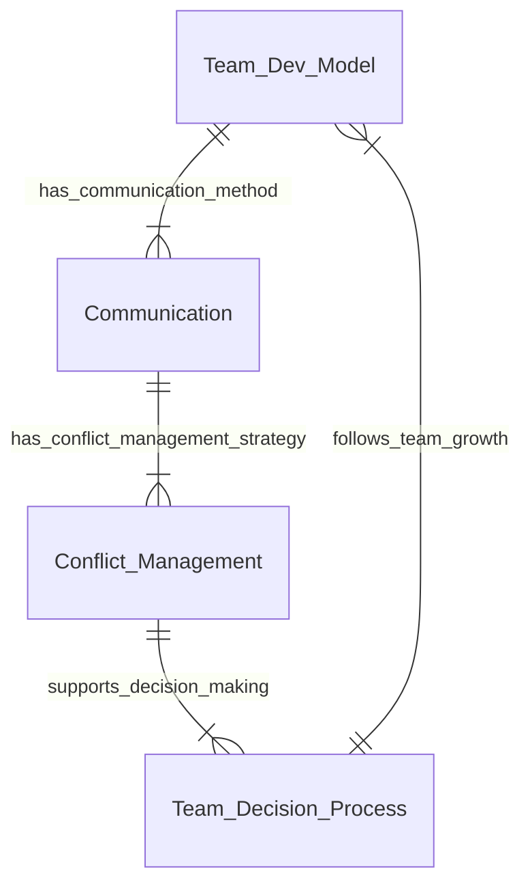

                 

## 团队建设：打造高效团队的秘诀

### 关键词：团队建设、高效团队、领导力、沟通、冲突管理、持续改进

#### 摘要：
在当今快速变化的技术环境下，高效团队的建立和管理成为企业成功的关键。本文将深入探讨团队建设的重要性、高效团队的特征、核心概念和联系，以及团队构建、激励与领导力、协作与沟通、冲突管理、持续改进等关键策略。通过案例分析，我们将总结最佳实践，并提出未来团队建设的发展方向。

----------------------------------------------------------------

### 目录大纲

# 团队建设：打造高效团队的秘诀

## 第1章：问题背景与核心概念
### 1.1 团队建设的重要性
### 1.2 高效团队的特征
### 1.3 团队建设的核心概念
   - **团队建设与团队发展的区别**
   - **团队结构与角色**
   - **团队动力与凝聚力**

## 第2章：团队诊断与评估
### 2.1 团队诊断方法
### 2.2 团队评估工具

## 第3章：核心概念与联系
### 3.1 核心概念
### 3.2 概念属性特征对比表格

## 第4章：团队构建策略
### 4.1 角色分配与职责明确
### 4.2 团队文化建设

## 第5章：团队激励与领导力
### 5.1 团队激励理论
### 5.2 领导力模型
### 5.3 领导力实践

## 第6章：团队协作与沟通
### 6.1 团队协作工具与方法
### 6.2 沟通技巧与障碍

## 第7章：团队冲突管理
### 7.1 冲突的本质与类型
### 7.2 冲突管理策略

## 第8章：团队发展与持续改进
### 8.1 团队发展计划
### 8.2 持续改进机制

## 第9章：案例分析
### 9.1 案例背景与问题描述
### 9.2 解决方案与实施步骤
### 9.3 案例分析与反思

## 第10章：最佳实践与拓展阅读
### 10.1 最佳实践总结
### 10.2 注意事项与风险防范
### 10.3 拓展阅读推荐

----------------------------------------------------------------

接下来，我们将一步一步地深入探讨团队建设的关键要素和策略，帮助读者理解如何打造高效团队，实现企业目标。

----------------------------------------------------------------

## 第1章：问题背景与核心概念

### 1.1 团队建设的重要性

在现代企业的运营中，团队建设显得尤为重要。随着全球化和技术变革的加速，企业面临的市场竞争愈发激烈，单一的个人能力已经无法满足复杂项目的需求。团队的力量在于成员之间的协作、互补和共同进步。有效的团队建设不仅能够提高工作效率，还能促进创新、提升企业竞争力。

团队建设的重要性体现在以下几个方面：

1. **提高工作效率**：团队内部协同工作，可以快速响应市场变化，减少决策环节的延误，提高整体工作效率。
2. **促进知识共享**：团队成员之间共享知识和经验，有助于团队整体能力的提升，同时也能够促进个人成长。
3. **增强团队凝聚力**：良好的团队关系能够增强成员之间的信任和合作精神，形成强大的团队凝聚力。
4. **推动企业创新**：团队的多样性和跨学科的交流往往能够激发新的创意和解决方案，推动企业的创新和发展。

### 1.2 高效团队的特征

高效团队具有一系列显著的特征，这些特征有助于团队目标的实现。以下是高效团队的一些关键特征：

1. **共同目标**：高效团队有一个清晰、共同的团队目标，每个成员都明确自己的角色和职责，并为此努力。
2. **良好的沟通**：高效团队内部具有良好的沟通机制，成员之间能够坦诚交流，信息传递准确及时。
3. **角色互补**：团队成员各有所长，能够相互补充，形成有效的技能组合。
4. **自我管理**：高效团队成员具备自我管理的能力，能够在没有严密监督的情况下独立完成任务。
5. **协同合作**：团队成员之间能够协同合作，共同面对挑战，解决问题。
6. **积极反馈**：团队内部有积极的反馈机制，成员能够接受和给予建设性的反馈，促进个人和团队成长。

### 1.3 团队建设的核心概念

团队建设涉及多个核心概念，这些概念相互关联，共同支撑团队的有效运作。以下是团队建设中的几个核心概念：

#### **团队建设与团队发展的区别**

团队建设和团队发展是两个紧密相关的概念，但它们的重点不同。

- **团队建设**：注重团队的基本结构和功能的搭建，包括角色明确、职责分配、团队文化等。
- **团队发展**：关注团队的成长和持续改进，包括技能提升、关系建立、创新等。

#### **团队结构与角色**

团队结构是指团队成员的组织形式和职责分配。常见的团队结构包括：

- **功能型结构**：按照职能或专业划分，如开发、测试、设计等。
- **项目型结构**：按照项目任务划分，成员在项目期间共同工作。

角色是团队成员在团队中的职责和功能，明确角色有助于提高团队效率。

#### **团队动力与凝聚力**

团队动力是指推动团队成员共同努力的动力源泉，包括共同的愿景、目标、奖励机制等。凝聚力则是团队成员之间的相互吸引和紧密联系，是团队持续发展的基础。

团队建设是一个系统工程，需要综合考虑多个因素，从团队诊断与评估、核心概念与联系、团队构建策略到激励与领导力、协作与沟通、冲突管理、持续改进，每一步都至关重要。在接下来的章节中，我们将深入探讨这些核心概念，并提供实用的策略和工具，帮助读者打造高效团队。

----------------------------------------------------------------

## 第2章：团队诊断与评估

### 2.1 团队诊断方法

团队诊断是团队建设的第一步，它有助于识别团队当前的状态和存在的问题，为后续的改进提供依据。以下是几种常用的团队诊断方法：

#### **行为事件访谈**

行为事件访谈是一种深入了解团队成员行为和团队动态的方法。通过访谈，团队领导或教练可以了解成员的工作习惯、沟通风格、面临的挑战以及团队协作情况。以下是行为事件访谈的步骤：

1. **准备阶段**：确定访谈目的、访谈对象和时间。
2. **访谈阶段**：提出开放性问题，引导团队成员分享具体事件和感受。
3. **记录与分析**：记录访谈内容，分析团队行为模式和问题根源。

#### **360度反馈**

360度反馈是一种多角度评估方法，通过收集团队成员、上级、同事和下属的反馈，全面评估团队成员的表现。以下是360度反馈的步骤：

1. **制定反馈计划**：确定反馈对象、反馈内容和反馈时间。
2. **收集反馈**：通过问卷调查、访谈等方式收集反馈信息。
3. **分析反馈**：分析反馈结果，识别团队成员的优点和改进空间。
4. **反馈会议**：与团队成员讨论反馈结果，制定改进计划。

#### **团队绩效评估**

团队绩效评估是衡量团队工作成果和效率的重要手段。通过定期评估，团队领导可以了解团队的整体表现，发现问题和改进机会。以下是团队绩效评估的步骤：

1. **制定绩效标准**：明确团队的绩效目标和关键绩效指标（KPI）。
2. **收集数据**：收集团队工作数据，如项目完成情况、工作效率等。
3. **评估分析**：对收集的数据进行分析，评估团队的绩效。
4. **反馈与改进**：与团队成员讨论评估结果，制定改进措施。

### 2.2 团队评估工具

为了更系统地评估团队，可以使用一些评估工具，这些工具可以帮助团队领导更准确地了解团队的状况。以下是几种常用的团队评估工具：

#### **迪斯克行为评估**

迪斯克行为评估是一种基于行为心理学的方法，通过评估成员的行为风格，帮助团队理解个体差异，促进团队协作。以下是迪斯克行为评估的步骤：

1. **问卷调查**：团队成员填写行为风格问卷。
2. **数据分析**：分析问卷结果，识别团队成员的行为特征。
3. **反馈与培训**：向团队成员反馈评估结果，提供相应的培训和建议。

#### **迈尔斯-布里格斯性格类型指标（MBTI）**

MBTI是一种常用的性格评估工具，它将个体的性格分为16种类型。通过MBTI评估，团队领导可以了解成员的性格特点，优化团队组合。以下是MBTI评估的步骤：

1. **性格测试**：团队成员完成MBTI性格测试。
2. **结果分析**：分析测试结果，识别成员的性格类型。
3. **团队优化**：根据性格特点，调整团队结构和任务分配。

#### **团队建设成熟度模型**

团队建设成熟度模型是一种评估团队发展水平的工具，它将团队发展分为不同阶段，帮助团队识别当前的发展水平，制定改进计划。以下是团队建设成熟度模型的步骤：

1. **评估当前状态**：通过问卷调查、访谈等方法，评估团队的成熟度。
2. **制定改进计划**：根据评估结果，制定针对性的改进计划。
3. **实施与监控**：执行改进计划，监控改进效果。

通过团队诊断与评估，团队领导可以全面了解团队的状态和存在的问题，为团队建设提供科学依据。在接下来的章节中，我们将进一步探讨团队建设的核心概念和联系，帮助读者深入理解团队运作的内在逻辑。

----------------------------------------------------------------

## 第3章：核心概念与联系

### 3.1 核心概念

在团队建设中，理解核心概念是构建高效团队的基础。以下是团队建设中的几个关键概念：

#### **团队发展模型**

团队发展模型描述了团队从形成到成熟的各个阶段。常见的团队发展模型包括：

- **Tuckman模型**：包括形成阶段、风暴阶段、规范阶段、执行阶段和休整阶段。
- **Belbin模型**：描述了团队角色和成员之间的互动关系。

#### **团队沟通与冲突管理**

团队沟通是团队协作的重要环节，有效的沟通能够提高团队效率。团队沟通与冲突管理包括：

- **沟通模型**：如OSCI模型，包括观察、感觉、认知、互动和结果五个层次。
- **冲突管理策略**：包括回避、面对、解决问题和妥协等策略。

#### **团队决策过程**

团队决策是团队运作的核心。有效的决策过程包括：

- **决策模型**：如SWOT分析、决策树等工具，帮助团队做出合理决策。
- **决策流程**：包括问题识别、方案评估、决策制定和执行等环节。

### 3.2 概念属性特征对比表格

为了更好地理解这些核心概念，我们可以通过对比表格来展示它们之间的属性特征。以下是一个简化的对比表格：

| 概念       | 属性特征                                                     |
|------------|--------------------------------------------------------------|
| 团队发展模型 | 描述团队成长的阶段，如Tuckman模型、Belbin模型               |
| 团队沟通    | 包括沟通模型、沟通技巧、沟通障碍                           |
| 冲突管理    | 包括冲突类型、冲突管理策略、冲突解决机制                   |
| 决策过程    | 包括决策模型、决策流程、决策工具和方法                    |

通过对比表格，我们可以清晰地看到每个概念的核心特征和关联，有助于深入理解和应用。

### 3.3 概念属性特征对比表格

为了进一步展示核心概念之间的联系，我们可以使用ER（实体关系）图来构建团队建设模型的框架。以下是团队建设核心概念的ER图：

通过ER图，我们可以直观地看到团队发展模型、沟通、冲突管理和决策过程之间的关联。这些概念相互影响，共同构成了团队建设的完整框架。

### 总结

团队建设中的核心概念是理解团队运作的基础。通过对比表格和ER图，我们能够更清晰地看到这些概念之间的联系和相互作用。在接下来的章节中，我们将深入探讨团队构建策略，包括角色分配、团队文化建设等，帮助读者进一步掌握团队建设的具体方法。

----------------------------------------------------------------

## 第4章：团队构建策略

### 4.1 角色分配与职责明确

团队构建的第一步是明确角色分配和职责，这有助于提高团队的效率和协同效应。以下是角色分配与职责明确的几个关键步骤：

#### **角色定义与任务分配**

1. **确定团队目标**：首先，团队需要明确共同的目标和愿景，这将有助于确定每个角色的职责。
2. **角色划分**：根据团队目标，将团队成员划分为不同的角色，如项目经理、开发人员、测试人员、UI设计师等。
3. **任务分配**：为每个角色分配具体的任务，确保每个成员都清楚自己的工作内容和期望成果。

#### **职责分工的挑战与解决方案**

**挑战**：

- **职责重叠**：当团队成员的职责不清晰时，容易出现职责重叠和责任推诿的情况。
- **技能不匹配**：如果团队成员的技能与分配的任务不匹配，可能导致工作效率低下。

**解决方案**：

- **明确职责边界**：通过文档或会议，明确每个角色的职责边界，确保任务分配清晰。
- **技能提升**：提供培训和学习机会，帮助团队成员提升技能，以更好地适应分配的任务。
- **定期审查**：定期审查和调整角色分配，确保团队成员的职责与实际工作需求相匹配。

### 4.2 团队文化建设

团队文化是团队长期稳定发展的重要保障，它对团队成员的行为、态度和价值观念产生深远影响。以下是团队文化建设的关键要素：

#### **价值观与共同目标的建立**

1. **确立核心价值观**：通过团队讨论和共识，确立团队的核心价值观，如诚信、创新、协作等。
2. **共同目标**：明确团队的共同目标，并将其融入到日常工作中，让每个成员都明确自己的贡献。

#### **团队氛围的营造**

1. **积极氛围**：营造积极、开放和包容的团队氛围，鼓励成员之间的交流和合作。
2. **尊重差异**：尊重团队成员的不同观点和个性，鼓励多元化的思维，促进创新。
3. **激励机制**：建立有效的激励机制，如奖励、表彰和团队活动，增强团队成员的归属感和工作动力。

### **案例：一家科技公司的团队构建实践**

某科技公司为了提高团队效率，采取了以下团队构建策略：

1. **角色分配与职责明确**：
   - 确立了项目经理、开发人员、测试人员、UI设计师等明确的角色。
   - 定期审查角色分配，确保职责分配清晰，避免重叠。
   - 提供培训，提升团队成员的技能，确保他们能够胜任分配的任务。

2. **团队文化建设**：
   - 确立了诚信、创新、协作的核心价值观。
   - 通过定期的团队建设活动，如团建、技术分享会等，营造积极的团队氛围。
   - 设立了员工奖励机制，鼓励成员之间的合作和创新。

通过这些策略，该公司的团队效率显著提高，团队成员的满意度和凝聚力也大幅提升。

### **总结**

角色分配与职责明确、团队文化建设是团队构建的核心策略。通过明确角色和职责，可以提高团队的工作效率；而通过建立共同的价值观和积极的团队氛围，可以增强团队的凝聚力和创新力。在接下来的章节中，我们将探讨团队激励与领导力、协作与沟通、冲突管理等关键领域，帮助读者全面掌握团队建设的实战技巧。

----------------------------------------------------------------

## 第5章：团队激励与领导力

### 5.1 团队激励理论

团队激励是提高团队成员积极性和工作效率的重要手段。以下是几种常见的团队激励理论：

#### **期望理论**

期望理论认为，员工的激励程度取决于其对努力、绩效和奖励之间关系的期望。公式为：

\[ 激励 = 期望 \times 工作绩效 \times 奖励值 \]

- **期望**：员工对自己努力工作的信心。
- **工作绩效**：员工对自己工作绩效的判断。
- **奖励值**：员工对奖励的重视程度。

#### **公平理论**

公平理论认为，员工的激励不仅取决于个人的绩效和奖励，还取决于与他人的比较。员工会根据自己的投入（如时间、努力）和产出（如薪酬、晋升）与他人进行比较，以判断自己是否受到公平对待。

\[ 公平感 = （自己的回报/他人的回报）\]

### 5.2 领导力模型

领导力是团队建设中至关重要的因素。以下是几种常见的领导力模型：

#### **领导生命周期理论**

领导生命周期理论（Hersey-Blanchard模型）认为，领导风格应随着团队成员成熟度的变化而调整。模型将领导风格分为四种：

1. **指导型**：领导明确告诉成员该做什么。
2. **推销型**：领导不仅告诉成员该做什么，还解释为什么这样做。
3. **参与型**：领导邀请成员参与决策过程。
4. **授权型**：领导给予成员自主决策和行动的权力。

#### **情境领导模型**

情境领导模型（Hersey-Blanchard模型）认为，领导风格应适应团队成员的能力和任务需求。模型将领导风格和情境分为四个象限：

1. **指令性领导**：领导明确指示，成员只需执行。
2. **支持型领导**：领导关注成员的需求和感受，提供支持。
3. **参与型领导**：领导邀请成员参与决策，共同解决问题。
4. **成就导向型领导**：领导设定高目标，激励成员超越自我。

### 5.3 领导力实践

有效的领导力实践需要结合理论模型和具体情境。以下是几种实用的领导力实践：

#### **激励策略**

1. **目标设定**：与团队成员共同设定具体、可衡量的目标。
2. **奖励机制**：建立公正的奖励机制，根据绩效给予奖励。
3. **认可与反馈**：定期给予积极的认可和建设性的反馈。

#### **领导力发展计划**

1. **培训与发展**：提供领导力培训，提升领导技能。
2. **角色扮演**：通过模拟情境，提升领导应对不同挑战的能力。
3. **导师制度**：建立导师制度，帮助新任领导获取经验。

### **案例：某科技公司的领导力实践**

某科技公司为了提升团队激励和领导力，采取了以下措施：

1. **激励策略**：
   - 设立了季度绩效奖金，激励团队成员努力工作。
   - 定期组织团队建设活动，增强团队凝聚力。
   - 通过公开表彰，认可团队成员的突出贡献。

2. **领导力发展计划**：
   - 定期组织领导力培训，提升领导技能。
   - 实施导师制度，帮助新任领导快速成长。
   - 通过角色扮演和情境模拟，提升领导应对复杂挑战的能力。

通过这些措施，该公司的团队效率和员工满意度显著提高，员工流失率也得到有效控制。

### **总结**

团队激励和领导力是团队建设的重要环节。通过合理的激励策略和有效的领导力实践，可以激发团队成员的潜力，提高工作效率和团队凝聚力。在接下来的章节中，我们将探讨团队协作与沟通、冲突管理、持续改进等关键领域，帮助读者全面掌握团队建设的实战技巧。

----------------------------------------------------------------

## 第6章：团队协作与沟通

### 6.1 团队协作工具与方法

有效的团队协作是团队成功的关键。以下是一些常用的团队协作工具和方法：

#### **敏捷开发**

敏捷开发是一种以人为核心、迭代式和增量式的软件开发方法。它强调团队协作和快速响应变化。以下是敏捷开发的核心原则：

- **个体与互动重于流程与工具**：注重团队成员之间的互动和协作。
- **可工作的软件重于详尽的文档**：重视实际交付的软件功能，而非冗长的文档。
- **客户合作重于合同谈判**：与客户保持紧密合作，确保项目满足实际需求。
- **响应变化重于遵循计划**：灵活应对变化，不断调整计划。

#### **看板管理**

看板管理是一种可视化的工作管理方法，它通过看板（Kanban板）展示项目进展和任务状态。以下是看板管理的基本步骤：

1. **定义工作流程**：明确项目的开发流程，如需求分析、设计、开发、测试等。
2. **创建看板**：在Kanban板上创建不同的列，代表不同的工作状态，如“待办”、“进行中”、“测试”、“已完成”等。
3. **任务分配**：将任务分配给团队成员，并在Kanban板上进行更新。
4. **持续优化**：定期回顾工作流程，找出瓶颈和改进点，不断优化流程。

### 6.2 沟通技巧与障碍

有效的沟通是团队协作的重要保障。以下是一些常用的沟通技巧和常见的沟通障碍及解决方法：

#### **有效沟通的五个层次**

1. **事实层次**：传递具体的事实和信息，如项目进度、任务完成情况等。
2. **情感层次**：表达情感和感受，如对项目的热情、对团队的支持等。
3. **理解层次**：确保信息被正确理解和解释，如讨论解决方案、确认共识等。
4. **共鸣层次**：建立情感共鸣，如分享个人经验、建立信任等。
5. **愿景层次**：传递共同的目标和愿景，如企业的长期发展战略、团队的未来方向等。

#### **常见沟通障碍及解决方法**

**障碍**：

- **信息过载**：团队成员接收到的信息过多，难以消化和处理。
- **语言障碍**：团队成员的语言背景和文化差异可能导致沟通障碍。
- **心理障碍**：团队成员的心理压力和情绪问题可能影响沟通效果。

**解决方法**：

- **信息筛选**：定期筛选和整理重要信息，确保团队成员接收到的信息是关键且相关的。
- **使用简单语言**：尽量使用简单、清晰的语言，避免使用专业术语或复杂的句子结构。
- **建立信任**：通过建立信任关系，减少心理障碍，促进有效沟通。
- **反馈机制**：建立有效的反馈机制，确保信息被正确理解和解释。

通过有效的团队协作和沟通，团队可以更高效地完成任务，实现共同的目标。在接下来的章节中，我们将探讨团队冲突管理和持续改进的策略，帮助读者全面掌握团队建设的关键技巧。

----------------------------------------------------------------

## 第7章：团队冲突管理

### 7.1 冲突的本质与类型

团队冲突是团队运作中不可避免的现实。理解冲突的本质和类型有助于我们有效地管理和解决冲突。以下是冲突的几种常见类型：

#### **功能冲突**

功能冲突是一种有益的冲突，它发生在团队成员为了实现共同目标而提出不同观点和解决方案时。这种冲突能够促进创新和改进，是团队多样性和创造力的重要来源。

**特点**：

- **建设性**：功能冲突的目标是改进团队工作，提高团队绩效。
- **健康**：功能冲突是团队内部自然产生的，有助于团队成长。

#### **非功能冲突**

非功能冲突则是指与团队目标无关的冲突，通常由个人情感、价值观差异或误解引起。这种冲突如果处理不当，可能对团队造成负面影响。

**特点**：

- **破坏性**：非功能冲突可能导致团队成员之间关系紧张，降低工作效率。
- **不健康**：非功能冲突如果不及时解决，可能演变成更严重的矛盾。

### 7.2 冲突管理策略

有效的冲突管理策略可以帮助团队在出现冲突时保持积极的态度，避免冲突升级。以下是几种常见的冲突管理策略：

#### **避免策略**

避免策略旨在减少冲突的发生或推迟冲突的爆发。以下是一些避免策略：

- **时间延迟**：暂时搁置冲突，等待更合适的时机再讨论。
- **转移话题**：将冲突引向其他话题，避免直接面对冲突。
- **回避个人**：避免与特定成员直接交流，以减少冲突。

**适用场景**：适用于冲突对团队短期影响较小的情况。

#### **面对策略**

面对策略是直接解决冲突，确保团队成员能够开放、坦诚地讨论问题。以下是一些面对策略：

- **直接沟通**：团队成员直接表达观点和感受，寻求共识。
- **面对冲突**：主动面对冲突，分析原因，寻找解决方案。
- **建设性对话**：采用建设性对话技巧，确保沟通双方都能表达自己的观点。

**适用场景**：适用于冲突对团队影响较大，需要立即解决的情况。

#### **解决问题策略**

解决问题策略旨在通过合作和协商找到双方都能接受的解决方案。以下是一些解决问题策略：

- **利益平衡**：分析双方的利益诉求，寻求平衡点。
- **共赢方案**：寻找既满足一方需求，又兼顾另一方利益的方案。
- **第三方调解**：在双方无法达成一致时，引入第三方调解。

**适用场景**：适用于复杂冲突，需要多方参与的情况。

### **案例分析**

某科技公司团队在项目开发过程中，因为进度问题和资源分配产生了冲突。以下是冲突管理的具体步骤：

1. **识别冲突**：团队成员发现项目进度滞后，认为是资源分配不合理导致的。
2. **面对冲突**：项目经理组织团队会议，邀请相关成员参与讨论。
3. **解决问题**：通过分析项目需求和资源状况，团队共同调整任务分配和进度计划。
4. **监控与反馈**：项目经理定期检查项目进度，及时调整资源分配，确保项目顺利进行。

通过有效的冲突管理，该团队成功解决了资源分配问题，项目进度恢复正常。

### **总结**

团队冲突是团队运作中不可避免的一部分，有效的冲突管理能够促进团队的发展和绩效提升。通过理解冲突的本质和类型，采用合适的冲突管理策略，团队可以在面对冲突时保持积极和合作的态度，实现共同的目标。在接下来的章节中，我们将探讨团队发展与持续改进的策略，帮助团队不断成长和优化。

----------------------------------------------------------------

## 第8章：团队发展与持续改进

### 8.1 团队发展计划

团队发展计划是团队长期成长和优化的重要策略。一个有效的团队发展计划应包括以下关键要素：

#### **制定团队发展计划**

1. **确定目标**：明确团队的发展目标，如提高团队效率、提升团队成员技能、增强团队凝聚力等。
2. **评估现状**：分析团队当前的状态，识别优势和短板。
3. **制定策略**：根据目标和现状，制定具体的发展策略，如培训、团队建设活动、流程优化等。
4. **制定时间表**：明确各项策略的实施时间和进度，确保计划的可执行性。

#### **执行与监控**

1. **执行策略**：按照时间表执行各项策略，确保计划落实到位。
2. **定期评估**：定期评估团队的发展情况，检查策略的实施效果。
3. **调整计划**：根据评估结果，及时调整计划，确保团队持续改进。

### 8.2 持续改进机制

持续改进是团队长期发展的关键。一个有效的持续改进机制可以帮助团队不断提升自身能力。以下是建立持续改进机制的关键步骤：

#### **建立反馈机制**

1. **内部反馈**：建立内部反馈渠道，鼓励团队成员提出改进意见和建议。
2. **外部反馈**：收集客户、合作伙伴和其他利益相关者的反馈，了解团队的服务质量和市场竞争力。
3. **定期反馈**：定期收集和分析反馈信息，识别改进机会。

#### **改进实施与评估**

1. **制定改进计划**：根据反馈信息，制定具体的改进计划，明确改进的目标、方法和责任。
2. **实施改进**：按照改进计划，执行各项改进措施，确保改进措施得到有效实施。
3. **评估改进效果**：对改进措施的实施效果进行评估，确保改进目标得到实现。

#### **持续改进的循环**

1. **问题识别**：通过反馈和监控，识别团队中的问题和改进机会。
2. **改进实施**：根据问题识别，制定和实施改进计划。
3. **效果评估**：评估改进措施的效果，确保改进目标实现。
4. **反馈与调整**：将改进效果反馈给团队，并根据评估结果调整改进计划。

### **案例：某科技公司的持续改进实践**

某科技公司通过建立持续改进机制，实现了团队的持续成长。以下是其实践步骤：

1. **建立反馈机制**：
   - 内部反馈：定期召开团队会议，鼓励团队成员提出意见和建议。
   - 外部反馈：定期收集客户反馈，了解产品服务质量和市场反馈。

2. **改进实施**：
   - 问题识别：根据反馈信息，识别团队中的问题和改进机会。
   - 改进计划：制定具体的改进计划，明确改进的目标、方法和责任。
   - 实施改进：按照改进计划，执行各项改进措施。

3. **评估改进效果**：
   - 定期评估：定期评估改进措施的效果，确保改进目标实现。
   - 反馈调整：根据评估结果，调整改进计划，确保团队持续改进。

通过持续改进机制，该公司的团队效率和质量显著提升，市场竞争力也大幅增强。

### **总结**

团队发展与持续改进是团队长期成长和优化的重要策略。通过制定发展计划和建立持续改进机制，团队可以不断提升自身能力，实现持续改进。在接下来的章节中，我们将通过案例分析，深入探讨团队建设的实战技巧，帮助读者更好地理解和应用这些策略。

----------------------------------------------------------------

## 第9章：案例分析

### 9.1 案例背景与问题描述

某科技公司是一家专注于软件开发和信息技术服务的公司，成立于2005年。公司的主要业务包括企业级应用开发、网站建设、移动应用开发等。随着公司业务的不断扩大，团队规模也逐渐壮大，现有员工超过200人。然而，公司在团队建设过程中遇到了一系列问题，影响了团队的效率和协作效果。

主要问题包括：

1. **沟通障碍**：团队成员之间的沟通不畅，信息传递不及时，导致项目进度延误。
2. **角色冲突**：由于角色和职责不明确，团队成员之间的协作不顺畅，出现了职责重叠和责任推诿的现象。
3. **冲突管理不足**：团队成员在项目开发和任务执行过程中，经常因为意见分歧而产生冲突，但缺乏有效的解决机制。
4. **持续改进不足**：公司在团队建设和持续改进方面缺乏系统性的计划和措施，导致团队效率和服务质量难以持续提升。

### 9.2 解决方案与实施步骤

为了解决上述问题，公司决定采取一系列团队建设措施，以提升团队效率和协作效果。以下是具体的解决方案和实施步骤：

#### **沟通改善措施**

1. **建立沟通平台**：引入企业即时通讯工具，如Slack或Microsoft Teams，确保团队成员能够实时沟通和协作。
2. **定期团队会议**：每周召开一次团队会议，总结项目进展，解决沟通问题，确保信息传递的及时性和准确性。
3. **建立反馈机制**：设立反馈渠道，鼓励团队成员提出意见和建议，及时解决问题。

#### **角色明确和冲突管理**

1. **角色定义与职责分配**：明确每个团队成员的角色和职责，制定详细的职责说明书，确保角色分配清晰。
2. **建立冲突解决机制**：设立冲突管理小组，负责协调和处理团队成员之间的冲突，确保冲突得到及时解决。
3. **培训与沟通技巧**：为团队成员提供沟通技巧和冲突管理培训，提高团队成员的沟通能力和冲突解决能力。

#### **持续改进措施**

1. **制定团队发展计划**：根据公司战略和团队现状，制定具体的团队发展计划，明确目标和实施步骤。
2. **建立反馈与评估机制**：定期收集团队反馈，评估团队发展计划的效果，及时调整和优化计划。
3. **持续改进文化**：倡导持续改进的理念，鼓励团队成员积极参与改进活动，提升团队整体效率。

### 9.3 案例分析与反思

通过实施上述解决方案，该公司在团队建设方面取得了显著成效。团队成员之间的沟通变得更加顺畅，角色冲突得到了有效解决，团队凝聚力显著提升。同时，通过持续改进机制，公司的团队效率和服务质量也得到了持续提升。

**反思与启示**：

1. **沟通是团队建设的核心**：有效的沟通是团队协作的基础，公司需要持续关注和改进沟通机制。
2. **角色明确和冲突管理是关键**：清晰的职责分配和有效的冲突管理有助于提升团队协作效率。
3. **持续改进是团队发展的动力**：通过建立反馈和评估机制，公司能够不断优化团队建设策略，提升团队整体绩效。

通过这个案例，我们看到了团队建设中的关键问题和解决策略，也为其他企业提供了宝贵的经验和启示。

----------------------------------------------------------------

## 第10章：最佳实践与拓展阅读

### 10.1 最佳实践总结

在本篇文章中，我们探讨了团队建设的核心概念、诊断与评估、构建策略、激励与领导力、协作与沟通、冲突管理以及持续改进的最佳实践。以下是一些关键总结：

- **团队建设的重要性**：团队建设是提升工作效率、促进创新、增强团队凝聚力的重要手段。
- **团队诊断与评估**：通过行为事件访谈、360度反馈、团队绩效评估等方法，识别团队问题和改进机会。
- **角色分配与团队文化建设**：明确角色和职责，建立共同价值观和积极的团队氛围。
- **激励与领导力**：采用期望理论和公平理论，结合领导生命周期模型和情境领导模型，提高团队激励和领导力。
- **协作与沟通**：通过敏捷开发和看板管理，提升团队协作效率；采用有效沟通技巧，克服沟通障碍。
- **冲突管理**：采用避免、面对和解决问题策略，有效管理团队冲突。
- **持续改进**：建立反馈和评估机制，持续优化团队建设策略。

### 10.2 注意事项与风险防范

在实施团队建设过程中，需要注意以下事项和风险：

- **沟通障碍**：确保团队成员之间建立有效的沟通机制，避免信息传递延误。
- **角色冲突**：明确角色和职责，避免职责重叠和责任推诿。
- **文化差异**：尊重团队成员的文化背景和个性差异，促进团队和谐。
- **持续改进**：建立持续改进机制，避免改进措施的流于形式。

### 10.3 拓展阅读推荐

以下是一些推荐阅读，以帮助读者进一步深入了解团队建设：

1. **《团队的五种生命循环》** - 汤姆·布兹（Tom Booth）
2. **《团队协作技巧》** - 马克·特雷西（Mark Tew）
3. **《激励与领导力：迈向高效团队》** - 斯蒂芬·罗宾斯（Stephen P. Robbins）
4. **《冲突管理：实践指南》** - 罗恩·麦克里兰（Ron R. McMillan）
5. **《敏捷团队管理实战》** - 斯蒂芬·沃德（Stephen Ward）

通过这些资源，读者可以进一步掌握团队建设的理论和实践技巧，提升团队的整体绩效。

作者：AI天才研究院/AI Genius Institute & 禅与计算机程序设计艺术 /Zen And The Art of Computer Programming

----------------------------------------------------------------

通过本文的深入探讨，我们全面了解了团队建设的核心概念、策略和最佳实践。从团队诊断与评估、角色分配与文化建设、激励与领导力、协作与沟通、冲突管理到持续改进，每一个环节都至关重要。团队建设不仅仅是一项任务，更是一个动态的、持续的过程，需要不断地调整和优化。只有通过科学的方法和有效的实践，才能打造出高效、有凝聚力、能持续创新的团队。

让我们共同努力，在实践中不断探索和优化团队建设的方法，为企业和个人创造更大的价值。感谢您的阅读，希望这篇文章能够为您提供宝贵的启示和帮助。

**作者：AI天才研究院/AI Genius Institute & 禅与计算机程序设计艺术 /Zen And The Art of Computer Programming**

