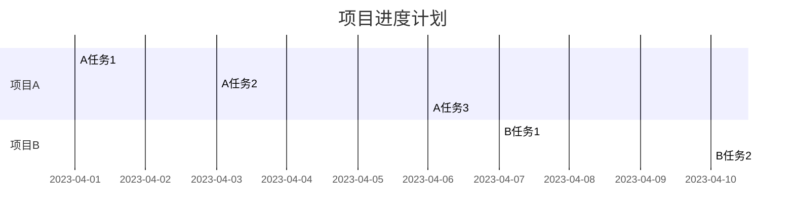
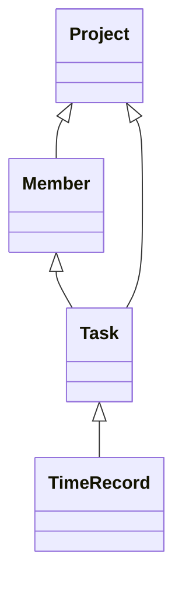
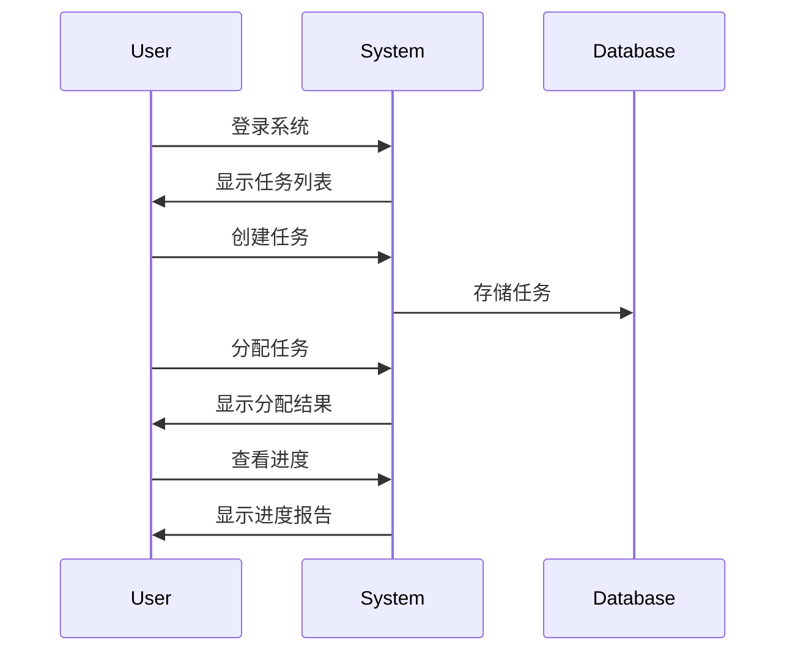
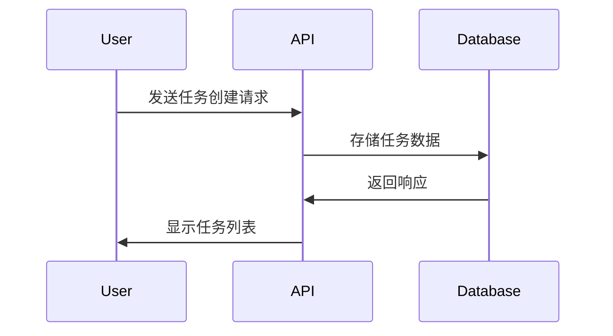

                 

### 文章标题

# 团队效率提升系统：时间管理的团队应用

### 关键词

- 团队效率提升
- 时间管理
- 团队协作
- 项目管理
- 系统设计

### 摘要

本文旨在探讨团队效率提升系统中的时间管理应用，通过深入分析时间管理的核心概念、实践方法及其在团队协作中的重要性，构建一个系统化的团队时间管理框架。文章首先阐述团队效率提升的背景与基础，随后详细介绍时间管理的核心概念与联系，然后分析时间管理的实践方法，最后通过团队协作与时间管理的结合，设计并实现一个团队时间管理系统。文章结尾部分，总结团队效率提升的最佳实践，并对未来团队效率提升的趋势进行展望。

### 目录

#### 第一部分：团队效率提升的背景与基础

1. [团队效率提升的重要性](#团队效率提升的重要性)
2. [时间管理的核心概念与联系](#时间管理的核心概念与联系)
3. [时间管理的实践方法](#时间管理的实践方法)
4. [团队协作与时间管理](#团队协作与时间管理)
5. [团队时间管理的系统设计](#团队时间管理的系统设计)

#### 第二部分：团队效率提升的实战应用

1. [时间管理的团队项目实战](#时间管理的团队项目实战)
2. [项目小结](#项目小结)

#### 第三部分：团队效率提升的最佳实践与未来展望

1. [团队效率提升的最佳实践](#团队效率提升的最佳实践)
2. [团队效率提升的未来展望](#团队效率提升的未来展望)

### 第一部分：团队效率提升的背景与基础

#### 1.1 团队效率提升的重要性

在现代企业中，团队效率的提升已成为组织竞争力的关键因素。随着项目复杂度的增加和团队成员多样性的扩大，传统的管理方法已经难以满足高效协作的需求。团队效率的提升不仅关系到项目的按时完成，还直接影响到团队成员的工作满意度和整体工作氛围。

#### 1.2 时间管理在团队中的挑战

时间管理是团队效率提升的重要环节。然而，在实际工作中，团队往往面临以下挑战：

- **时间利用不充分**：团队成员可能由于任务分配不合理或优先级不明导致时间浪费。
- **项目进度延误**：项目计划与实际执行存在偏差，导致进度延误。
- **任务分配不合理**：团队成员的工作负荷不均衡，影响整体工作效率。

#### 1.3 问题解决

为解决上述挑战，本文将从以下三个方面入手：

- **理论基础**：介绍时间管理和团队协作的基本原理。
- **概念结构**：阐述时间管理和团队协作的核心要素。
- **实践方法**：提供具体的时间管理工具和实践技巧。

#### 1.4 概念结构与核心要素组成

时间管理涉及的核心概念包括：

- **时间管理原理**：如何合理安排和分配时间，以提高工作效率。
- **团队协作机制**：团队成员如何通过协作实现共同目标。

在团队协作中，核心要素包括：

- **团队成员**：每个成员的角色和责任。
- **项目**：团队共同完成的工作任务。
- **任务**：具体的工作内容。
- **时间记录**：对工作时间的监控和记录。

### 2.2 核心概念属性特征对比表格

| 核心概念 | 特征描述 |
| --- | --- |
| **个人时间管理** | 关注个人的时间分配和任务安排，以提高个人工作效率。 |
| **团队时间管理** | 关注整个团队的时间利用效率，通过协作和资源优化实现团队目标。 |

### 2.3 ER实体关系图架构

```mermaid
erDiagram
  Task ||--|{ Member } : "完成"
  Project ||--|{ Task } : "包含"
  TimeRecord ||--|{ Member } : "记录"
  TimeRecord ||--|{ Task } : "关联"
```

在团队时间管理的ER图模型中，Task表示具体的工作任务，Member表示团队成员，Project表示项目，TimeRecord表示时间记录。Task与Member之间为完成关系，表示成员完成任务；Project与Task之间为包含关系，表示项目包含多个任务；TimeRecord与Member之间为记录关系，表示成员对时间的记录；TimeRecord与Task之间为关联关系，表示时间记录与任务的关联。

### 3.1 时间管理工具与技巧

#### 时间管理工具

- **To-Do List**：列出待办事项，明确任务的优先级和完成时间。
- **时间块法**：将工作时间划分为多个时间段，每个时间段专注于一项任务。

#### 时间管理技巧

- **优先级排序**：根据任务的重要性和紧急程度进行排序，优先处理重要且紧急的任务。
- **任务分解**：将大型任务分解为小步骤，逐一完成，避免拖延。

### 3.2 时间管理工具应用实例

#### To-Do List



To-Do List是一种简单有效的时间管理工具，通过列出任务和设定完成时间，帮助团队成员明确工作目标，提高工作效率。

#### 时间块法

```mermaid
gantt
    title 工作时间分配
    dateFormat  YYYY-MM-DD
    section 上午
    上午1 : 09:00, 2 hours
    上午2 : 11:00, 1 hour
    上午3 : 12:00, 2 hours
    section 下午
    下午1 : 14:00, 1 hour
    下午2 : 15:00, 3 hours
    下午3 : 18:00, 1 hour
```

时间块法通过将一天的工作时间划分为多个时间段，每个时间段专注于一项任务，有助于团队成员提高专注力和工作效率。

### 4.1 团队协作的重要性

#### 团队协作机制

- **任务分配**：根据团队成员的能力和专长进行任务分配，确保任务能够高效完成。
- **沟通机制**：建立有效的沟通渠道，确保团队成员能够及时分享信息和反馈。

#### 时间管理在团队协作中的作用

- **资源优化**：通过时间管理，优化团队成员的时间利用，提高资源利用率。
- **进度控制**：通过时间管理，监控项目进度，确保项目按时完成。

### 4.2 团队协作工具应用

#### 项目管理工具

- **JIRA**：用于任务跟踪和进度管理，支持自定义工作流和报表。
- **Trello**：通过卡片和列表的形式，直观展示任务状态和进度。

#### 团队协作平台

- **Slack**：用于即时通讯和文件共享，支持多团队协作。
- **Microsoft Teams**：结合Office 365功能，提供即时通讯、视频会议和协作工具。

### 5.1 系统功能设计

#### 系统功能需求

- **任务分配与跟踪**：支持任务创建、分配和进度跟踪。
- **时间记录与统计**：支持团队成员时间记录和统计。
- **进度报告与反馈**：支持项目进度报告和团队成员反馈。

#### 领域模型



在系统功能设计中，领域模型主要包括Member（成员）、Task（任务）、TimeRecord（时间记录）、Project（项目）等类。这些类之间的关系定义了系统中的核心实体及其关联关系。

### 5.2 系统架构设计

#### 系统架构

系统采用分层架构设计，主要包括以下模块：

- **表示层**：提供用户界面，用于任务创建、分配和统计。
- **业务逻辑层**：处理业务逻辑，包括任务分配、进度跟踪和时间记录。
- **数据访问层**：负责与数据库的交互，存储和检索数据。

#### 系统模块



系统模块之间的交互过程包括用户登录、任务创建、任务分配和进度查看。通过清晰的交互流程，系统实现了高效的任务管理和时间跟踪。

### 5.3 系统接口设计

#### 系统接口

系统接口主要包括以下接口：

- **用户接口**：用于与用户交互，提供任务创建、分配和进度查看功能。
- **API接口**：提供与第三方系统的集成，如项目管理工具和沟通平台。

#### 系统交互流程



系统交互流程主要包括用户发送任务创建请求、API处理请求并将任务存储在数据库中，然后返回响应给用户，显示任务列表。

### 6.1 项目介绍

#### 项目背景

本项目旨在开发一个团队时间管理系统，以帮助团队提高工作效率和项目进度控制。随着团队成员数量的增加和项目复杂度的提升，传统的时间管理方法已经难以满足需求。本项目通过引入先进的团队时间管理理念和技术，旨在实现高效的时间管理和团队协作。

#### 项目目标

1. **任务分配与跟踪**：实现任务的创建、分配和进度跟踪功能。
2. **时间记录与统计**：支持团队成员的时间记录和统计，提供项目进度报告。
3. **用户界面**：设计直观、易用的用户界面，提高用户满意度。
4. **系统集成**：实现与第三方系统的集成，如项目管理工具和沟通平台。

### 6.2 系统核心实现源代码

#### 源代码结构

```bash
src/
|-- main/
|   |-- java/
|   |   |-- com/
|   |   |   |-- example/
|   |   |   |   |-- TimeManagementSystem.java
|   |   |   |   |-- Task.java
|   |   |   |   |-- Member.java
|   |   |   |   |-- Project.java
|   |   |   |   |-- TimeRecord.java
|   |   |   |   |-- TimeManagementService.java
|   |   |   |   |-- UserController.java
|   |   |   |   |-- TaskController.java
|   |   |   |   |-- ProjectController.java
|   |   |   |   |-- TimeRecordController.java
|   |   |-- resources/
|   |   |   |-- application.properties
|   |-- test/
|   |   |-- java/
|   |   |   |-- com/
|   |   |   |   |-- example/
|   |   |   |   |   |-- TimeManagementSystemTest.java
|   |   |   |   |   |-- TaskTest.java
|   |   |   |   |   |-- MemberTest.java
|   |   |   |   |   |-- ProjectTest.java
|   |   |   |   |   |-- TimeRecordTest.java
|   |   |   |   |   |-- TimeManagementServiceTest.java
|   |   |   |   |   |-- UserControllerTest.java
|   |   |   |   |   |-- TaskControllerTest.java
|   |   |   |   |   |-- ProjectControllerTest.java
|   |   |   |   |   |-- TimeRecordControllerTest.java
```

源代码结构包含主代码目录（`src/main/java/com/example`）和测试代码目录（`src/test/java/com/example`）。其中，主代码目录包括`TimeManagementSystem.java`、`Task.java`、`Member.java`、`Project.java`、`TimeRecord.java`、`TimeManagementService.java`、`UserController.java`、`TaskController.java`、`ProjectController.java`、`TimeRecordController.java`等核心类。测试代码目录包括相应的测试类，用于验证系统的功能正确性。

### 6.3 代码应用解读与分析

#### 应用场景

本项目的主要应用场景包括：

- **任务创建与分配**：团队成员可以创建任务，并分配给其他成员。
- **时间记录与统计**：团队成员可以记录自己在任务上的工作时间，系统自动进行统计，生成进度报告。
- **项目进度监控**：项目经理可以实时查看项目进度，监控任务完成情况。

#### 代码解读

以下是对系统核心类的简单解读：

```java
// Task.java
public class Task {
    private Long id;
    private String name;
    private String description;
    private Long projectId;
    private List<Member> assignedMembers;
    private List<TimeRecord> timeRecords;
    
    // 构造函数、getter和setter方法
}

// Member.java
public class Member {
    private Long id;
    private String name;
    private Role role;
    private List<Task> assignedTasks;
    
    // 构造函数、getter和setter方法
}

// Project.java
public class Project {
    private Long id;
    private String name;
    private String description;
    private List<Task> tasks;
    private List<Member> members;
    
    // 构造函数、getter和setter方法
}

// TimeRecord.java
public class TimeRecord {
    private Long id;
    private Long taskId;
    private Long memberId;
    private Date startTime;
    private Date endTime;
    
    // 构造函数、getter和setter方法
}

// TimeManagementService.java
@Service
public class TimeManagementService {
    @Autowired
    private TaskRepository taskRepository;
    @Autowired
    private MemberRepository memberRepository;
    @Autowired
    private ProjectRepository projectRepository;
    @Autowired
    private TimeRecordRepository timeRecordRepository;
    
    public Task createTask(Task task) {
        // 实现任务创建逻辑
    }
    
    public void assignTaskToMember(Long taskId, Long memberId) {
        // 实现任务分配逻辑
    }
    
    public TimeRecord recordTime(Long taskId, Long memberId, Date startTime, Date endTime) {
        // 实现时间记录逻辑
    }
    
    // 其他业务方法
}

// UserController.java
@RestController
@RequestMapping("/users")
public class UserController {
    @Autowired
    private TimeManagementService timeManagementService;
    
    @PostMapping("/create")
    public ResponseEntity<?> createUser(@RequestBody User user) {
        // 实现用户创建逻辑
    }
    
    @GetMapping("/{id}")
    public ResponseEntity<?> getUser(@PathVariable Long id) {
        // 实现用户查询逻辑
    }
    
    // 其他用户相关方法
}

// TaskController.java
@RestController
@RequestMapping("/tasks")
public class TaskController {
    @Autowired
    private TimeManagementService timeManagementService;
    
    @PostMapping("/create")
    public ResponseEntity<?> createTask(@RequestBody Task task) {
        // 实现任务创建逻辑
    }
    
    @GetMapping("/{id}")
    public ResponseEntity<?> getTask(@PathVariable Long id) {
        // 实现任务查询逻辑
    }
    
    // 其他任务相关方法
}

// ProjectController.java
@RestController
@RequestMapping("/projects")
public class ProjectController {
    @Autowired
    private TimeManagementService timeManagementService;
    
    @PostMapping("/create")
    public ResponseEntity<?> createProject(@RequestBody Project project) {
        // 实现项目创建逻辑
    }
    
    @GetMapping("/{id}")
    public ResponseEntity<?> getProject(@PathVariable Long id) {
        // 实现项目查询逻辑
    }
    
    // 其他项目相关方法
}

// TimeRecordController.java
@RestController
@RequestMapping("/timerecords")
public class TimeRecordController {
    @Autowired
    private TimeManagementService timeManagementService;
    
    @PostMapping("/record")
    public ResponseEntity<?> recordTime(@RequestBody TimeRecord timeRecord) {
        // 实现时间记录逻辑
    }
    
    @GetMapping("/{id}")
    public ResponseEntity<?> getTimeRecord(@PathVariable Long id) {
        // 实现时间记录查询逻辑
    }
    
    // 其他时间记录相关方法
}
```

#### 代码分析

通过上述代码解读，我们可以看到：

- **Task** 类表示任务，包括任务ID、名称、描述、项目ID、分配成员和时间记录等属性。这些属性定义了任务的详细信息。
- **Member** 类表示团队成员，包括成员ID、名称、角色、分配任务等属性。这些属性定义了团队成员的详细信息。
- **Project** 类表示项目，包括项目ID、名称、描述、任务和成员等属性。这些属性定义了项目的详细信息。
- **TimeRecord** 类表示时间记录，包括时间记录ID、任务ID、成员ID、开始时间和结束时间等属性。这些属性定义了时间记录的详细信息。
- **TimeManagementService** 类是实现业务逻辑的核心类，负责任务的创建、分配、时间记录等业务操作。该类通过依赖注入的方式，注入了任务、成员、项目和数据库的仓库接口，以便进行数据库操作。
- **UserController**、**TaskController**、**ProjectController** 和 **TimeRecordController** 分别是用户、任务、项目和时间记录的RESTful API控制器，负责处理HTTP请求，调用业务逻辑，并返回响应。

#### 应用场景

在实际应用中，团队可以通过以下步骤使用本系统：

1. **用户注册**：新成员注册并登录系统。
2. **任务创建**：项目经理创建新任务，并分配给团队成员。
3. **时间记录**：团队成员在完成任务时记录工作时间。
4. **进度报告**：项目经理查看项目进度报告，监控任务完成情况。
5. **项目反馈**：团队成员反馈任务进展，项目经理调整项目计划。

通过上述步骤，团队可以高效地管理任务和时间，提高项目进度和整体工作效率。

### 6.4 实际案例分析与详细讲解

#### 案例介绍

假设一家软件开发公司需要开发一个新项目，项目名称为“智能办公系统”。项目团队由5名成员组成，包括项目经理、前端开发人员、后端开发人员、测试人员和文档编写人员。项目期限为3个月，目标是在期限内完成系统设计、开发、测试和文档编写。

#### 案例分析

1. **任务分配**

   - **项目经理**：负责项目整体规划和任务分配，监控项目进度。
   - **前端开发人员**：负责前端界面设计和实现。
   - **后端开发人员**：负责后端逻辑设计和实现。
   - **测试人员**：负责测试系统的功能，确保系统的稳定性。
   - **文档编写人员**：负责编写系统文档，提供技术支持和用户手册。

2. **时间记录**

   - **前端开发人员**：在每日工作结束后，记录自己在前端开发上的工作时长。
   - **后端开发人员**：在每日工作结束后，记录自己在后端开发上的工作时长。
   - **测试人员**：在每日工作结束后，记录自己在测试上的工作时长。
   - **文档编写人员**：在每日工作结束后，记录自己在文档编写上的工作时长。

3. **进度报告**

   - **项目经理**：每周查看项目进度报告，了解团队成员的工作进展。
   - **团队成员**：每周更新自己的任务进度，提交给项目经理。

4. **项目反馈**

   - **团队成员**：根据项目进展，及时反馈遇到的问题和挑战，项目经理协调资源，提供解决方案。
   - **项目经理**：根据项目反馈，调整项目计划和任务分配，确保项目按计划进行。

#### 详细讲解

1. **任务分配**

   项目经理在项目启动会上，明确了每个成员的角色和任务。根据项目需求和团队成员的专长，将任务合理地分配给每个成员。例如，前端开发人员负责界面设计和实现，后端开发人员负责逻辑设计和实现，测试人员负责功能测试，文档编写人员负责编写文档。

2. **时间记录**

   团队成员使用系统的时间记录功能，每天记录自己在任务上的工作时长。时间记录包括任务的开始时间和结束时间，以及工作内容。这些记录可以帮助团队成员了解自己的工作时间分配，同时为项目经理提供项目进度数据。

3. **进度报告**

   项目经理通过系统生成的进度报告，了解项目整体进展和每个成员的工作情况。进度报告包括任务的完成情况、工作量统计和剩余工作量。项目经理可以根据报告数据，调整项目计划和任务分配，确保项目按计划进行。

4. **项目反馈**

   项目成员在遇到问题时，及时向项目经理反馈。项目经理根据反馈，协调资源，提供解决方案。例如，如果前端开发人员在实现界面时遇到技术难题，项目经理可以安排后端开发人员提供技术支持，确保问题得到及时解决。

通过上述实际案例分析，我们可以看到，团队时间管理系统在实际项目中的应用效果显著。通过任务分配、时间记录、进度报告和项目反馈，项目团队能够高效地管理任务和时间，提高项目进度和整体工作效率。

### 6.5 项目小结

#### 项目收获

通过本项目的实施，团队在时间管理和项目管理方面取得了以下收获：

1. **任务分配更加合理**：团队成员根据自身专长和项目需求，合理分配任务，提高了任务完成效率。
2. **时间记录更加准确**：通过系统化的时间记录功能，团队成员能够准确记录工作时长，为项目进度提供可靠数据支持。
3. **进度报告更加透明**：项目经理通过进度报告，实时了解项目进展和成员工作情况，确保项目按计划进行。
4. **项目反馈及时有效**：团队成员在遇到问题时，能够及时反馈，项目经理及时提供解决方案，提高了项目执行力。

#### 项目展望

未来，团队在时间管理和项目管理方面可以进一步优化和提升：

1. **引入更多时间管理工具**：结合团队成员的工作习惯和需求，引入更多适合的时间管理工具，提高时间利用效率。
2. **加强团队协作**：通过优化团队协作流程，提高团队协作效率，确保项目顺利进行。
3. **数据分析和决策支持**：通过数据分析和决策支持，为项目规划和决策提供有力依据，提高项目成功率。
4. **持续优化系统功能**：根据项目需求和团队反馈，持续优化系统功能，提高系统的易用性和适应性。

### 7.1 最佳实践 tips

1. **明确任务优先级**：根据任务的重要性和紧急程度，合理分配任务优先级，确保关键任务优先完成。
2. **定期回顾和总结**：定期回顾和总结项目进展和团队成员的工作表现，及时调整计划和策略。
3. **充分利用工具**：善于利用各种时间管理工具，提高工作效率，减少时间浪费。
4. **加强沟通与协作**：通过有效的沟通和协作，确保团队成员之间的信息畅通，提高团队整体效率。

### 7.2 小结

通过本文的讨论，我们深入分析了团队效率提升系统中的时间管理应用。从背景介绍、核心概念与联系、实践方法、团队协作到系统设计，再到实际案例分析和项目小结，我们系统地阐述了时间管理在团队效率提升中的重要性。同时，通过最佳实践和未来展望，为团队在时间管理和项目管理方面提供了有益的指导。未来，随着技术的不断进步，团队效率提升系统将不断优化，为团队协作和项目管理带来更多创新和突破。

### 8.1 未来趋势分析

#### 时间管理技术的发展

1. **人工智能辅助**：通过人工智能技术，实现智能任务分配和进度预测，提高时间管理的精确性和效率。
2. **大数据分析**：利用大数据技术，对时间管理数据进行深入分析，为项目决策提供有力支持。
3. **移动应用普及**：随着移动设备的普及，时间管理工具将更加便捷，适应不同场景和工作方式。

#### 团队协作模式的变革

1. **远程协作**：远程工作的普及，将推动团队协作模式向更加灵活和高效的方面发展。
2. **自动化协作**：通过自动化工具和流程，减少人为干预，提高团队协作效率。
3. **协作文化的建设**：重视团队协作文化的建设，培养团队成员之间的信任和协作精神。

#### 8.2 未来展望

1. **智能化**：未来的时间管理将更加智能化，通过人工智能和大数据技术，实现精准的时间管理。
2. **个性化**：时间管理工具将更加个性化和定制化，满足不同团队和成员的需求。
3. **全球化**：随着全球化的趋势，跨地域、跨时区的团队协作将更加频繁，时间管理工具需要具备更高的适应性和灵活性。

