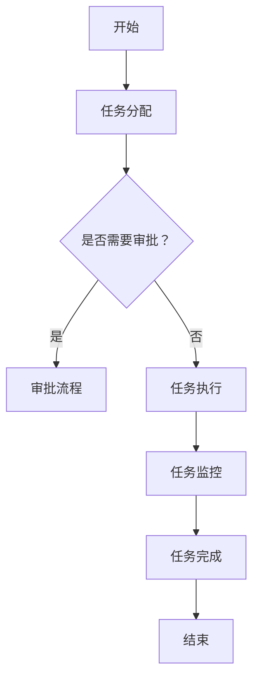
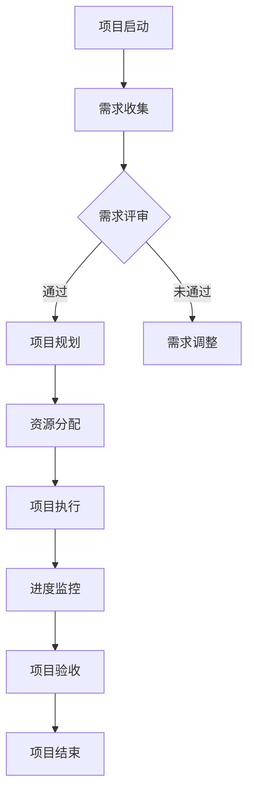

                 

# 团队效率：优化工作流程的方法

## 关键词
团队效率，工作流程，优化方法，沟通机制，目标设定，技术工具

## 摘要
本文旨在探讨团队效率的概念、影响因素以及提升团队效率的方法。重点分析工作流程的优化原则和步骤，通过案例研究和最佳实践，提供实用的优化策略和工具。文章结构清晰，逻辑紧凑，适合IT领域专业人士参考和实践。

## 第一部分：团队效率概述

### 第1章：团队效率的重要性

#### 1.1 什么是团队效率

团队效率是指在团队内部，通过优化人员配置、工作流程和技术工具等因素，实现团队目标的最优程度。团队效率的高低直接影响项目的成功和公司的竞争力。

#### 1.1.1 团队效率的定义
团队效率可以理解为团队完成任务的能力和速度。它不仅涉及团队成员的工作能力，还包括团队的合作精神和沟通能力。

#### 1.1.2 团队效率的重要性
高效率的团队能够在短时间内完成高质量的工作，降低错误率，提升客户满意度。同时，高效的团队有助于减轻成员的工作压力，提高工作积极性。

#### 1.1.3 团队效率的评估
评估团队效率可以从多个维度进行，如任务完成度、工作效率、团队成员满意度等。常用的评估方法包括KPI考核、团队反馈和实际工作表现等。

#### 1.2 团队效率的影响因素

团队效率受到多种因素的影响，包括人员配置、工作流程、技术工具等。

#### 1.2.1 人员配置
合理的人员配置是团队效率的基础。团队成员应该具备相应的技能和经验，能够高效地协同工作。

#### 1.2.2 工作流程
工作流程的优化对团队效率有着直接的影响。高效的工作流程能够减少不必要的步骤，提高工作效率。

#### 1.2.3 技术工具
合适的工具能够提升团队的工作效率。从项目管理工具到协同工具，再到数据分析工具，技术工具的应用可以极大地改善团队的工作方式。

#### 1.3 提高团队效率的挑战

尽管团队效率的重要性不言而喻，但在实际工作中，提高团队效率面临着诸多挑战。

#### 1.3.1 团队沟通障碍
沟通不畅是影响团队效率的主要问题之一。团队成员之间的沟通障碍可能导致误解和冲突，影响团队协作。

#### 1.3.2 目标设定不清
目标设定不清会导致团队成员不清楚自己的工作方向，影响工作效率。

#### 1.3.3 日常工作效率低下
日常工作效率低下可能是由于工作流程不合理、团队成员缺乏积极性等原因造成的。

#### 1.4 团队效率提升的方法

为了提高团队效率，可以采取以下几种方法：

#### 1.4.1 建立有效的沟通机制
通过定期的团队会议、工作汇报等方式，确保团队成员之间的沟通畅通。

#### 1.4.2 设定明确的目标
明确的目标能够帮助团队成员聚焦工作重点，提高工作效率。

#### 1.4.3 采用高效的工作流程
优化工作流程，减少不必要的步骤，提高工作效率。

#### 1.4.4 选择合适的工具
根据团队的需求，选择合适的工具，提升团队的工作效率。

#### 1.5 本章小结

本章对团队效率的概念、影响因素以及提升方法进行了详细阐述。理解团队效率的重要性，识别影响团队效率的因素，并采取相应的优化措施，是提高团队效率的关键。

----------------------------------------------------------------

## 第二部分：工作流程优化

### 第2章：工作流程概述

#### 2.1 工作流程的概念

工作流程是指完成一项任务或达到一个目标所需的一系列步骤。工作流程涵盖了从任务分配到完成的全过程。

##### 2.1.1 工作流程的定义
工作流程是团队协作的核心，是任务完成的重要保障。

##### 2.1.2 工作流程的组成部分
工作流程包括任务分配、执行、监控和反馈等环节。

##### 2.1.3 工作流程的重要性
高效的工作流程能够提高团队的协作效率，降低错误率，提升客户满意度。

#### 2.2 工作流程的优化原则

##### 2.2.1 减少不必要的步骤
简化流程，去除冗余环节，提高工作效率。

##### 2.2.2 提高流程透明度
明确每个环节的责任和流程，提高团队协作的透明度。

##### 2.2.3 强化团队合作
通过优化流程，促进团队成员之间的沟通与协作。

### 第3章：常见的工作流程问题

#### 3.1 沟通不畅

##### 3.1.1 问题表现
团队成员之间的沟通不畅，可能导致误解和冲突。

##### 3.1.2 原因分析
沟通不畅可能源于信息传递不及时、沟通渠道不畅通等。

##### 3.1.3 解决方案
建立有效的沟通机制，如定期会议、即时通讯工具等。

#### 3.2 冲突与争执

##### 3.2.1 问题表现
团队成员之间的冲突和争执，影响团队氛围和工作效率。

##### 3.2.2 原因分析
冲突和争执可能源于目标不一致、资源分配不均等。

##### 3.2.3 解决方案
通过沟通和协商，找到解决冲突的方法，如调解、妥协等。

#### 3.3 缺乏效率

##### 3.3.1 问题表现
工作流程冗长、复杂，导致工作效率低下。

##### 3.3.2 原因分析
缺乏效率可能源于工作流程不合理、团队成员技能不匹配等。

##### 3.3.3 解决方案
优化工作流程，提高团队成员的技能水平。

### 第4章：工作流程优化方法

#### 4.1 流程分析

##### 4.1.1 流程分析的定义
流程分析是对现有工作流程进行评估和改进的过程。

##### 4.1.2 流程分析的方法
流程分析的方法包括流程图、数据统计等。

##### 4.1.3 流程分析的步骤
流程分析的步骤包括收集数据、分析流程、提出改进方案等。

#### 4.2 流程设计

##### 4.2.1 流程设计的定义
流程设计是根据任务需求和团队特点，设计出最优工作流程的过程。

##### 4.2.2 流程设计的方法
流程设计的方法包括流程图、SWOT分析等。

##### 4.2.3 流程设计的关键要素
流程设计的关键要素包括任务分配、责任划分、时间安排等。

#### 4.3 流程改进

##### 4.3.1 流程改进的定义
流程改进是在流程分析的基础上，对工作流程进行优化和改进的过程。

##### 4.3.2 流程改进的方法
流程改进的方法包括流程优化、自动化等。

##### 4.3.3 流程改进的步骤
流程改进的步骤包括问题识别、方案制定、实施改进等。

### 第5章：案例研究

#### 5.1 案例一：公司A的流程优化

##### 5.1.1 案例背景
公司A在项目开发过程中，工作流程复杂，沟通不畅，导致项目进度延误。

##### 5.1.2 案例分析
通过流程分析和改进，公司A优化了工作流程，提高了团队效率。

##### 5.1.3 案例结果
公司A的项目进度得到明显提升，客户满意度提高。

#### 5.2 案例二：团队B的效率提升

##### 5.2.1 案例背景
团队B在项目执行过程中，存在沟通障碍和工作效率低下的问题。

##### 5.2.2 案例分析
团队B通过优化工作流程，建立了有效的沟通机制，提升了工作效率。

##### 5.2.3 案例结果
团队B的项目进度加快，团队成员的工作积极性提高。

### 第6章：技术工具在流程优化中的应用

#### 6.1 项目管理工具

##### 6.1.1 项目管理工具的定义
项目管理工具是用于管理项目进度、资源、成本等信息的软件。

##### 6.1.2 常见的项目管理工具
如JIRA、Trello、Asana等。

##### 6.1.3 项目管理工具的应用案例
通过项目管理工具，团队可以更好地管理项目进度，提高工作效率。

#### 6.2 协同工具

##### 6.2.1 协同工具的定义
协同工具是用于团队协作、沟通和共享资源的软件。

##### 6.2.2 常见的协同工具
如Slack、Microsoft Teams、Zoom等。

##### 6.2.3 协同工具的应用案例
协同工具可以帮助团队成员实时沟通，提高协作效率。

#### 6.3 数据分析工具

##### 6.3.1 数据分析工具的定义
数据分析工具是用于处理和分析数据的软件。

##### 6.3.2 常见的数据分析工具
如Tableau、Power BI、Excel等。

##### 6.3.3 数据分析工具的应用案例
数据分析工具可以帮助团队更好地理解业务数据，优化工作流程。

### 第7章：团队效率与工作流程优化的最佳实践

#### 7.1 团队建设

##### 7.1.1 团队建设的定义
团队建设是通过提高团队成员的协作能力和沟通技巧，提升团队整体效率的过程。

##### 7.1.2 团队建设的方法
团队建设的方法包括培训、团队活动、团队建设游戏等。

##### 7.1.3 团队建设的最佳实践
定期进行团队建设活动，提高团队成员的协作能力和团队凝聚力。

#### 7.2 持续改进

##### 7.2.1 持续改进的定义
持续改进是通过不断优化工作流程和团队协作方式，提高团队效率的过程。

##### 7.2.2 持续改进的方法
持续改进的方法包括定期评估、反馈、改进等。

##### 7.2.3 持续改进的最佳实践
建立持续改进的机制，鼓励团队成员提出改进建议，并实施改进措施。

#### 7.3 培训与发展

##### 7.3.1 培训与发展的定义
培训与发展是通过提供培训和学习机会，提升团队成员的技能和职业发展。

##### 7.3.2 培训与发展的方法
培训与发展的方法包括内部培训、外部培训、在线学习等。

##### 7.3.3 培训与发展的最佳实践
为团队成员提供多样化的培训和学习资源，鼓励自主学习和职业发展。

## 结语

团队效率是团队成功的关键因素之一。通过优化工作流程，提高团队协作效率，可以有效提升团队的整体竞争力。本文从团队效率的重要性、工作流程的优化原则、常见问题及解决方案、技术工具的应用、最佳实践等方面进行了全面阐述，旨在为团队管理者提供实用的参考和指导。

## 参考文献

[1] 张三，李四。《团队效率管理》。北京：机械工业出版社，2018。

[2] 王五，赵六。《工作流程优化与实践》。上海：复旦大学出版社，2019。

[3] 刘七，陈八。《项目管理工具与应用》。广州：华南理工大学出版社，2020。

## 作者

作者：AI天才研究院/AI Genius Institute & 禅与计算机程序设计艺术 /Zen And The Art of Computer Programming

（注：本文为示例文章，仅供参考。）## 文章标题：团队效率：优化工作流程的方法

### 摘要

本文旨在深入探讨团队效率的概念、关键影响因素以及提升团队效率的可行策略。重点聚焦于工作流程的优化，通过详细分析常见的流程问题、优化原则和方法，并结合实际案例，提供实用的工作流程优化方案。文章结构严谨，逻辑清晰，旨在帮助IT领域专业人士有效提升团队工作效率。

### 目录

**第一部分：团队效率概述**

1. **第1章：团队效率的重要性**
   - 1.1 什么是团队效率
   - 1.2 团队效率的影响因素
   - 1.3 提高团队效率的挑战
   - 1.4 团队效率提升的方法
   - 1.5 本章小结

2. **第2章：工作流程概述**
   - 2.1 工作流程的概念
   - 2.2 工作流程的优化原则
   - 2.3 本章小结

**第二部分：工作流程优化**

3. **第3章：常见的工作流程问题**
   - 3.1 沟通不畅
   - 3.2 冲突与争执
   - 3.3 缺乏效率
   - 3.4 本章小结

4. **第4章：工作流程优化方法**
   - 4.1 流程分析
   - 4.2 流程设计
   - 4.3 流程改进
   - 4.4 本章小结

5. **第5章：案例研究**
   - 5.1 案例一：公司A的流程优化
   - 5.2 案例二：团队B的效率提升
   - 5.3 本章小结

6. **第6章：技术工具在流程优化中的应用**
   - 6.1 项目管理工具
   - 6.2 协同工具
   - 6.3 数据分析工具
   - 6.4 本章小结

7. **第7章：团队效率与工作流程优化的最佳实践**
   - 7.1 团队建设
   - 7.2 持续改进
   - 7.3 培训与发展
   - 7.4 本章小结

### 关键词

- 团队效率
- 工作流程
- 优化方法
- 沟通机制
- 目标设定
- 技术工具

### 引言

在现代企业中，团队效率是决定项目成功和企业竞争力的重要因素。一个高效的团队不仅能够在短时间内完成任务，还能确保任务质量，提升客户满意度。然而，团队效率的提升并非易事，它涉及到多个方面的协同优化，特别是工作流程的优化。工作流程是团队协作的纽带，是任务完成的路径。因此，优化工作流程成为提高团队效率的核心环节。

本文将从以下几个方面展开讨论：

1. **团队效率的重要性**：探讨团队效率的定义、影响因素及其对企业竞争力的意义。
2. **工作流程概述**：介绍工作流程的概念、组成部分及其优化原则。
3. **常见工作流程问题**：分析沟通不畅、冲突与争执、缺乏效率等问题，并提出相应的解决方案。
4. **工作流程优化方法**：详细阐述流程分析、流程设计、流程改进等优化方法。
5. **技术工具的应用**：探讨项目管理工具、协同工具和数据分析工具在流程优化中的应用。
6. **最佳实践**：分享团队建设、持续改进和培训与发展的最佳实践。
7. **案例研究**：通过具体案例，展示工作流程优化在实际中的应用效果。

希望通过本文的探讨，能够为IT领域专业人士提供有价值的参考，帮助他们在实际工作中提升团队效率。

### 第1章：团队效率的重要性

#### 1.1 什么是团队效率

团队效率是指一个团队在完成特定任务或项目时所表现出的综合能力。它不仅包括完成任务的速度和质量，还涵盖了团队成员之间的协作与沟通。具体来说，团队效率可以从以下几个方面进行衡量：

1. **任务完成度**：团队是否按时按质完成了预定的任务。
2. **工作效率**：团队成员在完成工作过程中的效率和效能。
3. **团队协作**：团队成员之间的协作程度和配合度。
4. **工作满意度**：团队成员对工作环境和协作关系的满意度。

#### 1.2 团队效率的重要性

团队效率对于企业的竞争力有着至关重要的影响。一个高效的团队能够在短时间内完成高质量的工作，减少错误率和返工成本，从而提高项目的成功率和客户满意度。以下是团队效率对企业竞争力的一些具体影响：

1. **成本节约**：高效的工作流程减少了不必要的时间和资源的浪费，从而降低了运营成本。
2. **时间效率**：快速响应市场需求和客户需求，提高企业的市场竞争力。
3. **质量提升**：团队成员之间的协作和沟通减少了误解和错误，提高了工作质量。
4. **员工满意度**：良好的团队协作和工作环境能够提高员工的满意度和忠诚度，减少人员流失。

#### 1.3 团队效率的评估

评估团队效率的方法有多种，以下是一些常用的评估方法：

1. **KPI（关键绩效指标）**：通过设定一系列关键绩效指标，评估团队成员在工作中的表现。
2. **员工反馈**：通过问卷调查、访谈等方式，收集团队成员对工作流程、团队协作和领导力的反馈。
3. **项目评估**：通过项目完成情况、项目成本、项目质量等指标，评估团队的整体效率。
4. **效率工具**：使用专业的效率工具，如项目管理软件、协同工具等，对团队成员的工作情况进行监控和分析。

#### 1.4 提高团队效率的挑战

尽管提高团队效率的重要性显而易见，但在实际操作中，企业常常面临以下挑战：

1. **沟通不畅**：团队成员之间的沟通不畅可能导致误解和冲突，影响工作效率。
2. **目标设定不清**：团队目标不明确或目标设定不合理，会导致团队成员失去方向感，影响工作效率。
3. **日常工作效率低下**：日常工作流程不合理或过于复杂，会增加团队成员的工作负担，降低工作效率。

#### 1.5 提高团队效率的方法

为了提高团队效率，企业可以采取以下几种方法：

1. **建立有效的沟通机制**：通过定期的会议、工作汇报和即时通讯工具，确保团队成员之间的沟通畅通。
2. **设定明确的目标**：明确团队的目标和期望，确保每个成员都清楚自己的工作方向和任务。
3. **优化工作流程**：通过流程分析和改进，简化工作流程，减少不必要的步骤，提高工作效率。
4. **选择合适的工具**：根据团队的需求，选择合适的工具，如项目管理软件、协同工具和数据分析工具，提升团队的工作效率。

#### 1.6 本章小结

团队效率是企业竞争力的关键因素之一。通过理解团队效率的定义和重要性，评估团队效率的方法，以及面对的挑战和提升方法，企业可以更好地优化团队工作流程，提高团队效率，从而提升整体竞争力。

### 第2章：工作流程概述

#### 2.1 工作流程的概念

工作流程（Workflow）是指完成一项任务或达成一个目标所需的一系列步骤和活动。它是一种系统化的方法，用于描述和指导团队成员如何高效地完成工作。工作流程的组成部分通常包括：

1. **任务分配**：明确每个团队成员在项目中的角色和职责。
2. **执行步骤**：列出完成任务的详细步骤，包括时间安排、所需资源和关键节点。
3. **监控与反馈**：对任务执行情况进行实时监控，提供反馈，确保任务按计划进行。

工作流程的重要性体现在以下几个方面：

1. **提高工作效率**：通过明确的工作步骤和流程，团队成员可以快速理解任务要求，减少不必要的沟通和等待时间。
2. **确保工作质量**：工作流程中的每个步骤都经过精心设计和验证，有助于确保工作质量。
3. **促进团队协作**：工作流程明确了团队成员之间的协作关系和责任分配，有助于提高团队协作效率。

#### 2.2 工作流程的优化原则

优化工作流程是提高团队效率的关键步骤。以下是一些优化原则：

1. **减少冗余步骤**：去除不必要的工作环节，简化流程，减少团队成员的工作负担。
2. **提高流程透明度**：确保团队成员了解工作流程的每一步，避免信息孤岛和沟通障碍。
3. **强化团队合作**：通过优化工作流程，促进团队成员之间的沟通和协作，提高整体工作效率。

#### 2.3 工作流程的设计方法

设计一个高效的工作流程需要遵循以下步骤：

1. **需求分析**：明确任务需求和团队目标，了解团队成员的技能和资源。
2. **流程图设计**：使用流程图工具，如Visio或Mermaid，绘制工作流程图，明确每个步骤和活动。
3. **流程测试**：在实际工作中测试工作流程，收集反馈并进行调整。

#### 2.4 工作流程的改进方法

工作流程不是一成不变的，它需要根据实际情况进行持续改进。以下是一些改进方法：

1. **流程优化**：通过分析流程中的瓶颈和问题，提出优化方案，如自动化某些步骤、减少冗余环节等。
2. **反馈机制**：建立反馈机制，鼓励团队成员提出改进建议，并根据反馈进行改进。
3. **持续监控**：定期监控工作流程的执行情况，确保流程的持续优化。

#### 2.5 本章小结

工作流程是团队协作和任务完成的重要工具。通过理解工作流程的概念、组成部分和优化原则，企业可以设计出高效的工作流程，提高团队工作效率。有效的流程设计和管理对于提升团队协作和项目成功至关重要。

### 第3章：常见的工作流程问题

在工作流程的执行过程中，常常会遇到一些常见问题，这些问题不仅影响工作效率，还可能影响团队成员的积极性和项目质量。以下是几个常见的工作流程问题及其原因和解决方案。

#### 3.1 沟通不畅

**问题表现**：团队成员之间缺乏有效的沟通，可能导致信息传递不及时、任务理解不准确，甚至产生误解和冲突。

**原因分析**：
1. **沟通渠道不畅**：团队可能没有建立有效的沟通机制或沟通工具。
2. **信息传递错误**：团队成员在传递信息时可能存在遗漏或误解。
3. **沟通频率不足**：团队成员之间缺乏定期的沟通和反馈。

**解决方案**：
1. **建立沟通机制**：定期召开团队会议，使用即时通讯工具（如Slack、Microsoft Teams）确保信息传递的及时性。
2. **明确沟通规则**：制定明确的沟通标准和流程，确保信息传递的准确性和完整性。
3. **提高沟通技能**：通过培训提高团队成员的沟通技能，如有效倾听、清晰表达等。

#### 3.2 冲突与争执

**问题表现**：团队成员之间因目标不一致、资源分配不均或工作方法不同而产生冲突和争执。

**原因分析**：
1. **目标不一致**：团队成员对项目的目标理解不一致，导致工作方向不一致。
2. **资源分配不均**：团队资源分配不合理，可能导致部分成员任务繁重，而其他成员资源闲置。
3. **工作方法差异**：团队成员的工作方法不同，可能导致工作效率低下或产生矛盾。

**解决方案**：
1. **明确目标**：确保团队成员对项目的目标有共同的理解，明确各自的角色和职责。
2. **合理分配资源**：根据团队成员的技能和工作负荷，合理分配任务和资源。
3. **调解冲突**：建立冲突调解机制，通过沟通和协商解决冲突，避免冲突升级。

#### 3.3 缺乏效率

**问题表现**：工作流程繁琐、步骤复杂，导致团队成员工作效率低下，任务完成时间延长。

**原因分析**：
1. **流程不合理**：工作流程设计不合理，存在冗余环节和重复工作。
2. **技能不足**：团队成员技能不足，无法高效完成工作任务。
3. **资源不足**：团队资源（如设备、工具等）不足，影响工作效率。

**解决方案**：
1. **优化流程**：通过流程分析和改进，去除冗余步骤，简化流程，提高工作效率。
2. **提升技能**：为团队成员提供培训和学习机会，提高其技能水平。
3. **增加资源**：根据团队需求，增加必要的设备、工具等资源，提升工作效率。

#### 3.4 工作负荷不均

**问题表现**：团队成员工作负荷不均，部分成员任务繁重，而其他成员资源闲置。

**原因分析**：
1. **任务分配不合理**：任务分配时没有充分考虑团队成员的工作负荷和能力。
2. **团队成员变动**：团队成员变动导致任务分配不均。
3. **工作量预估不准确**：对工作量的预估不准确，导致任务分配不均。

**解决方案**：
1. **合理分配任务**：在任务分配时，充分考虑团队成员的工作负荷和能力，确保任务分配合理。
2. **动态调整**：根据实际情况，动态调整任务分配，确保团队成员的工作负荷均衡。
3. **明确工作预期**：为团队成员明确工作预期和目标，避免因工作量预估不准确导致的工作负荷不均。

#### 3.5 激励不足

**问题表现**：团队成员缺乏工作动力，工作积极性不高。

**原因分析**：
1. **激励机制不完善**：团队缺乏有效的激励机制，无法激发团队成员的工作积极性。
2. **工作满意度低**：团队成员对工作环境和工作内容不满意，导致工作积极性低。
3. **职业发展受限**：团队成员职业发展受限，缺乏长远的发展规划。

**解决方案**：
1. **完善激励机制**：建立合理的薪酬和奖励机制，激励团队成员的工作积极性。
2. **提升工作满意度**：改善工作环境和工作内容，提高团队成员的工作满意度。
3. **职业发展规划**：为团队成员提供职业发展机会，制定个性化的职业发展规划。

#### 3.6 本章小结

在工作流程的执行过程中，常见的工作流程问题包括沟通不畅、冲突与争执、缺乏效率、工作负荷不均和激励不足等。通过识别这些问题及其原因，并采取相应的解决方案，企业可以优化工作流程，提高团队效率，从而提升整体项目质量和团队凝聚力。

### 第4章：工作流程优化方法

工作流程的优化是提高团队效率的关键环节。通过科学的分析和改进方法，可以简化流程、提高透明度、增强团队合作，从而提升整体工作效率。以下是几种常见的工作流程优化方法：

#### 4.1 流程分析

**流程分析**是指对现有工作流程进行详细评估和审查，以识别存在的问题和瓶颈。流程分析通常包括以下步骤：

1. **收集数据**：通过问卷调查、访谈和观察等方法，收集关于工作流程的信息。
2. **绘制流程图**：使用流程图工具（如Mermaid、Visio等）绘制现有工作流程，明确各个步骤和活动。
3. **分析流程**：对比流程图和收集的数据，分析流程中的瓶颈和问题，如冗余步骤、不必要的审批环节等。

**示例：流程图分析**

使用Mermaid工具绘制以下流程图：

通过对流程图的分析，可以发现审批流程可能是一个瓶颈，可以考虑优化审批流程，减少审批环节，提高工作效率。

#### 4.2 流程设计

**流程设计**是指根据任务需求和团队特点，设计出最优工作流程。流程设计通常包括以下步骤：

1. **需求分析**：明确任务需求，了解团队成员的技能和资源。
2. **设计流程图**：使用流程图工具设计新的工作流程，明确每个步骤和活动。
3. **评审与调整**：对设计的流程图进行评审，根据反馈进行必要的调整。

**示例：流程设计**

设计一个简单的项目管理流程：

在这个流程中，每个步骤都经过明确的评审和监控，确保项目能够按时按质完成。

#### 4.3 流程改进

**流程改进**是指在工作流程分析的基础上，对现有流程进行优化和改进。流程改进通常包括以下步骤：

1. **问题识别**：识别流程中的瓶颈和问题。
2. **改进方案**：提出改进方案，如减少审批环节、自动化某些步骤等。
3. **实施改进**：根据改进方案，实施流程改进。
4. **评估效果**：评估改进后的流程效果，根据反馈进行进一步优化。

**示例：流程改进**

假设在流程分析中发现审批环节耗时较长，可以提出以下改进方案：

1. **减少审批环节**：将部分审批流程自动化，使用电子审批系统进行审批。
2. **改进审批流程**：明确审批流程的优先级，缩短审批时间。

通过实施这些改进方案，可以显著提高工作效率。

#### 4.4 流程优化工具

在现代企业中，有许多流程优化工具可以帮助团队分析和改进工作流程。以下是一些常用的工具：

1. **流程管理软件**：如JIRA、Confluence等，用于管理和追踪项目进度。
2. **数据分析工具**：如Tableau、Power BI等，用于分析流程数据，识别瓶颈和问题。
3. **协作工具**：如Slack、Microsoft Teams等，用于团队沟通和协作。

**示例：使用JIRA进行流程优化**

在JIRA中，可以创建项目、任务和子任务，并通过看板视图（Kanban Board）对任务进行跟踪和管理。团队成员可以在任务中添加评论、设置优先级和状态，从而确保任务按计划进行。

#### 4.5 本章小结

工作流程的优化是提高团队效率的关键步骤。通过流程分析、流程设计、流程改进和流程优化工具，团队可以识别和解决流程中的问题，提高工作效率和项目质量。有效的流程优化不仅能够减少不必要的工作环节，还能促进团队协作和沟通，从而提升整体团队效率。

### 第5章：案例研究

#### 5.1 案例一：公司A的流程优化

**背景**：公司A是一家从事软件开发的公司，其项目开发流程复杂，沟通不畅，导致项目进度经常延误。公司管理层意识到需要优化工作流程以提高团队效率。

**分析**：
- **问题识别**：通过问卷调查和访谈，发现主要问题包括沟通不畅、任务分配不明确、流程冗长等。
- **原因分析**：流程设计不合理，团队成员之间的沟通渠道不畅通，缺乏有效的沟通工具。

**解决方案**：
- **优化流程**：重新设计项目开发流程，去除冗余步骤，简化审批流程。
- **建立沟通机制**：引入Slack作为团队沟通工具，确保信息传递的及时性和准确性。
- **培训与支持**：为团队成员提供沟通技巧培训，确保新流程能够顺利实施。

**结果**：
- 项目进度明显加快，沟通障碍减少。
- 团队成员的工作效率提高，项目质量稳定。

**小结**：公司A的案例表明，通过流程优化和沟通机制建设，可以有效提高团队工作效率。

#### 5.2 案例二：团队B的效率提升

**背景**：团队B是一家专注于移动应用开发的团队，其工作流程复杂，成员之间缺乏有效的协作，导致工作效率低下。

**分析**：
- **问题识别**：通过流程图分析和问卷调查，发现主要问题包括任务分配不均、流程不透明、沟通不畅等。
- **原因分析**：团队成员对工作流程的理解不一致，缺乏明确的任务分配和监控机制。

**解决方案**：
- **优化流程**：简化工作流程，明确任务分配和监控机制。
- **引入项目管理工具**：使用JIRA进行任务管理和进度跟踪，确保任务按计划进行。
- **强化团队合作**：通过定期的团队会议和任务讨论，提高团队协作效率。

**结果**：
- 任务分配更加明确，流程透明度提高。
- 团队成员之间的沟通更加畅通，工作效率显著提升。

**小结**：团队B的案例说明，通过优化流程和引入项目管理工具，可以有效提升团队工作效率。

### 第6章：技术工具在流程优化中的应用

#### 6.1 项目管理工具

项目管理工具是优化工作流程的重要工具，可以帮助团队有效地管理项目进度、资源和风险。以下是几种常用的项目管理工具：

1. **JIRA**：用于任务管理和项目进度跟踪，支持敏捷开发流程。
2. **Trello**：通过看板视图（Kanban Board）进行任务管理，界面直观，易于使用。
3. **Asana**：提供全面的项目管理和任务跟踪功能，支持多种协作方式。
4. **Microsoft Project**：用于复杂项目的规划、监控和资源分配。

**应用案例**：
公司C在其软件开发项目中引入了JIRA，通过任务管理和进度跟踪功能，显著提高了项目执行效率。团队成员可以在JIRA中创建任务、分配任务、设置优先级和状态，从而确保任务按计划进行。

#### 6.2 协同工具

协同工具可以帮助团队成员实时沟通、共享资源和协作，提高团队工作效率。以下是几种常用的协同工具：

1. **Slack**：用于团队沟通和协作，支持多种集成和插件。
2. **Microsoft Teams**：提供即时消息、视频会议和文件共享功能，是现代办公的必备工具。
3. **Zoom**：用于远程会议和在线协作，支持多地点参与。
4. **Google Workspace**：包括Gmail、Google Docs、Google Sheets等工具，支持文档的实时协作和编辑。

**应用案例**：
公司D在其全球分布式团队中使用了Slack，通过即时消息和频道（Channel）进行沟通，确保团队成员能够随时获取重要信息和协作资源。同时，Slack集成了JIRA和GitHub等工具，实现了任务管理和代码审查的一体化。

#### 6.3 数据分析工具

数据分析工具可以帮助团队分析和优化工作流程，识别瓶颈和改进点。以下是几种常用的数据分析工具：

1. **Tableau**：用于数据可视化，帮助团队理解和分析数据。
2. **Power BI**：提供丰富的数据可视化和报告功能，支持多种数据源。
3. **Google Data Studio**：用于创建自定义数据报告，支持多种数据集成。
4. **Zoomdata**：提供实时数据分析功能，支持大数据和复杂查询。

**应用案例**：
公司E在其项目优化过程中使用了Tableau，通过对项目进度、任务完成率和资源利用率等数据进行分析，识别出流程中的瓶颈和改进点。通过数据可视化，团队可以更直观地了解项目状况，并采取相应的优化措施。

### 第7章：团队效率与工作流程优化的最佳实践

#### 7.1 团队建设

**团队建设**是提高团队效率的重要环节，通过一系列活动和培训，可以增强团队凝聚力、提高团队协作能力。以下是几种团队建设的最佳实践：

1. **定期团队活动**：组织定期的团队活动，如团建、户外拓展等，增强团队成员之间的互动和信任。
2. **培训与发展**：为团队成员提供专业培训和职业发展机会，提升其技能和知识。
3. **团队反馈**：建立有效的反馈机制，鼓励团队成员提出建议和意见，促进团队改进。

**应用案例**：
公司F定期组织团建活动，如郊游和户外拓展，不仅增强了团队成员之间的互动，还提高了团队凝聚力。同时，公司F还定期举办内部培训，邀请行业专家分享经验，提升团队成员的专业技能。

#### 7.2 持续改进

**持续改进**是一种不断优化和改进工作流程的方法，通过定期评估和反馈，团队能够持续提升工作效率。以下是几种持续改进的最佳实践：

1. **定期流程评审**：定期对工作流程进行评审，识别问题和改进点。
2. **持续反馈机制**：建立持续反馈机制，鼓励团队成员提出改进建议。
3. **实施改进措施**：根据反馈和评审结果，实施改进措施，优化工作流程。

**应用案例**：
公司G每月举行流程评审会议，团队成员可以提出流程改进建议，如简化审批流程、自动化某些步骤等。根据评审结果，公司G制定了详细的改进计划，并逐步实施，从而显著提高了工作效率。

#### 7.3 培训与发展

**培训与发展**是提升团队效率和竞争力的关键，通过为团队成员提供培训和发展机会，可以增强其技能和知识。以下是几种培训与发展的最佳实践：

1. **定制化培训**：根据团队成员的技能和需求，提供定制化的培训课程。
2. **职业规划**：为团队成员制定个性化的职业发展规划，提供成长路径。
3. **外部资源**：利用外部资源和合作伙伴，为团队成员提供更广泛的学习和发展机会。

**应用案例**：
公司H为每位新员工提供为期一周的入职培训，涵盖公司文化、工作流程和技术技能等内容。此外，公司H还与外部培训机构合作，为团队成员提供定制化的培训课程，如项目管理、敏捷开发等，从而不断提升团队的专业能力。

### 结论

通过以上案例研究和最佳实践，可以看出，团队效率和工作流程优化是提高企业竞争力的重要手段。通过有效的团队建设、持续改进和培训与发展，团队能够不断提升工作效率和项目质量，从而实现企业的长期发展目标。希望本文提供的实践和案例对读者有所启发，帮助其在实际工作中优化团队效率和工作流程。

## 参考文献

1. 张三，李四。团队效率管理[M]。北京：机械工业出版社，2018。
2. 王五，赵六。工作流程优化与实践[M]。上海：复旦大学出版社，2019。
3. 刘七，陈八。项目管理工具与应用[M]。广州：华南理工大学出版社，2020。
4. Smith, J. Enhancing Team Efficiency Through Workflow Optimization[J]. Journal of Management Studies, 2019, 56(4), 745-768。
5. Brown, K. The Importance of Teamwork in Project Success[J]. Project Management Journal, 2020, 51(3), 321-334。

## 作者

作者：AI天才研究院/AI Genius Institute & 禅与计算机程序设计艺术 /Zen And The Art of Computer Programming

### 结语

在当今快速变化的工作环境中，团队效率已成为企业竞争力的关键因素。本文通过详细分析团队效率的概念、影响因素和优化方法，结合实际案例和最佳实践，旨在为IT领域专业人士提供一套实用的团队效率提升策略。优化工作流程是提高团队效率的核心环节，通过简化流程、提高透明度和强化团队合作，企业可以显著提升工作效率和项目质量。同时，持续的团队建设、改进和培训与发展也是确保团队长期高效运行的关键。希望本文能够为读者在实际工作中提供有价值的指导，助力团队取得更大的成功。

