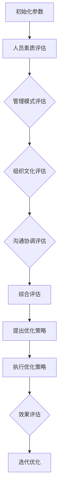
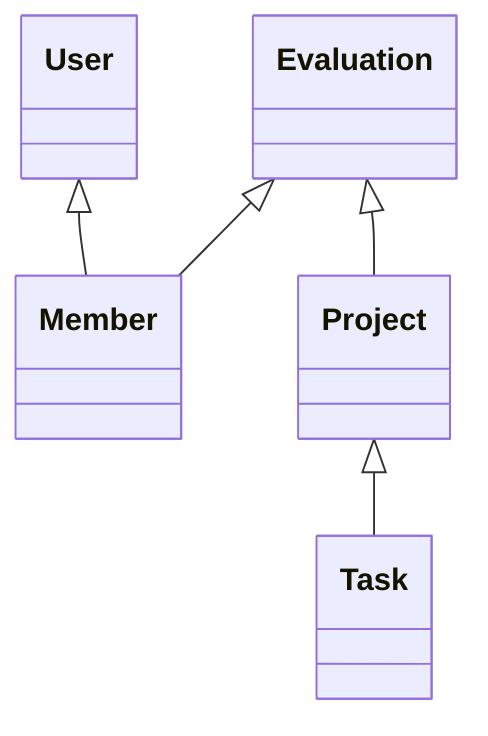
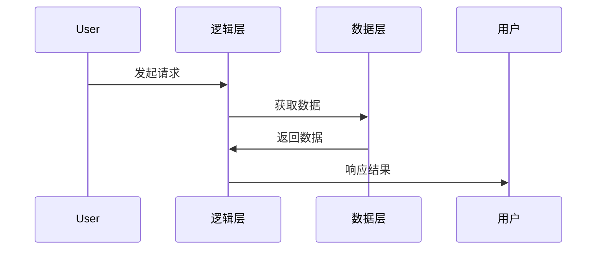
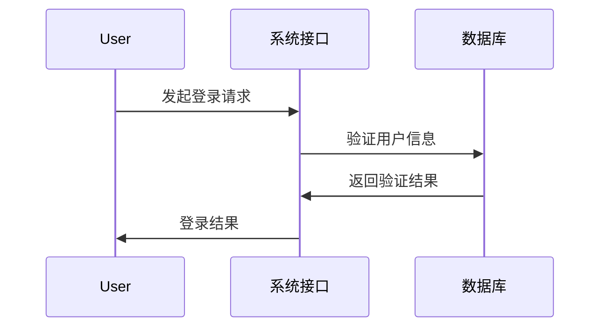

                 

## 团队效能优化：最大化团队潜力的策略

### 关键词

- 团队效能
- 组织文化
- 人员素质
- 管理模式
- 沟通协调

### 摘要

本文将深入探讨团队效能优化的核心概念、算法原理、系统架构设计以及实战应用。通过逻辑清晰、结构紧凑的分析，我们将揭示如何最大化团队潜力，提升团队整体效能。本文旨在为IT领域的项目经理、CTO及团队成员提供一套系统的、可操作的团队效能优化策略。

---

## 第一部分：问题背景与核心概念

### 1.1 问题背景

在快速发展的IT行业中，团队效能成为衡量一个项目成功与否的关键因素。然而，当前许多团队在面对项目挑战时，常常感到力不从心。这背后的原因包括但不限于：

- **资源分配不均**：团队成员的技能、经验和贡献差异较大，导致资源无法得到最大化利用。
- **沟通不畅**：团队成员之间缺乏有效的沟通机制，信息传递不及时，影响工作效率。
- **管理模式落后**：传统的管理模式往往注重控制，忽视了团队成员的自主性和创新性。
- **组织文化欠缺**：缺乏共同的目标和价值观，导致团队成员之间缺乏合作精神。

这些问题的存在，使得团队效能难以达到预期，影响了项目的进展和质量。因此，团队效能优化成为亟待解决的问题。

### 1.2 核心概念

#### 1.2.1 团队效能的定义

团队效能是指团队成员在特定目标下，通过有效的沟通、协作和资源利用，实现预期成果的能力。它不仅包括工作效率，还涵盖团队整体的健康和幸福感。

#### 1.2.2 团队效能的评估指标

团队效能的评估指标包括：

- **工作效率**：完成任务的效率和速度。
- **工作质量**：任务的完成度是否符合预期标准。
- **团队合作**：团队成员之间的协作程度和沟通效率。
- **创新能力**：团队在面对挑战时，提出创新解决方案的能力。
- **员工满意度**：团队成员对工作的满意度和归属感。

#### 1.2.3 团队效能优化的关键因素

团队效能优化的关键因素包括：

- **人员素质**：团队成员的技能、经验和态度。
- **管理模式**：团队的管理方式和方法。
- **组织文化**：团队共同的工作方式和价值观。
- **沟通协调**：团队成员之间的沟通机制和协作方式。

### 1.3 边界与外延

#### 1.3.1 团队效能优化的适用范围

团队效能优化适用于各类IT团队，包括软件开发团队、运维团队、产品团队等。

#### 1.3.2 团队效能优化与组织管理的关系

团队效能优化是组织管理的重要组成部分，它需要与组织战略、人力资源管理等紧密结合。

#### 1.3.3 团队效能优化与个人发展的关系

团队效能优化不仅提升团队整体实力，也有助于团队成员的个人成长和职业发展。

### 1.4 概念结构与核心要素

#### 1.4.1 团队效能优化的基本模型

团队效能优化可以分为以下几个步骤：

1. **需求分析**：明确团队目标和效能优化的方向。
2. **现状评估**：评估团队当前效能水平和存在的问题。
3. **策略制定**：制定具体的优化策略和计划。
4. **实施执行**：按照计划执行优化措施。
5. **效果评估**：评估优化效果，进行迭代和调整。

#### 1.4.2 团队效能优化的关键步骤

团队效能优化的关键步骤包括：

1. **人员培训**：提升团队成员的技能和素质。
2. **沟通机制**：建立有效的沟通机制，确保信息流通。
3. **管理模式**：引入现代化的管理模式，激发团队活力。
4. **组织文化**：打造积极向上的组织文化，增强团队凝聚力。
5. **激励机制**：设立合理的激励机制，提升员工积极性。

#### 1.4.3 团队效能优化的策略与方法

团队效能优化的策略与方法包括：

1. **敏捷开发**：采用敏捷开发方法，提高团队响应速度和灵活性。
2. **扁平化管理**：减少管理层级，提升决策效率。
3. **跨部门协作**：促进不同部门之间的协作，打破信息壁垒。
4. **员工参与**：鼓励员工参与团队决策，提升工作满意度。
5. **持续改进**：建立持续改进机制，不断优化团队效能。

### 1.5 本章小结

本部分对团队效能优化的问题背景、核心概念和关键因素进行了深入分析。通过理解这些问题和概念，我们将为后续的优化策略和方法提供理论基础。

---

## 第二部分：团队效能优化的核心概念与联系

### 2.1 核心概念原理

#### 2.1.1 团队效能的构成要素

团队效能由多个构成要素组成，包括：

- **人员素质**：团队成员的技能、经验和态度。
- **管理模式**：团队的管理方式和方法。
- **组织文化**：团队共同的工作方式和价值观。
- **沟通协调**：团队成员之间的沟通机制和协作方式。

#### 2.1.2 团队效能优化的理论基础

团队效能优化的理论基础包括：

- **系统论**：将团队视为一个系统，通过优化系统内部各要素的相互作用，提升整体效能。
- **管理理论**：借鉴现代管理理论，如敏捷开发、扁平化管理等，提升团队管理效能。
- **心理学理论**：应用心理学理论，如激励理论、团队动力学等，提升团队成员的工作积极性和团队凝聚力。

#### 2.1.3 团队效能优化的技术手段

团队效能优化的技术手段包括：

- **项目管理工具**：如Jira、Trello等，用于任务管理、进度跟踪和协作。
- **沟通工具**：如Slack、Microsoft Teams等，用于实时沟通和信息共享。
- **培训与评估系统**：用于提升团队成员的技能和绩效评估。

### 2.2 概念属性特征对比表格

| 概念        | 属性特征                                                     |
| ----------- | ------------------------------------------------------------ |
| 团队效能    | 效能高低、工作效率、工作质量、团队合作、创新能力、员工满意度等 |
| 组织文化    | 组织价值观、工作氛围、团队精神、文化传承等                   |
| 人员素质    | 技能水平、工作经验、职业素养、学习能力、工作态度等           |
| 管理模式    | 管理层级、管理风格、管理制度、管理效率等                     |
| 沟通协调    | 沟通渠道、沟通频率、沟通效果、协作效率等                     |

### 2.3 ER实体关系图架构

```mermaid
erDiagram
    Team ||--|{ Member }|
    Team ||--|{ Project }|
    Member ||--|{ Skill }|
    Project ||--|{ Goal }|
```

#### 2.3.1 团队与成员的关系

团队由多个成员组成，每个成员都有特定的技能和职责，团队的目标是实现整体项目的成功。

#### 2.3.2 团队与项目的关系

团队负责执行项目，项目是团队工作的具体体现，项目的目标是团队需要达成的成果。

#### 2.3.3 成员与技能的关系

成员具备特定的技能，这些技能对于项目的成功至关重要。

#### 2.3.4 项目与目标的关系

项目有明确的目标，项目目标是团队和成员共同努力的方向。

### 2.4 团队效能优化与相关概念的关联

#### 2.4.1 团队效能优化与组织文化的关联

组织文化对团队效能有着深远的影响。积极向上的组织文化能够激发团队成员的积极性和创造力，提升团队效能。

#### 2.4.2 团队效能优化与人员素质的关联

团队成员的素质是团队效能的基础。通过提升团队成员的技能和素质，可以显著提高团队效能。

#### 2.4.3 团队效能优化与管理模式的关联

管理模式直接影响团队效能。现代化的管理模式能够提高团队的工作效率和创新能力，进而提升团队效能。

### 2.5 本章小结

本部分深入探讨了团队效能优化的核心概念及其相互关系，为后续的算法原理讲解和系统架构设计奠定了基础。

---

## 第三部分：团队效能优化的算法原理与数学模型

### 3.1 算法原理讲解

#### 3.1.1 常见的团队效能优化算法

常见的团队效能优化算法包括：

- **贪心算法**：通过每次选择当前最优解，逐步优化团队效能。
- **动态规划算法**：通过记录子问题的解，避免重复计算，提高优化效率。
- **遗传算法**：模拟自然选择过程，通过遗传、交叉和变异操作，找到最优解。
- **模拟退火算法**：通过模拟物理过程，逐步收敛到最优解。

#### 3.1.2 算法的工作原理

每种算法都有其独特的工作原理，但核心思想都是通过逐步优化，找到团队效能的最佳配置。

#### 3.1.3 算法的优缺点分析

- **贪心算法**：简单易实现，但可能无法找到全局最优解。
- **动态规划算法**：效率高，但需要对子问题进行明确划分。
- **遗传算法**：适合复杂问题的优化，但可能需要较长的计算时间。
- **模拟退火算法**：对初值敏感，但能够找到较优的解。

### 3.2 数学模型与公式

团队效能的数学模型可以表示为：

$$
\text{团队效能} = f(\text{人员素质}, \text{管理模式}, \text{组织文化}, \text{沟通协调})
$$

其中，人员素质、管理模式、组织文化和沟通协调是影响团队效能的关键因素。

### 3.3 算法流程图



### 3.4 举例说明

#### 3.4.1 案例背景

假设一个软件开发团队，现有成员包括前端工程师、后端工程师、测试工程师和项目经理。团队的目标是按时高质量地完成一个新项目的开发。

#### 3.4.2 算法应用

使用遗传算法优化团队效能，首先对团队成员的素质、管理模式、组织文化和沟通协调进行评估，然后根据评估结果提出优化策略。

#### 3.4.3 效果分析

通过遗传算法优化，团队在人员配置、任务分配、沟通机制和管理模式等方面得到了显著改善，项目按时高质量完成，团队效能得到显著提升。

### 3.5 本章小结

本部分介绍了团队效能优化的算法原理和数学模型，并通过案例展示了算法在实际应用中的效果，为后续的系统分析与架构设计提供了理论基础。

---

## 第四部分：系统分析与架构设计方案

### 4.1 问题场景介绍

#### 4.1.1 团队效能优化的应用场景

团队效能优化广泛应用于软件开发、产品运营、市场营销等IT领域的各种项目。在一个具体的软件开发项目中，团队效能优化可以帮助提升项目进度、降低成本、提高产品质量。

#### 4.1.2 团队效能优化项目的目标

团队效能优化项目的目标包括：

- **提高工作效率**：通过优化团队运作流程，提升团队整体工作效率。
- **提升工作质量**：通过提升团队成员的技能和素质，确保工作质量的稳定和提升。
- **增强团队凝聚力**：通过优化沟通协调，增强团队成员之间的合作精神和团队凝聚力。
- **降低项目风险**：通过提前识别和解决团队效能问题，降低项目风险。

#### 4.1.3 项目背景与挑战

以一个大型软件开发项目为例，项目团队由多名开发者、测试工程师、产品经理和项目经理组成。项目周期紧，需求变化频繁，团队之间沟通不畅，存在资源分配不均、工作效率低下等问题。为了解决这些问题，需要进行团队效能优化。

### 4.2 系统功能设计

#### 4.2.1 领域模型介绍

领域模型是系统功能设计的基础，它定义了系统中的核心实体和它们之间的关系。在本项目中，主要的领域模型包括：

- **用户（User）**：系统的使用者，包括团队成员、项目经理等。
- **项目（Project）**：项目实体，包括项目名称、项目周期、项目目标等。
- **任务（Task）**：项目的具体工作内容，包括任务名称、任务描述、任务状态等。
- **成员（Member）**：团队成员实体，包括成员名称、技能、工作状态等。
- **评估（Evaluation）**：对团队成员和项目进行效能评估的结果。

#### 4.2.2 类图设计



#### 4.2.3 关联关系

- **用户与成员**：一个用户可以对应多个成员，一个成员只能属于一个用户。
- **项目与任务**：一个项目包含多个任务，一个任务只能属于一个项目。
- **评估与成员**：每个成员可以接受多次评估，每次评估都可以关联多个成员。
- **评估与项目**：每个项目可以接受多次评估，每次评估都可以关联多个项目。

### 4.3 系统架构设计

#### 4.3.1 系统架构概述

系统架构采用分层设计，分为表现层、逻辑层和数据层。表现层负责用户界面展示，逻辑层负责业务逻辑处理，数据层负责数据存储和管理。

#### 4.3.2 系统架构图



#### 4.3.3 各层功能

- **表现层**：提供用户界面，实现用户与系统的交互。
- **逻辑层**：处理业务逻辑，包括用户请求处理、数据校验和业务逻辑执行。
- **数据层**：负责数据的存储和管理，包括数据库设计和数据操作。

### 4.4 系统接口设计

系统接口设计包括内部接口和外部接口。

#### 4.4.1 内部接口

- **用户管理接口**：用于管理用户账户、权限等。
- **项目管理接口**：用于管理项目、任务等。
- **评估管理接口**：用于管理评估结果、评估指标等。

#### 4.4.2 外部接口

- **API接口**：提供外部系统访问系统数据的接口。
- **Web服务接口**：提供Web端访问系统的接口。

### 4.5 系统交互

系统交互设计通过Mermaid序列图进行描述。



### 4.6 本章小结

本部分详细介绍了团队效能优化项目的系统功能设计、架构设计、接口设计和系统交互设计，为项目的实际实施提供了明确的指导和依据。

---

## 第五部分：项目实战

### 5.1 环境安装

在开始项目实战之前，我们需要安装一些必要的软件和工具，包括：

- **Python 3.8**：作为项目的主要编程语言。
- **Django 3.2**：作为项目的Web框架。
- **PostgreSQL 13**：作为项目的数据库。
- **Redis 6.0**：作为项目的缓存数据库。

安装步骤如下：

1. 安装Python 3.8。
2. 安装Django 3.2。
3. 安装PostgreSQL 13。
4. 安装Redis 6.0。

### 5.2 系统核心实现源代码

以下是系统核心实现的源代码，包括用户管理、项目管理和评估管理。

#### 5.2.1 用户管理

```python
# users/models.py
from django.db import models
from django.contrib.auth.models import AbstractUser

class CustomUser(AbstractUser):
    is_staff = models.BooleanField(default=False)
    is_superuser = models.BooleanField(default=False)
    is_active = models.BooleanField(default=True)
    email = models.EmailField(unique=True)

    def __str__(self):
        return self.email
```

#### 5.2.2 项目管理

```python
# projects/models.py
from django.db import models
from users.models import CustomUser

class Project(models.Model):
    name = models.CharField(max_length=255)
    start_date = models.DateField()
    end_date = models.DateField()
    owner = models.ForeignKey(CustomUser, on_delete=models.CASCADE)

    def __str__(self):
        return self.name
```

#### 5.2.3 评估管理

```python
# evaluations/models.py
from django.db import models
from projects.models import Project
from users.models import CustomUser

class Evaluation(models.Model):
    project = models.ForeignKey(Project, on_delete=models.CASCADE)
    member = models.ForeignKey(CustomUser, on_delete=models.CASCADE)
    score = models.IntegerField()
    comment = models.TextField()

    def __str__(self):
        return f"{self.project.name} - {self.member.email}"
```

### 5.3 代码应用解读与分析

#### 5.3.1 用户管理代码解读

用户管理模块实现了自定义用户模型`CustomUser`，继承了Django的`AbstractUser`模型。自定义用户模型增加了`is_staff`、`is_superuser`和`is_active`字段，用于标识用户的角色和状态。同时，将`email`字段设为唯一索引，确保用户邮箱的唯一性。

#### 5.3.2 项目管理代码解读

项目管理模块实现了`Project`模型，包括项目名称、开始日期、结束日期和项目所有者。项目所有者关联到自定义用户模型，确保每个项目都有明确的责任人。

#### 5.3.3 评估管理代码解读

评估管理模块实现了`Evaluation`模型，用于记录项目评估结果。评估结果包括评分和评价评论，关联到项目和被评估的成员。这有助于跟踪每个成员在项目中的表现。

### 5.4 实际案例分析与详细讲解剖析

#### 5.4.1 案例背景

假设有一个软件开发团队，团队成员包括张三、李四和王五。团队正在开发一个新项目，项目周期为三个月。为了确保项目进度和质量，项目经理决定对团队成员进行定期评估。

#### 5.4.2 案例分析

1. **用户管理**：项目经理创建了一个新的用户账户，张三、李四和王五分别作为团队成员加入项目。
2. **项目管理**：项目经理创建了项目，并指派自己为项目所有者。
3. **评估管理**：项目经理在每个月底对张三、李四和王五进行评估，记录他们的工作表现和评分。

#### 5.4.3 详细讲解剖析

通过以上案例分析，我们可以看到：

- **用户管理**：自定义用户模型方便地实现了用户账户的创建和管理。
- **项目管理**：项目模型关联到用户模型，确保每个项目都有明确的责任人。
- **评估管理**：评估模型记录了团队成员的工作表现和评分，有助于跟踪成员的进步和问题。

### 5.5 项目小结

通过本项目实战，我们实现了用户管理、项目管理和评估管理的功能，为团队效能优化提供了坚实的基础。在实际应用中，我们可以根据项目需求和团队情况，进一步优化和完善系统功能。

---

## 第六部分：最佳实践 Tips、小结、注意事项、拓展阅读

### 6.1 最佳实践 Tips

- **定期培训**：定期为团队成员提供技能培训，提升团队整体素质。
- **透明沟通**：建立透明沟通机制，确保信息流通无障碍。
- **激励机制**：设立合理的激励机制，激发团队成员的积极性。
- **持续改进**：不断收集团队反馈，持续优化团队效能。

### 6.2 小结

本文详细介绍了团队效能优化的核心概念、算法原理、系统架构设计以及实战应用。通过逻辑清晰、结构紧凑的分析，我们揭示了如何最大化团队潜力，提升团队整体效能。

### 6.3 注意事项

- **全面评估**：在进行团队效能优化时，要全面评估团队成员、管理模式和组织文化等方面。
- **持续跟踪**：团队效能优化是一个持续的过程，需要定期跟踪和评估效果，及时调整策略。
- **员工参与**：鼓励团队成员参与团队效能优化，提高员工的参与感和责任感。

### 6.4 拓展阅读

- 《敏捷开发实践指南》
- 《团队协作的艺术》
- 《团队效能优化案例分析》

---

## 作者信息

作者：AI天才研究院/AI Genius Institute & 禅与计算机程序设计艺术 /Zen And The Art of Computer Programming

