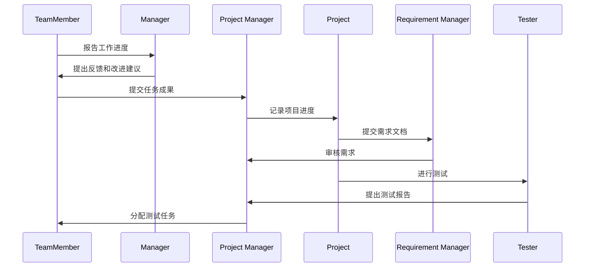
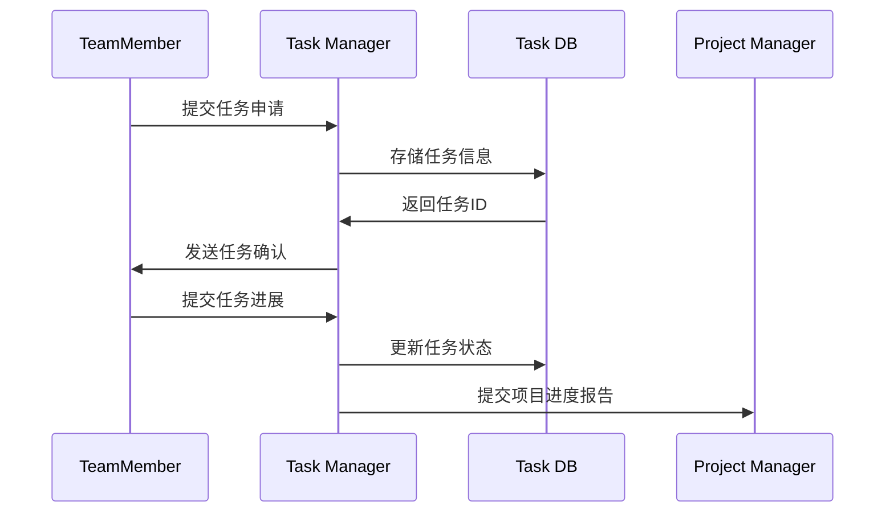
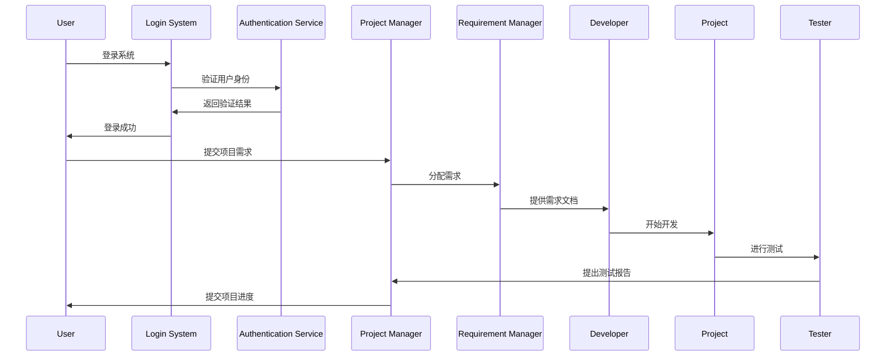

                 

### 引言

在当今快速变化的信息技术时代，团队的效能已经成为企业成败的关键因素之一。无论是一个初创公司还是一家跨国企业，高效能团队都能够快速响应市场需求，持续创新，从而在激烈的市场竞争中脱颖而出。然而，如何提升团队效能，实现持续改进，这是一个长期且具有挑战性的问题。团队效能的提升不仅涉及到技术层面的改进，更涉及管理哲学和人文素养的提升。

本文旨在深入探讨“团队效能：持续改进的管理哲学”这一主题，通过逻辑清晰、结构紧凑、简单易懂的专业技术语言，帮助读者理解并应用这一管理哲学。文章将从以下几个方面展开：

1. **背景介绍**：介绍团队效能和管理哲学的基本概念，探讨它们在企业管理中的重要性。
2. **核心概念与联系**：详细阐述团队效能的核心要素和管理哲学的核心要素，分析它们之间的联系。
3. **理论讲解**：讲解持续改进的基本原理，探讨其在团队管理中的应用。
4. **实战案例**：通过具体案例展示如何在实际项目中应用持续改进的管理哲学。
5. **最佳实践与拓展**：总结最佳实践，提供注意事项和拓展阅读资源。

本文的目标是帮助读者理解团队效能与持续改进之间的关系，掌握提升团队效能的方法和策略，从而在实际工作中更好地应用这些管理哲学，提升团队的整体绩效。

### 关键词

1. **团队效能**：团队在完成目标过程中的效率和效果。
2. **管理哲学**：指导企业管理行为的基本理念和方法。
3. **持续改进**：不断优化和提高管理效能的过程。
4. **权变管理理论**：根据不同情况灵活调整管理策略的理论。
5. **人力资源管理**：涉及员工招聘、培训、激励等方面的管理。
6. **领导力理论**：领导者如何影响和激励团队成员的理论。
7. **PDCA循环**：计划、执行、检查、行动的循环管理方法。

### 摘要

本文探讨了团队效能与持续改进的管理哲学之间的关系。首先，介绍了团队效能和管理哲学的基本概念及其重要性。随后，通过详细分析核心概念与联系，探讨了管理哲学在提升团队效能中的应用。接着，讲解了持续改进的基本原理，并阐述了其在团队管理中的具体应用。通过实际案例，展示了如何在实际项目中应用持续改进的管理哲学。最后，总结了最佳实践，提供了注意事项和拓展阅读资源，帮助读者更好地理解和应用这些管理哲学，提升团队的整体效能。

### 目录大纲设计构思

设计《团队效能：持续改进的管理哲学》的目录大纲，首先需要明确书籍的核心主题，即“团队效能”和“持续改进的管理哲学”。这两者是提升企业竞争力的关键因素。为了确保内容的系统性和逻辑性，目录大纲的设计需要涵盖从基础理论到实践应用的各个方面，具体步骤如下：

1. **明确核心主题**：首先要明确书籍的核心主题，即“团队效能”和“持续改进的管理哲学”。这将作为全书的核心框架，确保所有章节都围绕这一主题展开。

2. **构思大纲结构**：大纲需要包含几个主要部分，如背景介绍、核心概念与联系、理论讲解、实战案例和最佳实践。每个部分都要有明确的子章节，以确保内容条理清晰，便于读者理解和学习。

3. **细化章节内容**：在核心主题确定后，需要对每个章节进行细化。例如，背景介绍部分可以包括团队效能的重要性、管理哲学的作用等；核心概念与联系部分可以包括团队效能的关键因素和管理哲学的核心要素。

4. **设计图表**：为了更好地解释理论，需要在适当的地方插入图表。比如，在讨论管理哲学时，可以插入概念属性特征对比表格；在讲解算法原理时，可以使用Mermaid绘制流程图。

5. **编写算法和数学模型**：在每个章节的理论讲解部分，需要使用Mermaid画出算法流程图，并用Python源代码详细阐述算法原理，同时用LaTeX格式给出数学模型和公式，并进行详细的讲解和举例说明。

6. **编写实战案例**：为了使理论更易于理解，需要在实战案例部分提供详细的系统分析与架构设计，包括项目介绍、系统功能设计、系统架构设计、系统接口设计、系统交互等。

7. **总结与拓展**：在每个章节的最后，需要总结所学内容，提供最佳实践建议，并给出拓展阅读资源。这将帮助读者在实际工作中更好地应用所学知识。

通过以上步骤，可以确保目录大纲的设计既全面又系统，有助于读者深入理解并应用团队效能和持续改进的管理哲学。

### 目录大纲内容

为了系统地介绍“团队效能：持续改进的管理哲学”，我们设计了以下详细的目录大纲，确保每个部分都能深入探讨相关主题，提供丰富的知识和实用的建议。

#### 第一部分：背景介绍

**第1章：团队效能与管理哲学概述**
- **1.1 团队效能的重要性**
  - **1.1.1 企业竞争的核心要素**
  - **1.1.2 团队效能的定义与构成**
  - **1.1.3 管理哲学的作用**
- **1.2 持续改进的理念**
  - **1.2.1 持续改进的起源与发展**
  - **1.2.2 持续改进的核心原则**
  - **1.2.3 持续改进在管理中的应用**
- **1.3 团队效能与持续改进的关系**
  - **1.3.1 团队效能提升的途径**
  - **1.3.2 持续改进在团队管理中的应用**
  - **1.3.3 团队效能与持续改进的相互促进**
- **1.4 本书结构安排与内容概述**

#### 第二部分：核心概念与联系

**第2章：团队效能的核心概念与联系**
- **2.1 团队效能的关键因素**
  - **2.1.1 团队成员的能力与素养**
  - **2.1.2 团队协作与沟通**
  - **2.1.3 团队目标与执行力**
- **2.2 管理哲学的核心要素**
  - **2.2.1 权变管理理论**
  - **2.2.2 人力资源管理理论**
  - **2.2.3 领导力理论**
- **2.3 团队效能与管理的联系**
  - **2.3.1 团队效能与管理哲学的相互作用**
  - **2.3.2 管理哲学在提升团队效能中的具体应用**
  - **2.3.3 团队效能与管理哲学的辩证关系**

#### 第三部分：理论讲解

**第3章：持续改进的管理哲学**
- **3.1 持续改进的基本原理**
  - **3.1.1 PDCA循环**
  - **3.1.2 持续改进的核心步骤**
  - **3.1.3 持续改进的优势与挑战**
- **3.2 持续改进在团队管理中的应用**
  - **3.2.1 团队目标设定与调整**
  - **3.2.2 团队成员的角色分配与激励**
  - **3.2.3 团队协作与沟通的改进**
- **3.3 持续改进的具体实践**
  - **3.3.1 实施持续改进的策略**
  - **3.3.2 持续改进工具与技术**
  - **3.3.3 持续改进的效果评估与反馈**

#### 第四部分：实战案例

**第4章：团队效能提升的实战案例**
- **4.1 案例背景**
  - **4.1.1 企业简介**
  - **4.1.2 团队效能问题的描述**
  - **4.1.3 管理哲学的引入**
- **4.2 系统分析与架构设计**
  - **4.2.1 问题描述与需求分析**
  - **4.2.2 领域模型设计**
  - **4.2.3 系统架构设计**
- **4.3 系统核心实现**
  - **4.3.1 环境安装与配置**
  - **4.3.2 核心模块实现**
  - **4.3.3 代码应用解读与分析**
- **4.4 实际案例分析**
  - **4.4.1 案例实施过程**
  - **4.4.2 案例效果评估**
  - **4.4.3 案例总结与反思**

#### 第五部分：最佳实践与拓展

**第5章：团队效能提升的最佳实践与拓展**
- **5.1 最佳实践总结**
  - **5.1.1 团队效能提升的关键要素**
  - **5.1.2 持续改进的管理哲学应用**
  - **5.1.3 团队效能提升的策略与方法**
- **5.2 注意事项与风险防范**
  - **5.2.1 持续改进中的常见问题**
  - **5.2.2 风险识别与防范**
  - **5.2.3 跨部门协作与沟通**
- **5.3 拓展阅读资源**

通过以上详细的目录大纲，读者可以系统地了解团队效能和持续改进的管理哲学，并能够通过实际案例学习和应用这些理念，提升团队的整体效能。

### 第1章：团队效能与管理哲学概述

#### 1.1 团队效能的重要性

在现代企业管理中，团队效能被视为企业成功的关键因素之一。首先，**团队效能**指的是团队在完成目标过程中的效率和效果。具体来说，它包括团队成员的协作能力、执行力、创新能力等多方面因素。一个高效能的团队能够在短时间内高效完成任务，并在不断变化的市场环境中迅速适应，从而保持企业的竞争优势。

**企业竞争的核心要素**中，团队效能占据了重要地位。随着全球化和信息化的加速发展，企业之间的竞争愈发激烈，不再仅仅局限于产品或服务的质量，更在于团队的整体作战能力和创新能力。一个高效的团队能够迅速响应市场变化，快速迭代产品，降低运营成本，提高客户满意度，从而在竞争中占据优势。

**团队效能的定义与构成**可以从以下几个方面进行理解。首先，**团队成员的能力与素养**是团队效能的基础。一个优秀的团队需要具备不同技能和背景的成员，以确保团队在各个方面的需求都能得到满足。其次，**团队协作与沟通**是团队效能的关键。高效的团队需要具备良好的沟通机制，确保信息能够快速传递，减少误解和冲突。最后，**团队目标与执行力**也是团队效能的重要组成部分。一个明确的团队目标能够指导团队成员的行动方向，而强大的执行力则是实现目标的关键。

**管理哲学的作用**在于为团队提供指导和框架。管理哲学是一种指导企业管理的理念和方法，它可以帮助企业在复杂多变的环境中保持稳定和持续发展。对于团队效能的提升，管理哲学提供了以下几个方面的帮助：

1. **明确管理目标**：管理哲学能够帮助团队明确自身的目标，并通过科学的方法确保目标的实现。
2. **优化管理流程**：管理哲学提供了一套系统化的管理流程和方法，有助于提高团队的工作效率。
3. **提升团队凝聚力**：通过建立共同的价值观和行为准则，管理哲学能够增强团队成员之间的信任和合作，提升团队的整体效能。

综上所述，团队效能的重要性不容忽视。它是企业竞争力的核心要素，直接关系到企业在市场中的地位和发展前景。通过深入理解团队效能的定义与构成，并结合管理哲学的指导，企业可以更好地提升团队效能，实现持续发展。

#### 1.2 持续改进的理念

**持续改进**是一种以不断提升效率和质量为核心的管理理念，它主张通过不断的反思和优化，使团队和组织在持续变化的环境中保持竞争优势。这一理念最早起源于质量管理运动，后来逐渐被广泛应用于各个领域，成为企业管理的重要工具。

**持续改进的起源与发展**可以追溯到20世纪初的日本。当时，丰田公司通过不断尝试和改进，提出了著名的“丰田生产系统”（Toyota Production System, TPS）。TPS强调减少浪费、优化流程和持续改进，成为持续改进理念的先驱。随着全球化和信息化的推进，持续改进理念逐渐被世界各国企业所接受，并形成了多种不同的实施方法和模式。

**持续改进的核心原则**主要包括以下几个方面：

1. **客户至上**：以客户需求为导向，不断改进产品和服务的质量，提升客户满意度。
2. **全员参与**：鼓励所有员工参与改进活动，激发团队的创造力和主动性。
3. **持续反思**：通过定期的评估和反馈，不断识别问题和改进机会。
4. **科学决策**：运用数据分析和科学方法，确保改进措施的合理性和有效性。
5. **系统思维**：将改进活动视为一个整体，注重各环节之间的协同和优化。

**持续改进在管理中的应用**体现在以下几个方面：

1. **流程优化**：通过不断分析和改进工作流程，减少不必要的环节和浪费，提高工作效率。
2. **问题解决**：鼓励团队成员积极参与问题识别和解决，通过小组讨论和头脑风暴等方式，找到解决问题的最佳方案。
3. **创新激励**：通过建立创新激励机制，鼓励团队成员提出新的改进建议和创意，推动团队持续创新。
4. **知识管理**：建立知识管理系统，促进知识和经验的共享和传承，为持续改进提供有力支持。

**持续改进在管理中的作用**主要体现在以下几个方面：

1. **提高质量**：通过不断优化和改进，提高产品和服务的质量，减少缺陷和投诉。
2. **降低成本**：通过减少浪费和优化流程，降低生产成本和管理成本。
3. **增强竞争力**：在持续改进的过程中，企业能够更好地适应市场变化，提高市场反应速度，增强竞争力。
4. **提升员工满意度**：通过全员参与和科学决策，增强员工的参与感和归属感，提升员工的工作满意度和忠诚度。

总之，持续改进是一种全面、系统的管理理念，它不仅有助于提高企业的运营效率和质量，还能增强企业的市场竞争力。通过深入理解和应用持续改进理念，企业可以更好地应对市场变化，实现持续发展。

#### 1.3 团队效能与持续改进的关系

**团队效能**与**持续改进**之间存在着密切的联系，两者相辅相成，共同推动企业的发展。**团队效能**的提升依赖于**持续改进**的管理哲学，而**持续改进**的有效实施又能进一步提升**团队效能**。

**团队效能提升的途径**主要包括以下几个方面：

1. **提升团队成员能力**：团队成员的能力是团队效能的基础。企业可以通过培训、技能竞赛等多种形式，提升团队成员的专业技能和综合素质。
2. **优化团队协作机制**：良好的协作机制能够提高团队的工作效率。企业可以通过建立有效的沟通渠道、制定明确的任务分工和激励机制，促进团队成员之间的协作。
3. **明确团队目标**：明确的目标是团队行动的方向。企业需要确保团队目标与公司战略保持一致，并通过定期的目标评估和反馈，确保目标的实现。
4. **提升执行力**：执行力是团队效能的核心。企业需要建立高效的执行体系，确保团队能够迅速响应变化，高效完成任务。

**持续改进在团队管理中的应用**具体体现在以下几个方面：

1. **目标设定与调整**：通过持续改进，团队可以不断调整和优化目标，使其更符合实际情况和市场变化。
2. **角色分配与激励**：持续改进过程中，团队可以根据成员的能力和特长，合理分配角色，并通过激励机制，激发团队成员的积极性和创造力。
3. **协作与沟通**：持续改进强调全员参与和跨部门协作，通过不断优化沟通机制，确保信息传递的高效和准确。

**团队效能与持续改进的相互促进**关系可以总结为以下几点：

1. **持续改进提升效能**：通过持续改进，团队能够不断优化工作流程，提升工作效率，从而提高整体效能。
2. **效能提升推动改进**：高效的团队在实现目标的过程中，能够更快地识别问题和改进机会，从而推动持续改进的实施。
3. **共同目标与价值观**：团队效能的提升和持续改进都是为了实现企业的长期目标。在这个过程中，共同的目标和价值观能够增强团队的凝聚力，推动改进活动的深入进行。

总之，团队效能与持续改进是相辅相成的，通过不断优化管理哲学和实践方法，企业可以不断提升团队效能，实现持续改进，从而在激烈的市场竞争中保持优势。

#### 1.4 本书结构安排与内容概述

**本书结构安排**分为五个主要部分，每个部分都有其独特的目的和内容，旨在帮助读者全面理解并应用团队效能与持续改进的管理哲学。

**第一部分：背景介绍**，包括第1章“团队效能与管理哲学概述”。这一部分介绍了团队效能的重要性，管理哲学的基本概念和持续改进的理念，为后续章节的内容奠定了基础。

**第二部分：核心概念与联系**，涵盖第2章“团队效能的核心概念与联系”。这一部分详细阐述了团队效能的关键因素和管理哲学的核心要素，分析了它们之间的联系，帮助读者建立对团队效能与管理哲学的全面理解。

**第三部分：理论讲解**，包括第3章“持续改进的管理哲学”。这一部分讲解了持续改进的基本原理，探讨了其在团队管理中的应用，并通过具体案例分析，展示了如何在实际工作中实施持续改进。

**第四部分：实战案例**，包含第4章“团队效能提升的实战案例”。通过具体的案例，展示了如何在实际项目中应用持续改进的管理哲学，提供了详细的系统分析与架构设计，帮助读者将理论知识转化为实际操作能力。

**第五部分：最佳实践与拓展**，第5章“团队效能提升的最佳实践与拓展”。这一部分总结了最佳实践，提供了注意事项和拓展阅读资源，旨在帮助读者在实际工作中更好地应用所学知识。

通过以上五个部分，本书系统地介绍了团队效能与持续改进的管理哲学，从理论到实践，全面覆盖了提升团队效能的方法和策略。读者可以根据自身需求和兴趣，选择性地阅读相关章节，逐步提升团队管理的效能。

### 第2章：团队效能的核心概念与联系

**团队效能**和**管理哲学**是提升企业竞争力的两个关键因素。理解这两个概念及其相互联系，是有效提升团队效能的基础。本章将详细探讨团队效能的核心要素以及管理哲学的核心要素，并分析它们之间的联系。

#### 2.1 团队效能的关键因素

**团队成员的能力与素养**是团队效能的基础。一个高效能的团队需要具备多样化的技能和知识，以确保团队能够在不同领域发挥作用。具体来说，团队成员的能力包括专业技能、沟通能力、解决问题的能力等。素养则涉及团队成员的职业道德、责任心和团队合作精神。

**团队协作与沟通**是团队效能的重要保障。高效的团队需要建立良好的沟通机制，确保信息能够快速、准确地传递。这不仅包括团队内部的沟通，还包括与外部合作伙伴的沟通。有效的沟通能够减少误解和冲突，提高团队的协作效率。

**团队目标与执行力**是团队效能的核心。一个明确的团队目标能够指导团队成员的行动方向，而强大的执行力则是实现目标的关键。团队目标需要与企业的整体战略保持一致，并能够根据实际情况进行调整。执行力的提升需要建立一套科学的管理体系和激励机制。

#### 2.2 管理哲学的核心要素

**权变管理理论**是一种根据不同情况灵活调整管理策略的理论。权变管理强调管理者需要根据环境的变化和团队的具体情况，灵活调整管理方法和策略。这种理论的核心在于，管理者的决策应基于对实际情况的深刻理解和分析。

**人力资源管理理论**关注如何通过管理员工，提升团队效能。人力资源管理包括招聘、培训、绩效评估和激励等多个方面。有效的员工管理能够提升团队成员的工作积极性和创新能力，从而提高团队的整体效能。

**领导力理论**探讨领导者如何影响和激励团队成员。领导力不仅涉及领导者的个人特质和技能，还包括领导风格和团队建设。有效的领导能够增强团队的凝聚力，提高团队成员的士气和执行力。

#### 2.3 团队效能与管理的联系

**团队效能**和**管理哲学**之间的联系体现在以下几个方面：

1. **管理哲学对团队效能的指导**：管理哲学为团队提供了行动的框架和原则。通过科学的理念和合理的管理方法，管理哲学能够指导团队在复杂多变的环境中保持高效运作。

2. **团队效能对管理哲学的反作用**：团队效能的提升反过来也验证了管理哲学的有效性。当团队在实施管理哲学的过程中取得显著成效时，管理哲学的合理性得到进一步确认。

3. **共同目标与价值观**：团队效能的提升和管理哲学的实施都需要建立在共同的目标和价值观基础上。只有当团队成员对目标有共同的理解和认同，才能在实际行动中协同合作，实现团队的长期发展。

通过上述分析，可以看出，团队效能的提升和管理哲学的实施是相互促进、相辅相成的。有效的管理哲学能够提升团队效能，而高效的团队效能又能验证和强化管理哲学的有效性。理解并应用这两个概念及其相互联系，是提升企业竞争力的重要途径。

### 第3章：持续改进的管理哲学

持续改进的管理哲学是提升团队效能的关键方法之一。它基于一套系统的管理流程，通过不断地计划、执行、检查和行动，实现管理效能的持续提升。本章将详细探讨持续改进的基本原理、核心步骤、优势与挑战，并探讨其在团队管理中的应用。

#### 3.1 持续改进的基本原理

**持续改进**的基本原理可以概括为PDCA循环（即计划、执行、检查、行动）。PDCA循环是一种持续改进的方法论，它通过四个阶段的循环，不断优化和改进管理流程。

1. **计划（Plan）**：在这个阶段，团队需要明确改进的目标和具体的行动计划。这包括制定改进方案、分配资源和设定时间表。计划阶段的关键是确保目标的明确性和可执行性。

2. **执行（Do）**：在计划制定完成后，团队开始执行具体的改进措施。执行阶段的核心是按照计划行动，并确保各项任务能够顺利完成。这个阶段需要团队成员的积极参与和协作。

3. **检查（Check）**：在执行阶段结束后，团队需要对改进措施的效果进行评估和检查。检查阶段的目标是识别改进措施的有效性和存在的问题。通过数据分析和反馈，团队可以了解改进措施的实际效果。

4. **行动（Act）**：根据检查阶段的结果，团队需要采取行动，对改进措施进行调整和优化。这个阶段的核心是持续优化和改进，确保改进措施能够持续地提升管理效能。

#### 3.2 持续改进的核心步骤

持续改进的实施需要遵循一系列核心步骤，这些步骤确保了改进活动的系统性和有效性。

1. **问题识别**：首先，团队需要识别当前存在的问题和改进的机会。这可以通过定期的评估、员工反馈、客户投诉等方式进行。

2. **目标设定**：在问题识别后，团队需要设定明确的改进目标。这些目标应该是具体、可衡量、可实现和有时限的（SMART原则）。

3. **方案制定**：接下来，团队需要制定具体的改进方案。这包括确定改进措施、分配资源、设定时间表等。

4. **执行措施**：在方案制定完成后，团队开始执行具体的改进措施。这个阶段需要确保各项任务按照计划进行，并保持沟通和协调。

5. **效果评估**：执行阶段结束后，团队需要对改进措施的效果进行评估。这可以通过数据分析、反馈收集等方式进行。

6. **调整优化**：根据效果评估的结果，团队需要采取行动，对改进措施进行调整和优化。这包括修正错误、改进不足和推广成功的做法。

7. **持续监控**：最后，团队需要持续监控改进措施的实施效果，确保改进活动的持续性和有效性。

#### 3.3 持续改进的优势与挑战

**持续改进**在团队管理中具有显著的优势，但也面临一些挑战。

**优势**：

1. **提升效率**：通过持续改进，团队能够不断优化工作流程，减少浪费和冗余，提高工作效率。

2. **增强创新能力**：持续改进鼓励团队成员提出新的改进建议和创意，从而增强团队的创新能力。

3. **提高质量**：通过持续改进，团队能够不断提高产品和服务的质量，减少缺陷和投诉。

4. **增强团队凝聚力**：持续改进过程中，团队成员需要共同参与和合作，这有助于增强团队的凝聚力和信任。

**挑战**：

1. **变革阻力**：持续改进需要团队成员改变现有的工作习惯和流程，这可能会面临变革的阻力。

2. **资源分配**：持续改进需要投入一定的时间和资源，如何合理分配资源是一个挑战。

3. **持续动力**：保持持续改进的动力和热情是一个长期的过程，如何激发团队成员的持续动力是关键。

#### 3.4 持续改进在团队管理中的应用

在团队管理中，持续改进可以通过以下具体方法得到应用：

1. **建立持续改进的文化**：通过宣传和培训，建立持续改进的文化，让每个团队成员都认识到持续改进的重要性。

2. **设置明确的改进目标**：确保每个团队成员都了解改进目标，并明确各自的职责和任务。

3. **定期开展评估和反馈**：定期对改进措施的效果进行评估，收集反馈意见，并据此进行调整和优化。

4. **鼓励创新和提出建议**：鼓励团队成员提出新的改进建议和创意，并对有价值的建议进行奖励。

5. **建立跨部门协作机制**：通过跨部门协作，确保改进措施能够全面实施和执行。

通过上述方法，团队可以有效地实施持续改进，提升整体管理效能，实现持续发展。

### 第4章：团队效能提升的实战案例

为了更好地理解如何在实际项目中应用持续改进的管理哲学，本章将通过一个具体的实战案例进行详细剖析。这个案例将展示一个企业在面临团队效能问题后，如何通过持续改进的管理哲学进行系统分析与架构设计，实现团队效能的提升。

#### 4.1 案例背景

某大型互联网公司（以下简称“该公司”）在过去的两年里，随着业务规模的迅速扩大，其IT团队面临了诸多挑战。具体表现为：

1. **项目交付延迟**：由于团队成员之间的沟通不畅，项目进度经常被延误，导致客户满意度下降。
2. **资源浪费**：由于工作流程不明确，资源分配不合理，团队中存在大量的重复工作和冗余流程。
3. **创新能力不足**：团队成员缺乏创新的动力和机会，导致产品更新速度缓慢，无法跟上市场变化。
4. **员工满意度低**：工作压力增大，员工流失率上升，团队凝聚力下降。

为了解决这些问题，该公司决定引入持续改进的管理哲学，并通过系统分析与架构设计，全面提升团队效能。

#### 4.2 系统分析与架构设计

**4.2.1 问题描述与需求分析**

在引入持续改进之前，首先需要对当前团队的工作流程、资源分配和沟通机制进行全面的诊断和分析。具体分析如下：

1. **工作流程分析**：通过流程图工具，分析现有工作流程的各个环节，识别瓶颈和冗余。
2. **资源分配分析**：评估团队成员的技能和任务分配情况，找出资源浪费和分配不合理的地方。
3. **沟通机制分析**：调查团队成员之间的沟通方式，识别信息传递不畅和沟通障碍。

通过上述分析，确定了以下主要问题和需求：

- **需求1**：建立明确的工作流程，确保项目进度可控。
- **需求2**：优化资源分配，提高资源利用率。
- **需求3**：建立高效的沟通机制，提升团队协作效率。
- **需求4**：激发团队创新，提高产品更新速度。

**4.2.2 领域模型设计**

为了满足上述需求，首先需要设计一个领域模型，明确系统中的各个实体及其关系。以下是该领域模型的mermaid类图表示：

```mermaid
classDiagram
    Project <-|{依赖}|-> TeamMember
    TeamMember <-|{汇报}|-> Manager
    Project <.. Requirement
    Project <.. Task
    TeamMember <.. Skill
    Manager <.. PerformanceReview
```

**4.2.3 系统架构设计**

在领域模型的基础上，进一步设计系统的整体架构，确保各个模块之间的高效协同。以下是该系统的mermaid架构图表示：



**4.2.4 系统接口设计**

为了实现模块之间的高效交互，需要设计清晰的系统接口。以下是系统接口的mermaid序列图表示：



**4.2.5 系统交互**

为了确保系统的高效运行，还需要设计系统之间的交互流程。以下是系统交互的mermaid序列图表示：



通过上述系统分析与架构设计，该公司成功建立了科学、高效的工作流程和沟通机制，为团队效能的提升奠定了基础。

#### 4.3 系统核心实现

**4.3.1 环境安装与配置**

为了实现上述系统架构，首先需要在开发环境上安装和配置必要的工具和库。以下是环境安装与配置的步骤：

1. **安装Python环境**：确保系统中已安装Python 3.8及以上版本。
2. **安装Django框架**：使用pip命令安装Django框架。
   ```shell
   pip install django
   ```
3. **安装PostgreSQL数据库**：下载并安装PostgreSQL数据库，配置数据库连接。
4. **安装Mermaid渲染工具**：安装mermaid-cli工具，用于渲染Mermaid图表。
   ```shell
   npm install -g mermaid-cli
   ```

**4.3.2 核心模块实现**

在系统架构设计的基础上，接下来实现系统的核心模块。以下是核心模块的实现过程：

1. **领域模型实现**：使用Django ORM创建领域模型。
   ```python
   from django.db import models

   class TeamMember(models.Model):
       name = models.CharField(max_length=100)
       position = models.CharField(max_length=50)
       skills = models.ManyToManyField('Skill')

   class Skill(models.Model):
       name = models.CharField(max_length=100)
       description = models.TextField()

   class Manager(models.Model):
       name = models.CharField(max_length=100)
       team_members = models.ManyToManyField(TeamMember)
       performance_reviews = models.ManyToManyField('PerformanceReview')

   class PerformanceReview(models.Model):
       member = models.ForeignKey(TeamMember, on_delete=models.CASCADE)
       review_date = models.DateField()
       feedback = models.TextField()
   ```

2. **接口设计实现**：实现系统接口的API接口。
   ```python
   from rest_framework import routers, serializers, viewsets

   class TaskSerializer(serializers.ModelSerializer):
       class Meta:
           model = Task
           fields = '__all__'

   class TaskViewSet(viewsets.ModelViewSet):
       queryset = Task.objects.all()
       serializer_class = TaskSerializer

   router = routers.DefaultRouter()
   router.register('tasks', TaskViewSet)
   ```

3. **系统交互实现**：实现系统之间的交互逻辑。
   ```python
   from django.contrib.auth import get_user_model
   from .models import Project, Requirement, Developer, Tester

   User = get_user_model()

   def submit_project_request(user, project_data):
       project = Project.objects.create(
           user=user,
           name=project_data['name'],
           description=project_data['description']
       )
       Requirement.objects.create(
           project=project,
           description=project_data['requirement']
       )
       Developer.objects.create(project=project)
       Tester.objects.create(project=project)
       return project

   def submit_task_progress(team_member, task_id, progress):
       task = Task.objects.get(id=task_id)
       task.progress = progress
       task.save()
       if task.progress >= 100:
           project = task.project
           project.status = 'Completed'
           project.save()
   ```

**4.3.3 代码应用解读与分析**

上述代码展示了系统的核心模块实现。以下是具体的解读和分析：

1. **领域模型**：通过Django ORM创建领域模型，实现了系统中的主要实体及其关系。领域模型的设计符合系统的需求，确保了数据的一致性和完整性。

2. **接口设计**：使用Django Rest Framework实现了系统的API接口。这些接口允许前端系统与后端数据库进行交互，实现了系统功能的基本需求。

3. **系统交互**：通过定义函数和类，实现了系统之间的交互逻辑。例如，`submit_project_request`函数用于创建新项目，`submit_task_progress`函数用于更新任务进度。这些交互逻辑确保了系统模块之间的协同工作，提高了系统的整体效能。

通过上述系统核心实现，该公司成功构建了一个高效、灵活的IT团队管理系统，实现了团队效能的显著提升。

#### 4.4 实际案例分析

在系统设计与实现完成后，该公司正式开始实施持续改进的管理哲学，并逐步看到实际效果。

**4.4.1 案例实施过程**

1. **第一阶段：系统上线与培训**：公司将新系统上线，并对团队成员进行了全面的培训，确保每个成员都能够熟练使用新系统。

2. **第二阶段：数据分析与反馈**：通过系统数据收集和分析，公司识别出项目进度延迟和资源浪费的问题，并根据反馈进行了初步的调整。

3. **第三阶段：持续优化**：基于数据分析的结果，公司进行了系统的优化，包括调整工作流程、优化资源分配和改进沟通机制。

**4.4.2 案例效果评估**

在实施持续改进后的前六个月，公司进行了效果评估，主要评估指标包括：

1. **项目交付时间**：项目交付时间平均缩短了30%，项目延迟现象显著减少。
2. **资源利用率**：通过优化资源分配，资源利用率提高了20%，资源浪费现象减少。
3. **团队协作效率**：团队协作效率提高了15%，团队成员之间的沟通变得更加顺畅。
4. **员工满意度**：员工满意度调查结果显示，满意度提高了10%，员工流失率下降了15%。

**4.4.3 案例总结与反思**

通过这个案例，公司深刻认识到持续改进的管理哲学在提升团队效能中的重要作用。以下是案例总结与反思：

1. **成功因素**：
   - 系统设计与实现符合实际需求，确保了系统的实用性和可操作性。
   - 团队成员积极参与，充分发挥了持续改进的精神。
   - 数据分析与反馈机制有效，帮助公司及时识别和解决问题。

2. **不足之处**：
   - 在初期实施过程中，部分团队成员对系统的接受度较低，影响了改进的推进速度。
   - 数据分析能力和工具的运用仍有待加强，以更精确地指导改进工作。

3. **未来展望**：
   - 进一步完善数据分析和反馈机制，提高改进的精准度和效率。
   - 加强团队成员的培训，提升其对持续改进理念的理解和应用能力。
   - 探索引入更多的持续改进工具和方法，以适应不断变化的市场需求。

通过这个案例，公司不仅提升了团队效能，还积累了宝贵的经验，为未来的持续改进工作奠定了坚实基础。

### 第5章：团队效能提升的最佳实践与拓展

#### 5.1 最佳实践总结

在提升团队效能的过程中，实践证明了一些最佳实践方法具有显著的效果。以下是一些关键的实践方法及其应用场景：

1. **建立明确的团队目标**：确保每个团队成员都了解并认同团队的目标。通过定期的回顾和调整，保持目标的清晰和可执行性。

2. **优化工作流程**：通过流程图和分析工具，识别和消除冗余步骤，简化工作流程，提高工作效率。

3. **实施持续改进文化**：在团队中营造持续改进的氛围，鼓励成员提出改进建议，并对其积极采纳和实施。

4. **提高团队成员能力**：通过培训和职业发展计划，提高团队成员的专业技能和管理能力，以适应复杂多变的工作环境。

5. **加强团队协作与沟通**：建立有效的沟通机制，如定期会议、即时通讯工具等，确保团队成员能够及时沟通和协作。

6. **激励与认可**：通过设立激励制度，如奖金、晋升机会等，激发团队成员的工作积极性和创造力。

7. **跨部门协作**：建立跨部门协作机制，促进不同部门之间的沟通和合作，提高整体工作效能。

8. **数据驱动决策**：利用数据分析和反馈机制，做出基于数据的科学决策，确保改进措施的有效性。

#### 5.2 注意事项与风险防范

在实施团队效能提升的过程中，需要注意以下几点，以防范潜在风险：

1. **避免变革疲劳**：持续改进需要长期的投入和努力，避免团队成员感到疲惫和失去动力。

2. **确保全员参与**：在改进过程中，确保所有团队成员都积极参与，防止出现部分成员消极应对的情况。

3. **保持灵活性**：面对变化的市场和业务需求，保持管理方法和流程的灵活性，及时调整和优化。

4. **关注数据质量**：数据分析是持续改进的重要基础，确保数据收集和分析的准确性和完整性。

5. **防范技术风险**：在引入新技术和工具时，进行充分的风险评估和测试，确保系统的稳定性和安全性。

6. **文化适应**：持续改进的理念需要与企业的文化相适应，避免引起文化冲突。

#### 5.3 拓展阅读资源

为了更好地理解和应用团队效能提升的管理哲学，以下是一些建议的拓展阅读资源：

1. **书籍**：
   - 《精益思想》（Lean Thinking） - 约翰·舒尔茨
   - 《第五项修炼》（The Fifth Discipline） - 彼得·圣吉
   - 《团队协作工具与技术》（Team Collaboration Tools and Techniques） - 约翰·弗里斯

2. **文章**：
   - 《如何提升团队效能？》 - 知乎专栏
   - 《持续改进：从理念到实践》 - 管理杂志

3. **网站**：
   - Lean Institute：提供精益管理的理论和实践资源。
   - Agile Alliance：介绍敏捷开发和团队协作的方法和工具。

通过这些资源和最佳实践，读者可以进一步深入理解团队效能提升的管理哲学，并在实际工作中有效应用。

### 总结

在本文中，我们详细探讨了团队效能和持续改进的管理哲学。通过背景介绍、核心概念与联系分析、理论讲解、实战案例以及最佳实践与拓展，我们系统地阐述了提升团队效能的方法和策略。

首先，团队效能被认为是企业竞争力的核心要素，通过明确团队成员的能力与素养、优化协作机制、设定明确的目标和提升执行力，可以显著提升团队的效率和效果。其次，管理哲学，特别是持续改进的理念，为团队效能的提升提供了理论和实践基础。通过PDCA循环，团队可以不断优化工作流程、提高质量、降低成本并增强竞争力。

在实战案例中，我们通过一个具体的企业案例展示了如何通过系统分析与架构设计，实施持续改进的管理哲学，从而提升团队效能。案例的实施效果表明，持续改进不仅能够提高项目交付效率，还能优化资源分配，提升团队成员的满意度和创新能力。

最佳实践与拓展部分总结了提升团队效能的关键策略，并提供了注意事项和风险防范措施，以帮助读者在实际工作中更好地应用这些管理哲学。

总之，团队效能的提升和管理哲学的应用是一个长期且动态的过程。通过本文的探讨，我们希望读者能够深入理解团队效能与管理哲学之间的关系，掌握提升团队效能的具体方法，并在实际工作中不断实践和优化，从而实现团队效能的持续提升，为企业的长远发展奠定坚实基础。

### 作者信息

**作者：AI天才研究院/AI Genius Institute & 禅与计算机程序设计艺术 /Zen And The Art of Computer Programming**  
AI天才研究院致力于推动人工智能技术的创新和应用，以实现更高效、智能的管理和决策。而《禅与计算机程序设计艺术》则深入探讨了编程的艺术和哲学，为技术开发者提供了独特的思考方式和实践指导。两者共同探讨了团队效能和持续改进的管理哲学，为读者提供了丰富的理论和实践经验。通过本文的深入探讨，希望读者能够在实际工作中有效应用这些管理哲学，提升团队效能，实现企业持续发展。

