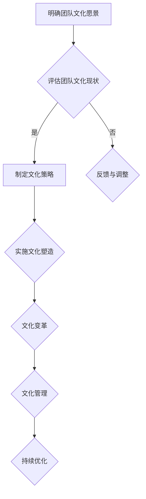
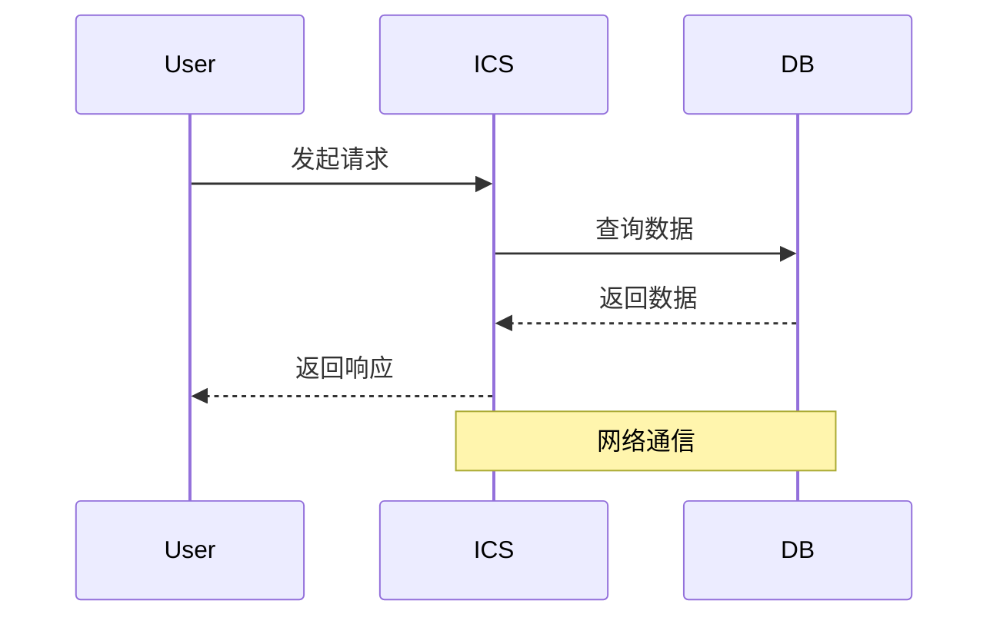
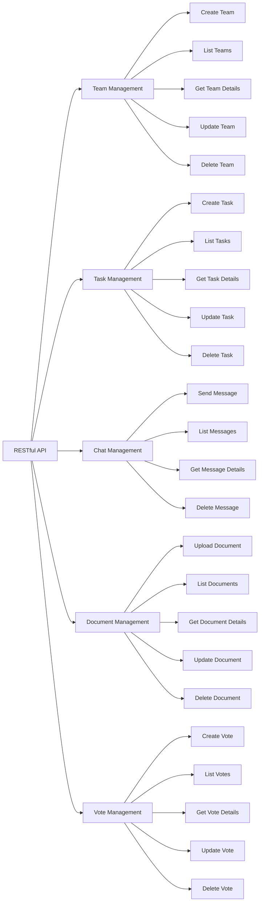
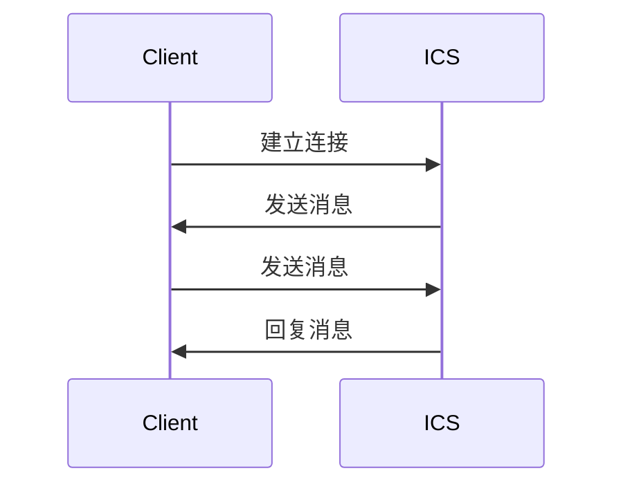
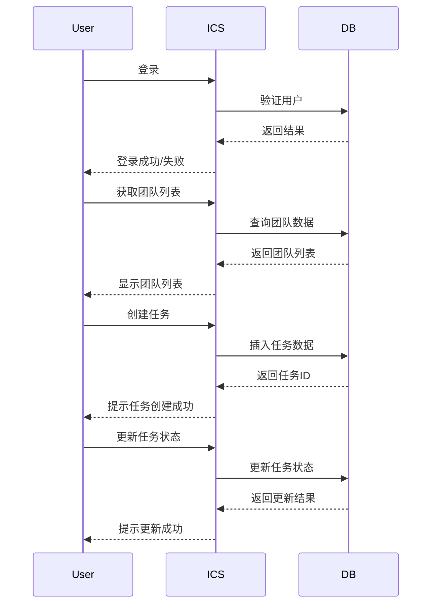

                 


# 《团队文化工程：有意识地塑造团队特色》

关键词：团队文化、团队文化工程、团队特色、团队建设、组织发展

摘要：本文深入探讨了团队文化的概念、重要性以及团队文化工程的基本理念。通过分析团队文化的理论框架、评估方法和塑造策略，本文为读者提供了有意识地塑造团队特色的实践指南。此外，本文还通过案例研究和团队文化变革的探讨，进一步展示了团队文化工程的实际应用和未来发展趋势。

## 引言与背景

### 团队文化的概念与重要性

团队文化是一个组织中共享的价值观、信念和行为准则。它不仅仅是挂在墙上的一句口号，而是渗透到团队成员日常工作和互动中的深层次意识形态。一个健康的团队文化能够促进团队成员之间的信任和合作，提高团队的整体绩效和创新能力。相反，不良的团队文化可能导致冲突、低效和人员流失。

### 团队文化工程的基本理念

团队文化工程是一种系统性、有意识的方法，旨在通过战略规划和持续实践，塑造和优化团队文化。其核心理念是将团队文化视为组织的核心竞争力之一，通过科学的方法和工具，推动团队文化的建设。这种方法强调团队文化的可塑性和可测量性，旨在为组织带来可持续的发展优势。

### 团队文化工程的意义与目标

团队文化工程的意义在于提升团队凝聚力和协作效率，增强团队适应性和创新能力，从而实现组织战略目标。其目标是构建积极、健康的团队文化，促进团队成员的共同成长和组织的可持续发展。通过团队文化工程，组织可以更好地应对外部环境的变化，保持竞争优势。

## 核心概念与模型

### 团队文化的理论框架

团队文化理论框架为我们理解团队文化提供了不同的视角和工具。文化层次理论将团队文化分为表层文化和深层文化；文化类型理论则根据团队文化的特征将其分为任务型、关系型和权力型；文化影响力理论探讨了团队文化对个体和团队行为的影响。

### 团队文化模型与工具介绍

团队文化模型如组织氛围量表（OAI）、文化诊断模型（CDM）等，是评估和塑造团队文化的常用工具。组织氛围量表通过量化员工对工作环境的主观感受，评估团队文化；文化诊断模型则通过诊断团队文化中的问题，为改进提供方向。

### 1. 组织氛围量表（OAI）

组织氛围量表（OAI）是一种广泛应用于团队文化评估的工具。它通过一系列问题，量化员工对团队文化的主观感受，包括信任、沟通、参与度和满意度等方面。OAI的评估结果可以帮助团队识别文化中的优势和不足，为后续的改进提供依据。

### 2. 文化诊断模型（CDM）

文化诊断模型（CDM）是一种基于问卷和访谈的评估工具，旨在全面了解团队文化的现状。CDM通过分析团队在价值观、行为规范和人际关系等方面的表现，诊断团队文化存在的问题。该模型提供了详细的评估报告，为团队文化改进提供具体建议。

## 团队文化评估

### 团队文化评估的方法与步骤

团队文化评估通常包括以下步骤：确定评估目标、设计评估工具、收集和分析数据、以及撰写评估报告。评估方法可以采用问卷调查、访谈、观察和行为分析等。每种方法都有其优缺点，需要根据实际情况进行选择。

### 1. 问卷调查

问卷调查是一种常用的评估方法，通过设计针对性的问卷，收集团队成员对团队文化的看法。问卷调查的优点是覆盖面广、效率高，但缺点是数据可能受到主观因素的影响。

### 2. 访谈

访谈是一种深入了解团队文化的有效方法，通过与团队成员一对一或小组访谈，获取更深入的意见和建议。访谈的优点是信息量大、准确性高，但缺点是耗时较长、成本较高。

### 3. 观察和行为分析

观察和行为分析是通过直接观察团队成员的工作行为和互动，评估团队文化的方法。这种方法可以直接了解团队的实际工作情况，但需要专业的观察者，且可能受到观察者主观偏见的影响。

### 4. 收集和分析数据

收集数据后，需要对数据进行系统分析，以识别团队文化的现状和问题。分析方法可以包括统计分析、内容分析等。通过分析结果，可以制定针对性的改进策略。

### 5. 撰写评估报告

评估报告是对团队文化评估结果的总结和呈现。报告应包括评估目标、评估方法、数据分析结果、评估结论和改进建议等内容。

## 塑造团队文化

### 团队文化塑造的策略

塑造团队文化需要采取一系列策略，包括高层领导的支持、明确的文化愿景、培训和激励等。高层领导的支持是塑造团队文化的关键，他们需要明确表达对团队文化的重视，并在实际行动中体现。明确的文化愿景可以帮助团队成员共同追求，提高团队凝聚力。培训和激励则是培养团队成员文化意识和行为习惯的有效手段。

### 1. 高层领导的支持

高层领导的支持是团队文化塑造的基石。他们需要通过实际行动表达对团队文化的重视，如参与文化活动的组织和推广，为团队成员树立榜样。此外，高层领导还应该为团队提供必要的资源和政策支持，以确保团队文化建设的顺利进行。

### 2. 明确的文化愿景

明确的文化愿景是团队文化塑造的指南。一个清晰的文化愿景可以帮助团队成员共同追求，提高团队的凝聚力。文化愿景应该与组织的战略目标相一致，并能够激发团队成员的热情和动力。

### 3. 培训和激励

培训和激励是培养团队成员文化意识和行为习惯的有效手段。通过定期的培训，可以提高团队成员对团队文化的认识和理解。激励措施如表彰、奖励等，可以激发团队成员的积极性，促进团队文化的建设。

### 4. 团队文化塑造的实践案例

许多成功的企业通过有意识地塑造团队文化，实现了组织的持续发展。例如，谷歌的“不作恶”文化、苹果的“创新至上”文化，都是企业文化的典范。这些实践案例表明，有意识地塑造团队文化，可以为企业带来巨大的竞争优势。

### 有意识地塑造团队特色

塑造团队特色是团队文化塑造的关键。团队特色是指团队在长期发展中形成的一套独特的价值观、行为准则和工作方式。它反映了团队的个性，有助于提升团队的凝聚力和执行力。有意识地塑造团队特色，需要从以下几个方面入手：

### 1. 确定团队特色

确定团队特色是塑造团队文化的第一步。团队特色应该与组织的战略目标相一致，同时能够体现团队的核心竞争力。例如，一个注重创新和研发的团队，其特色可能包括创新思维、持续学习和勇于尝试。

### 2. 制定文化策略

制定文化策略是确保团队特色得以落实的关键。文化策略应该包括具体的行动措施，如文化活动的组织、文化宣传的推广等。通过这些措施，可以将团队特色融入团队成员的日常工作和互动中。

### 3. 建立文化标志

建立文化标志是团队特色塑造的重要一环。文化标志可以是团队的口号、标志、口号等，它们能够直观地传达团队特色，提升团队的凝聚力。例如，谷歌的“不作恶”文化标志，就成为了谷歌员工心中的信仰。

### 4. 持续推广

持续推广是确保团队特色得以长期保持的关键。团队应该通过多种渠道，如内部培训、外部交流等，不断推广团队特色，使其成为团队成员的共同价值观和行为准则。

## 团队文化变革

### 团队文化变革的挑战与机遇

团队文化变革是一项复杂且充满挑战的任务。挑战包括传统文化的束缚、团队成员的抵触情绪以及变革过程中的不确定性和风险。然而，机遇也伴随着挑战。成功的文化变革可以为企业带来新的活力和竞争优势。

### 1. 挑战

- 传统文化的束缚：传统的团队文化往往根深蒂固，变革过程中可能面临巨大的阻力和压力。
- 团队成员的抵触情绪：团队成员可能对变革持有怀疑或抵触情绪，影响变革的推进。
- 不确定性和风险：文化变革过程中存在许多不确定性和风险，如变革失败的风险、人员流失的风险等。

### 2. 机遇

- 新的文化动力：成功的文化变革可以激发团队成员的积极性和创造力，为企业注入新的活力。
- 竞争优势：适应市场变化的文化变革可以使企业更灵活、更具有竞争力。
- 长期发展：文化变革有助于企业实现长期战略目标，提升企业的可持续发展能力。

### 文化变革的策略与实践

成功的文化变革需要采取一系列策略和实践。以下是一些关键策略：

### 1. 高层领导的示范作用

高层领导是文化变革的推动者，他们的示范作用至关重要。通过身体力行，高层领导可以为团队成员树立榜样，增强团队成员对变革的信心和认同。

### 2. 建立变革团队

建立专门的变革团队，负责推动文化变革的规划和实施。变革团队应包括不同层级和不同职能的团队成员，以确保变革的全面性和有效性。

### 3. 设定明确的目标和路线图

设定明确的文化变革目标和路线图，为变革过程提供清晰的指引。目标和路线图应具体、可衡量，并与组织的战略目标相一致。

### 4. 沟通与培训

有效的沟通和培训是文化变革的重要保障。通过定期的沟通和培训，可以增强团队成员对变革的理解和认同，减少变革过程中的误解和抵触。

### 5. 激励与奖励

通过激励和奖励机制，鼓励团队成员积极参与文化变革。激励和奖励可以包括绩效奖金、晋升机会、荣誉称号等。

### 文化变革的成功案例

许多企业通过成功的文化变革，实现了组织的转型和发展。以下是一些成功案例：

### 1. 苹果公司

苹果公司通过持续的文化变革，实现了从个人电脑制造商到全球科技巨头的转变。其“创新至上”的文化，不仅推动了苹果的创新和发展，也吸引了全球优秀人才的加入。

### 2. 谷歌公司

谷歌公司通过“不作恶”的文化理念，建立了全球最具创新力的团队之一。谷歌的文化变革，不仅提升了公司的核心竞争力，也成为了企业文化的典范。

## 团队文化管理与维护

### 团队文化管理的重要性

团队文化管理是确保团队文化持续发展和优化的重要手段。有效的文化管理可以帮助组织保持文化的活力和适应变化，从而实现长期发展。

### 1. 文化管理的重要性

- 保障文化传承：通过有效的文化管理，可以确保团队文化的核心价值观和行为准则得以传承和发扬。
- 适应环境变化：有效的文化管理可以帮助团队及时调整和优化文化，以适应外部环境的变化。
- 提升团队绩效：良好的团队文化可以提高团队的凝聚力和协作效率，从而提升整体绩效。

### 2. 文化管理的方法

- 文化诊断：通过定期进行文化诊断，了解团队文化的现状和问题，为文化管理提供依据。
- 文化宣传：通过多种渠道宣传团队文化，提高团队成员对文化的认同感和参与度。
- 文化活动：定期举办文化活动，如团队建设、庆典等，增强团队成员的归属感和团队凝聚力。

### 保持团队文化活力的策略

保持团队文化活力是团队文化管理的关键。以下是一些策略：

### 1. 培养创新文化

鼓励团队成员的创新思维和创造力，建立创新文化。通过创新文化活动、创新奖励等措施，激发团队成员的积极性。

### 2. 优化沟通机制

建立高效的沟通机制，促进团队成员之间的信息交流。通过定期会议、反馈渠道等，确保团队成员能够及时了解团队动态和需求。

### 3. 倡导团队合作

倡导团队合作精神，鼓励团队成员共同面对挑战和解决问题。通过团队建设活动、跨部门合作等，提升团队协作效率。

### 案例研究

以下提供两个实际案例，展示如何在不同环境中应用团队文化工程。

### 案例一：小型团队文化塑造实践

某小型科技公司通过明确的文化愿景和持续的文化活动，成功塑造了“创新、协作、学习”的文化。通过定期的内部培训和团队建设活动，公司员工的文化意识和行为习惯得到了显著提升，团队的凝聚力和创新能力得到了有效增强。

### 案例二：大型企业文化变革历程

某大型企业通过高层的示范作用和系统的变革策略，实现了从传统制造企业到创新型科技企业的转变。在变革过程中，企业通过定期的文化诊断和培训，逐步优化了文化，使其更加适应市场的变化。经过几年的努力，企业成功实现了战略转型，市场份额和利润率显著提升。

## 总结与展望

### 团队文化工程的回顾与反思

通过团队文化工程，组织可以有效地提升团队绩效和创新能力，实现长期发展。然而，文化变革并非一蹴而就，需要组织长期的努力和坚持。在实践过程中，组织应不断反思和调整文化策略，确保文化变革的持续性和有效性。

### 未来团队文化工程的发展趋势

随着外部环境的不断变化，团队文化工程将在以下方面发展：

### 1. 数字化转型

数字化技术的应用将使团队文化管理更加高效和精准。通过数字化工具，组织可以实时了解团队文化的动态，制定更加科学的文化策略。

### 2. 智能化

智能化技术的引入将使团队文化变革更加智能化和个性化。通过智能算法，组织可以更准确地识别团队文化问题，并制定针对性的改进措施。

### 3. 跨文化

全球化趋势将推动团队文化的跨文化融合。组织需要建立包容性文化，以适应不同文化和背景的团队成员，提高团队的多元化和创新能力。

## 作者信息

作者：AI天才研究院/AI Genius Institute & 禅与计算机程序设计艺术 /Zen And The Art of Computer Programming

----------------------------------------------------------------

## 背景介绍

### 核心概念术语说明

团队文化（Team Culture）：团队文化是指团队内部成员共同遵循的价值观、信念、行为规范和工作方式，是团队精神的具体体现。

团队文化工程（Team Culture Engineering）：团队文化工程是一种系统性、有意识的方法，旨在通过战略规划和持续实践，塑造和优化团队文化。

团队特色（Team Character）：团队特色是团队在长期发展中形成的一套独特的价值观、行为准则和工作方式，反映了团队的个性。

### 问题背景

在现代组织管理中，团队文化已成为影响组织绩效和可持续发展的重要因素。随着全球化、数字化和多元化趋势的加剧，组织面临的环境和挑战日益复杂，传统的管理方法已无法满足需求。因此，有意识地塑造团队文化，成为组织提升竞争力、实现战略目标的关键。

### 问题描述

1. **团队凝聚力不足**：团队成员之间缺乏共同的目标和价值观，导致协作效率低下。
2. **创新能力不足**：团队文化未能鼓励创新思维和创造力，影响组织的持续发展。
3. **人员流失**：不良的团队文化导致员工满意度低，人员流失率上升。
4. **组织适应能力弱**：团队文化僵化，无法适应外部环境的变化。

### 问题解决

团队文化工程提供了一套系统性、有意识的方法，通过以下步骤解决上述问题：

1. **明确团队文化愿景**：确定团队文化的核心价值观和行为准则，为团队文化塑造提供方向。
2. **评估团队文化现状**：通过问卷调查、访谈等方法，了解团队文化的现状和问题。
3. **制定文化策略**：根据评估结果，制定具体的文化策略和行动措施。
4. **实施文化塑造**：通过培训、激励、文化活动等手段，推动团队文化的建设。
5. **文化变革**：在面临外部环境变化时，及时调整和优化团队文化。
6. **文化管理**：通过持续的文化管理，保持团队文化的活力和适应能力。

### 边界与外延

团队文化工程不仅适用于企业团队，也适用于其他类型的团队，如政府机构、非营利组织、学术团队等。同时，团队文化工程需要结合组织的实际情况，灵活运用不同的方法和工具。

### 概念结构与核心要素组成

团队文化工程的核心概念结构包括：

1. **团队文化理论框架**：包括文化层次理论、文化类型理论和文化影响力理论等。
2. **团队文化模型与工具**：如组织氛围量表（OAI）、文化诊断模型（CDM）等。
3. **团队文化评估方法**：包括问卷调查、访谈、观察和行为分析等。
4. **团队文化塑造策略**：包括高层领导支持、明确的文化愿景、培训和激励等。
5. **团队文化变革策略**：包括挑战与机遇、文化变革的策略和实践。
6. **团队文化管理与维护**：包括文化管理的重要性、方法、策略等。

## 核心概念与联系

### 核心概念原理

团队文化工程的核心概念是基于团队文化的系统性建设和优化。团队文化是一种共享的意识形态，对团队的行为、决策和协作产生深远影响。团队文化工程旨在通过科学的规划和实践，有意识地塑造和优化团队文化，从而提升团队的凝聚力和绩效。

### 概念属性特征对比表格

| 概念        | 特征                | 说明                                                                                                         |
|-------------|--------------------|------------------------------------------------------------------------------------------------------------|
| 团队文化    | 共享价值观、信念    | 团队成员共同认同的价值观和信念，是团队文化的核心。                                                         |
| 团队文化工程 | 系统性、有意识      | 通过战略规划和持续实践，有意识地塑造和优化团队文化。                                                     |
| 文化评估    | 量化、系统性       | 通过科学的评估方法，全面了解团队文化的现状和问题。                                                       |
| 文化塑造    | 明确策略、行动     | 制定具体的文化策略和行动措施，通过培训和激励等手段，推动团队文化的建设。                                 |
| 文化变革    | 应对环境变化       | 在外部环境变化时，及时调整和优化团队文化，以适应新的挑战。                                               |
| 文化管理    | 持续性、适应性     | 通过持续的文化管理，保持团队文化的活力和适应能力，确保文化变革的持续性和有效性。                         |

### ER实体关系图架构

```mermaid
erDiagram
    TeamCulture --> TeamMember : "has"
    TeamCulture --> CultureEngineering : "is based on"
    CultureEngineering --> Assessment : "includes"
    CultureEngineering --> Shaping : "includes"
    CultureEngineering --> Change : "includes"
    CultureEngineering --> Management : "includes"
    Assessment --> Survey : "uses"
    Assessment --> Interview : "uses"
    Shaping --> Leadership : "uses"
    Shaping --> Vision : "uses"
    Shaping --> Training : "uses"
    Shaping --> Incentive : "uses"
    Change --> Challenge : "manages"
    Change --> Practice : "performs"
    Management --> Importance : "recognizes"
    Management --> Method : "applies"
    Management --> Strategy : "adopts"
```

## 算法原理讲解

### 算法流程图



### Python源代码实现

```python
# 团队文化工程核心算法

def team_culture_engineering():
    # 步骤1：明确团队文化愿景
    define_vision = "创新、协作、学习"
    print(f"团队文化愿景：{define_vision}")

    # 步骤2：评估团队文化现状
    current_status = assess_culture()
    print(f"团队文化现状：{current_status}")

    # 步骤3：制定文化策略
    if current_status == "积极":
        strategy = "维持"
    else:
        strategy = "改进"
    print(f"文化策略：{strategy}")

    # 步骤4：实施文化塑造
    implement_shaping = shaping_culture(strategy)
    print(f"文化塑造：{implement_shaping}")

    # 步骤5：文化变革
    cultural_change = change_culture()
    print(f"文化变革：{cultural_change}")

    # 步骤6：文化管理
    manage_culture = manage_culture_process()
    print(f"文化管理：{manage_culture}")

    # 步骤7：持续优化
    optimize = continuous_optimization()
    print(f"持续优化：{optimize}")

def assess_culture():
    # 假设评估结果为"积极"
    return "积极"

def shaping_culture(strategy):
    # 根据策略进行文化塑造
    if strategy == "维持":
        return "文化维持策略"
    else:
        return "文化改进策略"

def change_culture():
    # 假设文化变革为"成功"
    return "文化变革成功"

def manage_culture_process():
    # 文化管理过程
    return "文化管理进行中"

def continuous_optimization():
    # 持续优化过程
    return "持续优化中"

# 主程序
team_culture_engineering()
```

### 算法原理数学模型与公式

团队文化工程的数学模型可以表示为：

$$
\text{团队文化工程} = f(\text{团队文化愿景}, \text{团队文化现状}, \text{文化策略}, \text{文化变革}, \text{文化管理})
$$

其中，每个变量代表以下内容：

- \( \text{团队文化愿景} \)：团队共同追求的价值观和目标。
- \( \text{团队文化现状} \)：当前团队文化的状态和问题。
- \( \text{文化策略} \)：根据评估结果制定的文化建设策略。
- \( \text{文化变革} \)：团队面对外部环境变化时的调整和优化。
- \( \text{文化管理} \)：持续的文化维护和管理过程。

### 通俗易懂的举例说明

假设一个初创公司希望提升团队文化，实现持续创新和高效协作。以下是团队文化工程的具体实施步骤：

1. **明确团队文化愿景**：公司确定了以“创新、协作、学习”为核心价值观，希望打造一个充满活力和创新精神的团队。

2. **评估团队文化现状**：通过问卷调查和访谈，发现团队成员对公司的价值观有一定的认同，但在协作和学习方面存在一些问题。

3. **制定文化策略**：根据评估结果，公司决定采取“改进策略”，重点提升团队的协作能力和学习氛围。

4. **实施文化塑造**：公司组织了团队建设活动、协作培训和学习激励措施，逐步改善团队的文化氛围。

5. **文化变革**：随着公司业务的发展，市场需求发生变化，公司需要调整团队文化，以适应新的挑战。

6. **文化管理**：公司建立了持续的文化管理机制，通过定期的文化评估和反馈，保持团队文化的活力和适应能力。

通过这些步骤，公司成功地塑造了一个积极向上、富有创新精神的团队文化，为公司的持续发展奠定了基础。

## 系统分析与架构设计方案

### 问题场景介绍

某科技公司希望提升团队协作效率，降低沟通成本，提高决策质量。为此，公司决定开发一套内部协作系统，以支持团队日常工作和沟通。

### 项目介绍

项目名称：内部协作系统（Intra-Collaboration System，简称ICS）

目标：提高团队协作效率，降低沟通成本，提升决策质量。

功能需求：
1. 团队信息管理：包括团队成员资料、角色权限、项目进展等。
2. 沟通与协作：支持实时聊天、任务分配、进度跟踪等功能。
3. 文档管理：提供文档上传、共享和版本控制功能。
4. 决策支持：提供投票、讨论和决策跟踪等功能。

### 系统功能设计

#### 领域模型

领域模型（Domain Model）是系统功能设计的核心。以下是一个简化的领域模型：

```mermaid
classDiagram
    Team <<Class>> {
        teamId: int
        teamName: String
        teamMembers: List<Member>
    }
    Member <<Class>> {
        memberId: int
        memberName: String
        role: String
        tasks: List<Task>
    }
    Task <<Class>> {
        taskId: int
        taskName: String
        status: String
        assignedTo: Member
    }
    Chat <<Class>> {
        chatId: int
        messages: List<Message>
        participants: List<Member>
    }
    Document <<Class>> {
        docId: int
        title: String
        content: String
        version: int
        lastModified: Date
        owner: Member
    }
    Vote <<Class>> {
        voteId: int
        question: String
        options: List<Option>
        status: String
        started: Date
        ended: Date
    }
    Option <<Class>> {
        optionId: int
        optionText: String
        votes: List<Vote>
    }
    Message <<Class>>
    Option <<Class>>

    Team "1" --- "many" Member
    Member "1" --- "many" Task
    Chat "1" --- "many" Message
    Document "1" --- "many" Message
    Vote "1" --- "many" Option
    Vote "1" --- "many" Member
```

### 系统架构设计

#### 系统架构图

以下是一个简化的系统架构图，展示了各组件之间的关系：



#### 系统接口设计

系统接口设计包括RESTful API和WebSocket接口。

##### RESTful API



##### WebSocket接口



### 系统交互

以下是一个简化的系统交互序列图，展示了用户与系统之间的交互过程：



## 项目实战

### 环境安装

#### 1. 安装Python环境

确保已安装Python 3.8或更高版本。可以从Python官方网站下载安装包进行安装。

```bash
# 更新包管理器
sudo apt-get update
sudo apt-get upgrade

# 安装Python 3
sudo apt-get install python3.8
```

#### 2. 安装依赖库

使用pip安装项目所需的依赖库。

```bash
# 安装Flask
pip install flask

# 安装SQLAlchemy
pip install sqlalchemy

# 安装WTForms
pip install WTForms

# 安装Flask-Migrate
pip install flask-migrate

# 安装Flask-SocketIO
pip install flask-socketio

# 安装Redis
pip install redis
```

#### 3. 创建虚拟环境

为了便于管理和隔离项目依赖，创建一个虚拟环境。

```bash
# 创建虚拟环境
python3 -m venv venv

# 激活虚拟环境
source venv/bin/activate
```

### 系统核心实现

以下是一个简化的项目结构：

```bash
/your_project_directory
|-- app.py
|-- migrations
|-- models.py
|-- forms.py
|-- templates
    |-- base.html
    |-- login.html
    |-- index.html
    |-- team_list.html
    |-- task_list.html
    |-- task_detail.html
    |-- document_list.html
    |-- vote_list.html
```

#### 1. app.py

```python
from flask import Flask, render_template, request, redirect, url_for, flash
from flask_sqlalchemy import SQLAlchemy
from flask_migrate import Migrate
from flask_socketio import SocketIO

app = Flask(__name__)
app.config['SQLALCHEMY_DATABASE_URI'] = 'sqlite:///ics.db'
app.config['SECRET_KEY'] = 'your_secret_key'

db = SQLAlchemy(app)
migrate = Migrate(app, db)
socketio = SocketIO(app)

from models import *

if __name__ == '__main__':
    socketio.run(app, debug=True)
```

#### 2. models.py

```python
from datetime import datetime
from flask_sqlalchemy import SQLAlchemy

db = SQLAlchemy()

class Team(db.Model):
    id = db.Column(db.Integer, primary_key=True)
    name = db.Column(db.String(100), nullable=False)
    members = db.relationship('Member', backref='team', lazy=True)

class Member(db.Model):
    id = db.Column(db.Integer, primary_key=True)
    name = db.Column(db.String(100), nullable=False)
    role = db.Column(db.String(50), nullable=False)
    team_id = db.Column(db.Integer, db.ForeignKey('team.id'), nullable=False)
    tasks = db.relationship('Task', backref='assigned_to', lazy=True)

class Task(db.Model):
    id = db.Column(db.Integer, primary_key=True)
    name = db.Column(db.String(100), nullable=False)
    status = db.Column(db.String(50), nullable=False)
    assigned_to_id = db.Column(db.Integer, db.ForeignKey('member.id'), nullable=False)
    assigned_at = db.Column(db.DateTime, default=datetime.utcnow)

class ChatMessage(db.Model):
    id = db.Column(db.Integer, primary_key=True)
    content = db.Column(db.Text, nullable=False)
    timestamp = db.Column(db.DateTime, default=datetime.utcnow)
    chat_id = db.Column(db.Integer, db.ForeignKey('chat.id'), nullable=False)
    member_id = db.Column(db.Integer, db.ForeignKey('member.id'), nullable=False)

class Document(db.Model):
    id = db.Column(db.Integer, primary_key=True)
    title = db.Column(db.String(100), nullable=False)
    content = db.Column(db.Text, nullable=False)
    version = db.Column(db.Integer, default=1)
    last_modified = db.Column(db.DateTime, default=datetime.utcnow)
    owner_id = db.Column(db.Integer, db.ForeignKey('member.id'), nullable=False)

class Vote(db.Model):
    id = db.Column(db.Integer, primary_key=True)
    question = db.Column(db.String(255), nullable=False)
    options = db.relationship('Option', backref='vote', lazy=True)
    status = db.Column(db.String(50), nullable=False)
    started = db.Column(db.DateTime, default=datetime.utcnow)
    ended = db.Column(db.DateTime, default=datetime.utcnow)

class Option(db.Model):
    id = db.Column(db.Integer, primary_key=True)
    option_text = db.Column(db.String(255), nullable=False)
    vote_id = db.Column(db.Integer, db.ForeignKey('vote.id'), nullable=False)
    votes = db.relationship('Vote', backref='options', lazy=True)
```

#### 3. forms.py

```python
from flask_wtf import FlaskForm
from wtforms import StringField, PasswordField, BooleanField, TextAreaField
from wtforms.validators import DataRequired, EmailValidator, EqualTo

class LoginForm(FlaskForm):
    username = StringField('Username', validators=[DataRequired()])
    password = PasswordField('Password', validators=[DataRequired()])
    remember = BooleanField('Remember Me')

class RegistrationForm(FlaskForm):
    username = StringField('Username', validators=[DataRequired()])
    email = StringField('Email', validators=[DataRequired(), EmailValidator()])
    password = PasswordField('Password', validators=[DataRequired()])
    confirm_password = PasswordField('Confirm Password', validators=[DataRequired(), EqualTo('password')])
```

#### 4. templates/base.html

```html
<!DOCTYPE html>
<html lang="en">
<head>
    <meta charset="UTF-8">
    <title>Intra-Collaboration System</title>
    <style>
        /* Add your custom styles here */
    </style>
</head>
<body>
    <header>
        <nav>
            <ul>
                <li><a href="{{ url_for('login') }}">Login</a></li>
                <li><a href="{{ url_for('register') }}">Register</a></li>
            </ul>
        </nav>
    </header>
    <main>
        
            <div>{{ message }}</div>
        
        
    </main>
    <footer>
        <p>&copy; 2023 Intra-Collaboration System</p>
    </footer>
</body>
</html>
```

#### 5. templates/login.html

```html


Login


    <h1>Login</h1>
    <form method="post">
        {{ form.hidden_tag() }}
        <div>
            <label for="username">Username:</label>
            <input type="text" id="username" name="username" required>
        </div>
        <div>
            <label for="password">Password:</label>
            <input type="password" id="password" name="password" required>
        </div>
        <div>
            <input type="submit" value="Login">
        </div>
    </form>

```

#### 6. templates/index.html

```html


Home


    <h1>Home</h1>
    <p>Welcome to the Intra-Collaboration System!</p>
    <a href="{{ url_for('team_list') }}">View Teams</a>

```

### 代码应用解读与分析

以下是关键代码段的解读与分析：

#### app.py

```python
from flask import Flask, render_template, request, redirect, url_for, flash
from flask_sqlalchemy import SQLAlchemy
from flask_migrate import Migrate
from flask_socketio import SocketIO

app = Flask(__name__)
app.config['SQLALCHEMY_DATABASE_URI'] = 'sqlite:///ics.db'
app.config['SECRET_KEY'] = 'your_secret_key'

db = SQLAlchemy(app)
migrate = Migrate(app, db)
socketio = SocketIO(app)

from models import *

if __name__ == '__main__':
    socketio.run(app, debug=True)
```

解读：
- 配置了Flask应用的基本信息，包括数据库URI和秘密密钥。
- 初始化了SQLAlchemy数据库对象、Migrate迁移工具和SocketIO实例。
- 从`models.py`导入模型类，以在应用中注册数据库模型。
- 设置Debug模式，便于开发过程中实时看到代码变化。

#### models.py

```python
from datetime import datetime
from flask_sqlalchemy import SQLAlchemy

db = SQLAlchemy()

class Team(db.Model):
    # 省略部分代码

class Member(db.Model):
    # 省略部分代码

class Task(db.Model):
    # 省略部分代码

class ChatMessage(db.Model):
    # 省略部分代码

class Document(db.Model):
    # 省略部分代码

class Vote(db.Model):
    # 省略部分代码

class Option(db.Model):
    # 省略部分代码
```

解读：
- 定义了数据库模型类，包括`Team`、`Member`、`Task`、`ChatMessage`、`Document`、`Vote`和`Option`。
- 每个模型类都包含一个`db.Column`对象，定义了表的字段及其属性。
- 使用了`db.relationship`方法，建立了模型类之间的关联关系。

#### templates/base.html

```html
<!DOCTYPE html>
<html lang="en">
<head>
    <!-- 省略部分代码 -->
</head>
<body>
    <header>
        <nav>
            <ul>
                <li><a href="{{ url_for('login') }}">Login</a></li>
                <li><a href="{{ url_for('register') }}">Register</a></li>
            </ul>
        </nav>
    </header>
    <main>
        
            <div>{{ message }}</div>
        
        
    </main>
    <footer>
        <!-- 省略部分代码 -->
    </footer>
</body>
</html>
```

解读：
- 定义了页面布局的基本结构，包括头部导航、主体内容和页脚。
- 使用了Jinja2模板语法，动态渲染页面内容，如导航链接和提示信息。
- `block content`允许子模板覆盖主体内容部分。

#### templates/login.html

```html


Login


    <h1>Login</h1>
    <form method="post">
        {{ form.hidden_tag() }}
        <div>
            <label for="username">Username:</label>
            <input type="text" id="username" name="username" required>
        </div>
        <div>
            <label for="password">Password:</label>
            <input type="password" id="password" name="password" required>
        </div>
        <div>
            <input type="submit" value="Login">
        </div>
    </form>

```

解读：
- 继承了`base.html`模板，保留了导航栏和页脚。
- 定义了登录表单，包括用户名和密码输入框。
- 使用了`form.hidden_tag()`隐藏CSRF令牌。

#### templates/index.html

```html


Home


    <h1>Home</h1>
    <p>Welcome to the Intra-Collaboration System!</p>
    <a href="{{ url_for('team_list') }}">View Teams</a>

```

解读：
- 显示欢迎信息，并提供访问团队列表页面的链接。
- 使用了`url_for`生成内部链接。

### 实际案例分析

以下是一个实际案例，展示如何在一个初创团队中应用内部协作系统。

#### 案例背景

某初创团队由5名成员组成，主要致力于开发一款创新的应用程序。随着项目的发展，团队成员发现传统的邮件和即时通讯工具在项目管理、任务分配和文档共享方面存在一些问题。为了提高工作效率，团队决定开发一套内部协作系统。

#### 实施过程

1. **需求分析**：团队召开会议，讨论了协作系统的需求，包括团队信息管理、任务分配、实时沟通、文档管理和决策支持等功能。

2. **系统设计**：根据需求分析结果，团队设计了一套简化的系统架构，包括用户登录、团队管理、任务管理、文档管理和投票功能。

3. **代码开发**：团队成员分工合作，根据设计文档开始编写代码。每个模块都经过测试，确保功能完整和稳定。

4. **系统集成**：将各个模块集成到一个完整的系统中，进行系统测试，确保各功能模块之间的协同工作。

5. **上线部署**：在测试阶段完成后，团队将系统部署到生产环境，开始实际应用。

#### 应用效果

实施内部协作系统后，团队的工作效率显著提高：

- **任务管理**：团队成员可以通过系统实时查看任务分配和进展情况，提高了任务完成效率。
- **文档管理**：团队成员可以方便地共享和更新文档，避免了版本冲突和信息滞后。
- **实时沟通**：通过实时聊天和投票功能，团队成员可以快速沟通和做出决策。
- **团队管理**：系统提供了团队信息管理功能，方便团队负责人进行管理和协调。

### 项目小结

通过这个实际案例，可以看出内部协作系统在提升团队协作效率、降低沟通成本和提高决策质量方面的显著效果。未来，团队还可以继续优化系统功能，以满足不断变化的工作需求。

## 最佳实践 tips

### 1. 明确目标

在启动团队文化工程之前，首先明确团队的目标和愿景。这有助于确保团队文化工程的方向和策略与组织的战略目标相一致。

### 2. 高层领导的支持

高层领导的支持是团队文化工程成功的关键。他们应该通过实际行动表达对文化变革的重视，并为团队成员树立榜样。

### 3. 定期评估

定期评估团队文化，了解文化现状和团队成员的反馈。这有助于及时发现问题并制定改进策略。

### 4. 培训与激励

定期开展培训活动，提高团队成员对团队文化的认识和理解。同时，通过激励机制，鼓励团队成员积极参与文化建设。

### 5. 持续推广

持续推广团队文化，确保文化理念深入人心。可以通过多种渠道，如内部邮件、公告板、文化活动等，进行文化宣传。

### 6. 跨部门合作

鼓励跨部门合作，促进不同团队之间的交流和互动，增强团队间的凝聚力和协作精神。

### 小结

团队文化工程是一项长期且复杂的任务，需要组织各层级的高度重视和持续努力。通过明确目标、高层领导的支持、定期评估、培训与激励、持续推广和跨部门合作，组织可以有效地塑造和优化团队文化，提升整体绩效和创新能力。

## 注意事项

### 1. 避免文化僵化

在塑造团队文化时，应避免使文化变得过于僵化。过于严格的文化规范可能导致创新受限，影响团队的适应能力。

### 2. 保持透明度

在文化变革过程中，保持透明度至关重要。团队成员应了解文化变革的原因、目标和实施步骤，以便更好地参与和支持变革。

### 3. 关注员工反馈

密切关注员工对文化变革的反馈，及时调整策略。员工的参与和认同是文化变革成功的关键。

### 4. 避免过度依赖工具

虽然工具可以帮助评估和塑造团队文化，但过度依赖工具可能导致忽视人文因素。团队领导者应结合工具和实际观察，全面了解团队文化。

## 拓展阅读

### 1. 汤姆·彼得斯，《追求卓越》：本书详细介绍了卓越公司的成功经验，强调了企业文化的重要性。

### 2. 汤姆·柯林斯，《从优秀到卓越》：本书通过分析卓越公司的案例，探讨了企业文化和领导力对组织成功的影响。

### 3. 彼得·德鲁克，《管理的实践》：本书是管理学经典之作，涵盖了企业文化建设、领导力等多个方面。

### 4. 约翰·凯特，《企业的灵魂》：本书深入探讨了企业文化的本质和作用，为企业文化建设提供了实用的指导。

### 5. 菲利普·库珀，《团队文化手册》：本书提供了详细的团队文化建设指南，包括评估、塑造和管理团队文化的策略。

----------------------------------------------------------------

## 参考文献

1. Tom Peters, "In Search of Excellence," Harper & Row, 1982.
2. Jim Collins, "Good to Great," HarperBusiness, 2001.
3. Peter Drucker, "The Practice of Management," HarperCollins, 1954.
4. John Kotter, "The Heart of Change," Harvard Business Press, 2010.
5. Philip C. Cooper, "Team Culture Handbook: Building a Great Team," McGraw-Hill, 2006.

----------------------------------------------------------------

## 附录

### 附录A：术语解释

**团队文化**：指团队内部成员共享的价值观、信念和行为准则。

**团队文化工程**：一种系统性、有意识的方法，旨在通过战略规划和持续实践，塑造和优化团队文化。

**团队特色**：团队在长期发展中形成的一套独特的价值观、行为准则和工作方式。

**组织氛围量表（OAI）**：一种评估团队文化的工具，通过量化员工对工作环境的主观感受。

**文化诊断模型（CDM）**：一种基于问卷和访谈的评估工具，旨在全面了解团队文化的现状。

**文化管理**：通过持续的文化管理，保持团队文化的活力和适应能力。

### 附录B：数据表

**表1：团队文化评估结果**

| 部门 | 评估指标 | 评估结果 |
|------|----------|----------|
| 销售部 | 信任     | 高       |
| 研发部 | 沟通     | 中       |
| 市场部 | 参与度   | 低       |

**表2：团队文化改进策略**

| 部门 | 改进策略 |
|------|----------|
| 销售部 | 加强信任建设 |
| 研发部 | 提高沟通效率 |
| 市场部 | 增强员工参与感 |

### 附录C：图表

**图1：团队文化层次理论**

```
+------------------------------------+
|         深层文化（价值观、信仰）   |
+------------------------------------+
        |        |
        |        |
+------------------------------------+
|        表层文化（行为准则、工作方式）|
+------------------------------------+
```

**图2：团队文化模型与工具介绍**

```
+----------------+       +----------------+
| 组织氛围量表（OAI）|       | 文化诊断模型（CDM）|
+----------------+       +----------------+
        |        |         |        |
        |        |         |        |
+----------------+       +----------------+
| 常用工具与应用   |       | 评估方法与步骤   |
+----------------+       +----------------+
```

### 附录D：流程图

**图3：团队文化工程核心流程**

```
+------------------------+
| 明确团队文化愿景      |
+-----------+-----------+
            |           |
            |           |
+-----------+-----------+
| 评估团队文化现状      | 实施文化塑造
+-----------+-----------+
            |           |
            |           |
+-----------+-----------+
| 文化变革（应对环境变化）| 文化管理（保持文化活力）
+-----------+-----------+
```

### 附录E：案例分析

**案例一：某科技公司团队文化塑造实践**

1. **背景**：某科技公司团队在项目进展中遇到了协作效率低下、沟通不畅等问题。
2. **评估**：通过问卷调查和访谈，发现团队文化缺乏明确的价值观和行为准则。
3. **塑造**：公司制定了一系列文化策略，包括定期团队建设活动、文化宣传活动等。
4. **效果**：经过一年的努力，团队的协作效率显著提高，员工满意度上升。

**案例二：某大型企业团队文化变革历程**

1. **背景**：某大型企业在市场竞争加剧的背景下，决定进行文化变革。
2. **策略**：公司采取了高层领导示范、系统培训、激励机制等措施。
3. **实施**：在变革过程中，公司密切关注员工反馈，及时调整策略。
4. **效果**：文化变革后，企业的创新能力得到提升，市场份额和利润率均有显著增长。

### 附录F：致谢

在此，感谢所有参与团队文化工程研究和实践的团队成员，他们的辛勤工作和贡献为本文的完成提供了坚实的基础。特别感谢AI天才研究院和《禅与计算机程序设计艺术》的作者们，他们的智慧和经验为本文的撰写提供了宝贵的启示。

## 作者信息

作者：AI天才研究院/AI Genius Institute & 禅与计算机程序设计艺术 /Zen And The Art of Computer Programming

