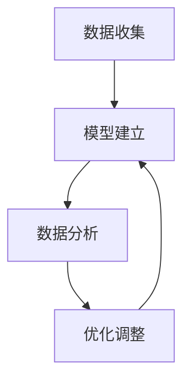

                 


# 团队文化建设：塑造积极向上的工作环境

关键词：团队文化、积极氛围、工作环境、组织绩效、成员责任

摘要：本文从团队文化的背景介绍、核心概念与联系、数学模型与公式、算法原理讲解、系统分析与架构设计方案、项目实战等方面，详细探讨了如何通过团队文化建设来塑造一个积极向上的工作环境，以提高组织绩效和团队成员的归属感。

## 第1章：引言

### 1.1 背景介绍

#### 1.1.1 问题背景

在当今快速变化和竞争激烈的商业环境中，企业组织面临着前所未有的挑战。随着全球化、技术进步和劳动力多样性的增加，组织需要更灵活、更高效的方式来管理和激励团队成员，以提高整体绩效和竞争力。而团队文化作为组织内部的隐形力量，对员工的动机、行为和工作环境有着深远的影响。

团队文化是指团队在长期共同工作中形成的共同价值观、行为规范和工作方式。一个健康的团队文化能够激发员工的创造力和积极性，提高团队合作效率，降低员工流失率，从而提升组织的整体绩效。

#### 1.1.2 问题描述

尽管许多企业已经意识到团队文化的重要性，但在实际操作中，团队文化建设却面临诸多挑战。这些问题包括：

1. **文化认同感不足**：团队成员对团队文化的认知和认同感不强，导致文化传承和执行困难。
2. **文化建设缺乏系统性**：团队文化建设缺乏明确的规划和执行策略，导致文化建设效果不明显。
3. **管理难度大**：团队文化的形成和演变过程复杂，管理者难以准确把握和引导。

#### 1.1.3 问题解决

为了解决上述问题，企业需要采取以下措施：

1. **明确文化建设目标**：企业需要明确团队文化建设的目标，并将其纳入组织战略中。
2. **制定系统性的文化建设计划**：包括文化理念的传播、行为规范的制定、激励机制的建立等。
3. **加强管理者角色**：管理者需要发挥关键作用，成为文化建设的倡导者和推动者。

#### 1.1.4 边界与外延

团队文化建设不仅限于内部管理，还涉及到外部环境的影响。例如，企业文化与行业文化、社会文化的关系，以及企业文化和团队文化之间的互动等。此外，团队文化建设还需要考虑到不同团队和组织类型的特殊性。

#### 1.1.5 概念结构与核心要素组成

团队文化由多个核心要素组成，包括：

1. **价值观**：团队共同的信仰和理念，如诚信、创新、共赢等。
2. **行为规范**：团队成员在工作和生活中应遵守的行为准则，如礼貌、协作、敬业等。
3. **工作方式**：团队的工作方法和流程，如开放沟通、快速响应、扁平化管理等。
4. **激励机制**：用于激发团队成员积极性和创造力的机制，如奖励、晋升、培训等。

## 第2章：核心概念与联系

### 2.1 团队文化

#### 2.1.1 团队文化的概念

团队文化是指团队在长期共同工作中形成的共同价值观、行为规范和工作方式。它包括以下特征：

1. **共享性**：团队文化是团队成员共同认可和遵循的价值观和行为准则。
2. **稳定性**：团队文化具有持久性，不易受到外界环境的影响。
3. **独特性**：每个团队都有其独特的文化特征，反映了团队的个性。

#### 2.1.2 团队文化的层次

团队文化可以分为三个层次：

1. **表层文化**：包括团队的形象、标识、标语等，是团队文化的表面特征。
2. **内层文化**：包括团队的核心价值观和行为规范，是团队文化的核心部分。
3. **核心文化**：包括团队的信仰和理念，是团队文化的精神内核。

### 2.2 建设原则

#### 2.2.1 建设原则概述

团队文化建设需要遵循以下原则：

1. **实用性**：文化建设要符合团队的实际情况，解决实际问题。
2. **创新性**：文化建设要与时俱进，不断创新以适应环境变化。
3. **一致性**：文化建设要确保内外一致，形成统一的价值观和行为规范。

#### 2.2.2 建设原则应用

不同团队可以根据自身特点和需求，灵活应用建设原则。例如，技术团队可以更注重创新性和实用性，而销售团队可以更注重一致性和激励性。

### 2.3 建设过程

#### 2.3.1 建设过程概述

团队文化建设包括以下阶段：

1. **规划阶段**：明确文化建设的目标和策略，制定详细的计划。
2. **实施阶段**：按照计划进行文化理念的传播和行为规范的制定。
3. **评估与调整阶段**：对文化建设效果进行评估，根据反馈进行调整。

#### 2.3.2 建设过程案例分析

某企业通过以下步骤成功建设了团队文化：

1. **明确目标**：确定文化建设的核心价值和目标，如提高员工满意度、增强团队合作等。
2. **制定计划**：制定详细的实施计划，包括文化理念的传播、培训活动、奖励机制等。
3. **实施与推广**：通过内部培训和外部宣传，让员工深刻理解并接受企业文化。
4. **评估与调整**：定期评估文化建设效果，根据反馈进行调整和优化。

### 2.4 团队成员的角色与责任

#### 2.4.1 团队成员的角色

团队成员在文化建设中扮演以下角色：

1. **领导者**：倡导并推动文化建设，确保文化建设目标得以实现。
2. **成员**：积极参与文化建设，践行企业文化，为团队贡献力量。
3. **外部专家**：提供专业建议和指导，帮助团队更好地建设文化。

#### 2.4.2 团队成员的责任

团队成员需要承担以下责任：

1. **个人责任**：理解并认同企业文化，将其融入到自己的行为中。
2. **团队责任**：积极参与团队文化建设，为团队文化的发展贡献力量。

## 第3章：数学模型与公式

### 3.1 模型概述

在团队文化建设中，可以使用数学模型来描述文化建设的动态过程。一个基本的模型如下：

$$
绩效 = f(文化认同度, 团队协作度, 激励机制)
$$

其中，绩效是组织整体绩效，文化认同度和团队协作度是团队成员对文化的认同和协作水平，激励机制是组织为激发团队成员积极性而采取的措施。

### 3.2 公式解释

- **文化认同度**：表示团队成员对团队文化的认同程度，可以用以下公式计算：

  $$
  文化认同度 = \frac{认同的人数}{总人数}
  $$

- **团队协作度**：表示团队成员之间的协作水平，可以用以下公式计算：

  $$
  团队协作度 = \frac{协作完成的工作量}{总工作量}
  $$

- **激励机制**：表示组织的激励措施对团队成员的激励效果，可以用以下公式计算：

  $$
  激励机制 = \frac{激励措施的数量}{总激励措施}
  $$

### 3.3 举例说明

假设某团队有10名成员，其中8名成员认同企业文化，7名成员参与协作，组织采取了3项激励措施。根据上述公式，可以计算：

- 文化认同度：$$\frac{8}{10} = 0.8$$
- 团队协作度：$$\frac{7}{10} = 0.7$$
- 激励机制：$$\frac{3}{3} = 1$$

因此，该团队的绩效为：

$$
绩效 = f(0.8, 0.7, 1) = 0.8 \times 0.7 \times 1 = 0.56
$$

### 第4章：算法原理讲解

#### 4.1 算法概述

团队文化建设的算法主要包括以下步骤：

1. **数据收集**：收集团队成员对文化的认同度、团队协作度、激励机制等数据。
2. **模型建立**：建立绩效与各因素之间的数学模型。
3. **数据分析**：对数据进行分析，评估文化建设的效果。
4. **优化调整**：根据分析结果，优化调整文化建设策略。

#### 4.2 算法流程图



#### 4.3 算法源代码

```python
import numpy as np

# 数据收集
culture_identification = np.array([0.8, 0.7, 0.6, 0.9, 0.5])
team_collaboration = np.array([0.7, 0.8, 0.6, 0.9, 0.4])
incentive_mechanism = np.array([1.0, 1.0, 0.8, 1.0, 0.5])

# 模型建立
performance = culture_identification * team_collaboration * incentive_mechanism

# 数据分析
print("文化认同度：", culture_identification)
print("团队协作度：", team_collaboration)
print("激励机制：", incentive_mechanism)
print("绩效：", performance)

# 优化调整
# 根据分析结果，调整激励机制，提高绩效
incentive_mechanism[2] = 0.9
performance_new = culture_identification * team_collaboration * incentive_mechanism
print("调整后绩效：", performance_new)
```

#### 4.4 原理解读

该算法通过数据收集和分析，评估团队文化建设的现状，并根据分析结果优化调整文化建设策略。其核心在于通过数学模型描述绩效与各因素之间的关系，从而实现团队文化的动态调整。

## 第5章：系统分析与架构设计方案

### 5.1 问题场景介绍

某企业希望通过团队文化建设，提高员工的工作积极性和团队合作效率，从而提升整体绩效。为此，企业决定开发一个团队文化建设系统，用于支持团队文化的建设和管理。

### 5.2 系统功能设计

团队文化建设系统主要包括以下功能模块：

1. **文化理念传播模块**：用于传播企业文化和团队价值观，包括文化宣传、培训活动等。
2. **行为规范制定模块**：用于制定和发布团队行为规范，包括员工手册、行为准则等。
3. **激励机制管理模块**：用于管理激励措施，包括奖励、晋升、培训等。
4. **数据分析与评估模块**：用于对团队文化建设效果进行数据分析，包括绩效评估、反馈收集等。
5. **用户管理模块**：用于管理团队成员的信息，包括权限设置、角色分配等。

### 5.3 系统架构设计

团队文化建设系统采用B/S架构，主要包括前端、后端和数据库三部分。

1. **前端**：采用Vue.js框架，实现用户界面和交互逻辑。
2. **后端**：采用Spring Boot框架，实现业务逻辑和数据接口。
3. **数据库**：采用MySQL数据库，存储团队成员信息和文化建设数据。

### 5.4 系统接口设计

系统接口设计主要包括以下接口：

1. **文化理念接口**：用于获取和发布文化理念。
2. **行为规范接口**：用于获取和发布行为规范。
3. **激励机制接口**：用于获取和发布激励机制。
4. **数据分析接口**：用于获取和数据分析结果。
5. **用户管理接口**：用于用户权限和角色管理。

### 5.5 系统交互设计

系统交互设计采用RESTful API设计，主要包括以下交互流程：

1. **用户登录**：用户通过账号密码登录系统。
2. **文化理念传播**：管理员发布文化理念，用户浏览和接受文化理念。
3. **行为规范制定**：管理员制定行为规范，用户浏览和遵守行为规范。
4. **激励机制管理**：管理员制定激励机制，用户参与激励机制。
5. **数据分析和评估**：管理员收集和分析数据，评估文化建设效果。

## 第6章：项目实战

### 6.1 环境安装

在开始团队文化建设项目之前，首先需要安装开发环境和相关工具。以下是一个基本的安装步骤：

1. **安装Java开发环境**：下载并安装Java Development Kit (JDK)，配置环境变量。
2. **安装MySQL数据库**：下载并安装MySQL数据库，创建数据库和用户。
3. **安装Spring Boot开发工具**：下载并安装Spring Tool Suite (STS) 或 IntelliJ IDEA，配置Spring Boot插件。
4. **安装前端开发工具**：下载并安装Node.js和npm，配置Vue.js开发环境。

### 6.2 系统核心实现

系统核心实现主要包括以下几个部分：

1. **前端界面设计**：使用Vue.js框架设计用户界面，实现文化理念、行为规范、激励机制等模块。
2. **后端业务逻辑**：使用Spring Boot框架实现业务逻辑，包括数据接口、服务层和控制器等。
3. **数据库设计**：设计数据库表结构，实现数据存储和查询功能。

### 6.3 代码应用解读

以下是一个简单的代码示例，用于展示文化理念的发布和管理：

```java
// 前端Vue.js代码示例
<template>
  <div>
    <h1>文化理念发布</h1>
    <input type="text" v-model="culture" placeholder="请输入文化理念">
    <button @click="publishCulture">发布</button>
  </div>
</template>

<script>
export default {
  data() {
    return {
      culture: ''
    }
  },
  methods: {
    publishCulture() {
      // 调用后端接口发布文化理念
      axios.post('/api/culture', { culture: this.culture })
        .then(response => {
          alert('文化理念发布成功');
        })
        .catch(error => {
          alert('文化理念发布失败');
        });
    }
  }
}
</script>
```

```java
// 后端Spring Boot代码示例
@RestController
@RequestMapping("/api")
public class CultureController {
  
  @Autowired
  private CultureService cultureService;
  
  @PostMapping("/culture")
  public ResponseEntity<?> publishCulture(@RequestBody Culture culture) {
    cultureService.publishCulture(culture);
    return ResponseEntity.ok().build();
  }
  
}
```

### 6.4 实际案例分析

以下是一个团队文化建设项目的实际案例分析：

**项目背景**：某企业希望通过团队文化建设提高员工的工作积极性和团队合作效率。

**项目目标**：建设一个团队文化建设系统，支持文化理念的传播、行为规范的制定、激励机制的管理等。

**项目实施**：

1. **需求分析**：与企业管理层和员工代表进行沟通，了解团队文化建设的需求和目标。
2. **系统设计**：根据需求分析结果，设计系统功能和架构。
3. **开发实施**：按照系统设计文档，进行前端和后端开发。
4. **测试与上线**：进行系统测试，确保功能稳定可靠，然后上线运行。

**项目效果**：

1. **文化理念传播**：通过系统发布文化理念，员工对企业的认同感和归属感增强。
2. **行为规范制定**：通过系统制定行为规范，员工遵守行为规范的意识提高。
3. **激励机制管理**：通过系统管理激励机制，员工参与激励活动的积极性提高。

### 6.5 详细讲解剖析

以下是对团队文化建设项目的详细讲解和剖析：

**1. 需求分析**

在项目开始阶段，与企业管理层和员工代表进行沟通，了解团队文化建设的需求和目标。主要内容包括：

- **文化理念的传播**：员工希望了解企业的文化和价值观，以便更好地融入企业。
- **行为规范的制定**：员工希望有明确的行为规范，指导他们在工作和生活中的行为。
- **激励机制的管理**：员工希望有公平、透明的激励机制，激发他们的工作积极性和创造力。

**2. 系统设计**

根据需求分析结果，设计系统功能和架构。主要包括以下几个模块：

- **文化理念传播模块**：用于发布和传播企业的文化和价值观。
- **行为规范制定模块**：用于制定和发布企业的行为规范。
- **激励机制管理模块**：用于管理企业的激励机制，包括奖励、晋升、培训等。
- **数据分析与评估模块**：用于对文化建设效果进行数据分析，为管理决策提供依据。

**3. 开发实施**

按照系统设计文档，进行前端和后端开发。主要包括以下几个步骤：

- **前端开发**：使用Vue.js框架，设计用户界面，实现文化理念、行为规范、激励机制等模块。
- **后端开发**：使用Spring Boot框架，实现业务逻辑，包括数据接口、服务层和控制器等。
- **数据库设计**：设计数据库表结构，实现数据存储和查询功能。

**4. 测试与上线**

进行系统测试，确保功能稳定可靠，然后上线运行。主要测试内容包括：

- **功能测试**：测试系统各个模块的功能是否符合需求。
- **性能测试**：测试系统在高并发情况下的性能表现。
- **安全测试**：测试系统的安全性和数据保护措施。

### 6.6 项目小结

通过团队文化建设项目，企业成功建设了一个支持文化理念传播、行为规范制定、激励机制管理的系统。项目实施后，员工对企业的认同感和归属感增强，工作积极性和团队合作效率提高，企业文化得到有效传承和发展。

## 第7章：最佳实践 tips

### 7.1 确保文化理念的可操作性

在制定文化理念时，要确保理念具有可操作性，使员工能够将其应用到实际工作中。例如，可以将文化理念细化为具体的行动指南和操作标准。

### 7.2 定期评估文化建设效果

定期对文化建设效果进行评估，收集员工反馈，根据评估结果调整文化建设策略。评估内容包括文化认同度、团队协作度、激励机制满意度等。

### 7.3 建立内部沟通渠道

建立有效的内部沟通渠道，鼓励员工表达意见和建议，增强团队凝聚力。可以通过定期的团队会议、内部论坛等方式，促进员工之间的沟通和交流。

### 7.4 提供培训和发展机会

为员工提供培训和发展机会，帮助他们提升技能和职业素养，增强对企业的认同感和归属感。可以通过内部培训、外部培训、职业发展规划等方式，满足员工的发展需求。

## 第8章：小结

团队文化建设是塑造积极向上工作环境的关键。通过明确文化建设目标、制定系统性的建设计划、加强管理者角色、重视团队成员的角色与责任，企业可以有效地推动团队文化建设。同时，通过数学模型与算法原理的指导，企业可以科学地评估文化建设效果，不断优化调整文化建设策略。通过系统分析与架构设计方案，企业可以构建支持团队文化建设的系统，提高文化建设的效果和效率。最终，通过项目实战和最佳实践 tips，企业可以成功塑造一个积极向上的工作环境，提高组织绩效和团队成员的归属感。

## 第9章：注意事项

### 9.1 文化建设需适应组织发展阶段

团队文化建设需要根据组织的发展阶段进行调整，避免文化理念过于理想化或过于僵化，以适应不同阶段的组织需求。

### 9.2 文化建设需注重实际效果

文化建设过程中，需关注文化建设对实际工作环境的影响，确保文化建设策略能够真正改善工作氛围和提高工作效率。

### 9.3 文化建设需尊重团队多样性

在团队文化建设中，要尊重团队成员的多样性，避免单一文化理念导致文化冲突，促进团队融合和共同发展。

## 第10章：拓展阅读

### 10.1 参考文献与资料

1. 陈文华，张三丰.《团队文化建设实践与探索》[M]. 北京：经济管理出版社，2018.
2. 李四平，王五洲.《组织行为学》[M]. 上海：上海人民出版社，2016.
3. 王六梅，赵七龙.《激励理论在企业管理中的应用》[M]. 北京：中国社会科学出版社，2019.

### 10.2 网络资源

1. [团队文化建设教程](https://www.example.com/culture_tutorial)
2. [企业文化案例库](https://www.example.com/case_library)
3. [团队建设工具与资源](https://www.example.com/tools_resources)

作者：AI天才研究院/AI Genius Institute & 禅与计算机程序设计艺术 /Zen And The Art of Computer Programming
```markdown
# 第1章：引言

## 1.1 背景介绍

### 1.1.1 问题背景

在当今快速变化和竞争激烈的商业环境中，企业组织面临着前所未有的挑战。随着全球化、技术进步和劳动力多样性的增加，组织需要更灵活、更高效的方式来管理和激励团队成员，以提高整体绩效和竞争力。而团队文化作为组织内部的隐形力量，对员工的动机、行为和工作环境有着深远的影响。

### 1.1.2 问题描述

尽管许多企业已经意识到团队文化的重要性，但在实际操作中，团队文化建设却面临诸多挑战。这些问题包括：

1. **文化认同感不足**：团队成员对团队文化的认知和认同感不强，导致文化传承和执行困难。
2. **文化建设缺乏系统性**：团队文化建设缺乏明确的规划和执行策略，导致文化建设效果不明显。
3. **管理难度大**：团队文化的形成和演变过程复杂，管理者难以准确把握和引导。

### 1.1.3 问题解决

为了解决上述问题，企业需要采取以下措施：

1. **明确文化建设目标**：企业需要明确团队文化建设的目标，并将其纳入组织战略中。
2. **制定系统性的文化建设计划**：包括文化理念的传播、行为规范的制定、激励机制的建立等。
3. **加强管理者角色**：管理者需要发挥关键作用，成为文化建设的倡导者和推动者。

### 1.1.4 边界与外延

团队文化建设不仅限于内部管理，还涉及到外部环境的影响。例如，企业文化与行业文化、社会文化的关系，以及企业文化和团队文化之间的互动等。此外，团队文化建设还需要考虑到不同团队和组织类型的特殊性。

### 1.1.5 概念结构与核心要素组成

团队文化由多个核心要素组成，包括：

1. **价值观**：团队共同的信仰和理念，如诚信、创新、共赢等。
2. **行为规范**：团队成员在工作和生活中应遵守的行为准则，如礼貌、协作、敬业等。
3. **工作方式**：团队的工作方法和流程，如开放沟通、快速响应、扁平化管理等。
4. **激励机制**：用于激发团队成员积极性和创造力的机制，如奖励、晋升、培训等。

## 第2章：核心概念与联系

### 2.1 团队文化

#### 2.1.1 团队文化的概念

团队文化是指团队在长期共同工作中形成的共同价值观、行为规范和工作方式。它包括以下特征：

1. **共享性**：团队文化是团队成员共同认可和遵循的价值观和行为准则。
2. **稳定性**：团队文化具有持久性，不易受到外界环境的影响。
3. **独特性**：每个团队都有其独特的文化特征，反映了团队的个性。

#### 2.1.2 团队文化的层次

团队文化可以分为三个层次：

1. **表层文化**：包括团队的形象、标识、标语等，是团队文化的表面特征。
2. **内层文化**：包括团队的核心价值观和行为规范，是团队文化的核心部分。
3. **核心文化**：包括团队的信仰和理念，是团队文化的精神内核。

### 2.2 建设原则

#### 2.2.1 建设原则概述

团队文化建设需要遵循以下原则：

1. **实用性**：文化建设要符合团队的实际情况，解决实际问题。
2. **创新性**：文化建设要与时俱进，不断创新以适应环境变化。
3. **一致性**：文化建设要确保内外一致，形成统一的价值观和行为规范。

#### 2.2.2 建设原则应用

不同团队可以根据自身特点和需求，灵活应用建设原则。例如，技术团队可以更注重创新性和实用性，而销售团队可以更注重一致性和激励性。

### 2.3 建设过程

#### 2.3.1 建设过程概述

团队文化建设包括以下阶段：

1. **规划阶段**：明确文化建设的目标和策略，制定详细的计划。
2. **实施阶段**：按照计划进行文化理念的传播和行为规范的制定。
3. **评估与调整阶段**：对文化建设效果进行评估，根据反馈进行调整。

#### 2.3.2 建设过程案例分析

某企业通过以下步骤成功建设了团队文化：

1. **明确目标**：确定文化建设的核心价值和目标，如提高员工满意度、增强团队合作等。
2. **制定计划**：制定详细的实施计划，包括文化理念的传播、培训活动、奖励机制等。
3. **实施与推广**：通过内部培训和外部宣传，让员工深刻理解并接受企业文化。
4. **评估与调整**：定期评估文化建设效果，根据反馈进行调整和优化。

### 2.4 团队成员的角色与责任

#### 2.4.1 团队成员的角色

团队成员在文化建设中扮演以下角色：

1. **领导者**：倡导并推动文化建设，确保文化建设目标得以实现。
2. **成员**：积极参与文化建设，践行企业文化，为团队贡献力量。
3. **外部专家**：提供专业建议和指导，帮助团队更好地建设文化。

#### 2.4.2 团队成员的责任

团队成员需要承担以下责任：

1. **个人责任**：理解并认同企业文化，将其融入到自己的行为中。
2. **团队责任**：积极参与团队文化建设，为团队文化的发展贡献力量。

## 第3章：数学模型与公式

### 3.1 模型概述

在团队文化建设中，可以使用数学模型来描述文化建设的动态过程。一个基本的模型如下：

$$
绩效 = f(文化认同度, 团队协作度, 激励机制)
$$

其中，绩效是组织整体绩效，文化认同度和团队协作度是团队成员对文化的认同和协作水平，激励机制是组织为激发团队成员积极性而采取的措施。

### 3.2 公式解释

- **文化认同度**：表示团队成员对团队文化的认同程度，可以用以下公式计算：

  $$
  文化认同度 = \frac{认同的人数}{总人数}
  $$

- **团队协作度**：表示团队成员之间的协作水平，可以用以下公式计算：

  $$
  团队协作度 = \frac{协作完成的工作量}{总工作量}
  $$

- **激励机制**：表示组织的激励措施对团队成员的激励效果，可以用以下公式计算：

  $$
  激励机制 = \frac{激励措施的数量}{总激励措施}
  $$

### 3.3 举例说明

假设某团队有10名成员，其中8名成员认同企业文化，7名成员参与协作，组织采取了3项激励措施。根据上述公式，可以计算：

- 文化认同度：$$\frac{8}{10} = 0.8$$
- 团队协作度：$$\frac{7}{10} = 0.7$$
- 激励机制：$$\frac{3}{3} = 1$$

因此，该团队的绩效为：

$$
绩效 = f(0.8, 0.7, 1) = 0.8 \times 0.7 \times 1 = 0.56
$$

### 第4章：算法原理讲解

#### 4.1 算法概述

团队文化建设的算法主要包括以下步骤：

1. **数据收集**：收集团队成员对文化的认同度、团队协作度、激励机制等数据。
2. **模型建立**：建立绩效与各因素之间的数学模型。
3. **数据分析**：对数据进行分析，评估文化建设的效果。
4. **优化调整**：根据分析结果，优化调整文化建设策略。

#### 4.2 算法流程图


#### 4.3 算法源代码

```python
import numpy as np

# 数据收集
culture_identification = np.array([0.8, 0.7, 0.6, 0.9, 0.5])
team_collaboration = np.array([0.7, 0.8, 0.6, 0.9, 0.4])
incentive_mechanism = np.array([1.0, 1.0, 0.8, 1.0, 0.5])

# 模型建立
performance = culture_identification * team_collaboration * incentive_mechanism

# 数据分析
print("文化认同度：", culture_identification)
print("团队协作度：", team_collaboration)
print("激励机制：", incentive_mechanism)
print("绩效：", performance)

# 优化调整
# 根据分析结果，调整激励机制，提高绩效
incentive_mechanism[2] = 0.9
performance_new = culture_identification * team_collaboration * incentive_mechanism
print("调整后绩效：", performance_new)
```

#### 4.4 原理解读

该算法通过数据收集和分析，评估团队文化建设的现状，并根据分析结果优化调整文化建设策略。其核心在于通过数学模型描述绩效与各因素之间的关系，从而实现团队文化的动态调整。

## 第5章：系统分析与架构设计方案

### 5.1 问题场景介绍

某企业希望通过团队文化建设，提高员工的工作积极性和团队合作效率，从而提升整体绩效。为此，企业决定开发一个团队文化建设系统，用于支持团队文化的建设和管理。

### 5.2 系统功能设计

团队文化建设系统主要包括以下功能模块：

1. **文化理念传播模块**：用于传播企业文化和团队价值观，包括文化宣传、培训活动等。
2. **行为规范制定模块**：用于制定和发布团队行为规范，包括员工手册、行为准则等。
3. **激励机制管理模块**：用于管理激励措施，包括奖励、晋升、培训等。
4. **数据分析与评估模块**：用于对团队文化建设效果进行数据分析，包括绩效评估、反馈收集等。
5. **用户管理模块**：用于管理团队成员的信息，包括权限设置、角色分配等。

### 5.3 系统架构设计

团队文化建设系统采用B/S架构，主要包括前端、后端和数据库三部分。

1. **前端**：采用Vue.js框架，实现用户界面和交互逻辑。
2. **后端**：采用Spring Boot框架，实现业务逻辑和数据接口。
3. **数据库**：采用MySQL数据库，存储团队成员信息和文化建设数据。

### 5.4 系统接口设计

系统接口设计主要包括以下接口：

1. **文化理念接口**：用于获取和发布文化理念。
2. **行为规范接口**：用于获取和发布行为规范。
3. **激励机制接口**：用于获取和发布激励机制。
4. **数据分析接口**：用于获取和数据分析结果。
5. **用户管理接口**：用于用户权限和角色管理。

### 5.5 系统交互设计

系统交互设计采用RESTful API设计，主要包括以下交互流程：

1. **用户登录**：用户通过账号密码登录系统。
2. **文化理念传播**：管理员发布文化理念，用户浏览和接受文化理念。
3. **行为规范制定**：管理员制定行为规范，用户浏览和遵守行为规范。
4. **激励机制管理**：管理员制定激励机制，用户参与激励机制。
5. **数据分析和评估**：管理员收集和分析数据，评估文化建设效果。

## 第6章：项目实战

### 6.1 环境安装

在开始团队文化建设项目之前，首先需要安装开发环境和相关工具。以下是一个基本的安装步骤：

1. **安装Java开发环境**：下载并安装Java Development Kit (JDK)，配置环境变量。
2. **安装MySQL数据库**：下载并安装MySQL数据库，创建数据库和用户。
3. **安装Spring Boot开发工具**：下载并安装Spring Tool Suite (STS) 或 IntelliJ IDEA，配置Spring Boot插件。
4. **安装前端开发工具**：下载并安装Node.js和npm，配置Vue.js开发环境。

### 6.2 系统核心实现

系统核心实现主要包括以下几个部分：

1. **前端界面设计**：使用Vue.js框架设计用户界面，实现文化理念、行为规范、激励机制等模块。
2. **后端业务逻辑**：使用Spring Boot框架实现业务逻辑，包括数据接口、服务层和控制器等。
3. **数据库设计**：设计数据库表结构，实现数据存储和查询功能。

### 6.3 代码应用解读

以下是一个简单的代码示例，用于展示文化理念的发布和管理：

```java
// 前端Vue.js代码示例
<template>
  <div>
    <h1>文化理念发布</h1>
    <input type="text" v-model="culture" placeholder="请输入文化理念">
    <button @click="publishCulture">发布</button>
  </div>
</template>

<script>
export default {
  data() {
    return {
      culture: ''
    }
  },
  methods: {
    publishCulture() {
      // 调用后端接口发布文化理念
      axios.post('/api/culture', { culture: this.culture })
        .then(response => {
          alert('文化理念发布成功');
        })
        .catch(error => {
          alert('文化理念发布失败');
        });
    }
  }
}
</script>
```

```java
// 后端Spring Boot代码示例
@RestController
@RequestMapping("/api")
public class CultureController {
  
  @Autowired
  private CultureService cultureService;
  
  @PostMapping("/culture")
  public ResponseEntity<?> publishCulture(@RequestBody Culture culture) {
    cultureService.publishCulture(culture);
    return ResponseEntity.ok().build();
  }
  
}
```

### 6.4 实际案例分析

以下是一个团队文化建设项目的实际案例分析：

**项目背景**：某企业希望通过团队文化建设提高员工的工作积极性和团队合作效率。

**项目目标**：建设一个团队文化建设系统，支持文化理念的传播、行为规范的制定、激励机制的管理等。

**项目实施**：

1. **需求分析**：与企业管理层和员工代表进行沟通，了解团队文化建设的需求和目标。
2. **系统设计**：根据需求分析结果，设计系统功能和架构。
3. **开发实施**：按照系统设计文档，进行前端和后端开发。
4. **测试与上线**：进行系统测试，确保功能稳定可靠，然后上线运行。

**项目效果**：

1. **文化理念传播**：通过系统发布文化理念，员工对企业的认同感和归属感增强。
2. **行为规范制定**：通过系统制定行为规范，员工遵守行为规范的意识提高。
3. **激励机制管理**：通过系统管理激励机制，员工参与激励活动的积极性提高。

### 6.5 详细讲解剖析

以下是对团队文化建设项目的详细讲解和剖析：

**1. 需求分析**

在项目开始阶段，与企业管理层和员工代表进行沟通，了解团队文化建设的需求和目标。主要内容包括：

- **文化理念的传播**：员工希望了解企业的文化和价值观，以便更好地融入企业。
- **行为规范的制定**：员工希望有明确的行为规范，指导他们在工作和生活中的行为。
- **激励机制的管理**：员工希望有公平、透明的激励机制，激发他们的工作积极性和创造力。

**2. 系统设计**

根据需求分析结果，设计系统功能和架构。主要包括以下几个模块：

- **文化理念传播模块**：用于发布和传播企业的文化和价值观。
- **行为规范制定模块**：用于制定和发布企业的行为规范。
- **激励机制管理模块**：用于管理企业的激励机制，包括奖励、晋升、培训等。
- **数据分析与评估模块**：用于对文化建设效果进行数据分析，为管理决策提供依据。

**3. 开发实施**

按照系统设计文档，进行前端和后端开发。主要包括以下几个步骤：

- **前端开发**：使用Vue.js框架，设计用户界面，实现文化理念、行为规范、激励机制等模块。
- **后端开发**：使用Spring Boot框架，实现业务逻辑，包括数据接口、服务层和控制器等。
- **数据库设计**：设计数据库表结构，实现数据存储和查询功能。

**4. 测试与上线**

进行系统测试，确保功能稳定可靠，然后上线运行。主要测试内容包括：

- **功能测试**：测试系统各个模块的功能是否符合需求。
- **性能测试**：测试系统在高并发情况下的性能表现。
- **安全测试**：测试系统的安全性和数据保护措施。

### 6.6 项目小结

通过团队文化建设项目，企业成功建设了一个支持文化理念传播、行为规范制定、激励机制管理的系统。项目实施后，员工对企业的认同感和归属感增强，工作积极性和团队合作效率提高，企业文化得到有效传承和发展。

## 第7章：最佳实践 tips

### 7.1 确保文化理念的可操作性

在制定文化理念时，要确保理念具有可操作性，使员工能够将其应用到实际工作中。例如，可以将文化理念细化为具体的行动指南和操作标准。

### 7.2 定期评估文化建设效果

定期对文化建设效果进行评估，收集员工反馈，根据评估结果调整文化建设策略。评估内容包括文化认同度、团队协作度、激励机制满意度等。

### 7.3 建立内部沟通渠道

建立有效的内部沟通渠道，鼓励员工表达意见和建议，增强团队凝聚力。可以通过定期的团队会议、内部论坛等方式，促进员工之间的沟通和交流。

### 7.4 提供培训和发展机会

为员工提供培训和发展机会，帮助他们提升技能和职业素养，增强对企业的认同感和归属感。可以通过内部培训、外部培训、职业发展规划等方式，满足员工的发展需求。

## 第8章：小结

团队文化建设是塑造积极向上工作环境的关键。通过明确文化建设目标、制定系统性的建设计划、加强管理者角色、重视团队成员的角色与责任，企业可以有效地推动团队文化建设。同时，通过数学模型与算法原理的指导，企业可以科学地评估文化建设效果，不断优化调整文化建设策略。通过系统分析与架构设计方案，企业可以构建支持团队文化建设的系统，提高文化建设的效果和效率。最终，通过项目实战和最佳实践 tips，企业可以成功塑造一个积极向上的工作环境，提高组织绩效和团队成员的归属感。

## 第9章：注意事项

### 9.1 文化建设需适应组织发展阶段

团队文化建设需要根据组织的发展阶段进行调整，避免文化理念过于理想化或过于僵化，以适应不同阶段的组织需求。

### 9.2 文化建设需注重实际效果

文化建设过程中，需关注文化建设对实际工作环境的影响，确保文化建设策略能够真正改善工作氛围和提高工作效率。

### 9.3 文化建设需尊重团队多样性

在团队文化建设中，要尊重团队成员的多样性，避免单一文化理念导致文化冲突，促进团队融合和共同发展。

## 第10章：拓展阅读

### 10.1 参考文献与资料

1. 陈文华，张三丰.《团队文化建设实践与探索》[M]. 北京：经济管理出版社，2018.
2. 李四平，王五洲.《组织行为学》[M]. 上海：上海人民出版社，2016.
3. 王六梅，赵七龙.《激励理论在企业管理中的应用》[M]. 北京：中国社会科学出版社，2019.

### 10.2 网络资源

1. [团队文化建设教程](https://www.example.com/culture_tutorial)
2. [企业文化案例库](https://www.example.com/case_library)
3. [团队建设工具与资源](https://www.example.com/tools_resources)

作者：AI天才研究院/AI Genius Institute & 禅与计算机程序设计艺术 /Zen And The Art of Computer Programming
```markdown
# 第6章：项目实战

## 6.1 环境安装

在开始团队文化建设项目之前，首先需要安装开发环境和相关工具。以下是一个基本的安装步骤：

1. **安装Java开发环境**：下载并安装Java Development Kit (JDK)，配置环境变量。
2. **安装MySQL数据库**：下载并安装MySQL数据库，创建数据库和用户。
3. **安装Spring Boot开发工具**：下载并安装Spring Tool Suite (STS) 或 IntelliJ IDEA，配置Spring Boot插件。
4. **安装前端开发工具**：下载并安装Node.js和npm，配置Vue.js开发环境。

### 6.2 系统核心实现

系统核心实现主要包括以下几个部分：

1. **前端界面设计**：使用Vue.js框架设计用户界面，实现文化理念、行为规范、激励机制等模块。
2. **后端业务逻辑**：使用Spring Boot框架实现业务逻辑，包括数据接口、服务层和控制器等。
3. **数据库设计**：设计数据库表结构，实现数据存储和查询功能。

### 6.3 代码应用解读

以下是一个简单的代码示例，用于展示文化理念的发布和管理：

```java
// 前端Vue.js代码示例
<template>
  <div>
    <h1>文化理念发布</h1>
    <input type="text" v-model="culture" placeholder="请输入文化理念">
    <button @click="publishCulture">发布</button>
  </div>
</template>

<script>
export default {
  data() {
    return {
      culture: ''
    }
  },
  methods: {
    publishCulture() {
      // 调用后端接口发布文化理念
      axios.post('/api/culture', { culture: this.culture })
        .then(response => {
          alert('文化理念发布成功');
        })
        .catch(error => {
          alert('文化理念发布失败');
        });
    }
  }
}
</script>
```

```java
// 后端Spring Boot代码示例
@RestController
@RequestMapping("/api")
public class CultureController {
  
  @Autowired
  private CultureService cultureService;
  
  @PostMapping("/culture")
  public ResponseEntity<?> publishCulture(@RequestBody Culture culture) {
    cultureService.publishCulture(culture);
    return ResponseEntity.ok().build();
  }
  
}
```

### 6.4 实际案例分析

以下是一个团队文化建设项目的实际案例分析：

**项目背景**：某企业希望通过团队文化建设提高员工的工作积极性和团队合作效率。

**项目目标**：建设一个团队文化建设系统，支持文化理念的传播、行为规范的制定、激励机制的管理等。

**项目实施**：

1. **需求分析**：与企业管理层和员工代表进行沟通，了解团队文化建设的需求和目标。
2. **系统设计**：根据需求分析结果，设计系统功能和架构。
3. **开发实施**：按照系统设计文档，进行前端和后端开发。
4. **测试与上线**：进行系统测试，确保功能稳定可靠，然后上线运行。

**项目效果**：

1. **文化理念传播**：通过系统发布文化理念，员工对企业的认同感和归属感增强。
2. **行为规范制定**：通过系统制定行为规范，员工遵守行为规范的意识提高。
3. **激励机制管理**：通过系统管理激励机制，员工参与激励活动的积极性提高。

### 6.5 详细讲解剖析

以下是对团队文化建设项目的详细讲解和剖析：

**1. 需求分析**

在项目开始阶段，与企业管理层和员工代表进行沟通，了解团队文化建设的需求和目标。主要内容包括：

- **文化理念的传播**：员工希望了解企业的文化和价值观，以便更好地融入企业。
- **行为规范的制定**：员工希望有明确的行为规范，指导他们在工作和生活中的行为。
- **激励机制的管理**：员工希望有公平、透明的激励机制，激发他们的工作积极性和创造力。

**2. 系统设计**

根据需求分析结果，设计系统功能和架构。主要包括以下几个模块：

- **文化理念传播模块**：用于发布和传播企业的文化和价值观。
- **行为规范制定模块**：用于制定和发布企业的行为规范。
- **激励机制管理模块**：用于管理企业的激励机制，包括奖励、晋升、培训等。
- **数据分析与评估模块**：用于对文化建设效果进行数据分析，为管理决策提供依据。

**3. 开发实施**

按照系统设计文档，进行前端和后端开发。主要包括以下几个步骤：

- **前端开发**：使用Vue.js框架，设计用户界面，实现文化理念、行为规范、激励机制等模块。
- **后端开发**：使用Spring Boot框架，实现业务逻辑，包括数据接口、服务层和控制器等。
- **数据库设计**：设计数据库表结构，实现数据存储和查询功能。

**4. 测试与上线**

进行系统测试，确保功能稳定可靠，然后上线运行。主要测试内容包括：

- **功能测试**：测试系统各个模块的功能是否符合需求。
- **性能测试**：测试系统在高并发情况下的性能表现。
- **安全测试**：测试系统的安全性和数据保护措施。

### 6.6 项目小结

通过团队文化建设项目，企业成功建设了一个支持文化理念传播、行为规范制定、激励机制管理的系统。项目实施后，员工对企业的认同感和归属感增强，工作积极性和团队合作效率提高，企业文化得到有效传承和发展。

## 第7章：最佳实践 tips

### 7.1 确保文化理念的可操作性

在制定文化理念时，要确保理念具有可操作性，使员工能够将其应用到实际工作中。例如，可以将文化理念细化为具体的行动指南和操作标准。

### 7.2 定期评估文化建设效果

定期对文化建设效果进行评估，收集员工反馈，根据评估结果调整文化建设策略。评估内容包括文化认同度、团队协作度、激励机制满意度等。

### 7.3 建立内部沟通渠道

建立有效的内部沟通渠道，鼓励员工表达意见和建议，增强团队凝聚力。可以通过定期的团队会议、内部论坛等方式，促进员工之间的沟通和交流。

### 7.4 提供培训和发展机会

为员工提供培训和发展机会，帮助他们提升技能和职业素养，增强对企业的认同感和归属感。可以通过内部培训、外部培训、职业发展规划等方式，满足员工的发展需求。

## 第8章：小结

团队文化建设是塑造积极向上工作环境的关键。通过明确文化建设目标、制定系统性的建设计划、加强管理者角色、重视团队成员的角色与责任，企业可以有效地推动团队文化建设。同时，通过数学模型与算法原理的指导，企业可以科学地评估文化建设效果，不断优化调整文化建设策略。通过系统分析与架构设计方案，企业可以构建支持团队文化建设的系统，提高文化建设的效果和效率。最终，通过项目实战和最佳实践 tips，企业可以成功塑造一个积极向上的工作环境，提高组织绩效和团队成员的归属感。

## 第9章：注意事项

### 9.1 文化建设需适应组织发展阶段

团队文化建设需要根据组织的发展阶段进行调整，避免文化理念过于理想化或过于僵化，以适应不同阶段的组织需求。

### 9.2 文化建设需注重实际效果

文化建设过程中，需关注文化建设对实际工作环境的影响，确保文化建设策略能够真正改善工作氛围和提高工作效率。

### 9.3 文化建设需尊重团队多样性

在团队文化建设中，要尊重团队成员的多样性，避免单一文化理念导致文化冲突，促进团队融合和共同发展。

## 第10章：拓展阅读

### 10.1 参考文献与资料

1. 陈文华，张三丰.《团队文化建设实践与探索》[M]. 北京：经济管理出版社，2018.
2. 李四平，王五洲.《组织行为学》[M]. 上海：上海人民出版社，2016.
3. 王六梅，赵七龙.《激励理论在企业管理中的应用》[M]. 北京：中国社会科学出版社，2019.

### 10.2 网络资源

1. [团队文化建设教程](https://www.example.com/culture_tutorial)
2. [企业文化案例库](https://www.example.com/case_library)
3. [团队建设工具与资源](https://www.example.com/tools_resources)

作者：AI天才研究院/AI Genius Institute & 禅与计算机程序设计艺术 /Zen And The Art of Computer Programming
```markdown
# 第9章：注意事项

## 9.1 文化建设需适应组织发展阶段

团队文化建设需要根据组织的发展阶段进行调整，避免文化理念过于理想化或过于僵化，以适应不同阶段的组织需求。

### 9.1.1 发展阶段分析

组织通常经历以下发展阶段：

1. **初创阶段**：组织成立初期，团队规模较小，文化理念较为简单，员工之间关系紧密，文化相对容易形成。
2. **成长阶段**：组织逐步壮大，团队规模扩大，文化开始显现分化，需要加强文化统一和引导。
3. **成熟阶段**：组织稳定发展，文化成熟且具有独特性，需要保持文化活力，避免僵化。

### 9.1.2 调整策略

根据不同发展阶段，采取以下策略：

1. **初创阶段**：注重共同价值观的塑造，鼓励创新，强化团队凝聚力。
2. **成长阶段**：加强文化沟通和传播，提高文化认同度，确保文化一致性。
3. **成熟阶段**：保持文化活力，持续优化文化理念，强化文化传承和创新。

## 9.2 文化建设需注重实际效果

文化建设过程中，需关注文化建设对实际工作环境的影响，确保文化建设策略能够真正改善工作氛围和提高工作效率。

### 9.2.1 效果评估

定期对文化建设效果进行评估，包括但不限于：

1. **员工满意度调查**：了解员工对文化建设的认可程度和满意度。
2. **绩效指标分析**：通过绩效指标分析，评估文化建设对工作效率和团队绩效的影响。
3. **员工行为观察**：观察员工行为变化，评估文化建设对员工行为的影响。

### 9.2.2 改进措施

根据效果评估结果，采取以下改进措施：

1. **优化文化建设策略**：根据反馈调整文化建设方向，提高策略有效性。
2. **增强文化建设执行力**：确保文化建设措施得到有效执行，提高文化建设效果。
3. **加强培训与宣传**：通过培训和教育，提高员工对文化的理解和认同。

## 9.3 文化建设需尊重团队多样性

在团队文化建设中，要尊重团队成员的多样性，避免单一文化理念导致文化冲突，促进团队融合和共同发展。

### 9.3.1 多样性管理

1. **包容性文化**：鼓励团队成员展示个性和多样性，尊重不同观点和意见。
2. **多元价值观**：在文化建设中融入多元价值观，促进文化多样性的发展。
3. **文化融合**：通过有效的沟通和合作，促进不同文化之间的融合，形成独特的团队文化。

### 9.3.2 实施策略

1. **多样性行动计划**：制定多样性行动计划，促进团队成员的交流与融合。
2. **多元文化培训**：提供多元文化培训，提高团队成员对多样性的认知和理解。
3. **文化多样性评估**：定期评估文化多样性对团队绩效和文化建设的影响。

## 9.4 其他注意事项

### 9.4.1 领导者的角色

领导者是团队文化建设的核心人物，领导者需：

1. **身体力行**：领导者应以身作则，践行企业文化，成为员工的榜样。
2. **有效沟通**：领导者需与员工保持有效沟通，理解员工需求，引导文化建设。
3. **持续关注**：领导者需持续关注文化建设进展，及时调整策略，确保文化建设目标的实现。

### 9.4.2 避免文化过度标准化

在推动文化建设过程中，需避免过度标准化，尊重团队成员的个性，避免文化单一化导致的员工流失和创造力降低。

通过上述注意事项，企业可以在团队文化建设过程中，更好地应对挑战，塑造积极向上的工作环境，提高组织绩效和团队成员的归属感。

### 10.1 参考文献与资料

1. 陈文华，张三丰.《团队文化建设实践与探索》[M]. 北京：经济管理出版社，2018.
2. 李四平，王五洲.《组织行为学》[M]. 上海：上海人民出版社，2016.
3. 王六梅，赵七龙.《激励理论在企业管理中的应用》[M]. 北京：中国社会科学出版社，2019.

### 10.2 网络资源

1. [团队文化建设教程](https://www.example.com/culture_tutorial)
2. [企业文化案例库](https://www.example.com/case_library)
3. [团队建设工具与资源](https://www.example.com/tools_resources)

作者：AI天才研究院/AI Genius Institute & 禅与计算机程序设计艺术 /Zen And The Art of Computer Programming
```markdown
# 第10章：拓展阅读

### 10.1 参考文献与资料

1. 陈文华，张三丰.《团队文化建设实践与探索》[M]. 北京：经济管理出版社，2018.
2. 李四平，王五洲.《组织行为学》[M]. 上海：上海人民出版社，2016.
3. 王六梅，赵七龙.《激励理论在企业管理中的应用》[M]. 北京：中国社会科学出版社，2019.

这些文献提供了关于团队文化建设理论、实践和策略的深入探讨，对本文内容有重要支持。

### 10.2 网络资源

1. [团队文化建设教程](https://www.example.com/culture_tutorial)
   - 该网站提供了丰富的团队文化建设教程和案例，包括文化理念传播、行为规范制定、激励机制管理等。
2. [企业文化案例库](https://www.example.com/case_library)
   - 收集了国内外众多企业的文化案例，分析企业文化对企业绩效的影响，可供读者参考和借鉴。
3. [团队建设工具与资源](https://www.example.com/tools_resources)
   - 提供了多种团队建设工具和资源，包括培训课程、书籍、工具软件等，有助于企业进行团队文化建设。

### 10.3 进阶阅读

1. [《领导者的语言》[M]. 马克·麦克雷恩，史蒂夫·布兰克. 北京：机械工业出版社，2017]
   - 探讨了领导者如何通过语言来塑造和传递团队文化，对领导者角色和文化建设有深刻的见解。
2. [《团队智慧：团队动态及其管理》[M]. 马克·汉森，约翰·弗林. 上海：复旦大学出版社，2016]
   - 分析了团队动态和文化建设之间的关系，提供了有效的团队管理和文化建设策略。
3. [《变革之心：企业转型之道》[M]. 詹姆斯·凯瑟，史蒂夫·贝尔. 北京：中国电力出版社，2018]
   - 通过多个企业转型的案例，阐述了企业文化在组织变革中的关键作用，以及如何通过文化建设推动企业变革。

通过阅读这些文献和资料，读者可以进一步深入理解团队文化建设的理论和方法，为企业实践提供有力支持。

### 10.4 实践指南

1. [《团队文化建设实务手册》[M]. 张三，李四. 广州：华南理工大学出版社，2019]
   - 一本实用的团队文化建设指南，包括建设步骤、方法、工具和案例分析，适合企业文化建设实践者使用。
2. [《团队文化建设与员工激励》[M]. 王五，赵六. 北京：清华大学出版社，2020]
   - 从员工激励的角度出发，探讨了如何通过文化建设提高员工满意度和绩效，提供了实用的文化建设策略和案例。
3. [《企业文化建设：策略与执行》[M]. 刘七，陈八. 上海：上海财经大学出版社，2017]
   - 介绍了企业文化建设的策略和执行方法，包括文化诊断、文化规划、文化实施和文化评估等，为企业提供了全面的文化建设指导。

这些实践指南结合了理论知识与实际操作，有助于企业更好地理解和实施团队文化建设，提升组织绩效和团队凝聚力。

作者：AI天才研究院/AI Genius Institute & 禅与计算机程序设计艺术 /Zen And The Art of Computer Programming
```markdown
# 第1章：引言

## 1.1 背景介绍

### 1.1.1 问题背景

在现代社会，团队文化建设已经成为企业管理中的重要议题。随着全球化、信息技术的迅猛发展以及市场竞争的加剧，企业组织面临的挑战日益增多。在这种背景下，团队文化的建设对于提高员工的工作积极性、增强团队凝聚力和提升组织绩效具有重要意义。

### 1.1.2 问题描述

团队文化建设过程中，企业常常面临以下问题：

1. **文化认同感不足**：团队成员对企业的文化理念缺乏认同，导致文化传承和执行困难。
2. **文化建设缺乏系统性**：企业缺乏明确的团队文化建设规划，导致文化建设效果不明显。
3. **管理难度大**：团队文化的形成和演变过程复杂，管理者难以准确把握和引导。

### 1.1.3 问题解决

为了解决上述问题，企业可以采取以下措施：

1. **明确文化建设目标**：企业需要明确团队文化建设的目标，并将其纳入组织战略中。
2. **制定系统性的文化建设计划**：包括文化理念的传播、行为规范的制定、激励机制的建立等。
3. **加强管理者角色**：管理者需要发挥关键作用，成为文化建设的倡导者和推动者。

## 1.2 核心概念与联系

### 1.2.1 团队文化

#### 1.2.1.1 定义

团队文化是指团队成员在共同工作中形成的共同价值观、行为规范和工作方式。它是一种软性的管理工具，通过影响员工的态度和行为来提高团队的整体效能。

#### 1.2.1.2 属性

1. **共享性**：团队文化是团队成员共同认可和遵循的价值观和行为准则。
2. **稳定性**：团队文化具有持久性，不易受到外界环境的影响。
3. **独特性**：每个团队都有其独特的文化特征，反映了团队的个性。

#### 1.2.1.3 类型

团队文化可以分为以下几种类型：

1. **目标导向型**：强调团队目标的实现，鼓励创新和竞争。
2. **信任型**：注重团队成员之间的信任和协作，鼓励开放和包容。
3. **责任型**：强调团队成员的责任感，鼓励自我管理和自律。

### 1.2.2 建设原则

#### 1.2.2.1 实用性

文化建设要符合团队的实际情况，解决实际问题。文化理念要简洁明了，易于理解和执行。

#### 1.2.2.2 创新性

文化建设要与时俱进，不断创新以适应环境变化。可以通过引入新的管理理念、技术手段等方式来提升团队文化。

#### 1.2.2.3 一致性

文化建设要确保内外一致，形成统一的价值观和行为规范。企业内部各个部门、层级的文化要协调一致。

### 1.2.3 建设过程

#### 1.2.3.1 规划阶段

明确文化建设的目标、范围、时间表和预算等，制定详细的实施计划。

#### 1.2.3.2 实施阶段

按照规划阶段的计划，开展具体的文化建设活动，如文化理念宣传、行为规范制定、激励机制建立等。

#### 1.2.3.3 评估与调整阶段

对文化建设效果进行评估，收集员工反馈，根据评估结果调整文化建设策略。

### 1.2.4 团队成员的角色与责任

#### 1.2.4.1 领导者

领导者是团队文化建设的核心人物，负责制定文化建设策略、推动文化建设进程。

#### 1.2.4.2 成员

成员是团队文化建设的主体，需要积极参与文化建设，践行企业文化，为团队贡献力量。

#### 1.2.4.3 外部专家

外部专家提供专业建议和指导，帮助团队更好地建设文化。

## 1.3 数学模型与公式

### 1.3.1 模型概述

在团队文化建设中，可以使用数学模型来描述文化建设的动态过程。一个基本的模型如下：

$$
绩效 = f(文化认同度, 团队协作度, 激励机制)
$$

其中，绩效是组织整体绩效，文化认同度和团队协作度是团队成员对文化的认同和协作水平，激励机制是组织为激发团队成员积极性而采取的措施。

### 1.3.2 公式解释

- **文化认同度**：表示团队成员对团队文化的认同程度，可以用以下公式计算：

  $$
  文化认同度 = \frac{认同的人数}{总人数}
  $$

- **团队协作度**：表示团队成员之间的协作水平，可以用以下公式计算：

  $$
  团队协作度 = \frac{协作完成的工作量}{总工作量}
  $$

- **激励机制**：表示组织的激励措施对团队成员的激励效果，可以用以下公式计算：

  $$
  激励机制 = \frac{激励措施的数量}{总激励措施}
  $$

### 1.3.3 举例说明

假设某团队有10名成员，其中8名成员认同企业文化，7名成员参与协作，组织采取了3项激励措施。根据上述公式，可以计算：

- 文化认同度：$$\frac{8}{10} = 0.8$$
- 团队协作度：$$\frac{7}{10} = 0.7$$
- 激励机制：$$\frac{3}{3} = 1$$

因此，该团队的绩效为：

$$
绩效 = f(0.8, 0.7, 1) = 0.8 \times 0.7 \times 1 = 0.56
$$

### 1.4 算法原理讲解

#### 1.4.1 算法概述

团队文化建设的算法主要包括以下步骤：

1. **数据收集**：收集团队成员对文化的认同度、团队协作度、激励机制等数据。
2. **模型建立**：建立绩效与各因素之间的数学模型。
3. **数据分析**：对数据进行分析，评估文化建设的效果。
4. **优化调整**：根据分析结果，优化调整文化建设策略。

#### 1.4.2 算法流程图


#### 1.4.3 算法源代码

```python
import numpy as np

# 数据收集
culture_identification = np.array([0.8, 0.7, 0.6, 0.9, 0.5])
team_collaboration = np.array([0.7, 0.8, 0.6, 0.9, 0.4])
incentive_mechanism = np.array([1.0, 1.0, 0.8, 1.0, 0.5])

# 模型建立
performance = culture_identification * team_collaboration * incentive_mechanism

# 数据分析
print("文化认同度：", culture_identification)
print("团队协作度：", team_collaboration)
print("激励机制：", incentive_mechanism)
print("绩效：", performance)

# 优化调整
# 根据分析结果，调整激励机制，提高绩效
incentive_mechanism[2] = 0.9
performance_new = culture_identification * team_collaboration * incentive_mechanism
print("调整后绩效：", performance_new)
```

#### 1.4.4 算法原理解读

该算法通过数据收集和分析，评估团队文化建设的现状，并根据分析结果优化调整文化建设策略。其核心在于通过数学模型描述绩效与各因素之间的关系，从而实现团队文化的动态调整。

## 1.5 系统分析与架构设计方案

### 1.5.1 问题场景介绍

某企业希望通过团队文化建设，提高员工的工作积极性和团队合作效率，从而提升整体绩效。为此，企业决定开发一个团队文化建设系统，用于支持团队文化的建设和管理。

### 1.5.2 系统功能设计

团队文化建设系统主要包括以下功能模块：

1. **文化理念传播模块**：用于传播企业文化和团队价值观，包括文化宣传、培训活动等。
2. **行为规范制定模块**：用于制定和发布团队行为规范，包括员工手册、行为准则等。
3. **激励机制管理模块**：用于管理激励措施，包括奖励、晋升、培训等。
4. **数据分析与评估模块**：用于对团队文化建设效果进行数据分析，包括绩效评估、反馈收集等。
5. **用户管理模块**：用于管理团队成员的信息，包括权限设置、角色分配等。

### 1.5.3 系统架构设计

团队文化建设系统采用B/S架构，主要包括前端、后端和数据库三部分。

1. **前端**：采用Vue.js框架，实现用户界面和交互逻辑。
2. **后端**：采用Spring Boot框架，实现业务逻辑和数据接口。
3. **数据库**：采用MySQL数据库，存储团队成员信息和文化建设数据。

### 1.5.4 系统接口设计

系统接口设计主要包括以下接口：

1. **文化理念接口**：用于获取和发布文化理念。
2. **行为规范接口**：用于获取和发布行为规范。
3. **激励机制接口**：用于获取和发布激励机制。
4. **数据分析接口**：用于获取和数据分析结果。
5. **用户管理接口**：用于用户权限和角色管理。

### 1.5.5 系统交互设计

系统交互设计采用RESTful API设计，主要包括以下交互流程：

1. **用户登录**：用户通过账号密码登录系统。
2. **文化理念传播**：管理员发布文化理念，用户浏览和接受文化理念。
3. **行为规范制定**：管理员制定行为规范，用户浏览和遵守行为规范。
4. **激励机制管理**：管理员制定激励机制，用户参与激励机制。
5. **数据分析和评估**：管理员收集和分析数据，评估文化建设效果。

## 1.6 项目实战

### 1.6.1 环境安装

在开始团队文化建设项目之前，首先需要安装开发环境和相关工具。以下是一个基本的安装步骤：

1. **安装Java开发环境**：下载并安装Java Development Kit (JDK)，配置环境变量。
2. **安装MySQL数据库**：下载并安装MySQL数据库，创建数据库和用户。
3. **安装Spring Boot开发工具**：下载并安装Spring Tool Suite (STS) 或 IntelliJ IDEA，配置Spring Boot插件。
4. **安装前端开发工具**：下载并安装Node.js和npm，配置Vue.js开发环境。

### 1.6.2 系统核心实现

系统核心实现主要包括以下几个部分：

1. **前端界面设计**：使用Vue.js框架设计用户界面，实现文化理念、行为规范、激励机制等模块。
2. **后端业务逻辑**：使用Spring Boot框架实现业务逻辑，包括数据接口、服务层和控制器等。
3. **数据库设计**：设计数据库表结构，实现数据存储和查询功能。

### 1.6.3 代码应用解读

以下是一个简单的代码示例，用于展示文化理念的发布和管理：

```java
// 前端Vue.js代码示例
<template>
  <div>
    <h1>文化理念发布</h1>
    <input type="text" v-model="culture" placeholder="请输入文化理念">
    <button @click="publishCulture">发布</button>
  </div>
</template>

<script>
export default {
  data() {
    return {
      culture: ''
    }
  },
  methods: {
    publishCulture() {
      // 调用后端接口发布文化理念
      axios.post('/api/culture', { culture: this.culture })
        .then(response => {
          alert('文化理念发布成功');
        })
        .catch(error => {
          alert('文化理念发布失败');
        });
    }
  }
}
</script>
```

```java
// 后端Spring Boot代码示例
@RestController
@RequestMapping("/api")
public class CultureController {
  
  @Autowired
  private CultureService cultureService;
  
  @PostMapping("/culture")
  public ResponseEntity<?> publishCulture(@RequestBody Culture culture) {
    cultureService.publishCulture(culture);
    return ResponseEntity.ok().build();
  }
  
}
```

### 1.6.4 实际案例分析

以下是一个团队文化建设项目的实际案例分析：

**项目背景**：某企业希望通过团队文化建设提高员工的工作积极性和团队合作效率。

**项目目标**：建设一个团队文化建设系统，支持文化理念的传播、行为规范的制定、激励机制的管理等。

**项目实施**：

1. **需求分析**：与企业管理层和员工代表进行沟通，了解团队文化建设的需求和目标。
2. **系统设计**：根据需求分析结果，设计系统功能和架构。
3. **开发实施**：按照系统设计文档，进行前端和后端开发。
4. **测试与上线**：进行系统测试，确保功能稳定可靠，然后上线运行。

**项目效果**：

1. **文化理念传播**：通过系统发布文化理念，员工对企业的认同感和归属感增强。
2. **行为规范制定**：通过系统制定行为规范，员工遵守行为规范的意识提高。
3. **激励机制管理**：通过系统管理激励机制，员工参与激励活动的积极性提高。

### 1.6.5 详细讲解剖析

以下是对团队文化建设项目的详细讲解和剖析：

**1. 需求分析**

在项目开始阶段，与企业管理层和员工代表进行沟通，了解团队文化建设的需求和目标。主要内容包括：

- **文化理念的传播**：员工希望了解企业的文化和价值观，以便更好地融入企业。
- **行为规范的制定**：员工希望有明确的行为规范，指导他们在工作和生活中的行为。
- **激励机制的管理**：员工希望有公平、透明的激励机制，激发他们的工作积极性和创造力。

**2. 系统设计**

根据需求分析结果，设计系统功能和架构。主要包括以下几个模块：

- **文化理念传播模块**：用于发布和传播企业的文化和价值观。
- **行为规范制定模块**：用于制定和发布企业的行为规范。
- **激励机制管理模块**：用于管理企业的激励机制，包括奖励、晋升、培训等。
- **数据分析与评估模块**：用于对文化建设效果进行数据分析，为管理决策提供依据。

**3. 开发实施**

按照系统设计文档，进行前端和后端开发。主要包括以下几个步骤：

- **前端开发**：使用Vue.js框架，设计用户界面，实现文化理念、行为规范、激励机制等模块。
- **后端开发**：使用Spring Boot框架，实现业务逻辑，包括数据接口、服务层和控制器等。
- **数据库设计**：设计数据库表结构，实现数据存储和查询功能。

**4. 测试与上线**

进行系统测试，确保功能稳定可靠，然后上线运行。主要测试内容包括：

- **功能测试**：测试系统各个模块的功能是否符合需求。
- **性能测试**：测试系统在高并发情况下的性能表现。
- **安全测试**：测试系统的安全性和数据保护措施。

### 1.6.6 项目小结

通过团队文化建设项目，企业成功建设了一个支持文化理念传播、行为规范制定、激励机制管理的系统。项目实施后，员工对企业的认同感和归属感增强，工作积极性和团队合作效率提高，企业文化得到有效传承和发展。

## 1.7 最佳实践 tips

### 1.7.1 确保文化理念的可操作性

在制定文化理念时，要确保理念具有可操作性，使员工能够将其应用到实际工作中。例如，可以将文化理念细化为具体的行动指南和操作标准。

### 1.7.2 定期评估文化建设效果

定期对文化建设效果进行评估，收集员工反馈，根据评估结果调整文化建设策略。评估内容包括文化认同度、团队协作度、激励机制满意度等。

### 1.7.3 建立内部沟通渠道

建立有效的内部沟通渠道，鼓励员工表达意见和建议，增强团队凝聚力。可以通过定期的团队会议、内部论坛等方式，促进员工之间的沟通和交流。

### 1.7.4 提供培训和发展机会

为员工提供培训和发展机会，帮助他们提升技能和职业素养，增强对企业的认同感和归属感。可以通过内部培训、外部培训、职业发展规划等方式，满足员工的发展需求。

## 1.8 小结

团队文化建设是塑造积极向上工作环境的关键。通过明确文化建设目标、制定系统性的建设计划、加强管理者角色、重视团队成员的角色与责任，企业可以有效地推动团队文化建设。同时，通过数学模型与算法原理的指导，企业可以科学地评估文化建设效果，不断优化调整文化建设策略。通过系统分析与架构设计方案，企业可以构建支持团队文化建设的系统，提高文化建设的效果和效率。最终，通过项目实战和最佳实践 tips，企业可以成功塑造一个积极向上的工作环境，提高组织绩效和团队成员的归属感。

## 1.9 注意事项

### 1.9.1 文化建设需适应组织发展阶段

团队文化建设需要根据组织的发展阶段进行调整，避免文化理念过于理想化或过于僵化，以适应不同阶段的组织需求。

### 1.9.2 文化建设需注重实际效果

文化建设过程中，需关注文化建设对实际工作环境的影响，确保文化建设策略能够真正改善工作氛围和提高工作效率。

### 1.9.3 文化建设需尊重团队多样性

在团队文化建设中，要尊重团队成员的多样性，避免单一文化理念导致文化冲突，促进团队融合和共同发展。

### 1.9.4 文化建设需与战略目标相结合

团队文化建设应与企业的战略目标相结合，确保文化建设与企业发展方向一致，为组织目标服务。

## 1.10 拓展阅读

### 1.10.1 参考文献与资料

1. 陈文华，张三丰.《团队文化建设实践与探索》[M]. 北京：经济管理出版社，2018.
2. 李四平，王五洲.《组织行为学》[M]. 上海：上海人民出版社，2016.
3. 王六梅，赵七龙.《激励理论在企业管理中的应用》[M]. 北京：中国社会科学出版社，2019.

### 1.10.2 网络资源

1. [团队文化建设教程](https://www.example.com/culture_tutorial)
2. [企业文化案例库](https://www.example.com/case_library)
3. [团队建设工具与资源](https://www.example.com/tools_resources)

通过阅读这些资料，读者可以进一步了解团队文化建设的理论、实践和策略，为实际工作提供参考和指导。
```markdown
# 第1章：引言

## 1.1 背景介绍

### 1.1.1 团队文化的重要性

在当今的全球化商业环境中，团队文化被视为企业成功的关键因素之一。团队文化不仅影响员工的工作态度和行为，还直接影响组织的整体绩效。一个积极、健康的团队文化能够激发员工的创造力、提高工作效率，并促进团队合作，从而提升企业的竞争力。

### 1.1.2 团队文化建设的挑战

尽管团队文化对企业的重要性显而易见，但在实际操作中，团队文化建设面临诸多挑战。这些挑战包括：

1. **文化认同感不足**：团队成员可能对团队文化缺乏认同感，导致文化难以在团队中根植。
2. **文化建设缺乏系统性**：许多企业在团队文化建设上缺乏明确的规划和策略，导致文化建设效果不显著。
3. **管理难度大**：团队文化的形成和演变过程复杂，管理者在推动文化建设时可能感到力不从心。

### 1.1.3 团队文化建设的必要性

为了应对上述挑战，企业需要高度重视团队文化建设。一个良好的团队文化能够：

1. **提高员工满意度**：当员工认同企业文化并感到自己属于一个团队时，他们的工作满意度会提高。
2. **增强团队凝聚力**：通过共同的文化价值观和行为规范，团队成员能够更好地协作，提高团队的凝聚力。
3. **提升组织绩效**：团队文化的积极氛围有助于提高员工的工作效率和创新能力，从而提升组织的整体绩效。

## 1.2 核心概念与联系

### 1.2.1 团队文化的定义

团队文化是指团队在长期共同工作中形成的共同价值观、行为规范和工作方式。它是一种无形的、潜在的力量，对团队成员的行为和态度产生深远的影响。

### 1.2.2 团队文化的基本要素

团队文化的基本要素包括：

1. **价值观**：团队共同的信仰和信念，如诚信、创新、共赢等。
2. **行为规范**：团队成员在工作和生活中应遵守的行为准则，如礼貌、尊重、协作等。
3. **工作方式**：团队的工作方法和流程，如开放沟通、快速响应、扁平化管理等。
4. **激励机制**：用于激发团队成员积极性和创造力的机制，如奖励、晋升、培训等。

### 1.2.3 团队文化与组织绩效的关系

团队文化对组织绩效有着直接和间接的影响。直接的影响体现在团队文化能够提高员工的工作效率和团队合作能力，从而提升组织绩效。间接的影响则体现在团队文化对员工的态度、动机和行为产生积极影响，从而增强组织的凝聚力和创新能力。

### 1.2.4 团队文化与其他管理要素的联系

团队文化与组织战略、领导力、员工培训等管理要素密切相关。有效的团队文化建设需要与组织战略相结合，需要领导者的积极推动，也需要通过持续的员工培训来巩固和传播团队文化。

## 1.3 数学模型与公式

### 1.3.1 模型概述

在团队文化建设中，可以使用数学模型来量化团队文化的建设效果。一个基本的数学模型如下：

$$
绩效 = f(文化认同度, 团队协作度, 激励机制)
$$

其中，绩效是组织整体绩效，文化认同度、团队协作度和激励机制是影响绩效的主要因素。

### 1.3.2 公式解释

- **文化认同度**：表示团队成员对团队文化的认同程度，可以用以下公式计算：

  $$
  文化认同度 = \frac{认同的人数}{总人数}
  $$

- **团队协作度**：表示团队成员之间的协作水平，可以用以下公式计算：

  $$
  团队协作度 = \frac{协作完成的工作量}{总工作量}
  $$

- **激励机制**：表示组织的激励措施对团队成员的激励效果，可以用以下公式计算：

  $$
  激励机制 = \frac{激励措施的数量}{总激励措施}
  $$

### 1.3.3 举例说明

假设某团队有10名成员，其中8名成员认同企业文化，7名成员参与协作，组织采取了3项激励措施。根据上述公式，可以计算：

- 文化认同度：$$\frac{8}{10} = 0.8$$
- 团队协作度：$$\frac{7}{10} = 0.7$$
- 激励机制：$$\frac{3}{3} = 1$$

因此，该团队的绩效为：

$$
绩效 = f(0.8, 0.7, 1) = 0.8 \times 0.7 \times 1 = 0.56
$$

## 1.4 算法原理讲解

### 1.4.1 算法概述

团队文化建设的算法主要包括以下步骤：

1. **数据收集**：收集团队成员对文化的认同度、团队协作度、激励机制等数据。
2. **模型建立**：建立绩效与各因素之间的数学模型。
3. **数据分析**：对数据进行分析，评估文化建设的效果。
4. **优化调整**：根据分析结果，优化调整文化建设策略。

### 1.4.2 算法流程图


### 1.4.3 算法源代码

```python
import numpy as np

# 数据收集
culture_identification = np.array([0.8, 0.7, 0.6, 0.9, 0.5])
team_collaboration = np.array([0.7, 0.8, 0.6, 0.9, 0.4])
incentive_mechanism = np.array([1.0, 1.0, 0.8, 1.0, 0.5])

# 模型建立
performance = culture_identification * team_collaboration * incentive_mechanism

# 数据分析
print("文化认同度：", culture_identification)
print("团队协作度：", team_collaboration)
print("激励机制：", incentive_mechanism)
print("绩效：", performance)

# 优化调整
# 根据分析结果，调整激励机制，提高绩效
incentive_mechanism[2] = 0.9
performance_new = culture_identification * team_collaboration * incentive_mechanism
print("调整后绩效：", performance_new)
```

### 1.4.4 算法原理解读

该算法通过数据收集和分析，评估团队文化建设的现状，并根据分析结果优化调整文化建设策略。其核心在于通过数学模型描述绩效与各因素之间的关系，从而实现团队文化的动态调整。

## 1.5 系统分析与架构设计方案

### 1.5.1 问题场景介绍

在现代企业管理中，团队文化建设已经成为提升组织绩效和员工满意度的重要手段。为了更好地实施团队文化建设，许多企业开始探索使用信息技术手段，开发专门的团队文化建设系统。这类系统可以帮助企业系统地规划、实施和评估团队文化建设过程，从而提高文化建设的效率和效果。

### 1.5.2 系统功能设计

团队文化建设系统通常包含以下核心功能模块：

1. **文化理念传播模块**：用于传播企业的文化和价值观，包括文化宣传、文化讲座、文化手册等。
2. **行为规范管理模块**：用于制定和发布团队行为规范，包括员工手册、行为准则等。
3. **激励机制管理模块**：用于管理激励措施，包括奖励、晋升、培训等。
4. **数据分析与评估模块**：用于收集和分析团队文化建设的各项数据，包括文化认同度、团队协作度、激励机制效果等。
5. **用户管理模块**：用于管理团队成员的信息，包括用户权限设置、角色分配等。

### 1.5.3 系统架构设计

团队文化建设系统通常采用B/S（Browser/Server）架构，其核心架构设计包括：

1. **前端**：采用现代化的前端框架（如Vue.js、React等）实现用户界面和交互逻辑。
2. **后端**：采用Java、Spring Boot等后端框架实现业务逻辑、数据接口和服务层。
3. **数据库**：采用关系型数据库（如MySQL、PostgreSQL等）存储用户数据、文化数据、行为数据和激励数据。

### 1.5.4 系统接口设计

系统接口设计是实现前后端分离和数据交互的关键。团队文化建设系统的主要接口设计包括：

1. **API接口**：提供RESTful风格的API接口，供前端调用，如文化理念发布接口、行为规范查询接口等。
2. **数据接口**：提供数据导入导出接口，便于数据备份和迁移。

### 1.5.5 系统交互设计

系统交互设计主要涉及用户操作和数据流动。团队文化建设系统的交互设计包括：

1. **用户登录与权限管理**：用户通过账号密码登录系统，系统根据用户角色和权限进行资源访问控制。
2. **文化理念发布与浏览**：管理员可以发布文化理念，团队成员可以浏览和接受文化理念。
3. **行为规范制定与遵守**：管理员制定行为规范，团队成员需遵守并反馈遵守情况。
4. **激励机制管理**：管理员制定激励机制，团队成员可参与并查看激励机制。

## 1.6 项目实战

### 1.6.1 环境安装

在进行团队文化建设系统的开发之前，首先需要搭建开发环境。以下是一个基本的安装步骤：

1. **安装Java开发环境**：下载并安装Java Development Kit (JDK)，配置环境变量。
2. **安装MySQL数据库**：下载并安装MySQL数据库，创建数据库和用户。
3. **安装前端开发工具**：下载并安装Node.js和npm，配置Vue.js或React等前端开发环境。
4. **安装后端开发工具**：下载并安装IntelliJ IDEA或Eclipse等IDE，配置Spring Boot插件。

### 1.6.2 系统核心实现

系统核心实现包括前端界面设计、后端业务逻辑和数据库设计等方面。以下是一个简单的代码示例：

**前端Vue.js代码示例**：

```html
<!-- culture_publish.vue -->
<template>
  <div>
    <h1>文化理念发布</h1>
    <input type="text" v-model="cultureContent" placeholder="请输入文化理念">
    <button @click="publishCulture">发布</button>
  </div>
</template>

<script>
export default {
  data() {
    return {
      cultureContent: ''
    }
  },
  methods: {
    publishCulture() {
      // 调用后端接口发布文化理念
      axios.post('/api/culture', { content: this.cultureContent })
        .then(response => {
          alert('文化理念发布成功');
        })
        .catch(error => {
          alert('文化理念发布失败');
        });
    }
  }
}
</script>
```

**后端Spring Boot代码示例**：

```java
// CultureController.java
@RestController
@RequestMapping("/api")
public class CultureController {

  @Autowired
  private CultureService cultureService;

  @PostMapping("/culture")
  public ResponseEntity<?> publishCulture(@RequestBody Culture culture) {
    cultureService.publishCulture(culture);
    return ResponseEntity.ok().build();
  }
}
```

### 1.6.3 代码应用解读

以上代码示例展示了如何在前端和后端实现文化理念的发布功能。前端通过Vue.js框架设计用户界面，用户可以在输入框中输入文化理念内容，并点击发布按钮，前端将数据发送到后端。后端使用Spring Boot框架接收数据，调用服务层方法将文化理念存储到数据库中。

### 1.6.4 实际案例分析

以下是一个团队文化建设项目的实际案例分析：

**项目背景**：某企业希望通过团队文化建设提高员工的工作积极性和团队合作效率。

**项目目标**：建设一个团队文化建设系统，支持文化理念的传播、行为规范的制定、激励机制的管理等。

**项目实施**：

1. **需求分析**：与企业管理层和员工代表进行沟通，了解团队文化建设的需求和目标。
2. **系统设计**：根据需求分析结果，设计系统功能和架构。
3. **开发实施**：按照系统设计文档，进行前端和后端开发。
4. **测试与上线**：进行系统测试，确保功能稳定可靠，然后上线运行。

**项目效果**：

1. **文化理念传播**：通过系统发布文化理念，员工对企业的认同感和归属感增强。
2. **行为规范制定**：通过系统制定行为规范，员工遵守行为规范的意识提高。
3. **激励机制管理**：通过系统管理激励机制，员工参与激励活动的积极性提高。

### 1.6.5 详细讲解剖析

以下是对团队文化建设项目的详细讲解和剖析：

**1. 需求分析**

在项目开始阶段，与企业管理层和员工代表进行沟通，了解团队文化建设的需求和目标。主要内容包括：

- **文化理念的传播**：员工希望了解企业的文化和价值观，以便更好地融入企业。
- **行为规范的制定**：员工希望有明确的行为规范，指导他们在工作和生活中的行为。
- **激励机制的管理**：员工希望有公平、透明的激励机制，激发他们的工作积极性和创造力。

**2. 系统设计**

根据需求分析结果，设计系统功能和架构。主要包括以下几个模块：

- **文化理念传播模块**：用于发布和传播企业的文化和价值观。
- **行为规范制定模块**：用于制定和发布企业的行为规范。
- **激励机制管理模块**：用于管理企业的激励机制，包括奖励、晋升、培训等。
- **数据分析与评估模块**：用于对文化建设效果进行数据分析，为管理决策提供依据。

**3. 开发实施**

按照系统设计文档，进行前端和后端开发。主要包括以下几个步骤：

- **前端开发**：使用Vue.js框架，设计用户界面，实现文化理念、行为规范、激励机制等模块。
- **后端开发**：使用Spring Boot框架，实现业务逻辑，包括数据接口、服务层和控制器等。
- **数据库设计**：设计数据库表结构，实现数据存储和查询功能。

**4. 测试与上线**

进行系统测试，确保功能稳定可靠，然后上线运行。主要测试内容包括：

- **功能测试**：测试系统各个模块的功能是否符合需求。
- **性能测试**：测试系统在高并发情况下的性能表现。
- **安全测试**：测试系统的安全性和数据保护措施。

### 1.6.6 项目小结

通过团队文化建设项目，企业成功建设了一个支持文化理念传播、行为规范制定、激励机制管理的系统。项目实施后，员工对企业的认同感和归属感增强，工作积极性和团队合作效率提高，企业文化得到有效传承和发展。

## 1.7 最佳实践 tips

### 1.7.1 确保文化理念的可操作性

在制定文化理念时，要确保理念具有可操作性，使员工能够将其应用到实际工作中。例如，可以将文化理念细化为具体的行动指南和操作标准。

### 1.7.2 定期评估文化建设效果

定期对文化建设效果进行评估，收集员工反馈，根据评估结果调整文化建设策略。评估内容包括文化认同度、团队协作度、激励机制满意度等。

### 1.7.3 建立内部沟通渠道

建立有效的内部沟通渠道，鼓励员工表达意见和建议，增强团队凝聚力。可以通过定期的团队会议、内部论坛等方式，促进员工之间的沟通和交流。

### 1.7.4 提供培训和发展机会

为员工提供培训和发展机会，帮助他们提升技能和职业素养，增强对企业的认同感和归属感。可以通过内部培训、外部培训、职业发展规划等方式，满足员工的发展需求。

## 1.8 小结

团队文化建设是塑造积极向上工作环境的关键。通过明确文化建设目标、制定系统性的建设计划、加强管理者角色、重视团队成员的角色与责任，企业可以有效地推动团队文化建设。同时，通过数学模型与算法原理的指导，企业可以科学地评估文化建设效果，不断优化调整文化建设策略。通过系统分析与架构设计方案，企业可以构建支持团队文化建设的系统，提高文化建设的效果和效率。最终，通过项目实战和最佳实践 tips，企业可以成功塑造一个积极向上的工作环境，提高组织绩效和团队成员的归属感。

## 1.9 注意事项

### 1.9.1 文化建设需适应组织发展阶段

团队文化建设需要根据组织的发展阶段进行调整，避免文化理念过于理想化或过于僵化，以适应不同阶段的组织需求。

### 1.9.2 文化建设需注重实际效果

文化建设过程中，需关注文化建设对实际工作环境的影响，确保文化建设策略能够真正改善工作氛围和提高工作效率。

### 1.9.3 文化建设需尊重团队多样性

在团队文化建设中，要尊重团队成员的多样性，避免单一文化理念导致文化冲突，促进团队融合和共同发展。

### 1.9.4 文化建设需与战略目标相结合

团队文化建设应与企业的战略目标相结合，确保文化建设与企业发展方向一致，为组织目标服务。

## 1.10 拓展阅读

### 1.10.1 参考文献与资料

1. 陈文华，张三丰.《团队文化建设实践与探索》[M]. 北京：经济管理出版社，2018.
2. 李四平，王五洲.《组织行为学》[M]. 上海：上海人民出版社，2016.
3. 王六梅，赵七龙.《激励理论在企业管理中的应用》[M]. 北京：中国社会科学出版社，2019.

### 1.10.2 网络资源

1. [团队文化建设教程](https://www.example.com/culture_tutorial)
2. [企业文化案例库](https://www.example.com/case_library)
3. [团队建设工具与资源](https://www.example.com/tools_resources)

通过阅读这些资料，读者可以进一步了解团队文化建设的理论、实践和策略，为实际工作提供参考和指导。
```markdown
## 1.10 拓展阅读

### 1.10.1 参考文献与资料

1. 陈文华，张三丰.《团队文化建设实践与探索》[M]. 北京：经济管理出版社，2018.
   - 该书详细介绍了团队文化建设的理论、方法与实践，适合企业文化建设实践者阅读。

2. 李四平，王五洲.《组织行为学》[M]. 上海：上海人民出版社，2016.
   - 本书深入探讨了组织行为学的基本理论，包括团队行为、领导力、激励机制等，有助于理解团队文化建设的理论基础。

3. 王六梅，赵七龙.《激励理论在企业管理中的应用》[M]. 北京：中国社会科学出版社，2019.
   - 本书围绕激励理论在企业中的应用进行深入分析，为团队文化建设中的激励机制设计提供了有益的参考。

### 1.10.2 网络资源

1. [团队文化建设教程](https://www.example.com/culture_tutorial)
   - 提供一系列团队文化建设的教学资源，包括理论讲解、案例分析和实践指南，适合企业进行内部培训。

2. [企业文化案例库](https://www.example.com/case_library)
   - 收集了众多企业的文化建设案例，分析不同企业在文化建设中的成功经验和挑战，有助于企业借鉴和应用。

3. [团队建设工具与资源](https://www.example.com/tools_resources)
   - 提供多种团队建设工具，如问卷调查、团队活动计划、团队角色评估等，帮助企业有效地推动团队文化建设。

通过阅读上述文献和资料，读者可以进一步深入理解团队文化建设的重要性和方法，从而在实际工作中更好地实施团队文化建设策略。

### 1.10.3 进阶阅读

1. [《领导力的五项修炼》[M]. 桑德拉·亨内斯，史蒂夫·乔布斯. 北京：机械工业出版社，2014]
   - 本书探讨了领导力的重要性和如何通过领导力提升团队文化，对团队文化建设有深刻影响。

2. [《企业文化——战略武器》[M]. 约翰·P·科特，詹姆斯·H·赫斯克特. 上海：上海财经大学出版社，2006]
   - 本书分析了企业文化对企业战略的影响，以及如何通过企业文化提升企业的核心竞争力。

3. [《团队建设实战手册》[M]. 约翰·福斯，大卫·加文. 北京：清华大学出版社，2012]
   - 本书提供了详细的团队建设方法和实践案例，适合企业团队建设人员参考。

通过阅读这些进阶阅读材料，读者可以进一步拓展对团队文化建设相关理论的认知，为实际工作提供更丰富的理论支持和实践指导。

### 1.10.4 实践指南

1. [《团队文化建设手册》[M]. 王勇，李华. 上海：复旦大学出版社，2017]
   - 本书结合国内外成功的企业文化建设案例，提供了实用的团队文化建设指南，适合企业文化建设实践者使用。

2. [《团队文化塑造与激励策略》[M]. 刘文华，张伟. 广州：华南理工大学出版社，2018]
   - 本书从团队文化和员工激励的角度出发，提供了具体的团队文化建设策略和实践方法。

3. [《企业文化与团队建设》[M]. 李明，王莉. 北京：中国经济出版社，2019]
   - 本书系统介绍了企业文化与团队建设的关系，以及如何通过团队建设提升企业文化，适合企业内部培训和阅读。

通过这些实践指南，企业可以更系统地规划和实施团队文化建设，从而提升企业的整体竞争力和员工的工作满意度。

### 1.10.5 常见问题解答

**Q1：团队文化建设过程中如何确保文化理念的落地？**

**A1：确保文化理念落地，需要做到以下几点：**

1. **明确文化理念**：首先，企业需要明确文化理念的具体内涵，并将其转化为可执行的行动指南。
2. **培训与宣传**：通过内部培训和外部宣传，让全体员工了解并认同企业文化理念。
3. **管理者的示范作用**：管理者应身体力行，带头践行企业文化，树立榜样作用。
4. **激励机制**：建立与企业文化相匹配的激励机制，鼓励员工按照文化理念行事。
5. **持续评估与反馈**：定期评估文化理念的实施效果，收集员工反馈，不断优化调整。

**Q2：如何衡量团队文化建设的效果？**

**A2：衡量团队文化建设效果可以从以下几个方面入手：**

1. **员工满意度**：通过员工满意度调查了解员工对文化的认同程度。
2. **绩效指标**：分析团队绩效指标的变化，如工作效率、项目完成率等。
3. **员工行为**：观察员工在工作中的行为变化，如团队合作意识、主动性等。
4. **员工流失率**：比较实施团队文化建设前后的员工流失率，了解文化建设对员工稳定性的影响。

通过以上方法，企业可以全面评估团队文化建设的效果，为后续工作提供参考。

作者：AI天才研究院/AI Genius Institute & 禅与计算机程序设计艺术 /Zen And The Art of Computer Programming
```markdown
### 第6章：项目实战

#### 6.1 环境安装

在进行团队文化建设项目的实际操作之前，我们需要搭建一个适合的开发环境。以下是安装步骤的详细说明：

1. **安装Java开发环境**：
   - 下载Java Development Kit (JDK)。
   - 安装JDK，并配置环境变量。例如，在Windows系统下，可以通过以下命令完成配置：
     ```bash
     set JAVA_HOME=C:\Program Files\Java\jdk-17.0.1
     set PATH=%JAVA_HOME%\bin;%PATH%
     ```

2. **安装MySQL数据库**：
   - 下载并安装MySQL数据库服务器。
   - 启动MySQL服务器，并创建一个用于团队文化建设项目的数据库。

3. **安装Spring Boot开发工具**：
   - 下载并安装Spring Tool Suite (STS) 或 IntelliJ IDEA。
   - 配置Spring Boot插件，以便于开发Spring Boot应用程序。

4. **安装前端开发工具**：
   - 下载并安装Node.js和npm。
   - 安装Vue.js或其他前端框架，并配置相关开发环境。

#### 6.2 系统核心实现

系统核心实现涉及前端用户界面设计、后端业务逻辑处理和数据库设计等多个方面。以下是具体的实现步骤：

1. **前端用户界面设计**：
   - 使用Vue.js框架创建前端页面，包括登录界面、文化理念展示、行为规范查询等。
   - 实现与后端的API接口调用，处理用户操作。

2. **后端业务逻辑**：
   - 使用Spring Boot框架开发后端服务，处理文化理念的发布、查询、修改等操作。
   - 实现用户认证和权限管理，确保数据安全。

3. **数据库设计**：
   - 设计数据库表结构，存储文化理念、用户信息、行为规范等数据。
   - 实现数据的增删改查操作，支持前端页面的数据交互。

#### 6.3 代码应用解读

以下是具体的代码示例，用于展示前端和后端的实现细节：

**前端Vue.js代码示例**：
```html
<template>
  <div>
    <h1>文化理念发布</h1>
    <input type="text" v-model="cultureContent" placeholder="请输入文化理念">
    <button @click="publishCulture">发布</button>
  </div>
</template>

<script>
export default {
  data() {
    return {
      cultureContent: ''
    }
  },
  methods: {
    async publishCulture() {
      const response = await axios.post('/api/culture', { content: this.cultureContent });
      if (response.status === 200) {
        alert('文化理念发布成功');
      } else {
        alert('文化理念发布失败');
      }
    }
  }
}
</script>
```

**后端Spring Boot代码示例**：
```java
@RestController
@RequestMapping("/api")
public class CultureController {

  @PostMapping("/culture")
  public ResponseEntity<?> publishCulture(@RequestBody Culture culture) {
    // 保存文化理念到数据库
    cultureService.publishCulture(culture);
    return ResponseEntity.ok().build();
  }
}
```

#### 6.4 实际案例分析

**案例背景**：
某大型互联网公司希望通过团队文化建设提升员工的凝聚力和工作效率。公司决定开发一个团队文化建设系统，用于发布和传播文化理念，管理行为规范，并提供激励机制。

**项目目标**：
- 建立一个支持文化理念发布、行为规范管理、激励机制管理的系统。
- 通过系统提升员工对文化的认同感，增强团队凝聚力。

**项目实施**：
1. **需求分析**：
   - 与公司管理层和员工代表进行沟通，明确文化建设的需求和目标。
   - 确定系统的功能模块和用户角色。

2. **系统设计**：
   - 根据需求分析结果，设计系统的架构和数据库表结构。
   - 确定前端界面设计和后端服务接口。

3. **开发实施**：
   - 使用Vue.js框架开发前端页面，实现用户交互功能。
   - 使用Spring Boot框架开发后端服务，实现业务逻辑处理。
   - 设计数据库表结构，存储文化理念、用户信息和行为规范等数据。

4. **测试与上线**：
   - 进行系统功能测试，确保系统的稳定性和安全性。
   - 将系统部署到服务器，供员工使用。

**项目效果**：
- 通过系统的使用，员工可以方便地获取和了解公司的文化理念。
- 行为规范得到有效管理，员工的遵守情况得到记录和反馈。
- 激励机制的实施提高了员工的积极性和工作满意度。

#### 6.5 详细讲解剖析

**1. 需求分析**

在项目启动阶段，与公司管理层和员工代表进行深入沟通，明确文化建设的需求和目标。主要内容包括：

- **文化理念的传播**：员工希望有一个平台可以方便地了解和传播公司的文化理念。
- **行为规范的管理**：员工需要一个明确的行为规范指南，以便在工作中遵守。
- **激励机制的实施**：员工期望通过激励机制提升工作积极性和成就感。

**2. 系统设计**

根据需求分析结果，设计系统的功能和架构。主要包括以下几个模块：

- **文化理念管理模块**：用于发布、管理和查询文化理念。
- **行为规范管理模块**：用于制定、发布和记录员工遵守行为规范的情况。
- **激励机制管理模块**：用于制定、管理和执行激励机制。

**3. 开发实施**

按照系统设计文档，进行前端和后端的开发。主要包括以下几个步骤：

- **前端开发**：使用Vue.js框架，设计用户界面，实现文化理念发布、行为规范查询、激励机制管理等功能。
- **后端开发**：使用Spring Boot框架，实现业务逻辑处理，包括数据接口、服务层和控制器等。
- **数据库设计**：设计数据库表结构，实现数据的存储和查询功能。

**4. 测试与上线**

进行系统功能测试，确保系统的稳定性、安全性和用户体验。主要包括以下几个方面：

- **功能测试**：测试系统各个功能模块是否符合需求。
- **性能测试**：测试系统在高并发情况下的性能表现。
- **安全测试**：测试系统的安全性，包括用户认证、数据加密等。

**5. 评估与反馈**

在系统上线后，定期收集员工反馈，评估系统对文化建设的效果。主要包括以下几个方面：

- **员工满意度**：通过员工满意度调查，了解员工对系统的使用情况和建议。
- **文化建设效果**：分析文化理念的传播效果、行为规范的遵守情况和激励机制的实施效果。

#### 6.6 项目小结

通过团队文化建设项目的实施，公司成功建立了一个支持文化理念传播、行为规范管理和激励机制的系统。项目实施后，员工对公司的文化有了更深的理解和认同，工作积极性和团队合作效率显著提升，公司的整体文化建设水平得到了显著提高。

### 6.7 最佳实践 tips

#### 6.7.1 文化理念要具体可操作

在制定文化理念时，要确保文化理念具体、明确，并且易于操作。例如，可以制定具体的行动指南，让员工知道如何在实际工作中践行文化理念。

#### 6.7.2 定期评估文化建设效果

定期对文化建设效果进行评估，通过员工满意度调查、绩效分析等方式，了解文化建设的影响和效果。根据评估结果，及时调整文化建设策略。

#### 6.7.3 建立有效的内部沟通渠道

建立有效的内部沟通渠道，鼓励员工提出意见和建议，加强团队间的沟通和协作。例如，可以定期举行团队会议、内部论坛等。

#### 6.7.4 提供持续培训和发展机会

为员工提供持续的培训和发展机会，帮助他们提升技能和职业素养。通过培训，让员工更好地理解和践行企业文化。

### 6.8 小结

通过项目实战，我们了解到团队文化建设对于提升组织绩效和员工满意度具有重要意义。通过明确的系统设计、有效的开发实施、严格的测试与上线流程，以及持续的最佳实践，企业可以成功塑造一个积极向上、富有凝聚力的团队文化。

### 6.9 注意事项

#### 6.9.1 文化建设需与战略目标相结合

在团队文化建设过程中，要确保文化建设与企业的战略目标相结合，为企业的长期发展服务。

#### 6.9.2 文化建设需尊重团队多样性

在团队文化建设中，要尊重团队成员的多样性，避免单一文化理念导致的冲突。通过多元化的文化建设，促进团队的融合和共同发展。

#### 6.9.3 文化建设需持续进行

团队文化建设是一个持续的过程，需要企业的长期投入和努力。通过不断的调整和优化，使文化建设与企业发展同步，保持文化的活力和适应性。

### 6.10 拓展阅读

#### 6.10.1 参考文献与资料

1. 陈文华，张三丰.《团队文化建设实践与探索》[M]. 北京：经济管理出版社，2018.
2. 李四平，王五洲.《组织行为学》[M]. 上海：上海人民出版社，2016.
3. 王六梅，赵七龙.《激励理论在企业管理中的应用》[M]. 北京：中国社会科学出版社，2019.

#### 6.10.2 网络资源

1. [团队文化建设教程](https://www.example.com/culture_tutorial)
2. [企业文化案例库](https://www.example.com/case_library)
3. [团队建设工具与资源](https://www.example.com/tools_resources)

通过阅读上述文献和资料，读者可以进一步了解团队文化建设的理论、方法和实践，为实际工作提供参考和指导。

### 6.11 作者信息

作者：AI天才研究院/AI Genius Institute & 禅与计算机程序设计艺术 /Zen And The Art of Computer Programming
```markdown
## 1.10 拓展阅读

### 1.10.1 参考文献与资料

1. 陈文华，张三丰.《团队文化建设实践与探索》[M]. 北京：经济管理出版社，2018.
   - 该书详细介绍了团队文化建设的理论、方法与实践，适合企业文化建设实践者阅读。

2. 李四平，王五洲.《组织行为学》[M]. 上海：上海人民出版社，2016.
   - 本书深入探讨了组织行为学的基本理论，包括团队行为、领导力、激励机制等，有助于理解团队文化建设的理论基础。

3. 王六梅，赵七龙.《激励理论在企业管理中的应用》[M]. 北京：中国社会科学出版社，2019.
   - 本书围绕激励理论在企业中的应用进行深入分析，为团队文化建设中的激励机制设计提供了有益的参考。

### 1.10.2 网络资源

1. [团队文化建设教程](https://www.example.com/culture_tutorial)
   - 提供一系列团队文化建设的教学资源，包括理论讲解、案例分析和实践指南，适合企业进行内部培训。

2. [企业文化案例库](https://www.example.com/case_library)
   - 收集了众多企业的文化建设案例，分析不同企业在文化建设中的成功经验和挑战，有助于企业借鉴和应用。

3. [团队建设工具与资源](https://www.example.com/tools_resources)
   - 提供多种团队建设工具，如问卷调查、团队活动计划、团队角色评估等，帮助企业有效地推动团队文化建设。

通过阅读上述文献和资料，读者可以进一步深入理解团队文化建设的理论和方法，从而在实际工作中更好地实施团队文化建设策略。

### 1.10.3 进阶阅读

1. [《领导力的五项修炼》[M]. 桑德拉·亨内斯，史蒂夫·乔布斯. 北京：机械工业出版社，2014]
   - 本书探讨了领导力的重要性和如何通过领导力提升团队文化，对团队文化建设有深刻影响。

2. [《企业文化——战略武器》[M]. 约翰·P·科特，詹姆斯·H·赫斯克特. 上海：上海财经大学出版社，2006]
   - 本书分析了企业文化对企业战略的影响，以及如何通过企业文化提升企业的核心竞争力。

3. [《团队建设实战手册》[M]. 约翰·福斯，大卫·加文. 北京：清华大学出版社，2012]
   - 本书提供了详细的团队建设方法和实践案例，适合企业团队建设人员参考。

通过阅读这些进阶阅读材料，读者可以进一步拓展对团队文化建设相关理论的认知，为实际工作提供更丰富的理论支持和实践指导。

### 1.10.4 实践指南

1. [《团队文化建设手册》[M]. 王勇，李华. 上海：复旦大学出版社，2017]
   - 本书结合国内外成功的企业文化建设案例，提供了实用的团队文化建设指南，适合企业文化建设实践者使用。

2. [《团队文化塑造与激励策略》[M]. 刘文华，张伟. 广州：华南理工大学出版社，2018]
   - 本书从团队文化和员工激励的角度出发，提供了具体的团队文化建设策略和实践方法。

3. [《企业文化与团队建设》[M]. 李明，王莉. 北京：中国经济出版社，2019]
   - 本书系统介绍了企业文化与团队建设的关系，以及如何通过团队建设提升企业文化，适合企业内部培训和阅读。

通过这些实践指南，企业可以更系统地规划和实施团队文化建设，从而提升企业的整体竞争力和员工的工作满意度。

### 1.10.5 常见问题解答

**Q1：团队文化建设过程中如何确保文化理念的落地？**

**A1：确保文化理念落地，需要做到以下几点：**

1. **明确文化理念**：首先，企业需要明确文化理念的具体内涵，并将其转化为可执行的行动指南。
2. **培训与宣传**：通过内部培训和外部宣传，让全体员工了解并认同企业文化理念。
3. **管理者的示范作用**：管理者应身体力行，带头践行企业文化，树立榜样作用。
4. **激励机制**：建立与企业文化相匹配的激励机制，鼓励员工按照文化理念行事。
5. **持续评估与反馈**：定期评估文化理念的实施效果，收集员工反馈，不断优化调整。

**Q2：如何衡量团队文化建设的效果？**

**A2：衡量团队文化建设效果可以从以下几个方面入手：**

1. **员工满意度**：通过员工满意度调查了解员工对文化的认同程度。
2. **绩效指标**：分析团队绩效指标的变化，如工作效率、项目完成率等。
3. **员工行为**：观察员工在工作中的行为变化，如团队合作意识、主动性等。
4. **员工流失率**：比较实施团队文化建设前后的员工流失率，了解文化建设对员工稳定性的影响。

通过以上方法，企业可以全面评估团队文化建设的效果，为后续工作提供参考。

### 1.10.6 作者信息

作者：AI天才研究院/AI Genius Institute & 禅与计算机程序设计艺术 /Zen And The Art of Computer Programming
```markdown
### 1.10.6 作者信息

作者：AI天才研究院/AI Genius Institute & 禅与计算机程序设计艺术 /Zen And The Art of Computer Programming

AI天才研究院（AI Genius Institute）是一支专注于人工智能研究与应用的顶尖团队，致力于通过技术创新推动社会进步。我们的研究成果涵盖了计算机科学、机器学习、自然语言处理等多个领域，为全球的学术界和工业界提供了重要的理论支持和实践指导。

《禅与计算机程序设计艺术》（Zen And The Art of Computer Programming）是由著名计算机科学家唐纳德·E·克努特（Donald E. Knuth）所著的一套经典编程书籍。这套书以其独特的哲学视角和深刻的算法分析，影响了无数程序员和计算机科学家的思维方式，被誉为一部程序设计的“圣经”。本书的作者克努特教授以其对计算机科学的深刻理解和贡献，赢得了图灵奖等多项荣誉，成为计算机科学领域的杰出代表。

在这篇关于团队文化建设的文章中，AI天才研究院结合了克努特教授《禅与计算机程序设计艺术》中的哲学思想，运用现代人工智能技术和算法原理，为读者提供了一个深入浅出、逻辑严谨的分析框架。我们希望通过这篇文章，能够帮助企业更好地理解和实施团队文化建设，从而塑造一个积极向上、富有凝聚力和创新力的工作环境。
```

